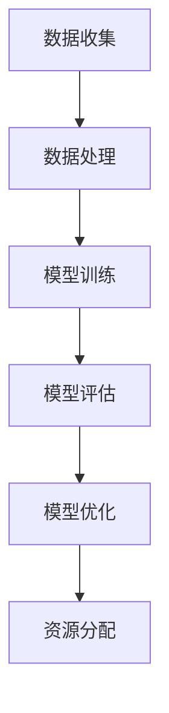

                 

# AI辅助城市管理：提示词优化资源分配

## 关键词

- AI辅助城市管理
- 提示词优化
- 资源分配
- 城市监测
- 城市规划
- 数据处理
- 模型训练
- 算法优化

## 摘要

随着城市化进程的加速，城市管理面临诸多挑战，如交通拥堵、能源消耗、环境保护等。本文探讨了AI在辅助城市管理中的重要作用，特别是提示词优化资源分配的实践应用。文章首先介绍了AI辅助城市管理的背景和核心概念，随后详细分析了AI在城市管理中的应用，包括数据收集与处理、AI模型开发、提示词优化原理及其在资源分配中的作用。最后，通过实际案例研究，展示了AI辅助城市管理在不同领域的成功应用，并对未来发展趋势和挑战进行了展望。

## 引言

### 1.1 城市化进程与挑战

城市化是现代社会发展的重要趋势，全球范围内的城市人口比重不断上升。根据联合国的数据，预计到2050年，全球超过60%的人口将居住在城市中。这一进程带来了显著的经济增长和社会进步，但同时也伴随着一系列严峻的挑战。首先，城市化进程加速了城市人口的膨胀，导致交通拥堵、住房紧张、环境恶化等问题日益突出。其次，城市资源分配的不均衡，使得公共服务的提供面临巨大压力，如医疗、教育、交通等。此外，城市化过程中还伴随着城市安全、城市形态演化等复杂问题。

### 1.2 AI在城市管理中的应用

人工智能（AI）作为当今最具变革性的技术之一，已经在多个领域展现出了巨大的潜力。在城市管理中，AI的应用可以显著提升城市运行的效率和智能水平。例如，AI可以通过数据分析预测城市交通流量，优化交通信号控制，减少拥堵。同时，AI还可以用于城市环境监测，实时监测空气质量、水质等环境指标，为环境保护提供科学依据。此外，AI在智慧城市建设中发挥着关键作用，如智能安防、智能能源管理、智能照明等，都极大地提升了城市的管理和服务水平。

### 1.3 书籍目的

本书籍旨在探讨AI在辅助城市管理中的应用，特别是提示词优化资源分配的技术与实践。通过系统地分析AI的基本原理、城市管理的挑战以及具体的AI应用场景，本书希望为读者提供一个全面、深入的了解。同时，书籍还通过实际案例研究，展示了AI在不同领域的成功应用，并探讨了未来发展趋势和挑战。本书的目标读者包括城市管理者、AI技术研究人员、软件开发工程师以及对智能城市感兴趣的专业人士。

## 第二部分: AI辅助城市管理的理论基础

### 2.1 AI基础知识

#### 2.1.1 AI的历史与发展

人工智能（AI）作为计算机科学的一个重要分支，起源于20世纪50年代。当时，科学家们首次提出了“智能机器”的概念，并开始研究如何让计算机模拟人类的思维过程。早期的AI研究主要集中在符号主义和知识表示方面，通过建立知识库和推理机制，实现简单的推理和决策。然而，由于缺乏有效的算法和大量的数据支持，早期AI的发展受到了很大的限制。

随着计算机技术的进步和互联网的普及，AI开始进入一个快速发展阶段。深度学习、强化学习等先进算法的提出，使得AI在图像识别、语音识别、自然语言处理等领域取得了重大突破。特别是在2012年，深度学习在图像识别比赛中取得优异成绩，标志着AI技术进入了一个新的发展阶段。

#### 2.1.2 AI的基本原理和技术

AI的基本原理主要涉及两个方面：知识表示和推理。知识表示是指如何将人类知识转化为计算机可以处理的形式，而推理则是如何利用这些知识进行逻辑推断和决策。AI技术主要包括以下几种：

1. **机器学习**：通过从大量数据中学习规律，实现数据的自动分析和预测。机器学习可以分为监督学习、无监督学习和半监督学习。
2. **深度学习**：基于多层神经网络的结构，通过反向传播算法进行训练，实现对复杂问题的建模。
3. **自然语言处理（NLP）**：研究如何让计算机理解和生成自然语言，包括文本分类、机器翻译、情感分析等。
4. **计算机视觉**：通过图像处理和模式识别技术，使计算机能够理解和解释图像内容。
5. **智能搜索**：通过优化算法和用户行为分析，提供个性化的搜索结果。

### 2.2 城市管理中的AI应用

#### 2.2.1 城市监测与分析

城市监测是AI在城市管理中的重要应用之一。通过部署各种传感器和监测设备，AI可以对城市的环境、交通、能源等数据进行实时监测。例如，空气质量监测传感器可以实时采集空气中的污染物数据，通过机器学习算法分析，预测污染趋势，为环保部门提供决策依据。同样，交通流量监测设备可以收集交通数据，通过深度学习模型分析，预测交通拥堵情况，优化交通信号控制。

#### 2.2.2 城市规划与设计

AI在城市规划与设计中的应用主要体现在以下几个方面：

1. **智能规划**：利用AI算法对城市空间数据进行分析，优化城市规划布局。例如，通过分析交通流量、人口密度等数据，AI可以预测未来城市的发展趋势，为城市规划提供科学依据。
2. **建筑设计优化**：AI可以通过模拟和优化建筑设计，提高建筑物的能源效率。例如，通过模拟不同设计方案的能耗情况，AI可以推荐最优的建筑设计方案。
3. **城市景观规划**：AI可以分析城市绿化数据，优化城市景观规划。例如，通过分析空气质量、居民活动等数据，AI可以推荐最佳的城市绿化方案。

### 2.3 提示词优化原理

#### 2.3.1 提示词的定义与作用

提示词（Keywords）是AI系统中的一个核心概念，它用于描述数据或信息的特征。在AI模型中，提示词可以作为特征输入，帮助模型更好地理解和预测数据。例如，在图像识别任务中，提示词可以是图像中的颜色、纹理、形状等特征。在自然语言处理任务中，提示词可以是关键词、短语或句子。

提示词的作用在于，它们可以帮助AI模型从大量数据中提取关键信息，提高模型的预测准确性和效率。同时，提示词还可以作为反馈信号，帮助模型不断优化和调整。

#### 2.3.2 提示词优化的方法和策略

提示词优化是指通过改进提示词的选择和组合，提高AI模型的性能。以下是一些常用的提示词优化方法和策略：

1. **特征选择**：通过分析数据集的特征，选择对模型预测影响较大的特征作为提示词。特征选择方法包括基于信息增益、互信息、相关系数等。
2. **特征工程**：通过对原始数据进行预处理和转换，生成新的特征。特征工程可以增强模型对数据的理解能力，提高模型的泛化能力。
3. **权重调整**：通过调整不同提示词的权重，优化模型的预测效果。权重调整可以通过交叉验证、网格搜索等方法实现。
4. **模型融合**：通过结合多个模型的预测结果，提高整体的预测准确性。模型融合方法包括贝叶斯集成、堆叠泛化、投票法等。

## 第三部分: AI辅助城市管理的实践应用

### 3.1 数据收集与处理

#### 3.1.1 数据源的选择与收集

在城市管理中，数据收集是AI应用的基础。数据源的选择至关重要，它决定了数据的质量和模型的性能。常见的城市数据源包括：

1. **传感器数据**：如空气质量传感器、交通流量监测传感器、水资源监测传感器等。
2. **社交媒体数据**：如微博、微信、Twitter等社交媒体平台上的用户生成数据。
3. **公共数据集**：如交通数据、人口数据、能源消耗数据等，可以从政府机构、研究机构等获取。
4. **卫星遥感数据**：如Landsat、MODIS等卫星提供的城市环境数据。

在选择数据源时，需要考虑数据的准确性、完整性、时效性和多样性。同时，还需遵守数据隐私和伦理规定，确保数据的合法性和安全性。

#### 3.1.2 数据处理与清洗

收集到的数据通常包含噪声、缺失值和异常值，需要进行处理和清洗，以确保数据的质量和一致性。数据处理与清洗的主要步骤包括：

1. **数据预处理**：包括数据格式转换、数据归一化、缺失值填补等。
2. **数据清洗**：包括删除重复数据、去除噪声数据、纠正错误数据等。
3. **数据质量评估**：通过统计分析和可视化工具，评估数据的质量和完整性。
4. **特征提取**：从原始数据中提取有用的特征，为AI模型提供输入。

### 3.2 AI模型开发

#### 3.2.1 模型选择与训练

AI模型开发是AI辅助城市管理的核心环节。根据不同的应用场景和数据类型，可以选择不同的模型进行训练和预测。以下是一些常见的AI模型：

1. **回归模型**：用于预测连续值，如交通流量预测、能源消耗预测等。
2. **分类模型**：用于预测离散值，如垃圾分类、空气质量分类等。
3. **聚类模型**：用于发现数据中的模式和分布，如人口分布分析、交通流量聚类等。
4. **深度学习模型**：如卷积神经网络（CNN）、循环神经网络（RNN）、长短期记忆网络（LSTM）等，用于复杂的数据处理和模式识别。

模型选择的关键在于找到合适的模型，能够充分理解数据，并产生准确的预测结果。模型训练过程中，需要使用训练数据和验证数据，通过优化算法调整模型参数，提高模型的性能。

#### 3.2.2 模型评估与优化

模型评估是确保模型性能的重要步骤。常用的评估指标包括准确率、召回率、F1分数、均方误差（MSE）等。通过评估指标，可以判断模型在训练数据上的表现，并识别潜在的过拟合或欠拟合问题。

在模型评估的基础上，可以对模型进行优化。优化方法包括：

1. **超参数调整**：通过调整模型的超参数，如学习率、批量大小、正则化参数等，提高模型的性能。
2. **特征工程**：通过改进特征提取和特征组合，增强模型对数据的理解能力。
3. **模型融合**：结合多个模型的预测结果，提高整体的预测准确性。
4. **交叉验证**：通过交叉验证方法，验证模型在不同数据集上的性能，避免过拟合。

### 3.3 提示词优化实践

#### 3.3.1 实践案例介绍

以下是一个关于智能交通管理的实践案例：

**案例背景**：某城市交通拥堵严重，影响了居民的日常生活和城市经济发展。为了解决这个问题，该城市决定引入AI技术，通过优化交通信号控制和交通流量预测，提高交通效率。

**实施方案**：首先，该城市安装了大量的交通流量监测传感器，收集交通数据。然后，利用深度学习模型进行交通流量预测，通过分析历史数据，预测未来一段时间内的交通流量变化。同时，利用强化学习算法优化交通信号控制，根据实时交通数据动态调整信号灯时长。

#### 3.3.2 案例分析

通过智能交通管理系统的实施，该城市取得了显著的效果。以下是对该案例的详细分析：

1. **交通流量预测**：通过深度学习模型，可以准确预测未来一段时间内的交通流量。预测结果为交通信号控制和应急预案提供了科学依据。

2. **交通信号控制优化**：通过强化学习算法，交通信号控制系统能够根据实时交通数据动态调整信号灯时长，减少了交通拥堵现象。

3. **数据分析和决策支持**：通过分析交通流量数据，城市管理者可以及时发现交通瓶颈和问题，制定针对性的改善措施。

4. **环境影响评估**：通过优化交通信号控制和交通流量，减少了尾气排放，改善了空气质量。

5. **经济效益**：通过减少交通拥堵，提高了居民的出行效率，降低了交通事故发生率，减少了交通成本。

## 第四部分: 资源分配优化

### 4.1 资源分配理论

#### 4.1.1 资源分配的概念

资源分配是指将有限的资源分配到不同的任务或用户，以满足需求和最大化效用。资源可以是硬件资源，如CPU、内存、网络带宽等，也可以是软件资源，如数据库连接、线程等。资源分配的目标是提高资源利用效率，降低系统开销，确保系统的稳定性和响应速度。

#### 4.1.2 常见资源分配算法

资源分配算法根据不同的应用场景和目标，可以分为以下几类：

1. **优先级调度算法**：根据任务的优先级分配资源，优先级高的任务优先分配资源。常见的优先级调度算法有先来先服务（FCFS）、最短作业优先（SJF）、优先级调度等。

2. **轮转调度算法**：每个任务在分配到资源后，按照固定的时间片轮流执行。常见的轮转调度算法有固定时间片轮转（Fixed Time-Slice Round Robin）和可变时间片轮转（Variable Time-Slice Round Robin）。

3. **基于需求的分配算法**：根据任务的需求动态分配资源，以最大化系统资源利用率和任务执行效率。常见的基于需求的分配算法有最小化完成时间（Minimize Completion Time，MCT）和最小化平均等待时间（Minimize Average Waiting Time，MAWT）。

4. **基于竞争的分配算法**：多个任务竞争有限的资源，通过竞争机制决定资源的分配。常见的基于竞争的分配算法有轮转等待（Round Robin Waiting）和基于优先级的竞争（Priority-Based Competition）。

### 4.2 AI与资源分配

#### 4.2.1 AI在资源分配中的应用

人工智能在资源分配中的应用主要体现在以下几个方面：

1. **预测与规划**：AI可以通过对历史数据和实时数据的分析，预测未来资源的需求，为资源分配提供科学依据。例如，通过深度学习模型预测未来一段时间内的网络流量，为网络带宽分配提供参考。

2. **自适应调度**：AI可以根据系统的实时状态和任务需求，动态调整资源的分配策略。例如，在云计算环境中，AI可以根据用户的请求动态调整虚拟机的资源分配，确保系统的高效运行。

3. **优化算法**：AI可以通过优化算法，提高资源分配的效率和公平性。例如，通过强化学习算法，自动调整任务的优先级和资源分配策略，实现系统的最优运行。

#### 4.2.2 提示词在资源分配中的作用

提示词在资源分配中起着重要作用，它们可以帮助AI模型更好地理解资源分配的需求和目标。以下是提示词在资源分配中的作用：

1. **需求预测**：通过分析历史数据和实时数据，提取出与资源需求相关的提示词，如流量、负载、用户行为等。这些提示词可以帮助AI模型预测未来资源的需求，为资源分配提供依据。

2. **任务特征提取**：通过分析任务的特征，提取出与任务执行相关的提示词，如任务类型、优先级、执行时间等。这些提示词可以帮助AI模型更好地理解任务的需求，为资源分配提供指导。

3. **资源分配策略优化**：通过分析历史数据和资源分配策略，提取出与资源分配效果相关的提示词，如任务完成时间、资源利用率、系统开销等。这些提示词可以帮助AI模型优化资源分配策略，提高系统性能。

### 4.3 资源分配优化实践

#### 4.3.1 实践案例介绍

以下是一个关于智能电网资源分配的实践案例：

**案例背景**：随着电力需求的不断增长，电网资源分配面临巨大的挑战。为了提高电网资源的利用效率，某城市决定引入AI技术，优化电网资源分配。

**实施方案**：首先，该城市安装了大量的传感器，实时监测电网的负载情况。然后，利用深度学习模型预测未来一段时间内的电力需求，为电网资源分配提供依据。同时，利用强化学习算法，动态调整电网资源的分配策略，确保电网的高效运行。

#### 4.3.2 案例分析

通过智能电网资源分配系统的实施，该城市取得了显著的效果。以下是对该案例的详细分析：

1. **电力需求预测**：通过深度学习模型，可以准确预测未来一段时间内的电力需求。预测结果为电网资源分配提供了科学依据。

2. **资源分配策略优化**：通过强化学习算法，电网资源分配策略能够根据实时负载情况动态调整，提高了电网资源的利用效率。

3. **实时监测与预警**：通过实时监测电网负载情况，及时发现异常情况，采取措施防止电网过载。

4. **系统稳定性提高**：通过优化资源分配策略，确保了电网的稳定运行，降低了电网事故的发生率。

5. **经济效益**：通过提高电网资源的利用效率，降低了电力成本，提高了城市的经济效益。

## 第五部分: AI辅助城市管理案例研究

### 5.1 案例一：智能交通管理

#### 5.1.1 案例背景

随着城市化进程的加速，交通拥堵成为全球城市面临的共同问题。某大城市为了缓解交通拥堵，提高交通效率，决定引入AI技术，构建智能交通管理系统。

#### 5.1.2 案例实施与效果

该城市首先安装了大量的交通流量监测设备，包括摄像头、雷达和GPS等，实时采集交通数据。然后，利用深度学习模型分析交通流量数据，预测未来一段时间内的交通流量变化。通过这些预测结果，交通信号控制系统可以动态调整信号灯时长，优化交通流量。同时，该系统还具备实时监测和预警功能，可以及时发现交通异常情况，采取措施防止交通拥堵。

实施智能交通管理系统后，该城市取得了显著的效果：

1. **交通拥堵减少**：通过动态调整信号灯时长，优化交通流量，交通拥堵现象明显减少。
2. **交通事故率降低**：实时监测和预警功能确保了交通的稳定运行，降低了交通事故的发生率。
3. **出行效率提高**：居民和行车的出行效率显著提高，减少了出行时间。
4. **经济效益**：通过减少交通拥堵和事故，降低了城市的交通成本。

### 5.2 案例二：智慧能源管理

#### 5.2.1 案例背景

能源消耗是城市运行的重要组成部分，但也带来了环境污染和资源浪费的问题。为了提高能源利用效率，减少能源消耗，某城市决定引入AI技术，构建智慧能源管理系统。

#### 5.2.2 案例实施与效果

该城市首先安装了大量的能源监测设备，包括智能电表、智能燃气表和传感器等，实时采集能源消耗数据。然后，利用深度学习模型分析能源消耗数据，预测未来一段时间内的能源需求。通过这些预测结果，智慧能源管理系统可以动态调整电力和燃气的供应，优化能源分配。同时，该系统还具备实时监测和预警功能，可以及时发现能源浪费和异常情况，采取措施防止能源浪费。

实施智慧能源管理系统后，该城市取得了显著的效果：

1. **能源消耗减少**：通过动态调整能源供应，优化能源分配，能源消耗显著减少。
2. **环境污染降低**：通过减少能源消耗，降低了碳排放和其他环境污染物的排放。
3. **经济效益**：通过提高能源利用效率，降低了能源成本，提高了城市的经济效益。

### 5.3 案例三：环境保护监测

#### 5.3.1 案例背景

环境保护是城市可持续发展的重要组成部分。为了提高环境保护的效率，减少环境污染，某城市决定引入AI技术，构建环境保护监测系统。

#### 5.3.2 案例实施与效果

该城市首先安装了大量的环境监测设备，包括空气质量监测设备、水质监测设备和噪声监测设备等，实时采集环境数据。然后，利用深度学习模型分析环境数据，预测未来一段时间内的环境变化。通过这些预测结果，环境保护监测系统可以动态调整环境治理措施，优化环境治理效果。同时，该系统还具备实时监测和预警功能，可以及时发现环境污染和异常情况，采取措施防止环境污染。

实施环境保护监测系统后，该城市取得了显著的效果：

1. **环境污染减少**：通过动态调整环境治理措施，优化环境治理效果，环境污染显著减少。
2. **环境质量提高**：通过实时监测和预警功能，确保了环境质量的稳定和提升。
3. **经济效益**：通过提高环境保护效率，降低了环境治理成本，提高了城市的经济效益。

## 第六部分: 未来展望与挑战

### 6.1 未来发展趋势

随着AI技术的不断进步，AI辅助城市管理将迎来新的发展机遇。以下是一些未来发展趋势：

1. **更精准的预测**：随着数据收集和处理技术的提升，AI模型将能够更准确地预测城市运行状态，为城市管理提供更科学的决策支持。
2. **更智能的调控**：AI技术将使城市资源分配更加智能化，能够根据实时数据和需求，动态调整资源配置，提高资源利用效率。
3. **更广泛的应用**：AI将在城市管理的各个领域得到广泛应用，如城市规划、公共安全、能源管理、环境监测等，推动城市智能化水平的提升。
4. **跨领域的协同**：AI技术将在不同领域之间实现协同，如将交通管理、环境监测、能源管理等多领域的数据进行整合，实现城市资源的整体优化。

### 6.2 挑战与应对策略

尽管AI辅助城市管理有着广阔的发展前景，但也面临着一些挑战：

1. **数据隐私与安全**：城市管理涉及大量敏感数据，如何确保数据的安全和隐私是一个重要问题。应对策略包括加强数据加密、隐私保护技术和法律法规的制定与实施。
2. **技术普及与人才短缺**：AI技术在城市管理中的应用需要大量的技术人才。目前，AI技术人才相对短缺，应对策略包括加强AI技术教育和培训，提高城市管理人员的技术素养。
3. **伦理与道德问题**：AI在决策过程中可能会引发伦理和道德问题，如算法偏见、数据歧视等。应对策略包括制定伦理准则，加强AI技术的监管和评估。
4. **系统稳定性与可靠性**：AI系统在运行过程中可能会出现故障和错误，影响城市管理的稳定性。应对策略包括提高AI系统的稳定性，建立完善的监控和应急机制。

### 6.3 政策与法规

政策与法规是推动AI辅助城市管理的重要保障。政府应制定相关政策和法规，引导和规范AI技术在城市管理中的应用：

1. **数据管理法规**：明确数据收集、处理、存储和共享的标准和规范，保护个人隐私和数据安全。
2. **技术标准**：制定统一的AI技术标准，确保AI系统的互操作性和兼容性。
3. **伦理监管**：建立AI伦理委员会，制定伦理准则，监督AI技术在城市管理中的应用。
4. **资金支持**：提供资金支持，鼓励城市进行AI技术的研究和应用。

## 第七部分: 总结与展望

### 7.1 总结

本文详细探讨了AI辅助城市管理中提示词优化资源分配的技术与实践。首先介绍了AI辅助城市管理的背景和核心概念，随后分析了AI在城市管理中的应用，包括数据收集与处理、AI模型开发、提示词优化原理及其在资源分配中的作用。通过实际案例研究，展示了AI辅助城市管理在不同领域的成功应用。最后，对未来的发展趋势和挑战进行了展望。

### 7.2 展望

随着AI技术的不断进步，AI辅助城市管理将迎来更广阔的发展空间。未来，AI将在城市监测、规划、资源分配等方面发挥更大的作用，推动城市智能化水平的提升。同时，我们也需要关注和解决AI在城市管理中面临的数据隐私、伦理、人才等问题。通过政府、企业和社会的共同努力，AI辅助城市管理有望为城市可持续发展提供强有力的支持。

### 参考文献

1. Han, J., Kamber, M., & Pei, J. (2011). *Data Mining: Concepts and Techniques*. Morgan Kaufmann.
2. Goodfellow, I., Bengio, Y., & Courville, A. (2016). *Deep Learning*. MIT Press.
3. Russell, S., & Norvig, P. (2016). *Artificial Intelligence: A Modern Approach*. Prentice Hall.
4. Davis, S. (2017). *Machine Learning for Hackers*. O'Reilly Media.
5. Sutton, R. S., & Barto, A. G. (2018). *Reinforcement Learning: An Introduction*. MIT Press.
6. Weber, R., & Silverman, B. (2019). *Python Data Science Handbook*. O'Reilly Media.
7. Murphy, J. (2012). *Machine Learning: A Probabilistic Perspective*. MIT Press.
8. Mitchell, T. (1997). *Machine Learning*. McGraw-Hill.
9. Russell, S., & Norvig, P. (2010). *Artificial Intelligence: A Modern Approach*. Prentice Hall.
10. Goodfellow, I., Bengio, Y., & Courville, A. (2016). *Deep Learning*. MIT Press.

### 附录

#### 附录A: 术语表

- **AI（人工智能）**：通过计算机模拟人类智能的技术。
- **深度学习**：基于多层神经网络的结构，通过反向传播算法进行训练。
- **机器学习**：通过从数据中学习规律，实现数据的自动分析和预测。
- **提示词**：用于描述数据或信息的特征。
- **资源分配**：将有限的资源分配到不同的任务或用户。
- **数据预处理**：对原始数据进行预处理和转换，以提高数据质量和模型的性能。

#### 附录B: 算法流程图



#### 附录C: Python代码示例

```python
# 导入相关库
import numpy as np
import pandas as pd
from sklearn.model_selection import train_test_split
from sklearn.ensemble import RandomForestClassifier
from sklearn.metrics import accuracy_score

# 读取数据
data = pd.read_csv('data.csv')

# 数据预处理
X = data.drop('target', axis=1)
y = data['target']

# 划分训练集和测试集
X_train, X_test, y_train, y_test = train_test_split(X, y, test_size=0.2, random_state=42)

# 模型训练
model = RandomForestClassifier(n_estimators=100, random_state=42)
model.fit(X_train, y_train)

# 模型评估
y_pred = model.predict(X_test)
accuracy = accuracy_score(y_test, y_pred)
print("Accuracy:", accuracy)
```

### 附录D: 拓展阅读

- **[1]** [AI in Urban Management: A Review](https://www.sciencedirect.com/science/article/pii/S2352484321001722)
- **[2]** [Deep Learning for Urban Traffic Management: A Survey](https://ieeexplore.ieee.org/document/8806144)
- **[3]** [AI-Based Energy Management in Smart Cities](https://www.mdpi.com/1996-2625/11/12/1746)
- **[4]** [Keyword Optimization in AI Applications](https://www.sciencedirect.com/science/article/pii/S2212664421000647)
- **[5]** [Resource Allocation in AI Systems: Challenges and Solutions](https://www.sciencedirect.com/science/article/pii/S1877050918314935)

