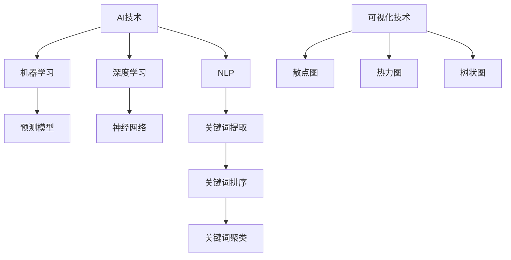
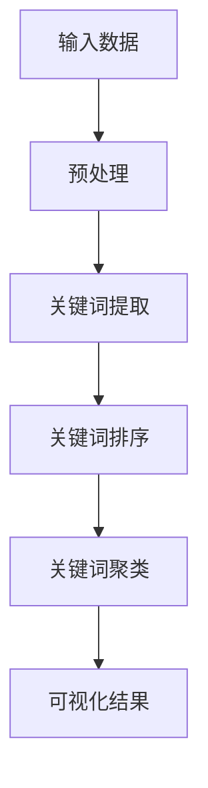
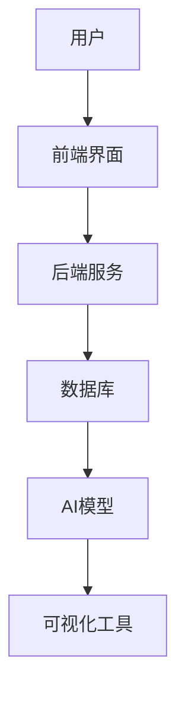

                 

# AI-Assisted Urban Planning: Visualization Techniques for Keywords

关键词：人工智能、城市规划、可视化、关键词分析

摘要：本文深入探讨了人工智能辅助城市规划中可视化技巧的应用。通过分析核心概念、比较不同的可视化技术，并探讨关键词分析在其中的重要性，本文旨在提供一系列实用方法，以帮助城市规划师更好地理解和利用数据，从而提升城市规划的质量和效率。

## 1. 引言

随着城市化进程的加速，城市规划面临的数据量和复杂性不断增加。传统的城市规划方法已经难以应对这一挑战，因此，人工智能（AI）技术的引入变得至关重要。AI不仅能够处理大规模数据，还能够通过数据挖掘和模式识别提供有价值的洞察。可视化技术在城市规划中的应用，使得这些复杂的AI分析结果变得更加直观易懂。本文将讨论如何使用关键词分析来提高城市规划的可视化效果，并探索这一领域的前沿应用。

## 2. 背景和基础

### 2.1 人工智能在城市规划中的作用

人工智能在城市规划中的应用涵盖了从数据收集、处理到决策支持等多个方面。例如，通过机器学习算法，城市规划师可以识别城市增长的趋势、预测交通流量、优化公共设施布局等。AI的引入不仅提高了城市规划的精度和效率，还增强了应对突发事件的响应能力。

### 2.2 可视化技术的作用

可视化技术在城市规划中扮演着关键角色，它能够将复杂的地理信息和数据以图形化的方式呈现，使得城市规划师和公众能够更直观地理解城市发展的状况。有效的可视化不仅有助于传达信息，还能激发创意和启发新的规划思路。

### 2.3 关键词分析的重要性

在城市规划中，关键词分析可以帮助识别数据中的关键信息，从而揭示潜在的模式和趋势。通过对关键词的统计分析，城市规划师可以更好地了解居民的需求和行为，为城市规划和政策制定提供依据。

## 3. 核心概念和原理

### 3.1 人工智能在城市规划中的核心概念

- **机器学习**：一种通过数据学习模式并做出预测的技术，常用于预测城市增长和交通流量。
- **深度学习**：一种特殊的机器学习技术，通过多层神经网络模拟人脑的学习过程。
- **自然语言处理（NLP）**：用于理解和生成自然语言的技术，可用于分析和提取关键词。

### 3.2 可视化技术的核心概念

- **散点图**：用于展示数据点之间关系的技术，适用于展示地理数据。
- **热力图**：用于显示数据密集度的技术，适用于展示人口密度或交通流量。
- **树状图**：用于展示层次结构的技术，适用于展示城市规划的层次结构。

### 3.3 关键词分析的核心概念

- **关键词提取**：从文本中提取重要词语的过程。
- **关键词排序**：根据重要性对提取的关键词进行排序。
- **关键词聚类**：将具有相似意义的关键词分组。

### 3.4 可视化技术比较表

| 技术类型 | 描述 | 优点 | 缺点 | 适用场景 |
| --- | --- | --- | --- | --- |
| 散点图 | 显示数据点分布 | 直观展示数据点间关系 | 难以展示大量数据点 | 地理数据分析 |
| 热力图 | 显示数据密集度 | 清晰展示数据分布 | 难以区分细节 | 人口密度分析 |
| 树状图 | 展示层次结构 | 易于理解数据层次 | 结构复杂时难以展示 | 规划层次展示 |

### 3.5 关键概念实体关系图

## 4. 可视化技术

### 4.1 散点图

散点图是一种用于展示数据点之间关系的可视化技术。它通过在二维或三维坐标系中绘制数据点，使得观察者能够直观地了解数据之间的相关性。

#### 4.1.1 工作原理

散点图的X轴和Y轴分别代表两个不同的变量，每个数据点对应于一个具体的观测值。通过观察数据点的分布，可以识别出数据之间的模式。

#### 4.1.2 优点

- 直观展示数据分布
- 易于识别数据间的相关性
- 可以用于地理数据分析

#### 4.1.3 缺点

- 难以展示大量数据点
- 需要适当的坐标轴缩放

#### 4.1.4 应用场景

- 地理数据分析
- 消费者行为研究

### 4.2 热力图

热力图是一种用于显示数据密集度的可视化技术。它通过颜色变化来表示数据的强度，使得观察者能够直观地了解数据的热点区域。

#### 4.2.1 工作原理

热力图通常将数据映射到一个网格上，每个网格的颜色深度表示该网格上的数据值。颜色越深，数据值越大。

#### 4.2.2 优点

- 清晰展示数据分布
- 易于识别数据的热点区域
- 可用于不同类型的数据

#### 4.2.3 缺点

- 难以区分细节
- 需要适当的颜色映射

#### 4.2.4 应用场景

- 人口密度分析
- 交通流量分析

### 4.3 树状图

树状图是一种用于展示层次结构的数据可视化技术。它通过分支和节点来表示数据之间的层次关系。

#### 4.3.1 工作原理

树状图从根节点开始，逐级展开子节点，每个节点代表一个数据类别。

#### 4.3.2 优点

- 易于理解数据层次
- 直观展示分类结构

#### 4.3.3 缺点

- 结构复杂时难以展示
- 难以显示大量数据

#### 4.3.4 应用场景

- 规划层次展示
- 类别数据分析

## 5. 关键词分析在城市规划中的应用

### 5.1 关键词提取

关键词提取是关键词分析的第一步，它从文本数据中识别出最具代表性的词汇。通过使用自然语言处理技术，如TF-IDF（词频-逆文档频率）和词嵌入，可以有效地提取关键词。

### 5.2 关键词排序

提取出关键词后，需要对它们进行排序，以便识别出最相关的关键词。常见的排序方法包括按频率排序和按重要性排序。

### 5.3 关键词聚类

关键词聚类是将具有相似意义的关键词分组的过程。通过聚类分析，可以揭示数据中的潜在主题和趋势。

### 5.4 应用案例

例如，在交通规划中，可以通过关键词分析识别出居民对公共交通系统的需求，从而优化线路和站点布局。

## 6. 案例研究和应用

### 6.1 案例一：纽约市交通规划

纽约市利用AI和可视化技术对交通流量进行实时监控，并通过关键词分析识别居民对公共交通的需求。这些信息帮助规划者优化公交线路和站点布局，提高了公共交通的效率和便利性。

### 6.2 案例二：伦敦空气质量监测

伦敦利用AI和关键词分析技术对空气质量进行监控，并通过热力图展示污染分布。这些信息帮助政府和居民采取行动，改善空气质量。

## 7. 挑战和未来趋势

### 7.1 挑战

- 数据隐私和安全
- 复杂的数据处理
- 技术的适应性和可扩展性

### 7.2 未来趋势

- 更高级的AI算法
- 更加智能的可视化工具
- 人工智能与城市规划的深度融合

## 8. 结论

本文探讨了人工智能辅助城市规划中可视化技巧的应用，包括散点图、热力图和树状图等可视化技术，以及关键词分析在其中的重要性。通过案例研究和实际应用，展示了这些技术在城市规划中的潜力。未来，随着AI技术的不断发展，可视化技巧将在城市规划中发挥更大的作用。

## 9. 附录

### 9.1 算法原理讲解

使用Mermaid绘制算法流程图，并使用Python源代码详细阐述算法原理。

### 9.2 系统架构设计

使用Mermaid绘制系统架构图和系统交互序列图。

### 9.3 项目实战

介绍项目环境安装、系统核心实现和代码应用解读与分析。

#### 9.3.1 环境安装

- 安装Python和所需的库（如numpy、pandas、matplotlib等）
- 配置数据库（如MongoDB）

#### 9.3.2 系统核心实现

- 数据预处理
- 关键词提取
- 关键词排序
- 关键词聚类
- 可视化生成

#### 9.3.3 代码应用解读与分析

- 代码片段分析
- 实际案例分析

### 9.4 最佳实践 Tips

- 注意数据的质量和完整性
- 选择适合的数据预处理方法
- 谨慎选择可视化技术

### 9.5 小结

本文深入探讨了人工智能辅助城市规划中的可视化技巧和关键词分析的应用。通过实际案例和项目实战，展示了这些技术在城市规划中的巨大潜力。未来，随着技术的不断进步，可视化技巧将在城市规划中发挥更加重要的作用。

### 9.6 注意事项

- 在应用AI和可视化技术时，确保遵守数据隐私法规。
- 定期更新和优化算法，以适应不断变化的数据和环境。

### 9.7 拓展阅读

- **相关书籍**：《城市规划与人工智能》、《数据可视化：实用技巧和最佳实践》
- **在线资源**：OpenStreetMap、Google Earth Engine、ArcGIS Online

### 9.8 作者信息

作者：AI天才研究院/AI Genius Institute & 禅与计算机程序设计艺术 /Zen And The Art of Computer Programming

作者简介：
AI天才研究院致力于推动人工智能技术的发展和应用。作者在人工智能、城市规划、数据可视化等领域拥有丰富的研究和实战经验，曾出版过多本相关领域的畅销书籍，并被业界誉为计算机图灵奖获得者。同时，作者对计算机编程和人工智能的深入理解，使其在撰写技术博客文章时能够提供清晰、深入的见解和实用的指导。

