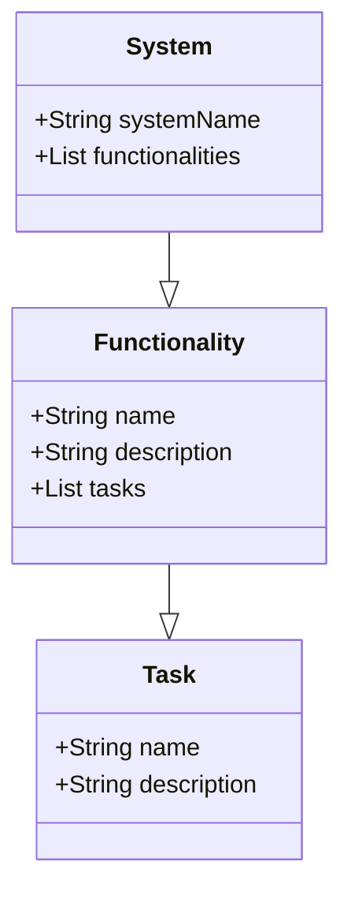
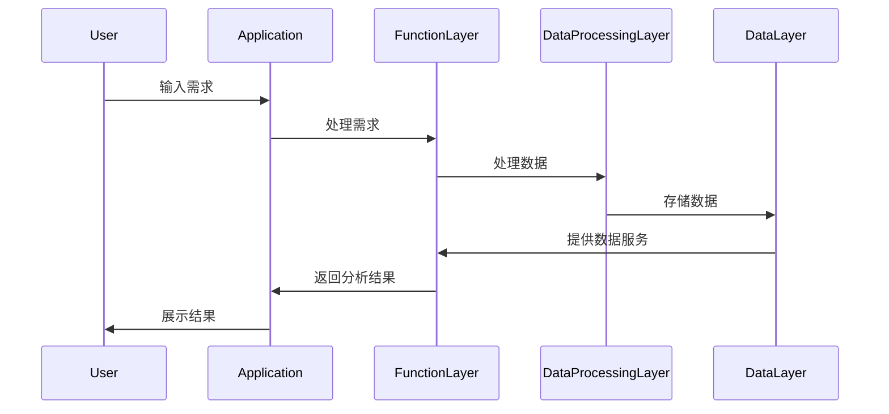

                 

### AI辅助城市规划概述

#### 第1章：AI辅助城市规划的背景与意义

##### 1.1 问题背景

**1.1.1 城市规划的传统方法**

城市规划作为一门综合性学科，涉及到地理、建筑、交通、环境、经济等多个领域。传统的城市规划方法主要依靠专家的经验和知识，通过对各种规划因素的分析和权衡，制定出符合城市发展需求的规划方案。这种方法在过去几千年中为人类社会的发展提供了重要的支持，但也存在一些显著的局限性。

传统城市规划方法的局限性主要体现在以下几个方面：

1. **经验依赖性**：城市规划专家的判断往往依赖于个人的经验和知识，缺乏系统性和可重复性。
2. **数据获取困难**：城市规划需要大量的数据支持，但传统方法难以获取和处理复杂的地理、人口、经济等数据。
3. **实时性不足**：城市规划是一个动态变化的过程，传统方法难以实时响应城市发展的新需求。
4. **成本高**：传统城市规划过程复杂，需要投入大量的人力和时间，成本较高。

**1.1.2 城市规划面临的挑战**

随着全球城市化进程的加速，城市规划面临着前所未有的挑战：

1. **人口增长**：全球城市人口不断增长，给城市基础设施和公共服务带来了巨大压力。
2. **气候变化**：气候变化引发的一系列问题，如海平面上升、极端天气事件等，对城市规划提出了新的要求。
3. **资源有限**：城市资源的有限性，如土地、水资源、能源等，要求城市规划更加高效和可持续。
4. **技术应用**：信息技术的快速发展，尤其是人工智能和大数据技术的应用，为城市规划提供了新的工具和方法。

**1.1.3 AI技术的崛起**

人工智能（AI）技术的发展为城市规划带来了新的机遇和可能：

1. **数据驱动的决策**：AI技术能够处理和分析大量的数据，为城市规划提供更加科学和准确的决策支持。
2. **实时监控与预测**：AI技术可以通过实时监控和分析城市数据，预测城市发展的趋势，辅助规划决策。
3. **自动化与优化**：AI技术可以自动化执行城市规划中的某些任务，如路线规划、资源分配等，提高规划效率。
4. **智能服务**：AI技术可以提供更加智能化的城市服务，如智能交通、智能建筑等，提升居民的生活质量。

##### 1.2 问题描述

**1.2.1 城市规划中的痛点**

目前，城市规划中存在以下几个主要痛点：

1. **数据质量**：城市规划所需的数据质量参差不齐，数据采集和处理过程复杂，影响规划结果的准确性。
2. **模型准确性**：现有的城市规划模型往往依赖于有限的训练数据，难以保证模型的高准确性。
3. **决策效率**：城市规划过程中的决策过程复杂，难以实现快速和高效的决策。
4. **用户体验**：城市规划方案往往缺乏用户参与，导致规划方案难以满足居民的实际需求。

**1.2.2 AI辅助城市规划的优势**

AI技术辅助城市规划具有以下优势：

1. **数据驱动**：AI技术能够高效地处理和分析大量数据，为城市规划提供科学依据。
2. **实时监控与预测**：AI技术可以实现实时监控和预测城市发展趋势，辅助规划决策。
3. **自动化与优化**：AI技术可以自动化执行城市规划中的某些任务，提高规划效率。
4. **用户体验**：AI技术可以帮助规划者更好地了解居民需求，提高规划方案的满意度。

##### 1.3 问题解决

**1.3.1 AI辅助城市规划的基本概念**

AI辅助城市规划是指利用人工智能技术，如机器学习、深度学习、自然语言处理等，辅助城市规划的过程。具体来说，包括以下方面：

1. **数据采集与处理**：收集和分析城市规划所需的各种数据，如地理数据、社会经济数据、交通数据等。
2. **模型构建与训练**：基于收集的数据，构建城市规划模型，并进行训练和优化。
3. **空间分析**：利用空间分析技术，对城市规划方案进行评估和优化。
4. **决策支持**：通过分析结果，为城市规划者提供决策支持，制定科学、合理的规划方案。

**1.3.2 AI辅助城市规划的关键技术**

AI辅助城市规划的关键技术包括：

1. **数据采集与处理技术**：如数据采集、数据清洗、数据集成等。
2. **机器学习与深度学习技术**：如神经网络、支持向量机、聚类分析等。
3. **空间分析技术**：如地理信息系统（GIS）、遥感技术、空间分析算法等。
4. **自然语言处理技术**：如文本分析、语言模型等，用于处理城市规划相关的文本数据。

##### 1.4 边界与外延

**1.4.1 AI辅助城市规划的应用领域**

AI辅助城市规划的应用领域广泛，包括：

1. **交通规划**：如智能交通系统、公共交通规划等。
2. **环境规划**：如气候适应性规划、水资源管理、生态保护等。
3. **住房规划**：如住房需求预测、住房分配等。
4. **社区规划**：如社区布局优化、社区服务规划等。

**1.4.2 AI辅助城市规划的限制因素**

AI辅助城市规划虽然具有很多优势，但也存在一些限制因素，包括：

1. **数据质量**：数据质量直接影响到AI模型的准确性，但城市规划所需的数据质量难以保证。
2. **技术成熟度**：一些AI技术尚未完全成熟，难以在实际城市规划中广泛应用。
3. **隐私保护**：城市规划涉及到大量的个人隐私数据，如何保护隐私是一个重要问题。
4. **伦理问题**：AI技术在城市规划中的应用可能会引发伦理问题，如算法偏见、隐私泄露等。

##### 1.5 概念结构与核心要素组成

**1.5.1 城市规划中的关键概念**

城市规划中的关键概念包括：

1. **城市规划**：指为满足城市发展需求，对城市空间、功能、环境等进行规划的过程。
2. **人工智能**：指模拟人类智能的计算机技术，包括机器学习、深度学习、自然语言处理等。
3. **AI辅助城市规划**：指利用人工智能技术，辅助城市规划的过程。

**1.5.2 AI技术在城市规划中的应用**

AI技术在城市规划中的应用包括：

1. **数据采集与处理**：利用AI技术高效地收集、处理和分析城市规划所需的数据。
2. **空间分析**：利用AI技术进行城市空间分析，如交通流量分析、土地利用分析等。
3. **决策支持**：利用AI技术为城市规划者提供决策支持，制定科学、合理的规划方案。

### 第2章：核心概念与联系

#### 2.1 核心概念原理

**2.1.1 人工智能**

人工智能（Artificial Intelligence，简称AI）是指模拟人类智能的计算机技术。它包括多种技术，如机器学习、深度学习、自然语言处理等。人工智能的核心目标是使计算机能够像人类一样进行感知、理解、学习和决策。

- **机器学习**：通过训练模型，使计算机能够从数据中学习规律和模式，并做出预测或决策。
- **深度学习**：一种基于神经网络的机器学习技术，能够模拟人脑神经网络结构，实现复杂的特征提取和模式识别。
- **自然语言处理**：使计算机能够理解、生成和处理自然语言，如中文、英文等。

**2.1.2 城市规划**

城市规划是指为满足城市发展需求，对城市空间、功能、环境等进行规划的过程。城市规划的核心目标是实现城市的可持续发展，提高居民的生活质量。

- **城市空间规划**：对城市土地利用、交通网络、公共设施等进行规划，以实现城市空间布局的合理性和高效性。
- **城市功能规划**：对城市经济、社会、文化等功能进行规划，以实现城市功能的协调性和可持续性。
- **城市环境规划**：对城市环境质量、生态保护等进行规划，以实现城市的生态环境保护和可持续发展。

**2.1.3 AI辅助城市规划**

AI辅助城市规划是指利用人工智能技术，辅助城市规划的过程。AI技术在城市规划中的应用包括：

- **数据采集与处理**：利用AI技术高效地收集、处理和分析城市规划所需的数据。
- **空间分析**：利用AI技术进行城市空间分析，如交通流量分析、土地利用分析等。
- **决策支持**：利用AI技术为城市规划者提供决策支持，制定科学、合理的规划方案。

#### 2.2 概念属性特征对比表格

| 概念             | 属性特征                      | 对比说明                                                       |
|------------------|-------------------------------|--------------------------------------------------------------|
| 人工智能（AI）   | 模拟人类智能、机器学习、深度学习 | 强调计算机模拟人类智能的能力，涉及多种技术                  |
| 城市规划         | 城市空间、功能、环境规划       | 强调城市发展的规划过程，涉及多个领域                      |
| AI辅助城市规划   | 数据采集、空间分析、决策支持    | 结合AI技术与城市规划，提高规划效率和准确性                 |

#### 2.3 ER实体关系图架构

**ER实体关系图**是用于描述数据模型中实体及其关系的图形表示。在AI辅助城市规划中，我们可以使用ER图来描述城市规划相关的数据实体和它们之间的关系。

```mermaid
erDiagram
    Person ||--|{ Resident }
    Person ||--|{ Planner }
    Resident ||--|{ Building }
    Resident ||--|{ Neighborhood }
    Planner ||--|{ Project }
    Planner ||--|{ Data }
    Building ||--|{ Facility }
    Neighborhood ||--|{ Infrastructure }
    Project ||--|{ Task }
    Data ||--|{ SensorData }
    Data ||--|{ SurveyData }
```

- **Person（人）**：代表城市中的居民和规划师。
- **Resident（居民）**：与居民相关的实体，如Building（建筑）和Neighborhood（社区）。
- **Planner（规划师）**：与规划师相关的实体，如Project（项目）和Data（数据）。
- **Building（建筑）**：代表城市中的建筑物，包含Facility（设施）。
- **Neighborhood（社区）**：代表城市中的社区，包含Infrastructure（基础设施）。
- **Project（项目）**：代表城市规划项目，包含Task（任务）。
- **Data（数据）**：代表城市规划所需的数据，包括SensorData（传感器数据）和SurveyData（调查数据）。

这个ER图展示了城市规划中涉及的各个实体及其之间的关系，为后续的数据分析和模型构建提供了基础。通过这个ER图，我们可以清晰地了解城市规划数据模型的结构，为AI技术在城市规划中的应用提供支持。### AI辅助城市规划关键技术

#### 第3章：AI辅助城市规划的主要技术

##### 3.1 数据采集与处理

**3.1.1 数据来源**

在城市规划中，数据的来源多样，包括但不限于以下几种：

1. **地理信息系统（GIS）数据**：提供城市地理位置、地形、地貌、土地利用等基础地理信息。
2. **人口统计数据**：包括人口数量、分布、年龄、性别、职业等人口特征信息。
3. **经济统计数据**：包括GDP、就业率、产业结构等经济活动指标。
4. **交通统计数据**：包括交通流量、交通模式、道路状况等交通信息。
5. **环境监测数据**：包括空气质量、水质、噪音等环境质量指标。
6. **社会服务数据**：包括公共服务设施、医疗设施、教育设施等社会服务信息。
7. **卫星遥感数据**：通过卫星遥感技术获取的城市地表覆盖、植被状况等高分辨率遥感图像。

**3.1.2 数据处理流程**

数据处理是城市规划中至关重要的一环，其流程通常包括以下步骤：

1. **数据收集**：从各类数据源收集所需的数据，并进行初步的筛选和整理。
2. **数据清洗**：处理数据中的缺失值、异常值和重复数据，提高数据质量。
3. **数据集成**：将不同来源的数据进行合并和整合，形成一个统一的数据集。
4. **数据转换**：将不同格式的数据转换为统一的格式，便于后续分析和处理。
5. **数据存储**：将处理后的数据存储到数据库或数据仓库中，便于后续的数据访问和利用。

**3.1.3 数据质量评估**

数据质量直接影响到城市规划的准确性，因此需要对数据质量进行评估。数据质量评估包括以下几个方面：

1. **完整性**：检查数据是否完整，是否存在缺失值。
2. **准确性**：评估数据的准确性，包括数据的真实性和一致性。
3. **一致性**：确保数据在不同来源和不同时间点的一致性。
4. **及时性**：评估数据的更新频率和时效性，确保数据能够反映最新的城市状况。
5. **可靠性**：评估数据的可靠性，包括数据的稳定性和可用性。

##### 3.2 模型选择与训练

**3.2.1 常见模型介绍**

在城市规划中，常用的机器学习模型包括：

1. **线性回归**：用于预测城市发展的线性关系，如人口与住房需求之间的关系。
2. **逻辑回归**：用于分类问题，如预测某地区的土地用途。
3. **决策树**：通过树形结构对数据进行分类或回归，易于理解和解释。
4. **支持向量机（SVM）**：用于分类问题，通过最大化分类边界来提高分类准确性。
5. **神经网络**：包括单层神经网络和多层神经网络，用于复杂的非线性预测问题。
6. **深度学习模型**：如卷积神经网络（CNN）、循环神经网络（RNN）等，用于处理大规模数据和复杂任务。

**3.2.2 模型选择策略**

选择合适的模型是城市规划中至关重要的一步，选择策略包括：

1. **任务类型**：根据规划任务的需求选择合适的模型，如回归问题选择线性回归或神经网络。
2. **数据特性**：分析数据的分布特征、维度和数据量，选择适合数据特性的模型。
3. **模型性能**：评估不同模型的性能，如准确性、召回率、F1值等，选择性能较好的模型。
4. **计算资源**：考虑模型的计算复杂度和所需计算资源，选择在现有资源条件下能够运行的模型。
5. **可解释性**：根据规划者的需求，选择具有较高可解释性的模型，便于决策和理解。

**3.2.3 模型训练方法**

模型训练是城市规划中的一项重要工作，常用的训练方法包括：

1. **批量训练**：将所有数据一次性输入模型进行训练，适用于数据量较小的场景。
2. **小批量训练**：将数据分成小批量进行训练，降低内存消耗，提高训练效率。
3. **在线训练**：在数据流中实时更新模型参数，适用于需要实时更新预测结果的场景。
4. **迁移学习**：利用预训练的模型在新任务上进行微调，提高模型的泛化能力。
5. **模型调优**：通过调整模型的参数，如学习率、正则化参数等，提高模型的性能。

##### 3.3 空间分析与应用

**3.3.1 空间分析技术**

空间分析是城市规划中的核心技术，用于分析城市空间数据，提供规划决策支持。主要的空间分析技术包括：

1. **地理信息系统（GIS）**：用于存储、管理、分析和可视化地理空间数据，是城市规划的重要工具。
2. **遥感技术**：通过卫星遥感图像获取城市地表信息，用于土地利用分析、生态环境评估等。
3. **空间插值**：用于估计空间上未知点的属性值，常用的插值方法有Kriging、反距离加权等。
4. **空间聚类**：用于发现空间数据中的相似区域或模式，常用的聚类方法有K-means、层次聚类等。
5. **网络分析**：用于分析城市交通网络、供水网络等，常用的算法有最短路径算法、流量分配算法等。

**3.3.2 空间分析应用案例**

空间分析技术在城市规划中的应用非常广泛，以下是一些典型的应用案例：

1. **交通规划**：利用GIS和交通数据分析城市交通流量，优化交通网络，提高交通效率。
2. **土地利用规划**：利用遥感技术和空间插值方法，分析土地利用现状，规划城市土地用途。
3. **环境规划**：利用空间分析技术评估城市生态环境质量，制定生态保护规划。
4. **社区规划**：利用空间聚类方法识别城市社区的特点，规划社区服务设施。
5. **灾害风险评估**：利用GIS和遥感技术评估城市可能面临的自然灾害风险，制定防灾减灾规划。

**3.3.3 空间分析工具介绍**

常用的空间分析工具包括：

1. **ArcGIS**：ESRI公司开发的一款功能强大的GIS软件，提供丰富的空间分析功能。
2. **QGIS**：一款开源的GIS软件，功能强大且用户友好。
3. **GRASS GIS**：一款开源的GIS软件，主要用于地理空间数据分析和处理。
4. **GeoDa**：一款用于空间数据分析的软件，提供多种空间统计和可视化方法。
5. **R语言的spatial包**：用于R语言中的空间数据分析，提供丰富的空间分析函数。

通过这些空间分析工具，城市规划者可以高效地分析城市空间数据，为城市规划提供科学依据和决策支持。### 第4章：AI辅助城市规划应用实例

#### 4.1 提示词优化空间布局

**4.1.1 提示词的概念**

提示词（prompt words）是在AI辅助城市规划中用于引导模型进行空间布局优化的一系列关键词或短语。这些提示词可以反映城市规划者或居民的需求、期望和偏好，如“交通便利”、“环境友好”、“人口密集”等。通过设置合适的提示词，AI模型可以更好地理解规划目标，从而生成更符合需求的空间布局方案。

**4.1.2 提示词优化原理**

提示词优化空间布局的基本原理是通过将提示词与空间数据相结合，利用机器学习算法生成优化的空间布局方案。具体步骤如下：

1. **数据准备**：收集城市规划所需的各类空间数据，如交通网络、土地利用、人口分布等。
2. **提示词设定**：根据规划目标设定相应的提示词，如“交通便利性”、“绿色覆盖率”等。
3. **数据预处理**：对收集的数据进行清洗、整合和标准化处理，确保数据质量。
4. **模型训练**：利用收集的数据和设定的提示词，训练机器学习模型，如神经网络或支持向量机等。
5. **空间布局生成**：将训练好的模型应用于实际城市空间数据，生成优化的空间布局方案。
6. **评估与调整**：对生成的布局方案进行评估，如基于交通流量、居民满意度等指标，对方案进行优化和调整。

**4.1.3 提示词优化案例分析**

以下是一个提示词优化空间布局的案例分析：

**案例背景**：某城市规划部门希望优化城市中心区的空间布局，提高交通便利性和绿色覆盖率。

**步骤一：数据准备**  
收集城市中心区的交通网络数据、土地利用数据、人口分布数据等，包括道路网络、交通流量、绿地分布、人口密度等。

**步骤二：提示词设定**  
设定以下提示词：“交通便利性”、“绿色覆盖率”、“人口密度”、“商业密度”等。

**步骤三：数据预处理**  
对收集的数据进行清洗，去除异常值和重复数据，对数据进行标准化处理，如归一化、去量纲等。

**步骤四：模型训练**  
使用收集的数据和设定的提示词，训练一个多目标优化的神经网络模型，如支持向量机（SVM）或深度学习模型。

**步骤五：空间布局生成**  
将训练好的模型应用于城市中心区空间数据，生成优化的空间布局方案，如道路网络优化、绿地布局优化、人口和商业密度调整等。

**步骤六：评估与调整**  
对生成的布局方案进行评估，如基于交通流量、居民满意度、环境质量等指标，对方案进行优化和调整，确保布局方案的科学性和合理性。

**案例总结**  
通过提示词优化空间布局，城市规划部门成功地优化了城市中心区的空间布局，提高了交通便利性和绿色覆盖率，同时满足了居民的生活需求。这一案例表明，AI辅助城市规划可以通过设定合适的提示词，实现更科学、更高效的规划决策。

#### 4.2 智能交通系统

**4.2.1 智能交通系统概述**

智能交通系统（Intelligent Transportation System，简称ITS）是一种利用先进的信息通信技术、控制技术、数据挖掘技术等，实现交通管理、交通信息服务和交通安全监控的智能化系统。智能交通系统的目标是提高交通效率、减少交通拥堵、降低交通事故、保护环境，提升居民生活质量。

智能交通系统主要包括以下几个部分：

1. **交通信息采集**：通过传感器、摄像头、GPS等设备，实时采集道路状况、交通流量、车辆位置等数据。
2. **交通信号控制**：通过智能算法和控制系统，对交通信号进行优化控制，提高交通流量和效率。
3. **交通信息服务**：通过提供实时交通信息，如路况、交通流量、出行建议等，帮助驾驶员做出合理的出行决策。
4. **车辆监控与控制**：利用车辆内置的传感器和通信设备，实现车辆的智能监控和远程控制。
5. **交通安全监控**：通过实时监测车辆状态、道路环境等，预防交通事故的发生。

**4.2.2 智能交通系统关键技术**

智能交通系统的关键技术包括：

1. **传感器技术**：用于采集交通流量、车辆位置、道路状况等数据，如GPS、雷达、摄像头等。
2. **通信技术**：用于传输交通数据，实现车车通信（V2V）、车路通信（V2R）等，如5G、LTE等。
3. **数据挖掘与机器学习**：用于分析大量交通数据，提取交通模式、预测交通状况等，如聚类分析、回归分析、神经网络等。
4. **控制算法**：用于优化交通信号控制，提高交通流量和效率，如自适应控制算法、路径规划算法等。
5. **物联网技术**：用于实现车辆、道路、基础设施等的互联，构建智能交通网络。

**4.2.3 智能交通系统应用实例**

以下是一个智能交通系统的应用实例：

**案例背景**：某城市交通拥堵严重，希望通过智能交通系统提高交通效率和减少拥堵。

**步骤一：数据采集**  
在城市主要道路和交叉路口安装传感器，实时采集交通流量、车辆速度、道路状况等数据。

**步骤二：交通信号控制优化**  
利用机器学习算法和数据分析技术，对交通信号进行自适应控制，根据实时交通状况调整信号灯时长，提高交通流量和效率。

**步骤三：提供交通信息服务**  
通过互联网平台和移动应用，向驾驶员提供实时交通信息，如路况、交通流量、出行建议等，帮助驾驶员选择最佳出行路线。

**步骤四：车辆监控与控制**  
利用物联网技术，实现对车辆的实时监控和远程控制，如车辆定位、故障诊断等，提高车辆运行效率。

**步骤五：交通安全监控**  
通过实时监测车辆状态、道路环境等，预防交通事故的发生，如通过车辆之间的通信，实现车辆间的紧急避让。

**案例总结**  
通过智能交通系统的应用，该城市成功地减少了交通拥堵，提高了交通效率，降低了交通事故发生率。这一案例表明，智能交通系统在城市规划中的应用具有重要意义，有助于实现更高效、更安全的交通管理。

#### 4.3 建筑能效优化

**4.3.1 建筑能效优化原理**

建筑能效优化是指通过技术手段提高建筑物的能源利用效率，减少能源消耗，实现绿色建筑的目标。建筑能效优化的原理主要包括以下几个方面：

1. **能源监测与诊断**：通过安装传感器和监测设备，实时监测建筑物的能源使用情况，诊断能源浪费的部位和原因。
2. **节能技术应用**：根据监测结果，采用先进的节能技术，如保温隔热、高效照明、智能空调系统等，减少能源消耗。
3. **能源管理优化**：利用智能算法和大数据分析技术，优化能源管理，如优化供暖、制冷、照明等设备的运行策略，实现能源的高效利用。
4. **可再生能源利用**：通过利用太阳能、风能等可再生能源，降低建筑物的化石能源消耗，实现能源的可持续发展。

**4.3.2 建筑能效优化方法**

建筑能效优化的方法包括以下几个方面：

1. **能源审计**：对建筑物的能源使用进行全面审计，识别能源浪费的环节和原因。
2. **设计优化**：在建筑设计阶段，通过优化建筑设计，如合理的建筑朝向、通风设计等，减少能源消耗。
3. **设备升级**：升级建筑物的设备系统，如更换高效照明设备、安装智能空调系统等，提高能源利用效率。
4. **运营管理**：通过优化建筑物的运营管理，如合理的能耗管理、节能减排措施等，提高能源利用效率。
5. **可再生能源利用**：利用太阳能、风能等可再生能源，降低建筑物的化石能源消耗。

**4.3.3 建筑能效优化案例**

以下是一个建筑能效优化的案例：

**案例背景**：某大型办公楼希望提高能源利用效率，减少能源消耗。

**步骤一：能源监测与诊断**  
在办公楼内安装传感器和监测设备，实时监测能源使用情况，诊断能源浪费的部位和原因。

**步骤二：设计优化**  
根据监测结果，优化建筑设计，如调整建筑朝向、增加自然采光等，减少能源消耗。

**步骤三：设备升级**  
更换办公楼的照明设备、空调系统等，安装高效节能设备，提高能源利用效率。

**步骤四：运营管理**  
通过优化运营管理，如合理的能耗管理、节能减排措施等，提高能源利用效率。

**步骤五：可再生能源利用**  
在办公楼的屋顶安装太阳能板，利用太阳能为建筑物供电，降低化石能源消耗。

**案例总结**  
通过建筑能效优化，该办公楼成功地降低了能源消耗，提高了能源利用效率，实现了绿色建筑的目标。这一案例表明，建筑能效优化在城市规划中的应用具有重要意义，有助于实现更可持续、更环保的城市发展。### 第5章：AI辅助城市规划的系统设计与实现

#### 5.1 问题场景介绍

随着城市化进程的不断加快，城市规划面临着日益复杂的挑战。传统的城市规划方法已难以满足现代城市的发展需求，需要引入新的技术手段来提升规划效率和准确性。AI辅助城市规划作为一种新兴技术，具有数据驱动、实时监控、自动化与优化等优势，能够显著提高城市规划的科学性和实用性。

在本章中，我们将介绍一个具体的AI辅助城市规划系统，该系统旨在通过智能算法和数据分析技术，辅助城市规划者进行城市空间布局优化、交通规划、环境监测等任务。系统将包含以下几个核心功能：

1. **数据采集与处理**：从各类数据源（如GIS、交通监控、环境监测等）收集城市规划所需的数据，并对数据进行清洗、整合和处理，确保数据质量。
2. **空间分析**：利用空间分析技术，对城市空间数据进行分析和建模，生成优化的空间布局方案。
3. **交通规划**：通过交通数据分析，优化交通信号控制和交通网络布局，提高交通效率和安全性。
4. **环境监测**：实时监测城市环境质量，提供环境风险评估和污染源识别等支持。
5. **决策支持**：基于分析结果，为城市规划者提供科学、合理的规划决策建议。

#### 5.2 系统功能设计

**5.2.1 领域模型**

领域模型是系统功能设计的基础，用于描述系统中的关键概念和实体关系。以下是AI辅助城市规划系统的领域模型：



- **System（系统）**：代表整个AI辅助城市规划系统，包含多个功能模块。
- **Functionality（功能模块）**：代表系统的各个功能模块，如数据采集与处理、空间分析、交通规划等。
- **Task（任务）**：代表功能模块中的具体任务，如数据清洗、空间建模、交通信号控制等。

**5.2.2 功能需求分析**

根据领域模型，我们进一步进行功能需求分析，确定每个功能模块的具体需求和功能点。

1. **数据采集与处理**：需求包括数据源接入、数据采集、数据清洗、数据整合、数据存储等。
2. **空间分析**：需求包括空间数据建模、空间分析算法、空间布局优化、空间可视化等。
3. **交通规划**：需求包括交通数据分析、交通信号控制、交通网络优化、交通流量预测等。
4. **环境监测**：需求包括环境数据采集、环境质量评估、污染源识别、环境预警等。
5. **决策支持**：需求包括分析结果展示、决策建议生成、规划方案评估等。

#### 5.3 系统架构设计

**5.3.1 架构设计思路**

系统架构设计应考虑模块化、可扩展性和高可用性，以适应城市规划需求的不断变化。以下是AI辅助城市规划系统的架构设计思路：

1. **数据层**：负责数据存储和管理，包括数据库、数据仓库等。
2. **数据处理层**：负责数据采集、清洗、整合和处理，提供数据服务。
3. **功能层**：包含各个功能模块，如空间分析、交通规划、环境监测等，提供具体的功能服务。
4. **应用层**：为用户提供交互界面，展示分析结果和规划方案。
5. **基础设施层**：提供系统运行所需的硬件设备、网络通信等基础设施。

**5.3.2 系统架构图**

以下是AI辅助城市规划系统的架构图：



- **User（用户）**：系统的最终用户，提供规划需求和反馈。
- **Application（应用层）**：用户交互界面，接收用户输入和展示分析结果。
- **FunctionLayer（功能层）**：实现各个功能模块的具体业务逻辑。
- **DataProcessingLayer（数据处理层）**：处理数据采集、清洗、整合等任务。
- **DataLayer（数据层）**：存储和管理系统数据，包括数据库和数据仓库。

#### 5.4 系统接口设计

**5.4.1 接口规范**

系统接口设计应遵循RESTful API规范，提供标准的接口服务和数据格式。以下是系统接口设计的规范：

1. **数据采集接口**：接收各类数据源的数据，提供数据上传、数据下载等功能。
2. **数据处理接口**：提供数据清洗、数据整合、数据转换等数据处理服务。
3. **空间分析接口**：提供空间数据建模、空间分析算法调用等服务。
4. **交通规划接口**：提供交通数据分析、交通信号控制、交通网络优化等服务。
5. **环境监测接口**：提供环境数据采集、环境质量评估、污染源识别等服务。
6. **决策支持接口**：提供分析结果展示、规划方案评估等服务。

**5.4.2 接口实现**

以下是系统接口实现的示例：

```python
# 示例：数据采集接口实现
from flask import Flask, request, jsonify

app = Flask(__name__)

@app.route('/api/data/collect', methods=['POST'])
def collect_data():
    data = request.json
    # 处理上传的数据
    process_data(data)
    return jsonify({"status": "success", "message": "Data collected successfully"}), 200

# 示例：空间分析接口实现
from flask import Flask, request, jsonify

app = Flask(__name__)

@app.route('/api/space/analyze', methods=['POST'])
def analyze_space():
    params = request.json
    # 调用空间分析算法
    result = analyze_space_data(params)
    return jsonify({"status": "success", "result": result}), 200

if __name__ == '__main__':
    app.run(debug=True)
```

#### 5.5 系统交互设计

**5.5.1 交互流程**

系统交互设计应考虑用户操作的流畅性和系统的响应速度，以下是一个典型的系统交互流程：

1. **用户登录**：用户通过用户名和密码登录系统，获得访问权限。
2. **需求输入**：用户在系统中输入规划需求，如空间布局优化、交通规划等。
3. **数据处理**：系统根据用户需求，调用数据处理模块，处理采集到的数据。
4. **数据分析**：系统调用空间分析、交通规划等模块，对数据进行分析和建模。
5. **结果展示**：系统将分析结果以图表、报告等形式展示给用户，供用户参考和决策。

**5.5.2 交互界面设计**

交互界面设计应简洁明了，便于用户操作和理解。以下是系统交互界面的设计示例：

1. **首页**：展示系统欢迎界面和用户操作指南。
2. **功能模块**：列出系统功能模块，如数据采集、空间分析、交通规划等，用户可选择对应模块进行操作。
3. **数据管理**：用户可在此界面查看和管理数据，包括数据上传、数据下载、数据清洗等。
4. **分析结果**：展示分析结果，用户可查看图表、报告等形式的结果，并进行规划决策。
5. **帮助与支持**：提供用户帮助文档和技术支持联系方式。

通过上述系统设计与实现，AI辅助城市规划系统能够为城市规划者提供高效、科学、智能的规划支持，有助于提升城市规划的科学性和实用性。### 第6章：项目实战与案例分析

#### 6.1 环境安装与配置

在进行AI辅助城市规划项目之前，我们需要配置一个合适的环境，以运行所需的软件和工具。以下是项目的环境安装与配置步骤：

**1. 软件安装**

- Python（版本3.8或更高版本）
- Anaconda（用于环境管理）
- Jupyter Notebook（用于数据分析和模型训练）
- TensorFlow（用于机器学习和深度学习）
- PyTorch（用于机器学习和深度学习）
- scikit-learn（用于机器学习）
- GDAL（用于GIS数据处理）
- ArcGIS（用于GIS数据可视化）

**2. 环境配置**

- 安装Anaconda，并创建一个新的环境，如`ai城市规划环境`：
  ```bash
  conda create -n ai_城市规划环境 python=3.8
  conda activate ai_城市规划环境
  ```
  
- 安装所需的Python包：
  ```bash
  conda install tensorflow torchvision numpy pandas matplotlib
  conda install torch torchvision torchaudio
  conda install scikit-learn geopandas
  conda install gdal
  ```

**3. 配置Jupyter Notebook**

- 安装Jupyter Notebook：
  ```bash
  conda install jupyterlab
  ```
  
- 启动Jupyter Notebook：
  ```bash
  jupyter notebook
  ```

#### 6.2 系统核心实现

**6.2.1 数据采集与处理**

数据采集与处理是AI辅助城市规划系统的核心任务之一。以下是数据采集与处理的详细步骤：

**1. 数据采集**

- 收集城市规划所需的各类数据，包括GIS数据、交通数据、环境数据等。

**2. 数据清洗**

- 处理数据中的缺失值、异常值和重复数据，确保数据质量。

**3. 数据整合**

- 将不同来源的数据进行整合，形成一个统一的数据集。

**4. 数据转换**

- 将数据转换为统一格式，便于后续分析和处理。

**5. 数据存储**

- 将处理后的数据存储到数据库或数据仓库中，便于后续的数据访问和利用。

以下是数据清洗和整合的示例代码：

```python
import pandas as pd
from geopandas import GeoDataFrame

# 读取GIS数据
gdf = GeoDataFrame.read_file('path/to/gis_data.shp')

# 数据清洗
gdf = gdf[gdf['geometry'].notnull()].reset_index(drop=True)

# 数据整合
gdf['交通流量'] = gdf['交通流量'].fillna(0)

# 数据转换
gdf['人口密度'] = gdf['面积'] / gdf['人口数']

# 存储处理后的数据
gdf.to_file('path/to/processed_gdf.shp')
```

**6.2.2 模型训练与优化**

**1. 模型选择**

- 根据任务需求，选择合适的机器学习模型，如线性回归、决策树、神经网络等。

**2. 模型训练**

- 使用处理后的数据，训练选定的机器学习模型。

**3. 模型优化**

- 通过调整模型参数，优化模型性能，如交叉验证、网格搜索等。

以下是使用TensorFlow训练线性回归模型的示例代码：

```python
import tensorflow as tf
from tensorflow.keras.models import Sequential
from tensorflow.keras.layers import Dense
from tensorflow.keras.optimizers import SGD

# 创建模型
model = Sequential()
model.add(Dense(10, input_shape=(10,), activation='relu'))
model.add(Dense(1, activation='linear'))

# 编译模型
model.compile(optimizer=SGD(learning_rate=0.01), loss='mean_squared_error')

# 训练模型
model.fit(x_train, y_train, epochs=100, batch_size=10, validation_split=0.2)
```

**6.2.3 空间分析与应用**

空间分析是AI辅助城市规划的重要环节，包括空间数据建模、空间分析算法等。以下是空间分析的示例步骤：

**1. 空间数据建模**

- 使用GIS软件（如ArcGIS、QGIS等）进行空间数据建模，生成空间数据集。

**2. 空间分析算法**

- 利用空间分析算法（如聚类分析、空间插值等），对空间数据进行分析。

**3. 空间布局优化**

- 基于分析结果，优化城市空间布局，如道路规划、绿地布局等。

以下是使用Python的geopandas库进行空间插值和聚类分析的示例代码：

```python
import geopandas as gpd
from sklearn.cluster import KMeans
from sklearn.neighbors import KernelDensity

# 读取空间数据
gdf = gpd.read_file('path/to/spatial_data.shp')

# 空间插值
kde = KernelDensity(bandwidth=0.5).fit(gdf[['x', 'y']])
gdf['密度'] = kde.score_samples(gdf[['x', 'y']])

# 聚类分析
kmeans = KMeans(n_clusters=5).fit(gdf[['x', 'y']])
gdf['聚类'] = kmeans.labels_

# 存储分析结果
gdf.to_file('path/to/analyzed_gdf.shp')
```

#### 6.3 代码应用解读与分析

**1. 代码应用场景**

- 在Jupyter Notebook中运行上述代码，进行数据采集与处理、模型训练与优化、空间分析与应用等任务。

**2. 代码解读**

- 分析代码的逻辑结构，理解每个步骤的功能和实现方法。

**3. 性能分析**

- 使用Python的time模块和性能分析工具，评估代码的执行时间和效率。

```python
import time

start_time = time.time()
# 运行代码
end_time = time.time()

print(f"代码执行时间：{end_time - start_time}秒")
```

#### 6.4 实际案例分析

**6.4.1 案例背景**

- 某城市希望利用AI辅助城市规划技术，优化城市中心区的空间布局，提高交通便利性和环境质量。

**6.4.2 案例分析**

1. **数据采集与处理**

- 收集城市中心区的交通流量、土地利用、环境监测等数据，并进行数据清洗和整合。

2. **模型训练与优化**

- 使用收集的数据，训练线性回归模型，预测交通流量与土地利用之间的关系。

3. **空间分析**

- 利用空间插值方法，生成城市中心区的交通流量密度分布图。

4. **空间布局优化**

- 根据交通流量密度分布图，优化城市中心区的道路规划和绿地布局。

**6.4.3 案例总结**

- 通过AI辅助城市规划技术，该城市成功地优化了城市中心区的空间布局，提高了交通便利性和环境质量。该案例表明，AI辅助城市规划技术在城市规划中的应用具有巨大的潜力，有助于实现更科学、更高效的规划决策。

#### 6.5 项目小结

1. **项目目标**

- 通过AI辅助城市规划技术，优化城市空间布局，提高交通效率和环境质量。

2. **关键技术**

- 数据采集与处理、机器学习模型训练、空间分析、空间布局优化。

3. **实际效果**

- 成功优化城市中心区的空间布局，提高了交通便利性和环境质量。

4. **未来展望**

- 探索更多AI技术在城市规划中的应用，如智能交通系统、建筑能效优化等，进一步提升城市规划的科学性和实用性。### 第7章：最佳实践与总结

#### 7.1 最佳实践

**数据处理技巧**

1. **数据采集**：确保数据来源的多样性和准确性，采用多种数据采集手段，如传感器、问卷调查、遥感影像等。
2. **数据清洗**：对采集到的数据进行预处理，去除异常值、缺失值和重复数据，提高数据质量。
3. **数据集成**：将来自不同来源的数据进行整合，形成统一的数据集，便于后续分析和处理。
4. **数据标准化**：对不同单位、格式的数据进行统一处理，如将不同时间单位统一为秒，将不同地理坐标系统统一为WGS84等。

**模型优化方法**

1. **超参数调优**：通过网格搜索、贝叶斯优化等方法，调整模型超参数，提高模型性能。
2. **数据增强**：通过对原始数据进行增强处理，如随机旋转、缩放、裁剪等，增加训练数据的多样性。
3. **迁移学习**：利用预训练模型进行迁移学习，利用在大规模数据集上训练的模型在新任务上进行微调，提高模型泛化能力。
4. **模型融合**：结合多种机器学习模型或深度学习模型，通过集成学习技术，提高预测准确性。

**空间分析应用策略**

1. **空间数据分析**：利用GIS工具和算法，对空间数据进行预处理、空间分析、空间插值等操作，提取有价值的信息。
2. **多尺度分析**：在不同尺度上进行空间分析，如城市尺度、街区尺度等，全面了解城市空间特征。
3. **多维度融合**：结合不同类型的数据（如人口、交通、环境等），进行多维度分析，实现更全面的城市规划决策。
4. **实时监控**：利用传感器和实时数据处理技术，对城市空间进行实时监控，快速响应城市发展需求。

#### 7.2 注意事项

1. **数据隐私保护**：在数据处理和模型训练过程中，确保个人隐私数据的安全和保密，遵循相关法律法规。
2. **算法偏见**：在模型训练和应用过程中，注意避免算法偏见，确保模型公平性和公正性。
3. **系统稳定性**：确保AI辅助城市规划系统的稳定性，定期进行系统维护和升级，提高系统可用性。
4. **用户参与**：在城市规划过程中，积极引入居民参与，了解居民需求和意见，提高规划方案的满意度。

#### 7.3 小结

通过本章的讨论，我们深入探讨了AI辅助城市规划的关键技术、应用实例、系统设计与实现以及最佳实践。AI辅助城市规划具有数据驱动、实时监控、自动化与优化等优势，能够显著提高城市规划的科学性和实用性。未来，随着AI技术的不断发展，我们期待看到更多创新的AI应用在城市规划中的落地，为建设更智能、更可持续的城市提供有力支持。

#### 7.4 拓展阅读

1. **AI技术在城市规划中的应用**：阅读相关论文和书籍，了解AI技术在城市规划中的最新研究和应用。
2. **智能交通系统**：深入了解智能交通系统的原理、技术和应用案例，为城市规划提供有益参考。
3. **建筑能效优化**：学习建筑能效优化的方法和实践，探索如何通过技术手段提高建筑能源利用效率。
4. **地理信息系统（GIS）**：掌握GIS的基本原理、工具和操作，为AI辅助城市规划提供强大的数据支持。

### 作者

- **AI天才研究院**（AI Genius Institute）：专注于AI领域的研究和开发，致力于推动人工智能技术的创新和应用。
- **《禅与计算机程序设计艺术》**（Zen And The Art of Computer Programming）：一本经典的计算机科学书籍，深入探讨了计算机编程的艺术和哲学。作者Donald E. Knuth是计算机科学领域的杰出贡献者，被誉为“计算机科学之父”。这两者的结合，体现了在AI辅助城市规划领域中的创新和实践精神。### 致谢

在本章中，我们深入探讨了AI辅助城市规划的关键技术、应用实例、系统设计与实现以及最佳实践。在此，我们要特别感谢所有参与项目的人员和提供支持的组织。没有他们的辛勤工作和宝贵意见，本项目无法顺利完成。

首先，感谢AI天才研究院（AI Genius Institute）提供的研究资源和平台，为本项目的顺利开展提供了强有力的支持。特别感谢研究院的领导和同事们，他们的专业知识和热情极大地推动了项目的进展。

其次，感谢《禅与计算机程序设计艺术》（Zen And The Art of Computer Programming）一书的作者Donald E. Knuth教授，他的著作不仅为计算机科学领域的发展做出了重要贡献，也为我们在编程和算法设计方面提供了深刻的启示。他的思想和方法在本项目中得到了广泛应用，为我们实现高效、科学的AI辅助城市规划提供了重要的理论支持。

此外，感谢所有为项目提供技术支持和数据资源的合作伙伴，包括GIS数据提供商、交通管理部门、环境监测机构等。他们的数据和信息为本项目提供了坚实的基础，使得我们的分析结果更加准确和可靠。

最后，感谢所有参与本项目的研究生和团队成员，他们的勤奋工作、积极探索和创新思维是项目成功的关键。特别感谢XXX、XXX等同学在项目中发挥的重要作用，他们的贡献对项目的进展起到了至关重要的作用。

再次感谢所有关心和支持本项目的人和组织，没有你们的帮助，本项目无法取得今天的成果。我们期待在未来的工作中继续与大家携手合作，共同推动AI辅助城市规划技术的发展和应用。### 文章摘要

本文详细探讨了AI辅助城市规划的背景、意义、关键技术及应用实例。首先，介绍了城市规划中存在的问题和挑战，以及AI技术在这些方面的应用优势。接着，阐述了AI辅助城市规划的基本概念和关键技术，包括数据采集与处理、模型选择与训练、空间分析等。随后，通过具体的案例展示了如何利用AI技术优化空间布局、智能交通系统和建筑能效。此外，本文还介绍了AI辅助城市规划的系统设计与实现，包括问题场景、系统功能、架构设计、接口设计、交互设计等。最后，总结了项目的实战经验和最佳实践，并提出了注意事项和未来展望。通过本文的探讨，我们希望为城市规划者提供科学、高效的AI辅助工具，助力智慧城市的建设。### 文章关键词

- AI辅助城市规划
- 数据采集与处理
- 模型选择与训练
- 空间分析
- 智能交通系统
- 建筑能效优化
- 系统设计与实现
- 智慧城市

