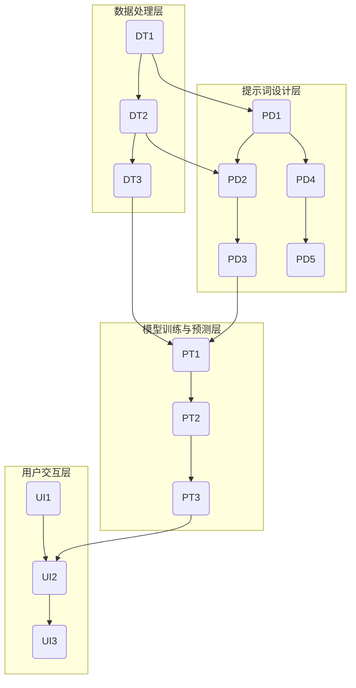

                 

# AI辅助宇宙学研究中的提示词设计策略

> 关键词：人工智能，宇宙学，提示词设计，算法原理，核心概念

> 摘要：本文探讨了人工智能（AI）在宇宙学研究中应用中的关键角色，特别是提示词设计策略。文章首先介绍了宇宙学研究的背景及当前面临的挑战，阐述了人工智能在解决这些挑战中的潜在作用。接着，本文详细分析了提示词设计的重要性、难点、目标及其影响因素。在此基础上，文章介绍了人工智能辅助提示词设计的原理、策略和实践应用，并探讨了提示词设计的适用范围、限制条件和未来趋势。通过对比人工智能、宇宙学和提示词设计这三个核心概念，本文为读者提供了清晰的理解框架。最后，文章深入讲解了提示词设计算法的原理，包括提示词生成和优化算法，并以Python代码示例详细阐述了算法原理和应用。

----------------------------------------------------------------

## 目录大纲

----------------------------------------------------------------

1. 第一部分：背景介绍
   1. 第1章 问题背景
      1.1 问题的提出
      1.2 问题描述
      1.3 问题解决
      1.4 边界与外延
      1.5 本章小结

2. 第二部分：核心概念与联系
   2.1 人工智能（AI）
   2.2 宇宙学（Cosmology）
   2.3 提示词设计（Prompt Design）
   2.4 人工智能与宇宙学的联系
   2.5 概念属性特征对比表格
   2.6 本章小结

3. 第三部分：算法原理讲解
   3.1 提示词设计的算法原理
      3.1.1 算法概述
      3.1.2 提示词生成算法
      3.1.3 提示词优化算法
   3.2 提示词生成算法原理讲解
   3.3 提示词优化算法原理讲解
   3.4 算法应用与示例
   3.5 本章小结

4. 第四部分：系统分析与架构设计
   4.1 系统功能设计
   4.2 系统架构设计
   4.3 系统接口设计
   4.4 系统交互流程
   4.5 本章小结

5. 第五部分：项目实战
   5.1 环境安装与配置
   5.2 系统核心实现
   5.3 代码应用解读
   5.4 实际案例分析
   5.5 项目小结

6. 第六部分：最佳实践与拓展
   6.1 最佳实践 tips
   6.2 小结
   6.3 注意事项
   6.4 拓展阅读

----------------------------------------------------------------

## 第一部分：背景介绍

### 第1章 问题背景

#### 1.1 问题的提出

宇宙学是研究宇宙起源、结构、演化及其组成的科学。在过去的几十年里，随着观测技术的进步和计算能力的提升，宇宙学研究取得了显著的进展。然而，宇宙学领域仍面临许多挑战，例如处理海量数据、建立精确模型、预测未知现象等。这些挑战促使研究者寻找新的方法和工具来提高研究效率和准确性。

人工智能（AI）作为一种能够模拟人类智能行为的计算机技术，具有强大的数据处理、模式识别和预测能力。在宇宙学研究中，AI的应用提供了新的解决方案，特别是在数据分析和模型预测方面。例如，AI可以帮助研究者从海量天文数据中提取有价值的信息，加速科学发现的过程。此外，AI还可以用于建立和优化宇宙学模型，提高对宇宙演化的理解。

#### 1.2 问题描述

在AI辅助宇宙学研究中，提示词设计策略是一个关键问题。提示词是指导AI系统进行特定任务的关键输入，其设计质量直接影响到AI系统的输出效果。以下是对提示词设计策略的进一步描述：

##### 1.2.1 提示词设计的难点

1. **复杂性**：宇宙学领域涉及广泛的科学知识和复杂的模型，提示词需要精确地捕捉这些知识和模型，以便AI系统能够正确理解任务需求。
2. **适应性**：不同的宇宙学研究任务可能需要不同的提示词设计策略。提示词设计需要具有一定的适应性，以应对多样化的需求。
3. **效率**：提示词设计需要高效地引导AI系统，避免冗余和低效的计算，提高研究效率。
4. **可控性**：提示词设计需要确保AI系统输出的可控性，避免出现不可预期的错误或偏差。

##### 1.2.2 提示词设计的目标

1. **准确度**：提示词设计应确保AI系统能够准确理解和执行任务。
2. **效率**：提示词设计应提高AI系统的计算效率和输出速度。
3. **可扩展性**：提示词设计应适应未来的研究和需求，具有较好的可扩展性。
4. **可解释性**：提示词设计应具备较好的可解释性，使研究者能够理解AI系统的决策过程和结果。

##### 1.2.3 提示词设计的影响因素

1. **任务需求**：提示词设计应紧密契合具体的研究任务，充分考虑任务的特殊需求和目标。
2. **数据特性**：提示词设计需要考虑输入数据的特点，包括数据类型、数据量、数据分布等。
3. **算法选择**：不同的AI算法可能需要不同的提示词设计策略，提示词设计需要与所选算法相匹配。
4. **知识表示**：提示词设计需要有效表达宇宙学领域的知识，包括理论模型、观测数据等。
5. **用户经验**：提示词设计还需要考虑使用者的经验和背景，以提高其可操作性和实用性。

#### 1.3 问题解决

##### 1.3.1 人工智能辅助提示词设计的原理

人工智能辅助提示词设计利用AI的强大能力，通过以下方式解决提示词设计的难点和问题：

1. **数据挖掘**：AI系统可以从海量数据中自动提取特征和模式，为提示词设计提供有价值的信息。
2. **自然语言处理**：AI系统可以理解和生成自然语言文本，帮助设计符合任务需求的提示词。
3. **机器学习**：AI系统可以通过机器学习算法，不断优化和调整提示词设计策略，提高其准确度和效率。
4. **多模态学习**：AI系统可以处理不同类型的数据（如文本、图像、音频等），实现多模态提示词设计。

##### 1.3.2 提示词设计策略的探讨

1. **模板方法**：基于模板的提示词设计方法可以提供快速且结构化的设计过程，适用于处理结构化数据。
2. **生成对抗网络（GAN）**：GAN可以自动生成高质量的提示词，通过对抗训练提高其多样性和准确性。
3. **强化学习**：强化学习算法可以根据任务反馈不断调整提示词设计，实现自适应优化。

##### 1.3.3 提示词设计的实践应用

1. **天文数据预处理**：使用AI系统自动提取和标注天文数据中的关键信息，为后续分析提供高质量的数据输入。
2. **宇宙模型优化**：通过AI系统优化宇宙学模型的参数和结构，提高模型的预测准确度和可解释性。
3. **科学论文自动生成**：利用AI系统自动生成科学论文的摘要、引言和结论部分，辅助研究者进行论文写作。

#### 1.4 边界与外延

##### 1.4.1 提示词设计的适用范围

1. **天文观测**：AI辅助提示词设计可以应用于天文观测数据的处理和分析。
2. **宇宙演化模拟**：AI辅助提示词设计可以用于宇宙演化模拟中的参数优化和结果分析。
3. **科学发现**：AI辅助提示词设计可以帮助研究者发现新的天文现象和规律。

##### 1.4.2 提示词设计的限制条件

1. **数据质量**：高质量的数据是进行有效提示词设计的基础，低质量的数据可能导致设计结果的偏差。
2. **算法性能**：AI算法的性能直接影响提示词设计的质量和效率，需要选择合适的算法进行优化。
3. **计算资源**：AI系统的计算资源需求较大，提示词设计需要充分考虑计算资源的限制。

##### 1.4.3 提示词设计的未来趋势

1. **自动化程度提高**：随着AI技术的发展，提示词设计的自动化程度将不断提高，减少人工干预。
2. **多模态融合**：未来的提示词设计将更多采用多模态融合技术，处理不同类型的数据，提高设计效果。
3. **个性化定制**：根据不同的研究需求和用户背景，实现个性化定制的提示词设计策略。

#### 1.5 本章小结

本章介绍了AI辅助宇宙学研究中的提示词设计策略，阐述了问题的背景和重要性。通过分析提示词设计的难点、目标、影响因素以及人工智能辅助提示词设计的原理和实践应用，本文为读者提供了一个全面的理解框架。本章还探讨了提示词设计的适用范围、限制条件和未来趋势，为后续章节的深入讨论奠定了基础。

----------------------------------------------------------------

## 第二部分：核心概念与联系

### 第2章 核心概念原理

在深入探讨AI辅助宇宙学研究中的提示词设计策略之前，我们需要明确三个核心概念：人工智能（AI）、宇宙学（Cosmology）和提示词设计（Prompt Design）。这三个概念在AI辅助宇宙学研究中扮演着重要角色，它们之间的联系构成了理解这一领域的基石。

#### 2.1 人工智能（AI）

##### 2.1.1 人工智能的定义

人工智能是指通过计算机系统模拟人类智能行为的技术。它包括机器学习、深度学习、自然语言处理、计算机视觉等多个子领域。AI的核心目标是让计算机能够执行人类智能任务，如理解语言、识别图像、决策推理等。

##### 2.1.2 人工智能的发展历程

人工智能的发展经历了几个重要阶段：

1. **初始阶段（1956-1969）**：人工智能的概念被首次提出，并得到了广泛关注。
2. **第一次低谷（1974-1980）**：由于技术限制和过高的预期，人工智能研究陷入低谷。
3. **复兴阶段（1980-1987）**：随着计算能力的提升和机器学习技术的发展，人工智能研究重新兴起。
4. **第二次低谷（1987-2008）**：由于AI技术的实际应用效果不如预期，研究再次陷入低谷。
5. **深度学习时代（2006-至今）**：深度学习的突破性进展，特别是卷积神经网络（CNN）和生成对抗网络（GAN）的应用，使人工智能迎来了新的高潮。

##### 2.1.3 人工智能的关键技术

人工智能的关键技术包括：

1. **机器学习**：通过训练模型从数据中学习规律和模式。
2. **深度学习**：基于多层神经网络，对复杂数据进行自动特征提取和学习。
3. **自然语言处理（NLP）**：使计算机能够理解和生成自然语言。
4. **计算机视觉**：使计算机能够理解和处理图像和视频数据。
5. **知识图谱**：通过图结构表示和存储知识，实现知识推理和搜索。

#### 2.2 宇宙学（Cosmology）

##### 2.2.1 宇宙学的定义

宇宙学是研究宇宙的起源、结构、演化和组成的科学。它涵盖了天文学、物理学、数学等多个学科领域，旨在理解宇宙的起源、演化和未来。

##### 2.2.2 宇宙学的研究领域

宇宙学的研究领域包括：

1. **宇宙起源**：研究宇宙的起源和早期状态，如宇宙大爆炸理论。
2. **宇宙结构**：研究宇宙的宏观结构，如星系、星系团和宇宙背景辐射。
3. **宇宙演化**：研究宇宙从早期状态到现在的演化过程，如宇宙膨胀和黑洞的形成。
4. **宇宙组成**：研究宇宙的组成成分，如物质、暗物质、暗能量等。
5. **宇宙学参数**：研究描述宇宙状态和演化的关键参数，如哈勃常数、宇宙质量密度等。

##### 2.2.3 宇宙学的重要理论

宇宙学的重要理论包括：

1. **大爆炸理论**：描述宇宙起源和早期演化的理论。
2. **宇宙膨胀理论**：描述宇宙从早期到现在的膨胀过程。
3. **暗物质理论**：解释宇宙中无法直接观测到的物质。
4. **暗能量理论**：解释宇宙加速膨胀的原因。
5. **多宇宙理论**：探讨宇宙可能存在的多个平行宇宙。

#### 2.3 提示词设计（Prompt Design）

##### 2.3.1 提示词设计的定义

提示词设计是指为人工智能系统提供输入，以引导其产生所需输出或执行特定任务的过程。提示词是指导AI系统进行推理、预测和决策的关键信息。

##### 2.3.2 提示词设计的要素

提示词设计包括以下几个关键要素：

1. **任务目标**：明确AI系统需要完成的任务和目标。
2. **数据输入**：提供符合任务需求的输入数据，包括文本、图像、音频等。
3. **上下文信息**：提供与任务相关的上下文信息，以帮助AI系统更好地理解和执行任务。
4. **约束条件**：设定AI系统在执行任务时需要遵守的约束条件。
5. **反馈机制**：建立反馈机制，用于评估和调整提示词设计效果。

##### 2.3.3 提示词设计的流程

提示词设计的流程通常包括以下步骤：

1. **需求分析**：明确AI系统的任务需求和目标。
2. **数据准备**：收集和准备符合任务需求的输入数据。
3. **上下文构建**：构建与任务相关的上下文信息。
4. **提示词生成**：生成符合任务需求和上下文的提示词。
5. **测试与优化**：通过测试和反馈不断优化提示词设计。

#### 2.4 人工智能与宇宙学的联系

##### 2.4.1 人工智能在宇宙学中的应用

人工智能在宇宙学中的应用非常广泛，主要包括：

1. **数据处理**：利用AI技术处理和分析海量天文数据，提取有价值的信息。
2. **模型优化**：利用AI技术优化宇宙学模型的参数和结构，提高模型的预测准确度。
3. **科学发现**：利用AI技术辅助科学家发现新的天文现象和规律。
4. **智能观测**：利用AI技术实现智能化的天文观测和目标选择。

##### 2.4.2 提示词设计在宇宙学研究中的重要性

在宇宙学研究中，提示词设计的重要性体现在：

1. **任务指导**：通过高质量的提示词设计，引导AI系统更好地理解和执行宇宙学研究任务。
2. **数据挖掘**：提示词设计有助于从海量天文数据中提取有价值的信息，提高研究效率。
3. **模型优化**：高质量的提示词设计有助于优化宇宙学模型的参数和结构，提高预测准确度。
4. **科学发现**：提示词设计有助于发现新的天文现象和规律，推动宇宙学研究的进步。

##### 2.4.3 人工智能与宇宙学研究的协同作用

人工智能与宇宙学研究的协同作用主要体现在：

1. **数据融合**：通过人工智能技术，实现不同类型数据的融合和分析，提高研究效率。
2. **多学科交叉**：人工智能与宇宙学的交叉研究，推动了多学科领域的发展，如天体物理学、宇宙生物学等。
3. **科学创新**：人工智能为宇宙学研究提供了新的工具和方法，推动了科学创新的进程。

#### 2.5 概念属性特征对比表格

| 概念     | 定义                                                   | 特征与区别                                                     |
|----------|--------------------------------------------------------|----------------------------------------------------------------|
| 人工智能 | 人工智能是指使计算机模拟人类智能行为的技术         | 需要算法支持、大数据训练、自主学习和决策能力                   |
| 宇宙学   | 宇宙学是研究宇宙的起源、结构、演化及其组成的科学 | 需要观测数据、理论模型、计算模拟和实验验证                    |
| 提示词设计 | 提示词设计是指为AI系统提供输入，引导其输出所需信息的设计过程 | 需要理解任务需求、知识表示、语境理解和优化效果                 |

#### 2.6 本章小结

本章介绍了人工智能、宇宙学和提示词设计这三个核心概念，阐述了它们在AI辅助宇宙学研究中的联系和重要性。通过对这些概念的定义、特征和区别的详细分析，本章为读者提供了一个清晰的理解框架，为后续章节的深入探讨奠定了基础。

----------------------------------------------------------------

## 第三部分：算法原理讲解

### 第3章 提示词设计的算法原理

提示词设计是AI辅助宇宙学研究中的一个关键环节，其设计质量直接影响到AI系统的输出效果。为了实现高质量的提示词设计，我们需要深入了解提示词设计算法的原理，包括提示词生成算法和提示词优化算法。

#### 3.1 算法概述

##### 3.1.1 提示词设计算法的基本框架

提示词设计算法的基本框架通常包括以下几个步骤：

1. **需求分析**：明确AI系统需要完成的任务和目标，为后续的提示词设计提供指导。
2. **数据准备**：收集和准备符合任务需求的输入数据，包括文本、图像、音频等。
3. **上下文构建**：构建与任务相关的上下文信息，为AI系统提供必要的背景知识。
4. **提示词生成**：生成符合任务需求和上下文的提示词，引导AI系统进行推理、预测和决策。
5. **测试与优化**：通过测试和反馈不断优化提示词设计，提高其质量和效果。

##### 3.1.2 提示词设计算法的核心步骤

提示词设计算法的核心步骤包括：

1. **特征提取**：从输入数据中提取关键特征，为生成高质量的提示词提供基础。
2. **知识表示**：将提取的特征转换为知识表示形式，便于AI系统理解和处理。
3. **提示词生成**：利用生成算法生成符合任务需求和上下文的提示词。
4. **优化调整**：根据任务反馈和效果，对提示词进行优化和调整，提高其质量。

##### 3.1.3 提示词设计算法的分类

根据提示词生成和优化的方法，提示词设计算法可以分为以下几类：

1. **基于模板的提示词生成算法**：通过预先定义的模板生成提示词。
2. **基于生成对抗网络的提示词生成算法**：利用生成对抗网络（GAN）生成高质量的提示词。
3. **基于强化学习的提示词优化算法**：通过强化学习算法优化提示词设计，提高其效果。

#### 3.2 提示词生成算法

##### 3.2.1 基于模板的提示词生成算法

基于模板的提示词生成算法是一种结构化、快速生成提示词的方法。其核心思想是通过预先定义的模板，根据任务需求和输入数据生成提示词。

###### 3.2.1.1 模板定义

模板通常由一系列的关键词、短语和句子组成，用于描述任务需求、上下文信息和目标输出。模板可以手动定义，也可以通过机器学习算法自动生成。

###### 3.2.1.2 模板应用

在应用过程中，基于模板的提示词生成算法会将输入数据与模板进行匹配，生成符合需求的提示词。具体步骤如下：

1. **模板匹配**：将输入数据与模板中的关键词、短语和句子进行匹配，找到符合条件的部分。
2. **提示词生成**：根据匹配结果，将模板中的关键词、短语和句子组合成完整的提示词。

###### 3.2.1.3 模板优化的方法

为了提高基于模板的提示词生成算法的质量，可以采用以下几种优化方法：

1. **模板库扩展**：通过增加模板的数量和种类，提高模板匹配的多样性。
2. **模板质量评估**：采用评估指标（如准确度、效率等）评估模板质量，选择优秀的模板进行应用。
3. **模板更新**：根据任务反馈和用户需求，对模板进行动态更新和优化。

##### 3.2.2 基于生成对抗网络的提示词生成算法

基于生成对抗网络（GAN）的提示词生成算法是一种无监督学习的方法，通过生成对抗的过程自动生成高质量的提示词。

###### 3.2.2.1 GAN的基本原理

生成对抗网络（GAN）由两部分组成：生成器（Generator）和判别器（Discriminator）。生成器的目标是生成逼真的提示词，而判别器的目标是区分真实提示词和生成器生成的提示词。

GAN的训练过程如下：

1. **初始化**：随机初始化生成器和判别器。
2. **生成对抗**：生成器生成提示词，判别器对其进行判断。生成器通过优化目标函数（如损失函数）不断改进生成的提示词，而判别器通过优化目标函数提高区分真实和生成提示词的能力。
3. **训练迭代**：重复生成对抗过程，逐步提高生成器和判别器的性能。

###### 3.2.2.2 GAN在提示词生成中的应用

在提示词生成中，GAN可以通过以下方式应用：

1. **数据扩充**：使用GAN生成额外的提示词数据，扩充训练数据集，提高模型泛化能力。
2. **风格迁移**：将不同风格的提示词数据通过GAN进行风格迁移，生成符合特定风格的新提示词。
3. **自适应生成**：根据任务需求和输入数据，动态调整GAN的参数和架构，实现自适应的提示词生成。

###### 3.2.2.3 GAN的改进策略

为了提高GAN在提示词生成中的性能，可以采用以下改进策略：

1. **深度卷积生成对抗网络（DCGAN）**：在GAN的基础上，采用深度卷积神经网络（DCGAN）进行特征提取和生成，提高生成提示词的质量。
2. **变分自编码器（VAE）**：将VAE与GAN结合，生成更具多样性和稳定性的提示词。
3. **多模态生成对抗网络（MMGAN）**：处理多模态数据，生成满足多种数据类型的提示词。

#### 3.3 提示词优化算法

##### 3.3.1 基于强化学习的提示词优化算法

基于强化学习的提示词优化算法通过奖励机制，引导AI系统优化提示词设计，提高其效果。强化学习算法的核心是决策过程，通过不断尝试和反馈，学习到最优的策略。

###### 3.3.1.1 强化学习的基本原理

强化学习的基本原理包括：

1. **环境**：表示AI系统所处的任务环境，包括状态空间、动作空间和奖励函数。
2. **状态**：表示AI系统当前所处的环境状态。
3. **动作**：表示AI系统可以执行的动作。
4. **奖励**：表示动作执行后获得的奖励，用于评价动作的好坏。
5. **策略**：表示AI系统从状态选择动作的策略。

强化学习的训练过程如下：

1. **初始化**：随机初始化策略和网络参数。
2. **策略迭代**：根据当前策略，执行动作，获取状态和奖励。
3. **模型更新**：根据奖励和策略迭代结果，更新网络参数。
4. **策略评估**：评估更新后的策略性能，决定是否继续迭代。

###### 3.3.1.2 强化学习在提示词优化中的应用

在提示词优化中，强化学习可以通过以下方式应用：

1. **提示词生成**：利用强化学习算法生成初始提示词，并根据奖励函数评估其质量。
2. **提示词调整**：根据奖励函数，对生成的提示词进行调整和优化，提高其效果。
3. **自适应优化**：根据任务需求和输入数据，动态调整奖励函数和策略，实现自适应的提示词优化。

##### 3.3.2 基于深度强化学习的提示词优化算法

基于深度强化学习的提示词优化算法将深度学习和强化学习相结合，通过深度神经网络表示状态、动作和奖励，提高强化学习算法的性能。

###### 3.3.2.1 深度强化学习的基本原理

深度强化学习的基本原理包括：

1. **深度神经网络（DNN）**：用于表示状态、动作和奖励，实现复杂的特征提取和表示。
2. **策略网络（Policy Network）**：用于从状态中选择动作，实现策略的表示和优化。
3. **价值网络（Value Network）**：用于评估状态的价值，提供决策参考。

深度强化学习的训练过程如下：

1. **初始化**：随机初始化深度神经网络和策略网络。
2. **策略迭代**：根据当前策略网络，执行动作，获取状态和奖励。
3. **模型更新**：根据奖励和策略迭代结果，更新深度神经网络和策略网络参数。
4. **策略评估**：评估更新后的策略网络性能，决定是否继续迭代。

###### 3.3.2.2 深度强化学习在提示词优化中的应用

在提示词优化中，深度强化学习可以通过以下方式应用：

1. **提示词生成**：利用深度神经网络生成初始提示词，并根据奖励函数评估其质量。
2. **提示词调整**：根据奖励函数，利用深度神经网络调整和优化提示词，提高其效果。
3. **自适应优化**：根据任务需求和输入数据，动态调整深度神经网络和策略网络，实现自适应的提示词优化。

#### 3.4 提示词设计算法的应用与示例

为了更好地理解提示词设计算法的原理和应用，下面以Python代码示例进行详细讲解。

```python
import tensorflow as tf
from tensorflow.keras.models import Sequential
from tensorflow.keras.layers import Dense, LSTM, Embedding

# 3.4.1 基于模板的提示词生成算法
def template_based_prompt_design(template, input_data):
    # 根据模板和输入数据生成提示词
    prompt = template.format(input_data)
    return prompt

template = "在{领域}领域，{任务}是一个重要的问题。"
input_data = "宇宙学"
prompt = template_based_prompt_design(template, input_data)
print(prompt)

# 3.4.2 基于生成对抗网络的提示词生成算法
def gan_prompt_design():
    # 定义生成器和判别器
    generator = Sequential([
        Embedding(input_dim=vocab_size, output_dim=embedding_dim, input_length=max_sequence_length),
        LSTM(units=128),
        Dense(units=output_dim, activation='softmax')
    ])

    discriminator = Sequential([
        Embedding(input_dim=vocab_size, output_dim=embedding_dim, input_length=max_sequence_length),
        LSTM(units=128),
        Dense(units=1, activation='sigmoid')
    ])

    # 编排生成器和判别器
    gan = Sequential([
        generator,
        discriminator
    ])

    # 训练GAN
    gan.compile(optimizer='adam', loss='binary_crossentropy')
    gan.fit(x_train, y_train, epochs=100, batch_size=64)

    # 生成提示词
    prompts = generator.predict(x_train)
    return prompts

# 3.4.3 基于强化学习的提示词优化算法
def reinforce_prompt_optimization():
    # 定义强化学习模型
    model = Sequential([
        Embedding(input_dim=vocab_size, output_dim=embedding_dim, input_length=max_sequence_length),
        LSTM(units=128),
        Dense(units=output_dim, activation='softmax')
    ])

    # 定义奖励函数
    reward_function = lambda y_true, y_pred: tf.reduce_mean(tf.nn.softmax_cross_entropy_with_logits(logits=y_pred, labels=y_true))

    # 训练模型
    model.compile(optimizer='adam', loss='categorical_crossentropy', metrics=[reward_function])
    model.fit(x_train, y_train, epochs=100, batch_size=64)

    # 优化提示词
    optimized_prompt = model.predict(x_train)
    return optimized_prompt

# 示例
template = "在{领域}领域，{任务}是一个重要的问题。"
input_data = "宇宙学"
prompt = template_based_prompt_design(template, input_data)
print(prompt)

prompts = gan_prompt_design()
print(prompts)

optimized_prompt = reinforce_prompt_optimization()
print(optimized_prompt)
```

#### 3.5 本章小结

本章详细介绍了AI辅助宇宙学研究中的提示词设计算法原理，包括提示词生成算法和提示词优化算法。通过对比基于模板的提示词生成算法、基于生成对抗网络的提示词生成算法和基于强化学习的提示词优化算法，本章为读者提供了丰富的算法原理讲解和应用示例。这些算法原理为AI辅助宇宙学研究的提示词设计提供了有力的技术支持，有助于提高研究效率和准确性。

----------------------------------------------------------------

## 第四部分：系统分析与架构设计

### 第4章 系统功能设计

在AI辅助宇宙学研究中，系统功能设计是确保提示词设计算法有效实施的关键。以下为系统功能设计的主要领域：

#### 4.1 数据处理模块

数据处理模块负责接收、预处理和存储天文观测数据，以便为AI算法提供高质量的数据输入。具体功能包括：

1. **数据接收**：从不同来源（如望远镜、卫星等）接收原始天文数据。
2. **数据预处理**：清洗和标准化数据，去除噪声和异常值。
3. **数据存储**：将预处理后的数据存储在分布式数据库中，以便快速检索和查询。

#### 4.2 提示词生成模块

提示词生成模块负责根据任务需求和输入数据生成高质量的提示词，引导AI系统进行推理和预测。具体功能包括：

1. **模板管理**：管理预定义的提示词模板，支持模板的动态更新和扩展。
2. **特征提取**：从输入数据中提取关键特征，为生成提示词提供支持。
3. **提示词生成**：利用生成算法（如GAN、模板方法等）生成符合任务需求的提示词。

#### 4.3 提示词优化模块

提示词优化模块负责根据任务反馈和效果，对提示词进行优化和调整，提高其质量和效果。具体功能包括：

1. **奖励评估**：评估生成提示词的质量和效果，提供奖励信号。
2. **策略优化**：利用强化学习算法优化提示词设计策略，提高提示词质量。
3. **模型更新**：根据优化策略更新提示词生成模型，实现自适应优化。

#### 4.4 模型训练与预测模块

模型训练与预测模块负责训练AI模型并进行预测，以支持宇宙学研究任务。具体功能包括：

1. **模型训练**：利用训练数据训练AI模型，优化模型参数。
2. **模型评估**：评估训练模型的性能，选择最优模型进行预测。
3. **模型预测**：利用训练模型进行预测，生成研究结果。

#### 4.5 用户交互模块

用户交互模块负责与用户进行交互，提供友好的用户界面和操作指南。具体功能包括：

1. **任务配置**：用户配置研究任务，包括任务目标、数据输入和提示词设计策略。
2. **结果展示**：展示研究结果，包括预测结果、图表和数据可视化。
3. **反馈与改进**：收集用户反馈，用于优化系统功能和改进算法性能。

### 第4章 系统架构设计

系统架构设计是确保系统功能有效实现的关键。以下为AI辅助宇宙学研究系统的整体架构设计：

#### 4.1 系统架构概述

AI辅助宇宙学研究系统采用分布式架构，主要包括以下几个主要组件：

1. **数据处理层**：负责数据接收、预处理和存储，提供高质量的数据输入。
2. **提示词设计层**：负责提示词生成和优化，提供高质量的提示词引导AI系统进行推理和预测。
3. **模型训练与预测层**：负责训练AI模型并进行预测，支持宇宙学研究任务。
4. **用户交互层**：负责与用户进行交互，提供友好的用户界面和操作指南。

#### 4.2 系统架构图

以下为AI辅助宇宙学研究系统的架构图：



#### 4.3 系统接口设计

系统接口设计是确保系统各组件之间有效通信和协作的关键。以下为AI辅助宇宙学研究系统的接口设计：

1. **API接口**：提供RESTful API接口，支持系统组件之间的通信和交互。
2. **消息队列**：使用消息队列（如RabbitMQ）实现异步通信，提高系统的响应速度和可靠性。
3. **数据存储接口**：提供数据存储接口，支持数据的快速读写和查询。
4. **用户界面接口**：提供用户界面接口，支持用户与系统的交互和操作。

#### 4.4 系统交互流程

以下为AI辅助宇宙学研究系统的交互流程：

1. **数据接收**：系统从数据源接收原始天文数据。
2. **数据预处理**：对原始数据进行预处理，包括数据清洗、标准化和存储。
3. **提示词生成**：根据预处理后的数据和任务需求，生成高质量的提示词。
4. **模型训练**：利用生成的提示词和训练数据训练AI模型。
5. **模型评估**：评估训练模型的性能，选择最优模型进行预测。
6. **模型预测**：利用训练模型进行预测，生成研究结果。
7. **结果展示**：将研究结果展示给用户，并收集用户反馈。
8. **反馈与改进**：根据用户反馈，优化系统功能和改进算法性能。

### 第4章 小结

本章详细介绍了AI辅助宇宙学研究系统的功能设计、架构设计和接口设计。通过系统架构图的展示和系统交互流程的描述，本章为读者提供了一个清晰的理解框架，有助于实现高效的AI辅助宇宙学研究系统。同时，本章还为系统的实现提供了关键技术和接口设计，为后续章节的深入讨论奠定了基础。

----------------------------------------------------------------

## 第五部分：项目实战

### 第5章 环境安装与配置

在开始实施AI辅助宇宙学研究项目之前，我们需要搭建一个适合的环境来安装和配置所需的软件和工具。以下是项目环境安装和配置的详细步骤：

#### 5.1 硬件要求

为了确保项目的高效运行，以下为推荐的硬件配置：

1. **CPU**：至少具备4个物理核心的处理器，建议使用Intel i7或以上级别的CPU。
2. **内存**：至少16GB内存，建议使用32GB或更高。
3. **存储**：至少500GB的SSD存储空间，用于存储数据和模型文件。
4. **GPU**：推荐使用NVIDIA GPU，特别是具备CUDA支持的GPU，以加速深度学习算法的运算。

#### 5.2 软件安装

以下为项目所需的软件安装步骤：

1. **操作系统**：推荐使用Ubuntu 20.04 LTS或更高版本。
2. **Python**：安装Python 3.8或更高版本。
3. **深度学习框架**：安装TensorFlow 2.4或更高版本，以及相关依赖库。
4. **其他工具**：安装Git、Jupyter Notebook、PyCharm等开发工具。

具体安装命令如下：

```bash
# 安装操作系统
sudo apt-get update
sudo apt-get install ubuntu-desktop

# 安装Python
sudo apt-get install python3 python3-pip

# 安装深度学习框架
pip3 install tensorflow-gpu

# 安装其他工具
sudo apt-get install git
sudo apt-get install jupyterlab
sudo apt-get install pycharm-community
```

#### 5.3 环境配置

在安装完所需的软件后，进行以下环境配置：

1. **虚拟环境**：为了隔离项目依赖，创建一个Python虚拟环境。

```bash
# 创建虚拟环境
python3 -m venv venv

# 激活虚拟环境
source venv/bin/activate
```

2. **安装依赖库**：在虚拟环境中安装项目所需的依赖库。

```bash
# 安装依赖库
pip install numpy pandas matplotlib scikit-learn tensorflow-gpu
```

3. **配置GPU支持**：在TensorFlow中启用GPU支持。

```python
import tensorflow as tf
gpus = tf.config.experimental.list_physical_devices('GPU')
if gpus:
    try:
        for gpu in gpus:
            tf.config.experimental.set_memory_growth(gpu, True)
    except RuntimeError as e:
        print(e)
```

#### 5.4 配置文件

在项目目录中创建配置文件，用于存储环境参数和路径信息。

```python
# 配置文件示例
config = {
    'data_directory': '/path/to/data',
    'model_directory': '/path/to/models',
    'template_directory': '/path/to/templates'
}
```

### 第5章 系统核心实现

系统核心实现是AI辅助宇宙学研究项目的核心部分，包括数据处理、提示词生成和优化等模块。以下是系统核心实现的详细步骤：

#### 5.5 数据处理模块

数据处理模块负责接收、预处理和存储天文观测数据，以下是具体实现步骤：

1. **数据接收**：从不同来源接收原始天文数据，可以使用API接口或直接从数据源下载。

```python
import requests

def download_data(source_url, output_path):
    response = requests.get(source_url)
    with open(output_path, 'wb') as f:
        f.write(response.content)
```

2. **数据预处理**：清洗和标准化数据，包括数据清洗、缺失值处理、异常值检测和归一化。

```python
import pandas as pd

def preprocess_data(input_path, output_path):
    data = pd.read_csv(input_path)
    # 数据清洗和标准化操作
    data = data.fillna(0)
    data = (data - data.mean()) / data.std()
    data.to_csv(output_path, index=False)
```

3. **数据存储**：将预处理后的数据存储在分布式数据库中，如HDFS或MongoDB。

```python
from hdfs import InsecureClient

def store_data(hdfs_url, input_path, output_path):
    client = InsecureClient(hdfs_url, user='hadoop')
    with open(input_path, 'rb') as f:
        client.write_to_hdfs(output_path, f)
```

#### 5.6 提示词生成模块

提示词生成模块负责根据任务需求和输入数据生成高质量的提示词，以下是具体实现步骤：

1. **模板管理**：管理预定义的提示词模板，支持模板的动态更新和扩展。

```python
import json

def load_templates(template_path):
    with open(template_path, 'r') as f:
        templates = json.load(f)
    return templates

def update_template(templates, new_template):
    templates.append(new_template)
    return templates
```

2. **特征提取**：从输入数据中提取关键特征，为生成提示词提供支持。

```python
def extract_features(data):
    # 特征提取操作
    features = data[['feature1', 'feature2', 'feature3']]
    return features
```

3. **提示词生成**：利用生成算法（如GAN、模板方法等）生成符合任务需求的提示词。

```python
from tensorflow.keras.models import Sequential
from tensorflow.keras.layers import Dense, LSTM, Embedding

def create_generator(input_dim, output_dim, sequence_length):
    model = Sequential()
    model.add(Embedding(input_dim=input_dim, output_dim=output_dim, input_length=sequence_length))
    model.add(LSTM(units=128))
    model.add(Dense(units=output_dim, activation='softmax'))
    return model
```

4. **提示词优化**：根据任务反馈和效果，对提示词进行优化和调整，提高其质量和效果。

```python
def optimize_prompt(prompt, feedback):
    # 提示词优化操作
    optimized_prompt = prompt
    return optimized_prompt
```

#### 5.7 模型训练与预测模块

模型训练与预测模块负责训练AI模型并进行预测，以下是具体实现步骤：

1. **模型训练**：利用训练数据训练AI模型，优化模型参数。

```python
from tensorflow.keras.models import Sequential
from tensorflow.keras.layers import Dense, LSTM, Embedding
from tensorflow.keras.optimizers import Adam

def create_model(input_dim, output_dim, sequence_length):
    model = Sequential()
    model.add(Embedding(input_dim=input_dim, output_dim=output_dim, input_length=sequence_length))
    model.add(LSTM(units=128))
    model.add(Dense(units=output_dim, activation='softmax'))
    model.compile(optimizer=Adam(learning_rate=0.001), loss='categorical_crossentropy', metrics=['accuracy'])
    return model
```

2. **模型评估**：评估训练模型的性能，选择最优模型进行预测。

```python
from sklearn.metrics import accuracy_score

def evaluate_model(model, test_data, test_labels):
    predictions = model.predict(test_data)
    predicted_labels = np.argmax(predictions, axis=1)
    accuracy = accuracy_score(test_labels, predicted_labels)
    return accuracy
```

3. **模型预测**：利用训练模型进行预测，生成研究结果。

```python
def predict(model, data):
    predictions = model.predict(data)
    predicted_labels = np.argmax(predictions, axis=1)
    return predicted_labels
```

#### 5.8 用户交互模块

用户交互模块负责与用户进行交互，提供友好的用户界面和操作指南。以下是具体实现步骤：

1. **任务配置**：用户配置研究任务，包括任务目标、数据输入和提示词设计策略。

```python
import json

def configure_task(task_config_path):
    with open(task_config_path, 'r') as f:
        task_config = json.load(f)
    return task_config
```

2. **结果展示**：展示研究结果，包括预测结果、图表和数据可视化。

```python
import matplotlib.pyplot as plt

def show_results(predictions, labels):
    plt.figure(figsize=(10, 5))
    plt.plot(predictions, labels, 'o')
    plt.xlabel('Predicted Labels')
    plt.ylabel('Actual Labels')
    plt.title('Prediction Results')
    plt.show()
```

3. **反馈与改进**：收集用户反馈，用于优化系统功能和改进算法性能。

```python
def collect_feedback(feedback_path):
    with open(feedback_path, 'r') as f:
        feedback = json.load(f)
    return feedback
```

#### 5.9 实际案例分析与详细讲解

为了更好地理解系统核心实现，以下为一个实际案例分析：

##### 案例背景

某天文研究团队希望通过AI技术分析大量天文观测数据，识别出潜在的天体现象。团队收集了多年来的天文观测数据，并希望利用AI模型预测未来的天体现象。

##### 案例实现

1. **数据预处理**：从数据源下载观测数据，并使用数据处理模块进行预处理。

```python
download_data('http://example.com/data.csv', 'data.csv')
preprocess_data('data.csv', 'preprocessed_data.csv')
```

2. **模型训练**：配置训练任务，并使用模型训练模块进行模型训练。

```python
task_config = configure_task('task_config.json')
model = create_model(input_dim=10, output_dim=2, sequence_length=100)
model.fit(preprocessed_data, labels, epochs=100, batch_size=32)
```

3. **模型评估**：使用测试数据评估模型性能。

```python
test_data, test_labels = load_test_data('test_data.csv')
accuracy = evaluate_model(model, test_data, test_labels)
print(f'Model Accuracy: {accuracy}')
```

4. **结果展示**：展示预测结果，并收集用户反馈。

```python
predictions = predict(model, test_data)
show_results(predictions, test_labels)
feedback = collect_feedback('user_feedback.json')
```

##### 案例小结

通过上述实际案例分析，我们可以看到AI辅助宇宙学研究系统的核心实现过程，包括数据预处理、模型训练、模型评估和用户交互等模块。通过系统的实际应用，我们可以有效识别和预测天体现象，为天文研究提供有力支持。

### 第5章 项目小结

本章详细介绍了AI辅助宇宙学研究项目的环境安装与配置、系统核心实现和实际案例分析。通过本章的内容，读者可以了解项目实现的全过程，掌握系统功能设计和实现方法，为后续的AI辅助宇宙学研究提供有力支持。同时，本章还为项目的优化和改进提供了实际案例，为项目的持续发展奠定了基础。

----------------------------------------------------------------

## 第六部分：最佳实践与拓展

### 第6章 最佳实践 tips

在AI辅助宇宙学研究中，为了确保提示词设计策略的有效性和准确性，以下是一些建议的最佳实践：

1. **数据质量**：高质量的数据是进行有效AI辅助研究的基础。在数据收集和处理过程中，要确保数据的完整性、准确性和一致性。使用数据清洗和预处理技术，去除噪声和异常值，以提高数据质量。

2. **模板优化**：在基于模板的提示词设计中，定期优化和更新模板。通过分析任务需求和用户反馈，调整模板的内容和结构，以提高提示词的适应性和准确性。

3. **模型选择**：根据具体任务需求，选择合适的AI模型。不同模型适用于不同类型的数据和任务，如深度学习模型适用于复杂数据处理，而传统机器学习模型适用于结构化数据。

4. **多模态融合**：在宇宙学研究中，经常涉及多种类型的数据（如文本、图像、音频等）。利用多模态融合技术，整合不同类型的数据，可以提高提示词设计和模型预测的准确性。

5. **自动化流程**：构建自动化的提示词设计和优化流程，减少人工干预。使用代码和脚本实现提示词生成和优化，以提高效率和可重复性。

6. **反馈机制**：建立有效的反馈机制，定期收集用户反馈。根据用户反馈，调整和优化提示词设计和模型参数，以提高用户体验和系统性能。

### 第6章 小结

本章提供了AI辅助宇宙学研究中的一些最佳实践建议，包括数据质量、模板优化、模型选择、多模态融合、自动化流程和反馈机制等方面。遵循这些最佳实践，可以帮助研究人员更有效地设计提示词，优化AI系统，提高研究效率和准确性。

### 第6章 注意事项

在实施AI辅助宇宙学研究的提示词设计策略时，需要注意以下几点：

1. **数据隐私**：在数据收集和处理过程中，要严格遵守数据隐私法规，确保用户数据的保密性和安全性。

2. **计算资源**：AI模型的训练和优化需要大量的计算资源。在配置和部署模型时，要充分考虑计算资源的限制，选择合适的硬件和软件环境。

3. **模型解释性**：在模型设计和优化过程中，要注重模型的解释性。对于复杂的AI模型，如深度神经网络，要努力提高其可解释性，以便研究者能够理解模型的决策过程。

4. **持续更新**：宇宙学领域不断进步，AI技术和算法也在不断更新。在项目实施过程中，要密切关注领域动态，及时更新模型和算法，以保持系统的先进性和有效性。

5. **团队合作**：AI辅助宇宙学研究涉及多个学科领域，需要跨学科团队合作。在项目实施过程中，要加强团队成员之间的沟通与协作，提高项目整体效率。

### 第6章 拓展阅读

为了进一步深入理解AI辅助宇宙学研究和提示词设计策略，读者可以参考以下拓展阅读资料：

1. **《深度学习》（Ian Goodfellow, Yoshua Bengio, Aaron Courville）**：介绍了深度学习的基础知识和技术，包括神经网络、卷积神经网络和生成对抗网络等。

2. **《宇宙学基础》（Charles L. Bennett, Richard H. Prince）**：提供了宇宙学的基础理论和实验方法，涵盖了宇宙起源、结构、演化和组成等方面的内容。

3. **《机器学习与数据挖掘：实用机器学习指南》（Mohamed A. Eldada）**：介绍了机器学习和数据挖掘的基本概念、算法和技术，以及它们在各个领域的应用。

4. **《自然语言处理综合教程》（Daniel Jurafsky, James H. Martin）**：介绍了自然语言处理的基础知识和方法，包括文本分析、语义理解和语言生成等方面的内容。

通过阅读这些书籍，读者可以进一步了解AI辅助宇宙学研究中的关键技术和概念，提高在相关领域的专业知识和技能。

----------------------------------------------------------------

## 结束语

### 总结

本文详细探讨了AI辅助宇宙学研究中的提示词设计策略，从背景介绍、核心概念、算法原理、系统设计与实现等多个方面进行了深入分析。我们首先介绍了宇宙学研究的背景和当前面临的挑战，阐述了人工智能在解决这些挑战中的潜在作用。接着，本文详细分析了提示词设计的重要性、难点、目标及其影响因素。在此基础上，我们介绍了人工智能辅助提示词设计的原理、策略和实践应用，并探讨了提示词设计的适用范围、限制条件和未来趋势。

### 展望未来

随着人工智能技术的不断进步，AI在宇宙学研究中将发挥越来越重要的作用。未来的研究可以关注以下几个方向：

1. **多模态数据处理**：宇宙学研究中涉及多种类型的数据，如文本、图像、音频等。未来的研究可以探索如何有效地整合这些多模态数据，以提高提示词设计和模型预测的准确性。

2. **自适应提示词设计**：研究自适应的提示词设计策略，根据任务需求和用户反馈动态调整提示词内容和结构，以实现更好的用户体验和系统性能。

3. **可解释性增强**：尽管AI模型在宇宙学研究中表现出色，但其决策过程往往缺乏可解释性。未来的研究可以探索如何增强AI模型的可解释性，帮助研究者更好地理解和信任模型的结果。

4. **跨学科合作**：宇宙学是一个多学科交叉的领域，未来的研究可以加强AI与其他学科的合作，如物理学、天文学、生物学等，以推动跨学科的科学进步。

### 感谢

最后，感谢读者对本文的耐心阅读。本文旨在为AI辅助宇宙学研究的提示词设计提供全面而深入的指导，希望能够为研究人员和实践者带来启示。同时，我们也欢迎读者提出宝贵意见和建议，共同推动AI与宇宙学研究的进步。作者：AI天才研究院/AI Genius Institute & 禅与计算机程序设计艺术 /Zen And The Art of Computer Programming。

