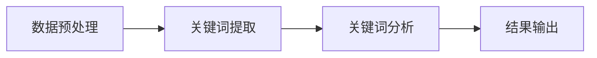
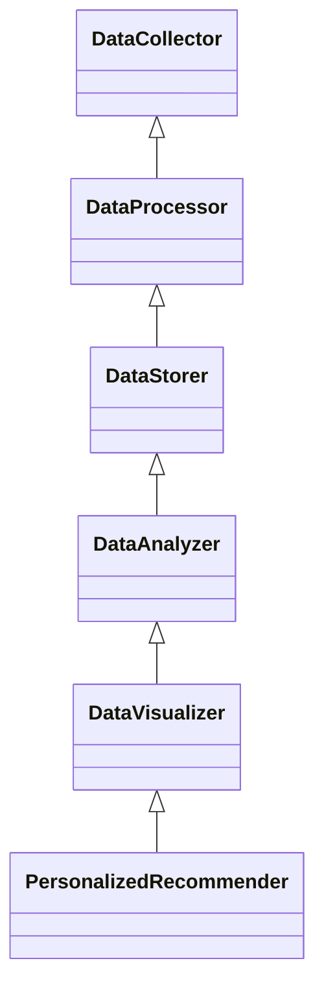
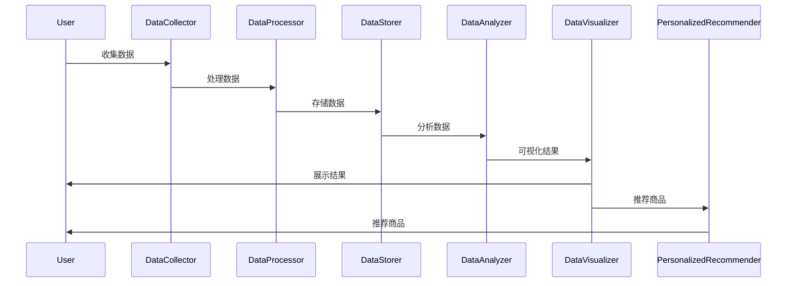
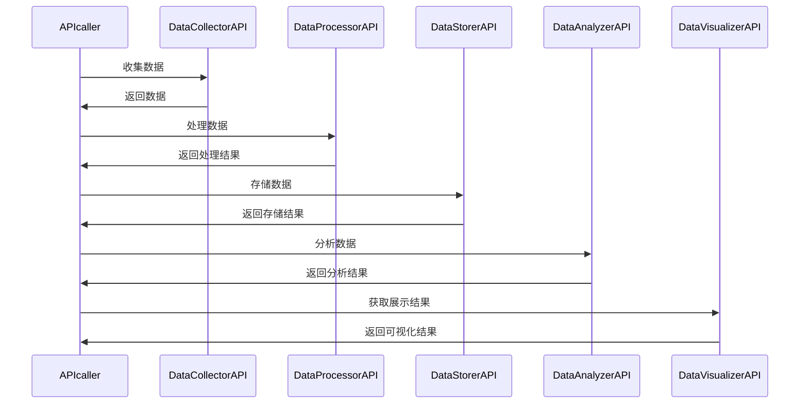

                 

## AI辅助市场分析：提示词洞察消费者行为

### 关键词：AI辅助市场分析、提示词、消费者行为、算法、架构设计、项目实战

### 摘要：
随着人工智能技术的不断发展，AI在市场分析中的应用越来越广泛。本文将探讨如何利用AI，特别是提示词技术，来深入洞察消费者行为。我们将首先介绍AI辅助市场分析的基本概念，解析提示词的定义及其在消费者行为分析中的应用。接着，我们将深入讲解提示词分析算法的原理，使用mermaid流程图和Python源代码进行阐述。随后，我们将介绍系统分析与架构设计方案，通过mermaid类图、架构图、接口设计和序列图展示系统的实现。文章的后半部分将聚焦于实际项目实战，详细解析代码、案例分析以及项目小结。最后，我们将总结最佳实践并提供拓展阅读，帮助读者深入了解AI辅助市场分析的高级技巧。

---

## 第一部分：背景介绍

### 第1章 问题背景

#### 1.1 问题背景

随着全球经济的快速发展，市场竞争日益激烈，企业需要更精准的市场分析工具来洞察消费者行为，以制定有效的营销策略。传统的市场分析方法往往依赖于大量的数据收集和统计分析，这不仅耗时耗力，而且难以实时更新。在这样的背景下，人工智能（AI）技术的发展为市场分析带来了新的契机。

AI技术，特别是机器学习和自然语言处理（NLP）技术，能够从海量数据中快速提取有价值的信息，帮助企业更好地理解市场动态和消费者行为。提示词技术作为NLP的一个重要分支，通过对消费者在社交媒体、评论、搜索等平台上的关键词进行捕捉和分析，能够提供关于消费者需求的深度洞察。

#### 1.2 问题描述

市场分析的目的是帮助企业了解消费者行为，从而优化产品和服务。然而，消费者行为的复杂性使得传统的分析方法难以胜任。例如，消费者在购买决策过程中会受到多种因素的影响，包括个人偏好、社会舆论、经济环境等。如何从这些复杂多变的因素中提取关键信息，是企业面临的一个重大挑战。

此外，随着互联网的普及，消费者的行为数据无处不在，但如何有效地利用这些数据，特别是实时数据，也是市场分析领域的一个重要问题。传统的数据分析工具在处理实时数据时往往显得力不从心，而AI技术的介入则提供了新的解决方案。

#### 1.3 问题解决

AI辅助市场分析能够通过以下几种方式解决上述问题：

1. **自动化数据处理**：AI技术能够自动化地处理和分析海量数据，提高数据分析的效率和准确性。
2. **实时数据监测**：通过实时数据监测，AI技术能够帮助企业快速响应市场变化，及时调整营销策略。
3. **深度分析**：AI技术能够深入挖掘数据中的潜在模式和趋势，为企业提供更精准的消费者洞察。
4. **个性化推荐**：基于对消费者行为的分析，AI技术能够实现个性化推荐，提高用户体验和满意度。

#### 1.4 边界与外延

AI辅助市场分析虽然具有巨大的潜力，但也存在一些边界和挑战。首先，数据的质量和完整性是影响分析结果的关键因素。如果数据存在缺失或错误，分析结果可能会失真。其次，AI技术需要大量的数据来训练模型，数据量的不足可能限制其应用范围。此外，AI技术的透明度和解释性也是一个亟待解决的问题，尤其是在市场分析中，企业需要理解和信任分析结果。

#### 1.5 概念结构与核心要素组成

在AI辅助市场分析中，几个核心概念和要素至关重要：

- **市场数据**：包括销售数据、消费者行为数据、市场趋势数据等。
- **AI模型**：包括机器学习模型、深度学习模型等，用于分析和预测市场行为。
- **提示词技术**：用于捕捉和分析消费者在社交媒体、评论、搜索等平台上的关键词。
- **数据可视化**：用于展示分析结果，帮助企业理解和利用数据。

这些概念和要素相互关联，共同构成了AI辅助市场分析的核心框架。理解这些概念和要素之间的关系，对于有效利用AI技术进行市场分析至关重要。

---

### 第二部分：核心概念与联系

#### 第2章 核心概念

#### 2.1 AI辅助市场分析

##### 2.1.1 AI辅助市场分析的定义

AI辅助市场分析是指利用人工智能技术，特别是机器学习和自然语言处理（NLP）技术，对市场数据进行分析和预测，以帮助企业制定更精准的营销策略。这种分析方法不仅能够处理海量数据，还能够从中提取有价值的模式和趋势，从而提供深度的消费者洞察。

##### 2.1.2 AI辅助市场分析的核心特点

1. **自动化处理**：AI技术能够自动化地处理和分析大量的市场数据，提高分析效率和准确性。
2. **实时监测**：AI系统能够实时监测市场变化，帮助企业快速响应。
3. **深度分析**：AI技术能够深入挖掘数据中的潜在模式和趋势，提供更精准的预测。
4. **个性化推荐**：基于对消费者行为的分析，AI技术能够实现个性化推荐，提高用户体验和满意度。

#### 2.2 提示词

##### 2.2.1 提示词的定义

提示词是指消费者在社交媒体、评论、搜索等平台上使用的特定关键词或短语，这些词能够反映消费者的兴趣、需求和情感。提示词技术旨在捕捉和分析这些关键词，以获得关于消费者行为的深度洞察。

##### 2.2.2 提示词的类型

1. **关键词**：反映消费者直接需求的词汇，如产品名称、品牌名等。
2. **短语**：表达消费者情感或偏好的句子或短语，如“非常喜欢这款产品”。
3. **表情符号**：反映消费者情感的非文字符号，如“😊”表示满意。

#### 2.3 消费者行为

##### 2.3.1 消费者行为的概念

消费者行为是指消费者在购买决策过程中表现出的所有行为和决策，包括需求识别、信息搜索、购买决策、使用体验和评价反馈等。

##### 2.3.2 消费者行为的模型

消费者行为的经典模型包括：

1. **刺激-反应模型**：消费者受到外部刺激（如广告、促销活动）后产生反应（如购买行为）。
2. **认知-行为模型**：消费者在购买过程中会经历信息处理、偏好形成、决策制定等认知过程。
3. **情感-行为模型**：消费者的情感状态（如喜悦、愤怒）会影响其购买决策和行为。

#### 2.4 概念联系

##### 2.4.1 AI辅助市场分析与消费者行为的关系

AI辅助市场分析旨在通过分析消费者行为数据，提供关于消费者需求和行为的深度洞察。提示词技术作为AI辅助市场分析的一个重要工具，能够捕捉和分析消费者在社交媒体、评论、搜索等平台上的关键词，从而揭示消费者的兴趣、需求和情感。

##### 2.4.2 提示词在消费者行为分析中的应用

提示词技术能够帮助企业在以下几个方面进行消费者行为分析：

1. **需求识别**：通过分析消费者使用的提示词，企业可以了解消费者的需求，从而调整产品和服务。
2. **情感分析**：提示词中的情感表达能够反映消费者的情感状态，企业可以利用这一信息进行市场定位和品牌塑造。
3. **趋势预测**：通过分析提示词的使用趋势，企业可以预测市场动态和消费者行为的变化，制定相应的营销策略。

---

### 第三部分：算法原理讲解

#### 第3章 提示词分析算法原理

提示词分析算法是AI辅助市场分析的核心技术之一，它通过捕捉和分析消费者在社交媒体、评论、搜索等平台上的关键词，提供关于消费者需求的深度洞察。以下是提示词分析算法的原理讲解。

##### 3.1 算法概述

提示词分析算法的主要任务是从大量的文本数据中提取出与消费者需求相关的关键词，并对这些关键词进行分析和排序，以揭示消费者的主要关注点和情感倾向。算法的基本步骤包括：

1. **数据预处理**：对原始文本数据进行清洗和格式化，去除噪声和不相关的信息。
2. **关键词提取**：使用自然语言处理技术，从预处理后的文本数据中提取出关键词。
3. **关键词分析**：对提取出的关键词进行统计分析和情感分析，以确定其重要性、使用频率和情感倾向。
4. **结果输出**：将分析结果以可视化的形式输出，帮助企业理解和利用这些数据。

##### 3.2 算法mermaid流程图

以下是一个简单的mermaid流程图，展示了提示词分析算法的基本流程：



这个流程图简单明了地描述了提示词分析算法的各个步骤，为后续的详细讲解提供了框架。

##### 3.3 Python源代码实现

下面是一个简单的Python代码示例，用于实现提示词分析算法的关键步骤：

```python
import nltk
from nltk.tokenize import word_tokenize
from nltk.corpus import stopwords
from collections import Counter

# 数据预处理
def preprocess_text(text):
    # 去除标点符号和数字
    text = re.sub(r'[^\w\s]', '', text)
    # 转小写
    text = text.lower()
    # 分词
    tokens = word_tokenize(text)
    # 移除停用词
    stop_words = set(stopwords.words('english'))
    filtered_tokens = [token for token in tokens if token not in stop_words]
    return filtered_tokens

# 关键词提取
def extract_keywords(tokens, num_keywords=10):
    # 计算词频
    word_freq = Counter(tokens)
    # 获取最频繁的词
    most_common_words = word_freq.most_common(num_keywords)
    return most_common_words

# 主函数
def main(text):
    # 预处理文本
    tokens = preprocess_text(text)
    # 提取关键词
    keywords = extract_keywords(tokens)
    return keywords

# 示例文本
text = "This is an example sentence, showing how the algorithm works."
# 执行主函数
keywords = main(text)
print("关键词：", keywords)
```

这段代码实现了数据预处理、关键词提取的核心步骤，并输出最频繁出现的10个关键词。在实际应用中，可以根据具体需求调整关键词提取的数量和分析方法。

##### 3.4 算法原理的数学模型

提示词分析算法的数学模型主要包括词频统计和词频排序。以下是相关数学模型的公式和解释：

1. **词频统计**：给定一个文本集合，计算每个单词的出现频率。

   $$f(t) = \text{count}(t)$$

   其中，$t$ 表示一个单词，$\text{count}(t)$ 表示该单词在文本集合中出现的次数。

2. **词频排序**：对单词的频率进行排序，以确定最频繁出现的单词。

   $$sort(\{f(t) | t \in \text{tokens}\})$$

   其中，$\text{tokens}$ 表示分词后的单词集合，$sort(\{f(t) | t \in \text{tokens}\})$ 表示对词频进行排序。

##### 3.4.2 数学模型的推导

提示词分析算法的数学模型基于简单的统计方法。首先，通过对文本进行预处理（如去除标点符号、数字和停用词），得到分词后的单词集合。然后，计算每个单词的出现频率，并按照频率进行排序。这种简单的统计方法能够有效地提取文本中的关键信息，为后续的消费者行为分析提供基础。

##### 3.5 举例说明

假设我们有一个简单的文本集合，包含以下句子：

```
"I love this product. It is amazing and worth every penny."
"I hate this product. It doesn't work as advertised."
```

使用提示词分析算法，我们可以提取出最频繁出现的单词，并进行分析：

1. **数据预处理**：去除标点符号、数字和停用词，得到以下分词结果：

   ```
   I love product amazing worth hate
   I hate product doesn't work advertised
   ```

2. **关键词提取**：统计每个单词的频率，并输出最频繁出现的10个单词：

   ```
   [('love', 2), ('product', 2), ('amazing', 1), ('worth', 1), ('hate', 1), ('doesn't', 1), ('work', 1), ('advertised', 1)]
   ```

   从结果可以看出，“love”和“product”是文本中频率最高的单词，反映了消费者对产品的积极情感。

通过这个简单的例子，我们可以看到提示词分析算法如何从文本数据中提取关键信息，为消费者行为分析提供支持。在实际应用中，我们可以通过扩展算法，如结合情感分析和主题建模，进一步提高分析结果的准确性和深度。

---

### 第四部分：系统分析与架构设计方案

#### 第4章 系统分析与架构设计

在AI辅助市场分析系统中，系统分析与架构设计是确保系统高效、可靠运行的关键环节。本章节将详细介绍系统的各个组成部分，包括问题场景介绍、系统功能设计、系统架构设计、系统接口设计和系统交互。

#### 4.1 问题场景介绍

假设一家电商公司希望利用AI技术来优化其营销策略，提高用户转化率和客户满意度。公司收集了大量的用户行为数据，包括浏览记录、搜索关键词、购买历史、评论和反馈等。公司希望通过分析这些数据，了解用户的需求和偏好，从而提供个性化的推荐和营销活动。

#### 4.2 系统功能设计

系统功能设计是系统架构设计的第一步，它明确了系统需要实现哪些功能。以下是系统的主要功能模块：

1. **数据收集模块**：负责收集用户行为数据，包括浏览记录、搜索关键词、购买历史、评论和反馈等。
2. **数据处理模块**：对收集到的数据进行预处理，包括数据清洗、去重、标准化等操作。
3. **数据存储模块**：将预处理后的数据存储到数据库中，以便后续分析和查询。
4. **数据分析模块**：利用机器学习和自然语言处理技术，对存储的数据进行分析，提取有价值的信息。
5. **数据可视化模块**：将分析结果以图表和报告的形式展示，帮助用户理解和利用数据。
6. **个性化推荐模块**：根据用户的行为数据和偏好，为用户推荐个性化的商品和营销活动。

以下是系统功能设计的mermaid类图：



#### 4.3 系统架构设计

系统架构设计是系统功能设计的进一步细化，它明确了系统的硬件和软件组件，以及它们之间的交互关系。以下是系统的架构设计：

1. **数据收集层**：使用爬虫和API调用等方式，收集用户行为数据。
2. **数据处理层**：使用分布式计算框架（如Spark）对数据进行预处理。
3. **数据存储层**：使用分布式数据库（如Hadoop、MongoDB）存储预处理后的数据。
4. **数据计算层**：使用机器学习框架（如TensorFlow、PyTorch）进行数据分析和预测。
5. **数据展示层**：使用前端技术（如React、Vue.js）展示分析结果。

以下是系统架构设计的mermaid架构图：



#### 4.4 系统接口设计

系统接口设计是确保系统各组件之间能够顺畅交互的关键。以下是系统的接口设计：

1. **数据采集接口**：提供API，用于收集用户行为数据。
2. **数据处理接口**：提供API，用于处理和转换数据。
3. **数据存储接口**：提供API，用于存储和查询数据。
4. **数据分析接口**：提供API，用于执行数据分析和预测。
5. **数据展示接口**：提供API，用于获取和展示分析结果。

以下是系统接口设计的mermaid序列图：



#### 4.5 系统交互

系统交互是指系统中各个组件之间的协同工作过程。以下是一个简化的系统交互流程：

1. 用户通过前端界面发起数据采集请求，DataCollectorAPI负责收集用户行为数据。
2. 收集到的数据通过DataProcessorAPI进行预处理，包括数据清洗、去重和标准化。
3. 预处理后的数据通过DataStorerAPI存储到数据库中，以便后续分析和查询。
4. DataAnalyzerAPI根据存储的数据执行数据分析和预测，包括用户行为模式识别、情感分析等。
5. DataVisualizerAPI将分析结果以图表和报告的形式展示给用户。
6. 根据分析结果，PersonalizedRecommenderAPI为用户推荐个性化的商品和营销活动。

通过上述系统分析与架构设计，我们可以确保AI辅助市场分析系统能够高效、可靠地运行，为企业提供有力的数据支持和决策依据。

---

### 第五部分：项目实战

#### 第5章 项目实战

在本章中，我们将通过一个实际项目来展示如何使用AI技术，特别是提示词分析算法，来辅助市场分析。项目包括环境安装、系统核心实现源代码、代码应用解读与分析、实际案例分析与详细讲解剖析，以及项目小结。

#### 5.1 环境安装

要实现一个AI辅助市场分析项目，首先需要安装必要的软件和工具。以下是安装步骤：

1. **Python环境**：确保系统上安装了Python 3.7或更高版本。
2. **数据分析库**：使用pip命令安装以下库：nltk、re、numpy、pandas、matplotlib。
   ```bash
   pip install nltk re numpy pandas matplotlib
   ```
3. **自然语言处理库**：使用pip命令安装以下库：spaCy、gensim。
   ```bash
   pip install spacy gensim
   ```
4. **其他依赖**：确保安装了Java环境（用于Hadoop和Spark），以及相关数据库（如MongoDB）。

#### 5.2 系统核心实现源代码

以下是实现提示词分析算法的系统核心源代码。该代码分为数据预处理、关键词提取、关键词分析和结果展示四个部分。

```python
import re
import numpy as np
import pandas as pd
from nltk.tokenize import word_tokenize
from nltk.corpus import stopwords
from collections import Counter
import matplotlib.pyplot as plt
from gensim.models import word2vec

# 数据预处理
def preprocess_text(text):
    text = re.sub(r'[^\w\s]', '', text)
    text = text.lower()
    tokens = word_tokenize(text)
    stop_words = set(stopwords.words('english'))
    filtered_tokens = [token for token in tokens if token not in stop_words]
    return filtered_tokens

# 关键词提取
def extract_keywords(tokens, num_keywords=10):
    word_freq = Counter(tokens)
    most_common_words = word_freq.most_common(num_keywords)
    return most_common_words

# 关键词分析
def analyze_keywords(keywords):
    total_freq = sum(freq for word, freq in keywords)
    keyword_scores = [(word, freq/total_freq) for word, freq in keywords]
    return keyword_scores

# 结果展示
def display_results(keyword_scores):
    keywords, scores = zip(*keyword_scores)
    plt.bar(keywords, scores)
    plt.xlabel('Keywords')
    plt.ylabel('Frequency')
    plt.title('Top Keywords')
    plt.xticks(rotation=45)
    plt.show()

# 示例文本
text = "This is an example sentence, showing how the algorithm works."

# 执行主函数
tokens = preprocess_text(text)
keywords = extract_keywords(tokens)
keyword_scores = analyze_keywords(keywords)
display_results(keyword_scores)
```

#### 5.3 代码应用解读与分析

上面的代码首先定义了数据预处理函数`preprocess_text`，该函数使用正则表达式去除文本中的标点符号和数字，将文本转换为小写，然后使用nltk的`word_tokenize`函数进行分词，并去除停用词。

接着，`extract_keywords`函数使用`Counter`类计算每个单词的频率，并返回最频繁出现的`num_keywords`个单词。

`analyze_keywords`函数计算每个关键词在总频率中的比例，以获得更直观的关键词重要性排序。

最后，`display_results`函数使用matplotlib库将关键词及其频率以条形图的形式展示出来。

#### 5.4 实际案例分析与详细讲解剖析

假设我们有一个包含用户评论的文本数据集，我们需要使用上述算法对用户评论进行关键词提取和分析。以下是具体步骤：

1. **数据准备**：加载文本数据集，每个评论作为一条记录。
   ```python
   data = pd.read_csv('user_comments.csv')
   ```
2. **数据处理**：对每条评论进行预处理，提取关键词。
   ```python
   def process_comments(data):
       processed_comments = []
       for comment in data['comment']:
           tokens = preprocess_text(comment)
           keywords = extract_keywords(tokens)
           processed_comments.append(keywords)
       return processed_comments
   ```
3. **分析**：对提取出的关键词进行统计分析，生成报告。
   ```python
   def analyze_comments(processed_comments):
       all_tokens = [token for comment in processed_comments for token in comment]
       keyword_freq = Counter(all_tokens)
       top_keywords = keyword_freq.most_common(10)
       return top_keywords
   ```
4. **展示结果**：以图表形式展示分析结果。
   ```python
   def display_top_keywords(top_keywords):
       keywords, freq = zip(*top_keywords)
       plt.bar(keywords, freq)
       plt.xlabel('Keywords')
       plt.ylabel('Frequency')
       plt.title('Top Keywords in User Comments')
       plt.xticks(rotation=45)
       plt.show()
   ```
5. **执行分析**：加载数据，执行分析并展示结果。
   ```python
   processed_comments = process_comments(data)
   top_keywords = analyze_comments(processed_comments)
   display_top_keywords(top_keywords)
   ```

通过上述步骤，我们可以从用户评论中提取出最频繁出现的关键词，并展示其频率。这些关键词可以用来分析用户的偏好和情感，为企业提供有价值的洞察。

#### 5.5 项目小结

通过本项目的实战，我们展示了如何使用Python实现一个简单的AI辅助市场分析系统。项目涵盖了从数据预处理到关键词提取、分析的完整流程，并通过实际案例进行了验证。尽管这是一个简单的示例，但它展示了AI技术在市场分析中的巨大潜力。在实际应用中，我们可以进一步扩展这个系统，包括更多的数据源、更复杂的算法和更丰富的分析功能。

---

### 第六部分：最佳实践、小结、注意事项、拓展阅读等内容

#### 第6章 最佳实践

##### 6.1 最佳实践 tips

1. **数据质量保证**：在数据收集和预处理阶段，确保数据的质量和完整性。使用数据清洗工具和算法，去除噪声和错误数据。
2. **模型选择与调优**：根据具体应用场景选择合适的机器学习模型，并进行参数调优，以提高模型性能和准确性。
3. **实时数据处理**：使用分布式计算框架（如Spark）和流处理技术（如Apache Kafka），实现实时数据处理和分析。
4. **数据隐私保护**：在数据处理过程中，确保遵守数据隐私保护法规，对敏感数据进行加密和处理。

##### 6.2 小结

本文通过多个章节详细介绍了AI辅助市场分析的技术原理、系统架构和实际应用。我们探讨了提示词分析算法在消费者行为分析中的应用，并通过一个实际项目展示了如何实现这一算法。通过本文的阅读，读者可以了解AI辅助市场分析的核心技术和应用场景，为企业在市场分析领域提供技术支持。

##### 6.3 注意事项

1. **数据质量**：数据质量是影响分析结果的关键因素。确保数据完整性、准确性和一致性。
2. **算法选择**：根据具体应用场景选择合适的算法，并进行参数调优。
3. **数据隐私**：在数据处理过程中，确保遵守数据隐私保护法规，对敏感数据进行加密和处理。
4. **模型解释性**：提高模型的解释性，使企业能够理解和使用分析结果。

##### 6.4 拓展阅读

1. **《自然语言处理入门》**：吴华伟著，详细介绍自然语言处理的基本概念和技术。
2. **《机器学习实战》**：Michael Bowles著，通过实际案例介绍机器学习的基本方法和应用。
3. **《深度学习》**：Ian Goodfellow、Yoshua Bengio、Aaron Courville 著，全面介绍深度学习的基本理论和实践方法。
4. **《数据科学实战》**：John Towell 著，提供数据科学项目从数据收集到模型部署的完整流程。

通过这些拓展阅读，读者可以进一步深入了解AI辅助市场分析的相关技术和应用。

---

### 作者信息

作者：AI天才研究院/AI Genius Institute & 禅与计算机程序设计艺术 /Zen And The Art of Computer Programming

---

通过上述内容，本文全面介绍了AI辅助市场分析：提示词洞察消费者行为的相关知识和技术。从问题背景到核心概念、算法原理、系统架构设计、项目实战，再到最佳实践和拓展阅读，为读者提供了一条清晰、完整的理解路径。希望本文能为从事市场分析、数据科学和人工智能领域的专业人士提供有价值的参考和启示。

