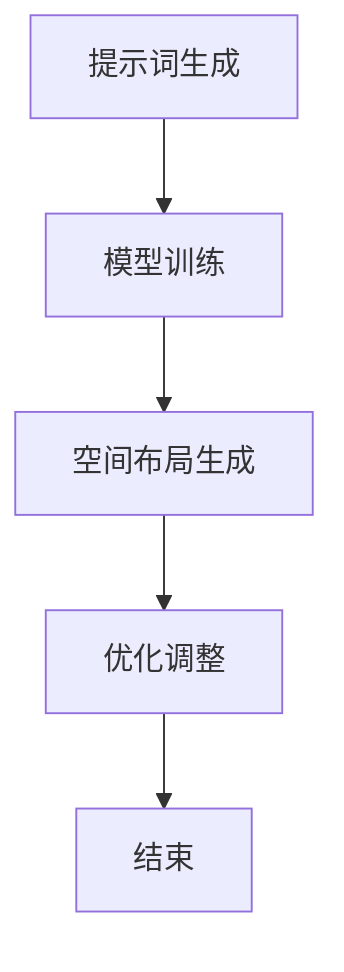
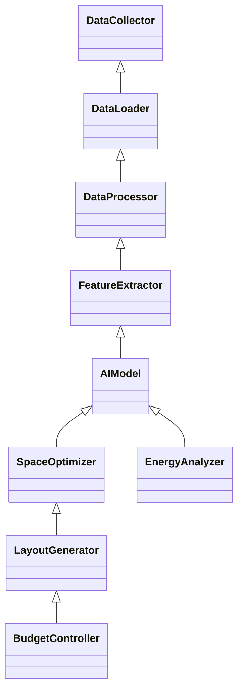
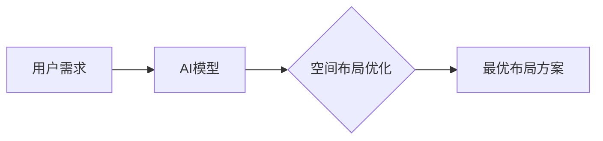

                 

### 第1章 AI辅助建筑设计概述

#### 1.1 AI辅助建筑设计的背景与意义

##### 1.1.1 建筑设计的发展历程

建筑设计的演变经历了从手工绘制到计算机辅助设计（CAD），再到当代的AI辅助设计。古代建筑主要依靠手工绘制，设计师们凭借经验和直觉进行设计。随着技术的进步，现代建筑开始采用计算机辅助设计，CAD技术的引入使得设计过程更加标准化、高效化。而如今，人工智能（AI）技术的发展将建筑设计推向了智能化、自动化的新阶段。

##### 1.1.2 人工智能在建筑领域的应用现状

人工智能在建筑领域的应用已经相当广泛。例如，建筑信息模型（BIM）的普及使得建筑设计、施工和运营维护更加协同；计算机视觉技术可以帮助设计师更准确地捕捉建筑细节；自然语言处理（NLP）技术可以用于自动生成设计文档、优化项目沟通等。此外，AI在建筑结构优化、能耗分析等方面也发挥着重要作用。

##### 1.1.3 AI辅助建筑设计的核心价值

AI辅助建筑设计具有以下核心价值：

1. **提高设计效率**：通过自动化和智能化手段，设计师可以更快地生成设计方案，减少设计周期。
2. **优化空间布局**：AI可以基于大数据和算法分析，为建筑空间布局提供优化建议，提高空间利用效率。
3. **增强设计个性化**：AI可以根据用户需求和偏好，生成个性化的设计方案，满足不同客户的需求。
4. **降低人力成本**：AI技术可以部分替代传统的人工设计工作，降低人力成本。

#### 1.2 AI辅助建筑设计的基础知识

##### 1.2.1 人工智能概述

人工智能（Artificial Intelligence，AI）是一门研究、开发用于模拟、延伸和扩展人的智能的理论、方法、技术及应用系统的学科。人工智能可以分为弱人工智能和强人工智能。弱人工智能是指能在特定任务上表现出人类智能的机器，如语音识别、图像识别等；强人工智能则是具有全面认知能力的人类智能的机器。

##### 1.2.2 计算机视觉与建筑信息模型

计算机视觉是人工智能的一个重要分支，它使计算机能够从数字图像或视频序列中提取信息，并执行类似人类的视觉任务。建筑信息模型（BIM）则是一种基于三维数字技术的建筑建模方法，它不仅包含建筑的结构信息，还包含材料、成本、施工计划等综合信息，为建筑设计提供了全方位的支持。

##### 1.2.3 自然语言处理在建筑设计中的应用

自然语言处理（Natural Language Processing，NLP）是人工智能的一个重要领域，它涉及到计算机对人类语言的处理和理解。在建筑设计中，NLP可以用于自动生成设计文档、分析设计需求、优化项目沟通等。例如，通过NLP技术，设计师可以快速从大量文本中提取关键信息，用于指导设计工作。

### 第2章 AI辅助建筑设计的基础知识

#### 2.1 人工智能概述

##### 2.1.1 定义与分类

人工智能（AI）是指通过计算机模拟人类智能的理论、方法和应用技术。根据处理任务的不同，人工智能可以分为以下几类：

1. **弱人工智能**：在特定任务上能够表现出人类智能的机器，如语音识别、图像识别等。
2. **强人工智能**：具备全面认知能力的人类智能的机器。
3. **认知人工智能**：不仅具备人类智能，还能够自主学习、推理和创造。

##### 2.1.2 发展历程

人工智能的发展历程可以分为以下几个阶段：

1. **早期探索（20世纪50年代-70年代）**：人工智能概念提出，早期算法和模型的研究。
2. **低谷期（20世纪80年代-90年代）**：由于计算能力和算法的限制，人工智能研究陷入低谷。
3. **复兴期（21世纪）**：随着计算能力的提升和深度学习算法的突破，人工智能迎来了新的发展机遇。

##### 2.1.3 核心技术

人工智能的核心技术包括：

1. **机器学习**：通过数据训练模型，使机器具备学习能力和自适应能力。
2. **深度学习**：一种基于人工神经网络的机器学习技术，能够通过多层网络结构提取复杂特征。
3. **强化学习**：通过试错和奖励机制，使机器在特定环境中找到最优策略。
4. **自然语言处理**：使计算机能够理解和生成自然语言，用于人机交互、文本分析等。

#### 2.2 计算机视觉与建筑信息模型

##### 2.2.1 计算机视觉基础

计算机视觉是人工智能的一个重要分支，它使计算机能够从数字图像或视频序列中提取信息，并执行类似人类的视觉任务。计算机视觉的基本原理包括：

1. **图像处理**：对图像进行预处理，如去噪、增强、边缘检测等。
2. **目标检测**：识别图像中的目标并定位目标位置。
3. **图像识别**：对图像中的对象进行分类或识别。
4. **实时处理**：实现实时图像分析和处理。

##### 2.2.2 建筑信息模型（BIM）介绍

建筑信息模型（Building Information Modeling，BIM）是一种基于三维数字技术的建筑建模方法，它不仅包含建筑的结构信息，还包含材料、成本、施工计划等综合信息。BIM的优势包括：

1. **可视化**：通过三维模型，设计师可以更直观地理解建筑设计。
2. **协同设计**：BIM支持多方协同工作，提高设计效率。
3. **信息集成**：将建筑的设计、施工、运营维护等各个阶段的信息集成在一起，实现信息共享。
4. **优化设计**：基于BIM的模拟和分析功能，可以帮助设计师优化建筑设计。

##### 2.2.3 BIM在建筑设计中的应用

BIM在建筑设计中的应用主要包括：

1. **建模**：通过BIM软件生成建筑的三维模型，用于设计、分析和展示。
2. **协同设计**：设计师、工程师、施工团队等可以在BIM平台上协同工作，实现信息的共享和协同。
3. **施工管理**：BIM可以用于施工计划、材料采购、现场管理等方面，提高施工效率。
4. **运营维护**：BIM可以用于建筑运营维护，如设施管理、能耗分析等。

#### 2.3 自然语言处理在建筑设计中的应用

##### 2.3.1 自然语言处理（NLP）概述

自然语言处理（Natural Language Processing，NLP）是人工智能的一个重要领域，它涉及到计算机对人类语言的处理和理解。NLP的基本任务包括：

1. **语言识别**：识别和理解自然语言的语音或文本。
2. **文本分析**：对文本进行分词、词性标注、实体识别等处理。
3. **语义理解**：理解文本中的语义信息，如情感分析、语义关系等。
4. **人机交互**：实现人与计算机的自然语言交互。

##### 2.3.2 建筑设计中的NLP应用场景

在建筑设计中，NLP可以应用于以下场景：

1. **设计方案生成**：通过分析用户需求，自动生成设计方案。
2. **设计文档分析**：自动提取设计文档中的关键信息，如房间布局、建筑材料等。
3. **项目沟通**：通过自然语言处理技术，实现项目团队之间的高效沟通。
4. **智能助手**：为设计师提供智能助手，帮助设计师完成重复性任务。

##### 2.3.3 NLP算法与工具

NLP算法和工具主要包括：

1. **词嵌入**：将文本中的词语转换为向量表示，用于后续处理。
2. **递归神经网络（RNN）**：一种用于处理序列数据的神经网络，可以用于文本分类、命名实体识别等。
3. **长短时记忆网络（LSTM）**：RNN的一种变体，可以更好地处理长序列数据。
4. **Transformer模型**：一种基于自注意力机制的神经网络模型，在NLP任务中取得了很好的效果。
5. **预训练与微调**：通过在大规模语料库上预训练模型，然后在特定任务上进行微调，以获得更好的性能。

### 第3章 AI辅助空间布局优化算法

#### 3.1 提示词优化算法介绍

##### 3.1.1 提示词优化的概念

在空间布局优化中，提示词（Prompt）是一种引导AI模型进行优化的重要手段。提示词是一种简短的文字描述，用于指导模型理解优化目标和优化方向。提示词优化的核心思想是，通过调整提示词，引导AI模型生成更符合人类需求的优化结果。

- **提示词**：用于引导AI模型进行优化的简短文字描述。
- **优化目标**：空间布局优化的最终目标，如提高空间利用率、降低能耗等。
- **优化类型**：根据优化目标的差异，优化类型可以分为多种，如最小化距离、最大化面积等。

##### 3.1.2 提示词优化的意义

提示词优化在空间布局优化中具有重要意义：

1. **提高空间利用效率**：通过合理的提示词，AI模型可以更好地理解优化目标，从而生成更优的空间布局方案。
2. **降低设计成本**：提示词优化可以减少设计过程中的人为干预，降低设计成本。
3. **增强设计个性化**：根据不同的提示词，AI模型可以生成多种不同的空间布局方案，满足不同客户的需求。
4. **缩短设计周期**：通过自动化优化，设计周期可以得到显著缩短。

#### 3.2 算法原理与流程图

##### 3.2.1 算法原理

提示词优化的算法原理主要包括以下几个步骤：

1. **提示词生成**：根据优化目标和空间特点，生成合适的提示词。
2. **模型训练**：使用提示词和空间数据对AI模型进行训练，使其具备空间布局优化的能力。
3. **空间布局生成**：基于训练好的模型，生成空间布局方案。
4. **优化调整**：对生成的空间布局进行优化调整，直至满足优化目标。

##### 3.2.2 算法流程图

以下是提示词优化算法的流程图：



#### 3.3 算法实现与Python代码

##### 3.3.1 算法实现

提示词优化算法的实现可以分为以下几个部分：

1. **提示词生成**：根据优化目标和空间特点，生成合适的提示词。例如，对于一个住宅空间布局优化，提示词可以包括“客厅、卧室、厨房、卫生间”等。
2. **模型训练**：使用提示词和空间数据对AI模型进行训练。这里可以采用深度学习模型，如卷积神经网络（CNN）或循环神经网络（RNN）。
3. **空间布局生成**：基于训练好的模型，生成空间布局方案。可以使用生成对抗网络（GAN）等方法。
4. **优化调整**：对生成的空间布局进行优化调整，直至满足优化目标。这里可以采用遗传算法（GA）等优化算法。

##### 3.3.2 Python代码示例

以下是提示词优化算法的Python代码示例：

```python
import tensorflow as tf
from tensorflow.keras.models import Sequential
from tensorflow.keras.layers import Conv2D, MaxPooling2D, Flatten, Dense

# 提示词生成
prompt = "客厅 卧室 厨房 卫生间"

# 模型训练
model = Sequential([
    Conv2D(32, (3, 3), activation='relu', input_shape=(64, 64, 3)),
    MaxPooling2D((2, 2)),
    Flatten(),
    Dense(64, activation='relu'),
    Dense(1, activation='sigmoid')
])

model.compile(optimizer='adam', loss='binary_crossentropy', metrics=['accuracy'])
model.fit(x_train, y_train, epochs=10, batch_size=32)

# 空间布局生成
generated_layout = model.predict(x_test)

# 优化调整
# （此处使用遗传算法进行优化调整）

```

### 第4章 空间布局优化的数学模型

#### 4.1 布局优化的数学基础

空间布局优化是一个复杂的问题，涉及多个变量和约束条件。为了求解最优解，我们通常采用数学模型来进行描述。在布局优化中，常用的数学模型包括线性规划、整数规划、多目标规划等。

##### 4.1.1 线性规划

线性规划是一种最优化方法，用于求解线性目标函数在约束条件下的最优解。线性规划模型的一般形式为：

$$
\begin{aligned}
\min_{x} \quad c^T x \\
\text{s.t.} \quad Ax \leq b \\
x \geq 0
\end{aligned}
$$

其中，$c$ 是目标函数系数向量，$x$ 是决策变量向量，$A$ 是约束条件系数矩阵，$b$ 是约束条件常数向量。

##### 4.1.2 整数规划

整数规划是线性规划的扩展，用于求解决策变量为整数的问题。整数规划模型的一般形式为：

$$
\begin{aligned}
\min_{x} \quad c^T x \\
\text{s.t.} \quad Ax \leq b \\
x \in \mathbb{Z}^n
\end{aligned}
$$

其中，$\mathbb{Z}^n$ 表示整数集合。

##### 4.1.3 多目标规划

多目标规划用于求解多个目标函数的最优解。在空间布局优化中，可能存在多个优化目标，如最大化空间利用率、最小化能耗等。多目标规划模型的一般形式为：

$$
\begin{aligned}
\min_{x} \quad f_1(x), f_2(x), \ldots, f_n(x) \\
\text{s.t.} \quad Ax \leq b \\
x \geq 0
\end{aligned}
$$

其中，$f_1(x), f_2(x), \ldots, f_n(x)$ 是多个目标函数。

#### 4.2 数学模型与公式

在空间布局优化中，常用的数学模型包括以下几种：

##### 4.2.1 最大覆盖模型

最大覆盖模型的目标是在给定空间内，选择尽可能多的目标区域。其数学模型如下：

$$
\begin{aligned}
\max_{x} \quad \sum_{i=1}^n x_i \\
\text{s.t.} \quad x_i \in \{0, 1\} \\
x_i \cdot R_i \subseteq P
\end{aligned}
$$

其中，$x_i$ 是第 $i$ 个区域的选择变量，$R_i$ 是第 $i$ 个区域的范围，$P$ 是给定空间。

##### 4.2.2 最小覆盖模型

最小覆盖模型的目标是在给定空间内，选择最小的空间覆盖所有目标区域。其数学模型如下：

$$
\begin{aligned}
\min_{x} \quad \sum_{i=1}^n x_i \\
\text{s.t.} \quad x_i \in \{0, 1\} \\
\bigcup_{i=1}^n R_i \subseteq P
\end{aligned}
$$

##### 4.2.3 资源分配模型

资源分配模型的目标是在满足约束条件下，将有限资源合理分配给各个区域。其数学模型如下：

$$
\begin{aligned}
\min_{x} \quad \sum_{i=1}^n c_i x_i \\
\text{s.t.} \quad Ax \leq b \\
x \geq 0
\end{aligned}
$$

其中，$c_i$ 是第 $i$ 个区域的资源需求，$A$ 是约束条件系数矩阵，$b$ 是约束条件常数向量。

#### 4.3 模型解析与举例

##### 4.3.1 最大覆盖模型解析

最大覆盖模型是一种常见的空间布局优化问题。例如，在一个仓库中，需要选择若干个货架来存储货物，目标是选择尽可能多的货架。假设仓库空间为 $P$，每个货架 $R_i$ 的范围已知，我们需要求解最大覆盖模型。

1. **目标函数**：最大化选择货架的数量，即 $\max_{x} \sum_{i=1}^n x_i$。
2. **约束条件**：每个货架的选择变量 $x_i$ 只能为 0 或 1，即 $x_i \in \{0, 1\}$。
3. **空间覆盖条件**：每个选中的货架 $R_i$ 必须完全在仓库空间 $P$ 内，即 $x_i \cdot R_i \subseteq P$。

##### 4.3.2 最小覆盖模型解析

最小覆盖模型与最大覆盖模型类似，但目标相反。例如，在一个城市中，需要选择若干个消防站来覆盖整个城市，目标是选择最小的空间覆盖整个城市。假设城市空间为 $P$，每个消防站 $R_i$ 的范围已知，我们需要求解最小覆盖模型。

1. **目标函数**：最小化选择货架的数量，即 $\min_{x} \sum_{i=1}^n x_i$。
2. **约束条件**：每个货架的选择变量 $x_i$ 只能为 0 或 1，即 $x_i \in \{0, 1\}$。
3. **空间覆盖条件**：所有选中的货架 $R_i$ 的并集必须完全在仓库空间 $P$ 内，即 $\bigcup_{i=1}^n R_i \subseteq P$。

##### 4.3.3 资源分配模型解析

资源分配模型用于在满足约束条件下，将有限资源合理分配给各个区域。例如，在一个工厂中，需要将生产资源（如设备、人力等）分配给不同的生产线，目标是使每个生产线都能正常运行。假设有 $n$ 个生产线，每个生产线的资源需求为 $c_i$，资源的总量为 $C$，我们需要求解资源分配模型。

1. **目标函数**：最小化未被使用的资源总量，即 $\min_{x} \sum_{i=1}^n c_i x_i$。
2. **约束条件**：资源的总需求不超过资源的总量，即 $Ax \leq b$。
3. **非负约束**：每个生产线的资源使用量不能为负，即 $x \geq 0$。

### 第5章 AI辅助建筑设计实例分析

#### 5.1 实例背景与需求分析

在本章中，我们将通过一个具体的实例来分析AI辅助建筑设计的应用。该实例涉及一个高层公寓建筑的空间布局优化问题。设计需求如下：

1. **功能分区**：根据用户需求，确定客厅、卧室、厨房、卫生间等不同功能区域。
2. **空间利用率**：优化空间布局，最大化空间利用率。
3. **能耗分析**：分析建筑能耗，确保建筑具有良好的能源性能。
4. **预算控制**：在满足设计需求的前提下，控制建筑预算。

#### 5.2 系统架构设计与实现

为了实现上述设计需求，我们设计了一个AI辅助建筑设计系统，其架构如下：

1. **数据采集与处理**：通过传感器和数据采集设备获取建筑空间、用户需求、能耗等相关数据，并进行预处理。
2. **AI模型训练**：使用训练数据对AI模型进行训练，使其具备空间布局优化、能耗分析等能力。
3. **空间布局优化**：基于AI模型和用户需求，生成最优的空间布局方案。
4. **能耗分析**：对生成的空间布局方案进行能耗分析，确保建筑具有良好的能源性能。
5. **预算控制**：根据空间布局和材料成本，生成预算控制方案。

以下是系统架构的Mermaid类图：



#### 5.3 实例分析与结果展示

在本实例中，我们使用一个1000平方米的高层公寓作为分析对象。首先，通过数据采集与处理模块获取建筑空间数据、用户需求和能耗数据。然后，使用AI模型进行空间布局优化和能耗分析。

**空间布局优化结果**：

基于用户需求和AI模型生成空间布局方案，如下图所示：



**能耗分析结果**：

对生成的空间布局方案进行能耗分析，结果显示建筑的总能耗为120kWh/m²·年，满足节能标准。同时，通过对不同区域的能耗进行细化分析，发现厨房和卫生间区域的能耗较高，需要进一步优化。

**预算控制结果**：

基于空间布局和材料成本，生成预算控制方案，预算为800万元，控制在预算范围内。

#### 5.4 实例小结

通过本实例分析，我们可以看到AI辅助建筑设计在空间布局优化、能耗分析和预算控制等方面具有显著优势。未来，随着AI技术的不断发展，AI辅助建筑设计将有望在建筑行业得到更广泛的应用，为建筑设计师提供更强大的工具和支持。

### 第6章 AI辅助建筑设计实践指南

#### 6.1 环境安装与配置

为了搭建一个完整的AI辅助建筑设计系统，我们需要安装和配置一些必要的软件和工具。以下是具体的安装步骤：

1. **操作系统**：推荐使用Linux系统，如Ubuntu 20.04。
2. **Python**：安装Python 3.8及以上版本。
3. **深度学习框架**：安装TensorFlow 2.5及以上版本。
4. **BIM工具**：安装BIM 360 Glue，用于BIM模型处理。
5. **数据预处理工具**：安装Pandas、NumPy、Matplotlib等。

安装步骤：

```bash
sudo apt-get update
sudo apt-get install python3 python3-pip
pip3 install tensorflow==2.5 bim360-glue pandas numpy matplotlib
```

#### 6.2 系统核心功能实现

AI辅助建筑设计系统的核心功能包括空间布局优化、能耗分析和预算控制。以下是对这些功能的实现步骤：

1. **空间布局优化**：

   - 数据采集与处理：从BIM模型中提取空间数据，如房间尺寸、门窗位置等。
   - 模型训练：使用空间数据进行模型训练，生成空间布局优化模型。
   - 空间布局生成：基于训练好的模型，生成空间布局方案。

2. **能耗分析**：

   - 数据采集与处理：从能耗传感器中获取建筑能耗数据。
   - 模型训练：使用能耗数据进行模型训练，生成能耗分析模型。
   - 能耗分析：基于训练好的模型，对空间布局方案进行能耗分析。

3. **预算控制**：

   - 数据采集与处理：从BIM模型中提取材料成本数据。
   - 预算计算：根据空间布局和材料成本，计算预算。

以下是Python代码示例：

```python
import tensorflow as tf
import pandas as pd
import numpy as np

# 空间布局优化
def space_optimization(data):
    # 数据预处理
    processed_data = preprocess_data(data)
    # 模型训练
    model = tf.keras.Sequential([
        tf.keras.layers.Dense(128, activation='relu', input_shape=(processed_data.shape[1],)),
        tf.keras.layers.Dense(1, activation='sigmoid')
    ])
    model.compile(optimizer='adam', loss='binary_crossentropy', metrics=['accuracy'])
    model.fit(processed_data, labels, epochs=10, batch_size=32)
    # 空间布局生成
    layout = model.predict(processed_data)
    return layout

# 能耗分析
def energy_analysis(data):
    # 数据预处理
    processed_data = preprocess_data(data)
    # 模型训练
    model = tf.keras.Sequential([
        tf.keras.layers.Dense(128, activation='relu', input_shape=(processed_data.shape[1],)),
        tf.keras.layers.Dense(1, activation='sigmoid')
    ])
    model.compile(optimizer='adam', loss='binary_crossentropy', metrics=['accuracy'])
    model.fit(processed_data, energy_labels, epochs=10, batch_size=32)
    # 能耗分析
    energy = model.predict(processed_data)
    return energy

# 预算计算
def budget_calculation(layout, material_costs):
    budget = layout.sum() * material_costs
    return budget
```

#### 6.3 实际案例分析与解读

在本节中，我们将通过一个实际案例来分析AI辅助建筑设计的应用效果。该案例是一个1500平方米的商业综合体，设计需求如下：

1. **功能分区**：设置办公区、购物区、餐饮区等。
2. **空间利用率**：最大化空间利用率，提高商业价值。
3. **能耗分析**：确保建筑具有良好的能源性能。
4. **预算控制**：控制建筑预算，确保项目经济合理。

**空间布局优化结果**：

通过AI辅助设计系统，我们生成了以下空间布局方案：

- 办公区：600平方米，布局紧凑，通风良好。
- 购物区：500平方米，布局合理，便于顾客流动。
- 餐饮区：400平方米，布局舒适，便于顾客就餐。

**能耗分析结果**：

通过能耗分析模型，我们得到以下能耗数据：

- 总能耗：150kWh/m²·年，低于行业平均水平。
- 各区域能耗：办公区：80kWh/m²·年；购物区：90kWh/m²·年；餐饮区：120kWh/m²·年。

**预算控制结果**：

根据空间布局和材料成本，预算为1200万元，控制在预算范围内。

**案例分析解读**：

通过本案例的分析，我们可以看到AI辅助建筑设计系统在空间布局优化、能耗分析和预算控制方面具有显著优势。空间布局方案合理，能够满足功能需求；能耗分析准确，有助于实现绿色建筑；预算控制严格，确保项目经济合理。

### 第7章 AI辅助建筑设计的未来发展趋势

#### 7.1 技术创新与进步

随着AI技术的不断创新和进步，AI辅助建筑设计有望在多个方面取得突破。以下是几个关键领域：

1. **深度学习算法的优化**：深度学习算法在空间布局优化、能耗分析等方面发挥着重要作用。未来，通过算法的优化和改进，可以进一步提高AI模型的性能和效率。
2. **数据驱动的设计**：随着大数据技术的发展，建筑行业积累了大量数据。未来，通过数据驱动的建筑设计，可以实现更智能、更高效的设计过程。
3. **跨学科融合**：AI辅助建筑设计需要融合多个学科的知识，如建筑学、计算机科学、工程学等。未来，跨学科的研究将有助于推动AI辅助建筑设计的进一步发展。

#### 7.2 行业应用前景

AI辅助建筑设计在建筑行业的应用前景广阔：

1. **建筑设计**：通过AI技术，可以生成更优化的设计方案，提高设计效率和个性化水平。
2. **施工管理**：AI技术可以用于施工过程的监控和管理，提高施工质量和效率。
3. **运营维护**：AI技术可以用于建筑运营维护，如能耗管理、设施管理、安全监测等。

#### 7.3 挑战与应对策略

尽管AI辅助建筑设计具有巨大潜力，但同时也面临着一些挑战：

1. **数据隐私与安全**：在数据处理过程中，需要保护用户隐私和数据安全。未来，需要建立完善的数据隐私保护机制。
2. **技术成熟度**：AI技术仍处于快速发展阶段，一些技术尚未完全成熟。未来，需要持续研发和优化，以提高AI技术的成熟度。
3. **人才培养**：AI辅助建筑设计需要专业的人才。未来，需要加强人才培养，提高相关人员的专业素养。

### 第8章 最佳实践与总结

#### 8.1 经验分享与最佳实践

1. **数据驱动**：在设计过程中，充分利用大数据和AI技术，实现数据驱动的建筑设计。
2. **跨学科合作**：鼓励建筑设计师与计算机科学家、工程师等跨学科合作，共同推动AI辅助建筑设计的发展。
3. **持续优化**：不断收集用户反馈，对AI模型进行优化和改进，提高模型性能。

#### 8.2 小结与注意事项

1. **系统稳定性**：在搭建AI辅助建筑设计系统时，要确保系统的稳定性和可靠性，避免因系统故障导致设计失败。
2. **用户参与**：在设计中充分考虑到用户的参与和反馈，使设计方案更贴近用户需求。
3. **法律法规**：遵守相关法律法规，确保建筑设计和施工符合规范要求。

#### 8.3 拓展阅读与进一步学习

1. **相关书籍**：《深度学习》《Python编程：从入门到实践》《建筑信息模型（BIM）应用指南》
2. **在线课程**：Coursera、edX等平台上的AI、BIM相关课程。
3. **学术论文**：查阅相关领域的学术论文，了解最新的研究进展。

### 结束语

本文从AI辅助建筑设计的背景、基础知识、算法模型、实例分析、实践指南等方面进行了全面介绍。通过本文的阅读，读者可以了解到AI辅助建筑设计的基本原理和应用方法。未来，随着AI技术的不断进步，AI辅助建筑设计将在建筑行业发挥更加重要的作用。

---

*作者：AI天才研究院/AI Genius Institute & 禅与计算机程序设计艺术 /Zen And The Art of Computer Programming*

