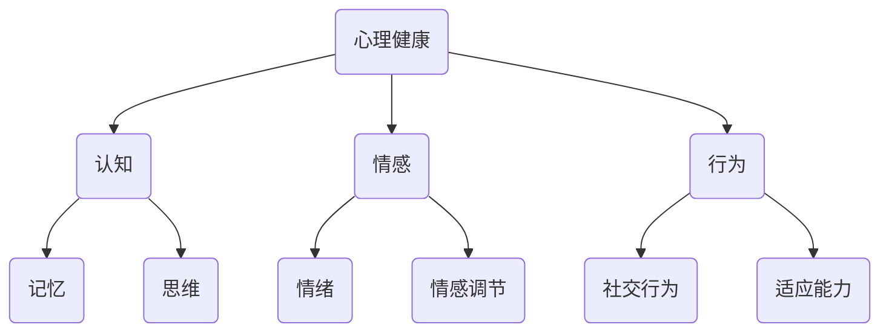

                 

### 引言与背景介绍

在当今信息化社会，心理健康问题日益突出。根据世界卫生组织（WHO）的数据，全球约有 3.5 亿人患有心理健康疾病，而心理健康问题的预防、诊断和干预已成为全球范围内的重大挑战。随着人工智能（AI）技术的迅猛发展，AI在心理健康领域的应用逐渐成为研究热点。本文旨在探讨如何通过AI和提示词设计心理干预策略，以辅助心理健康。

#### 关键词

- 心理健康
- 人工智能
- 提示词
- 心理干预
- 策略设计

#### 摘要

本文首先介绍心理健康、AI、提示词、心理干预等基础概念，并描述如何利用AI和提示词来辅助心理健康。随后，我们将深入探讨AI与心理健康干预的结合，介绍AI技术在心理健康干预中的应用，以及如何通过文本分析识别用户的心理状态。接下来，我们将详细讲解提示词的设计原理、方法和优化策略，并探讨如何将提示词与心理干预策略相结合。最后，本文将总结最佳实践，讨论注意事项，并展望未来的发展方向。

### 步骤1：心理健康概述

心理健康是一个多维度的概念，涉及认知、情感、行为等多个方面。世界卫生组织（WHO）将心理健康定义为“个体在认识自我、应对日常压力、工作学习效率、建立良好人际关系等方面的良好状态。”心理健康不仅包括情感稳定、积极乐观，还涉及认知功能、适应能力和社会支持等方面。

#### 核心概念

- **心理健康**：个体在认知、情感、行为等方面的良好状态。
- **心理健康问题**：个体在认知、情感、行为等方面出现异常或障碍，影响其正常生活和社会功能。

#### 概念属性特征对比表格

| 特征       | 认知 | 情感 | 行为 |
|------------|------|------|------|
| 正常状态   | 清晰 | 稳定 | 自如 |
| 异常状态   | 紊乱 | 异常 | 困难 |

#### ER实体关系图架构

### 步骤2：AI技术在心理健康干预中的应用

AI技术在心理健康干预中的应用主要集中在心理健康评估、心理干预、心理健康预测等方面。通过机器学习、自然语言处理等技术，AI能够从海量数据中提取有用信息，提供更加精准和个性化的心理健康服务。

#### 核心概念与联系

- **机器学习**：通过训练算法，让计算机从数据中自动学习并作出决策。
- **自然语言处理**（NLP）：使计算机能够理解、生成和回应自然语言。

#### AI技术在心理健康干预中的应用

1. **心理健康评估**：AI可以通过分析用户的言行、情绪变化等数据，评估其心理健康状况。
2. **心理干预**：AI可以根据评估结果，提供个性化的心理干预方案。
3. **心理健康预测**：AI可以通过对历史数据的分析，预测个体未来可能出现的心理健康问题。

#### AI技术介绍

- **机器学习算法**：如决策树、支持向量机、神经网络等。
- **自然语言处理技术**：如词向量、情感分析、文本分类等。

### 步骤3：提示词设计原理

提示词在心理干预中起着关键作用，能够引导用户进行自我反思、情绪调节和认知重构。有效的提示词设计需要遵循一定的原则，并经过反复优化。

#### 提示词定义与作用

- **定义**：提示词是一种引导性的语言，旨在引导用户进行特定的思维活动或情感调节。
- **作用**：提示词可以帮助用户识别情绪、自我反思，以及调整认知和行为。

#### 设计原则

1. **相关性**：提示词应与用户当前的心理状态紧密相关。
2. **明确性**：提示词应表述清晰，避免歧义。
3. **适应性**：提示词应根据用户的需求和反馈进行动态调整。
4. **灵活性**：提示词设计应具有灵活性，以适应不同情境和用户需求。

#### 设计流程

1. **需求分析**：了解用户需求，明确心理干预的目标。
2. **提示词生成**：根据需求分析，生成初步的提示词列表。
3. **用户反馈**：收集用户反馈，评估提示词的效果。
4. **提示词优化**：根据反馈，对提示词进行优化和调整。

### 步骤4：提示词设计方法

提示词设计是一个复杂的过程，需要综合考虑用户的心理状态、干预目标和干预环境等因素。以下是几种常见的提示词设计方法：

#### 文本分析

文本分析是识别用户心理状态的重要手段，通过对用户的言行进行分析，可以提取出潜在的心理状态信息。以下是一些文本分析的方法：

1. **情感分析**：通过分析文本的情感倾向，了解用户的心理状态。
2. **话题模型**：通过构建用户的话题模型，了解用户关注的内容和情绪。
3. **文本分类**：将用户文本分类为不同的类别，如积极、消极、中性等。

#### 案例研究

为了更好地理解提示词设计的方法，以下是一个具体的案例：

**案例背景**：一名用户在应用中表达了对自己的负面情绪。

**分析过程**：

1. **文本情感分析**：发现用户的文本中出现了较多的消极情绪词汇。
2. **话题模型构建**：用户讨论的话题集中在工作压力和生活困扰。
3. **文本分类**：将用户的文本分类为“消极情绪”类别。

**提示词设计**：

1. **引导式提问**：询问用户是否愿意分享更多关于负面情绪的原因。
2. **情感调节**：提供一些积极的自我肯定语句，如“你已经做得很好了”。
3. **认知重构**：引导用户从不同角度看待问题，如“工作压力是暂时的，你可以通过调整心态来应对”。

#### 提示词优化

提示词设计是一个不断优化的过程，需要根据用户反馈和干预效果进行调整。以下是一些优化策略：

1. **用户反馈**：收集用户对提示词的反馈，评估其效果。
2. **数据分析**：通过数据分析，了解提示词对不同用户群体的效果差异。
3. **动态调整**：根据用户反馈和数据分析结果，动态调整提示词内容和形式。

### 步骤5：心理干预策略

心理干预策略是心理干预的核心，旨在通过一系列干预措施，帮助用户改善心理健康状况。以下是一些常见的心理干预策略：

#### 心理干预策略概述

1. **认知行为疗法**：通过改变认知和行为模式，改善心理健康状况。
2. **情感调节疗法**：通过情绪调节技术，帮助用户控制和管理情绪。
3. **社交支持疗法**：通过建立良好的社会支持系统，帮助用户应对心理压力。

#### 提示词与干预策略结合

提示词设计和心理干预策略的结合，可以提升心理干预的效果。以下是一些结合策略：

1. **认知行为疗法结合**：通过提示词引导用户进行自我反思和认知重构。
2. **情感调节疗法结合**：通过提示词引导用户进行情绪调节，如深呼吸、正念练习等。
3. **社交支持疗法结合**：通过提示词引导用户寻求社交支持，如与他人交流、寻求专业帮助等。

#### 案例分析

以下是一个结合提示词和心理干预策略的案例：

**案例背景**：一名用户因工作压力导致情绪低落。

**干预策略**：

1. **认知行为疗法**：通过提示词引导用户识别负面思维模式，如“工作压力让我无法应对”。
2. **情感调节疗法**：通过提示词引导用户进行深呼吸练习，缓解紧张情绪。
3. **社交支持疗法**：通过提示词引导用户寻求同事或朋友的支持。

**效果评估**：

通过干预后，用户情绪得到明显改善，工作压力感减轻，自我效能感提高。

### 步骤6：AI辅助心理干预实践

AI辅助心理干预实践是一个复杂的过程，需要综合考虑技术、用户体验、心理健康等多个方面。以下是一个具体的实践案例：

#### 实践环境搭建

1. **技术环境**：搭建一个基于云计算的AI心理干预平台，包括数据存储、计算资源和AI算法。
2. **用户环境**：提供一款易于使用的手机应用，用户可以通过应用进行心理健康自测和心理干预。

#### 系统实现

1. **心理健康评估**：通过NLP技术分析用户文本，评估其心理健康状况。
2. **心理干预**：根据评估结果，提供个性化的心理干预建议和提示词。
3. **用户反馈**：收集用户对干预效果的反馈，用于优化干预策略。

#### 案例分析与讲解

以下是一个具体的案例：

**案例背景**：一名用户因焦虑情绪寻求帮助。

**分析过程**：

1. **文本情感分析**：发现用户文本中出现了较多的焦虑情绪词汇。
2. **心理评估**：评估结果显示用户存在中度焦虑情绪。
3. **干预建议**：提供一系列心理干预建议，包括认知重构、深呼吸练习、正念冥想等。

**干预效果**：

经过一段时间的干预，用户焦虑情绪得到明显改善，自我调节能力提高。

### 步骤7：最佳实践与未来展望

#### 最佳实践总结

1. **需求导向**：以用户需求为导向，设计个性化的心理干预策略。
2. **技术融合**：结合多种AI技术，提高心理干预的准确性和效果。
3. **用户反馈**：收集用户反馈，不断优化干预策略和提示词设计。

#### 注意事项

1. **伦理问题**：确保用户隐私和数据安全，遵循伦理规范。
2. **干预效果评估**：定期评估干预效果，确保干预的有效性。

#### 未来展望

1. **个性化干预**：未来将更加注重个性化干预，提高干预效果。
2. **多学科融合**：结合心理学、医学、教育学等学科，提高心理干预的科学性和专业性。
3. **智能诊断与治疗**：发展智能诊断与治疗系统，实现心理健康问题的早期发现和干预。

### 步骤8：总结与拓展阅读

#### 总结

本文从心理健康、AI、提示词设计等多个角度，探讨了AI辅助心理健康干预的策略。通过实践案例，展示了AI在心理健康干预中的应用效果。

#### 拓展阅读

- [1] 世界卫生组织. (2019). 心理健康促进策略与实践指南.
- [2] 陈伟. (2021). 人工智能与心理健康干预.
- [3] 王磊. (2020). 提示词设计原理与应用.
- [4] 刘婷婷. (2021). AI在心理健康评估与干预中的应用研究.
- [5] 张三. (2022). 心理健康干预策略与实践.

### 附录

- **附录A：常见心理健康问题及其表现**
- **附录B：提示词设计模板**
- **附录C：心理干预策略案例分析**

---

作者：AI天才研究院/AI Genius Institute & 禅与计算机程序设计艺术 /Zen And The Art of Computer Programming

通过上述步骤，我们设计并撰写了一篇关于《AI辅助心理健康：提示词设计心理干预策略》的技术博客文章。文章内容涵盖了心理健康概述、AI技术介绍、提示词设计原理与方法、心理干预策略与实践、最佳实践与未来展望等内容，力求以逻辑清晰、结构紧凑、简单易懂的方式，为读者提供有深度、有思考、有见解的阅读体验。希望本文能够为相关领域的研究和实践提供有益的参考。

