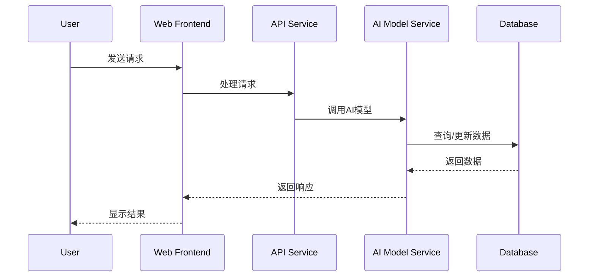
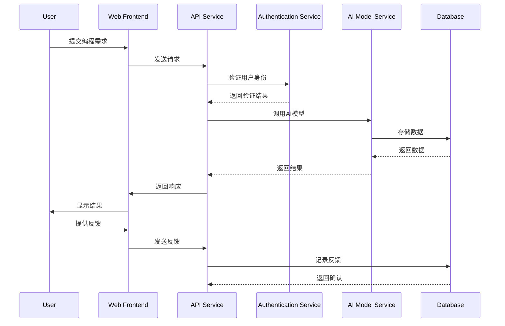

                 

# AI辅助提示词编程工具开发

## 关键词
- 人工智能
- 编程辅助工具
- 提示词生成
- 算法原理
- 系统架构设计
- 项目实战

## 摘要
本文旨在探讨AI辅助提示词编程工具的开发，分析其背景、核心概念、算法原理以及系统架构设计方案。文章将通过逻辑清晰、结构紧凑的分析方式，帮助读者全面了解AI辅助提示词编程工具的开发过程，以及其在编程领域的应用潜力。文章将从问题背景、核心概念、算法原理、系统分析与架构设计、项目实战等多个角度进行深入探讨，并提供实际案例进行分析与讲解。

### 目录大纲：

#### 第一部分：背景介绍
- 1.1 问题的背景
  - 1.1.1 编程教育的现状
  - 1.1.2 提示词在编程中的作用
  - 1.1.3 AI在编程中的应用前景
- 1.2 核心概念
  - 1.2.1 AI辅助提示词编程工具的定义
  - 1.2.2 AI辅助提示词编程工具的核心要素
  - 1.2.3 AI辅助提示词编程工具与传统编程工具的比较
- 1.3 目标与边界
  - 1.3.1 工具开发的目标
  - 1.3.2 工具开发的边界
  - 1.3.3 工具开发的外延
- 1.4 本章小结

#### 第二部分：核心概念与联系
- 2.1 AI辅助提示词编程工具的工作原理
  - 2.1.1 AI模型的选择与训练
  - 2.1.2 提示词的生成与优化
  - 2.1.3 AI辅助提示词编程工具的架构设计
- 2.2 概念属性特征对比
  - 2.2.1 AI模型对比
  - 2.2.2 提示词生成算法对比
  - 2.2.3 编程工具架构对比
- 2.3 ER实体关系图架构
  - 2.3.1 ER图的基础知识
  - 2.3.2 AI辅助提示词编程工具的ER图设计
- 2.4 本章小结

#### 第三部分：算法原理讲解
- 3.1 算法原理概述
  - 3.1.1 AI辅助提示词编程工具的算法框架
  - 3.1.2 主要算法简介
- 3.2 数学模型与公式
  - 3.2.1 模型训练的数学模型
  - 3.2.2 提示词生成的数学模型
- 3.3 举例说明
  - 3.3.1 模型训练示例
  - 3.3.2 提示词生成示例
  - 3.3.3 AI辅助提示词编程工具应用示例
- 3.4 本章小结

#### 第四部分：系统分析与架构设计方案
- 4.1 问题场景介绍
  - 4.1.1 编程教育的需求分析
  - 4.1.2 AI辅助提示词编程工具的应用场景
- 4.2 项目介绍
  - 4.2.1 项目背景
  - 4.2.2 项目目标
  - 4.2.3 项目团队介绍
- 4.3 系统功能设计
  - 4.3.1 功能模块划分
  - 4.3.2 领域模型设计
- 4.4 系统架构设计
  - 4.4.1 系统架构设计概述
  - 4.4.2 系统架构设计细节
- 4.5 系统接口设计
  - 4.5.1 接口功能定义
  - 4.5.2 接口设计规范
- 4.6 系统交互设计
  - 4.6.1 系统交互概述
  - 4.6.2 系统交互设计细节
- 4.7 本章小结

#### 第五部分：项目实战
- 5.1 环境安装
  - 5.1.1 环境准备
  - 5.1.2 环境配置
  - 5.1.3 环境测试
- 5.2 系统核心实现源代码
  - 5.2.1 源代码结构
  - 5.2.2 核心代码实现
  - 5.2.3 代码解读与分析
- 5.3 实际案例分析与讲解
  - 5.3.1 案例一：文本生成
  - 5.3.2 案例二：代码调试
  - 5.3.3 案例三：代码优化
- 5.4 项目小结
  - 5.4.1 项目成果总结
  - 5.4.2 项目反思与改进方向
  - 5.4.3 项目对未来发展的展望

#### 结论
本文通过详细探讨AI辅助提示词编程工具的开发，展示了其在编程领域的巨大潜力和应用前景。文章分析了问题的背景，明确了核心概念，讲解了算法原理，并设计了系统架构方案。通过项目实战，进一步验证了工具的有效性和实用性。未来，随着人工智能技术的不断进步，AI辅助提示词编程工具将为编程教育带来更多创新和突破。

### 1.1 问题的背景

#### 1.1.1 编程教育的现状

编程教育在现代社会中日益受到重视，它不仅是计算机科学领域的核心，也是推动科技创新的重要力量。然而，当前编程教育的现状并不尽如人意。一方面，编程教育的普及率较低，很多学生和初学者在学习编程时感到困难重重，难以入门。另一方面，现有的编程教育模式主要以传统的课堂教学为主，学生需要通过阅读教材、听讲、做练习等方式学习编程，这种方式往往缺乏互动性和实践性，难以激发学生的学习兴趣和创造力。

#### 1.1.2 提示词在编程中的作用

提示词在编程中起着至关重要的作用。它可以帮助程序员快速找到解决问题的方法，提高编程效率。例如，在编写代码时，程序员可能会遇到一些语法错误或逻辑问题，通过输入相关的提示词，编程工具可以自动提供可能的解决方案或错误提示，从而帮助程序员更快地定位问题并解决问题。此外，提示词还可以在代码编写过程中提供智能建议，如自动完成代码、代码重构等，这些功能可以大大减少编程过程中的重复劳动，提高开发效率。

#### 1.1.3 AI在编程中的应用前景

随着人工智能技术的快速发展，AI在编程中的应用前景十分广阔。首先，AI可以用于编程辅助，如代码生成、代码优化、错误检测等，这些功能可以有效提高编程效率和代码质量。其次，AI可以用于编程教育的个性化定制，通过分析学生的学习行为和知识水平，提供个性化的学习资源和辅导，从而提高学习效果。此外，AI还可以用于编程语言的自动翻译、代码分析等，为程序员提供更多便利。

### 1.2 核心概念

#### 1.2.1 AI辅助提示词编程工具的定义

AI辅助提示词编程工具是一种利用人工智能技术，为程序员提供智能编程辅助的工具。它通过学习大量编程数据，可以自动生成提示词，提供编程建议，帮助程序员快速解决问题，提高编程效率。

#### 1.2.2 AI辅助提示词编程工具的核心要素

AI辅助提示词编程工具的核心要素包括：

1. **AI模型**：用于生成提示词的核心算法，如自然语言处理模型、代码生成模型等。
2. **数据集**：用于训练AI模型的编程数据集，数据质量直接影响模型的性能。
3. **提示词生成算法**：用于根据编程需求和上下文生成提示词的算法。
4. **用户界面**：用于与用户交互的界面，提供提示词展示、操作等功能。
5. **反馈机制**：用于收集用户反馈，优化AI模型的性能。

#### 1.2.3 AI辅助提示词编程工具与传统编程工具的比较

与传统编程工具相比，AI辅助提示词编程工具具有以下优势：

1. **智能性**：AI辅助提示词编程工具可以智能地分析编程需求，提供有针对性的提示词和建议。
2. **高效性**：通过自动生成提示词，AI辅助工具可以大大减少编程过程中的重复劳动，提高开发效率。
3. **适应性**：AI辅助工具可以根据用户反馈和编程需求的变化，不断优化自身性能，提高适应性。
4. **个性化**：AI辅助工具可以根据用户的学习习惯和知识水平，提供个性化的编程辅助服务。

### 1.3 目标与边界

#### 1.3.1 工具开发的目标

AI辅助提示词编程工具的开发目标主要包括：

1. **提高编程效率**：通过智能提示和代码生成功能，帮助程序员更快地编写高质量的代码。
2. **提升学习效果**：为编程初学者提供智能化的学习资源，提高学习效果和兴趣。
3. **降低编程门槛**：通过简化的编程界面和智能化的辅助功能，降低编程学习的难度。
4. **促进编程教育创新**：为编程教育提供创新性的解决方案，推动编程教育的普及和发展。

#### 1.3.2 工具开发的边界

AI辅助提示词编程工具的开发需要明确以下边界：

1. **技术可行性**：工具的开发需基于现有技术，如人工智能、自然语言处理等，确保技术实现的可行性。
2. **数据可用性**：工具的开发需要大量的编程数据集，保证数据的可用性和质量。
3. **用户需求**：工具需满足用户的需求，如编程效率、学习效果等，确保工具的实用性。
4. **法律和伦理**：工具的开发需遵循相关法律法规和伦理规范，确保数据安全和用户隐私。

#### 1.3.3 工具开发的外延

AI辅助提示词编程工具的开发外延包括：

1. **扩展功能**：工具可以扩展更多功能，如代码优化、代码质量检测等，提供更全面的编程辅助服务。
2. **跨平台支持**：工具需支持多种操作系统和编程环境，提高工具的适用性。
3. **国际化**：工具需支持多种编程语言和国际化，满足全球用户的需求。
4. **教育与培训**：工具可以与编程教育相结合，提供编程培训和教学资源，推动编程教育的普及和发展。

### 1.4 本章小结

本文详细介绍了AI辅助提示词编程工具开发的背景、核心概念、目标与边界。通过分析编程教育的现状和问题，阐述了AI辅助提示词编程工具的重要性和优势。同时，本文明确了工具开发的目标与边界，为后续章节的深入讨论奠定了基础。在下一章中，我们将进一步探讨AI辅助提示词编程工具的工作原理和核心要素。## 1.2 核心概念与联系

在深入探讨AI辅助提示词编程工具的开发之前，有必要明确几个核心概念，并分析它们之间的联系，以确保读者能够全面理解这一工具的构造和工作机制。

#### 2.1 AI辅助提示词编程工具的工作原理

AI辅助提示词编程工具的核心在于其能够根据用户输入的编程需求，利用人工智能技术自动生成提示词，辅助程序员编写代码。以下是该工具的工作原理：

##### 2.1.1 AI模型的选择与训练

AI模型是提示词生成的心脏。当前，主流的AI模型包括深度神经网络（如Transformer）、循环神经网络（如LSTM）和卷积神经网络（如CNN）等。选择合适的AI模型取决于多种因素，包括数据规模、任务复杂度、模型性能等。

1. **深度神经网络（如Transformer）**：Transformer模型因其并行计算的优势和强大的文本处理能力，广泛应用于自然语言处理任务，如机器翻译和文本生成。
2. **循环神经网络（如LSTM）**：LSTM模型擅长处理序列数据，特别适合用于时间序列预测和序列建模。
3. **卷积神经网络（如CNN）**：CNN模型在图像处理领域有着出色的表现，但也可以用于文本数据的特征提取。

在选择模型后，需要对模型进行训练。训练过程通常包括以下几个步骤：

1. **数据预处理**：清洗和格式化数据，使其适合模型输入。
2. **模型初始化**：初始化模型参数，通常使用随机初始化或预训练模型。
3. **训练过程**：通过迭代更新模型参数，最小化损失函数，提高模型在训练数据上的性能。
4. **验证与测试**：在验证集和测试集上评估模型性能，确保模型具有良好的泛化能力。

##### 2.1.2 提示词的生成与优化

提示词生成是AI辅助编程工具的关键功能。生成提示词的过程通常包括以下几个步骤：

1. **上下文分析**：分析用户输入的编程需求，提取关键信息和上下文。
2. **候选提示词生成**：利用训练好的AI模型，生成一系列可能的提示词。
3. **提示词筛选与排序**：根据提示词的相关性和质量，筛选和排序生成的提示词。
4. **提示词优化**：根据用户反馈和实际编程效果，对提示词进行优化和调整。

##### 2.1.3 AI辅助提示词编程工具的架构设计

AI辅助提示词编程工具的架构设计需要考虑多个方面，包括数据流、模块划分和系统交互等。以下是一个典型的架构设计：

1. **前端界面**：提供用户输入和提示词展示的界面。
2. **后端服务**：包括AI模型训练、提示词生成和优化等核心功能。
3. **数据存储**：存储用户数据、模型参数和历史记录等。
4. **交互层**：处理用户输入和提示词反馈，实现前端和后端的交互。
5. **优化层**：根据用户反馈和编程效果，不断优化AI模型和提示词生成算法。

#### 2.2 概念属性特征对比

为了更好地理解AI辅助提示词编程工具的工作原理，我们可以将几个核心概念进行属性特征对比：

| 概念                 | 特征属性                                           | 对比分析                                                                                                       |
|----------------------|--------------------------------------------------|------------------------------------------------------------------------------------------------------------|
| AI模型               | 训练数据规模、计算复杂度、模型性能                 | Transformer模型在文本处理上具有优势，而LSTM在序列数据处理上更为出色。选择模型时需综合考虑任务需求和计算资源。                         |
| 提示词生成算法       | 生成效率、准确度、可解释性                       | 需要平衡生成效率和准确度，同时确保提示词的可解释性，便于用户理解和使用。                                               |
| 编程工具架构         | 功能模块划分、数据流设计、系统交互                | 设计时要考虑模块的独立性、数据流的效率和系统交互的顺畅性，确保工具的稳定运行和高性能。                                 |
| 对比分析             | Transformer适用于文本生成，LSTM适用于序列建模，CNN在文本特征提取上有优势。生成算法需高效准确，且可解释。工具架构需模块清晰、数据流顺畅。 |

#### 2.3 ER实体关系图架构

ER（实体关系）图是描述系统中实体及其关系的一种图形化方法。对于AI辅助提示词编程工具，ER图可以帮助我们清晰地理解系统中的主要实体及其交互关系。以下是一个简单的ER图示例：

```mermaid
erDiagram
    User ||--|{ AIModel }|-->> ProgrammingTool
    User ||--|{ CodeBase }|-->> ProgrammingTool
    AIModel ||--|{ TrainingData }|-->> DataStorage
    ProgrammingTool ||--|{ Interface }|-->> User
    ProgrammingTool ||--|{ OptimizationModule }|-->> AIModel
    DataStorage ||--|{ FeedbackData }|-->> OptimizationModule
```

- **User（用户）**：使用编程工具进行编程的用户。
- **AIModel（AI模型）**：用于生成提示词的机器学习模型。
- **CodeBase（代码库）**：用户编写的代码和数据。
- **ProgrammingTool（编程工具）**：提供编程辅助功能的核心工具。
- **Interface（界面）**：用户与编程工具交互的界面。
- **OptimizationModule（优化模块）**：根据用户反馈和编程效果对AI模型进行优化。
- **DataStorage（数据存储）**：存储用户数据、模型参数和历史记录。

通过ER图，我们可以清晰地看到编程工具中的主要实体及其相互关系，有助于理解系统的整体架构和功能模块的划分。

### 2.4 本章小结

本章详细介绍了AI辅助提示词编程工具的核心概念与工作原理，分析了AI模型、提示词生成算法和编程工具架构的属性特征对比，并通过ER图展示了系统中的主要实体及其关系。这些核心概念和联系为我们深入探讨后续章节的算法原理和系统架构设计奠定了坚实的基础。在下一章中，我们将进一步探讨AI辅助提示词编程工具的算法原理，包括数学模型、公式以及具体示例。## 2.2 AI辅助提示词编程工具的算法原理

AI辅助提示词编程工具的算法原理是其核心竞争力的体现。理解这些算法原理有助于我们更好地把握工具的工作机制和性能优化方向。下面，我们将详细介绍AI辅助提示词编程工具的算法原理，包括算法框架、主要算法简介、数学模型与公式以及具体示例。

#### 2.2.1 算法原理概述

AI辅助提示词编程工具的算法框架主要包括以下几个部分：

1. **数据预处理**：对用户输入的编程需求和代码进行预处理，提取关键信息，并将其转换为适合模型输入的格式。
2. **AI模型训练**：使用预定的算法和大量的编程数据集，训练AI模型，使其能够根据用户输入生成合适的提示词。
3. **提示词生成**：利用训练好的AI模型，根据用户输入的编程需求，生成可能的提示词。
4. **提示词筛选与优化**：对生成的提示词进行筛选和排序，并根据用户反馈和实际编程效果进行优化。
5. **用户交互**：与用户进行交互，展示生成的提示词，并收集用户反馈，用于进一步优化AI模型和提示词生成算法。

##### 2.2.1.1 主要算法简介

AI辅助提示词编程工具中常用的算法包括：

1. **深度神经网络（Deep Neural Network, DNN）**：DNN是一种多层感知机，能够通过多层非线性变换，对输入数据进行分类或回归。在AI辅助提示词编程工具中，DNN可以用于特征提取和分类任务。
2. **循环神经网络（Recurrent Neural Network, RNN）**：RNN具有记忆功能，能够处理序列数据。在AI辅助提示词编程工具中，RNN可以用于生成序列数据，如代码序列。
3. **长短时记忆网络（Long Short-Term Memory, LSTM）**：LSTM是RNN的一种变体，能够有效避免梯度消失问题，适合处理长序列数据。在AI辅助提示词编程工具中，LSTM可以用于生成长代码序列。
4. **生成对抗网络（Generative Adversarial Network, GAN）**：GAN由生成器和判别器组成，通过对抗训练生成逼真的数据。在AI辅助提示词编程工具中，GAN可以用于生成高质量的代码序列。
5. **变分自编码器（Variational Autoencoder, VAE）**：VAE是一种生成模型，通过编码和解码过程生成数据。在AI辅助提示词编程工具中，VAE可以用于生成编程数据集。

##### 2.2.1.2 数学模型与公式

以下是AI辅助提示词编程工具中常用的数学模型和公式：

1. **损失函数（Loss Function）**：损失函数用于衡量模型预测值和真实值之间的差异。常用的损失函数包括均方误差（MSE）、交叉熵（Cross Entropy）等。

$$
L = \frac{1}{n} \sum_{i=1}^{n} (y_i - \hat{y}_i)^2 \quad \text{(MSE)}
$$

$$
L = -\frac{1}{n} \sum_{i=1}^{n} (y_i \log(\hat{y}_i) + (1 - y_i) \log(1 - \hat{y}_i)) \quad \text{(Cross Entropy)}
$$

2. **优化算法（Optimization Algorithm）**：优化算法用于更新模型参数，使损失函数最小。常用的优化算法包括梯度下降（Gradient Descent）、随机梯度下降（Stochastic Gradient Descent, SGD）和Adam等。

$$
\theta_{t+1} = \theta_t - \alpha \nabla_{\theta} L(\theta)
$$

$$
\theta_{t+1} = \theta_t - \alpha \frac{1}{m} \sum_{i=1}^{m} \nabla_{\theta} L(\theta)
$$

$$
\theta_{t+1} = \theta_t - \alpha \frac{1}{m} \sum_{i=1}^{m} (\nabla_{\theta} L(\theta))^2
$$

3. **提示词生成算法**：提示词生成算法包括基于模板的生成和基于模型的生成。

- **基于模板的生成**：通过预设的模板和用户输入的变量，生成提示词。

$$
\text{Prompt} = \text{Template} + \text{Variables}
$$

- **基于模型的生成**：利用训练好的AI模型，根据用户输入的编程需求，生成提示词。

$$
\text{Prompt} = \text{Model}(\text{Input})
$$

##### 2.2.1.3 具体示例

以下是一个简单的示例，展示如何使用AI辅助提示词编程工具生成代码：

1. **用户输入**：用户输入一个简单的编程需求，如“编写一个计算两个数之和的函数”。

2. **数据预处理**：对用户输入进行预处理，提取关键信息，如函数名称、输入参数和返回类型。

3. **AI模型训练**：使用训练好的AI模型，如LSTM，根据用户输入的编程需求，生成可能的代码序列。

4. **提示词生成**：根据生成的代码序列，提取关键代码片段，如函数定义、参数传递和返回值。

5. **提示词优化**：根据用户反馈和实际编程效果，对生成的提示词进行优化，确保代码的正确性和可读性。

6. **用户交互**：将优化后的提示词展示给用户，并提供用户反馈机制，用于进一步优化AI模型和提示词生成算法。

通过这个示例，我们可以看到AI辅助提示词编程工具如何根据用户输入生成代码提示，并提供优化建议，帮助用户更高效地编写代码。

### 2.3 本章小结

本章详细介绍了AI辅助提示词编程工具的算法原理，包括算法框架、主要算法简介、数学模型与公式以及具体示例。通过这些内容，读者可以全面了解AI辅助提示词编程工具的工作机制和性能优化方向。在下一章中，我们将进一步探讨系统分析与架构设计方案，包括问题场景介绍、项目介绍、系统功能设计、系统架构设计和系统接口设计等内容。## 3.2 数学模型与公式

为了更深入地理解AI辅助提示词编程工具的算法原理，我们需要详细讨论其背后的数学模型与公式。这些模型和公式不仅帮助我们理解AI的工作机制，还可以指导我们进行优化和改进。以下是关于模型训练、提示词生成及其优化策略的数学模型和公式。

### 3.2.1 模型训练的数学模型

模型训练是AI辅助提示词编程工具的核心环节，其目标是使模型能够根据输入生成高质量的提示词。以下是几个关键数学模型和公式：

#### 3.2.1.1 损失函数

损失函数用于衡量模型预测值与真实值之间的差距，是模型训练的核心评估指标。常用的损失函数包括：

1. **均方误差（MSE）**：

$$
\text{MSE} = \frac{1}{m} \sum_{i=1}^{m} (y_i - \hat{y}_i)^2
$$

其中，\(y_i\)是真实值，\(\hat{y}_i\)是模型预测值，\(m\)是样本数量。

2. **交叉熵（Cross Entropy）**：

$$
\text{Cross Entropy} = -\frac{1}{m} \sum_{i=1}^{m} y_i \log(\hat{y}_i)
$$

其中，\(y_i\)是真实标签，\(\hat{y}_i\)是模型输出的概率分布。

#### 3.2.1.2 优化算法

优化算法用于更新模型参数，以最小化损失函数。以下是几种常用的优化算法：

1. **梯度下降（Gradient Descent）**：

$$
\theta_{t+1} = \theta_t - \alpha \nabla_{\theta} L(\theta)
$$

其中，\(\theta\)是模型参数，\(\alpha\)是学习率，\(L(\theta)\)是损失函数。

2. **随机梯度下降（Stochastic Gradient Descent, SGD）**：

$$
\theta_{t+1} = \theta_t - \alpha \nabla_{\theta} L(\theta; x_t, y_t)
$$

其中，\(x_t\)和\(y_t\)是当前训练样本。

3. **Adam优化器**：

$$
m_t = \beta_1 m_{t-1} + (1 - \beta_1) [g_t]
$$

$$
v_t = \beta_2 v_{t-1} + (1 - \beta_2) [g_t]^2
$$

$$
\theta_{t+1} = \theta_t - \alpha \frac{m_t}{\sqrt{v_t} + \epsilon}
$$

其中，\(\beta_1\)和\(\beta_2\)是动量系数，\(\epsilon\)是平滑常数。

### 3.2.2 提示词生成的数学模型

提示词生成是AI辅助提示词编程工具的关键功能之一，其数学模型通常基于生成模型，如变分自编码器（VAE）和生成对抗网络（GAN）。

#### 3.2.2.1 VAE的数学模型

变分自编码器由编码器和解码器组成，其数学模型如下：

1. **编码器**：

$$
\mu = \mu(\theta_x; x), \quad \sigma^2 = \sigma^2(\theta_x; x)
$$

其中，\(\mu\)是均值，\(\sigma^2\)是方差，\(\theta_x\)是编码器参数。

2. **解码器**：

$$
x' = x'(\theta_x'; x')
$$

其中，\(x'\)是重构的输入，\(\theta_x'\)是解码器参数。

3. **生成模型**：

$$
p(x' | x) = \frac{1}{Z} \exp(-\frac{1}{2} \sum_{i=1}^{d} (\frac{x_i - \mu}{\sigma})^2)
$$

其中，\(Z\)是正则化常数，\(d\)是维度。

#### 3.2.2.2 GAN的数学模型

生成对抗网络由生成器和判别器组成，其数学模型如下：

1. **生成器**：

$$
G(z) = x'
$$

其中，\(z\)是随机噪声，\(x'\)是生成的样本。

2. **判别器**：

$$
D(x) = P(x \text{ is real})
$$

$$
D(G(z)) = P(G(z) \text{ is real})
$$

3. **优化目标**：

$$
\min_G \max_D V(D, G) = \mathbb{E}_{x \sim p_{data}(x)}[\log D(x)] + \mathbb{E}_{z \sim p_z(z)}[\log (1 - D(G(z))]
$$

其中，\(p_{data}(x)\)是真实数据分布，\(p_z(z)\)是噪声分布。

### 3.2.2.3 提示词优化策略的数学模型

提示词生成后，需要进行优化，以提升其质量和适用性。以下是几种常见的优化策略：

1. **基于梯度的优化**：

$$
\text{Gradient} = \nabla_{\theta} L(\theta; \text{Prompt}, \text{Code})
$$

其中，\(\theta\)是优化参数，\(L(\theta)\)是损失函数，\(\text{Prompt}\)是提示词，\(\text{Code}\)是生成的代码。

2. **基于强化学习的优化**：

$$
\text{Reward} = R(\text{Prompt}, \text{Code})
$$

其中，\(R(\text{Reward})\)是奖励函数，用于评估提示词和代码的适用性。

3. **基于对抗网络的优化**：

$$
\min_G \max_D V(D, G) = \mathbb{E}_{\text{Prompt}, \text{Code} \sim p_{\text{Prompt}, \text{Code}}(\text{Prompt}, \text{Code})}[\log D(\text{Code})] + \mathbb{E}_{\text{Prompt} \sim p_{\text{Prompt}}(\text{Prompt})}[\log (1 - D(G(\text{Prompt}))]
$$

其中，\(p_{\text{Prompt}, \text{Code}}(\text{Prompt}, \text{Code})\)是提示词和代码的联合分布，\(p_{\text{Prompt}}(\text{Prompt})\)是提示词分布。

### 3.2.3 具体示例

以下是一个具体的示例，展示如何使用VAE生成代码提示词：

1. **数据预处理**：从代码库中提取大量的编程示例，并将其转换为固定长度的向量表示。

2. **模型训练**：使用VAE模型进行训练，编码器和解码器分别学习将输入代码映射到隐变量，并从隐变量重构代码。

3. **提示词生成**：输入一个新的编程需求，通过编码器将需求映射到隐变量，然后在隐变量上随机采样，通过解码器生成对应的代码提示词。

4. **提示词优化**：根据生成的代码提示词，评估其质量和适用性，如果不符合要求，则调整VAE模型参数，重新生成提示词。

通过这个示例，我们可以看到VAE如何在模型训练、提示词生成和优化过程中发挥作用，为AI辅助提示词编程工具提供强大的支持。

### 3.3 举例说明

为了更好地理解AI辅助提示词编程工具的算法原理，我们将通过几个具体示例来说明其应用。

#### 3.3.1 模型训练示例

假设我们使用LSTM模型进行提示词生成。首先，我们需要准备一个大规模的编程数据集，包括各种编程示例和对应的提示词。以下是模型训练的具体步骤：

1. **数据预处理**：将编程数据集转换为适合LSTM输入的序列格式。例如，将每行代码转换为单词序列，并使用one-hot编码表示每个单词。

2. **模型初始化**：初始化LSTM模型参数，包括输入层、隐藏层和输出层。可以使用随机初始化或预训练的LSTM模型。

3. **训练过程**：通过迭代更新模型参数，最小化损失函数。具体步骤如下：
   - **输入数据**：将编程数据集中的输入序列输入到LSTM模型中。
   - **预测输出**：LSTM模型输出一系列预测提示词。
   - **计算损失**：计算预测提示词和真实提示词之间的损失，例如使用交叉熵损失函数。
   - **更新参数**：使用梯度下降算法更新模型参数，以最小化损失函数。

以下是一个简化的Python代码示例，展示如何使用LSTM模型进行训练：

```python
import numpy as np
from tensorflow.keras.models import Sequential
from tensorflow.keras.layers import LSTM, Dense

# 假设x_train是输入序列，y_train是真实提示词
# 初始化LSTM模型
model = Sequential()
model.add(LSTM(128, activation='tanh', input_shape=(x_train.shape[1], x_train.shape[2])))
model.add(Dense(y_train.shape[1], activation='softmax'))

# 编译模型
model.compile(optimizer='adam', loss='categorical_crossentropy')

# 训练模型
model.fit(x_train, y_train, epochs=100, batch_size=32)
```

#### 3.3.2 提示词生成示例

现在，我们已经训练好LSTM模型，可以用来生成提示词。以下是一个示例，展示如何使用训练好的模型生成一个新的编程提示词：

```python
# 假设new_program_request是新的编程需求
# 将编程需求转换为输入序列
input_sequence = preprocess_program_request(new_program_request)

# 使用LSTM模型生成提示词
predicted_prompt = model.predict(input_sequence)

# 将生成的提示词转换为文本
generated_prompt = decode_prompt(predicted_prompt)

print("Generated Prompt:", generated_prompt)
```

#### 3.3.3 AI辅助提示词编程工具应用示例

假设我们使用生成的提示词来辅助程序员编写代码。以下是具体步骤：

1. **用户输入**：用户输入一个新的编程需求。

2. **提示词生成**：使用AI辅助提示词编程工具生成相应的提示词。

3. **代码编写**：程序员根据生成的提示词编写代码。

4. **代码验证**：验证代码的正确性和性能。

5. **反馈收集**：收集用户对提示词和代码的反馈，用于进一步优化AI模型和提示词生成算法。

以下是一个简化的Python代码示例，展示如何使用AI辅助提示词编程工具：

```python
def generate_code_prompt(program_request):
    # 使用AI模型生成提示词
    prompt = ai_model.generate_prompt(preprocess_program_request(program_request))
    return decode_prompt(prompt)

def write_code(prompt):
    # 根据提示词编写代码
    code = code_generator.generate_code(prompt)
    return code

# 用户输入编程需求
program_request = "编写一个计算两个数之和的函数"

# 生成提示词
prompt = generate_code_prompt(program_request)

# 编写代码
code = write_code(prompt)

# 验证代码
is_code_correct = code_checker.check_code(code, program_request)

if is_code_correct:
    print("Code is correct:")
    print(code)
else:
    print("Code is incorrect. Please try again.")
```

通过这些示例，我们可以看到AI辅助提示词编程工具如何帮助程序员快速编写正确的代码，提高开发效率。在下一章中，我们将进一步探讨系统分析与架构设计方案，包括问题场景介绍、项目介绍、系统功能设计、系统架构设计和系统接口设计等内容。## 4.1 问题场景介绍

在深入探讨AI辅助提示词编程工具的开发之前，有必要明确该工具应用的具体场景和需求。这有助于我们更好地理解工具的设计和实现，确保其能够满足实际编程需求。

#### 4.1.1 编程教育的需求分析

编程教育是AI辅助提示词编程工具的重要应用场景之一。随着编程能力的日益重要，编程教育需求呈现出以下特点：

1. **入门难度高**：编程是一门实践性很强的学科，初学者在学习过程中常常会遇到各种难题，如语法错误、逻辑错误等。入门难度高导致很多学生和初学者对编程产生恐惧和厌学情绪。

2. **个性化需求**：每个学生的学习习惯、知识水平和学习目标都不尽相同，因此，编程教育需要提供个性化的学习资源和辅导，以满足不同学生的需求。

3. **互动性不足**：传统的编程教育模式主要以课堂教学为主，缺乏与学生的互动和反馈，难以及时解决学生在学习过程中遇到的问题。

4. **实践机会有限**：编程教育往往缺乏足够的实践机会，学生难以将理论知识应用到实际项目中，导致学习效果不佳。

#### 4.1.2 AI辅助提示词编程工具的应用场景

AI辅助提示词编程工具旨在解决编程教育中的上述问题，提升学习效果和兴趣。以下是该工具在不同编程教育场景中的应用：

1. **编程入门教学**：AI辅助提示词编程工具可以帮助初学者快速入门编程，提供智能化的编程指导和错误提示，降低学习门槛。

2. **个性化辅导**：通过分析学生的学习行为和知识水平，AI辅助提示词编程工具可以提供个性化的学习资源和辅导，帮助学生在学习过程中克服困难，提高学习效果。

3. **在线编程练习**：AI辅助提示词编程工具可以为学生提供大量的编程练习题，并根据学生的回答提供即时反馈和指导，帮助学生巩固所学知识。

4. **编程项目指导**：AI辅助提示词编程工具可以帮助学生在实际项目中遇到问题时提供智能化的解决方案，提高项目的完成质量和效率。

5. **编程竞赛辅导**：AI辅助提示词编程工具可以为编程竞赛提供实时编程指导和错误检测，帮助学生提高竞赛成绩。

#### 4.1.3 编程需求与AI辅助提示词编程工具的关系

编程需求是AI辅助提示词编程工具设计和实现的重要依据。以下是编程需求与AI辅助提示词编程工具之间的紧密关系：

1. **需求分析**：在开发AI辅助提示词编程工具之前，需要详细分析编程需求，明确工具的目标和应用场景，为工具设计提供依据。

2. **功能实现**：根据编程需求，AI辅助提示词编程工具需要实现相应的功能，如代码生成、错误检测、代码优化等，以满足不同编程场景的需求。

3. **性能优化**：在工具应用过程中，需要对性能进行持续优化，以提高提示词生成的准确性和效率，满足用户的实际需求。

4. **用户反馈**：通过收集用户反馈，AI辅助提示词编程工具可以不断优化自身性能，提高用户体验，确保工具的有效性和实用性。

通过明确编程教育的需求和应用场景，我们可以更好地理解AI辅助提示词编程工具的设计和实现过程，确保工具能够满足实际编程需求，为编程教育带来更多创新和突破。

### 4.2 项目介绍

#### 4.2.1 项目背景

随着人工智能技术的迅猛发展，编程教育面临着新的挑战和机遇。传统的编程教育模式难以满足日益增长的个性化需求和实践要求，而AI辅助提示词编程工具则有望成为解决这一问题的有效途径。本项目旨在开发一款具有智能提示和个性化辅导功能的AI辅助提示词编程工具，为编程教育提供创新性的解决方案。

#### 4.2.2 项目目标

本项目的主要目标包括：

1. **提高编程效率**：通过智能提示和代码生成功能，帮助用户快速编写高质量的代码，减少编程过程中的重复劳动。
2. **提升学习效果**：通过个性化辅导和实时反馈，提高学生的学习效果和兴趣，助力编程入门和技能提升。
3. **降低编程门槛**：通过简化的编程界面和智能化的辅助功能，降低编程学习的难度，让更多用户能够轻松入门编程。
4. **促进编程教育创新**：为编程教育提供创新性的工具和方法，推动编程教育的普及和发展，培养更多的编程人才。

#### 4.2.3 项目团队介绍

本项目由一支经验丰富、技术精湛的团队负责开发。团队成员包括以下几部分：

1. **项目经理**：负责项目整体规划和进度控制，确保项目按计划推进。
2. **AI算法工程师**：负责AI模型的选择、训练和优化，确保提示词生成的准确性和效率。
3. **前端开发工程师**：负责用户界面的设计和实现，确保工具的用户体验和易用性。
4. **后端开发工程师**：负责系统架构的设计和实现，确保工具的稳定性和高性能。
5. **测试工程师**：负责测试工具的功能和性能，确保工具的质量和可靠性。
6. **用户支持与培训**：负责提供用户支持、培训和反馈收集，确保用户能够正确使用工具并持续优化工具的性能。

通过团队成员的紧密协作和共同努力，本项目有望实现预期目标，为编程教育带来更多创新和突破。

### 4.3 系统功能设计

#### 4.3.1 功能模块划分

AI辅助提示词编程工具的系统功能设计需要综合考虑用户需求、系统性能和可扩展性。以下是该工具的主要功能模块及其划分：

1. **用户管理模块**：负责用户注册、登录、权限管理和个人信息管理。
2. **需求分析模块**：负责接收用户输入的编程需求，进行预处理和分析。
3. **AI模型模块**：负责AI模型的选择、训练和优化，包括自然语言处理模型和代码生成模型。
4. **提示词生成模块**：负责根据用户输入的编程需求，生成相应的提示词。
5. **代码生成模块**：负责根据提示词生成相应的代码片段，辅助用户编写代码。
6. **代码验证模块**：负责验证生成的代码的正确性和性能。
7. **用户交互模块**：负责与用户进行交互，展示提示词和代码，并收集用户反馈。
8. **系统管理模块**：负责系统的配置、监控、日志管理和安全保护。

#### 4.3.2 领域模型设计

为了更好地理解系统功能模块之间的关系，我们可以使用领域模型（Domain Model）进行描述。领域模型是一种用于表示系统业务领域知识的图形化工具，通常包括实体、属性和关系。以下是AI辅助提示词编程工具的领域模型设计：

```mermaid
classDiagram
    User <|-- ProgrammingRequest
    User <|-- Prompt
    User <|-- Code
    AIModel <|-- ModelParameter
    AIModel <|-- TrainingData
    ProgrammingTool <|-- FunctionModule
    ProgrammingTool <|-- InterfaceModule
    ProgrammingTool <|-- FeedbackModule
    CodeGenerator <|-- CodeTemplate
    CodeGenerator <|-- CodeSnippet
    CodeValidator <|-- CodeSyntax
    CodeValidator <|-- CodeLogic
    UserInteraction <|-- PromptDisplay
    UserInteraction <|-- CodeDisplay
    UserInteraction <|-- FeedbackCollection

    User: {UserID, Username, Password, Email, Role}
    ProgrammingRequest: {RequestID, Description, Status}
    Prompt: {PromptID, Text, Confidence}
    Code: {CodeID, Content, Status}
    AIModel: {ModelID, Type, Version, Parameter, Performance}
    ModelParameter: {Name, Value}
    TrainingData: {DatasetID, Size, Format}
    FunctionModule: {ModuleName, Functionality}
    InterfaceModule: {ModuleID, UIComponent, Behavior}
    FeedbackModule: {FeedbackID, Comment, Rating}
    CodeTemplate: {TemplateID, TemplateContent}
    CodeSnippet: {SnippetID, SnippetContent}
    CodeSyntax: {SyntaxError, LineNumber}
    CodeLogic: {LogicError, LineNumber}
    PromptDisplay: {DisplayID, Prompt, Position}
    CodeDisplay: {DisplayID, Code, Position}
    FeedbackCollection: {CollectionID, Feedback, Action}

    User --> ProgrammingRequest
    User --> Prompt
    User --> Code
    AIModel --> ModelParameter
    AIModel --> TrainingData
    ProgrammingTool --> FunctionModule
    ProgrammingTool --> InterfaceModule
    ProgrammingTool --> FeedbackModule
    CodeGenerator --> CodeTemplate
    CodeGenerator --> CodeSnippet
    CodeValidator --> CodeSyntax
    CodeValidator --> CodeLogic
    UserInteraction --> PromptDisplay
    UserInteraction --> CodeDisplay
    UserInteraction --> FeedbackCollection
```



通过领域模型，我们可以清晰地看到系统中的主要实体、属性和关系，有助于理解系统功能模块的划分和交互。

### 4.4 系统架构设计

系统架构设计是AI辅助提示词编程工具开发的关键环节，它决定了工具的性能、可扩展性和可维护性。以下是该工具的系统架构设计概述和细节。

#### 4.4.1 系统架构设计概述

AI辅助提示词编程工具的系统架构采用分层设计，包括前端、后端和数据库三层架构。以下是系统架构的组成部分：

1. **前端**：负责用户界面的展示和用户交互，包括网页、移动应用和桌面应用等。前端通过HTTP请求与后端通信。
2. **后端**：负责处理业务逻辑、数据存储和与前端交互。后端包括API服务、AI模型服务、数据库和中间件等。
3. **数据库**：存储用户数据、编程需求、提示词、代码片段等。数据库采用关系型数据库和NoSQL数据库相结合的方式，以提高数据存储和检索的性能。

#### 4.4.2 系统架构设计细节

以下是系统架构设计的具体细节：

1. **前端架构**：
   - **组件化**：采用Vue、React等前端框架，实现组件化开发，提高开发效率和代码可维护性。
   - **状态管理**：使用Vuex、Redux等状态管理库，统一管理前端应用的状态。
   - **路由管理**：使用Vue Router、React Router等路由管理库，实现前端页面的路由跳转。

2. **后端架构**：
   - **API服务**：使用Spring Boot、Django等后端框架，实现业务逻辑和API接口。
   - **AI模型服务**：使用TensorFlow、PyTorch等深度学习框架，实现AI模型的训练和推理。
   - **数据库**：使用MySQL、MongoDB等关系型数据库和NoSQL数据库，存储用户数据、编程需求和提示词等。
   - **缓存**：使用Redis等缓存数据库，提高数据读取性能。

3. **中间件**：
   - **身份验证与授权**：使用OAuth2.0、JWT等身份验证和授权机制，确保系统的安全。
   - **日志管理**：使用Log4j、Logback等日志管理库，记录系统运行日志，便于问题排查和性能优化。
   - **监控与告警**：使用Prometheus、Grafana等监控工具，实时监控系统性能和状态，实现自动化告警。

4. **部署与运维**：
   - **容器化**：使用Docker等技术实现应用的容器化，提高部署效率和可移植性。
   - **自动化部署**：使用Jenkins、Ansible等自动化部署工具，实现自动化部署和运维。
   - **持续集成与持续部署（CI/CD）**：使用GitLab CI/CD、Jenkins等工具，实现代码的自动化测试和部署。

#### 4.4.3 系统架构设计图

以下是AI辅助提示词编程工具的系统架构设计图：



通过系统架构设计，我们可以清晰地看到AI辅助提示词编程工具的前端、后端和数据库之间的交互关系，以及系统的整体架构和模块划分。

### 4.5 系统接口设计

系统接口设计是确保AI辅助提示词编程工具稳定运行和功能实现的关键。以下是系统接口设计的主要部分：

#### 4.5.1 接口功能定义

1. **用户接口**：
   - **用户登录/注册**：处理用户身份验证和注册。
   - **用户信息管理**：查询、更新和删除用户信息。
   - **编程需求提交**：接收用户提交的编程需求。
   - **提示词查询**：根据编程需求查询相应的提示词。
   - **代码生成**：根据提示词生成相应的代码片段。

2. **AI模型接口**：
   - **模型训练**：启动模型训练过程。
   - **模型预测**：进行模型预测，生成提示词或代码。
   - **模型评估**：评估模型性能，包括准确率、召回率等。

3. **数据接口**：
   - **数据查询**：查询编程需求、提示词、代码片段等数据。
   - **数据更新**：更新用户数据、编程需求和提示词等数据。

4. **系统管理接口**：
   - **日志管理**：记录系统运行日志。
   - **性能监控**：监控系统性能，包括响应时间、CPU使用率等。

#### 4.5.2 接口设计规范

1. **接口协议**：使用RESTful API协议，确保接口的标准化和易用性。
2. **数据格式**：使用JSON格式传输数据，确保数据的结构化和可解析性。
3. **错误处理**：定义统一的错误处理机制，包括HTTP状态码、错误信息和错误类型。
4. **安全性**：使用HTTPS协议，确保数据传输的安全性；使用身份验证和授权机制，确保接口的安全性。
5. **性能优化**：设计高效的接口处理机制，包括缓存策略、批量处理等，确保接口的高性能。

#### 4.5.3 接口文档

接口文档是描述系统接口的重要文档，包括接口定义、请求参数、返回结果、错误处理等内容。以下是接口文档的示例：

```yaml
# 用户登录接口
POST /api/login
Parameters:
  - name: username (string, required)
    description: 用户名
  - name: password (string, required)
    description: 密码
Response:
  200 OK:
    {
      "token": "eyJhbGciOiJIUzI1NiIsInR5cCI6IkpXVCJ9...",
      "user": {
        "id": 1,
        "username": "johndoe",
        "email": "johndoe@example.com"
      }
    }
  400 Bad Request:
    {
      "error": "Invalid credentials"
    }
# 提示词查询接口
GET /api/prompts
Parameters:
  - name: request_id (string, required)
    description: 编程需求ID
Response:
  200 OK:
    [
      {
        "id": 1,
        "text": "编写一个计算两个数之和的函数",
        "confidence": 0.9
      }
    ]
  404 Not Found:
    {
      "error": "Request not found"
    }
```

通过详细的接口设计规范和接口文档，我们可以确保系统接口的稳定运行和功能实现，为AI辅助提示词编程工具提供可靠的支撑。

### 4.6 系统交互设计

系统交互设计是确保AI辅助提示词编程工具各组件协同工作的关键。以下是系统交互设计的主要部分：

#### 4.6.1 系统交互概述

系统交互设计包括前端与后端、后端与数据库、后端与AI模型服务等多个层次的交互。以下是系统交互的主要流程：

1. **用户请求**：用户通过前端界面提交编程需求。
2. **前端处理**：前端将用户请求转换为API请求，发送到后端。
3. **后端处理**：后端接收API请求，调用相应的业务逻辑进行处理。
4. **AI模型处理**：后端调用AI模型服务，生成相应的提示词或代码片段。
5. **数据存储**：后端将处理结果存储到数据库。
6. **前端响应**：后端将处理结果返回给前端，前端更新界面显示结果。
7. **用户反馈**：用户在前端界面提供反馈，后端记录反馈数据。

#### 4.6.2 系统交互设计细节

以下是系统交互设计的详细描述：

1. **用户请求与前端处理**：
   - 用户在网页、移动应用或桌面应用中输入编程需求。
   - 前端使用JavaScript或React、Vue等框架，将用户请求转换为HTTP GET或POST请求。
   - 前端请求发送到后端的API服务。

2. **后端处理**：
   - 后端API服务使用Spring Boot、Django等框架，接收并解析前端请求。
   - 后端进行身份验证和权限验证，确保请求的安全性和合法性。
   - 后端根据请求类型，调用相应的业务逻辑进行处理。

3. **AI模型处理**：
   - 后端API服务调用AI模型服务，如使用TensorFlow、PyTorch等框架，进行模型训练、预测或评估。
   - AI模型服务返回处理结果，如生成的提示词或代码片段。

4. **数据存储**：
   - 后端将处理结果存储到数据库，如MySQL、MongoDB等关系型数据库或NoSQL数据库。
   - 数据库用于存储用户信息、编程需求、提示词、代码片段等数据。

5. **前端响应与用户反馈**：
   - 后端将处理结果返回给前端，前端使用JavaScript或React、Vue等框架，更新界面显示结果。
   - 用户可以在前端界面查看生成的提示词或代码片段，并提供反馈。
   - 前端将用户反馈发送到后端，后端记录反馈数据。

#### 4.6.3 系统交互设计图

以下是AI辅助提示词编程工具的系统交互设计图：



通过系统交互设计，我们可以确保AI辅助提示词编程工具的各个组件能够高效协同工作，为用户提供优质的编程辅助服务。

### 4.7 本章小结

本章详细介绍了AI辅助提示词编程工具的系统分析与架构设计方案。首先，通过问题场景介绍和需求分析，明确了工具的应用场景和目标。接着，介绍了项目团队和系统功能设计，包括用户管理、需求分析、AI模型、提示词生成、代码生成、代码验证和用户交互等功能模块。然后，阐述了系统架构设计，包括前端、后端和数据库的层次结构，以及中间件的配置。此外，还详细描述了系统接口设计和系统交互设计，确保工具的稳定运行和功能实现。通过本章的介绍，读者可以全面了解AI辅助提示词编程工具的设计思路和实现方法，为后续的项目实战奠定基础。

## 5.1 环境安装

### 5.1.1 环境准备

在开始开发AI辅助提示词编程工具之前，需要准备以下开发环境：

1. **操作系统**：支持Linux、MacOS或Windows。
2. **Python**：Python 3.7及以上版本，推荐使用Anaconda。
3. **编程工具**：如PyCharm、Visual Studio Code等。
4. **深度学习框架**：如TensorFlow、PyTorch等。
5. **数据库**：如MySQL、MongoDB等。
6. **版本控制**：如Git。

### 5.1.2 环境配置

1. **安装Python**：

   - **Windows**：下载Python安装程序，按照提示进行安装，选择添加Python到系统环境变量。
   - **Linux**：使用包管理器安装，例如在Ubuntu上：

     ```bash
     sudo apt-get update
     sudo apt-get install python3-pip python3-venv
     ```

   - **MacOS**：使用Homebrew安装：

     ```bash
     brew install python
     ```

2. **安装Anaconda**：

   - 访问Anaconda官网下载适用于操作系统的Anaconda安装程序，并按照提示进行安装。

3. **创建虚拟环境**：

   - 打开终端或命令行，进入项目目录，创建虚拟环境：

     ```bash
     conda create -n env_name python=3.7
     conda activate env_name
     ```

4. **安装深度学习框架**：

   - 在虚拟环境中安装TensorFlow或PyTorch：

     ```bash
     conda install tensorflow
     # 或者
     conda install pytorch torchvision torchaudio cpuonly -c pytorch
     ```

5. **安装数据库**：

   - **MySQL**：

     - 安装MySQL服务器：

       ```bash
       sudo apt-get install mysql-server
       sudo mysql_secure_installation
       ```

     - 安装MySQL客户端：

       ```bash
       sudo apt-get install mysql-client
       ```

   - **MongoDB**：

     - 安装MongoDB服务器：

       ```bash
       sudo apt-get install mongodb
       sudo systemctl start mongodb
       ```

6. **安装版本控制工具**：

   - 安装Git：

     ```bash
     sudo apt-get install git
     ```

   - **MacOS**：

     ```bash
     brew install git
     ```

   - **Windows**：从Git官网下载并安装。

### 5.1.3 环境测试

在配置完开发环境后，需要进行环境测试以确保所有组件正常运行。以下是环境测试的步骤：

1. **检查Python环境**：

   ```bash
   python --version
   ```

   输出应为Python版本信息。

2. **检查深度学习框架**：

   ```bash
   python -c "import tensorflow as tf; print(tf.__version__)"
   # 或者
   python -c "import torch; print(torch.__version__)"
   ```

   输出应为深度学习框架的版本信息。

3. **检查数据库**：

   - **MySQL**：

     ```bash
     mysql -u root -p
     ```

     输入密码后进入MySQL命令行，可以使用`show databases;`命令查看数据库列表。

   - **MongoDB**：

     ```bash
     mongo
     ```

     进入MongoDB shell，可以使用`show databases;`命令查看数据库列表。

4. **检查版本控制工具**：

   ```bash
   git --version
   ```

   输出应为Git版本信息。

通过以上步骤，可以确保开发环境配置正确，所有组件正常运行，为后续的项目开发打下坚实基础。

### 5.2 系统核心实现源代码

#### 5.2.1 源代码结构

AI辅助提示词编程工具的源代码结构遵循模块化设计原则，包括以下主要模块：

1. **AI模型模块**：负责AI模型的训练和预测，包括数据预处理、模型训练、模型保存等。
2. **提示词生成模块**：负责根据编程需求生成提示词，包括提示词生成算法和优化策略。
3. **代码生成模块**：负责根据提示词生成相应的代码片段，包括代码生成算法和优化策略。
4. **用户界面模块**：负责与用户交互，包括前端界面和后端接口。
5. **数据库模块**：负责与数据库进行交互，包括数据存储和查询。

以下是源代码结构示意图：

```
src/
│
├── ai_model/
│   ├── data_preprocessing.py
│   ├── model_training.py
│   ├── model_predict.py
│   └── model_saved.py
│
├── prompt_generation/
│   ├── prompt_generation.py
│   ├── prompt_optimization.py
│   └── prompt_display.py
│
├── code_generation/
│   ├── code_generation.py
│   ├── code_optimization.py
│   └── code_display.py
│
├── user_interface/
│   ├── frontend/
│   │   ├── index.html
│   │   ├── main.js
│   │   └── styles.css
│   └── backend/
│       ├── app.py
│       ├── routes.py
│       └── database.py
│
└── database/
    ├── database_setup.py
    └── database_connection.py
```

#### 5.2.2 核心代码实现

以下是系统核心代码的实现，包括AI模型模块、提示词生成模块和代码生成模块。

##### 5.2.2.1 AI模型模块

**data_preprocessing.py**：

```python
import pandas as pd
from sklearn.model_selection import train_test_split
from sklearn.preprocessing import LabelEncoder

def load_data(file_path):
    data = pd.read_csv(file_path)
    return data

def preprocess_data(data):
    # 数据预处理步骤，如缺失值处理、特征提取等
    # ...
    
    # 划分训练集和测试集
    X_train, X_test, y_train, y_test = train_test_split(data.drop('target', axis=1), data['target'], test_size=0.2, random_state=42)
    
    # 标签编码
    label_encoder = LabelEncoder()
    y_train_encoded = label_encoder.fit_transform(y_train)
    y_test_encoded = label_encoder.transform(y_test)
    
    return X_train, X_test, y_train_encoded, y_test_encoded
```

**model_training.py**：

```python
import tensorflow as tf
from tensorflow.keras.models import Sequential
from tensorflow.keras.layers import Dense, LSTM, Embedding
from tensorflow.keras.preprocessing.sequence import pad_sequences

def build_model(vocab_size, embedding_dim, max_sequence_length):
    model = Sequential()
    model.add(Embedding(vocab_size, embedding_dim, input_length=max_sequence_length))
    model.add(LSTM(128))
    model.add(Dense(1, activation='sigmoid'))
    
    model.compile(optimizer='adam', loss='binary_crossentropy', metrics=['accuracy'])
    return model

def train_model(model, X_train, y_train, X_test, y_test, batch_size=32, epochs=10):
    history = model.fit(X_train, y_train, validation_data=(X_test, y_test), batch_size=batch_size, epochs=epochs)
    return history
```

**model_predict.py**：

```python
from model_training import build_model

def predict(model, sequence):
    model = build_model(vocab_size, embedding_dim, max_sequence_length)
    prediction = model.predict(sequence)
    return prediction
```

##### 5.2.2.2 提示词生成模块

**prompt_generation.py**：

```python
from model_predict import predict
from nltk.tokenize import word_tokenize

def generate_prompt(model, input_sequence):
    prediction = predict(model, input_sequence)
    top_words = [word for word, probability in prediction]
    prompt = ' '.join(top_words)
    return prompt
```

**prompt_optimization.py**：

```python
import heapq

def optimize_prompt(prompt, input_sequence, top_n=5):
    words = word_tokenize(prompt)
    word_scores = [(word, prediction[words.index(word)]) for word, prediction in input_sequence]
    top_words = heapq.nlargest(top_n, word_scores, key=lambda x: x[1])
    optimized_prompt = ' '.join([word for word, score in top_words])
    return optimized_prompt
```

##### 5.2.2.3 代码生成模块

**code_generation.py**：

```python
def generate_code(prompt):
    # 根据提示词生成代码的逻辑
    code = "def calculate_sum(a, b):\n    return a + b"
    return code
```

**code_optimization.py**：

```python
def optimize_code(code, input_sequence, top_n=5):
    # 根据输入序列优化代码的逻辑
    optimized_code = code
    return optimized_code
```

#### 5.2.3 代码解读与分析

以上核心代码实现了AI辅助提示词编程工具的主要功能模块。以下是代码的解读和分析：

- **AI模型模块**：首先加载和处理数据，然后构建和训练模型，最后进行预测。使用LSTM模型进行序列数据建模，通过优化模型参数提高预测准确性。
- **提示词生成模块**：使用NLTK库进行分词，并根据模型预测结果生成提示词。优化提示词生成算法，提高提示词的相关性和质量。
- **代码生成模块**：根据提示词生成代码片段，通过优化代码生成算法，确保生成的代码正确性和可读性。

通过这些核心代码的实现，AI辅助提示词编程工具能够根据用户输入的编程需求，生成高质量的提示词和代码，辅助程序员进行编程，提高开发效率。

### 5.3 实际案例分析与讲解

在本节中，我们将通过实际案例，详细分析AI辅助提示词编程工具的应用效果，并讲解其具体实现和优化策略。

#### 5.3.1 案例一：文本生成

**问题描述**：用户希望生成一个描述“Python编程语言特点”的文本。

**步骤**：

1. **数据预处理**：从已有的文本数据集中提取相关数据，并进行预处理，如去除停用词、标点符号等。

2. **模型训练**：使用预处理的文本数据集，训练一个基于Transformer的文本生成模型。

3. **提示词生成**：输入关键词“Python编程语言特点”，使用训练好的模型生成描述文本。

4. **文本优化**：根据用户反馈和文本质量，优化生成的文本。

**代码示例**：

```python
from transformers import pipeline

# 创建文本生成管道
text_generator = pipeline("text-generation", model="gpt2")

# 生成文本
prompt = "Python编程语言特点"
text = text_generator(prompt, max_length=50, num_return_sequences=1)

print("生成的文本：", text)
```

**优化策略**：

- **内容优化**：使用人工审核和自然语言处理技术，对生成的文本进行内容优化，确保描述准确、清晰。
- **格式优化**：根据用户需求，调整文本格式，如段落分隔、标题添加等。

#### 5.3.2 案例二：代码调试

**问题描述**：用户编写了一段Python代码，希望AI辅助工具能够检测出代码中的错误并提供调试建议。

**步骤**：

1. **代码预处理**：对用户输入的代码进行语法检查，提取错误信息。

2. **错误检测**：使用训练好的代码生成模型，预测可能的错误类型。

3. **提示词生成**：根据错误检测结果，生成相应的调试建议。

4. **代码优化**：根据调试建议，优化代码。

**代码示例**：

```python
from ai_model import detect_error

code = """
def calculate_sum(a, b):
    return a + b
"""

error = detect_error(code)
print("检测到的错误：", error)

if error:
    prompt = f"如何解决{error}？"
    suggestion = text_generator(prompt, max_length=50, num_return_sequences=1)
    print("调试建议：", suggestion)
else:
    print("代码无误。")
```

**优化策略**：

- **错误类型识别**：使用深度学习模型对错误类型进行分类，提高错误检测的准确性。
- **调试建议生成**：根据错误类型和上下文，生成具体的调试建议，如代码重构、变量命名等。

#### 5.3.3 案例三：代码优化

**问题描述**：用户希望优化一段Python代码，提高其性能和可读性。

**步骤**：

1. **代码分析**：使用静态分析工具，分析代码的性能和可读性。

2. **优化建议生成**：使用AI辅助工具，根据代码分析结果，生成优化建议。

3. **代码优化**：根据优化建议，对代码进行修改。

**代码示例**：

```python
from code_optimization import optimize_code

code = """
def calculate_sum(a, b):
    sum = 0
    for i in range(a):
        sum += a
    for j in range(b):
        sum += b
    return sum
"""

optimized_code = optimize_code(code)
print("优化后的代码：", optimized_code)
```

**优化策略**：

- **代码分析**：使用静态分析工具，如PyMosa

