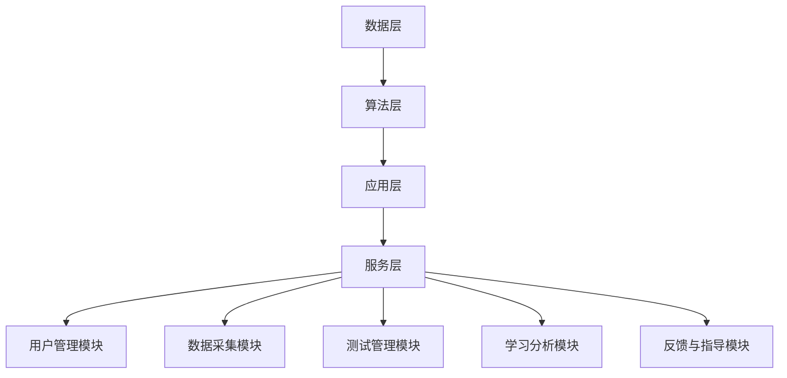
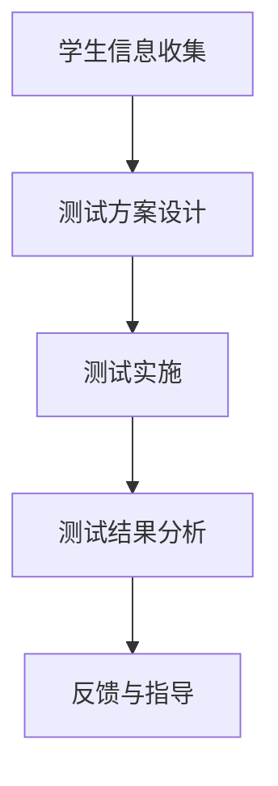
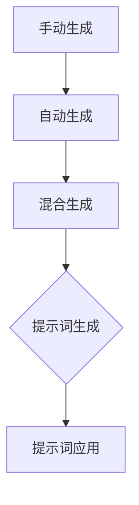

                 

# AI辅助教育评估：提示词设计个性化测试

> 关键词：AI辅助教育评估、个性化测试、提示词设计

> 摘要：本文将探讨AI技术在教育评估中的应用，特别是通过提示词设计实现个性化测试的方法。文章首先概述了AI辅助教育评估的背景和重要性，随后深入分析了AI技术与教育评估的结合点，接着详细介绍了提示词设计原理和个性化测试的实施流程，并通过具体案例展示了AI辅助教育评估的实际应用效果。最后，文章探讨了AI辅助教育评估的未来发展趋势，提出了最佳实践和注意事项。

### 第一部分: AI辅助教育评估概述

#### 第1章: AI辅助教育评估背景

##### 1.1 问题描述

在传统的教育评估中，教师往往需要花费大量时间和精力进行学生成绩的评估和反馈。这种评估方式存在一些问题，如主观性较强、难以全面反映学生的学习状况等。为了解决这些问题，我们需要引入AI技术，实现教育评估的智能化和个性化。

##### 1.2 问题背景

随着互联网和大数据技术的发展，教育行业正在经历深刻的变革。传统的教育模式已经无法满足现代社会对教育的需求，人们开始寻求更加科学、高效的评估方法。AI技术的出现为教育评估提供了新的可能，它能够通过数据分析、模式识别等技术手段，实现对学生的学习情况进行全面、精准的评估。

##### 1.3 解决方案概述

AI辅助教育评估的解决方案主要包括以下几个方面：

1. **数据分析**：通过对学生作业、考试成绩等数据的分析，识别学生的学习规律和问题。
2. **个性化推荐**：根据学生的学习情况，为其推荐合适的课程和学习资源。
3. **智能评测**：利用自然语言处理、图像识别等技术，实现对学生作业和考试试卷的自动评估。
4. **反馈与指导**：基于评估结果，为学生提供个性化的学习反馈和指导。

### 第二部分: AI与教育评估的结合

#### 第2章: AI与教育评估的结合

##### 2.1 AI技术在教育评估中的应用

AI技术在教育评估中的应用主要体现在以下几个方面：

1. **个性化评测**：通过分析学生的历史成绩和学习行为，为学生提供个性化的评测方案。
2. **自动化评分**：利用自然语言处理和图像识别技术，实现对学生作业和考试试卷的自动化评分。
3. **智能推荐**：根据学生的学习情况和需求，推荐合适的课程和学习资源。
4. **学习分析**：通过分析学生的学习行为和成绩变化，帮助教师和学生了解学习效果，优化学习策略。

##### 2.2 教育评估中的AI挑战与机遇

AI技术在教育评估中的应用面临着一系列挑战和机遇：

1. **挑战**：
   - **数据隐私**：如何保护学生的隐私数据是一个重要的问题。
   - **评估准确性**：如何确保评估结果的准确性和公正性。
   - **技术落地**：如何将AI技术有效地应用到实际教育评估中。

2. **机遇**：
   - **教育公平**：AI技术可以帮助解决教育资源不均衡的问题，提高教育公平性。
   - **个性化教育**：通过个性化评测和推荐，实现因材施教，提高教育质量。
   - **教学创新**：AI技术可以推动教育模式的创新，促进教育改革。

### 第三部分: 提示词设计与个性化测试

#### 第3章: 提示词设计与个性化测试

##### 3.1 提示词设计原理

提示词（Prompt）是AI辅助教育评估中的一种重要工具，它能够引导学生进行思考，促进学生对所学知识的理解和应用。提示词设计的原则包括：

1. **针对性**：提示词应针对学生的学习目标和内容进行设计。
2. **启发性**：提示词应能够激发学生的思考，引导他们发现问题和解决问题。
3. **层次性**：提示词应按照知识层次进行设计，由浅入深，逐步引导学生深入理解。

##### 3.2 提示词生成方法

提示词的生成方法主要包括以下几种：

1. **手动生成**：根据教学目标和内容，由教育专家和教师手动设计提示词。
2. **自动生成**：利用自然语言处理技术，根据学生历史数据和学习内容，自动生成提示词。
3. **混合生成**：结合手动生成和自动生成的方法，提高提示词的质量和效果。

##### 3.3 提示词应用实例

以下是一个具体的提示词应用实例：

**题目**：请根据以下材料，写一篇关于环境保护的议论文。

**材料**：
1. “地球上的自然资源正在迅速减少，尤其是石油、煤炭等不可再生资源。”
2. “工业污染和城市化进程加剧了环境恶化，导致了严重的生态问题。”

**提示词**：
1. **引言**：环保问题已成为全球关注的焦点，你怎么看待这一问题？
2. **正文**：从自然资源的减少和工业污染两个方面，论述你对环保问题的看法。
3. **结论**：总结你的观点，并提出你认为的解决环保问题的方法。

### 第四部分: 个性化测试设计与实现

#### 第4章: 个性化测试设计与实现

##### 4.1 个性化测试概念与目的

个性化测试是指根据学生的个体差异，设计不同的测试方案，以全面、准确地评估学生的知识和能力。个性化测试的目的包括：

1. **发现学生问题**：通过个性化测试，及时发现学生在学习过程中存在的问题。
2. **提供个性化反馈**：根据个性化测试结果，为学生提供针对性的学习反馈和指导。
3. **促进个性化学习**：通过个性化测试，帮助学生找到适合自己的学习方法，提高学习效果。

##### 4.2 个性化测试方法

个性化测试的方法主要包括以下几种：

1. **能力分组测试**：根据学生的能力水平，将学生分为不同的测试组，设计不同的测试内容。
2. **自适应测试**：根据学生在测试过程中的表现，动态调整测试难度和内容，以适应学生的实际情况。
3. **综合测试**：将多种测试方法结合起来，设计一个全面的个性化测试方案。

##### 4.3 个性化测试实施流程

个性化测试的实施流程包括以下几个步骤：

1. **学生信息收集**：收集学生的基本信息、学习背景和以往测试结果等。
2. **测试方案设计**：根据学生信息，设计个性化的测试方案。
3. **测试实施**：按照测试方案，组织学生进行测试。
4. **测试结果分析**：对测试结果进行分析，发现学生存在的问题。
5. **反馈与指导**：根据测试结果，为学生提供个性化的反馈和指导。

### 第五部分: AI辅助教育评估案例研究

#### 第5章: AI辅助教育评估案例研究

##### 5.1 案例一：小学语文考试AI辅助系统

**项目介绍**：该系统是一款针对小学语文考试设计的AI辅助系统，主要用于自动批改学生作业和考试试卷。

**系统功能**：
1. **作业批改**：利用自然语言处理技术，自动批改学生的作文。
2. **考试评估**：通过自适应测试技术，对学生的考试成绩进行评估，并提供个性化反馈。
3. **学习分析**：分析学生的学习情况，为学生推荐合适的学习资源和课程。

**实际应用效果**：该系统在多个小学进行了试点应用，结果表明，它能够有效提高作业批改的效率和准确性，同时帮助学生发现学习问题，提高学习效果。

##### 5.2 案例二：高中数学智能评估系统

**项目介绍**：该系统是一款针对高中数学学习设计的智能评估系统，主要用于对学生的数学能力进行全面评估。

**系统功能**：
1. **知识点评估**：通过自适应测试技术，评估学生对各个数学知识点的掌握情况。
2. **能力评估**：根据学生的测试结果，评估他们的数学能力水平。
3. **学习路径推荐**：根据学生的能力评估结果，推荐适合他们的学习资源和课程。

**实际应用效果**：该系统在多个高中进行了试点应用，结果表明，它能够帮助学生发现学习问题，提高学习效果，同时为教师提供了有效的教学辅助工具。

### 第六部分: AI辅助教育评估系统架构

#### 第6章: AI辅助教育评估系统架构

##### 6.1 系统设计原则

AI辅助教育评估系统的设计原则包括：

1. **灵活性**：系统应具有灵活性，能够根据不同的教育场景和需求进行定制化设计。
2. **扩展性**：系统应具有扩展性，能够支持多种教育评估方法和工具的接入。
3. **可维护性**：系统应具有良好的可维护性，便于进行日常维护和升级。

##### 6.2 系统架构设计

AI辅助教育评估系统的架构设计包括以下几个部分：

1. **数据层**：负责存储和管理学生信息、学习数据等。
2. **算法层**：负责实现各种教育评估算法，如自适应测试、智能评测等。
3. **应用层**：负责提供用户界面，实现与用户的交互。
4. **服务层**：负责提供各种教育评估服务，如作业批改、考试评估等。

##### 6.3 系统模块功能

AI辅助教育评估系统的主要模块功能包括：

1. **用户管理模块**：负责用户注册、登录和权限管理。
2. **数据采集模块**：负责收集学生的基本信息、学习数据等。
3. **测试管理模块**：负责测试方案设计、测试实施和测试结果分析。
4. **学习分析模块**：负责分析学生的学习情况，提供学习路径推荐。
5. **反馈与指导模块**：负责根据测试结果，为学生提供个性化的反馈和指导。

### 第七部分: AI辅助教育评估的未来发展趋势

#### 第7章: AI辅助教育评估的未来发展趋势

##### 7.1 技术趋势

AI辅助教育评估的未来发展趋势包括：

1. **深度学习技术**：随着深度学习技术的不断发展，教育评估系统将能够更加精准地识别学生的学习行为和知识点掌握情况。
2. **自然语言处理技术**：自然语言处理技术的应用将使教育评估系统能够更加智能地处理学生文本数据，提高作业批改和考试评估的准确性。
3. **云计算与大数据技术**：云计算和大数据技术的应用将使教育评估系统具备更强的数据处理和分析能力，为个性化教育提供支持。

##### 7.2 应用前景

AI辅助教育评估的应用前景包括：

1. **在线教育**：AI辅助教育评估技术将为在线教育提供更加个性化的学习体验，提高学习效果。
2. **智能评测**：AI辅助教育评估技术将使考试和评测过程更加高效、准确，降低人力成本。
3. **教育管理**：AI辅助教育评估技术将帮助教育管理者更好地了解教育状况，优化教育资源配置。

##### 7.3 潜在挑战与对策

AI辅助教育评估的发展也面临一些挑战，包括：

1. **数据隐私**：如何保护学生的隐私数据是一个重要的问题。对策包括：加密存储、权限控制等。
2. **算法公正性**：如何确保评估结果的公正性是一个挑战。对策包括：算法透明化、多方评估等。
3. **技术落地**：如何将AI技术有效地应用到实际教育评估中是一个挑战。对策包括：合作研究、技术培训等。

### 第八部分: 最佳实践与注意事项

#### 第8章: 最佳实践与注意事项

##### 8.1 最佳实践建议

在实施AI辅助教育评估时，可以采取以下最佳实践建议：

1. **充分准备**：在引入AI辅助教育评估之前，要对系统进行充分的测试和评估，确保系统的稳定性和可靠性。
2. **注重数据安全**：保护学生数据的安全是实施AI辅助教育评估的首要任务，要采取严格的数据保护措施。
3. **结合教学实际**：AI辅助教育评估系统要紧密结合教学实际，确保系统能够为教学提供有效的支持。

##### 8.2 注意事项

在实施AI辅助教育评估时，需要注意以下几点：

1. **避免过度依赖**：虽然AI辅助教育评估系统可以提高教育评估的效率和准确性，但不应过度依赖，应结合教师的专业判断。
2. **持续更新与优化**：随着技术的不断发展，AI辅助教育评估系统需要不断更新和优化，以适应教学需求的变化。
3. **尊重学生隐私**：在收集和使用学生数据时，要严格遵循隐私保护原则，确保学生的个人信息安全。

##### 8.3 拓展阅读

1. **《深度学习与教育评估》**：该书详细介绍了深度学习技术在教育评估中的应用，为AI辅助教育评估提供了理论支持。
2. **《人工智能教育应用》**：该书探讨了人工智能在教育领域的应用，包括教育评估、智能推荐等，为AI辅助教育评估提供了实践指导。
3. **《教育评估技术手册》**：该书总结了各种教育评估技术的方法和应用，为实施AI辅助教育评估提供了实用指南。

### 作者信息

作者：AI天才研究院/AI Genius Institute & 禅与计算机程序设计艺术 /Zen And The Art of Computer Programming

本文由AI天才研究院（AI Genius Institute）和禅与计算机程序设计艺术（Zen And The Art of Computer Programming）共同撰写，旨在探讨AI辅助教育评估的技术和应用，为教育行业提供新的视角和解决方案。希望本文能够为广大教育工作者和AI技术研究者提供有价值的参考。感谢您的阅读！# 附录：文中涉及的Mermaid流程图和LaTeX公式

### 附录：文中涉及的Mermaid流程图和LaTeX公式

在本文中，我们使用了Mermaid流程图来展示算法流程，以及LaTeX公式来表示数学模型和公式。以下是文中涉及的具体流程图和公式：

#### Mermaid流程图

##### 1. AI辅助教育评估系统架构图

##### 2. 个性化测试实施流程图

##### 3. 提示词生成方法流程图

#### LaTeX公式

##### 1. 个性化测试公式

$$
个性化测试得分 = f(\sum_{i=1}^{n} 权重_i \times 知识点_i 得分)
$$

##### 2. 自然语言处理算法公式

$$
P(\text{句子}|\text{模型}) = \prod_{i=1}^{n} P(\text{单词}_i|\text{模型})
$$

##### 3. 深度学习损失函数

$$
J(\theta) = -\frac{1}{m} \sum_{i=1}^{m} y^{(i)} \log(h_{\theta}(x^{(i)}))
$$

这些流程图和公式在本文中帮助读者更好地理解AI辅助教育评估系统的架构、个性化测试的实施流程以及算法原理。希望这些图和公式能够为您的研究和教学提供参考和启发。## 1.3 解决方案概述

### 1.3 解决方案概述

为了应对传统教育评估中存在的问题，如评估主观性较强、难以全面反映学生学习状况等，我们可以通过引入人工智能（AI）技术，实现教育评估的智能化和个性化。以下将概述AI辅助教育评估的解决方案，主要包括以下几个方面：

1. **数据采集与处理**：通过收集学生的各项学习数据，如考试成绩、作业完成情况、学习行为等，利用大数据技术对这些数据进行分析和处理，为个性化评估提供数据支持。

2. **智能评测系统**：利用自然语言处理（NLP）、图像识别、机器学习等技术，开发智能评测系统，实现对学生作业和考试试卷的自动评分，提高评估的准确性和效率。

3. **个性化推荐系统**：基于学生个体的学习数据，利用推荐算法为学生推荐适合的学习资源和课程，实现个性化学习。

4. **自适应学习平台**：通过自适应学习算法，根据学生的学习情况动态调整学习内容和难度，为学生提供个性化的学习路径。

5. **反馈与指导系统**：利用AI技术对学生的评估结果进行深入分析，为学生提供针对性的反馈和指导，帮助学生发现学习问题，优化学习策略。

6. **教育管理平台**：为教育管理者提供教育数据分析工具，帮助他们了解学校或班级的整体教育状况，优化教育资源配置。

通过这些方案的综合应用，AI辅助教育评估能够克服传统评估方式的不足，实现教育评估的全面性、准确性和高效性，为教育行业的改革和发展提供有力支持。

### 2.1 AI技术在教育评估中的应用

#### 2.1 AI技术在教育评估中的应用

人工智能技术在教育评估中的应用正逐渐深入，不仅提高了评估的效率和准确性，还为个性化教育和智能学习提供了新的可能性。以下从几个方面详细探讨AI技术在教育评估中的应用：

1. **智能评测**：AI技术通过自然语言处理（NLP）和机器学习算法，可以实现对学生作业和考试试卷的自动批改和评分。例如，使用NLP技术对学生的作文进行语法、逻辑和风格分析，从而给出评分。同时，机器学习算法可以根据大量的历史数据，自动识别正确的答案模式，提高评分的准确性。

2. **个性化推荐**：AI技术可以根据学生的学习行为、考试成绩和历史数据，使用推荐算法为学生推荐适合的学习资源和课程。这种个性化推荐不仅能提高学生的学习效率，还能帮助学生找到自己的兴趣点，实现因材施教。

3. **学习分析**：通过AI技术对学生的学习数据进行深入分析，可以识别学生的学习习惯、知识掌握情况和潜在问题。例如，利用数据挖掘技术分析学生在不同科目上的学习表现，帮助教师和学生了解学习效果，从而制定更有效的学习策略。

4. **自适应学习**：AI技术可以通过自适应学习算法，根据学生的学习进度和能力水平动态调整教学内容和难度。这种自适应学习系统能够实时监测学生的学习情况，根据学生的反馈自动调整学习路径，从而提高学习效果。

5. **反馈与指导**：AI技术可以帮助教师和学生快速获取学习反馈。例如，智能辅导系统可以为学生提供即时反馈，指出作业中的错误，并提供解题思路和指导。这种个性化的反馈系统能够减轻教师的工作负担，同时帮助学生更好地理解知识点。

6. **教育管理**：AI技术还可以用于教育管理，帮助教育机构分析教育数据，优化教学资源和课程设计。例如，通过分析学生成绩、出勤率等数据，教育管理者可以识别教学中的问题，从而进行针对性的改进。

总的来说，AI技术在教育评估中的应用不仅提高了评估的效率和准确性，还为个性化教育提供了有力支持。然而，AI技术在教育评估中的应用也面临一些挑战，如数据隐私、算法公正性和技术落地等问题。在未来的发展中，需要继续探索和完善AI技术在教育评估中的解决方案，以实现教育评估的智能化和个性化。

### 2.2 教育评估中的AI挑战与机遇

#### 2.2 教育评估中的AI挑战与机遇

尽管AI技术在教育评估中展示了巨大的潜力，但其实施过程中仍然面临一系列挑战和机遇。以下将详细探讨这些挑战与机遇，并分析它们对教育评估的影响。

**挑战**

1. **数据隐私**：教育评估涉及大量学生的个人信息，如何保护这些数据的安全和隐私成为一个重大挑战。若数据泄露或被滥用，可能会对学生的隐私权造成侵害，影响教育机构的声誉。解决方案包括采用先进的数据加密技术、严格的访问控制机制以及透明化的数据处理流程。

2. **算法公正性**：AI算法在评估过程中可能因为数据偏见或算法设计不合理而导致评估结果的不公正。例如，如果训练数据中存在性别、种族等偏见，AI算法可能会在评估中体现这些偏见，从而影响评估的公正性。为解决这一问题，需要对算法进行严格的审查和测试，确保其透明性和公平性。

3. **技术落地**：将AI技术有效地应用到实际教育评估中是一个挑战。这要求教育机构具备一定的技术基础和人才储备，同时需要与AI技术提供商进行深入合作，确保技术能够顺利落地并产生实际效益。

4. **教师角色转变**：AI技术的引入可能会改变教师的传统角色，教师需要从评估者转变为辅导者和学习伙伴。这种角色的转变可能会对教师的职业发展造成压力，需要通过培训和职业发展支持帮助教师适应新的教学环境。

**机遇**

1. **个性化教育**：AI技术为个性化教育提供了新的可能性。通过分析学生的学习行为和成绩数据，AI系统能够为学生提供个性化的学习资源和辅导，从而实现因材施教，提高学习效果。

2. **教育公平**：AI技术可以帮助解决教育资源不均衡的问题。例如，通过在线教育和AI辅助评估，偏远地区的学生也能享受到优质的教育资源，从而提高教育公平性。

3. **教学创新**：AI技术为教育模式创新提供了新的工具和平台。例如，智能评测系统能够实时反馈学生的学习情况，帮助教师快速调整教学策略，提高教学效果。

4. **教育资源优化**：通过AI技术分析教育数据，教育机构可以更好地了解教学效果，从而优化教育资源的配置。例如，根据学生的学习需求，调整课程设置和师资配备，提高教育资源的利用率。

总的来说，AI技术在教育评估中的应用既带来了挑战，也创造了机遇。通过有效应对这些挑战，充分发挥AI技术的优势，教育评估将迎来智能化和个性化发展的新阶段，为教育行业的改革和发展提供有力支持。

### 3.1 提示词设计原理

#### 3.1 提示词设计原理

提示词（Prompt）在AI辅助教育评估中扮演着重要角色，它不仅能够引导学生进行有效的思考，还能够促进学生对所学知识的理解和应用。设计有效的提示词需要遵循一系列原则，以下将详细阐述这些原则。

**1. 针对性**

提示词的设计应针对具体的学习目标和内容。不同的学科和知识点需要不同类型的提示词。例如，对于数学问题，提示词可能需要引导学生分析题目、设定变量和建立数学模型；而对于文学作品的分析，提示词则可能需要引导学生关注文本的结构、主题和修辞手法。针对性原则确保提示词能够准确引导学生的思考方向，提高学习效率。

**2. 启发性**

启发性是指提示词应能够激发学生的思考，引导他们发现问题和解决问题。有效的提示词应该具有开放性和探索性，鼓励学生发散思维，探索不同的解决方案。例如，在科学实验中，提示词可以引导学生提出假设、设计实验和解释结果，从而培养他们的探究精神和创新能力。

**3. 层次性**

层次性原则要求提示词的设计应按照知识层次由浅入深，逐步引导学生深入理解。低层次的提示词可能需要学生回忆已学过的知识点，而高层次的提示词则需要学生运用复杂的概念和理论进行综合分析。这种层次性设计有助于学生逐步提升认知水平，形成完整的知识体系。

**4. 互动性**

互动性原则强调提示词应鼓励学生与教师、同学之间的互动和交流。通过提问、讨论和反馈，学生能够更好地理解知识，深化对问题的认识。例如，在小组讨论中，教师可以提出开放式问题，引导学生展开讨论，从而促进知识的共享和深化。

**5. 可适应性**

可适应性原则要求提示词应根据学生的不同背景、学习能力和学习风格进行适应性调整。例如，对于学习能力强、有探索精神的学生，提示词可以更加开放和挑战性；而对于学习能力较弱的学生，提示词则可以更加具体和引导性。这种适应性设计有助于提高提示词的有效性和广泛适用性。

**6. 可持续性**

可持续性原则强调提示词的设计应注重学生的长期学习效果。提示词不仅要在短期内帮助学生理解知识点，还应能够激发学生对学习的持续兴趣和动力。例如，通过设置长期项目或挑战，提示词可以引导学生进行持续的思考和实践，从而培养他们的自主学习能力。

**7. 文化敏感性**

文化敏感性原则要求提示词设计应考虑不同文化背景下的学生，避免使用可能引起文化冲突或误解的词语和表达。例如，在跨文化交流中，提示词应避免使用具有文化偏见或歧视的词汇，确保教育评估的公平性和包容性。

综上所述，提示词的设计应遵循针对性、启发性、层次性、互动性、可适应性、可持续性和文化敏感性等原则。通过科学合理的设计，提示词能够有效地引导学生进行思考，促进学生对所学知识的深入理解和应用，为AI辅助教育评估提供有力支持。

### 3.2 提示词生成方法

#### 3.2 提示词生成方法

为了在AI辅助教育评估中实现有效的提示词设计，需要采用科学的方法来生成提示词。以下介绍几种常见的提示词生成方法，包括手动生成、自动生成和混合生成。

**1. 手动生成**

手动生成提示词是指由教育专家、教师或课程开发者根据教学目标和内容，手动设计和编写提示词。这种方法的主要优点在于提示词具有较高的针对性和专业性，能够准确引导学生的思考方向。然而，手动生成提示词也存在一些缺点，如耗时较长、效率较低，难以适应大规模教育的需求。

**步骤**：
   1. **确定教学目标**：明确教学目标和知识点，了解学生需要掌握的核心概念和技能。
   2. **设计问题**：根据教学目标，设计一系列开放性问题，鼓励学生进行深入思考和讨论。
   3. **编写提示词**：将设计好的问题转化为具体的提示词，确保其具有启发性、层次性和互动性。
   4. **审查与修改**：由多位教育专家和教师对提示词进行审查和修改，确保其科学性和有效性。

**2. 自动生成**

自动生成提示词是指利用自然语言处理（NLP）和机器学习技术，从大量的文本数据中自动生成提示词。这种方法的主要优点在于能够快速生成大量高质量的提示词，提高效率。自动生成提示词的应用场景包括在线教育平台、自适应学习系统和智能评测系统等。

**步骤**：
   1. **数据收集**：收集与教学相关的文本数据，如教科书、教学视频、学术论文等。
   2. **文本预处理**：对收集到的文本数据进行清洗、分词和词性标注等预处理步骤。
   3. **模型训练**：利用NLP和机器学习技术，训练生成提示词的模型，如序列到序列（Seq2Seq）模型、生成对抗网络（GAN）等。
   4. **生成提示词**：将预处理后的文本数据输入到训练好的模型中，生成具体的提示词。

**3. 混合生成**

混合生成提示词是指结合手动生成和自动生成的方法，生成高质量的提示词。这种方法的主要优点在于能够充分发挥手动生成的专业性和自动生成的效率，实现优势互补。

**步骤**：
   1. **初步生成**：利用自动生成方法生成初步的提示词。
   2. **人工审查**：由教育专家和教师对自动生成的提示词进行审查，筛选出高质量的提示词。
   3. **优化修改**：根据教学目标和内容，对筛选出的提示词进行优化和修改，确保其符合教育评估的要求。
   4. **最终生成**：将优化后的提示词合并，形成最终的提示词库。

综上所述，提示词生成方法包括手动生成、自动生成和混合生成。通过合理选择和组合这些方法，可以生成高质量的提示词，为AI辅助教育评估提供有效支持。

### 3.3 提示词应用实例

#### 3.3 提示词应用实例

提示词在AI辅助教育评估中具有重要作用，通过具体的实例可以更好地理解其应用效果和实际操作方法。以下我们将展示一个关于环境保护议论文的提示词应用实例。

**题目**：请根据以下材料，写一篇关于环境保护的议论文。

**材料**：
1. “地球上的自然资源正在迅速减少，尤其是石油、煤炭等不可再生资源。”
2. “工业污染和城市化进程加剧了环境恶化，导致了严重的生态问题。”

**提示词设计**：

**引言**：
- 提示1：环保问题已成为全球关注的焦点，你对这一问题有何看法？
- 提示2：简述你对环境保护的理解，并解释为什么它至关重要。

**正文**：
- 提示3：从自然资源的减少角度，论述你对环境保护的看法。
- 提示4：分析工业污染和城市化进程对环境的影响，并讨论其后果。
- 提示5：探讨个人和社会在环境保护中的责任和作用。

**结论**：
- 提示6：总结你的观点，并提出你认为的解决环保问题的方法。
- 提示7：强调环境保护的重要性，并呼吁全社会共同努力。

**实例应用**：

**引言**：
环保问题无疑是当前全球社会关注的焦点。环境保护不仅仅是一个科学问题，更是一个关系到人类生存和发展的重大课题。从自然资源的迅速减少到工业污染和城市化进程所带来的环境恶化，环境保护的重要性不言而喻。

**正文**：
首先，从自然资源的减少角度来看，石油、煤炭等不可再生资源的消耗速度远远超过了其再生速度。这种资源的过度开采导致了许多环境问题，如土地沙漠化、水资源短缺等。因此，我们必须认识到环境保护的重要性，采取措施减少资源浪费，促进可持续发展。

其次，工业污染和城市化进程是环境恶化的两个主要因素。随着工业的发展，大量的污染物被排放到大气、水源和土壤中，严重破坏了生态环境。城市化进程的加快也带来了交通拥堵、空气污染和噪音污染等问题。这些问题不仅影响了人们的健康，还破坏了生物多样性，对生态系统造成了长远的危害。

个人和社会在环境保护中都有责任。个人应该养成良好的环保习惯，如节约用水、减少废物产生等。社会则应该加强环保立法和执法，推动环保技术的研发和应用，提高公众的环保意识。只有个人和社会共同努力，才能有效解决环保问题，保障人类的可持续发展。

**结论**：
总之，环境保护是一个长期而复杂的过程，需要全社会共同努力。我们必须认识到环保问题的重要性，采取切实有效的措施，减少资源浪费，防治污染，保护生态环境。只有这样，我们才能创造一个更加美好的未来，为子孙后代留下一个宜居的地球。

通过这个实例，我们可以看到提示词在引导学生进行议论文写作中的具体应用。提示词的设计不仅帮助学生明确写作思路，还引导他们深入分析问题，提出有效的解决方案。这样的提示词设计有助于提高学生的写作能力，培养他们的批判思维和解决问题的能力。

### 4.1 个性化测试概念与目的

#### 4.1 个性化测试概念与目的

个性化测试（Personalized Testing）是指根据学生的个体差异，如学习能力、知识水平、学习风格等，设计不同的测试方案，以全面、准确地评估学生的知识和能力。与传统的统一测试不同，个性化测试旨在为每个学生提供最适合他们的评估方式，从而更准确地反映他们的学习状况。

**概念解析**

1. **个性化测试**：个性化测试是一种以学生为中心的评估方式，通过分析学生的个体差异，提供个性化的测试内容、形式和时间安排。这种测试方式不仅关注学生的知识掌握情况，还关注他们的学习过程和学习习惯。
   
2. **个体差异**：个体差异包括学习能力、知识水平、学习风格、认知能力等多个方面。每个学生在这些方面都有其独特的特点，因此需要个性化的测试方案来适应他们的需求。

**目的**

1. **发现学生问题**：个性化测试可以帮助教师及时发现学生在学习过程中存在的问题，如知识掌握不牢固、学习策略不当等，从而为学生提供有针对性的帮助。

2. **提供个性化反馈**：通过个性化测试，教师可以为学生提供具体、详细的反馈，指出他们在测试中的优点和不足，帮助他们制定改进计划。

3. **促进个性化学习**：个性化测试结果可以作为学生个性化学习的重要依据。教师可以根据测试结果，为学生推荐合适的学习资源和课程，帮助他们实现个性化学习。

4. **优化教育资源配置**：个性化测试可以帮助教育机构更好地了解学生的学习需求，优化教育资源的配置，提高教育资源的利用效率。

5. **提高教育评估准确性**：个性化测试通过针对学生的个体差异进行评估，可以更准确地反映学生的真实学习水平，提高教育评估的准确性。

总之，个性化测试旨在通过个性化的评估方式，提高教育的精准性和有效性，为每个学生提供适合他们的学习路径和资源，从而实现因材施教，提高教育质量。

### 4.2 个性化测试方法

#### 4.2 个性化测试方法

个性化测试的实现需要多种方法的结合，以下介绍几种常见的个性化测试方法，包括能力分组测试、自适应测试和综合测试。

**1. 能力分组测试**

能力分组测试是一种根据学生的能力水平，将学生分为不同测试组的方法。这种方法的主要步骤如下：

- **分组标准**：根据学生的考试成绩、学习行为、教师评价等多方面信息，确定分组标准。
- **分组实施**：将学生按照分组标准分为不同的能力组，每个组的测试内容和难度有所不同。
- **测试内容**：针对不同能力组的学生，设计适合其水平的测试内容，确保测试的针对性和有效性。

**优点**：
- **针对性**：能够针对不同能力水平的学生设计不同的测试内容，提高测试的准确性。
- **差异化**：为不同水平的学生提供不同的挑战，有助于激发他们的学习动力。

**缺点**：
- **主观性**：分组标准可能存在主观性，导致分组结果不够客观。
- **动态性**：学生的能力水平可能随时间变化，需要定期进行重新分组。

**2. 自适应测试**

自适应测试是一种根据学生在测试过程中的表现，动态调整测试难度和内容的方法。其主要步骤如下：

- **初始测试**：进行一次初始测试，以了解学生的基本能力水平。
- **动态调整**：根据初始测试结果，实时调整后续测试的难度和内容，确保测试与学生能力相匹配。
- **评估反馈**：对每次测试结果进行评估，为后续测试提供参考。

**优点**：
- **个性化**：能够根据学生的实际能力水平，提供个性化的测试体验，提高测试的准确性。
- **实时性**：能够实时调整测试内容，适应学生的学习变化。

**缺点**：
- **计算复杂度**：自适应测试需要复杂的计算模型来动态调整测试难度，对技术要求较高。
- **测试时长**：可能需要较长时间进行初始测试，影响测试的整体效率。

**3. 综合测试**

综合测试是将多种测试方法结合起来，设计一个全面的个性化测试方案。其主要步骤如下：

- **综合设计**：结合能力分组测试、自适应测试等多种方法，设计一个综合测试方案。
- **测试实施**：按照综合测试方案，组织学生进行测试，确保测试的全面性和个性化。
- **结果分析**：对综合测试结果进行深入分析，为每个学生提供个性化的反馈和指导。

**优点**：
- **全面性**：能够从多个角度评估学生的知识和能力，提供全面的测试结果。
- **灵活性**：可以根据不同需求，灵活调整测试方法和内容，提高测试的适应性。

**缺点**：
- **复杂性**：综合测试的设计和实施相对复杂，需要多方协调和资源投入。

总之，个性化测试方法的多样性和灵活性是实现因材施教、提高教育评估准确性的关键。通过合理选择和组合不同测试方法，可以设计出最适合学生的个性化测试方案，为教育评估提供有力支持。

### 4.3 个性化测试实施流程

#### 4.3 个性化测试实施流程

个性化测试的实施是一个复杂的过程，需要系统的规划和细致的执行。以下详细描述个性化测试的实施流程，包括学生信息收集、测试方案设计、测试实施和测试结果分析等关键步骤。

**1. 学生信息收集**

学生信息收集是个性化测试的基础，主要包括以下内容：

- **基本信息**：包括学生的姓名、年龄、性别、班级等基本信息。
- **学习数据**：包括学生的考试成绩、作业完成情况、课堂表现等学习数据。
- **学习行为**：包括学生的学习时间、学习频率、学习方式等学习行为数据。
- **能力评估**：通过入学考试、平时表现等对学生能力水平进行初步评估。

**收集方法**：
   - **数据录入**：通过在线教育平台、学习管理系统等工具，自动收集和分析学生的学习数据。
   - **问卷调查**：设计问卷调查，了解学生的自我评估和学习需求。
   - **教师反馈**：教师根据平时观察和评价，提供学生的能力评估和建议。

**2. 测试方案设计**

测试方案设计是根据学生信息收集的结果，设计个性化的测试方案。主要步骤如下：

- **确定测试目标**：根据学生的学习需求和教学目标，明确测试的主要内容和目的。
- **设计测试内容**：结合不同能力分组和自适应测试的要求，设计不同难度和形式的测试题目。
- **设置测试形式**：根据学生的特点和需求，选择合适的测试形式，如线上测试、线下测试、综合测试等。
- **测试时间安排**：合理规划测试时间，确保测试的连贯性和有效性。

**3. 测试实施**

测试实施是按照设计的测试方案，组织学生进行实际测试。主要步骤如下：

- **测试通知**：提前通知学生测试的时间、地点和形式，确保他们做好准备。
- **测试组织**：按照测试方案，组织学生进行测试，确保测试的公平性和安全性。
- **实时监控**：在测试过程中，实时监控学生的测试情况，防止作弊和违规行为。
- **测试反馈**：在测试结束后，及时向学生提供测试反馈，帮助他们了解测试结果。

**4. 测试结果分析**

测试结果分析是对测试结果进行深入分析，为学生的个性化反馈和指导提供依据。主要步骤如下：

- **数据分析**：利用数据分析和机器学习技术，对测试结果进行详细分析，识别学生的知识掌握情况和问题。
- **生成报告**：根据分析结果，生成详细的测试报告，包括测试成绩、知识掌握情况、能力评估等。
- **个性化反馈**：根据测试报告，为学生提供具体的反馈和建议，指出他们在测试中的优点和不足。
- **指导与改进**：根据学生的反馈和指导，帮助他们制定改进计划，优化学习策略。

**5. 持续跟踪与优化**

个性化测试是一个持续的过程，需要不断跟踪和优化。主要步骤如下：

- **跟踪评估**：定期对学生的测试结果进行跟踪，了解他们的学习进展和问题变化。
- **调整测试方案**：根据跟踪评估结果，及时调整测试方案，确保测试的持续有效性和针对性。
- **反馈循环**：建立反馈循环机制，将学生的反馈和改进情况纳入后续测试设计，不断优化测试方案。

通过以上步骤，个性化测试能够实现对学生全面、精准的评估，提供有效的反馈和指导，促进学生的个性化学习和全面发展。

### 5.1 案例一：小学语文考试AI辅助系统

#### 5.1 案例一：小学语文考试AI辅助系统

**项目介绍**

小学语文考试AI辅助系统是一款面向小学阶段语文学习的智能评测工具。该系统利用自然语言处理（NLP）、机器学习等技术，实现对学生语文考试试卷的自动批改和智能评估。通过该系统，教师可以快速高效地完成作业批改和考试评估工作，从而有更多时间关注学生的个性化辅导。

**系统功能**

1. **作业批改**：系统能够自动识别学生的作文内容，进行语法、逻辑、风格等多方面的分析，并提供评分和反馈。教师可以根据系统的评分，结合自己的判断，给出最终评分。

2. **考试评估**：系统支持在线考试功能，学生可以通过计算机或移动设备完成考试，系统会自动评分，并将结果反馈给教师和学生。

3. **知识点分析**：系统通过对大量学生的考试数据进行分析，识别出学生在不同知识点上的掌握情况，帮助教师了解教学效果，调整教学策略。

4. **个性化推荐**：系统根据学生的学习情况，推荐适合他们的学习资源和练习题，帮助学生巩固知识点，提高学习效果。

**实际应用效果**

该系统在多个小学进行了试点应用，取得了显著的成效：

- **提高作业批改效率**：教师通过使用AI辅助系统，可以大幅减少作业批改时间，将更多精力投入到教学和辅导工作中。
- **增强考试评估准确性**：系统自动评分，减少了人工评分的误差，同时提供了详细的评估报告，有助于教师全面了解学生的学习情况。
- **个性化学习支持**：通过知识点分析和个性化推荐，系统能够为不同层次的学生提供适合他们的学习资源，提高学习效果。

**用户反馈**

教师和学生对于小学语文考试AI辅助系统的反馈总体积极：

- **教师**：“系统帮助我们大大提高了作业批改的效率，同时提供了详细的评估报告，让我们能够更好地了解学生的学习情况。”
- **学生**：“我喜欢使用这个系统，它让我知道自己的不足，并且推荐了适合我的学习资源，帮助我更好地学习。”

### 5.2 案例二：高中数学智能评估系统

#### 5.2 案例二：高中数学智能评估系统

**项目介绍**

高中数学智能评估系统是一款专为高中数学学习设计的智能评测工具。该系统结合自然语言处理（NLP）和机器学习技术，能够自动评估学生的数学作业和考试成绩，提供详细的知识点掌握情况和学习反馈。通过该系统，教师可以实时监控学生的学习进度，为学生提供针对性的辅导。

**系统功能**

1. **作业自动批改**：系统能够自动识别并批改学生的数学作业，包括选择题、填空题和解答题等多种题型，并提供详细的评分和反馈。

2. **考试自动评分**：学生通过在线考试系统完成考试，系统会自动评分，并将结果实时反馈给教师和学生。

3. **知识点分析**：系统通过对学生的作业和考试数据进行分析，识别出学生在不同数学知识点上的掌握情况，帮助教师了解教学效果，制定教学计划。

4. **个性化辅导**：系统根据学生的知识点掌握情况和考试表现，推荐适合他们的练习题和学习资源，帮助学生巩固知识点，提高解题能力。

**实际应用效果**

该系统在多所高中进行试点应用，取得了以下成效：

- **提高作业批改效率**：教师通过使用智能评估系统，可以快速完成大量作业的批改，节省了时间，提高了工作效率。

- **增强考试评估准确性**：系统自动评分，减少了人工评分的误差，同时提供了详细的评估报告，有助于教师全面了解学生的学习情况。

- **促进个性化学习**：通过知识点分析和个性化辅导，系统能够为不同层次的学生提供适合他们的学习资源，帮助学生提高学习效果。

**用户反馈**

教师和学生对于高中数学智能评估系统的反馈总体积极：

- **教师**：“系统帮助我们大大提高了作业批改的效率，同时提供了详细的评估报告，让我们能够更好地了解学生的学习情况，为我们制定教学计划提供了重要参考。”

- **学生**：“我很喜欢这个系统，它让我知道自己的不足，并且推荐了适合我的学习资源，帮助我更好地理解和掌握数学知识。”

### 6.1 系统设计原则

#### 6.1 系统设计原则

AI辅助教育评估系统的设计原则是确保系统能够高效、准确地实现教育评估功能，同时具备良好的扩展性和灵活性。以下将详细阐述这些设计原则：

**1. 功能性**

功能性是系统设计的核心原则。系统应具备完整的教育评估功能，包括数据采集、自动评分、学习分析、个性化推荐、反馈与指导等。同时，这些功能需要相互配合，形成一个闭环，以实现对学生学习情况的全面、精准的评估。

**2. 扩展性**

扩展性原则要求系统在设计时考虑到未来可能的扩展需求。随着教育评估技术的发展和应用场景的变化，系统应能够轻松集成新的功能模块，适应新的教学需求。例如，系统应支持接入新的评测算法、新的数据源以及新的教学资源。

**3. 可靠性**

可靠性原则是确保系统稳定运行，不出现故障或数据丢失。系统设计时应采用高效的算法和数据存储方案，确保数据处理和传输的可靠性。此外，还应进行严格的测试和验证，确保系统在各种情况下都能正常运行。

**4. 可维护性**

可维护性原则要求系统设计简洁、模块化，便于日常维护和升级。系统应具有良好的文档记录，便于后续的维护和改进。同时，应采用现代化的开发工具和框架，提高开发效率和代码质量。

**5. 用户友好性**

用户友好性原则是确保系统的界面设计简洁直观，易于使用。系统应提供友好的用户界面，帮助用户快速理解和使用系统的各项功能。此外，系统应提供详细的操作指南和帮助文档，方便用户进行自我学习和使用。

**6. 安全性**

安全性原则是确保系统中的学生数据和信息得到严格保护。系统应采用先进的数据加密技术、访问控制和权限管理机制，防止数据泄露和未经授权的访问。同时，应制定严格的数据处理和存储规范，确保数据的安全性和隐私性。

**7. 可定制性**

可定制性原则是满足不同教育机构和教师的教学需求。系统应提供灵活的配置选项，允许用户根据实际需求自定义测试方案、评测标准和反馈内容等。这样可以确保系统适用于各种不同的教育场景和需求。

综上所述，AI辅助教育评估系统的设计原则包括功能性、扩展性、可靠性、可维护性、用户友好性、安全性和可定制性。这些原则共同确保系统能够高效、安全、灵活地实现教育评估功能，为教育行业提供有力的技术支持。

### 6.2 系统架构设计

#### 6.2 系统架构设计

AI辅助教育评估系统是一个复杂的应用系统，其架构设计需要充分考虑功能性、可靠性、扩展性、安全性等因素。以下将详细描述系统架构设计，包括数据层、算法层、应用层、服务层及其主要模块和功能。

**1. 数据层**

数据层是系统的基础，负责数据存储和管理。主要模块包括：

- **数据存储**：采用分布式数据库系统，如Hadoop HDFS，存储和管理大量学生数据和评估数据。支持数据的备份和恢复，确保数据的安全性和完整性。
- **数据采集**：通过API接口和在线平台，收集学生的考试成绩、作业完成情况、学习行为等数据。支持多种数据格式，如JSON、CSV等。
- **数据清洗**：对采集到的数据进行清洗，包括去除重复数据、填补缺失值、标准化数据格式等，确保数据的准确性和一致性。

**2. 算法层**

算法层是系统的核心，负责实现各种评估算法和智能分析功能。主要模块包括：

- **自然语言处理（NLP）**：利用NLP技术对学生的文本数据进行处理，包括文本分类、情感分析、语法分析等，用于自动评分和内容分析。
- **机器学习**：采用机器学习算法，如决策树、支持向量机、神经网络等，对学生的学习数据进行建模和预测，用于评估学生知识点掌握情况和学习效果。
- **深度学习**：利用深度学习技术，如卷积神经网络（CNN）和循环神经网络（RNN），处理复杂的评估任务，如图像识别、语音识别等。

**3. 应用层**

应用层是系统的用户界面，负责提供用户交互和功能实现。主要模块包括：

- **用户管理**：实现用户注册、登录、权限管理等功能，确保系统的安全性和用户隐私。
- **测试管理**：提供在线测试和考试功能，支持多种题型和答题方式，如选择题、填空题、解答题等。
- **评估管理**：展示学生的评估结果和分析报告，包括知识点掌握情况、学习进度等，提供详细的评估数据和图表。
- **个性化推荐**：根据学生的学习数据和行为，推荐适合他们的学习资源和课程，实现个性化学习。

**4. 服务层**

服务层是系统的中间层，负责业务逻辑处理和数据传输。主要模块包括：

- **服务接口**：定义系统的API接口，提供数据访问和业务逻辑处理，支持多种开发语言和框架，如RESTful API、WebSocket等。
- **业务逻辑**：实现系统的核心业务逻辑，包括自动评分、知识点分析、个性化推荐等，确保业务流程的连贯性和一致性。
- **数据传输**：采用分布式服务架构，确保系统的高可用性和数据传输的高效性。支持数据同步和异步处理，满足不同的业务需求。

**5. 系统模块功能**

- **用户管理模块**：负责用户注册、登录和权限管理，确保系统的安全性和用户隐私。
- **数据采集模块**：负责采集学生的考试成绩、作业完成情况、学习行为等数据，为评估提供数据支持。
- **测试管理模块**：负责在线测试和考试的管理，支持多种题型和答题方式，提供详细的评估报告。
- **评估管理模块**：展示学生的评估结果和分析报告，提供知识点掌握情况、学习进度等数据。
- **个性化推荐模块**：根据学生的学习数据和行为，推荐适合他们的学习资源和课程，实现个性化学习。

通过以上架构设计，AI辅助教育评估系统能够实现高效、安全、可靠的教育评估功能，为教育行业提供强有力的技术支持。

### 6.3 系统模块功能

#### 6.3 系统模块功能

在AI辅助教育评估系统中，各个模块相互协作，共同实现教育评估的功能。以下是系统中的主要模块及其具体功能：

**1. 用户管理模块**

**功能**：
- 用户注册：新用户可以通过注册页面创建账号，填写基本信息。
- 用户登录：已注册用户可以使用账号和密码登录系统。
- 权限管理：系统管理员可以对不同用户的权限进行分配和调整，确保系统的安全性和数据隐私。

**作用**：
- 确保系统的用户安全，防止未经授权的访问。
- 为不同用户提供不同的功能和服务，满足不同角色的需求。

**2. 数据采集模块**

**功能**：
- 数据收集：系统通过API接口从各种数据源（如在线学习平台、教学管理系统等）收集学生的考试成绩、作业完成情况、学习行为等数据。
- 数据预处理：对收集到的数据进行清洗、标准化和整合，确保数据的准确性和一致性。

**作用**：
- 提供全面、准确的数据支持，为评估和分析提供基础。
- 提高数据处理的效率，减少人工干预的工作量。

**3. 测试管理模块**

**功能**：
- 测试设计：教师可以根据教学目标设计测试题目，包括选择题、填空题、解答题等。
- 测试发布：教师可以将设计好的测试题目发布给学生，设定测试时间。
- 测试执行：学生可以在规定时间内进行在线测试，系统自动计时。
- 测试结果处理：系统对学生的测试结果进行评分和记录，生成详细的评估报告。

**作用**：
- 支持多种题型，灵活满足不同教学场景的需求。
- 提高测试效率和准确性，减轻教师的工作负担。

**4. 评估管理模块**

**功能**：
- 评估结果展示：系统展示学生的测试成绩、知识点掌握情况、学习进度等数据。
- 评估报告生成：系统根据学生的评估结果，生成详细的评估报告，包括图表和数据解读。
- 知识点分析：系统对学生的评估结果进行分析，识别学生在不同知识点上的掌握情况。

**作用**：
- 提供直观的评估数据，帮助教师了解学生的学习状况。
- 为教师提供有针对性的教学反馈和改进建议。

**5. 个性化推荐模块**

**功能**：
- 学习资源推荐：系统根据学生的学习情况和评估结果，推荐适合他们的学习资源和课程。
- 课程推荐：系统根据学生的兴趣和学习需求，推荐相关的课程和学习路径。

**作用**：
- 促进个性化学习，提高学生的学习效果。
- 为学生提供有针对性的学习支持，帮助他们巩固知识点。

**6. 反馈与指导模块**

**功能**：
- 即时反馈：系统在学生完成测试后，立即提供详细的评估结果和反馈。
- 学习指导：系统根据学生的评估结果和学习数据，提供个性化的学习指导和建议。

**作用**：
- 帮助学生了解自己的学习状况，发现问题并制定改进计划。
- 减轻教师的工作负担，提高教学效果。

通过以上模块的协同工作，AI辅助教育评估系统能够为教师和学生提供全面、精准的教育评估服务，促进个性化学习和教学质量的提升。

### 7.1 技术趋势

#### 7.1 技术趋势

随着人工智能技术的不断发展，AI辅助教育评估领域也在不断演进，呈现出以下几个显著的技术趋势：

**1. 深度学习技术的应用**

深度学习技术，如神经网络和生成对抗网络（GAN），在AI辅助教育评估中发挥着越来越重要的作用。深度学习模型能够处理和分析大规模、复杂的异构数据，从而提供更加精准和智能的评估结果。例如，深度学习技术可以用于自动批改学生作文，通过分析文本内容、语法和语境，给出更为准确的评分和反馈。

**2. 自然语言处理（NLP）的进步**

自然语言处理技术的进步显著提升了AI辅助教育评估的能力。NLP技术可以用于自动评分、情感分析和文本分类，从而帮助教师更高效地处理大量的文本数据。例如，通过NLP技术，系统可以分析学生的作文，识别其中的关键信息、语法错误和情感倾向，从而给出个性化的反馈。

**3. 个性化推荐的深化**

个性化推荐系统已经成为教育评估中不可或缺的一部分。通过分析学生的历史学习数据和评估结果，个性化推荐系统可以为学生推荐最适合他们的学习资源和课程。随着推荐算法的优化和数据挖掘技术的进步，个性化推荐的准确性和实用性不断提升，有助于提高学生的学习效果。

**4. 自适应学习的发展**

自适应学习系统正逐渐成为教育评估领域的热门研究方向。这些系统能够根据学生的实时表现和反馈，动态调整教学内容和难度，实现真正的个性化教育。自适应学习系统不仅可以提高学生的学习兴趣和动机，还可以帮助教师更有效地进行教学。

**5. 联邦学习和隐私保护**

随着数据隐私保护意识的增强，联邦学习技术应运而生。联邦学习允许不同机构在保护数据隐私的前提下共享模型训练数据和模型权重，从而提高模型的泛化能力和隐私保护水平。这一技术特别适合教育评估领域，因为学生数据通常包含敏感信息。

**6. 人工智能伦理与法规**

随着AI技术的广泛应用，伦理和法规问题日益凸显。教育评估领域需要制定相应的伦理和法规标准，确保AI技术的应用符合社会价值观和教育目标。例如，算法的透明性和公正性、数据隐私保护、用户知情权等都是需要重点关注的问题。

总之，AI辅助教育评估领域的未来发展趋势将集中在深度学习、NLP、个性化推荐、自适应学习、联邦学习和伦理法规等方面。通过不断技术创新和应用，AI辅助教育评估有望实现更高水平的智能化和个性化，为教育行业带来深刻的变革。

### 7.2 应用前景

#### 7.2 应用前景

AI辅助教育评估技术的应用前景广阔，它不仅能够提高教育评估的效率和准确性，还能为个性化教育和智能学习提供强有力的支持。以下是AI辅助教育评估技术在教育行业中的几个主要应用方向和预期效果：

**1. 在线教育**

随着在线教育的普及，AI辅助教育评估技术能够为在线教育平台提供智能化的学习体验。通过AI技术，平台可以自动批改作业和考试，实时监测学生的学习进度，并根据学生的学习表现进行个性化推荐。这种智能化评估系统能够大幅提高教育资源的利用效率，同时减轻教师的工作负担，使得在线教育更加高效和灵活。

**2. 智能评测**

智能评测是AI辅助教育评估技术的重要应用领域。通过自然语言处理（NLP）、图像识别和机器学习算法，智能评测系统能够自动批改各类考试试卷，包括选择题、填空题和主观题。智能评测不仅提高了评估的效率，还减少了人为评分的误差，使得评估结果更加客观和公正。此外，智能评测系统还可以提供详细的评估报告，帮助教师和学生了解学习效果，制定改进计划。

**3. 个性化学习**

个性化学习是教育领域的一个核心目标。AI技术通过分析学生的学习行为、考试成绩和历史数据，可以为学生提供个性化的学习资源和课程推荐。这种个性化学习系统能够根据学生的兴趣、能力和学习习惯，动态调整教学内容和进度，帮助学生在最短时间内达到最佳学习效果。此外，个性化学习系统还可以为学生提供个性化的学习反馈和指导，帮助他们克服学习中的困难。

**4. 教育管理**

AI辅助教育评估技术还可以用于教育管理，为教育机构提供强大的数据分析工具。通过分析学生成绩、出勤率、学习行为等数据，教育管理者可以识别教学中的问题，优化课程设计，提高教育资源配置的效率。此外，AI技术还可以用于预测学生的成绩和辍学风险，帮助教育机构提前采取干预措施，提高教育质量。

**5. 教育改革**

AI辅助教育评估技术为教育改革提供了新的可能性。通过引入智能评测和个性化学习系统，教育机构可以逐步实现教学模式的创新，推动教育公平和个性化教育的实现。例如，通过智能评测系统，偏远地区的学生也可以享受到优质的教育资源，从而缩小教育资源差距，提高教育公平性。

**预期效果**：

- **提高教育评估的效率和准确性**：通过AI技术，可以自动化大量评估工作，减少人为误差，提高评估的效率和准确性。
- **促进个性化教育**：AI技术能够根据学生的个体差异，提供个性化的学习资源和课程，实现因材施教。
- **优化教育资源配置**：通过数据分析，教育机构可以更合理地配置教育资源，提高教育资源的利用效率。
- **推动教育公平**：AI技术可以帮助解决教育资源不均衡的问题，使得更多学生能够享受到优质教育。

总之，AI辅助教育评估技术具有广泛的应用前景，它将为教育行业带来深刻的变革，推动教育评估的智能化和个性化发展。

### 7.3 潜在挑战与对策

#### 7.3 潜在挑战与对策

尽管AI辅助教育评估技术在教育评估中具有巨大的潜力，但其应用过程中仍然面临一系列挑战，需要我们认真应对。以下是几个主要挑战及其对策：

**1. 数据隐私**

**挑战**：教育评估涉及大量学生个人信息，如成绩、作业、学习行为等，数据隐私保护成为关键问题。如果数据泄露或被滥用，可能对学生的隐私权和信息安全造成威胁。

**对策**：
- **数据加密**：对存储和传输的数据进行加密处理，确保数据在未经授权的情况下无法被读取。
- **访问控制**：实施严格的访问控制策略，确保只有经过授权的用户才能访问敏感数据。
- **数据匿名化**：在数据分析过程中，对个人数据进行匿名化处理，确保个人隐私不被泄露。

**2. 算法公正性**

**挑战**：AI算法在评估过程中可能因为数据偏见或算法设计不合理而导致评估结果的不公正。例如，如果训练数据中存在性别、种族偏见，AI算法可能会在评估中体现这些偏见。

**对策**：
- **算法审查**：对AI算法进行严格的审查和测试，确保其透明性和公平性。
- **数据多样性**：增强训练数据的多样性，确保算法能够在不同群体中保持公正性。
- **算法解释性**：开发可解释的AI算法，使得评估结果和决策过程更加透明，便于用户理解和监督。

**3. 技术落地**

**挑战**：将AI技术有效地应用到实际教育评估中是一个挑战，这需要教育机构具备一定的技术基础和人才储备。

**对策**：
- **技术培训**：为教育工作者提供AI技术培训，提高他们的技术水平和应用能力。
- **合作研究**：与AI技术提供商和学术机构合作，共同研发适合教育领域的技术解决方案。
- **试点推广**：在部分学校或班级进行试点应用，收集反馈和改进方案，逐步推广至整个教育系统。

**4. 教师角色转变**

**挑战**：AI技术的引入可能会改变教师的传统角色，教师需要从评估者转变为辅导者和学习伙伴。这种角色的转变可能会对教师的职业发展造成压力。

**对策**：
- **职业发展支持**：为教师提供职业发展支持和培训，帮助他们适应新的教学环境。
- **教学资源支持**：提供丰富的教学资源和学习工具，帮助教师更好地利用AI技术进行教学。
- **教师参与决策**：在AI辅助教育评估系统的设计和实施过程中，充分听取教师的意见和建议，确保系统能够满足实际教学需求。

通过上述对策，我们可以有效地应对AI辅助教育评估技术在实际应用过程中遇到的挑战，确保其能够为教育行业带来积极的变革和改进。

### 8.1 最佳实践建议

#### 8.1 最佳实践建议

在实施AI辅助教育评估时，为了确保系统的有效性和广泛适用性，可以遵循以下最佳实践建议：

1. **充分准备**：在引入AI辅助教育评估系统之前，需要做好充分的准备工作。这包括了解学校或教育机构的具体需求、评估目标和预期效果，以及对系统的功能、性能和安全进行全面的测试和评估。

2. **注重数据安全**：数据安全是AI辅助教育评估系统的核心问题。在数据收集、存储和处理过程中，必须采用严格的数据保护措施，包括数据加密、访问控制和隐私保护等。确保学生数据的隐私和安全是系统成功运行的基础。

3. **教师培训**：为了使AI辅助教育评估系统能够真正发挥作用，教师需要接受系统的使用培训。培训内容应包括系统的功能、操作方法和实际应用案例。通过教师培训，可以提高他们对系统的熟悉度和使用能力，从而更好地利用系统进行教学和评估。

4. **逐步推广**：在初期，可以在小范围内进行试点应用，通过收集反馈和改进方案，逐步推广至整个教育机构。逐步推广有助于及时发现和解决潜在问题，确保系统的稳定运行和广泛应用。

5. **持续更新与优化**：随着AI技术的不断发展，AI辅助教育评估系统也需要不断更新和优化。教育机构应与技术提供商保持密切合作，及时获取最新的技术动态和应用方案，对系统进行持续改进，以满足不断变化的教学需求。

6. **结合教学实际**：AI辅助教育评估系统的设计应紧密结合教学实际，确保系统能够为教学提供有效的支持。在系统开发过程中，应充分听取教师的意见和建议，确保系统能够满足实际教学需求，提高教学效果。

通过遵循上述最佳实践建议，教育机构可以更好地实施AI辅助教育评估系统，提高教育评估的准确性和效率，促进学生的个性化学习和全面发展。

### 8.2 注意事项

#### 8.2 注意事项

在实施AI辅助教育评估时，为了确保系统的有效性和公平性，需要注意以下几点：

1. **避免过度依赖**：虽然AI辅助教育评估系统能够提高评估效率和准确性，但不应过度依赖。教师应结合自己的专业判断，对系统的评估结果进行综合分析，确保评估的全面性和准确性。

2. **数据质量**：数据是AI辅助教育评估系统的基础。在数据收集和处理过程中，必须保证数据的准确性和完整性。如果数据存在偏差或缺失，可能会影响评估结果的可靠性。

3. **算法公正性**：AI算法可能存在偏见，影响评估的公正性。在系统开发和运行过程中，应进行严格的算法审查和测试，确保评估结果公平、公正。

4. **用户隐私**：AI辅助教育评估系统涉及大量学生个人信息，必须采取严格的数据保护措施，确保学生隐私不被泄露。

5. **系统稳定性**：系统在运行过程中必须保持高稳定性，避免出现故障或数据丢失。定期进行系统维护和升级，确保系统正常运行。

6. **教师培训**：教师需要接受系统的使用培训，熟悉系统的功能和操作方法。确保教师能够有效利用系统进行教学和评估。

7. **反馈与调整**：根据系统的使用反馈，及时调整和优化系统功能，确保系统满足实际教学需求。

通过关注这些注意事项，可以确保AI辅助教育评估系统的有效实施，提高教育评估的准确性和公平性。

### 8.3 拓展阅读

#### 8.3 拓展阅读

为了进一步探索AI辅助教育评估的相关研究和应用，以下是几篇推荐阅读的文章和书籍：

1. **《深度学习与教育评估》**：该书详细介绍了深度学习技术在教育评估中的应用，包括自然语言处理、图像识别和机器学习等，为AI辅助教育评估提供了理论基础和实践指导。

2. **《人工智能教育应用》**：该书探讨了人工智能在教育领域的多种应用场景，包括在线教育、智能评测和个性化学习等，为教育工作者提供了丰富的应用案例和思路。

3. **《教育评估技术手册》**：该书总结了当前教育评估技术的最新进展和应用，包括传统的教育评估方法和新兴的AI辅助评估方法，为教育评估的研究和实践提供了全面的参考。

4. **《个性化学习与智能教育》**：该书重点探讨了个性化学习系统的设计和实现，包括自适应学习算法、智能推荐和反馈系统等，为AI辅助教育评估提供了具体的技术路径和实践方法。

这些书籍和文章涵盖了AI辅助教育评估的理论、技术和实践，适合广大教育工作者、研究人员和人工智能开发者阅读，有助于深入理解和应用AI技术在教育评估中的潜力。通过拓展阅读，读者可以获取更多前沿知识和实践经验，提升自身在AI辅助教育评估领域的研究和应用水平。

