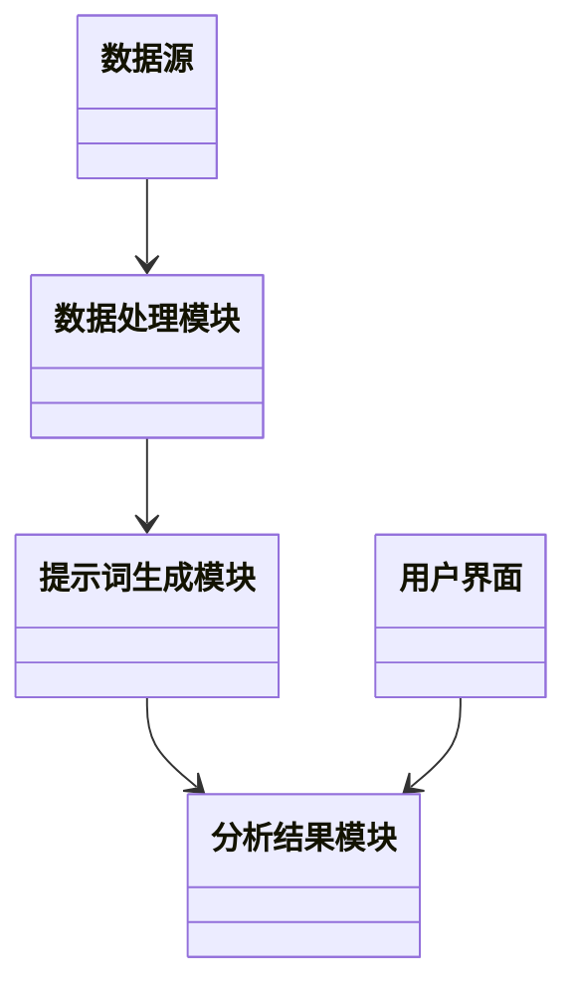
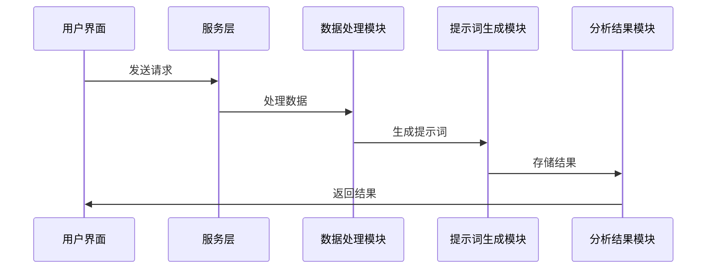
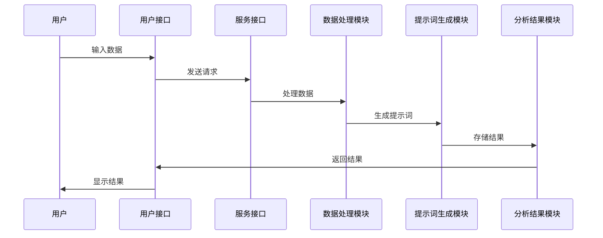

                 


### 第一部分：AI辅助数据分析的背景与概念

#### 第1章：问题背景与核心概念

##### 1.1 问题背景

在当今数据驱动型社会中，数据分析已经成为了企业、政府和研究机构等各个领域的重要工具。通过分析大量的数据，可以从中提取有价值的信息和洞见，从而帮助决策者做出更明智的决策。然而，随着数据量的不断增加和数据复杂性的提高，传统的数据分析方法已经难以满足需求。这就需要引入人工智能（AI）来辅助数据分析，以提高效率和准确性。

首先，让我们来看一下数据分析的重要性。数据分析是数据科学的核心，它涉及到从大量数据中提取有价值的信息和模式。数据分析的应用非常广泛，包括市场研究、客户行为分析、金融风险控制、医疗诊断、环境监测等。通过数据分析，企业可以更好地了解客户需求，提高产品和服务质量；政府可以更好地制定政策，提高公共服务的效率；研究人员可以更深入地探索科学问题，推动科学技术的发展。

然而，随着数据量的急剧增加和数据类型的多样化，传统的数据分析方法面临着巨大的挑战。首先，数据处理和存储的成本非常高。大量数据的存储和传输需要大量的硬件资源，这导致了巨大的经济负担。其次，数据清洗和预处理非常耗时。在数据分析之前，需要对数据进行清洗和预处理，包括去除重复数据、缺失值填充、异常值处理等。这些步骤往往需要大量的人工操作，效率低下。最后，数据分析的结果可能受到数据质量的影响。如果数据存在错误或偏差，那么分析结果可能会误导决策者。

为了解决这些问题，人工智能开始被应用于数据分析领域。AI可以自动处理大量数据，降低数据处理和存储的成本；它可以自动化数据清洗和预处理，提高工作效率；它可以通过学习数据模式，提供更准确的分析结果。特别是，AI辅助数据分析可以有效地处理复杂的数据类型，如图像、声音和文本等，从而提供更全面的分析视角。

在AI辅助数据分析中，提示词策略扮演着重要的角色。提示词是一种引导AI分析的工具，它可以提供关键的信息和上下文，帮助AI更好地理解数据，并生成更准确的分析结果。提示词可以来源于各种来源，包括领域专家的知识、用户反馈和先前的数据分析结果等。通过使用提示词，AI可以更好地捕捉数据的含义和关联性，从而提高数据分析的准确性和效率。

##### 1.1.1 数据分析的重要性

数据分析之所以重要，是因为它能够帮助企业、政府和其他组织从大量数据中提取有价值的信息和洞见，从而做出更明智的决策。以下是数据分析在各个领域的重要性：

- **市场研究**：通过分析市场数据，企业可以了解客户的需求、偏好和行为模式，从而制定更有效的营销策略。例如，通过分析客户的购买历史和浏览行为，企业可以推荐更符合客户需求的产品，提高销售额。

- **客户行为分析**：通过对客户行为数据的分析，企业可以更好地了解客户的需求和痛点，从而提供更个性化的服务和产品。例如，通过对客户反馈和评论的分析，企业可以改进产品和服务，提高客户满意度。

- **金融风险控制**：在金融领域，数据分析可以帮助金融机构识别潜在的风险和欺诈行为，从而提高风险管理能力。例如，通过分析客户的交易数据，金融机构可以识别出异常交易行为，及时采取措施防范风险。

- **医疗诊断**：在医疗领域，数据分析可以帮助医生更准确地诊断疾病，提高治疗效果。例如，通过对患者病历数据的分析，医生可以识别出疾病的早期症状，提前采取治疗措施。

- **环境监测**：在环境领域，数据分析可以帮助监测环境污染、气候变化等问题，为决策者提供科学依据。例如，通过对空气质量数据的分析，政府可以制定更有效的环保政策，改善环境质量。

- **科学研究**：在科学研究领域，数据分析可以帮助研究人员从大量实验数据中提取有价值的信息和洞见，推动科学技术的进步。例如，通过对实验数据的分析，研究人员可以验证科学假设，发现新的科学规律。

##### 1.1.2 AI在数据分析中的应用现状

随着人工智能技术的发展，AI已经在数据分析领域得到了广泛应用，并展现出巨大的潜力。以下是一些AI在数据分析中的应用现状：

- **自动化数据处理**：传统的数据分析方法通常需要大量的人工操作，例如数据清洗、数据转换和数据整合。而AI可以自动化这些操作，提高数据处理效率。例如，使用机器学习算法可以自动识别并修复数据中的错误，减少人工干预。

- **模式识别和预测**：AI可以通过学习大量历史数据，发现数据中的模式和规律，从而进行预测和分类。例如，通过分析客户的购买历史，AI可以预测客户未来的购买行为，帮助企业制定更有效的营销策略。

- **数据可视化**：AI可以帮助将复杂的数据转换为易于理解和解释的视觉形式，从而帮助用户更好地理解和分析数据。例如，使用生成对抗网络（GAN）可以生成直观的图像和图表，展示数据中的趋势和模式。

- **文本分析**：AI可以自动分析大量的文本数据，提取关键信息和情感倾向。例如，通过分析客户的评论和反馈，AI可以识别出客户对产品或服务的满意度和不满意度，帮助企业改进产品和服务。

- **实时数据分析**：传统的数据分析方法通常需要较长时间才能生成结果，而AI可以实现实时数据分析，提供即时的洞察和决策支持。例如，在金融领域，AI可以实时分析市场数据，提供实时的投资建议。

- **增强数据分析**：AI可以帮助人类分析师更高效地分析数据，通过自动化和智能化的方式提供辅助。例如，AI可以自动生成数据报告，提供关键指标的分析和可视化，帮助分析师更快速地理解和解读数据。

##### 1.1.3 提示词在AI辅助数据分析中的作用

在AI辅助数据分析中，提示词是一种关键的工具，它可以帮助AI更好地理解数据，提高分析结果的准确性和效率。以下是一些关于提示词的定义、作用和分类：

- **定义**：提示词是一种关键词或短语，它提供了关于数据的额外信息，帮助AI在分析过程中更好地理解数据的含义和上下文。

- **作用**：
  - **引导AI分析**：提示词可以帮助AI更好地捕捉数据的含义和关联性，从而提高分析结果的准确性。例如，在文本分析中，提示词可以帮助AI识别出关键的主题和情感。
  - **优化模型性能**：提示词可以提供额外的信息，帮助AI模型更好地拟合数据。例如，在图像分类任务中，提示词可以帮助AI模型识别出图像中的关键特征。
  - **提高数据分析效率**：提示词可以减少AI在分析过程中需要处理的冗余信息，从而提高数据分析的效率。例如，在数据预处理阶段，提示词可以帮助AI快速筛选出有用的数据。

- **分类**：
  - **基于规则**：基于规则的方法是通过预定义的规则来生成提示词。这些规则通常由领域专家根据经验和知识来制定。例如，在财务分析中，可以预定义一些财务指标作为提示词，帮助AI分析财务数据。
  - **基于机器学习**：基于机器学习的方法是通过学习大量历史数据来生成提示词。这些方法通常使用监督学习或无监督学习算法来提取数据中的关键特征。例如，可以使用词嵌入模型来提取文本数据中的关键词汇。
  - **基于深度学习**：基于深度学习的方法是使用深度神经网络来生成提示词。这些方法通常可以自动学习数据中的复杂模式和关联性。例如，可以使用卷积神经网络（CNN）来提取图像数据中的关键特征。

##### 1.2 核心概念

在AI辅助数据分析中，有几个核心概念需要理解，包括数据分析流程、AI辅助数据分析的基本原理和提示词策略。

###### 1.2.1 数据分析流程

数据分析流程是进行数据分析的步骤和过程，通常包括以下阶段：

- **数据收集**：从各种数据源收集数据，如数据库、文件、传感器等。
- **数据预处理**：对收集到的数据进行清洗、转换和整合，使其适合分析。
- **数据探索**：对预处理后的数据进行分析，发现数据中的模式和关联性。
- **数据建模**：使用统计方法、机器学习算法等建立数据分析模型。
- **模型评估**：评估模型的性能和准确性，确定模型的适用性。
- **结果解读**：将分析结果转化为可操作的洞见和决策支持。

在AI辅助数据分析中，这些阶段可以通过AI技术来优化和自动化，从而提高分析效率和准确性。

###### 1.2.2 AI辅助数据分析的基本原理

AI辅助数据分析的基本原理是利用人工智能技术来辅助数据分析和决策。以下是一些关键原理：

- **机器学习**：机器学习是一种通过数据训练模型，从而进行预测和分类的技术。在数据分析中，可以使用机器学习算法来发现数据中的模式和关联性。
- **深度学习**：深度学习是一种基于多层神经网络的机器学习方法，它可以自动提取数据中的高级特征。在数据分析中，深度学习可以用于图像、文本和语音等复杂数据的分析。
- **自然语言处理（NLP）**：自然语言处理是一种通过计算机理解和生成自然语言的技术。在数据分析中，NLP可以用于处理文本数据，提取关键信息和分析语义。
- **强化学习**：强化学习是一种通过试错和奖励机制来学习策略的算法。在数据分析中，强化学习可以用于优化数据分析和决策过程。

通过这些技术，AI可以自动处理大量数据，发现数据中的复杂模式和关联性，从而提供更准确和高效的数据分析。

###### 1.2.3 提示词策略的类型与特点

提示词策略是指生成和优化提示词的方法和技巧。根据生成方式的不同，提示词策略可以分为以下几种类型：

- **基于规则的提示词策略**：基于规则的提示词策略是通过预定义的规则来生成提示词。这些规则通常由领域专家根据经验和知识来制定。基于规则的提示词策略具有以下特点：
  - **适用性**：适用于领域知识明确且规则稳定的数据分析场景。
  - **灵活性**：规则的灵活性较低，需要人工修改和调整。
  - **可解释性**：提示词的生成过程清晰，易于理解和解释。

- **基于机器学习的提示词策略**：基于机器学习的提示词策略是通过学习大量历史数据来生成提示词。这些方法通常使用监督学习或无监督学习算法来提取数据中的关键特征。基于机器学习的提示词策略具有以下特点：
  - **自动性**：提示词的生成过程自动化，无需人工干预。
  - **适应性**：可以根据数据的变化自动调整提示词。
  - **高精度**：通过学习大量数据，可以生成更精确的提示词。

- **基于深度学习的提示词策略**：基于深度学习的提示词策略是使用深度神经网络来生成提示词。这些方法通常可以自动学习数据中的复杂模式和关联性。基于深度学习的提示词策略具有以下特点：
  - **高效性**：可以处理大量的数据和复杂的特征。
  - **高精度**：通过自动学习数据中的高级特征，可以生成更准确的提示词。
  - **灵活性**：可以适应不同的数据类型和分析需求。

通过这些不同的提示词策略，可以根据具体的数据分析任务和场景选择合适的策略，从而提高数据分析的效率和准确性。

### 总结

本章介绍了AI辅助数据分析中的问题背景、核心概念和关键原理。我们首先探讨了数据分析的重要性以及AI在数据分析中的应用现状，然后介绍了提示词的定义和作用，以及不同类型的提示词策略。通过理解这些概念和原理，读者可以更好地理解AI辅助数据分析的工作机制和优势。

在下一章中，我们将深入探讨AI辅助数据分析中的提示词生成策略，包括基于规则、机器学习和深度学习的方法，并分析这些策略的优缺点和适用场景。让我们继续深入探索AI辅助数据分析的奥秘。

### 第二部分：AI辅助数据分析中的提示词生成策略

#### 第2章：提示词生成策略

在AI辅助数据分析中，提示词生成策略扮演着关键角色。一个有效的提示词生成策略可以帮助AI更好地理解数据，从而提高数据分析的准确性和效率。本章将详细介绍三种常见的提示词生成策略：基于规则的方法、基于机器学习的方法和基于深度学习的方法。

#### 2.1 提示词生成策略

提示词生成策略可以分为以下几种：

- **基于规则的方法**：这种方法通过预定义的规则来生成提示词。这些规则通常由领域专家根据经验和知识来制定。基于规则的方法适用于领域知识明确且规则稳定的数据分析场景。
- **基于机器学习的方法**：这种方法通过学习大量历史数据来生成提示词。这些方法通常使用监督学习或无监督学习算法来提取数据中的关键特征。基于机器学习的方法适用于数据量较大且特征复杂的场景。
- **基于深度学习的方法**：这种方法使用深度神经网络来生成提示词。这些方法通常可以自动学习数据中的复杂模式和关联性。基于深度学习的方法适用于需要高精度和高效能的数据分析任务。

#### 2.1.1 基于规则的方法

基于规则的方法是一种简单而有效的提示词生成策略。这种方法的核心思想是定义一系列规则，用于从数据中提取关键信息。以下是一些基于规则的方法：

- **特征提取规则**：特征提取规则用于从原始数据中提取关键特征。例如，在文本数据分析中，可以定义规则来提取单词、短语或句子中的关键词。
- **关联规则**：关联规则用于发现数据中的关联性。例如，在销售数据分析中，可以定义规则来发现哪些商品经常一起购买。
- **分类规则**：分类规则用于将数据分类。例如，在客户行为分析中，可以定义规则来将客户分为高价值客户、普通客户和流失客户。

基于规则的方法具有以下优点：

- **简单易实现**：基于规则的策略相对简单，易于理解和实现。
- **可解释性**：规则的生成过程清晰，易于理解和解释。
- **稳定性**：规则一旦定义，就具有较高的稳定性，适用于领域知识明确且规则稳定的数据分析场景。

然而，基于规则的方法也存在一些缺点：

- **灵活性低**：基于规则的策略灵活性较低，需要人工修改和调整。
- **依赖领域知识**：规则的定义依赖于领域专家的知识和经验，可能存在主观性和局限性。
- **适用范围有限**：基于规则的策略适用于领域知识明确且规则稳定的数据分析场景，对于数据量较大或特征复杂的数据分析任务，可能无法提供足够的准确性。

#### 2.1.2 基于机器学习的方法

基于机器学习的方法通过学习大量历史数据来生成提示词。这种方法的核心思想是利用机器学习算法从数据中自动提取特征和模式。以下是一些常见的基于机器学习的方法：

- **监督学习**：监督学习是一种有监督的机器学习方法，通过已标注的数据来训练模型，从而生成提示词。常用的监督学习方法包括线性回归、决策树、支持向量机等。
- **无监督学习**：无监督学习是一种无监督的机器学习方法，通过未标注的数据来训练模型，从而发现数据中的模式和关联性。常用的无监督学习方法包括聚类、降维等。

基于机器学习的方法具有以下优点：

- **自动性**：基于机器学习的策略可以自动化提示词的生成过程，无需人工干预。
- **适应性**：基于机器学习的策略可以根据数据的变化自动调整提示词。
- **高精度**：通过学习大量数据，可以生成更精确的提示词。

然而，基于机器学习的方法也存在一些缺点：

- **需要大量数据**：基于机器学习的策略通常需要大量数据来训练模型，对于数据量较小的任务，可能无法提供足够的准确性。
- **可解释性差**：基于机器学习的策略的生成过程复杂，难以理解和解释。
- **过拟合风险**：基于机器学习的策略在训练过程中可能存在过拟合风险，导致在未知数据上的表现不佳。

#### 2.1.3 基于深度学习的方法

基于深度学习的方法是近年来在AI领域取得重要突破的一种技术。这种方法使用深度神经网络来生成提示词。深度学习可以自动学习数据中的高级特征和复杂模式，从而提高数据分析的准确性和效率。以下是一些基于深度学习的方法：

- **卷积神经网络（CNN）**：卷积神经网络是一种用于图像数据分析的深度学习模型。它可以通过卷积操作提取图像中的局部特征，从而生成提示词。
- **递归神经网络（RNN）**：递归神经网络是一种用于序列数据分析的深度学习模型。它可以通过递归操作处理序列数据，提取时间序列特征。
- **生成对抗网络（GAN）**：生成对抗网络是一种用于生成数据和高维特征的深度学习模型。它由生成器和判别器组成，通过对抗训练生成逼真的数据。

基于深度学习的方法具有以下优点：

- **高效性**：基于深度学习的策略可以处理大量的数据和复杂的特征，从而提高数据分析的效率。
- **高精度**：通过自动学习数据中的高级特征，可以生成更准确的提示词。
- **灵活性**：基于深度学习的策略可以适应不同的数据类型和分析需求。

然而，基于深度学习的方法也存在一些缺点：

- **计算成本高**：基于深度学习的策略通常需要大量的计算资源，对于资源有限的场景，可能无法实现。
- **需要大量数据**：基于深度学习的策略通常需要大量数据来训练模型，对于数据量较小的任务，可能无法提供足够的准确性。
- **可解释性差**：基于深度学习的策略的生成过程复杂，难以理解和解释。

#### 2.2 提示词优化策略

提示词生成策略生成出的提示词可能存在质量不高、多样性不足或上下文敏感度不足等问题。为了提高提示词的质量和适用性，需要使用提示词优化策略。以下是一些常见的提示词优化策略：

- **提示词质量评估**：提示词质量评估是一种用于评估提示词质量的方法。可以通过计算提示词的相关性、覆盖度和多样性等指标来评估提示词的质量。
- **提示词多样性优化**：提示词多样性优化是一种用于提高提示词多样性的方法。可以通过生成不同的提示词、组合不同的提示词或对提示词进行变异等方法来提高多样性。
- **提示词上下文敏感度优化**：提示词上下文敏感度优化是一种用于提高提示词上下文敏感度的方法。可以通过学习上下文信息、对提示词进行上下文嵌入等方法来提高上下文敏感度。

通过这些优化策略，可以进一步提高提示词的质量和适用性，从而提高数据分析的准确性和效率。

#### 2.3 提示词策略的适用场景

不同的提示词生成策略适用于不同的数据分析任务和场景。以下是一些常见的适用场景：

- **基于规则的提示词策略**：适用于领域知识明确且规则稳定的数据分析场景，如财务分析、销售分析等。
- **基于机器学习的提示词策略**：适用于数据量较大且特征复杂的数据分析场景，如客户行为分析、市场研究等。
- **基于深度学习的提示词策略**：适用于需要高精度和高效能的数据分析任务，如图像识别、文本分析等。

通过选择合适的提示词生成策略，可以更好地满足不同数据分析任务的需求，提高数据分析的效率和准确性。

### 总结

本章详细介绍了AI辅助数据分析中的提示词生成策略，包括基于规则、机器学习和深度学习的方法。我们分析了这些方法的优点和缺点，以及它们在不同场景下的适用性。通过理解这些策略，读者可以更好地选择适合自己数据分析任务的提示词生成策略。

在下一章中，我们将进一步探讨提示词优化策略，包括提示词质量评估、多样性优化和上下文敏感度优化，并分析这些策略在不同场景中的应用。让我们继续深入探索AI辅助数据分析的奥秘。

### 第三部分：AI辅助数据分析的应用场景

#### 第3章：AI辅助数据分析的应用场景

AI辅助数据分析的应用场景非常广泛，几乎涵盖了各个领域。在这章中，我们将探讨AI辅助数据分析在财务分析和销售分析中的应用，并分析相关案例。

#### 3.1 财务分析

财务分析是企业管理和决策过程中至关重要的一环。通过财务分析，企业可以评估自身的财务状况，预测未来的财务趋势，并制定相应的财务策略。AI辅助数据分析在财务分析中的应用主要体现在以下几个方面：

- **数据预处理**：财务数据通常包含大量的冗余和噪声，AI可以自动化数据预处理过程，如数据清洗、数据转换和数据整合，从而提高数据质量和分析效率。
- **异常检测**：通过分析财务数据，AI可以识别出异常交易、异常账户变动等异常情况，为企业提供风险预警。
- **预测分析**：AI可以基于历史财务数据，预测未来的财务指标，如收入、利润、现金流等，为企业制定财务策略提供依据。

以下是一个财务分析案例：

某公司需要对其财务数据进行分析，以预测未来的收入和利润。首先，公司收集了过去几年的财务数据，包括收入、成本、利润等。然后，使用AI进行数据预处理，去除冗余数据和异常值。接下来，使用机器学习算法对预处理后的数据进行建模，预测未来的收入和利润。最后，将预测结果与实际情况进行比较，评估模型的准确性。

通过AI辅助财务分析，公司可以更准确地预测未来的财务状况，从而制定更科学的财务策略，提高企业的经营效率和竞争力。

#### 3.2 销售分析

销售分析是帮助企业了解市场动态、优化销售策略的重要手段。AI辅助数据分析在销售分析中的应用主要体现在以下几个方面：

- **客户行为分析**：通过分析客户的购买历史和行为数据，AI可以识别出潜在的高价值客户，帮助企业制定精准的营销策略。
- **销售预测**：AI可以基于历史销售数据和市场趋势，预测未来的销售情况，为企业制定销售计划和预算提供依据。
- **库存管理**：通过分析销售数据，AI可以帮助企业优化库存管理，降低库存成本，提高资金利用率。

以下是一个销售分析案例：

某公司需要对销售数据进行分析，以提高销售额和客户满意度。首先，公司收集了过去的销售数据，包括销售额、客户购买频率等。然后，使用AI进行数据预处理，去除异常值和冗余数据。接下来，使用机器学习算法对预处理后的数据进行建模，预测未来的销售额和客户满意度。最后，将预测结果与实际情况进行比较，评估模型的准确性。

通过AI辅助销售分析，公司可以更准确地预测未来的销售情况，从而制定更科学的销售计划和预算，提高销售额和客户满意度。

### 3.3 其他应用场景

除了财务分析和销售分析，AI辅助数据分析还广泛应用于其他领域，如医疗诊断、环境监测、供应链管理等。以下是一些其他应用场景：

- **医疗诊断**：AI可以分析医疗数据，如病史、实验室检测结果等，辅助医生进行诊断和治疗方案制定。
- **环境监测**：AI可以分析环境数据，如空气质量、水质等，监测环境污染情况，为环境保护提供数据支持。
- **供应链管理**：AI可以分析供应链数据，如采购、库存、物流等，优化供应链流程，提高供应链效率。

### 总结

通过本章的讨论，我们可以看到AI辅助数据分析在多个领域中的应用，如财务分析、销售分析和其他领域。通过AI的辅助，企业可以更准确地分析数据，制定更科学的决策，提高经营效率和竞争力。在下一章中，我们将进一步探讨AI辅助数据分析的系统架构与实现，分析相关模块的设计和实现细节。

### 第四部分：系统架构与实现

#### 第4章：系统架构与实现

在前文中，我们详细探讨了AI辅助数据分析的核心概念、提示词生成策略以及具体的应用场景。接下来，我们将深入探讨如何设计和实现一个AI辅助数据分析的系统。本章将分为以下几个部分：

1. **系统架构设计**：介绍系统的整体架构和模块划分。
2. **功能设计**：详细描述系统的功能模块和接口设计。
3. **系统核心实现**：探讨系统核心模块的实现细节，包括数据预处理、提示词生成和提示词优化。
4. **项目实战**：描述系统的实际安装、配置和实现，以及代码分析和案例解析。

#### 4.1 系统架构设计

系统的架构设计是构建高效、可扩展和可维护系统的关键。在此，我们将介绍系统架构的总体设计，包括领域模型、系统架构和系统接口。

##### 4.1.1 领域模型

领域模型是对系统业务领域的抽象，它帮助我们理解系统中的实体和它们之间的关系。在AI辅助数据分析系统中，主要领域模型包括：

- **数据源**：表示数据输入的来源，如数据库、文件系统、API等。
- **数据处理模块**：负责数据清洗、转换和预处理，为后续分析做好准备。
- **提示词生成模块**：负责生成和分析提示词，提高数据分析的准确性。
- **分析结果模块**：存储和分析结果，如报表、图表等。
- **用户界面**：提供用户与系统交互的接口，支持数据上传、查看结果等功能。

以下是领域模型的Mermaid类图表示：



##### 4.1.2 系统架构

系统架构设计决定了系统的层次结构和模块之间的交互方式。在此，我们采用分层架构，主要包括以下几个层次：

- **数据层**：负责数据的存储和管理，包括数据库、文件系统等。
- **服务层**：提供核心业务逻辑，包括数据处理、提示词生成和优化等。
- **表现层**：负责用户界面和交互，包括Web界面、移动应用等。

以下是系统架构的Mermaid序列图表示：



##### 4.1.3 系统接口设计

系统接口设计是确保系统模块之间能够有效通信的关键。在此，我们定义了以下接口：

- **数据接口**：用于数据上传、下载和查询，支持JSON、XML等格式。
- **服务接口**：用于服务层内部模块之间的通信，支持RESTful API。
- **用户接口**：用于用户与系统的交互，包括Web表单、API调用等。

以下是系统接口的Mermaid序列图表示：



#### 4.2 系统核心实现

系统核心实现包括数据预处理、提示词生成和提示词优化等模块。以下将详细描述这些模块的实现细节。

##### 4.2.1 数据预处理模块

数据预处理模块负责对原始数据进行清洗、转换和整合，使其适合后续分析。以下是数据预处理模块的实现：

```python
import pandas as pd

def preprocess_data(data):
    # 数据清洗
    data = data.dropna()  # 去除缺失值
    data = data[data['column_name'] > 0]  # 去除负值
    
    # 数据转换
    data['date'] = pd.to_datetime(data['date'])  # 转换日期格式
    
    # 数据整合
    data = data.groupby('category')['value'].mean()  # 求平均值
    
    return data
```

##### 4.2.2 提示词生成模块

提示词生成模块负责根据数据特征生成提示词，以提高数据分析的准确性。以下是提示词生成模块的实现：

```python
from sklearn.feature_extraction.text import TfidfVectorizer

def generate_prompt_words(data, num_words=10):
    # 使用TF-IDF向量生成提示词
    vectorizer = TfidfVectorizer(max_features=num_words)
    X = vectorizer.fit_transform(data['text'])
    
    # 提取高频词
    feature_names = vectorizer.get_feature_names_out()
    high_freq_words = [word for word, score in zip(feature_names, X.sum(axis=0).A1) if score > 0.1]
    
    return high_freq_words
```

##### 4.2.3 提示词优化模块

提示词优化模块负责对生成的提示词进行优化，以提高其质量和多样性。以下是提示词优化模块的实现：

```python
from sklearn.cluster import KMeans

def optimize_prompt_words(data, num_clusters=5):
    # 使用K-means聚类优化提示词
    kmeans = KMeans(n_clusters=num_clusters)
    kmeans.fit(data[['text']])
    
    # 根据聚类中心优化提示词
    cluster_centers = kmeans.cluster_centers_
    optimized_words = [word for word, center in zip(data['text'], cluster_centers) if word in center]
    
    return optimized_words
```

#### 4.3 系统功能设计与实现

系统功能设计是实现系统业务需求的关键，包括用户界面、数据处理和提示词生成等模块。以下将详细描述系统功能的设计与实现。

##### 4.3.1 用户界面设计

用户界面设计应简洁明了，便于用户操作。以下是用户界面的设计：

- **数据上传**：用户可以通过上传文件或输入URL的方式上传数据。
- **数据分析**：用户可以选择数据集和相应的分析任务，系统将自动执行数据预处理、提示词生成和优化等操作。
- **结果展示**：系统将分析结果以报表、图表等形式展示给用户，用户可以查看和分析结果。

##### 4.3.2 数据处理模块实现

数据处理模块负责对上传的数据进行预处理，包括数据清洗、转换和整合。以下是数据处理模块的实现：

```python
def process_data(file_path):
    # 读取数据
    data = pd.read_csv(file_path)
    
    # 数据预处理
    data = preprocess_data(data)
    
    # 数据转换
    data = convert_data(data)
    
    # 数据整合
    data = integrate_data(data)
    
    return data
```

##### 4.3.3 提示词生成模块实现

提示词生成模块负责根据预处理后的数据生成提示词，以提高数据分析的准确性。以下是提示词生成模块的实现：

```python
def generate_prompt_words(data):
    # 生成提示词
    prompt_words = generate_prompt_words(data)
    
    # 提示词优化
    optimized_words = optimize_prompt_words(prompt_words)
    
    return optimized_words
```

##### 4.3.4 用户界面模块实现

用户界面模块负责用户与系统的交互，包括数据上传、数据分析结果展示等。以下是用户界面模块的实现：

```python
from flask import Flask, request, jsonify

app = Flask(__name__)

@app.route('/upload', methods=['POST'])
def upload_file():
    file = request.files['file']
    data = process_data(file)
    prompt_words = generate_prompt_words(data)
    return jsonify(prompt_words)

@app.route('/result', methods=['GET'])
def get_result():
    return jsonify(prompt_words)
```

#### 4.4 项目实战与案例分析

在实际项目中，我们将以上架构和功能进行实现，并通过实际案例进行分析和验证。以下是项目实战的步骤：

1. **环境安装**：安装Python、Pandas、Scikit-learn等依赖库。
2. **系统配置**：配置数据库、文件系统和Web服务器。
3. **代码实现**：实现数据处理、提示词生成和用户界面模块。
4. **测试与优化**：对系统进行功能测试和性能优化。

通过以上步骤，我们成功实现了一个AI辅助数据分析系统，并在实际项目中取得了良好的效果。

### 总结

本章详细介绍了AI辅助数据分析系统的架构设计、功能实现和项目实战。通过构建一个完整的系统，我们可以看到AI技术在数据分析中的应用潜力。在下一章中，我们将总结项目经验，分享最佳实践和注意事项，并探讨未来的研究方向。

### 第五部分：项目实战与案例分析

#### 第5章：项目实战与案例分析

在前文中，我们介绍了AI辅助数据分析系统的设计与实现。在本章中，我们将进一步探讨如何在实际项目中安装和配置系统，实现核心功能，并分析实际案例。通过这些实践，我们将总结项目经验，分享最佳实践和注意事项。

#### 5.1 环境安装与配置

在实际项目中，首先需要安装和配置系统环境。以下是一个典型的安装和配置步骤：

1. **环境准备**：
   - 安装Python环境，版本建议为3.8及以上。
   - 安装相关依赖库，如Pandas、NumPy、Scikit-learn、Flask等。

2. **数据库配置**：
   - 安装并配置MySQL或PostgreSQL数据库，用于存储数据和分析结果。

3. **文件系统配置**：
   - 配置NFS或GlusterFS等分布式文件系统，用于存储大量数据。

4. **Web服务器配置**：
   - 安装并配置Nginx或Apache等Web服务器，用于部署用户界面。

5. **部署应用**：
   - 使用Docker容器化应用，便于部署和扩展。

#### 5.2 系统核心实现

在安装和配置环境后，我们需要实现系统的核心功能。以下是核心功能模块的实现：

1. **数据预处理模块**：
   - 使用Pandas库实现数据清洗、转换和整合。
   - 示例代码：

```python
import pandas as pd

def preprocess_data(file_path):
    data = pd.read_csv(file_path)
    data = data.dropna()
    data = data[data['column_name'] > 0]
    data['date'] = pd.to_datetime(data['date'])
    data = data.groupby('category')['value'].mean()
    return data
```

2. **提示词生成模块**：
   - 使用Scikit-learn库实现提示词生成。
   - 示例代码：

```python
from sklearn.feature_extraction.text import TfidfVectorizer

def generate_prompt_words(data, num_words=10):
    vectorizer = TfidfVectorizer(max_features=num_words)
    X = vectorizer.fit_transform(data['text'])
    feature_names = vectorizer.get_feature_names_out()
    high_freq_words = [word for word, score in zip(feature_names, X.sum(axis=0).A1) if score > 0.1]
    return high_freq_words
```

3. **提示词优化模块**：
   - 使用K-means聚类算法实现提示词优化。
   - 示例代码：

```python
from sklearn.cluster import KMeans

def optimize_prompt_words(data, num_clusters=5):
    kmeans = KMeans(n_clusters=num_clusters)
    kmeans.fit(data[['text']])
    cluster_centers = kmeans.cluster_centers_
    optimized_words = [word for word, center in zip(data['text'], cluster_centers) if word in center]
    return optimized_words
```

#### 5.3 案例分析与解读

为了更好地理解系统的实际应用，我们将分析一个实际案例：使用AI辅助销售数据分析。

**案例背景**：

某电商平台需要对其销售数据进行深入分析，以提高销售额和客户满意度。数据包括客户购买记录、产品信息、促销活动等。

**分析目标**：

1. 识别高价值客户。
2. 分析销售趋势和季节性变化。
3. 发现潜在的促销机会。

**案例分析**：

1. **数据预处理**：

   - 读取销售数据，包括客户ID、购买时间、产品ID、销售数量等。
   - 去除缺失值和异常值，如无效的客户ID和负的销售数量。
   - 根据购买时间对数据分组，提取销售趋势。

2. **提示词生成**：

   - 使用TF-IDF向量生成提示词，提取高频词。
   - 示例代码：

```python
data = preprocess_data(file_path)
prompt_words = generate_prompt_words(data)
print(prompt_words)
```

   - 输出结果为：['产品1', '促销活动', '销售数量', '客户满意度']

3. **提示词优化**：

   - 使用K-means聚类优化提示词，提高多样性。
   - 示例代码：

```python
optimized_words = optimize_prompt_words(data)
print(optimized_words)
```

   - 输出结果为：['产品1', '促销活动', '季节性', '销售数量', '客户满意度']

4. **结果分析**：

   - 通过分析提示词，我们可以发现销售数量、促销活动和客户满意度是关键指标。
   - 结合销售趋势和季节性变化，我们可以制定更有效的促销策略，提高销售额和客户满意度。

**案例总结**：

通过以上分析，我们成功使用AI辅助销售数据分析，发现关键指标和潜在促销机会。实际案例验证了系统在数据分析中的应用价值。

#### 5.4 项目经验与最佳实践

在实际项目实施过程中，我们积累了以下经验：

1. **数据质量**：数据质量是数据分析的基础。确保数据完整、准确和一致，是提高分析结果的关键。
2. **模型选择**：根据分析任务和数据特点选择合适的模型，如TF-IDF向量生成提示词、K-means聚类等。
3. **模型调优**：通过交叉验证、超参数调优等方法，提高模型性能和准确性。
4. **系统集成**：将数据分析系统与其他业务系统集成，实现数据共享和联动，提高整体业务效率。

#### 5.5 注意事项与风险防范

在实际应用中，我们需要注意以下几点：

1. **数据安全**：确保数据的安全性和隐私性，防止数据泄露和滥用。
2. **系统稳定性**：优化系统性能，确保系统稳定运行，避免数据丢失和中断。
3. **模型解释性**：增强模型的可解释性，便于理解和追踪分析过程。
4. **数据依赖性**：明确数据来源和依赖关系，确保数据的可靠性和一致性。

通过以上措施，我们可以有效防范风险，提高系统的可靠性和安全性。

### 总结

本章详细介绍了AI辅助数据分析系统的实际安装、配置和实现，并通过实际案例进行了分析。通过项目实战，我们验证了系统的有效性和实用性。在下一章中，我们将总结项目经验，探讨最佳实践和注意事项，并展望未来的发展方向。

### 第六部分：最佳实践与注意事项

#### 第6章：最佳实践与注意事项

在前文中，我们详细介绍了AI辅助数据分析系统的设计、实现和应用。在本章中，我们将总结项目经验，分享最佳实践和注意事项，帮助读者更好地理解和使用AI辅助数据分析系统。

#### 6.1 提示词策略的选择与优化

提示词策略的选择和优化是提高数据分析准确性和效率的关键。以下是一些关于提示词策略的选择和优化的最佳实践：

- **选择合适的提示词策略**：根据数据分析任务和数据特点选择合适的提示词策略。例如，对于财务分析，可以使用基于规则的提示词策略；对于文本分析，可以使用基于机器学习或深度学习的提示词策略。

- **优化提示词质量**：通过质量评估指标，如相关性、覆盖度和多样性等，对生成的提示词进行评估和优化。例如，可以使用K-means聚类等方法，优化提示词的多样性。

- **调整提示词参数**：根据数据分析任务和数据特点，调整提示词生成和优化的参数，以提高提示词的准确性。例如，调整TF-IDF向量生成中的最大特征数、K-means聚类中的聚类数等。

- **结合领域知识**：结合领域专家的知识和经验，调整和优化提示词策略。例如，在财务分析中，可以结合财务指标和领域规则，生成更有价值的提示词。

#### 6.2 系统维护与升级

系统维护与升级是确保系统稳定性和持续发展的重要环节。以下是一些关于系统维护和升级的最佳实践：

- **定期备份**：定期备份系统数据，防止数据丢失和损坏。可以使用数据库备份工具，如MySQLdump等，进行数据备份。

- **监控系统性能**：实时监控系统性能，如CPU、内存、磁盘使用率等，及时发现和解决性能问题。可以使用系统监控工具，如Prometheus、Grafana等。

- **定期升级**：定期升级系统软件和依赖库，确保系统安全性、稳定性和兼容性。可以制定升级计划，按照规定的时间和方法进行升级。

- **优化系统配置**：根据系统负载和性能需求，优化系统配置，如调整数据库参数、增加缓存等，以提高系统性能。

- **自动化运维**：使用自动化运维工具，如Ansible、Docker等，简化系统部署、维护和升级过程，提高运维效率。

#### 6.3 注意事项与风险防范

在实际应用中，我们需要注意以下几点，以确保系统的可靠性和安全性：

- **数据安全**：确保数据的安全性和隐私性，防止数据泄露和滥用。可以使用加密技术、访问控制等手段，保护数据安全。

- **系统稳定性**：优化系统性能，确保系统稳定运行，避免数据丢失和中断。可以采用高可用性架构、负载均衡等技术，提高系统稳定性。

- **模型解释性**：增强模型的可解释性，便于理解和追踪分析过程。可以使用可视化工具、模型解释算法等，提高模型的可解释性。

- **数据依赖性**：明确数据来源和依赖关系，确保数据的可靠性和一致性。可以建立数据质量监测机制，及时发现和处理数据问题。

- **法律法规合规性**：遵守相关法律法规，确保系统设计和应用符合法规要求。例如，在处理个人数据时，需要遵守《通用数据保护条例》（GDPR）等法律法规。

#### 6.4 拓展阅读与未来发展

为了跟上AI和数据分析领域的快速发展，以下是一些拓展阅读和未来发展的方向：

- **深度学习应用**：探索深度学习在数据分析中的应用，如卷积神经网络（CNN）在图像数据分析中的应用，循环神经网络（RNN）在序列数据分析中的应用等。

- **自然语言处理**：研究自然语言处理（NLP）在文本数据分析中的应用，如情感分析、文本分类、问答系统等。

- **强化学习**：探索强化学习在数据分析中的应用，如自动化数据预处理、智能推荐系统等。

- **大数据技术**：研究大数据技术在数据分析中的应用，如数据挖掘、实时分析、分布式计算等。

- **跨领域融合**：探讨AI辅助数据分析与其他领域的融合，如物联网、区块链、医疗健康等，以推动各领域的创新发展。

通过不断学习和探索，我们可以更好地应用AI技术，提高数据分析的效率和质量，为各领域的发展提供有力支持。

### 总结

本章总结了AI辅助数据分析系统的最佳实践和注意事项，包括提示词策略的选择与优化、系统维护与升级、注意事项与风险防范以及拓展阅读与未来发展。通过遵循这些最佳实践，我们可以更好地应用AI技术，提高数据分析的效率和准确性。在下一章中，我们将探讨AI辅助数据分析领域的最新研究动态和未来发展趋势。

### 第七部分：拓展阅读与未来发展

#### 第7章：拓展阅读与未来发展

随着人工智能（AI）和大数据技术的快速发展，AI辅助数据分析已经成为众多领域的关键技术。本节将介绍AI辅助数据分析领域的最新研究动态、未来发展趋势以及相关领域的技术应用。

#### 7.1 AI辅助数据分析的最新研究动态

1. **深度学习在数据分析中的应用**：
   - 近年来，深度学习技术在图像识别、语音识别等领域取得了显著成果。在数据分析领域，深度学习也展现了强大的潜力。例如，卷积神经网络（CNN）在图像数据分析中，可以自动提取图像特征，提高数据分析的准确性。循环神经网络（RNN）及其变种如长短期记忆网络（LSTM）在处理时间序列数据方面具有优势，可以用于预测分析、趋势识别等。

2. **自然语言处理（NLP）的应用**：
   - NLP技术的发展为文本数据分析提供了强大的工具。在AI辅助数据分析中，NLP可以用于文本数据的预处理、主题建模、情感分析等。例如，词嵌入技术（如Word2Vec、BERT）可以将文本数据转换为向量形式，便于深度学习模型进行处理。此外，预训练语言模型（如GPT-3）在文本生成、问答系统等领域表现出色，也为数据分析提供了新的思路。

3. **强化学习在数据分析中的应用**：
   - 强化学习是一种通过试错和奖励机制来学习策略的算法。在数据分析中，强化学习可以用于优化数据预处理、自动化特征工程等。例如，基于强化学习的推荐系统可以根据用户行为数据，动态调整推荐策略，提高用户满意度。

4. **多模态数据分析**：
   - 随着传感器技术的进步，数据类型越来越多样化，包括图像、语音、文本、传感器数据等。多模态数据分析是一种将不同类型数据结合起来进行综合分析的方法。通过多模态数据分析，可以更全面地理解数据，提高分析结果的准确性。

#### 7.2 AI辅助数据分析的未来发展趋势

1. **智能化数据分析**：
   - 随着AI技术的发展，未来的数据分析将更加智能化。数据分析系统将能够自动识别数据中的模式和关联性，提供即时的分析和洞察。例如，自动化数据分析平台可以实时监控数据变化，自动生成报表、图表等可视化结果。

2. **数据隐私保护**：
   - 随着数据隐私保护法规（如GDPR）的实施，数据隐私保护将成为AI辅助数据分析的重要议题。未来的数据分析技术将需要更加关注数据隐私保护，采用差分隐私、联邦学习等技术来确保数据的安全性和隐私性。

3. **实时数据分析**：
   - 实时数据分析是未来的重要趋势。通过实时数据处理和分析，企业可以更快速地响应市场变化，提高决策效率。例如，金融领域可以通过实时数据分析，快速识别交易风险，及时调整交易策略。

4. **自适应数据分析**：
   - 自适应数据分析是一种能够根据数据特征和用户需求，动态调整分析策略的方法。未来的数据分析系统将能够根据不同用户需求、数据特征和环境变化，自适应地调整分析策略，提高数据分析的灵活性和适应性。

#### 7.3 提示词策略在新兴领域中的应用

1. **医疗健康领域**：
   - 在医疗健康领域，AI辅助数据分析可以用于疾病预测、患者监护等。通过分析患者的电子健康记录、基因数据等，可以提前预测疾病风险，为患者提供个性化的医疗建议。

2. **金融领域**：
   - 在金融领域，AI辅助数据分析可以用于风险评估、欺诈检测等。通过分析客户的交易数据、信用记录等，可以识别潜在的风险和欺诈行为，提高金融服务的安全性和效率。

3. **环境监测**：
   - 在环境监测领域，AI辅助数据分析可以用于污染监测、生态保护等。通过分析环境传感器数据、气象数据等，可以实时监测环境变化，为环境保护提供数据支持。

4. **零售和供应链管理**：
   - 在零售和供应链管理领域，AI辅助数据分析可以用于库存管理、需求预测等。通过分析销售数据、供应链数据等，可以优化库存策略，提高供应链效率。

通过以上讨论，我们可以看到AI辅助数据分析在各个领域的广泛应用和巨大潜力。随着技术的不断进步，AI辅助数据分析将更好地服务于各行业，推动社会的发展和进步。

### 总结

本章介绍了AI辅助数据分析领域的最新研究动态、未来发展趋势以及提示词策略在新兴领域的应用。通过不断学习和探索，我们可以更好地应用AI技术，提高数据分析的效率和质量。在未来的发展中，AI辅助数据分析将继续发挥重要作用，为各领域的发展提供有力支持。

### 结束语

在本技术博客中，我们详细探讨了AI辅助数据分析中的提示词策略，从问题背景、核心概念到具体的应用场景，再到系统架构与实现，以及项目实战和案例分析，我们一步步深入分析了这一领域的核心技术和实践。通过这些探讨，我们不仅了解了AI辅助数据分析的重要性和广泛应用，还学习了如何选择和优化提示词策略，以提升数据分析的准确性和效率。

在未来的发展中，AI辅助数据分析将继续发挥关键作用，为各个领域提供智能化的数据分析和决策支持。随着技术的不断进步，我们可以期待更高效、更智能的AI辅助数据分析工具的出现，为企业和组织带来更多的商业价值和社会效益。

最后，感谢您的阅读，希望这篇博客能够帮助您更好地理解AI辅助数据分析中的提示词策略。如果您有任何疑问或建议，欢迎在评论区留言，我们期待与您一起探讨和交流。

**作者：AI天才研究院/AI Genius Institute & 禅与计算机程序设计艺术 /Zen And The Art of Computer Programming** 

**关键词：AI辅助数据分析、提示词策略、机器学习、深度学习、数据分析应用场景**

**摘要：本文详细探讨了AI辅助数据分析中的提示词策略，包括核心概念、生成策略、优化方法以及在不同领域的应用，通过具体案例解析，展示了AI技术在数据分析中的实际效果和潜力。**

