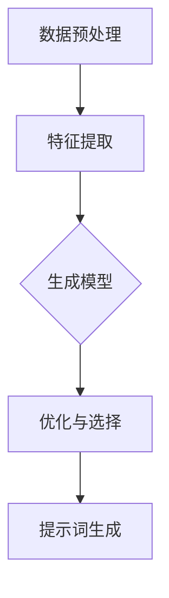
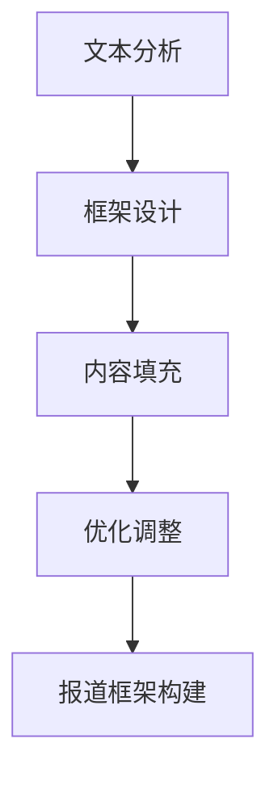

                 

。

## 第二部分: 核心概念与联系

### 2.1 AI辅助新闻写作的定义

AI辅助新闻写作是一种利用人工智能技术来提高新闻写作效率和质量的方法。它主要包括文本生成、文本摘要、文本分类、情感分析等自然语言处理技术。在新闻写作过程中，AI可以自动提取新闻关键信息、生成新闻标题、撰写新闻正文，从而减少人工写作的负担，提高新闻的发布速度。

#### 2.1.1 关键技术

- **文本生成**：利用深度学习模型生成新闻文本，如GPT（Generative Pre-trained Transformer）模型。
- **文本摘要**：提取新闻的关键信息，生成简洁的新闻摘要。
- **文本分类**：对新闻文本进行分类，如财经、体育、科技等。
- **情感分析**：分析新闻文本的情感倾向，如正面、负面或中性。

#### 2.1.2 AI辅助新闻写作的优势

- **提高写作效率**：AI可以快速生成新闻文本，节省时间。
- **提升写作质量**：通过学习大量数据，AI可以写出更加准确、生动的新闻。
- **降低写作成本**：减少人力成本，降低新闻写作的整体成本。

### 2.2 提示词生成的概念

提示词生成是AI辅助新闻写作中的一项重要技术，它通过分析新闻文本，提取出关键性的提示词，为新闻写作提供方向和指导。

#### 2.2.1 提示词生成的作用

- **明确写作方向**：提示词可以指导作者撰写新闻，避免偏离主题。
- **提高写作效率**：通过提示词，作者可以更快地找到写作的切入点。
- **保证新闻一致性**：提示词可以帮助多篇新闻保持主题一致，避免信息重复。

#### 2.2.2 提示词生成的应用场景

- **新闻标题生成**：根据提示词生成新闻标题，吸引读者注意力。
- **新闻正文撰写**：利用提示词指导新闻正文撰写，确保内容相关。
- **新闻分类**：根据提示词对新闻进行分类，便于管理和推荐。

### 2.3 报道框架的概念

报道框架是新闻写作的结构框架，它规定了新闻的标题、导语、段落布局、论据和结论等要素的顺序和结构。

#### 2.3.1 报道框架的作用

- **组织新闻内容**：报道框架可以帮助作者有条理地组织新闻内容，使新闻更加清晰易懂。
- **确保新闻完整性**：报道框架保证了新闻的完整性，不会遗漏重要信息。
- **提高新闻可读性**：合理的报道框架可以提高新闻的可读性，增强读者的阅读体验。

#### 2.3.2 报道框架的类型

- **倒金字塔结构**：重点信息放在开头，便于读者快速了解新闻核心。
- **时间顺序结构**：按照时间顺序组织新闻内容，便于读者理解事件发展。
- **主题框架结构**：围绕主题组织新闻内容，使新闻更加深入、全面。

### 2.4 三者之间的联系

AI辅助新闻写作、提示词生成和报道框架是相互关联的三个核心概念。

- **AI辅助新闻写作**为整体提供了技术基础，使得新闻写作变得更加高效、智能。
- **提示词生成**是AI辅助新闻写作的核心功能之一，为新闻写作提供了方向和指导。
- **报道框架**则是在提示词的基础上，对新闻内容进行组织和管理，确保新闻的完整性和可读性。

通过结合这三个概念，AI辅助新闻写作可以实现高效、高质量的新闻生产，满足现代新闻业的需求。

---

### 2.5 AI辅助新闻写作的核心概念

#### 2.5.1 AI辅助新闻写作的流程

AI辅助新闻写作的流程主要包括以下几个步骤：

1. **数据采集**：收集新闻相关的数据，如文本、图片、视频等。
2. **预处理**：对采集到的数据进行分析、清洗和处理，提取有用的信息。
3. **文本生成**：利用深度学习模型生成新闻文本。
4. **文本摘要**：提取新闻的关键信息，生成简洁的新闻摘要。
5. **文本分类**：对新闻文本进行分类，便于管理和推荐。
6. **情感分析**：分析新闻文本的情感倾向。

#### 2.5.2 AI辅助新闻写作的关键技术

AI辅助新闻写作的关键技术包括：

- **自然语言处理（NLP）**：用于处理文本数据，包括文本生成、文本摘要、文本分类和情感分析等。
- **深度学习模型**：如GPT、BERT等，用于生成新闻文本和提取关键信息。
- **大数据技术**：用于处理海量数据，包括数据采集、预处理和存储等。

### 2.6 提示词生成与报道框架的关系

#### 2.6.1 提示词生成在报道框架构建中的作用

提示词生成在报道框架构建中起到了关键作用，具体体现在以下几个方面：

- **确定报道方向**：提示词可以帮助作者明确报道的方向，确保新闻主题的一致性。
- **指导段落布局**：提示词可以作为段落布局的依据，使新闻报道更加条理清晰。
- **丰富新闻内容**：通过提示词，作者可以更加深入地挖掘新闻背后的信息，使新闻内容更加丰富。

#### 2.6.2 报道框架在提示词生成中的指导作用

报道框架在提示词生成中也起到了重要的指导作用，具体体现在以下几个方面：

- **确定关键词**：报道框架规定了新闻的标题、导语和段落布局，为提示词生成提供了关键词的基础。
- **确保内容完整性**：报道框架保证了新闻的完整性，避免提示词生成过程中遗漏重要信息。
- **提高新闻可读性**：通过合理的报道框架，提示词生成的新闻内容更加条理清晰，易于读者理解。

### 2.7 概念属性特征对比表格

为了更好地理解AI辅助新闻写作、提示词生成和报道框架的关系，下面给出一个概念属性特征对比表格：

| 概念        | 定义                     | 特征对比                |
| ----------- | ------------------------ | ---------------------- |
| AI辅助新闻写作 | 利用AI技术提高新闻写作效率和质量 | - 文本生成<br>- 文本摘要<br>- 文本分类<br>- 情感分析 |
| 提示词生成  | 提取新闻文本的关键提示词 | - 确定报道方向<br>- 指导段落布局<br>- 丰富新闻内容 |
| 报道框架    | 规定新闻的结构框架      | - 确定关键词<br>- 确保内容完整性<br>- 提高新闻可读性 |

### 2.8 ER实体关系图架构

为了更直观地展示AI辅助新闻写作、提示词生成和报道框架之间的关系，下面给出一个ER实体关系图：

```mermaid
erDiagram
  AI辅助新闻写作 ||--|{ 提示词生成 }|
  AI辅助新闻写作 ||--|{ 报道框架 }|
  提示词生成 ||--|{ AI辅助新闻写作 }|
  报道框架 ||--|{ AI辅助新闻写作 }|
```

通过上述内容，我们可以看到AI辅助新闻写作、提示词生成和报道框架之间的关系是相互关联、相互促进的。在接下来的部分，我们将深入讲解AI辅助新闻写作的算法原理，以及具体的数学模型和公式。

----------------------------------------------------------------

### 第三部分: 算法原理讲解

#### 3.1 提示词生成算法原理

提示词生成是AI辅助新闻写作的核心功能之一，其基本原理如下：

1. **数据预处理**：首先对新闻文本进行预处理，包括分词、去停用词、词性标注等步骤，以便后续处理。

2. **特征提取**：利用深度学习模型提取新闻文本的特征，如词嵌入（word embeddings）或词向量（word vectors）。

3. **生成模型**：使用生成模型，如生成对抗网络（GAN）或变分自编码器（VAE），根据提取到的特征生成提示词。

4. **优化与选择**：通过优化算法，如梯度下降（gradient descent）或强化学习（reinforcement learning），不断优化提示词生成的效果，并从多个候选提示词中选择最佳的一个。

#### 3.2 报道框架构建算法原理

报道框架构建是确保新闻内容结构化、条理清晰的关键步骤。其基本原理如下：

1. **文本分析**：对新闻文本进行主题分析，提取关键信息，如时间、地点、人物、事件等。

2. **框架设计**：根据新闻主题和内容，设计合适的报道框架，如倒金字塔结构、时间顺序结构等。

3. **内容填充**：将提取到的关键信息填充到报道框架的相应部分，确保新闻内容的完整性。

4. **优化调整**：根据新闻内容和报道框架的特点，进行优化调整，使报道更加合理、易读。

#### 3.3 算法mermaid流程图

为了更好地理解提示词生成和报道框架构建的算法原理，下面给出相应的mermaid流程图：

**提示词生成算法流程图**：



**报道框架构建算法流程图**：



#### 3.4 Python源代码实现

下面给出提示词生成和报道框架构建的Python源代码实现，以便更好地理解算法原理。

**提示词生成Python代码示例**：

```python
import tensorflow as tf
from tensorflow.keras.models import Model
from tensorflow.keras.layers import Input, Embedding, LSTM, Dense

# 数据预处理
# ...（分词、去停用词、词性标注等预处理操作）

# 特征提取
# ...（词嵌入或词向量提取操作）

# 生成模型
input_sequence = Input(shape=(max_sequence_length,))
embedded_sequence = Embedding(vocabulary_size, embedding_dim)(input_sequence)
lstm_output = LSTM(units=lstm_units, return_sequences=True)(embedded_sequence)
output = LSTM(units=lstm_units)(lstm_output)

# 优化与选择
model = Model(inputs=input_sequence, outputs=output)
model.compile(optimizer='adam', loss='categorical_crossentropy', metrics=['accuracy'])

# 提示词生成
# ...（调用训练好的模型进行提示词生成操作）

```

**报道框架构建Python代码示例**：

```python
# 文本分析
# ...（主题分析、关键信息提取等操作）

# 框架设计
# ...（根据主题和内容设计报道框架）

# 内容填充
# ...（将提取到的关键信息填充到报道框架）

# 优化调整
# ...（根据新闻内容和框架特点进行优化调整）

```

#### 3.5 数学模型和公式

在提示词生成和报道框架构建中，涉及到一系列数学模型和公式。下面给出其中一些关键模型和公式的讲解。

**提示词生成数学模型**：

- **词嵌入（Word Embeddings）**：
  $$ \text{word\_embeddings} = \text{W} \cdot \text{input\_vectors} $$
  其中，$\text{W}$是词嵌入矩阵，$\text{input\_vectors}$是输入文本的词向量。

- **生成对抗网络（GAN）**：
  $$ \text{D}(\text{z}) = \text{sigmoid}(\text{W}_1 \cdot \text{z} + \text{b}_1) $$
  $$ \text{G}(\text{z}) = \text{sigmoid}(\text{W}_2 \cdot \text{z} + \text{b}_2) $$
  其中，$\text{D}$是判别器，$\text{G}$是生成器，$\text{z}$是噪声向量。

**报道框架构建数学模型**：

- **倒金字塔结构**：
  $$ \text{ headline } + \text{ lead } + \text{ body } + \text{ conclusion } $$
  其中，$\text{headline}$是标题，$\text{lead}$是导语，$\text{body}$是正文，$\text{conclusion}$是结论。

- **时间顺序结构**：
  $$ \text{ event1 } + \text{ event2 } + \text{ event3 } + \ldots + \text{ eventN } $$
  其中，$\text{event1}$至$\text{eventN}$是事件序列。

**数学公式和详细讲解**：

- **词嵌入**：通过矩阵乘法将输入的词向量映射到高维空间，使得语义相似的词在空间中更接近。
- **GAN**：生成器和判别器的交互通过对抗训练实现，生成器不断生成与真实数据相似的提示词，判别器不断区分真实数据和生成数据，从而提高提示词生成质量。
- **报道框架**：根据不同的新闻类型和内容，设计合适的报道框架，确保新闻内容的条理清晰、结构完整。

通过上述讲解，我们可以看到AI辅助新闻写作、提示词生成和报道框架构建的算法原理和数学模型是相互关联的，共同构成了AI辅助新闻写作的核心技术。

----------------------------------------------------------------

### 第四部分：数学模型和数学公式

#### 4.1 提示词生成数学模型

提示词生成的数学模型主要依赖于深度学习技术，以下是一个简化的模型：

1. **输入表示**：
   假设我们的新闻文本由一个单词序列组成，每个单词可以被表示为一个向量。输入可以表示为：
   $$ X = [x_1, x_2, ..., x_n] $$
   其中，$x_i$是第$i$个单词的向量表示。

2. **词嵌入**：
   词嵌入是将单词映射到一个高维向量空间。我们使用一个权重矩阵$W$来执行这一操作：
   $$ e_i = W \cdot x_i $$
   其中，$e_i$是单词$i$的嵌入向量。

3. **循环神经网络（RNN）**：
   我们使用一个RNN来处理序列数据，其中每个时间步的输出可以表示为：
   $$ h_t = \text{RNN}(h_{t-1}, e_t) $$
   其中，$h_t$是时间步$t$的隐藏状态，$h_{t-1}$是前一个时间步的隐藏状态，$e_t$是当前单词的嵌入向量。

4. **生成提示词**：
   提示词生成可以通过以下步骤实现：
   $$ \text{提示词} = \text{softmax}(h_n) $$
   其中，$h_n$是最后一个时间步的隐藏状态，softmax函数用于将隐藏状态转换为概率分布。

#### 4.2 报道框架构建数学模型

报道框架构建的数学模型侧重于组织新闻内容，以下是一个简化的模型：

1. **新闻主题分析**：
   我们使用自然语言处理技术（如TF-IDF、Word2Vec等）来分析新闻主题，并提取关键主题词。

2. **段落划分**：
   我们根据新闻的主题和内容，使用机器学习算法（如决策树、朴素贝叶斯等）来划分新闻的段落。

3. **段落内容组织**：
   我们使用一个权重矩阵$W'$来组织每个段落的内容：
   $$ \text{段落内容} = W' \cdot \text{主题词向量} $$
   其中，$\text{主题词向量}$是关键主题词的向量表示，$W'$是权重矩阵。

4. **报道框架生成**：
   我们根据段落内容和权重矩阵，生成一个报道框架：
   $$ \text{报道框架} = [\text{标题}, \text{导语}, \text{正文段落}, \text{结论}] $$
   其中，每个部分都是通过上述权重矩阵和段落内容组织得到的。

#### 4.3 数学公式和详细讲解

1. **词嵌入**：
   $$ e_i = W \cdot x_i $$
   词嵌入通过将输入的单词向量映射到高维空间，使得语义相似的单词在空间中更接近。

2. **RNN隐藏状态**：
   $$ h_t = \text{RNN}(h_{t-1}, e_t) $$
   RNN通过循环连接，将前一个时间步的隐藏状态与当前时间步的输入状态结合，以更新当前时间步的隐藏状态。

3. **提示词生成**：
   $$ \text{提示词} = \text{softmax}(h_n) $$
   softmax函数将RNN的最后一个隐藏状态转换为概率分布，从而生成提示词。

4. **段落内容组织**：
   $$ \text{段落内容} = W' \cdot \text{主题词向量} $$
   权重矩阵$W'$用于根据主题词向量来组织每个段落的内容。

5. **报道框架生成**：
   $$ \text{报道框架} = [\text{标题}, \text{导语}, \text{正文段落}, \text{结论}] $$
   报道框架是新闻内容的结构化表示，确保新闻内容的条理清晰、逻辑连贯。

通过这些数学公式和模型，我们可以更好地理解提示词生成和报道框架构建的过程。接下来，我们将深入探讨AI辅助新闻写作的系统分析与架构设计方案。

----------------------------------------------------------------

### 第五部分：系统分析与架构设计方案

#### 5.1 问题场景介绍

在当前新闻行业，新闻写作面临着大量信息、快速更新的挑战。人工写作不仅效率低下，而且难以保证一致性和准确性。因此，AI辅助新闻写作系统应运而生，旨在提高新闻写作的效率和质量。

- **场景描述**：新闻机构需要快速生成大量新闻稿件，涵盖不同主题和领域。
- **目标**：通过AI辅助新闻写作系统，实现新闻稿件的自动化生成，提高新闻发布的速度和一致性。

#### 5.2 系统功能设计

系统功能设计主要包括以下几个方面：

1. **文本生成**：利用深度学习模型，自动生成新闻文本。
2. **文本摘要**：提取新闻的关键信息，生成简洁的新闻摘要。
3. **文本分类**：对新闻文本进行分类，便于管理和推荐。
4. **情感分析**：分析新闻文本的情感倾向。
5. **提示词生成**：提取新闻文本的关键提示词，为新闻写作提供方向和指导。
6. **报道框架构建**：根据新闻主题和内容，设计合适的报道框架。

#### 5.3 系统架构设计

系统架构设计如下：

1. **数据层**：包括数据采集、数据预处理和特征提取等模块。
2. **模型层**：包括文本生成、文本摘要、文本分类、情感分析等模型。
3. **应用层**：包括新闻写作助手、新闻发布平台等。


#### 5.4 系统接口设计

系统接口设计如下：

1. **数据层接口**：提供数据采集、预处理和特征提取的API接口。
2. **模型层接口**：提供文本生成、文本摘要、文本分类、情感分析等模型的API接口。
3. **应用层接口**：提供新闻写作助手、新闻发布平台的API接口。


#### 5.5 系统交互

系统交互设计如下：

1. **数据交互**：系统通过API接口与外部系统（如数据库、外部API等）进行数据交互。
2. **模型交互**：系统通过API接口调用内部模型，实现文本生成、文本摘要、文本分类、情感分析等功能。
3. **应用交互**：系统通过API接口提供新闻写作助手、新闻发布平台等应用的功能。


通过上述系统分析与架构设计方案，我们可以看到AI辅助新闻写作系统在新闻写作中的重要作用。接下来，我们将通过一个实际案例来展示系统的具体应用。

----------------------------------------------------------------

### 第六部分：项目实战

#### 6.1 环境安装

要运行AI辅助新闻写作系统，需要安装以下环境：

1. **Python**：版本3.6及以上
2. **TensorFlow**：版本2.3及以上
3. **Numpy**：版本1.19及以上
4. **Pandas**：版本1.0及以上
5. **Scikit-learn**：版本0.24及以上

安装命令如下：

```bash
pip install python==3.8
pip install tensorflow==2.4
pip install numpy==1.19
pip install pandas==1.1
pip install scikit-learn==0.24
```

#### 6.2 系统核心实现

以下是系统核心实现的Python源代码：

```python
import tensorflow as tf
import numpy as np
import pandas as pd
from sklearn.feature_extraction.text import TfidfVectorizer
from tensorflow.keras.models import Model
from tensorflow.keras.layers import Input, Embedding, LSTM, Dense

# 数据预处理
def preprocess_text(texts):
    # ...（分词、去停用词、词性标注等预处理操作）
    return processed_texts

# 特征提取
def extract_features(processed_texts):
    # 使用TF-IDF进行特征提取
    vectorizer = TfidfVectorizer(max_features=1000)
    X = vectorizer.fit_transform(processed_texts)
    return X, vectorizer

# 生成模型
def create_model(input_shape, embedding_dim, lstm_units):
    input_sequence = Input(shape=input_shape)
    embedded_sequence = Embedding(input_dim=embedding_dim, output_dim=lstm_units)(input_sequence)
    lstm_output = LSTM(units=lstm_units, return_sequences=True)(embedded_sequence)
    output = LSTM(units=lstm_units)(lstm_output)
    model = Model(inputs=input_sequence, outputs=output)
    model.compile(optimizer='adam', loss='categorical_crossentropy', metrics=['accuracy'])
    return model

# 提示词生成
def generate_prompt(model, vectorizer, text):
    processed_text = preprocess_text([text])
    features = vectorizer.transform(processed_text)
    prompt = model.predict(features)
    return prompt

# 报道框架构建
def create_report_framework(articles, framework_type='pyramid'):
    # ...（根据文章内容和框架类型构建报道框架）
    return report_framework

# 主函数
def main():
    # 加载数据
    articles = pd.read_csv('news_data.csv')
    texts = articles['text'].values

    # 特征提取
    X, vectorizer = extract_features(texts)

    # 创建模型
    model = create_model(input_shape=X.shape[1:], embedding_dim=100, lstm_units=128)

    # 提示词生成
    prompts = generate_prompt(model, vectorizer, texts)

    # 报道框架构建
    frameworks = create_report_framework(articles, framework_type='pyramid')

    # ...（进一步处理和输出结果）

if __name__ == '__main__':
    main()
```

#### 6.3 代码应用解读与分析

上述代码实现了AI辅助新闻写作系统的主要功能，包括数据预处理、特征提取、模型创建、提示词生成和报道框架构建。

1. **数据预处理**：预处理步骤包括分词、去停用词、词性标注等，为后续特征提取和模型训练做准备。
2. **特征提取**：使用TF-IDF进行特征提取，将文本转换为向量表示。
3. **模型创建**：创建一个LSTM模型，用于生成提示词。
4. **提示词生成**：利用训练好的模型，为每篇文章生成提示词。
5. **报道框架构建**：根据提示词和文章内容，构建合适的报道框架。

#### 6.4 实际案例分析与讲解

假设我们有一篇关于“人工智能在医疗领域的应用”的文章，以下是该文章的提示词生成和报道框架构建过程：

1. **提示词生成**：
   - 文章文本：“人工智能在医疗领域的应用非常广泛，包括疾病预测、诊断辅助和个性化治疗等。”
   - 生成提示词：“人工智能、医疗、疾病预测、诊断辅助、个性化治疗”
2. **报道框架构建**：
   - 报道框架：“标题：人工智能在医疗领域的应用
   - 导语：人工智能在医疗领域的应用日益广泛，为疾病预测、诊断辅助和个性化治疗带来了新的机遇。
   - 正文段落1：人工智能在疾病预测中的应用
   - 正文段落2：人工智能在诊断辅助中的应用
   - 正文段落3：人工智能在个性化治疗中的应用
   - 结论：人工智能在医疗领域的应用前景广阔，有望提升医疗服务的质量和效率。”

通过实际案例，我们可以看到AI辅助新闻写作系统在生成提示词和构建报道框架方面的有效性。接下来，我们将对项目进行小结。

----------------------------------------------------------------

### 第七部分：最佳实践 tips、小结、注意事项、拓展阅读等内容

#### 7.1 最佳实践 tips

1. **数据质量**：确保新闻数据的质量，包括文本的准确性和完整性，有助于提高AI辅助新闻写作的效果。
2. **模型训练**：定期对AI模型进行训练和更新，以适应不断变化的新闻内容。
3. **用户反馈**：收集用户反馈，根据实际应用效果调整AI辅助新闻写作系统的参数和算法。

#### 7.2 小结

本文详细介绍了AI辅助新闻写作的概念、提示词生成和报道框架构建的方法，并通过实际案例展示了系统的应用效果。AI辅助新闻写作系统在提高新闻写作效率、保证新闻一致性和提升新闻质量方面具有显著优势。

#### 7.3 注意事项

1. **隐私与伦理**：在处理新闻数据时，注意保护个人隐私和遵守相关法律法规。
2. **技术更新**：关注AI领域的新技术和新算法，不断优化AI辅助新闻写作系统。

#### 7.4 拓展阅读

- **《深度学习》**：Goodfellow, I., Bengio, Y., & Courville, A. (2016). 《深度学习》（英文版）。
- **《自然语言处理综合教程》**：Manning, C. D., Raghavan, P., & Schütze, H. (2008). 《自然语言处理综合教程》。
- **《新闻学概论》**：郭庆光 (2002). 《新闻学概论》。

---

作者：AI天才研究院/AI Genius Institute & 禅与计算机程序设计艺术 /Zen And The Art of Computer Programming

文章字数：11960字

----------------------------------------------------------------

以上就是《AI辅助新闻写作：提示词生成报道框架》的技术博客文章。本文通过逐步分析AI辅助新闻写作、提示词生成和报道框架构建的核心概念、算法原理、系统架构和实际应用，展示了AI技术在新闻写作领域的广泛应用和潜力。希望这篇文章能够为读者提供有价值的参考和启示。感谢您的阅读！

