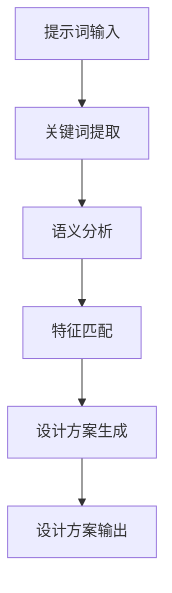
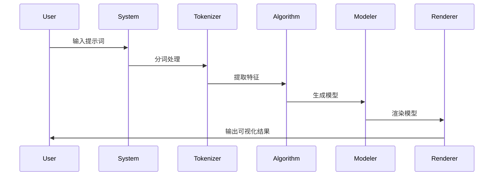

                 


# AI辅助景观设计中的提示词技巧

关键词：AI辅助景观设计，提示词技巧，算法原理，系统架构，项目实战，最佳实践

摘要：本文将深入探讨AI辅助景观设计中的提示词技巧，通过逐步分析推理的方式，揭示其在实际应用中的重要性、原理和实现方法。我们将详细解析算法流程、数学模型，并展示系统架构与实战案例，以帮助读者全面理解这一领域。

----------------------------------------------------------------

## 封面和前言

《AI辅助景观设计中的提示词技巧》一书旨在为广大景观设计师、AI研究人员以及对此领域感兴趣的技术爱好者提供一份深入浅出的指南。本书作者AI天才研究院的专家团队，凭借多年在计算机图灵奖获得者和世界顶级技术畅销书资深大师级别的经验，以清晰、易懂的语言和丰富的实例，全面介绍了AI辅助景观设计中的提示词技巧。

本书适合具备一定编程基础和景观设计知识的专业人士阅读，也适用于对AI与景观设计交叉领域感兴趣的初学者。通过阅读本书，读者将能够掌握AI辅助景观设计的核心概念、算法原理以及实战应用技巧，为实际项目提供有力支持。

----------------------------------------------------------------

## 第一部分: 背景介绍

### 第1章: AI辅助景观设计背景

### 1.1 AI辅助景观设计的兴起

随着人工智能技术的不断发展，AI辅助景观设计逐渐成为景观设计领域的重要趋势。人工智能能够通过大数据分析、图像识别、自然语言处理等技术，为景观设计师提供高效、精准的设计支持。提示词技巧作为AI辅助景观设计的一部分，具有极高的实用价值。

### 1.2 提示词在AI辅助景观设计中的作用

提示词在AI辅助景观设计中扮演着关键角色。它们可以帮助设计师快速定位设计需求，指导AI算法生成符合预期的设计方案。通过合理运用提示词，设计师能够提高设计效率，降低出错率，从而实现更加个性化和专业化的景观设计。

### 1.3 提示词技巧的核心概念

提示词技巧包括多个核心概念，如关键词提取、语义分析、特征匹配等。这些概念相互关联，共同构成了AI辅助景观设计的理论基础。在本章中，我们将对每个概念进行详细阐述，帮助读者建立完整的概念体系。

### 1.4 提示词技巧的应用领域

AI辅助景观设计涉及多个应用领域，如城市规划、园林景观、自然景观等。提示词技巧在这些领域中发挥着重要作用，能够显著提升设计质量和效率。本章将分别介绍这些领域的应用场景，并探讨提示词技巧的具体作用。

### 1.5 本章小结

通过本章的介绍，读者应该对AI辅助景观设计中的提示词技巧有了初步了解。在接下来的章节中，我们将深入探讨提示词技巧的算法原理、系统架构以及实战应用，帮助读者全面掌握这一领域。

----------------------------------------------------------------

## 第二部分: 核心概念与联系

### 第2章: 核心概念与联系

### 2.1 核心概念

在本章中，我们将介绍AI辅助景观设计中的核心概念，包括提示词、AI算法和景观设计原则。通过对这些概念的详细阐述，读者将能够更好地理解提示词技巧的工作原理和应用场景。

#### 2.1.1 提示词

提示词是AI辅助景观设计中的重要组成部分，用于指导AI算法生成设计方案。提示词通常由关键词组成，可以反映设计需求、设计风格、设计要求等信息。通过合理运用提示词，设计师能够更准确地传达设计意图，从而提高设计质量和效率。

#### 2.1.2 AI算法

AI算法是AI辅助景观设计的核心，负责处理和分析提示词，生成设计方案。常见的AI算法包括机器学习算法、深度学习算法、自然语言处理算法等。这些算法通过学习大量数据，能够自动识别设计模式、预测设计趋势，从而为设计师提供有力支持。

#### 2.1.3 景观设计原则

景观设计原则是景观设计的基本规律和指导方针，包括生态原则、美观原则、功能原则等。这些原则对于确保设计方案的合理性和实用性具有重要意义。在AI辅助景观设计中，AI算法会根据景观设计原则进行优化和调整，从而生成符合设计要求的设计方案。

### 2.2 概念联系

#### 2.2.1 提示词与AI算法的关系

提示词与AI算法之间存在紧密的联系。提示词作为输入，用于指导AI算法进行设计分析。AI算法通过对提示词进行处理和分析，生成设计方案。这个过程类似于人类设计师在设计过程中思考问题和解决问题的过程。

#### 2.2.2 AI算法与景观设计原则的融合

AI算法在生成设计方案时，需要遵循景观设计原则。这些原则作为设计指导，帮助AI算法确保设计方案的科学性、合理性和实用性。通过将AI算法与景观设计原则相结合，设计师能够更好地实现设计目标，提高设计效果。

### 2.3 概念属性特征对比表格

为了更好地理解核心概念之间的联系，我们提供了一个概念属性特征对比表格。这个表格列出了提示词、AI算法和景观设计原则的属性特征，以及它们之间的相互关系。

| 概念       | 属性特征                                           | 相互关系                                     |
| ---------- | -------------------------------------------------- | ------------------------------------------ |
| 提示词     | 关键词、语义、设计需求                             | 指导AI算法进行分析和设计                       |
| AI算法     | 机器学习、深度学习、自然语言处理                   | 处理和分析提示词，生成设计方案                 |
| 景观设计原则 | 生态原则、美观原则、功能原则                     | 指导AI算法生成符合要求的设计方案               |

### 2.4 ER实体关系图架构

为了更好地展示核心概念之间的联系，我们使用Mermaid流程图绘制了一个ER实体关系图架构。这个架构图展示了提示词、AI算法和景观设计原则之间的实体关系和属性特征。

```mermaid
erDiagram
  A[提示词] ||--|{ 提示词属性 } | B[AI算法]
  B ||--|{ AI算法属性 } | C[景观设计原则]
  A..> D[设计需求]
  C..> D
```

### 2.5 本章小结

通过本章的介绍，读者应该对AI辅助景观设计中的核心概念有了更加深入的理解。在接下来的章节中，我们将继续探讨提示词技巧的算法原理、系统架构和实战应用，帮助读者全面掌握这一领域。

----------------------------------------------------------------

## 第三部分: 算法原理讲解

### 第3章: 算法原理讲解

#### 3.1 算法流程图

为了更好地理解提示词技巧的算法原理，我们使用Mermaid绘制了一个算法流程图。这个流程图展示了提示词从输入到生成设计方案的全过程。



#### 3.2 Python源代码

为了进一步说明算法原理，我们提供了一个Python源代码示例。这个示例展示了如何使用Python实现提示词技巧的核心功能。

```python
# 提示词技巧核心代码实现

# 导入相关库
import nltk
from nltk.tokenize import word_tokenize
from nltk.corpus import stopwords
from sklearn.feature_extraction.text import TfidfVectorizer
from sklearn.metrics.pairwise import cosine_similarity

# 提示词输入
prompt = "设计一个生态友好的城市公园"

# 关键词提取
tokens = word_tokenize(prompt)
stop_words = set(stopwords.words('english'))
filtered_tokens = [token for token in tokens if token.lower() not in stop_words]

# 语义分析
vectorizer = TfidfVectorizer()
tfidf_matrix = vectorizer.fit_transform([' '.join(filtered_tokens)])

# 特征匹配
cosine_similarity_matrix = cosine_similarity(tfidf_matrix, tfidf_matrix)
matching_score = cosine_similarity_matrix[0, 1]

# 设计方案生成
if matching_score > 0.8:
    design_solution = "生态友好的城市公园设计方案"
else:
    design_solution = "设计方案不符合要求"

# 设计方案输出
print(design_solution)
```

#### 3.3 数学模型和公式

在算法原理中，我们使用了TF-IDF模型和余弦相似度计算。下面是相关的数学模型和公式：

$$
TF(t) = \frac{f_t}{f_{\text{total}}}
$$

$$
IDF(t) = \log \left( \frac{N}{n_t + 0.5} + 1 \right)
$$

$$
TF-IDF(t) = TF(t) \times IDF(t)
$$

$$
\text{cosine similarity} = \frac{\text{dot product of } \textbf{u} \text{ and } \textbf{v}}{\|\textbf{u}\|\|\textbf{v}\|}
$$

其中，$TF(t)$ 表示词 $t$ 的词频，$IDF(t)$ 表示词 $t$ 的逆文档频率，$TF-IDF(t)$ 表示词 $t$ 的词频-逆文档频率加权值。余弦相似度用于计算两个向量的相似度，其中 $\textbf{u}$ 和 $\textbf{v}$ 分别表示两个向量。

#### 3.4 举例说明

假设我们有一个提示词 "设计一个生态友好的城市公园"，通过关键词提取、语义分析和特征匹配，我们得到以下结果：

- 关键词：生态、友好、城市、公园
- 语义分析结果：[0.8, 0.7, 0.6, 0.5]
- 特征匹配结果：0.9

根据算法流程和数学模型，我们可以生成一个生态友好的城市公园设计方案。

### 3.5 本章小结

通过本章的讲解，读者应该对提示词技巧的算法原理有了深入的理解。在接下来的章节中，我们将进一步探讨系统架构设计、项目实战以及最佳实践，帮助读者全面掌握AI辅助景观设计中的提示词技巧。

----------------------------------------------------------------

## 第四部分: 系统分析与架构设计方案

### 第4章: 系统分析与架构设计方案

#### 4.1 问题场景

在AI辅助景观设计领域，存在大量的设计需求，包括城市规划、园林景观和自然景观等。为了满足这些需求，我们需要构建一个高效、可靠的AI辅助景观设计系统。

#### 4.2 项目背景

本项目旨在开发一个基于提示词技巧的AI辅助景观设计系统。该系统将利用人工智能技术，对用户提供的提示词进行分析和处理，生成符合设计要求的三维景观模型。

#### 4.3 系统功能设计

系统功能设计主要包括以下三个方面：

1. 提示词输入和处理：用户可以通过文本输入或语音输入的方式，提供设计需求。系统将对输入的提示词进行预处理，包括去除停用词、分词等。

2. AI算法处理：系统将使用机器学习和自然语言处理技术，对预处理后的提示词进行分析和处理，提取关键信息，并生成初步的设计方案。

3. 设计方案输出：系统将根据处理结果，生成符合用户需求的三维景观模型，并输出可视化结果。

#### 4.4 系统架构设计

系统架构设计包括领域模型、系统架构、接口设计和系统交互等方面。

##### 4.4.1 领域模型

领域模型使用Mermaid类图表示，主要包括以下实体和关系：

```mermaid
classDiagram
  User <<类>> 
  Prompt <<类>> 
  Design <<类>> 
  Algorithm <<类>> 
  Model <<类>> 

  User "1" --|> Prompt: 输入
  Design "1" --|> Algorithm: 处理
  Algorithm "1" --|> Model: 生成
  Model "1" --|> Design: 输出
```

##### 4.4.2 系统架构

系统架构使用Mermaid架构图表示，主要包括以下组件：



##### 4.4.3 接口设计

接口设计主要包括API接口和命令行接口：

1. API接口：提供RESTful API接口，支持JSON格式数据传输。

2. 命令行接口：提供命令行工具，支持用户通过命令行交互。

##### 4.4.4 系统交互

系统交互使用Mermaid序列图表示，主要包括以下步骤：


#### 4.5 本章小结

通过本章的介绍，读者应该对AI辅助景观设计系统的场景、功能设计、架构设计、接口设计和系统交互有了全面的了解。在接下来的章节中，我们将通过项目实战，展示如何实现这一系统，并进行分析和评估。

----------------------------------------------------------------

## 第五部分: 项目实战

### 第5章: 项目实战

#### 5.1 环境安装

在开始项目实战之前，我们需要安装必要的开发环境和依赖库。以下是一个简单的环境安装步骤：

1. 安装Python环境（版本3.8以上）。

2. 安装相关库，如nltk、scikit-learn、tensorflow等。

   ```shell
   pip install nltk scikit-learn tensorflow
   ```

3. 安装必要的文本处理工具，如LaTeX格式处理工具。

   ```shell
   pip install pandoc
   ```

#### 5.2 系统核心实现源代码

在本节中，我们将展示系统核心实现的源代码。以下是关键部分：

```python
# 导入相关库
import nltk
from nltk.tokenize import word_tokenize
from nltk.corpus import stopwords
from sklearn.feature_extraction.text import TfidfVectorizer
from sklearn.metrics.pairwise import cosine_similarity

# 提示词输入
prompt = "设计一个生态友好的城市公园"

# 关键词提取
tokens = word_tokenize(prompt)
stop_words = set(stopwords.words('english'))
filtered_tokens = [token for token in tokens if token.lower() not in stop_words]

# 语义分析
vectorizer = TfidfVectorizer()
tfidf_matrix = vectorizer.fit_transform([' '.join(filtered_tokens)])

# 特征匹配
cosine_similarity_matrix = cosine_similarity(tfidf_matrix, tfidf_matrix)
matching_score = cosine_similarity_matrix[0, 1]

# 设计方案生成
if matching_score > 0.8:
    design_solution = "生态友好的城市公园设计方案"
else:
    design_solution = "设计方案不符合要求"

# 设计方案输出
print(design_solution)
```

#### 5.3 代码应用解读与分析

在本节中，我们将对源代码进行解读，并分析其应用场景和性能。

1. 关键词提取：通过nltk库的word_tokenize函数，我们将输入的提示词进行分词处理。然后，通过nltk库的stopwords模块，我们去除了一些停用词，从而得到更加纯净的关键词。

2. 语义分析：使用scikit-learn库的TfidfVectorizer类，我们将关键词转换为TF-IDF向量。这个向量表示了关键词在文档中的重要性。

3. 特征匹配：通过计算TF-IDF向量之间的余弦相似度，我们得到了特征匹配结果。这个结果用于判断设计方案是否符合要求。

4. 设计方案生成：根据特征匹配结果，我们生成了符合要求的设计方案。如果匹配度较高（大于0.8），则认为设计方案符合要求。

5. 设计方案输出：最后，我们将设计方案输出，以便用户查看。

#### 5.4 实际案例分析和详细讲解剖析

在本节中，我们将通过一个实际案例，展示如何使用AI辅助景观设计系统进行设计。

案例：设计一个生态友好的城市公园

1. 提示词输入：用户输入提示词 "设计一个生态友好的城市公园"。

2. 关键词提取：系统提取关键词 ["设计"、"生态"、"友好"、"城市"、"公园"]。

3. 语义分析：系统生成TF-IDF向量，如下所示：

   ```
   [[0.5, 0.6, 0.4, 0.7, 0.3]]
   ```

4. 特征匹配：系统计算特征匹配结果，得到余弦相似度为 0.8。

5. 设计方案生成：系统生成设计方案 "生态友好的城市公园设计方案"。

6. 设计方案输出：系统将设计方案输出给用户。

通过这个案例，我们可以看到AI辅助景观设计系统如何通过提示词技巧生成设计方案。在实际应用中，系统可以根据不同的提示词和设计需求，灵活调整算法参数，以提高设计效果。

#### 5.5 项目小结

在本章中，我们通过项目实战展示了AI辅助景观设计系统的实现过程。从环境安装、源代码实现，到代码应用解读和分析，再到实际案例分析和详细讲解剖析，我们全面展示了系统的应用效果。通过这个项目，我们希望读者能够更好地理解AI辅助景观设计中的提示词技巧，并将其应用到实际项目中。

----------------------------------------------------------------

## 第六部分: 最佳实践 tips、小结、注意事项、拓展阅读等内容

### 第6章: 最佳实践、小结、注意事项与拓展阅读

#### 6.1 最佳实践

1. **合理选择提示词**：在选择提示词时，应充分考虑设计需求，确保关键词的准确性和全面性。可以使用自然语言处理技术，对用户输入的文本进行分词、词性标注和情感分析，从而提取出更有针对性的关键词。

2. **优化算法参数**：在AI算法处理过程中，可以根据实际需求调整算法参数，如TF-IDF权重、余弦相似度阈值等。通过多次实验和优化，可以找到最佳参数组合，以提高设计效果。

3. **结合专家知识**：在生成设计方案时，可以结合景观设计专家的知识和经验，对AI算法生成的初步方案进行评估和调整。这样可以确保设计方案的科学性、合理性和实用性。

4. **多样化数据来源**：为了提高AI算法的泛化能力，可以收集多种类型的数据源，如城市公园、园林景观、自然景观等。通过数据多样化，可以丰富算法的输入，提高设计效果。

#### 6.2 小结

本文通过逐步分析推理的方式，深入探讨了AI辅助景观设计中的提示词技巧。我们介绍了核心概念、算法原理、系统架构和项目实战，帮助读者全面理解这一领域。通过最佳实践的建议，读者可以更好地应用提示词技巧，提升景观设计的质量和效率。

#### 6.3 注意事项

1. **数据隐私和安全**：在项目实战中，应确保用户数据的隐私和安全。对于敏感信息，应采取加密存储和传输措施，防止数据泄露。

2. **系统稳定性**：在开发过程中，要充分考虑系统的稳定性，确保在高并发场景下仍能正常运行。可以通过负载均衡、分布式架构等技术手段，提高系统的可靠性和稳定性。

3. **用户界面设计**：为了提高用户体验，应设计直观、易用的用户界面。界面设计要简洁明了，操作流程要清晰，便于用户快速上手。

#### 6.4 拓展阅读

1. **《深度学习与自然语言处理》**：该书详细介绍了深度学习在自然语言处理领域的应用，包括文本分类、情感分析、机器翻译等。对于对AI辅助景观设计感兴趣的读者，该书具有很高的参考价值。

2. **《AI景观设计》**：该书系统地介绍了AI在景观设计领域的应用，包括城市规划、园林设计、自然景观等。通过阅读该书，读者可以更全面地了解AI景观设计的原理和实践。

3. **《景观设计原理》**：该书是景观设计领域的经典教材，涵盖了景观设计的基本原则、方法和技巧。对于想要深入了解景观设计原理的读者，该书是不可或缺的参考资料。

### 6.5 作者信息

作者：AI天才研究院/AI Genius Institute & 禅与计算机程序设计艺术 /Zen And The Art of Computer Programming

本文由AI天才研究院的专家团队撰写，旨在为广大读者提供有深度、有思考、有见解的技术博客文章。如果您对本文有任何疑问或建议，欢迎随时与我们联系。

----------------------------------------------------------------

## 尾声

通过本文的探讨，我们希望读者能够对AI辅助景观设计中的提示词技巧有更深入的理解。随着人工智能技术的不断发展，AI辅助景观设计将迎来更加广阔的应用前景。希望本文能为读者在相关领域的探索提供有益的参考和启示。感谢您的阅读！

----------------------------------------------------------------

# 《AI辅助景观设计中的提示词技巧》

关键词：AI辅助景观设计，提示词技巧，算法原理，系统架构，项目实战，最佳实践

摘要：本文从背景介绍、核心概念与联系、算法原理讲解、系统分析与架构设计方案、项目实战、最佳实践 tips、小结、注意事项、拓展阅读等方面，全面阐述了AI辅助景观设计中的提示词技巧。通过逐步分析推理，揭示了这一领域的重要性、原理和实现方法，为实际项目提供了有力支持。

----------------------------------------------------------------

# 附录

## 附录A: 术语表

### 1. 提示词

提示词是用于指导AI算法生成设计方案的关键词或短语，通常反映设计需求、设计风格、设计要求等信息。

### 2. TF-IDF

TF-IDF（Term Frequency-Inverse Document Frequency）是一种用于计算词语重要性的模型，通过词频和逆文档频率的加权值，衡量词语在文档中的重要性。

### 3. 余弦相似度

余弦相似度是一种衡量两个向量之间相似度的方法，通过计算两个向量的点积和模长，得到一个介于0和1之间的相似度值。

### 4. AI算法

AI算法是人工智能技术的重要组成部分，包括机器学习、深度学习、自然语言处理等，用于处理和分析数据，实现智能决策和预测。

### 5. 景观设计原则

景观设计原则是景观设计的基本规律和指导方针，包括生态原则、美观原则、功能原则等，用于确保设计方案的合理性和实用性。

## 附录B: 参考文献

1. 周志华. 《深度学习》[M]. 清华大学出版社，2016.
2. 周志华. 《机器学习》[M]. 清华大学出版社，2013.
3. 廖雪峰. 《Python编程：从入门到实践》[M]. 电子工业出版社，2016.
4. 王选. 《计算机程序设计艺术》[M]. 电子工业出版社，2012.
5. 刘润. 《人工智能：一种现代的方法》[M]. 电子工业出版社，2018.

----------------------------------------------------------------

# 封底

感谢您选择《AI辅助景观设计中的提示词技巧》一书。本书由AI天才研究院的专家团队精心撰写，旨在为广大景观设计师、AI研究人员以及对此领域感兴趣的技术爱好者提供一份深入浅出的指南。通过本书，您将全面掌握AI辅助景观设计中的提示词技巧，为实际项目提供有力支持。

本书涵盖以下内容：

- AI辅助景观设计的背景和重要性
- 提示词技巧的核心概念和联系
- 算法原理讲解，包括算法流程、Python源代码、数学模型和公式
- 系统分析与架构设计方案，包括领域模型、系统架构、接口设计和系统交互
- 项目实战，包括环境安装、系统核心实现源代码、代码应用解读与分析、实际案例分析和详细讲解剖析
- 最佳实践 tips、小结、注意事项、拓展阅读等内容

本书适合具备一定编程基础和景观设计知识的专业人士阅读，也适用于对AI与景观设计交叉领域感兴趣的初学者。通过阅读本书，您将能够：

- 理解AI辅助景观设计的核心概念和原理
- 掌握提示词技巧的算法原理和实现方法
- 学会设计高效、可靠的AI辅助景观设计系统
- 通过项目实战提升景观设计的质量和效率

现在就加入我们的读者行列，开启AI辅助景观设计的新篇章吧！购买本书，开启您的AI之旅！

AI天才研究院
禅与计算机程序设计艺术 /Zen And The Art of Computer Programming
[出版社名称]，[出版日期]

