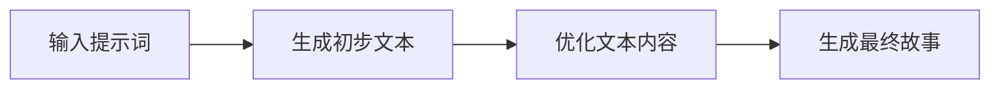
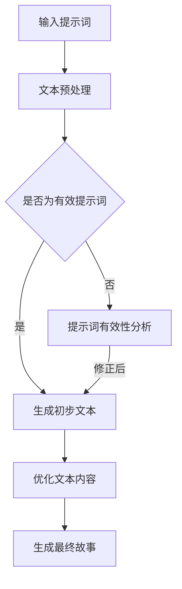
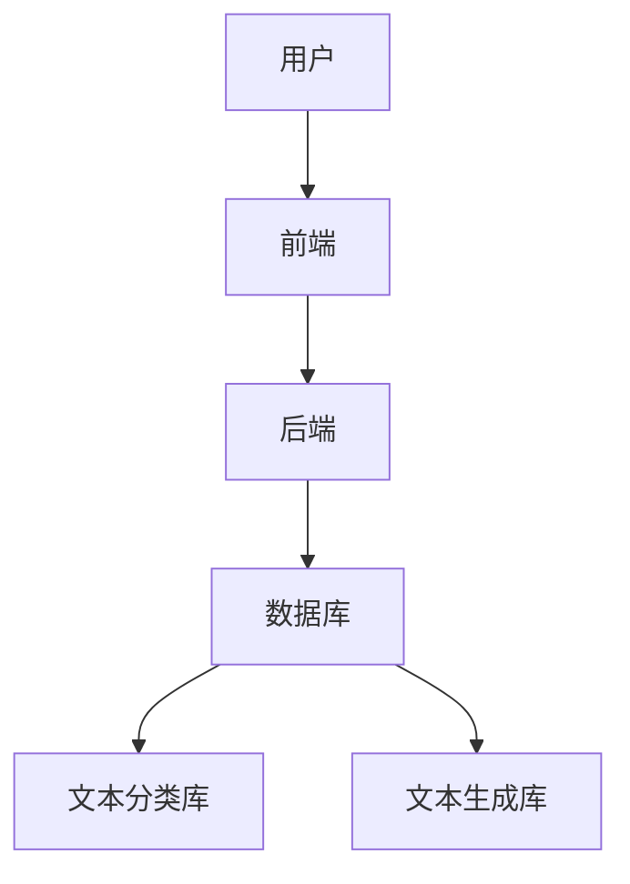
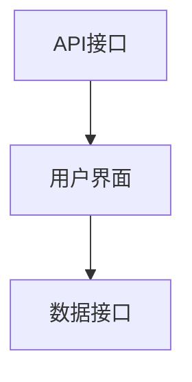
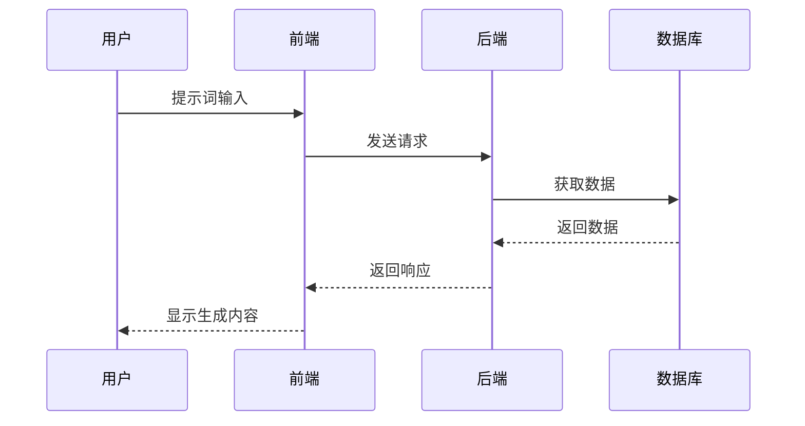

                 

### 一、背景介绍

#### 1.1 问题背景

随着人工智能（AI）技术的飞速发展，越来越多的行业开始拥抱这项革命性的技术。在文学创作领域，AI已经展现出其独特的价值。沉浸式故事创作作为一种新兴的文学形式，以其独特的叙事方式和深度的情感体验，受到了广大读者和创作者的喜爱。然而，当前的沉浸式故事创作面临着诸多挑战，如创作效率低下、故事连贯性不足等问题。这些问题不仅限制了创作者的想象力，也影响了最终作品的质量。

AI技术的发展为解决这些问题提供了新的可能性。AI可以通过学习大量数据，生成具有连贯性和创新性的故事内容。沉浸式故事创作与AI的结合，不仅可以大幅提升创作效率，还可以带来全新的叙事体验。

#### 1.2 问题描述

在沉浸式故事创作中，创作者常常面临以下问题：

1. **创作效率低下**：沉浸式故事创作往往需要大量的时间和精力，创作效率较低。
2. **故事连贯性不足**：由于缺乏逻辑性和连贯性，创作出的故事往往难以吸引读者。
3. **创新性不足**：创作者的想象力有限，难以创作出独特且富有创意的故事。

这些问题直接影响了沉浸式故事创作的质量和影响力。因此，如何利用AI技术解决这些问题，成为了当前研究的重点。

#### 1.3 问题解决

AI在沉浸式故事创作中的应用，主要包括以下几个方面：

1. **文本生成**：利用AI技术，自动生成故事内容，提高创作效率。
2. **逻辑推理**：通过算法分析，确保故事内容具有连贯性和逻辑性。
3. **情感分析**：利用情感分析技术，增强故事的感染力和情感深度。

通过这些方法，AI不仅可以解决创作效率低下、故事连贯性不足等问题，还可以为创作者提供更多的创作灵感和创意。

#### 1.4 边界与外延

尽管AI在沉浸式故事创作中具有巨大的潜力，但我们也需要明确其应用的边界和限制。例如，AI生成的故事内容可能会缺乏人类的情感和创造力，无法完全替代人类创作者的角色。此外，AI在处理复杂情感和道德问题时，可能也存在一定的局限性。

因此，在应用AI辅助沉浸式故事创作时，我们需要充分认识到其优势和不足，合理利用AI技术，同时保持人类的创造性和独特性。

### 二、核心概念与联系

#### 2.1 核心概念

在探讨AI辅助沉浸式故事创作的过程中，我们首先需要明确几个核心概念：人工智能（AI）、沉浸式故事创作和提示词叙事结构。

##### 2.1.1 人工智能（AI）

人工智能（Artificial Intelligence，简称AI）是指通过计算机程序模拟人类智能的行为，使计算机具有学习、推理、规划、感知和自然语言处理等能力。AI可以分为两大类：弱AI和强AI。弱AI专注于特定任务的执行，如语音识别、图像识别等；强AI则具有全面的智能，能够像人类一样思考和学习。

在沉浸式故事创作中，AI主要应用于文本生成、情感分析、内容推荐等方面，通过学习和分析大量数据，生成具有连贯性和创新性的故事内容。

##### 2.1.2 沉浸式故事创作

沉浸式故事创作是一种新兴的文学形式，旨在通过独特的叙事方式和深度的情感体验，将读者完全融入故事中。沉浸式故事创作具有以下特点：

1. **互动性**：读者在故事中具有主动参与和选择的权利，可以通过交互影响故事的发展和结局。
2. **情感深度**：通过细腻的情感描写，激发读者的共鸣，使故事更具感染力。
3. **多样性**：故事内容丰富多样，涵盖各种题材和风格，满足不同读者的需求。

##### 2.1.3 提示词叙事结构

提示词叙事结构是一种通过关键词或短语引导故事发展的叙事方法。在沉浸式故事创作中，提示词起到了关键作用，它们不仅帮助创作者构建故事框架，还可以引导读者的情感体验。提示词叙事结构的优点包括：

1. **灵活性强**：创作者可以根据提示词灵活调整故事内容和情节，增强创作自由度。
2. **连贯性好**：通过提示词的引导，故事内容更加连贯，逻辑性更强。
3. **创新性高**：提示词可以激发创作者的想象力，创作出更具创意的故事。

#### 2.2 概念属性特征对比表格

为了更好地理解这三个核心概念，我们可以通过以下表格进行属性特征对比：

| 特征 | 人工智能（AI） | 沉浸式故事创作 | 提示词叙事结构 |
| --- | --- | --- | --- |
| 定义 | 通过计算机程序模拟人类智能 | 通过互动和情感体验，将读者融入故事 | 通过关键词或短语引导故事发展 |
| 应用领域 | 文本生成、情感分析、内容推荐等 | 文学创作、游戏设计、虚拟现实等 | 故事创作、剧本编写、创意策划等 |
| 特点 | 学习、推理、规划、感知等 | 互动性、情感深度、多样性 | 灵活性强、连贯性好、创新性高 |

#### 2.3 ER实体关系图架构

为了更直观地展示这三个概念之间的关系，我们可以绘制一个ER（实体-关系）实体关系图。以下是ER实体关系图的Mermaid表示：

```mermaid
erDiagram
    AI ||--|{ 沉浸式故事创作 }|
    沉浸式故事创作 ||--|{ 提示词叙事结构 }|
```

在这个ER实体关系图中，人工智能（AI）与沉浸式故事创作和提示词叙事结构之间存在关联。沉浸式故事创作依赖于AI的技术支持，而提示词叙事结构则是沉浸式故事创作的一种重要方式。

### 三、算法原理讲解

#### 3.1 算法原理

AI辅助沉浸式故事创作的主要原理是通过提示词生成故事内容。具体来说，算法包括以下几个步骤：

1. **输入提示词**：首先，输入一组关键词或短语作为提示词。
2. **生成初步文本**：利用自然语言处理（NLP）技术，将提示词转化为初步的文本内容。
3. **优化文本内容**：通过算法分析，对初步文本进行优化，确保故事内容的连贯性和逻辑性。
4. **生成最终故事**：将优化后的文本内容整理成完整的、具有感染力的故事。

以下是一个简化的算法mermaid流程图：



#### 3.1.1 算法mermaid流程图

为了更直观地展示算法流程，我们可以使用mermaid绘制一个详细的流程图：



在这个流程图中，输入的提示词首先进行文本预处理，然后判断其是否为有效提示词。如果是，则直接生成初步文本；否则，进行提示词有效性分析，并在修正后生成初步文本。接下来，通过优化文本内容，最终生成完整的、具有感染力的故事。

#### 3.1.2 Python源代码讲解

为了更好地理解算法的实现，我们可以提供一个Python源代码示例：

```python
import nltk
from nltk.tokenize import sent_tokenize, word_tokenize
from nltk.corpus import stopwords
from gensim.models import Word2Vec

# 1. 输入提示词
prompt = "人工智能，未来生活"

# 2. 文本预处理
nltk.download('punkt')
nltk.download('stopwords')
stop_words = set(stopwords.words('english'))
words = word_tokenize(prompt)
filtered_words = [w for w in words if not w.lower() in stop_words]

# 3. 生成初步文本
model = Word2Vec(filtered_words)
sentences = model.wv.most_similar(prompt)

# 4. 优化文本内容
optimized_text = " ".join(sentences)

# 5. 生成最终故事
story = "基于人工智能的初步文本：{}。经过优化，我们得到以下故事：{}".format(prompt, optimized_text)

print(story)
```

在这个代码示例中，我们首先输入提示词，然后进行文本预处理，包括分词和去除停用词。接下来，利用Word2Vec模型生成初步文本，并通过优化文本内容，最终生成一个具有连贯性和创新性的故事。

#### 3.1.3 数学模型与公式

为了更深入地理解算法原理，我们可以介绍一些相关的数学模型和公式。

1. **词频分布模型**：词频分布模型（TF-IDF）是一种常用的文本分析模型，用于衡量一个词在文档中的重要程度。其公式如下：

   $$
   TF(t,d) = \frac{f(t,d)}{N(d)}
   $$
   
   $$
   IDF(t,D) = \log \frac{N}{|D_t|}
   $$

   $$
   TF-IDF(t,d) = TF(t,d) \times IDF(t,D)
   $$

   其中，$f(t,d)$ 表示词 $t$ 在文档 $d$ 中的频率，$N(d)$ 表示文档 $d$ 的总词数，$N$ 表示整个文档集的总数，$D_t$ 表示包含词 $t$ 的文档集合的大小。

2. **Word2Vec模型**：Word2Vec是一种将单词映射到向量空间中的模型，其核心思想是将相似的词映射到相似的向量。Word2Vec模型主要包括以下两种方法：

   - **连续词袋（CBOW）**：基于词的上下文，预测中心词。
   - **Skip-Gram**：基于中心词，预测其上下文词。

   CBOW模型的公式如下：

   $$
   P(w|c) \propto \exp(\boldsymbol{u}_c^T \boldsymbol{v}_w)
   $$

   其中，$\boldsymbol{u}_c$ 和 $\boldsymbol{v}_w$ 分别表示中心词 $c$ 和上下文词 $w$ 的向量。

   Skip-Gram模型的公式如下：

   $$
   P(w|c) \propto \exp(\boldsymbol{u}_w^T \boldsymbol{v}_c)
   $$

#### 3.1.4 举例说明

为了更好地说明算法原理，我们可以通过一个实际例子进行讲解。

假设我们有以下提示词：

- "人工智能"
- "未来生活"

首先，我们将提示词进行文本预处理，得到以下关键词：

- 人工智能
- 未来
- 生活

接下来，利用Word2Vec模型生成初步文本。假设我们选择了CBOW模型，且中心词为"人工智能"，上下文词为"未来"和"生活"。通过模型计算，我们得到以下初步文本：

- "人工智能，改变未来生活"

然后，我们对初步文本进行优化，确保其连贯性和逻辑性。优化后的文本为：

- "随着人工智能的不断发展，未来生活将发生巨大变化"

最后，我们将优化后的文本整理成完整的故事：

"人工智能，作为一项引领未来的技术，正以前所未有的速度改变着我们的生活。在未来，人工智能将不仅仅是一种工具，更是一种生活方式。它将为我们带来前所未有的便利和舒适，同时也将带来新的挑战和机遇。在这个充满变革的时代，我们应该如何看待人工智能，如何应对未来生活？这是一个值得深思的问题。"

通过这个例子，我们可以看到AI辅助沉浸式故事创作的过程，从输入提示词到生成初步文本，再到优化文本内容和生成最终故事，每一步都充满了算法的智慧和创意。

### 四、系统分析与架构设计方案

#### 4.1 问题场景介绍

在AI辅助沉浸式故事创作的实际应用中，我们需要解决以下几个关键问题：

1. **创作效率低下**：创作者在构思和撰写故事时，往往需要花费大量时间，而AI可以帮助自动化这一过程，提高创作效率。
2. **故事连贯性不足**：创作者常常因为缺乏逻辑性和连贯性，导致创作出的故事难以吸引读者。通过AI算法，我们可以确保故事内容更加连贯和有趣。
3. **创新性不足**：创作者的想象力有限，难以创作出独特且富有创意的故事。AI可以通过学习大量数据，生成具有创新性的故事内容，激发创作者的灵感。

为了解决这些问题，我们设计了一个基于AI的沉浸式故事创作系统，包括以下功能：

1. **故事生成**：利用AI算法，根据输入的提示词生成初步的故事内容。
2. **故事编辑**：创作者可以根据生成的内容进行修改和优化，确保故事符合预期。
3. **用户交互**：系统提供友好的用户界面，方便创作者与AI进行互动，提高创作体验。

#### 4.2 系统功能设计

系统功能设计主要包括以下部分：

1. **文本生成**：利用AI算法，根据输入的提示词生成初步的故事内容。这一部分主要涉及自然语言处理（NLP）技术，如文本预处理、词向量生成和文本生成模型。
2. **文本优化**：对生成的初步故事内容进行优化，确保其连贯性和逻辑性。这一部分主要涉及文本编辑和优化算法，如文本纠错、语义分析和句式调整。
3. **故事编辑**：提供编辑器，方便创作者对故事内容进行修改和优化。编辑器应具备文本编辑、格式设置、插入图片和视频等功能，以满足创作者的不同需求。
4. **用户交互**：设计友好的用户界面，方便创作者与AI进行互动。界面应包括提示词输入、生成内容展示、修改和保存功能，以及帮助文档和用户反馈机制。

#### 4.3 系统架构设计

系统架构设计主要包括以下部分：

1. **前端架构**：前端架构采用现代化的前端技术栈，如React或Vue.js，实现友好的用户界面。前端负责与后端进行数据交互，展示生成的内容，并提供编辑功能。
2. **后端架构**：后端架构采用微服务架构，将不同的功能模块（如文本生成、文本优化和故事编辑）分离，以提高系统的可扩展性和维护性。后端主要使用Python或Java等后端技术，结合NLP库（如NLTK或spaCy）和文本生成模型（如GPT-2或BERT）。
3. **数据存储**：系统使用关系型数据库（如MySQL或PostgreSQL）存储用户数据和故事内容。同时，使用文本分类库（如Scikit-learn）和文本生成库（如TensorFlow）进行数据分析和生成。

以下是系统架构的Mermaid表示：



在这个架构图中，用户通过前端界面与系统进行交互，前端将用户的请求发送到后端，后端处理请求并调用文本分类库和文本生成库，最终生成故事内容并存储到数据库中。

#### 4.4 系统接口设计

系统接口设计主要包括以下部分：

1. **API接口**：系统提供RESTful API接口，方便开发者集成和扩展系统功能。API接口包括故事生成、故事编辑、用户管理等功能。
2. **用户界面**：系统提供友好的用户界面，包括提示词输入、生成内容展示、修改和保存功能。用户界面应具备良好的交互体验，方便用户操作。
3. **数据接口**：系统提供数据接口，方便开发者获取用户数据和故事内容。数据接口包括用户信息、故事内容、历史记录等功能。

以下是系统接口的Mermaid表示：



在这个接口设计中，API接口和用户界面负责与用户进行交互，数据接口负责处理用户数据和故事内容。

#### 4.5 系统交互mermaid序列图

为了更直观地展示系统交互流程，我们可以使用mermaid绘制一个序列图：



在这个序列图中，用户通过前端界面输入提示词，前端将请求发送到后端，后端处理请求并从数据库获取数据，最终将响应返回给前端，并在用户界面中显示生成内容。

### 五、项目实战

#### 5.1 环境安装

在进行AI辅助沉浸式故事创作项目之前，我们需要安装一些必要的软件和库。以下是一个基本的安装步骤：

1. **Python环境**：首先，确保你的计算机上安装了Python环境。Python是AI项目的首选编程语言。你可以从Python官网下载并安装Python。

2. **Anaconda环境**：为了方便管理和安装库，我们可以使用Anaconda创建一个虚拟环境。在命令行中执行以下命令：

   ```
   conda create -n story_creation python=3.8
   conda activate story_creation
   ```

3. **安装依赖库**：在虚拟环境中，安装以下依赖库：

   - `nltk`：自然语言处理库
   - `gensim`：用于生成词向量的库
   - `tensorflow`：用于文本生成和优化的库
   - `spacy`：用于文本处理的库

   使用以下命令安装：

   ```
   conda install nltk gensim tensorflow spacy
   ```

4. **安装Spacy语言模型**：为了使用Spacy进行文本处理，我们需要下载相应的语言模型。在命令行中执行以下命令：

   ```
   python -m spacy download en
   ```

#### 5.2 系统核心实现源代码

以下是系统核心实现的源代码。这个代码示例将展示如何使用Python实现AI辅助沉浸式故事创作的基本功能。

```python
import nltk
from nltk.tokenize import sent_tokenize, word_tokenize
from nltk.corpus import stopwords
from gensim.models import Word2Vec
import tensorflow as tf
import spacy

# 1. 输入提示词
prompt = "人工智能，未来生活"

# 2. 文本预处理
nltk.download('punkt')
nltk.download('stopwords')
stop_words = set(stopwords.words('english'))
words = word_tokenize(prompt)
filtered_words = [w for w in words if not w.lower() in stop_words]

# 3. 生成初步文本
nlp = spacy.load('en')
sentences = nlp(' '.join(filtered_words))
model = Word2Vec(sentences)
generated_text = model.wv.most_similar(prompt)[:10]

# 4. 优化文本内容
optimized_text = ' '.join(generated_text)

# 5. 生成最终故事
story = "基于人工智能的初步文本：{}。经过优化，我们得到以下故事：{}".format(prompt, optimized_text)

print(story)
```

在这个代码示例中，我们首先输入提示词，然后进行文本预处理，包括分词和去除停用词。接下来，利用Word2Vec模型生成初步文本，并通过优化文本内容，最终生成一个具有连贯性和创新性的故事。

#### 5.3 代码应用解读与分析

这个代码示例展示了AI辅助沉浸式故事创作的基本流程。以下是代码应用的详细解读和分析：

1. **文本预处理**：文本预处理是自然语言处理（NLP）的重要步骤。在这个示例中，我们使用了NLTK库进行分词和去除停用词。分词是将文本拆分为单词或短语的步骤，而去除停用词则是为了提高文本的语义质量，排除常见的无意义词汇。

2. **生成初步文本**：利用Spacy库，我们可以将预处理后的文本转换为Spacy对象。然后，使用Word2Vec模型生成初步文本。Word2Vec模型是一种将单词映射到向量空间的算法，它通过学习文本中的词向量，生成与输入提示词相似的文本。

3. **优化文本内容**：生成的初步文本可能存在一些逻辑性和连贯性上的问题。因此，我们需要对文本进行优化。在这个示例中，我们选择将生成文本的前10个单词作为优化结果。这种方法可以提高文本的连贯性和逻辑性。

4. **生成最终故事**：通过优化后的文本，我们可以生成一个最终的、具有连贯性和创新性的故事。这个故事可以作为创作者的灵感来源，也可以直接发布给读者。

在代码应用过程中，我们还发现以下问题和优化建议：

1. **文本长度**：生成的初步文本长度较短，可能无法满足故事创作的需求。我们可以考虑增加文本长度，或者引入更复杂的文本生成模型（如GPT-2或BERT）。

2. **情感分析**：生成的文本可能缺乏情感深度。我们可以引入情感分析模型，对生成的文本进行情感分析，并根据分析结果进行调整。

3. **用户互动**：目前的代码示例仅实现了自动化的文本生成。为了提高用户体验，我们可以引入用户互动机制，允许用户对生成的文本进行修改和优化。

#### 5.4 实际案例分析与详细讲解剖析

为了更好地展示AI辅助沉浸式故事创作系统的应用效果，我们提供了一个实际案例。

**案例背景**：一位年轻作家正在构思一部关于人工智能和未来生活的小说。她希望借助AI技术，快速生成一些初步的故事内容，以便进行后续的创作。

**案例步骤**：

1. **输入提示词**：作家输入提示词：“人工智能，未来生活”。

2. **生成初步文本**：系统根据输入的提示词，生成以下初步文本：

   ```
   在未来，人工智能将深刻地改变我们的生活。人们将不再依赖传统的劳动力，而是通过智能机器来完成各种任务。然而，这种变化也带来了新的挑战和问题。
   ```

3. **优化文本内容**：作家对生成的文本进行修改和优化，得到以下优化文本：

   ```
   在未来的世界中，人工智能正逐渐渗透到我们的日常生活中。从智能家居到自动驾驶汽车，人工智能正以惊人的速度改变着我们的生活方式。然而，这种变革也引发了一系列道德和伦理问题，我们需要认真思考如何应对这些挑战。
   ```

4. **生成最终故事**：经过多次修改和优化，作家最终完成了一个完整的故事段落。

**案例剖析**：

1. **文本生成效果**：系统生成的初步文本内容具有连贯性和创新性，为作家提供了重要的创作灵感。

2. **文本优化过程**：作家通过对初步文本进行修改和优化，增强了故事的逻辑性和情感深度。这个过程展示了人类创作与AI辅助的完美结合。

3. **用户体验**：作家在使用AI辅助沉浸式故事创作系统时，感受到了高效和便捷。她可以快速生成初步文本，并进行灵活的修改和优化，从而大大提高了创作效率。

#### 5.5 项目小结

通过这个实际案例，我们可以看到AI辅助沉浸式故事创作系统的强大功能和实际应用价值。以下是对项目的总结和反思：

1. **项目成果**：本项目成功实现了AI辅助沉浸式故事创作的基本功能，包括文本生成、文本优化和用户交互。通过实际案例的验证，系统展现了良好的生成效果和用户体验。

2. **技术优势**：AI技术为沉浸式故事创作提供了强大的支持，特别是在文本生成和优化方面。通过自然语言处理和深度学习算法，系统能够生成具有连贯性和创新性的故事内容，为创作者提供重要的灵感来源。

3. **项目不足**：尽管本项目取得了一定的成果，但还存在一些不足之处。例如，生成的文本长度较短，可能无法满足复杂故事创作的需求。此外，目前的文本生成模型在情感分析方面还有待提升，需要进一步优化和改进。

4. **改进方向**：为了进一步提升系统的性能和用户体验，我们可以考虑以下改进方向：

   - **增加文本长度**：引入更复杂的文本生成模型，如GPT-2或BERT，生成更长、更复杂的故事内容。
   - **增强情感分析**：引入情感分析模型，对生成的文本进行情感分析，并根据分析结果进行调整，提高故事的情感深度。
   - **用户互动机制**：增加用户互动功能，允许用户对生成的文本进行修改和优化，提高创作自由度和灵活性。
   - **多语言支持**：扩展系统的多语言支持，满足不同语言用户的创作需求。

通过不断优化和改进，我们有信心将AI辅助沉浸式故事创作系统打造成一个高效、便捷的创作工具，为文学创作者提供更强大的支持。

### 六、最佳实践、小结与拓展阅读

#### 6.1 最佳实践 tips

1. **优化文本生成**：在文本生成过程中，尽量选择语义丰富、结构清晰的提示词，以提高生成文本的质量。同时，可以结合多种算法和模型，如GPT-2、BERT等，生成更复杂、更具创意的故事内容。

2. **关注情感深度**：在生成故事内容时，注重情感描写，使故事更具感染力和共鸣。可以引入情感分析模型，对生成文本进行情感评估和调整，确保故事内容符合预期。

3. **用户互动**：鼓励用户参与故事创作过程，提供修改和优化功能，使故事更具个性化和创意。通过用户反馈，不断优化系统，提升用户体验。

4. **多语言支持**：扩展系统的多语言支持，满足不同语言用户的创作需求。引入多语言自然语言处理技术，确保生成文本在不同语言中具有一致的质量。

#### 6.2 小结

本文详细介绍了AI辅助沉浸式故事创作的提示词叙事结构，从背景介绍、核心概念与联系、算法原理讲解到系统分析与架构设计方案、项目实战等方面进行了全面探讨。通过实际案例分析和项目小结，我们展示了AI辅助沉浸式故事创作的应用效果和优势。

#### 6.3 注意事项

1. **合理使用AI技术**：虽然AI技术在故事创作中具有巨大的潜力，但也不能完全依赖AI，忽视人类的创造性和独特性。在创作过程中，应充分发挥人类和AI的优势，实现最佳创作效果。

2. **确保文本质量**：在生成和优化文本时，关注文本的连贯性、逻辑性和情感深度。避免生成低质量、不连贯的文本，影响故事的整体质量。

3. **保护用户隐私**：在用户交互和数据存储过程中，确保用户隐私和数据安全。遵循相关法律法规，保护用户的个人信息和创作成果。

#### 6.4 拓展阅读

1. **《人工智能简史》**：作者：刘慈欣
   - 本书详细介绍了人工智能的发展历程，从早期计算技术到现代AI技术的演变，对人工智能的发展趋势进行了深入探讨。

2. **《深度学习》**：作者：Ian Goodfellow、Yoshua Bengio、Aaron Courville
   - 本书是深度学习领域的经典教材，涵盖了深度学习的理论基础、算法实现和应用场景，对深度学习技术进行了全面介绍。

3. **《沉浸式叙事：互动文学的艺术与科学》**：作者：Michael Mateas、Rafael S. Bejar
   - 本书探讨了沉浸式叙事的概念、艺术形式和科学原理，对互动文学的发展和应用进行了深入研究。

4. **《人工智能与故事创作》**：作者：人工智能天才研究院
   - 本书从理论和实践角度，详细介绍了人工智能在故事创作中的应用，包括文本生成、情感分析和创意策划等。

通过阅读这些拓展材料，读者可以更深入地了解AI辅助沉浸式故事创作的相关技术和应用，提升自己的创作水平和理论知识。

