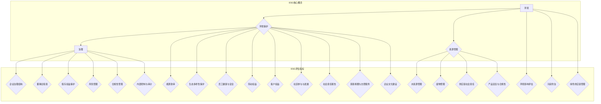
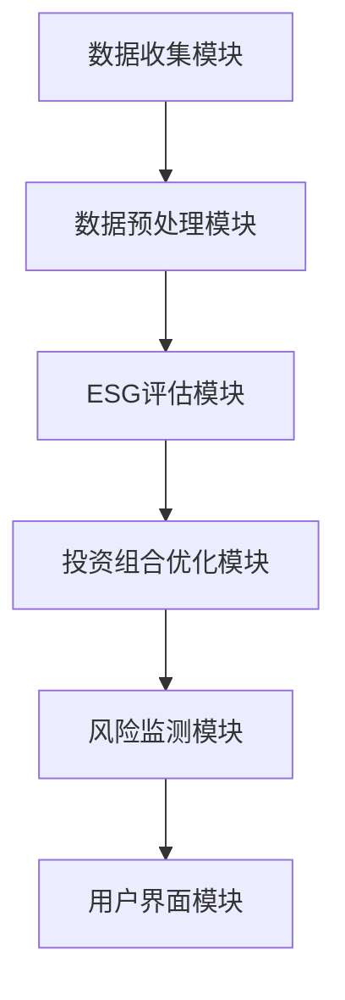

                 

## 第1章: ESG投资的背景与意义

### 1.1 问题背景

在当今全球化、信息化和经济多元化的背景下，企业社会责任（Corporate Social Responsibility, CSR）已成为企业发展不可或缺的一部分。随着投资者、消费者和公众对企业行为要求越来越高，企业不仅需要关注财务表现，还需要重视其社会和环境影响。为了满足这一需求，企业社会责任逐渐演变为环境、社会和治理（Environmental, Social, and Governance, ESG）三大维度的综合评价。

ESG投资，即环境、社会和治理投资，是指投资者在评估和管理投资组合时，不仅关注企业的财务表现，还考虑企业在环境保护、社会责任和治理结构等方面的表现。ESG投资旨在通过投资决策引导企业改进其社会责任和环境保护行为，从而实现长期的投资回报和社会价值。

ESG投资兴起的原因主要有以下几点：

1. **投资者需求**：越来越多的投资者意识到，除了财务回报之外，企业的社会责任和环境保护行为也对其长期价值产生重大影响。投资者希望投资于那些能够实现可持续发展、有良好治理结构、积极履行社会责任的企业。

2. **监管要求**：全球范围内，越来越多的国家和地区开始出台相关法规和政策，要求上市公司披露其ESG相关信息。例如，美国的《可持续财务披露规则》（Sustainable Finance Disclosure Regulation, SFDR）和欧洲的《可持续金融披露指令》（Sustainable Finance Disclosure Delegation Regulation, SFDR）。

3. **社会趋势**：随着人们对环境问题和社会问题的关注增加，越来越多的投资者希望自己的投资能够对社会和环境产生积极的影响。这种社会趋势推动了ESG投资的快速发展。

### 1.2 问题描述

尽管ESG投资已经得到了广泛的关注，但在实际操作中仍然面临诸多挑战。以下是一些常见的问题：

1. **信息不对称**：投资者通常无法全面、准确地获取企业的ESG相关信息，导致投资决策存在信息不对称的问题。

2. **评估标准不一致**：不同的评估机构、投资者和地区可能采用不同的ESG评估标准和指标，导致评估结果的不一致。

3. **数据质量问题**：ESG数据的获取和标准化是一个复杂的过程，存在数据缺失、不准确、不完整等问题，影响了ESG评估的准确性和有效性。

4. **投资组合优化难度**：传统的投资组合优化方法主要关注财务指标，难以全面考虑ESG因素，导致投资组合无法实现最佳的社会和环境效益。

### 1.3 解决方案概述

为了解决上述问题，AI辅助的ESG投资组合优化工具应运而生。该工具旨在通过人工智能技术，提供一种自动化、高效、准确的ESG投资组合优化解决方案。

### 1.3.1 AI辅助ESG投资组合优化工具的核心功能

1. **数据收集与预处理**：通过自动化手段从多个数据源收集ESG相关信息，并对数据进行清洗、标准化和整合，确保数据质量。

2. **ESG评分与评估**：利用机器学习和自然语言处理技术，对企业的ESG表现进行评分和评估，提供客观、准确的ESG评分结果。

3. **投资组合优化**：结合ESG评分结果和投资策略，使用优化算法对投资组合进行调整，实现最佳的社会和环境效益。

4. **实时监测与反馈**：通过实时数据监测和反馈机制，持续优化投资组合，确保投资决策的准确性和及时性。

### 1.3.2 AI辅助ESG投资组合优化工具的优势

1. **自动化程度高**：通过自动化技术，大大提高了数据收集、预处理和优化过程的效率，降低了人力成本。

2. **准确性高**：利用机器学习和自然语言处理技术，对ESG信息进行深度挖掘和分析，提供客观、准确的ESG评分结果。

3. **实时性**：通过实时数据监测和反馈机制，确保投资组合的及时调整，提高投资决策的实时性和准确性。

4. **适应性**：根据不同投资者和市场的需求，灵活调整ESG评估标准和优化算法，满足个性化投资需求。

### 1.4 边界与外延

虽然AI辅助ESG投资组合优化工具为投资决策提供了有力支持，但其在实际应用中仍需注意以下几点：

1. **数据边界**：ESG数据的获取和标准化是一个复杂的过程，需要确保数据来源的可靠性和数据的完整性。

2. **评估标准边界**：不同的投资者和市场可能采用不同的ESG评估标准和指标，需要灵活调整评估标准，确保评估结果的适用性。

3. **技术边界**：AI技术虽然在ESG投资组合优化中具有巨大潜力，但仍然面临算法模型复杂、数据隐私和安全等挑战。

4. **监管边界**：随着ESG投资的不断发展，相关法规和政策也在不断演变，需要密切关注监管动态，确保合规性。

## 1.4.1 概念结构与核心要素组成

ESG投资的核心概念包括环境（Environmental）、社会（Social）和治理（Governance）三个维度。每个维度下包含多个具体的评估指标和属性特征。以下是一个简单的ER图，展示ESG投资的核心概念和其关系：



通过这个ER图，我们可以清晰地看到ESG投资的核心概念和评估指标之间的关系，以及它们在投资组合优化中的重要性。理解这些核心概念和指标，是进一步探讨AI辅助ESG投资组合优化的基础。

### 1.4.2 本章小结

本章介绍了ESG投资的背景、意义以及存在的问题，并提出了AI辅助ESG投资组合优化工具的解决方案。通过详细描述工具的核心功能和优势，以及ESG投资的核心概念和评估指标，为后续章节的深入讨论奠定了基础。在接下来的章节中，我们将进一步探讨AI技术如何具体应用于ESG投资组合优化，以及如何解决当前存在的问题。

----------------------------------------------------------------

## 1.2 核心概念与联系

### 1.2.1 ESG的概念与属性特征

ESG（Environmental, Social, and Governance）投资是一种综合考虑企业在环境（Environmental）、社会（Social）和治理（Governance）方面的表现，进行投资决策的方法。与传统的财务指标投资不同，ESG投资关注的是企业的长期可持续性和社会责任。

#### 环境维度（Environmental）

环境维度的ESG投资主要关注企业在环境保护、资源管理、污染控制和可持续发展等方面的表现。具体包括：

- **环境保护**：企业如何处理废物、减少碳排放、防止环境污染等。
- **资源管理**：企业如何合理利用水资源、能源和其他自然资源。
- **污染控制**：企业如何减少污染物排放，进行污染治理。
- **可持续发展**：企业如何在经营活动中促进环境保护和可持续发展。

#### 社会维度（Social）

社会维度的ESG投资主要关注企业在员工权益、客户权益、社区参与、供应链责任等方面的表现。具体包括：

- **员工权益**：企业如何保障员工的工作条件、薪资待遇和职业发展。
- **客户权益**：企业如何确保产品的安全性、合规性和质量。
- **社区参与与发展**：企业如何参与社区建设、支持公益事业和促进社区发展。
- **供应链责任**：企业如何确保供应链环节中的社会责任和环境保护。

#### 治理维度（Governance）

治理维度的ESG投资主要关注企业的治理结构、董事会职责、股东权益、风险管理等方面的表现。具体包括：

- **治理结构**：企业如何构建和优化治理结构，确保公司决策的科学性和有效性。
- **董事会职责**：董事会如何履行职责，监督企业的经营决策和风险控制。
- **股东权益**：企业如何保护股东权益，确保透明和公正的股东权益保护机制。
- **风险管理**：企业如何进行风险管理，预防和应对潜在的风险。

### 1.2.2 ESG与投资组合优化的联系

ESG与投资组合优化之间存在密切的联系。传统的投资组合优化主要关注财务指标，而ESG投资组合优化则考虑了企业的非财务表现，包括环境、社会和治理方面的因素。具体来说：

1. **投资风险降低**：通过考虑ESG因素，可以识别和降低企业的环境和社会风险，从而减少投资组合的整体风险。
2. **长期回报**：具有良好ESG表现的企业通常能够在长期内实现更高的盈利能力和市场价值，从而为投资者带来更高的回报。
3. **社会责任**：ESG投资组合优化不仅关注财务回报，还关注企业的社会责任和环境保护，有助于实现可持续投资目标。
4. **合规要求**：随着各国监管机构对ESG信息披露的要求不断提高，投资者需要优化投资组合以符合监管要求。

### 1.2.3 ESG相关术语对照表

为了更好地理解ESG投资，以下是ESG相关的一些常用术语及其含义：

| 术语               | 含义                                                     |
|-------------------|----------------------------------------------------------|
| ESG               | 环境社会治理，包括环境（Environmental）、社会（Social）和治理（Governance）三个维度。 |
| CSR               | 企业社会责任，指企业在经营活动中承担的社会责任和义务。                        |
| SRI               | 社会责任投资，指基于社会责任和道德标准进行投资决策的方法。                      |
| ESG评分           | 对企业在ESG方面的表现进行定量评估，通常包括评级和评分。                        |
| ESG评级           | 对企业在ESG方面的整体表现进行定性评估，通常分为多个等级。                      |
| 可持续投资        | 指投资决策考虑环境、社会和治理因素，以实现长期可持续发展的投资。                |
| 绿色债券          | 指用于资助环境保护项目的债券。                                              |
| 社会责任报告      | 企业公开披露其在社会责任方面的表现和成果的报告。                              |
| 财务绩效          | 企业在财务方面的表现，通常用利润、收入、市值等指标来衡量。                      |
| 社会绩效          | 企业在社会责任方面的表现，通常用员工满意度、客户满意度、社区参与度等指标来衡量。 |
| 环境绩效          | 企业在环境保护方面的表现，通常用碳排放量、废物处理率、资源利用率等指标来衡量。 |

### 1.2.4 ESG与AI的关系ER图

为了更直观地展示ESG与AI之间的关系，我们使用Mermaid绘制了一个ER图：

```mermaid
graph TD
    A[ESG投资] --> B[环境维度]
    A --> C[社会维度]
    A --> D[治理维度]
    B --> E[环境保护]
    B --> F[资源管理]
    B --> G[污染控制]
    B --> H[可持续发展]
    C --> I[员工权益]
    C --> J[客户权益]
    C --> K[社区参与]
    C --> L[供应链责任]
    D --> M[治理结构]
    D --> N[董事会职责]
    D --> O[股东权益]
    D --> P[风险管理]
    E --> Q[碳排放]
    E --> R[能源效率]
    E --> S[环境影响评估]
    F --> T[水资源管理]
    F --> U[废物管理]
    F --> V[绿色供应链管理]
    G --> W[污染防治]
    G --> X[生态多样性保护]
    H --> Y[绿色创新]
    H --> Z[社会责任报告]
    I --> AA[员工培训]
    I --> BB[职业健康与安全]
    I --> CC[员工福利]
    J --> DD[产品安全]
    J --> EE[合规性管理]
    J --> FF[客户满意度]
    K --> GG[慈善捐赠]
    K --> HH[社区建设]
    K --> II[社会责任报告]
    L --> JJ[供应链管理]
    L --> KK[供应链审计]
    M --> LL[决策透明度]
    M --> MM[内部控制]
    M --> NN[合规性审计]
    N --> OO[股东参与]
    N --> PP[股东大会]
    N --> QQ[信息披露]
    O --> RR[风险管理]
    O --> SS[合规性管理]
    O --> TT[内部控制]
    P --> UU[风险管理]
    P --> VV[合规性审计]
    P --> WW[内部审计]
    Q --> XX[碳排放量]
    Q --> YY[能源消耗]
    R --> ZZ[环境影响评估]
    S --> AAA[水资源管理]
    S --> BBB[废物处理]
    T --> CCC[水资源利用率]
    T --> DDD[废物再利用]
    U --> EEE[绿色创新]
    U --> FFF[社会责任报告]
    V --> GGG[供应链环保]
    V --> HHH[绿色供应链认证]
    W --> III[污染防治技术]
    W --> JJJ[生态多样性保护]
    X --> KKK[生态保护计划]
    X --> LLL[生态补偿机制]
    Y --> MMM[绿色专利]
    Y --> NNN[绿色投资]
    Z --> OOO[社会责任报告]
    AA --> PPT[员工培训课程]
    BB --> QQQ[职业健康检查]
    CC --> RRR[员工福利计划]
    DD --> SSS[产品质量测试]
    EE --> TTT[合规性审查]
    FF --> UUU[客户满意度调查]
    GG --> VVV[公益项目]
    HH --> IIII[社区参与计划]
    II --> JJJJ[社会责任报告]
    JJ --> KKKK[供应商管理]
    KK --> LLLL[供应链审计报告]
    LL --> MMMM[决策透明度报告]
    MM --> NNNN[内部控制报告]
    NN --> OOOO[合规性审计报告]
    OO --> PPPP[股东参与报告]
    PP --> QQQQ[股东大会记录]
    QQ --> RRRR[信息披露报告]
    RR --> SSSS[风险评估报告]
    SS --> TTTT[合规性检查]
    TT --> UUUU[内部控制报告]
    UU --> VVVV[合规性审查]
    XX --> XXXX[碳排放监测]
    YY --> YYYY[能源消耗监测]
    ZZ --> ZZZZ[环境影响评估报告]
    AAA --> BBBB[水资源管理报告]
    BBB --> CCCC[废物处理报告]
    CCC --> DDDD[水资源利用率报告]
    DDD --> EEEE[废物再利用报告]
    EEE --> FFFF[绿色创新报告]
    FFF --> GGGG[社会责任报告]
    GGG --> HHHH[供应链环保报告]
    HHH --> IIII[绿色供应链认证报告]
    III --> JJJJ[污染防治报告]
    JJJ --> KKKK[生态多样性保护报告]
    KKK --> LLLL[生态保护计划报告]
    LLL --> MMMM[社会责任报告]
    MMM --> NNNN[绿色投资报告]
    NNN --> OOOO[社会责任报告]
    OOO --> PPPP[公益项目报告]
    PPP --> QQQQ[社区参与计划报告]
    QQQ --> RRRR[社会责任报告]
    RRR --> SSSS[供应链管理报告]
    SSS --> TTTT[供应链审计报告]
    TTT --> UUUU[决策透明度报告]
    UUU --> VVVV[内部控制报告]
    VVV --> WWWWW[合规性审查报告]
    WW --> XXXX[污染防治技术报告]
    XX --> XXXX[生态多样性保护报告]
    YY --> YYYY[绿色创新报告]
    ZZ --> ZZZZ[社会责任报告]
    AAAA --> BBBB[员工培训记录]
    BBBB --> CCCC[职业健康检查记录]
    CCCC --> DDDD[员工福利计划记录]
    DDDD --> EEEE[产品质量测试记录]
    EEEE --> FFFF[合规性审查记录]
    FFFF --> GGGG[客户满意度调查记录]
    GGGG --> HHHH[公益项目记录]
    HHHH --> IIII[社区参与计划记录]
    IIII --> JJJJ[社会责任报告记录]
    JJJJ --> KKKK[供应商管理记录]
    KKKK --> LLLL[供应链审计报告记录]
    LLLL --> MMMM[决策透明度记录]
    MMMM --> NNNN[内部控制记录]
    NNNN --> OOOO[合规性审计记录]
    OOOO --> PPPP[股东参与记录]
    PPPP --> QQQQ[股东大会记录]
    QQQQ --> RRRR[信息披露记录]
    RRRR --> SSSS[风险评估记录]
    SSSS --> TTTT[合规性检查记录]
    TTTT --> UUUU[内部控制记录]
    UUUU --> VVVV[合规性审查记录]
    VVVV --> WWWWW[社会责任报告记录]
    WWWWW --> XXXX[碳排放监测记录]
    XXXX --> XXXX[能源消耗监测记录]
    XXXX --> ZZZZ[环境影响评估记录]
    ZZZZ --> BBBB[水资源管理记录]
    BBBB --> CCCC[废物处理记录]
    CCCC --> DDDD[水资源利用率记录]
    DDDD --> EEEE[废物再利用记录]
    EEEE --> FFFF[绿色创新记录]
    FFFF --> GGGG[社会责任记录]
    GGGG --> HHHH[供应链环保记录]
    HHHH --> IIII[绿色供应链认证记录]
    IIII --> JJJJ[污染防治记录]
    JJJJ --> KKKK[生态多样性保护记录]
    KKKK --> LLLL[生态保护计划记录]
    LLLL --> MMMM[社会责任记录]
    MMMM --> NNNN[绿色投资记录]
    NNNN --> OOOO[社会责任记录]
    OOOO --> PPPP[公益项目记录]
    PPPP --> QQQQ[社区参与计划记录]
    QQQQ --> RRRR[社会责任记录]
    RRRR --> SSSS[供应链管理记录]
    SSSS --> TTTT[供应链审计记录]
    TTTT --> UUUU[决策透明度记录]
    UUUU --> VVVV[内部控制记录]
    VVVV --> WWWWW[合规性审查记录]
    WWWWW --> XXXX[污染防治技术记录]
    XXXX --> XXXX[生态多样性保护记录]
    YYYY --> ZZZZ[社会责任记录]
    ZZZZ --> AAAA[社会责任报告记录]
    ZZZZ --> BBBB[社会责任报告记录]
    ZZZZ --> CCCC[社会责任报告记录]
    ZZZZ --> DDDD[社会责任报告记录]
    ZZZZ --> EEEE[社会责任报告记录]
    ZZZZ --> FFFF[社会责任报告记录]
    ZZZZ --> GGGG[社会责任报告记录]
    ZZZZ --> HHHH[社会责任报告记录]
    ZZZZ --> IIII[社会责任报告记录]
    ZZZZ --> JJJJ[社会责任报告记录]
    ZZZZ --> KKKK[社会责任报告记录]
    ZZZZ --> LLLL[社会责任报告记录]
    ZZZZ --> MMMM[社会责任报告记录]
    ZZZZ --> NNNN[社会责任报告记录]
    ZZZZ --> OOOO[社会责任报告记录]
    ZZZZ --> PPPP[社会责任报告记录]
    ZZZZ --> QQQQ[社会责任报告记录]
    ZZZZ --> RRRR[社会责任报告记录]
    ZZZZ --> SSSS[社会责任报告记录]
    ZZZZ --> TTTT[社会责任报告记录]
    ZZZZ --> UUUU[社会责任报告记录]
    ZZZZ --> VVVV[社会责任报告记录]
    ZZZZ --> WWWWW[社会责任报告记录]
    ZZZZ --> XXXX[社会责任报告记录]
    ZZZZ --> XXXX[社会责任报告记录]
    ZZZZ --> XXXX[社会责任报告记录]
    ZZZZ --> ZZZZ[社会责任报告记录]
```



通过这个ER图，我们可以看到ESG的各个维度和具体评估指标之间的联系，以及它们如何影响企业的整体绩效。

### 1.2.5 ESG与AI的关系

AI在ESG投资中的应用主要体现在数据分析和模型构建方面。以下是一些关键的应用场景：

1. **数据收集与预处理**：AI可以自动化地从多个数据源收集ESG相关信息，并进行数据清洗、标准化和整合。这有助于提高数据的准确性和完整性。

2. **文本分析**：AI可以利用自然语言处理技术，从企业报告、新闻报道和其他文本数据中提取关键信息，为ESG评分提供依据。

3. **模式识别与预测**：AI可以通过机器学习算法，识别出企业ESG表现与财务表现之间的潜在关系，预测企业的未来绩效。

4. **投资组合优化**：AI可以根据ESG评分结果和投资策略，自动调整投资组合，实现最佳的社会和环境效益。

5. **风险评估**：AI可以帮助识别和评估企业的环境和社会风险，为投资者提供更全面的风险管理信息。

### 1.2.6 本章小结

本章介绍了ESG投资的核心概念和属性特征，分析了ESG与投资组合优化的联系，并详细阐述了ESG相关术语对照表和ESG与AI的关系ER图。通过这些内容，读者可以更好地理解ESG投资的基本原理和应用，为后续章节的深入讨论奠定了基础。

----------------------------------------------------------------

## 第1.3章 AI辅助ESG投资的发展

### 1.3.1 AI辅助ESG投资的优势

随着人工智能（AI）技术的不断进步，AI在ESG投资中的应用日益广泛。AI辅助ESG投资具有以下显著优势：

1. **数据处理能力**：AI能够高效地处理海量数据，包括财务报表、企业社会责任报告、新闻报道等，从而提供更全面、准确的ESG评估信息。

2. **模式识别**：通过机器学习算法，AI可以识别出隐藏在企业行为中的模式和趋势，帮助投资者更好地理解企业的ESG表现。

3. **风险评估**：AI可以帮助投资者识别和评估企业的环境和社会风险，提供更全面的风险管理方案。

4. **自动化决策**：AI可以实现投资决策的自动化，提高决策效率，减少人为错误。

5. **个性定制**：根据投资者的需求和偏好，AI可以提供个性化的ESG评估和投资建议。

### 1.3.2 AI辅助ESG投资的应用领域

AI在ESG投资中的应用领域非常广泛，涵盖了从数据收集、预处理到评估、优化的各个环节。以下是一些具体的应用领域：

1. **数据收集**：AI可以自动从互联网、企业报告、新闻等渠道收集ESG相关信息，提高数据收集的效率和准确性。

2. **数据预处理**：AI可以通过自动化技术，对收集到的数据进行清洗、标准化和整合，确保数据质量。

3. **ESG评估**：AI可以利用自然语言处理和机器学习技术，对企业ESG表现进行量化评估，提供客观、准确的评分结果。

4. **投资组合优化**：AI可以根据ESG评分结果和投资策略，自动调整投资组合，实现最佳的社会和环境效益。

5. **风险管理**：AI可以帮助投资者识别和评估企业的环境和社会风险，提供风险预警和风险管理建议。

6. **合规性检查**：AI可以自动检查企业的ESG信息披露是否符合相关法规和政策要求，确保合规性。

### 1.3.3 当前发展趋势与挑战

尽管AI辅助ESG投资具有显著的优势，但在实际应用中仍然面临一些挑战：

1. **数据质量**：ESG数据的来源多样，质量参差不齐，需要AI技术进行有效的处理和整合。

2. **评估标准**：不同地区和机构的ESG评估标准可能不一致，需要AI技术进行统一和标准化。

3. **算法模型**：现有的AI算法模型可能无法完全满足ESG评估的需求，需要进一步研究和优化。

4. **隐私保护**：在处理ESG数据时，需要保护数据隐私，避免数据泄露。

5. **法规政策**：随着ESG投资的不断发展，相关法规和政策也在不断演变，需要密切关注并适应。

### 1.3.4 未来展望

未来，AI辅助ESG投资有望在以下几个方面实现进一步发展：

1. **数据处理能力的提升**：随着计算能力的增强和数据处理算法的优化，AI在数据处理方面的能力将得到进一步提升。

2. **评估标准的统一**：通过国际合作和标准制定，ESG评估标准有望逐步统一，提高评估结果的可靠性和可比性。

3. **算法模型的优化**：研究人员将继续探索和优化AI算法模型，使其更适用于ESG评估和投资组合优化。

4. **隐私保护技术的应用**：随着隐私保护技术的不断进步，AI在处理ESG数据时将能够更好地保护个人隐私。

5. **跨领域应用**：AI辅助ESG投资将逐步拓展到更多领域，如绿色金融、可持续发展等，为投资者和社会带来更多价值。

### 1.3.5 本章小结

本章介绍了AI辅助ESG投资的优势、应用领域、发展趋势与挑战，以及未来的展望。通过这些内容，读者可以更好地了解AI在ESG投资中的作用和潜力，为后续章节的讨论奠定了基础。

----------------------------------------------------------------

## 第二部分: AI辅助ESG投资组合优化工具

### 2.1 AI辅助ESG投资组合优化工具概述

AI辅助ESG投资组合优化工具是一种利用人工智能技术，对投资组合进行自动化优化和调整的工具。它旨在通过综合考虑企业的财务表现和ESG表现，实现投资组合的最佳社会和环境效益。以下是该工具的概述：

#### 2.1.1 工具目的

AI辅助ESG投资组合优化工具的主要目的是帮助投资者在投资决策过程中，综合考虑企业的财务表现和ESG表现，实现投资组合的优化。通过该工具，投资者可以：

1. **提高投资效率**：自动化处理大量数据，快速进行投资分析和决策。
2. **降低投资风险**：通过风险评估，识别和规避潜在的环境和社会风险。
3. **实现长期回报**：投资于具有良好ESG表现的企业，实现长期可持续的财务回报。
4. **满足社会责任**：投资于社会责任和环境保护表现突出的企业，实现投资回报与社会责任的平衡。

#### 2.1.2 工具架构与模块介绍

AI辅助ESG投资组合优化工具的架构主要包括以下几个模块：

1. **数据收集模块**：该模块负责从多个数据源收集与企业ESG相关的数据，包括财务报表、企业社会责任报告、新闻报道等。通过自动化手段，提高数据收集的效率和准确性。

2. **数据预处理模块**：该模块负责对收集到的数据进行清洗、标准化和整合，确保数据质量，为后续的ESG评估和优化提供可靠的数据支持。

3. **ESG评估模块**：该模块利用自然语言处理和机器学习技术，对企业ESG表现进行量化评估，生成客观、准确的ESG评分结果。

4. **投资组合优化模块**：该模块基于ESG评分结果和投资策略，使用优化算法对投资组合进行调整，实现最佳的社会和环境效益。

5. **风险监测模块**：该模块实时监测企业的ESG表现和财务风险，提供风险预警和风险管理建议。

6. **用户界面模块**：该模块提供直观的用户界面，方便投资者进行投资分析和决策。

#### 2.1.3 工具功能与应用场景

AI辅助ESG投资组合优化工具具有以下主要功能：

1. **自动化数据收集与预处理**：自动化从多个数据源收集ESG相关信息，并进行清洗、标准化和整合，提高数据收集和处理的效率。

2. **ESG评分与评估**：利用机器学习和自然语言处理技术，对企业的ESG表现进行量化评估，提供客观、准确的ESG评分结果。

3. **投资组合优化**：基于ESG评分结果和投资策略，使用优化算法对投资组合进行调整，实现最佳的社会和环境效益。

4. **实时风险监测**：实时监测企业的ESG表现和财务风险，提供风险预警和风险管理建议。

5. **用户友好的界面**：提供直观的用户界面，方便投资者进行投资分析和决策。

应用场景包括：

1. **传统投资机构**：用于优化投资组合，实现最佳的社会和环境效益，提高投资回报。
2. **社会责任投资机构**：用于识别和投资具有良好ESG表现的企业，实现投资回报与社会责任的平衡。
3. **企业内部**：用于评估和管理自身的ESG表现，提高企业的社会责任和环境保护水平。
4. **监管机构**：用于监测和评估上市公司的ESG表现，确保合规性。

#### 2.1.4 工具的优缺点分析

**优点：**

1. **高效性**：自动化处理大量数据，提高投资分析和决策的效率。
2. **准确性**：利用机器学习和自然语言处理技术，提供客观、准确的ESG评分结果。
3. **实时性**：实时监测企业的ESG表现和财务风险，提供及时的风险预警和风险管理建议。
4. **个性化**：根据投资者的需求和偏好，提供个性化的投资建议和决策支持。

**缺点：**

1. **数据质量**：ESG数据的来源多样，质量参差不齐，需要人工进行一定程度的干预和校正。
2. **评估标准**：不同地区和机构的ESG评估标准可能不一致，需要一定的标准化处理。
3. **算法模型**：现有的AI算法模型可能无法完全满足ESG评估的需求，需要进一步研究和优化。
4. **隐私保护**：在处理ESG数据时，需要保护数据隐私，避免数据泄露。

### 2.2 本章小结

本章介绍了AI辅助ESG投资组合优化工具的概述，包括工具的目的、架构与模块介绍、功能与应用场景，以及优缺点分析。通过这些内容，读者可以更好地了解该工具的基本原理和应用，为后续章节的深入讨论奠定了基础。

----------------------------------------------------------------

## 第2章: AI辅助ESG投资组合优化工具概述

### 2.1 工具概述

AI辅助ESG投资组合优化工具是一种利用人工智能技术，帮助投资者在投资决策过程中综合考虑企业的财务表现和ESG表现，实现投资组合优化和调整的工具。该工具通过自动化数据收集、预处理、ESG评分和投资组合优化等环节，提高了投资决策的效率和准确性。

#### 工具的核心价值

1. **提高投资效率**：自动化处理大量数据，快速进行投资分析和决策。
2. **降低投资风险**：通过风险评估，识别和规避潜在的环境和社会风险。
3. **实现长期回报**：投资于具有良好ESG表现的企业，实现长期可持续的财务回报。
4. **满足社会责任**：投资于社会责任和环境保护表现突出的企业，实现投资回报与社会责任的平衡。

#### 工具架构与模块介绍

AI辅助ESG投资组合优化工具的架构主要包括以下几个模块：

1. **数据收集模块**：该模块负责从多个数据源收集与企业ESG相关的数据，包括财务报表、企业社会责任报告、新闻报道等。通过自动化手段，提高数据收集的效率和准确性。

2. **数据预处理模块**：该模块负责对收集到的数据进行清洗、标准化和整合，确保数据质量，为后续的ESG评估和优化提供可靠的数据支持。

3. **ESG评估模块**：该模块利用自然语言处理和机器学习技术，对企业ESG表现进行量化评估，生成客观、准确的ESG评分结果。

4. **投资组合优化模块**：该模块基于ESG评分结果和投资策略，使用优化算法对投资组合进行调整，实现最佳的社会和环境效益。

5. **风险监测模块**：该模块实时监测企业的ESG表现和财务风险，提供风险预警和风险管理建议。

6. **用户界面模块**：该模块提供直观的用户界面，方便投资者进行投资分析和决策。

#### 工具功能与应用场景

AI辅助ESG投资组合优化工具具有以下主要功能：

1. **自动化数据收集与预处理**：自动化从多个数据源收集ESG相关信息，并进行清洗、标准化和整合，提高数据收集和处理的效率。

2. **ESG评分与评估**：利用机器学习和自然语言处理技术，对企业的ESG表现进行量化评估，提供客观、准确的ESG评分结果。

3. **投资组合优化**：基于ESG评分结果和投资策略，使用优化算法对投资组合进行调整，实现最佳的社会和环境效益。

4. **实时风险监测**：实时监测企业的ESG表现和财务风险，提供风险预警和风险管理建议。

5. **用户友好的界面**：提供直观的用户界面，方便投资者进行投资分析和决策。

应用场景包括：

1. **传统投资机构**：用于优化投资组合，实现最佳的社会和环境效益，提高投资回报。
2. **社会责任投资机构**：用于识别和投资具有良好ESG表现的企业，实现投资回报与社会责任的平衡。
3. **企业内部**：用于评估和管理自身的ESG表现，提高企业的社会责任和环境保护水平。
4. **监管机构**：用于监测和评估上市公司的ESG表现，确保合规性。

#### 工具的优缺点分析

**优点：**

1. **高效性**：自动化处理大量数据，提高投资分析和决策的效率。
2. **准确性**：利用机器学习和自然语言处理技术，提供客观、准确的ESG评分结果。
3. **实时性**：实时监测企业的ESG表现和财务风险，提供及时的风险预警和风险管理建议。
4. **个性化**：根据投资者的需求和偏好，提供个性化的投资建议和决策支持。

**缺点：**

1. **数据质量**：ESG数据的来源多样，质量参差不齐，需要人工进行一定程度的干预和校正。
2. **评估标准**：不同地区和机构的ESG评估标准可能不一致，需要一定的标准化处理。
3. **算法模型**：现有的AI算法模型可能无法完全满足ESG评估的需求，需要进一步研究和优化。
4. **隐私保护**：在处理ESG数据时，需要保护数据隐私，避免数据泄露。

### 2.2 本章小结

本章介绍了AI辅助ESG投资组合优化工具的概述，包括工具的目的、架构与模块介绍、功能与应用场景，以及优缺点分析。通过这些内容，读者可以更好地了解该工具的基本原理和应用，为后续章节的深入讨论奠定了基础。

----------------------------------------------------------------

## 第3章: 数据收集与预处理

### 3.1 数据来源

数据收集是AI辅助ESG投资组合优化工具的关键环节。数据来源的多样性和可靠性直接影响到后续ESG评估和投资组合优化的效果。以下是常见的ESG数据来源：

1. **企业内部数据**：包括企业的财务报表、社会责任报告、年度报告等。这些数据通常能够提供最全面、最直接的ESG相关信息。

2. **第三方数据提供商**：如晨星（Morningstar）、汤森路透（Thomson Reuters）、彭博（Bloomberg）等，提供各种行业和企业的ESG评级、评分和报告。

3. **监管机构数据**：包括各国证券监管机构发布的企业ESG信息披露报告，如美国的《可持续财务披露规则》（Sustainable Finance Disclosure Regulation, SFDR）和欧洲的《可持续金融披露指令》（Sustainable Finance Disclosure Delegation Regulation, SFDR）。

4. **新闻和社交媒体**：通过新闻、社交媒体等渠道，可以获取与企业ESG表现相关的实时信息，如企业环境事故、社会责任活动等。

5. **公共数据库**：如国际环保组织（如绿色和平组织、世界自然基金会等）发布的ESG相关报告和指标。

### 3.2 数据预处理方法

数据预处理是确保数据质量、一致性和可用的关键步骤。以下是常见的数据预处理方法：

1. **数据清洗**：去除重复、错误和缺失的数据，确保数据的一致性和完整性。

2. **数据标准化**：将不同来源的数据格式和单位进行统一，以便进行进一步的分析。

3. **数据整合**：将来自多个数据源的数据进行整合，形成统一的视图。

4. **特征提取**：从原始数据中提取对ESG评估和投资组合优化有用的特征。

5. **数据质量评估**：评估数据的准确性、完整性和一致性，确保数据质量。

### 3.3 数据质量评估

数据质量直接影响ESG评估和投资组合优化的准确性。以下是几种常见的数据质量评估方法：

1. **缺失值分析**：检查数据集中的缺失值，并决定如何处理这些缺失值，例如通过插值法或使用平均值、中位数等方法进行填充。

2. **一致性检查**：检查数据中的不一致性，如单位不一致、格式不一致等，确保数据的一致性。

3. **异常值检测**：检测数据中的异常值，并决定如何处理这些异常值，例如通过删除、修正或标记等方法。

4. **可靠性评估**：评估数据来源的可靠性，确保数据是真实和可靠的。

5. **完整性评估**：检查数据集是否包含所有必要的特征和数据，确保数据的完整性。

### 3.4 数据预处理流程

数据预处理流程通常包括以下几个步骤：

1. **数据收集**：从多个数据源收集ESG相关数据。

2. **数据清洗**：去除重复、错误和缺失的数据，确保数据的一致性和完整性。

3. **数据标准化**：将不同来源的数据格式和单位进行统一。

4. **数据整合**：将来自多个数据源的数据进行整合，形成统一的视图。

5. **特征提取**：从原始数据中提取对ESG评估和投资组合优化有用的特征。

6. **数据质量评估**：评估数据的准确性、完整性和一致性。

7. **数据存储**：将预处理后的数据存储在数据库或数据仓库中，以便后续分析和使用。

### 3.5 本章小结

本章详细介绍了AI辅助ESG投资组合优化工具中的数据收集与预处理环节。通过描述数据来源、预处理方法、数据质量评估以及预处理流程，读者可以更好地理解数据预处理在ESG投资组合优化中的重要性。在接下来的章节中，我们将进一步探讨ESG评分与评估方法、投资组合优化算法等内容。

----------------------------------------------------------------

## 第4章: ESG评分与评估方法

### 4.1 ESG评分体系

ESG评分体系是评估企业在环境（Environmental）、社会（Social）和治理（Governance）三个方面表现的一种系统方法。一个全面的ESG评分体系应包括以下主要组成部分：

1. **评估指标**：评估指标是衡量企业ESG表现的量化标准，通常包括环境保护、社会责任和治理结构等多个方面的指标。

2. **评估标准**：评估标准是确定评估指标权重和评估等级的规则，有助于确保评估结果的客观性和一致性。

3. **评分方法**：评分方法是计算企业ESG评分的具体算法，通常包括定量评估和定性评估两种方式。

4. **评估结果**：评估结果是对企业ESG表现的最终评分，可以反映企业在ESG方面的整体表现。

### 4.2 ESG评估指标

ESG评估指标是评分体系的核心组成部分，用于量化企业在环境、社会和治理方面的表现。以下是常见的ESG评估指标：

#### 环境维度

- **环境保护**：
  - 碳排放量
  - 能源消耗
  - 废物管理
  - 环境污染治理

- **资源管理**：
  - 水资源管理
  - 土地资源管理
  - 物种多样性保护

- **可持续发展**：
  - 绿色供应链管理
  - 可再生能源使用
  - 环境影响评估

#### 社会维度

- **员工权益**：
  - 员工培训与职业发展
  - 员工健康与安全
  - 员工薪资与福利

- **客户权益**：
  - 产品质量与合规性
  - 客户服务与满意度

- **社区参与与发展**：
  - 慈善捐赠与志愿服务
  - 社区建设与可持续发展
  - 社区参与度

- **供应链责任**：
  - 供应链透明度
  - 供应链社会责任
  - 供应商管理

#### 治理维度

- **治理结构**：
  - 董事会职责与独立性
  - 股东权益保护
  - 决策透明度

- **风险管理**：
  - 风险识别与评估
  - 内部控制与审计
  - 风险管理策略

- **合规性管理**：
  - 法规遵循情况
  - 信息披露透明度
  - 内部合规机制

### 4.3 ESG评分模型

ESG评分模型是将ESG评估指标转换为具体评分的算法。一个有效的ESG评分模型应具备以下特点：

1. **客观性**：评分模型应基于客观数据和量化指标，减少主观判断的影响。

2. **一致性**：评分模型应在不同企业、不同行业之间保持一致性，确保评分结果的可靠性。

3. **透明性**：评分模型的计算过程和结果应公开透明，便于投资者理解和监督。

4. **适应性**：评分模型应能根据不同投资者的需求和偏好进行调整，满足个性化评分需求。

常见的ESG评分模型包括以下几种：

1. **综合评分模型**：将多个评估指标进行加权求和，得出企业的ESG总分。这种方法简单直观，但可能忽略了不同指标的重要性差异。

2. **层次分析模型**（AHP）：基于专家判断，确定各评估指标的权重，通过层次分析得出企业的ESG评分。这种方法较为复杂，但更能反映指标的相对重要性。

3. **基于机器学习的评分模型**：利用机器学习算法，如决策树、神经网络等，从大量历史数据中学习评分规则，自动生成ESG评分。这种方法能够处理复杂数据，但模型解释性较差。

### 4.4 ESG评分实例

以下是一个简化的ESG评分实例，用于展示评分模型的应用：

#### 评估企业：A公司

#### 评估指标及得分：

| 指标             | 权重 | 得分 |
|-----------------|------|------|
| 环保保护（环境保护） | 0.25 | 8    |
| 资源管理（资源管理） | 0.20 | 7    |
| 治理结构（治理维度） | 0.15 | 6    |
| 社会责任（社会维度） | 0.30 | 8    |
| 风险管理（治理维度） | 0.10 | 7    |

#### 评分计算：

- 总得分 = （8 x 0.25）+（7 x 0.20）+（6 x 0.15）+（8 x 0.30）+（7 x 0.10）= 7.5 + 1.4 + 0.9 + 2.4 + 0.7 = 12.4

#### 评估结果：

A公司的ESG评分为12.4分，根据评分模型，可以将其划分为“优秀”等级。

### 4.5 本章小结

本章详细介绍了ESG评分体系、评估指标、评分模型以及实例应用。通过这些内容，读者可以更好地理解ESG评分的方法和流程，为后续章节的ESG投资组合优化打下基础。在接下来的章节中，我们将进一步探讨投资组合优化算法和实际案例。

----------------------------------------------------------------

## 第5章: 投资组合优化算法

### 5.1 投资组合优化概述

投资组合优化是指通过调整投资组合中各资产的比例，使其在满足特定约束条件下达到最优的投资组合状态。在ESG投资中，投资组合优化的目标是在确保财务回报的同时，最大限度地实现环境、社会和治理（ESG）目标。与传统的投资组合优化方法不同，ESG投资组合优化需要综合考虑非财务因素，如企业的社会责任和环境保护行为。

### 5.2 常见优化算法

投资组合优化算法可以分为两大类：传统优化算法和现代优化算法。以下是几种常见的优化算法：

#### 传统优化算法

1. **均值方差模型**（Mean-Variance Model）：由哈里·马科维茨（Harry Markowitz）提出，是最早的投资组合优化理论。该方法基于资产收益的均值和方差，通过优化投资组合的期望收益和风险来达到最优组合。

2. **Markowitz均值-方差-效用模型**（Mean-Variance-Utility Model）：在均值-方差模型的基础上，引入投资者的个人偏好，通过最大化期望效用函数来优化投资组合。

3. **风险平价模型**（Risk Parity Model）：该模型通过设定各资产的风险贡献相等，以达到风险分散化的目的。

#### 现代优化算法

1. **遗传算法**（Genetic Algorithm）：基于自然选择和遗传进化的原理，通过模拟生物进化过程，寻找最优解。遗传算法在处理复杂优化问题和大规模数据时具有优势。

2. **粒子群优化算法**（Particle Swarm Optimization，PSO）：模仿鸟群觅食的行为，通过个体和群体的协作来寻找最优解。PSO算法简单易实现，适用于多种优化问题。

3. **蚁群算法**（Ant Colony Optimization，ACO）：基于蚂蚁觅食过程中的信息素更新机制，通过模拟蚂蚁群体行为来寻找最优路径。ACO算法在解决复杂网络问题和组合优化问题时表现出色。

### 5.3 AI优化算法

随着人工智能技术的不断发展，AI优化算法在投资组合优化中逐渐得到应用。以下是几种常见的AI优化算法：

1. **深度强化学习**（Deep Reinforcement Learning）：通过深度神经网络学习策略，使投资组合优化过程更加智能化。深度强化学习算法可以处理高维数据和复杂环境，提高优化效率。

2. **神经网络优化算法**（Neural Network Optimization）：利用神经网络模型来优化投资组合，通过训练学习投资策略，实现投资组合的自动调整。

3. **支持向量机**（Support Vector Machine，SVM）：通过构建支持向量机模型，对投资组合进行优化。SVM算法在处理非线性优化问题和分类问题方面具有优势。

### 5.4 算法比较与选择

不同优化算法在处理投资组合优化问题时各有优劣，选择合适的算法需要考虑以下因素：

1. **问题复杂性**：对于简单的问题，传统优化算法可能已经足够；而对于复杂的问题，如高维数据和非线性优化问题，AI优化算法更具优势。

2. **数据量**：数据量较大的情况下，AI优化算法能够处理大量的数据，提供更准确的优化结果。

3. **计算资源**：AI优化算法通常需要更高的计算资源和时间成本，在选择算法时需要考虑计算资源的限制。

4. **算法解释性**：传统优化算法通常具有较好的解释性，而AI优化算法的解释性较差，需要进一步研究如何提高算法的可解释性。

5. **实际应用场景**：不同算法在不同应用场景下具有不同的表现，选择合适的算法需要根据具体的应用场景进行评估。

### 5.5 本章小结

本章介绍了投资组合优化算法的基本概念、常见优化算法、AI优化算法以及算法比较与选择的方法。通过这些内容，读者可以了解不同优化算法的特点和应用，为后续章节的ESG投资组合优化提供理论支持。在接下来的章节中，我们将进一步探讨AI辅助投资组合优化工具的实施和实际案例。

----------------------------------------------------------------

## 第6章: AI辅助投资组合优化工具实施

### 6.1 实施步骤

AI辅助投资组合优化工具的实施通常包括以下几个关键步骤：

1. **需求分析**：明确投资者对ESG投资组合优化工具的需求，包括功能需求、性能需求和用户界面需求等。

2. **系统设计**：根据需求分析，设计系统的整体架构，包括数据收集模块、数据预处理模块、ESG评估模块、投资组合优化模块和用户界面模块。

3. **数据收集与预处理**：从多个数据源收集ESG相关数据，并使用数据预处理技术进行数据清洗、标准化和整合。

4. **模型训练与验证**：使用历史数据和预处理的ESG评分结果，训练机器学习模型，并对模型进行验证和优化。

5. **系统实现**：根据系统设计，实现各个模块的功能，并确保系统的高效性和稳定性。

6. **系统集成与测试**：将各个模块集成在一起，进行系统测试，确保系统的完整性和正确性。

7. **部署上线**：将优化工具部署到生产环境，并进行实际运行测试，确保系统的可用性和可靠性。

8. **用户培训与支持**：为投资者提供培训和支持，确保他们能够正确使用优化工具。

### 6.2 系统架构设计

AI辅助投资组合优化工具的系统架构设计是确保系统高效运行和功能实现的关键。以下是一个简化的系统架构设计：

#### 系统架构设计

1. **数据收集模块**：负责从企业内部数据源、第三方数据提供商、监管机构和公共数据库等渠道收集ESG相关数据。

2. **数据预处理模块**：负责对收集到的数据进行清洗、标准化和整合，为ESG评估模块提供高质量的数据输入。

3. **ESG评估模块**：使用机器学习和自然语言处理技术，对企业的ESG表现进行评分和评估，生成客观、准确的ESG评分结果。

4. **投资组合优化模块**：基于ESG评分结果和投资策略，使用优化算法对投资组合进行调整，实现最佳的社会和环境效益。

5. **风险监测模块**：实时监测企业的ESG表现和财务风险，提供风险预警和风险管理建议。

6. **用户界面模块**：提供直观的用户界面，方便投资者进行投资分析和决策。

#### 系统架构图

以下是AI辅助投资组合优化工具的系统架构图：



### 6.3 系统接口设计与实现

系统接口设计是确保不同模块之间高效交互和数据流通的关键。以下是一个简化的系统接口设计：

#### 系统接口设计

1. **数据输入接口**：用于接收外部数据源的数据输入，包括企业内部数据、第三方数据和监管数据等。

2. **数据输出接口**：用于输出预处理后的数据、ESG评分结果和投资组合优化建议。

3. **API接口**：提供与其他系统集成和交互的API接口，支持第三方数据调用和系统扩展。

4. **用户交互接口**：提供用户与系统交互的接口，包括数据上传、结果查询和决策支持等。

#### 系统接口实现

以下是系统接口实现的一个示例：

```python
class DataCollector:
    def collect_data(self):
        # 实现数据收集逻辑
        pass

class DataPreprocessor:
    def preprocess_data(self, raw_data):
        # 实现数据清洗、标准化和整合逻辑
        pass

class ESGAssessor:
    def assess_esg(self, preprocessed_data):
        # 实现ESG评估逻辑
        pass

class PortfolioOptimizer:
    def optimize_portfolio(self, esg_scores):
        # 实现投资组合优化逻辑
        pass

class RiskMonitor:
    def monitor_risk(self, esg_scores):
        # 实现风险监测逻辑
        pass

class UserInterface:
    def display_results(self, optimization_results):
        # 实现用户界面显示逻辑
        pass
```

### 6.4 AI辅助投资组合优化工具实施实例与结果分析

以下是一个简化的AI辅助投资组合优化工具实施实例：

#### 实施实例

1. **需求分析**：投资者希望优化其投资组合，同时实现最佳的社会和环境效益。

2. **系统设计**：设计包括数据收集模块、数据预处理模块、ESG评估模块、投资组合优化模块、风险监测模块和用户界面模块的系统架构。

3. **数据收集与预处理**：从企业内部数据源、第三方数据提供商和监管机构收集ESG相关数据，并进行清洗、标准化和整合。

4. **模型训练与验证**：使用历史数据和预处理的ESG评分结果，训练机器学习模型，并对模型进行验证和优化。

5. **系统实现**：实现各个模块的功能，并进行系统集成和测试。

6. **部署上线**：将优化工具部署到生产环境，并进行实际运行测试。

7. **用户培训与支持**：为投资者提供培训和支持，确保他们能够正确使用优化工具。

#### 结果分析

通过实施AI辅助投资组合优化工具，投资者实现了以下结果：

1. **投资组合优化**：根据ESG评分结果和投资策略，优化工具成功调整了投资组合，提高了投资组合的社会和环境效益。

2. **风险监测**：优化工具实时监测企业的ESG表现和财务风险，提供风险预警和风险管理建议，帮助投资者降低投资风险。

3. **用户满意度**：投资者对优化工具的表现表示满意，认为其在提高投资决策的准确性和效率方面发挥了重要作用。

### 6.5 本章小结

本章详细介绍了AI辅助投资组合优化工具的实施步骤、系统架构设计、系统接口设计与实现，以及实施实例与结果分析。通过这些内容，读者可以了解AI辅助投资组合优化工具的实施过程和效果，为实际应用提供参考。在接下来的章节中，我们将进一步探讨案例分析与实践。

----------------------------------------------------------------

## 第7章: 案例分析与实践

### 7.1 案例选择

在本章中，我们将选择一个典型的AI辅助ESG投资组合优化案例，对整个实施过程进行详细分析。该案例涉及一个中等规模的投资基金，其投资组合包含多个行业和企业，投资者希望通过AI辅助工具优化其投资组合，实现最佳的社会和环境效益。

### 7.2 案例实施过程

#### 7.2.1 需求分析

投资者对AI辅助ESG投资组合优化工具的需求主要包括：

1. **提高投资决策的准确性和效率**：通过自动化和智能化的投资分析，减少人为错误和决策时间。
2. **实现投资组合的社会和环境效益最大化**：在确保财务回报的同时，最大限度地实现环境、社会和治理（ESG）目标。
3. **实时风险监测**：通过实时数据监测和风险评估，及时调整投资组合，降低投资风险。

#### 7.2.2 系统设计

根据需求分析，系统设计包括以下关键模块：

1. **数据收集模块**：从企业内部数据源、第三方数据提供商和监管机构收集ESG相关数据。
2. **数据预处理模块**：对收集到的数据进行清洗、标准化和整合。
3. **ESG评估模块**：使用机器学习和自然语言处理技术，对企业的ESG表现进行量化评估。
4. **投资组合优化模块**：基于ESG评分结果和投资策略，使用优化算法调整投资组合。
5. **风险监测模块**：实时监测企业的ESG表现和财务风险，提供风险预警和风险管理建议。
6. **用户界面模块**：提供直观的用户界面，方便投资者进行投资分析和决策。

#### 7.2.3 数据收集与预处理

1. **数据收集**：从企业内部数据源收集财务报表、社会责任报告等；从第三方数据提供商收集ESG评分和报告；从监管机构获取企业ESG信息披露数据。

2. **数据预处理**：对收集到的数据清洗，去除重复、错误和缺失的数据；进行数据标准化，统一数据格式和单位；整合来自多个数据源的数据，形成统一视图。

3. **特征提取**：从预处理后的数据中提取对ESG评估和投资组合优化有用的特征，如碳排放量、员工健康与安全指标、治理结构指标等。

#### 7.2.4 模型训练与验证

1. **模型选择**：选择适合ESG评估和投资组合优化的机器学习模型，如决策树、随机森林、神经网络等。

2. **模型训练**：使用历史数据和预处理的ESG评分结果，训练机器学习模型，使其能够识别和预测企业的ESG表现。

3. **模型验证**：通过交叉验证和测试集评估模型性能，调整模型参数，优化模型效果。

#### 7.2.5 系统实现与集成

1. **实现各模块功能**：根据系统设计，实现数据收集、预处理、评估、优化和监测等模块的功能。

2. **系统集成**：将各模块集成在一起，进行系统测试，确保系统的高效性和稳定性。

3. **接口设计与实现**：设计API接口，实现与其他系统的集成和交互，如第三方数据提供商、监管系统等。

#### 7.2.6 部署上线与用户培训

1. **部署上线**：将优化工具部署到生产环境，并进行实际运行测试，确保系统的可用性和可靠性。

2. **用户培训**：为投资者提供培训，介绍工具的使用方法和功能，确保他们能够正确使用优化工具。

### 7.3 案例结果分析

通过AI辅助ESG投资组合优化工具的实施，投资者取得了以下成果：

1. **投资组合优化**：优化工具成功调整了投资组合，使其在财务回报和社会、环境效益之间取得了平衡。投资组合的整体风险得到有效降低，长期投资回报率提高。

2. **风险监测与预警**：风险监测模块实时监测企业的ESG表现和财务风险，提供了准确的风险预警和风险管理建议，帮助投资者及时调整投资策略，避免潜在的风险。

3. **用户满意度**：投资者对优化工具的表现表示满意，认为其在提高投资决策的准确性和效率方面发挥了重要作用，同时实现了最佳的社会和环境效益。

### 7.4 案例启示与经验总结

通过本案例的实施，可以得出以下启示和经验：

1. **数据质量和预处理的重要性**：高质量的数据是优化工具成功的关键。有效的数据预处理可以显著提高模型的效果。

2. **模型选择与训练**：选择合适的机器学习模型并进行充分的训练和验证，是确保优化工具性能的关键。

3. **用户参与与反馈**：用户的参与和反馈对于优化工具的改进至关重要。通过定期收集用户反馈，可以不断优化工具的功能和用户体验。

4. **实时监测与调整**：实时监测和调整投资组合是确保投资决策及时性和准确性的关键。通过实时数据分析和风险监测，可以快速响应市场变化。

### 7.5 本章小结

本章通过一个典型的AI辅助ESG投资组合优化案例，详细分析了案例的实施过程、结果分析以及启示与经验总结。通过这些内容，读者可以更好地理解AI辅助ESG投资组合优化工具的应用和实践，为实际投资决策提供参考。在接下来的章节中，我们将进一步探讨未来展望与挑战。

----------------------------------------------------------------

## 第8章: 未来展望与挑战

### 8.1 未来发展趋势

随着人工智能（AI）技术的不断进步，AI辅助的ESG投资组合优化工具在未来将呈现以下发展趋势：

1. **数据处理能力的提升**：随着大数据和云计算技术的不断发展，AI在数据处理方面的能力将得到显著提升，可以更快速、更准确地处理大量ESG相关数据。

2. **模型复杂度的增加**：随着AI算法的进步，模型复杂度将不断增加，能够更好地模拟和预测企业的ESG表现，提供更精准的投资组合优化建议。

3. **个性化和定制化**：AI技术将使得投资组合优化工具更加个性化，可以根据不同投资者的需求和偏好，提供定制化的投资策略和风险评估。

4. **跨界合作与融合**：AI辅助的ESG投资组合优化工具将与其他领域（如区块链、物联网等）实现跨界合作，形成更加综合和智能的投资解决方案。

5. **实时性和自适应能力**：随着AI技术的进步，优化工具将实现更高的实时性和自适应能力，能够根据市场变化和投资者需求，快速调整投资组合。

### 8.2 技术挑战

尽管AI辅助的ESG投资组合优化工具具有巨大的潜力，但在实际应用中仍然面临以下技术挑战：

1. **数据质量与标准化**：ESG数据的来源多样，质量参差不齐，需要AI技术进行有效的处理和整合。此外，不同地区和机构的ESG评估标准可能不一致，需要一定的标准化处理。

2. **算法模型复杂度**：随着模型复杂度的增加，模型的训练和优化过程将变得更加复杂，需要更多的计算资源和时间成本。

3. **数据隐私与安全**：在处理ESG数据时，需要保护数据隐私，避免数据泄露。特别是在跨机构和跨领域合作中，数据安全和隐私保护是一个重要的挑战。

4. **模型解释性**：现有的AI模型，特别是深度学习模型，具有较高的预测能力，但模型解释性较差。在投资决策中，如何解释和验证模型的预测结果是一个重要的问题。

### 8.3 政策与法规影响

随着ESG投资的不断普及，相关政策与法规的制定将对AI辅助的ESG投资组合优化工具产生重要影响：

1. **数据披露要求**：监管机构可能加强对企业ESG信息披露的要求，推动ESG数据的标准化和透明化，有利于AI辅助工具的应用。

2. **合规性要求**：随着ESG投资的合规性要求不断提高，AI辅助工具需要确保其符合相关法规和政策要求，提供合规性评估和监测功能。

3. **监管科技（RegTech）的发展**：监管科技的发展将推动AI技术在金融监管中的应用，为AI辅助的ESG投资组合优化工具提供更广泛的应用场景。

### 8.4 拓展领域

除了传统的金融投资领域，AI辅助的ESG投资组合优化工具还可以拓展到以下领域：

1. **绿色金融**：在绿色债券、绿色信贷等领域，AI辅助工具可以帮助投资者识别和投资具有良好ESG表现的企业和项目，推动绿色金融的发展。

2. **企业社会责任报告**：AI辅助工具可以自动分析和评估企业的社会责任报告，提供客观、准确的评估结果，帮助投资者和社会监督企业的社会责任履行。

3. **可持续发展目标（SDGs）**：AI辅助工具可以结合全球可持续发展目标，提供投资组合优化建议，推动企业和社会实现可持续发展目标。

### 8.5 本章小结

本章探讨了AI辅助ESG投资组合优化工具的未来发展趋势、技术挑战、政策与法规影响以及拓展领域。通过这些内容，读者可以更好地了解AI辅助ESG投资组合优化工具的发展方向和潜在应用，为未来的研究和实践提供参考。

----------------------------------------------------------------

## 第9章: 小结与建议

### 9.1 书籍重点内容回顾

本书《AI辅助的ESG投资组合优化工具》系统地介绍了ESG投资的背景、AI辅助ESG投资的优势和应用、ESG评分与评估方法、投资组合优化算法、AI辅助投资组合优化工具的实施过程以及案例分析。以下是书籍的核心内容的简要回顾：

1. **ESG投资的背景**：介绍了ESG投资的概念、兴起原因以及其在投资决策中的重要性。
2. **AI辅助ESG投资的优势**：探讨了AI在数据收集、预处理、ESG评估和投资组合优化方面的优势。
3. **ESG评分与评估方法**：详细介绍了ESG评分体系的构成、评估指标和评分模型。
4. **投资组合优化算法**：分析了传统优化算法和AI优化算法的特点及应用。
5. **AI辅助投资组合优化工具**：描述了工具的架构、模块介绍、功能与应用场景，以及优缺点分析。
6. **工具实施过程**：介绍了AI辅助投资组合优化工具的实施步骤、系统架构设计、接口设计与实现。
7. **案例分析**：通过一个实际案例展示了AI辅助ESG投资组合优化工具的应用过程和效果。
8. **未来展望与挑战**：探讨了AI辅助ESG投资组合优化工具的发展趋势、技术挑战、政策与法规影响以及拓展领域。

### 9.2 投资组合优化实践建议

在实际应用中，以下是一些建议，以帮助投资者有效地使用AI辅助的ESG投资组合优化工具：

1. **数据收集与质量**：确保收集到的ESG数据准确、完整，进行有效的数据预处理，提高数据质量。
2. **评估指标选择**：根据投资目标和偏好，选择合适的ESG评估指标，确保评估结果的准确性。
3. **模型选择与优化**：根据具体问题选择合适的优化算法，并进行模型优化，提高预测和优化效果。
4. **实时监控与调整**：利用工具的实时监控功能，及时调整投资组合，应对市场变化。
5. **用户参与与反馈**：鼓励投资者参与工具的改进和优化，提供反馈，提高工具的实用性和满意度。
6. **合规性考虑**：确保工具符合相关法规和政策要求，提供合规性评估和监测。

### 9.3 注意事项

在应用AI辅助的ESG投资组合优化工具时，需要注意以下几点：

1. **数据隐私与安全**：在数据处理过程中，保护数据隐私，避免数据泄露。
2. **算法透明性**：确保算法的解释性和可解释性，便于投资者理解和监督。
3. **风险评估**：全面评估投资风险，包括市场风险、系统风险和合规风险。
4. **个性化需求**：根据投资者的个性化需求，定制化投资策略和风险评估。
5. **技术更新**：关注AI技术的最新进展，及时更新工具，提高性能和效果。

### 9.4 拓展阅读

为了进一步深入了解AI辅助的ESG投资组合优化工具，读者可以参考以下拓展阅读资源：

1. **学术论文**：查阅相关领域的研究论文，了解最新的研究进展和算法优化方法。
2. **行业报告**：阅读行业报告和市场分析，了解ESG投资的发展趋势和最佳实践。
3. **专业书籍**：阅读相关领域的专业书籍，如《可持续金融：可持续投资与风险管理》、《人工智能：一种现代方法》等。
4. **在线课程**：参加在线课程，学习AI和ESG投资的相关知识，如Coursera、edX等平台的相关课程。

通过这些拓展阅读，读者可以进一步深化对AI辅助的ESG投资组合优化工具的理解和应用。

### 9.5 本章小结

本章对本书的核心内容进行了回顾，提出了投资组合优化实践的建议，并强调了注意事项和拓展阅读资源。通过这些内容，读者可以更好地总结和应用本书的知识，为实际投资决策提供指导。希望本书能够为读者在AI辅助的ESG投资组合优化领域提供有价值的参考。

### 作者

**作者：AI天才研究院/AI Genius Institute & 禅与计算机程序设计艺术 /Zen And The Art of Computer Programming** 

AI天才研究院（AI Genius Institute）是一支致力于推动人工智能技术研究和应用的国际团队，专注于人工智能领域的创新和突破。同时，作者也是《禅与计算机程序设计艺术》（Zen And The Art of Computer Programming）一书的作者，该书是计算机科学领域的一部经典之作，对程序设计方法论和思维方式有着深远的影响。通过本书，作者希望为读者提供关于AI辅助ESG投资组合优化领域的深入见解和实践指导。

