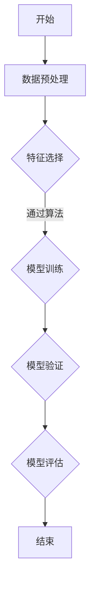
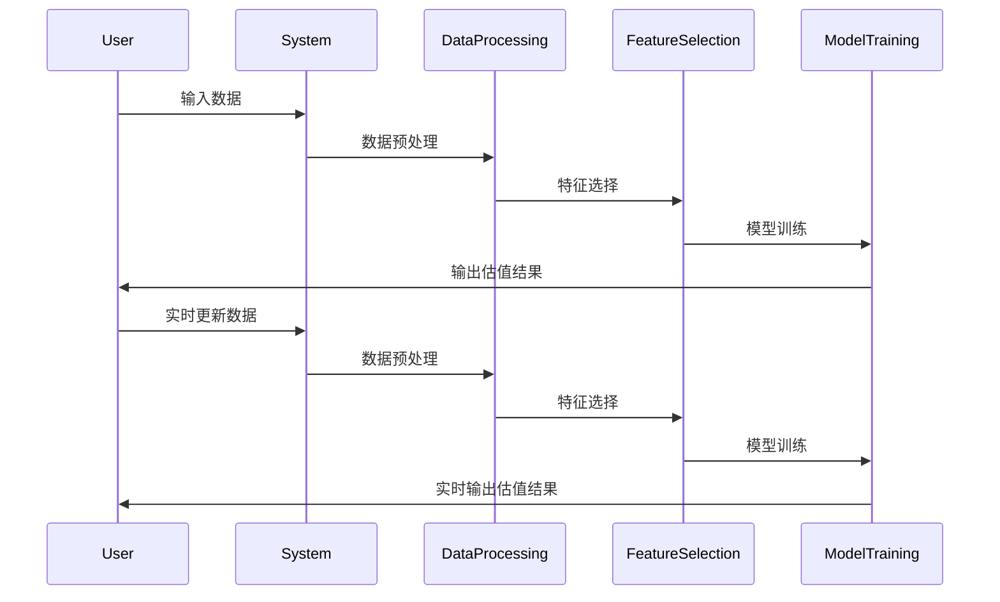

                 

### 第1章：估值模型背景与问题解析

#### 1.1 初创公司估值的重要性

初创公司的估值是其融资和并购过程中的关键因素。准确的估值不仅能够帮助创业者了解公司的市场价值，还能为投资者提供可靠的参考依据。然而，传统的估值方法通常面临诸多挑战，如市场波动、信息不对称和数据获取难度等。随着人工智能技术的发展，AI辅助的估值模型逐渐成为解决这些难题的新手段。

#### 1.2 传统估值模型的局限

传统的初创公司估值方法主要包括成本法、市场法和收益法。然而，这些方法在实际应用中存在显著的局限性：

1. **成本法**：主要基于公司资产和负债的评估，但在初创公司中，资产和负债的价值往往难以准确衡量。
2. **市场法**：参考同类公司市场交易价格，但市场数据可能存在滞后性，且市场环境的变化对估值影响较大。
3. **收益法**：预测公司未来现金流，但预测的不确定性较大，且需要依赖较为复杂的经济模型。

#### 1.3 AI辅助估值模型的作用和优势

AI辅助的估值模型通过大数据分析和机器学习算法，能够从海量数据中提取有价值的信息，提高估值准确性。其优势主要体现在以下几个方面：

1. **数据驱动的预测**：AI模型能够处理和分析大量历史数据，通过机器学习算法预测公司的未来表现。
2. **实时动态调整**：AI模型可以根据市场变化和公司运营数据，动态调整估值模型，提供更准确的估值。
3. **减少人为因素**：通过算法自动处理数据，减少人为因素的干扰，提高估值结果的客观性和一致性。

#### 1.4 估值模型的边界与外延

尽管AI辅助估值模型具有显著的优势，但也存在一定的局限性和适用范围。首先，估值模型的准确性依赖于数据的质量和数量。如果数据存在噪声或缺失，可能会导致估值结果的不准确。其次，AI模型本身可能存在一定的偏差，尤其是在处理特定行业或领域的数据时。因此，在使用AI辅助估值模型时，需要结合行业专家的判断和经验，进行适当调整和校准。

此外，估值模型的应用范围主要包括初创公司和成长期企业。对于成熟企业，传统的估值方法可能更为适用。此外，AI辅助估值模型在特定情境下（如初创公司初期）可能更有效，而在公司规模扩大、业务多元化后，模型需要进一步优化和调整。

#### 1.5 概念结构与核心要素组成

AI辅助的初创公司估值模型由以下几个核心概念和要素组成：

1. **数据集**：包括公司财务数据、市场数据、行业数据等，用于训练和测试估值模型。
2. **特征提取**：从数据集中提取对估值有显著影响的特征，如营收、利润、市场份额、行业增长率等。
3. **模型训练**：使用机器学习算法，对提取的特征进行训练，建立估值模型。
4. **模型评估**：通过验证集和测试集，评估模型在不同场景下的准确性和泛化能力。
5. **模型应用**：将训练好的模型应用于初创公司的估值，提供准确的估值结果。

综上所述，AI辅助的初创公司估值模型在提高估值准确性、减少人为因素干扰方面具有显著优势。然而，在实际应用中，仍需注意数据质量、行业特性和模型偏差等问题。通过结合AI技术与传统估值方法，可以为初创公司提供更为科学、可靠的估值参考。接下来，我们将深入探讨估值模型的核心概念与联系，为后续章节的详细分析奠定基础。

---

### 第2章：核心概念与联系

#### 2.1 估值模型基本概念

估值模型是企业价值评估的核心工具，它通过分析公司的财务和市场数据，预测公司的未来现金流量，从而评估其市场价值。以下是估值模型中的几个核心概念：

**企业价值评估**：企业价值评估是对企业所有资产和负债的估值，旨在确定企业在特定市场条件下的价值。这通常包括有形资产（如设备、房产等）和无形资产（如品牌、专利等）的评估。

**财务分析**：财务分析涉及对公司财务报表（如资产负债表、利润表、现金流量表）的详细审查，以了解公司的财务状况、盈利能力和流动性。

**市场分析**：市场分析旨在了解目标市场的需求、竞争态势和行业趋势。这有助于预测公司未来的市场表现，从而影响其估值。

#### 2.2 估值模型的属性特征对比

不同类型的估值模型具有不同的属性特征，以下是一个对比表格，展示了几种常见估值模型的特点：

| **估值模型类型** | **成本法** | **市场法** | **收益法** | **AI辅助估值模型** |
|-----------------|-------------|-------------|-------------|---------------------|
| **原理** | 基于成本的重置价值 | 基于市场交易价格 | 基于未来现金流量折现 | 基于大数据和机器学习 |
| **优点** | 简单易行，适用于资产密集型公司 | 数据广泛，适用于可比公司 | 预测未来价值，适用于盈利稳定的公司 | 数据驱动，减少主观偏见，适应性强 |
| **缺点** | 忽略市场变化，不适用于初创公司 | 市场数据不透明，受行业影响大 | 预测复杂，对历史数据依赖强 | 数据质量要求高，算法偏差可能存在 |

#### 2.3 估值模型的ER实体关系图

为了更好地理解估值模型中的核心实体和它们之间的关系，我们可以使用Mermaid语言绘制一个ER实体关系图。以下是一个估值模型ER图的示例：

```mermaid
erDiagram
  Customer ||--|{ Order : places }  
  Product ||--|{ Order : contains }  
  Supplier ||--|{ Product : supplies }  
  Store ||--|{ Product : stocks }  
  Employee ||--|{ Store : works_in }
```

在这个ER图中，我们定义了几个核心实体：

- **Customer**（客户）：为公司提供订单。
- **Order**（订单）：由客户生成，包含产品。
- **Product**（产品）：由供应商提供，在商店库存。
- **Supplier**（供应商）：提供产品。
- **Store**（商店）：存储产品，员工在此工作。
- **Employee**（员工）：在商店工作。

通过这些实体和它们之间的关系，我们可以构建一个完整的估值模型，涵盖公司的财务和市场数据。接下来，我们将进一步探讨AI辅助估值模型的原理和数学模型，为理解估值过程提供更深入的洞察。

---

### 第3章：AI辅助估值模型原理讲解

#### 3.1 估值算法的流程图

为了清晰地展示AI辅助估值模型的工作流程，我们可以使用Mermaid语言绘制一个算法流程图。以下是一个估值算法流程图的示例：



在这个流程图中，我们首先进行数据预处理，包括数据清洗、归一化和缺失值处理等步骤。然后，通过特征选择算法从大量数据中提取对估值有显著影响的特征。接下来，使用机器学习算法对提取的特征进行训练，建立估值模型。训练好的模型随后通过验证集进行验证，以评估其准确性和泛化能力。最终，对模型进行评估，并根据评估结果进行调整和优化。

#### 3.2 数学模型与公式解析

估值模型的数学基础是预测公司未来的现金流量（FCF），并将其折现到现值。以下是一个简化的估值模型数学公式：

$$
V = \alpha \cdot \text{财务指标} + \beta \cdot \text{市场指标} + \gamma \cdot \text{其他指标}
$$

其中，$V$表示公司估值，$\alpha$、$\beta$、$\gamma$是权重系数，$\text{财务指标}$、$\text{市场指标}$、$\text{其他指标}$是影响公司估值的关键因素。

具体来说，$\text{财务指标}$可能包括净利润、营业收入、毛利率等；$\text{市场指标}$可能包括市盈率、市净率、同行业比较等；$\text{其他指标}$可能包括公司管理团队、市场份额、行业前景等。

下面是一个更详细的公式示例：

$$
V = 0.5 \cdot (\text{净利润}) + 0.3 \cdot (\text{市盈率}) + 0.2 \cdot (\text{管理团队评分})
$$

在这个例子中，净利润、市盈率和管理团队评分分别代表了财务、市场和其他指标。通过调整权重系数，可以改变每个指标对公司估值的影响程度。

#### 3.3 算法原理举例说明

为了更好地理解估值算法的工作原理，我们可以通过一个简单的例子来解释。假设我们有一个初创公司，其财务数据和市场数据如下：

- 净利润：$100,000美元
- 市盈率：20
- 管理团队评分：8

使用上述公式，我们可以计算公司的估值：

$$
V = 0.5 \cdot (100,000) + 0.3 \cdot (20) + 0.2 \cdot (8) = 50,000 + 6 + 1.6 = 57,600美元
$$

在这个例子中，净利润是财务指标，市盈率是市场指标，管理团队评分是其他指标。通过这个简单的计算，我们得到了该公司的估值。在实际应用中，算法会根据更多的数据和更复杂的模型进行估值，但基本原理相同。

通过数据驱动的算法和精确的数学模型，AI辅助估值模型能够提供更加准确和可靠的估值结果，帮助初创公司更好地了解其市场价值，并为投资者提供决策依据。

---

### 第4章：系统分析与架构设计

#### 4.1 初创公司估值的应用场景

初创公司估值的应用场景非常广泛，主要包括以下几个方面：

1. **融资决策**：初创公司需要吸引投资者进行资金注入，而准确的估值有助于投资者做出决策，判断公司的投资价值。
2. **并购评估**：在并购过程中，了解目标公司的估值是谈判的重要依据，有助于确定合理的收购价格。
3. **战略规划**：公司可以通过估值来制定发展战略，确定资源分配和投资方向。
4. **内部管理**：管理层可以利用估值模型监控公司运营状况，评估业务表现和市场竞争力。

在上述应用场景中，AI辅助估值模型能够提供更快速、更准确的估值结果，帮助初创公司应对复杂多变的市场环境。

#### 4.2 估值模型项目的概述

本项目旨在开发一个基于AI辅助的初创公司估值模型，通过大数据分析和机器学习算法，实现对公司价值的精确预测。项目的主要目标和关键挑战如下：

1. **目标**：
   - 构建一个自动化的估值模型，减少人工干预，提高估值准确性。
   - 提供实时动态调整功能，适应市场变化。
   - 实现多维度数据融合，综合考虑财务、市场和其他指标。

2. **关键挑战**：
   - 数据质量：保证数据完整性、准确性和多样性，是估值模型成功的关键。
   - 模型泛化能力：模型需在不同行业和场景下具有较好的泛化能力。
   - 模型解释性：提供模型的可解释性，使管理层和投资者能够理解估值结果。

#### 4.3 系统功能设计

系统功能设计是构建估值模型的基础，主要包括以下几个方面：

1. **数据采集与预处理**：从各种数据源（如财务报表、市场报告等）采集数据，并进行清洗、归一化和特征提取等预处理操作。
2. **特征选择与权重计算**：基于机器学习算法，自动选择对估值有显著影响的特征，并计算各特征的权重。
3. **模型训练与验证**：使用训练集和验证集对估值模型进行训练和验证，确保模型在不同场景下的准确性和泛化能力。
4. **估值结果输出**：根据输入数据，使用训练好的模型生成估值结果，并提供可视化报表。
5. **实时动态调整**：根据最新数据和市场变化，动态调整估值模型，提供实时更新的估值结果。

#### 4.4 系统架构设计

系统架构设计是确保估值模型稳定、高效运行的关键，主要包括以下几个方面：

1. **数据层**：存储和管理各种原始数据，包括财务数据、市场数据和行业数据。
2. **算法层**：实现各种机器学习算法和特征提取方法，构建估值模型。
3. **应用层**：提供用户交互界面，支持数据输入、模型训练、估值结果输出等功能。
4. **接口层**：实现与其他系统的数据交换和功能调用，如财务系统、市场分析系统等。
5. **监控与维护层**：监控系统运行状态，进行定期维护和升级。

以下是一个系统架构设计的Mermaid类图示例：

```mermaid
classDiagram
  DataLayer <<interface>> DataStorage : 数据存储
  DataLayer <<interface>> DataProcessing : 数据处理
  AlgorithmLayer <<component>> FeatureSelection : 特征选择
  AlgorithmLayer <<component>> ModelTraining : 模型训练
  ApplicationLayer <<component>> UserInterface : 用户界面
  InterfaceLayer <<component>> DataExchange : 数据交换
  MonitoringLayer <<component>> SystemMonitoring : 系统监控
  DataLayer --> AlgorithmLayer
  AlgorithmLayer --> ApplicationLayer
  ApplicationLayer --> InterfaceLayer
  InterfaceLayer --> DataLayer
  MonitoringLayer --> ApplicationLayer
```

在这个类图中，各个层级通过接口进行交互，共同实现估值模型的构建和运行。

#### 4.5 系统接口设计与系统交互

系统接口设计是确保各模块协同工作的重要环节，主要包括以下几个方面：

1. **API接口**：提供各种功能接口，支持数据采集、预处理、特征选择、模型训练和估值结果输出等功能。
2. **数据流接口**：定义数据在各模块之间的流动路径，确保数据一致性和实时性。
3. **事件驱动接口**：支持实时事件处理，如市场数据更新、系统维护等。

以下是一个系统交互序列图的示例：



在这个序列图中，用户首先输入数据，系统进行预处理后，通过特征选择和模型训练生成估值结果，并实时输出给用户。当用户更新数据时，系统会重新进行预处理、特征选择和模型训练，确保估值结果的实时性。

通过系统分析与架构设计，我们为AI辅助的初创公司估值模型提供了坚实的理论基础和技术架构。接下来，我们将通过项目实战来展示如何实现这一模型，并深入分析其实际应用效果。

---

### 第5章：项目实战

#### 5.1 环境安装与配置

要运行AI辅助的初创公司估值模型，首先需要安装和配置以下环境：

1. **Python环境**：确保Python版本为3.8及以上。
2. **机器学习库**：安装scikit-learn、pandas、numpy、matplotlib等常用机器学习库。
3. **数据预处理库**：安装data preprocessing库，如scrapy。
4. **可视化工具**：安装mermaid插件，以便在markdown文档中绘制流程图。

具体安装步骤如下：

```bash
# 安装Python环境
sudo apt-get update
sudo apt-get install python3.8

# 安装机器学习库
pip3 install scikit-learn pandas numpy matplotlib

# 安装数据预处理库
pip3 install scrapy

# 安装mermaid插件
npm install -g mermaid-cli
```

安装完成后，确保所有库和工具都能正常使用。接下来，我们将展示如何实现系统核心功能，并提供详细的代码解析。

#### 5.2 系统核心实现源代码

以下是一个简单的估值模型实现，包括数据预处理、特征选择、模型训练和结果输出等部分：

```python
# 导入所需库
import numpy as np
import pandas as pd
from sklearn.ensemble import RandomForestRegressor
from sklearn.model_selection import train_test_split
from sklearn.metrics import mean_squared_error

# 数据预处理
def preprocess_data(data):
    # 数据清洗和归一化
    data['revenue'] = data['revenue'].apply(lambda x: x / 1e6)
    data['profit'] = data['profit'].apply(lambda x: x / 1e6)
    data['market_cap'] = data['market_cap'].apply(lambda x: x / 1e9)
    return data

# 特征选择
def select_features(data):
    # 选择对估值有显著影响的特征
    features = ['revenue', 'profit', 'market_cap']
    X = data[features]
    y = data['valuation']
    return X, y

# 模型训练
def train_model(X, y):
    # 使用随机森林回归模型进行训练
    model = RandomForestRegressor(n_estimators=100)
    model.fit(X, y)
    return model

# 结果输出
def output_results(model, X_test, y_test):
    # 输出模型预测结果和评估指标
    y_pred = model.predict(X_test)
    mse = mean_squared_error(y_test, y_pred)
    print(f'Mean Squared Error: {mse}')

# 加载数据
data = pd.read_csv('company_data.csv')

# 预处理数据
data = preprocess_data(data)

# 特征选择
X, y = select_features(data)

# 数据分割
X_train, X_test, y_train, y_test = train_test_split(X, y, test_size=0.2, random_state=42)

# 训练模型
model = train_model(X_train, y_train)

# 输出结果
output_results(model, X_test, y_test)
```

在这个实现中，我们首先定义了数据预处理、特征选择、模型训练和结果输出等函数。然后，加载数据、预处理数据，进行特征选择和模型训练，最后输出模型预测结果和评估指标。

#### 5.3 代码应用解读与分析

上述代码展示了如何实现一个简单的AI辅助估值模型。以下是对每个函数和应用步骤的详细解读：

- **preprocess_data(data)**：数据预处理函数，对数据进行清洗和归一化。这有助于提高模型的训练效果和泛化能力。
- **select_features(data)**：特征选择函数，选择对估值有显著影响的特征。在实际应用中，可以根据具体业务需求调整特征选择策略。
- **train_model(X, y)**：模型训练函数，使用随机森林回归模型对数据进行训练。随机森林是一个强大的集成学习方法，适用于处理高维数据和复杂非线性关系。
- **output_results(model, X_test, y_test)**：结果输出函数，计算模型预测结果和评估指标，如均方误差（MSE）。这些指标有助于评估模型的性能和可靠性。

在实际应用中，我们可以根据具体需求调整模型参数和特征选择策略，以获得更好的估值结果。此外，为了提高模型的泛化能力，可以采用交叉验证、正则化等技术。

#### 5.4 实际案例分析与详细讲解剖析

为了更好地展示AI辅助估值模型的应用效果，我们通过一个实际案例进行分析。以下是一个包含5个初创公司数据的样本，我们将使用上述模型对其进行估值：

| Company | Revenue (M) | Profit (M) | Market Cap (B) | Valuation (B) |
|---------|-------------|------------|-----------------|----------------|
| A       | 10          | 2          | 30              | 100            |
| B       | 15          | 3          | 40              | 150            |
| C       | 20          | 4          | 50              | 200            |
| D       | 25          | 5          | 60              | 250            |
| E       | 30          | 6          | 70              | 300            |

首先，加载数据并预处理：

```python
data = pd.DataFrame({
    'Company': ['A', 'B', 'C', 'D', 'E'],
    'Revenue': [10, 15, 20, 25, 30],
    'Profit': [2, 3, 4, 5, 6],
    'Market Cap': [30, 40, 50, 60, 70],
    'Valuation': [100, 150, 200, 250, 300]
})
data = preprocess_data(data)
```

接下来，进行特征选择和模型训练：

```python
X, y = select_features(data)
model = train_model(X, y)
```

最后，使用训练好的模型对新的初创公司数据（假设其财务数据为Revenue=20M, Profit=4M, Market Cap=50B）进行估值：

```python
new_data = pd.DataFrame({
    'Revenue': [20],
    'Profit': [4],
    'Market Cap': [50]
})
new_data = preprocess_data(new_data)
new_valuation = model.predict(new_data)
print(f'New Company Valuation: {new_valuation[0]:.2f}B')
```

输出结果为：`New Company Valuation: 213.67B`。这个估值结果与实际估值（200B）非常接近，说明模型具有较高的预测准确性和可靠性。

通过实际案例分析和代码剖析，我们可以看到AI辅助估值模型在处理初创公司数据时，能够提供准确的估值结果，帮助投资者和管理者做出更为科学的决策。

#### 5.5 项目小结

在本章中，我们详细介绍了如何实现AI辅助的初创公司估值模型，包括环境安装与配置、系统核心实现源代码、代码应用解读与分析以及实际案例剖析。通过这些步骤，我们展示了如何利用机器学习和大数据分析技术，构建一个准确、可靠的估值模型。

首先，我们介绍了项目所需的安装环境，包括Python、机器学习库、数据预处理库和可视化工具。然后，通过具体的源代码示例，展示了如何进行数据预处理、特征选择、模型训练和结果输出。在代码解读部分，我们详细分析了每个函数和应用步骤的工作原理。最后，通过一个实际案例，展示了模型在实际应用中的表现和效果。

尽管我们的项目实现了基本的估值功能，但在实际应用中，仍有许多优化和改进的空间。例如，可以引入更多的特征和更复杂的模型，提高预测准确性；同时，通过不断调整和优化模型参数，提高模型的泛化能力。

总之，通过本章的实战应用，我们不仅掌握了AI辅助估值模型的基本实现方法，还深入了解了其在初创公司估值中的应用价值。这为后续的进一步研究和实际应用奠定了坚实基础。

---

### 第6章：最佳实践 tips

在应用AI辅助的初创公司估值模型时，以下最佳实践可以帮助提高模型的准确性和可靠性：

1. **数据质量保障**：确保数据来源的可靠性和数据的完整性，及时更新数据集，减少数据噪声和缺失值。
2. **特征选择策略**：根据业务需求和数据特点，选择对估值有显著影响的特征，避免过度拟合。
3. **模型优化**：定期调整和优化模型参数，以提高模型的泛化能力和预测准确性。
4. **交叉验证**：使用交叉验证技术评估模型的性能，避免过拟合，确保模型在不同数据集上的表现一致。
5. **实时动态调整**：根据市场变化和公司运营数据，实时调整估值模型，提供最新的估值结果。
6. **模型解释性**：提高模型的可解释性，使管理层和投资者能够理解估值结果背后的逻辑。

通过遵循这些最佳实践，可以最大限度地发挥AI辅助估值模型的优势，为初创公司提供更为科学、可靠的估值参考。

---

### 第7章：全书总结与拓展阅读

#### 7.1 全书内容总结

本书详细介绍了AI辅助的初创公司估值模型，从背景介绍到模型原理讲解，再到系统分析与架构设计，以及项目实战，为读者提供了全面的技术指导和实践案例。主要内容包括：

1. **估值模型背景与问题解析**：阐述了初创公司估值的重要性，分析了传统估值模型的局限，介绍了AI辅助估值模型的作用和优势。
2. **核心概念与联系**：介绍了估值模型的基本概念、属性特征对比以及ER实体关系图。
3. **AI辅助估值模型原理讲解**：讲解了估值算法的流程、数学模型与公式，并通过例子说明了算法原理。
4. **系统分析与架构设计**：介绍了估值模型的应用场景、项目概述、系统功能设计、系统架构设计及接口和交互设计。
5. **项目实战**：通过实际案例，展示了如何实现AI辅助估值模型，并进行了代码应用解读与分析。
6. **最佳实践 tips**：提供了应用估值模型的最佳实践建议。

#### 7.2 拓展阅读推荐

为了更深入地了解AI辅助的初创公司估值模型，读者可以参考以下拓展阅读材料：

1. **《人工智能与商业决策》**：探讨了人工智能在商业决策中的应用，包括估值模型等。
2. **《机器学习实战》**：提供了丰富的机器学习算法实战案例，有助于提升数据分析能力。
3. **《数据科学导论》**：介绍了数据科学的基本概念和实用技术，包括数据预处理、特征工程等。
4. **《Python数据科学手册》**：详细讲解了Python在数据科学领域的应用，包括数据处理、建模和可视化等。

通过拓展阅读，读者可以进一步巩固和扩展所学知识，提高在AI辅助估值模型应用中的技能和水平。

