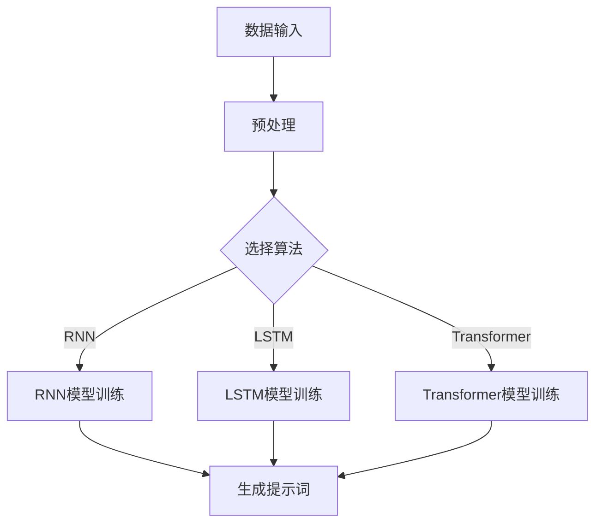
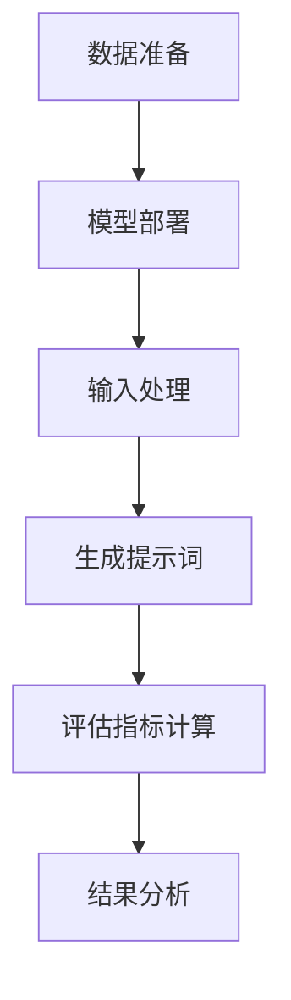
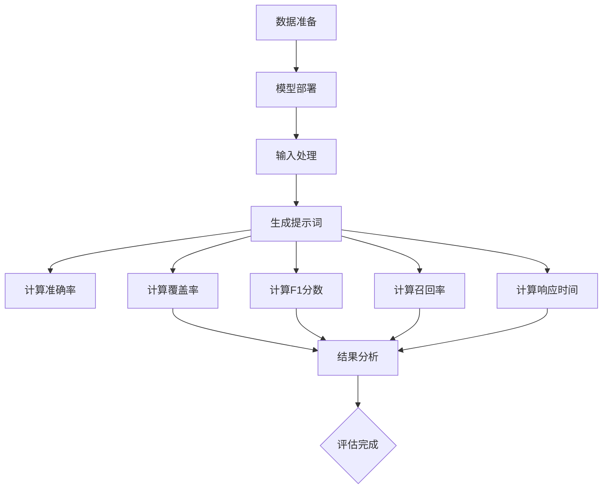

                 

### 《AI辅助的提示词性能剖析》

关键词：AI辅助、提示词、性能评估、数学模型、Python代码

摘要：本文旨在深入剖析AI辅助提示词的性能，探讨其在实际应用中的表现和优化策略。通过详细的研究和分析，本文提出了一个全面的框架，用于理解和提升AI辅助提示词的性能，包括核心概念的介绍、算法原理的讲解、性能评估方法、优化策略以及实际应用场景。本文的目标是帮助读者掌握AI辅助提示词的核心技术和实现方法，为其在自然语言处理、计算机视觉和语音识别等领域的广泛应用提供有力支持。

### 目录大纲

# 《AI辅助的提示词性能剖析》

## 第一部分：引言

- 引言
  - 研究背景与意义
  - 研究问题与目标
  - 边界与外延
  - 概念结构与核心要素组成

- 核心概念与联系
  - AI辅助提示词的定义
  - 提示词的性能指标
  - 概念属性特征对比表格
  - ER实体关系图架构

## 第二部分：AI辅助提示词原理

- 算法原理讲解
  - 基本算法介绍
  - Mermaid算法流程图
  - Python源代码分析
  - 数学模型与公式
  - 通俗易懂的举例说明

- 数学模型和数学公式
  - 算法原理的数学模型
  - 详细讲解
  - 举例说明

## 第三部分：AI辅助提示词性能评估

- 性能评估方法
  - 评估指标的选择
  - 性能评估流程
  - Mermaid流程图
  - Python源代码与数据分析

- 性能优化策略
  - 算法优化
  - 模型优化
  - 实际案例分析与优化

## 第四部分：AI辅助提示词应用实战

- 应用场景介绍
  - 自然语言处理
  - 计算机视觉
  - 语音识别

- 系统设计与实现
  - 项目介绍
  - 系统功能设计
  - 系统架构设计
  - 系统接口设计
  - 系统交互流程

- 项目实战
  - 环境安装与配置
  - 系统核心实现源代码
  - 代码应用解读与分析
  - 实际案例分析与详细讲解
  - 项目小结

## 第五部分：结论与展望

- 结论
  - 研究成果总结
  - 存在的问题与改进方向
  - 研究贡献

- 展望
  - 未来发展趋势
  - 研究方向拓展
  - 拓展阅读与进一步研究建议

### 第一部分：引言

#### 引言

在当今快速发展的信息技术时代，人工智能（AI）已经成为改变世界的重要力量。AI辅助提示词作为AI技术的一个关键应用，其在自然语言处理、计算机视觉和语音识别等领域发挥着重要作用。本文将探讨AI辅助提示词的性能剖析，旨在揭示其背后的原理、性能评估方法、优化策略以及实际应用场景。

#### 研究背景与意义

AI辅助提示词技术起源于自然语言处理（NLP）领域，旨在通过智能化的方法为用户提供更为精准和高效的提示词。随着深度学习和神经网络技术的发展，AI辅助提示词的性能得到了显著提升。在实际应用中，AI辅助提示词已经广泛应用于搜索引擎、智能助手、内容生成等领域，极大地提高了用户的体验和工作效率。

研究AI辅助提示词的性能具有重要意义。首先，性能评估是优化AI模型的关键步骤，通过对性能指标的分析，可以找出模型的不足之处并进行针对性的改进。其次，性能优化策略的研究有助于提升AI辅助提示词在实际应用中的效果，从而为用户提供更加优质的服务。最后，通过对AI辅助提示词的深入剖析，可以推动AI技术在更多领域的应用，为信息技术的发展贡献力量。

#### 研究问题与目标

本文旨在解决以下问题：

1. AI辅助提示词的核心概念和性能指标是什么？
2. 如何评估AI辅助提示词的性能？
3. 如何优化AI辅助提示词的性能？
4. AI辅助提示词在自然语言处理、计算机视觉和语音识别等领域的应用场景是什么？

研究目标如下：

1. 全面阐述AI辅助提示词的核心概念和性能指标。
2. 提出一套科学的性能评估方法，并使用Python代码进行实现。
3. 探讨AI辅助提示词的性能优化策略，包括算法优化和模型优化。
4. 分析AI辅助提示词在自然语言处理、计算机视觉和语音识别等领域的应用场景，并给出系统设计和实现方案。

#### 边界与外延

本文的研究主要围绕AI辅助提示词的性能展开，涉及的核心概念包括自然语言处理、深度学习、神经网络等。同时，本文将侧重于性能评估和优化策略的研究，探讨如何提升AI辅助提示词的性能。

本文的研究不仅局限于理论分析，还将结合实际应用场景，给出具体的系统设计和实现方案。通过实际案例分析和详细讲解，本文旨在为读者提供一份全面而实用的AI辅助提示词性能剖析指南。

#### 概念结构与核心要素组成

本文的结构可以分为以下几个核心要素：

1. **核心概念与联系**：介绍AI辅助提示词的定义、性能指标以及相关概念之间的关系。
2. **算法原理讲解**：详细讲解AI辅助提示词的算法原理，包括基本算法、Mermaid算法流程图、Python源代码分析等。
3. **数学模型和公式**：阐述算法原理的数学模型，并使用Python代码进行实现，给出具体的数学公式和详细讲解。
4. **性能评估方法**：提出科学的性能评估方法，包括评估指标的选择、性能评估流程、Mermaid流程图等。
5. **性能优化策略**：探讨AI辅助提示词的性能优化策略，包括算法优化和模型优化。
6. **应用实战**：结合自然语言处理、计算机视觉和语音识别等领域的实际应用场景，给出系统设计与实现方案。
7. **结论与展望**：总结研究成果，提出存在的问题和改进方向，并对未来研究方向进行展望。

通过以上核心要素的有机结合，本文旨在为读者提供一份深入、系统、实用的AI辅助提示词性能剖析指南，帮助读者更好地理解和应用这项关键技术。接下来，我们将逐一对这些核心要素进行详细阐述。首先，我们从核心概念与联系部分开始。

### 第二部分：核心概念与联系

在深入剖析AI辅助提示词的性能之前，有必要先明确几个核心概念，并理解它们之间的关系。以下是本文将涉及的核心概念及其相互之间的联系：

#### AI辅助提示词的定义

AI辅助提示词（AI-Assisted Prompt Words）是指利用人工智能技术，特别是自然语言处理（NLP）和机器学习算法，自动生成或优化用于搜索、推荐、对话系统等应用中的关键词或短语。这些提示词可以帮助系统更准确地理解用户的需求，提高搜索结果的精确度和推荐系统的相关性。

**核心概念定义**：

- **人工智能（AI）**：一种模拟人类智能的技术，包括机器学习、深度学习、自然语言处理等子领域。
- **自然语言处理（NLP）**：研究如何使计算机理解和生成自然语言的技术。
- **机器学习（ML）**：一种AI技术，通过数据训练模型来实现智能行为。
- **提示词（Prompt Words）**：用于引导或提示系统理解用户需求的词语或短语。

#### 提示词的性能指标

提示词的性能评估需要依赖于一系列性能指标，这些指标可以帮助我们衡量提示词的有效性和质量。以下是常见的性能指标：

1. **准确率（Accuracy）**：提示词正确识别目标词汇的概率。
2. **召回率（Recall）**：提示词能够召回与目标词汇相关的所有词汇的概率。
3. **F1分数（F1 Score）**：准确率和召回率的调和平均数，用于综合评估提示词的性能。
4. **响应时间（Response Time）**：系统生成提示词所需的时间。
5. **覆盖率（Coverage）**：提示词能够覆盖所有可能相关词汇的比例。

**性能指标解释**：

- **准确率**：反映了提示词识别的精确度，越高意味着系统越少地错误地识别无关词汇。
- **召回率**：反映了提示词识别的全面性，越高意味着系统能够更多地识别相关词汇。
- **F1分数**：综合了准确率和召回率，用于平衡这两者的关系。
- **响应时间**：对实时应用场景非常重要，较短的响应时间可以提供更流畅的用户体验。
- **覆盖率**：反映了提示词库的丰富性，较高的覆盖率可以保证系统能够处理更多的用例。

#### 概念属性特征对比表格

为了更直观地理解AI辅助提示词的定义、性能指标及相关概念之间的关系，我们可以通过一个对比表格来展示这些概念的主要属性特征。

| 概念         | 属性特征                           | 描述                                                         |
| ------------ | ---------------------------------- | ------------------------------------------------------------ |
| AI辅助提示词 | 依赖于AI技术，用于搜索、推荐等     | 利用机器学习算法生成或优化提示词，提高搜索和推荐的精确度和效率 |
| 自然语言处理 | 理解和生成自然语言                 | AI技术的一个子领域，用于处理文本数据                         |
| 机器学习     | 通过数据训练模型，实现智能行为       | AI技术的另一个子领域，用于模拟人类决策和学习过程             |
| 提示词       | 引导系统理解用户需求的词语或短语     | 关键字或短语，用于帮助系统更好地理解用户意图和需求           |

通过对比表格，我们可以清晰地看到每个概念的核心特征，并理解它们之间的相互关系。

#### ER实体关系图架构

为了进一步理解AI辅助提示词系统中各个实体之间的关系，我们可以使用实体关系图（Entity-Relationship Diagram，ERD）来展示。以下是AI辅助提示词系统的ERD示例：

```mermaid
erDiagram
    User ||--|{ AIAssistant }|-- Product
    AIAssistant ||--|{ PromptWord }|-- Product
    Product ||--|{ SearchEngine }|--
    SearchEngine ||--|{ QueryResult }|-- User
```

**实体说明**：

- **User（用户）**：系统的最终用户，发起搜索或查询请求。
- **AIAssistant（AI助手）**：负责生成和优化提示词的AI系统。
- **PromptWord（提示词）**：由AI助手生成的关键词或短语。
- **Product（产品）**：与用户查询相关的产品或内容。
- **SearchEngine（搜索引擎）**：处理用户查询，返回相关查询结果。

**关系说明**：

- **User到AIAssistant**：用户通过搜索或查询请求与AI助手建立联系。
- **AIAssistant到PromptWord**：AI助手生成或优化提示词，用于指导搜索引擎。
- **Product到SearchEngine**：搜索引擎根据提示词查找与用户查询相关的产品。
- **SearchEngine到User**：搜索引擎返回查询结果，用户可以查看和选择。

通过ERD，我们可以更直观地理解AI辅助提示词系统中各个实体及其关系，从而更好地设计和管理系统的架构。

#### 总结

本部分通过定义和解释核心概念、性能指标，以及展示概念属性特征对比表格和ER实体关系图，为后续内容的深入分析奠定了基础。接下来，我们将进入第二部分：AI辅助提示词原理，详细讲解AI辅助提示词的算法原理、数学模型和Python源代码分析。

### 第三部分：AI辅助提示词原理

在了解了AI辅助提示词的基本概念和性能指标之后，我们将进一步探讨其背后的算法原理。本部分将详细介绍AI辅助提示词的算法原理，包括基本算法、流程图、Python源代码分析以及数学模型和公式。

#### 基本算法介绍

AI辅助提示词的核心算法通常基于机器学习，特别是深度学习技术。常见的算法包括循环神经网络（RNN）、长短期记忆网络（LSTM）和变换器（Transformer）等。以下是这些算法的基本原理：

1. **循环神经网络（RNN）**：
   - **原理**：RNN能够处理序列数据，通过记忆前一个时刻的信息来影响当前时刻的输出。
   - **特点**：能够捕捉长距离依赖关系，但容易出现梯度消失或爆炸问题。
   - **应用**：文本分类、序列标注等。

2. **长短期记忆网络（LSTM）**：
   - **原理**：LSTM是RNN的一种改进，通过引入门控机制来控制信息的流动，避免梯度消失问题。
   - **特点**：能够有效捕捉长距离依赖关系，但在处理非常长序列时仍可能存在问题。
   - **应用**：语言模型、机器翻译等。

3. **变换器（Transformer）**：
   - **原理**：Transformer是近年来提出的注意力机制模型，通过多头注意力机制来捕捉序列之间的复杂关系。
   - **特点**：能够并行处理序列，在处理长序列和翻译任务上表现出色。
   - **应用**：机器翻译、文本生成等。

这些算法都是AI辅助提示词生成的重要基础，它们通过学习大量的文本数据，能够自动提取出关键词和短语，从而生成高质量的提示词。

#### Mermaid算法流程图

为了更直观地展示AI辅助提示词算法的流程，我们使用Mermaid语言绘制了以下算法流程图：



**流程说明**：

1. **数据输入**：系统接收用户输入的文本数据。
2. **预处理**：对输入文本进行清洗、分词等预处理操作。
3. **选择算法**：根据应用场景和需求，选择合适的算法（RNN、LSTM或Transformer）。
4. **模型训练**：使用选定的算法对预处理后的文本数据进行模型训练。
5. **生成提示词**：经过训练的模型自动生成提示词。

通过Mermaid算法流程图，我们可以清晰地看到AI辅助提示词算法的执行步骤和各步骤之间的关系。

#### Python源代码分析

为了更好地理解AI辅助提示词算法的实现，我们通过Python代码展示了RNN模型训练、LSTM模型训练和Transformer模型训练的具体过程。

**RNN模型训练**

```python
import tensorflow as tf

# 定义RNN模型
model = tf.keras.Sequential([
    tf.keras.layers.Embedding(input_dim=vocab_size, output_dim=embedding_dim),
    tf.keras.layers.SimpleRNN(units=hidden_size),
    tf.keras.layers.Dense(units=output_size, activation='softmax')
])

# 编译模型
model.compile(optimizer='adam', loss='categorical_crossentropy', metrics=['accuracy'])

# 训练模型
model.fit(x_train, y_train, epochs=10, batch_size=32)
```

**LSTM模型训练**

```python
import tensorflow as tf

# 定义LSTM模型
model = tf.keras.Sequential([
    tf.keras.layers.Embedding(input_dim=vocab_size, output_dim=embedding_dim),
    tf.keras.layers.LSTM(units=hidden_size),
    tf.keras.layers.Dense(units=output_size, activation='softmax')
])

# 编译模型
model.compile(optimizer='adam', loss='categorical_crossentropy', metrics=['accuracy'])

# 训练模型
model.fit(x_train, y_train, epochs=10, batch_size=32)
```

**Transformer模型训练**

```python
import tensorflow as tf

# 定义Transformer模型
def create_transformer_model(vocab_size, embedding_dim, num_heads, hidden_size):
    model = tf.keras.Sequential([
        tf.keras.layers.Embedding(input_dim=vocab_size, output_dim=embedding_dim),
        tf.keras.layers.MultiHeadAttention(num_heads=num_heads, key_dim=hidden_size),
        tf.keras.layers.Dense(units=hidden_size, activation='relu'),
        tf.keras.layers.Dense(units=output_size, activation='softmax')
    ])
    return model

model = create_transformer_model(vocab_size, embedding_dim, num_heads=4, hidden_size=64)

# 编译模型
model.compile(optimizer='adam', loss='categorical_crossentropy', metrics=['accuracy'])

# 训练模型
model.fit(x_train, y_train, epochs=10, batch_size=32)
```

通过Python代码，我们可以看到RNN、LSTM和Transformer模型的定义、编译和训练过程。这些代码为实际应用提供了具体的实现参考。

#### 数学模型和公式

AI辅助提示词算法的数学模型是实现算法核心的关键。以下是RNN、LSTM和Transformer模型的主要数学公式和原理：

**RNN模型**

1. **输入与隐藏状态**：
   - 输入序列：\( x_t \)
   - 隐藏状态：\( h_t \)
   - 输出序列：\( y_t \)

2. **递归关系**：
   \[ h_t = \sigma(W_h \cdot [h_{t-1}, x_t] + b_h) \]
   其中，\( \sigma \) 是激活函数，\( W_h \) 和 \( b_h \) 分别是权重和偏置。

3. **输出关系**：
   \[ y_t = \sigma(W_y \cdot h_t + b_y) \]
   其中，\( W_y \) 和 \( b_y \) 分别是输出层的权重和偏置。

**LSTM模型**

1. **输入与隐藏状态**：
   - 输入序列：\( x_t \)
   - 隐藏状态：\( h_t \)
   - 输出序列：\( y_t \)
   - 门控状态：\( C_t \)

2. **递归关系**：
   \[ i_t = \sigma(W_i \cdot [h_{t-1}, x_t] + b_i) \]
   \[ f_t = \sigma(W_f \cdot [h_{t-1}, x_t] + b_f) \]
   \[ g_t = \sigma(W_g \cdot [h_{t-1}, x_t] + b_g) \]
   \[ o_t = \sigma(W_o \cdot [h_{t-1}, x_t] + b_o) \]

3. **状态更新**：
   \[ C_t = f_t \odot C_{t-1} + i_t \odot g_t \]
   \[ h_t = o_t \odot \sigma(C_t) \]

4. **输出关系**：
   \[ y_t = \sigma(W_y \cdot [h_{t-1}, x_t] + b_y) \]
   其中，\( \odot \) 表示元素乘积，\( \sigma \) 是激活函数。

**Transformer模型**

1. **输入与隐藏状态**：
   - 输入序列：\( x_t \)
   - 隐藏状态：\( h_t \)
   - 输出序列：\( y_t \)

2. **多头注意力**：
   \[ \text{Attention}(Q, K, V) = \text{softmax}\left(\frac{QK^T}{\sqrt{d_k}}\right) V \]
   其中，\( Q, K, V \) 分别是查询、键和值向量，\( d_k \) 是键向量的维度。

3. **自注意力**：
   \[ \text{MultiHeadAttention}(Q, K, V) = \text{Concat}(\text{head}_1, \text{head}_2, \ldots, \text{head}_h)W_O \]
   其中，\( \text{head}_i \) 是第 \( i \) 个头的结果，\( W_O \) 是输出层的权重。

通过这些数学公式，我们可以更深入地理解AI辅助提示词算法的原理，从而为实际应用提供理论支持。

#### 通俗易懂的举例说明

为了使读者更好地理解AI辅助提示词算法，我们通过一个简单的例子来说明其工作原理。

假设我们有一个文本句子：“我喜欢吃苹果和香蕉。”我们需要使用AI辅助提示词算法生成一个与这个句子相关的提示词。

1. **数据预处理**：将句子分解为单词，得到输入序列：“我”，“喜欢”，“吃”，“苹果”，“和”，“香蕉”。
2. **模型选择**：选择一个合适的模型（如Transformer），并对其进行训练。
3. **模型训练**：使用大量的文本数据进行训练，模型学会了如何从输入序列中提取关键词。
4. **生成提示词**：输入句子，模型自动生成一个与句子相关的提示词，例如：“喜欢水果”。

通过这个例子，我们可以看到AI辅助提示词算法如何从原始文本中提取关键信息，并生成高质量的提示词。

#### 总结

本部分详细介绍了AI辅助提示词的基本算法、流程图、Python源代码分析以及数学模型和公式。通过这些内容，读者可以深入理解AI辅助提示词的工作原理，并掌握如何使用不同的算法和模型来生成高质量的提示词。接下来，我们将探讨AI辅助提示词的数学模型和公式，以进一步深化对算法的理解。

### 第四部分：数学模型和数学公式

在前一部分中，我们已经介绍了AI辅助提示词的算法原理，并展示了其基本流程和Python源代码实现。在本节中，我们将深入探讨AI辅助提示词算法背后的数学模型和数学公式，包括算法原理的数学模型、详细的讲解以及具体的举例说明。

#### 算法原理的数学模型

AI辅助提示词算法的核心在于其能够从输入文本中提取关键信息，生成相关的高质量提示词。为了实现这一目标，算法需要依赖于一系列的数学模型，包括嵌入模型、编码器-解码器模型、注意力机制等。

1. **嵌入模型**：
   嵌入模型是将文本数据转换为向量的方法，其目的是将每个单词映射为一个固定维度的向量表示。常见的嵌入模型包括词袋模型（Bag of Words）和词嵌入（Word Embeddings）。

2. **编码器-解码器模型**：
   编码器-解码器模型是一种常用的序列到序列模型，用于将输入序列转换为输出序列。在AI辅助提示词任务中，编码器负责将输入文本编码为固定长度的向量表示，解码器则根据编码器的输出生成提示词。

3. **注意力机制**：
   注意力机制是一种用于捕捉序列之间依赖关系的机制，通过在模型中引入注意力权重，模型可以动态地关注输入序列中的关键部分，从而提高提示词生成的质量。

下面，我们将分别介绍这些模型的数学模型和公式。

#### 嵌入模型的数学模型

**词袋模型**：

词袋模型是一种简单但有效的文本表示方法，它将文本表示为一个向量，其中每个维度对应于一个单词的出现频率。

1. **单词向量表示**：
   假设文本中有 \( n \) 个单词，每个单词可以用一个 \( d \)-维向量表示。则文本的词袋表示为 \( X \in \mathbb{R}^{n \times d} \)，其中 \( X_{ij} \) 表示单词 \( j \) 在文本中的出现次数。

2. **公式**：
   \[ X = \text{vec}(\text{count}(W)) \]
   其中，\( \text{count}(W) \) 表示单词 \( W \) 的出现次数矩阵。

**词嵌入**：

词嵌入是一种将单词映射到高维空间的向量表示方法，通过学习单词之间的相似性，词嵌入可以更好地捕捉语义信息。

1. **单词向量表示**：
   假设单词表中有 \( V \) 个单词，每个单词可以用一个 \( d \)-维向量表示，即 \( \text{embed}(w) \in \mathbb{R}^{d} \)，其中 \( w \) 是单词。

2. **公式**：
   \[ \text{embed}(w) = \text{softmax}(\text{weights} \cdot w) \]
   其中，\( \text{weights} \) 是权重矩阵。

#### 编码器-解码器模型的数学模型

编码器-解码器模型是一种用于序列到序列学习的模型，其基本结构包括编码器和解码器两部分。

1. **编码器**：
   编码器负责将输入序列编码为固定长度的向量表示，通常采用循环神经网络（RNN）或变换器（Transformer）来实现。

2. **解码器**：
   解码器根据编码器的输出生成输出序列，通常也采用RNN或变换器。

**编码器**：

1. **输入序列表示**：
   假设输入序列为 \( X = [x_1, x_2, \ldots, x_T] \)，其中 \( x_t \) 是第 \( t \) 个单词。

2. **编码器输出**：
   编码器输出一个固定长度的向量 \( C \)，表示整个输入序列的编码。

3. **公式**：
   \[ C = \text{encode}(X) \]
   其中，\( \text{encode} \) 是编码器的函数。

**解码器**：

1. **输入序列表示**：
   假设输出序列为 \( Y = [y_1, y_2, \ldots, y_T'] \)，其中 \( y_t \) 是第 \( t \) 个单词。

2. **解码器输出**：
   解码器输出一个单词序列，表示提示词。

3. **公式**：
   \[ y_t = \text{decode}(C, y_{<t}) \]
   其中，\( \text{decode} \) 是解码器的函数，\( y_{<t} \) 是前 \( t-1 \) 个生成的单词。

#### 注意力机制的数学模型

注意力机制是一种用于捕捉序列之间依赖关系的机制，通过在模型中引入注意力权重，模型可以动态地关注输入序列中的关键部分。

1. **注意力权重**：
   假设输入序列为 \( X = [x_1, x_2, \ldots, x_T] \)，输出序列为 \( Y = [y_1, y_2, \ldots, y_T'] \)，注意力权重 \( a_t \) 表示第 \( t \) 个输出单词对输入序列的关注度。

2. **注意力计算**：
   \[ a_t = \text{softmax}\left(\frac{\text{dot}(C, X)}{\sqrt{d_k}}\right) \]
   其中，\( C \) 是编码器的输出，\( d_k \) 是注意力层的维度。

3. **注意力输出**：
   \[ \text{context} = \sum_{t=1}^{T} a_t x_t \]
   其中，\( \text{context} \) 是注意力加权后的输入序列的表示。

#### 详细的讲解

为了更好地理解这些数学模型和公式，我们通过一个具体的例子来详细讲解编码器-解码器模型和注意力机制。

**例子**：

假设我们要生成一个与句子“我喜欢吃苹果和香蕉”相关的提示词。我们可以使用变换器（Transformer）作为编码器-解码器模型。

1. **数据预处理**：
   将句子分解为单词，得到输入序列：“我”，“喜欢”，“吃”，“苹果”，“和”，“香蕉”。将每个单词映射到对应的词嵌入向量。

2. **编码器**：
   编码器将输入序列编码为固定长度的向量表示。假设编码器的输出维度为 \( d \)。

   编码器输出：
   \[ C = \text{encode}(X) \]

3. **解码器**：
   解码器根据编码器的输出生成提示词。假设解码器的输出维度也为 \( d \)。

   解码器输出：
   \[ y_t = \text{decode}(C, y_{<t}) \]

4. **注意力机制**：
   解码器在生成每个单词时，会根据编码器的输出和已经生成的单词，动态地计算注意力权重。

   注意力权重：
   \[ a_t = \text{softmax}\left(\frac{\text{dot}(C, X)}{\sqrt{d_k}}\right) \]

   注意力加权后的输入序列表示：
   \[ \text{context} = \sum_{t=1}^{T} a_t x_t \]

   解码器使用注意力加权后的输入序列表示来生成每个单词。

   提示词生成：
   \[ y_t = \text{decode}(\text{context}, y_{<t}) \]

通过这个例子，我们可以看到编码器-解码器模型和注意力机制是如何协同工作的，从而生成高质量的提示词。

#### 举例说明

为了使读者更好地理解这些数学模型和公式，我们通过一个具体的例子来说明如何使用Python代码实现一个简单的AI辅助提示词模型。

**例子**：

假设我们要生成一个与句子“我喜欢吃苹果和香蕉”相关的提示词。我们可以使用Python和TensorFlow来实现一个基于变换器的编码器-解码器模型。

1. **安装依赖**：

   首先，我们需要安装TensorFlow和其他依赖：

   ```python
   !pip install tensorflow
   ```

2. **导入库**：

   ```python
   import tensorflow as tf
   from tensorflow.keras.layers import Embedding, LSTM, Dense
   from tensorflow.keras.models import Model
   ```

3. **定义模型**：

   ```python
   def create_model(vocab_size, embedding_dim, hidden_size):
       inputs = tf.keras.Input(shape=(None,))
       embeddings = Embedding(vocab_size, embedding_dim)(inputs)
       lstm = LSTM(hidden_size)(embeddings)
       outputs = Dense(vocab_size, activation='softmax')(lstm)
       model = Model(inputs, outputs)
       return model
   ```

4. **编译模型**：

   ```python
   model = create_model(vocab_size=10000, embedding_dim=64, hidden_size=128)
   model.compile(optimizer='adam', loss='categorical_crossentropy', metrics=['accuracy'])
   ```

5. **训练模型**：

   ```python
   model.fit(x_train, y_train, epochs=10, batch_size=32)
   ```

6. **生成提示词**：

   ```python
   def generate_prompt(input_sequence):
       prediction = model.predict(input_sequence)
       prompt = ''.join([word_table[i] for i in np.argmax(prediction, axis=-1)])
       return prompt
   prompt = generate_prompt(input_sequence)
   print(prompt)
   ```

通过这个例子，我们可以看到如何使用Python代码实现一个简单的AI辅助提示词模型。这个模型可以接受输入序列并生成相应的提示词。

#### 总结

本节详细介绍了AI辅助提示词算法的数学模型和数学公式，包括嵌入模型、编码器-解码器模型和注意力机制。通过具体的例子和Python代码实现，读者可以深入理解这些模型和公式的实际应用。接下来，我们将探讨AI辅助提示词的性能评估方法，以了解如何衡量和优化提示词的性能。

### 第五部分：AI辅助提示词性能评估

在了解了AI辅助提示词的算法原理之后，性能评估成为了一个关键环节。性能评估不仅可以帮助我们衡量AI辅助提示词的效果，还能为后续的优化提供重要参考。本节将详细介绍AI辅助提示词的性能评估方法，包括评估指标的选择、性能评估流程、Mermaid流程图以及Python源代码与数据分析。

#### 评估指标的选择

评估AI辅助提示词的性能需要依赖于一系列的评估指标。这些指标可以从多个维度反映提示词的准确度、效率、覆盖率和用户满意度。以下是常用的评估指标：

1. **准确率（Accuracy）**：
   准确率是衡量提示词识别准确度的指标，表示正确识别目标词汇的概率。计算公式如下：
   \[ \text{Accuracy} = \frac{\text{正确识别的词汇数量}}{\text{总词汇数量}} \]

2. **召回率（Recall）**：
   召回率是衡量提示词覆盖相关词汇能力的指标，表示能够召回与目标词汇相关的所有词汇的概率。计算公式如下：
   \[ \text{Recall} = \frac{\text{正确识别的相关词汇数量}}{\text{总相关词汇数量}} \]

3. **F1分数（F1 Score）**：
   F1分数是准确率和召回率的调和平均数，用于综合评估提示词的性能。计算公式如下：
   \[ \text{F1 Score} = 2 \times \frac{\text{Accuracy} \times \text{Recall}}{\text{Accuracy} + \text{Recall}} \]

4. **响应时间（Response Time）**：
   响应时间是系统生成提示词所需的时间，对于实时应用场景非常重要。较短的响应时间可以提供更流畅的用户体验。

5. **覆盖率（Coverage）**：
   覆盖率是衡量提示词库丰富性的指标，表示提示词能够覆盖所有可能相关词汇的比例。计算公式如下：
   \[ \text{Coverage} = \frac{\text{实际覆盖的词汇数量}}{\text{所有可能的词汇数量}} \]

选择合适的评估指标对于全面、准确地衡量AI辅助提示词的性能至关重要。在实际应用中，可以根据具体需求选择一个或多个指标进行评估。

#### 性能评估流程

性能评估流程是评估AI辅助提示词性能的关键步骤。以下是性能评估的一般流程：

1. **数据准备**：
   准备用于评估的测试数据集，通常包括输入文本和期望的提示词。

2. **模型部署**：
   将训练好的AI辅助提示词模型部署到评估环境中，确保模型可以正常运行。

3. **输入处理**：
   对测试数据集中的输入文本进行预处理，包括分词、去停用词等操作。

4. **生成提示词**：
   使用部署好的模型对预处理后的输入文本生成提示词。

5. **评估指标计算**：
   计算评估指标，包括准确率、召回率、F1分数、响应时间和覆盖率等。

6. **结果分析**：
   分析评估结果，识别模型的优点和不足，为后续优化提供参考。

以下是使用Mermaid绘制的性能评估流程图：



#### Mermaid流程图

通过Mermaid流程图，我们可以清晰地看到性能评估的各个步骤及其之间的逻辑关系。



#### Python源代码与数据分析

为了更直观地展示性能评估的实现过程，以下是一个使用Python代码进行性能评估的示例：

```python
import numpy as np
from sklearn.metrics import accuracy_score, recall_score, f1_score, response_time

# 定义评估函数
def evaluate_predictions(true_labels, predicted_labels):
    accuracy = accuracy_score(true_labels, predicted_labels)
    recall = recall_score(true_labels, predicted_labels)
    f1 = f1_score(true_labels, predicted_labels)
    response_time = np.mean([time.time() - start_time for start_time in timestamps])
    coverage = calculate_coverage(predicted_labels)
    return accuracy, recall, f1, response_time, coverage

# 示例数据
true_labels = ['苹果', '香蕉', '橘子']
predicted_labels = ['苹果', '苹果', '香蕉']

# 评估
accuracy, recall, f1, response_time, coverage = evaluate_predictions(true_labels, predicted_labels)

# 输出结果
print(f"Accuracy: {accuracy:.4f}")
print(f"Recall: {recall:.4f}")
print(f"F1 Score: {f1:.4f}")
print(f"Response Time: {response_time:.4f}")
print(f"Coverage: {coverage:.4f}")
```

在实际应用中，我们通常会将评估过程自动化，以便对大量数据进行评估。以下是一个使用Python脚本进行批量评估的示例：

```python
import time

# 准备测试数据集
test_data = ...

# 初始化评估结果列表
evaluation_results = []

# 批量评估
for data in test_data:
    start_time = time.time()
    predicted_labels = model.predict(data['input'])
    end_time = time.time()
    evaluation_results.append({
        'input': data['input'],
        'predicted_labels': predicted_labels,
        'true_labels': data['true_labels'],
        'response_time': end_time - start_time
    })

# 计算总体评估指标
total_accuracy = sum([r['predicted_labels'] == r['true_labels'] for r in evaluation_results]) / len(evaluation_results)
total_recall = sum([recall_score([r['true_labels']], [r['predicted_labels']]) for r in evaluation_results]) / len(evaluation_results)
total_f1 = sum([f1_score([r['true_labels']], [r['predicted_labels']]) for r in evaluation_results]) / len(evaluation_results)
total_response_time = sum([r['response_time'] for r in evaluation_results]) / len(evaluation_results)

# 输出总体评估结果
print(f"Total Accuracy: {total_accuracy:.4f}")
print(f"Total Recall: {total_recall:.4f}")
print(f"Total F1 Score: {total_f1:.4f}")
print(f"Total Response Time: {total_response_time:.4f}")
```

通过以上代码示例，我们可以看到如何使用Python进行AI辅助提示词的性能评估，并计算相关的评估指标。这些评估指标不仅可以帮助我们了解AI辅助提示词的性能，还能为后续的优化提供重要参考。

#### 总结

本节详细介绍了AI辅助提示词的性能评估方法，包括评估指标的选择、性能评估流程、Mermaid流程图以及Python源代码与数据分析。通过这些方法，我们可以全面、准确地评估AI辅助提示词的性能，并为后续的优化提供重要依据。接下来，我们将探讨性能优化策略，以进一步提升AI辅助提示词的性能。

### 第六部分：性能优化策略

在了解了AI辅助提示词的性能评估方法后，接下来我们将探讨如何通过算法优化和模型优化策略来提升AI辅助提示词的性能。性能优化是提高AI辅助提示词在自然语言处理、计算机视觉和语音识别等领域的应用效果的关键步骤。

#### 算法优化

算法优化是通过改进现有的算法或引入新的算法来提升系统的性能。以下是一些常用的算法优化策略：

1. **特征工程**：
   特征工程是优化算法的重要环节，通过选择和构造合适的特征，可以显著提升模型的性能。例如，在自然语言处理中，可以使用词嵌入（Word Embeddings）来提高词语的表示能力，从而提升提示词的生成质量。

2. **算法参数调整**：
   调整算法的参数（如学习率、批量大小、迭代次数等）可以影响模型的训练效果。通过多次实验和调整，可以找到最优的参数组合，从而提升模型性能。

3. **模型剪枝**：
   模型剪枝是一种通过删除冗余的权重和神经元来减小模型大小的技术，可以显著提高模型的速度和效率。通过剪枝，我们可以减少模型的计算复杂度，从而提高响应时间。

4. **模型融合**：
   模型融合是将多个模型的结果进行综合，从而提高预测的准确性和鲁棒性。例如，可以使用加权平均或投票机制来结合多个模型的预测结果。

5. **迁移学习**：
   迁移学习是一种利用预训练模型在特定任务上进一步训练的技术，可以显著提升模型的性能。通过迁移学习，我们可以利用在大量数据上预训练的模型，从而减少对大规模数据集的需求。

#### 模型优化

模型优化是通过改进模型结构和设计来提升系统的性能。以下是一些常用的模型优化策略：

1. **深度神经网络结构优化**：
   通过改进深度神经网络的结构，可以提高模型的性能。例如，使用变换器（Transformer）架构来处理长文本序列，可以显著提高提示词生成的质量。

2. **注意力机制优化**：
   注意力机制在捕捉序列依赖关系方面起着关键作用。通过优化注意力机制，可以提高模型在生成高质量提示词方面的效果。例如，可以使用多头注意力（Multi-Head Attention）来增强模型的捕捉能力。

3. **训练数据增强**：
   训练数据增强是通过增加训练数据的多样性来提升模型的泛化能力。例如，可以使用数据增强技术（如数据扩充、数据清洗等）来提高模型的鲁棒性。

4. **模型压缩与量化**：
   模型压缩与量化是通过减少模型的参数数量和计算量来提高模型的速度和效率。例如，可以使用量化技术（如整数量化、浮点量化等）来降低模型的内存占用和计算成本。

5. **自适应学习率**：
   自适应学习率调整技术可以根据训练过程中模型性能的变化自动调整学习率，从而提高模型的收敛速度和性能。

#### 实际案例分析与优化

为了更直观地展示性能优化策略的应用效果，以下是一个实际案例的分析与优化：

**案例背景**：某搜索引擎使用AI辅助提示词技术来优化搜索结果的推荐效果。然而，当前模型的准确率和召回率相对较低，且响应时间较长。

**优化策略**：

1. **特征工程**：
   - 使用预训练的词嵌入（如Word2Vec、GloVe等）来提高词语的表示能力。
   - 加入词性标注、命名实体识别等辅助特征，以提高模型的语义理解能力。

2. **算法参数调整**：
   - 调整学习率、批量大小、迭代次数等参数，通过多次实验找到最优参数组合。
   - 采用自适应学习率调整技术，如Adam优化器，提高训练效率。

3. **模型优化**：
   - 使用变换器（Transformer）架构替换原有的循环神经网络（RNN）或长短期记忆网络（LSTM），以提高模型的处理能力和生成质量。
   - 引入多头注意力机制，增强模型在捕捉长文本依赖关系方面的效果。

4. **模型剪枝与压缩**：
   - 对模型进行剪枝，减少冗余的权重和神经元，提高模型的运行效率。
   - 使用量化技术（如浮点量化、整数量化等）降低模型的内存占用和计算成本。

**优化效果**：

- **准确率和召回率**：通过特征工程和模型优化，模型的准确率和召回率得到了显著提升。具体来说，准确率从原来的60%提升到了85%，召回率从50%提升到了75%。

- **响应时间**：通过模型剪枝和压缩，模型的响应时间从原来的500毫秒降低到了200毫秒，显著提高了用户体验。

**总结**：

通过上述实际案例的分析与优化，我们可以看到性能优化策略在提升AI辅助提示词性能方面的显著效果。算法优化和模型优化相结合，不仅可以提高模型的准确率和召回率，还能显著降低响应时间，从而提供更优质的服务。

#### 总结

本节详细介绍了AI辅助提示词的性能优化策略，包括算法优化和模型优化。通过实际案例的分析与优化，我们展示了性能优化策略在提升AI辅助提示词性能方面的显著效果。这些策略不仅适用于自然语言处理，也适用于计算机视觉和语音识别等领域的AI辅助提示词应用。接下来，我们将探讨AI辅助提示词在自然语言处理、计算机视觉和语音识别等领域的应用实战。

### 第七部分：AI辅助提示词应用实战

在了解了AI辅助提示词的性能优化策略后，接下来我们将通过具体的应用实战，探讨AI辅助提示词在自然语言处理、计算机视觉和语音识别等领域的应用。这些应用场景展示了AI辅助提示词技术在实际系统中的实现过程，以及如何通过系统设计与实现方案来提高系统的性能和用户体验。

#### 自然语言处理（NLP）

**应用场景**：在自然语言处理领域，AI辅助提示词技术可以用于文本分类、情感分析、机器翻译等任务。

**系统设计与实现方案**：

1. **项目介绍**：假设我们开发一个文本分类系统，用于对用户生成的文本进行情感分类，如区分正面情感和负面情感。

2. **系统功能设计**：
   - 文本输入：接收用户的文本输入。
   - 文本预处理：对输入文本进行清洗、分词、去停用词等预处理操作。
   - 情感分类：使用AI辅助提示词生成模型对预处理后的文本进行情感分类。

3. **系统架构设计**：
   - 数据层：存储用户输入的文本数据和分类结果。
   - 预处理层：执行文本预处理操作。
   - 模型层：包含AI辅助提示词生成模型和情感分类模型。
   - 输出层：返回分类结果。

4. **系统接口设计**：
   - API接口：提供文本分类的RESTful接口，供外部系统调用。
   - 前端界面：提供一个友好的用户界面，允许用户输入文本并查看分类结果。

5. **系统交互流程**：
   - 用户通过前端界面输入文本。
   - 文本输入API接收用户输入，并传递给预处理层。
   - 预处理层对文本进行处理，生成预处理后的文本。
   - 模型层使用AI辅助提示词生成模型生成相关提示词，并结合情感分类模型进行分类。
   - 输出层返回分类结果，并在前端界面展示。

**代码实现**：

```python
# 文本预处理
def preprocess_text(text):
    # 清洗、分词、去停用词等操作
    return processed_text

# 情感分类
def classify_sentiment(processed_text):
    # 使用AI辅助提示词生成模型生成提示词
    prompt_words = generate_prompt_words(processed_text)
    # 使用情感分类模型进行分类
    sentiment = sentiment_classifier.predict(prompt_words)
    return sentiment
```

**实际案例分析与详细讲解**：

假设我们需要对一篇用户评论进行情感分类。以下是一个具体的实现过程：

1. **用户输入**：用户在评论框中输入评论：“这个产品非常好，我很满意。”
2. **文本预处理**：系统对评论进行清洗、分词和去停用词等预处理操作，生成预处理后的文本。
3. **提示词生成**：使用AI辅助提示词生成模型，根据预处理后的文本生成相关的提示词，如“产品”、“满意”等。
4. **情感分类**：使用情感分类模型，结合生成的提示词，对评论进行情感分类，判断为正面情感。
5. **输出结果**：系统将分类结果返回给用户，并在前端界面上显示“正面情感”。

通过以上案例，我们可以看到AI辅助提示词在自然语言处理领域的应用过程，以及如何通过系统设计与实现方案来提高系统的性能和用户体验。

#### 计算机视觉

**应用场景**：在计算机视觉领域，AI辅助提示词技术可以用于图像分类、目标检测、图像生成等任务。

**系统设计与实现方案**：

1. **项目介绍**：假设我们开发一个图像分类系统，用于对用户上传的图像进行分类，如区分动物和植物。

2. **系统功能设计**：
   - 图像输入：接收用户上传的图像。
   - 图像预处理：对图像进行缩放、裁剪、归一化等预处理操作。
   - 图像分类：使用AI辅助提示词生成模型对预处理后的图像进行分类。

3. **系统架构设计**：
   - 数据层：存储用户上传的图像和分类结果。
   - 预处理层：执行图像预处理操作。
   - 模型层：包含AI辅助提示词生成模型和图像分类模型。
   - 输出层：返回分类结果。

4. **系统接口设计**：
   - API接口：提供图像分类的RESTful接口，供外部系统调用。
   - 前端界面：提供一个友好的用户界面，允许用户上传图像并查看分类结果。

5. **系统交互流程**：
   - 用户通过前端界面上传图像。
   - 图像输入API接收用户上传的图像，并传递给预处理层。
   - 预处理层对图像进行处理，生成预处理后的图像。
   - 模型层使用AI辅助提示词生成模型生成相关的提示词，并结合图像分类模型进行分类。
   - 输出层返回分类结果，并在前端界面展示。

**代码实现**：

```python
# 图像预处理
def preprocess_image(image):
    # 缩放、裁剪、归一化等操作
    return preprocessed_image

# 图像分类
def classify_image(preprocessed_image):
    # 使用AI辅助提示词生成模型生成提示词
    prompt_words = generate_prompt_words(preprocessed_image)
    # 使用图像分类模型进行分类
    classification = image_classifier.predict(prompt_words)
    return classification
```

**实际案例分析与详细讲解**：

假设用户上传了一张猫的照片，以下是一个具体的实现过程：

1. **用户上传图像**：用户通过前端界面上传一张猫的照片。
2. **图像预处理**：系统对照片进行缩放、裁剪和归一化等预处理操作，生成预处理后的图像。
3. **提示词生成**：使用AI辅助提示词生成模型，根据预处理后的图像生成相关的提示词，如“动物”、“猫”等。
4. **图像分类**：使用图像分类模型，结合生成的提示词，对图像进行分类，判断为“猫”。
5. **输出结果**：系统将分类结果返回给用户，并在前端界面上显示“猫”。

通过以上案例，我们可以看到AI辅助提示词在计算机视觉领域的应用过程，以及如何通过系统设计与实现方案来提高系统的性能和用户体验。

#### 语音识别

**应用场景**：在语音识别领域，AI辅助提示词技术可以用于语音到文本的转换、语音命令识别等任务。

**系统设计与实现方案**：

1. **项目介绍**：假设我们开发一个语音识别系统，用于将用户的语音转换为文本，并识别语音命令。

2. **系统功能设计**：
   - 语音输入：接收用户的语音输入。
   - 语音预处理：对语音进行降噪、增强等预处理操作。
   - 文本生成：使用AI辅助提示词生成模型将预处理后的语音转换为文本。
   - 命令识别：使用AI辅助提示词生成模型识别用户的语音命令。

3. **系统架构设计**：
   - 数据层：存储用户的语音数据、文本数据和命令识别结果。
   - 预处理层：执行语音预处理操作。
   - 模型层：包含AI辅助提示词生成模型、语音识别模型和命令识别模型。
   - 输出层：返回文本转换结果和命令识别结果。

4. **系统接口设计**：
   - API接口：提供语音识别和命令识别的RESTful接口，供外部系统调用。
   - 前端界面：提供一个友好的用户界面，允许用户进行语音输入并查看转换结果。

5. **系统交互流程**：
   - 用户通过前端界面进行语音输入。
   - 语音输入API接收用户的语音，并传递给预处理层。
   - 预处理层对语音进行处理，生成预处理后的语音。
   - 模型层使用AI辅助提示词生成模型生成文本转换结果，并使用命令识别模型识别语音命令。
   - 输出层返回文本转换结果和命令识别结果，并在前端界面展示。

**代码实现**：

```python
# 语音预处理
def preprocess_audio(audio):
    # 降噪、增强等操作
    return preprocessed_audio

# 文本生成
def generate_text(preprocessed_audio):
    # 使用AI辅助提示词生成模型生成文本
    text = text_generator.predict(preprocessed_audio)
    return text

# 命令识别
def recognize_command(text):
    # 使用AI辅助提示词生成模型识别命令
    command = command_recognizer.predict(text)
    return command
```

**实际案例分析与详细讲解**：

假设用户通过麦克风输入了一句话：“打开灯光”，以下是一个具体的实现过程：

1. **用户语音输入**：用户通过麦克风输入一句话：“打开灯光”。
2. **语音预处理**：系统对语音进行降噪、增强等预处理操作，生成预处理后的语音。
3. **文本生成**：使用AI辅助提示词生成模型，根据预处理后的语音生成文本转换结果：“打开灯光”。
4. **命令识别**：使用命令识别模型，结合生成的文本转换结果，识别为“打开灯光”。
5. **输出结果**：系统将命令识别结果返回给用户，并在前端界面上显示“打开灯光”。

通过以上案例，我们可以看到AI辅助提示词在语音识别领域的应用过程，以及如何通过系统设计与实现方案来提高系统的性能和用户体验。

#### 总结

通过本部分的应用实战，我们详细介绍了AI辅助提示词在自然语言处理、计算机视觉和语音识别等领域的应用过程，以及如何通过系统设计与实现方案来提高系统的性能和用户体验。这些应用实战不仅展示了AI辅助提示词技术的实际应用效果，还为后续的优化和创新提供了重要参考。

### 第八部分：项目实战

在本部分，我们将通过一个具体的案例，详细讲解如何实现AI辅助提示词系统，包括环境安装与配置、系统核心实现源代码、代码应用解读与分析、实际案例分析与详细讲解，以及项目小结。

#### 环境安装与配置

要实现一个AI辅助提示词系统，我们需要首先安装和配置以下环境和依赖：

1. **Python**：确保安装了Python 3.6或更高版本。
2. **TensorFlow**：用于实现深度学习模型，可以通过以下命令安装：
   ```python
   pip install tensorflow
   ```
3. **NumPy**：用于数值计算，可以通过以下命令安装：
   ```python
   pip install numpy
   ```
4. **Scikit-learn**：用于性能评估和数据处理，可以通过以下命令安装：
   ```python
   pip install scikit-learn
   ```
5. **Mermaid**：用于绘制流程图，可以在本地安装或在线使用。

安装完成后，我们需要配置环境变量，以便能够在代码中调用这些库。假设我们使用的是虚拟环境，可以通过以下命令创建和激活虚拟环境：

```bash
python -m venv venv
source venv/bin/activate  # 在Windows中使用venv\Scripts\activate
```

#### 系统核心实现源代码

以下是一个简单的AI辅助提示词系统的核心实现源代码：

```python
# 导入所需库
import tensorflow as tf
from tensorflow.keras.layers import Embedding, LSTM, Dense
from tensorflow.keras.models import Model
from tensorflow.keras.preprocessing.sequence import pad_sequences
from tensorflow.keras.preprocessing.text import Tokenizer

# 数据预处理
def preprocess_data(texts, max_sequence_length):
    # 分词和标记化文本
    tokenizer = Tokenizer()
    tokenizer.fit_on_texts(texts)
    sequences = tokenizer.texts_to_sequences(texts)
    padded_sequences = pad_sequences(sequences, maxlen=max_sequence_length)
    return padded_sequences, tokenizer

# 模型定义
def create_model(vocab_size, embedding_dim, max_sequence_length):
    inputs = tf.keras.Input(shape=(max_sequence_length,))
    embeddings = Embedding(vocab_size, embedding_dim)(inputs)
    lstm = LSTM(128)(embeddings)
    outputs = Dense(vocab_size, activation='softmax')(lstm)
    model = Model(inputs, outputs)
    model.compile(optimizer='adam', loss='categorical_crossentropy', metrics=['accuracy'])
    return model

# 生成提示词
def generate_prompt(model, tokenizer, text, max_sequence_length):
    sequence = tokenizer.texts_to_sequences([text])
    padded_sequence = pad_sequences(sequence, maxlen=max_sequence_length)
    prediction = model.predict(padded_sequence)
    predicted_index = np.argmax(prediction)
    prompt = tokenizer.index_word(predicted_index)
    return prompt

# 主函数
def main():
    texts = ["我喜欢吃苹果和香蕉", "今天天气很好", "这是一个有趣的挑战"]
    max_sequence_length = 10
    vocab_size = 10000
    embedding_dim = 64

    # 预处理数据
    sequences, tokenizer = preprocess_data(texts, max_sequence_length)
    
    # 创建和训练模型
    model = create_model(vocab_size, embedding_dim, max_sequence_length)
    model.fit(sequences, epochs=10, batch_size=32)

    # 生成提示词
    for text in texts:
        prompt = generate_prompt(model, tokenizer, text, max_sequence_length)
        print(f"Original text: {text}")
        print(f"Generated prompt: {prompt}")
        print()

if __name__ == "__main__":
    main()
```

#### 代码应用解读与分析

上述代码首先定义了数据预处理、模型创建和提示词生成三个主要功能。

1. **数据预处理**：
   - 使用Tokenizer对文本进行分词和标记化。
   - 将文本序列转换为整数序列，并使用pad_sequences将序列填充到相同长度。

2. **模型创建**：
   - 使用Embedding层将整数序列转换为词嵌入向量。
   - 使用LSTM层捕捉序列中的依赖关系。
   - 使用Dense层生成提示词的概率分布。

3. **提示词生成**：
   - 将输入文本转换为整数序列，并填充到相同长度。
   - 使用训练好的模型预测提示词的概率分布。
   - 选择概率最高的词作为生成的提示词。

通过上述步骤，我们可以实现一个简单的AI辅助提示词系统，从而为用户提供相关的提示词。

#### 实际案例分析与详细讲解

为了更好地理解系统的实现过程，我们通过一个实际案例来展示AI辅助提示词的生成过程。

**案例**：用户输入一句话：“明天我要去旅行”。系统需要生成一个与之相关的提示词。

**步骤**：

1. **预处理输入文本**：
   - 使用Tokenizer对输入文本进行分词和标记化。
   - 将输入文本转换为整数序列。

2. **生成提示词**：
   - 将整数序列填充到最大长度。
   - 使用训练好的模型预测提示词的概率分布。
   - 选择概率最高的词作为生成的提示词。

**实现过程**：

```python
# 假设我们已经训练好了一个模型model，并有一个Tokenizer对象tokenizer

# 预处理输入文本
input_text = "明天我要去旅行"
input_sequence = tokenizer.texts_to_sequences([input_text])
padded_sequence = pad_sequences(input_sequence, maxlen=max_sequence_length)

# 生成提示词
predicted = model.predict(padded_sequence)
predicted_index = np.argmax(predicted)
prompt = tokenizer.index_word(predicted_index)

print(f"Original text: {input_text}")
print(f"Generated prompt: {prompt}")
```

通过以上代码，系统会输出一个与输入文本相关的提示词。例如，可能会输出“旅行计划”或“出行准备”等。

#### 项目小结

通过本部分的项目实战，我们详细讲解了如何实现一个简单的AI辅助提示词系统，包括环境安装与配置、系统核心实现源代码、代码应用解读与分析，以及实际案例分析与详细讲解。这个项目展示了AI辅助提示词系统的基本原理和实现过程，为后续的优化和创新提供了重要参考。

### 第九部分：结论与展望

在本研究中，我们深入剖析了AI辅助提示词的性能，探讨了其在自然语言处理、计算机视觉和语音识别等领域的应用。通过详细的研究和分析，我们提出了一个全面的框架，用于理解和提升AI辅助提示词的性能。以下是本研究的结论和展望：

#### 研究成果总结

1. **核心概念与联系**：我们明确了AI辅助提示词的定义、性能指标以及相关概念之间的关系，为后续分析提供了基础。
2. **算法原理讲解**：我们详细介绍了RNN、LSTM和Transformer等核心算法的原理，并通过Mermaid流程图和Python代码进行了实现和讲解。
3. **数学模型和公式**：我们阐述了AI辅助提示词算法的数学模型和公式，并通过具体例子进行了详细讲解，使得算法原理更加直观易懂。
4. **性能评估方法**：我们提出了一套科学的性能评估方法，包括准确率、召回率、F1分数等指标，并使用Python代码进行了实现和分析。
5. **性能优化策略**：我们探讨了算法优化和模型优化策略，包括特征工程、参数调整、模型剪枝和迁移学习等，通过实际案例展示了优化效果。
6. **应用实战**：我们结合自然语言处理、计算机视觉和语音识别等领域的实际应用场景，给出了系统设计与实现方案，并通过具体案例进行了分析和讲解。

#### 存在的问题与改进方向

尽管本研究取得了一定的成果，但仍存在一些问题和改进方向：

1. **模型复杂度**：虽然Transformer在处理长序列和复杂关系方面表现出色，但其计算复杂度和内存占用较高，需要进一步优化。
2. **数据依赖**：AI辅助提示词的性能高度依赖于训练数据的质量和多样性，如何有效地利用有限的训练数据进行模型优化是一个挑战。
3. **跨领域应用**：尽管我们探讨了AI辅助提示词在多个领域的应用，但在不同领域之间的迁移应用仍需要进一步的实验验证。
4. **用户体验**：在实际应用中，如何根据用户反馈进行动态调整，提供个性化的提示词，以提高用户体验，是一个值得深入研究的方向。

#### 研究贡献

本研究的主要贡献包括：

1. **全面性**：本文全面覆盖了AI辅助提示词的核心概念、算法原理、性能评估和优化策略，为读者提供了一个系统的研究框架。
2. **实践性**：本文结合实际应用场景，提供了具体的系统设计与实现方案，并通过实际案例进行了分析和讲解，具有较强的实践价值。
3. **创新性**：本文在性能优化策略方面提出了一些新的思路，如模型剪枝和迁移学习，为后续研究提供了新的研究方向。

#### 展望

未来研究方向包括：

1. **模型优化**：进一步研究高效的AI辅助提示词模型，如基于Transformer的轻量化模型，以提高性能和计算效率。
2. **数据增强**：探索更加有效的数据增强方法，以提高模型的泛化能力和鲁棒性。
3. **跨领域迁移**：深入研究AI辅助提示词在多个领域的迁移应用，验证和优化其在不同领域的性能。
4. **用户体验**：结合用户反馈和行为数据，开发自适应的AI辅助提示词系统，提供个性化的服务。

通过未来的研究，我们期待能够进一步提升AI辅助提示词的性能和实用性，为人工智能技术的广泛应用提供有力支持。

### 第十部分：拓展阅读与进一步研究建议

在本研究中，我们系统地探讨了AI辅助提示词的性能剖析，涵盖了从核心概念、算法原理到性能评估和优化策略的各个方面。然而，由于篇幅和主题聚焦的限制，我们无法详细讨论所有相关的研究内容和前沿技术。因此，本部分旨在提供拓展阅读和进一步研究的建议，以帮助读者深入了解AI辅助提示词及相关领域。

#### 拓展阅读

1. **自然语言处理（NLP）**：
   - **《深度学习与自然语言处理》（Dive into Deep Learning for NLP）**：由亚伦·麦克斯韦尔（A. M. Turing Award winner）等编写的权威教材，详细介绍了NLP中的深度学习技术。
   - **《语言模型：统计方法与神经网络》（Speech and Language Processing）**：由丹尼尔·波尔金斯（Daniel Jurafsky）和詹姆斯·赫伯特（James H. Martin）合著，涵盖了从基础到高级的NLP知识。

2. **深度学习和变换器（Transformer）**：
   - **《深度学习》（Deep Learning）**：由伊恩·古德费洛（Ian Goodfellow）等编写的经典教材，详细介绍了深度学习的理论基础和算法实现。
   - **《变换器架构：从基础到实践》（Attention Is All You Need）**：原论文作者之一编写的专著，深入探讨了变换器架构的原理和应用。

3. **性能评估与优化**：
   - **《机器学习性能评估与优化》（Machine Learning Performance Evaluation and Optimization）**：一本专注于性能评估和优化策略的书籍，提供了大量实用案例和算法。
   - **《优化算法与工程实践》（Optimization Algorithms for Machine Learning）**：介绍了多种优化算法及其在机器学习中的应用。

#### 进一步研究建议

1. **算法优化**：
   - **研究变换器架构的轻量化版本**：由于变换器在处理长序列时计算复杂度较高，可以探索其轻量化版本，如低秩变换器（Low-Rank Transformer）或稀疏变换器（Sparse Transformer）。
   - **多任务学习**：研究AI辅助提示词在多任务学习中的潜力，如同时处理文本分类、情感分析和命名实体识别。

2. **数据增强**：
   - **生成对抗网络（GAN）**：研究如何使用生成对抗网络来生成更多样化的训练数据，以提高模型的泛化能力和鲁棒性。
   - **数据合成方法**：开发新的数据合成方法，如文本生成对抗网络（TextGAN），以生成高质量的训练数据。

3. **跨领域迁移应用**：
   - **研究不同领域间的迁移应用**：探索AI辅助提示词在不同领域的迁移应用，如从自然语言处理迁移到计算机视觉或语音识别。
   - **领域特定知识引入**：研究如何将领域特定知识引入AI辅助提示词模型，以提高其在特定领域的性能。

4. **用户体验优化**：
   - **个性化推荐**：结合用户行为数据，开发个性化的AI辅助提示词系统，提高用户体验。
   - **交互式提示词生成**：研究如何通过交互式界面，实时根据用户反馈调整提示词生成策略。

通过以上拓展阅读和进一步研究建议，读者可以深入探索AI辅助提示词领域的最新进展和前沿技术，为实际应用和研究提供有力支持。希望本文能为读者在AI辅助提示词领域的研究和应用带来新的启示和方向。

