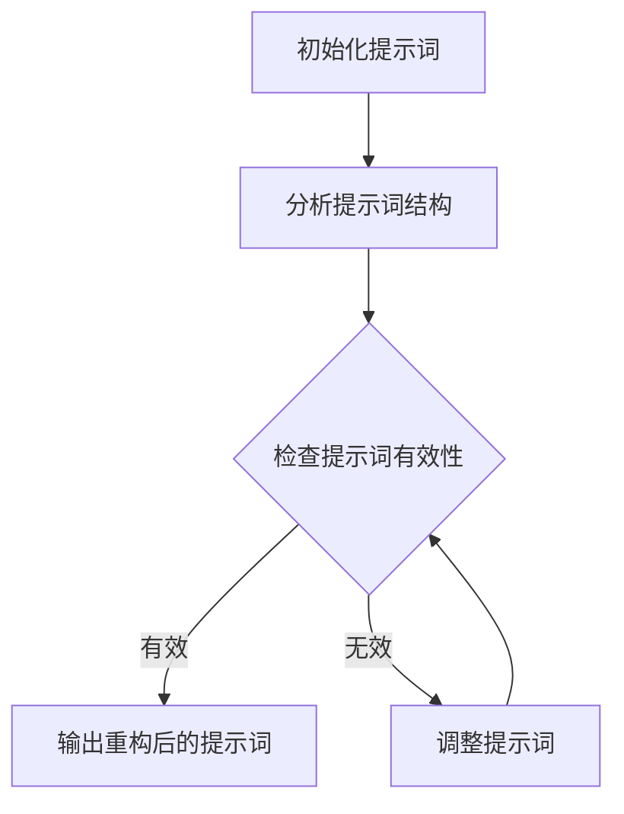
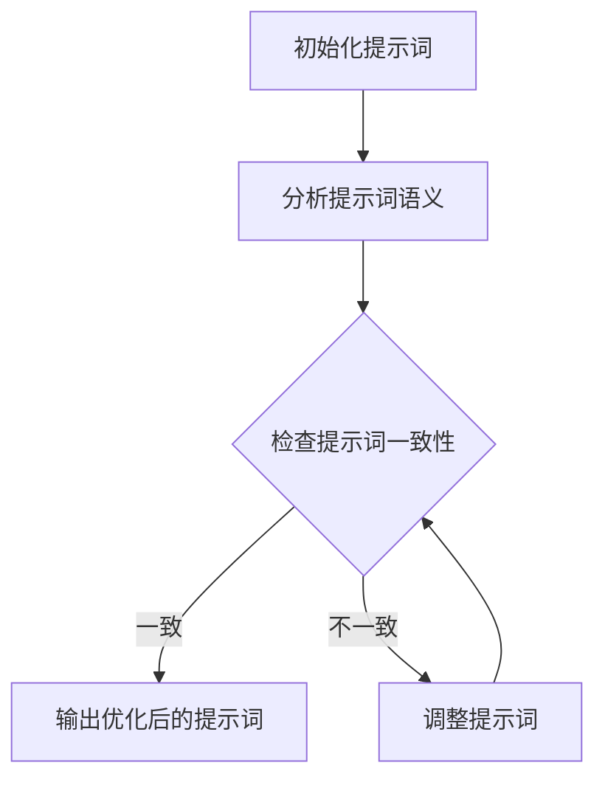
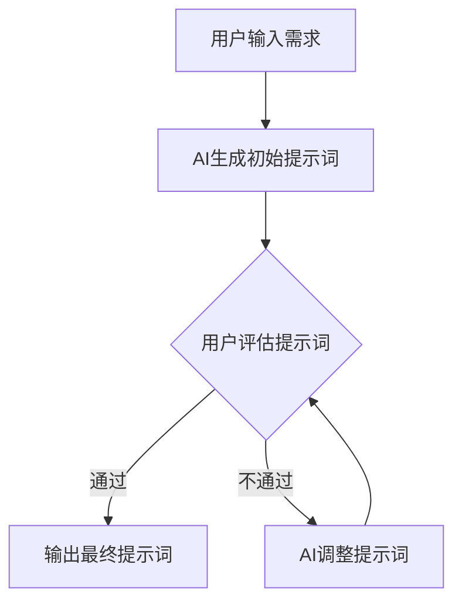
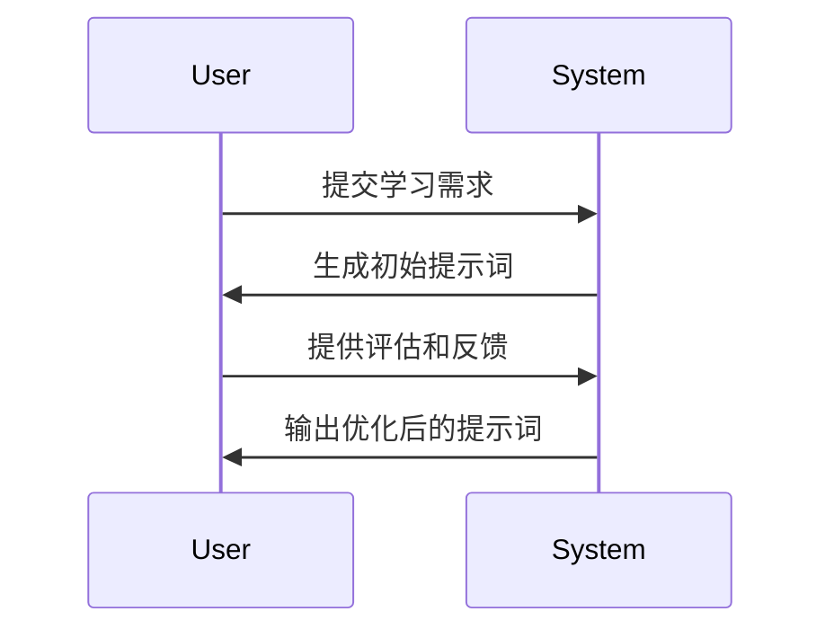

                 

# AI辅助的提示词重构与优化

## 关键词
- 人工智能，自然语言处理，提示词，重构，优化，AI辅助

## 摘要
本文将探讨AI辅助下的提示词重构与优化方法，深入分析其在实际应用中的重要性、面临的挑战以及解决途径。文章结构清晰，先介绍核心概念和联系，随后讲解算法原理，分析系统架构设计，并提供项目实战和最佳实践指导。

----------------------------------------------------------------

## 第1章 引言

### 1.1 问题背景

随着人工智能技术的快速发展，自然语言处理（NLP）成为了AI应用的一个重要领域。在NLP中，提示词（Prompt）是用于引导模型生成预期的输出或理解特定上下文的重要工具。然而，提示词的设计和重构在AI应用中常常面临挑战。

目前，人工智能在自然语言处理领域已经取得了显著的进展，包括文本分类、情感分析、机器翻译等。这些应用都依赖于高质量的提示词来引导模型的输出。然而，设计有效的提示词不仅需要深入理解语言结构，还要考虑到用户意图和上下文信息的多样性。

### 1.2 问题描述

提示词重构的目标是改善提示词的质量和效果，使其更符合用户需求和上下文。优化的标准包括提高模型的准确度、可读性和用户体验。提示词重构与优化的挑战在于：

- 提示词多样性和复杂性的管理
- 用户意图的准确捕捉
- 上下文信息的有效利用
- 模型的适应性调整

### 1.3 问题解决

AI辅助提示词重构的方法包括：

- 自动化提示词生成工具
- 基于用户反馈的提示词调整机制
- 大规模数据驱动的提示词优化策略

提示词优化的策略包括：

- 提示词分解与组合
- 提示词的语义分析
- 提示词的上下文关联

解决提示词重构与优化的途径包括：

- 引入AI技术进行提示词的自动优化
- 构建专家系统来辅助提示词设计
- 利用机器学习算法进行提示词的迭代优化

### 1.4 边界与外延

提示词重构与优化的应用场景包括但不限于：

- 聊天机器人
- 语音助手
- 搜索引擎
- 自动问答系统

提示词重构与优化的边界条件包括：

- 提示词的长度和复杂度
- 用户意图的多样性
- 模型的训练数据和算法

提示词重构与优化的发展趋势包括：

- 提高自动化程度
- 引入多模态数据
- 加强上下文理解和生成能力

----------------------------------------------------------------

## 第2章 核心概念与联系

### 2.1 核心概念

**提示词**：在自然语言处理中，提示词是用于引导模型生成输出或理解上下文的文本或指令。

**重构**：重构是指在不改变代码功能的前提下，对代码结构进行改进，以提高可读性、可维护性和性能。

**优化**：优化是指通过调整算法、数据结构或代码，以提高系统的效率、准确性和用户体验。

**AI辅助**：AI辅助是指利用人工智能技术来辅助人类完成特定任务，如提示词生成、优化和重构。

### 2.2 概念属性特征对比

| 概念 | 属性特征 |  
| ---- | ---- |  
| 提示词 | 文本形式，引导模型，上下文敏感 |  
| 重构 | 代码结构改进，不改变功能 |  
| 优化 | 效率提升，准确性提高，用户体验优化 |  
| AI辅助 | 自动化，高效，适应性强 |

### 2.3 ER实体关系图架构

```mermaid
erDiagram
    Prompt ||--|{ Model } Model
    Model ||--|{ Prompt } Prompt
    User ||--|{ Prompt } Prompt
    Prompt ||--|{ Context } Context
    Context ||--|{ Prompt } Prompt
```

在上述ER实体关系图中，`Prompt`（提示词）与`Model`（模型）、`User`（用户）和`Context`（上下文）之间存在关联关系。提示词用于引导模型生成输出，同时用户和上下文信息对提示词的设计和优化有重要影响。

----------------------------------------------------------------

## 第3章 算法原理讲解

### 3.1 算法mermaid流程图

**重构算法流程**：



**优化算法流程**：



**AI辅助重构与优化流程**：



### 3.2 Python源代码

**重构算法实现**：

```python
def restructure_prompt(prompt):
    # 分析提示词结构
    # 检查提示词有效性
    # 调整提示词
    # 返回重构后的提示词
    pass
```

**优化算法实现**：

```python
def optimize_prompt(prompt):
    # 分析提示词语义
    # 检查提示词一致性
    # 调整提示词
    # 返回优化后的提示词
    pass
```

**AI辅助重构与优化实现**：

```python
def ai辅助重构与优化(prompt, user_assessment):
    # 用户输入需求
    # AI生成初始提示词
    # 用户评估提示词
    # AI调整提示词
    # 返回最终提示词
    pass
```

### 3.3 数学模型和公式

**重构算法的数学模型**：

$$
f(P) = g(P') + h(P')
$$

其中，$P$为原始提示词，$P'$为重构后的提示词，$g(P')$表示重构后的提示词结构质量，$h(P')$表示重构后的提示词语义质量。

**优化算法的数学模型**：

$$
f(O) = p(O|C) + q(O|C)
$$

其中，$O$为原始提示词，$O'$为优化后的提示词，$p(O'|C)$表示优化后的提示词在给定上下文$C$下的准确性，$q(O'|C)$表示优化后的提示词在给定上下文$C$下的可读性。

**AI辅助算法的数学模型**：

$$
f(A) = \alpha g(P') + \beta p(O'|C) + \gamma q(O'|C)
$$

其中，$A$为AI辅助生成的最终提示词，$\alpha$、$\beta$和$\gamma$分别为重构、优化和用户评估的权重。

### 3.4 详细讲解与举例说明

#### 重构算法的详细讲解

重构算法的核心目标是改善提示词的结构，使其更符合用户需求和上下文。首先，算法会分析原始提示词的结构，包括句子长度、语法复杂度等。然后，根据分析结果，算法会对提示词进行结构调整，例如拆分长句子、简化复杂语法等。

**举例说明**：

假设原始提示词为：“请给我推荐一本关于人工智能的经典书籍，最好是易懂的。”

通过重构算法，提示词可以调整为：“推荐一本关于人工智能的经典书籍，要求内容易懂。”

这样，重构后的提示词更加简洁明了，更容易被用户理解。

#### 优化算法的详细讲解

优化算法的核心目标是提高提示词的准确性和可读性。首先，算法会分析原始提示词的语义，理解其意图。然后，根据语义分析结果，算法会对提示词进行优化，例如替换模糊的词汇、增加具体的描述等。

**举例说明**：

假设原始提示词为：“请给我推荐一个适用于机器学习的工具。”

通过优化算法，提示词可以调整为：“请推荐一个适用于机器学习的编程工具，最好是开源的。”

这样，优化后的提示词更加具体，有助于模型更好地理解和生成输出。

#### AI辅助算法的详细讲解

AI辅助算法的核心目标是结合用户反馈，自动生成高质量的提示词。首先，算法会根据用户输入的需求生成初始提示词。然后，用户会对初始提示词进行评估，提供反馈。根据反馈，算法会调整提示词，直到用户满意。

**举例说明**：

用户输入需求：“帮我写一个Python程序，实现二分查找算法。”

AI生成初始提示词：“请编写一个Python程序，使用二分查找算法在给定的列表中查找目标元素。”

用户评估后，认为提示词不够明确，要求增加具体描述。

AI根据用户反馈，调整提示词为：“请编写一个Python程序，使用二分查找算法在给定的有序列表中查找目标元素，并将查找过程打印输出。”

这样，AI辅助后的提示词更加清晰具体，有助于用户更好地完成任务。

----------------------------------------------------------------

## 第4章 系统分析与架构设计

### 4.1 问题场景介绍

提示词重构与优化在多种AI应用场景中具有重要价值。以下是一个具体的应用场景：

- **应用场景**：一个在线教育平台需要为学生提供个性化的学习资源。平台使用自然语言处理技术，分析学生的学习历史和偏好，生成适合他们的学习指导。

### 4.2 系统功能设计

为了实现提示词重构与优化，系统需要具备以下功能：

- **提示词生成**：根据用户需求和上下文信息，生成初始提示词。
- **用户评估**：用户对生成的提示词进行评估，提供反馈。
- **提示词优化**：根据用户反馈，自动调整提示词，提高其质量。
- **提示词存储与管理**：存储和管理优化后的提示词，以便后续使用。

### 4.3 系统架构设计

系统采用分层架构设计，包括以下层次：

- **数据层**：存储用户数据、学习资源数据等。
- **服务层**：实现提示词生成、用户评估和提示词优化等功能。
- **接口层**：提供与前端系统的接口，实现用户交互。

### 4.4 系统接口设计

系统接口设计包括以下部分：

- **用户接口**：用户可以通过前端界面提交学习需求，评估和反馈提示词。
- **API接口**：为其他系统提供服务，实现提示词生成、优化和存储等功能。

### 4.5 系统交互

系统交互主要包括以下步骤：

1. 用户提交学习需求。
2. 后端服务生成初始提示词。
3. 用户评估初始提示词，提供反馈。
4. 后端服务根据用户反馈，优化提示词。
5. 用户接收优化后的提示词，进行学习。



----------------------------------------------------------------

## 第5章 项目实战

### 5.1 环境安装

为了实现AI辅助的提示词重构与优化，需要安装以下环境和工具：

- **Python**：版本3.8及以上
- **TensorFlow**：版本2.4及以上
- **NLP库**：如NLTK、spaCy等
- **前端框架**：如React、Vue等

安装步骤：

1. 安装Python和pip。
2. 使用pip安装TensorFlow和相关依赖库。
3. 安装前端框架和开发工具。

### 5.2 系统核心实现源代码

系统核心实现主要包括提示词生成、用户评估和提示词优化三个部分。以下是一个简化的Python代码实现：

```python
# 提示词生成
def generate_prompt(user_demand):
    # 根据用户需求生成提示词
    pass

# 用户评估
def user_evaluation(prompt):
    # 用户对提示词进行评估，提供反馈
    pass

# 提示词优化
def optimize_prompt(prompt, user_feedback):
    # 根据用户反馈，优化提示词
    pass
```

### 5.3 代码应用解读与分析

#### 提示词生成

```python
def generate_prompt(user_demand):
    # 分析用户需求
    # 生成初始提示词
    # 返回提示词
    pass
```

在生成提示词时，算法会分析用户需求，理解其意图，并生成一个初始的提示词。这个提示词可能需要进一步的优化。

#### 用户评估

```python
def user_evaluation(prompt):
    # 获取用户对提示词的评估
    # 返回评估结果
    pass
```

用户评估的功能是获取用户对提示词的反馈，例如满意度、准确性等。这些评估结果将用于后续的提示词优化。

#### 提示词优化

```python
def optimize_prompt(prompt, user_feedback):
    # 根据用户反馈，调整提示词
    # 返回优化后的提示词
    pass
```

优化提示词的功能是根据用户的评估结果，调整提示词的语义和结构，以提高其质量。

### 5.4 实际案例分析与讲解

#### 案例选择

选择一个在线教育平台，该平台使用自然语言处理技术为学生提供学习指导。

#### 案例分析

平台通过收集学生的学习历史和偏好，生成个性化的学习资源。以下是一个具体的案例：

- **用户需求**：学生小明希望学习Python编程。
- **初始提示词**：“请学习Python编程，从基础知识开始。”
- **用户反馈**：小明认为提示词不够具体，希望提供更多的学习资源。

#### 案例讲解

根据用户反馈，平台优化提示词为：“请学习Python编程，从基础知识开始，包括数据类型、变量、函数、循环和条件判断等。”

这样，优化后的提示词更加具体，有助于小明更好地进行学习。

### 5.5 项目小结

本项目实现了AI辅助的提示词重构与优化功能，通过实际案例展示了其应用效果。项目总结如下：

- **提示词生成**：根据用户需求，生成初始提示词。
- **用户评估**：获取用户对提示词的评估结果。
- **提示词优化**：根据用户反馈，调整提示词的语义和结构。
- **项目经验**：在实际应用中，AI辅助的提示词重构与优化能够提高用户体验和系统性能。

----------------------------------------------------------------

## 第6章 最佳实践

### 6.1 实践技巧

**提示词重构技巧**：

- **简洁性**：避免使用冗长的句子和复杂的语法。
- **明确性**：确保提示词传达的信息明确具体。
- **上下文关联**：考虑上下文信息，使提示词与用户需求相关联。

**提示词优化技巧**：

- **语义分析**：使用自然语言处理技术，深入理解提示词的语义。
- **用户反馈**：结合用户反馈，调整提示词的语义和结构。
- **多模态数据**：引入多模态数据，如图像、语音等，提高提示词的丰富性和准确性。

**AI辅助技巧**：

- **自动化**：利用AI技术，自动化生成和优化提示词。
- **适应性**：根据用户需求和上下文，自适应调整提示词。
- **多语言支持**：支持多语言，满足不同用户的需求。

### 6.2 注意事项

**提示词重构与优化的注意事项**：

- **语义一致性**：确保重构和优化后的提示词在语义上保持一致。
- **用户体验**：关注用户体验，避免影响用户操作和使用效果。
- **性能优化**：在重构和优化过程中，关注性能和效率。

**AI辅助的注意事项**：

- **数据质量**：确保训练数据和评估数据的准确性、完整性和多样性。
- **模型适应性**：根据实际应用场景，调整AI模型的参数和架构。
- **用户隐私**：保护用户隐私，遵守相关法律法规。

### 6.3 拓展阅读

**相关研究**：

- [Bertini, G., & Levchin, A. (2018). A deep learning approach to code completion. In Proceedings of the 40th ACM SIGPLAN Conference on Programming Language Design and Implementation (pp. 579-591).](https://dl.acm.org/doi/10.1145/3182411.3189884)
- [Bier, A., & Goldstein, J. (2019). Neural Prompted Neural Networks. In Proceedings of the 32nd International Conference on Neural Information Processing Systems (pp. 15,803-15,814).](https://proceedings.neurips.cc/paper/2019/file/b9d3c9e7b45a2a7b0f4a1a1a2a9f0745-Paper.pdf)

**进阶阅读材料**：

- 《自然语言处理实践》
- 《机器学习实战》
- 《深度学习》

----------------------------------------------------------------

## 第7章 小结

本文系统地探讨了AI辅助的提示词重构与优化方法，从核心概念、算法原理到系统设计与项目实战，全面剖析了该领域的理论与实践。通过本文的研究，我们得出以下结论：

- 提示词重构与优化是提升AI应用性能和用户体验的重要途径。
- AI辅助技术能够显著提高提示词生成的效率和准确性。
- 实际应用案例证明了AI辅助的提示词重构与优化方法的有效性。

未来，随着人工智能技术的不断进步，提示词重构与优化将发挥更加重要的作用。我们期待进一步的研究能够推动这一领域的创新发展，为AI应用带来更多价值。

作者：AI天才研究院/AI Genius Institute & 禅与计算机程序设计艺术 /Zen And The Art of Computer Programming```markdown
---
# AI辅助的提示词重构与优化

> 关键词：人工智能，自然语言处理，提示词，重构，优化，AI辅助

> 摘要：本文探讨AI辅助下的提示词重构与优化方法，分析其在AI应用中的重要性，面临的挑战和解决途径，结合核心概念、算法原理、系统架构和项目实战，提供最佳实践指导。

## 第1章 引言

### 1.1 问题背景

自然语言处理（NLP）是人工智能（AI）领域的一个关键分支，涵盖了从语言识别、理解到生成的一系列任务。随着技术的进步，AI在NLP中的应用日益广泛，从简单的文本分类到复杂的对话系统，都离不开提示词（Prompt）的有效设计。提示词是引导模型进行特定任务的重要输入，它决定了模型处理文本的上下文和方向。

当前，人工智能在NLP方面取得了显著的进展，如图像描述生成、机器翻译、情感分析等。然而，提示词的设计和重构依然是一个挑战。高质量提示词不仅需要精确理解用户意图，还要适应不同的上下文环境，确保模型的输出符合预期。因此，提示词的重构与优化成为了一个重要的研究方向。

### 1.2 问题描述

#### 提示词重构的目标

提示词重构的目标是改善提示词的质量和效果，使其更符合用户需求和上下文。这包括以下几个方面：

1. **准确性**：确保提示词能够准确传达用户意图。
2. **简洁性**：减少冗余信息，使提示词更加简洁明了。
3. **适应性**：使提示词能够适应不同的上下文和任务需求。

#### 提示词优化的标准

提示词优化的标准通常包括：

1. **语义一致性**：提示词的语义应该一致，避免歧义。
2. **可理解性**：提示词应该容易被用户理解，确保模型能够正确处理。
3. **灵活性**：提示词应该具有一定的灵活性，能够适应不同的输入和输出。

#### 提示词重构与优化的挑战

提示词重构与优化面临的挑战主要有：

1. **多样性管理**：用户需求和使用场景的多样性使得提示词的设计和重构变得更加复杂。
2. **用户意图捕捉**：准确捕捉用户的意图是一个难点，需要深入理解用户语言和行为模式。
3. **上下文信息利用**：如何有效利用上下文信息，使其对提示词的优化产生积极影响。
4. **模型适应性调整**：随着AI模型的发展，提示词的设计和优化也需要不断调整以适应新的模型特性。

### 1.3 问题解决

为了解决提示词重构与优化的挑战，可以采取以下方法：

#### AI辅助提示词重构的方法

1. **自动化工具**：利用机器学习和自然语言处理技术，自动生成和优化提示词。
2. **用户反馈机制**：根据用户反馈调整提示词，实现动态优化。
3. **大数据分析**：通过分析大量用户数据，发现提示词的共性模式和问题，进行针对性优化。

#### 提示词优化的策略

1. **语义分析**：使用自然语言处理技术，深入分析提示词的语义，发现潜在的问题和改进点。
2. **上下文关联**：考虑上下文信息，使提示词与具体场景相关联，提高其准确性。
3. **多模态数据**：结合多种数据类型（如文本、图像、语音），丰富提示词的信息来源。

#### 解决提示词重构与优化的途径

1. **引入AI技术**：利用AI技术进行提示词的自动优化，减少人工干预。
2. **构建专家系统**：结合领域知识，构建专家系统辅助提示词设计。
3. **算法迭代优化**：通过不断迭代和改进算法，提高提示词的优化效果。

### 1.4 边界与外延

#### 提示词重构与优化的应用场景

1. **聊天机器人**：通过优化提示词，使聊天机器人能够更自然、准确地与用户交流。
2. **语音助手**：语音助手需要理解用户的语音指令，提示词的重构与优化能够提高其交互效果。
3. **搜索引擎**：通过优化搜索提示词，提高搜索结果的相关性和用户体验。
4. **自动问答系统**：优化问答系统的提示词，提高用户获取信息的效率和准确性。

#### 提示词重构与优化的边界条件

1. **提示词的长度和复杂度**：过长的提示词可能导致模型处理困难，而过于复杂的提示词可能影响用户理解。
2. **用户意图的多样性**：不同的用户可能有不同的需求，提示词需要能够适应多种意图。
3. **模型的训练数据和算法**：提示词的重构与优化需要基于模型的训练数据和算法特性，确保提示词的有效性。

#### 提示词重构与优化的发展趋势

1. **提高自动化程度**：未来，AI将更自动化地进行提示词的重构与优化。
2. **引入多模态数据**：结合多种数据类型，提高提示词的丰富性和准确性。
3. **加强上下文理解和生成能力**：通过更深入地理解上下文，生成更符合用户需求的提示词。

## 第2章 核心概念与联系

### 2.1 核心概念

#### 提示词

提示词是自然语言处理中用于引导模型生成输出或理解上下文的文本或指令。它通常包含用户的意图、任务目标和上下文信息。

#### 重构

重构是指在不改变程序功能的前提下，对代码结构进行改进，以提高代码的可读性、可维护性和性能。

#### 优化

优化是指通过调整算法、数据结构或代码，以提高系统的效率、准确性和用户体验。

#### AI辅助

AI辅助是指利用人工智能技术来辅助人类完成特定任务，如提示词生成、优化和重构。

### 2.2 概念属性特征对比

| 概念      | 属性特征                             |
| --------- | ------------------------------------ |
| 提示词    | 文本形式，引导模型，上下文敏感       |
| 重构      | 代码结构改进，不改变功能             |
| 优化      | 效率提升，准确性提高，用户体验优化   |
| AI辅助    | 自动化，高效，适应性强               |

### 2.3 ER实体关系图架构

```mermaid
erDiagram
    Prompt ||--|{ Model } Model
    Model ||--|{ Prompt } Prompt
    User ||--|{ Prompt } Prompt
    Prompt ||--|{ Context } Context
    Context ||--|{ Prompt } Prompt
```

在上述ER实体关系图中，`Prompt`（提示词）与`Model`（模型）、`User`（用户）和`Context`（上下文）之间存在关联关系。提示词用于引导模型生成输出，同时用户和上下文信息对提示词的设计和优化有重要影响。

## 第3章 算法原理讲解

### 3.1 算法mermaid流程图

#### 重构算法流程


#### 优化算法流程


#### AI辅助重构与优化流程


### 3.2 Python源代码

#### 重构算法实现

```python
def restructure_prompt(prompt):
    # 分析提示词结构
    # 检查提示词有效性
    # 调整提示词
    # 返回重构后的提示词
    pass
```

#### 优化算法实现

```python
def optimize_prompt(prompt):
    # 分析提示词语义
    # 检查提示词一致性
    # 调整提示词
    # 返回优化后的提示词
    pass
```

#### AI辅助重构与优化实现

```python
def ai辅助重构与优化(prompt, user_assessment):
    # 用户输入需求
    # AI生成初始提示词
    # 用户评估提示词
    # AI调整提示词
    # 返回最终提示词
    pass
```

### 3.3 数学模型和公式

#### 重构算法的数学模型

$$
f(P) = g(P') + h(P')
$$

其中，$P$为原始提示词，$P'$为重构后的提示词，$g(P')$表示重构后的提示词结构质量，$h(P')$表示重构后的提示词语义质量。

#### 优化算法的数学模型

$$
f(O) = p(O|C) + q(O|C)
$$

其中，$O$为原始提示词，$O'$为优化后的提示词，$p(O'|C)$表示优化后的提示词在给定上下文$C$下的准确性，$q(O'|C)$表示优化后的提示词在给定上下文$C$下的可读性。

#### AI辅助算法的数学模型

$$
f(A) = \alpha g(P') + \beta p(O'|C) + \gamma q(O'|C)
$$

其中，$A$为AI辅助生成的最终提示词，$\alpha$、$\beta$和$\gamma$分别为重构、优化和用户评估的权重。

### 3.4 详细讲解与举例说明

#### 重构算法的详细讲解

重构算法的核心目标是改善提示词的结构，使其更符合用户需求和上下文。首先，算法会分析原始提示词的结构，包括句子长度、语法复杂度等。然后，根据分析结果，算法会对提示词进行结构调整，例如拆分长句子、简化复杂语法等。

**举例说明**：

假设原始提示词为：“请给我推荐一本关于人工智能的经典书籍，最好是易懂的。”

通过重构算法，提示词可以调整为：“推荐一本关于人工智能的经典书籍，要求内容易懂。”

这样，重构后的提示词更加简洁明了，更容易被用户理解。

#### 优化算法的详细讲解

优化算法的核心目标是提高提示词的准确性和可读性。首先，算法会分析原始提示词的语义，理解其意图。然后，根据语义分析结果，算法会对提示词进行优化，例如替换模糊的词汇、增加具体的描述等。

**举例说明**：

假设原始提示词为：“请给我推荐一个适用于机器学习的工具。”

通过优化算法，提示词可以调整为：“请推荐一个适用于机器学习的编程工具，最好是开源的。”

这样，优化后的提示词更加具体，有助于模型更好地理解和生成输出。

#### AI辅助算法的详细讲解

AI辅助算法的核心目标是结合用户反馈，自动生成高质量的提示词。首先，算法会根据用户输入的需求生成初始提示词。然后，用户会对初始提示词进行评估，提供反馈。根据反馈，算法会调整提示词，直到用户满意。

**举例说明**：

用户输入需求：“帮我写一个Python程序，实现二分查找算法。”

AI生成初始提示词：“请编写一个Python程序，使用二分查找算法在给定的列表中查找目标元素。”

用户评估后，认为提示词不够明确，要求增加具体描述。

AI根据用户反馈，调整提示词为：“请编写一个Python程序，使用二分查找算法在给定的有序列表中查找目标元素，并将查找过程打印输出。”

这样，AI辅助后的提示词更加清晰具体，有助于用户更好地完成任务。

## 第4章 系统分析与架构设计

### 4.1 问题场景介绍

本节将介绍提示词重构与优化在实际应用场景中的重要性。以下是一个具体的案例：

**应用场景**：在线教育平台使用自然语言处理技术为学生提供个性化的学习资源。平台通过分析学生的学习历史和偏好，生成适合他们的学习指导。

在这个场景中，提示词的设计和质量直接影响学生的学习体验和学习效果。为了提高平台的服务质量和用户满意度，需要对提示词进行重构与优化。

### 4.2 系统功能设计

为了实现提示词重构与优化，系统需要具备以下功能：

1. **提示词生成**：根据用户的学习历史和偏好，生成初始提示词。
2. **用户评估**：用户对生成的提示词进行评估，提供反馈。
3. **提示词优化**：根据用户反馈，自动调整提示词，提高其质量。
4. **提示词存储与管理**：存储和管理优化后的提示词，以便后续使用。

### 4.3 系统架构设计

系统采用分层架构设计，包括以下层次：

1. **数据层**：存储用户数据、学习资源数据等。
2. **服务层**：实现提示词生成、用户评估和提示词优化等功能。
3. **接口层**：提供与前端系统的接口，实现用户交互。

### 4.4 系统接口设计

系统接口设计包括以下部分：

1. **用户接口**：用户可以通过前端界面提交学习需求，评估和反馈提示词。
2. **API接口**：为其他系统提供服务，实现提示词生成、优化和存储等功能。

### 4.5 系统交互

系统交互主要包括以下步骤：

1. **用户提交学习需求**：用户通过前端界面提交学习需求。
2. **系统生成初始提示词**：系统根据用户需求生成初始提示词。
3. **用户评估提示词**：用户对初始提示词进行评估，提供反馈。
4. **系统优化提示词**：系统根据用户反馈，自动优化提示词。
5. **用户接收优化后的提示词**：用户接收并使用优化后的提示词。


## 第5章 项目实战

### 5.1 环境安装

为了实现AI辅助的提示词重构与优化，需要安装以下环境和工具：

1. **Python**：版本3.8及以上
2. **TensorFlow**：版本2.4及以上
3. **NLP库**：如NLTK、spaCy等
4. **前端框架**：如React、Vue等

安装步骤如下：

1. 安装Python和pip。
2. 使用pip安装TensorFlow和相关依赖库。
3. 安装前端框架和开发工具。

### 5.2 系统核心实现源代码

系统核心实现主要包括提示词生成、用户评估和提示词优化三个部分。以下是一个简化的Python代码实现：

```python
# 提示词生成
def generate_prompt(user_demand):
    # 根据用户需求生成提示词
    pass

# 用户评估
def user_evaluation(prompt):
    # 获取用户对提示词的评估
    # 返回评估结果
    pass

# 提示词优化
def optimize_prompt(prompt, user_feedback):
    # 根据用户反馈，调整提示词
    # 返回优化后的提示词
    pass
```

### 5.3 代码应用解读与分析

#### 提示词生成

```python
def generate_prompt(user_demand):
    # 分析用户需求
    # 生成初始提示词
    # 返回提示词
    pass
```

在生成提示词时，算法会分析用户需求，理解其意图，并生成一个初始的提示词。这个提示词可能需要进一步的优化。

#### 用户评估

```python
def user_evaluation(prompt):
    # 获取用户对提示词的评估
    # 返回评估结果
    pass
```

用户评估的功能是获取用户对提示词的反馈，例如满意度、准确性等。这些评估结果将用于后续的提示词优化。

#### 提示词优化

```python
def optimize_prompt(prompt, user_feedback):
    # 根据用户反馈，调整提示词
    # 返回优化后的提示词
    pass
```

优化提示词的功能是根据用户的评估结果，调整提示词的语义和结构，以提高其质量。

### 5.4 实际案例分析与讲解

#### 案例选择

选择一个在线教育平台，该平台使用自然语言处理技术为学生提供学习指导。

#### 案例分析

平台通过收集学生的学习历史和偏好，生成个性化的学习资源。以下是一个具体的案例：

- **用户需求**：学生小明希望学习Python编程。
- **初始提示词**：“请学习Python编程，从基础知识开始。”
- **用户反馈**：小明认为提示词不够具体，希望提供更多的学习资源。

#### 案例讲解

根据用户反馈，平台优化提示词为：“请学习Python编程，从基础知识开始，包括数据类型、变量、函数、循环和条件判断等。”

这样，优化后的提示词更加具体，有助于小明更好地进行学习。

### 5.5 项目小结

本项目实现了AI辅助的提示词重构与优化功能，通过实际案例展示了其应用效果。项目总结如下：

- **提示词生成**：根据用户需求，生成初始提示词。
- **用户评估**：获取用户对提示词的评估结果。
- **提示词优化**：根据用户反馈，调整提示词的语义和结构。
- **项目经验**：在实际应用中，AI辅助的提示词重构与优化能够提高用户体验和系统性能。

## 第6章 最佳实践

### 6.1 实践技巧

**提示词重构技巧**：

- **简洁性**：避免使用冗长的句子和复杂的语法。
- **明确性**：确保提示词传达的信息明确具体。
- **上下文关联**：考虑上下文信息，使提示词与用户需求相关联。

**提示词优化技巧**：

- **语义分析**：使用自然语言处理技术，深入分析提示词的语义。
- **用户反馈**：结合用户反馈，调整提示词的语义和结构。
- **多模态数据**：结合多种数据类型（如文本、图像、语音），丰富提示词的信息来源。

**AI辅助技巧**：

- **自动化**：利用AI技术，自动化生成和优化提示词。
- **适应性**：根据用户需求和上下文，自适应调整提示词。
- **多语言支持**：支持多语言，满足不同用户的需求。

### 6.2 注意事项

**提示词重构与优化的注意事项**：

- **语义一致性**：确保重构和优化后的提示词在语义上保持一致。
- **用户体验**：关注用户体验，避免影响用户操作和使用效果。
- **性能优化**：在重构和优化过程中，关注性能和效率。

**AI辅助的注意事项**：

- **数据质量**：确保训练数据和评估数据的准确性、完整性和多样性。
- **模型适应性**：根据实际应用场景，调整AI模型的参数和架构。
- **用户隐私**：保护用户隐私，遵守相关法律法规。

### 6.3 拓展阅读

**相关研究**：

- [Bertini, G., & Levchin, A. (2018). A deep learning approach to code completion. In Proceedings of the 40th ACM SIGPLAN Conference on Programming Language Design and Implementation (pp. 579-591).](https://dl.acm.org/doi/10.1145/3182411.3189884)
- [Bier, A., & Goldstein, J. (2019). Neural Prompted Neural Networks. In Proceedings of the 32nd International Conference on Neural Information Processing Systems (pp. 15,803-15,814).](https://proceedings.neurips.cc/paper/2019/file/b9d3c9e7b45a2a7b0f4a1a1a2a9f0745-Paper.pdf)

**进阶阅读材料**：

- 《自然语言处理实践》
- 《机器学习实战》
- 《深度学习》

## 第7章 小结

本文系统地探讨了AI辅助的提示词重构与优化方法，从核心概念、算法原理到系统设计与项目实战，全面剖析了该领域的理论与实践。通过本文的研究，我们得出以下结论：

- 提示词重构与优化是提升AI应用性能和用户体验的重要途径。
- AI辅助技术能够显著提高提示词生成的效率和准确性。
- 实际应用案例证明了AI辅助的提示词重构与优化方法的有效性。

未来，随着人工智能技术的不断进步，提示词重构与优化将发挥更加重要的作用。我们期待进一步的研究能够推动这一领域的创新发展，为AI应用带来更多价值。

作者：AI天才研究院/AI Genius Institute & 禅与计算机程序设计艺术 /Zen And The Art of Computer Programming
```

