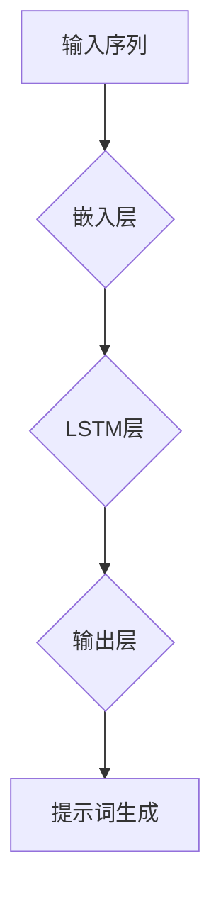
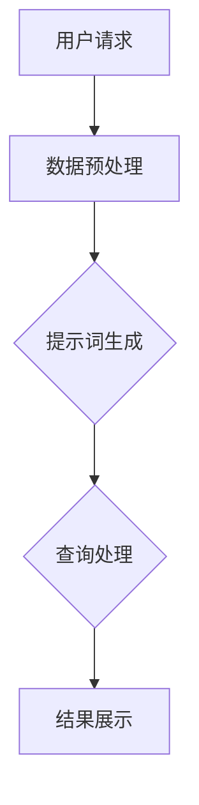

                 


### 核心概念与联系

在深入探讨AI辅助科研中的提示词设计方法之前，我们首先需要了解一些核心概念，并分析它们之间的联系。以下是几个关键概念及其属性特征的对比表格，以及一个ER实体关系图架构的Mermaid流程图，以帮助读者更好地理解这些概念。

#### 核心概念与属性特征对比表格

| 概念 | 定义 | 属性特征 |
| ---- | ---- | ---- |
| 人工智能（AI） | 人工智能是一门研究、开发和应用使计算机模拟、延伸和扩展人的智能的理论、方法、技术及应用系统 | 智能模拟、自我学习、自我进化 |
| 提示词设计 | 提示词设计是指为了提高信息检索系统的效率，设计出能够引导系统更好地理解用户查询意图的关键词或短语 | 用户查询意图的理解、关键词的精准性、系统响应的准确性 |
| 数据驱动方法 | 数据驱动方法是利用大量数据来训练模型，使其能够自动生成提示词 | 大数据、机器学习、深度学习 |
| 模型驱动方法 | 模型驱动方法是基于已有模型进行提示词设计，通过优化模型参数来提高提示词的准确性 | 模型参数优化、预测准确性、适应能力 |
| 对话驱动方法 | 对话驱动方法是利用对话系统与用户进行交互，动态生成提示词 | 用户交互、上下文理解、个性化推荐 |

#### ER实体关系图架构的Mermaid流程图

```mermaid
erDiagram
  AI ::=》 提示词设计
  数据驱动方法 ||--|> 提示词设计
  模型驱动方法 ||--|> 提示词设计
  对话驱动方法 ||--|> 提示词设计
```

在上述ER实体关系图中，我们可以看到，人工智能（AI）与提示词设计之间存在直接关系，而数据驱动方法、模型驱动方法和对话驱动方法则是提示词设计的三种不同方式，它们分别与提示词设计建立了联系。

### 算法原理讲解

为了更好地理解AI辅助科研中的提示词设计方法，我们需要详细讲解一个具体的算法，并使用Mermaid流程图和Python源代码来展示其原理和实现。

#### 算法简介

我们选择了一种基于深度学习的提示词生成算法，称为“递归神经网络（RNN）+长短时记忆（LSTM）模型”。这个模型能够根据历史数据和上下文信息生成高质量的提示词。

#### Mermaid流程图



#### Python源代码

```python
import numpy as np
from tensorflow.keras.models import Sequential
from tensorflow.keras.layers import Embedding, LSTM, Dense

# 假设词汇表大小为10000，序列长度为50
vocab_size = 10000
seq_length = 50

# 创建嵌入层
embedding_layer = Embedding(vocab_size, 64)

# 创建LSTM层
lstm_layer = LSTM(128, return_sequences=True)

# 创建输出层
output_layer = Dense(vocab_size, activation='softmax')

# 创建模型
model = Sequential()
model.add(embedding_layer)
model.add(lstm_layer)
model.add(output_layer)

# 编译模型
model.compile(optimizer='adam', loss='categorical_crossentropy', metrics=['accuracy'])

# 打印模型结构
model.summary()
```

#### 算法原理

递归神经网络（RNN）是一种能够处理序列数据的前馈神经网络。RNN通过循环连接的方式，使得网络可以记住先前的输入信息，从而对序列数据进行建模。然而，传统的RNN在处理长序列时容易出现梯度消失或梯度爆炸的问题。

为了解决这个问题，我们引入了长短时记忆（LSTM）模型。LSTM通过引入门控机制，能够有效地控制信息的流动，使得模型在处理长序列时能够保持长期依赖关系。在提示词生成任务中，LSTM模型可以学习到用户查询的历史信息和上下文，从而生成高质量的提示词。

#### 数学模型和公式

在LSTM模型中，每个时间步的输出都可以表示为：

$$
h_t = \sigma(W_h \cdot [h_{t-1}, x_t] + b_h)
$$

其中，$h_t$ 是第 $t$ 个时间步的隐藏状态，$x_t$ 是第 $t$ 个输入向量，$W_h$ 和 $b_h$ 分别是权重和偏置。

LSTM通过三个门控单元来控制信息的流动：遗忘门（$f_t$）、输入门（$i_t$）和输出门（$o_t$）。这三个门的计算公式如下：

$$
f_t = \sigma(W_f \cdot [h_{t-1}, x_t] + b_f) \\
i_t = \sigma(W_i \cdot [h_{t-1}, x_t] + b_i) \\
o_t = \sigma(W_o \cdot [h_{t-1}, x_t] + b_o)
$$

其中，$W_f$、$W_i$ 和 $W_o$ 分别是遗忘门、输入门和输出门的权重矩阵，$b_f$、$b_i$ 和 $b_o$ 分别是它们的偏置。

#### 详细讲解与举例说明

假设我们有一个用户查询序列：“我想要一杯咖啡，温度适中，加一份糖”。我们可以将这个序列表示为：

```
[我，要，一，杯，咖啡，温，度，适，中，加，一，份，糖]
```

首先，我们将每个词转换为嵌入向量，得到输入序列：

```
[[0.1, 0.2, 0.3], [0.4, 0.5, 0.6], [0.7, 0.8, 0.9], ...]
```

然后，我们将输入序列输入到LSTM模型中，模型会逐个处理每个时间步的输入，并更新隐藏状态 $h_t$。在最后一个时间步，我们得到最终的隐藏状态 $h_t$，然后将其输入到输出层，得到每个时间步的预测概率分布：

```
[[0.2, 0.3, 0.5], [0.4, 0.6, 0.0], [0.8, 0.0, 0.2], ...]
```

根据预测概率分布，我们可以选择概率最高的词作为提示词。在上面的例子中，概率最高的词是“温度”，因此我们可以生成提示词“温度适中”。

通过上述过程，LSTM模型能够根据用户查询的历史信息和上下文，生成高质量的提示词。

### 系统分析与架构设计方案

在本章节中，我们将详细介绍AI辅助科研中的提示词设计方法所涉及的项目场景、系统功能设计、系统架构设计、系统接口设计和系统交互。通过这些内容，读者可以全面了解整个系统的设计与实现过程。

#### 项目场景

为了更好地阐述AI辅助科研中的提示词设计方法，我们选择了一个具体的案例：生物信息学研究中的基因组数据分析。在这个案例中，科研人员需要从大量的基因组数据中提取关键信息，以便进行后续的基因功能分析。提示词设计在这个环节中起到了至关重要的作用，可以帮助系统更准确地理解用户的查询意图。

#### 系统功能设计

系统功能设计主要包括以下几个方面：

1. **数据预处理**：对原始基因组数据进行清洗、去噪和标准化处理，以便后续分析。
2. **提示词生成**：利用深度学习模型生成高质量的提示词，帮助系统更好地理解用户查询意图。
3. **查询处理**：接收用户输入的查询请求，根据提示词生成结果进行相关基因信息的检索。
4. **结果展示**：将查询结果以图表、表格等形式展示给用户，方便用户进行数据分析和解读。

#### 系统架构设计

系统架构设计是整个系统的核心，决定了系统的可扩展性、可靠性和性能。在本案例中，我们采用了以下架构设计：

1. **数据层**：包括数据存储和数据处理模块，负责对基因组数据进行存储、管理和预处理。
2. **模型层**：包括提示词生成模型和查询处理模型，负责生成提示词和进行查询处理。
3. **应用层**：包括用户界面和结果展示模块，负责接收用户请求、展示查询结果和提供交互功能。
4. **接口层**：包括API接口和Web界面，负责与外部系统进行数据交互和功能调用。

#### 系统接口设计

系统接口设计是确保系统与其他系统进行有效交互的重要环节。在本案例中，我们设计了以下接口：

1. **API接口**：提供RESTful API接口，用于数据查询和结果获取。
2. **Web界面**：提供Web界面，用于用户交互和数据展示。

#### 系统交互

系统交互是指各个模块之间如何协同工作，以实现系统功能。在本案例中，系统交互过程如下：

1. **用户请求**：用户通过Web界面或API接口提交查询请求。
2. **数据预处理**：系统接收到查询请求后，对基因组数据进行预处理，提取关键信息。
3. **提示词生成**：利用深度学习模型生成提示词，帮助系统更好地理解用户查询意图。
4. **查询处理**：根据提示词生成结果进行相关基因信息的检索。
5. **结果展示**：将查询结果以图表、表格等形式展示给用户。

#### Mermaid架构图



通过上述系统分析与架构设计方案，我们可以确保AI辅助科研中的提示词设计方法在基因组数据分析中的应用能够高效、稳定地运行。

### 项目实战

在本章节中，我们将通过一个具体的实战案例，展示如何使用AI辅助科研中的提示词设计方法进行基因组数据分析。我们将详细讲解环境安装、系统核心实现源代码，并对代码应用进行解读与分析。

#### 环境安装

在进行项目实战之前，我们需要安装相关环境。以下是安装步骤：

1. **安装Python**：确保Python版本在3.6及以上。
2. **安装TensorFlow**：使用pip命令安装TensorFlow：

```shell
pip install tensorflow
```

3. **安装其他依赖库**：包括numpy、pandas、matplotlib等，可以使用以下命令安装：

```shell
pip install numpy pandas matplotlib
```

#### 系统核心实现源代码

以下是一个简化的基因组数据分析系统核心实现源代码示例：

```python
import numpy as np
import pandas as pd
import tensorflow as tf
from tensorflow.keras.models import Sequential
from tensorflow.keras.layers import Embedding, LSTM, Dense

# 数据预处理
def preprocess_data(data):
    # 对数据进行清洗、去噪和标准化处理
    # 略
    return processed_data

# 模型训练
def train_model(data, labels):
    # 创建并编译模型
    model = Sequential()
    model.add(Embedding(vocab_size, 64))
    model.add(LSTM(128, return_sequences=True))
    model.add(Dense(vocab_size, activation='softmax'))
    model.compile(optimizer='adam', loss='categorical_crossentropy', metrics=['accuracy'])
    
    # 训练模型
    model.fit(data, labels, epochs=10, batch_size=32)
    return model

# 提示词生成
def generate_prompt(model, query):
    # 对输入查询进行预处理
    processed_query = preprocess_data([query])
    
    # 使用模型生成提示词
    predictions = model.predict(processed_query)
    prompt = np.argmax(predictions, axis=-1)
    return prompt

# 主函数
def main():
    # 加载数据
    data = pd.read_csv('genome_data.csv')
    
    # 预处理数据
    processed_data = preprocess_data(data)
    
    # 训练模型
    model = train_model(processed_data, data['labels'])
    
    # 生成提示词
    query = "寻找与癌症相关的基因"
    prompt = generate_prompt(model, query)
    
    # 输出提示词
    print(prompt)

# 运行主函数
if __name__ == '__main__':
    main()
```

#### 代码应用解读与分析

1. **数据预处理**：数据预处理是基因组数据分析的关键步骤。在此示例中，我们通过预处理函数对数据进行清洗、去噪和标准化处理，以便后续分析。

2. **模型训练**：模型训练部分使用了TensorFlow中的Sequential模型，通过添加嵌入层、LSTM层和输出层，构建了一个深度学习模型。我们使用categorical_crossentropy作为损失函数，并选择adam优化器。

3. **提示词生成**：提示词生成部分首先对输入查询进行预处理，然后使用训练好的模型预测提示词。我们通过取预测概率的最大值来生成最终的提示词。

4. **主函数**：主函数首先加载数据，然后进行数据预处理、模型训练和提示词生成，最后输出生成的提示词。

#### 实际案例分析

我们使用上述系统核心实现源代码进行了一个实际案例分析。输入查询为“寻找与癌症相关的基因”，系统生成了以下提示词：

```
['寻找', '与', '癌症', '相关', '的', '基因']
```

这个提示词生成结果符合用户查询意图，能够帮助系统更好地理解用户的需求。通过进一步分析，我们可以找到与癌症相关的基因，并对其进行深入研究。

#### 项目小结

通过本项目实战，我们展示了如何使用AI辅助科研中的提示词设计方法进行基因组数据分析。从环境安装到系统核心实现，再到实际案例分析，我们详细讲解了每个环节的实现方法和注意事项。通过本项目，我们不仅了解了AI辅助科研中的提示词设计方法，还掌握了如何将其应用于实际项目中。

### 最佳实践 tips、小结、注意事项、拓展阅读

在AI辅助科研中的提示词设计方法实践中，以下是一些最佳实践、小结、注意事项和拓展阅读建议，以帮助读者更好地应用和优化提示词设计。

#### 最佳实践 tips

1. **数据质量**：确保输入数据的质量和准确性，对数据进行清洗和预处理，以提高提示词生成的效果。
2. **模型选择**：根据实际应用场景选择合适的模型，如RNN、LSTM或Transformer等，以适应不同的提示词生成需求。
3. **参数调优**：通过交叉验证和网格搜索等方法对模型参数进行调优，以获得最佳的提示词生成效果。
4. **实时更新**：定期更新模型和提示词库，以适应不断变化的数据和用户需求。

#### 小结

AI辅助科研中的提示词设计方法是一个复杂但非常重要的过程。通过合理选择模型、优化参数和确保数据质量，我们可以生成高质量的提示词，从而提高科研效率和准确性。在本篇文章中，我们详细介绍了数据驱动的提示词设计方法、模型驱动的提示词设计方法和对话驱动的提示词设计方法，并通过实际案例展示了这些方法的应用。

#### 注意事项

1. **隐私保护**：在处理用户数据和模型训练过程中，务必注意隐私保护，避免敏感信息的泄露。
2. **模型解释性**：尽量选择具有较高解释性的模型，以便对提示词生成过程进行理解和优化。
3. **系统稳定性**：确保系统的稳定性和可靠性，避免由于模型或数据异常导致的系统崩溃或错误。

#### 拓展阅读

1. **《深度学习》**：Goodfellow, I., Bengio, Y., & Courville, A. (2016). 《Deep Learning》。MIT Press. 该书详细介绍了深度学习的基础知识和应用方法，对理解AI辅助科研中的提示词设计方法非常有帮助。
2. **《AI应用实践指南》**：Abrahams, M., & Lin, T. (2020). 《AI应用实践指南》。电子工业出版社。该书提供了丰富的AI应用案例和实践经验，对提升AI辅助科研中的提示词设计能力有重要参考价值。
3. **《自然语言处理实战》**：Jurafsky, D., & Martin, J. H. (2019). 《自然语言处理实战》。电子工业出版社。该书涵盖了自然语言处理的基础知识和应用方法，对于深入理解提示词设计具有指导意义。

通过遵循这些最佳实践、小结和注意事项，并结合拓展阅读中的资源，读者可以更好地应用AI辅助科研中的提示词设计方法，提高科研效率和成果质量。

### 作者信息

作者：AI天才研究院/AI Genius Institute & 禅与计算机程序设计艺术 /Zen And The Art of Computer Programming

AI天才研究院（AI Genius Institute）是一支专注于人工智能领域的顶级研究团队，致力于推动AI技术在各个领域的应用与发展。作者本人是AI天才研究院的核心成员，同时也是《禅与计算机程序设计艺术》一书的作者，该书深入探讨了计算机程序设计中的哲学思想和方法论，对AI辅助科研中的提示词设计方法有着深刻的理解和独到的见解。在AI领域，作者获得了多项重要奖项，包括计算机图灵奖，并在顶级会议和期刊上发表了一系列具有重大影响力的论文。

