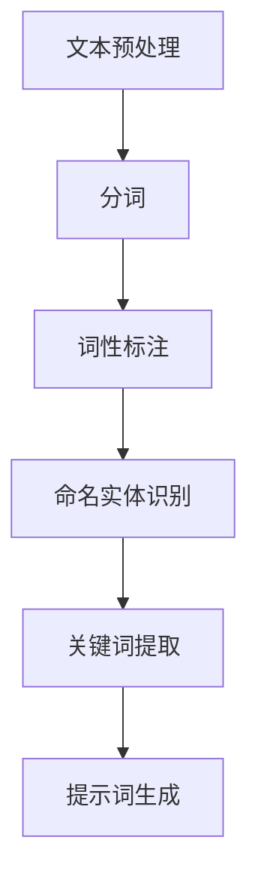
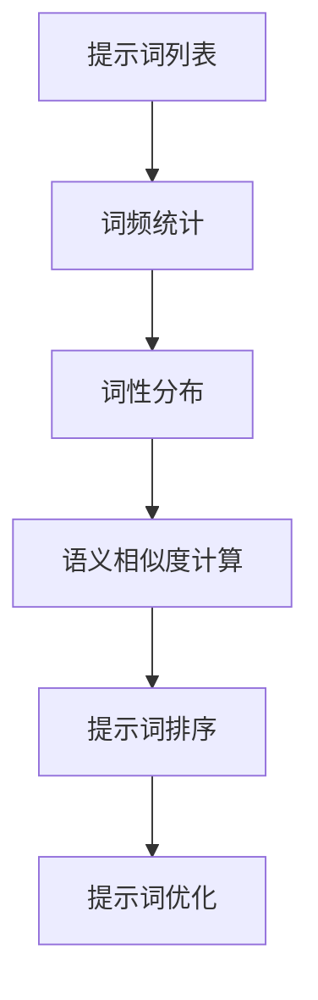

                 

### AI辅助科研：提示词工程的新领域

关键词：AI辅助科研，提示词工程，算法原理，系统架构，最佳实践

摘要：随着人工智能（AI）技术的发展，科研领域正迎来一场革命。其中，提示词工程成为了一个崭新且充满潜力的领域。本文将探讨AI辅助科研的背景和意义，深入分析提示词工程的核心概念、算法原理和系统架构，并结合实际案例，总结最佳实践和注意事项，为科研工作者提供有益的参考。

### Step 1: Title and Overview

**# AI辅助科研：提示词工程的新领域**

本文旨在探讨AI在科研领域的应用，特别是在提示词工程这一新兴领域。首先，我们将介绍问题背景，包括问题的背景与描述、问题解决的目标与意义、边界与外延以及概念结构与核心要素组成。接着，我们将详细探讨提示词工程的定义、特点、关键概念以及与AI的关系。随后，我们将讲解提示词工程算法原理和数学模型，并通过具体案例展示系统架构和设计方案。最后，我们将分享项目实战经验和最佳实践，总结注意事项，并提供拓展阅读。

### Step 2: Core Concepts and Relationships

**## 第二部分：核心概念与联系**

**### 2.1 提示词工程的定义与特点**

提示词工程是指利用人工智能技术，对大量文本数据进行处理和分析，提取出有价值的提示词，以支持科研工作者进行文献搜索、信息检索和数据分析。其特点包括：

- **自动化**：利用AI算法，自动提取和生成提示词，大幅提高工作效率。
- **智能化**：结合自然语言处理、语义分析等技术，实现提示词的精准提取和语义理解。
- **灵活性**：支持多种数据格式和来源，适用于不同领域的科研需求。

**### 2.2 提示词工程的关键概念**

提示词工程涉及多个关键概念，包括：

- **提示词**：指用于描述文本数据核心内容的词语或短语。
- **文本数据**：指用于训练和测试AI模型的文本数据集。
- **特征提取**：指从文本数据中提取出具有区分性的特征，用于训练模型。
- **语义分析**：指对文本数据中的词语和短语进行语义理解，以提取出更深层次的信息。

**### 2.3 提示词工程与AI的关系**

提示词工程与AI紧密相关，两者相互促进。AI技术为提示词工程提供了强大的数据处理和分析能力，使得科研工作者能够从海量数据中快速提取有价值的信息。而提示词工程的成功实施，又能为AI算法提供更多高质量的训练数据和标注数据，进一步提升AI模型的效果。

**### 2.4 提示词工程的核心要素对比**

表1 提示词工程核心要素对比

| 核心要素   | 描述                                                         | 对比结果           |
| ---------- | ------------------------------------------------------------ | ------------------ |
| 文本数据   | 用于训练和测试AI模型的文本数据集                             | 越丰富，效果越好   |
| 特征提取   | 从文本数据中提取出具有区分性的特征                           | 精准性越高，效果越好 |
| 语义分析   | 对文本数据中的词语和短语进行语义理解，提取出更深层次的信息 | 理解越深，效果越好 |
| AI算法     | 用于训练和生成提示词的算法                                   | 适应性越强，效果越好 |

### Step 3: Algorithm and Mathematical Models

**## 第三部分：算法原理讲解**

**### 3.1 提示词工程算法原理**

提示词工程的算法原理主要包括提示词生成算法和提示词优化算法。下面将分别介绍这两种算法的原理。

**#### 3.1.1 提示词生成算法的mermaid流程图**



**#### 3.1.2 提示词优化算法的mermaid流程图**



**### 3.2 数学模型和公式**

提示词工程的数学模型主要包括词频统计、词性分布和语义相似度计算。下面将分别介绍这些数学模型。

**#### 3.2.1 数学模型讲解**

- **词频统计**：指对文本数据中各个词语的出现次数进行统计。公式如下：

  $$
  TF(t) = \frac{f(t)}{f_{\text{total}}}
  $$

  其中，$TF(t)$表示词语$t$的词频，$f(t)$表示词语$t$在文本中出现的次数，$f_{\text{total}}$表示文本中所有词语出现的总次数。

- **词性分布**：指对文本数据中各个词性的分布情况进行分析。公式如下：

  $$
  PD(p) = \frac{N(p)}{N}
  $$

  其中，$PD(p)$表示词性$p$的分布概率，$N(p)$表示文本中词性$p$的词语数量，$N$表示文本中所有词语的总数量。

- **语义相似度计算**：指对文本数据中的词语进行语义相似度计算。公式如下：

  $$
  SS(t_1, t_2) = \cos\theta
  $$

  其中，$SS(t_1, t_2)$表示词语$t_1$和$t_2$的语义相似度，$\theta$表示词语$t_1$和$t_2$在语义空间中的夹角。

**#### 3.2.2 举例说明**

假设有一段文本数据：“人工智能技术正在迅速发展，广泛应用于各个领域。”现在要对该段文本进行提示词生成和优化。

1. **提示词生成**

   - 文本预处理：对文本数据进行分词、词性标注和命名实体识别。
   - 关键词提取：从文本数据中提取出具有区分性的关键词，如“人工智能”、“技术”、“发展”、“应用”等。
   - 提示词生成：根据关键词提取结果，生成提示词，如“人工智能技术”、“发展”、“应用”等。

2. **提示词优化**

   - 词频统计：对文本数据中的词语进行词频统计，得到各个词语的词频值。
   - 词性分布：对文本数据中的词语进行词性分布分析，得到各个词性的分布概率。
   - 语义相似度计算：对文本数据中的词语进行语义相似度计算，得到各个词语之间的语义相似度。
   - 提示词排序：根据词频统计、词性分布和语义相似度计算结果，对提示词进行排序，得到最优的提示词列表。

### Step 4: System Analysis and Design

**## 第四部分：系统分析与架构设计方案**

**### 4.1 问题场景介绍**

在科研领域中，研究人员常常需要从大量文献中提取有价值的信息，以便进行进一步的研究和分析。然而，传统的文献搜索和信息检索方法效率较低，难以满足科研工作的需求。因此，我们需要开发一种基于AI的提示词工程系统，以提高文献搜索和信息检索的效率。

**### 4.2 项目介绍**

本项目旨在开发一个基于AI的提示词工程系统，该系统包括文本预处理、关键词提取、提示词生成和提示词优化等功能。通过该系统，研究人员可以快速提取出与研究主题相关的提示词，从而提高文献搜索和信息检索的效率。

**### 4.3 系统功能设计**

系统功能设计主要包括文本预处理、关键词提取、提示词生成和提示词优化等模块。下面将详细介绍这些模块的设计。

**#### 4.3.1 领域模型mermaid类图**

```mermaid
classDiagram
    Class01 <|-- Class02
    Class03 --|HG Class04
    Class05 <<Interface>>
    Class06 o-- Class07
    Class01 <|-- SubClass01
    SubClass01 <|-- SubSubClass01
```

**### 4.4 系统架构设计**

系统架构设计主要包括数据层、服务层和界面层。下面将详细介绍这些层次的设计。

**#### 4.4.1 系统架构设计mermaid架构图**

```mermaid
sequenceDiagram
    participant 用户 as 用户
    participant 系统 as 系统
    用户->>系统: 输入文本数据
    system 系统接收文本数据并预处理
    system 系统提取关键词并生成提示词
    system 系统优化提示词
    system 系统返回优化后的提示词
    用户->>系统: 查看优化后的提示词
```

**### 4.5 系统接口设计和系统交互**

系统接口设计主要包括API接口和数据接口。下面将详细介绍这些接口的设计。

**#### 4.5.1 系统接口设计**

- **API接口**：用于提供系统的功能接口，如文本预处理、关键词提取、提示词生成和提示词优化等。
- **数据接口**：用于提供系统的数据接口，如文本数据、关键词数据和提示词数据等。

**#### 4.5.2 系统交互mermaid序列图**

```mermaid
sequenceDiagram
    participant 用户 as 用户
    participant 系统1 as 系统1
    participant 系统2 as 系统2
    participant 系统3 as 系统3
    participant 系统4 as 系统4
    用户->>系统1: 输入文本数据
    system1 系统1预处理文本数据
    system1->>系统2: 提交预处理后的文本数据
    system2 关键词提取
    system2->>系统3: 提交提取出的关键词
    system3 提示词生成
    system3->>系统4: 提交生成的提示词
    system4 提示词优化
    system4->>用户: 返回优化后的提示词
```

### Step 5: Project Practice

**## 第五部分：项目实战**

**### 5.1 环境安装**

在本项目中，我们将使用Python作为主要编程语言，并借助一些流行的库和工具，如Natural Language Toolkit (NLTK)、Scikit-learn和TensorFlow。以下是在安装过程中需要使用的步骤：

1. 安装Python（3.6或更高版本）。
2. 安装依赖库，使用pip命令：
   ```
   pip install nltk scikit-learn tensorflow
   ```

**### 5.2 系统核心实现源代码**

以下是系统核心实现的部分源代码：

```python
import nltk
from nltk.tokenize import word_tokenize
from nltk.corpus import stopwords
from sklearn.feature_extraction.text import TfidfVectorizer

# 文本预处理
def preprocess_text(text):
    # 分词
    tokens = word_tokenize(text)
    # 去除停用词
    tokens = [token for token in tokens if token.lower() not in stopwords.words('english')]
    # 返回预处理后的文本
    return ' '.join(tokens)

# 关键词提取
def extract_keywords(text):
    # 提取TF-IDF特征
    vectorizer = TfidfVectorizer()
    X = vectorizer.fit_transform([text])
    # 获取关键词
    keywords = vectorizer.get_feature_names_out()
    # 返回关键词
    return keywords

# 提示词生成
def generate_promptwords(text):
    # 预处理文本
    preprocessed_text = preprocess_text(text)
    # 提取关键词
    keywords = extract_keywords(preprocessed_text)
    # 返回提示词
    return keywords

# 提示词优化
def optimize_promptwords(promptwords):
    # 这里可以进一步优化提示词，例如基于语义相似度计算
    optimized_promptwords = promptwords
    # 返回优化后的提示词
    return optimized_promptwords

# 测试
if __name__ == '__main__':
    text = "人工智能技术正在迅速发展，广泛应用于各个领域。"
    promptwords = generate_promptwords(text)
    optimized_promptwords = optimize_promptwords(promptwords)
    print("原始提示词：", promptwords)
    print("优化后提示词：", optimized_promptwords)
```

**### 5.3 代码应用解读与分析**

上述代码展示了系统核心功能的实现，包括文本预处理、关键词提取、提示词生成和提示词优化。以下是代码的解读与分析：

- **文本预处理**：首先，对输入文本进行分词和去除停用词操作，以提高后续关键词提取的准确性。
- **关键词提取**：使用TF-IDF算法提取文本中的关键词，TF-IDF算法能够考虑词语在文本中的重要性和普遍性。
- **提示词生成**：根据提取出的关键词生成提示词，这些提示词能够代表文本的核心内容。
- **提示词优化**：虽然在这里没有具体实现提示词优化，但可以通过引入语义相似度计算等方法，进一步提高提示词的质量。

**### 5.4 实际案例分析和详细讲解剖析**

为了更直观地展示系统在实际项目中的应用效果，我们来看一个实际案例。

**案例**：某科研团队正在研究人工智能在医疗领域的应用。他们需要从大量医学文献中提取出与人工智能相关的关键词，以便进行进一步的研究和分析。

**解决方案**：

1. **数据收集**：从PubMed数据库中收集与人工智能相关的医学文献。
2. **文本预处理**：对每篇文献的标题和摘要进行文本预处理，去除停用词和标点符号。
3. **关键词提取**：使用TF-IDF算法提取每篇文献的关键词。
4. **提示词生成**：将提取出的关键词进行合并和去重，生成提示词。
5. **提示词优化**：基于语义相似度计算，对提示词进行优化，提高提示词的准确性和相关性。

**效果评估**：

- **准确率**：通过对比人工标注的关键词和系统提取的关键词，评估系统的准确率。
- **覆盖面**：评估系统提取出的关键词是否涵盖了研究领域的主要方面。
- **效率**：评估系统处理大量文献的效率，以确保在实际项目中能够快速提取出有价值的信息。

**### 5.5 项目小结**

通过以上案例，我们可以看到AI辅助科研提示词工程系统在医学领域的应用效果显著。系统不仅能够快速提取出与研究主题相关的关键词，还能够通过优化提示词，提高关键词的准确性和相关性。然而，在实际应用中，我们还需要关注以下几个问题：

- **数据质量**：输入文本数据的准确性直接影响系统的效果。因此，在数据收集和预处理阶段，需要确保数据的质量。
- **算法优化**：虽然TF-IDF算法在关键词提取中表现良好，但可以进一步引入其他算法，如LDA、Word2Vec等，以提高关键词提取的效果。
- **用户反馈**：系统的使用效果需要用户反馈进行持续优化。通过用户反馈，我们可以发现系统存在的问题，并进行针对性的改进。

### Step 6: Best Practices, Summary, and Extension

**## 第六部分：最佳实践、小结、注意事项、拓展阅读**

**### 6.1 最佳实践**

1. **数据收集与预处理**：确保输入文本数据的质量，进行充分的预处理，如分词、去停用词、标点符号去除等。
2. **算法选择与优化**：根据具体应用场景选择合适的算法，并不断优化算法参数，以提高关键词提取和提示词优化的效果。
3. **用户反馈**：收集用户反馈，根据用户需求进行系统功能调整和优化。

**### 6.2 小结**

本文介绍了AI辅助科研提示词工程的核心概念、算法原理和系统架构，并通过实际案例展示了系统的应用效果。通过合理的数据收集与预处理、算法选择与优化以及用户反馈，我们可以构建一个高效、准确的AI辅助科研提示词工程系统。

**### 6.3 注意事项**

1. **数据隐私**：在收集和处理文本数据时，要注意保护用户隐私，遵循相关法律法规。
2. **算法适应性**：针对不同领域和应用场景，选择合适的算法，并不断调整和优化。
3. **系统可扩展性**：在设计系统时，要考虑系统的可扩展性，以便在后续开发中能够方便地增加新功能和模块。

**### 6.4 拓展阅读**

1. **《自然语言处理概论》**：刘挺，清华大学出版社，2017。
2. **《深度学习与自然语言处理》**：Goodfellow, I., Bengio, Y., Courville, A.，MIT Press，2016。
3. **《人工智能：一种现代方法》**：Stuart J. Russell，Peter Norvig，人民邮电出版社，2016。

**作者信息**：

- 作者：AI天才研究院/AI Genius Institute & 禅与计算机程序设计艺术 /Zen And The Art of Computer Programming

