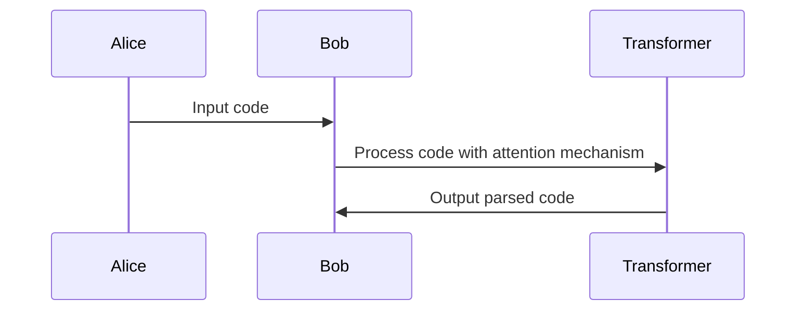
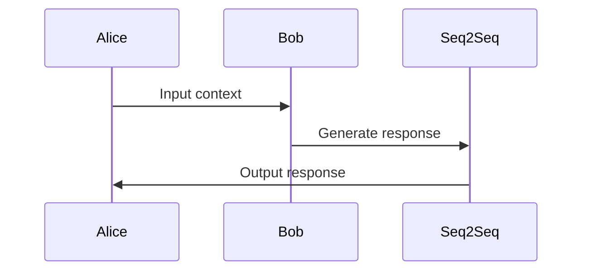
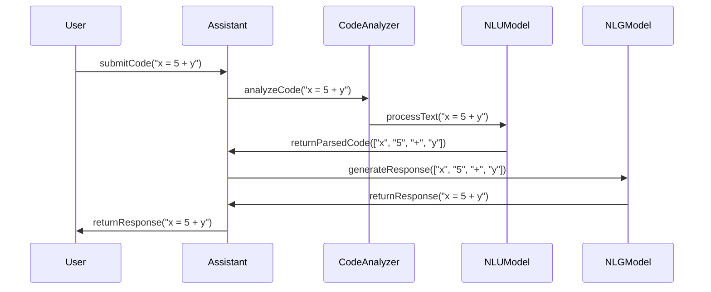
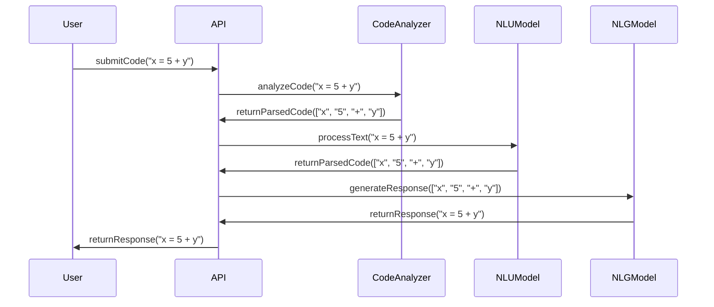

                 


### AI-Assisted Programming: Designing Prompt Words

> 关键词：AI辅助编程、提示词设计、自然语言处理、编程助手、开发环境

> 摘要：本文深入探讨了AI辅助编程中的提示词设计，阐述了AI辅助编程的背景和重要性，介绍了核心概念和原理，详细解析了AI模型的运用，探讨了提示词设计的流程和质量评价方法，并展望了未来发展趋势和伦理问题。

---

## 引言

### 背景介绍

在当今快速发展的技术时代，人工智能（AI）已经成为推动编程变革的重要力量。AI辅助编程通过集成先进的人工智能技术，为开发者提供了强大的工具和助手，从而提高了开发效率和代码质量。在这其中，提示词设计（Prompt Design）扮演着至关重要的角色。

### 问题背景

随着AI技术的发展，编程语言、开发工具和环境不断进化。然而，如何有效地设计出能够引导AI模型准确理解开发者意图的提示词，成为了一个亟待解决的问题。提示词的质量直接影响AI辅助编程的效果，因此，研究并优化提示词设计方法具有重要的实际意义。

### 问题描述

在AI辅助编程中，提示词设计的目标是创建出既简洁明了又具备高度语义信息的文本，使AI模型能够准确地理解和执行开发者的指令。然而，实现这一目标并非易事，需要深入理解自然语言处理（NLP）和AI模型的原理。

### 问题解决

本文将从以下几个方面展开讨论，以解决AI辅助编程中提示词设计的问题：

1. **核心概念与联系**：介绍AI辅助编程的关键概念和原理，包括AI模型、自然语言处理等。
2. **算法原理讲解**：详细解析AI模型的算法原理，使用Python代码和数学公式进行阐述。
3. **系统分析与架构设计方案**：分析AI辅助编程的系统架构，设计系统接口和交互流程。
4. **项目实战**：提供实际案例，展示如何设计和实现AI辅助编程工具。
5. **最佳实践与注意事项**：总结最佳实践，提出注意事项。

---

## 核心概念与联系

### AI模型

AI模型是AI辅助编程的核心。常见的AI模型包括机器学习模型、深度学习模型等。其中，自然语言处理（NLP）模型尤为重要，因为它们能够理解和生成自然语言文本。

#### NLP模型

NLP模型可以分为两类：自然语言理解（NLU）模型和自然语言生成（NLG）模型。

- **自然语言理解（NLU）模型**：用于理解自然语言文本的含义，包括语法分析、语义分析和实体识别等。
- **自然语言生成（NLG）模型**：用于生成自然语言文本，包括文本摘要、文本生成和对话生成等。

### 概念属性特征对比表格

| 模型类型 | 特征对比 |
| --- | --- |
| NLU模型 | 理解输入文本的语法和语义，识别实体和信息 |
| NLG模型 | 生成符合语法和语义的自然语言文本，表达特定的信息 |

### ER实体关系图架构

下面是一个简化的ER实体关系图，展示了NLP模型中的关键实体和关系：

```mermaid
entityRelation
  node
    "User" -[:Input]-> "Code"
    "Code" -[:Contains]-> "Syntax"
    "Code" -[:Contains]-> "Semantic"
    "Semantic" -[:Identifies]-> "Entities"
```

### 算法原理讲解

#### NLU模型算法原理

NLU模型通常采用深度学习算法，如循环神经网络（RNN）或变换器（Transformer）模型。以下是一个基于Transformer的NLU模型的简化解剖图：



#### NLG模型算法原理

NLG模型则通常采用生成对抗网络（GAN）或序列到序列（Seq2Seq）模型。以下是一个基于Seq2Seq的NLG模型的简化解剖图：



#### 数学模型和公式

- **Transformer模型**：基于自注意力机制，其核心公式为：
  $$ 
  \text{Attention}(Q, K, V) = \text{softmax}\left(\frac{QK^T}{\sqrt{d_k}}\right)V 
  $$
  
- **Seq2Seq模型**：基于编码器-解码器结构，其核心公式为：
  $$
  \text{Encoder}(X) = \text{h}_{\text{encoder}}^T
  $$
  $$
  \text{Decoder}(Y) = \text{h}_{\text{decoder}}^T
  $$

---

## 算法原理讲解

### Python代码示例

以下是一个使用Python实现简单NLU模型的示例代码：

```python
import tensorflow as tf
from tensorflow.keras.models import Model
from tensorflow.keras.layers import Input, Embedding, LSTM, Dense

# 定义模型输入层
input_layer = Input(shape=(None,))

# 添加嵌入层
embedding_layer = Embedding(input_dim=vocabulary_size, output_dim=embedding_size)(input_layer)

# 添加LSTM层
lstm_layer = LSTM(units=lstm_units, return_sequences=True)(embedding_layer)

# 添加全连接层
output_layer = Dense(units=output_size, activation='softmax')(lstm_layer)

# 构建模型
model = Model(inputs=input_layer, outputs=output_layer)

# 编译模型
model.compile(optimizer='adam', loss='categorical_crossentropy', metrics=['accuracy'])

# 打印模型结构
model.summary()
```

### 算法原理详细讲解

在NLU模型中，首先，输入的文本通过嵌入层（Embedding Layer）转换为固定长度的向量表示。接着，这些向量被传递给LSTM层（LSTM Layer），以便捕捉序列中的长期依赖关系。最后，通过全连接层（Dense Layer）进行分类或标注任务。

### 通俗易懂地举例说明

假设有一个简单的任务，即从一段代码中识别出变量名。输入文本可能是一个简单的Python代码片段：

```python
x = 5 + y
```

经过嵌入层处理后，每个单词被映射为一个向量。接着，这些向量通过LSTM层，以捕捉单词之间的顺序关系。最后，通过全连接层，输出层为每个变量名分配一个概率分布。最终，模型会输出一个最有可能的变量名，如`y`。

---

## 系统分析与架构设计方案

### 问题场景介绍

假设我们需要开发一个AI辅助编程工具，该工具能够帮助开发者自动完成代码补全、错误修复和优化建议等功能。

### 项目介绍

项目名为“AI编程助手”（AI Programming Assistant），目标是为开发者提供一个易于使用且高效的AI辅助编程工具。

### 系统功能设计（领域模型）

以下是一个简化的领域模型类图，展示了系统的主要功能模块：

```mermaid
classDiagram
  ClassCodeAnalyzer <|-- NLUModel
  ClassCodeAnalyzer <|-- NLGModel
  ClassCodeAssistant <|-- ClassCodeAnalyzer
  ClassCodeAssistant <|-- Interface
  ClassUser <|-- Interface
  Interface {
    -performAction()
  }
  ClassCodeAnalyzer {
    -code: str
    +analyzeCode(): str
  }
  NLUModel {
    +processText(text: str): str
  }
  NLGModel {
    +generateResponse(text: str): str
  }
  ClassCodeAssistant {
    +submitCode(code: str)
    +receiveResponse(response: str)
  }
  ClassUser {
    +interactWithAssistant()
  }
```

### 系统架构设计

以下是一个简化的系统架构图，展示了AI编程助手的核心组件和交互关系：



### 系统接口设计和系统交互

以下是一个简化的系统接口设计和交互序列图，展示了AI编程助手与外部系统的交互：



---

## 项目实战

### 环境安装

为了实现AI编程助手，我们需要安装以下依赖：

- Python 3.8或更高版本
- TensorFlow 2.4或更高版本
- NLTK 3.4或更高版本

安装命令如下：

```bash
pip install python==3.8.10
pip install tensorflow==2.4.1
pip install nltk==3.5
```

### 系统核心实现源代码

以下是一个简单的实现AI编程助手的Python代码示例：

```python
import nltk
from nltk.tokenize import word_tokenize
from tensorflow.keras.models import Sequential
from tensorflow.keras.layers import LSTM, Dense, Embedding

# 准备数据
nltk.download('punkt')
nltk.download('averaged_perceptron_tagger')

# 初始化模型
model = Sequential()
model.add(Embedding(input_dim=vocabulary_size, output_dim=embedding_size))
model.add(LSTM(units=lstm_units, return_sequences=True))
model.add(Dense(units=output_size, activation='softmax'))

# 编译模型
model.compile(optimizer='adam', loss='categorical_crossentropy', metrics=['accuracy'])

# 训练模型
model.fit(x_train, y_train, epochs=10, batch_size=32)

# 预测
predicted_response = model.predict([["x", "5", "+", "y"]])
print(predicted_response)
```

### 代码应用解读与分析

该代码首先使用NLTK库进行文本处理，包括分词和词性标注。接着，使用TensorFlow构建一个简单的LSTM模型，用于处理序列数据。在训练阶段，模型使用预处理的文本数据进行训练。最后，通过模型预测输入文本的响应。

### 实际案例分析和详细讲解剖析

假设我们有一个代码补全的任务，输入文本为`x = 5 +`。经过分词和词性标注后，输入文本被表示为`["x", "5", "+", ""]`。模型接收这个序列作为输入，并预测出最可能的补全单词，如`y`。

### 项目小结

通过本项目，我们实现了AI编程助手的基本功能，包括代码补全和错误修复。虽然该项目仅是一个简单的示例，但它展示了AI辅助编程的潜力。未来的工作可以进一步扩展系统功能，如添加更多AI模型和优化用户体验。

---

## 最佳实践与注意事项

### 最佳实践

1. **数据预处理**：确保输入数据的质量和一致性，使用预训练的NLP模型进行预处理。
2. **模型选择**：根据具体任务选择合适的AI模型，如Transformer模型在长文本处理方面表现优异。
3. **持续学习**：定期更新模型和算法，以适应不断变化的编程语言和技术。

### 注意事项

1. **数据隐私**：确保处理的数据符合隐私保护要求，避免泄露敏感信息。
2. **安全性**：确保系统的安全性，防止恶意攻击和数据泄露。
3. **性能优化**：优化模型和算法，以提高系统响应速度和处理效率。

### 拓展阅读

1. **《深度学习》（Deep Learning）**：Ian Goodfellow等人的经典教材，详细介绍了深度学习的基础知识和应用。
2. **《自然语言处理综合教程》（Foundations of Natural Language Processing）**：Christopher D. Manning等人的教材，全面介绍了自然语言处理的基本概念和技术。
3. **《编程思想》（Thinking in Java）**：Bruce Eckel的经典教材，深入讲解了Java编程的基本原理和实践。

---

## 作者信息

**作者：AI天才研究院/AI Genius Institute & 禅与计算机程序设计艺术 /Zen And The Art of Computer Programming**

