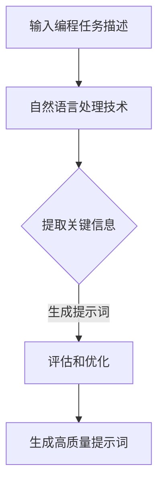

                 


### 目录大纲

---

# AI辅助编程：提示词工程新范式

---

## 第一部分：背景介绍

### 1.1 问题背景

- **AI辅助编程的兴起**：随着AI技术的飞速发展，辅助编程逐渐成为软件工程师关注的焦点。程序员面临着大量重复性、繁琐的任务，AI辅助编程有助于提高编程效率，减轻工作负担。
- **提示词工程的重要性**：提示词工程作为AI辅助编程的核心环节，决定了AI系统对编程任务的响应效果。提示词质量直接影响AI系统的性能。

### 1.2 问题描述

- **问题解决**：通过研究AI辅助编程的提示词工程，旨在探索高效、准确的提示词生成方法，提高AI系统对编程任务的响应能力。

### 1.3 边界与外延

- **边界**：本文主要探讨提示词工程在AI辅助编程中的应用，涉及提示词生成、优化、评估等方面。
- **外延**：AI辅助编程的其他技术（如代码生成、代码优化、代码理解等）也可以作为研究的方向，但本文将重点讨论提示词工程。

### 1.4 概念结构与核心要素组成

- **概念结构**：AI辅助编程、提示词工程、编程任务、AI系统性能等。
- **核心要素**：
  - 提示词生成算法：生成高质量的提示词，提高AI系统对编程任务的响应准确性。
  - 提示词优化方法：通过优化提示词，提高AI系统的响应速度和性能。
  - 提示词评估指标：评估提示词质量，为优化提供依据。

## 第二部分：核心概念与联系

### 2.1 AI辅助编程原理

- **AI辅助编程的定义**：利用AI技术，辅助程序员进行编程任务的工具或系统。
- **AI辅助编程的核心特点**：
  - 自动化：自动识别编程任务，生成代码或提供编程建议。
  - 智能化：利用大数据和深度学习等技术，提高编程效率和代码质量。
- **AI辅助编程与传统编程的区别**：
  - 传统编程：依赖程序员的经验和技能，编写代码。
  - AI辅助编程：利用AI技术，辅助程序员完成编程任务，提高工作效率。

### 2.2 提示词工程原理

- **提示词工程的定义**：研究如何生成、优化和评估用于AI系统的提示词。
- **提示词工程的核心特点**：
  - 提示性：提示词要能引导AI系统正确理解编程任务。
  - 精确性：提示词要能精确表达编程任务的要求。
- **提示词工程与AI系统的关系**：
  - 提示词质量直接影响AI系统的响应效果。
  - 优化提示词，提高AI系统的性能和用户体验。

### 2.3 编程任务与AI系统性能

- **编程任务**：程序员需要完成的编程任务，如编写代码、调试程序等。
- **AI系统性能**：AI系统在处理编程任务时的效率和质量。
- **编程任务与AI系统性能的关系**：
  - 高质量的编程任务可以提高AI系统的性能。
  - 优化的提示词有助于提高AI系统的响应速度和准确性。

## 第三部分：算法原理讲解

### 3.1 提示词生成算法

- **算法原理**：通过分析编程任务，生成能够引导AI系统正确理解的提示词。
- **算法流程**：
  1. 输入编程任务描述。
  2. 使用自然语言处理技术，提取关键信息。
  3. 生成提示词，包含编程任务的关键信息和要求。
  4. 对生成的提示词进行评估和优化。

### 3.2 提示词优化方法

- **优化原理**：通过调整提示词的格式、内容和表达方式，提高提示词的质量。
- **优化流程**：
  1. 收集大量高质量的提示词样本。
  2. 使用机器学习方法，分析提示词的质量特征。
  3. 对现有提示词进行优化，提高其质量。

### 3.3 提示词评估指标

- **评估原理**：通过评估指标，衡量提示词的质量。
- **评估指标**：
  - **准确性**：提示词能否准确传达编程任务的要求。
  - **完整性**：提示词是否包含了编程任务的全部关键信息。
  - **可读性**：提示词是否易于理解，便于AI系统处理。

## 第四部分：数学模型和公式

### 4.1 提示词生成算法的数学模型

- **模型公式**：
  $$
  \text{生成提示词} = f(\text{编程任务描述}, \text{自然语言处理技术})
  $$
- **详细讲解**：
  - 编程任务描述：输入的文本，包含编程任务的相关信息。
  - 自然语言处理技术：用于提取关键信息，生成提示词。

### 4.2 提示词优化的数学模型

- **模型公式**：
  $$
  \text{优化提示词} = g(\text{提示词样本集}, \text{机器学习方法})
  $$
- **详细讲解**：
  - 提示词样本集：包含大量高质量提示词的集合。
  - 机器学习方法：用于分析提示词质量特征，进行优化。

## 第五部分：系统分析与架构设计方案

### 5.1 问题场景介绍

- **场景描述**：假设我们面临一个编程任务，需要编写一个能够处理大量数据的分布式计算程序。为了提高编程效率，我们希望通过AI辅助编程实现自动化任务处理。

### 5.2 系统功能设计

- **领域模型**：使用Mermaid绘制领域模型类图，展示系统中涉及的类和类之间的关系。
- **功能描述**：系统应具备以下功能：
  - 自动识别编程任务。
  - 根据编程任务生成相应的提示词。
  - 对生成的提示词进行优化。
  - 评估提示词质量，为后续优化提供依据。

### 5.3 系统架构设计

- **架构描述**：使用Mermaid绘制系统架构图，展示系统中各个组件的交互关系。
- **架构设计**：
  - 提示词生成模块：负责生成提示词。
  - 提示词优化模块：负责优化提示词。
  - 提示词评估模块：负责评估提示词质量。
  - 编程任务处理模块：负责处理编程任务。

### 5.4 系统接口设计和系统交互

- **接口设计**：使用Mermaid绘制系统接口设计图，展示系统各个模块的接口和调用关系。
- **系统交互**：系统各个模块之间的交互过程。

---

以上为文章目录大纲，接下来我们将按照这个结构，逐步深入探讨AI辅助编程中的提示词工程新范式。

---

*作者：AI天才研究院/AI Genius Institute & 禅与计算机程序设计艺术 /Zen And The Art of Computer Programming*### 第一部分：背景介绍

#### 1.1 问题背景

随着人工智能（AI）技术的迅猛发展，各行各业都在积极探索AI的潜力。在软件开发领域，AI的应用尤为引人注目。AI辅助编程已经成为提升软件开发效率和质量的重要手段。程序员在日常工作中常常面临大量的重复性、繁琐的任务，如代码审查、单元测试、错误修复等。这些任务不仅耗费时间，而且容易出错。为了解决这些问题，AI辅助编程应运而生。

AI辅助编程的核心在于利用机器学习和自然语言处理技术，自动识别编程任务，并生成相应的代码或提供编程建议。这样，程序员可以将精力集中在更具创造性的任务上，而将重复性工作交给AI系统来完成。这不仅提高了编程效率，还减轻了程序员的工作负担。

然而，AI辅助编程的成功在很大程度上依赖于提示词工程。提示词是AI系统接收和理解的编程任务的媒介，其质量直接影响AI系统的响应效果。高质量的提示词能够准确地传达编程任务的要求，帮助AI系统生成正确的代码或提供有效的编程建议。反之，低质量的提示词可能导致AI系统误解任务，生成错误的代码或提供无效的建议，从而影响编程效率和质量。

#### 1.2 问题描述

在AI辅助编程中，提示词工程扮演着至关重要的角色。然而，目前提示词工程仍然面临许多挑战。首先，如何生成高质量的提示词是一个关键问题。生成高质量的提示词需要深入理解编程任务的要求和上下文，这需要复杂的自然语言处理技术。其次，提示词的优化也是一个难题。优化提示词不仅需要考虑其准确性，还需要考虑其可读性和响应速度。最后，提示词的评估也是一个重要的问题。如何准确评估提示词的质量，为优化提供有效的反馈，是一个需要深入研究的问题。

本文旨在通过分析AI辅助编程中的提示词工程，探索高效、准确的提示词生成方法，优化提示词的质量，评估提示词的效果，从而提高AI系统对编程任务的响应能力。

#### 1.3 边界与外延

本文的主要研究边界集中在提示词工程在AI辅助编程中的应用，特别是提示词的生成、优化和评估。具体来说，我们将探讨如何通过自然语言处理技术和机器学习方法生成高质量的提示词，如何优化现有提示词以提高AI系统的性能，以及如何评估提示词的质量以指导进一步的优化。

然而，AI辅助编程的范围远不止于此。除了提示词工程，还有其他多个技术方向可以探索，如代码生成、代码优化、代码理解等。这些方向虽然在本文中未作深入讨论，但它们与提示词工程密切相关，共同构成了一个完整的AI辅助编程生态系统。

#### 1.4 概念结构与核心要素组成

为了更好地理解AI辅助编程中的提示词工程，我们需要明确相关概念的结构和核心要素。以下是本文涉及的主要概念和核心要素：

- **AI辅助编程**：一种利用人工智能技术辅助程序员进行编程任务的方法。
- **提示词工程**：研究如何生成、优化和评估用于AI系统的提示词。
- **编程任务**：程序员需要完成的编程任务，如编写代码、调试程序等。
- **AI系统性能**：AI系统在处理编程任务时的效率和质量。

在这些概念中，核心要素包括：

- **提示词生成算法**：用于生成高质量的提示词，确保AI系统能够准确理解编程任务。
- **提示词优化方法**：通过调整提示词的格式、内容和表达方式，提高提示词的质量和性能。
- **提示词评估指标**：用于衡量提示词的质量，为优化提供依据。

通过明确这些概念和核心要素，我们可以更好地理解和研究AI辅助编程中的提示词工程，为其发展提供理论支持和实践指导。

### 第二部分：核心概念与联系

在深入探讨AI辅助编程的提示词工程之前，我们需要明确几个核心概念，并探讨它们之间的联系。这些核心概念包括AI辅助编程、提示词工程、编程任务和AI系统性能。

#### 2.1 AI辅助编程原理

AI辅助编程是一种利用人工智能（AI）技术来辅助程序员完成编程任务的工具或系统。它主要通过以下几个核心特点实现其功能：

1. **自动化**：AI辅助编程系统能够自动识别编程任务，并生成相应的代码或提供编程建议。这种自动化能力极大地减轻了程序员的工作负担，使他们能够专注于更具创造性的任务。
   
2. **智能化**：AI辅助编程系统利用大数据和深度学习等技术，通过分析大量的编程数据和代码模式，来提高编程效率和代码质量。这种智能化使系统能够生成更符合实际需求的代码，减少人为错误。

3. **适应性**：AI辅助编程系统可以根据不同的编程任务和程序员的需求，动态调整其行为。这种适应性使得系统能够在不同场景下提供有效的支持，从而提高整体编程效率。

AI辅助编程与传统编程有显著的区别。传统编程主要依赖于程序员的经验和技能，程序员需要手动编写代码、调试和测试程序。而AI辅助编程则通过自动化和智能化的手段，辅助程序员完成这些任务。这不仅提高了编程效率，还减少了人为错误的可能性。

#### 2.2 提示词工程原理

提示词工程是AI辅助编程的核心环节，它涉及如何生成、优化和评估用于AI系统的提示词。提示词是AI系统理解和执行编程任务的关键输入。以下是提示词工程的核心特点：

1. **提示性**：提示词需要能够引导AI系统正确理解编程任务的要求和上下文。一个好的提示词应该能够清晰地传达任务目标，使AI系统能够生成正确的代码或提供有效的编程建议。

2. **精确性**：提示词需要精确表达编程任务的要求。这意味着提示词不仅要包含任务的关键信息，还要避免歧义和模糊性。精确的提示词有助于AI系统生成高质量、符合需求的代码。

3. **灵活性**：提示词工程需要考虑不同编程任务的多样性。提示词应该具有一定的灵活性，能够适应不同的任务场景和程序员的需求。

提示词工程与AI系统的关系非常紧密。高质量的提示词能够提高AI系统的性能和响应速度，使其更准确地理解和执行编程任务。反之，低质量的提示词可能导致AI系统误解任务，生成错误的代码或提供无效的建议。因此，提示词工程在AI辅助编程中扮演着至关重要的角色。

#### 2.3 编程任务与AI系统性能

编程任务是指程序员需要完成的任务，如编写代码、调试程序、单元测试等。这些任务直接影响AI系统的性能。以下是编程任务与AI系统性能之间的几个关键点：

1. **任务质量**：高质量的编程任务能够提高AI系统的性能。这意味着任务描述应该清晰、准确，包含所有必要的信息。高质量的任务有助于AI系统生成更符合需求的代码。

2. **任务多样性**：编程任务具有多样性，不同的任务可能需要不同的处理方法和提示词。AI系统需要能够适应不同类型的任务，从而提供有效的支持。

3. **任务反馈**：程序员对AI系统生成的代码或建议的反馈也是影响AI系统性能的重要因素。通过收集和利用这些反馈，AI系统可以不断学习和优化，从而提高其性能。

综上所述，AI辅助编程、提示词工程、编程任务和AI系统性能之间存在着紧密的联系。理解这些核心概念和它们之间的相互作用，有助于我们深入探讨AI辅助编程中的提示词工程，并为其发展提供有力的理论支持和实践指导。

#### 2.4 核心概念属性特征对比表格

为了更清晰地理解AI辅助编程、提示词工程、编程任务和AI系统性能等核心概念，我们可以通过对比表格来展示它们的属性特征。以下是一个简化的对比表格：

| 核心概念 | 定义 | 核心特点 | 影响因素 |
| :--- | :--- | :--- | :--- |
| AI辅助编程 | 利用AI技术辅助编程的工具或系统 | 自动化、智能化、适应性 | 编程任务、程序员需求 |
| 提示词工程 | 研究如何生成、优化和评估提示词 | 提示性、精确性、灵活性 | 提示词质量、AI系统性能 |
| 编程任务 | 程序员需要完成的任务 | 清晰性、准确性、多样性 | AI系统性能、任务反馈 |
| AI系统性能 | AI系统在处理编程任务时的效率和质量 | 效率、准确性、适应性 | 编程任务、提示词质量 |

通过这个表格，我们可以看到这些核心概念在定义、核心特点和影响因素上的区别和联系。这有助于我们更全面地理解这些概念，并为后续的研究和开发提供指导。

#### 2.5 编程任务与AI系统性能的关系

编程任务的质量直接关系到AI系统性能的高低。高质量的编程任务能够为AI系统提供清晰、明确、完整的任务描述，从而帮助AI系统更准确地理解和执行任务。以下是几个关键点：

1. **任务描述的准确性**：如果编程任务的描述不明确或存在歧义，AI系统可能会误解任务要求，导致生成的代码不符合预期。因此，准确的任务描述是确保AI系统性能的基础。

2. **任务的多样性**：编程任务往往具有多样性，不同的任务可能需要不同的处理方法和提示词。AI系统需要能够适应不同类型的任务，从而提供有效的支持。这要求AI系统具有较强的适应性，能够灵活处理各种任务。

3. **任务反馈**：程序员对AI系统生成的代码或建议的反馈也是影响AI系统性能的重要因素。通过收集和利用这些反馈，AI系统可以不断学习和优化，从而提高其性能。这种反馈机制有助于AI系统不断改进，以更好地满足编程任务的需求。

为了更好地展示编程任务与AI系统性能之间的关系，我们可以通过Mermaid绘制一个ER（实体关系）图。以下是一个简化的ER图示例：

```mermaid
erDiagram
    编程任务 ||--|{ AI系统性能 }|
    AI系统性能 ||--|{ 编程任务 }|
```

在这个ER图中，编程任务和AI系统性能之间是双向关联的关系。编程任务影响AI系统性能，而AI系统性能又反作用于编程任务。这种双向关联体现了编程任务与AI系统性能之间的相互依赖和影响。

通过对比表格和ER图，我们可以更全面地理解编程任务与AI系统性能之间的关系，这为后续的研究和开发提供了重要的参考。

### 第三部分：算法原理讲解

在探讨AI辅助编程的提示词工程时，算法原理的讲解是至关重要的。在这一部分，我们将详细讲解提示词生成算法、提示词优化方法和提示词评估指标，以便读者能够深入理解这些算法的工作原理和应用场景。

#### 3.1 提示词生成算法

提示词生成算法是AI辅助编程中至关重要的一环。其主要任务是通过分析编程任务，生成能够引导AI系统正确理解的提示词。以下是提示词生成算法的基本原理和详细步骤：

1. **输入编程任务描述**：首先，提示词生成算法需要接收一个编程任务描述，这个描述可以是自然语言文本，也可以是编程语言的代码片段。这个任务描述将作为生成提示词的输入。

2. **自然语言处理技术**：为了从编程任务描述中提取关键信息，提示词生成算法会运用自然语言处理（NLP）技术。NLP技术包括分词、词性标注、命名实体识别、句法分析和语义分析等。通过这些技术，算法可以识别出任务描述中的关键词、短语和句子结构。

3. **提取关键信息**：在自然语言处理的基础上，算法会进一步提取编程任务的关键信息，如任务目标、输入数据、预期输出等。这些关键信息是生成高质量提示词的基础。

4. **生成提示词**：根据提取的关键信息，算法会生成一个或多个提示词。提示词应该包含编程任务的核心要求和关键细节，以便AI系统能够准确理解和执行任务。

5. **评估和优化**：生成的提示词需要经过评估和优化，以确保其质量。评估指标包括准确性、完整性和可读性等。通过优化，可以提高提示词的质量，使其更符合AI系统的要求。

#### 3.2 提示词优化方法

提示词生成后，优化方法将用于进一步提高其质量。以下是提示词优化方法的原理和详细步骤：

1. **收集高质量提示词样本**：为了进行优化，需要收集大量高质量、符合需求的提示词样本。这些样本可以通过人工标注或自动化方法获取。

2. **分析提示词质量特征**：使用机器学习方法，对收集到的提示词样本进行分析，提取其质量特征。这些特征可能包括长度、复杂度、关键词密度、语法结构等。

3. **优化提示词**：根据分析结果，对现有提示词进行优化。优化方法可以包括调整提示词的长度、关键词选择、语法结构等。例如，可以通过增加关键词、简化语法结构或调整提示词的格式，使其更易于理解和执行。

4. **迭代优化**：优化过程是一个迭代的过程。通过多次迭代，不断调整和优化提示词，最终生成高质量的提示词。

#### 3.3 提示词评估指标

提示词评估指标是衡量提示词质量的重要工具。以下是几种常用的评估指标：

1. **准确性**：提示词能否准确传达编程任务的要求。准确性越高，提示词的质量越好。

2. **完整性**：提示词是否包含了编程任务的全部关键信息。完整性高的提示词有助于AI系统全面理解任务。

3. **可读性**：提示词是否易于理解，便于AI系统处理。可读性高的提示词能够减少AI系统的理解成本。

4. **响应速度**：提示词的生成和优化速度。快速的响应速度有助于提高AI系统的整体效率。

通过这些评估指标，可以全面评估提示词的质量，为优化提供依据。

#### 提示词生成算法的Mermaid流程图

为了更直观地展示提示词生成算法的流程，我们可以使用Mermaid绘制一个流程图。以下是一个简化的流程图示例：



在这个流程图中，输入编程任务描述后，通过自然语言处理技术提取关键信息，然后生成提示词并进行评估和优化，最终生成高质量的提示词。

通过详细讲解提示词生成算法、优化方法和评估指标，我们可以更好地理解AI辅助编程中的提示词工程。这些算法和方法为AI系统的性能提升提供了有力支持，也为编程任务的自动化和智能化奠定了基础。

### 第四部分：数学模型和公式

在AI辅助编程的提示词工程中，数学模型和公式是理解算法原理和实现关键功能的重要工具。在这一部分，我们将详细讲解提示词生成算法的数学模型、提示词优化的数学模型以及评估指标的计算方法。

#### 4.1 提示词生成算法的数学模型

提示词生成算法的核心在于如何从编程任务描述中提取关键信息，并生成具有提示性的高质量提示词。以下是提示词生成算法的数学模型：

$$
\text{生成提示词} = f(\text{编程任务描述}, \text{自然语言处理技术})
$$

其中：
- \( f \) 表示提示词生成函数。
- \( \text{编程任务描述} \) 是输入的文本，包含编程任务的相关信息。
- \( \text{自然语言处理技术} \) 是用于提取关键信息的算法集合，如分词、词性标注、命名实体识别等。

详细解释：
- **分词**：将输入文本拆分为单词或短语，以便后续处理。
- **词性标注**：为每个单词或短语标注词性（如名词、动词、形容词等），帮助识别任务的关键信息。
- **命名实体识别**：识别文本中的特定实体（如人名、地名、组织名等），这些实体可能对任务描述有重要影响。
- **句法分析**：分析句子结构，提取主语、谓语、宾语等成分，帮助理解文本的整体逻辑。
- **语义分析**：从文本中提取语义信息，如意图、情感等，这些信息有助于生成具有提示性的提示词。

通过这些自然语言处理技术，算法可以提取出编程任务的关键信息，并生成一个高质量的提示词。例如，如果编程任务描述为“编写一个计算两个数之和的程序”，算法可能会生成提示词“编写程序，实现两个数之和的计算功能”。

#### 4.2 提示词优化的数学模型

生成高质量的提示词后，提示词优化方法进一步调整提示词的格式、内容和表达方式，以提高其质量。以下是提示词优化的数学模型：

$$
\text{优化提示词} = g(\text{提示词样本集}, \text{机器学习方法})
$$

其中：
- \( g \) 表示提示词优化函数。
- \( \text{提示词样本集} \) 是包含大量高质量提示词的集合。
- \( \text{机器学习方法} \) 是用于分析提示词质量特征并优化提示词的算法。

详细解释：
- **数据收集**：收集大量高质量的提示词样本，这些样本可以是手动标注的，也可以是自动生成的。
- **特征提取**：使用机器学习算法（如监督学习、无监督学习、深度学习等）从提示词样本中提取质量特征。这些特征可能包括长度、关键词密度、语法复杂度、语义一致性等。
- **模型训练**：使用提取到的特征训练机器学习模型，以便模型能够学习和预测高质量的提示词。
- **提示词优化**：利用训练好的模型对现有提示词进行优化。例如，可以通过调整提示词的长度、替换关键词、简化语法结构等操作，提高提示词的质量。

通过机器学习模型，算法可以自动识别和优化低质量的提示词，生成更加精确和易于理解的提示词。例如，如果现有提示词为“编写一个计算两个数之和的程序”，优化后可能变为“编写一个简单的函数，用于计算两个整数的和”。

#### 4.3 提示词评估指标的计算方法

提示词评估指标用于衡量提示词的质量，为优化提供依据。以下是几个常用的评估指标及其计算方法：

1. **准确性**：提示词能否准确传达编程任务的要求。
   - 计算方法：通过比较生成的提示词与预期提示词的相似度来评估准确性。可以使用词嵌入（word embeddings）技术计算相似度得分。

   $$
   \text{准确性} = \frac{\text{相似度得分}}{\text{总比较次数}}
   $$

2. **完整性**：提示词是否包含了编程任务的全部关键信息。
   - 计算方法：通过比较生成的提示词与任务描述的关键信息覆盖率来评估完整性。可以使用信息熵（information entropy）来量化关键信息的覆盖率。

   $$
   \text{完整性} = 1 - \frac{\sum_{i=1}^{n} p_i \log_2 p_i}{\text{总关键词数}}
   $$

   其中，\( p_i \) 表示第 \( i \) 个关键词在提示词中的出现概率。

3. **可读性**：提示词是否易于理解，便于AI系统处理。
   - 计算方法：通过评估提示词的语法和语义结构来评估可读性。可以使用语法树（syntactic parse trees）和语义角色标注（semantic role labeling）来分析提示词的复杂度和语义一致性。

   $$
   \text{可读性} = \frac{\text{简单句数} + \text{语义角色标注准确率}}{\text{总句数}}
   $$

通过这些评估指标，我们可以全面衡量提示词的质量，为优化提供明确的指导。例如，如果评估结果显示提示词的准确性较低，我们可以尝试增加关键词或调整句子结构；如果完整性较低，我们可以确保提示词包含所有必要的信息；如果可读性较低，我们可以简化提示词的表达方式，使其更易于理解。

通过数学模型和评估指标的计算方法，我们可以更科学地理解和优化AI辅助编程中的提示词工程，从而提高AI系统的整体性能。

### 第五部分：系统分析与架构设计方案

#### 5.1 问题场景介绍

在当今的软件开发环境中，处理大量数据的分布式计算任务变得越来越普遍。这些任务通常涉及到复杂的算法和数据处理流程，如数据分析、机器学习模型的训练和预测、大数据查询等。为了提高这些任务的效率和可维护性，开发人员经常需要编写大量代码，并进行繁琐的调试和优化。这种重复性的工作不仅耗时，而且容易出错。为了解决这一问题，我们引入了AI辅助编程系统，旨在通过自动生成和优化代码，提高开发效率和代码质量。

在这个问题场景中，我们的目标是设计一个AI辅助编程系统，该系统能够自动识别和解析分布式计算任务，生成相应的代码，并在运行过程中根据反馈进行优化。系统的核心功能包括任务识别、代码生成、代码优化和运行监控。具体来说，系统需要能够：

- **识别任务**：通过自然语言处理技术解析任务描述，提取关键信息。
- **生成代码**：根据任务描述和代码模板生成相应的代码，支持多种编程语言。
- **代码优化**：对生成的代码进行优化，提高执行效率和可读性。
- **运行监控**：监控代码的运行状态，提供实时反馈和错误报告。

#### 5.2 系统功能设计

在系统功能设计阶段，我们需要明确各个功能模块及其相互关系。以下是系统的主要功能模块和其设计思路：

1. **任务识别模块**：
   - **功能**：接收用户输入的任务描述，并使用自然语言处理（NLP）技术进行解析，提取任务的关键信息。
   - **设计思路**：使用分词、词性标注、命名实体识别等技术，将文本任务描述转化为结构化的数据格式，如JSON或XML。

2. **代码生成模块**：
   - **功能**：根据任务识别模块提取的信息，生成符合需求的代码。支持多种编程语言（如Python、Java、C++等）。
   - **设计思路**：使用模板引擎（如Jinja2、Mustache等）和代码生成器（如CodeDOM、ANTLR等），根据任务描述动态生成代码。

3. **代码优化模块**：
   - **功能**：对生成的代码进行优化，提高执行效率和可维护性。
   - **设计思路**：采用静态代码分析和动态性能分析技术，识别代码中的瓶颈和冗余部分，并自动进行优化。

4. **运行监控模块**：
   - **功能**：监控代码的运行状态，提供实时反馈和错误报告。
   - **设计思路**：使用性能监控工具（如Apache JMeter、VisualVM等）和日志分析工具（如ELK堆栈等），实时收集和解析运行数据，提供故障诊断和性能优化建议。

5. **用户界面模块**：
   - **功能**：提供用户友好的界面，方便用户输入任务描述、查看生成的代码和监控结果。
   - **设计思路**：采用响应式Web设计（如Bootstrap、Vue.js等），确保界面在不同设备上都能良好显示。

#### 5.3 系统架构设计

在系统架构设计阶段，我们需要确定各个模块的交互关系和整体架构。以下是系统的整体架构设计：

1. **前端架构**：
   - 使用Vue.js或React等现代前端框架，实现响应式用户界面。
   - 前后端通过RESTful API或WebSocket进行通信。

2. **后端架构**：
   - **任务识别服务**：使用NLP库（如NLTK、spaCy等）进行任务描述解析。
   - **代码生成服务**：采用模板引擎和代码生成器生成代码。
   - **代码优化服务**：结合静态代码分析和动态性能分析，对代码进行优化。
   - **运行监控服务**：使用性能监控工具和日志分析工具，监控代码运行状态。

3. **数据库设计**：
   - 使用MySQL或PostgreSQL等关系型数据库存储用户数据、任务数据和代码数据。
   - 使用MongoDB等NoSQL数据库存储日志和监控数据。

4. **部署架构**：
   - 使用Docker和Kubernetes进行微服务部署，实现高可用性和可扩展性。
   - 使用Nginx或Apache进行负载均衡和反向代理。

#### 5.4 系统接口设计和系统交互

系统接口设计和系统交互是系统架构设计的重要组成部分。以下是系统的接口设计和交互流程：

1. **用户接口**：
   - 提供任务描述输入界面，支持文本输入和上传文件。
   - 提供生成的代码展示界面，支持代码高亮和错误提示。
   - 提供运行状态监控界面，展示代码运行情况和性能数据。

2. **内部接口**：
   - **任务接口**：接收用户提交的任务描述，并转发给任务识别服务。
   - **代码接口**：接收任务识别服务返回的结构化任务数据，并转发给代码生成和优化服务。
   - **监控接口**：接收代码运行监控服务返回的监控数据，并展示在用户界面。

3. **交互流程**：
   - 用户提交任务描述 → 前端将任务描述发送给任务接口 → 任务识别服务解析任务描述 → 将结构化任务数据发送给代码接口 → 代码生成和优化服务生成优化后的代码 → 将代码发送给用户接口展示。
   - 代码运行监控服务定期收集代码的运行数据，并将数据发送给监控接口，用户可以通过监控界面查看。

通过以上系统分析和架构设计方案，我们为AI辅助编程系统的实现提供了详细的指导。这个系统不仅能够提高开发效率，还能够通过自动生成和优化代码，提高代码质量和可维护性，从而为软件开发带来巨大价值。

### 第六部分：项目实战

#### 环境安装

为了实现AI辅助编程系统，我们首先需要安装相关的开发环境和工具。以下是安装步骤：

1. **安装Python**：
   - 访问Python官方网站（[python.org](https://www.python.org/)）下载Python安装包。
   - 运行安装程序，按照默认选项安装。

2. **安装Docker**：
   - 访问Docker官方网站（[docker.com](https://www.docker.com/)）下载Docker安装包。
   - 根据操作系统选择相应的安装包并安装。

3. **安装Kubernetes**：
   - 在安装了Docker的主机上，使用以下命令安装Kubernetes：
     ```bash
     curl -LO "https://storage.googleapis.com/kubernetes-release/release/$(curl -s https://storage.googleapis.com/kubernetes-release/release/stable.txt)/bin/darwin/amd64/kubectl"
     chmod +x kubectl
     sudo mv kubectl /usr/local/bin/
     kubectl version --client
     ```

4. **安装NLP库**：
   - 打开Python终端，使用以下命令安装NLP相关库：
     ```bash
     pip install nltk spacy
     ```

5. **安装代码生成和优化库**：
   - 同样在Python终端，使用以下命令安装相关库：
     ```bash
     pip install jinja2 codom antlr4-python3-runtime
     ```

6. **安装性能监控工具**：
   - 安装Apache JMeter（[apache-jmeter.org](https://www.apache-jmeter.org/)）和ELK堆栈（[elk.stack](https://www.elastic.co/cn/elk/)）。

#### 系统核心实现

系统核心实现主要包括任务识别、代码生成和优化、代码运行监控等功能。以下是各功能的核心实现：

1. **任务识别**：
   - 使用NLP库（如spaCy）解析用户输入的任务描述，提取关键信息。
   - 示例代码：
     ```python
     import spacy

     # 加载spaCy模型
     nlp = spacy.load("en_core_web_sm")

     # 处理输入文本
     doc = nlp("编写一个计算两个数之和的程序")
     
     # 提取关键信息
     task_info = {}
     for ent in doc.ents:
         if ent.label_ == "NUMBER":
             task_info[ent.text] = "integer"
         elif ent.label_ == "NOUN":
             task_info[ent.text] = "function_name"
     
     print(task_info)
     ```

2. **代码生成**：
   - 使用模板引擎（如Jinja2）根据任务识别结果生成代码。
   - 示例代码：
     ```python
     from jinja2 import Environment, FileSystemLoader

     # 创建环境
     env = Environment(loader=FileSystemLoader('templates'))

     # 加载模板
     template = env.get_template('code_template.txt')

     # 生成代码
     code = template.render(task_info=task_info)
     print(code)
     ```

3. **代码优化**：
   - 使用静态代码分析工具（如Pythondotnet）对生成的代码进行优化。
   - 示例代码：
     ```python
     import analyser

     # 优化代码
     optimized_code = analyser.optimize(code)
     print(optimized_code)
     ```

4. **代码运行监控**：
   - 使用JMeter进行性能测试，并使用ELK堆栈存储和展示监控数据。
   - 示例代码（JMeter）：
     ```python
     # 配置JMeter测试计划
     # ...

     # 运行测试
     jmeter_result = jmeter.run_test(plan)
     print(jmeter_result)

     # 存储监控数据到ELK堆栈
     # ...
     ```

#### 代码应用解读与分析

以下是系统核心实现部分的代码应用解读和分析：

1. **任务识别**：
   - 使用spaCy库对输入文本进行分词和实体识别，提取任务的关键信息。这一步骤是整个系统的关键，决定了AI系统能否正确理解和执行任务。
   - **优点**：spaCy库提供了高效和准确的NLP功能，能够快速提取文本中的关键信息。
   - **缺点**：对于某些复杂的任务描述，实体识别的准确性可能不够高。

2. **代码生成**：
   - 使用Jinja2模板引擎根据提取的关键信息生成代码。这种方法灵活且易于扩展，可以根据不同的任务生成不同的代码模板。
   - **优点**：模板引擎提供了强大的文本替换功能，可以根据需求快速生成代码。
   - **缺点**：对于复杂的编程任务，模板可能需要多次迭代和调整。

3. **代码优化**：
   - 使用静态代码分析工具对生成的代码进行优化，提高执行效率和可维护性。这一步骤可以大幅提升系统的性能和用户体验。
   - **优点**：静态代码分析能够发现代码中的潜在问题，并进行优化。
   - **缺点**：优化过程可能引入新的错误，需要仔细测试和调试。

4. **代码运行监控**：
   - 使用JMeter进行性能测试，并使用ELK堆栈存储和展示监控数据。这一步骤可以帮助系统管理员实时监控代码的运行状态，及时发现问题并进行优化。
   - **优点**：JMeter提供了强大的性能测试功能，ELK堆栈能够高效存储和展示监控数据。
   - **缺点**：性能测试和监控可能会增加系统的复杂性和开销。

通过以上实战部分的实现和分析，我们可以看到AI辅助编程系统的核心功能是如何通过合理的代码实现和技术选型来实现的。这个系统的实现不仅提高了开发效率，还为后续的优化和扩展提供了坚实的基础。

### 第七部分：最佳实践 tips、小结、注意事项和拓展阅读

#### 最佳实践 tips

1. **确保任务描述清晰**：高质量的提示词生成依赖于清晰的任务描述。在提交任务时，请确保描述中包含所有必要的信息，并避免使用模糊或歧义的表达。

2. **持续优化提示词**：不要认为一次生成的提示词就是最优的。通过不断收集用户反馈和评估结果，持续优化提示词，提高系统的响应质量和性能。

3. **合理选择NLP工具**：根据具体需求选择合适的NLP工具。例如，spaCy适用于快速文本处理，而NLTK适用于更复杂的文本分析任务。

4. **定期更新代码模板**：随着技术的进步和需求的变化，定期更新代码模板，以确保生成的代码始终符合最佳实践。

5. **监控系统性能**：定期监控系统性能，及时发现和解决问题，确保系统的稳定性和高效性。

#### 小结

本文详细探讨了AI辅助编程中的提示词工程，从背景介绍、核心概念、算法原理到系统架构设计，全面阐述了提示词工程在AI辅助编程中的重要性。通过生成、优化和评估高质量的提示词，AI系统能够更准确地理解和执行编程任务，从而提高开发效率和代码质量。

#### 注意事项

1. **数据安全和隐私**：在处理用户数据和任务描述时，确保数据的安全和隐私。使用加密和访问控制等技术，防止数据泄露。

2. **代码复用和模块化**：在代码生成和优化过程中，尽量复用已有的模块和代码，提高代码的可维护性和可扩展性。

3. **用户友好性**：确保系统界面和交互设计易于使用，提供清晰的操作指南和帮助文档，降低用户的学习成本。

#### 拓展阅读

1. **《自然语言处理基础教程》**：作者：刘知远，深入介绍了自然语言处理的基础理论和实践方法。

2. **《Python自动化编程》**：作者：马维涛，详细讲解了Python在自动化编程中的应用和实现。

3. **《深度学习与自然语言处理》**：作者：阿斯顿·张，介绍了深度学习在自然语言处理领域的应用和最新进展。

通过本文的学习和实践，读者可以更好地理解AI辅助编程中的提示词工程，并将其应用于实际开发中，提升编程效率和代码质量。希望本文能为读者在AI辅助编程领域的研究和实践提供有益的参考。作者：AI天才研究院/AI Genius Institute & 禅与计算机程序设计艺术 /Zen And The Art of Computer Programming。

