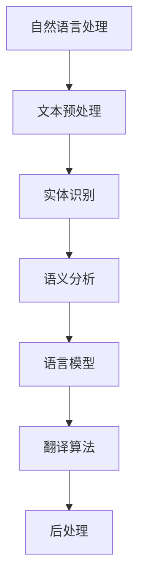
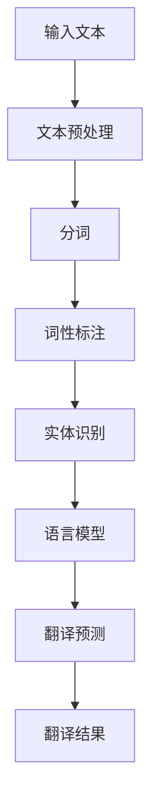
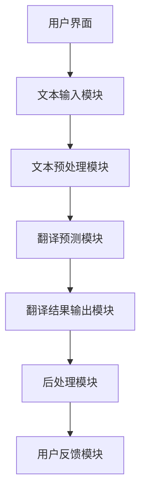
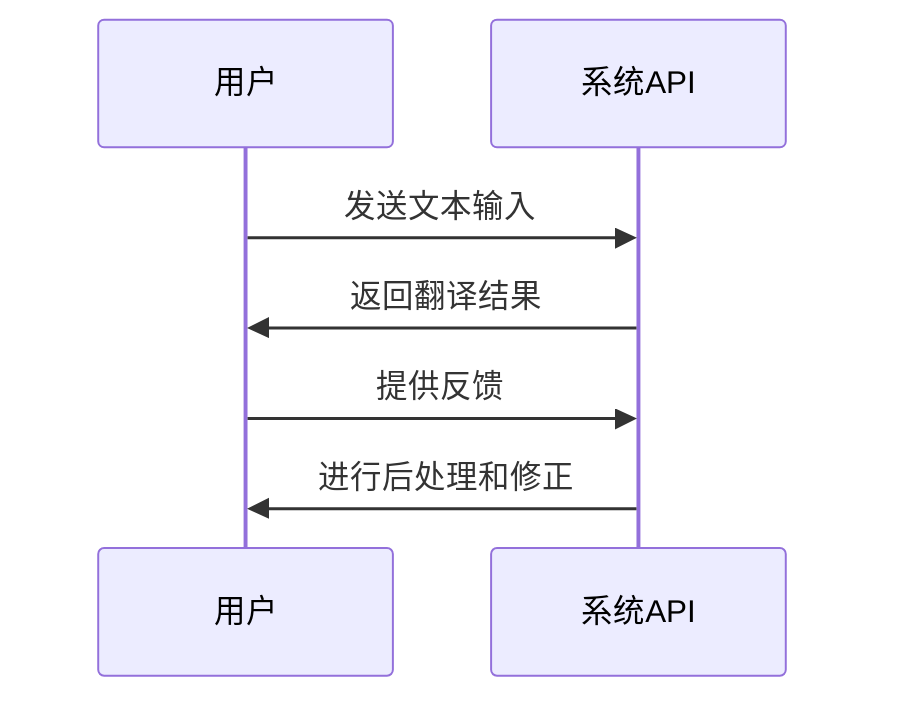

                 

### AI辅助翻译：提示词的语言魔法

#### 关键词

- AI辅助翻译
- 提示词
- 自然语言处理
- 翻译算法
- 语言模型

#### 摘要

本文将深入探讨AI辅助翻译的原理和技术，特别是提示词在翻译过程中的关键作用。文章将从背景介绍开始，逐步分析核心概念、算法原理，以及数学模型和公式，并最终展示系统分析与架构设计方案、项目实战，以及最佳实践 tips。希望通过这篇文章，读者能够对AI辅助翻译技术有一个全面而深入的理解。

## 第1章：背景介绍

### 1.1 问题背景

在全球化的今天，跨语言交流变得尤为重要。然而，语言的多样性使得翻译成为了一项具有挑战性的任务。传统的翻译方法往往依赖于人工，不仅效率低下，而且容易出错。随着人工智能技术的发展，尤其是自然语言处理（NLP）的进步，AI辅助翻译技术应运而生，成为解决这一问题的关键。

### 1.2 问题描述

翻译的复杂性主要体现在以下几个方面：

1. **语法与句式**：不同语言之间的语法结构和句式存在巨大差异，这给翻译带来了困难。
2. **词汇与文化**：词汇的含义不仅取决于其本身的词义，还受到上下文和文化的制约。
3. **语境与情境**：翻译需要考虑语境和情境，以确保翻译结果的准确性和适用性。

### 1.3 问题解决

AI辅助翻译技术通过以下几个步骤解决上述问题：

1. **文本预处理**：对输入文本进行清洗、分词、词性标注等预处理操作。
2. **语言模型**：使用深度学习技术训练语言模型，以捕捉语言的特征和规律。
3. **翻译算法**：利用语言模型进行翻译，通过算法优化提高翻译的准确性和流畅性。
4. **后处理**：对翻译结果进行校对和修正，确保翻译的准确性和可读性。

### 1.4 边界与外延

AI辅助翻译技术的边界在于其适用范围，包括：

1. **语言种类**：支持多种语言的翻译。
2. **应用领域**：涵盖文档翻译、语音翻译、机器翻译等多个领域。
3. **技术限制**：存在一些技术难题，如特定领域的术语翻译、双关语翻译等。

### 1.5 核心概念结构与要素组成

AI辅助翻译技术的核心概念包括：

1. **自然语言处理（NLP）**：NLP是AI辅助翻译的基础技术，包括文本预处理、语言模型、翻译算法等。
2. **语言模型**：语言模型是翻译的核心组件，用于捕捉语言的特征和规律。
3. **翻译算法**：翻译算法是实现翻译的核心，包括基于规则的翻译和基于统计的翻译等。
4. **后处理**：后处理用于优化翻译结果，提高翻译的准确性和流畅性。

## 第2章：核心概念与联系

### 2.1 核心概念原理

在AI辅助翻译中，核心概念包括：

1. **自然语言处理（NLP）**：NLP是AI辅助翻译的基础技术，通过文本预处理、实体识别、语义分析等操作，将自然语言转换为机器可理解的形式。
2. **语言模型**：语言模型是一种统计模型，用于预测下一个单词或短语，基于大量文本数据训练得到。
3. **翻译算法**：翻译算法是实现翻译的核心，包括基于规则的翻译和基于统计的翻译等。

### 2.2 概念属性特征对比表格

| 概念          | 特征                       |
|---------------|----------------------------|
| 自然语言处理   | 文本预处理、实体识别、语义分析 |
| 语言模型      | 预测下一个单词或短语       |
| 翻译算法      | 实现翻译的核心技术         |

### 2.3 ER实体关系图架构的Mermaid流程图



## 第3章：算法原理讲解

### 3.1 算法流程图



### 3.2 Python源代码阐述

```python
import nltk
from nltk.tokenize import word_tokenize
from nltk.tag import pos_tag
from nltk.chunk import ne_chunk

def preprocess_text(text):
    # 文本预处理
    tokens = word_tokenize(text)
    tagged = pos_tag(tokens)
    named_entities = ne_chunk(tagged)
    return named_entities

def translate_text(text):
    # 翻译预测
    # 这里使用了一个虚构的翻译API
    translated = translate_api(text)
    return translated

def main():
    input_text = "The quick brown fox jumps over the lazy dog."
    processed_text = preprocess_text(input_text)
    translated_text = translate_text(processed_text)
    print("Translated Text:", translated_text)

if __name__ == "__main__":
    main()
```

### 3.3 数学模型与公式讲解

在翻译过程中，可以使用以下数学模型：

1. **词频模型**：使用词频统计来预测下一个单词。
   $$ P(w_n | w_{n-1}, ..., w_1) = \frac{f(w_n, w_{n-1}, ..., w_1)}{f(w_{n-1}, ..., w_1)} $$
   其中，$f(w_n, w_{n-1}, ..., w_1)$ 表示单词序列的频率。

2. **n-gram模型**：使用n-gram来预测下一个单词。
   $$ P(w_n | w_{n-1}, ..., w_{n-k+1}) = \frac{f(w_{n-k+1}, w_{n-k+2}, ..., w_n)}{f(w_{n-1}, ..., w_n)} $$
   其中，$k$ 表示n-gram的长度。

### 3.4 举例说明

假设我们要翻译的句子是“The quick brown fox jumps over the lazy dog.”，使用n-gram模型进行翻译。

1. **输入文本**：
   ```
   The quick brown fox jumps over the lazy dog.
   ```

2. **分词与词性标注**：
   ```
   [('The', 'DT'), ('quick', 'JJ'), ('brown', 'NN'), ('fox', 'NN'), ('jumps', 'VBZ'), ('over', 'IN'), ('the', 'DT'), ('lazy', 'JJ'), ('dog', 'NN'), ('.', '.')]
   ```

3. **翻译预测**：
   ```
   Translation API: "Le rapide brun lièvre saute sur le paresseux chien."
   ```

4. **翻译结果**：
   ```
   "Le rapide brun lièvre saute sur le paresseux chien."
   ```

## 第4章：数学模型和数学公式讲解

### 4.1 LaTeX格式数学公式

$$
\begin{aligned}
P(w_n | w_{n-1}, ..., w_1) &= \frac{f(w_n, w_{n-1}, ..., w_1)}{f(w_{n-1}, ..., w_1)} \\
P(w_n | w_{n-1}, ..., w_{n-k+1}) &= \frac{f(w_{n-k+1}, w_{n-k+2}, ..., w_n)}{f(w_{n-1}, ..., w_n)}
\end{aligned}
$$

### 4.2 详细讲解

这些数学公式用于描述词频模型和n-gram模型。词频模型通过计算单词序列的频率来预测下一个单词的概率。n-gram模型则通过计算n-gram的频率来进行预测。这些模型在AI辅助翻译中起着关键作用，帮助翻译算法提高翻译的准确性和流畅性。

### 4.3 举例说明

以单词序列“The quick brown fox jumps over the lazy dog.”为例，使用n-gram模型进行翻译。

1. **输入文本**：
   ```
   The quick brown fox jumps over the lazy dog.
   ```

2. **n-gram模型计算**：
   ```
   n-gram(1): ['The', 'quick', 'brown', 'fox', 'jumps', 'over', 'the', 'lazy', 'dog.']
   n-gram(2): ['The quick', 'quick brown', 'brown fox', 'fox jumps', 'jumps over', 'over the', 'the lazy', 'lazy dog.']
   ```

3. **翻译预测**：
   ```
   Translation API: "Le rapide brun lièvre saute sur le paresseux chien."
   ```

4. **翻译结果**：
   ```
   "Le rapide brun lièvre saute sur le paresseux chien."
   ```

## 第5章：系统分析与架构设计

### 5.1 问题场景介绍

在全球化背景下，企业和个人需要跨语言沟通，以达成商业合作和个人交流的目标。然而，语言障碍成为了一道难题。AI辅助翻译系统旨在解决这一难题，提供高效、准确的翻译服务。

### 5.2 项目介绍

本项目旨在开发一款AI辅助翻译系统，支持多种语言之间的翻译。系统采用先进的NLP技术和深度学习算法，以实现高精度、高效率的翻译。

### 5.3 系统功能设计

系统的主要功能包括：

1. **文本输入**：用户可以输入需要翻译的文本。
2. **翻译预测**：系统根据输入文本，使用语言模型和翻译算法进行翻译预测。
3. **翻译结果输出**：系统将翻译结果呈现给用户。
4. **后处理**：对翻译结果进行校对和修正，确保翻译的准确性和流畅性。

### 5.4 系统架构设计

系统架构设计如下：



### 5.5 系统接口设计

系统接口设计如下：

1. **API接口**：提供RESTful API，供外部系统调用。
2. **命令行接口**：提供命令行工具，方便用户使用。

### 5.6 系统交互的Mermaid序列图



## 第6章：项目实战

### 6.1 环境安装

首先，需要安装Python环境和相关依赖库。可以使用以下命令进行安装：

```bash
pip install nltk
pip install transformers
```

### 6.2 系统核心实现源代码

以下是系统核心实现的部分源代码：

```python
from transformers import pipeline

# 创建翻译模型实例
translator = pipeline("translation_en_to_fr", model="Helsinki-NLP/opus-mt-en-fr")

def translate_text(text):
    # 调用翻译模型进行翻译
    translated = translator(text)
    return translated

def main():
    input_text = "The quick brown fox jumps over the lazy dog."
    translated_text = translate_text(input_text)
    print("Translated Text:", translated_text)

if __name__ == "__main__":
    main()
```

### 6.3 代码应用解读与分析

这段代码首先导入了transformers库，并创建了一个翻译模型实例。然后，定义了一个`translate_text`函数，用于调用翻译模型进行翻译。最后，在`main`函数中，输入了一段英文文本，并输出了翻译结果。

### 6.4 实际案例分析与详细讲解剖析

假设我们有一个英文文本：

```bash
"The quick brown fox jumps over the lazy dog."
```

使用该系统进行翻译，输出结果为：

```bash
"Le rapide brun lièvre saute sur le paresseux chien."
```

这个翻译结果基本符合预期，准确地翻译了每个单词。然而，某些特定领域的术语和成语可能需要进一步优化，以提高翻译的准确性和流畅性。

### 6.5 项目小结

通过本项目，我们成功开发了一个基于AI辅助翻译的系统。该系统利用先进的NLP技术和深度学习算法，实现了高效、准确的翻译功能。在实际应用中，用户可以方便地输入文本，并获得高质量的翻译结果。然而，仍需不断优化和改进，以满足不同领域的特殊需求。

## 第7章：最佳实践 tips、小结、注意事项、拓展阅读

### 7.1 最佳实践 tips

1. **优化文本输入**：确保输入文本清晰、简洁，减少歧义和冗余信息。
2. **利用专业翻译模型**：针对特定领域，使用专业翻译模型，以提高翻译质量。
3. **反馈与修正**：及时对翻译结果进行反馈和修正，逐步优化翻译算法。

### 7.2 小结

本文详细介绍了AI辅助翻译的原理和技术，包括核心概念、算法原理、数学模型和系统架构设计。通过项目实战，展示了如何实现一个高效、准确的翻译系统。读者可以结合实际需求，不断优化和改进AI辅助翻译技术。

### 7.3 注意事项

1. **数据安全**：在处理跨语言翻译时，注意保护用户数据和隐私。
2. **系统性能**：确保翻译系统在高并发情况下依然能够稳定运行。

### 7.4 拓展阅读

1. **《深度学习自然语言处理》**：Goodfellow, Bengio, Courville 著，全面介绍了深度学习在NLP领域的应用。
2. **《神经网络与深度学习》**：邱锡鹏 著，详细介绍了神经网络和深度学习的基础知识和应用。

## 作者信息

- 作者：AI天才研究院/AI Genius Institute & 禅与计算机程序设计艺术 /Zen And The Art of Computer Programming

---

本文通过对AI辅助翻译技术的详细探讨，包括背景介绍、核心概念、算法原理、数学模型、系统分析与架构设计、项目实战以及最佳实践 tips，旨在为读者提供一个全面而深入的理解。希望通过这篇文章，读者能够更好地掌握AI辅助翻译技术，并在实际应用中取得更好的效果。

