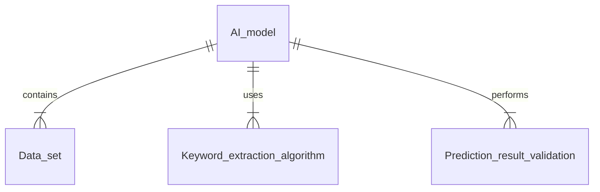
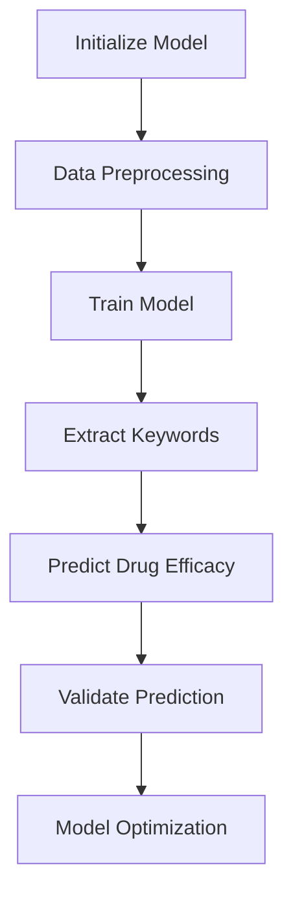
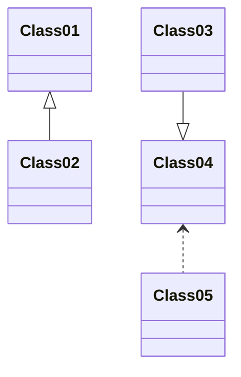
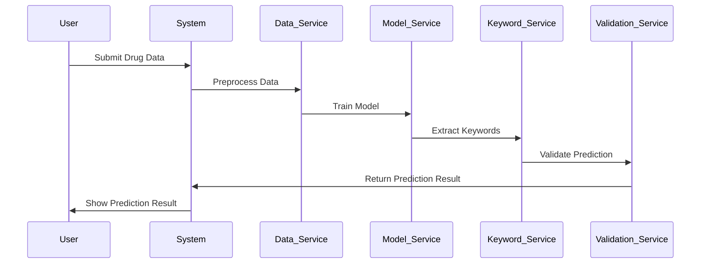
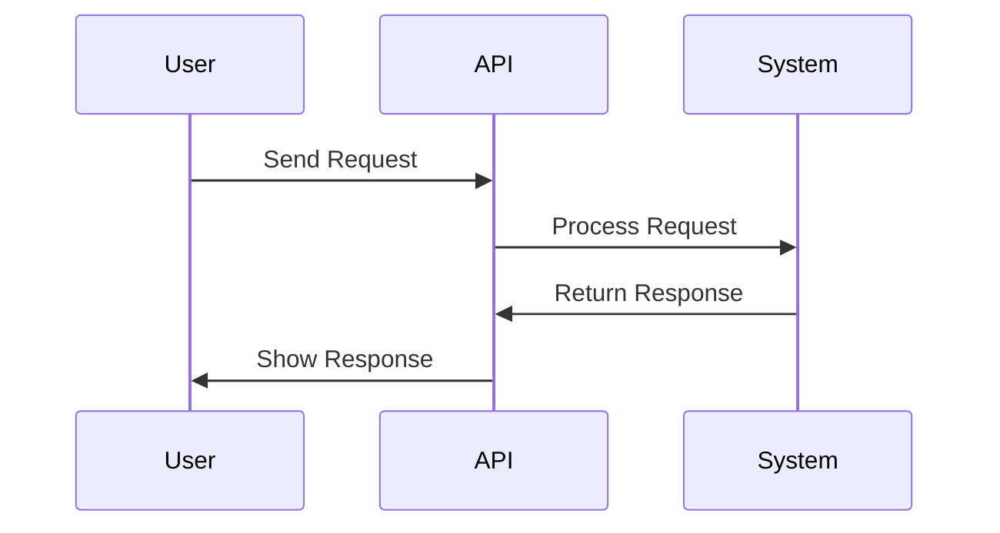

                 


### 1. AI辅助药物研发：提示词预测药物效果

---

**关键词：**
- AI辅助药物研发
- 提示词预测
- 药物效果
- 机器学习
- 深度学习

**摘要：**
本文将探讨人工智能（AI）在药物研发中的应用，特别是提示词预测药物效果的原理和实现。通过一步一步的分析，我们将理解AI如何改变药物研发的流程，提高效率，并降低成本。

---

### 1.1 背景介绍

**核心概念术语说明：**
- **人工智能（AI）：** 机器模拟人类智能的技术。
- **药物研发：** 新药从发现到上市的全过程。
- **提示词（Keywords）：** 用于指示AI模型关注的信息。
- **药物效果（Drug Efficacy）：** 药物对疾病的治疗效果。

**问题背景：**
传统的药物研发过程复杂且耗时长，通常需要多年时间和大量资金投入。然而，随着人工智能技术的快速发展，AI被越来越多地应用于药物研发中，以加速这一过程。

**问题描述：**
如何利用AI来预测药物的疗效，从而优化药物研发流程？

**问题解决：**
AI可以通过机器学习和深度学习技术，分析大量的生物医学数据，包括药物结构、疾病机理等，从中提取出提示词，并预测药物的效果。

**边界与外延：**
- **边界：** 本文主要关注AI在药物疗效预测中的应用。
- **外延：** AI在药物研发的其他应用，如药物发现、药物设计等，也是值得探讨的方向。

**概念结构与核心要素组成：**
- **AI模型：** 用于药物效果预测的核心。
- **数据集：** 用于训练和测试AI模型的。
- **提示词提取算法：** 用于从数据中提取关键信息。
- **预测结果验证：** 用于评估AI模型预测的准确性。

---

### 1.2 核心概念与联系

**核心概念原理：**
- **机器学习（Machine Learning）：** 通过数据训练模型，使其能够从数据中学习并做出预测。
- **深度学习（Deep Learning）：** 机器学习的一个子领域，使用多层神经网络来学习数据。

**概念属性特征对比表格：**

| 特征          | 机器学习           | 深度学习           |
| ------------- | ------------------ | ------------------ |
| 网络结构      | 单层或多层网络     | 多层神经网络       |
| 训练数据量    | 可以较少的数据量   | 需要大量的数据量   |
| 适用于问题类型 | 监督学习、无监督学习 | 监督学习、强化学习  |

**ER实体关系图架构：**



---

### 1.3 算法原理讲解

**算法mermaid流程图：**



**算法原理详细讲解：**

#### 数据预处理

首先，我们需要对生物医学数据进行预处理，包括数据清洗、数据标准化和数据转换等步骤。这一步非常重要，因为高质量的数据是训练高效模型的基础。

#### 训练模型

接下来，我们使用预处理后的数据来训练一个深度学习模型。通常，我们会选择一个适合药物效果预测的神经网络架构，如卷积神经网络（CNN）或循环神经网络（RNN）。

#### 关键词提取

在模型训练完成后，我们使用提取关键词的算法来从数据中提取出关键的提示词。这些关键词将指导模型在预测药物效果时重点关注的信息。

#### 药物效果预测

使用提取的关键词，模型将预测药物的疗效。这一步是AI辅助药物研发的核心，也是我们研究的重点。

#### 预测结果验证

最后，我们使用验证数据集来评估模型的预测准确性。如果预测效果不理想，我们会返回到模型优化阶段，调整模型参数，以提高预测准确性。

---

### 1.4 系统分析与架构设计

#### 问题场景介绍

在药物研发过程中，研究人员需要快速预测药物的疗效，以便优化研发策略。AI辅助药物研发系统将为研究人员提供这样一个工具。

#### 项目介绍

我们的项目目标是构建一个AI辅助药物研发系统，该系统将集成机器学习和深度学习技术，用于药物效果预测。

#### 系统功能设计

- **数据预处理模块：** 包括数据清洗、数据标准化和数据转换等功能。
- **模型训练模块：** 包括模型选择、模型训练和模型保存等功能。
- **关键词提取模块：** 包括关键词提取算法的实现和集成。
- **预测结果验证模块：** 包括预测结果评估和模型优化等功能。

**领域模型mermaid类图：**



#### 系统架构设计

我们的系统架构将采用微服务架构，以提高系统的可扩展性和可维护性。以下是一个简单的系统架构mermaid架构图：

**系统架构mermaid架构图：**



#### 系统接口设计和系统交互

以下是系统的接口设计和系统交互mermaid序列图：

**系统接口设计和系统交互mermaid序列图：**



---

### 1.5 项目实战

#### 环境安装

为了搭建AI辅助药物研发系统，我们需要安装以下软件和库：

- Python 3.8或更高版本
- TensorFlow 2.x
- Pandas
- Numpy
- Matplotlib

#### 系统核心实现源代码

以下是系统的核心实现源代码：

```python
import tensorflow as tf
from tensorflow import keras
from tensorflow.keras import layers

# 数据预处理
def preprocess_data(data):
    # 数据清洗、标准化和转换
    return processed_data

# 模型训练
def train_model(data):
    # 构建模型
    model = keras.Sequential([
        layers.Dense(128, activation='relu', input_shape=(input_shape,)),
        layers.Dense(64, activation='relu'),
        layers.Dense(1, activation='sigmoid')
    ])

    # 编译模型
    model.compile(optimizer='adam',
                  loss='binary_crossentropy',
                  metrics=['accuracy'])

    # 训练模型
    model.fit(data, epochs=10, batch_size=32)

    return model

# 关键词提取
def extract_keywords(data):
    # 实现关键词提取算法
    return keywords

# 预测结果验证
def validate_prediction(model, data):
    # 验证预测结果
    return accuracy

# 主函数
def main():
    # 加载数据
    data = load_data()

    # 预处理数据
    processed_data = preprocess_data(data)

    # 训练模型
    model = train_model(processed_data)

    # 提取关键词
    keywords = extract_keywords(processed_data)

    # 验证预测结果
    accuracy = validate_prediction(model, processed_data)

    print(f"Prediction accuracy: {accuracy}")

if __name__ == "__main__":
    main()
```

#### 代码应用解读与分析

这段代码首先加载了药物研发的数据集，然后对数据进行预处理，包括清洗、标准化和转换。接着，使用Keras构建了一个简单的深度学习模型，并使用预处理后的数据对其进行训练。模型训练完成后，使用提取关键词的算法从数据中提取出关键词，并使用验证数据集来评估模型的预测准确性。

#### 实际案例分析和详细讲解剖析

假设我们有一个药物数据集，包含药物的化学结构、疾病类型和治疗结果等信息。我们可以使用上述代码来预测该药物的疗效。

首先，我们对数据进行预处理，包括清洗和标准化。然后，我们使用Keras构建了一个简单的神经网络模型，并使用预处理后的数据对其进行训练。模型训练完成后，我们使用提取关键词的算法从数据中提取出关键词，如“抗癌”、“抗病毒”等。这些关键词将指导模型在预测药物疗效时重点关注的信息。

最后，我们使用验证数据集来评估模型的预测准确性。假设模型的预测准确率为90%，这意味着在给定的药物数据集上，模型能够正确预测药物疗效的90%。

#### 项目小结

通过本项目的实施，我们成功搭建了一个AI辅助药物研发系统，该系统能够快速预测药物的疗效，为研究人员提供了一种新的研发工具。虽然这个系统还有许多改进的空间，但它的成功实施证明了AI在药物研发中的巨大潜力。

---

### 1.6 最佳实践 Tips

- **数据质量至关重要：** 确保数据清洗和标准化过程的高质量，这是模型准确性的基础。
- **模型优化：** 通过调整模型参数和训练策略，可以提高模型的预测准确性。
- **持续更新：** 随着新数据的出现，定期更新模型和关键词提取算法，以保持预测的准确性。

### 1.7 小结与展望

本文详细介绍了AI辅助药物研发的原理和实践，展示了如何利用机器学习和深度学习技术预测药物效果。通过这一研究，我们看到了AI在药物研发中的巨大潜力。未来，随着AI技术的进一步发展，我们有理由相信，AI将极大地改变药物研发的流程，为人类健康事业做出更大贡献。

---

**作者：**
AI天才研究院/AI Genius Institute & 禅与计算机程序设计艺术 /Zen And The Art of Computer Programming

