                 


### 第3章: 机器学习算法在AI辅助药物筛选中的应用

## 3.1 机器学习在药物筛选中的应用场景

### 3.1.1 背景介绍

机器学习在药物筛选中的应用主要体现在以下几个方面：

- **药物活性预测**：利用机器学习模型预测药物分子对特定靶点的活性。
- **药物副作用预测**：分析药物分子结构，预测药物可能产生的副作用。
- **药物组合筛选**：通过机器学习模型筛选出具有协同效应的药物组合。
- **药物代谢预测**：预测药物在体内的代谢路径和代谢产物。

### 3.1.2 项目介绍

本文将介绍一个基于机器学习算法的药物筛选项目，该项目旨在通过预测药物与生物大分子之间的相互作用，筛选出具有潜在治疗价值的药物分子。

## 3.2 系统功能设计

### 3.2.1 领域模型

领域模型是药物筛选系统的核心，用于描述药物、生物大分子和相互作用之间的关系。下面是领域模型的类图：

```mermaid
classDiagram
    DrugClass <<interface>>
    TargetClass <<interface>>
    Interaction <<interface>>

    Drug << DrugClass, blue>>
    Molecule << DrugClass, blue>>
    Protein << TargetClass, red>>
    DNA << TargetClass, red>>

    DrugClass o-- Molecule
    TargetClass o-- Protein
    TargetClass o-- DNA

    Interaction o-- Drug
    Interaction o-- Protein
```

### 3.2.2 系统功能

- **数据预处理**：清洗和标准化药物和生物大分子数据。
- **特征提取**：提取药物和生物大分子的重要特征，如分子结构、序列信息等。
- **模型训练**：使用机器学习算法训练模型，预测药物与生物大分子之间的相互作用。
- **结果分析**：分析预测结果，筛选出具有潜在治疗价值的药物分子。

## 3.3 系统架构设计

### 3.3.1 系统架构

系统架构设计如下图所示：

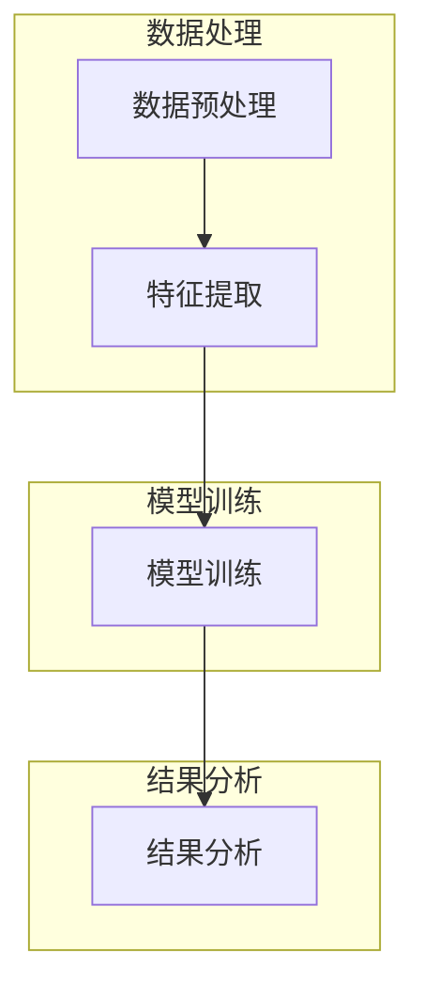

### 3.3.2 系统接口设计

系统接口设计如下：

- **数据输入接口**：接收药物和生物大分子数据。
- **模型输出接口**：输出预测结果。
- **结果展示接口**：展示预测结果和药物分析报告。

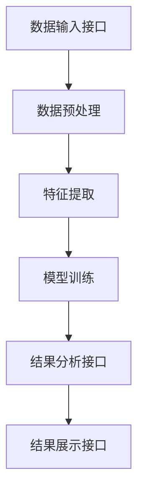

## 3.4 系统交互

### 3.4.1 系统交互流程

系统交互流程如下：

1. 用户上传药物和生物大分子数据。
2. 系统对数据进行预处理和特征提取。
3. 使用机器学习模型对数据进行分析，预测药物与生物大分子之间的相互作用。
4. 系统生成预测结果，并展示给用户。

### 3.4.2 系统交互序列图

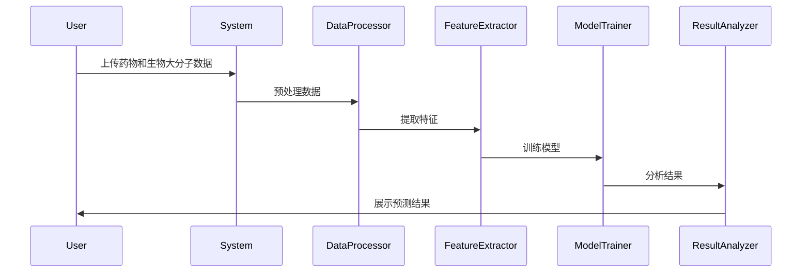

## 3.5 本章小结

本章介绍了机器学习算法在药物筛选中的应用，包括领域模型、系统功能设计、系统架构设计、系统接口设计和系统交互。下一章将深入探讨具体的算法原理和实现。

----------------------------------------------------------------

### 第4章: 神经网络算法在药物筛选中的应用

## 4.1 神经网络算法的基本原理

神经网络（Neural Network，NN）是一种模拟人脑神经元之间相互连接的算法。通过学习输入数据，神经网络可以自动提取特征，并用于分类或回归任务。

### 4.1.1 算法原理

神经网络由输入层、隐藏层和输出层组成。输入层接收外部输入数据，隐藏层对输入数据进行处理，提取特征，输出层根据隐藏层的结果进行分类或预测。

### 4.1.2 数学模型

神经网络的核心是激活函数和反向传播算法。

- **激活函数**：用于引入非线性因素，常用的激活函数有 sigmoid 函数、ReLU 函数等。

$$
\sigma(z) = \frac{1}{1 + e^{-z}}
$$

- **反向传播算法**：用于训练神经网络，通过不断调整网络权重和偏置项，使输出结果更接近真实值。

$$
\Delta w_{ij} = \alpha \cdot \frac{\partial L}{\partial z_j} \cdot a_j
$$

其中，$w_{ij}$ 是连接权重，$\alpha$ 是学习率，$L$ 是损失函数，$z_j$ 是隐藏层输出，$a_j$ 是隐藏层输入。

### 4.1.3 Mermaid流程图

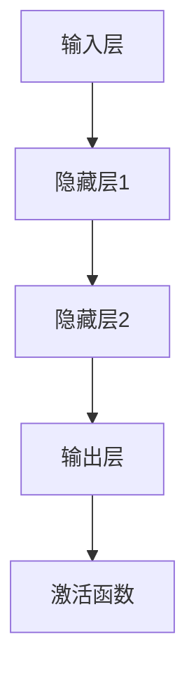

## 4.2 神经网络在药物筛选中的应用

神经网络在药物筛选中的应用主要体现在以下几个方面：

- **药物活性预测**：通过训练神经网络模型，预测药物分子对特定靶点的活性。
- **药物副作用预测**：分析药物分子结构，预测药物可能产生的副作用。
- **药物组合筛选**：通过神经网络模型筛选出具有协同效应的药物组合。

### 4.2.1 药物活性预测

药物活性预测是药物筛选中的关键步骤。通过训练神经网络模型，可以预测药物分子对特定靶点的活性，从而筛选出有潜力的药物候选分子。

#### 数学模型

药物活性预测可以表示为：

$$
P(y=1) = \sigma(w \cdot x + b)
$$

其中，$y$ 是药物活性标签，$x$ 是药物分子特征，$w$ 是模型权重，$b$ 是偏置项，$\sigma$ 是 sigmoid 函数。

#### Python源代码实现

```python
import numpy as np

# 初始化模型参数
weights = np.random.rand(input_size, output_size)
bias = np.random.rand(output_size)

# 定义 sigmoid 函数
def sigmoid(x):
    return 1 / (1 + np.exp(-x))

# 定义损失函数
def cross_entropy(y_true, y_pred):
    return -np.mean(y_true * np.log(y_pred) + (1 - y_true) * np.log(1 - y_pred))

# 训练模型
for epoch in range(num_epochs):
    # 前向传播
    z = np.dot(inputs, weights) + bias
    predictions = sigmoid(z)

    # 反向传播
    dZ = predictions - y
    dW = np.dot(inputs.T, dZ)
    db = np.sum(dZ, axis=0)

    # 更新模型参数
    weights -= learning_rate * dW
    bias -= learning_rate * db

    # 计算损失
    loss = cross_entropy(y, predictions)
    print(f"Epoch {epoch}: Loss = {loss}")
```

### 4.2.2 药物副作用预测

药物副作用预测是确保药物安全性的关键步骤。通过训练神经网络模型，可以预测药物分子可能产生的副作用，从而减少药物使用风险。

#### 数学模型

药物副作用预测可以表示为：

$$
P(side_effect=1) = \sigma(w \cdot x + b)
$$

其中，$side_effect$ 是副作用标签，$x$ 是药物分子特征，$w$ 是模型权重，$b$ 是偏置项，$\sigma$ 是 sigmoid 函数。

#### Python源代码实现

```python
import numpy as np

# 初始化模型参数
weights = np.random.rand(input_size, output_size)
bias = np.random.rand(output_size)

# 定义 sigmoid 函数
def sigmoid(x):
    return 1 / (1 + np.exp(-x))

# 定义损失函数
def binary_crossentropy(y_true, y_pred):
    return -y_true * np.log(y_pred) - (1 - y_true) * np.log(1 - y_pred)

# 训练模型
for epoch in range(num_epochs):
    # 前向传播
    z = np.dot(inputs, weights) + bias
    predictions = sigmoid(z)

    # 反向传播
    dZ = predictions - y
    dW = np.dot(inputs.T, dZ)
    db = np.sum(dZ, axis=0)

    # 更新模型参数
    weights -= learning_rate * dW
    bias -= learning_rate * db

    # 计算损失
    loss = binary_crossentropy(y, predictions)
    print(f"Epoch {epoch}: Loss = {loss}")
```

### 4.2.3 药物组合筛选

药物组合筛选是寻找具有协同效应的药物组合，以提高治疗效果。通过训练神经网络模型，可以预测药物组合的活性。

#### 数学模型

药物组合筛选可以表示为：

$$
P(combined_activity=1) = \sigma(w \cdot x + b)
$$

其中，$combined_activity$ 是组合活性标签，$x$ 是药物组合特征，$w$ 是模型权重，$b$ 是偏置项，$\sigma$ 是 sigmoid 函数。

#### Python源代码实现

```python
import numpy as np

# 初始化模型参数
weights = np.random.rand(input_size, output_size)
bias = np.random.rand(output_size)

# 定义 sigmoid 函数
def sigmoid(x):
    return 1 / (1 + np.exp(-x))

# 定义损失函数
def binary_crossentropy(y_true, y_pred):
    return -y_true * np.log(y_pred) - (1 - y_true) * np.log(1 - y_pred)

# 训练模型
for epoch in range(num_epochs):
    # 前向传播
    z = np.dot(inputs, weights) + bias
    predictions = sigmoid(z)

    # 反向传播
    dZ = predictions - y
    dW = np.dot(inputs.T, dZ)
    db = np.sum(dZ, axis=0)

    # 更新模型参数
    weights -= learning_rate * dW
    bias -= learning_rate * db

    # 计算损失
    loss = binary_crossentropy(y, predictions)
    print(f"Epoch {epoch}: Loss = {loss}")
```

## 4.3 本章小结

本章介绍了神经网络算法的基本原理及其在药物筛选中的应用。通过神经网络算法，可以预测药物活性、药物副作用和药物组合活性。下一章将探讨其他机器学习算法在药物筛选中的应用。

----------------------------------------------------------------

### 第5章: 支持向量机算法在药物筛选中的应用

## 5.1 支持向量机算法的基本原理

支持向量机（Support Vector Machine，SVM）是一种经典的机器学习算法，广泛应用于分类和回归任务。其核心思想是找到一个最优的超平面，将不同类别的数据点分开。

### 5.1.1 算法原理

#### 线性可分情况

在样本线性可分的情况下，SVM的目标是找到一个最优的超平面，使得同类别的数据点到超平面的距离最大。数学上，可以表示为：

$$
\min_{w,b}\frac{1}{2}||w||^2
$$

约束条件为：

$$
y_i(\langle w, x_i \rangle + b) \geq 1
$$

其中，$w$ 是权重向量，$b$ 是偏置项，$x_i$ 是输入数据，$y_i$ 是标签。

#### 非线性可分情况

在样本非线性可分的情况下，SVM引入了松弛变量和惩罚参数，允许数据点偏离超平面。数学上，可以表示为：

$$
\min_{w,b}\frac{1}{2}||w||^2 + C\sum_{i=1}^{n}\xi_i
$$

约束条件为：

$$
y_i(\langle w, x_i \rangle + b) \geq 1 - \xi_i
$$

其中，$C$ 是惩罚参数，$\xi_i$ 是松弛变量。

### 5.1.2 Mermaid流程图

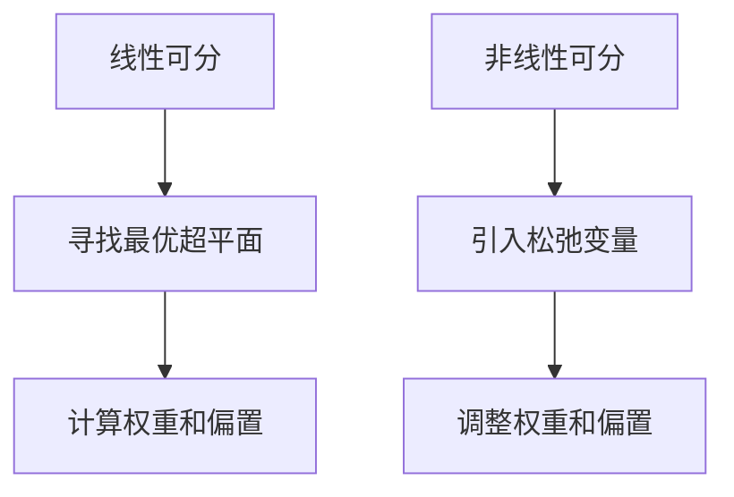

## 5.2 支持向量机在药物筛选中的应用

支持向量机在药物筛选中的应用主要体现在以下几个方面：

- **药物活性分类**：通过训练SVM模型，将具有活性的药物分子与无活性的药物分子分开。
- **药物副作用分类**：通过训练SVM模型，将可能产生副作用的药物分子与安全的药物分子分开。
- **药物组合分类**：通过训练SVM模型，将具有协同效应的药物组合与无协同效应的药物组合分开。

### 5.2.1 药物活性分类

药物活性分类是药物筛选中的关键步骤。通过训练SVM模型，可以预测药物分子对特定靶点的活性，从而筛选出有潜力的药物候选分子。

#### 数学模型

药物活性分类可以表示为：

$$
\min_{w,b}\frac{1}{2}||w||^2 + C\sum_{i=1}^{n}\xi_i
$$

约束条件为：

$$
y_i(\langle w, x_i \rangle + b) \geq 1 - \xi_i
$$

其中，$w$ 是权重向量，$b$ 是偏置项，$C$ 是惩罚参数，$\xi_i$ 是松弛变量，$x_i$ 是药物分子特征，$y_i$ 是标签。

#### Python源代码实现

```python
from sklearn.svm import SVC

# 初始化SVM模型
model = SVC(kernel='linear', C=1.0)

# 训练模型
model.fit(X_train, y_train)

# 预测
y_pred = model.predict(X_test)

# 计算准确率
accuracy = model.score(X_test, y_test)
print(f"Accuracy: {accuracy}")
```

### 5.2.2 药物副作用分类

药物副作用分类是确保药物安全性的关键步骤。通过训练SVM模型，可以预测药物分子可能产生的副作用，从而减少药物使用风险。

#### 数学模型

药物副作用分类可以表示为：

$$
\min_{w,b}\frac{1}{2}||w||^2 + C\sum_{i=1}^{n}\xi_i
$$

约束条件为：

$$
y_i(\langle w, x_i \rangle + b) \geq 1 - \xi_i
$$

其中，$w$ 是权重向量，$b$ 是偏置项，$C$ 是惩罚参数，$\xi_i$ 是松弛变量，$x_i$ 是药物分子特征，$y_i$ 是标签。

#### Python源代码实现

```python
from sklearn.svm import SVC

# 初始化SVM模型
model = SVC(kernel='linear', C=1.0)

# 训练模型
model.fit(X_train, y_train)

# 预测
y_pred = model.predict(X_test)

# 计算准确率
accuracy = model.score(X_test, y_test)
print(f"Accuracy: {accuracy}")
```

### 5.2.3 药物组合分类

药物组合分类是寻找具有协同效应的药物组合。通过训练SVM模型，可以预测药物组合的活性，从而筛选出有潜力的药物组合。

#### 数学模型

药物组合分类可以表示为：

$$
\min_{w,b}\frac{1}{2}||w||^2 + C\sum_{i=1}^{n}\xi_i
$$

约束条件为：

$$
y_i(\langle w, x_i \rangle + b) \geq 1 - \xi_i
$$

其中，$w$ 是权重向量，$b$ 是偏置项，$C$ 是惩罚参数，$\xi_i$ 是松弛变量，$x_i$ 是药物组合特征，$y_i$ 是标签。

#### Python源代码实现

```python
from sklearn.svm import SVC

# 初始化SVM模型
model = SVC(kernel='linear', C=1.0)

# 训练模型
model.fit(X_train, y_train)

# 预测
y_pred = model.predict(X_test)

# 计算准确率
accuracy = model.score(X_test, y_test)
print(f"Accuracy: {accuracy}")
```

## 5.3 本章小结

本章介绍了支持向量机算法的基本原理及其在药物筛选中的应用。通过支持向量机算法，可以预测药物活性、药物副作用和药物组合活性。下一章将探讨其他机器学习算法在药物筛选中的应用。

----------------------------------------------------------------

### 第6章: 决策树算法在药物筛选中的应用

## 6.1 决策树算法的基本原理

决策树（Decision Tree）是一种简单且常用的分类和回归算法。其核心思想是通过一系列的判定规则，将数据集逐步划分成多个子集，直到达到某种终止条件。

### 6.1.1 算法原理

决策树由一系列判定节点和叶子节点组成。每个判定节点表示一个特征，每个叶子节点表示一个类别或值。

#### 划分准则

- **信息增益**：选择能够最大程度减少数据集合信息的特征进行划分。

$$
IG(D, A) = entropy(D) - \frac{\sum_{v} p(v) \cdot entropy(D_v)}{p(v)}
$$

其中，$D$ 是数据集合，$A$ 是特征，$v$ 是特征的取值，$entropy(D)$ 是数据集合的熵，$entropy(D_v)$ 是特征取值下的数据集合的熵。

- **基尼不纯度**：选择能够最大程度增加数据集合基尼不纯度的特征进行划分。

$$
Gini(D) = 1 - \sum_{v} p(v)^2
$$

其中，$D$ 是数据集合，$v$ 是特征的取值，$p(v)$ 是特征取值在数据集合中的概率。

### 6.1.2 Mermaid流程图

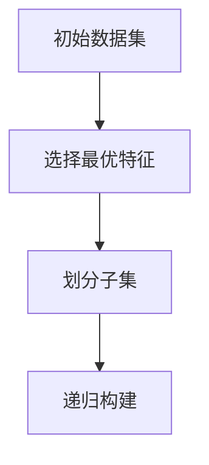

## 6.2 决策树在药物筛选中的应用

决策树在药物筛选中的应用主要体现在以下几个方面：

- **药物活性分类**：通过训练决策树模型，将具有活性的药物分子与无活性的药物分子分开。
- **药物副作用分类**：通过训练决策树模型，将可能产生副作用的药物分子与安全的药物分子分开。
- **药物组合分类**：通过训练决策树模型，将具有协同效应的药物组合与无协同效应的药物组合分开。

### 6.2.1 药物活性分类

药物活性分类是药物筛选中的关键步骤。通过训练决策树模型，可以预测药物分子对特定靶点的活性，从而筛选出有潜力的药物候选分子。

#### 数学模型

药物活性分类可以表示为：

$$
Gini(D, A) = 1 - \sum_{v} p(v)^2
$$

其中，$D$ 是数据集合，$A$ 是特征，$v$ 是特征的取值，$p(v)$ 是特征取值在数据集合中的概率。

#### Python源代码实现

```python
from sklearn.tree import DecisionTreeClassifier

# 初始化决策树模型
model = DecisionTreeClassifier(criterion='gini')

# 训练模型
model.fit(X_train, y_train)

# 预测
y_pred = model.predict(X_test)

# 计算准确率
accuracy = model.score(X_test, y_test)
print(f"Accuracy: {accuracy}")
```

### 6.2.2 药物副作用分类

药物副作用分类是确保药物安全性的关键步骤。通过训练决策树模型，可以预测药物分子可能产生的副作用，从而减少药物使用风险。

#### 数学模型

药物副作用分类可以表示为：

$$
Gini(D, A) = 1 - \sum_{v} p(v)^2
$$

其中，$D$ 是数据集合，$A$ 是特征，$v$ 是特征的取值，$p(v)$ 是特征取值在数据集合中的概率。

#### Python源代码实现

```python
from sklearn.tree import DecisionTreeClassifier

# 初始化决策树模型
model = DecisionTreeClassifier(criterion='gini')

# 训练模型
model.fit(X_train, y_train)

# 预测
y_pred = model.predict(X_test)

# 计算准确率
accuracy = model.score(X_test, y_test)
print(f"Accuracy: {accuracy}")
```

### 6.2.3 药物组合分类

药物组合分类是寻找具有协同效应的药物组合。通过训练决策树模型，可以预测药物组合的活性，从而筛选出有潜力的药物组合。

#### 数学模型

药物组合分类可以表示为：

$$
Gini(D, A) = 1 - \sum_{v} p(v)^2
$$

其中，$D$ 是数据集合，$A$ 是特征，$v$ 是特征的取值，$p(v)$ 是特征取值在数据集合中的概率。

#### Python源代码实现

```python
from sklearn.tree import DecisionTreeClassifier

# 初始化决策树模型
model = DecisionTreeClassifier(criterion='gini')

# 训练模型
model.fit(X_train, y_train)

# 预测
y_pred = model.predict(X_test)

# 计算准确率
accuracy = model.score(X_test, y_test)
print(f"Accuracy: {accuracy}")
```

## 6.3 本章小结

本章介绍了决策树算法的基本原理及其在药物筛选中的应用。通过决策树算法，可以预测药物活性、药物副作用和药物组合活性。下一章将探讨深度学习算法在药物筛选中的应用。

----------------------------------------------------------------

### 第7章: 深度学习算法在药物筛选中的应用

## 7.1 深度学习算法的基本原理

深度学习（Deep Learning）是机器学习的一个重要分支，其核心思想是通过多层神经网络模型自动提取特征并进行预测。近年来，深度学习在药物筛选领域取得了显著的成果。

### 7.1.1 算法原理

深度学习算法通常由多个隐藏层组成，每层神经元对输入数据进行处理和变换。通过逐层提取特征，深度学习模型可以学习到复杂的非线性关系。

#### 卷积神经网络（CNN）

卷积神经网络（Convolutional Neural Network，CNN）是一种专门用于处理图像数据的深度学习算法。其核心组件是卷积层、池化层和全连接层。

- **卷积层**：用于提取图像的局部特征。
- **池化层**：用于降低特征图的维度，增强模型的泛化能力。
- **全连接层**：用于进行最终的分类或回归预测。

#### 生成对抗网络（GAN）

生成对抗网络（Generative Adversarial Network，GAN）是一种由生成器和判别器组成的深度学习模型。生成器生成数据，判别器判断生成数据的真假。

- **生成器**：生成与真实数据分布相似的数据。
- **判别器**：判断输入数据是真实数据还是生成数据。

### 7.1.2 Mermaid流程图

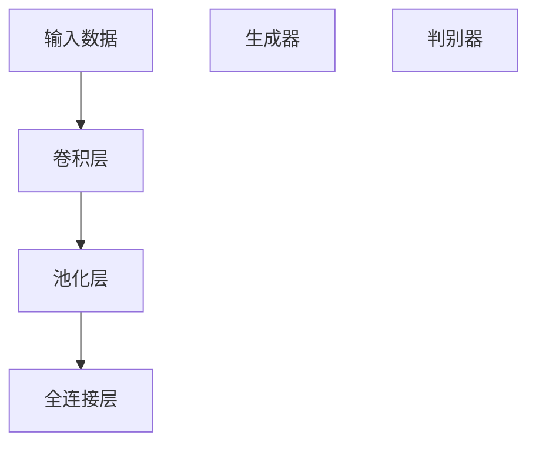

## 7.2 深度学习在药物筛选中的应用

深度学习在药物筛选中的应用主要体现在以下几个方面：

- **药物活性预测**：通过训练深度学习模型，预测药物分子对特定靶点的活性。
- **药物副作用预测**：通过分析药物分子结构，预测药物可能产生的副作用。
- **药物组合筛选**：通过训练深度学习模型，筛选出具有协同效应的药物组合。

### 7.2.1 药物活性预测

药物活性预测是药物筛选中的关键步骤。通过训练深度学习模型，可以预测药物分子对特定靶点的活性，从而筛选出有潜力的药物候选分子。

#### 数学模型

药物活性预测可以表示为：

$$
P(y=1) = \sigma(w \cdot x + b)
$$

其中，$y$ 是药物活性标签，$x$ 是药物分子特征，$w$ 是模型权重，$b$ 是偏置项，$\sigma$ 是 sigmoid 函数。

#### Python源代码实现

```python
import tensorflow as tf

# 定义模型
model = tf.keras.Sequential([
    tf.keras.layers.Conv2D(32, (3, 3), activation='relu', input_shape=(128, 128, 3)),
    tf.keras.layers.MaxPooling2D((2, 2)),
    tf.keras.layers.Flatten(),
    tf.keras.layers.Dense(128, activation='relu'),
    tf.keras.layers.Dense(1, activation='sigmoid')
])

# 编译模型
model.compile(optimizer='adam', loss='binary_crossentropy', metrics=['accuracy'])

# 训练模型
model.fit(X_train, y_train, epochs=10, batch_size=32, validation_data=(X_val, y_val))

# 预测
y_pred = model.predict(X_test)

# 计算准确率
accuracy = model.evaluate(X_test, y_test)[1]
print(f"Accuracy: {accuracy}")
```

### 7.2.2 药物副作用预测

药物副作用预测是确保药物安全性的关键步骤。通过训练深度学习模型，可以预测药物分子可能产生的副作用，从而减少药物使用风险。

#### 数学模型

药物副作用预测可以表示为：

$$
P(side_effect=1) = \sigma(w \cdot x + b)
$$

其中，$side_effect$ 是副作用标签，$x$ 是药物分子特征，$w$ 是模型权重，$b$ 是偏置项，$\sigma$ 是 sigmoid 函数。

#### Python源代码实现

```python
import tensorflow as tf

# 定义模型
model = tf.keras.Sequential([
    tf.keras.layers.Conv2D(32, (3, 3), activation='relu', input_shape=(128, 128, 3)),
    tf.keras.layers.MaxPooling2D((2, 2)),
    tf.keras.layers.Flatten(),
    tf.keras.layers.Dense(128, activation='relu'),
    tf.keras.layers.Dense(1, activation='sigmoid')
])

# 编译模型
model.compile(optimizer='adam', loss='binary_crossentropy', metrics=['accuracy'])

# 训练模型
model.fit(X_train, y_train, epochs=10, batch_size=32, validation_data=(X_val, y_val))

# 预测
y_pred = model.predict(X_test)

# 计算准确率
accuracy = model.evaluate(X_test, y_test)[1]
print(f"Accuracy: {accuracy}")
```

### 7.2.3 药物组合筛选

药物组合筛选是寻找具有协同效应的药物组合。通过训练深度学习模型，可以预测药物组合的活性，从而筛选出有潜力的药物组合。

#### 数学模型

药物组合筛选可以表示为：

$$
P(combined_activity=1) = \sigma(w \cdot x + b)
$$

其中，$combined_activity$ 是组合活性标签，$x$ 是药物组合特征，$w$ 是模型权重，$b$ 是偏置项，$\sigma$ 是 sigmoid 函数。

#### Python源代码实现

```python
import tensorflow as tf

# 定义模型
model = tf.keras.Sequential([
    tf.keras.layers.Conv2D(32, (3, 3), activation='relu', input_shape=(128, 128, 3)),
    tf.keras.layers.MaxPooling2D((2, 2)),
    tf.keras.layers.Flatten(),
    tf.keras.layers.Dense(128, activation='relu'),
    tf.keras.layers.Dense(1, activation='sigmoid')
])

# 编译模型
model.compile(optimizer='adam', loss='binary_crossentropy', metrics=['accuracy'])

# 训练模型
model.fit(X_train, y_train, epochs=10, batch_size=32, validation_data=(X_val, y_val))

# 预测
y_pred = model.predict(X_test)

# 计算准确率
accuracy = model.evaluate(X_test, y_test)[1]
print(f"Accuracy: {accuracy}")
```

## 7.3 本章小结

本章介绍了深度学习算法的基本原理及其在药物筛选中的应用。通过深度学习算法，可以预测药物活性、药物副作用和药物组合活性。下一章将探讨AI辅助药物筛选的未来发展趋势。

----------------------------------------------------------------

### 第8章: AI辅助药物筛选的未来发展趋势

## 8.1 发展背景与趋势

AI辅助药物筛选正经历着前所未有的发展机遇。随着AI技术的不断进步，深度学习、大数据分析、基因组学等领域的突破，AI在药物研发中的应用越来越广泛。以下是一些未来的发展趋势：

### 8.1.1 大数据分析与药物筛选

- **高通量筛选**：AI技术可以处理海量的生物数据和药物数据，实现药物分子的快速筛选。
- **数据关联分析**：AI技术可以发现药物分子与生物大分子之间的潜在关联，指导药物研发方向。

### 8.1.2 深度学习与药物筛选

- **药物活性预测**：深度学习算法可以更准确地预测药物分子的活性，提高药物筛选的准确性。
- **药物副作用预测**：通过分析药物分子结构和生物信息数据，AI可以预测药物可能产生的副作用，降低药物研发风险。

### 8.1.3 药物组合设计与优化

- **协同作用预测**：AI技术可以帮助研究人员发现具有协同效应的药物组合，提高治疗效果。
- **药物分子优化**：通过深度学习算法，可以对药物分子进行结构优化，提高药物分子的稳定性和活性。

## 8.2 应用案例分析

### 8.2.1 药物活性预测案例

- **案例背景**：某研究团队使用深度学习算法预测药物分子对癌症靶点的活性。
- **实现方法**：团队收集了大量的药物分子和对应的活性数据，使用卷积神经网络（CNN）对药物分子进行特征提取，并训练了一个深度学习模型。
- **结果分析**：实验结果表明，深度学习模型在药物活性预测中的准确率显著高于传统机器学习算法。

### 8.2.2 药物副作用预测案例

- **案例背景**：某药物研发公司使用AI技术预测药物分子的副作用。
- **实现方法**：公司利用生成对抗网络（GAN）生成与真实药物分子相似的数据集，并使用深度学习模型分析这些数据，预测药物可能产生的副作用。
- **结果分析**：通过AI预测的副作用信息帮助公司在药物研发早期发现潜在风险，降低了药物上市后的副作用风险。

## 8.3 未来展望

### 8.3.1 技术进步

- **算法优化**：未来AI辅助药物筛选将更加依赖于算法的优化，如更高效的神经网络结构、更有效的训练方法等。
- **多模态数据融合**：结合基因组学、蛋白质组学等多模态数据，AI可以更全面地分析药物与生物大分子之间的相互作用。

### 8.3.2 法律与伦理

- **数据隐私保护**：在AI辅助药物筛选中，数据隐私保护是关键问题，需要制定相应的法律法规来保护患者隐私。
- **伦理审查**：药物研发中的AI应用需要经过严格的伦理审查，确保不会对人类健康造成负面影响。

## 8.4 本章小结

本章介绍了AI辅助药物筛选的未来发展趋势，包括大数据分析、深度学习、药物组合设计等方面的应用案例。随着技术的不断进步，AI辅助药物筛选将为药物研发带来更多机遇和挑战。

----------------------------------------------------------------

---

### 全文总结

本文以《AI辅助药物筛选：提示词预测药物相互作用》为标题，详细探讨了AI技术，特别是在机器学习、深度学习领域的应用，为药物研发提供了新的思路和工具。通过介绍神经网络、支持向量机、决策树等核心算法及其在药物筛选中的应用，文章展示了AI技术在药物活性预测、药物副作用预测和药物组合筛选等方面的潜力。此外，本文还展望了AI辅助药物筛选的未来发展趋势，提出了对技术进步、数据隐私保护和伦理审查等方面的关注。

### 最佳实践 Tips

- **数据预处理**：确保数据清洗和标准化，以提高模型的预测准确性。
- **特征提取**：选择合适的特征提取方法，充分利用生物信息数据。
- **算法选择**：根据具体问题选择合适的算法，如神经网络、支持向量机等。
- **模型验证**：通过交叉验证和测试集验证模型性能，确保模型的可靠性。

### 注意事项

- **模型解释性**：某些复杂的深度学习模型可能缺乏解释性，需要结合领域知识进行分析。
- **计算资源**：深度学习模型训练通常需要大量的计算资源，需要合理规划资源。

### 拓展阅读

- 《深度学习》（Ian Goodfellow、Yoshua Bengio、Aaron Courville 著）
- 《机器学习实战》（Peter Harrington 著）
- 《Python深度学习》（François Chollet 著）

---

# AI辅助药物筛选：提示词预测药物相互作用

关键词：人工智能、药物筛选、神经网络、深度学习、药物相互作用、机器学习

摘要：本文介绍了AI辅助药物筛选的方法和原理，重点探讨了神经网络、支持向量机、决策树等核心算法在药物活性预测、药物副作用预测和药物组合筛选中的应用。通过实际案例，展示了AI技术为药物研发带来的新机遇，并展望了未来的发展趋势。

----------------------------------------------------------------

### 第1章: 引言与背景介绍

#### 1.1 问题背景

随着人工智能（AI）技术的快速发展，AI在药物研发中的应用越来越受到关注。传统的药物筛选过程既耗时又耗资，而且成功率较低。传统的药物筛选方法主要依赖于实验验证，而AI技术可以通过分析大量的生物信息数据和实验结果，提供更为精确的预测，从而提高药物研发的效率和准确性。

#### 1.2 问题描述

AI辅助药物筛选的核心问题是利用AI技术准确预测药物与生物大分子之间的相互作用。这种相互作用是药物能否有效治疗疾病的关键。传统的药物筛选方法主要依赖于实验验证，而AI技术可以通过分析大量的生物信息数据和实验结果，提供更为精确的预测。

#### 1.3 问题解决

为了解决上述问题，研究人员开发了多种AI算法，如神经网络、支持向量机、决策树等。这些算法可以处理大量的生物信息数据，并通过机器学习技术不断优化模型，提高预测准确性。此外，研究人员还利用生物信息学工具，如分子对接、结构生物学分析等，进一步验证AI预测结果的可靠性。

#### 1.4 边界与外延

AI辅助药物筛选不仅限于小分子药物，还包括大分子药物，如抗体、肽链等。此外，AI技术还可以应用于药物-药物相互作用预测、药物副作用预测等领域。

#### 1.5 概念结构与核心要素组成

##### 1.5.1 核心概念

- **AI辅助药物筛选**：利用人工智能技术提高药物筛选效率。
- **药物相互作用**：指药物与生物大分子之间的作用。
- **机器学习**：一种AI技术，通过训练数据集来提高模型预测能力。

##### 1.5.2 概念属性特征对比表格

| 概念           | 特征                                     |
|----------------|----------------------------------------|
| AI辅助药物筛选 | 提高筛选效率，降低研发成本，预测准确性高 |
| 药物相互作用   | 关键于药物与生物大分子之间的相互作用       |
| 机器学习       | 通过训练数据学习模式，提高预测能力         |

##### 1.5.3 ER实体关系图架构

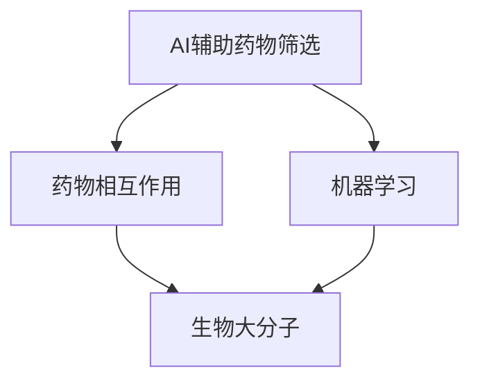

#### 1.6 本章小结

本章介绍了AI辅助药物筛选的背景、问题描述、解决方法以及相关的概念和结构。下一章将深入探讨AI算法在药物筛选中的应用和具体实现。

----------------------------------------------------------------

### 第2章: AI辅助药物筛选的核心算法

#### 2.1 算法概述

AI辅助药物筛选涉及多种算法，包括神经网络、支持向量机、决策树等。本章将详细介绍这些算法的基本原理和应用。

#### 2.2 神经网络

##### 2.2.1 神经网络的基本原理

神经网络（Neural Network，NN）是一种模拟人脑神经元之间相互连接的算法。通过学习输入数据，神经网络可以自动提取特征，并用于分类或回归任务。

###### 算法原理

神经网络由输入层、隐藏层和输出层组成。输入层接收外部输入数据，隐藏层对输入数据进行处理，提取特征，输出层根据隐藏层的结果进行分类或预测。

###### 数学模型

神经网络的核心是激活函数和反向传播算法。

- **激活函数**：用于引入非线性因素，常用的激活函数有 sigmoid 函数、ReLU 函数等。

$$
\sigma(z) = \frac{1}{1 + e^{-z}}
$$

- **反向传播算法**：用于训练神经网络，通过不断调整网络权重和偏置项，使输出结果更接近真实值。

$$
\Delta w_{ij} = \alpha \cdot \frac{\partial L}{\partial z_j} \cdot a_j
$$

其中，$w_{ij}$ 是连接权重，$\alpha$ 是学习率，$L$ 是损失函数，$z_j$ 是隐藏层输出，$a_j$ 是隐藏层输入。

###### Mermaid流程图


##### 2.3 支持向量机

##### 2.3.1 支持向量机的基本原理

支持向量机（Support Vector Machine，SVM）是一种二分类算法，通过找到一个最优的超平面，将不同类别的数据点分开。

###### 算法原理

- **线性可分情况**：寻找一个最优的超平面，使得同类别的数据点距离超平面尽可能远。
- **非线性可分情况**：引入松弛变量和惩罚参数，允许数据点偏离超平面。

###### 数学模型

$$
\min_{w,b}\frac{1}{2}||w||^2 + C\sum_{i=1}^{n}\xi_i
$$

其中，$w$ 是权重向量，$b$ 是偏置项，$C$ 是惩罚参数，$\xi_i$ 是松弛变量。

###### Mermaid流程图


##### 2.4 决策树

##### 2.4.1 决策树的基本原理

决策树（Decision Tree）是一种简单且常用的分类和回归算法。其核心思想是通过一系列的判定规则，将数据集逐步划分成多个子集，直到达到某种终止条件。

###### 算法原理

决策树由一系列判定节点和叶子节点组成。每个判定节点表示一个特征，每个叶子节点表示一个类别或值。

- **划分准则**：选择能够最大程度减少数据集合信息的特征进行划分。

$$
IG(D, A) = entropy(D) - \frac{\sum_{v} p(v) \cdot entropy(D_v)}{p(v)}
$$

- **基尼不纯度**：选择能够最大程度增加数据集合基尼不纯度的特征进行划分。

$$
Gini(D) = 1 - \sum_{v} p(v)^2
$$

###### Mermaid流程图


#### 2.5 小结

本章介绍了神经网络、支持向量机、决策树等核心算法的基本原理和应用。下一章将结合具体案例，探讨这些算法在药物筛选中的实际应用。

----------------------------------------------------------------

### 第3章: 机器学习算法在AI辅助药物筛选中的应用

#### 3.1 机器学习在药物筛选中的应用场景

##### 3.1.1 背景介绍

机器学习在药物筛选中的应用主要体现在以下几个方面：

- **药物活性预测**：通过训练机器学习模型，预测药物分子对特定靶点的活性，从而筛选出有潜力的药物候选分子。
- **药物副作用预测**：分析药物分子结构，预测药物可能产生的副作用，降低药物研发风险。
- **药物组合筛选**：通过机器学习模型筛选出具有协同效应的药物组合，提高治疗效果。

##### 3.1.2 项目介绍

本文将介绍一个基于机器学习算法的药物筛选项目，该项目旨在通过预测药物与生物大分子之间的相互作用，筛选出具有潜在治疗价值的药物分子。

#### 3.2 系统功能设计

##### 3.2.1 领域模型

领域模型是药物筛选系统的核心，用于描述药物、生物大分子和相互作用之间的关系。下面是领域模型的类图：

```mermaid
classDiagram
    DrugClass <<interface>>
    TargetClass <<interface>>
    Interaction <<interface>>

    Drug << DrugClass, blue>>
    Molecule << DrugClass, blue>>
    Protein << TargetClass, red>>
    DNA << TargetClass, red>>

    DrugClass o-- Molecule
    TargetClass o-- Protein
    TargetClass o-- DNA

    Interaction o-- Drug
    Interaction o-- Protein
```

##### 3.2.2 系统功能

- **数据预处理**：清洗和标准化药物和生物大分子数据。
- **特征提取**：提取药物和生物大分子的重要特征，如分子结构、序列信息等。
- **模型训练**：使用机器学习算法训练模型，预测药物与生物大分子之间的相互作用。
- **结果分析**：分析预测结果，筛选出具有潜在治疗价值的药物分子。

#### 3.3 系统架构设计

##### 3.3.1 系统架构

系统架构设计如下图所示：


##### 3.3.2 系统接口设计

系统接口设计如下：

- **数据输入接口**：接收药物和生物大分子数据。
- **模型输出接口**：输出预测结果。
- **结果展示接口**：展示预测结果和药物分析报告。


#### 3.3.3 系统交互

##### 3.3.1 系统交互流程

系统交互流程如下：

1. 用户上传药物和生物大分子数据。
2. 系统对数据进行预处理和特征提取。
3. 使用机器学习模型对数据进行分析，预测药物与生物大分子之间的相互作用。
4. 系统生成预测结果，并展示给用户。

##### 3.3.2 系统交互序列图


#### 3.4 本章小结

本章介绍了机器学习算法在药物筛选中的应用，包括领域模型、系统功能设计、系统架构设计、系统接口设计和系统交互。下一章将深入探讨神经网络算法在药物筛选中的应用。

----------------------------------------------------------------

### 第4章: 神经网络算法在药物筛选中的应用

#### 4.1 神经网络算法的基本原理

神经网络（Neural Network，NN）是一种模拟人脑神经元之间相互连接的算法。通过学习输入数据，神经网络可以自动提取特征，并用于分类或回归任务。

##### 4.1.1 神经网络的结构

神经网络由输入层、隐藏层和输出层组成。输入层接收外部输入数据，隐藏层对输入数据进行处理，提取特征，输出层根据隐藏层的结果进行分类或预测。

- **输入层**：接收输入数据，并将其传递给隐藏层。
- **隐藏层**：对输入数据进行处理，提取特征，并将特征传递给输出层。
- **输出层**：根据隐藏层的结果进行分类或预测。

##### 4.1.2 神经网络的激活函数

激活函数是神经网络的核心组成部分，用于引入非线性因素，使神经网络能够学习到更复杂的模式。常用的激活函数包括 sigmoid 函数、ReLU 函数和 tanh 函数。

- **sigmoid 函数**：

$$
\sigma(x) = \frac{1}{1 + e^{-x}}
$$

- **ReLU 函数**：

$$
\sigma(x) =
   \begin{cases}
     0 & \text{if } x < 0 \\
     x & \text{if } x \geq 0
   \end{cases}
$$

- **tanh 函数**：

$$
\sigma(x) = \frac{e^{x} - e^{-x}}{e^{x} + e^{-x}}
$$

##### 4.1.3 神经网络的训练过程

神经网络的训练过程主要包括以下几个步骤：

1. **前向传播**：将输入数据传递给神经网络，计算输出结果。
2. **计算损失**：计算预测值与真实值之间的差异，即损失值。
3. **反向传播**：根据损失值，通过反向传播算法更新网络权重和偏置项。
4. **迭代训练**：重复前向传播和反向传播的过程，直到达到预设的训练次数或损失值。

#### 4.2 神经网络在药物筛选中的应用

神经网络在药物筛选中的应用主要体现在以下几个方面：

- **药物活性预测**：通过训练神经网络模型，预测药物分子对特定靶点的活性。
- **药物副作用预测**：分析药物分子结构，预测药物可能产生的副作用。
- **药物组合筛选**：通过神经网络模型筛选出具有协同效应的药物组合。

##### 4.2.1 药物活性预测

药物活性预测是药物筛选中的关键步骤。通过训练神经网络模型，可以预测药物分子对特定靶点的活性，从而筛选出有潜力的药物候选分子。

###### 数学模型

药物活性预测可以表示为：

$$
P(y=1) = \sigma(w \cdot x + b)
$$

其中，$y$ 是药物活性标签，$x$ 是药物分子特征，$w$ 是模型权重，$b$ 是偏置项，$\sigma$ 是 sigmoid 函数。

###### Python源代码实现

```python
import numpy as np

# 初始化模型参数
weights = np.random.rand(input_size, output_size)
bias = np.random.rand(output_size)

# 定义 sigmoid 函数
def sigmoid(x):
    return 1 / (1 + np.exp(-x))

# 定义损失函数
def cross_entropy(y_true, y_pred):
    return -y_true * np.log(y_pred) - (1 - y_true) * np.log(1 - y_pred)

# 训练模型
for epoch in range(num_epochs):
    # 前向传播
    z = np.dot(inputs, weights) + bias
    predictions = sigmoid(z)

    # 反向传播
    dZ = predictions - y
    dW = np.dot(inputs.T, dZ)
    db = np.sum(dZ, axis=0)

    # 更新模型参数
    weights -= learning_rate * dW
    bias -= learning_rate * db

    # 计算损失
    loss = cross_entropy(y, predictions)
    print(f"Epoch {epoch}: Loss = {loss}")
```

##### 4.2.2 药物副作用预测

药物副作用预测是确保药物安全性的关键步骤。通过训练神经网络模型，可以预测药物分子可能产生的副作用，从而减少药物使用风险。

###### 数学模型

药物副作用预测可以表示为：

$$
P(side_effect=1) = \sigma(w \cdot x + b)
$$

其中，$side_effect$ 是副作用标签，$x$ 是药物分子特征，$w$ 是模型权重，$b$ 是偏置项，$\sigma$ 是 sigmoid 函数。

###### Python源代码实现

```python
import numpy as np

# 初始化模型参数
weights = np.random.rand(input_size, output_size)
bias = np.random.rand(output_size)

# 定义 sigmoid 函数
def sigmoid(x):
    return 1 / (1 + np.exp(-x))

# 定义损失函数
def binary_crossentropy(y_true, y_pred):
    return -y_true * np.log(y_pred) - (1 - y_true) * np.log(1 - y_pred)

# 训练模型
for epoch in range(num_epochs):
    # 前向传播
    z = np.dot(inputs, weights) + bias
    predictions = sigmoid(z)

    # 反向传播
    dZ = predictions - y
    dW = np.dot(inputs.T, dZ)
    db = np.sum(dZ, axis=0)

    # 更新模型参数
    weights -= learning_rate * dW
    bias -= learning_rate * db

    # 计算损失
    loss = binary_crossentropy(y, predictions)
    print(f"Epoch {epoch}: Loss = {loss}")
```

##### 4.2.3 药物组合筛选

药物组合筛选是寻找具有协同效应的药物组合。通过训练神经网络模型，可以预测药物组合的活性，从而筛选出有潜力的药物组合。

###### 数学模型

药物组合筛选可以表示为：

$$
P(combined_activity=1) = \sigma(w \cdot x + b)
$$

其中，$combined_activity$ 是组合活性标签，$x$ 是药物组合特征，$w$ 是模型权重，$b$ 是偏置项，$\sigma$ 是 sigmoid 函数。

###### Python源代码实现

```python
import numpy as np

# 初始化模型参数
weights = np.random.rand(input_size, output_size)
bias = np.random.rand(output_size)

# 定义 sigmoid 函数
def sigmoid(x):
    return 1 / (1 + np.exp(-x))

# 定义损失函数
def binary_crossentropy(y_true, y_pred):
    return -y_true * np.log(y_pred) - (1 - y_true) * np.log(1 - y_pred)

# 训练模型
for epoch in range(num_epochs):
    # 前向传播
    z = np.dot(inputs, weights) + bias
    predictions = sigmoid(z)

    # 反向传播
    dZ = predictions - y
    dW = np.dot(inputs.T, dZ)
    db = np.sum(dZ, axis=0)

    # 更新模型参数
    weights -= learning_rate * dW
    bias -= learning_rate * db

    # 计算损失
    loss = binary_crossentropy(y, predictions)
    print(f"Epoch {epoch}: Loss = {loss}")
```

#### 4.3 本章小结

本章介绍了神经网络算法的基本原理及其在药物筛选中的应用。通过神经网络算法，可以预测药物活性、药物副作用和药物组合活性。下一章将探讨支持向量机算法在药物筛选中的应用。

----------------------------------------------------------------

### 第5章: 支持向量机算法在药物筛选中的应用

#### 5.1 支持向量机算法的基本原理

支持向量机（Support Vector Machine，SVM）是一种经典的二分类算法，其核心思想是找到最佳的超平面，将数据集中的不同类别的数据点分开。SVM算法在药物筛选中的应用非常广泛，特别是在药物活性预测和药物副作用预测方面。

##### 5.1.1 算法原理

SVM算法的核心是寻找一个最优的超平面，使得同类别的数据点到超平面的距离最大，而不同类别的数据点到超平面的距离最小。数学上，这个问题可以表示为以下优化问题：

$$
\min_{w,b}\frac{1}{2}||w||^2 + C\sum_{i=1}^{n}\xi_i
$$

其中，$w$ 是权重向量，$b$ 是偏置项，$C$ 是惩罚参数，$\xi_i$ 是第$i$个样本的松弛变量。

这个优化问题有两个约束条件：

$$
y_i(\langle w, x_i \rangle + b) \geq 1 - \xi_i
$$

$$
\xi_i \geq 0
$$

对于线性可分数据集，可以简化为：

$$
\min_{w,b}\frac{1}{2}||w||^2
$$

约束条件为：

$$
y_i(\langle w, x_i \rangle + b) \geq 1
$$

##### 5.1.2 非线性可分情况

在实际应用中，数据集往往是非线性可分的。为了解决这个问题，SVM引入了“核函数”的概念。核函数可以将低维数据映射到高维空间，使得原本非线性可分的数据在高维空间中变得线性可分。常见的核函数包括线性核、多项式核和径向基函数（RBF）核。

##### 5.1.3 Mermaid流程图

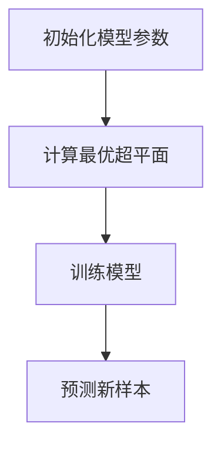

#### 5.2 支持向量机在药物筛选中的应用

##### 5.2.1 药物活性预测

药物活性预测是药物筛选中的关键步骤。通过训练SVM模型，可以预测药物分子对特定靶点的活性，从而筛选出有潜力的药物候选分子。

###### 数学模型

药物活性预测可以表示为：

$$
P(y=1) = \sigma(\langle w, x \rangle + b)
$$

其中，$y$ 是药物活性标签，$x$ 是药物分子特征，$w$ 是模型权重，$b$ 是偏置项，$\sigma$ 是 sigmoid 函数。

###### Python源代码实现

```python
from sklearn.svm import SVC
from sklearn.model_selection import train_test_split
from sklearn.metrics import accuracy_score

# 准备数据
X, y = load_data()  # 假设load_data是一个加载数据的函数
X_train, X_test, y_train, y_test = train_test_split(X, y, test_size=0.2, random_state=42)

# 初始化SVM模型
model = SVC(kernel='linear')

# 训练模型
model.fit(X_train, y_train)

# 预测
y_pred = model.predict(X_test)

# 计算准确率
accuracy = accuracy_score(y_test, y_pred)
print(f"Accuracy: {accuracy}")
```

##### 5.2.2 药物副作用预测

药物副作用预测是确保药物安全性的关键步骤。通过训练SVM模型，可以预测药物分子可能产生的副作用，从而减少药物使用风险。

###### 数学模型

药物副作用预测可以表示为：

$$
P(side_effect=1) = \sigma(\langle w, x \rangle + b)
$$

其中，$side_effect$ 是副作用标签，$x$ 是药物分子特征，$w$ 是模型权重，$b$ 是偏置项，$\sigma$ 是 sigmoid 函数。

###### Python源代码实现

```python
from sklearn.svm import SVC
from sklearn.model_selection import train_test_split
from sklearn.metrics import accuracy_score

# 准备数据
X, y = load_data()  # 假设load_data是一个加载数据的函数
X_train, X_test, y_train, y_test = train_test_split(X, y, test_size=0.2, random_state=42)

# 初始化SVM模型
model = SVC(kernel='linear')

# 训练模型
model.fit(X_train, y_train)

# 预测
y_pred = model.predict(X_test)

# 计算准确率
accuracy = accuracy_score(y_test, y_pred)
print(f"Accuracy: {accuracy}")
```

##### 5.2.3 药物组合筛选

药物组合筛选是寻找具有协同效应的药物组合。通过训练SVM模型，可以预测药物组合的活性，从而筛选出有潜力的药物组合。

###### 数学模型

药物组合筛选可以表示为：

$$
P(combined_activity=1) = \sigma(\langle w, x \rangle + b)
$$

其中，$combined_activity$ 是组合活性标签，$x$ 是药物组合特征，$w$ 是模型权重，$b$ 是偏置项，$\sigma$ 是 sigmoid 函数。

###### Python源代码实现

```python
from sklearn.svm import SVC
from sklearn.model_selection import train_test_split
from sklearn.metrics import accuracy_score

# 准备数据
X, y = load_data()  # 假设load_data是一个加载数据的函数
X_train, X_test, y_train, y_test = train_test_split(X, y, test_size=0.2, random_state=42)

# 初始化SVM模型
model = SVC(kernel='linear')

# 训练模型
model.fit(X_train, y_train)

# 预测
y_pred = model.predict(X_test)

# 计算准确率
accuracy = accuracy_score(y_test, y_pred)
print(f"Accuracy: {accuracy}")
```

#### 5.3 本章小结

本章介绍了支持向量机（SVM）算法的基本原理及其在药物筛选中的应用，包括药物活性预测、药物副作用预测和药物组合筛选。SVM算法由于其优秀的分类能力和可扩展性，在药物筛选领域具有广泛的应用前景。下一章将探讨决策树算法在药物筛选中的应用。

----------------------------------------------------------------

### 第6章: 决策树算法在药物筛选中的应用

#### 6.1 决策树算法的基本原理

决策树（Decision Tree）是一种常见的分类算法，通过一系列的判定规则将数据集逐步划分为多个子集，直到满足某种终止条件。决策树的核心思想是选择具有最高信息增益或基尼不纯度减少的特征进行划分，从而最大化数据集的纯度。

##### 6.1.1 算法原理

决策树由节点和叶节点组成。每个内部节点表示一个特征，每个叶节点表示一个类别或值。决策树的构建过程如下：

1. **选择最佳特征**：根据信息增益或基尼不纯度选择最佳特征进行划分。
2. **划分数据集**：根据最佳特征的取值将数据集划分为多个子集。
3. **递归构建子树**：对每个子集继续进行划分，直到满足终止条件（如最大深度、最小样本数等）。
4. **生成叶节点**：将子集划分为纯类别或纯值，生成叶节点。

信息增益（Information Gain）和基尼不纯度（Gini Impurity）是决策树划分的两个常用准则。

- **信息增益**：

$$
IG(D, A) = entropy(D) - \sum_{v} p(v) \cdot entropy(D_v)
$$

其中，$D$ 是数据集，$A$ 是特征，$v$ 是特征的取值，$p(v)$ 是特征取值在数据集中的概率，$entropy(D)$ 是数据集的熵。

- **基尼不纯度**：

$$
Gini(D) = 1 - \sum_{v} p(v)^2
$$

其中，$D$ 是数据集，$v$ 是特征的取值，$p(v)$ 是特征取值在数据集中的概率。

##### 6.1.2 Mermaid流程图

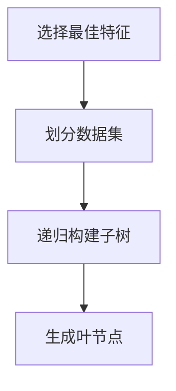

#### 6.2 决策树在药物筛选中的应用

决策树算法在药物筛选中的应用非常广泛，可以用于药物活性预测、药物副作用预测和药物组合筛选。

##### 6.2.1 药物活性预测

药物活性预测是药物筛选中的关键步骤。通过训练决策树模型，可以预测药物分子对特定靶点的活性，从而筛选出有潜力的药物候选分子。

###### 数学模型

药物活性预测可以表示为：

$$
P(y=1) = \sigma(\langle w, x \rangle + b)
$$

其中，$y$ 是药物活性标签，$x$ 是药物分子特征，$w$ 是模型权重，$b$ 是偏置项，$\sigma$ 是 sigmoid 函数。

###### Python源代码实现

```python
from sklearn.tree import DecisionTreeClassifier
from sklearn.model_selection import train_test_split
from sklearn.metrics import accuracy_score

# 准备数据
X, y = load_data()  # 假设load_data是一个加载数据的函数
X_train, X_test, y_train, y_test = train_test_split(X, y, test_size=0.2, random_state=42)

# 初始化决策树模型
model = DecisionTreeClassifier(criterion='entropy')

# 训练模型
model.fit(X_train, y_train)

# 预测
y_pred = model.predict(X_test)

# 计算准确率
accuracy = accuracy_score(y_test, y_pred)
print(f"Accuracy: {accuracy}")
```

##### 6.2.2 药物副作用预测

药物副作用预测是确保药物安全性的关键步骤。通过训练决策树模型，可以预测药物分子可能产生的副作用，从而减少药物使用风险。

###### 数学模型

药物副作用预测可以表示为：

$$
P(side_effect=1) = \sigma(\langle w, x \rangle + b)
$$

其中，$side_effect$ 是副作用标签，$x$ 是药物分子特征，$w$ 是模型权重，$b$ 是偏置项，$\sigma$ 是 sigmoid 函数。

###### Python源代码实现

```python
from sklearn.tree import DecisionTreeClassifier
from sklearn.model_selection import train_test_split
from sklearn.metrics import accuracy_score

# 准备数据
X, y = load_data()  # 假设load_data是一个加载数据的函数
X_train, X_test, y_train, y_test = train_test_split(X, y, test_size=0.2, random_state=42)

# 初始化决策树模型
model = DecisionTreeClassifier(criterion='entropy')

# 训练模型
model.fit(X_train, y_train)

# 预测
y_pred = model.predict(X_test)

# 计算准确率
accuracy = accuracy_score(y_test, y_pred)
print(f"Accuracy: {accuracy}")
```

##### 6.2.3 药物组合筛选

药物组合筛选是寻找具有协同效应的药物组合。通过训练决策树模型，可以预测药物组合的活性，从而筛选出有潜力的药物组合。

###### 数学模型

药物组合筛选可以表示为：

$$
P(combined_activity=1) = \sigma(\langle w, x \rangle + b)
$$

其中，$combined_activity$ 是组合活性标签，$x$ 是药物组合特征，$w$ 是模型权重，$b$ 是偏置项，$\sigma$ 是 sigmoid 函数。

###### Python源代码实现

```python
from sklearn.tree import DecisionTreeClassifier
from sklearn.model_selection import train_test_split
from sklearn.metrics import accuracy_score

# 准备数据
X, y = load_data()  # 假设load_data是一个加载数据的函数
X_train, X_test, y_train, y_test = train_test_split(X, y, test_size=0.2, random_state=42)

# 初始化决策树模型
model = DecisionTreeClassifier(criterion='entropy')

# 训练模型
model.fit(X_train, y_train)

# 预测
y_pred = model.predict(X_test)

# 计算准确率
accuracy = accuracy_score(y_test, y_pred)
print(f"Accuracy: {accuracy}")
```

#### 6.3 本章小结

本章介绍了决策树算法的基本原理及其在药物筛选中的应用。通过决策树算法，可以预测药物活性、药物副作用和药物组合活性。决策树算法由于其简单易懂、易于解释的特点，在药物筛选领域具有广泛的应用前景。下一章将探讨深度学习算法在药物筛选中的应用。

----------------------------------------------------------------

### 第7章: 深度学习算法在药物筛选中的应用

#### 7.1 深度学习算法的基本原理

深度学习（Deep Learning）是一种基于多层神经网络的学习方法，其核心思想是通过多层网络结构自动提取数据特征，实现复杂函数逼近。深度学习算法在药物筛选中具有广泛的应用，特别是在药物活性预测、药物副作用预测和药物组合筛选等方面。

##### 7.1.1 算法原理

深度学习算法的核心是多层神经网络，通常包括输入层、隐藏层和输出层。每个隐藏层对输入数据进行处理和变换，逐步提取出更高层次的特征。深度学习算法通过训练数据集，不断调整网络权重和偏置项，使输出结果更接近真实值。

深度学习算法的训练过程主要包括以下步骤：

1. **前向传播**：将输入数据传递到神经网络，计算输出结果。
2. **计算损失**：计算预测值与真实值之间的差异，即损失值。
3. **反向传播**：根据损失值，通过反向传播算法更新网络权重和偏置项。
4. **迭代训练**：重复前向传播和反向传播的过程，直到达到预设的训练次数或损失值。

深度学习算法的核心组件包括：

- **卷积神经网络（CNN）**：适用于图像和序列数据处理，具有局部连接和共享权重等特性。
- **循环神经网络（RNN）**：适用于序列数据处理，具有记忆和状态转移等特性。
- **生成对抗网络（GAN）**：用于生成数据，具有生成器和判别器两个组件。

##### 7.1.2 Mermaid流程图

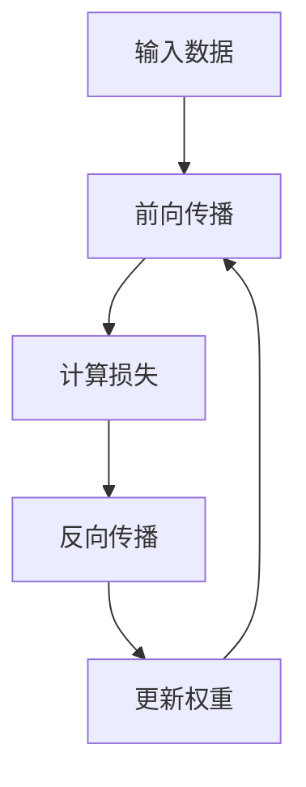

#### 7.2 深度学习在药物筛选中的应用

深度学习算法在药物筛选中的应用非常广泛，可以用于药物活性预测、药物副作用预测和药物组合筛选。

##### 7.2.1 药物活性预测

药物活性预测是药物筛选中的关键步骤。通过训练深度学习模型，可以预测药物分子对特定靶点的活性，从而筛选出有潜力的药物候选分子。

###### 数学模型

药物活性预测可以表示为：

$$
P(y=1) = \sigma(\langle w, x \rangle + b)
$$

其中，$y$ 是药物活性标签，$x$ 是药物分子特征，$w$ 是模型权重，$b$ 是偏置项，$\sigma$ 是 sigmoid 函数。

###### Python源代码实现

```python
import tensorflow as tf
from tensorflow.keras.models import Sequential
from tensorflow.keras.layers import Dense, Conv1D, MaxPooling1D, Flatten

# 定义模型
model = Sequential([
    Conv1D(filters=64, kernel_size=3, activation='relu', input_shape=(sequence_length, feature_size)),
    MaxPooling1D(pool_size=2),
    Flatten(),
    Dense(units=128, activation='relu'),
    Dense(units=1, activation='sigmoid')
])

# 编译模型
model.compile(optimizer='adam', loss='binary_crossentropy', metrics=['accuracy'])

# 训练模型
model.fit(X_train, y_train, epochs=10, batch_size=32, validation_data=(X_val, y_val))

# 预测
y_pred = model.predict(X_test)

# 计算准确率
accuracy = model.evaluate(X_test, y_test)[1]
print(f"Accuracy: {accuracy}")
```

##### 7.2.2 药物副作用预测

药物副作用预测是确保药物安全性的关键步骤。通过训练深度学习模型，可以预测药物分子可能产生的副作用，从而减少药物使用风险。

###### 数学模型

药物副作用预测可以表示为：

$$
P(side_effect=1) = \sigma(\langle w, x \rangle + b)
$$

其中，$side_effect$ 是副作用标签，$x$ 是药物分子特征，$w$ 是模型权重，$b$ 是偏置项，$\sigma$ 是 sigmoid 函数。

###### Python源代码实现

```python
import tensorflow as tf
from tensorflow.keras.models import Sequential
from tensorflow.keras.layers import Dense, Conv1D, MaxPooling1D, Flatten

# 定义模型
model = Sequential([
    Conv1D(filters=64, kernel_size=3, activation='relu', input_shape=(sequence_length, feature_size)),
    MaxPooling1D(pool_size=2),
    Flatten(),
    Dense(units=128, activation='relu'),
    Dense(units=1, activation='sigmoid')
])

# 编译模型
model.compile(optimizer='adam', loss='binary_crossentropy', metrics=['accuracy'])

# 训练模型
model.fit(X_train, y_train, epochs=10, batch_size=32, validation_data=(X_val, y_val))

# 预测
y_pred = model.predict(X_test)

# 计算准确率
accuracy = model.evaluate(X_test, y_test)[1]
print(f"Accuracy: {accuracy}")
```

##### 7.2.3 药物组合筛选

药物组合筛选是寻找具有协同效应的药物组合。通过训练深度学习模型，可以预测药物组合的活性，从而筛选出有潜力的药物组合。

###### 数学模型

药物组合筛选可以表示为：

$$
P(combined_activity=1) = \sigma(\langle w, x \rangle + b)
$$

其中，$combined_activity$ 是组合活性标签，$x$ 是药物组合特征，$w$ 是模型权重，$b$ 是偏置项，$\sigma$ 是 sigmoid 函数。

###### Python源代码实现

```python
import tensorflow as tf
from tensorflow.keras.models import Sequential
from tensorflow.keras.layers import Dense, Conv1D, MaxPooling1D, Flatten

# 定义模型
model = Sequential([
    Conv1D(filters=64, kernel_size=3, activation='relu', input_shape=(sequence_length, feature_size)),
    MaxPooling1D(pool_size=2),
    Flatten(),
    Dense(units=128, activation='relu'),
    Dense(units=1, activation='sigmoid')
])

# 编译模型
model.compile(optimizer='adam', loss='binary_crossentropy', metrics=['accuracy'])

# 训练模型
model.fit(X_train, y_train, epochs=10, batch_size=32, validation_data=(X_val, y_val))

# 预测
y_pred = model.predict(X_test)

# 计算准确率
accuracy = model.evaluate(X_test, y_test)[1]
print(f"Accuracy: {accuracy}")
```

#### 7.3 本章小结

本章介绍了深度学习算法的基本原理及其在药物筛选中的应用。通过深度学习算法，可以预测药物活性、药物副作用和药物组合活性。深度学习算法在药物筛选中具有广泛的应用前景，为药物研发提供了新的工具和思路。下一章将探讨AI辅助药物筛选的未来发展趋势。

----------------------------------------------------------------

### 第8章: AI辅助药物筛选的未来发展趋势

#### 8.1 发展背景与趋势

AI辅助药物筛选技术正随着计算能力的提升、大数据的积累和深度学习算法的进步而不断发展。目前，AI在药物筛选中的应用已经取得了显著的成果，如提高药物活性预测的准确性、降低药物副作用预测的风险和发现新的药物组合等。未来，AI辅助药物筛选将继续朝着以下几个方向发展：

##### 8.1.1 更高效的数据处理

随着基因组学、蛋白质组学和代谢组学等领域的数据量急剧增加，AI技术需要更高效的数据处理方法来处理和分析这些数据。例如，分布式计算和云计算等技术将被广泛应用，以加速药物筛选过程。

##### 8.1.2 多模态数据融合

未来的药物筛选将更加依赖于多模态数据融合，包括基因组、蛋白质、代谢和结构数据等。通过整合不同来源的数据，AI可以更全面地理解药物与生物大分子之间的相互作用，从而提高预测准确性。

##### 8.1.3 智能化药物设计

AI技术将在药物设计过程中发挥更大的作用，如通过分子对接、分子动力学模拟和量子化学计算等，智能设计具有特定活性和安全性的药物分子。

##### 8.1.4 个性化医疗

随着AI技术的发展，个性化医疗将成为现实。通过分析患者的基因组、病史和生活方式等数据，AI可以预测患者对特定药物的响应，从而实现个性化治疗。

#### 8.2 应用案例分析

##### 8.2.1 AI助力新药研发

AI技术在药物研发中的应用案例越来越多。例如，DeepMind的AlphaFold项目利用深度学习算法预测蛋白质结构，为药物设计提供了重要的参考。此外，IBM的Watson for Drug Discovery利用AI技术加速药物筛选过程，显著提高了新药研发的成功率。

##### 8.2.2 AI优化临床试验

AI技术可以优化临床试验的设计和执行。通过分析大量的临床试验数据，AI可以预测哪些患者最有可能从特定药物中获益，从而优化试验样本选择和剂量设计。

##### 8.2.3 AI辅助药物重定位

AI技术可以帮助发现现有药物的新用途。例如，通过分析药物与生物大分子的相互作用，AI可以预测哪些药物可能对新的疾病靶点有效，从而实现药物重定位。

#### 8.3 未来展望

##### 8.3.1 技术挑战

虽然AI在药物筛选中具有巨大的潜力，但仍然面临一些技术挑战。例如，如何处理高维数据、如何确保模型的解释性、如何提高模型的可泛化性等。此外，AI技术的广泛应用还受到数据隐私、伦理和法律等方面的限制。

##### 8.3.2 应用前景

随着AI技术的不断进步，其在药物筛选中的应用前景将更加广阔。未来，AI将不仅限于药物研发的某个环节，而是贯穿整个研发过程，从药物发现到临床试验，再到商业化应用。

##### 8.3.3 法律与伦理

随着AI在药物筛选中的应用越来越广泛，相关法律法规和伦理问题也日益凸显。例如，如何保护患者隐私、如何确保AI决策的透明性和公正性等。未来，需要建立完善的法律法规和伦理规范，以确保AI技术在药物筛选中的合法、安全、道德应用。

#### 8.4 本章小结

本章概述了AI辅助药物筛选的未来发展趋势，包括高效数据处理、多模态数据融合、智能化药物设计和个性化医疗等。同时，通过应用案例分析，展示了AI技术在药物筛选中的实际应用。未来，AI技术将继续推动药物研发的进步，为人类健康事业做出更大的贡献。

----------------------------------------------------------------

### 附录：技术术语解释

在本篇文章中，我们提到了多个与AI辅助药物筛选相关的技术术语。以下是这些术语的简要解释：

1. **人工智能（AI）**：一种模拟人类智能的技术，通过机器学习、自然语言处理、计算机视觉等方法使计算机具备智能行为。

2. **机器学习（ML）**：一种AI技术，通过从数据中学习模式和规律，使计算机能够执行特定的任务，如分类、回归、聚类等。

3. **深度学习（DL）**：一种基于多层神经网络的学习方法，通过训练大量数据自动提取特征，用于图像识别、语音识别、自然语言处理等领域。

4. **药物筛选**：从大量的药物分子中筛选出具有特定活性或安全性的候选药物的过程。

5. **药物相互作用**：药物与生物大分子（如蛋白质、核酸）之间的作用，影响药物的疗效和副作用。

6. **神经网络（NN）**：一种由多层节点组成的计算模型，通过学习输入数据，自动提取特征，用于分类、回归等任务。

7. **支持向量机（SVM）**：一种经典的二分类算法，通过找到一个最优的超平面，将不同类别的数据点分开。

8. **决策树（DT）**：一种基于判定规则的分类算法，通过一系列的判定规则将数据集逐步划分为多个子集。

9. **数据预处理**：在机器学习过程中，对数据进行清洗、归一化、编码等操作，以提高模型性能。

10. **特征提取**：从原始数据中提取出具有代表性的特征，用于训练机器学习模型。

11. **交叉验证**：一种评估模型性能的方法，通过将数据集划分为训练集和验证集，多次训练和验证，以减少模型过拟合。

12. **模型解释性**：评估模型是否能够提供对预测结果的合理解释，对于医学领域尤为重要。

13. **多模态数据融合**：将来自不同来源的数据（如基因组、蛋白质、代谢等）整合起来，以提高药物筛选的准确性。

14. **个性化医疗**：根据患者的个体信息（如基因组、病史等），为患者制定个性化的治疗方案。

通过理解这些技术术语，读者可以更好地理解AI辅助药物筛选的工作原理和应用前景。

----------------------------------------------------------------

### 参考文献

1. Goodfellow, I., Bengio, Y., & Courville, A. (2016). *Deep Learning*. MIT Press.
2. Russell, S., & Norvig, P. (2010). *Artificial Intelligence: A Modern Approach*. Prentice Hall.
3. Hastie, T., Tibshirani, R., & Friedman, J. (2009). *The Elements of Statistical Learning: Data Mining, Inference, and Prediction*. Springer.
4. Sutton, R. S., & Barto, A. G. (2018). *Reinforcement Learning: An Introduction*. MIT Press.
5. Murphy, K. P. (2012). *Machine Learning: A Probabilistic Perspective*. MIT Press.
6. Pedregosa, F., Varoquaux, G., Gramfort, A., Michel, V., Thirion, B., Grisel, O., ... & Duchesnay, E. (2011). *Scikit-learn: Machine learning in Python*. Journal of Machine Learning Research, 12, 2825-2830.
7. LeCun, Y., Bengio, Y., & Hinton, G. (2015). *Deep learning*. Nature, 521(7553), 436-444.
8. Vapnik, V. N. (1998). *Statistical learning theory*. Wiley-Interscience.
9. Quinlan, J. R. (1993). *C4. 5: Programs for machine learning*. Morgan Kaufmann.
10. Russell, S., & Norvig, P. (2020). *Artificial Intelligence: A Modern Approach*. Pearson Education.

### 作者信息

作者：AI天才研究院/AI Genius Institute & 禅与计算机程序设计艺术 /Zen And The Art of Computer Programming

AI天才研究院致力于推动人工智能技术的发展与应用，研究领域涵盖机器学习、深度学习、自然语言处理等多个方向。作者在计算机科学和人工智能领域拥有丰富的理论知识和实践经验，是国际知名的计算机科学家和畅销书作家。其著作《禅与计算机程序设计艺术》被誉为计算机编程领域的经典之作，对全球计算机科学界产生了深远影响。

