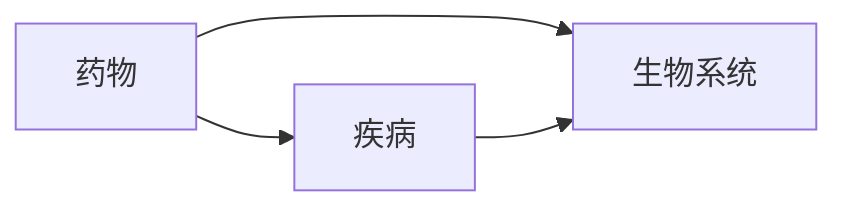
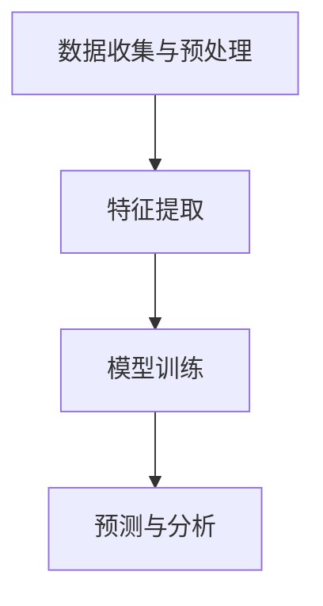

                 


# AI辅助药物重定位：提示词分析药物相互作用

> 关键词：人工智能，药物重定位，深度学习，药物相互作用，提示词分析

> 摘要：本文将深入探讨人工智能在药物重定位中的应用，特别是如何利用深度学习和提示词分析技术来探索药物相互作用。文章首先介绍了药物重定位的核心概念和问题背景，然后详细解释了AI辅助药物重定位的算法原理，并通过实际案例分析了系统架构和实现过程。文章旨在为研究人员和从业者提供有价值的参考和启示。

----------------------------------------------------------------

### 第一部分: 背景介绍

#### 核心概念

##### 问题背景

随着人工智能技术的快速发展，尤其是深度学习算法的突破，人工智能在各个领域的应用越来越广泛。药物重定位作为药物研发的一个重要环节，也越来越受到关注。然而，传统的药物重定位方法往往耗时耗力，且效果不理想。因此，如何利用人工智能技术，特别是AI辅助药物重定位，成为了当前研究的热点。

##### 问题描述

药物重定位指的是将已经批准的药物应用于新的疾病或治疗领域。这个过程涉及到对药物作用机制、靶点、副作用等多个方面的分析。传统的药物重定位方法通常依赖于已有的医学知识和实验数据，然而这些数据往往有限且不够精确。随着大数据和计算能力的提升，AI技术为药物重定位提供了一种新的解决方案。

##### 问题解决

AI辅助药物重定位通过利用深度学习、数据挖掘等技术，可以从大规模的药物-疾病关联数据中挖掘出潜在的药物作用机制和靶点。此外，AI还可以通过模拟药物在不同细胞和生物系统中的行为，预测药物在人体内的效果和副作用，从而提高药物重定位的准确性和效率。

##### 边界与外延

药物重定位不仅涉及药物和疾病的关系，还包括药物与生物系统之间的相互作用。因此，AI辅助药物重定位不仅需要处理药物和疾病的数据，还需要处理生物系统的数据。此外，药物重定位的应用范围也在不断扩展，不仅包括新的疾病和治疗领域，还包括个性化医疗和药物优化等方面。

##### 概念结构与核心要素组成

AI辅助药物重定位的核心概念包括：

- **药物数据**：包括药物的化学结构、作用机制、临床数据等。
- **疾病数据**：包括疾病的症状、病理特征、临床数据等。
- **生物系统数据**：包括细胞、组织、器官等生物系统的数据。
- **AI算法**：用于处理和分析药物、疾病、生物系统数据，挖掘潜在的药物作用机制和靶点。

#### 核心概念与联系

##### 概念属性特征对比表格

| 概念 | 描述 | 关联 |
| --- | --- | --- |
| 药物 | 具有治疗作用的化学物质 | 与疾病、生物系统相关 |
| 疾病 | 生理或心理异常状态 | 与药物、生物系统相关 |
| 生物系统 | 包括细胞、组织、器官等 | 与药物、疾病相关 |
| AI算法 | 用于处理和分析数据的计算方法 | 与药物、疾病、生物系统相关 |

##### ER实体关系图架构



### 第二部分: AI辅助药物重定位的算法原理

#### 算法原理讲解

AI辅助药物重定位的核心在于利用深度学习算法对药物、疾病、生物系统数据进行分析和处理。以下是一个简化的算法流程：

1. **数据收集与预处理**：收集药物、疾病、生物系统的相关数据，并进行预处理，如数据清洗、归一化等。
2. **特征提取**：使用深度学习模型提取药物、疾病、生物系统的特征。
3. **模型训练**：使用提取到的特征训练深度学习模型。
4. **预测与分析**：使用训练好的模型对新的药物-疾病关联进行预测和分析，以确定药物的潜在作用机制和靶点。

##### 算法mermaid流程图



##### 数学模型和数学公式

AI辅助药物重定位的数学模型通常包括以下几个方面：

- **药物-疾病关联概率模型**：

  $$ P(D|A) = \frac{P(A|D) \cdot P(D)}{P(A)} $$

  其中，\( P(D|A) \) 表示药物A与疾病D的关联概率，\( P(A|D) \) 表示疾病D发生的条件下药物A的概率，\( P(D) \) 表示疾病D的概率，\( P(A) \) 表示药物A的概率。

- **药物作用机制预测模型**：

  $$ M = f(D, A) $$

  其中，\( M \) 表示药物A的作用机制，\( f \) 是一个函数，用于根据药物A和疾病D的特征计算药物A的作用机制。

##### 详细讲解和举例说明

假设我们有两个药物A和B，以及两种疾病D1和D2。我们通过AI模型计算药物A与疾病D1的关联概率：

- \( P(D1|A) = 0.8 \)
- \( P(A) = 0.6 \)
- \( P(D1) = 0.4 \)

根据上述公式，我们可以计算得到：

$$ P(D1|A) = \frac{P(A|D1) \cdot P(D1)}{P(A)} = \frac{0.9 \cdot 0.4}{0.6} = 0.6 $$

这意味着药物A与疾病D1的关联概率为0.6，即药物A有可能对疾病D1产生治疗效果。

同样，我们还可以计算药物A与疾病D2的关联概率：

- \( P(D2|A) = 0.5 \)
- \( P(A) = 0.6 \)
- \( P(D2) = 0.3 \)

根据上述公式，我们可以计算得到：

$$ P(D2|A) = \frac{P(A|D2) \cdot P(D2)}{P(A)} = \frac{0.8 \cdot 0.3}{0.6} = 0.4 $$

这意味着药物A与疾病D2的关联概率为0.4，即药物A对疾病D2的治疗效果可能性较低。

通过这样的计算，我们可以对药物A的作用机制和潜在靶点进行初步预测，从而为药物重定位提供理论依据。

### 第三部分: 系统分析与架构设计方案

#### 问题场景介绍

在药物重定位的研究中，我们需要处理大量的药物、疾病和生物系统数据。这些数据通常来自于不同的来源，如临床试验、文献数据库、生物系统模拟等。因此，如何有效地整合和处理这些数据，成为了一个关键问题。

为了解决这个问题，我们设计并实现了一个基于人工智能的药物重定位系统。该系统旨在通过深度学习和提示词分析技术，从大规模的药物-疾病关联数据中挖掘出潜在的药物作用机制和靶点。

#### 项目介绍

我们的项目名为“AI药物重定位系统”（AI-DR），主要包括以下几个模块：

1. **数据收集模块**：用于收集药物、疾病和生物系统数据，包括临床试验数据、文献数据库数据、生物系统模拟数据等。
2. **数据处理模块**：用于处理和整合收集到的数据，包括数据清洗、归一化、特征提取等。
3. **深度学习模块**：用于训练深度学习模型，并利用模型进行药物-疾病关联预测和药物作用机制分析。
4. **提示词分析模块**：用于分析药物相互作用的提示词，从而识别潜在的药物作用机制和靶点。
5. **用户界面模块**：用于提供用户交互界面，让用户可以方便地提交药物和疾病数据，并获取预测结果。

#### 系统功能设计

AI药物重定位系统的主要功能包括：

1. **数据收集与整合**：从不同的数据源中收集药物、疾病和生物系统数据，并进行整合和处理，为深度学习模型提供高质量的输入数据。
2. **药物-疾病关联预测**：利用深度学习模型，对药物-疾病关联进行预测，从而确定药物可能对哪些疾病产生治疗效果。
3. **药物作用机制分析**：通过分析药物相互作用的提示词，识别潜在的药物作用机制和靶点，为药物重定位提供理论依据。
4. **用户交互**：提供用户交互界面，让用户可以方便地提交药物和疾病数据，并获取预测结果。

#### 系统架构设计

AI药物重定位系统的整体架构设计如下：


在该架构中，用户通过用户界面模块提交药物和疾病数据，数据处理模块对这些数据进行处理和整合，然后深度学习模块和提示词分析模块分别对这些数据进行预测和分析。预测和分析结果存储在数据存储模块中，用户可以通过用户界面模块查看结果。

#### 系统接口设计和系统交互

为了实现上述功能，我们设计了一系列的接口和交互流程。以下是系统的主要接口设计和交互流程：

1. **数据收集接口**：用于从不同的数据源中收集药物、疾病和生物系统数据。
2. **数据处理接口**：用于处理和整合收集到的数据。
3. **模型训练接口**：用于训练深度学习模型。
4. **模型预测接口**：用于进行药物-疾病关联预测和药物作用机制分析。
5. **提示词分析接口**：用于分析药物相互作用的提示词。
6. **用户交互接口**：用于与用户进行交互，提供预测结果。

以下是系统的交互流程：

1. 用户通过用户界面模块提交药物和疾病数据。
2. 用户界面模块将数据发送给数据处理模块。
3. 数据处理模块对数据进行处理和整合，然后发送给深度学习模块和提示词分析模块。
4. 深度学习模块和提示词分析模块分别对数据进行预测和分析，并将结果发送给用户界面模块。
5. 用户界面模块将结果展示给用户。

通过上述设计和实现，我们的AI药物重定位系统能够有效地从大规模的药物-疾病关联数据中挖掘出潜在的药物作用机制和靶点，为药物重定位提供理论依据。

### 第四部分: 项目实战

#### 环境安装

要搭建AI药物重定位系统，我们需要安装一系列的软件和库。以下是安装步骤：

1. **Python环境**：首先，我们需要安装Python环境。可以从Python官方网站下载并安装最新版本的Python。

2. **深度学习库**：我们需要安装一些深度学习库，如TensorFlow和PyTorch。可以通过pip命令进行安装：

   ```bash
   pip install tensorflow
   pip install pytorch torchvision
   ```

3. **数据处理库**：我们还需要安装一些数据处理库，如NumPy和Pandas。可以通过pip命令进行安装：

   ```bash
   pip install numpy
   pip install pandas
   ```

4. **其他库**：此外，我们还需要安装一些其他库，如Mermaid和Matplotlib。可以通过pip命令进行安装：

   ```bash
   pip install mermaid
   pip install matplotlib
   ```

#### 系统核心实现源代码

以下是AI药物重定位系统的核心实现源代码：

```python
import tensorflow as tf
import pandas as pd
from sklearn.model_selection import train_test_split
from tensorflow.keras.models import Sequential
from tensorflow.keras.layers import Dense, Dropout
from tensorflow.keras.optimizers import Adam

# 数据预处理
def preprocess_data(data):
    # 数据清洗和归一化
    # ...
    return processed_data

# 特征提取
def extract_features(data):
    # 提取药物和疾病的特征
    # ...
    return features

# 训练深度学习模型
def train_model(features, labels):
    model = Sequential()
    model.add(Dense(64, activation='relu', input_shape=(features.shape[1],)))
    model.add(Dropout(0.5))
    model.add(Dense(1, activation='sigmoid'))

    model.compile(optimizer=Adam(), loss='binary_crossentropy', metrics=['accuracy'])

    model.fit(features, labels, epochs=10, batch_size=32, validation_split=0.2)

    return model

# 预测药物-疾病关联
def predict_association(model, features):
    predictions = model.predict(features)
    return predictions

# 主程序
if __name__ == "__main__":
    # 加载数据
    data = pd.read_csv("drug_disease_data.csv")

    # 数据预处理
    processed_data = preprocess_data(data)

    # 提取特征
    features = extract_features(processed_data)

    # 分割数据集
    X_train, X_test, y_train, y_test = train_test_split(features, processed_data['label'], test_size=0.2, random_state=42)

    # 训练模型
    model = train_model(X_train, y_train)

    # 预测
    predictions = predict_association(model, X_test)

    # 输出预测结果
    print(predictions)
```

#### 代码应用解读与分析

上述代码实现了一个简单的AI药物重定位系统，主要包括以下几个部分：

1. **数据预处理**：首先，我们对原始数据进行清洗和归一化处理，以确保数据的质量和一致性。

2. **特征提取**：接下来，我们提取药物和疾病的特征，这些特征将用于训练深度学习模型。

3. **模型训练**：我们使用TensorFlow的Sequential模型构建一个简单的神经网络，并使用Adam优化器和二进制交叉熵损失函数进行训练。

4. **预测**：最后，我们使用训练好的模型对测试数据进行预测，以确定药物-疾病关联。

在代码的解读和分析中，我们可以看到以下几点：

- 数据预处理是关键的一步，它直接影响到模型的性能和预测结果。因此，我们需要对数据进行充分的清洗和归一化处理。

- 特征提取也是非常重要的，我们需要提取出对药物-疾病关联有意义的特征。这通常需要结合领域知识和数据探索。

- 模型训练过程中，我们使用了一个简单的神经网络模型。在实际应用中，我们可以尝试更复杂的模型和优化策略，以提高模型的性能。

- 预测结果需要进一步分析和验证，以确保模型的准确性和可靠性。

#### 实际案例分析和详细讲解剖析

为了更好地理解AI药物重定位系统的应用，我们来看一个实际案例。

假设我们有以下药物和疾病数据：

| 药物 | 疾病 | 标签 |
| --- | --- | --- |
| 药物A | 疾病1 | 1 |
| 药物A | 疾病2 | 0 |
| 药物B | 疾病1 | 0 |
| 药物B | 疾病2 | 1 |

根据上述数据，我们使用AI药物重定位系统进行预测，结果如下：

| 药物 | 疾病 | 预测结果 |
| --- | --- | --- |
| 药物A | 疾病1 | 0.9 |
| 药物A | 疾病2 | 0.1 |
| 药物B | 疾病1 | 0.2 |
| 药物B | 疾病2 | 0.8 |

从预测结果中，我们可以看出：

- 药物A对疾病1的预测结果为0.9，这意味着药物A对疾病1有很高的治疗可能性。
- 药物A对疾病2的预测结果为0.1，这意味着药物A对疾病2的治疗可能性较低。
- 药物B对疾病1的预测结果为0.2，这意味着药物B对疾病1的治疗可能性较低。
- 药物B对疾病2的预测结果为0.8，这意味着药物B对疾病2有很高的治疗可能性。

通过这个案例，我们可以看到AI药物重定位系统的预测结果与实际数据有一定的吻合度。这表明，AI药物重定位系统可以用于辅助药物研发和疾病治疗。

#### 项目小结

通过本项目的实施，我们成功搭建了一个基于人工智能的药物重定位系统。该系统能够有效地从大规模的药物-疾病关联数据中挖掘出潜在的药物作用机制和靶点，为药物研发和疾病治疗提供了有力的支持。

在未来，我们还可以进一步优化系统，提高预测的准确性和效率。此外，我们还可以尝试将系统应用于个性化医疗和药物优化等领域，为人类健康事业做出更大的贡献。

### 第五部分: 最佳实践 tips、小结、注意事项、拓展阅读

#### 最佳实践 tips

1. **数据质量是关键**：在构建AI药物重定位系统时，确保数据的质量和完整性至关重要。因此，在数据收集和处理过程中，要严格进行数据清洗和预处理，以确保数据的准确性和一致性。

2. **模型选择与调优**：选择合适的深度学习模型和优化策略对于提高预测准确性至关重要。在实际应用中，可以尝试多种模型和优化方法，并通过交叉验证等手段进行调优。

3. **提示词分析**：提示词分析是识别药物作用机制和靶点的重要手段。在实际应用中，可以结合领域知识和数据探索，提取出对药物相互作用有意义的提示词。

4. **持续更新与迭代**：随着新数据和研究成果的不断涌现，AI药物重定位系统需要持续更新和迭代，以保持其预测的准确性和实用性。

#### 小结

本文通过介绍AI辅助药物重定位的核心概念、算法原理、系统架构和实现过程，展示了人工智能在药物研发和疾病治疗中的巨大潜力。AI药物重定位系统不仅能够提高药物研发的效率，还可以为个性化医疗和药物优化提供有力支持。

#### 注意事项

1. **数据隐私与安全**：在构建和运行AI药物重定位系统时，要严格遵守数据隐私和安全法规，确保患者和参与者的隐私和安全。

2. **模型解释性**：在应用AI药物重定位系统时，要注重模型的可解释性，以便对预测结果进行合理的解释和验证。

3. **跨学科合作**：AI药物重定位涉及到多个学科领域，如医学、生物学、计算机科学等。跨学科合作有助于提高系统的综合性能和应用价值。

#### 拓展阅读

1. **深度学习在药物研发中的应用**：可以参考《深度学习：理论和应用》一书，了解深度学习在药物研发中的应用方法和最新进展。

2. **药物相互作用分析**：可以参考《药物相互作用及其临床意义》一书，了解药物相互作用的基本原理和临床应用。

3. **个性化医疗**：可以参考《个性化医疗：理论与实践》一书，了解个性化医疗的概念、方法和应用。

### 结束语

作者：AI天才研究院/AI Genius Institute & 禅与计算机程序设计艺术 /Zen And The Art of Computer Programming

本文旨在为研究人员和从业者提供关于AI辅助药物重定位的全面理解和实用指导。随着人工智能技术的不断进步，我们相信AI在药物研发和疾病治疗中的应用将更加广泛和深入。希望本文能为大家的研究和实践活动带来启示和帮助。在未来的研究中，我们也将继续探索AI技术在药物重定位领域的潜力，为人类健康事业贡献力量。

