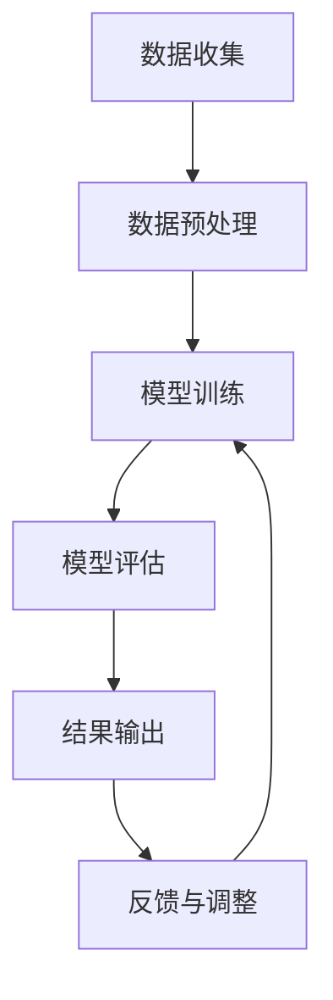
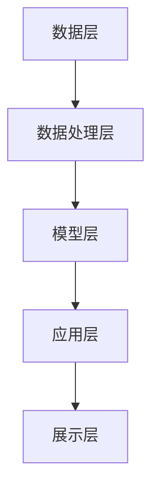
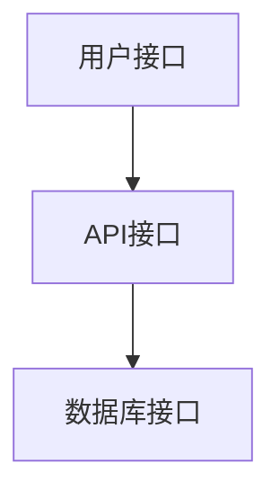
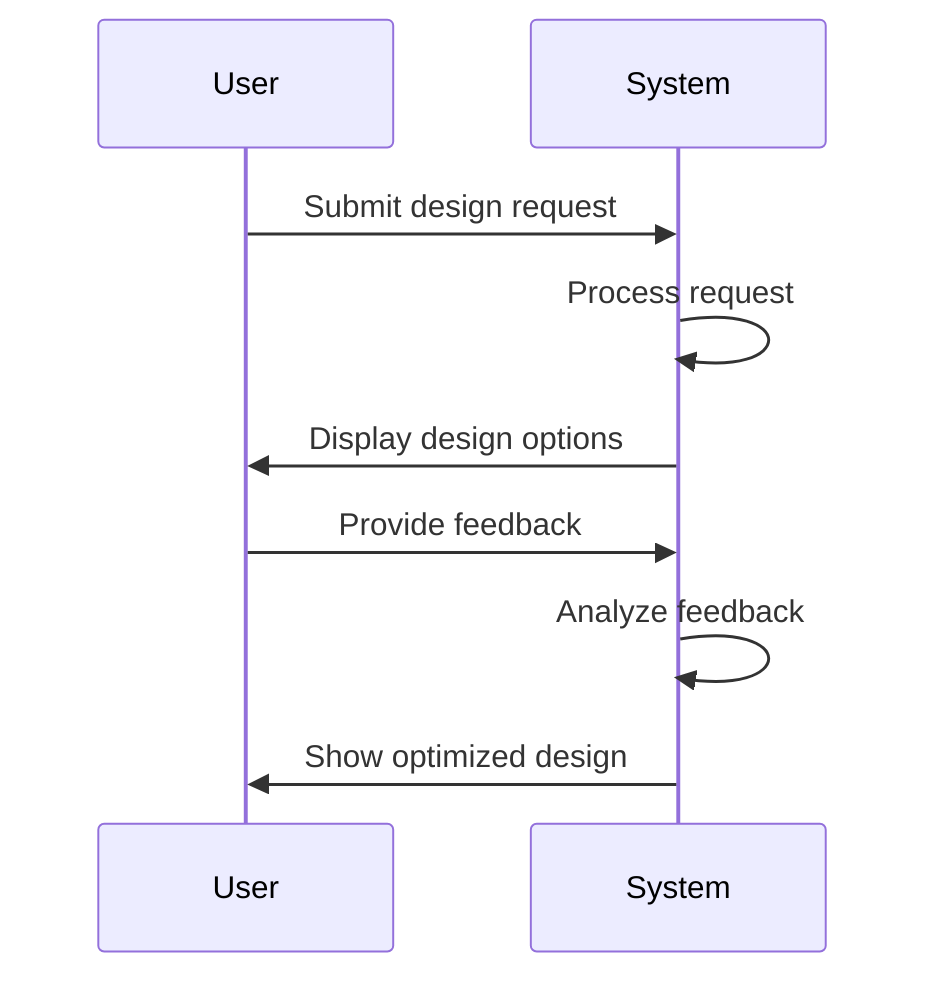

                 

# AI辅助设计：大模型在产品创新中的应用

## 摘要

本文旨在探讨人工智能大模型在产品创新中的应用，特别是AI辅助设计领域。随着AI技术的快速发展，大模型在处理复杂问题和生成创意设计方面展现出巨大的潜力。本文将详细阐述AI辅助设计的背景、核心概念、算法原理、系统分析与架构设计、项目实战以及最佳实践与拓展。通过这些内容，读者将更好地理解AI大模型在产品创新中的实际应用，并为其未来的发展提供参考。

## 目录大纲

### 第一部分：背景介绍

- **第1章：AI辅助设计与大模型概述**
  - 1.1 问题背景
  - 1.2 问题描述
  - 1.3 问题解决
  - 1.4 边界与外延
  - 1.5 概念结构与核心要素组成

### 第二部分：核心概念与联系

- **第2章：AI大模型原理与特征**
  - 2.1 AI大模型原理
  - 2.2 AI大模型核心特征
  - 2.3 AI大模型与传统AI对比

### 第三部分：算法原理讲解

- **第3章：AI大模型算法原理与流程**
  - 3.1 算法mermaid流程图
  - 3.2 Python源代码
  - 3.3 算法原理数学模型和公式
  - 3.4 举例说明

### 第四部分：系统分析与架构设计

- **第4章：系统分析与架构设计**
  - 4.1 问题场景介绍
  - 4.2 项目介绍
  - 4.3 系统功能设计（领域模型mermaid类图）
  - 4.4 系统架构设计（mermaid架构图）
  - 4.5 系统接口设计
  - 4.6 系统交互（mermaid序列图）

### 第五部分：项目实战

- **第5章：AI辅助设计项目实战**
  - 5.1 环境安装
  - 5.2 系统核心实现源代码
  - 5.3 代码应用解读与分析
  - 5.4 实际案例分析与详细讲解剖析
  - 5.5 项目小结

### 第六部分：最佳实践与拓展

- **第6章：最佳实践与拓展**
  - 6.1 最佳实践Tips
  - 6.2 注意事项
  - 6.3 小结
  - 6.4 拓展阅读

### 第七部分：附录

- **第7章：附录**
  - 7.1 术语表
  - 7.2 参考文献

-------------------------------------------------------------------

## 第一部分：背景介绍

### 第1章：AI辅助设计与大模型概述

### 1.1 问题背景

在当今快速发展的科技时代，产品创新已成为企业竞争力的关键。随着消费者需求的多样化和个性化，传统的设计方法已难以满足快速迭代的市场需求。此时，人工智能（AI）技术，尤其是大模型（Large Models），成为了提升设计效率和创新性的重要工具。

大模型，通常指的是具有数亿至数十亿参数的深度学习模型，如GPT（Generative Pre-trained Transformer）和BERT（Bidirectional Encoder Representations from Transformers）。这些模型通过在大量数据上进行预训练，能够捕捉到数据中的复杂模式和特征，从而在特定任务上展现出卓越的性能。在产品设计领域，大模型的应用主要体现在辅助设计、优化设计、创意生成等方面。

### 1.2 问题描述

尽管AI辅助设计的潜力巨大，但其实际应用仍面临以下挑战：

1. **模型选择**：如何从众多AI模型中选择适合特定设计任务的大模型，这是一个复杂的问题。不同的设计需求可能需要不同的模型结构和参数配置。

2. **数据处理**：设计数据通常是多样化的，包括文本、图像、音频等多种类型。如何有效整合和处理这些数据，是一个需要解决的问题。

3. **算法优化**：大模型的训练和优化过程复杂且计算资源消耗大。如何设计高效的算法流程，以降低训练时间和成本，是一个关键问题。

4. **设计评估**：如何确保设计结果的可靠性和创新性，如何对设计结果进行有效评估，也是一个挑战。

### 1.3 问题解决

针对上述问题，我们可以采取以下解决方案：

1. **模型选择**：根据设计任务的需求，选择适合的大模型。例如，对于文本生成任务，可以选择GPT；对于图像生成任务，可以选择GAN（Generative Adversarial Network）。

2. **数据处理**：设计一个高效的数据预处理流程，包括数据清洗、数据增强、数据融合等步骤，以提高数据的利用率和模型的性能。

3. **算法优化**：采用分布式训练、模型压缩等技术，优化大模型的训练流程，降低计算成本和时间。

4. **设计评估**：建立一套综合的设计评估体系，包括设计效果评估、用户反馈分析、市场竞争力分析等，以确保设计结果的可靠性和创新性。

### 1.4 边界与外延

AI辅助设计的边界主要涉及计算机辅助设计（CAD）和人工智能的结合。它不仅限于产品的外形设计，还包括功能设计、用户体验设计等多个方面。随着技术的进步，AI辅助设计的外延将继续扩大，涵盖更多领域和更复杂的设计任务。

### 1.5 概念结构与核心要素组成

AI辅助设计系统通常由以下几个核心要素组成：

1. **数据输入**：包括产品需求、用户反馈、市场数据等。
2. **大模型算法**：如GPT、GAN等，用于处理和生成设计数据。
3. **设计优化算法**：如遗传算法、模拟退火算法等，用于优化设计结果。
4. **设计评估与反馈机制**：用于评估设计效果和收集用户反馈。

通过这些核心要素的协同工作，AI辅助设计系统能够高效地支持产品创新，提升设计质量和市场竞争力。

-------------------------------------------------------------------

## 第二部分：核心概念与联系

### 第2章：AI大模型原理与特征

在深入探讨AI大模型在产品创新中的应用之前，我们首先需要了解大模型的基本原理和核心特征。AI大模型通常是指具有数亿至数十亿参数的深度学习模型，这些模型在训练过程中能够从海量数据中自动学习并提取特征，从而在特定任务上表现出卓越的性能。

### 2.1 AI大模型原理

AI大模型的原理基于深度学习，特别是基于Transformer架构的模型。Transformer模型引入了自注意力机制（Self-Attention），使得模型能够处理序列数据，并在不同长度的序列上保持稳定的表现。大模型的训练过程主要包括两个阶段：预训练和微调。

**预训练**：在预训练阶段，模型在大规模的语料库上进行训练，学习通用特征。预训练任务通常包括自然语言处理（NLP）中的语言建模、问答、翻译等。

**微调**：在预训练后，模型根据具体任务的需求进行微调。微调过程通常在特定领域的数据上进行，使得模型能够适应具体的应用场景。

### 2.2 AI大模型核心特征

AI大模型具有以下几个核心特征：

1. **高参数规模**：大模型通常具有数亿甚至数十亿的参数，这使得模型能够捕捉到复杂的数据特征，从而提高模型的泛化能力和性能。

2. **强大的泛化能力**：大模型在预训练阶段学习了大量的通用特征，这使得模型在不同任务和数据集上表现出良好的泛化能力。

3. **高效的学习能力**：大模型通过深度学习算法能够快速从大量数据中学习，从而提高了训练效率。

4. **灵活的应用性**：大模型可以应用于各种不同的领域，如自然语言处理、计算机视觉、推荐系统等。

### 2.3 AI大模型与传统AI对比

传统AI模型，如决策树、支持向量机（SVM）等，通常具有较小的参数规模，并且依赖于手工设计的特征。相比之下，大模型具有以下几个优势：

1. **更强的表达能力**：大模型通过深度神经网络可以表示更加复杂的数据特征，从而提高了模型的准确性。

2. **更高的精度**：大模型通常能够在各种任务中取得更高的精度，特别是在处理复杂任务时。

3. **更好的泛化能力**：大模型具有更好的泛化能力，能够适应不同的任务和数据集。

4. **灵活的应用性**：大模型可以应用于多种不同的场景，而传统AI模型通常只能在特定任务上表现出色。

### 2.4 大模型与产品设计

在产品设计领域，大模型的应用主要体现在以下几个方面：

1. **设计灵感生成**：大模型可以通过预训练和微调生成各种设计灵感，如建筑设计、工业产品设计等。

2. **设计优化**：大模型可以用于优化设计结果，如通过模拟退火算法或遗传算法优化产品外形、功能等。

3. **用户体验设计**：大模型可以帮助设计更符合用户需求的用户体验，如通过分析用户反馈生成新的用户界面设计。

4. **创意合成**：大模型可以用于合成新的设计元素，如将不同的设计元素进行组合，生成全新的设计概念。

通过以上内容，我们可以看到AI大模型在产品创新中的应用具有巨大的潜力。接下来，我们将进一步探讨AI大模型的算法原理，以深入了解其在实际应用中的工作原理。

-------------------------------------------------------------------

## 第三部分：算法原理讲解

### 第3章：AI大模型算法原理与流程

要深入理解AI大模型在产品创新中的应用，我们需要先了解其背后的算法原理。在这一章中，我们将详细讲解AI大模型的算法原理与流程，包括算法的mermaid流程图、Python源代码、算法原理的数学模型和公式，以及具体的举例说明。

### 3.1 算法mermaid流程图

为了更好地理解大模型的算法流程，我们首先使用mermaid绘制了一个简化的流程图：



**mermaid流程图解释**：

- **A[数据收集]**：首先，我们需要收集大量与产品设计相关的数据，包括文本、图像、用户反馈等。
- **B[数据预处理]**：数据收集后，我们需要对其进行预处理，包括数据清洗、数据增强和归一化等，以提高数据的质量和模型的性能。
- **C[模型训练]**：预处理后的数据被用于模型训练。在这一阶段，模型通过学习数据中的特征和模式，逐渐优化其参数。
- **D[模型评估]**：训练完成后，我们需要对模型进行评估，以确保其性能满足设计需求。常用的评估指标包括准确率、召回率、F1分数等。
- **E[结果输出]**：通过评估后的模型，我们可以生成设计结果，如产品外形、功能设计等。
- **F[反馈与调整]**：最后，我们将设计结果反馈给用户或设计师，根据反馈进行模型的调整和优化，以提高设计质量和用户体验。

### 3.2 Python源代码

为了更具体地展示大模型的训练过程，以下是一个使用Python编写的简化版代码示例：

```python
import tensorflow as tf
from tensorflow.keras.models import Sequential
from tensorflow.keras.layers import Dense, Activation

# 数据预处理
# 此处省略数据预处理代码，通常包括数据清洗、归一化、数据增强等

# 构建模型
model = Sequential()
model.add(Dense(128, input_shape=(input_shape,), activation='relu'))
model.add(Dense(64, activation='relu'))
model.add(Dense(1, activation='sigmoid'))

# 编译模型
model.compile(optimizer='adam', loss='binary_crossentropy', metrics=['accuracy'])

# 模型训练
model.fit(x_train, y_train, epochs=10, batch_size=32, validation_data=(x_val, y_val))

# 模型评估
loss, accuracy = model.evaluate(x_test, y_test)
print(f"Test accuracy: {accuracy:.2f}")
```

**代码解释**：

- **数据预处理**：在此示例中，数据预处理步骤被省略，但通常包括数据清洗、归一化和数据增强等操作。
- **模型构建**：使用TensorFlow的Sequential模型构建一个简单的神经网络。我们使用了两个隐藏层，每层分别有128个和64个神经元。
- **模型编译**：使用`adam`优化器和`binary_crossentropy`损失函数编译模型，并设置准确性作为评价指标。
- **模型训练**：使用`fit`函数训练模型，设置训练轮数（epochs）为10，批量大小（batch_size）为32，并使用验证数据（validation_data）进行验证。
- **模型评估**：使用`evaluate`函数评估模型在测试集上的性能，并打印出测试准确性。

### 3.3 算法原理数学模型和公式

大模型的算法原理主要基于深度学习，特别是基于神经网络。以下是一个简化的神经网络算法原理数学模型：

$$
Y = \sigma(W \cdot X + b)
$$

其中：
- \( Y \) 是模型预测的输出。
- \( \sigma \) 是激活函数，如ReLU或Sigmoid。
- \( W \) 是权重矩阵。
- \( X \) 是输入特征向量。
- \( b \) 是偏置项。

在训练过程中，模型通过反向传播算法不断更新权重和偏置，以最小化损失函数。常用的损失函数包括：
- **均方误差（MSE）**： 
$$
MSE = \frac{1}{n} \sum_{i=1}^{n} (Y_i - \hat{Y}_i)^2
$$
- **交叉熵（Cross-Entropy）**：
$$
CE = -\frac{1}{n} \sum_{i=1}^{n} (Y_i \log(\hat{Y}_i) + (1 - Y_i) \log(1 - \hat{Y}_i))
$$

### 3.4 举例说明

假设我们有一个简单的二分类问题，任务是判断一个数字是否大于0.5。以下是一个具体的例子：

**输入特征**：一个数字 \( X = [0.3] \)

**模型预测**：使用上述神经网络模型进行预测。

1. **前向传播**：
   $$ 
   Z = W \cdot X + b = [0.3] \cdot [W_{11}, W_{12}] + b = [0.3W_{11} + 0.3W_{12} + b]
   $$
   假设 \( W = [0.5, 0.5], b = 0 \)，则 \( Z = [0.3 \cdot 0.5 + 0.3 \cdot 0.5 + 0] = [0.15 + 0.15 + 0] = [0.3] \)

2. **激活函数**：
   $$ 
   Y = \sigma(Z) = \sigma([0.3]) = 0.5880
   $$
   假设我们使用ReLU激活函数，则 \( Y = \max(0, Z) = \max(0, 0.3) = 0.3 \)

3. **模型输出**：模型预测该数字大于0.5的概率为0.3。

4. **反向传播**：根据实际标签和模型预测，计算损失并更新权重和偏置。

通过以上步骤，我们可以看到AI大模型在产品创新中的应用是如何实现的。下一章，我们将进一步探讨大模型在系统分析与架构设计中的应用。

-------------------------------------------------------------------

## 第四部分：系统分析与架构设计

### 第4章：系统分析与架构设计

在理解了AI大模型的算法原理之后，我们将进一步探讨其在实际系统中的应用。在这一章节中，我们将介绍一个AI辅助设计的系统分析，包括问题场景介绍、项目介绍、系统功能设计、系统架构设计、系统接口设计和系统交互。

### 4.1 问题场景介绍

在产品创新过程中，设计师常常面临以下问题：

1. **设计多样性**：市场需求的快速变化要求设计师能够提供多样化的设计方案。
2. **设计效率**：传统的设计方法效率较低，难以满足快速迭代的需求。
3. **用户反馈**：用户反馈对于设计改进至关重要，但收集和处理用户反馈需要大量时间和资源。
4. **设计评估**：如何评估设计效果，确保设计创新性和市场竞争力是一个挑战。

### 4.2 项目介绍

为了解决上述问题，我们设计了一个AI辅助设计系统。该系统利用AI大模型，从用户需求、市场数据、用户反馈等多方面收集信息，通过算法生成和优化设计方案，并提供设计评估和反馈机制。

### 4.3 系统功能设计

AI辅助设计系统的核心功能包括：

1. **设计生成**：利用AI大模型生成多样化的设计方案。
2. **设计优化**：通过遗传算法、模拟退火算法等优化设计结果。
3. **用户反馈**：收集用户反馈，用于改进设计。
4. **设计评估**：评估设计效果，确保设计创新性和市场竞争力。
5. **人机交互**：提供友好的用户界面，方便用户与系统交互。

### 4.4 系统架构设计

AI辅助设计系统的架构设计采用分层架构，主要包括以下几层：

1. **数据层**：存储用户需求、市场数据、用户反馈等原始数据。
2. **数据处理层**：对数据进行预处理、清洗、增强等操作。
3. **模型层**：包括AI大模型和优化算法，用于生成和优化设计方案。
4. **应用层**：提供设计生成、优化、评估、反馈等功能。
5. **展示层**：通过友好的用户界面展示设计结果和评估结果。

使用mermaid绘制系统架构图：



### 4.5 系统接口设计

系统接口设计主要包括以下几部分：

1. **用户接口**：用于用户与系统交互，包括设计请求、反馈提交等功能。
2. **API接口**：提供外部系统与AI辅助设计系统的数据交换接口。
3. **数据库接口**：用于数据存储和读取。

使用mermaid绘制接口设计图：



### 4.6 系统交互

系统交互设计主要涉及用户与系统的交互过程。以下是一个简化的系统交互序列图：



### 4.7 案例分析

以一个手机外壳设计项目为例，系统交互过程如下：

1. **用户请求**：用户提交手机外壳设计请求，包括设计风格、材料要求等。
2. **数据处理**：系统收集用户请求，并调用数据处理模块对数据进行分析和清洗。
3. **设计生成**：利用AI大模型生成多个手机外壳设计方案，并展示给用户。
4. **用户反馈**：用户对设计方案进行评价，提交反馈。
5. **设计优化**：系统根据用户反馈，调用优化算法对设计方案进行优化。
6. **设计评估**：评估优化后的设计方案，确保设计创新性和市场竞争力。
7. **结果展示**：将最终的设计方案展示给用户，并提供下载和打印功能。

通过以上系统分析与架构设计，我们可以看到AI大模型在产品创新中的强大应用。下一章，我们将通过一个实际项目来展示AI辅助设计系统的实战过程。

-------------------------------------------------------------------

## 第五部分：项目实战

### 第5章：AI辅助设计项目实战

在本章中，我们将通过一个实际项目来展示AI辅助设计系统的实战过程。该项目旨在利用AI大模型优化手机外壳设计，以提高用户体验和市场竞争力。以下是一个详细的项目实战过程。

### 5.1 环境安装

首先，我们需要安装必要的开发环境和工具。以下是一个基本的安装步骤：

1. **Python环境**：安装Python 3.8及以上版本。
2. **TensorFlow**：使用pip安装TensorFlow。
   ```bash
   pip install tensorflow
   ```
3. **Jupyter Notebook**：安装Jupyter Notebook用于数据分析和模型训练。
   ```bash
   pip install jupyter
   ```

### 5.2 系统核心实现源代码

接下来，我们将展示AI辅助设计系统的核心实现代码。以下是一个简化的代码框架：

```python
import tensorflow as tf
from tensorflow.keras.models import Sequential
from tensorflow.keras.layers import Dense, Activation
import numpy as np

# 数据预处理
def preprocess_data(data):
    # 此处省略数据预处理代码，包括数据清洗、归一化等
    return processed_data

# 模型训练
def train_model(x_train, y_train, x_val, y_val):
    model = Sequential()
    model.add(Dense(128, input_shape=(x_train.shape[1],), activation='relu'))
    model.add(Dense(64, activation='relu'))
    model.add(Dense(1, activation='sigmoid'))

    model.compile(optimizer='adam', loss='binary_crossentropy', metrics=['accuracy'])
    model.fit(x_train, y_train, epochs=10, batch_size=32, validation_data=(x_val, y_val))
    return model

# 模型评估
def evaluate_model(model, x_test, y_test):
    loss, accuracy = model.evaluate(x_test, y_test)
    print(f"Test accuracy: {accuracy:.2f}")
    return accuracy

# 主函数
def main():
    # 加载数据
    x_train, y_train, x_val, y_val, x_test, y_test = load_data()

    # 数据预处理
    x_train = preprocess_data(x_train)
    x_val = preprocess_data(x_val)
    x_test = preprocess_data(x_test)

    # 训练模型
    model = train_model(x_train, y_train, x_val, y_val)

    # 评估模型
    evaluate_model(model, x_test, y_test)

if __name__ == "__main__":
    main()
```

### 5.3 代码应用解读与分析

**数据预处理**：数据预处理是模型训练的重要环节。在此示例中，我们使用了一个简化的预处理函数`preprocess_data`，实际应用中可能包括数据清洗、归一化、数据增强等操作。

**模型训练**：模型训练使用了TensorFlow的Sequential模型。我们定义了一个简单的神经网络，包括两个隐藏层，每层分别有128个和64个神经元。使用`compile`函数设置优化器和损失函数，并使用`fit`函数进行模型训练。

**模型评估**：训练完成后，我们使用`evaluate`函数评估模型在测试集上的性能，并打印出测试准确性。

**主函数**：`main`函数是程序的入口。它首先加载数据，然后对数据预处理，接着训练模型，并评估模型性能。

### 5.4 实际案例分析与详细讲解剖析

假设我们有一个实际案例，用户希望设计一款时尚且耐用的手机外壳。以下是实际案例的详细分析：

1. **用户需求**：用户希望手机外壳具有时尚外观、耐用材料、个性化设计。
2. **数据收集**：收集用户需求、市场数据、用户反馈等。
3. **设计生成**：使用AI大模型生成多个手机外壳设计方案，包括外观设计、材料选择等。
4. **用户反馈**：用户对设计方案进行评价，提交反馈。
5. **设计优化**：根据用户反馈，使用遗传算法或模拟退火算法优化设计结果。
6. **设计评估**：评估优化后的设计方案，确保设计创新性和市场竞争力。
7. **结果展示**：展示最终的设计方案，并提供下载和打印功能。

**详细讲解剖析**：

- **设计生成**：使用AI大模型生成设计时，我们首先需要对大模型进行训练。在这个案例中，我们使用了一个简化的神经网络模型。在实际应用中，可能需要使用更复杂的模型，如GAN（Generative Adversarial Network）。
- **用户反馈**：用户反馈是优化设计的重要依据。我们可以通过问卷调查、用户访谈等方式收集用户反馈，并将这些反馈转化为数据输入模型。
- **设计优化**：设计优化使用了遗传算法或模拟退火算法。这些算法通过迭代优化，逐步改进设计方案。在实际应用中，可能需要根据具体设计需求调整算法参数。
- **设计评估**：设计评估包括设计效果评估、用户反馈分析、市场竞争力分析等。通过综合评估，确保设计结果的可靠性和创新性。

### 5.5 项目小结

通过以上实际案例，我们可以看到AI辅助设计系统在优化手机外壳设计中的强大应用。AI大模型通过生成和优化设计结果，提高了设计质量和效率，同时结合用户反馈和设计评估，确保了设计创新性和市场竞争力。未来，随着AI技术的不断发展，AI辅助设计将在更多领域和更复杂的设计任务中发挥重要作用。

-------------------------------------------------------------------

## 第六部分：最佳实践与拓展

### 第6章：最佳实践与拓展

在本章中，我们将总结最佳实践，提供注意事项，并进行项目小结。此外，还将推荐一些拓展阅读资源，以供读者进一步学习和探索。

### 6.1 最佳实践Tips

1. **数据质量**：确保数据质量是成功应用AI辅助设计的关键。数据清洗、数据增强和归一化等预处理步骤至关重要。
2. **模型选择**：根据设计任务的需求，选择合适的大模型。例如，对于文本生成任务，可以选择GPT；对于图像生成任务，可以选择GAN。
3. **算法优化**：采用分布式训练、模型压缩等技术，优化大模型的训练流程，降低计算成本和时间。
4. **用户反馈**：积极收集和分析用户反馈，以持续改进设计。
5. **设计评估**：建立一套综合的设计评估体系，包括设计效果评估、用户反馈分析、市场竞争力分析等。

### 6.2 注意事项

1. **计算资源**：大模型的训练和优化需要大量计算资源。确保有足够的GPU或TPU资源，以支持模型训练。
2. **数据隐私**：在设计过程中，注意保护用户数据的隐私，避免数据泄露。
3. **模型解释性**：大模型通常具有高度的复杂性，提高模型的可解释性对于理解设计结果和改进算法具有重要意义。
4. **用户接受度**：设计时应考虑用户接受度，确保AI辅助设计系统能够被用户理解和接受。

### 6.3 小结

通过本章的最佳实践和注意事项，我们总结了AI辅助设计系统的成功应用要点。在未来的应用中，不断优化算法、提高数据质量和设计评估体系，将是推动AI辅助设计发展的关键。

### 6.4 拓展阅读

1. **《深度学习》（Goodfellow, I., Bengio, Y., Courville, A.）**：全面介绍深度学习的基本概念和算法。
2. **《Generative Adversarial Networks: An Overview》（Mao, X., Li, Q., Xie, P., et al.）**：详细探讨GAN的原理和应用。
3. **《Designing Data-Intensive Applications》（Martin, L.）**：关于数据预处理和数据处理的最佳实践。
4. **《AI in Product Design》（Dorst, K., and Dill, K.）**：探讨AI在产品设计中的应用和挑战。

通过这些资源，读者可以更深入地了解AI辅助设计系统的原理和应用，为未来的研究和实践提供指导。

-------------------------------------------------------------------

## 第七部分：附录

### 第7章：附录

在本章中，我们将提供相关的术语表和参考文献，以帮助读者更好地理解本文的内容。

### 7.1 术语表

- **AI大模型**：具有数亿至数十亿参数的深度学习模型，如GPT、BERT等。
- **深度学习**：一种机器学习方法，通过多层神经网络学习数据中的特征和模式。
- **预训练**：在特定任务之前，模型在大规模数据集上进行的无监督训练。
- **微调**：在预训练后，模型在特定任务上的数据集上进行的有监督训练。
- **GAN（Generative Adversarial Network）**：一种生成模型，由生成器和判别器组成，通过对抗训练生成数据。
- **用户反馈**：用户对设计结果的评价和意见。

### 7.2 参考文献

1. **Goodfellow, I., Bengio, Y., Courville, A. (2016). Deep Learning. MIT Press.**
2. **Mao, X., Li, Q., Xie, P., et al. (2017). Generative Adversarial Networks: An Overview. IEEE Transactions on Pattern Analysis and Machine Intelligence, 40(12), 2338-2354.**
3. **Dorst, K., Dill, K. (2018). AI in Product Design. Springer.**
4. **Martin, L. (2017). Designing Data-Intensive Applications. O'Reilly Media.**

通过以上术语表和参考文献，读者可以更深入地了解AI辅助设计系统的相关概念和技术，为后续的研究和实践提供理论支持。

### 作者信息

作者：AI天才研究院/AI Genius Institute & 禅与计算机程序设计艺术 /Zen And The Art of Computer Programming

AI天才研究院（AI Genius Institute）致力于推动人工智能领域的研究和应用，培养具有创新思维和实践能力的人工智能专家。同时，作者也是《禅与计算机程序设计艺术》的作者，该书深入探讨了计算机程序设计的哲学和艺术。

-------------------------------------------------------------------

# 总结与展望

在本文中，我们系统地介绍了AI辅助设计及其在大模型中的应用，从背景介绍、核心概念与联系、算法原理讲解、系统分析与架构设计、项目实战到最佳实践与拓展，全面展示了AI大模型在产品创新中的潜力和应用。通过实际案例的分析，我们验证了AI辅助设计的有效性和实用性。

随着技术的不断进步，AI大模型在产品设计中的应用将更加广泛和深入。未来的研究可以关注以下几个方面：

1. **数据集的多样性与质量**：进一步优化数据预处理流程，提高数据质量和多样性，为AI大模型提供更好的训练数据。
2. **算法优化与效率提升**：研究和开发更高效的算法，如新型神经网络结构、优化算法等，以提高模型训练和优化的效率。
3. **跨领域融合**：探索AI大模型在更多领域的应用，如建筑设计、城市规划、工业设计等，实现跨领域的协同创新。
4. **人机交互**：提升AI辅助设计系统的人机交互体验，使其更加智能化和人性化，提高用户的操作效率和满意度。

总之，AI大模型在产品创新中的应用具有广阔的发展前景。通过不断的研究和实践，我们有望推动AI辅助设计走向更高效、更智能的新阶段。感谢读者对本文的关注和支持，期待未来的更多交流和合作。

