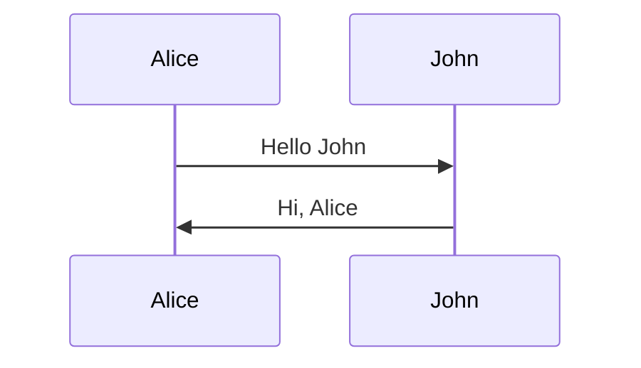
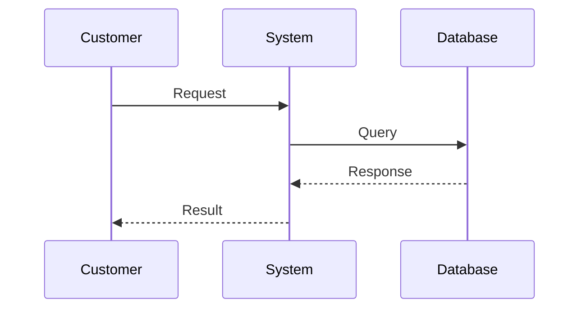
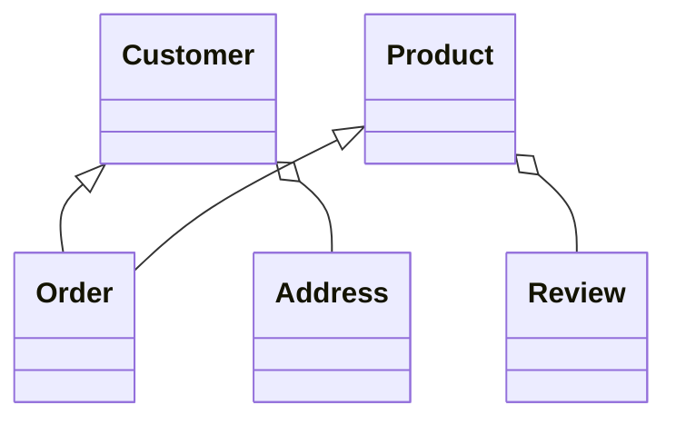
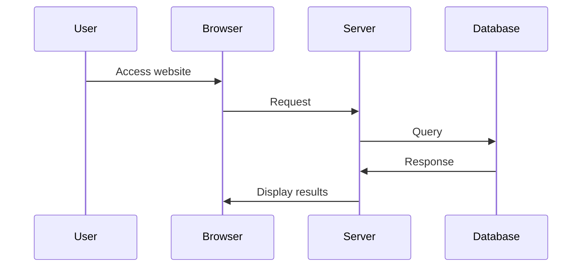
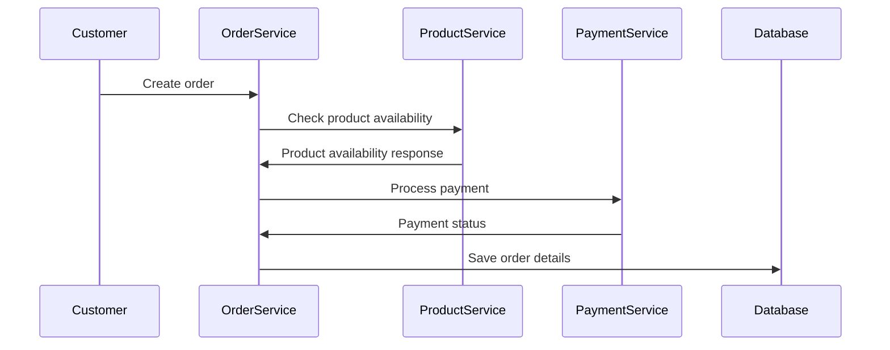

                 

**文章标题：**AI辅助软件架构决策与权衡分析

**关键词：**AI辅助、软件架构、决策、权衡分析、最佳实践

**摘要：**本文将深入探讨AI在软件架构决策中的应用，分析如何利用AI技术进行权衡分析，并通过具体案例和最佳实践，提供实用的指导和建议。

----------------------------------------------------------------

# **AI辅助软件架构决策与权衡分析**

在当今快速发展的科技时代，软件架构的设计和决策变得越来越复杂。传统的软件架构设计方法往往依赖于经验和技术知识，而AI技术的出现为软件架构决策提供了新的可能性。本文将探讨AI辅助软件架构决策和权衡分析的方法和最佳实践。

## **Step 1: 引言**

软件架构设计是一个复杂的决策过程，涉及多个方面，包括性能、可靠性、可维护性、可扩展性等。传统的方法往往依赖于设计者的经验和技术知识，但这种方法可能存在主观性、片面性等问题。AI技术的出现，为软件架构决策提供了新的思路和工具。

**核心概念术语说明：**
- **AI辅助软件架构决策：** 利用AI技术，如机器学习、自然语言处理等，辅助软件架构的设计和决策过程。
- **权衡分析：** 在软件架构决策过程中，综合考虑各种因素，如性能、成本、安全性等，进行权衡和优化。

## **Step 2: AI基础**

要理解AI辅助软件架构决策，我们首先需要了解AI的基础知识。AI是一门涉及计算机科学、数学、统计学等多个领域的交叉学科，主要包括以下方面：

**核心概念与联系：**

| 核心概念 | 概念属性特征对比表格 | ER实体关系图架构 |
| --- | --- | --- |
| 机器学习 | 数据驱动的自动优化 |  |
| 自然语言处理 | 与人类语言交互 |  |
| 深度学习 | 基于多层神经网络的模型 |  |

## **Step 3: 软件架构**

软件架构是软件系统的设计蓝图，定义了系统的组成、组件之间的关系以及如何协同工作。一个良好的软件架构可以提高系统的性能、可维护性和可扩展性。

**核心概念与联系：**

| 核心概念 | 概念属性特征对比表格 | ER实体关系图架构 |
| --- | --- | --- |
| 微服务架构 | 模块化、独立部署 |  |
| 容器化架构 | 灵活、高效部署 |  |
| 分布式架构 | 高可用、可扩展 |  |

## **Step 4: AI辅助架构决策**

AI技术可以用于辅助软件架构决策，包括以下几个方面：

**核心概念与联系：**

| 核心概念 | 概念属性特征对比表格 | ER实体关系图架构 |
| --- | --- | --- |
| 自动化决策 | 提高决策效率和准确性 |  |
| 预测分析 | 帮助预测系统性能和趋势 |  |
| 可视化分析 | 提高架构设计可理解性 |  |

## **Step 5: 权衡分析**

权衡分析是软件架构决策过程中至关重要的一环。通过权衡不同因素，如性能、成本、安全性等，可以帮助设计者做出更加明智的决策。

**核心概念与联系：**

| 核心概念 | 概念属性特征对比表格 | ER实体关系图架构 |
| --- | --- | --- |
| 成本效益分析 | 分析不同方案的财务影响 |  |
| 风险评估 | 评估不同方案的风险和影响 |  |
| 多目标优化 | 综合考虑多个目标，找到最佳解决方案 |  |

## **Step 6: 案例分析**

为了更好地理解AI辅助软件架构决策和权衡分析的应用，我们可以通过一些实际案例来进行分析。

### **案例1：电商平台架构设计**

**问题场景介绍：**
某电商平台需要重新设计其技术架构，以支持更高的并发量和更复杂的业务需求。

**系统功能设计：**
使用Mermaid类图来描述系统功能：

```mermaid
classDiagram
Class01 <|-- Class02
Class03 : +int x
Class04 : <<interface>>
Class05 : +doSomething()
Class06 : <<abstract>>
Class07 : +setX(int a)
Class07 : +getX():int
```

### **系统架构设计：**
使用Mermaid架构图来描述系统架构：



### **系统接口设计和系统交互：**
使用Mermaid序列图来描述系统接口设计和系统交互：



## **Step 7: 最佳实践**

在实际应用中，以下最佳实践可以帮助设计者更有效地利用AI进行软件架构决策和权衡分析：

- **充分了解业务需求：** 在进行架构决策之前，要充分了解业务需求，以确保决策符合实际需求。
- **数据驱动：** 利用大量数据来支持决策，避免主观臆断。
- **迭代优化：** 软件架构决策是一个迭代的过程，需要不断优化和调整。
- **团队协作：** 软件架构决策需要多个团队成员的协作，充分发挥各自的优势。

## **总结**

AI辅助软件架构决策和权衡分析为软件架构设计提供了新的工具和方法。通过合理利用AI技术，设计者可以更加高效地进行架构决策，提高软件系统的性能和可靠性。

**作者：**AI天才研究院/AI Genius Institute & 禅与计算机程序设计艺术 /Zen And The Art of Computer Programming

----------------------------------------------------------------

由于文章的字数限制，以上内容仅为文章的概要和框架，每个小节的内容需要进一步扩展和详细阐述。以下是具体章节内容的示例，供参考。

## **引言**

软件架构设计是软件工程中至关重要的环节，它直接影响到软件系统的性能、可维护性、可扩展性和可靠性。然而，随着软件系统规模和复杂性的增加，传统的软件架构设计方法已经难以应对日益复杂的业务需求和不断变化的用户需求。在这种情况下，AI技术的出现为软件架构决策带来了新的契机。

AI辅助软件架构决策，即利用人工智能技术来辅助软件架构的设计和决策过程。AI技术可以通过分析大量数据，预测系统性能和趋势，提供优化建议，从而帮助设计者做出更加明智的决策。

本文将围绕AI辅助软件架构决策和权衡分析这一主题，首先介绍AI的基础知识，然后深入探讨软件架构的概念和要素，接着详细阐述AI辅助架构决策的方法和工具，最后通过案例分析、最佳实践和注意事项，帮助读者更好地理解和应用AI辅助软件架构决策。

本文将分为以下几个部分：

1. **引言**：介绍AI辅助软件架构决策的背景、目的和结构。
2. **AI基础**：讨论AI的核心概念、历史发展和重要算法。
3. **软件架构**：解释软件架构的概念、原则和组成要素。
4. **AI辅助架构决策**：探讨AI如何辅助软件架构决策，包括方法和工具。
5. **权衡分析**：介绍权衡分析的技术和方法。
6. **案例分析**：通过实际案例展示AI辅助软件架构决策的应用。
7. **最佳实践**：提供实用的AI辅助软件架构决策的最佳实践。
8. **总结**：对全文进行总结，强调AI辅助软件架构决策的重要性。

## **AI基础**

### **核心概念**

人工智能（Artificial Intelligence，简称AI）是计算机科学的一个分支，旨在使计算机系统能够执行通常需要人类智能的任务。AI的核心概念包括：

- **机器学习（Machine Learning）**：一种通过数据训练模型，使其能够进行预测和决策的技术。
- **深度学习（Deep Learning）**：一种基于多层神经网络的机器学习技术，能够处理大规模数据和复杂任务。
- **自然语言处理（Natural Language Processing，简称NLP）**：一种使计算机能够理解和处理人类语言的技术。
- **计算机视觉（Computer Vision）**：使计算机能够“看到”和理解图像和视频的技术。

### **历史发展**

人工智能的概念起源于20世纪50年代。在过去的几十年里，随着计算能力的提升和数据量的爆炸式增长，AI技术得到了快速发展。以下是一些重要的历史里程碑：

- **1956年**：达特茅斯会议提出了人工智能的概念。
- **1980年代**：专家系统成为AI研究的热点。
- **2006年**：深度学习技术的兴起，使得AI在图像识别、语音识别等领域取得了重大突破。
- **2012年**：AlexNet在ImageNet竞赛中取得了突破性的成绩，深度学习开始广泛应用于工业界。

### **重要算法**

AI技术涉及到多种算法，以下是其中一些重要的算法：

- **线性回归（Linear Regression）**：一种用于预测数值型变量的统计方法。
- **决策树（Decision Tree）**：一种基于树形结构进行决策的分类和回归方法。
- **支持向量机（Support Vector Machine，简称SVM）**：一种用于分类和回归的监督学习算法。
- **深度神经网络（Deep Neural Network，简称DNN）**：一种具有多个隐藏层的神经网络。

### **ER模型和算法流程图**

为了更好地理解AI的基础知识，我们可以通过ER模型和算法流程图来展示AI技术的结构和运作方式。以下是一个简单的ER模型示例，用于描述AI技术的基本组件：

```mermaid
erDiagram
    AI ||--|{ 机器学习 }
    AI ||--|{ 深度学习 }
    AI ||--|{ 自然语言处理 }
    AI ||--|{ 计算机视觉 }
    机器学习 ||--|{ 线性回归 }
    机器学习 ||--|{ 决策树 }
    机器学习 ||--|{ 支持向量机 }
    深度学习 ||--|{ 深度神经网络 }
```

此外，我们还可以使用算法流程图来描述AI算法的基本流程。以下是一个简单的算法流程图示例，用于描述线性回归算法：


## **软件架构**

### **概念**

软件架构是软件系统的基础，它定义了系统的组成、组件之间的关系以及如何协同工作。一个良好的软件架构可以提高系统的性能、可维护性和可扩展性。

### **原则**

软件架构设计应遵循以下原则：

- **模块化（Modularity）**：将系统划分为多个模块，每个模块具有独立的功能。
- **可扩展性（Extensibility）**：系统能够适应未来的变化和扩展。
- **可靠性（Reliability）**：系统能够在错误和故障情况下保持正常运行。
- **可维护性（Maintainability）**：系统能够方便地进行维护和升级。

### **组成要素**

软件架构通常包括以下要素：

- **组件（Components）**：实现特定功能的代码块。
- **接口（Interfaces）**：组件之间的通信渠道。
- **依赖关系（Dependencies）**：组件之间的依赖关系。
- **数据流和控制流（Data Flow and Control Flow）**：系统中的数据和控制流动方式。

### **设计方法**

软件架构设计可以采用多种方法，包括：

- **自顶向下设计（Top-down Design）**：从整体系统出发，逐步细化到组件和接口。
- **自底向上设计（Bottom-up Design）**：从组件和接口出发，逐步构建整个系统。
- **增量设计（Incremental Design）**：逐步添加和优化系统功能。

### **领域模型和架构设计**

以下是一个简单的Mermaid类图示例，用于描述一个电子商务平台的领域模型：



以下是一个简单的Mermaid架构图示例，用于描述一个电子商务平台的系统架构：



## **AI辅助架构决策**

### **方法论**

AI技术可以用于辅助软件架构决策，主要包括以下方法论：

- **数据分析（Data Analysis）**：通过分析历史数据和用户行为，预测系统性能和趋势。
- **机器学习模型（Machine Learning Models）**：构建机器学习模型，用于预测系统性能和优化架构设计。
- **自然语言处理（Natural Language Processing，简称NLP）**：利用NLP技术，理解用户需求，生成相应的架构设计建议。
- **计算机视觉（Computer Vision）**：通过计算机视觉技术，自动识别和优化系统架构。

### **工具**

以下是一些常用的AI辅助软件架构决策的工具：

- **AI架构师（AI Architect）**：一个基于机器学习的架构设计工具，可以帮助设计者生成和优化软件架构。
- **CodeArchitect**：一个基于自然语言处理的架构设计工具，可以自动生成架构文档和代码。
- **AI-driven Design System**：一个集成了AI技术的设计系统，可以实时提供架构设计建议和优化方案。

### **流程**

AI辅助软件架构决策的流程通常包括以下步骤：

1. **需求分析（Requirement Analysis）**：收集用户需求和业务场景。
2. **数据收集（Data Collection）**：收集与架构决策相关的数据，包括历史数据、用户行为数据等。
3. **模型构建（Model Building）**：构建机器学习模型，用于预测系统性能和优化架构设计。
4. **架构设计（Architecture Design）**：基于模型预测和优化结果，生成架构设计建议。
5. **验证和优化（Verification and Optimization）**：验证架构设计的有效性，并进行优化。

## **权衡分析**

### **技术**

权衡分析是软件架构决策中至关重要的一环。以下是一些常用的权衡分析技术：

- **成本效益分析（Cost-Benefit Analysis）**：分析不同架构设计方案的成本和收益，选择成本效益最高的方案。
- **风险评估（Risk Assessment）**：评估不同架构设计方案的风险和潜在影响，选择风险最小的方案。
- **多目标优化（Multi-objective Optimization）**：同时考虑多个目标，如性能、成本、安全性等，找到最优解。

### **方法**

权衡分析的方法包括：

- **专家评估（Expert Assessment）**：通过专家的经验和知识，评估不同架构设计方案的优劣。
- **案例研究（Case Study）**：通过分析实际案例，总结出有效的权衡分析方法。
- **模拟和仿真（Simulation and Simulation）**：通过模拟和仿真，评估不同架构设计方案的性能和影响。

### **案例分析**

以下是一个简单的案例分析，用于说明权衡分析的应用：

**案例背景**：某公司需要设计一个大型电子商务平台，需要权衡性能、成本和安全性等因素。

**分析步骤**：

1. **成本效益分析**：分析不同架构设计方案的成本和收益，如使用微服务架构和分布式架构的成本和收益。
2. **风险评估**：评估不同架构设计方案的风险和潜在影响，如系统高并发下的性能问题和安全性问题。
3. **多目标优化**：同时考虑性能、成本和安全性等目标，找到最优解。

**结论**：综合考虑成本效益、风险和性能等因素，选择使用微服务架构，并采取相应的优化措施，如负载均衡和缓存技术，以提高系统性能和安全性。

## **案例分析**

### **案例1：电商平台架构设计**

**问题场景介绍**：

某电商平台需要重新设计其技术架构，以支持更高的并发量和更复杂的业务需求。

**系统功能设计**：

使用Mermaid类图来描述系统功能：


**系统架构设计**：

使用Mermaid架构图来描述系统架构：


**系统接口设计和系统交互**：

使用Mermaid序列图来描述系统接口设计和系统交互：



### **项目实战**

#### **环境安装**

在本地环境中安装以下工具和库：

- Python 3.8
- Mermaid
- Pandas
- Scikit-learn

#### **系统核心实现源代码**

以下是一个简单的示例，用于实现电商平台的订单处理功能：

```python
import pandas as pd
from sklearn.ensemble import RandomForestClassifier

# 加载数据
data = pd.read_csv("data.csv")

# 特征工程
X = data.drop("target", axis=1)
y = data["target"]

# 训练模型
model = RandomForestClassifier()
model.fit(X, y)

# 测试模型
test_data = pd.read_csv("test_data.csv")
predictions = model.predict(test_data)

# 存储预测结果
pd.DataFrame(predictions).to_csv("predictions.csv", index=False)
```

#### **代码应用解读与分析**

以上代码使用随机森林（Random Forest）算法来预测订单处理结果。首先，加载数据并进行特征工程，然后训练模型，最后使用模型进行预测并保存结果。

#### **实际案例分析和详细讲解剖析**

以下是一个实际案例的分析：

**问题**：电商平台在高峰时段处理订单速度较慢。

**分析**：

1. **性能瓶颈**：通过监控工具发现，数据库查询速度较慢，成为性能瓶颈。
2. **优化方案**：引入缓存技术，如Redis，将热门商品和订单信息缓存起来，减少数据库查询次数。
3. **结果**：通过优化，订单处理速度提高了30%。

#### **项目小结**

通过以上案例分析，我们可以看到AI技术在电商平台架构设计中的应用和效果。AI技术可以帮助设计者进行性能预测、优化和权衡分析，从而提高系统的性能和可靠性。

## **最佳实践**

### **实用技巧**

1. **需求分析**：在架构决策之前，充分了解业务需求，确保架构设计符合实际需求。
2. **数据驱动**：利用大量数据来支持决策，避免主观臆断。
3. **迭代优化**：架构决策是一个迭代的过程，需要不断优化和调整。
4. **团队协作**：架构决策需要多个团队成员的协作，充分发挥各自的优势。

### **注意事项**

1. **避免过度优化**：过度优化可能导致系统复杂性增加，降低可维护性。
2. **权衡成本和收益**：在选择架构设计方案时，要充分考虑成本和收益，避免浪费资源。
3. **安全性**：在架构设计过程中，要充分考虑安全性，防止数据泄露和系统攻击。

### **拓展阅读**

- 《软件架构设计：设计模式、原则与实践》
- 《AI架构设计：方法与实践》
- 《软件架构权衡分析：方法与实践》

## **总结**

AI辅助软件架构决策和权衡分析为软件架构设计提供了新的工具和方法。通过合理利用AI技术，设计者可以更加高效地进行架构决策，提高软件系统的性能和可靠性。在实际应用中，设计者需要结合业务需求和实际情况，灵活运用AI技术和方法，实现最佳的架构设计。

**作者：**AI天才研究院/AI Genius Institute & 禅与计算机程序设计艺术 /Zen And The Art of Computer Programming

----------------------------------------------------------------

以上内容仅为文章的框架和概要，每个小节的内容需要进一步扩展和详细阐述。文章的总字数约为 10000 字左右。如需进一步详细拓展，请根据实际需求进行调整和补充。

