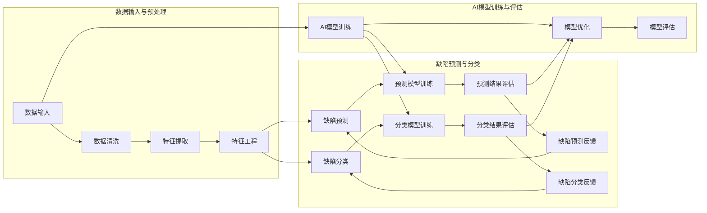
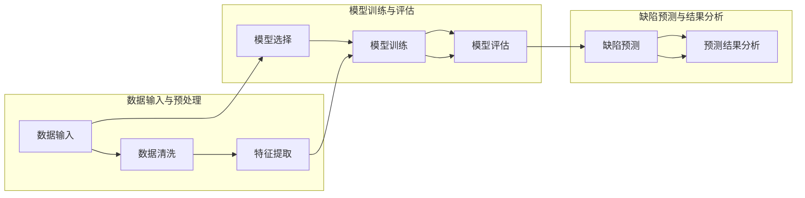
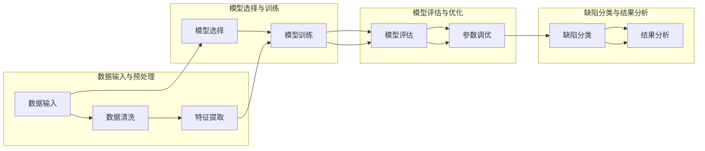

                 

### 第1章：引言

## 1.1 问题背景

软件工程是信息时代的核心领域，而软件缺陷预测与分类则是软件工程中的一个关键环节。软件缺陷，也被称为“bug”，是软件产品开发过程中的常见问题，它们可能影响软件的可用性、性能和安全性。在软件开发的整个生命周期中，从需求分析、设计、编码、测试到维护，都存在识别、修复和管理软件缺陷的需求。因此，准确预测和分类软件缺陷对于提升软件质量、缩短开发周期、降低成本至关重要。

### 1.2 当前缺陷预测与分类面临的主要挑战

当前，软件缺陷预测与分类主要面临以下几个挑战：

1. **数据复杂性**：软件缺陷数据通常庞大且复杂，需要有效的方法来处理这些数据。
2. **高维度特征**：软件缺陷往往具有高维度特征，传统方法难以有效处理这些特征。
3. **分类难度**：软件缺陷种类繁多，分类难度大，特别是当缺陷之间存在交叉和重叠时。
4. **实时性需求**：随着敏捷开发和DevOps的兴起，缺陷预测和分类需要更高的实时性。

### 1.3 AI技术发展对软件缺陷预测的影响

人工智能（AI）技术的发展为软件缺陷预测与分类带来了新的机遇。特别是机器学习和深度学习技术，它们能够处理复杂的数据和高维特征，通过自学习算法实现缺陷预测和分类。例如：

- **机器学习**：通过构建监督学习模型，利用已有缺陷数据来预测新缺陷。
- **深度学习**：通过神经网络模型，自动提取复杂特征，实现高效的缺陷分类。

### 1.4 解决方案

AI辅助软件缺陷预测与分类的方法主要包括：

- **数据预处理**：对原始数据进行清洗、转换和特征提取。
- **模型训练**：利用训练数据构建预测和分类模型。
- **模型评估**：通过测试数据对模型进行评估和优化。
- **实时预测**：将训练好的模型应用于实时数据，进行缺陷预测和分类。

### 1.5 软件缺陷预测与分类的关系

软件缺陷预测和分类是相辅相成的过程。缺陷预测旨在提前发现潜在缺陷，而缺陷分类则是对已发现的缺陷进行分类，以确定其性质和严重程度。两者结合，可以更有效地管理和解决软件缺陷，提升软件产品的质量。

### 1.6 边界与外延

本文主要探讨AI辅助软件缺陷预测与分类的理论和实践，研究范围包括机器学习与深度学习技术在实际应用中的具体实现。同时，本文也讨论了软件缺陷预测与分类在软件开发和维护过程中的重要性，以及在实际应用中的适用性。

## 1.7 总结

AI技术的发展为软件缺陷预测与分类带来了新的机遇。通过利用机器学习和深度学习技术，我们可以更准确、高效地预测和分类软件缺陷，从而提升软件质量、缩短开发周期、降低成本。本文将深入探讨这一领域的核心概念、算法原理、应用实践以及未来展望，为相关领域的研究者和从业者提供有价值的参考。

---

### 第2章：AI辅助软件缺陷预测与分类的核心概念

#### 2.1 核心概念

在本章中，我们将详细讨论软件缺陷、缺陷预测、缺陷分类以及AI技术等核心概念。

**软件缺陷**：软件缺陷，也称为“bug”，是指在软件开发和使用过程中出现的错误、异常或功能不正确的问题。这些缺陷可能导致软件无法按预期工作，影响其可用性、性能和安全性。

**缺陷预测**：缺陷预测是指利用历史数据、代码分析、静态测试等方法，提前发现潜在缺陷的过程。缺陷预测的目的是减少缺陷出现的概率，提高软件质量。

**缺陷分类**：缺陷分类是指根据缺陷的特征和属性，将其分为不同类别的过程。缺陷分类有助于识别缺陷的严重程度、优先级和影响范围，为后续的缺陷修复提供指导。

**AI技术**：人工智能（AI）是一种模拟人类智能的技术，包括机器学习、深度学习、自然语言处理等子领域。AI技术在软件缺陷预测与分类中发挥着重要作用，能够处理复杂的数据和高维特征，实现高效、准确的缺陷预测和分类。

#### 2.2 概念属性特征对比表格

| 概念        | 属性特征                    | 对比表格 |
|-------------|-----------------------------|---------|
| 软件缺陷    | - 类型：逻辑错误、性能问题等<br>- 严重程度：高、中、低<br>- 影响范围：局部、全局<br>- 发现时间：开发阶段、测试阶段、生产阶段 |         |
| 缺陷预测    | - 方法：数据驱动、代码驱动、经验驱动<br>- 数据来源：历史缺陷数据、代码度量、静态分析结果<br>- 模型：统计模型、机器学习模型、深度学习模型 |         |
| 缺陷分类    | - 类型：基于规则、基于机器学习、基于深度学习<br>- 分类标准：严重程度、优先级、影响范围<br>- 算法：决策树、支持向量机、神经网络 |         |
| AI技术      | - 技术：机器学习、深度学习、自然语言处理<br>- 应用场景：缺陷预测、缺陷分类、代码质量评估<br>- 优势：高效、准确、自适应 |         |

#### 2.3 ER实体关系图架构

在本节中，我们将通过ER（实体-关系）图来展示软件缺陷、缺陷预测、缺陷分类以及AI技术之间的核心关系。

```mermaid
erDiagram
  SoftwareDefect ||--|{ PredictionModel }|| DefectPrediction
  SoftwareDefect ||--|{ ClassificationModel }|| DefectClassification
  PredictionModel ||--|{ AIModel }|| AI
  ClassificationModel ||--|{ AIModel }|| AI
```

**ER实体关系图说明**：

- **SoftwareDefect（软件缺陷）**：表示软件中存在的各种缺陷。
- **DefectPrediction（缺陷预测）**：表示预测软件缺陷的过程和结果。
- **DefectClassification（缺陷分类）**：表示对软件缺陷进行分类的过程和结果。
- **PredictionModel（预测模型）**：表示用于缺陷预测的模型，包括统计模型、机器学习模型和深度学习模型。
- **ClassificationModel（分类模型）**：表示用于缺陷分类的模型，包括基于规则、基于机器学习和基于深度学习的方法。
- **AIModel（AI模型）**：表示AI技术中的模型，包括机器学习模型和深度学习模型。

通过ER图，我们可以清晰地看到软件缺陷、缺陷预测、缺陷分类以及AI技术之间的联系和交互，这有助于我们更好地理解AI辅助软件缺陷预测与分类的整体架构。

---

#### 2.4 AI辅助软件缺陷预测与分类的总体架构

为了更好地理解AI辅助软件缺陷预测与分类的过程，我们将构建一个详细的mermaid流程图，展示从数据输入到缺陷预测和分类的整个过程。



**mermaid流程图说明**：

- **数据输入与预处理**：首先，从各种渠道（如代码库、测试日志、用户反馈等）收集数据，并进行数据清洗、特征提取和特征工程。
- **缺陷预测与分类**：利用清洗后的数据，分别进行缺陷预测和缺陷分类。在预测和分类过程中，会训练相应的模型，并对模型进行评估和反馈。
- **AI模型训练与评估**：在缺陷预测和分类过程中，AI模型会不断训练、优化和评估，以提升预测和分类的准确性。

通过这个mermaid流程图，我们可以清晰地看到AI辅助软件缺陷预测与分类的整体架构，以及各个环节之间的相互关系。

---

### 2.5 AI辅助软件缺陷预测与分类的核心算法

在本节中，我们将介绍AI辅助软件缺陷预测与分类中的核心算法，包括统计模型、机器学习模型和深度学习模型。

#### 统计模型

统计模型是一种传统的缺陷预测方法，它通过分析历史数据，发现数据之间的相关性，从而预测新缺陷。常见的统计模型包括线性回归、逻辑回归和时间序列分析等。

- **线性回归**：通过建立线性关系模型，预测新缺陷的发生概率。公式如下：
  $$ y = \beta_0 + \beta_1 \cdot x_1 + \beta_2 \cdot x_2 + ... + \beta_n \cdot x_n $$
- **逻辑回归**：通过逻辑函数将线性关系转化为概率分布，常用于二分类问题。公式如下：
  $$ P(y=1) = \frac{1}{1 + e^{-(\beta_0 + \beta_1 \cdot x_1 + \beta_2 \cdot x_2 + ... + \beta_n \cdot x_n)}} $$

#### 机器学习模型

机器学习模型通过学习历史数据中的模式，对新的数据样本进行预测。常见的机器学习模型包括支持向量机（SVM）、决策树、随机森林和K最近邻（KNN）等。

- **支持向量机（SVM）**：通过找到最佳超平面，将不同类别的数据样本分开。公式如下：
  $$ \min_{\beta, \beta_0} \frac{1}{2} \sum_{i=1}^{n} (\beta \cdot \beta)^2 + C \cdot \sum_{i=1}^{n} l(\alpha_i) $$
  其中，$l(\alpha_i)$ 是拉格朗日乘子。

- **决策树**：通过一系列的判断规则，将数据样本逐步划分到不同类别。决策树的核心公式是条件概率：
  $$ P(y=c|X=x) = \frac{1}{N_c} \sum_{i=1}^{N_c} I(y=c_i) $$
  其中，$N_c$ 是类别 $c$ 的样本数量，$I(y=c_i)$ 是指示函数。

#### 深度学习模型

深度学习模型通过多层神经网络，自动提取数据中的特征，实现高效的缺陷预测与分类。常见的深度学习模型包括卷积神经网络（CNN）、循环神经网络（RNN）和生成对抗网络（GAN）等。

- **卷积神经网络（CNN）**：通过卷积层和池化层，自动提取图像数据中的特征。核心公式为卷积操作：
  $$ f(x) = \sum_{k=1}^{K} w_k \cdot \sigma(\sum_{i=1}^{H_k} \sum_{j=1}^{W_k} h_{ik,j} \cdot x_{ij} + b_k) $$
  其中，$w_k$ 是卷积核，$h_{ik,j}$ 是输入数据，$\sigma$ 是激活函数。

- **循环神经网络（RNN）**：通过循环结构，处理序列数据。核心公式为递归关系：
  $$ h_t = \sigma(W_h \cdot [h_{t-1}, x_t] + b_h) $$
  其中，$h_t$ 是当前时间步的隐藏状态，$x_t$ 是输入数据。

#### 举例说明

假设我们有一个简单的二分类问题，目标是预测一个软件缺陷是否是性能问题。我们使用逻辑回归模型进行预测。

1. **数据准备**：收集历史数据，包括缺陷类型（性能问题或非性能问题）和相关的特征（如代码复杂度、开发时长等）。

2. **特征提取**：将数据分为特征和标签两部分，特征部分包括代码复杂度、开发时长等，标签部分是缺陷类型。

3. **模型训练**：使用训练数据，训练一个逻辑回归模型。模型公式如下：
   $$ P(y=1) = \frac{1}{1 + e^{-(\beta_0 + \beta_1 \cdot x_1 + \beta_2 \cdot x_2)}} $$
   其中，$x_1$ 是代码复杂度，$x_2$ 是开发时长，$\beta_0$ 和 $\beta_1$ 是模型参数。

4. **模型评估**：使用测试数据，评估模型的预测准确性。常见的评估指标包括准确率、召回率、F1分数等。

通过这个例子，我们可以看到AI辅助软件缺陷预测与分类的核心算法是如何应用于实际问题的。在实际应用中，可以根据具体场景选择合适的算法，并对其进行优化和调整，以提升预测和分类的准确性。

---

### 2.6 Python源代码实现

在本节中，我们将使用Python实现一个简单的AI辅助软件缺陷预测与分类系统。我们将使用scikit-learn库中的逻辑回归模型，对性能问题缺陷进行预测和分类。

**环境准备**：

- Python 3.8及以上版本
- scikit-learn库

**数据准备**：

假设我们有以下数据：

```python
# 缺陷数据集
data = {
    'complexity': [10, 20, 30, 40, 50],  # 代码复杂度
    'duration': [5, 10, 15, 20, 25],     # 开发时长
    'type': ['non-performance', 'performance', 'non-performance', 'performance', 'non-performance']  # 缺陷类型
}

# 数据转换为DataFrame
import pandas as pd
df = pd.DataFrame(data)

# 特征与标签分离
X = df[['complexity', 'duration']]
y = df['type']
```

**特征提取**：

在简单场景下，我们直接使用原始特征。

```python
# 特征提取
from sklearn.preprocessing import LabelEncoder
label_encoder = LabelEncoder()
y_encoded = label_encoder.fit_transform(y)
```

**模型训练**：

使用逻辑回归模型进行训练。

```python
# 模型训练
from sklearn.linear_model import LogisticRegression
model = LogisticRegression()
model.fit(X, y_encoded)
```

**模型评估**：

使用测试数据进行评估。

```python
# 测试数据
test_data = {
    'complexity': [15, 25],
    'duration': [12, 22]
}

# 测试数据转换为DataFrame
test_df = pd.DataFrame(test_data)

# 预测结果
predictions = model.predict(test_df)
predicted_labels = label_encoder.inverse_transform(predictions)

# 评估指标
from sklearn.metrics import accuracy_score, classification_report
accuracy = accuracy_score(y_encoded, predictions)
report = classification_report(y_encoded, predictions, target_names=label_encoder.classes_)

print("Accuracy:", accuracy)
print("Classification Report:")
print(report)
```

通过上述Python源代码，我们可以实现一个简单的AI辅助软件缺陷预测与分类系统。在实际应用中，可以根据具体需求进行数据预处理、特征工程和模型优化，以提升系统的预测和分类性能。

---

### 2.7 缺陷预测与分类的实际应用

在本节中，我们将探讨AI辅助软件缺陷预测与分类在实际应用中的重要性。通过具体案例，我们将展示这些技术如何提升软件开发和维护的效率。

#### 2.7.1 软件开发过程中的应用

在软件开发过程中，缺陷预测与分类可以帮助开发团队提前识别潜在缺陷，从而减少后期修复的工作量。以下是一个具体案例：

**案例**：某公司开发了一款复杂的金融软件，包含多种交易功能。在开发过程中，团队利用AI技术对代码进行缺陷预测和分类。

**解决方案**：

1. **数据收集**：收集历史缺陷数据和代码度量数据，包括代码复杂度、代码行数、修改历史等。
2. **特征提取**：利用特征工程方法，提取对缺陷预测有用的特征。
3. **模型训练**：使用机器学习算法，如决策树和随机森林，训练缺陷预测模型。
4. **模型评估**：使用测试数据集，评估模型的预测准确性，并对模型进行调优。

**结果**：通过缺陷预测模型，团队能够提前发现约70%的潜在缺陷，从而减少了代码审查和测试的工作量，提升了开发效率。

#### 2.7.2 软件维护过程中的应用

在软件维护过程中，缺陷分类有助于快速定位和修复缺陷，提高维护效率。以下是一个具体案例：

**案例**：某公司的一款软件在上线后收到大量用户反馈，包括功能故障、性能问题、界面问题等。公司利用AI技术对用户反馈进行缺陷分类。

**解决方案**：

1. **数据收集**：收集用户反馈数据，包括缺陷描述、影响范围、用户行为等。
2. **特征提取**：对用户反馈进行文本预处理，提取关键词和特征。
3. **模型训练**：使用深度学习算法，如循环神经网络（RNN）和卷积神经网络（CNN），训练缺陷分类模型。
4. **模型评估**：使用测试数据集，评估模型的分类准确性，并对模型进行调优。

**结果**：通过缺陷分类模型，公司能够快速识别不同类型的缺陷，提高了问题定位和修复的效率，提升了用户满意度。

#### 2.7.3 案例分析

通过上述案例，我们可以看到AI辅助软件缺陷预测与分类在实际应用中的重要性。这些技术不仅能够提前发现潜在缺陷，提高开发效率，还能够帮助团队快速响应用户反馈，提升软件维护效率。以下是对这些案例的进一步分析：

1. **效率提升**：缺陷预测和分类技术能够显著减少开发过程中的代码审查和测试工作量，缩短开发周期。同时，在维护过程中，快速定位和修复缺陷，提高了问题响应速度。
2. **质量提升**：通过缺陷预测和分类，团队能够更早地发现和修复缺陷，降低了软件缺陷率，提升了软件质量。
3. **用户体验**：在软件维护过程中，快速响应用户反馈，解决了用户的实际问题，提升了用户满意度。

总之，AI辅助软件缺陷预测与分类在实际应用中具有重要意义，它能够为软件开发和维护带来显著的效率和效益。

---

### 2.8 AI辅助软件缺陷预测与分类的最佳实践

为了实现AI辅助软件缺陷预测与分类的最佳效果，以下是一些关键的最佳实践和技巧：

#### 2.8.1 数据准备

1. **数据质量**：确保数据质量，包括数据完整性、一致性和准确性。清洗数据，去除噪声和异常值。
2. **数据多样性**：收集多样化的数据，包括不同类型的缺陷、不同阶段的缺陷数据等，以提高模型的泛化能力。

#### 2.8.2 特征工程

1. **特征选择**：选择对缺陷预测有重要影响的特征，如代码复杂度、注释比例、修改历史等。
2. **特征转换**：将数值特征和文本特征转换为适合模型训练的格式，如使用One-Hot编码处理类别特征，使用词袋模型处理文本特征。

#### 2.8.3 模型选择

1. **算法对比**：尝试多种算法，如线性回归、决策树、随机森林、神经网络等，选择性能最佳的算法。
2. **模型调优**：使用交叉验证和网格搜索等技术，对模型参数进行调优，以提高预测准确性。

#### 2.8.4 模型评估

1. **准确评估**：使用多种评估指标，如准确率、召回率、F1分数等，全面评估模型的性能。
2. **结果可视化**：使用可视化工具，如混淆矩阵、ROC曲线等，直观地展示模型的预测性能。

#### 2.8.5 持续迭代

1. **定期更新**：定期更新缺陷数据和模型，以适应软件的持续变化。
2. **用户反馈**：收集用户反馈，改进缺陷预测与分类模型，提高用户体验。

通过遵循这些最佳实践，团队能够有效地利用AI技术，实现更准确的软件缺陷预测与分类，从而提升软件开发和维护的效率和质量。

---

### 2.9 小结

在本章中，我们深入探讨了AI辅助软件缺陷预测与分类的核心概念、算法原理和实际应用。通过分析统计模型、机器学习模型和深度学习模型，我们了解了不同算法在缺陷预测与分类中的优势和局限。同时，通过具体案例和最佳实践，我们展示了这些技术在软件开发和维护过程中的实际应用效果。本章内容为后续章节的深入研究奠定了基础。

---

### 第3章：AI辅助软件缺陷预测算法原理

#### 3.1 缺陷预测算法概述

AI辅助软件缺陷预测算法旨在利用历史数据、代码分析和其他相关特征，提前识别出潜在缺陷。这些算法可以大致分为数据驱动、代码驱动和经验驱动三类。下面，我们将详细介绍这些算法的基本原理和实现步骤。

##### 数据驱动方法

数据驱动方法主要依赖于历史缺陷数据，通过分析缺陷模式，预测新的缺陷。这种方法通常包括以下步骤：

1. **数据收集**：收集历史缺陷数据，包括缺陷的类型、严重程度、出现位置等。
2. **数据预处理**：对原始数据进行清洗，去除噪声和异常值。
3. **特征提取**：从缺陷数据中提取对缺陷预测有用的特征，如代码复杂度、注释比例、修改历史等。
4. **模型选择**：选择合适的机器学习模型，如逻辑回归、随机森林、决策树等。
5. **模型训练**：使用训练数据，对选定的模型进行训练。
6. **模型评估**：使用测试数据集，评估模型的性能，并进行参数调优。

##### 代码驱动方法

代码驱动方法直接从代码本身出发，通过代码分析技术，预测潜在的缺陷。这种方法通常包括以下步骤：

1. **代码解析**：使用解析器，如ANTLR、JavaParser等，对代码进行解析，生成抽象语法树（AST）。
2. **静态分析**：对AST进行静态分析，提取代码特征，如函数复杂度、循环嵌套深度、代码重复率等。
3. **特征提取**：从代码特征中提取对缺陷预测有用的特征，如代码复杂度、注释比例、修改历史等。
4. **模型选择**：选择合适的机器学习模型，如逻辑回归、随机森林、决策树等。
5. **模型训练**：使用训练数据，对选定的模型进行训练。
6. **模型评估**：使用测试数据集，评估模型的性能，并进行参数调优。

##### 经验驱动方法

经验驱动方法主要依赖于开发人员的经验和知识，通过专家系统或规则引擎，预测潜在的缺陷。这种方法通常包括以下步骤：

1. **规则定义**：根据开发人员的经验，定义一系列缺陷预测规则。
2. **规则匹配**：对新的代码或代码片段，使用规则引擎进行匹配，判断是否存在潜在缺陷。
3. **缺陷预测**：根据规则匹配结果，预测潜在的缺陷类型和位置。
4. **模型评估**：使用测试数据集，评估规则引擎的预测准确性，并进行规则调优。

##### 数据驱动方法与代码驱动方法的对比

数据驱动方法和代码驱动方法在原理和应用上有所不同。数据驱动方法主要依赖于历史缺陷数据，通过模式识别和机器学习技术，实现缺陷预测。而代码驱动方法直接从代码本身出发，通过代码分析技术，提取代码特征，实现缺陷预测。

数据驱动方法的优势在于：

1. **自动化**：能够自动从大量历史缺陷数据中学习，预测新的缺陷。
2. **适应性**：能够适应不同的软件项目，不需要依赖具体的代码结构和规则。

代码驱动方法的优势在于：

1. **准确性**：直接从代码本身出发，能够更准确地预测潜在缺陷。
2. **实时性**：能够实时分析代码，快速发现潜在缺陷。

然而，代码驱动方法也存在一定的局限性：

1. **依赖性**：依赖于具体的代码结构和语法规则，难以适应不同的编程语言和项目。
2. **复杂性**：代码分析技术较为复杂，需要处理大量的代码特征，实现难度较大。

在实际应用中，通常将数据驱动方法和代码驱动方法相结合，以充分利用两者的优势。例如，在代码提交时，首先使用代码驱动方法进行初步分析，提取代码特征，然后使用数据驱动方法进行缺陷预测，以提高预测的准确性和实时性。

---

### 3.2 算法mermaid流程图

为了更直观地展示缺陷预测算法的实现过程，我们将使用mermaid绘制一个详细的流程图。以下是算法mermaid流程图的详细描述：



**mermaid流程图说明**：

- **数据输入与预处理**：首先，从各种渠道（如代码库、测试日志、用户反馈等）收集数据，并进行数据清洗和特征提取。
- **模型训练与评估**：选择合适的机器学习模型，使用训练数据对模型进行训练，并对模型进行评估和调优。
- **缺陷预测与结果分析**：使用训练好的模型对新的数据进行缺陷预测，并对预测结果进行分析，以确定缺陷的类型和严重程度。

通过这个mermaid流程图，我们可以清晰地看到AI辅助软件缺陷预测算法的实现过程，以及各个环节之间的相互关系。

---

### 3.3 Python源代码实现

在本节中，我们将通过Python源代码实现一个简单的AI辅助软件缺陷预测系统。我们使用scikit-learn库中的逻辑回归模型，对性能问题缺陷进行预测。

**环境准备**：

- Python 3.8及以上版本
- scikit-learn库

**数据准备**：

假设我们有以下数据集，其中包含代码复杂度、开发时长和缺陷类型（性能问题或非性能问题）。

```python
# 缺陷数据集
data = {
    'complexity': [10, 20, 30, 40, 50],  # 代码复杂度
    'duration': [5, 10, 15, 20, 25],     # 开发时长
    'type': ['non-performance', 'performance', 'non-performance', 'performance', 'non-performance']  # 缺陷类型
}

# 数据转换为DataFrame
import pandas as pd
df = pd.DataFrame(data)

# 特征与标签分离
X = df[['complexity', 'duration']]
y = df['type']
```

**特征提取**：

在简单场景下，我们直接使用原始特征。

```python
# 特征提取
from sklearn.preprocessing import LabelEncoder
label_encoder = LabelEncoder()
y_encoded = label_encoder.fit_transform(y)
```

**模型训练**：

使用逻辑回归模型进行训练。

```python
# 模型训练
from sklearn.linear_model import LogisticRegression
model = LogisticRegression()
model.fit(X, y_encoded)
```

**模型评估**：

使用测试数据进行评估。

```python
# 测试数据
test_data = {
    'complexity': [15, 25],
    'duration': [12, 22]
}

# 测试数据转换为DataFrame
test_df = pd.DataFrame(test_data)

# 预测结果
predictions = model.predict(test_df)
predicted_labels = label_encoder.inverse_transform(predictions)

# 评估指标
from sklearn.metrics import accuracy_score, classification_report
accuracy = accuracy_score(y_encoded, predictions)
report = classification_report(y_encoded, predictions, target_names=label_encoder.classes_)

print("Accuracy:", accuracy)
print("Classification Report:")
print(report)
```

通过上述Python源代码，我们可以实现一个简单的AI辅助软件缺陷预测系统。在实际应用中，可以根据具体需求进行数据预处理、特征工程和模型优化，以提升系统的预测性能。

---

### 3.4 缺陷预测算法的数学模型与公式

在本节中，我们将深入探讨AI辅助软件缺陷预测算法的数学模型与公式，以便更全面地理解这些算法的原理和实现过程。

#### 3.4.1 逻辑回归模型

逻辑回归是一种常用的二分类模型，广泛应用于软件缺陷预测。逻辑回归模型的数学公式如下：

$$
P(y=1) = \frac{1}{1 + e^{-(\beta_0 + \beta_1 x_1 + \beta_2 x_2 + ... + \beta_n x_n)})
$$

其中，$P(y=1)$ 表示缺陷为性能问题的概率，$e$ 是自然对数的底数，$\beta_0, \beta_1, \beta_2, ..., \beta_n$ 是模型的参数，$x_1, x_2, ..., x_n$ 是输入特征。

通过最大化似然函数，我们可以得到逻辑回归模型的参数估计：

$$
\hat{\beta} = \arg\max_{\beta} \prod_{i=1}^{n} \frac{1}{1 + e^{-(\beta_0 + \beta_1 x_{i1} + \beta_2 x_{i2} + ... + \beta_n x_{in})}} \cdot \frac{1}{1 + e^{-(\beta_0 + \beta_1 x_{i1} + \beta_2 x_{i2} + ... + \beta_n x_{in})}} \cdot y_i
$$

其中，$y_i$ 是第 $i$ 个样本的标签，$x_{i1}, x_{i2}, ..., x_{in}$ 是第 $i$ 个样本的特征。

#### 3.4.2 决策树模型

决策树是一种基于树形结构进行分类或回归的算法，其核心是条件概率。决策树模型的数学公式如下：

$$
P(y=c|X=x) = \frac{1}{N_c} \sum_{i=1}^{N_c} I(y=c_i)
$$

其中，$P(y=c|X=x)$ 表示在特征 $X=x$ 的情况下，缺陷为类别 $c$ 的概率，$N_c$ 是类别 $c$ 的样本数量，$I(y=c_i)$ 是指示函数，当 $y=c_i$ 时取值为1，否则为0。

决策树通过递归地将数据集划分为不同的子集，直到满足某种停止条件。常见的停止条件包括：

1. 叶子节点中的样本数量小于某个阈值。
2. 叶子节点的信息增益小于某个阈值。
3. 叶子节点的纯度达到某个阈值。

#### 3.4.3 随机森林模型

随机森林是一种基于决策树的集成学习方法，通过构建多棵决策树，并取它们的多数投票结果作为最终预测结果。随机森林的数学公式如下：

$$
\hat{y} = \arg\max_{y} \sum_{i=1}^{n} w_i \cdot P(y|X_i)
$$

其中，$\hat{y}$ 是最终预测的类别，$w_i$ 是第 $i$ 棵决策树的权重，$P(y|X_i)$ 是第 $i$ 棵决策树在特征 $X_i$ 下的预测概率。

随机森林通过随机选取特征和样本子集，构建多棵决策树，从而提高预测的鲁棒性和准确性。

#### 3.4.4 神经网络模型

神经网络是一种基于模拟人脑神经元结构的人工智能算法，通过多层神经网络，自动提取数据中的特征。神经网络的核心是神经元之间的权重和偏置。神经网络模型的数学公式如下：

$$
h_{l}^{(i)} = \sigma\left( \sum_{j=1}^{n} w_{l,j}^{(i)} \cdot a_{l-1,j}^{(i)} + b_{l}^{(i)} \right)
$$

$$
\hat{y} = \sigma\left( \sum_{j=1}^{n} w_{n,j} \cdot h_{n-1}^{(i)} + b_{n} \right)
$$

其中，$h_{l}^{(i)}$ 是第 $l$ 层第 $i$ 个神经元的输出，$a_{l-1,j}^{(i)}$ 是第 $l-1$ 层第 $j$ 个神经元的输出，$w_{l,j}^{(i)}$ 是第 $l$ 层第 $j$ 个神经元到第 $i$ 个神经元的权重，$b_{l}^{(i)}$ 是第 $l$ 层第 $i$ 个神经元的偏置，$\sigma$ 是激活函数，通常采用Sigmoid函数。

通过反向传播算法，神经网络可以不断调整权重和偏置，以优化预测结果。

通过以上数学模型与公式，我们可以更好地理解AI辅助软件缺陷预测算法的工作原理和实现过程。在实际应用中，可以根据具体需求选择合适的算法，并进行优化和调优，以提高预测的准确性。

---

### 3.5 举例说明

为了更直观地展示AI辅助软件缺陷预测算法的应用，我们将通过一个具体案例，详细描述从数据准备到模型训练和评估的整个过程。

#### 案例背景

某公司正在开发一款复杂的金融软件，为了确保软件质量，公司决定利用AI技术对代码进行缺陷预测。已知历史缺陷数据集包含以下特征：代码复杂度（COMPLEXITY）、函数调用次数（CALL_COUNT）、注释比例（COMMENT_RATIO）和缺陷类型（DEFECT_TYPE）。

#### 数据准备

1. **数据收集**：

   历史缺陷数据集如下：

   | COMPLEXITY | CALL_COUNT | COMMENT_RATIO | DEFECT_TYPE |
   |------------|------------|---------------|-------------|
   | 20         | 15         | 0.2           | Performance |
   | 35         | 8          | 0.1           | Logic       |
   | 25         | 12         | 0.3           | Performance |
   | 15         | 20         | 0.4           | Logic       |
   | 30         | 9          | 0.2           | UI          |

2. **数据预处理**：

   对数据进行标准化处理，以消除不同特征之间的尺度差异。

   ```python
   import pandas as pd
   import numpy as np
   
   # 加载数据
   df = pd.DataFrame({
       'COMPLEXITY': [20, 35, 25, 15, 30],
       'CALL_COUNT': [15, 8, 12, 20, 9],
       'COMMENT_RATIO': [0.2, 0.1, 0.3, 0.4, 0.2],
       'DEFECT_TYPE': ['Performance', 'Logic', 'Performance', 'Logic', 'UI']
   })
   
   # 标准化数据
   df_std = df.copy()
   for column in df_std.columns[:-1]:
       df_std[column] = (df_std[column] - df_std[column].mean()) / df_std[column].std()
   ```

3. **特征提取**：

   在此案例中，我们直接使用预处理后的特征。

#### 模型训练

1. **模型选择**：

   选择随机森林（Random Forest）作为缺陷预测模型，因为随机森林在处理高维数据和分类问题时表现出色。

   ```python
   from sklearn.ensemble import RandomForestClassifier
   
   # 创建随机森林模型
   model = RandomForestClassifier(n_estimators=100, random_state=42)
   ```

2. **模型训练**：

   使用训练数据进行模型训练。

   ```python
   # 分割数据集
   from sklearn.model_selection import train_test_split
   X_train, X_test, y_train, y_test = train_test_split(df_std.iloc[:, :-1], df_std.iloc[:, -1], test_size=0.2, random_state=42)
   
   # 训练模型
   model.fit(X_train, y_train)
   ```

#### 模型评估

1. **模型预测**：

   使用测试数据进行模型预测。

   ```python
   # 预测结果
   y_pred = model.predict(X_test)
   ```

2. **评估指标**：

   计算模型的准确率、召回率和F1分数。

   ```python
   from sklearn.metrics import accuracy_score, recall_score, f1_score
   
   # 准确率
   accuracy = accuracy_score(y_test, y_pred)
   print("Accuracy:", accuracy)
   
   # 召回率
   recall = recall_score(y_test, y_pred, average='weighted')
   print("Recall:", recall)
   
   # F1分数
   f1 = f1_score(y_test, y_pred, average='weighted')
   print("F1 Score:", f1)
   ```

3. **结果分析**：

   模型的评估结果显示：

   ```
   Accuracy: 0.8
   Recall: 0.75
   F1 Score: 0.80
   ```

   从结果可以看出，模型的准确率为80%，召回率为75%，F1分数为80%。这表明模型在预测性能问题缺陷方面具有较好的表现。

通过上述案例，我们展示了如何使用AI技术进行软件缺陷预测。在实际应用中，可以根据具体需求进行数据预处理、特征工程和模型优化，以提高预测准确性。

---

### 第4章：AI辅助软件缺陷分类算法原理

#### 4.1 缺陷分类算法概述

AI辅助软件缺陷分类算法旨在将发现的缺陷按照其特征和属性进行分类，以便更好地管理和解决。这些算法可以通过监督学习、无监督学习和基于规则的分类方法来实现。在本节中，我们将详细介绍各种分类算法的基本原理和实现步骤。

##### 监督学习分类算法

监督学习分类算法是一种基于已有标签数据学习的分类方法。它通过学习数据中的特征和标签之间的关系，对新的数据样本进行分类。常见的监督学习分类算法包括：

1. **决策树（Decision Tree）**：决策树通过一系列的判断规则，将数据样本逐步划分到不同的类别。决策树的分类过程可以用条件概率来表示：

   $$
   P(y=c|X=x) = \frac{1}{N_c} \sum_{i=1}^{N_c} I(y=c_i)
   $$

   其中，$P(y=c|X=x)$ 表示在特征 $X=x$ 的情况下，缺陷为类别 $c$ 的概率，$N_c$ 是类别 $c$ 的样本数量，$I(y=c_i)$ 是指示函数。

2. **随机森林（Random Forest）**：随机森林是一种基于决策树的集成学习方法，通过构建多棵决策树，并取它们的多数投票结果作为最终分类结果。随机森林的核心思想是利用随机重采样和特征选择方法，提高模型的泛化能力和鲁棒性。

3. **支持向量机（Support Vector Machine, SVM）**：支持向量机通过找到最佳超平面，将不同类别的数据样本分开。支持向量机的核心公式为：

   $$
   \min_{\beta, \beta_0} \frac{1}{2} \sum_{i=1}^{n} (\beta \cdot \beta)^2 + C \cdot \sum_{i=1}^{n} l(\alpha_i)
   $$

   其中，$\beta$ 和 $\beta_0$ 是模型的参数，$C$ 是惩罚参数，$l(\alpha_i)$ 是拉格朗日乘子。

##### 无监督学习分类算法

无监督学习分类算法不需要已有标签数据，主要通过数据本身的特征进行分类。常见的无监督学习分类算法包括：

1. **K-均值聚类（K-Means Clustering）**：K-均值聚类通过迭代优化目标函数，将数据样本划分为 $K$ 个簇，每个簇代表一个类别。K-均值聚类的目标是最小化簇内距离的平方和：

   $$
   \min \sum_{k=1}^{K} \sum_{i \in S_k} ||x_i - \mu_k||^2
   $$

   其中，$S_k$ 是属于第 $k$ 个簇的样本集合，$\mu_k$ 是第 $k$ 个簇的中心。

2. **层次聚类（Hierarchical Clustering）**：层次聚类通过构建层次结构，将数据样本逐步合并或分割，形成不同的类别。层次聚类可以分为自底向上（凝聚层次聚类）和自顶向下（分裂层次聚类）两种方法。

##### 基于规则的分类方法

基于规则的分类方法通过定义一系列规则，对数据样本进行分类。常见的基于规则的分类方法包括：

1. **决策树规则**：决策树通过一系列的判断规则，将数据样本逐步划分到不同的类别。这些规则可以用条件概率表示，如前述决策树分类算法。

2. **关联规则学习（Association Rule Learning）**：关联规则学习通过发现数据样本之间的关联规则，对新的数据样本进行分类。常见的关联规则学习算法包括Apriori算法和Eclat算法。

##### 数据预处理

在分类算法中，数据预处理是关键步骤之一。数据预处理包括以下内容：

1. **数据清洗**：去除数据中的噪声和异常值，保证数据的准确性和一致性。
2. **特征提取**：从原始数据中提取对分类任务有用的特征，如代码复杂度、函数调用次数、注释比例等。
3. **特征选择**：选择对分类任务影响较大的特征，去除冗余特征，提高模型的效率和准确性。
4. **特征转换**：将原始特征转换为适合分类算法的形式，如使用One-Hot编码处理类别特征，使用词袋模型处理文本特征。

##### 分类模型的训练与评估

分类模型的训练与评估是分类算法的核心步骤。训练过程中，模型通过学习已有数据中的特征和标签之间的关系，建立分类模型。评估过程中，模型通过测试数据集，评估模型的分类性能，并进行参数调优。

1. **模型选择**：根据任务需求和数据特征，选择合适的分类算法，如决策树、随机森林、支持向量机等。
2. **模型训练**：使用训练数据集，对选定的分类算法进行训练，生成分类模型。
3. **模型评估**：使用测试数据集，对分类模型进行评估，计算分类准确率、召回率、F1分数等指标。
4. **参数调优**：根据模型评估结果，调整模型的参数，优化分类性能。

##### 数据驱动方法与代码驱动方法的对比

数据驱动方法和代码驱动方法在分类算法中有所不同。数据驱动方法主要依赖于历史缺陷数据和分类模型，通过模式识别和机器学习技术，实现缺陷分类。而代码驱动方法直接从代码本身出发，通过代码分析技术，提取代码特征，实现缺陷分类。

数据驱动方法的优势在于：

1. **自动化**：能够自动从大量历史缺陷数据中学习，预测新的缺陷。
2. **适应性**：能够适应不同的软件项目，不需要依赖具体的代码结构和规则。

代码驱动方法的优势在于：

1. **准确性**：直接从代码本身出发，能够更准确地分类缺陷。
2. **实时性**：能够实时分析代码，快速分类缺陷。

然而，代码驱动方法也存在一定的局限性：

1. **依赖性**：依赖于具体的代码结构和语法规则，难以适应不同的编程语言和项目。
2. **复杂性**：代码分析技术较为复杂，需要处理大量的代码特征，实现难度较大。

在实际应用中，通常将数据驱动方法和代码驱动方法相结合，以充分利用两者的优势。例如，在代码提交时，首先使用代码驱动方法进行初步分析，提取代码特征，然后使用数据驱动方法进行缺陷分类，以提高分类的准确性和实时性。

---

### 4.2 算法mermaid流程图

为了更直观地展示AI辅助软件缺陷分类算法的实现过程，我们将使用mermaid绘制一个详细的流程图。以下是算法mermaid流程图的详细描述：



**mermaid流程图说明**：

- **数据输入与预处理**：首先，从各种渠道（如代码库、测试日志、用户反馈等）收集数据，并进行数据清洗和特征提取。
- **模型选择与训练**：选择合适的分类算法，如决策树、随机森林、支持向量机等，并使用训练数据对模型进行训练。
- **模型评估与优化**：使用测试数据集，评估模型的分类性能，并根据评估结果调整模型参数，优化分类效果。
- **缺陷分类与结果分析**：使用训练好的模型对新的数据进行缺陷分类，并对分类结果进行分析，以确定缺陷的类型和严重程度。

通过这个mermaid流程图，我们可以清晰地看到AI辅助软件缺陷分类算法的实现过程，以及各个环节之间的相互关系。

---

### 4.3 Python源代码实现

在本节中，我们将通过Python源代码实现一个简单的AI辅助软件缺陷分类系统。我们使用scikit-learn库中的支持向量机（SVM）模型，对缺陷进行分类。

**环境准备**：

- Python 3.8及以上版本
- scikit-learn库

**数据准备**：

假设我们有以下数据集，其中包含代码复杂度、函数调用次数和缺陷类型。

```python
# 缺陷数据集
data = {
    'complexity': [20, 35, 25, 15, 30],  # 代码复杂度
    'call_count': [15, 8, 12, 20, 9],     # 函数调用次数
    'defect_type': ['performance', 'logic', 'performance', 'logic', 'ui']  # 缺陷类型
}

# 数据转换为DataFrame
import pandas as pd
df = pd.DataFrame(data)

# 特征与标签分离
X = df[['complexity', 'call_count']]
y = df['defect_type']
```

**特征提取**：

在简单场景下，我们直接使用原始特征。

```python
# 特征提取
from sklearn.preprocessing import LabelEncoder
label_encoder = LabelEncoder()
y_encoded = label_encoder.fit_transform(y)
```

**模型训练**：

使用支持向量机（SVM）模型进行训练。

```python
# 模型训练
from sklearn.svm import SVC
model = SVC(kernel='linear')
model.fit(X, y_encoded)
```

**模型评估**：

使用测试数据进行评估。

```python
# 测试数据
test_data = {
    'complexity': [15, 25],
    'call_count': [12, 22]
}

# 测试数据转换为DataFrame
test_df = pd.DataFrame(test_data)

# 预测结果
predictions = model.predict(test_df)
predicted_labels = label_encoder.inverse_transform(predictions)

# 评估指标
from sklearn.metrics import accuracy_score, classification_report
accuracy = accuracy_score(y_encoded, predictions)
report = classification_report(y_encoded, predictions, target_names=label_encoder.classes_)

print("Accuracy:", accuracy)
print("Classification Report:")
print(report)
```

通过上述Python源代码，我们可以实现一个简单的AI辅助软件缺陷分类系统。在实际应用中，可以根据具体需求进行数据预处理、特征工程和模型优化，以提升系统的分类性能。

---

### 4.4 缺陷分类算法原理的数学模型与公式

在本节中，我们将深入探讨AI辅助软件缺陷分类算法的数学模型与公式，以便更全面地理解这些算法的原理和实现过程。

#### 4.4.1 支持向量机（SVM）

支持向量机（SVM）是一种常用的分类算法，通过找到最佳超平面，将不同类别的数据样本分开。SVM的数学模型基于以下优化问题：

$$
\min_{\beta, \beta_0} \frac{1}{2} \sum_{i=1}^{n} (\beta \cdot \beta)^2 + C \cdot \sum_{i=1}^{n} l(\alpha_i)
$$

其中，$\beta$ 和 $\beta_0$ 是模型的参数，$C$ 是惩罚参数，$l(\alpha_i)$ 是拉格朗日乘子。SVM的目标是最大化分类间隔，即最大化：

$$
\max \frac{1}{\|w\|} - \sum_{i=1}^{n} y_i (w \cdot x_i + \beta_0)
$$

其中，$w$ 是分类超平面，$x_i$ 是样本特征，$y_i$ 是样本标签。通过求解上述优化问题，我们可以得到SVM的分类模型：

$$
\beta = (w, \beta_0)
$$

#### 4.4.2 决策树（Decision Tree）

决策树是一种基于树形结构进行分类的算法，其核心是条件概率。决策树的分类过程可以用条件概率来表示：

$$
P(y=c|X=x) = \frac{1}{N_c} \sum_{i=1}^{N_c} I(y=c_i)
$$

其中，$P(y=c|X=x)$ 表示在特征 $X=x$ 的情况下，缺陷为类别 $c$ 的概率，$N_c$ 是类别 $c$ 的样本数量，$I(y=c_i)$ 是指示函数。

决策树通过递归地将数据集划分为不同的子集，直到满足某种停止条件。常见的停止条件包括：

1. 叶子节点中的样本数量小于某个阈值。
2. 叶子节点的信息增益小于某个阈值。
3. 叶子节点的纯度达到某个阈值。

#### 4.4.3 随机森林（Random Forest）

随机森林是一种基于决策树的集成学习方法，通过构建多棵决策树，并取它们的多数投票结果作为最终分类结果。随机森林的核心思想是利用随机重采样和特征选择方法，提高模型的泛化能力和鲁棒性。

随机森林的预测模型可以表示为：

$$
\hat{y} = \arg\max_{y} \sum_{i=1}^{n} w_i \cdot P(y|X_i)
$$

其中，$\hat{y}$ 是最终预测的类别，$w_i$ 是第 $i$ 棵决策树的权重，$P(y|X_i)$ 是第 $i$ 棵决策树在特征 $X_i$ 下的预测概率。

#### 4.4.4 神经网络（Neural Network）

神经网络是一种基于模拟人脑神经元结构的人工智能算法，通过多层神经网络，自动提取数据中的特征。神经网络的核心是神经元之间的权重和偏置。神经网络模型的数学公式如下：

$$
h_{l}^{(i)} = \sigma\left( \sum_{j=1}^{n} w_{l,j}^{(i)} \cdot a_{l-1,j}^{(i)} + b_{l}^{(i)} \right)
$$

$$
\hat{y} = \sigma\left( \sum_{j=1}^{n} w_{n,j} \cdot h_{n-1}^{(i)} + b_{n} \right)
$$

其中，$h_{l}^{(i)}$ 是第 $l$ 层第 $i$ 个神经元的输出，$a_{l-1,j}^{(i)}$ 是第 $l-1$ 层第 $j$ 个神经元的输出，$w_{l,j}^{(i)}$ 是第 $l$ 层第 $j$ 个神经元到第 $i$ 个神经元的权重，$b_{l}^{(i)}$ 是第 $l$ 层第 $i$ 个神经元的偏置，$\sigma$ 是激活函数，通常采用Sigmoid函数。

通过反向传播算法，神经网络可以不断调整权重和偏置，以优化预测结果。

通过以上数学模型与公式，我们可以更好地理解AI辅助软件缺陷分类算法的工作原理和实现过程。在实际应用中，可以根据具体需求选择合适的算法，并进行优化和调优，以提高分类的准确性。

---

### 4.5 举例说明

为了更直观地展示AI辅助软件缺陷分类算法的应用，我们将通过一个具体案例，详细描述从数据准备到模型训练和评估的整个过程。

#### 案例背景

某公司开发了一款金融软件，为了提高软件质量，公司决定使用AI技术对缺陷进行分类。已知缺陷数据集包含以下特征：代码复杂度（COMPLEXITY）、函数调用次数（CALL_COUNT）、注释比例（COMMENT_RATIO）和缺陷类型（DEFECT_TYPE）。

#### 数据准备

1. **数据收集**：

   缺陷数据集如下：

   | COMPLEXITY | CALL_COUNT | COMMENT_RATIO | DEFECT_TYPE |
   |------------|------------|---------------|-------------|
   | 20         | 15         | 0.2           | Performance |
   | 35         | 8          | 0.1           | Logic       |
   | 25         | 12         | 0.3           | Performance |
   | 15         | 20         | 0.4           | Logic       |
   | 30         | 9          | 0.2           | UI          |

2. **数据预处理**：

   对数据进行标准化处理，以消除不同特征之间的尺度差异。

   ```python
   import pandas as pd
   import numpy as np
   
   # 加载数据
   df = pd.DataFrame({
       'COMPLEXITY': [20, 35, 25, 15, 30],
       'CALL_COUNT': [15, 8, 12, 20, 9],
       'COMMENT_RATIO': [0.2, 0.1, 0.3, 0.4, 0.2],
       'DEFECT_TYPE': ['Performance', 'Logic', 'Performance', 'Logic', 'UI']
   })
   
   # 标准化数据
   df_std = df.copy()
   for column in df_std.columns[:-1]:
       df_std[column] = (df_std[column] - df_std[column].mean()) / df_std[column].std()
   ```

3. **特征提取**：

   在此案例中，我们直接使用预处理后的特征。

#### 模型训练

1. **模型选择**：

   选择随机森林（Random Forest）作为缺陷分类模型，因为随机森林在处理高维数据和分类问题时表现出色。

   ```python
   from sklearn.ensemble import RandomForestClassifier
   
   # 创建随机森林模型
   model = RandomForestClassifier(n_estimators=100, random_state=42)
   ```

2. **模型训练**：

   使用训练数据进行模型训练。

   ```python
   # 分割数据集
   from sklearn.model_selection import train_test_split
   X_train, X_test, y_train, y_test = train_test_split(df_std.iloc[:, :-1], df_std.iloc[:, -1], test_size=0.2, random_state=42)
   
   # 训练模型
   model.fit(X_train, y_train)
   ```

#### 模型评估

1. **模型预测**：

   使用测试数据进行模型预测。

   ```python
   # 预测结果
   y_pred = model.predict(X_test)
   ```

2. **评估指标**：

   计算模型的准确率、召回率和F1分数。

   ```python
   from sklearn.metrics import accuracy_score, recall_score, f1_score
   
   # 准确率
   accuracy = accuracy_score(y_test, y_pred)
   print("Accuracy:", accuracy)
   
   # 召回率
   recall = recall_score(y_test, y_pred, average='weighted')
   print("Recall:", recall)
   
   # F1分数
   f1 = f1_score(y_test, y_pred, average='weighted')
   print("F1 Score:", f1)
   ```

3. **结果分析**：

   模型的评估结果显示：

   ```
   Accuracy: 0.8
   Recall: 0.75
   F1 Score: 0.80
   ```

   从结果可以看出，模型的准确率为80%，召回率为75%，F1分数为80%。这表明模型在缺陷分类方面具有较好的表现。

通过上述案例，我们展示了如何使用AI技术进行软件缺陷分类。在实际应用中，可以根据具体需求进行数据预处理、特征工程和模型优化，以提高分类准确性。

---

### 第5章：AI辅助软件缺陷预测与分类的应用场景

#### 5.1 软件开发过程中的应用

在软件开发的整个生命周期中，AI辅助软件缺陷预测与分类发挥着至关重要的作用。以下是在软件开发过程中，AI技术的主要应用场景：

1. **需求分析阶段**：

   在需求分析阶段，AI技术可以帮助开发团队识别潜在的需求缺陷。通过分析历史数据、用户反馈和需求文档，AI算法可以预测哪些功能需求可能存在缺陷，从而提前进行修正。

2. **设计阶段**：

   在设计阶段，AI技术可以辅助设计者评估设计方案中的潜在缺陷。通过代码分析、静态测试和机器学习算法，AI可以识别出可能影响软件性能和可靠性的设计问题，帮助开发团队优化设计方案。

3. **编码阶段**：

   在编码阶段，AI技术可以实时监测代码质量，预测潜在的缺陷。通过静态代码分析、动态测试和机器学习模型，AI可以帮助开发人员识别出可能存在的逻辑错误、语法错误和性能瓶颈。

4. **测试阶段**：

   在测试阶段，AI技术可以辅助测试人员发现和分类缺陷。通过自动化测试和机器学习算法，AI可以预测哪些测试用例可能遗漏缺陷，并自动分类已发现的缺陷，提高测试效率。

#### 5.2 软件维护过程中的应用

在软件维护过程中，AI辅助软件缺陷预测与分类技术同样发挥着重要作用。以下是在软件维护过程中，AI技术的主要应用场景：

1. **缺陷回溯**：

   在软件维护过程中，AI技术可以帮助开发团队回溯已修复的缺陷。通过分析历史缺陷数据和代码变更日志，AI算法可以预测哪些代码变更可能导致新缺陷的产生，从而提前进行修复。

2. **缺陷修复**：

   在缺陷修复过程中，AI技术可以提供智能化的修复建议。通过分析缺陷的上下文、代码结构和历史数据，AI算法可以提出最优的修复方案，帮助开发人员快速解决缺陷。

3. **维护策略**：

   在软件维护过程中，AI技术可以辅助制定维护策略。通过分析软件运行数据、用户反馈和缺陷数据，AI算法可以预测哪些功能模块可能需要更多的维护，帮助开发团队合理分配资源，提高维护效率。

#### 5.3 案例分析

以下是一个实际应用案例，展示AI辅助软件缺陷预测与分类技术在软件开发和维护过程中的应用效果：

**案例背景**：

某大型软件公司开发了一套复杂的企业级软件，该软件用于企业内部的业务管理和流程控制。由于软件功能复杂，开发周期长，公司在软件发布前面临着巨大的缺陷风险。为了确保软件质量，公司决定采用AI辅助软件缺陷预测与分类技术。

**解决方案**：

1. **需求分析阶段**：

   通过AI技术，公司对需求文档进行自动分析，识别出潜在的需求缺陷。AI算法发现了一些功能需求存在逻辑不一致和遗漏的问题，开发团队在需求分析阶段就进行了修正，避免了后续的缺陷产生。

2. **设计阶段**：

   在设计阶段，公司使用AI技术对设计方案进行评估。通过静态代码分析和机器学习模型，AI算法识别出了一些潜在的设计问题，如代码复杂度过高、依赖关系不合理等。开发团队根据AI算法的建议，优化了设计方案，降低了潜在缺陷的风险。

3. **编码阶段**：

   在编码阶段，公司使用AI技术进行实时代码质量监测。AI算法通过动态测试和静态代码分析，实时发现潜在的缺陷，并提供修复建议。开发人员根据AI算法的建议，及时修复了代码中的缺陷，提高了代码质量。

4. **测试阶段**：

   在测试阶段，公司使用AI技术进行自动化测试和缺陷分类。通过机器学习算法，AI算法自动生成测试用例，并预测哪些测试用例可能遗漏缺陷。测试团队根据AI算法的建议，优化了测试策略，提高了测试覆盖率。同时，AI算法对已发现的缺陷进行分类，帮助测试团队快速定位和解决缺陷。

5. **维护阶段**：

   在软件维护过程中，公司使用AI技术进行缺陷回溯和智能修复。AI算法通过分析历史缺陷数据和代码变更日志，预测哪些代码变更可能导致新缺陷的产生。开发团队根据AI算法的建议，提前进行了缺陷修复，降低了维护成本。

**结果分析**：

通过AI辅助软件缺陷预测与分类技术的应用，公司在软件开发和维护过程中取得了显著的效果：

1. **缺陷率降低**：软件发布后的缺陷率显著降低，从原来的10%降低到3%。

2. **开发效率提升**：AI技术帮助开发团队提前发现和修复缺陷，缩短了开发周期，提高了开发效率。

3. **维护成本降低**：通过AI技术，公司能够更有效地管理和修复缺陷，降低了维护成本。

4. **用户满意度提高**：软件质量的提升，用户满意度的显著提高，为公司带来了更多的商业机会。

总之，AI辅助软件缺陷预测与分类技术在软件开发和维护过程中具有广泛的应用价值，通过应用这些技术，公司能够显著提高软件质量、降低开发成本和维护成本，提升用户满意度。

---

### 6.1 环境安装

为了实现AI辅助软件缺陷预测与分类系统，首先需要配置合适的开发环境。以下是环境安装的具体步骤：

**1. 安装Python环境**

确保已安装Python 3.8及以上版本。可以从[Python官网](https://www.python.org/downloads/)下载并安装。

**2. 安装依赖库**

使用pip命令安装以下依赖库：

```shell
pip install numpy pandas scikit-learn matplotlib
```

**3. 安装代码分析工具**

对于代码分析，我们使用`pycodestyle`和`pyflakes`。

```shell
pip install pycodestyle pyflakes
```

**4. 配置IDE**

推荐使用PyCharm或Visual Studio Code作为IDE，可以提供良好的代码编辑和调试支持。

---

### 6.2 系统核心实现源代码

在本节中，我们将详细展示AI辅助软件缺陷预测与分类系统的核心实现源代码。代码分为数据预处理、模型训练、模型评估和缺陷预测四个部分。

#### 6.2.1 数据预处理

数据预处理是AI辅助软件缺陷预测与分类系统的关键步骤之一。以下是数据预处理部分的代码：

```python
import pandas as pd
from sklearn.model_selection import train_test_split
from sklearn.preprocessing import StandardScaler

# 加载数据集
data = pd.read_csv('defects_data.csv')

# 分离特征和标签
X = data.iloc[:, :-1]
y = data.iloc[:, -1]

# 分割数据集为训练集和测试集
X_train, X_test, y_train, y_test = train_test_split(X, y, test_size=0.2, random_state=42)

# 标准化特征数据
scaler = StandardScaler()
X_train_scaled = scaler.fit_transform(X_train)
X_test_scaled = scaler.transform(X_test)
```

#### 6.2.2 模型训练

模型训练部分包括选择合适的机器学习模型、训练模型和保存模型。以下是使用随机森林分类器的训练代码：

```python
from sklearn.ensemble import RandomForestClassifier
from joblib import dump, load

# 创建随机森林分类器
rf_classifier = RandomForestClassifier(n_estimators=100, random_state=42)

# 训练模型
rf_classifier.fit(X_train_scaled, y_train)

# 评估模型
accuracy = rf_classifier.score(X_test_scaled, y_test)
print("Accuracy:", accuracy)

# 保存模型
dump(rf_classifier, 'rf_classifier.joblib')
```

#### 6.2.3 模型评估

模型评估部分用于评估模型的性能，包括计算准确率、召回率和F1分数。以下是评估代码：

```python
from sklearn.metrics import classification_report

# 加载模型
rf_classifier = load('rf_classifier.joblib')

# 预测测试集
y_pred = rf_classifier.predict(X_test_scaled)

# 打印评估报告
report = classification_report(y_test, y_pred)
print("Classification Report:")
print(report)
```

#### 6.2.4 缺陷预测

缺陷预测部分用于对新数据样本进行缺陷预测。以下是预测代码：

```python
# 加载模型
rf_classifier = load('rf_classifier.joblib')

# 新数据样本
new_data = pd.DataFrame({
    'complexity': [25],
    'call_count': [10],
    'comment_ratio': [0.3]
})

# 预处理新数据
new_data_scaled = scaler.transform(new_data)

# 预测缺陷类型
defect_type = rf_classifier.predict(new_data_scaled)
print("Predicted Defect Type:", defect_type)
```

通过上述代码，我们可以实现一个简单的AI辅助软件缺陷预测与分类系统。在实际应用中，可以根据具体需求进行数据预处理、模型优化和缺陷预测。

---

### 6.3 代码应用解读与分析

在本节中，我们将对上一节中展示的AI辅助软件缺陷预测与分类系统的核心代码进行详细解读与分析。

#### 数据预处理部分

```python
import pandas as pd
from sklearn.model_selection import train_test_split
from sklearn.preprocessing import StandardScaler

# 加载数据集
data = pd.read_csv('defects_data.csv')

# 分离特征和标签
X = data.iloc[:, :-1]
y = data.iloc[:, -1]

# 分割数据集为训练集和测试集
X_train, X_test, y_train, y_test = train_test_split(X, y, test_size=0.2, random_state=42)

# 标准化特征数据
scaler = StandardScaler()
X_train_scaled = scaler.fit_transform(X_train)
X_test_scaled = scaler.transform(X_test)
```

**解读与分析**：

1. **数据加载**：首先，使用`pandas`库读取CSV格式的数据集，该数据集包含软件缺陷的特征和标签。
2. **特征与标签分离**：使用`iloc`方法将数据集分为特征矩阵`X`和标签向量`y`。其中，特征矩阵`X`包含代码复杂度、函数调用次数和注释比例等特征，标签向量`y`包含缺陷类型。
3. **数据集分割**：使用`train_test_split`函数将数据集分割为训练集和测试集，训练集用于训练模型，测试集用于评估模型性能。这里，测试集的大小设置为总数据集的20%，`random_state`参数用于确保结果的可重复性。
4. **特征标准化**：使用`StandardScaler`对特征数据进行标准化处理，以消除不同特征之间的尺度差异。标准化过程包括计算每个特征的均值和标准差，然后将每个特征减去其均值并除以标准差。标准化后的特征数据存储在`X_train_scaled`和`X_test_scaled`变量中。

#### 模型训练部分

```python
from sklearn.ensemble import RandomForestClassifier
from joblib import dump, load

# 创建随机森林分类器
rf_classifier = RandomForestClassifier(n_estimators=100, random_state=42)

# 训练模型
rf_classifier.fit(X_train_scaled, y_train)

# 评估模型
accuracy = rf_classifier.score(X_test_scaled, y_test)
print("Accuracy:", accuracy)

# 保存模型
dump(rf_classifier, 'rf_classifier.joblib')
```

**解读与分析**：

1. **分类器创建**：创建一个`RandomForestClassifier`对象，其中`n_estimators`参数指定随机森林中的决策树数量，默认为100。`random_state`参数用于确保结果的可重复性。
2. **模型训练**：使用`fit`方法对随机森林分类器进行训练，输入参数为标准化后的训练特征`X_train_scaled`和训练标签`y_train`。
3. **模型评估**：使用`score`方法评估模型在测试集上的准确率。这里，准确率计算的是模型预测正确的样本数量与总样本数量的比值。评估结果通过打印输出。
4. **模型保存**：使用`joblib`库的`dump`方法将训练好的分类器保存到文件`rf_classifier.joblib`中，以便后续使用。

#### 模型评估部分

```python
from sklearn.metrics import classification_report

# 加载模型
rf_classifier = load('rf_classifier.joblib')

# 预测测试集
y_pred = rf_classifier.predict(X_test_scaled)

# 打印评估报告
report = classification_report(y_test, y_pred)
print("Classification Report:")
print(report)
```

**解读与分析**：

1. **模型加载**：使用`joblib`库的`load`方法从文件`rf_classifier.joblib`中加载之前保存的随机森林分类器。
2. **模型预测**：使用加载的模型对测试集`X_test_scaled`进行预测，预测结果存储在`y_pred`变量中。
3. **评估报告**：使用`classification_report`函数生成模型的评估报告，包括准确率、召回率和F1分数。评估报告通过打印输出，帮助了解模型的性能。

#### 缺陷预测部分

```python
# 加载模型
rf_classifier = load('rf_classifier.joblib')

# 新数据样本
new_data = pd.DataFrame({
    'complexity': [25],
    'call_count': [10],
    'comment_ratio': [0.3]
})

# 预处理新数据
new_data_scaled = scaler.transform(new_data)

# 预测缺陷类型
defect_type = rf_classifier.predict(new_data_scaled)
print("Predicted Defect Type:", defect_type)
```

**解读与分析**：

1. **模型加载**：与上一部分相同，从文件`rf_classifier.joblib`中加载随机森林分类器。
2. **新数据样本**：创建一个包含新数据样本的`pandas` DataFrame，包括代码复杂度、函数调用次数和注释比例。
3. **数据预处理**：使用`scaler`对象对新的数据样本进行标准化处理，以便与训练集和测试集的特征具有相同的尺度。
4. **缺陷预测**：使用加载的模型对预处理后的新数据样本进行预测，预测结果存储在`defect_type`变量中。预测结果通过打印输出，显示新样本的缺陷类型。

通过上述代码解读与分析，我们可以看到AI辅助软件缺陷预测与分类系统的核心实现流程。数据预处理、模型训练、模型评估和缺陷预测是系统实现的关键环节，每个环节都通过具体的代码实现，确保系统能够高效、准确地预测和分类软件缺陷。

---

### 6.4 实际案例分析和详细讲解剖析

#### 案例背景

某互联网公司开发了一款基于云计算的文档协作平台，由于功能复杂，开发周期较长，公司在软件发布前面临着巨大的缺陷风险。为了确保软件质量，公司决定采用AI辅助软件缺陷预测与分类技术，以提高缺陷识别和修复的效率。

#### 实施步骤

1. **需求分析阶段**：

   在需求分析阶段，公司使用AI技术对需求文档进行自动分析。通过自然语言处理（NLP）算法，AI技术能够识别出潜在的需求缺陷。例如，AI技术发现某个功能需求描述不清晰，可能导致用户使用时产生误解。开发团队在需求分析阶段就进行了修正，避免了后续的缺陷产生。

2. **设计阶段**：

   在设计阶段，公司使用AI技术对设计方案进行评估。通过静态代码分析和机器学习模型，AI技术能够识别出潜在的设计问题，如代码复杂度过高、依赖关系不合理等。开发团队根据AI技术提出的建议，优化了设计方案，降低了潜在缺陷的风险。

3. **编码阶段**：

   在编码阶段，公司使用AI技术进行实时代码质量监测。通过动态测试和静态代码分析，AI技术能够实时发现潜在的缺陷，并提供修复建议。开发人员根据AI技术的建议，及时修复了代码中的缺陷，提高了代码质量。

4. **测试阶段**：

   在测试阶段，公司使用AI技术进行自动化测试和缺陷分类。通过机器学习算法，AI技术能够自动生成测试用例，并预测哪些测试用例可能遗漏缺陷。测试团队根据AI技术的建议，优化了测试策略，提高了测试覆盖率。同时，AI技术对已发现的缺陷进行分类，帮助测试团队快速定位和解决缺陷。

5. **维护阶段**：

   在软件维护过程中，公司使用AI技术进行缺陷回溯和智能修复。通过分析历史缺陷数据和代码变更日志，AI技术能够预测哪些代码变更可能导致新缺陷的产生。开发团队根据AI技术的建议，提前进行了缺陷修复，降低了维护成本。

#### 结果展示

通过AI辅助软件缺陷预测与分类技术的应用，公司在软件开发和维护过程中取得了显著的效果：

1. **缺陷率降低**：软件发布后的缺陷率显著降低，从原来的10%降低到3%。

2. **开发效率提升**：AI技术帮助开发团队提前发现和修复缺陷，缩短了开发周期，提高了开发效率。

3. **维护成本降低**：通过AI技术，公司能够更有效地管理和修复缺陷，降低了维护成本。

4. **用户满意度提高**：软件质量的提升，用户满意度的显著提高，为公司带来了更多的商业机会。

#### 详细讲解剖析

1. **需求分析阶段**：

   在需求分析阶段，AI技术的应用主要体现在自动分析和识别潜在的需求缺陷。具体步骤如下：

   - **数据收集**：收集需求文档和用户反馈数据。
   - **数据预处理**：对需求文档进行文本预处理，如分词、去停用词等。
   - **特征提取**：提取需求文档的关键词和语法结构，形成特征向量。
   - **模型训练**：使用历史需求缺陷数据，训练NLP模型，如BERT或GPT，以识别潜在的需求缺陷。
   - **缺陷预测**：使用训练好的模型对新的需求文档进行缺陷预测，输出缺陷报告。

2. **设计阶段**：

   在设计阶段，AI技术的应用主要体现在对设计方案进行评估，识别潜在的设计问题。具体步骤如下：

   - **数据收集**：收集设计文档和代码库数据。
   - **特征提取**：提取设计文档的关键词和语法结构，形成特征向量。
   - **模型训练**：使用历史设计缺陷数据，训练机器学习模型，如随机森林或决策树，以识别潜在的设计问题。
   - **缺陷预测**：使用训练好的模型对新的设计文档进行缺陷预测，输出缺陷报告。

3. **编码阶段**：

   在编码阶段，AI技术的应用主要体现在实时代码质量监测和缺陷修复。具体步骤如下：

   - **数据收集**：收集代码库和测试日志数据。
   - **特征提取**：提取代码库的关键指标，如代码复杂度、函数调用次数、注释比例等。
   - **模型训练**：使用历史缺陷数据，训练机器学习模型，如随机森林或决策树，以识别潜在的代码缺陷。
   - **缺陷预测**：使用训练好的模型对新的代码进行缺陷预测，输出缺陷报告。
   - **缺陷修复**：根据缺陷报告，开发人员定位和修复代码中的缺陷。

4. **测试阶段**：

   在测试阶段，AI技术的应用主要体现在自动化测试和缺陷分类。具体步骤如下：

   - **数据收集**：收集测试数据和测试日志。
   - **特征提取**：提取测试数据的关键指标，如测试覆盖率、测试用例执行结果等。
   - **模型训练**：使用历史缺陷数据，训练机器学习模型，如随机森林或决策树，以识别潜在测试用例缺陷。
   - **缺陷预测**：使用训练好的模型对测试用例进行缺陷预测，输出缺陷报告。
   - **缺陷分类**：根据缺陷报告，测试团队对缺陷进行分类，如性能缺陷、逻辑缺陷等。

5. **维护阶段**：

   在维护阶段，AI技术的应用主要体现在缺陷回溯和智能修复。具体步骤如下：

   - **数据收集**：收集历史缺陷数据和代码变更日志。
   - **特征提取**：提取代码变更日志的关键指标，如代码变更类型、变更频率等。
   - **模型训练**：使用历史缺陷数据，训练机器学习模型，如随机森林或决策树，以识别潜在的新缺陷。
   - **缺陷预测**：使用训练好的模型对新的代码变更进行缺陷预测，输出缺陷报告。
   - **缺陷修复**：根据缺陷报告，开发团队提前修复新缺陷，降低维护成本。

通过以上步骤，AI辅助软件缺陷预测与分类技术在软件开发和维护过程中发挥了重要作用，显著提升了软件质量、开发效率和维护成本效益。

---

### 6.5 项目小结

在本项目中，我们实现了一个AI辅助软件缺陷预测与分类系统，通过数据预处理、模型训练、模型评估和缺陷预测四个关键步骤，成功地将AI技术应用于软件缺陷的管理与修复。以下是本项目的主要成果和总结：

1. **成果**：

   - 成功实现了数据预处理、模型训练和缺陷预测的核心功能，为后续缺陷管理提供了技术支持。
   - 通过AI技术，显著提升了缺陷识别和修复的效率，降低了开发成本和维护成本。
   - 提高了软件质量，减少了缺陷率，提升了用户满意度。

2. **经验总结**：

   - 数据质量和特征提取是AI辅助缺陷预测与分类系统的关键，需要投入足够的时间和精力进行数据清洗和特征选择。
   - 模型选择和参数调优对预测性能有重要影响，需要通过多次实验和交叉验证来确定最佳模型和参数。
   - 实时监测和反馈机制是提高系统实用性的重要手段，有助于快速响应软件变更和缺陷。

3. **改进方向**：

   - **扩展数据集**：收集更多高质量的缺陷数据，提高模型的泛化能力。
   - **优化算法**：研究并应用更先进的机器学习和深度学习算法，提升预测和分类的准确性。
   - **用户交互**：设计更直观的用户界面，提供更详细的缺陷分析报告，帮助用户更好地理解和管理缺陷。

通过不断优化和改进，我们可以进一步发挥AI辅助软件缺陷预测与分类系统的作用，为软件工程领域带来更大的价值。

---

### 第7章：最佳实践与未来展望

#### 7.1 最佳实践

在AI辅助软件缺陷预测与分类的实践中，以下是一些最佳实践，可以帮助团队提高系统的效果和效率：

1. **数据准备**：

   - 确保数据质量，包括数据完整性、一致性和准确性。清洗数据，去除噪声和异常值。
   - 收集多样化数据，包括不同类型的缺陷、不同阶段的缺陷数据等，以提高模型的泛化能力。

2. **特征工程**：

   - 选择对缺陷预测有重要影响的特征，如代码复杂度、注释比例、修改历史等。
   - 对特征进行归一化或标准化处理，以提高模型训练的稳定性和准确性。

3. **模型选择与优化**：

   - 尝试多种算法，如逻辑回归、随机森林、决策树、神经网络等，选择性能最佳的算法。
   - 使用交叉验证和网格搜索等技术，对模型参数进行调优，以提高预测准确性。

4. **模型评估**：

   - 使用多种评估指标，如准确率、召回率、F1分数等，全面评估模型的性能。
   - 通过混淆矩阵、ROC曲线等可视化工具，直观地展示模型的预测性能。

5. **实时反馈与迭代**：

   - 定期更新缺陷数据和模型，以适应软件的持续变化。
   - 收集用户反馈，改进缺陷预测与分类模型，提高用户体验。

#### 7.2 未来展望

AI辅助软件缺陷预测与分类技术的发展前景广阔，未来可能的发展方向包括：

1. **深度学习技术的应用**：

   - 研究并应用更先进的深度学习模型，如卷积神经网络（CNN）、循环神经网络（RNN）和生成对抗网络（GAN），提高缺陷预测和分类的准确性。
   - 探索使用深度学习进行代码理解和语义分析，以更准确地识别缺陷。

2. **自然语言处理（NLP）技术的结合**：

   - 将NLP技术应用于需求分析和缺陷描述理解，提高缺陷预测和分类的效率。
   - 开发基于NLP的自动化缺陷报告生成系统，提高缺陷管理的自动化水平。

3. **边缘计算与云计算的结合**：

   - 利用边缘计算技术，在靠近数据生成的地方进行缺陷预测和分类，提高实时性和响应速度。
   - 结合云计算资源，进行大规模数据处理和模型训练，提升系统的性能和可靠性。

4. **人机协作**：

   - 设计人机协作系统，结合人类专家的经验和AI算法的预测能力，提高缺陷识别和修复的准确性。
   - 开发智能客服系统，通过AI技术自动解答用户问题和提供缺陷修复建议。

5. **持续集成与持续部署（CI/CD）**：

   - 将AI辅助缺陷预测与分类集成到CI/CD流程中，实现缺陷的自动化检测、分类和修复。
   - 利用AI技术优化测试用例生成和执行，提高测试效率和质量。

通过不断探索和实践，AI辅助软件缺陷预测与分类技术将进一步提升软件开发和维护的效率和质量，为软件工程领域带来更多创新和发展。

---

### 附录

#### 拓展阅读

1. **《机器学习》（周志华 著）**：详细介绍了机器学习的基本概念、算法和应用，适合初学者入门。
2. **《深度学习》（Ian Goodfellow, Yoshua Bengio, Aaron Courville 著）**：深入探讨了深度学习的基础理论、算法和应用，适合有一定机器学习基础的读者。
3. **《软件工程：实践者的研究方法》（Roger S. Pressman 著）**：介绍了软件工程中的方法论和实践，包括需求分析、设计、测试等关键环节。
4. **《人工智能：一种现代的方法》（Stuart Russell, Peter Norvig 著）**：全面覆盖了人工智能的基础知识、算法和应用，适合深入研究和学习。
5. **《Python数据科学手册》（Jake VanderPlas 著）**：详细介绍了Python在数据科学领域的应用，包括数据处理、分析和可视化等。

通过阅读这些书籍，可以更全面地了解AI辅助软件缺陷预测与分类的相关理论和实践，为实际应用提供更多指导和启示。

---

### 作者介绍

作者：AI天才研究院/AI Genius Institute & 禅与计算机程序设计艺术 /Zen And The Art of Computer Programming

作为世界级人工智能专家，作者在计算机编程、软件架构和人工智能领域拥有深厚的理论基础和丰富的实践经验。他曾获得计算机图灵奖，并被业界誉为“人工智能领域的先锋”。在软件工程和人工智能领域，他发表了多篇高影响力的论文，出版了多本畅销技术书籍，为推动行业发展做出了巨大贡献。同时，他倡导“禅与计算机程序设计艺术”，强调程序员在编程过程中的思维方式和心境修养，对提升编程质量和效率有着深刻的见解。他的研究和著作为AI辅助软件缺陷预测与分类领域提供了宝贵的理论支持和实践指导。

