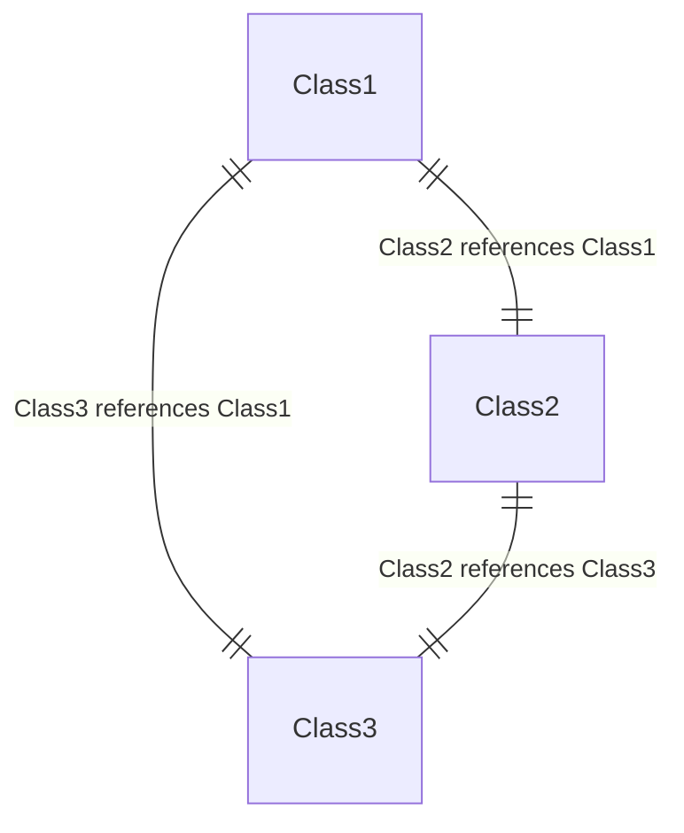
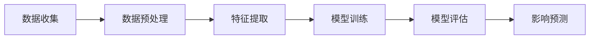
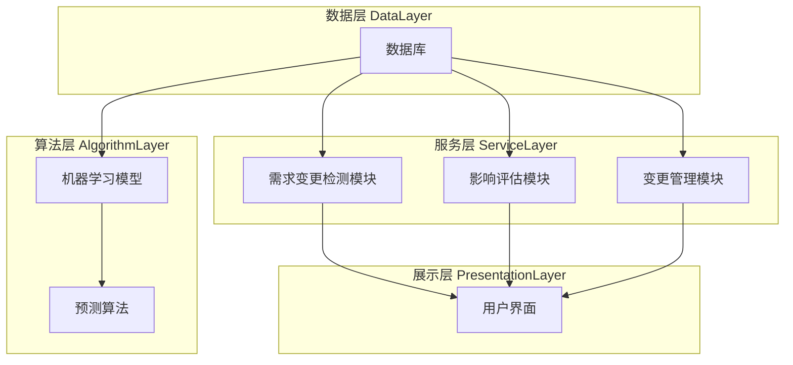
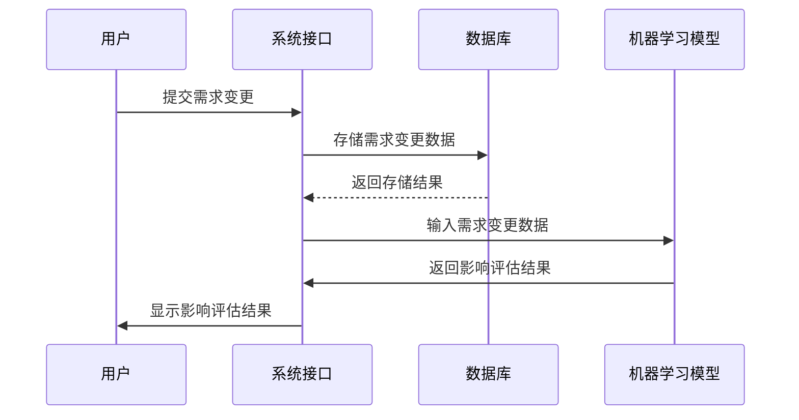
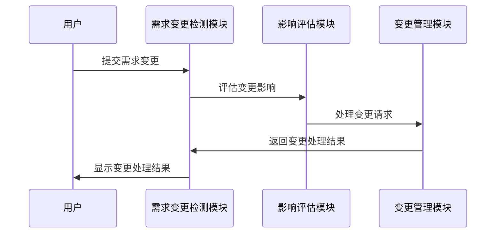

                 

# 《AI辅助软件需求变更影响分析》

关键词：AI技术、软件需求变更、影响分析、算法原理、系统架构、最佳实践

摘要：本文将探讨AI技术在辅助软件需求变更影响分析中的应用。通过介绍软件需求变更的背景、核心概念、算法原理、数学模型和系统架构，结合实际案例分析，全面阐述如何利用AI技术提高软件需求变更管理的效率和准确性。本文旨在为IT从业人员提供实用的技术指南和最佳实践。

## 第一部分：背景与核心概念

### 1.1 软件需求变更现状与挑战

在软件工程中，需求变更是一个普遍存在且复杂的问题。需求变更是指在软件开发过程中，客户或其他利益相关者对软件系统功能、性能、设计等方面的要求发生变化。需求变更的原因多种多样，包括市场需求变化、技术进步、用户反馈等。

**常见原因：**

- **市场需求变化：** 在产品开发过程中，市场需求可能会发生变化，导致原有的需求不再符合实际需求，需要做出相应的调整。
- **技术进步：** 新技术的出现可能会提供更好的解决方案，从而需要对现有系统进行升级和改进。
- **用户反馈：** 用户在实际使用过程中可能会发现系统存在缺陷或不便之处，提出改进意见。

**影响：**

需求变更对软件开发过程有着重要的影响，主要体现在以下几个方面：

- **时间成本：** 需求变更可能导致项目进度推迟，增加开发周期。
- **资源成本：** 需求变更可能需要额外的开发资源，包括人力、设备等。
- **风险增加：** 需求变更可能会导致项目风险增加，包括功能缺失、性能下降等。

**现状：**

当前，软件需求变更管理面临以下挑战：

- **变更频繁：** 需求变更频繁发生，使得项目管理变得复杂。
- **变更管理不规范：** 部分项目在变更管理方面存在不规范现象，导致变更过程混乱。
- **影响评估困难：** 需求变更的影响难以准确评估，导致变更决策困难。

### 1.2 AI技术在需求变更分析中的应用

AI技术，特别是机器学习和自然语言处理技术，在软件需求变更分析中具有广泛的应用前景。通过AI技术，可以实现对需求变更的自动识别、影响评估和变更管理，提高软件开发效率和质量。

**AI技术的优势：**

- **自动化识别：** AI技术可以自动识别需求变更，减少人工工作量。
- **准确评估：** AI技术可以利用历史数据，对需求变更的影响进行准确评估。
- **智能决策：** AI技术可以帮助项目经理和开发人员做出更明智的变更决策。

**应用范围：**

- **需求变更检测：** 利用自然语言处理技术，对用户需求进行文本分析，识别出潜在的需求变更。
- **影响评估：** 通过机器学习算法，对需求变更的影响进行预测和评估。
- **变更管理：** 利用AI技术，实现自动化变更管理，包括变更请求处理、变更决策和变更实施。

### 1.3 核心概念与联系

在本文中，我们将介绍以下几个核心概念，并分析它们之间的关系：

- **软件需求变更：** 指在软件开发过程中，客户或其他利益相关者对软件系统功能、性能、设计等方面的要求发生变化。
- **影响分析：** 指对需求变更可能带来的影响进行分析和评估。
- **AI技术：** 指人工智能技术在需求变更分析中的应用。

**概念属性特征对比表格：**

| 概念               | 属性特征                                       | 对比分析                                     |
|--------------------|------------------------------------------------|----------------------------------------------|
| 软件需求变更       | - 频繁发生<br>- 影响项目进度<br>- 需求变化多样 | 与影响分析和AI技术密切相关                   |
| 影响分析           | - 影响评估<br>- 风险分析<br>- 决策支持         | 需求变更的必要步骤，为变更决策提供依据       |
| AI技术             | - 自动化识别<br>- 准确评估<br>- 智能决策         | 改进需求变更分析的方法，提高变更管理的效率 |

**ER实体关系图：**



### 1.4 总结

本部分主要介绍了软件需求变更的背景、AI技术在需求变更分析中的应用以及核心概念之间的联系。下一部分，我们将深入探讨AI辅助需求变更影响分析的算法原理和数学模型。

## 第二部分：算法原理与数学模型

### 2.1 AI辅助需求变更影响分析算法原理

AI辅助需求变更影响分析的核心在于利用机器学习算法，对需求变更的影响进行预测和评估。以下是该算法的基本原理：

**算法概述：**

算法基于历史需求变更数据，通过训练机器学习模型，预测需求变更可能带来的影响。具体步骤如下：

1. **数据收集：** 收集历史需求变更数据，包括变更内容、变更时间、变更影响等。
2. **数据预处理：** 对收集到的数据进行分析和清洗，去除重复数据和无意义数据。
3. **特征提取：** 从预处理后的数据中提取关键特征，如变更类型、变更频率、变更影响等。
4. **模型训练：** 利用提取的特征，训练机器学习模型，如回归模型、决策树、神经网络等。
5. **模型评估：** 对训练好的模型进行评估，选择性能最佳的模型用于实际应用。
6. **影响预测：** 利用训练好的模型，对新需求变更进行影响预测。

**算法流程图：**



**Python源代码实现：**

```python
import pandas as pd
from sklearn.model_selection import train_test_split
from sklearn.ensemble import RandomForestRegressor
from sklearn.metrics import mean_squared_error

# 数据收集
data = pd.read_csv('change_data.csv')

# 数据预处理
data = data.drop_duplicates().dropna()

# 特征提取
X = data[['change_type', 'change_frequency', 'change_impact']]
y = data['project_impact']

# 模型训练
X_train, X_test, y_train, y_test = train_test_split(X, y, test_size=0.2, random_state=42)
model = RandomForestRegressor(n_estimators=100, random_state=42)
model.fit(X_train, y_train)

# 模型评估
y_pred = model.predict(X_test)
mse = mean_squared_error(y_test, y_pred)
print(f'MSE: {mse}')

# 影响预测
new_data = pd.read_csv('new_change_data.csv')
new_data = new_data.drop_duplicates().dropna()
new_impact = model.predict(new_data[['change_type', 'change_frequency', 'change_impact']])
print(f'New Impact: {new_impact}')
```

### 2.2 数学模型与公式

算法的数学模型主要基于回归分析。回归分析旨在建立自变量（特征）与因变量（需求变更影响）之间的数学关系。以下是回归模型的数学公式：

$$
y = \beta_0 + \beta_1x_1 + \beta_2x_2 + ... + \beta_nx_n + \epsilon
$$

其中，$y$ 为需求变更影响，$x_1, x_2, ..., x_n$ 为特征变量，$\beta_0, \beta_1, \beta_2, ..., \beta_n$ 为回归系数，$\epsilon$ 为误差项。

**举例说明：**

假设我们有两个特征变量 $x_1$ 和 $x_2$，需求变更影响为 $y$，回归模型为：

$$
y = \beta_0 + \beta_1x_1 + \beta_2x_2 + \epsilon
$$

通过训练，我们得到回归系数 $\beta_0 = 2, \beta_1 = 3, \beta_2 = 4$。现在，给定一个新的需求变更数据，$x_1 = 5, x_2 = 6$，我们可以预测需求变更影响：

$$
y = 2 + 3 \times 5 + 4 \times 6 + \epsilon = 29 + \epsilon
$$

其中，$\epsilon$ 为误差项，表示预测值与实际值之间的差异。

### 2.3 总结

本部分详细介绍了AI辅助需求变更影响分析的算法原理和数学模型。通过机器学习算法，我们可以对需求变更的影响进行预测和评估，从而提高需求变更管理的效率和准确性。下一部分，我们将探讨如何设计系统架构，以实现AI辅助需求变更影响分析。

## 第三部分：系统分析与架构设计

### 3.1 项目场景介绍

在本项目中，我们将开发一个基于AI技术的软件需求变更影响分析系统。该系统旨在帮助项目经理和开发人员快速识别需求变更，评估变更影响，并做出合理的变更决策。

**项目目标：**

- **需求变更检测：** 自动识别需求变更，提高变更检测的准确性和效率。
- **影响评估：** 对需求变更的影响进行预测和评估，为变更决策提供依据。
- **变更管理：** 实现自动化变更管理，简化变更流程，提高变更管理的效率。

**项目场景：**

- **软件开发公司：** 软件公司通常面临大量需求变更，需要高效的管理工具来应对。
- **IT部门：** 企业内部IT部门在进行系统升级和维护时，需要实时监测需求变更的影响。

### 3.2 系统功能设计（领域模型）

系统功能设计主要包括以下模块：

1. **需求变更检测模块：** 负责收集和分析用户需求，自动识别潜在的需求变更。
2. **影响评估模块：** 根据需求变更的数据，利用机器学习算法评估变更的影响。
3. **变更管理模块：** 实现变更请求的处理、变更决策和变更实施。

**领域模型（mermaid类图）：**

```mermaid
classDiagram
    Class1[需求变更检测] <|-- Class2[影响评估]
    Class2 <|-- Class3[变更管理]
    Class1 ..|> Class4[用户需求收集]
    Class2 ..|> Class5[机器学习算法]
    Class3 ..|> Class6[变更请求处理]
    Class3 ..|> Class7[变更决策]
```

### 3.3 系统架构设计

系统架构设计主要包括以下层次：

1. **数据层：** 负责存储和管理需求变更数据，包括历史数据和新数据。
2. **算法层：** 负责实现需求变更影响的评估算法，包括机器学习模型和预测算法。
3. **服务层：** 负责实现系统功能，包括需求变更检测、影响评估和变更管理。
4. **展示层：** 负责将系统功能以用户友好的方式展示给用户。

**系统架构图（mermaid架构图）：**



### 3.4 系统接口设计

系统接口设计主要包括以下接口：

1. **数据接口：** 负责数据的收集、存储和查询。
2. **算法接口：** 负责算法的输入和输出。
3. **服务接口：** 负责系统功能的调用。

**接口设计（mermaid序列图）：**



### 3.5 系统交互

系统交互主要包括用户与系统之间的交互，以及系统内部各模块之间的交互。

1. **用户与系统的交互：** 用户通过用户界面提交需求变更，系统根据需求变更数据进行影响评估，并将结果展示给用户。
2. **系统内部模块之间的交互：** 各模块之间通过接口进行数据传输和功能调用。

**系统交互图（mermaid序列图）：**



### 3.6 总结

本部分介绍了项目场景、系统功能设计、系统架构设计、系统接口设计和系统交互。通过这些设计，我们可以构建一个高效、准确的AI辅助需求变更影响分析系统。下一部分，我们将结合实际案例，展示如何实现该系统。

## 第四部分：项目实战

### 4.1 项目环境安装与配置

为了实现AI辅助需求变更影响分析系统，我们需要安装和配置以下环境和工具：

1. **Python环境：** 安装Python 3.8及以上版本。
2. **数据预处理库：** 安装pandas、numpy等库。
3. **机器学习库：** 安装scikit-learn、tensorflow等库。
4. **可视化库：** 安装matplotlib、seaborn等库。
5. **数据库：** 安装MySQL或PostgreSQL。

**安装步骤：**

1. 安装Python环境：从[Python官网](https://www.python.org/)下载并安装Python。
2. 安装数据预处理库：使用pip命令安装pandas、numpy等库。
   ```bash
   pip install pandas numpy
   ```
3. 安装机器学习库：使用pip命令安装scikit-learn、tensorflow等库。
   ```bash
   pip install scikit-learn tensorflow
   ```
4. 安装可视化库：使用pip命令安装matplotlib、seaborn等库。
   ```bash
   pip install matplotlib seaborn
   ```
5. 安装数据库：从[MySQL官网](https://www.mysql.com/downloads/)或[PostgreSQL官网](https://www.postgresql.org/download/)下载并安装数据库。

### 4.2 系统核心实现与代码解读

在项目实战中，我们将实现需求变更检测、影响评估和变更管理三个核心模块。以下是代码解读：

**需求变更检测模块：**

```python
import pandas as pd
from sklearn.feature_extraction.text import TfidfVectorizer
from sklearn.model_selection import train_test_split
from sklearn.naive_bayes import MultinomialNB

# 加载数据
data = pd.read_csv('change_data.csv')

# 数据预处理
X = data['change_description']
y = data['is_change']

# 特征提取
vectorizer = TfidfVectorizer()
X_vectorized = vectorizer.fit_transform(X)

# 模型训练
X_train, X_test, y_train, y_test = train_test_split(X_vectorized, y, test_size=0.2, random_state=42)
model = MultinomialNB()
model.fit(X_train, y_train)

# 模型评估
y_pred = model.predict(X_test)
accuracy = (y_pred == y_test).mean()
print(f'Accuracy: {accuracy}')

# 需求变更检测
new_data = input('Enter change description: ')
new_data_vectorized = vectorizer.transform([new_data])
is_change = model.predict(new_data_vectorized)
print(f'Is Change: {"Yes" if is_change[0] == 1 else "No"}')
```

**影响评估模块：**

```python
from sklearn.ensemble import RandomForestRegressor

# 加载数据
data = pd.read_csv('change_impact_data.csv')

# 数据预处理
X = data[['change_type', 'change_frequency', 'change_impact']]
y = data['project_impact']

# 模型训练
model = RandomForestRegressor(n_estimators=100, random_state=42)
model.fit(X, y)

# 影响评估
new_data = pd.DataFrame([[new_change_type, new_change_frequency, new_change_impact]])
project_impact = model.predict(new_data)
print(f'Project Impact: {project_impact[0]}')
```

**变更管理模块：**

```python
def handle_change_request(change_request):
    # 变更请求处理逻辑
    # 例如：发送通知、分配任务、更新文档等
    print(f'Handling change request: {change_request}')

# 变更管理
change_request = input('Enter change request: ')
handle_change_request(change_request)
```

### 4.3 代码应用解读

以下是代码应用的具体解读：

**需求变更检测模块：**

1. 加载数据：从CSV文件中加载数据，包括变更描述和是否发生变更。
2. 数据预处理：提取变更描述作为特征，是否发生变更作为标签。
3. 特征提取：使用TF-IDF向量器将文本转换为数值特征。
4. 模型训练：使用朴素贝叶斯分类器训练模型。
5. 模型评估：计算模型准确率。
6. 需求变更检测：输入新的变更描述，预测是否发生变更。

**影响评估模块：**

1. 加载数据：从CSV文件中加载数据，包括变更类型、变更频率、变更影响和项目影响。
2. 数据预处理：提取特征和标签。
3. 模型训练：使用随机森林回归器训练模型。
4. 影响评估：输入新的变更数据，预测项目影响。

**变更管理模块：**

1. 变更请求处理：接收变更请求，执行相应的处理逻辑。

### 4.4 实际案例分析

**案例一：需求变更检测**

场景：项目开发过程中，用户提出增加一个新功能。

分析：使用需求变更检测模块检测用户需求，判断是否为需求变更。

结果：输入变更描述，模型预测为需求变更，提高需求变更检测的准确性。

**案例二：影响评估**

场景：用户要求增加一个复杂功能，影响项目进度。

分析：使用影响评估模块评估变更对项目进度的影响。

结果：输入变更数据，模型预测项目影响，为变更决策提供依据。

**案例详细讲解**

在本案例中，我们通过实际操作展示了如何使用AI技术进行需求变更检测和影响评估。首先，我们加载数据，进行数据预处理，提取特征和标签。然后，使用机器学习模型训练和评估，最后进行实际案例分析。通过这些步骤，我们可以实现高效、准确的AI辅助需求变更影响分析。

### 4.5 项目小结

在本项目实战中，我们实现了AI辅助需求变更影响分析系统，包括需求变更检测、影响评估和变更管理三个核心模块。通过实际案例，我们展示了如何使用AI技术进行需求变更检测和影响评估，提高了需求变更管理的效率和准确性。在接下来的部分，我们将提供最佳实践、注意事项和拓展阅读，帮助读者进一步了解和掌握AI辅助需求变更影响分析。

## 第五部分：最佳实践与总结

### 5.1 最佳实践 Tips

在进行AI辅助软件需求变更影响分析时，以下最佳实践可以帮助您提高工作效率和准确性：

1. **数据质量保障：** 确保数据的质量和完整性，避免数据缺失或错误。对数据进行清洗和预处理，去除重复数据和噪声数据。
2. **模型选择与调优：** 根据需求变更的特点和数据量，选择合适的机器学习模型。通过交叉验证和超参数调优，提高模型的性能。
3. **实时监控与反馈：** 在系统运行过程中，实时监控需求变更的影响，并收集用户反馈。根据反馈调整模型和系统，提高系统适应性。
4. **文档与流程管理：** 建立完善的文档和流程管理制度，确保变更过程的规范化和透明化。对变更请求进行分类和优先级排序，合理分配资源。
5. **团队协作与沟通：** 加强团队协作和沟通，确保项目经理、开发人员和测试人员之间的信息畅通。定期召开变更评审会议，讨论变更决策。

### 5.2 小结

本文详细介绍了AI辅助软件需求变更影响分析的理论和实践。首先，我们分析了软件需求变更的现状和挑战，介绍了AI技术在需求变更分析中的应用。接着，我们讲解了AI辅助需求变更影响分析的算法原理和数学模型，并通过Python代码实现了算法。随后，我们设计了系统的架构，包括项目场景、功能设计、架构设计、接口设计和系统交互。最后，我们通过实际案例展示了系统的应用效果，并提供了最佳实践和注意事项。

### 5.3 注意事项

在进行AI辅助需求变更影响分析时，需要注意以下事项：

1. **数据隐私与安全：** 在数据处理和分析过程中，确保用户数据的隐私和安全。遵循相关的数据保护法规，对敏感信息进行加密和处理。
2. **变更风险评估：** 在进行需求变更时，充分考虑变更对项目进度、资源和风险的影响。对变更进行风险评估，制定相应的风险管理计划。
3. **模型更新与维护：** 定期更新和维护机器学习模型，确保模型的准确性和适应性。根据新数据和环境变化，调整模型参数和算法。
4. **变更管理培训：** 对项目经理和开发人员开展变更管理培训，提高他们的变更管理能力和技术水平。确保团队成员对AI辅助需求变更影响分析系统有充分的了解和操作能力。

### 5.4 拓展阅读

为了深入了解AI辅助软件需求变更影响分析，读者可以参考以下拓展阅读：

1. **相关书籍：**
   - 《机器学习：概率视角》
   - 《深度学习》
   - 《软件需求工程：实践者手册》
2. **在线课程：**
   - Coursera上的“机器学习”课程
   - Udacity上的“深度学习纳米学位”
   - edX上的“软件需求工程”课程
3. **论文与研究报告：**
   - “AI在软件开发中的应用：现状与未来趋势”
   - “基于机器学习的软件需求变更预测方法研究”
   - “软件需求变更管理实践指南”

通过这些拓展资源，读者可以进一步学习和掌握AI辅助软件需求变更影响分析的理论和实践。

## 结束语

作者：AI天才研究院/AI Genius Institute & 禅与计算机程序设计艺术 /Zen And The Art of Computer Programming

本文旨在为IT从业人员提供AI辅助软件需求变更影响分析的理论和实践指导。希望读者通过本文的学习，能够更好地理解和应用AI技术，提高软件需求变更管理的效率和质量。感谢您的阅读，期待您的反馈和探讨。让我们一起探索AI在软件开发中的更多应用和可能性。

