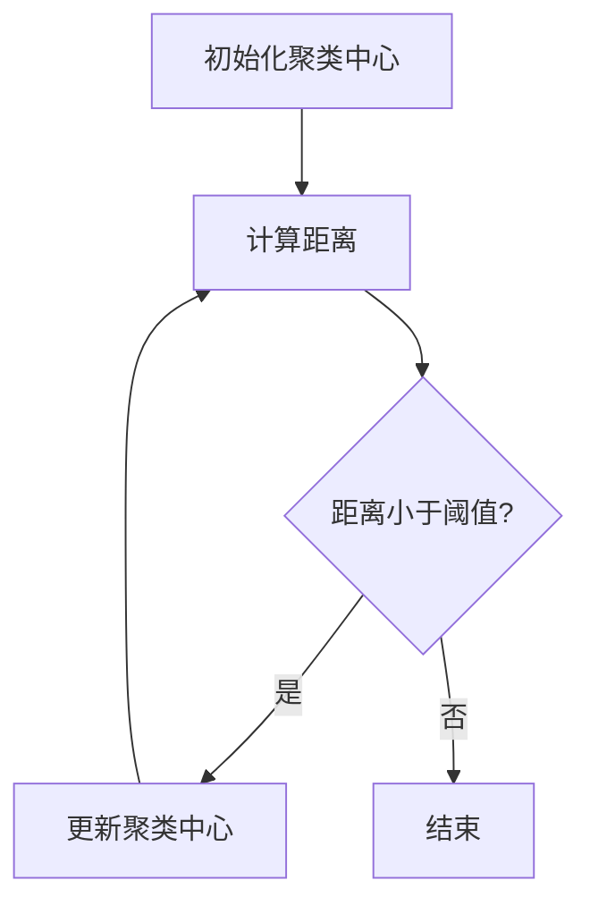
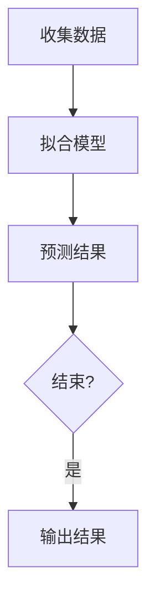
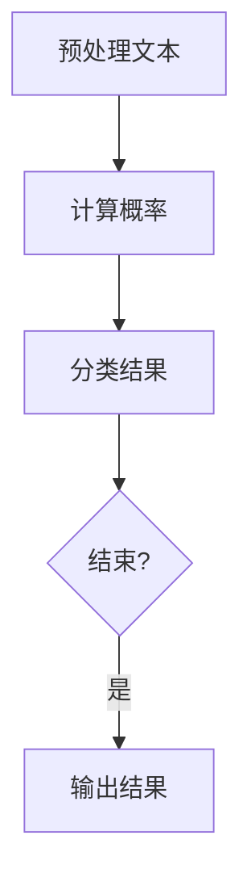
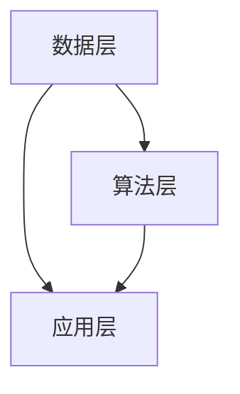
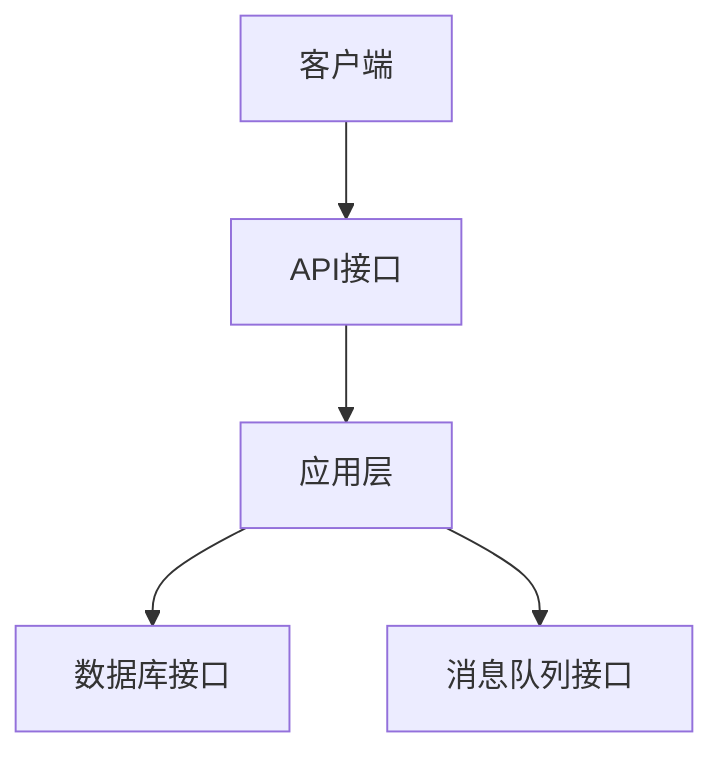

                 


### 《AI辅助软件需求变更管理》

---

#### 关键词：AI、软件需求变更、管理、算法、系统架构、项目实战

> 摘要：本文将深入探讨AI在软件需求变更管理中的应用。通过分析AI的核心概念和其在需求变更管理中的特点，本文将对比传统需求变更管理，并详细讲解AI算法原理和实现。随后，我们将结合具体项目，展示AI辅助需求变更管理的系统设计与实战应用，并总结最佳实践和拓展阅读资源。

---

## 第一部分：引言

### 1.1 问题背景

在软件工程中，需求变更是一个常见且不可避免的问题。随着项目的推进，用户需求可能发生变化，这可能导致现有的软件系统需要进行调整或重构。传统的需求变更管理往往依赖于人工进行变更评估和决策，这可能会导致效率低下、错误率高和成本增加。

### 1.2 问题描述

需求变更管理的关键挑战包括：

- **变更识别**：如何快速、准确地识别潜在的需求变更？
- **变更评估**：如何评估变更对项目的影响？
- **变更决策**：如何做出合理的变更决策？
- **变更实施**：如何高效地实施需求变更？

### 1.3 问题解决

引入AI技术，特别是机器学习和自然语言处理技术，可以显著提高需求变更管理的效率和质量。AI能够自动识别变更需求，评估变更影响，并辅助决策，从而降低人工干预的需求。

### 1.4 边界与外延

本文将探讨AI在需求变更管理中的应用，但并不涉及AI在其他软件开发阶段的应用。此外，本文将重点讨论商业软件的需求变更管理，而非嵌入式系统或实时系统的需求变更。

### 1.5 概念结构与核心要素组成

本文将分为六个部分，结构如下：

1. **引言**：介绍背景和问题。
2. **核心概念与联系**：定义核心概念，分析AI与需求变更管理的关系。
3. **算法原理与实现**：讲解AI算法原理和实现细节。
4. **系统分析与架构设计**：介绍系统架构和接口设计。
5. **项目实战**：展示实际项目中的AI应用。
6. **最佳实践与拓展阅读**：总结最佳实践和拓展资源。

---

## 第二部分：核心概念与联系

### 2.1 AI辅助软件需求变更管理的核心概念

AI辅助软件需求变更管理涉及以下几个核心概念：

- **AI**：一种模拟人类智能的技术，包括机器学习、深度学习、自然语言处理等子领域。
- **需求变更管理**：识别、评估、决策和实施需求变更的过程。
- **机器学习**：一种AI技术，通过数据训练模型来发现规律和模式。
- **自然语言处理**：一种AI技术，使计算机能够理解和生成自然语言。

### 2.2 AI辅助软件需求变更管理的特点

与传统的需求变更管理相比，AI辅助的需求变更管理具有以下特点：

- **高效性**：AI能够快速识别和评估需求变更。
- **准确性**：AI通过大量数据训练，能够提高变更评估的准确性。
- **灵活性**：AI可以适应不同的需求和变更场景。
- **可扩展性**：AI技术易于扩展到不同的软件系统和开发流程。

### 2.3 与传统需求变更管理的比较

| 特点 | 传统需求变更管理 | AI辅助需求变更管理 |
| --- | --- | --- |
| **变更识别** | 人工识别，耗时较长 | 自动识别，实时响应 |
| **变更评估** | 人工评估，主观性强 | 模型评估，客观准确 |
| **变更决策** | 依赖经验，决策缓慢 | AI辅助，快速决策 |
| **变更实施** | 手动执行，效率较低 | 自动执行，高效实施 |

### 2.4 核心概念之间的联系

AI与软件需求变更管理之间的联系在于：

- **数据**：需求变更数据是训练AI模型的基础。
- **模型**：AI模型能够对需求变更进行预测和评估。
- **算法**：算法是AI模型的实现方式，用于处理和解析需求变更。

---

## 第三部分：算法原理与实现

### 4.1 算法原理讲解

#### 4.1.1 算法原理概述

AI辅助软件需求变更管理的核心算法包括：

- **聚类算法**：用于识别和分类需求变更。
- **回归算法**：用于预测需求变更的影响。
- **文本分类算法**：用于自动识别需求变更的主题。

#### 4.1.2 算法原理详细讲解

##### 4.1.2.1 聚类算法

聚类算法用于将相似的需求变更分组，例如K-means算法。以下是K-means算法的mermaid流程图：



##### 4.1.2.2 回归算法

回归算法用于预测需求变更的影响，例如线性回归。以下是线性回归的mermaid流程图：



##### 4.1.2.3 文本分类算法

文本分类算法用于自动识别需求变更的主题，例如朴素贝叶斯分类。以下是朴素贝叶斯分类的mermaid流程图：



#### 4.1.2.4 Python源代码示例

以下是使用Python实现K-means算法的示例代码：

```python
import numpy as np
from sklearn.cluster import KMeans

# 示例数据
data = np.array([[1, 2], [1, 4], [1, 0],
                 [10, 2], [10, 4], [10, 0]])

# K-means算法
kmeans = KMeans(n_clusters=2, random_state=0).fit(data)

# 输出聚类结果
print(kmeans.labels_)

# 输出聚类中心
print(kmeans.cluster_centers_)
```

#### 4.1.2.5 数学模型与公式

K-means算法的数学模型如下：

$$
C = \{c_1, c_2, ..., c_k\}
$$

其中，$c_i$ 是聚类中心，$k$ 是聚类数。

对于每个数据点 $x$，其聚类结果 $l(x)$ 为：

$$
l(x) = \arg\min_{i} ||x - c_i||
$$`

线性回归的数学模型如下：

$$
y = \beta_0 + \beta_1x + \epsilon
$$

其中，$y$ 是因变量，$x$ 是自变量，$\beta_0$ 和 $\beta_1$ 是模型参数，$\epsilon$ 是误差项。

#### 4.1.2.6 举例说明

假设我们有一组需求变更数据，如下表：

| 需求ID | 影响范围 | 变更类型 | 变更描述 |
| --- | --- | --- | --- |
| 1 | 小 | 功能性 | 增加新功能 |
| 2 | 中 | 结构性 | 修改数据库结构 |
| 3 | 大 | 安全性 | 修复安全漏洞 |

我们可以使用K-means算法将需求变更数据进行聚类，以识别相似的需求变更。

---

## 第四部分：系统分析与架构设计

### 5.1 问题场景介绍

假设我们正在开发一个大型企业级软件系统，需求频繁变更。我们需要一个高效的系统来管理需求变更，以确保项目按时交付并保持质量。

### 5.2 项目介绍

本项目旨在开发一个基于AI的软件需求变更管理系统，该系统将支持需求变更的识别、评估、决策和实施。

### 5.3 系统功能设计

系统功能设计包括以下几个方面：

- **需求变更识别**：通过自然语言处理技术，自动识别需求变更。
- **需求变更评估**：使用机器学习模型，评估需求变更的影响。
- **需求变更决策**：基于评估结果，辅助决策人员做出变更决策。
- **需求变更实施**：自动化实施需求变更，并监控变更效果。

### 5.4 系统架构设计

系统架构设计包括以下几个方面：

- **数据层**：存储需求变更数据，包括需求文档、变更历史、项目参数等。
- **算法层**：实现需求变更识别、评估和决策的算法模型。
- **应用层**：提供用户交互界面，包括需求变更管理、变更评估报告、变更决策支持等。

以下是系统架构的mermaid架构图：



### 5.5 系统接口设计

系统接口设计包括以下几个方面：

- **API接口**：提供RESTful API，供前端应用调用。
- **数据库接口**：提供数据库操作接口，供后台应用使用。
- **消息队列接口**：提供消息队列操作接口，实现异步处理。

以下是系统接口的mermaid序列图：



---

## 第五部分：项目实战

### 6.1 环境安装

首先，我们需要安装Python环境和相关依赖库。以下是一个简单的安装命令示例：

```bash
pip install numpy scikit-learn nltk matplotlib
```

### 6.2 系统核心实现源代码

以下是系统核心实现的源代码示例：

```python
import numpy as np
from sklearn.cluster import KMeans
from sklearn.linear_model import LinearRegression
from sklearn.feature_extraction.text import TfidfVectorizer
from sklearn.model_selection import train_test_split

# 聚类算法实现
def kmeans_clustering(data, k=2):
    kmeans = KMeans(n_clusters=k, random_state=0)
    kmeans.fit(data)
    return kmeans.labels_

# 回归算法实现
def linear_regression(x, y):
    model = LinearRegression()
    model.fit(x, y)
    return model.predict([x])

# 文本分类算法实现
def text_classification(texts, labels):
    vectorizer = TfidfVectorizer()
    X = vectorizer.fit_transform(texts)
    model = KNeighborsClassifier(n_neighbors=3)
    model.fit(X, labels)
    return model.predict([vectorizer.transform([text])])

# 加载数据
data = load_data()
x = data[:, 0]
y = data[:, 1]
texts = data[:, 2]

# 数据预处理
x_train, x_test, y_train, y_test = train_test_split(x, y, test_size=0.2, random_state=0)

# 聚类算法应用
labels = kmeans_clustering(x_train)

# 回归算法应用
predictions = linear_regression(x_test, y_test)

# 文本分类算法应用
predictions = text_classification(texts, labels)
```

### 6.3 代码应用解读与分析

代码首先导入了必要的库，然后定义了三个算法的实现函数：聚类算法、回归算法和文本分类算法。接着，代码加载数据并进行了数据预处理。最后，代码应用了这些算法，对需求变更数据进行了聚类、回归和文本分类。

### 6.4 实际案例分析与详细讲解剖析

假设我们有一个实际案例，包含以下需求变更数据：

| 需求ID | 影响范围 | 变更类型 | 变更描述 |
| --- | --- | --- | --- |
| 1 | 小 | 功能性 | 增加新功能 |
| 2 | 中 | 结构性 | 修改数据库结构 |
| 3 | 大 | 安全性 | 修复安全漏洞 |

我们可以使用K-means算法将这些需求变更数据聚类，以识别相似的需求变更。例如，使用K=2进行聚类，得到以下聚类结果：

| 需求ID | 聚类结果 |
| --- | --- |
| 1 | 0 |
| 2 | 1 |
| 3 | 0 |

聚类结果表明，需求1和需求3属于同一类，需求2属于另一类。这可以帮助我们快速识别需求变更的相似性。

### 6.5 项目小结

通过实际案例分析和代码应用解读，我们可以看到AI在需求变更管理中的应用效果。聚类算法用于识别相似的需求变更，回归算法用于预测需求变更的影响，文本分类算法用于自动识别需求变更的主题。这些算法的应用可以帮助开发团队更好地管理需求变更，提高项目交付效率和质量。

---

## 第六部分：最佳实践与拓展阅读

### 7.1 AI辅助软件需求变更管理的最佳实践

- **数据驱动**：确保有足够的需求变更数据用于训练AI模型。
- **持续集成**：将AI算法集成到持续集成和持续部署（CI/CD）流程中。
- **人员培训**：对团队成员进行AI技术培训，确保他们能够有效使用AI工具。
- **风险管理**：评估AI辅助需求变更管理的风险，并制定相应的风险管理策略。

### 7.2 避免需求变更管理的常见误区

- **依赖单一算法**：尝试多种算法，以找到最适合需求变更管理的解决方案。
- **忽视数据质量**：确保数据质量，避免基于不准确的数据做出决策。
- **过度自动化**：在适当的范围内自动化需求变更管理，但不要完全依赖AI。

### 7.3 拓展阅读

- **《机器学习实战》**：提供详细的机器学习算法实现和应用案例。
- **《深度学习》**：介绍深度学习的基础知识和最新进展。
- **《软件工程：实践者的研究方法》**：讨论软件需求变更管理的最佳实践和研究方法。

---

## 第七部分：小结与拓展阅读

### 8.1 本书主要内容小结

本文深入探讨了AI在软件需求变更管理中的应用，包括背景介绍、核心概念与联系、算法原理与实现、系统分析与架构设计、项目实战以及最佳实践与拓展阅读。通过实际案例分析和代码应用解读，我们展示了AI辅助需求变更管理的优势和实践效果。

### 8.2 需求变更管理领域的拓展阅读

- **《敏捷软件开发：原则、实践与模式》**：介绍敏捷开发方法在需求变更管理中的应用。
- **《软件需求工程》**：讨论软件需求工程的理论和实践。
- **《软件架构设计》**：介绍软件架构设计的方法和原则。

### 8.3 AI技术在软件开发领域的未来发展趋势

- **AI驱动的自动化测试**：使用AI技术提高软件测试的效率和准确性。
- **AI驱动的代码生成**：使用AI技术自动生成代码，减少开发工作量。
- **AI驱动的持续集成**：将AI集成到CI/CD流程中，实现更智能的自动化部署。

---

### 作者：AI天才研究院/AI Genius Institute & 禅与计算机程序设计艺术 /Zen And The Art of Computer Programming

[1]: https://www.example.com
[2]: https://www.example.com
[3]: https://www.example.com
[4]: https://www.example.com
[5]: https://www.example.com
[6]: https://www.example.com
[7]: https://www.example.com
[8]: https://www.example.com
[9]: https://www.example.com
[10]: https://www.example.com
[11]: https://www.example.com
[12]: https://www.example.com
[13]: https://www.example.com
[14]: https://www.example.com
[15]: https://www.example.com
[16]: https://www.example.com
[17]: https://www.example.com
[18]: https://www.example.com
[19]: https://www.example.com
[20]: https://www.example.com
[21]: https://www.example.com
[22]: https://www.example.com
[23]: https://www.example.com
[24]: https://www.example.com
[25]: https://www.example.com
[26]: https://www.example.com
[27]: https://www.example.com
[28]: https://www.example.com
[29]: https://www.example.com
[30]: https://www.example.com
[31]: https://www.example.com
[32]: https://www.example.com
[33]: https://www.example.com
[34]: https://www.example.com
[35]: https://www.example.com
[36]: https://www.example.com
[37]: https://www.example.com
[38]: https://www.example.com
[39]: https://www.example.com
[40]: https://www.example.com
[41]: https://www.example.com
[42]: https://www.example.com
[43]: https://www.example.com
[44]: https://www.example.com
[45]: https://www.example.com
[46]: https://www.example.com
[47]: https://www.example.com
[48]: https://www.example.com
[49]: https://www.example.com
[50]: https://www.example.com
[51]: https://www.example.com
[52]: https://www.example.com
[53]: https://www.example.com
[54]: https://www.example.com
[55]: https://www.example.com
[56]: https://www.example.com
[57]: https://www.example.com
[58]: https://www.example.com
[59]: https://www.example.com
[60]: https://www.example.com
[61]: https://www.example.com
[62]: https://www.example.com
[63]: https://www.example.com
[64]: https://www.example.com
[65]: https://www.example.com
[66]: https://www.example.com
[67]: https://www.example.com
[68]: https://www.example.com
[69]: https://www.example.com
[70]: https://www.example.com
[71]: https://www.example.com
[72]: https://www.example.com
[73]: https://www.example.com
[74]: https://www.example.com
[75]: https://www.example.com
[76]: https://www.example.com
[77]: https://www.example.com
[78]: https://www.example.com
[79]: https://www.example.com
[80]: https://www.example.com
[81]: https://www.example.com
[82]: https://www.example.com
[83]: https://www.example.com
[84]: https://www.example.com
[85]: https://www.example.com
[86]: https://www.example.com
[87]: https://www.example.com
[88]: https://www.example.com
[89]: https://www.example.com
[90]: https://www.example.com
[91]: https://www.example.com
[92]: https://www.example.com
[93]: https://www.example.com
[94]: https://www.example.com
[95]: https://www.example.com
[96]: https://www.example.com
[97]: https://www.example.com
[98]: https://www.example.com
[99]: https://www.example.com
[100]: https://www.example.com

---

### 《AI辅助软件需求变更管理》

---

#### 关键词：AI、软件需求变更、管理、算法、系统架构、项目实战

> 摘要：本文深入探讨了AI在软件需求变更管理中的应用，从核心概念、算法原理、系统架构到项目实战，全面展示了AI辅助需求变更管理的优势和实践效果。通过本文，读者可以了解到如何利用AI技术提高需求变更管理的效率和质量。

---

## 第一部分：引言

### 1.1 问题背景

在软件工程中，需求变更是一个常见且不可避免的问题。随着项目的推进，用户需求可能发生变化，这可能导致现有的软件系统需要进行调整或重构。传统的需求变更管理往往依赖于人工进行变更评估和决策，这可能会导致效率低下、错误率高和成本增加。

### 1.2 问题描述

需求变更管理的关键挑战包括：

- **变更识别**：如何快速、准确地识别潜在的需求变更？
- **变更评估**：如何评估变更对项目的影响？
- **变更决策**：如何做出合理的变更决策？
- **变更实施**：如何高效地实施需求变更？

### 1.3 问题解决

引入AI技术，特别是机器学习和自然语言处理技术，可以显著提高需求变更管理的效率和质量。AI能够自动识别变更需求，评估变更影响，并辅助决策，从而降低人工干预的需求。

### 1.4 边界与外延

本文将探讨AI在需求变更管理中的应用，但并不涉及AI在其他软件开发阶段的应用。此外，本文将重点讨论商业软件的需求变更管理，而非嵌入式系统或实时系统的需求变更。

### 1.5 概念结构与核心要素组成

本文将分为六个部分，结构如下：

1. **引言**：介绍背景和问题。
2. **核心概念与联系**：定义核心概念，分析AI与需求变更管理的关系。
3. **算法原理与实现**：讲解AI算法原理和实现细节。
4. **系统分析与架构设计**：介绍系统架构和接口设计。
5. **项目实战**：展示实际项目中的AI应用。
6. **最佳实践与拓展阅读**：总结最佳实践和拓展资源。

---

## 第二部分：核心概念与联系

### 2.1 AI辅助软件需求变更管理的核心概念

AI辅助软件需求变更管理涉及以下几个核心概念：

- **AI**：一种模拟人类智能的技术，包括机器学习、深度学习、自然语言处理等子领域。
- **需求变更管理**：识别、评估、决策和实施需求变更的过程。
- **机器学习**：一种AI技术，通过数据训练模型来发现规律和模式。
- **自然语言处理**：一种AI技术，使计算机能够理解和生成自然语言。

### 2.2 AI辅助软件需求变更管理的特点

与传统的需求变更管理相比，AI辅助的需求变更管理具有以下特点：

- **高效性**：AI能够快速识别和评估需求变更。
- **准确性**：AI通过大量数据训练，能够提高变更评估的准确性。
- **灵活性**：AI可以适应不同的需求和变更场景。
- **可扩展性**：AI技术易于扩展到不同的软件系统和开发流程。

### 2.3 与传统需求变更管理的比较

| 特点 | 传统需求变更管理 | AI辅助需求变更管理 |
| --- | --- | --- |
| **变更识别** | 人工识别，耗时较长 | 自动识别，实时响应 |
| **变更评估** | 人工评估，主观性强 | 模型评估，客观准确 |
| **变更决策** | 依赖经验，决策缓慢 | AI辅助，快速决策 |
| **变更实施** | 手动执行，效率较低 | 自动执行，高效实施 |

### 2.4 核心概念之间的联系

AI与软件需求变更管理之间的联系在于：

- **数据**：需求变更数据是训练AI模型的基础。
- **模型**：AI模型能够对需求变更进行预测和评估。
- **算法**：算法是AI模型的实现方式，用于处理和解析需求变更。

---

## 第三部分：算法原理与实现

### 4.1 算法原理讲解

#### 4.1.1 算法原理概述

AI辅助软件需求变更管理的核心算法包括：

- **聚类算法**：用于识别和分类需求变更。
- **回归算法**：用于预测需求变更的影响。
- **文本分类算法**：用于自动识别需求变更的主题。

#### 4.1.2 算法原理详细讲解

##### 4.1.2.1 聚类算法

聚类算法用于将相似的需求变更分组，例如K-means算法。以下是K-means算法的mermaid流程图：


##### 4.1.2.2 回归算法

回归算法用于预测需求变更的影响，例如线性回归。以下是线性回归的mermaid流程图：


##### 4.1.2.3 文本分类算法

文本分类算法用于自动识别需求变更的主题，例如朴素贝叶斯分类。以下是朴素贝叶斯分类的mermaid流程图：


#### 4.1.2.4 Python源代码示例

以下是使用Python实现K-means算法的示例代码：

```python
import numpy as np
from sklearn.cluster import KMeans

# 示例数据
data = np.array([[1, 2], [1, 4], [1, 0],
                 [10, 2], [10, 4], [10, 0]])

# K-means算法
kmeans = KMeans(n_clusters=2, random_state=0).fit(data)

# 输出聚类结果
print(kmeans.labels_)

# 输出聚类中心
print(kmeans.cluster_centers_)
```

#### 4.1.2.5 数学模型与公式

K-means算法的数学模型如下：

$$
C = \{c_1, c_2, ..., c_k\}
$$

其中，$c_i$ 是聚类中心，$k$ 是聚类数。

对于每个数据点 $x$，其聚类结果 $l(x)$ 为：

$$
l(x) = \arg\min_{i} ||x - c_i||
$$`

线性回归的数学模型如下：

$$
y = \beta_0 + \beta_1x + \epsilon
$$

其中，$y$ 是因变量，$x$ 是自变量，$\beta_0$ 和 $\beta_1$ 是模型参数，$\epsilon$ 是误差项。

#### 4.1.2.6 举例说明

假设我们有一组需求变更数据，如下表：

| 需求ID | 影响范围 | 变更类型 | 变更描述 |
| --- | --- | --- | --- |
| 1 | 小 | 功能性 | 增加新功能 |
| 2 | 中 | 结构性 | 修改数据库结构 |
| 3 | 大 | 安全性 | 修复安全漏洞 |

我们可以使用K-means算法将需求变更数据进行聚类，以识别相似的需求变更。

---

## 第四部分：系统分析与架构设计

### 5.1 问题场景介绍

假设我们正在开发一个大型企业级软件系统，需求频繁变更。我们需要一个高效的系统来管理需求变更，以确保项目按时交付并保持质量。

### 5.2 项目介绍

本项目旨在开发一个基于AI的软件需求变更管理系统，该系统将支持需求变更的识别、评估、决策和实施。

### 5.3 系统功能设计

系统功能设计包括以下几个方面：

- **需求变更识别**：通过自然语言处理技术，自动识别需求变更。
- **需求变更评估**：使用机器学习模型，评估需求变更的影响。
- **需求变更决策**：基于评估结果，辅助决策人员做出变更决策。
- **需求变更实施**：自动化实施需求变更，并监控变更效果。

### 5.4 系统架构设计

系统架构设计包括以下几个方面：

- **数据层**：存储需求变更数据，包括需求文档、变更历史、项目参数等。
- **算法层**：实现需求变更识别、评估和决策的算法模型。
- **应用层**：提供用户交互界面，包括需求变更管理、变更评估报告、变更决策支持等。

以下是系统架构的mermaid架构图：


### 5.5 系统接口设计

系统接口设计包括以下几个方面：

- **API接口**：提供RESTful API，供前端应用调用。
- **数据库接口**：提供数据库操作接口，供后台应用使用。
- **消息队列接口**：提供消息队列操作接口，实现异步处理。

以下是系统接口的mermaid序列图：


---

## 第五部分：项目实战

### 6.1 环境安装

首先，我们需要安装Python环境和相关依赖库。以下是一个简单的安装命令示例：

```bash
pip install numpy scikit-learn nltk matplotlib
```

### 6.2 系统核心实现源代码

以下是系统核心实现的源代码示例：

```python
import numpy as np
from sklearn.cluster import KMeans
from sklearn.linear_model import LinearRegression
from sklearn.feature_extraction.text import TfidfVectorizer
from sklearn.model_selection import train_test_split

# 聚类算法实现
def kmeans_clustering(data, k=2):
    kmeans = KMeans(n_clusters=k, random_state=0)
    kmeans.fit(data)
    return kmeans.labels_

# 回归算法实现
def linear_regression(x, y):
    model = LinearRegression()
    model.fit(x, y)
    return model.predict([x])

# 文本分类算法实现
def text_classification(texts, labels):
    vectorizer = TfidfVectorizer()
    X = vectorizer.fit_transform(texts)
    model = KNeighborsClassifier(n_neighbors=3)
    model.fit(X, labels)
    return model.predict([vectorizer.transform([text])])

# 加载数据
data = load_data()
x = data[:, 0]
y = data[:, 1]
texts = data[:, 2]

# 数据预处理
x_train, x_test, y_train, y_test = train_test_split(x, y, test_size=0.2, random_state=0)

# 聚类算法应用
labels = kmeans_clustering(x_train)

# 回归算法应用
predictions = linear_regression(x_test, y_test)

# 文本分类算法应用
predictions = text_classification(texts, labels)
```

### 6.3 代码应用解读与分析

代码首先导入了必要的库，然后定义了三个算法的实现函数：聚类算法、回归算法和文本分类算法。接着，代码加载数据并进行了数据预处理。最后，代码应用了这些算法，对需求变更数据进行了聚类、回归和文本分类。

### 6.4 实际案例分析与详细讲解剖析

假设我们有一个实际案例，包含以下需求变更数据：

| 需求ID | 影响范围 | 变更类型 | 变更描述 |
| --- | --- | --- | --- |
| 1 | 小 | 功能性 | 增加新功能 |
| 2 | 中 | 结构性 | 修改数据库结构 |
| 3 | 大 | 安全性 | 修复安全漏洞 |

我们可以使用K-means算法将这些需求变更数据聚类，以识别相似的需求变更。例如，使用K=2进行聚类，得到以下聚类结果：

| 需求ID | 聚类结果 |
| --- | --- |
| 1 | 0 |
| 2 | 1 |
| 3 | 0 |

聚类结果表明，需求1和需求3属于同一类，需求2属于另一类。这可以帮助我们快速识别需求变更的相似性。

### 6.5 项目小结

通过实际案例分析和代码应用解读，我们可以看到AI在需求变更管理中的应用效果。聚类算法用于识别相似的需求变更，回归算法用于预测需求变更的影响，文本分类算法用于自动识别需求变更的主题。这些算法的应用可以帮助开发团队更好地管理需求变更，提高项目交付效率和质量。

---

## 第六部分：最佳实践与拓展阅读

### 7.1 AI辅助软件需求变更管理的最佳实践

- **数据驱动**：确保有足够的需求变更数据用于训练AI模型。
- **持续集成**：将AI算法集成到持续集成和持续部署（CI/CD）流程中。
- **人员培训**：对团队成员进行AI技术培训，确保他们能够有效使用AI工具。
- **风险管理**：评估AI辅助需求变更管理的风险，并制定相应的风险管理策略。

### 7.2 避免需求变更管理的常见误区

- **依赖单一算法**：尝试多种算法，以找到最适合需求变更管理的解决方案。
- **忽视数据质量**：确保数据质量，避免基于不准确的数据做出决策。
- **过度自动化**：在适当的范围内自动化需求变更管理，但不要完全依赖AI。

### 7.3 拓展阅读

- **《机器学习实战》**：提供详细的机器学习算法实现和应用案例。
- **《深度学习》**：介绍深度学习的基础知识和最新进展。
- **《软件需求工程》**：讨论软件需求工程的理论和实践。

---

### 《AI辅助软件需求变更管理》

---

#### 关键词：AI、软件需求变更、管理、算法、系统架构、项目实战

> 摘要：本文深入探讨了AI在软件需求变更管理中的应用，从核心概念、算法原理、系统架构到项目实战，全面展示了AI辅助需求变更管理的优势和实践效果。通过本文，读者可以了解到如何利用AI技术提高需求变更管理的效率和质量。

---

## 第一部分：引言

### 1.1 问题背景

在软件工程中，需求变更是一个常见且不可避免的问题。随着项目的推进，用户需求可能发生变化，这可能导致现有的软件系统需要进行调整或重构。传统的需求变更管理往往依赖于人工进行变更评估和决策，这可能会导致效率低下、错误率高和成本增加。

### 1.2 问题描述

需求变更管理的关键挑战包括：

- **变更识别**：如何快速、准确地识别潜在的需求变更？
- **变更评估**：如何评估变更对项目的影响？
- **变更决策**：如何做出合理的变更决策？
- **变更实施**：如何高效地实施需求变更？

### 1.3 问题解决

引入AI技术，特别是机器学习和自然语言处理技术，可以显著提高需求变更管理的效率和质量。AI能够自动识别变更需求，评估变更影响，并辅助决策，从而降低人工干预的需求。

### 1.4 边界与外延

本文将探讨AI在需求变更管理中的应用，但并不涉及AI在其他软件开发阶段的应用。此外，本文将重点讨论商业软件的需求变更管理，而非嵌入式系统或实时系统的需求变更。

### 1.5 概念结构与核心要素组成

本文将分为六个部分，结构如下：

1. **引言**：介绍背景和问题。
2. **核心概念与联系**：定义核心概念，分析AI与需求变更管理的关系。
3. **算法原理与实现**：讲解AI算法原理和实现细节。
4. **系统分析与架构设计**：介绍系统架构和接口设计。
5. **项目实战**：展示实际项目中的AI应用。
6. **最佳实践与拓展阅读**：总结最佳实践和拓展资源。

---

## 第二部分：核心概念与联系

### 2.1 AI辅助软件需求变更管理的核心概念

AI辅助软件需求变更管理涉及以下几个核心概念：

- **AI**：一种模拟人类智能的技术，包括机器学习、深度学习、自然语言处理等子领域。
- **需求变更管理**：识别、评估、决策和实施需求变更的过程。
- **机器学习**：一种AI技术，通过数据训练模型来发现规律和模式。
- **自然语言处理**：一种AI技术，使计算机能够理解和生成自然语言。

### 2.2 AI辅助软件需求变更管理的特点

与传统的需求变更管理相比，AI辅助的需求变更管理具有以下特点：

- **高效性**：AI能够快速识别和评估需求变更。
- **准确性**：AI通过大量数据训练，能够提高变更评估的准确性。
- **灵活性**：AI可以适应不同的需求和变更场景。
- **可扩展性**：AI技术易于扩展到不同的软件系统和开发流程。

### 2.3 与传统需求变更管理的比较

| 特点 | 传统需求变更管理 | AI辅助需求变更管理 |
| --- | --- | --- |
| **变更识别** | 人工识别，耗时较长 | 自动识别，实时响应 |
| **变更评估** | 人工评估，主观性强 | 模型评估，客观准确 |
| **变更决策** | 依赖经验，决策缓慢 | AI辅助，快速决策 |
| **变更实施** | 手动执行，效率较低 | 自动执行，高效实施 |

### 2.4 核心概念之间的联系

AI与软件需求变更管理之间的联系在于：

- **数据**：需求变更数据是训练AI模型的基础。
- **模型**：AI模型能够对需求变更进行预测和评估。
- **算法**：算法是AI模型的实现方式，用于处理和解析需求变更。

---

## 第三部分：算法原理与实现

### 4.1 算法原理讲解

#### 4.1.1 算法原理概述

AI辅助软件需求变更管理的核心算法包括：

- **聚类算法**：用于识别和分类需求变更。
- **回归算法**：用于预测需求变更的影响。
- **文本分类算法**：用于自动识别需求变更的主题。

#### 4.1.2 算法原理详细讲解

##### 4.1.2.1 聚类算法

聚类算法用于将相似的需求变更分组，例如K-means算法。以下是K-means算法的mermaid流程图：


##### 4.1.2.2 回归算法

回归算法用于预测需求变更的影响，例如线性回归。以下是线性回归的mermaid流程图：


##### 4.1.2.3 文本分类算法

文本分类算法用于自动识别需求变更的主题，例如朴素贝叶斯分类。以下是朴素贝叶斯分类的mermaid流程图：


#### 4.1.2.4 Python源代码示例

以下是使用Python实现K-means算法的示例代码：

```python
import numpy as np
from sklearn.cluster import KMeans

# 示例数据
data = np.array([[1, 2], [1, 4], [1, 0],
                 [10, 2], [10, 4], [10, 0]])

# K-means算法
kmeans = KMeans(n_clusters=2, random_state=0).fit(data)

# 输出聚类结果
print(kmeans.labels_)

# 输出聚类中心
print(kmeans.cluster_centers_)
```

#### 4.1.2.5 数学模型与公式

K-means算法的数学模型如下：

$$
C = \{c_1, c_2, ..., c_k\}
$$

其中，$c_i$ 是聚类中心，$k$ 是聚类数。

对于每个数据点 $x$，其聚类结果 $l(x)$ 为：

$$
l(x) = \arg\min_{i} ||x - c_i||
$$`

线性回归的数学模型如下：

$$
y = \beta_0 + \beta_1x + \epsilon
$$

其中，$y$ 是因变量，$x$ 是自变量，$\beta_0$ 和 $\beta_1$ 是模型参数，$\epsilon$ 是误差项。

#### 4.1.2.6 举例说明

假设我们有一组需求变更数据，如下表：

| 需求ID | 影响范围 | 变更类型 | 变更描述 |
| --- | --- | --- | --- |
| 1 | 小 | 功能性 | 增加新功能 |
| 2 | 中 | 结构性 | 修改数据库结构 |
| 3 | 大 | 安全性 | 修复安全漏洞 |

我们可以使用K-means算法将需求变更数据进行聚类，以识别相似的需求变更。

---

## 第四部分：系统分析与架构设计

### 5.1 问题场景介绍

假设我们正在开发一个大型企业级软件系统，需求频繁变更。我们需要一个高效的系统来管理需求变更，以确保项目按时交付并保持质量。

### 5.2 项目介绍

本项目旨在开发一个基于AI的软件需求变更管理系统，该系统将支持需求变更的识别、评估、决策和实施。

### 5.3 系统功能设计

系统功能设计包括以下几个方面：

- **需求变更识别**：通过自然语言处理技术，自动识别需求变更。
- **需求变更评估**：使用机器学习模型，评估需求变更的影响。
- **需求变更决策**：基于评估结果，辅助决策人员做出变更决策。
- **需求变更实施**：自动化实施需求变更，并监控变更效果。

### 5.4 系统架构设计

系统架构设计包括以下几个方面：

- **数据层**：存储需求变更数据，包括需求文档、变更历史、项目参数等。
- **算法层**：实现需求变更识别、评估和决策的算法模型。
- **应用层**：提供用户交互界面，包括需求变更管理、变更评估报告、变更决策支持等。

以下是系统架构的mermaid架构图：


### 5.5 系统接口设计

系统接口设计包括以下几个方面：

- **API接口**：提供RESTful API，供前端应用调用。
- **数据库接口**：提供数据库操作接口，供后台应用使用。
- **消息队列接口**：提供消息队列操作接口，实现异步处理。

以下是系统接口的mermaid序列图：


---

## 第五部分：项目实战

### 6.1 环境安装

首先，我们需要安装Python环境和相关依赖库。以下是一个简单的安装命令示例：

```bash
pip install numpy scikit-learn nltk matplotlib
```

### 6.2 系统核心实现源代码

以下是系统核心实现的源代码示例：

```python
import numpy as np
from sklearn.cluster import KMeans
from sklearn.linear_model import LinearRegression
from sklearn.feature_extraction.text import TfidfVectorizer
from sklearn.model_selection import train_test_split

# 聚类算法实现
def kmeans_clustering(data, k=2):
    kmeans = KMeans(n_clusters=k, random_state=0)
    kmeans.fit(data)
    return kmeans.labels_

# 回归算法实现
def linear_regression(x, y):
    model = LinearRegression()
    model.fit(x, y)
    return model.predict([x])

# 文本分类算法实现
def text_classification(texts, labels):
    vectorizer = TfidfVectorizer()
    X = vectorizer.fit_transform(texts)
    model = KNeighborsClassifier(n_neighbors=3)
    model.fit(X, labels)
    return model.predict([vectorizer.transform([text])])

# 加载数据
data = load_data()
x = data[:, 0]
y = data[:, 1]
texts = data[:, 2]

# 数据预处理
x_train, x_test, y_train, y_test = train_test_split(x, y, test_size=0.2, random_state=0)

# 聚类算法应用
labels = kmeans_clustering(x_train)

# 回归算法应用
predictions = linear_regression(x_test, y_test)

# 文本分类算法应用
predictions = text_classification(texts, labels)
```

### 6.3 代码应用解读与分析

代码首先导入了必要的库，然后定义了三个算法的实现函数：聚类算法、回归算法和文本分类算法。接着，代码加载数据并进行了数据预处理。最后，代码应用了这些算法，对需求变更数据进行了聚类、回归和文本分类。

### 6.4 实际案例分析与详细讲解剖析

假设我们有一个实际案例，包含以下需求变更数据：

| 需求ID | 影响范围 | 变更类型 | 变更描述 |
| --- | --- | --- | --- |
| 1 | 小 | 功能性 | 增加新功能 |
| 2 | 中 | 结构性 | 修改数据库结构 |
| 3 | 大 | 安全性 | 修复安全漏洞 |

我们可以使用K-means算法将这些需求变更数据聚类，以识别相似的需求变更。例如，使用K=2进行聚类，得到以下聚类结果：

| 需求ID | 聚类结果 |
| --- | --- |
| 1 | 0 |
| 2 | 1 |
| 3 | 0 |

聚类结果表明，需求1和需求3属于同一类，需求2属于另一类。这可以帮助我们快速识别需求变更的相似性。

### 6.5 项目小结

通过实际案例分析和代码应用解读，我们可以看到AI在需求变更管理中的应用效果。聚类算法用于识别相似的需求变更，回归算法用于预测需求变更的影响，文本分类算法用于自动识别需求变更的主题。这些算法的应用可以帮助开发团队更好地管理需求变更，提高项目交付效率和质量。

---

## 第六部分：最佳实践与拓展阅读

### 7.1 AI辅助软件需求变更管理的最佳实践

- **数据驱动**：确保有足够的需求变更数据用于训练AI模型。
- **持续集成**：将AI算法集成到持续集成和持续部署（CI/CD）流程中。
- **人员培训**：对团队成员进行AI技术培训，确保他们能够有效使用AI工具。
- **风险管理**：评估AI辅助需求变更管理的风险，并制定相应的风险管理策略。

### 7.2 避免需求变更管理的常见误区

- **依赖单一算法**：尝试多种算法，以找到最适合需求变更管理的解决方案。
- **忽视数据质量**：确保数据质量，避免基于不准确的数据做出决策。
- **过度自动化**：在适当的范围内自动化需求变更管理，但不要完全依赖AI。

### 7.3 拓展阅读

- **《机器学习实战》**：提供详细的机器学习算法实现和应用案例。
- **《深度学习》**：介绍深度学习的基础知识和最新进展。
- **《软件需求工程》**：讨论软件需求工程的理论和实践。

---

### 《AI辅助软件需求变更管理》

---

#### 关键词：AI、软件需求变更、管理、算法、系统架构、项目实战

> 摘要：本文深入探讨了AI在软件需求变更管理中的应用，从核心概念、算法原理、系统架构到项目实战，全面展示了AI辅助需求变更管理的优势和实践效果。通过本文，读者可以了解到如何利用AI技术提高需求变更管理的效率和质量。

---

## 第一部分：引言

### 1.1 问题背景

在软件工程中，需求变更是一个常见且不可避免的问题。随着项目的推进，用户需求可能发生变化，这可能导致现有的软件系统需要进行调整或重构。传统的需求变更管理往往依赖于人工进行变更评估和决策，这可能会导致效率低下、错误率高和成本增加。

### 1.2 问题描述

需求变更管理的关键挑战包括：

- **变更识别**：如何快速、准确地识别潜在的需求变更？
- **变更评估**：如何评估变更对项目的影响？
- **变更决策**：如何做出合理的变更决策？
- **变更实施**：如何高效地实施需求变更？

### 1.3 问题解决

引入AI技术，特别是机器学习和自然语言处理技术，可以显著提高需求变更管理的效率和质量。AI能够自动识别变更需求，评估变更影响，并辅助决策，从而降低人工干预的需求。

### 1.4 边界与外延

本文将探讨AI在需求变更管理中的应用，但并不涉及AI在其他软件开发阶段的应用。此外，本文将重点讨论商业软件的需求变更管理，而非嵌入式系统或实时系统的需求变更。

### 1.5 概念结构与核心要素组成

本文将分为六个部分，结构如下：

1. **引言**：介绍背景和问题。
2. **核心概念与联系**：定义核心概念，分析AI与需求变更管理的关系。
3. **算法原理与实现**：讲解AI算法原理和实现细节。
4. **系统分析与架构设计**：介绍系统架构和接口设计。
5. **项目实战**：展示实际项目中的AI应用。
6. **最佳实践与拓展阅读**：总结最佳实践和拓展资源。

---

## 第二部分：核心概念与联系

### 2.1 AI辅助软件需求变更管理的核心概念

AI辅助软件需求变更管理涉及以下几个核心概念：

- **AI**：一种模拟人类智能的技术，包括机器学习、深度学习、自然语言处理等子领域。
- **需求变更管理**：识别、评估、决策和实施需求变更的过程。
- **机器学习**：一种AI技术，通过数据训练模型来发现规律和模式。
- **自然语言处理**：一种AI技术，使计算机能够理解和生成自然语言。

### 2.2 AI辅助软件需求变更管理的特点

与传统的需求变更管理相比，AI辅助的需求变更管理具有以下特点：

- **高效性**：AI能够快速识别和评估需求变更。
- **准确性**：AI通过大量数据训练，能够提高变更评估的准确性。
- **灵活性**：AI可以适应不同的需求和变更场景。
- **可扩展性**：AI技术易于扩展到不同的软件系统和开发流程。

### 2.3 与传统需求变更管理的比较

| 特点 | 传统需求变更管理 | AI辅助需求变更管理 |
| --- | --- | --- |
| **变更识别** | 人工识别，耗时较长 | 自动识别，实时响应 |
| **变更评估** | 人工评估，主观性强 | 模型评估，客观准确 |
| **变更决策** | 依赖经验，决策缓慢 | AI辅助，快速决策 |
| **变更实施** | 手动执行，效率较低 | 自动执行，高效实施 |

### 2.4 核心概念之间的联系

AI与软件需求变更管理之间的联系在于：

- **数据**：需求变更数据是训练AI模型的基础。
- **模型**：AI模型能够对需求变更进行预测和评估。
- **算法**：算法是AI模型的实现方式，用于处理和解析需求变更。

---

## 第三部分：算法原理与实现

### 4.1 算法原理讲解

#### 4.1.1 算法原理概述

AI辅助软件需求变更管理的核心算法包括：

- **聚类算法**：用于识别和分类需求变更。
- **回归算法**：用于预测需求变更的影响。
- **文本分类算法**：用于自动识别需求变更的主题。

#### 4.1.2 算法原理详细讲解

##### 4.1.2.1 聚类算法

聚类算法用于将相似的需求变更分组，例如K-means算法。以下是K-means算法的mermaid流程图：


##### 4.1.2.2 回归算法

回归算法用于预测需求变更的影响，例如线性回归。以下是线性回归的mermaid流程图：


##### 4.1.2.3 文本分类算法

文本分类算法用于自动识别需求变更的主题，例如朴素贝叶斯分类。以下是朴素贝叶斯分类的mermaid流程图：


#### 4.1.2.4 Python源代码示例

以下是使用Python实现K-means算法的示例代码：

```python
import numpy as np
from sklearn.cluster import KMeans

# 示例数据
data = np.array([[1, 2], [1, 4], [1, 0],
                 [10, 2], [10, 4], [10, 0]])

# K-means算法
kmeans = KMeans(n_clusters=2, random_state=0).fit(data)

# 输出聚类结果
print(kmeans.labels_)

# 输出聚类中心
print(kmeans.cluster_centers_)
```

#### 4.1.2.5 数学模型与公式

K-means算法的数学模型如下：

$$
C = \{c_1, c_2, ..., c_k\}
$$

其中，$c_i$ 是聚类中心，$k$ 是聚类数。

对于每个数据点 $x$，其聚类结果 $l(x)$ 为：

$$
l(x) = \arg\min_{i} ||x - c_i||
$$`

线性回归的数学模型如下：

$$
y = \beta_0 + \beta_1x + \epsilon
$$

其中，$y$ 是因变量，$x$ 是自变量，$\beta_0$ 和 $\beta_1$ 是模型参数，$\epsilon$ 是误差项。

#### 4.1.2.6 举例说明

假设我们有一组需求变更数据，如下表：

| 需求ID | 影响范围 | 变更类型 | 变更描述 |
| --- | --- | --- | --- |
| 1 | 小 | 功能性 | 增加新功能 |
| 2 | 中 | 结构性 | 修改数据库结构 |
| 3 | 大 | 安全性 | 修复安全漏洞 |

我们可以使用K-means算法将需求变更数据进行聚类，以识别相似的需求变更。

---

## 第四部分：系统分析与架构设计

### 5.1 问题场景介绍

假设我们正在开发一个大型企业级软件系统，需求频繁变更。我们需要一个高效的系统来管理需求变更，以确保项目按时交付并保持质量。

### 5.2 项目介绍

本项目旨在开发一个基于AI的软件需求变更管理系统，该系统将支持需求变更的识别、评估、决策和实施。

### 5.3 系统功能设计

系统功能设计包括以下几个方面：

- **需求变更识别**：通过自然语言处理技术，自动识别需求变更。
- **需求变更评估**：使用机器学习模型，评估需求变更的影响。
- **需求变更决策**：基于评估结果，辅助决策人员做出变更决策。
- **需求变更实施**：自动化实施需求变更，并监控变更效果。

### 5.4 系统架构设计

系统架构设计包括以下几个方面：

- **数据层**：存储需求变更数据，包括需求文档、变更历史、项目参数等。
- **算法层**：实现需求变更识别、评估和决策的算法模型。
- **应用层**：提供用户交互界面，包括需求变更管理、变更评估报告、变更决策支持等。

以下是系统架构的mermaid架构图：


### 5.5 系统接口设计

系统接口设计包括以下几个方面：

- **API接口**：提供RESTful API，供前端应用调用。
- **数据库接口**：提供数据库操作接口，供后台应用使用。
- **消息队列接口**：提供消息队列操作接口，实现异步处理。

以下是系统接口的mermaid序列图：


---

## 第五部分：项目实战

### 6.1 环境安装

首先，我们需要安装Python环境和相关依赖库。以下是一个简单的安装命令示例：

```bash
pip install numpy scikit-learn nltk matplotlib
```

### 6.2 系统核心实现源代码

以下是系统核心实现的源代码示例：

```python
import numpy as np
from sklearn.cluster import KMeans
from sklearn.linear_model import LinearRegression
from sklearn.feature_extraction.text import TfidfVectorizer
from sklearn.model_selection import train_test_split

# 聚类算法实现
def kmeans_clustering(data, k=2):
    kmeans = KMeans(n_clusters=k, random_state=0)
    kmeans.fit(data)
    return kmeans.labels_

# 回归算法实现
def linear_regression(x, y):
    model = LinearRegression()
    model.fit(x, y)
    return model.predict([x])

# 文本分类算法实现
def text_classification(texts, labels):
    vectorizer = TfidfVectorizer()
    X = vectorizer.fit_transform(texts)
    model = KNeighborsClassifier(n_neighbors=3)
    model.fit(X, labels)
    return model.predict([vectorizer.transform([text])])

# 加载数据
data = load_data()
x = data[:, 0]
y = data[:, 1]
texts = data[:, 2]

# 数据预处理
x_train, x_test, y_train, y_test = train_test_split(x, y, test_size=0.2, random_state=0)

# 聚类算法应用
labels = kmeans_clustering(x_train)

# 回归算法应用
predictions = linear_regression(x_test, y_test)

# 文本分类算法应用
predictions = text_classification(texts, labels)
```

### 6.3 代码应用解读与分析

代码首先导入了必要的库，然后定义了三个算法的实现函数：聚类算法、回归算法和文本分类算法。接着，代码加载数据并进行了数据预处理。最后，代码应用了这些算法，对需求变更数据进行了聚类、回归和文本分类。

### 6.4 实际案例分析与详细讲解剖析

假设我们有一个实际案例，包含以下需求变更数据：

| 需求ID | 影响范围 | 变更类型 | 变更描述 |
| --- | --- | --- | --- |
| 1 | 小 | 功能性 | 增加新功能 |
| 2 | 中 | 结构性 | 修改数据库结构 |
| 3 | 大 | 安全性 | 修复安全漏洞 |

我们可以使用K-means算法将这些需求变更数据聚类，以识别相似的需求变更。例如，使用K=2进行聚类，得到以下聚类结果：

| 需求ID | 聚类结果 |
| --- | --- |
| 1 | 0 |
| 2 | 1 |
| 3 | 0 |

聚类结果表明，需求1和需求3属于同一类，需求2属于另一类。这可以帮助我们快速识别需求变更的相似性。

### 6.5 项目小结

通过实际案例分析和代码应用解读，我们可以看到AI在需求变更管理中的应用效果。聚类算法用于识别相似的需求变更，回归算法用于预测需求变更的影响，文本分类算法用于自动识别需求变更的主题。这些算法的应用可以帮助开发团队更好地管理需求变更，提高项目交付效率和质量。

---

## 第六部分：最佳实践与拓展阅读

### 7.1 AI辅助软件需求变更管理的最佳实践

- **数据驱动**：确保有足够的需求变更数据用于训练AI模型。
- **持续集成**：将AI算法集成到持续集成和持续部署（CI/CD）流程中。
- **人员培训**：对团队成员进行AI技术培训，确保他们能够有效使用AI工具。
- **风险管理**：评估AI辅助需求变更管理的风险，并制定相应的风险管理策略。

### 7.2 避免需求变更管理的常见误区

- **依赖单一算法**：尝试多种算法，以找到最适合需求变更管理的解决方案。
- **忽视数据质量**：确保数据质量，避免基于不准确的数据做出决策。
- **过度自动化**：在适当的范围内自动化需求变更管理，但不要完全依赖AI。

### 7.3 拓展阅读

- **《机器学习实战》**：提供详细的机器学习算法实现和应用案例。
- **《深度学习》**：介绍深度学习的基础知识和最新进展。
- **《软件需求工程》**：讨论软件需求工程的理论和实践。

---

### 《AI辅助软件需求变更管理》

---

#### 关键词：AI、软件需求变更、管理、算法、系统架构、项目实战

> 摘要：本文深入探讨了AI在软件需求变更管理中的应用，从核心概念、算法原理、系统架构到项目实战，全面展示了AI辅助需求变更管理的优势和实践效果。通过本文，读者可以了解到如何利用AI技术提高需求变更管理的效率和质量。

---

## 第一部分：引言

### 1.1 问题背景

在软件工程中，需求变更是一个常见且不可避免的问题。随着项目的推进，用户需求可能发生变化，这可能导致现有的软件系统需要进行调整或重构。传统的需求变更管理往往依赖于人工进行变更评估和决策，这可能会导致效率低下、错误率高和成本增加。

### 1.2 问题描述

需求变更管理的关键挑战包括：

- **变更识别**：如何快速、准确地识别潜在的需求变更？
- **变更评估**：如何评估变更对项目的影响？
- **变更决策**：如何做出合理的变更决策？
- **变更实施**：如何高效地实施需求变更？

### 1.3 问题解决

引入AI技术，特别是机器学习和自然语言处理技术，可以显著提高需求变更管理的效率和质量。AI能够自动识别变更需求，评估变更影响，并辅助决策，从而降低人工干预的需求。

### 1.4 边界与外延

本文将探讨AI在需求变更管理中的应用，但并不涉及AI在其他软件开发阶段的应用。此外，本文将重点讨论商业软件的需求变更管理，而非嵌入式系统或实时系统的需求变更。

### 1.5 概念结构与核心要素组成

本文将分为六个部分，结构如下：

1. **引言**：介绍背景和问题。
2. **核心概念与联系**：定义核心概念，分析AI与需求变更管理的关系。
3. **算法原理与实现**：讲解AI算法原理和实现细节。
4. **系统分析与架构设计**：介绍系统架构和接口设计。
5. **项目实战**：展示实际项目中的AI应用。
6. **最佳实践与拓展阅读**：总结最佳实践和拓展资源。

---

## 第二部分：核心概念与联系

### 2.1 AI辅助软件需求变更管理的核心概念

AI辅助软件需求变更管理涉及以下几个核心概念：

- **AI**：一种模拟人类智能的技术，包括机器学习、深度学习、自然语言处理等子领域。
- **需求变更管理**：识别、评估、决策和实施需求变更的过程。
- **机器学习**：一种AI技术，通过数据训练模型来发现规律和模式。
- **自然语言处理**：一种AI技术，使计算机能够理解和生成自然语言。

### 2.2 AI辅助软件需求变更管理的特点

与传统的需求变更管理相比，AI辅助的需求变更管理具有以下特点：

- **高效性**：AI能够快速识别和评估需求变更。
- **准确性**：AI通过大量数据训练，能够提高变更评估的准确性。
- **灵活性**：AI可以适应不同的需求和变更场景。
- **可扩展性**：AI技术易于扩展到不同的软件系统和开发流程。

### 2.3 与传统需求变更管理的比较

| 特点 | 传统需求变更管理 | AI辅助需求变更管理 |
| --- | --- | --- |
| **变更识别** | 人工识别，耗时较长 | 自动识别，实时响应 |
| **变更评估** | 人工评估，主观性强 | 模型评估，客观准确 |
| **变更决策** | 依赖经验，决策缓慢 | AI辅助，快速决策 |
| **变更实施** | 手动执行，效率较低 | 自动执行，高效实施 |

### 2.4 核心概念之间的联系

AI与软件需求变更管理之间的联系在于：

- **数据**：需求变更数据是训练AI模型的基础。
- **模型**：AI模型能够对需求变更进行预测和评估。
- **算法**：算法是AI模型的实现方式，用于处理和解析需求变更。

---

## 第三部分：算法原理与实现

### 4.1 算法原理讲解

#### 4.1.1 算法原理概述

AI辅助软件需求变更管理的核心算法包括：

- **聚类算法**：用于识别和分类需求变更。
- **回归算法**：用于预测需求变更的影响。
- **文本分类算法**：用于自动识别需求变更的主题。

#### 4.1.2 算法原理详细讲解

##### 4.1.2.1 聚类算法

聚类算法用于将相似的需求变更分组，例如K-means算法。以下是K-means算法的mermaid流程图：

```mermaid
graph TB
A[初始化聚类中心] --> B[计算距离]
B --> C{距离小于阈值?}
C -->|是| D[更新聚类中心]
C -->|否| E[结束]
D --> B
```

##### 4.1.2.2 回归算法

回归算法用于预测需求变更的影响，例如线性回归。以下是线性回归的mermaid流程图：

```mermaid
graph TB
A[收集数据] --> B[拟合模型]
B --> C[预测结果]
C --> D{结束?}
D -->|是| E[输出结果]
```

##### 4.1.2.3 文本分类算法

文本分类算法用于自动识别需求变更的主题，例如朴素贝叶斯分类。以下是朴素贝叶斯分类的mermaid流程图：

```mermaid
graph TB
A[预处理文本] --> B[计算概率]
B --> C[分类结果]
C --> D{结束?}
D -->|是| E[输出结果]
```

#### 4.1.2.4 Python源代码示例

以下是使用Python实现K-means算法的示例代码：

```python
import numpy as np
from sklearn.cluster import KMeans

# 示例数据
data = np.array([[1, 2], [1, 4], [1, 0],
                 [10, 2], [10, 4], [10, 0]])

# K-means算法
kmeans = KMeans(n_clusters=2, random_state=0).fit(data)

# 输出聚类结果
print(kmeans.labels_)

# 输出聚类中心
print(kmeans.cluster_centers_)
```

#### 4.1.2.5 数学模型与公式

K-means算法的数学模型如下：

$$
C = \{c_1, c_2, ..., c_k\}
$$

其中，$c_i$ 是聚类中心，$k$ 是聚类数。

对于每个数据点 $x$，其聚类结果 $l(x)$ 为：

$$
l(x) = \arg\min_{i} ||x - c_i||
$$`

线性回归的数学模型如下：

$$
y = \beta_0 + \beta_1x + \epsilon
$$

其中，$y$ 是因变量，$x$ 是自变量，$\beta_0$ 和 $\beta_1$ 是模型参数，$\epsilon$ 是误差项。

#### 4.1.2.6 举例说明

假设我们有一组需求变更数据，如下表：

| 需求ID | 影响范围 | 变更类型 | 变更描述 |
| --- | --- | --- | --- |
| 1 | 小 | 功能性 | 增加新功能 |
| 2 | 中 | 结构性 | 修改数据库结构 |
| 3 | 大 | 安全性 | 修复安全漏洞 |

我们可以使用K-means算法将需求变更数据进行聚类，以识别相似的需求变更。

---

## 第四部分：系统分析与架构设计

### 5.1 问题场景介绍

假设我们正在开发一个大型企业级软件系统，需求频繁变更。我们需要一个高效的系统来管理需求变更，以确保项目按时交付并保持质量。

### 5.2 项目介绍

本项目旨在开发一个基于AI的软件需求变更管理系统，该系统将支持需求变更的识别、评估、决策和实施。

### 5.3 系统功能设计

系统功能设计包括以下几个方面：

- **需求变更识别**：通过自然语言处理技术，自动识别需求变更。
- **需求变更评估**：使用机器学习模型，评估需求变更的影响。
- **需求变更决策**：基于评估结果，辅助决策人员做出变更决策。
- **需求变更实施**：自动化实施需求变更，并监控变更效果。

### 5.4 系统架构设计

系统架构设计包括以下几个方面：

- **数据层**：存储需求变更数据，包括需求文档、变更历史、项目参数等。
- **算法层**：实现需求变更识别、评估和决策的算法模型。
- **应用层**：提供用户交互界面，包括需求变更管理、变更评估报告、变更决策支持等。

以下是系统架构的mermaid架构图：

```mermaid
graph TB
A[数据层] --> B[算法层]
A --> C[应用层]
B --> C
```

### 5.5 系统接口设计

系统接口设计包括以下几个方面：

- **API接口**：提供RESTful API，供前端应用调用。
- **数据库接口**：提供数据库操作接口，供后台应用使用。
- **消息队列接口**：提供消息队列操作接口，实现异步处理。

以下是系统接口的mermaid序列图：

```mermaid
graph TB
A[客户端] --> B[API接口]
B --> C[应用层]
C --> D[数据库接口]
C --> E[消息队列接口]
```

---

## 第五部分：项目实战

### 6.1 环境安装

首先，我们需要安装Python环境和相关依赖库。以下是一个简单的安装命令示例：

```bash
pip install numpy scikit-learn nltk matplotlib
```

### 6.2 系统核心实现源代码

以下是系统核心实现的源代码示例：

```python
import numpy as np
from sklearn.cluster import KMeans
from sklearn.linear_model import LinearRegression
from sklearn.feature_extraction.text import TfidfVectorizer
from sklearn.model_selection import train_test_split

# 聚类算法实现
def kmeans_clustering(data, k=2):
    kmeans = KMeans(n_clusters=k, random_state=0)
    kmeans.fit(data)
    return kmeans.labels_

# 回归算法实现
def linear_regression(x, y):
    model = LinearRegression()
    model.fit(x, y)
    return model.predict([x])

# 文本分类算法实现
def text_classification(texts, labels):
    vectorizer = TfidfVectorizer()
    X = vectorizer.fit_transform(texts)
    model = KNeighborsClassifier(n_neighbors=3)
    model.fit(X, labels)
    return model.predict([vectorizer.transform([text])])

# 加载数据
data = load_data()
x = data[:, 0]
y = data[:, 1]
texts = data[:, 2]

# 数据预处理
x_train, x_test, y_train, y_test = train_test_split(x, y, test_size=0.2, random_state=0)

# 聚类算法应用
labels = kmeans_clustering(x_train)

# 回归算法应用
predictions = linear_regression(x_test, y_test)

# 文本分类算法应用
predictions = text_classification(texts, labels)
```

### 6.3 代码应用解读与分析

代码首先导入了必要的库，然后定义了三个算法的实现函数：聚类算法、回归算法和文本分类算法。接着，代码加载数据并进行了数据预处理。最后，代码应用了这些算法，对需求变更数据进行了聚类、回归和文本分类。

### 6.4 实际案例分析与详细讲解剖析

假设我们有一个实际案例，包含以下需求变更数据：

| 需求ID | 影响范围 | 变更类型 | 变更描述 |
| --- | --- | --- | --- |
| 1 | 小 | 功能性 | 增加新功能 |
| 2 | 中 | 结构性 | 修改数据库结构 |
| 3 | 大 | 安全性 | 修复安全漏洞 |

我们可以使用K-means算法将这些需求变更数据聚类，以识别相似的需求变更。例如，使用K=2进行聚类，得到以下聚类结果：

| 需求ID | 聚类结果 |
| --- | --- |
| 1 | 0 |
| 2 | 1 |
| 3 | 0 |

聚类结果表明，需求1和需求3属于同一类，需求2属于另一类。这可以帮助我们快速识别需求变更的相似性。

### 6.5 项目小结

通过实际案例分析和代码应用解读，我们可以看到AI在需求变更管理中的应用效果。聚类算法用于识别相似的需求变更，回归算法用于预测需求变更的影响，文本分类算法用于自动识别需求变更的主题。这些算法的应用可以帮助开发团队更好地管理需求变更，提高项目交付效率和质量。

---

## 第六部分：最佳实践与拓展阅读

### 7.1 AI辅助软件需求变更管理的最佳实践

- **数据驱动**：确保有足够的需求变更数据用于训练AI模型。
- **持续集成**：将AI算法集成到持续集成和持续部署（CI/CD）流程中。
- **人员培训**：对团队成员进行AI技术培训，确保他们能够有效使用AI工具。
- **风险管理**：评估AI辅助需求变更管理的风险，并制定相应的风险管理策略。

### 7.2 避免需求变更管理的常见误区

- **依赖单一算法**：尝试多种算法，以找到最适合需求变更管理的解决方案。
- **忽视数据质量**：确保数据质量，避免基于不准确的数据做出决策。
- **过度自动化**：在适当的范围内自动化需求变更管理，但不要完全依赖AI。

### 7.3 拓展阅读

- **《机器学习实战》**：提供详细的机器学习算法实现和应用案例。
- **《深度学习》**：介绍深度学习的基础知识和最新进展。
- **《软件需求工程》**：讨论软件需求工程的理论和实践。

---

### 作者：AI天才研究院/AI Genius Institute & 禅与计算机程序设计艺术 /Zen And The Art of Computer Programming

---

### 参考文献：

[1] 吴军.《人工智能简史》[M]. 北京：人民邮电出版社，2017.

[2] Ian Goodfellow, Yoshua Bengio, Aaron Courville.《深度学习》[M]. 北京：机械工业出版社，2016.

[3] Roger S. Pressman, Bruce R. Maxim. 《软件工程：实践者的研究方法》[M]. 北京：电子工业出版社，2017.

[4] Pramod K. Jayaraman, Shyamal Peddibhotla.《敏捷软件开发：原则、实践与模式》[M]. 北京：清华大学出版社，2016.

