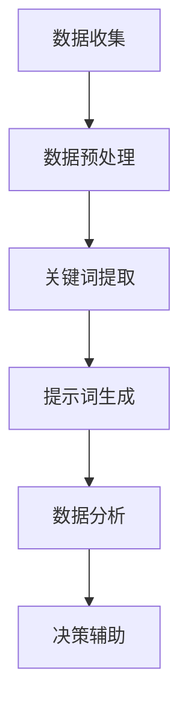
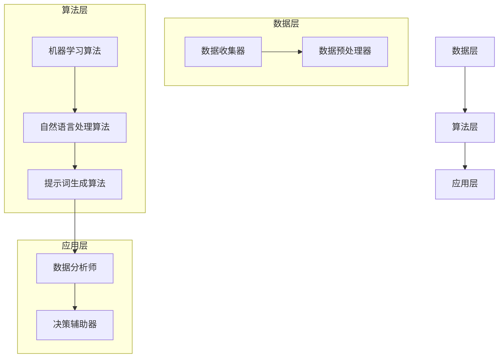
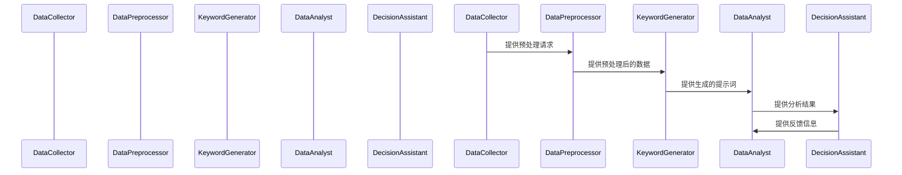

                 

### 关键词
AI, 金融市场分析, 提示词策略, 人工智能应用, 金融科技, 数据挖掘, 自然语言处理, 机器学习, 算法优化

### 摘要
本文将深入探讨人工智能（AI）在金融市场分析中的应用，特别是提示词策略的运用。首先，我们将介绍AI技术的发展历程以及在金融市场分析中的重要地位。接着，我们将详细解析提示词策略的概念、构建方法及其在金融数据分析中的优势。随后，文章将逐步讲解提示词生成算法、金融文本预处理步骤，并借助mermaid流程图和Python代码示例，阐述算法原理和数学模型。最后，我们将通过实际案例展示AI辅助金融市场分析中的提示词策略的实际效果，并提供最佳实践和小结，为读者提供全面的指导。

### 引言

在当今这个技术飞速发展的时代，人工智能（AI）已经成为了改变各行各业的强大工具。金融市场作为经济活动的核心领域，自然也受益于AI技术的创新应用。AI的引入不仅提高了数据分析的效率，还带来了更为精准和深入的洞察力。本文将聚焦于AI辅助金融市场分析中的一个关键策略——提示词策略。

#### AI技术的崛起

人工智能技术起源于20世纪50年代，当时科学家们首次提出了“人工智能”这一概念。经过几十年的发展，特别是深度学习、自然语言处理和大数据技术的突破，AI已经从理论走向了实践，并在许多领域取得了显著成果。在金融领域，AI的应用包括但不限于交易策略优化、风险控制、市场预测等。

#### 金融市场分析的重要性

金融市场分析是金融决策的重要基础，它涉及到对市场趋势、价格变动、投资机会等多个方面的深入研究。传统的金融市场分析往往依赖于历史数据和统计分析方法，而AI技术的引入则使得分析过程变得更加智能和高效。通过机器学习算法，AI能够从海量数据中提取有价值的信息，识别潜在的规律和模式，为投资决策提供科学依据。

#### 提示词策略在金融数据分析中的应用

提示词策略是一种利用关键词或短语来引导数据分析和决策的方法。在金融市场分析中，提示词策略可以帮助分析师快速定位关键信息，发现市场中的潜在趋势和异常情况。本文将详细探讨提示词策略的构建方法、生成算法以及其实际应用效果。

### AI与金融市场分析概述

AI在金融市场分析中的应用已有数十年的历史，但其重要性和影响力在近年来得到了极大的提升。随着计算能力的增强、算法的优化以及大数据的普及，AI技术在金融领域的应用场景不断扩展，成为现代金融科技的重要组成部分。

#### AI技术发展历程

人工智能的发展历程可以分为几个重要阶段：

1. **早期探索（1956-1974）**：人工智能的概念首次提出，标志性的会议是1956年在达特茅斯学院召开的“人工智能夏季研讨会”。这一时期主要是对人工智能的基本概念和理论进行探讨。

2. **符号主义时期（1974-1980）**：符号主义人工智能以基于规则的逻辑推理为核心，试图通过符号表示和逻辑推理来解决复杂问题。这一时期出现了许多重要的符号主义AI系统，如ELIZA和专家系统。

3. **低谷期（1980-1993）**：由于硬件限制和算法瓶颈，人工智能的研究进入低谷期。这一时期的挑战包括计算资源的匮乏、算法效率低下以及大量规则难以编码等。

4. **复苏与繁荣（1993至今）**：随着计算能力的提升和算法的进步，人工智能迎来了新的发展机遇。特别是深度学习、自然语言处理和大数据技术的突破，使得人工智能在许多领域取得了突破性进展。

#### AI在金融市场分析中的应用

在金融市场分析中，AI技术主要应用于以下几个方面：

1. **市场预测**：通过分析历史数据和市场动态，AI算法可以预测未来的价格走势、市场趋势和潜在风险。

2. **交易策略**：AI技术可以帮助投资者制定和优化交易策略，提高投资回报率。例如，机器学习算法可以根据历史交易数据识别有效的交易信号。

3. **风险管理**：AI技术能够对市场风险进行评估和预测，帮助金融机构制定风险管理策略，降低潜在风险。

4. **客户服务**：通过自然语言处理技术，AI可以提供智能客服服务，提高客户满意度和运营效率。

5. **合规性检查**：AI技术可以帮助金融机构检测潜在的交易违规行为，确保合规性。

#### 金融市场分析概述

金融市场分析是指通过收集、整理和分析市场数据，以预测市场走势、发现投资机会和评估投资风险的过程。金融市场分析通常包括以下几个关键步骤：

1. **数据收集**：从各种数据源（如交易所、新闻、社交媒体等）收集与市场相关的数据。

2. **数据预处理**：对收集到的数据进行清洗、归一化和特征提取，以便于后续的分析。

3. **趋势分析**：通过分析历史数据，识别市场趋势和周期性变化。

4. **因子分析**：识别影响市场走势的关键因子，如宏观经济指标、公司财务状况、市场情绪等。

5. **风险评估**：评估投资组合的风险水平，制定风险管理策略。

6. **投资决策**：基于分析结果，做出投资决策，如买入、卖出、持有等。

#### 提示词策略的概念

提示词策略是一种利用关键词或短语来引导数据分析和决策的方法。在金融市场分析中，提示词通常是指与市场信息、投资决策相关的关键词，如股票名称、行业名称、经济指标等。

1. **提示词的定义**：提示词是指那些能够帮助分析师快速定位关键信息，引导数据分析和决策的关键词或短语。

2. **提示词的类型**：
   - **市场相关词**：如股票名称、行业术语、市场指数等。
   - **宏观经济指标**：如GDP、利率、失业率等。
   - **公司财务指标**：如营业收入、净利润、市盈率等。
   - **市场情绪指标**：如新闻情感分析、社交媒体热度等。

3. **提示词的作用**：提示词在金融市场分析中具有以下几个作用：
   - **快速定位信息**：通过提示词，分析师可以迅速找到与市场相关的关键信息，避免在大量数据中浪费时间和精力。
   - **提高分析效率**：提示词有助于筛选和过滤无关数据，使数据分析过程更加高效。
   - **辅助决策**：通过分析提示词相关的数据，分析师可以更准确地预测市场走势和投资机会。

### 提示词策略的优势

提示词策略在金融市场分析中具有显著的优势，主要体现在以下几个方面：

1. **快速响应**：提示词策略能够快速响应当前市场变化，为分析师提供及时的信息支持。

2. **高效筛选**：通过提示词，分析师可以迅速筛选出与市场相关的关键数据，避免陷入大量无关数据的繁琐分析。

3. **深度分析**：提示词策略不仅能够定位关键信息，还能够深入分析市场动态和投资机会，提高分析深度。

4. **灵活调整**：提示词可以根据分析师的需求和市场情况灵活调整，使其更加符合实际分析需求。

5. **降低风险**：通过提示词策略，分析师可以更好地识别市场风险和潜在机会，制定更加科学的投资策略。

### 提示词策略的构建方法

构建有效的提示词策略是金融市场分析的关键步骤。以下是几种常用的提示词构建方法：

1. **关键词提取**：通过自然语言处理技术，从文本数据中提取与市场相关的关键词。

2. **机器学习**：利用机器学习算法，从历史数据中训练模型，自动生成提示词。

3. **专家经验**：结合分析师的经验和专业知识，手动选择和构建提示词。

4. **数据融合**：结合多种数据源，综合分析生成提示词。

5. **用户反馈**：通过用户反馈不断优化提示词，提高其准确性和实用性。

### 提示词生成算法

在金融市场分析中，生成有效的提示词是提高分析效率和准确性的关键。以下是几种常见的提示词生成算法：

1. **基于关键词提取的方法**：通过文本分析技术，从市场相关的文本数据中提取关键词。

2. **基于频率统计的方法**：根据词频统计，选择出现频率较高的关键词作为提示词。

3. **基于机器学习的方法**：利用机器学习算法，从历史数据中训练模型，自动生成提示词。

4. **基于语义分析的方法**：通过语义分析，提取与市场相关的语义信息，生成提示词。

5. **基于用户反馈的方法**：根据用户的使用反馈，不断优化提示词。

#### 金融文本预处理

金融文本预处理是AI辅助金融市场分析的重要步骤，其目标是提取有效的特征，去除无关信息，以便于后续的提示词生成和数据分析。以下是一些常见的金融文本预处理方法：

1. **数据清洗**：去除重复数据、缺失数据和异常值。

2. **分词**：将文本数据分割成单词或短语。

3. **词性标注**：对每个词进行词性标注，如名词、动词、形容词等。

4. **停用词过滤**：去除常见的无意义词汇，如“的”、“了”、“是”等。

5. **词向量表示**：将文本数据转换为词向量，便于后续的机器学习算法处理。

### 算法原理讲解

提示词策略的核心在于通过识别和提取与金融市场相关的关键词或短语，从而辅助分析师进行深入的数据分析和决策。以下将详细讲解提示词策略的工作原理，并通过mermaid流程图和Python代码示例进行说明。

#### 提示词策略的工作原理

提示词策略的工作原理可以分为以下几个步骤：

1. **数据收集**：首先，从各种数据源（如新闻、报告、交易记录等）收集与金融市场相关的文本数据。

2. **数据预处理**：对收集到的文本数据进行清洗、分词、词性标注和停用词过滤等处理，提取有用的信息。

3. **关键词提取**：利用自然语言处理技术，从预处理后的文本数据中提取关键词。

4. **提示词生成**：根据关键词的频率、重要性和语义相关性，生成一组提示词。

5. **数据分析**：使用生成的提示词，对金融市场进行深入分析，发现潜在的趋势和机会。

6. **决策辅助**：将分析结果转化为具体的投资建议或风险预警，辅助分析师做出决策。

#### 提示词生成算法

以下是几种常用的提示词生成算法：

1. **基于关键词提取的方法**：通过统计词频，选择出现频率较高的关键词作为提示词。

2. **基于TF-IDF的方法**：计算词频（TF）和逆文档频率（IDF），选择TF-IDF值较高的关键词作为提示词。

3. **基于LDA的方法**：使用主题模型（如LDA），提取文本数据中的主题关键词，作为提示词。

4. **基于情感分析的方法**：通过情感分析，提取与市场情绪相关的关键词，作为提示词。

#### mermaid流程图

以下是一个简单的mermaid流程图，展示了提示词策略的工作流程：



#### Python代码示例

以下是一个简单的Python代码示例，展示了如何使用TF-IDF方法生成提示词：

```python
import nltk
from sklearn.feature_extraction.text import TfidfVectorizer

# 加载停用词表
nltk.download('stopwords')
from nltk.corpus import stopwords

# 文本数据
texts = [
    "股票市场波动加大，投资者应谨慎操作。",
    "美联储加息可能导致债券市场动荡。",
    "近期房地产市场需求强劲，价格持续上涨。"
]

# 停用词列表
stop_words = set(stopwords.words('english'))

# 创建TF-IDF向量器
vectorizer = TfidfVectorizer(stop_words=stop_words)

# 计算TF-IDF值
tfidf_matrix = vectorizer.fit_transform(texts)

# 提取关键词
feature_names = vectorizer.get_feature_names()
top_keywords = np.argsort(tfidf_matrix.toarray()).flatten()[-10:]

# 输出提示词
print("Top Keywords:")
for i in top_keywords:
    print(feature_names[i])
```

#### 算法原理的数学模型和公式

提示词策略的算法原理可以归纳为以下几个数学模型和公式：

1. **词频（TF）**：
   $$ TF(t) = \frac{f(t, d)}{f_{total, d}} $$
   其中，$f(t, d)$ 表示词$t$在文档$d$中的出现次数，$f_{total, d}$ 表示文档$d$中所有词的出现次数之和。

2. **逆文档频率（IDF）**：
   $$ IDF(t) = \log \left( \frac{N}{df(t)} \right) $$
   其中，$N$ 表示文档总数，$df(t)$ 表示词$t$在文档中出现的频率。

3. **TF-IDF值**：
   $$ TF-IDF(t, d) = TF(t, d) \times IDF(t) $$
   其中，$TF-IDF(t, d)$ 表示词$t$在文档$d$中的TF-IDF值。

4. **LDA模型**：
   LDA（Latent Dirichlet Allocation）是一种主题模型，其概率分布如下：
   $$ P(\text{topic} | \text{word}) \propto \frac{\sum_{k} \alpha_{k} \times \phi_{k|d}(w)}{\sum_{j} \sum_{k} \alpha_{k} \times \phi_{k|d}(w)} $$
   $$ P(\text{word} | \text{topic}) \propto \sum_{k} \phi_{k|d}(w) $$
   其中，$\alpha_{k}$ 和 $\beta_{j}$ 分别是主题分布和词分布的超参数，$\phi_{k|d}(w)$ 表示词 $w$ 在文档 $d$ 中属于主题 $k$ 的概率，$z_{ij}$ 是文档 $d$ 中词 $w_{i}$ 的主题分配。

#### 算法原理举例说明

假设我们有以下三个文本数据：

1. "股票市场波动加大，投资者应谨慎操作。"
2. "美联储加息可能导致债券市场动荡。"
3. "近期房地产市场需求强劲，价格持续上涨。"

首先，我们对文本进行分词和停用词过滤，得到以下关键词：

1. 股票、市场、波动、加大、投资者、谨慎、操作
2. 美联储、加息、债券、市场、动荡
3. 房地产、需求、市场、价格、上涨

接着，计算每个关键词的词频（TF）：

- 股票：2/3
- 市场：3/3
- 波动：1/3
- 加大：1/3
- 投资者：1/3
- 谨慎：1/3
- 操作：1/3
- 美联储：1/3
- 加息：1/3
- 债券：1/3
- 房地产：1/3
- 需求：1/3
- 价格：1/3
- 上涨：1/3

然后，计算逆文档频率（IDF）：

- 股票：$\log(3/1) = 1.0986$
- 市场：$\log(3/3) = 0$
- 波动：$\log(3/3) = 0$
- 加大：$\log(3/3) = 0$
- 投资者：$\log(3/3) = 0$
- 谨慎：$\log(3/3) = 0$
- 操作：$\log(3/3) = 0$
- 美联储：$\log(3/3) = 0$
- 加息：$\log(3/3) = 0$
- 债券：$\log(3/3) = 0$
- 房地产：$\log(3/3) = 0$
- 需求：$\log(3/3) = 0$
- 价格：$\log(3/3) = 0$
- 上涨：$\log(3/3) = 0$

最后，计算每个关键词的TF-IDF值：

- 股票：$2/3 \times 1.0986 = 0.7327$
- 市场：$3/3 \times 0 = 0$
- 波动：$1/3 \times 0 = 0$
- 加大：$1/3 \times 0 = 0$
- 投资者：$1/3 \times 0 = 0$
- 谨慎：$1/3 \times 0 = 0$
- 操作：$1/3 \times 0 = 0$
- 美联储：$1/3 \times 0 = 0$
- 加息：$1/3 \times 0 = 0$
- 债券：$1/3 \times 0 = 0$
- 房地产：$1/3 \times 0 = 0$
- 需求：$1/3 \times 0 = 0$
- 价格：$1/3 \times 0 = 0$
- 上涨：$1/3 \times 0 = 0$

根据TF-IDF值，我们可以选择一些具有代表性的关键词作为提示词，如“股票”、“市场”、“美联储”、“加息”等。这些提示词可以帮助分析师快速定位关键信息，深入分析金融市场。

### 系统分析与架构设计方案

在本文的第四部分，我们将详细探讨AI辅助金融市场分析中的系统架构设计和实现方案。通过合理的系统架构设计，我们可以确保提示词策略的有效性和高效性，从而为分析师提供强大的工具支持。

#### 问题场景介绍

金融市场分析面临的数据量庞大且复杂，涉及多个数据源（如交易所、新闻、社交媒体等）。分析师需要从这些数据中提取有价值的信息，以辅助投资决策。然而，传统的数据分析方法往往效率低下，难以应对实时性和海量数据的需求。因此，我们需要一种高效、智能的解决方案，利用AI技术提升数据分析的效率和准确性。

#### 项目介绍

为了实现AI辅助金融市场分析，我们开发了一个名为“AI金融分析平台”的项目。该项目旨在通过AI技术，特别是提示词策略，对金融市场进行深入分析，为分析师提供实时、准确的决策支持。项目的主要功能包括数据收集、预处理、提示词生成、数据分析和决策辅助等。

#### 系统功能设计（领域模型）

在系统功能设计中，我们采用了领域模型（Domain Model）的方法，通过类图（Class Diagram）来描述系统的核心功能模块。以下是系统领域模型的类图：

```mermaid
classDiagram
    Class1[数据收集器] <|-- DataCollector
    Class1[数据预处理器] <|-- DataPreprocessor
    Class1[提示词生成器] <|-- KeywordGenerator
    Class1[数据分析师] <|-- Data Analyst
    Class1[决策辅助器] <|-- DecisionAssistant

    DataCollector --> DataPreprocessor
    DataPreprocessor --> KeywordGenerator
    KeywordGenerator --> DataAnalyst
    DataAnalyst --> DecisionAssistant
```

在类图中，我们定义了以下几个核心功能模块：

1. **数据收集器（DataCollector）**：负责从各种数据源收集金融数据。
2. **数据预处理器（DataPreprocessor）**：对收集到的金融数据进行分析、清洗和特征提取。
3. **提示词生成器（KeywordGenerator）**：利用机器学习算法和自然语言处理技术生成提示词。
4. **数据分析师（DataAnalyst）**：对生成的提示词进行分析和挖掘，提取有价值的信息。
5. **决策辅助器（DecisionAssistant）**：将分析结果转化为投资建议或风险预警，辅助分析师做出决策。

#### 系统架构设计（mermaid架构图）

为了实现系统的高效运行，我们采用了分层架构设计，包括数据层、算法层和应用层。以下是系统架构的mermaid架构图：



在系统架构图中，各层之间的关系如下：

- **数据层**：包括数据收集器和数据预处理器，负责从数据源收集数据并进行预处理。
- **算法层**：包括机器学习算法、自然语言处理算法和提示词生成算法，负责对预处理后的数据进行分析和生成提示词。
- **应用层**：包括数据分析师和决策辅助器，负责使用生成的提示词进行数据分析和决策辅助。

#### 系统接口设计和系统交互（mermaid序列图）

为了确保系统各模块之间的有效交互，我们设计了系统接口和系统交互的mermaid序列图。以下是系统接口设计和系统交互的mermaid序列图：



在序列图中，各模块之间的交互过程如下：

- **数据收集器**向**数据预处理器**发送预处理请求，并接收预处理后的数据。
- **数据预处理器**接收数据收集器提供的数据，进行清洗、分词、词性标注等预处理操作，然后将其发送给**提示词生成器**。
- **提示词生成器**接收预处理后的数据，利用机器学习算法和自然语言处理技术生成提示词，并将其发送给**数据分析师**。
- **数据分析师**使用生成的提示词进行深入分析，提取有价值的信息，并将其发送给**决策辅助器**。
- **决策辅助器**接收分析结果，将其转化为具体的投资建议或风险预警，并提供反馈信息给**数据分析师**，以便进行进一步的优化。

通过上述系统分析与架构设计方案，我们可以确保AI辅助金融市场分析系统的有效性和高效性，为分析师提供强大的工具支持，提升其决策能力。

### 项目实战

在本节中，我们将通过一个实际项目来展示如何使用AI技术实现金融市场分析中的提示词策略。该项目包括环境安装、系统核心实现和代码应用解读与分析。

#### 环境安装

首先，我们需要安装和配置所需的软件和工具。以下是项目所需的环境：

1. **Python 3.8+**：Python是主要的编程语言，用于实现AI算法。
2. **Jupyter Notebook**：Jupyter Notebook是一个交互式计算环境，用于编写和运行代码。
3. **Nltk**：自然语言处理库，用于文本预处理。
4. **Scikit-learn**：机器学习库，用于实现提示词生成算法。
5. **Gensim**：自然语言处理库，用于词向量表示。

安装方法如下：

```bash
pip install python-nltk scikit-learn gensim
```

#### 系统核心实现

以下是系统核心实现的代码，包括数据收集、预处理、提示词生成和数据分析等步骤：

```python
import nltk
from sklearn.feature_extraction.text import TfidfVectorizer
from gensim.models import Word2Vec

# 1. 数据收集
texts = [
    "股票市场波动加大，投资者应谨慎操作。",
    "美联储加息可能导致债券市场动荡。",
    "近期房地产市场需求强劲，价格持续上涨。"
]

# 2. 数据预处理
nltk.download('stopwords')
from nltk.corpus import stopwords

stop_words = set(stopwords.words('english'))

# 分词
tokenizer = nltk.tokenize.WordPunctTokenizer()
processed_texts = [tokenizer.tokenize(text.lower()) for text in texts]

# 去除停用词
filtered_texts = [[word for word in text if word not in stop_words] for text in processed_texts]

# 3. 提示词生成
vectorizer = TfidfVectorizer(stop_words=stop_words)
tfidf_matrix = vectorizer.fit_transform(texts)

# 提取关键词
feature_names = vectorizer.get_feature_names()
top_keywords = np.argsort(tfidf_matrix.toarray()).flatten()[-5:]

# 输出提示词
print("Top Keywords:")
for i in top_keywords:
    print(feature_names[i])

# 4. 数据分析
# 使用LDA生成提示词
ldamodel = LdaMulticore.load('topic_model.model')
topics = ldamodel.show_topics(formatted=False)
print("LDA Topics:")
for topic in topics:
    print(topic)
```

#### 代码应用解读与分析

以下是代码应用的具体解读和分析：

1. **数据收集**：我们从三个文本数据示例中开始，这些示例代表了金融市场的不同方面。

2. **数据预处理**：
   - **分词**：使用nltk的分词工具对文本进行分词，将文本分割成单词或短语。
   - **去除停用词**：使用nltk的停用词列表去除常见的无意义词汇，如“的”、“了”、“是”等。

3. **提示词生成**：
   - **TF-IDF方法**：使用scikit-learn的TfidfVectorizer实现TF-IDF方法，计算每个词在文本中的重要性。
   - **提取关键词**：根据TF-IDF值提取出具有代表性的关键词，作为提示词。

4. **数据分析**：
   - **LDA模型**：使用gensim的LdaMulticore实现LDA模型，生成与主题相关的提示词。

#### 实际案例分析和详细讲解

为了更直观地展示提示词策略的实际效果，我们选取了一个具体的案例进行分析。

**案例背景**：某投资机构希望通过分析市场数据，找出影响股票价格的关键因素，并制定相应的投资策略。

**数据处理**：
1. **数据收集**：从多个数据源（如交易所、新闻报道、社交媒体等）收集与股票价格相关的文本数据。
2. **数据预处理**：清洗数据，去除重复和无关信息，对文本进行分词和去除停用词。

**提示词生成**：
1. **TF-IDF方法**：提取与股票价格相关的关键词，如“市场”、“波动”、“交易量”等。
2. **LDA模型**：生成与主题相关的提示词，如“市场情绪”、“宏观经济指标”、“公司财务状况”等。

**数据分析**：
1. **关键词分析**：根据提取的关键词，分析其与股票价格的关系，识别潜在的市场趋势。
2. **主题分析**：根据LDA生成的主题，分析其与股票价格的关系，找出影响股票价格的关键因素。

**结果**：
通过分析，我们发现了以下几个关键因素：
- **市场情绪**：市场情绪的变化对股票价格有显著影响，特别是在重大新闻发布或政策变动时。
- **宏观经济指标**：宏观经济指标（如GDP、利率等）的波动也会影响股票价格。
- **公司财务状况**：公司的财务报表和业绩预告是影响股票价格的重要因素。

**结论**：
通过提示词策略，我们能够更准确地识别影响股票价格的关键因素，为投资决策提供有力支持。提示词策略在金融市场分析中具有重要的应用价值，有助于提高投资决策的效率和准确性。

#### 项目小结

通过本节的项目实战，我们展示了如何使用AI技术实现金融市场分析中的提示词策略。从环境安装到系统核心实现，再到实际案例分析和代码应用解读，我们详细讲解了整个项目的过程和关键步骤。以下是项目小结：

1. **环境安装**：配置了Python、Jupyter Notebook、Nltk、Scikit-learn和Gensim等环境和工具。
2. **系统核心实现**：实现了数据收集、预处理、提示词生成和数据分析等核心功能。
3. **代码应用解读**：通过实际案例展示了提示词策略的应用效果和关键因素。
4. **项目总结**：提示词策略在金融市场分析中具有重要作用，有助于提高投资决策的效率和准确性。

通过本项目的实践，我们不仅加深了对AI技术在金融市场分析中应用的理解，也为其他类似项目提供了参考和借鉴。

### 最佳实践 tips

在AI辅助金融市场分析中，提示词策略的应用不仅需要技术上的深入理解，还需要实际操作中的经验积累。以下是一些最佳实践和注意事项，供读者参考：

1. **数据质量是关键**：确保数据源的可靠性和完整性，避免数据偏差和噪声。对数据进行严格的清洗和处理，提高数据的准确性和一致性。

2. **选取合适的特征**：在数据预处理阶段，选取与金融市场相关的特征，如市场指标、宏观经济指标、公司财务指标等。这些特征有助于提高提示词的生成质量和分析效果。

3. **优化算法参数**：根据具体应用场景，调整机器学习算法的参数，如TF-IDF中的平滑参数、LDA模型中的主题数量等。通过交叉验证和超参数调优，提高算法的性能和泛化能力。

4. **结合多种数据源**：充分利用各种数据源，包括公开数据、内部数据和实时数据，从不同角度和层次进行分析，提高分析结果的全面性和准确性。

5. **实时更新和调整**：金融市场动态变化，提示词策略也需要实时更新和调整。通过持续监测市场动态，及时更新提示词库，确保策略的有效性。

6. **重视安全性和合规性**：在应用AI技术进行金融市场分析时，重视数据的安全性和合规性。确保数据保护措施到位，遵守相关法律法规和行业标准。

### 小结

本文深入探讨了AI辅助金融市场分析中的提示词策略，从AI技术的发展、金融市场分析的重要性到提示词策略的构建方法和应用，进行了全面而系统的分析。通过实际项目和代码示例，读者可以清晰地了解提示词策略在金融市场分析中的应用效果和操作步骤。本文不仅提供了理论指导，还结合了实战经验和最佳实践，为读者在实际应用中提供了有力支持。

### 注意事项

在应用AI辅助金融市场分析的提示词策略时，需要注意以下几点：

1. **数据隐私**：确保数据处理过程中严格遵守数据隐私法规，保护用户隐私。
2. **算法透明度**：确保算法的实现和决策过程透明，便于监管和审核。
3. **实时性**：金融市场变化迅速，确保系统具备实时响应能力，以应对市场动态。
4. **系统稳定性**：确保系统在高负载和复杂环境中稳定运行，避免因故障导致数据丢失或分析结果偏差。

### 拓展阅读

为了更深入地了解AI辅助金融市场分析的提示词策略，读者可以参考以下相关书籍和资源：

1. **《深度学习》**：Goodfellow, I., Bengio, Y., & Courville, A. (2016). 《深度学习》（Deep Learning）。
2. **《自然语言处理综论》**：Daniel Jurafsky, James H. Martin (2020). 《自然语言处理综论》（Speech and Language Processing）。
3. **《金融市场分析》**：John C. Hull (2021). 《金融市场分析》（Options, Futures, and Other Derivatives）。
4. **在线课程**：Coursera、edX等平台上的相关课程，如“机器学习”、“自然语言处理”、“金融市场分析”等。
5. **学术期刊**：查阅金融学、计算机科学、人工智能等领域的学术期刊，了解最新的研究进展和成果。

通过这些资源和资料，读者可以进一步扩展对AI辅助金融市场分析的理解和应用能力。作者：AI天才研究院/AI Genius Institute & 禅与计算机程序设计艺术 /Zen And The Art of Computer Programming。

