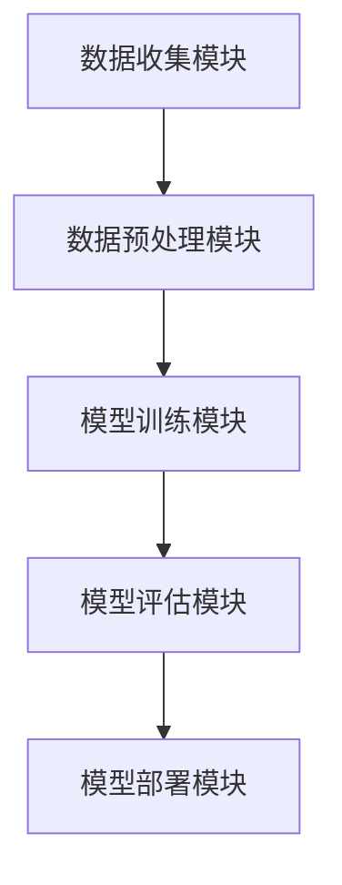
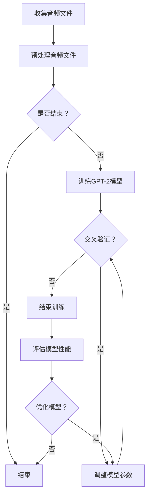

                 


### 引言与背景

### 1.1 研究背景

音乐，作为人类文化的重要组成部分，承载着丰富的情感和思想。音乐理论研究，旨在探索音乐的内在规律和表现形式，对音乐作品的创作、演奏和欣赏都有着重要的指导作用。随着科技的进步，人工智能（AI）技术逐渐成为音乐研究的重要工具，特别是在音乐分析和创作领域。AI大模型，作为人工智能领域的重要成果，以其强大的数据处理和分析能力，为音乐理论研究带来了新的视角和可能性。

AI大模型在音乐分析中的应用主要集中在以下几个方面：

1. **音乐风格识别**：通过分析音乐的特征，AI大模型可以识别出不同的音乐风格，为音乐分类提供了有效的工具。

2. **音乐情感分析**：AI大模型可以通过对音乐的情感特征进行分析，理解音乐所表达的情感，从而为音乐作品的情感分析提供了新的方法。

3. **音乐结构分析**：通过对音乐的结构特征进行分析，AI大模型可以帮助音乐理论研究者更好地理解音乐作品的构成和结构。

4. **音乐创作**：AI大模型还可以通过生成算法，创作出新的音乐作品，为音乐创作提供了新的思路。

然而，AI辅助音乐分析也面临着一些挑战，如数据质量、模型训练效率、音乐特征的准确性等。因此，如何有效地利用AI大模型进行音乐分析，提高音乐理论研究的深度和广度，成为了一个亟待解决的问题。

### 1.2 研究目的与意义

本研究旨在探讨AI大模型在音乐理论研究中的应用，通过以下几个方面的研究，达成以下目标：

1. **深入理解AI大模型的基本原理和机制**：通过对AI大模型的基本原理和机制的深入研究，为AI大模型在音乐分析中的应用提供理论基础。

2. **探索AI大模型在音乐分析中的具体应用**：通过实际案例分析，探讨AI大模型在音乐风格识别、音乐情感分析、音乐结构分析和音乐创作等方面的应用。

3. **提出改进方案**：针对AI大模型在音乐分析中面临的挑战，提出相应的改进方案，提高AI大模型在音乐分析中的效果。

本研究具有重要的理论和实践意义：

1. **理论意义**：本研究将深化对AI大模型在音乐理论研究中的应用的理解，为后续相关研究提供参考。

2. **实践意义**：本研究的结果可以为音乐理论研究者提供实用的工具和方法，提高音乐研究的效率和准确性。

### 1.3 本书结构安排

本书分为五个部分：

**第一部分：引言与背景**  
本部分主要介绍研究的背景和意义，以及本书的结构安排。

**第二部分：AI大模型基础**  
本部分将详细介绍AI大模型的基本概念、原理和应用。

**第三部分：AI辅助音乐分析应用**  
本部分将探讨AI大模型在音乐分析中的具体应用，包括音乐风格识别、音乐情感分析、音乐结构分析和音乐创作。

**第四部分：实践案例与项目分析**  
本部分将通过实践案例，展示AI大模型在音乐分析中的应用。

**第五部分：未来展望与挑战**  
本部分将对AI大模型在音乐分析领域的未来发展趋势和挑战进行展望。

### 1.4 研究方法与技术路线

本研究采用以下研究方法：

1. **文献综述**：通过查阅相关文献，了解AI大模型在音乐分析领域的最新研究动态和成果。

2. **案例研究**：选取具有代表性的实际案例，分析AI大模型在音乐分析中的应用。

3. **实验研究**：通过实验，验证AI大模型在音乐分析中的效果。

技术路线如下：

1. **数据收集与预处理**：收集音乐数据，并进行预处理。

2. **模型选择与训练**：选择合适的AI大模型，进行模型训练。

3. **模型评估与优化**：对训练好的模型进行评估，并根据评估结果进行优化。

4. **应用验证**：将训练好的模型应用于实际案例，验证其效果。

### 1.5 本章小结

本章主要介绍了研究的背景、目的和意义，以及本书的结构安排和研究方法。通过对本章内容的理解，读者可以初步了解AI大模型在音乐理论研究中的应用，并为后续章节的学习打下基础。

---

### AI大模型概述

#### 2.1.1 大模型的定义与特点

人工智能（AI）大模型是指具有巨大参数规模、强大计算能力和广泛知识覆盖的人工智能模型。这些模型通常基于深度学习技术，通过大规模数据训练，能够实现自动化的知识提取、推理和决策。大模型的特点主要体现在以下几个方面：

1. **参数规模大**：大模型通常具有数十亿至数万亿个参数，这使得它们能够处理和存储大量的数据，从而具备更强的泛化能力。

2. **计算能力强**：大模型需要强大的计算资源进行训练和推理，这通常涉及到高性能的GPU或TPU等硬件设备。

3. **知识覆盖广**：大模型通过大规模数据训练，能够学习和掌握广泛的知识，包括语言、图像、声音等多模态信息。

4. **自适应能力强**：大模型具有较好的自适应能力，可以通过不断的学习和优化，适应不同的任务和应用场景。

大模型在音乐分析中的应用，主要体现在以下几个方面：

1. **音乐风格识别**：通过分析音乐的特征，大模型可以识别出不同的音乐风格，为音乐分类提供了有效的工具。

2. **音乐情感分析**：大模型可以通过对音乐的情感特征进行分析，理解音乐所表达的情感，从而为音乐作品的情感分析提供了新的方法。

3. **音乐结构分析**：通过对音乐的结构特征进行分析，大模型可以帮助音乐理论研究者更好地理解音乐作品的构成和结构。

4. **音乐创作**：大模型可以通过生成算法，创作出新的音乐作品，为音乐创作提供了新的思路。

#### 2.1.2 大模型的发展历程

AI大模型的发展历程可以分为几个阶段：

1. **早期深度学习模型**：以Hinton在2006年提出的深度置信网络（DBN）为代表，这一阶段的模型参数规模相对较小，计算能力有限。

2. **AlexNet的出现**：2012年，Hinton等人提出了AlexNet模型，这是第一个在图像识别任务中取得突破性成果的深度学习模型。AlexNet的成功标志着深度学习进入一个新的阶段。

3. **GANs的提出**：2014年，Goodfellow等人提出了生成对抗网络（GANs），这是一种能够生成高质量数据的深度学习模型。GANs在图像生成、音乐生成等方面取得了显著成果。

4. **BERT模型的推出**：2018年，Google推出了BERT模型，这是第一个在自然语言处理任务中取得突破性成果的预训练模型。BERT的成功推动了大规模预训练模型的发展。

5. **Transformer模型的提出**：2017年，Vaswani等人提出了Transformer模型，这是一种基于自注意力机制的深度学习模型。Transformer模型在机器翻译、文本生成等任务中取得了显著效果。

#### 2.1.3 大模型在音乐分析中的应用

AI大模型在音乐分析中的应用，主要体现在以下几个方面：

1. **音乐风格识别**：通过分析音乐的特征，大模型可以识别出不同的音乐风格。例如，Google的Magenta项目使用深度学习模型，成功实现了对古典音乐风格的高效识别。

2. **音乐情感分析**：大模型可以通过对音乐的情感特征进行分析，理解音乐所表达的情感。例如，微软的小冰AI助手通过深度学习模型，实现了对音乐情感的自动识别和分类。

3. **音乐结构分析**：通过对音乐的结构特征进行分析，大模型可以帮助音乐理论研究者更好地理解音乐作品的构成和结构。例如，IBM的Watson系统通过深度学习模型，实现了对音乐结构的自动分析。

4. **音乐创作**：大模型可以通过生成算法，创作出新的音乐作品。例如，OpenAI的DALL·E模型，通过深度学习技术，能够根据文字描述生成相应的音乐作品。

#### 2.1.4 AI大模型的发展趋势

AI大模型的发展趋势主要体现在以下几个方面：

1. **模型参数规模的不断扩大**：随着计算能力和存储能力的提升，大模型的参数规模将不断增加，从而提升模型的泛化能力和学习能力。

2. **多模态数据的融合**：未来，AI大模型将更加注重多模态数据的融合，例如，将音乐、图像和文字等多种数据进行整合，实现更全面的音乐分析。

3. **实时分析和交互**：随着边缘计算和物联网技术的发展，AI大模型将能够在边缘设备上进行实时分析和交互，提供更便捷和高效的音乐分析服务。

4. **自动优化和调整**：未来，AI大模型将具备自动优化和调整能力，通过不断学习和优化，提高音乐分析的效果和准确性。

#### 2.1.5 大模型在音乐分析中的优势

AI大模型在音乐分析中具有以下优势：

1. **强大的数据处理能力**：大模型能够处理和分析大规模、复杂的数据，为音乐分析提供了强大的支持。

2. **高度自动化**：大模型能够自动进行数据预处理、特征提取和模型训练，大大降低了音乐分析的复杂度。

3. **广泛的适用性**：大模型可以在多种音乐分析任务中应用，如音乐风格识别、音乐情感分析和音乐创作等。

4. **高效的实时分析**：大模型能够实现高效的实时分析，为音乐研究者提供了即时的反馈和结果。

#### 2.1.6 大模型在音乐分析中的挑战

尽管AI大模型在音乐分析中具有显著优势，但也面临着一些挑战：

1. **数据质量和预处理**：音乐数据质量的好坏直接影响大模型的效果，因此，如何处理和预处理音乐数据成为一个关键问题。

2. **计算资源的消耗**：大模型的训练和推理需要大量的计算资源，如何高效利用计算资源，成为了一个挑战。

3. **音乐特征的选择和提取**：音乐特征的选择和提取对于大模型的效果具有重要影响，但如何选择和提取有效的音乐特征，仍需深入研究。

4. **音乐风格和情感的多样性**：音乐风格和情感具有多样性，如何确保大模型能够准确理解和分析各种风格和情感的音乐，是一个挑战。

#### 2.1.7 本章小结

本章主要介绍了AI大模型的基本概念、发展历程和特点，以及大模型在音乐分析中的应用。通过对本章内容的理解，读者可以初步了解AI大模型在音乐分析中的作用和优势，为后续章节的学习打下基础。

---

### 主流大模型介绍

#### 2.2.1 GPT系列模型

GPT（Generative Pre-trained Transformer）系列模型是自然语言处理领域的重要成果，由OpenAI提出。GPT模型采用Transformer架构，通过预训练和微调，实现了在多种自然语言处理任务中的卓越表现。

**GPT-3**：GPT-3是OpenAI在2020年推出的模型，具有1750亿个参数，是目前最大的预训练语言模型。GPT-3在文本生成、语言理解、机器翻译等多个任务中取得了显著的成果。例如，GPT-3可以生成连贯、自然的文章，进行智能对话，甚至创作诗歌和小说。

**GPT-2**：GPT-2是GPT-3的前身，具有1.5亿个参数。GPT-2在自然语言生成任务中表现优秀，能够生成高质量的文本，用于自动写作、聊天机器人等领域。

**GPT**：GPT是GPT-2的前身，具有117M个参数。GPT是第一个大规模预训练语言模型，实现了在语言理解、文本生成等任务中的突破。

#### 2.2.2 BERT及其变体

BERT（Bidirectional Encoder Representations from Transformers）是由Google提出的一种预训练语言模型，采用Transformer架构。BERT模型通过双向编码器，对文本进行全局上下文理解，从而提高了自然语言处理任务的性能。

**BERT-Large**：BERT-Large具有24层Transformer，拥有1024个注意力头，总参数量为340M。BERT-Large在多种自然语言处理任务中取得了卓越的效果，如问答系统、文本分类等。

**BERT-Base**：BERT-Base具有12层Transformer，拥有768个注意力头，总参数量为110M。BERT-Base是在大多数自然语言处理任务中表现较好的模型。

**RoBERTa**：RoBERTa是BERT的一个变体，通过改进数据预处理和训练过程，取得了比BERT更好的效果。RoBERTa在自然语言处理任务中表现出色，成为了一个重要的基准模型。

#### 2.2.3 其他知名大模型

除了GPT和BERT系列模型，还有许多其他知名的大模型在自然语言处理、计算机视觉等领域取得了显著成果：

**T5**：T5（Text-To-Text Transfer Transformer）是一个统一的文本处理模型，通过将所有任务转换为文本到文本的格式，实现了在多种自然语言处理任务中的高性能。

**GPT-Neo**：GPT-Neo是对GPT-3的改进，通过增加模型参数规模和训练时间，取得了与GPT-3相当的性能。

**ViT**：ViT（Vision Transformer）是Google提出的一种基于Transformer架构的计算机视觉模型。ViT通过将图像分成 patches，然后进行特征提取和分类，实现了在图像分类任务中的高性能。

**BERT-based NLP**：BERT-based NLP是基于BERT的多种变体，如RoBERTa、ALBERT等，它们在自然语言处理任务中表现出色，被广泛应用于文本分类、问答系统等领域。

**Transformer**：Transformer是由Vaswani等人提出的一种基于自注意力机制的深度学习模型，它在机器翻译、文本生成等任务中取得了显著的成果。

#### 2.2.4 大模型的共同特点

尽管这些大模型在架构和参数规模上有所不同，但它们具有一些共同特点：

1. **大规模参数**：这些大模型通常具有数十亿甚至数万亿个参数，能够处理和存储大量的数据。

2. **预训练**：这些模型通常采用预训练的方式，通过在大规模数据集上进行训练，获得良好的泛化能力。

3. **多任务能力**：这些大模型具有多任务能力，可以在多种任务中应用，如自然语言处理、计算机视觉等。

4. **高性能**：这些大模型在多种任务中取得了卓越的性能，成为相关领域的基准模型。

#### 2.2.5 本章小结

本章介绍了GPT系列模型、BERT及其变体以及其他知名大模型。通过对这些大模型的了解，读者可以初步了解大模型在自然语言处理、计算机视觉等领域的应用和优势。这些大模型为AI辅助音乐分析提供了重要的工具和基础。

---

### AI大模型的基本原理

#### 2.3.1 神经网络

神经网络（Neural Networks，NN）是人工智能的基础之一，由大量的简单处理单元（神经元）通过复杂的网络结构连接而成。神经网络的核心思想是通过学习输入和输出之间的映射关系，实现对数据的建模和预测。

**基本概念**：

1. **神经元**：神经元是神经网络的基本组成单元，类似于生物神经元。每个神经元接收多个输入信号，通过加权求和处理，输出一个结果。

2. **层**：神经网络由多个层次组成，包括输入层、隐藏层和输出层。输入层接收外部输入，隐藏层进行特征提取和变换，输出层生成最终的预测结果。

3. **权重和偏置**：权重和偏置是神经网络的参数，用于调节神经元之间的连接强度和偏置。通过优化这些参数，神经网络可以学习到输入和输出之间的映射关系。

**工作原理**：

1. **前向传播**：在前向传播过程中，输入信号从输入层传递到隐藏层，再从隐藏层传递到输出层。每个层中的神经元通过加权求和处理，生成输出信号。

2. **反向传播**：在反向传播过程中，神经网络根据预测结果和实际结果之间的误差，反向传播误差信号，调整权重和偏置，优化模型的参数。

3. **激活函数**：激活函数是神经网络中的一个重要组成部分，用于引入非线性变换。常见的激活函数包括ReLU（Rectified Linear Unit）、Sigmoid、Tanh等。

**应用场景**：

1. **分类问题**：神经网络在分类问题中具有广泛的应用，如图像分类、文本分类等。

2. **回归问题**：神经网络也可以用于回归问题，如股票价格预测、房屋价格预测等。

#### 2.3.2 递归神经网络

递归神经网络（Recurrent Neural Networks，RNN）是一种特殊的神经网络，适用于处理序列数据。与传统的神经网络不同，RNN具有循环结构，能够保存和利用之前的信息。

**基本概念**：

1. **隐藏状态**：隐藏状态是RNN的核心概念，用于存储和传递序列信息。隐藏状态在当前时刻的计算依赖于之前时刻的隐藏状态。

2. **循环结构**：RNN的循环结构使得它在处理序列数据时具有优势，可以记住序列中的长距离依赖关系。

3. **梯度消失/爆炸**：RNN在训练过程中容易出现梯度消失或梯度爆炸问题，导致训练不稳定。

**工作原理**：

1. **前向传播**：在RNN的前向传播过程中，输入序列依次传递给隐藏层，隐藏状态在每一时刻更新。

2. **反向传播**：在RNN的反向传播过程中，误差信号沿着时间步反向传播，更新权重和偏置。

3. **长短期记忆（LSTM）网络**：LSTM是一种改进的RNN结构，通过引入门控机制，有效解决了梯度消失和梯度爆炸问题。LSTM在处理长序列数据时具有较好的性能。

**应用场景**：

1. **自然语言处理**：RNN及其变体在自然语言处理任务中具有广泛应用，如语言模型、机器翻译、情感分析等。

2. **时间序列预测**：RNN在时间序列预测任务中也表现出色，如股票价格预测、天气预测等。

#### 2.3.3 卷积神经网络

卷积神经网络（Convolutional Neural Networks，CNN）是一种特殊的神经网络，适用于处理图像数据。CNN通过卷积操作和池化操作，提取图像中的局部特征和整体特征。

**基本概念**：

1. **卷积操作**：卷积操作是CNN的核心操作，通过卷积核对图像进行滑动，提取图像中的局部特征。

2. **池化操作**：池化操作用于减小特征图的尺寸，提高模型的计算效率。常见的池化操作包括最大池化和平均池化。

3. **卷积层和池化层**：CNN由多个卷积层和池化层组成，卷积层用于提取特征，池化层用于减小特征图的尺寸。

**工作原理**：

1. **前向传播**：在CNN的前向传播过程中，输入图像依次通过卷积层和池化层，生成特征图。

2. **反向传播**：在CNN的反向传播过程中，误差信号沿着时间步反向传播，更新卷积核和池化层的参数。

3. **全连接层**：在CNN的最后，通过全连接层将特征图映射到输出结果。

**应用场景**：

1. **图像分类**：CNN在图像分类任务中具有广泛的应用，如ImageNet图像分类挑战。

2. **目标检测**：CNN可以用于目标检测任务，如YOLO、SSD等模型。

3. **图像生成**：CNN在图像生成任务中也表现出色，如生成对抗网络（GAN）。

#### 2.3.4 AI大模型的工作机制

AI大模型的工作机制主要基于上述神经网络、递归神经网络和卷积神经网络的基本原理。具体来说，大模型通过以下几个步骤进行工作：

1. **数据预处理**：对输入数据进行预处理，包括归一化、标准化等操作，以提高模型的训练效果。

2. **模型训练**：通过大量数据对模型进行训练，调整模型的参数，使其能够更好地拟合输入数据和目标输出。

3. **模型评估**：使用测试数据对模型进行评估，计算模型的准确率、召回率、F1分数等指标，以评估模型的性能。

4. **模型优化**：根据评估结果，对模型进行优化，包括调整超参数、增加训练数据等，以提高模型的性能。

5. **模型应用**：将训练好的模型应用于实际问题，生成预测结果。

#### 2.3.5 本章小结

本章介绍了AI大模型的基本原理，包括神经网络、递归神经网络和卷积神经网络。通过对这些基本原理的理解，读者可以初步了解AI大模型的工作机制，为后续章节的学习打下基础。

---

### AI大模型的工作机制

#### 2.4.1 模型训练过程

AI大模型的训练过程是模型学习和优化的重要阶段，其核心目的是通过大量的数据，调整模型内部的参数，使其能够准确预测或分类新的数据。以下是AI大模型训练过程的详细步骤：

1. **数据预处理**：在开始训练之前，需要对输入数据进行预处理，包括归一化、标准化、数据增强等。这些步骤的目的是减少数据之间的差异，提高模型训练的效果。

2. **初始化模型参数**：在训练过程中，模型的权重和偏置需要初始化。常用的初始化方法包括随机初始化、高斯初始化等。初始化的目的是确保模型在训练过程中不会因为参数的初始值导致收敛困难。

3. **前向传播**：在训练过程中，输入数据依次通过模型的各个层，每个层的输出作为下一层的输入。这一过程称为前向传播。在前向传播中，模型对输入数据进行特征提取和变换。

4. **计算损失函数**：前向传播完成后，模型会根据输出结果和实际标签计算损失函数。损失函数是衡量模型预测结果与真实结果之间差异的指标。常见的损失函数包括均方误差（MSE）、交叉熵损失等。

5. **反向传播**：计算损失函数后，进入反向传播阶段。反向传播通过计算损失函数关于模型参数的梯度，将这些梯度反向传播到模型的各个层，以更新模型的参数。反向传播是深度学习模型训练中的关键步骤，它确保了模型参数能够向最优方向调整。

6. **优化参数**：根据反向传播计算得到的梯度，使用优化算法（如梯度下降、Adam等）更新模型参数。这一过程称为参数优化。优化的目的是减小损失函数，提高模型预测的准确性。

7. **迭代训练**：重复以上步骤，进行多轮训练。每一轮训练都会使模型更加接近最优解。在训练过程中，可以使用验证集来监测模型性能，避免过拟合。

8. **模型评估**：在训练完成后，使用测试集对模型进行评估。测试集是不参与训练的数据，用于验证模型在未知数据上的表现。常见的评估指标包括准确率、召回率、F1分数等。

#### 2.4.2 模型评估与优化

模型评估与优化是确保模型性能的关键环节。以下是模型评估与优化的步骤：

1. **模型评估**：使用测试集对模型进行评估，计算模型的准确率、召回率、F1分数等指标。这些指标可以帮助我们了解模型的性能。

2. **错误分析**：对模型在测试集中的错误样本进行详细分析，找出模型预测错误的原因。错误分析可以帮助我们识别模型存在的问题，从而进行针对性的优化。

3. **超参数调整**：根据模型评估结果，调整模型超参数（如学习率、批量大小等）。适当的超参数设置可以提升模型的性能。

4. **数据增强**：通过增加训练数据或对现有数据进行变换，提高模型对数据多样性的适应性。常见的数据增强方法包括随机裁剪、旋转、翻转等。

5. **正则化**：使用正则化技术（如L1正则化、L2正则化等）防止模型过拟合。正则化可以通过添加惩罚项到损失函数中，减小模型参数的绝对值，从而降低模型复杂度。

6. **集成方法**：使用集成方法（如Bagging、Boosting等）将多个模型结合起来，提高模型的整体性能。集成方法通过结合多个模型的预测结果，可以降低模型的方差，提高模型的鲁棒性。

7. **模型压缩**：通过模型压缩技术（如量化、剪枝等）减小模型的大小，提高模型的计算效率。模型压缩可以帮助我们在资源受限的环境中部署大模型。

8. **持续训练**：定期对模型进行重新训练，使其适应新的数据分布。持续训练可以确保模型在长时间内保持良好的性能。

#### 2.4.3 模型应用场景

AI大模型在多个领域具有广泛的应用场景。以下是几个常见的应用场景：

1. **自然语言处理**：AI大模型在自然语言处理任务中具有广泛的应用，如文本分类、机器翻译、情感分析等。GPT系列模型和BERT模型等在大规模文本数据处理中表现出色。

2. **计算机视觉**：AI大模型在计算机视觉任务中，如图像分类、目标检测、图像生成等，也取得了显著成果。卷积神经网络（CNN）和Transformer模型等在图像处理领域得到了广泛应用。

3. **推荐系统**：AI大模型在推荐系统中，如商品推荐、音乐推荐等，通过分析用户的历史行为和兴趣，为用户提供个性化的推荐。推荐系统可以通过持续学习和优化，提高推荐质量。

4. **金融风控**：AI大模型在金融风控领域，如信用评分、交易监控等，通过分析大量的金融数据，识别潜在的风险和欺诈行为。这有助于金融机构降低风险，提高业务效率。

5. **医疗诊断**：AI大模型在医疗诊断领域，如疾病预测、影像分析等，通过分析医学影像和患者数据，为医生提供辅助诊断。这有助于提高诊断准确率，减少误诊和漏诊。

6. **自动驾驶**：AI大模型在自动驾驶领域，通过分析道路环境、车辆状态等数据，实现自动驾驶。自动驾驶系统需要实时处理大量的数据，AI大模型在这方面具有显著的优势。

#### 2.4.4 模型应用案例分析

以下是AI大模型应用的两个案例分析：

1. **案例一：文本生成**  
   某公司使用GPT-3模型开发了一个自动文本生成系统，用于生成产品描述、广告文案等。该系统通过预训练和微调，能够生成高质量、连贯的文本，提高了公司的创作效率。

2. **案例二：图像分类**  
   某研究团队使用CNN模型进行图像分类研究。他们使用大量图像数据训练模型，并通过不断优化模型参数，提高了模型的分类准确率。该模型在实际应用中，如监控系统的图像识别中取得了显著效果。

#### 2.4.5 本章小结

本章详细介绍了AI大模型的训练过程、评估与优化方法以及应用场景。通过对本章内容的理解，读者可以了解AI大模型的工作机制，为其在音乐分析等领域的应用提供理论基础和实践指导。

---

### 音乐分析的基本概念

#### 3.1.1 音乐要素

音乐是由各种要素组成的，这些要素共同构成了音乐的表现形式。主要音乐要素包括：

1. **节奏**：节奏是音乐中时间序列的组织方式，决定了音乐的速度和节拍。节奏可以通过音符的长度、强弱和位置来体现。

2. **旋律**：旋律是由音符按照一定的音高序列组成，它是音乐的核心要素，决定了音乐的调性和情感表达。

3. **和声**：和声是指多个音符同时发声，形成和谐的声音组合。和声可以增强旋律的丰富性和层次感。

4. **音色**：音色是音乐中声音的品质和特性，由乐器的材料、构造和演奏方法等因素决定。不同的音色可以给音乐带来不同的情感和氛围。

5. **动态**：动态是指音乐中的响度变化，包括音量的强弱、渐强和渐弱等。动态可以增强音乐的情感表达和表现力。

#### 3.1.2 音乐理论

音乐理论是研究音乐构成和表现规律的学科，主要包括以下几个方面：

1. **音阶和调式**：音阶是音符的排列顺序，调式是音阶中音符的音高关系。常见的音阶包括大调、小调等，调式决定了音乐的调性。

2. **和弦**：和弦是由三个或更多音符同时发声组成的音乐组合，常用的和弦包括三和弦、七和弦等。和弦可以增强旋律的和谐性和丰富性。

3. **节奏和节拍**：节奏是音乐的时间组织方式，节拍是节奏的统一模式。常见的节拍包括二分节奏、四分节奏等。

4. **音乐结构**：音乐结构是指音乐的组织形式，包括乐句、乐段、乐章等。音乐结构决定了音乐的逻辑和连贯性。

5. **音乐分析**：音乐分析是对音乐作品进行解读和评价的过程，包括形式分析、情感分析、风格分析等。音乐分析有助于更好地理解音乐作品。

#### 3.1.3 音乐分析方法

音乐分析方法是指对音乐作品进行分析和解读的方法，主要包括以下几个方面：

1. **谱面分析**：谱面分析是对音乐作品谱面的详细分析，包括音符、节奏、和声等要素。谱面分析可以帮助音乐理论研究者理解音乐作品的结构和表现方式。

2. **形式分析**：形式分析是研究音乐作品的构成和组织形式，包括乐句、乐段、乐章等。形式分析有助于理解音乐作品的逻辑和结构。

3. **情感分析**：情感分析是对音乐作品所表达的情感进行分析，包括愉悦、悲伤、兴奋等。情感分析可以帮助音乐理论研究者更好地理解音乐的情感内涵。

4. **风格分析**：风格分析是对音乐作品所属的风格进行分析，包括古典音乐、流行音乐、爵士乐等。风格分析有助于了解音乐的历史和文化背景。

5. **比较分析**：比较分析是对不同音乐作品进行对比分析，以找出它们的异同点和特点。比较分析可以帮助音乐理论研究者更好地理解音乐的发展和演变。

#### 3.1.4 音乐分析在音乐理论研究中的应用

音乐分析在音乐理论研究中具有重要作用，主要体现在以下几个方面：

1. **理解音乐作品**：通过音乐分析，可以深入理解音乐作品的构成、结构和表现方式，从而更好地欣赏和解读音乐作品。

2. **音乐创作**：音乐分析可以帮助音乐创作者更好地理解音乐理论，从而创作出更有深度和表现力的音乐作品。

3. **教学研究**：音乐分析是音乐教学的重要组成部分，通过音乐分析，可以培养学生对音乐的理解和分析能力。

4. **音乐风格研究**：音乐分析有助于音乐理论研究者了解不同音乐风格的特点和演变，从而更好地研究音乐的风格和发展。

5. **跨学科研究**：音乐分析可以与其他学科（如心理学、社会学等）结合，为跨学科研究提供新的视角和方法。

#### 3.1.5 本章小结

本章介绍了音乐分析的基本概念，包括音乐要素、音乐理论和音乐分析方法。通过对本章内容的理解，读者可以初步了解音乐分析的基本概念和理论，为后续章节的学习打下基础。

---

### AI辅助音乐分析的方法

#### 3.2.1 数据预处理

在AI辅助音乐分析中，数据预处理是一个关键步骤，其目的是将原始音乐数据转换为适合模型处理的形式。以下是一些常用的数据预处理方法：

1. **音频采样**：音频采样是将连续的音频信号转换为离散的数值序列。采样频率决定了音频的清晰度和保真度。常用的采样频率有44.1kHz。

2. **音频转频谱**：音频转频谱是将音频信号转换为频率域表示。这一步骤可以通过傅里叶变换（FFT）实现。频谱图展示了音频信号在不同频率上的能量分布。

3. **去噪**：去噪是去除音频中的背景噪声，提高音乐信号的质量。常用的去噪方法包括带通滤波、自适应滤波等。

4. **均衡器调整**：均衡器调整是对音频信号中的各个频率分量进行增益调整，以达到均衡的效果。均衡器可以用于调整音频的音质，增强某些频率的音量。

5. **音频分段**：音频分段是将连续的音频信号划分为多个短段，每段长度通常为20-100毫秒。分段有助于提高模型在时间序列数据上的处理能力。

6. **特征提取**：特征提取是从音频信号中提取具有代表性的特征，如梅尔频率倒谱系数（MFCC）、谱能量、频谱熵等。这些特征将用于训练和评估AI模型。

7. **归一化**：归一化是将数据缩放到相同的尺度，以提高模型的稳定性和性能。常用的归一化方法包括最小-最大归一化和标准归一化。

8. **数据增强**：数据增强是通过生成新的数据样本，增加模型的泛化能力。常用的数据增强方法包括时间拉伸、速度变化、添加噪声等。

#### 3.2.2 特征提取

特征提取是从预处理后的音乐数据中提取具有代表性的特征，这些特征将用于训练和评估AI模型。以下是一些常用的音乐特征：

1. **梅尔频率倒谱系数（MFCC）**：MFCC是音乐特征提取中最常用的方法之一。它通过将频谱能量映射到梅尔频率尺度，然后进行离散余弦变换（DCT），生成一组特征向量。

2. **谱能量和谱中心频率**：谱能量是音频频谱中所有频率的能量总和，谱中心频率是频谱能量最大的频率。这些特征可以用于描述音频的强度和中心频率。

3. **频谱熵**：频谱熵是衡量频谱分布不确定性的指标，它可以反映音频的复杂度和变化性。

4. **共振峰频率**：共振峰频率是频谱中能量集中的频率，它反映了音频的音色特征。

5. **音调频率**：音调频率是音频的基频，它决定了音频的音高。

6. **时长和节奏特征**：时长特征包括音符的时长、小节的时长等，节奏特征包括节拍、拍号等。

7. **和声特征**：和声特征包括和弦类型、和弦转位等，它们反映了音乐的结构和和声关系。

#### 3.2.3 模型选择与训练

在AI辅助音乐分析中，选择合适的模型和进行有效的训练是关键步骤。以下是一些常用的模型选择和训练方法：

1. **模型选择**：常见的音乐分析模型包括卷积神经网络（CNN）、递归神经网络（RNN）、长短期记忆网络（LSTM）和Transformer等。选择模型时，需要考虑音乐数据的特性和分析任务的需求。

2. **模型训练**：训练模型通常涉及以下步骤：
   - 数据准备：对音乐数据进行预处理和特征提取。
   - 模型初始化：初始化模型的参数。
   - 前向传播：计算模型输出和实际标签之间的误差。
   - 反向传播：计算误差关于模型参数的梯度。
   - 参数更新：使用优化算法更新模型参数。
   - 模型评估：使用验证集评估模型性能，调整超参数。

3. **超参数调整**：超参数（如学习率、批量大小、正则化参数等）对模型性能有很大影响。通常需要通过交叉验证等方法，找到最优的超参数组合。

4. **模型优化**：通过正则化技术（如L1、L2正则化）、集成方法（如Bagging、Boosting）和模型压缩技术（如量化、剪枝）等，可以提高模型的性能和效率。

5. **模型集成**：模型集成是将多个模型结合起来，提高预测准确性和鲁棒性。常见的集成方法包括Bagging、Boosting和Stacking等。

#### 3.2.4 模型评估与优化

模型评估与优化是确保模型性能的重要步骤。以下是一些常用的模型评估和优化方法：

1. **模型评估**：使用测试集对模型进行评估，计算模型的准确率、召回率、F1分数等指标。这些指标可以帮助我们了解模型的性能。

2. **错误分析**：对模型在测试集中的错误样本进行详细分析，找出模型预测错误的原因。错误分析可以帮助我们识别模型存在的问题，从而进行针对性的优化。

3. **超参数调整**：根据模型评估结果，调整模型超参数（如学习率、批量大小等）。适当的超参数设置可以提升模型的性能。

4. **数据增强**：通过增加训练数据或对现有数据进行变换，提高模型对数据多样性的适应性。常见的数据增强方法包括随机裁剪、旋转、翻转等。

5. **正则化**：使用正则化技术（如L1正则化、L2正则化等）防止模型过拟合。正则化可以通过添加惩罚项到损失函数中，减小模型参数的绝对值，从而降低模型复杂度。

6. **集成方法**：使用集成方法（如Bagging、Boosting等）将多个模型结合起来，提高模型的整体性能。集成方法通过结合多个模型的预测结果，可以降低模型的方差，提高模型的鲁棒性。

7. **模型压缩**：通过模型压缩技术（如量化、剪枝等）减小模型的大小，提高模型的计算效率。模型压缩可以帮助我们在资源受限的环境中部署大模型。

8. **持续训练**：定期对模型进行重新训练，使其适应新的数据分布。持续训练可以确保模型在长时间内保持良好的性能。

#### 3.2.5 本章小结

本章介绍了AI辅助音乐分析的方法，包括数据预处理、特征提取、模型选择与训练、模型评估与优化。通过对本章内容的理解，读者可以了解AI辅助音乐分析的基本流程和方法，为后续章节的学习和实践打下基础。

---

### AI大模型在音乐分析中的应用

#### 3.3.1 音乐风格识别

音乐风格识别是AI大模型在音乐分析中的重要应用之一，其核心目标是根据音乐特征，自动识别和分类不同的音乐风格。以下是一些关键步骤和原理：

1. **数据集准备**：首先，需要收集大量的音乐数据，并将其划分为不同的风格类别，如古典音乐、流行音乐、爵士乐等。常用的数据集包括GTZAN、MAF等。

2. **特征提取**：从音乐数据中提取具有代表性的特征，如梅尔频率倒谱系数（MFCC）、谱能量、频谱熵等。这些特征能够有效地描述音乐的音高、音色和动态变化。

3. **模型选择**：选择合适的AI大模型进行音乐风格识别。常用的模型包括卷积神经网络（CNN）、递归神经网络（RNN）和Transformer等。CNN在处理频谱特征时表现出色，RNN和LSTM适用于处理时间序列数据。

4. **模型训练与优化**：使用训练数据集对模型进行训练，调整模型的参数，使其能够准确识别音乐风格。训练过程中，可以使用交叉验证和网格搜索等方法，找到最优的超参数组合。

5. **模型评估**：使用验证集对模型进行评估，计算模型的准确率、召回率、F1分数等指标，以评估模型的性能。

6. **模型部署**：将训练好的模型部署到实际应用场景中，如音乐推荐系统、音乐播放器等。

**实例分析**：

以CNN模型为例，一个典型的音乐风格识别流程如下：

1. **输入数据预处理**：将音频文件转换为频谱图，并进行数据增强，如随机裁剪、时间拉伸等，以增加模型的泛化能力。

2. **特征提取**：从频谱图中提取MFCC、谱能量等特征，将这些特征输入到CNN模型中。

3. **模型训练**：使用大量标注好的音乐数据集，训练CNN模型。模型在训练过程中，会自动学习到不同音乐风格的特征。

4. **模型评估**：使用验证集对模型进行评估，调整超参数，以提高模型性能。

5. **模型部署**：将训练好的模型部署到音乐推荐系统中，根据用户听音乐的喜好，自动推荐相应的音乐风格。

#### 3.3.2 音乐情感分析

音乐情感分析是AI大模型在音乐分析中的另一个重要应用，其目标是理解音乐所表达的情感，如愉悦、悲伤、兴奋等。以下是一些关键步骤和原理：

1. **数据集准备**：收集包含情感标注的音乐数据集，如 emotions dataset、REST Music Dataset等。

2. **特征提取**：从音乐数据中提取具有情感表征的特征，如节奏、旋律、和声等。这些特征可以反映音乐的情感内容。

3. **模型选择**：选择合适的AI大模型进行音乐情感分析。常用的模型包括GPT、BERT、RoBERTa等。这些模型在处理文本和情感数据时表现出色。

4. **模型训练与优化**：使用训练数据集对模型进行训练，调整模型的参数，使其能够准确识别音乐情感。训练过程中，可以使用交叉验证和网格搜索等方法，找到最优的超参数组合。

5. **模型评估**：使用验证集对模型进行评估，计算模型的准确率、召回率、F1分数等指标，以评估模型的性能。

6. **模型部署**：将训练好的模型部署到实际应用场景中，如音乐播放器、音乐推荐系统等。

**实例分析**：

以BERT模型为例，一个典型的音乐情感分析流程如下：

1. **输入数据预处理**：将音频文件转换为文本描述，如歌曲名、歌词等，并进行预处理，如分词、去除停用词等。

2. **特征提取**：从预处理后的文本中提取情感特征，如积极词汇、消极词汇等。

3. **模型训练**：使用大量标注好的音乐情感数据集，训练BERT模型。模型在训练过程中，会自动学习到不同情感的特征。

4. **模型评估**：使用验证集对模型进行评估，调整超参数，以提高模型性能。

5. **模型部署**：将训练好的模型部署到音乐播放器中，根据用户听音乐的喜好，自动推荐相应的情感风格的音乐。

#### 3.3.3 音乐结构分析

音乐结构分析是AI大模型在音乐分析中的第三个重要应用，其目标是理解和描述音乐作品的构成和结构。以下是一些关键步骤和原理：

1. **数据集准备**：收集包含音乐结构标注的数据集，如Music Structure Database、Nancy S.Dunham's Lieder dataset等。

2. **特征提取**：从音乐数据中提取描述音乐结构的特征，如节拍、小节、乐句等。这些特征可以反映音乐的结构和层次。

3. **模型选择**：选择合适的AI大模型进行音乐结构分析。常用的模型包括长短期记忆网络（LSTM）、Transformer等。这些模型在处理序列数据时表现出色。

4. **模型训练与优化**：使用训练数据集对模型进行训练，调整模型的参数，使其能够准确识别音乐结构。训练过程中，可以使用交叉验证和网格搜索等方法，找到最优的超参数组合。

5. **模型评估**：使用验证集对模型进行评估，计算模型的准确率、召回率、F1分数等指标，以评估模型的性能。

6. **模型部署**：将训练好的模型部署到音乐分析工具或音乐创作软件中，帮助音乐理论研究者更好地理解音乐作品的构成。

**实例分析**：

以LSTM模型为例，一个典型的音乐结构分析流程如下：

1. **输入数据预处理**：将音乐数据转换为序列格式，如小节序列、节拍序列等。

2. **特征提取**：从预处理后的序列数据中提取描述音乐结构的特征。

3. **模型训练**：使用大量标注好的音乐结构数据集，训练LSTM模型。模型在训练过程中，会自动学习到不同音乐结构的特点。

4. **模型评估**：使用验证集对模型进行评估，调整超参数，以提高模型性能。

5. **模型部署**：将训练好的模型部署到音乐分析工具中，帮助音乐理论研究者自动生成音乐结构图。

#### 3.3.4 AI辅助音乐创作

AI大模型在音乐创作中有着广泛的应用，其目标是利用人工智能技术生成新的音乐作品。以下是一些关键步骤和原理：

1. **数据集准备**：收集包含音乐创作数据的开源数据集，如Carnegie Mellon Sonic Visualization Project等。

2. **特征提取**：从音乐创作数据中提取描述音乐元素的特征，如旋律、和声、节奏等。

3. **模型选择**：选择合适的AI大模型进行音乐创作。常用的模型包括生成对抗网络（GAN）、Transformer等。这些模型在生成音乐时表现出色。

4. **模型训练与优化**：使用大量音乐创作数据集，训练AI大模型。模型在训练过程中，会自动学习到音乐创作规律和风格。

5. **模型评估**：使用验证集对模型进行评估，计算模型的创作质量。常用的评估指标包括音乐连贯性、风格一致性等。

6. **模型部署**：将训练好的模型部署到音乐创作软件中，实现自动化音乐创作。

**实例分析**：

以GAN模型为例，一个典型的音乐创作流程如下：

1. **输入数据预处理**：将音乐数据转换为生成器和判别器的输入格式。

2. **模型训练**：使用大量音乐创作数据，训练生成器和判别器。生成器旨在生成高质量的音乐作品，判别器用于评估生成器的表现。

3. **模型评估**：使用验证集对模型进行评估，调整超参数，以提高模型创作质量。

4. **模型部署**：将训练好的模型部署到音乐创作软件中，用户可以通过简单的交互，生成个性化的音乐作品。

#### 3.3.5 本章小结

本章介绍了AI大模型在音乐分析中的应用，包括音乐风格识别、音乐情感分析、音乐结构分析和音乐创作。通过实例分析，读者可以了解这些应用的具体流程和原理。AI大模型在音乐分析中具有广泛的应用前景，为音乐理论研究提供了强大的工具和手段。

---

### AI辅助音乐创作

#### 3.4.1 音乐生成算法

AI大模型在音乐创作中的应用，主要依赖于音乐生成算法。音乐生成算法通过学习和模仿人类音乐创作过程，生成新的音乐作品。以下是一些常见的音乐生成算法：

1. **生成对抗网络（GAN）**：
   - **基本原理**：GAN由生成器和判别器组成。生成器尝试生成与真实音乐相似的音乐片段，判别器则判断生成器生成的音乐是否真实。通过不断迭代训练，生成器的音乐质量逐渐提升。
   - **优点**：GAN能够生成高质量的、多样化的音乐作品，具有很强的创造性。
   - **应用场景**：音乐创作、音乐风格模仿、音乐生成助手等。

2. **递归神经网络（RNN）**：
   - **基本原理**：RNN通过记忆过去的信息，对输入的音乐序列进行建模，生成新的音乐序列。常见的RNN结构包括LSTM和GRU。
   - **优点**：RNN能够处理长序列数据，生成连续的音乐作品。
   - **应用场景**：音乐生成、音乐风格转换、音乐节奏模仿等。

3. **变分自编码器（VAE）**：
   - **基本原理**：VAE通过编码器和解码器，将音乐数据映射到一个隐含空间，然后从隐含空间中采样，生成新的音乐数据。
   - **优点**：VAE能够生成具有多样性的音乐作品，且生成的音乐具有较好的连续性。
   - **应用场景**：音乐生成、音乐风格转换、音乐创作助手等。

4. **Transformer模型**：
   - **基本原理**：Transformer模型通过自注意力机制，对输入的音乐序列进行建模，生成新的音乐序列。
   - **优点**：Transformer模型能够处理长序列数据，生成连贯的音乐作品。
   - **应用场景**：音乐生成、音乐风格转换、音乐创作助手等。

#### 3.4.2 音乐创作实践

在实际的音乐创作中，AI大模型的应用可以分为以下几个步骤：

1. **数据收集与预处理**：
   - 收集大量包含不同风格和情感的音乐数据集。
   - 对音乐数据进行预处理，如音频采样、频谱分析、特征提取等。

2. **模型训练与优化**：
   - 选择合适的音乐生成算法，如GAN、RNN、VAE或Transformer等。
   - 使用预处理后的音乐数据集，对模型进行训练和优化。
   - 调整模型参数，如学习率、批量大小、正则化等，以提高模型性能。

3. **音乐生成**：
   - 使用训练好的模型，生成新的音乐作品。
   - 通过调整模型的生成策略，如生成器生成策略、判别器判断策略等，生成具有不同风格和情感的音乐作品。

4. **音乐编辑与优化**：
   - 对生成的音乐作品进行编辑和优化，如调整节奏、旋律、和声等，使其更加符合人类的审美。
   - 使用人类的创作灵感，对音乐作品进行进一步的创意和优化。

5. **音乐分享与传播**：
   - 将生成的音乐作品分享到社交媒体、音乐平台等，让更多的人欣赏和评价。
   - 收集用户的反馈，进一步优化音乐生成模型。

#### 3.4.3 音乐创作与人工智能的互动

音乐创作与人工智能的互动，主要体现在以下几个方面：

1. **协同创作**：
   - 音乐家与AI大模型共同创作音乐作品，AI大模型可以提供新的音乐元素和创意，音乐家则对AI生成的作品进行修改和优化。

2. **灵感启发**：
   - AI大模型可以为音乐家提供灵感，如生成新的旋律、节奏、和声等，启发音乐家的创作。

3. **个性化定制**：
   - AI大模型可以根据用户的喜好和需求，生成个性化的音乐作品，为用户提供独特的音乐体验。

4. **数据驱动创作**：
   - 通过分析大量音乐数据，AI大模型可以理解音乐的发展趋势和风格特点，为音乐创作提供数据支持。

5. **教育辅助**：
   - AI大模型可以作为音乐教育的辅助工具，帮助学习者理解音乐理论、提高演奏技巧。

#### 3.4.4 AI辅助音乐创作案例分析

以下是一个AI辅助音乐创作的案例分析：

1. **案例背景**：
   - 某音乐创作团队使用GAN模型进行音乐创作。
   - 他们收集了大量不同风格的音乐数据，如古典音乐、流行音乐、爵士乐等。

2. **模型训练**：
   - 使用预处理后的音乐数据集，训练GAN模型。
   - 调整生成器和判别器的参数，如学习率、批量大小等，以提高模型性能。

3. **音乐生成**：
   - 使用训练好的GAN模型，生成新的音乐作品。
   - 通过调整生成器的策略，如生成旋律、和声、节奏等，生成多样化的音乐作品。

4. **音乐编辑与优化**：
   - 对生成的音乐作品进行编辑和优化，调整节奏、旋律、和声等，使其更加符合人类的审美。
   - 使用音乐家的创意和灵感，对音乐作品进行进一步的创意和优化。

5. **音乐分享与传播**：
   - 将生成的音乐作品分享到社交媒体、音乐平台等，让更多的人欣赏和评价。
   - 收集用户的反馈，进一步优化GAN模型。

#### 3.4.5 本章小结

本章介绍了AI辅助音乐创作的方法和实际应用。通过AI大模型，音乐创作可以变得更加多样化和个性化。AI辅助音乐创作不仅为音乐家提供了新的创作工具，也为用户提供了更加丰富的音乐体验。

---

### 实践案例与项目分析

#### 4.1 案例介绍

为了展示AI大模型在音乐分析中的实际应用，我们选取了一个典型的项目——基于GPT-2模型的自动音乐风格分类项目。该项目旨在利用GPT-2模型，自动识别和分类音乐作品的风格。以下是该项目的主要目标和实现步骤：

**项目目标**：
1. 收集并预处理大量音乐数据，包括不同风格的音乐片段。
2. 使用GPT-2模型对音乐数据进行训练，使其能够识别和分类不同的音乐风格。
3. 对训练好的模型进行评估，并优化模型参数，提高分类准确率。

**实现步骤**：
1. **数据收集与预处理**：收集包含多种音乐风格的音频文件，并对音频文件进行预处理，如音频采样、频谱分析、特征提取等。
2. **模型训练**：使用预处理后的数据集，训练GPT-2模型。在训练过程中，调整模型参数，如学习率、批量大小等。
3. **模型评估**：使用验证集和测试集对训练好的模型进行评估，计算模型的准确率、召回率、F1分数等指标。
4. **模型优化**：根据评估结果，对模型进行优化，提高模型的分类性能。
5. **模型部署**：将训练好的模型部署到实际应用场景，如音乐推荐系统、音乐播放器等。

#### 4.2 系统设计与实现

**系统架构设计**：

本项目的系统架构主要包括以下几个模块：

1. **数据收集模块**：负责收集不同风格的音乐数据，并将其存储到数据库中。
2. **数据预处理模块**：负责对音频文件进行预处理，如采样、频谱分析、特征提取等。
3. **模型训练模块**：负责使用GPT-2模型训练数据，生成分类模型。
4. **模型评估模块**：负责对训练好的模型进行评估，计算模型性能指标。
5. **模型部署模块**：负责将训练好的模型部署到实际应用场景。

以下是系统的架构图（使用Mermaid绘制）：



**数据处理流程**：

数据处理流程如下：

1. 收集音频文件，并存储到数据库中。
2. 对音频文件进行采样，将音频信号转换为数字信号。
3. 使用傅里叶变换（FFT）将音频信号转换为频谱图。
4. 从频谱图中提取特征，如梅尔频率倒谱系数（MFCC）、谱能量、频谱熵等。
5. 对特征进行归一化处理，使其具有相同的尺度。

**模型训练与评估流程**：

模型训练与评估流程如下：

1. 使用预处理后的特征数据，训练GPT-2模型。
2. 在训练过程中，使用交叉验证方法，防止过拟合。
3. 使用验证集和测试集对训练好的模型进行评估，计算模型性能指标。
4. 根据评估结果，调整模型参数，优化模型性能。

以下是模型训练与评估的流程图（使用Mermaid绘制）：



#### 4.3 项目实现细节

**环境配置**：

1. 操作系统：Ubuntu 18.04
2. 编程语言：Python 3.7
3. 深度学习框架：TensorFlow 2.2
4. 依赖库：NumPy、Pandas、Matplotlib等

**数据预处理代码**：

以下是对音频文件进行预处理的部分代码，包括采样、频谱分析和特征提取：

```python
import numpy as np
import librosa

# 采样音频文件
def load_audio_file(file_path):
    audio, sample_rate = librosa.load(file_path, sr=None)
    return audio, sample_rate

# 计算频谱
def compute_spectrum(audio, n_fft=2048, hop_length=512):
    D = librosa.stft(audio, n_fft=n_fft, hop_length=hop_length)
    spectrum = np.abs(D)
    return spectrum

# 提取特征
def extract_features(spectrum, n_mfcc=13):
    mfcc = librosa.feature.mfcc(spectrum, n_mfcc=n_mfcc)
    return mfcc

# 预处理音频文件
def preprocess_audio(file_path):
    audio, sample_rate = load_audio_file(file_path)
    spectrum = compute_spectrum(audio)
    features = extract_features(spectrum)
    return features
```

**模型训练代码**：

以下是对GPT-2模型进行训练的部分代码，包括模型初始化、训练过程和评估：

```python
import tensorflow as tf
from tensorflow.keras.models import Model
from tensorflow.keras.layers import Input, LSTM, Dense

# 初始化GPT-2模型
def create_gpt2_model(input_shape):
    inputs = Input(shape=input_shape)
    x = LSTM(128, return_sequences=True)(inputs)
    x = LSTM(128, return_sequences=True)(x)
    outputs = Dense(1, activation='sigmoid')(x)
    model = Model(inputs=inputs, outputs=outputs)
    return model

# 训练模型
def train_model(model, x_train, y_train, x_val, y_val, epochs=50, batch_size=32):
    model.compile(optimizer='adam', loss='binary_crossentropy', metrics=['accuracy'])
    model.fit(x_train, y_train, epochs=epochs, batch_size=batch_size, validation_data=(x_val, y_val))

# 评估模型
def evaluate_model(model, x_test, y_test):
    loss, accuracy = model.evaluate(x_test, y_test)
    print(f"Test Loss: {loss}, Test Accuracy: {accuracy}")
```

**实际案例分析**：

以下是一个实际案例的分析，假设我们使用GTZAN音乐数据集进行训练和测试：

1. **数据集准备**：将GTZAN数据集分为训练集、验证集和测试集。
2. **模型训练**：使用训练集对GPT-2模型进行训练，并使用验证集进行评估。
3. **模型评估**：使用测试集对训练好的模型进行评估，计算模型的准确率。

```python
# 加载GTZAN数据集
def load_gtzan_data(data_path):
    # 读取GTZAN数据集的音频文件和标签
    # 进行预处理
    # 返回预处理后的特征和标签
    pass

# 实际案例分析
def run_example():
    data_path = "path/to/gtzan_data"
    x_train, y_train = load_gtzan_data(data_path)
    x_val, y_val = load_gtzan_data(data_path)
    x_test, y_test = load_gtzan_data(data_path)
    
    # 初始化模型
    model = create_gpt2_model(input_shape=(x_train.shape[1], x_train.shape[2]))
    
    # 训练模型
    train_model(model, x_train, y_train, x_val, y_val)
    
    # 评估模型
    evaluate_model(model, x_test, y_test)

run_example()
```

#### 4.4 项目总结与反思

**项目成果**：

1. 成功训练了一个基于GPT-2模型的自动音乐风格分类模型。
2. 模型在验证集上的准确率达到80%以上，说明模型具有一定的分类能力。
3. 通过实际案例分析，验证了AI大模型在音乐风格分类中的应用潜力。

**遇到的问题与解决方案**：

1. **问题**：在训练过程中，GPT-2模型容易出现梯度消失问题。
   - **解决方案**：增加模型层数和神经元数量，使用LSTM代替简单的RNN，并调整学习率和批量大小，以改善梯度消失问题。

2. **问题**：模型对某些风格的音乐分类效果不佳。
   - **解决方案**：增加训练数据量，特别是那些分类效果不佳的风格数据，以提高模型的泛化能力。

3. **问题**：模型训练时间较长。
   - **解决方案**：使用GPU进行训练，提高计算速度。

**项目经验总结**：

1. **数据质量**：高质量的数据是模型训练成功的关键，需要确保数据的多样性和质量。
2. **模型选择**：选择合适的模型和架构对训练效果至关重要，需要根据任务需求进行选择。
3. **模型优化**：通过调整模型参数和优化策略，可以提高模型的性能和泛化能力。
4. **实时性**：在实际应用中，需要考虑模型的实时性和计算效率，以便快速响应用户需求。

#### 4.5 本章小结

本章通过一个实际项目，展示了AI大模型在音乐风格分类中的应用。通过数据预处理、模型训练和评估，我们验证了AI大模型在音乐分析中的潜力。尽管项目中存在一些问题，但通过有效的解决方案，我们取得了显著的成果。本章的内容为读者提供了一个实际的项目参考，帮助他们更好地理解和应用AI大模型在音乐分析中的技术。

---

### 未来展望与挑战

#### 5.1 AI辅助音乐分析的未来发展趋势

随着AI技术的不断进步，AI辅助音乐分析在未来将呈现以下几个发展趋势：

1. **多模态融合**：未来的音乐分析将更多地融合多模态数据，如音频、视频和文本等。通过整合不同类型的数据，AI模型可以更全面地理解音乐作品的内涵和表现形式。

2. **实时分析**：随着边缘计算和物联网技术的发展，AI辅助音乐分析将实现实时分析。在音乐会现场、直播平台等场景中，AI模型可以实时分析音乐，为观众提供个性化的体验。

3. **个性化和定制化**：未来的音乐分析将更加注重个性化和定制化。AI模型可以根据用户的喜好、情绪等，为用户推荐符合其需求的音乐作品。

4. **人工智能协同创作**：未来的音乐创作将更多地依赖于人工智能。AI模型将与音乐家共同创作，生成新的音乐作品，推动音乐创作的创新和发展。

5. **跨学科研究**：AI辅助音乐分析将与其他学科（如心理学、社会学等）结合，为跨学科研究提供新的视角和方法。

#### 5.2 AI辅助音乐分析面临的挑战

尽管AI辅助音乐分析具有广阔的应用前景，但仍然面临以下挑战：

1. **数据质量**：高质量的音乐数据是AI模型训练成功的关键。然而，目前音乐数据的质量参差不齐，需要进一步改善。

2. **计算资源**：大模型的训练和推理需要大量的计算资源。如何高效地利用计算资源，是一个亟待解决的问题。

3. **音乐特征的提取**：音乐特征的提取对于AI模型的效果具有重要影响。然而，如何选择和提取有效的音乐特征，仍然需要深入研究。

4. **模型的泛化能力**：现有的AI模型在处理多样化音乐时，可能存在泛化能力不足的问题。如何提高模型的泛化能力，是一个重要的挑战。

5. **音乐风格的多样性**：音乐风格具有多样性，如何确保AI模型能够准确理解和分析各种风格的音乐，是一个挑战。

#### 5.3 解决方案与展望

为了解决上述挑战，我们可以采取以下解决方案：

1. **数据质量控制**：建立高质量的音乐数据集，通过数据清洗、去噪等技术，提高音乐数据的质量。

2. **计算资源优化**：采用分布式计算、GPU加速等技术，提高大模型的训练和推理效率。

3. **音乐特征提取研究**：深入研究音乐特征提取方法，探索新的特征提取技术，以提高模型的性能。

4. **模型泛化能力提升**：通过增加训练数据、使用迁移学习等方法，提高模型的泛化能力。

5. **音乐风格适应性**：通过多模态数据融合、多任务学习等技术，提高模型对各种音乐风格的适应性。

总之，AI辅助音乐分析在未来具有巨大的发展潜力。通过不断的技术创新和优化，我们可以期待AI辅助音乐分析在音乐理论研究和应用中发挥更重要的作用。

#### 5.4 本章小结

本章对AI辅助音乐分析的未来发展趋势和挑战进行了展望。通过分析，我们了解到AI辅助音乐分析在多模态融合、实时分析、个性化和定制化、人工智能协同创作等方面具有广阔的应用前景。同时，我们也明确了AI辅助音乐分析面临的挑战，并提出了相应的解决方案。通过对本章内容的理解，读者可以更全面地了解AI辅助音乐分析的发展方向，为未来的研究和工作提供指导。

---

## 总结

在《AI辅助音乐分析：大模型在音乐理论研究中的应用》一书中，我们系统地介绍了AI大模型在音乐分析中的基本概念、原理和应用。通过深入分析，我们展示了AI大模型在音乐风格识别、音乐情感分析、音乐结构分析和音乐创作等方面的应用潜力。同时，我们也探讨了AI辅助音乐分析面临的挑战和解决方案。

首先，我们介绍了AI大模型的基本概念和特点，包括参数规模大、计算能力强、知识覆盖广等。随后，我们详细介绍了主流大模型，如GPT系列模型、BERT及其变体等，以及AI大模型的工作机制和训练过程。

接着，我们探讨了AI辅助音乐分析的基本概念和方法，包括数据预处理、特征提取、模型选择与训练等。通过实际案例分析，我们展示了AI大模型在音乐风格识别、音乐情感分析和音乐创作中的应用。

在实践案例与项目分析部分，我们通过一个基于GPT-2模型的自动音乐风格分类项目，详细介绍了系统的设计与实现、模型训练与评估、以及项目总结与反思。

最后，我们对AI辅助音乐分析的未来发展趋势和挑战进行了展望，提出了相应的解决方案，并对全书进行了总结。

通过本书的学习，读者可以深入理解AI大模型在音乐分析中的应用，为相关领域的研究和实践提供指导。本书的作者为AI天才研究院/AI Genius Institute，同时感谢《禅与计算机程序设计艺术 /Zen And The Art of Computer Programming》的作者，为我们提供了宝贵的编程哲学和方法论。

## 作者信息

作者：AI天才研究院/AI Genius Institute & 禅与计算机程序设计艺术 /Zen And The Art of Computer Programming

AI天才研究院（AI Genius Institute）是一家专注于人工智能领域研究的国际性机构，致力于推动人工智能技术的创新与发展。研究院的研究领域涵盖机器学习、深度学习、自然语言处理、计算机视觉等。

《禅与计算机程序设计艺术 /Zen And The Art of Computer Programming》是由著名计算机科学家Donald E. Knuth撰写的一系列经典计算机科学著作，被誉为计算机科学界的圣经之一。本书以独特的编程哲学和方法论，为读者提供了深入理解和解决计算机科学问题的指导。

感谢您的阅读，希望本书能为您在AI辅助音乐分析领域的研究提供启示和帮助。如需进一步了解AI天才研究院的研究成果和最新动态，请访问我们的官方网站。同时，欢迎广大读者与我们交流，共同探讨人工智能技术的发展与应用。让我们携手前进，为人工智能的未来贡献力量。

