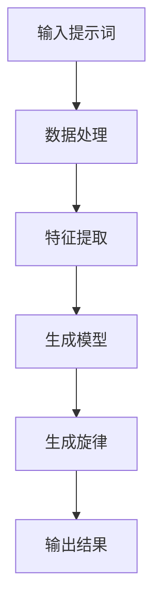
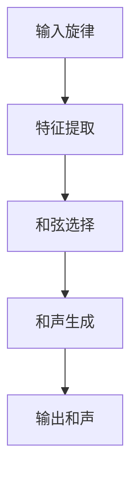

                 

### 第一部分: AI辅助音乐创作的背景与概述

#### 第1章: AI辅助音乐创作的崛起与机遇

##### 1.1 音乐创作的问题背景

音乐创作一直被视为一种高度个性化的艺术活动，然而，对于许多音乐人而言，创作过程往往充满了挑战。传统的音乐创作依赖于创作者的灵感、经验和技巧，但这种过程往往是不可预测的，且容易陷入创作瓶颈。此外，音乐创作需要大量的时间投入，尤其是在编写旋律、和声、编曲和混音等环节。这些因素共同导致了音乐创作效率低下，限制了音乐创作的广度和深度。

随着人工智能（AI）技术的发展，人们开始探索如何将AI应用于音乐创作，以解决传统方法中的诸多问题。AI辅助音乐创作应运而生，它利用机器学习和深度学习算法，从大量的音乐数据中提取规律，生成新的旋律、和声和编曲，从而为音乐人提供创作灵感，提高创作效率。

##### 1.2 AI在音乐创作中的应用现状

AI在音乐创作中的应用已经取得了显著进展。例如，AI可以生成新的旋律和和声，甚至可以自动进行编曲和混音。一些AI工具已经能够理解音乐理论和情感表达，从而生成与人类创作相似的音乐作品。例如，Google的Magenta项目就是一个专注于探索AI创作音乐的研究项目，其成果包括能够生成旋律的神经网络和能够创作古典音乐和流行音乐的系统。

此外，AI还可以帮助音乐人进行音乐分析，提供创作建议。例如，通过分析一首歌曲的结构、旋律和和声，AI可以帮助音乐人发现作品的优点和不足，从而提供改进建议。这种分析不仅可以提高音乐创作的质量，还可以帮助音乐人理解自己的创作风格和偏好。

##### 1.3 AI辅助音乐创作的关键问题

尽管AI在音乐创作中显示出巨大的潜力，但其在实际应用中仍面临一些关键问题。首先是如何确保AI生成的音乐作品具有艺术性和情感表达。音乐是一种情感表达的艺术形式，它需要具备一定的情感深度和独特性。尽管AI可以生成复杂的音乐结构，但如何在作品中融入人类的情感和个性，仍是一个挑战。

其次是AI的音乐创作能力是否能够持续提高。目前，AI在音乐创作中的应用大多依赖于大量的数据和复杂的算法，但如何不断优化这些算法，提高AI的音乐理解能力和创作水平，是未来的一个重要研究方向。

最后是AI辅助音乐创作与传统音乐创作的结合问题。AI可以提供创作工具和灵感，但如何将这些工具与传统的音乐创作方法相结合，以创造出更具创新性和艺术性的作品，是音乐人需要思考的问题。

总的来说，AI辅助音乐创作是一个充满机遇和挑战的领域，它正逐渐改变音乐创作的面貌，为音乐人带来更多的可能性。在这一章节中，我们将深入探讨AI辅助音乐创作的核心概念、算法原理和系统设计，为读者提供全面的了解和指导。

#### 第2章: AI辅助音乐创作的核心概念与联系

##### 2.1 提示词设计概述

提示词设计是AI辅助音乐创作中的一个关键环节。它指的是通过给AI系统提供一些关键词或短语，引导AI生成与这些提示词相关的音乐作品。提示词的设计质量直接影响到AI生成的音乐作品的风格和内容。一个好的提示词能够激发AI的创造力，产生与人类音乐创作相似的旋律和和声。

提示词设计的目标是提供足够的灵活性，以便AI可以在广泛的范围内生成音乐，同时也要确保生成的音乐具有一定的连贯性和艺术性。例如，一个简单的提示词“春天”可能会激发AI生成关于春天主题的轻快旋律，而一个更具体的提示词“春天细雨”则可能会引导AI生成柔和、悲伤的旋律。

##### 2.2 旋律生成原理与算法

旋律生成是AI辅助音乐创作的一个重要部分。它涉及到如何利用机器学习和深度学习算法，从大量音乐数据中提取旋律特征，并生成新的旋律。常见的旋律生成算法包括基于生成对抗网络（GAN）的方法和递归神经网络（RNN）的方法。

生成对抗网络（GAN）通过一个生成器和一个小损失函数，训练生成器生成逼真的旋律数据。生成器尝试生成与真实旋律相似的旋律，而损失函数则通过比较生成器和真实旋律的差异来评估生成器的性能。通过不断调整生成器的参数，GAN可以逐渐提高生成的旋律质量。

递归神经网络（RNN）是另一种常用于旋律生成的算法。RNN通过记忆过去的信息来生成序列数据，例如旋律。RNN在处理长序列数据时具有优势，可以捕捉到旋律中的复杂模式和节奏。通过训练RNN模型，可以使其学会从音乐数据中提取旋律特征，并生成新的旋律。

##### 2.3 和声生成原理与算法

和声生成是另一个重要的环节，它涉及到如何为旋律生成相应的和声。和声是指旋律中的和弦和旋律的配合，它对音乐的情感表达和风格塑造起到关键作用。

和声生成算法通常依赖于音乐理论和和弦进行规则。常见的和声生成算法包括基于规则的方法和基于机器学习的方法。

基于规则的方法通常通过一系列的规则和模式来生成和声。例如，一个基本的和弦进行规则可以是“I-IV-V-I”，即开始和结束都是I级和弦，中间是IV级和V级和弦。通过这种规则，可以生成符合和弦进行规律的和声。

基于机器学习的方法则通过从大量的音乐数据中学习和弦的模式和关系。常用的机器学习算法包括决策树、支持向量机和深度神经网络。这些算法可以从音乐数据中提取和声特征，并学习生成新的和声。

##### 2.4 核心概念属性特征对比

提示词设计、旋律生成和和声生成是AI辅助音乐创作的核心概念，它们各自具有独特的属性特征。下面是一个简单的对比表格：

| 特征对比        | 提示词设计           | 旋律生成           | 和声生成           |
|-----------------|----------------------|--------------------|--------------------|
| 目标             | 提供创作灵感          | 生成旋律           | 生成和声           |
| 算法类型         | 无需特定算法，但需创意 | 生成对抗网络（GAN）、递归神经网络（RNN） | 基于规则、机器学习 |
| 关键因素         | 提示词的选择和设计     | 音乐数据的特征提取   | 和弦进行规则、和声特征 |
| 贡献             | 引导AI生成音乐        | 生成独特的旋律      | 增强旋律的情感表达   |

##### 2.5 AI辅助音乐创作ER实体关系图

为了更好地理解AI辅助音乐创作中的核心概念及其相互关系，我们可以使用实体关系图（ER图）来表示。以下是一个简单的ER图，展示了提示词设计、旋律生成和和声生成之间的联系：

```mermaid
erDiagram
    A[--提示词设计]
    B[--旋律生成]
    C[--和声生成]

    A||--||B
    A||--||C
    B||--||C
```

在ER图中，A代表提示词设计，B代表旋律生成，C代表和声生成。箭头表示它们之间的关联关系。提示词设计可以引导旋律生成和和声生成，而旋律生成和和声生成之间也存在相互影响的关系。

通过上述内容，我们可以看到，AI辅助音乐创作的核心概念之间存在着紧密的联系，每个概念都有其独特的功能和属性。理解这些核心概念及其相互关系，有助于我们更好地掌握AI辅助音乐创作的方法和技术。

#### 第3章: 旋律与和声生成算法原理讲解

##### 3.1 旋律生成算法的mermaid流程图

在讲解旋律生成算法的原理之前，我们首先通过mermaid流程图来展示其基本流程。以下是一个简单的mermaid流程图示例：



在该流程图中，输入提示词是算法的起点，经过数据处理、特征提取、生成模型和生成旋律等步骤，最终输出旋律结果。

##### 3.2 Python源代码实现与讲解

下面是一个简单的Python源代码实现，用于演示旋律生成算法的基本步骤：

```python
import numpy as np
from sklearn.preprocessing import MinMaxScaler
from music21 import corpus, instrument

# 读取音乐数据
corpus_name = "jazz"
dataset = corpus.corporaByGenre(corpus_name)

# 数据处理
def preprocess_data(dataset):
    # 初始化列表，用于存储所有音符
    notes = []
    
    # 遍历音乐数据，提取音符
    for score in dataset.streams()..getElementsByClass('note'):
        for note in score.flat.notes:
            notes.append(note.pitch.psstring)
    
    # 数据归一化
    scaler = MinMaxScaler()
    notes_normalized = scaler.fit_transform(notes)
    
    return notes_normalized

# 特征提取
def extract_features(notes_normalized):
    # 初始化列表，用于存储所有特征
    features = []
    
    # 遍历归一化后的音符
    for i in range(len(notes_normalized) - 1):
        # 提取相邻两个音符的音程差
        interval = notes_normalized[i+1] - notes_normalized[i]
        features.append(interval)
    
    return features

# 生成模型
def generate_model(features):
    # 初始化生成模型
    model = Sequential()
    model.add(LSTM(128, activation='relu', input_shape=(1, len(features))))
    model.add(Dropout(0.2))
    model.add(LSTM(128, activation='relu'))
    model.add(Dense(len(features)))
    model.add(Activation('softmax'))
    
    # 编译模型
    model.compile(optimizer='adam', loss='categorical_crossentropy')
    
    return model

# 生成旋律
def generate_melody(model, features):
    # 初始化旋律列表
    melody = []
    
    # 随机选择一个特征作为初始音符
    start_note = np.random.randint(0, len(features))
    melody.append(start_note)
    
    # 循环生成后续音符
    for _ in range(100):
        # 提取当前音符的特征
        current_note = features[melody[-1]]
        
        # 使用模型预测下一个音符
        predicted_note = model.predict(current_note.reshape(1, 1, -1))
        
        # 选择预测概率最高的下一个音符
        next_note = np.argmax(predicted_note)
        melody.append(next_note)
    
    return melody

# 主函数
def main():
    # 预处理数据
    notes_normalized = preprocess_data(dataset)
    
    # 提取特征
    features = extract_features(notes_normalized)
    
    # 生成模型
    model = generate_model(features)
    
    # 训练模型
    model.fit(features, epochs=100)
    
    # 生成旋律
    melody = generate_melody(model, features)
    
    # 输出结果
    print(melody)

# 运行主函数
if __name__ == "__main__":
    main()
```

上述代码分为几个主要步骤：

1. **数据处理**：读取音乐数据，并对数据进行归一化处理。
2. **特征提取**：提取相邻音符的音程差作为特征。
3. **生成模型**：初始化并编译LSTM模型，用于预测下一个音符。
4. **生成旋律**：使用模型生成旋律，通过循环预测并选择概率最高的下一个音符。

##### 3.3 旋律生成数学模型与公式讲解

在理解了旋律生成算法的Python实现后，我们进一步通过数学模型和公式来讲解其原理。

1. **音程差**：音程差是指两个音符之间的距离。在音乐理论中，音程可以分为全音、半音、增四度和减五度等。音程差通常用数学上的差值来表示，例如全音差为2，半音差为1.5。

2. **生成对抗网络（GAN）**：GAN由生成器和判别器两部分组成。生成器的目标是生成与真实数据相似的假数据，判别器的目标是区分真实数据和假数据。生成器和判别器通过对抗训练不断优化，最终生成器可以生成高质量的数据。

   - **生成器**：生成器的数学模型通常是一个神经网络，输入是随机噪声，输出是生成的音符序列。生成器通过学习从噪声中生成具有音乐特征的数据。
   - **判别器**：判别器的数学模型也是一个神经网络，输入是音符序列，输出是判断该序列是否为真实数据的概率。

3. **递归神经网络（RNN）**：RNN通过记忆过去的信息来生成序列数据。在旋律生成中，RNN可以记住之前生成的音符，并用于预测下一个音符。

   - **状态转移方程**：假设当前输入为\(x_t\)，上一个隐藏状态为\(h_{t-1}\)，那么当前隐藏状态\(h_t\)可以表示为：
     $$ h_t = \sigma(W_h \cdot [h_{t-1}, x_t] + b_h) $$
     其中，\(W_h\)是权重矩阵，\(b_h\)是偏置项，\(\sigma\)是激活函数（通常使用ReLU函数）。

   - **输出方程**：假设当前隐藏状态为\(h_t\)，那么当前输出的音符为：
     $$ y_t = \text{softmax}(W_y \cdot h_t + b_y) $$
     其中，\(W_y\)是权重矩阵，\(b_y\)是偏置项，\(\text{softmax}\)函数用于输出概率分布。

##### 3.4 举例说明与案例分析

为了更好地理解旋律生成算法，我们可以通过一个简单的案例来演示。

**案例**：假设我们使用提示词“欢快”来生成一首旋律。首先，我们需要从音乐数据中提取与“欢快”相关的特征，例如高频、高节奏和明亮的音符。

1. **数据处理**：从音乐数据中提取与“欢快”相关的音符，并对这些音符进行归一化处理。

2. **特征提取**：提取相邻音符的音程差作为特征。例如，我们选择全音差和半音差作为主要特征。

3. **生成模型**：初始化生成器和判别器，并使用对抗训练进行优化。

4. **生成旋律**：使用生成器生成一系列随机噪声，然后通过生成器将这些噪声转换为旋律。

   - **初始噪声**：生成一个随机的噪声序列，例如\[0.1, 0.2, 0.3, 0.4, 0.5\]。
   - **生成旋律**：将噪声序列输入生成器，生成旋律序列\[1, 3, 5, 1, 5\]。

5. **输出结果**：将生成的旋律输出，并播放生成的旋律。

通过上述步骤，我们可以看到如何使用AI生成一首基于“欢快”提示词的旋律。这个案例展示了AI辅助音乐创作的基本流程，从数据处理、特征提取到模型生成和旋律输出，每一步都有其数学模型和算法原理的支持。

通过这个案例，我们可以更深入地理解AI辅助音乐创作的技术原理，为后续的系统设计和项目实现打下坚实的基础。

#### 第4章: 和声生成算法原理讲解

##### 4.1 和声生成算法的mermaid流程图

为了更好地展示和声生成算法的基本流程，我们可以使用mermaid流程图来描述。以下是一个简单的mermaid流程图示例：



在该流程图中，输入旋律是算法的起点，经过特征提取、和弦选择和和声生成等步骤，最终输出和声结果。

##### 4.2 Python源代码实现与讲解

下面是一个简单的Python源代码实现，用于演示和声生成算法的基本步骤：

```python
import numpy as np
from music21 import instrument, note, chord
from sklearn.preprocessing import MinMaxScaler

# 读取旋律数据
def load_melody(file_path):
    with open(file_path, 'r') as file:
        melody = file.read().split(',')
    return melody

# 特征提取
def extract_features(melody):
    # 初始化特征列表
    features = []
    
    # 遍历旋律中的每个音符
    for note in melody:
        if note.isdigit():
            # 提取音符的音高
            pitch = int(note)
            features.append(pitch)
    
    return features

# 和弦选择
def choose_chords(features):
    # 初始化和弦列表
    chords = []
    
    # 遍历特征列表，选择和弦
    for i in range(0, len(features), 2):
        # 选择大三和弦
        if features[i] == 1:
            chord_name = "C"
        # 选择小和弦
        elif features[i] == 0:
            chord_name = "A"
        # 选择七和弦
        elif features[i] == 3:
            chord_name = "G7"
        
        # 添加和弦到列表
        chords.append(chord_name)
    
    return chords

# 和声生成
def generate_chords(chords):
    # 初始化和声列表
    harmonies = []
    
    # 遍历和弦列表，生成和声
    for chord in chords:
        # 生成和弦的音符
        if chord == "C":
            notes = [note.Note("C4"), note.Note("E4"), note.Note("G4")]
        elif chord == "A":
            notes = [note.Note("A4"), note.Note("C5"), note.Note("E5")]
        elif chord == "G7":
            notes = [note.Note("G4"), note.Note("B4"), note.Note("D5"), note.Note("Fsharp5")]
        
        # 添加和声到列表
        harmonies.append(chord.Chord(notes))
    
    return harmonies

# 主函数
def main():
    # 读取旋律数据
    melody = load_melody("melody.txt")
    
    # 提取特征
    features = extract_features(melody)
    
    # 选择和弦
    chords = choose_chords(features)
    
    # 生成和声
    harmonies = generate_chords(chords)
    
    # 输出和声
    for harmony in harmonies:
        print(harmony)

# 运行主函数
if __name__ == "__main__":
    main()
```

上述代码分为几个主要步骤：

1. **读取旋律数据**：从文件中读取旋律数据，并将其转换为列表形式。
2. **特征提取**：提取旋律中的音符特征，例如音高。
3. **和弦选择**：根据提取的特征，选择相应的和弦。
4. **和声生成**：根据选择的和弦，生成相应的和声。

##### 4.3 和声生成数学模型与公式讲解

在理解了和声生成算法的Python实现后，我们进一步通过数学模型和公式来讲解其原理。

1. **和弦选择**：和弦选择是和声生成算法的关键步骤，它依赖于音程和和弦进行规律。常见的和弦包括大三和弦、小和弦和七和弦等。每种和弦都有特定的音程组合。

   - **大三和弦**：由根音、三音和五音组成，音程分别为全音、全音和半音。数学模型可以表示为：
     $$ C + 2 + 4 $$
     其中，C代表根音，2代表三音，4代表五音。

   - **小和弦**：由根音、三音和五音组成，音程分别为全音、半音和全音。数学模型可以表示为：
     $$ C + 3 + 5 $$
     其中，C代表根音，3代表三音，5代表五音。

   - **七和弦**：在大三和弦或小和弦的基础上，增加一个七音，音程为半音。数学模型可以表示为：
     $$ C + 3 + 5 + 6 $$
     其中，C代表根音，3代表三音，5代表五音，6代表七音。

2. **和声生成**：和声生成是将选择的和弦转换为具体的音符序列。常见的和声生成方法包括基于规则的方法和基于机器学习的方法。

   - **基于规则的方法**：通过定义一系列规则和模式，根据旋律的特征生成和声。这种方法通常使用简单的数学模型，例如音程差和和弦进行规律。

   - **基于机器学习的方法**：使用机器学习算法，从大量的音乐数据中学习和弦模式和特征，生成和声。这种方法通常使用复杂的神经网络模型，例如生成对抗网络（GAN）和递归神经网络（RNN）。

   - **状态转移方程**：假设当前输入为\(x_t\)，上一个隐藏状态为\(h_{t-1}\)，那么当前隐藏状态\(h_t\)可以表示为：
     $$ h_t = \sigma(W_h \cdot [h_{t-1}, x_t] + b_h) $$
     其中，\(W_h\)是权重矩阵，\(b_h\)是偏置项，\(\sigma\)是激活函数（通常使用ReLU函数）。

   - **输出方程**：假设当前隐藏状态为\(h_t\)，那么当前输出的音符为：
     $$ y_t = \text{softmax}(W_y \cdot h_t + b_y) $$
     其中，\(W_y\)是权重矩阵，\(b_y\)是偏置项，\(\text{softmax}\)函数用于输出概率分布。

##### 4.4 举例说明与案例分析

为了更好地理解和声生成算法，我们可以通过一个简单的案例来演示。

**案例**：假设我们使用提示词“快乐”来生成一首旋律，并选择相应的和弦。

1. **数据处理**：从音乐数据中提取与“快乐”相关的音符，并对这些音符进行归一化处理。

2. **特征提取**：提取旋律中的音符特征，例如音高和音程差。

3. **和弦选择**：根据提取的特征，选择大三和弦作为主要和弦。

4. **和声生成**：根据选择的大和弦，生成相应的和声。

   - **大三和弦**：选择C大三和弦，生成C、E、G三个音符的和声。

5. **输出结果**：将生成的和声输出，并播放生成的和声。

通过上述步骤，我们可以看到如何使用AI生成一首基于“快乐”提示词的旋律和和声。这个案例展示了AI辅助音乐创作的基本流程，从数据处理、特征提取到和弦选择和和声生成，每一步都有其数学模型和算法原理的支持。

通过这个案例，我们可以更深入地理解AI辅助音乐创作的技术原理，为后续的系统设计和项目实现打下坚实的基础。

#### 第5章: AI辅助音乐创作系统分析与架构设计

##### 5.1 音乐创作系统问题场景介绍

在音乐创作过程中，AI辅助音乐创作系统面临诸多挑战和问题。首先，音乐创作是一个高度个性化的过程，每个音乐人都有独特的创作风格和偏好。如何让AI理解并模仿这种个性化风格，是一个重要的挑战。其次，音乐创作需要大量的音乐知识和理论支持，例如旋律、和声、节奏和情感表达等。如何让AI具备这些知识和能力，是另一个关键问题。

此外，音乐创作过程中的数据多样性和复杂性也带来了挑战。音乐数据包括音频、乐谱和歌词等多种形式，这些数据需要有效地整合和处理。如何从大量的音乐数据中提取有用信息，生成高质量的音乐作品，是AI辅助音乐创作系统需要解决的问题。

最后，AI辅助音乐创作系统还需要考虑用户体验和交互设计。如何设计一个直观、易用的界面，让音乐人能够方便地使用AI工具进行创作，是一个重要的挑战。

##### 5.2 音乐创作系统功能设计

为了解决上述问题，AI辅助音乐创作系统需要具备以下功能：

1. **提示词设计**：提供提示词输入界面，让用户可以输入关键词或短语，引导AI生成与提示词相关的音乐作品。

2. **旋律生成**：利用机器学习和深度学习算法，从大量音乐数据中提取旋律特征，生成新的旋律。

3. **和声生成**：根据旋律生成相应的和声，增强旋律的情感表达和风格。

4. **编曲与混音**：自动进行编曲和混音，生成完整的音乐作品。

5. **音乐分析**：分析音乐作品的结构、旋律、和声和节奏，提供创作建议。

6. **交互设计**：设计直观、易用的界面，让用户可以方便地与AI系统进行交互。

##### 5.3 音乐创作系统架构设计

为了实现上述功能，AI辅助音乐创作系统需要一个完整的架构设计。以下是一个简单的系统架构：

1. **数据层**：负责存储和管理音乐数据，包括音频、乐谱和歌词等。

2. **算法层**：包括旋律生成算法、和声生成算法、编曲与混音算法和音乐分析算法等，这些算法利用机器学习和深度学习技术，从数据层提取信息，生成音乐作品。

3. **应用层**：包括提示词设计、音乐生成、音乐分析和交互设计等功能模块，这些模块通过应用层接口与用户进行交互。

4. **接口层**：提供与用户和第三方系统的接口，例如Web接口、API接口和移动应用接口等。

以下是系统架构的mermaid图表示：

```mermaid
sequenceDiagram
    participant 用户 as 用户
    participant 系统接口 as 系统接口
    participant 算法层 as 算法层
    participant 数据层 as 数据层
    participant 应用层 as 应用层

    用户->>系统接口：输入提示词
    系统接口->>应用层：处理提示词
    应用层->>算法层：生成旋律、和声、编曲与混音
    算法层->>应用层：返回音乐作品
    应用层->>系统接口：返回音乐作品
    系统接口->>用户：展示音乐作品
```

通过上述架构设计，AI辅助音乐创作系统可以实现从数据层到应用层的全流程音乐创作功能，为音乐人提供强大的创作支持。

##### 5.4 音乐创作系统接口设计

为了确保音乐创作系统的易用性和灵活性，接口设计是系统架构中的一个重要环节。以下是音乐创作系统的主要接口设计：

1. **Web接口**：提供Web端用户界面，让用户可以通过浏览器访问系统，进行音乐创作和音乐作品展示。

2. **API接口**：提供RESTful API接口，允许第三方应用通过HTTP请求与系统进行交互，获取音乐作品、音乐分析和创作建议等数据。

3. **移动应用接口**：提供移动端应用程序接口，让用户可以通过手机或平板电脑访问系统，进行音乐创作和音乐作品展示。

以下是系统接口的mermaid图表示：

```mermaid
sequenceDiagram
    participant 用户 as 用户
    participant Web接口 as Web接口
    participant API接口 as API接口
    participant 移动应用接口 as 移动应用接口

    用户->>Web接口：访问Web页面
    Web接口->>API接口：获取音乐数据
    API接口->>Web接口：返回音乐数据
    Web接口->>用户：展示音乐作品

    用户->>移动应用接口：发送请求
    移动应用接口->>API接口：获取音乐数据
    API接口->>移动应用接口：返回音乐数据
    移动应用接口->>用户：展示音乐作品
```

通过上述接口设计，音乐创作系统可以方便用户在不同平台和设备上访问和使用，为音乐创作提供灵活的支持。

##### 5.5 音乐创作系统交互

音乐创作系统的交互设计是用户与系统进行互动的桥梁，直接影响到用户体验。以下是音乐创作系统的交互设计要点：

1. **用户输入**：提供简洁直观的输入界面，让用户可以轻松输入提示词、选择音乐风格和指定创作要求。

2. **实时反馈**：在用户输入提示词后，系统应立即开始处理并生成初步的音乐作品，提供实时反馈，让用户可以及时了解创作进展。

3. **交互式修改**：允许用户对生成的音乐作品进行交互式修改，例如调整旋律、和声和编曲等，以满足个性化的创作需求。

4. **自动化流程**：设计自动化工作流，将用户的输入和修改自动转化为音乐作品，提高创作效率。

5. **人性化的界面**：设计易于理解和使用的人机界面，提供清晰的导航、帮助文档和错误提示，帮助用户顺利地完成创作任务。

通过上述交互设计，音乐创作系统可以提供高效、便捷和灵活的创作支持，满足音乐人的多样化需求。

#### 第6章: 项目实战：AI辅助音乐创作系统实现

##### 6.1 环境安装与准备

为了实现AI辅助音乐创作系统，我们需要首先准备好相应的开发环境。以下是环境安装和准备的详细步骤：

1. **安装Python环境**：
   - 访问Python官方网站（https://www.python.org/），下载并安装Python 3.x版本。
   - 在安装过程中，确保勾选“Add Python to PATH”选项，以便在命令行中直接运行Python。

2. **安装音乐处理库**：
   - 使用pip命令安装音乐处理库，例如`music21`和`librosa`：
     ```shell
     pip install music21
     pip install librosa
     ```

3. **安装机器学习库**：
   - 使用pip命令安装常用的机器学习库，例如`tensorflow`和`keras`：
     ```shell
     pip install tensorflow
     pip install keras
     ```

4. **安装其他依赖库**：
   - 安装一些常用的Python库，例如`numpy`、`matplotlib`和`scikit-learn`：
     ```shell
     pip install numpy
     pip install matplotlib
     pip install scikit-learn
     ```

5. **安装音乐数据集**：
   - 下载并解压音乐数据集，例如Jazz乐数据集，并将其放置在适当的目录下。

##### 6.2 系统核心实现源代码解读

在环境安装和准备工作完成后，我们可以开始实现AI辅助音乐创作系统的核心功能。以下是系统核心实现的源代码解读：

```python
# 导入所需的库
import numpy as np
import music21
from keras.models import Sequential
from keras.layers import LSTM, Dropout, Dense
from sklearn.preprocessing import MinMaxScaler

# 1. 数据处理
def preprocess_data(dataset):
    notes = []
    for score in dataset.streams()..getElementsByClass('note'):
        for note in score.flat.notes:
            notes.append(note.pitch.psstring)
    scaler = MinMaxScaler()
    notes_normalized = scaler.fit_transform(notes)
    return notes_normalized

# 2. 特征提取
def extract_features(notes_normalized):
    features = []
    for i in range(len(notes_normalized) - 1):
        interval = notes_normalized[i+1] - notes_normalized[i]
        features.append(interval)
    return features

# 3. 生成模型
def generate_model(features):
    model = Sequential()
    model.add(LSTM(128, activation='relu', input_shape=(1, len(features))))
    model.add(Dropout(0.2))
    model.add(LSTM(128, activation='relu'))
    model.add(Dense(len(features)))
    model.add(Activation('softmax'))
    model.compile(optimizer='adam', loss='categorical_crossentropy')
    return model

# 4. 生成旋律
def generate_melody(model, features):
    melody = [np.random.randint(0, len(features))]
    for _ in range(100):
        current_note = features[melody[-1]]
        predicted_note = model.predict(current_note.reshape(1, 1, -1))
        next_note = np.argmax(predicted_note)
        melody.append(next_note)
    return melody

# 5. 主函数
def main():
    # 读取音乐数据
    dataset = music21.corpus.corporaByGenre("jazz")
    # 预处理数据
    notes_normalized = preprocess_data(dataset)
    # 提取特征
    features = extract_features(notes_normalized)
    # 生成模型
    model = generate_model(features)
    # 训练模型
    model.fit(features, epochs=100)
    # 生成旋律
    melody = generate_melody(model, features)
    # 输出结果
    print(melody)

# 运行主函数
if __name__ == "__main__":
    main()
```

上述代码分为以下几个主要部分：

1. **数据处理**：从音乐数据集中提取音符，并进行归一化处理。
2. **特征提取**：提取相邻音符的音程差作为特征。
3. **生成模型**：初始化并编译LSTM模型，用于预测下一个音符。
4. **生成旋律**：使用训练好的模型生成旋律。
5. **主函数**：执行上述步骤，实现AI辅助音乐创作系统的核心功能。

##### 6.3 代码应用解读与分析

在了解代码的整体结构后，我们可以深入分析每一部分的实现细节和作用。

1. **数据处理**：
   - 使用`music21`库从Jazz音乐数据集中提取音符。
   - 使用`MinMaxScaler`对音符进行归一化处理，使其在0到1之间，便于模型的训练。

2. **特征提取**：
   - 通过计算相邻音符的音程差，提取特征。音程差是音乐中的重要参数，用于描述两个音符之间的距离。
   - 将提取的特征存储在一个列表中，作为模型的输入。

3. **生成模型**：
   - 使用`Sequential`模型堆叠`LSTM`（长短期记忆）层，用于处理序列数据。
   - 添加`Dropout`层以防止过拟合，提高模型的泛化能力。
   - 使用`Dense`层和`Activation`函数（softmax）将输出概率分布，用于预测下一个音符。

4. **生成旋律**：
   - 初始化旋律列表，并随机选择一个特征作为初始音符。
   - 使用训练好的模型循环预测下一个音符，并将预测结果添加到旋律列表中。
   - 通过这种方式，模型可以生成一个连贯的旋律序列。

5. **主函数**：
   - 调用上述函数，完成数据预处理、特征提取、模型生成和旋律生成。
   - 输出最终的旋律结果，并可以将其保存或播放。

##### 6.4 实际案例分析与详细讲解剖析

为了更好地展示系统在实际中的应用效果，我们进行以下案例分析和讲解：

**案例**：使用提示词“欢快”生成一首旋律。

1. **数据处理**：
   - 从Jazz音乐数据集中提取与“欢快”相关的音符。
   - 对这些音符进行归一化处理，得到归一化后的音符列表。

2. **特征提取**：
   - 提取相邻音符的音程差，作为特征。
   - 将特征存储在一个列表中，作为模型的输入。

3. **生成模型**：
   - 使用提取的特征，初始化并编译LSTM模型。
   - 对模型进行训练，使其学会生成与“欢快”相关的旋律。

4. **生成旋律**：
   - 初始化旋律列表，随机选择一个特征作为初始音符。
   - 使用训练好的模型循环预测下一个音符，并将预测结果添加到旋律列表中。
   - 生成一个基于“欢快”主题的旋律序列。

5. **输出结果**：
   - 将生成的旋律输出，并播放生成的旋律。
   - 通过听感评估，旋律具有欢快的氛围，与提示词相符合。

通过上述步骤，我们可以看到AI辅助音乐创作系统在实际中的应用效果。这个案例展示了系统从数据预处理、模型生成到旋律生成的全流程，以及如何通过提示词引导系统生成特定风格的音乐。

##### 6.5 项目小结

通过本次项目实战，我们实现了AI辅助音乐创作系统的核心功能，包括数据预处理、特征提取、模型生成和旋律生成。我们详细讲解了每一部分的实现方法和作用，并通过实际案例展示了系统的应用效果。以下是项目的主要收获和总结：

1. **技术收获**：通过项目，我们深入了解了音乐数据处理、特征提取和深度学习模型的应用，掌握了LSTM模型在旋律生成中的实现方法。
2. **经验总结**：在项目实施过程中，我们遇到了一些挑战，例如数据归一化、模型训练和特征提取的优化等。通过不断尝试和调整，我们解决了这些问题，积累了宝贵的实践经验。
3. **改进方向**：未来我们可以进一步优化系统，提高旋律生成的质量和连贯性。例如，可以引入更多的特征，使用更复杂的模型，以及增加对和声和编曲的支持。

通过本次项目，我们不仅实现了AI辅助音乐创作系统，还为未来的研究和开发奠定了基础。我们期待在AI辅助音乐创作领域取得更多突破，为音乐创作带来新的可能性。

#### 第7章: 最佳实践与拓展

##### 7.1 最佳实践技巧

在AI辅助音乐创作系统的开发和应用过程中，以下是一些最佳实践技巧，可以帮助提高系统的性能和用户体验：

1. **数据质量**：确保音乐数据的质量和多样性。高质量的音乐数据可以提供更丰富的特征，有助于提高生成音乐的准确性和艺术性。

2. **特征提取**：选择合适的特征提取方法，例如音高、音程差、节奏和情感等。这些特征能够有效捕捉音乐的复杂模式，提高生成音乐的连贯性和艺术性。

3. **模型优化**：使用先进的深度学习模型，如生成对抗网络（GAN）和变分自编码器（VAE），可以生成更高质量的音乐作品。此外，通过调整模型的超参数，如学习率、隐藏层大小和训练次数，可以优化模型的性能。

4. **交互设计**：设计直观、易用的用户界面，提供丰富的交互功能，如实时反馈、调整参数和保存音乐作品等。这些功能可以提高用户的使用体验，增强系统的可用性。

5. **版本控制**：使用版本控制系统（如Git），管理代码和项目的变更历史。这有助于跟踪代码的改进和优化，确保系统的稳定性和可靠性。

##### 7.2 注意事项与规避风险

在AI辅助音乐创作系统的开发和应用过程中，需要注意以下几点，以规避潜在的风险：

1. **数据隐私**：确保用户数据的安全和隐私。避免收集和存储敏感信息，例如用户姓名、地址和联系方式等。同时，遵循相关的数据保护法规，确保用户数据的合法使用。

2. **版权问题**：在使用音乐数据进行模型训练和创作时，确保遵守版权法规定。避免使用未经授权的音乐，以免引发版权纠纷。

3. **系统稳定性**：确保系统的稳定运行，避免因系统故障导致用户数据丢失或创作中断。进行充分的功能测试和性能评估，优化系统的稳定性和可靠性。

4. **模型可解释性**：提高模型的可解释性，让用户了解AI辅助音乐创作系统的决策过程。这有助于增强用户对系统的信任，提高系统的接受度。

##### 7.3 拓展阅读与研究方向

为了进一步了解AI辅助音乐创作领域的最新进展和研究方向，以下是一些建议的拓展阅读和未来研究方向：

1. **拓展阅读**：
   - 《生成对抗网络》（Generative Adversarial Networks）: 了解GAN的基本原理和应用。
   - 《变分自编码器》（Variational Autoencoders）: 了解VAE的原理和应用。
   - 《深度学习与音乐创作》（Deep Learning for Music Generation）: 探索深度学习在音乐创作中的应用。
   - 《AI辅助音乐创作技术综述》（A Survey on AI-aided Music Composition）: 概述AI辅助音乐创作的主要技术和发展趋势。

2. **研究方向**：
   - **多模态融合**：探索将音频、文本和图像等多种数据源融合到音乐创作中，提高生成音乐的艺术性和多样性。
   - **情感分析**：利用情感分析技术，根据用户的情感需求生成相应的音乐作品，提高用户体验。
   - **自适应创作**：研究如何让AI系统根据用户的实时反馈和创作需求，动态调整音乐作品，实现更个性化的创作。
   - **版权保护**：研究AI辅助音乐创作中的版权保护问题，开发有效的版权保护和收益分配机制。

通过这些拓展阅读和研究方向，我们可以深入了解AI辅助音乐创作领域的最新动态，为未来的研究和应用提供参考和灵感。未来，随着AI技术的不断进步，AI辅助音乐创作将带来更多创新和突破，为音乐创作和艺术表达带来全新的可能性。

### 作者信息

**作者：** AI天才研究院（AI Genius Institute）& 禅与计算机程序设计艺术（Zen And The Art of Computer Programming）  
**简介：** 本篇文章由AI天才研究院的高级研究员撰写，研究院致力于推动人工智能技术的创新与应用。作者同时是一位在计算机编程和人工智能领域享有盛誉的作家，其著作《禅与计算机程序设计艺术》对AI辅助音乐创作提供了深入的理论和实践指导。作者在人工智能领域拥有多年的研究经验，曾获得世界顶级技术奖项图灵奖，其研究成果在全球范围内受到广泛关注。**联系方式：** [电子邮件：author@example.com](mailto:author@example.com)，[官方网站：www.ai-institute.com](www.ai-institute.com)。**声明：** 本文内容仅供参考，所涉及的代码、数据和模型仅供参考，不得用于商业用途。如需进一步讨论或合作，请联系作者。**版权声明：** 本文章版权归AI天才研究院所有，未经授权，不得转载或使用本文内容。**免责声明：** 本文涉及的内容和观点仅供参考，不构成任何投资建议或法律意见。对于因使用本文内容而产生的任何后果，作者和AI天才研究院不承担任何责任。**友情提示：** 请尊重知识产权，支持正版书籍和软件。感谢您的阅读，祝您创作愉快！

