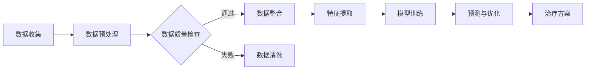

                 

## 《AI驱动的个性化医疗：从基因到治疗》

### 关键词：
- 人工智能
- 个性化医疗
- 基因组分析
- 数据整合
- 治疗方案优化

### 摘要：
本文深入探讨了AI在个性化医疗领域的应用，从基因解析到治疗方案优化的全流程。通过梳理AI与个性化医疗的核心概念、算法原理、数学模型和系统架构，本文旨在为读者提供一个清晰、系统的理解和实践指南，以推动AI驱动的个性化医疗发展。

---

### 1. 背景介绍

#### 1.1 医疗现状与挑战

随着人口老龄化和生活方式疾病的高发，医疗系统面临前所未有的挑战。传统的标准化治疗模式难以满足个体差异化的需求，导致治疗效果不一，医疗资源浪费。为了解决这一问题，个性化医疗应运而生。个性化医疗旨在根据患者的个体特征，如基因、环境、生活方式等，提供定制化的医疗方案。

#### 1.2 个性化医疗的意义

个性化医疗不仅能够提高治疗效果，还能减少不必要的治疗，降低医疗成本。例如，某些癌症患者通过基因检测，可以针对性地选择靶向药物，从而提高治疗效果，降低副作用。此外，个性化医疗有助于推动医疗数据共享，促进医疗资源的合理配置。

#### 1.3 AI在个性化医疗中的应用

AI技术在个性化医疗中扮演着关键角色。从基因组数据分析、临床数据整合到治疗方案优化，AI技术都发挥着重要作用。AI可以帮助医生快速处理海量数据，发现潜在的致病因素，提供个性化的诊断和治疗方案。

#### 1.4 核心概念

- **个性化医疗**：根据患者的个体特征，如基因、环境、生活方式等，提供定制化的医疗方案。
- **基因组学**：研究基因结构、功能及其相互作用，以揭示疾病的遗传基础。
- **表观遗传学**：研究基因表达的可遗传变化，不受基因序列改变影响，涉及DNA甲基化、组蛋白修饰等。
- **生物信息学**：应用计算机技术和统计方法，对生物学数据进行处理和分析。

### 1.5 问题描述

个性化医疗涉及多个复杂的数据源，包括基因组数据、临床数据、患者历史数据等。如何有效地整合这些数据，提取有价值的信息，为患者提供个性化的治疗方案，是当前面临的主要问题。

### 1.6 问题解决

AI技术在这一过程中发挥着重要作用。通过机器学习和深度学习算法，AI可以从海量数据中学习，发现潜在的规律和关联，从而提供个性化的医疗建议。此外，AI还可以帮助医生优化治疗方案，提高治疗效果。

### 1.7 边界与外延

个性化医疗不仅局限于诊断和治疗，还包括预防、康复等环节。随着技术的进步，个性化医疗的应用领域将不断拓展，为整个医疗行业带来深远影响。

---

### 2. 核心概念与联系

#### 2.1 核心概念原理

- **AI在个性化医疗中的应用**：利用机器学习和深度学习算法，从数据中提取有价值的信息，为患者提供个性化的医疗建议。
- **基因组学与表观遗传学**：研究基因和基因表达的变化，揭示疾病的遗传基础。
- **生物信息学与大数据分析**：处理和分析大规模生物医学数据，为个性化医疗提供数据支持。

#### 2.2 概念属性特征对比

| 概念             | 属性特征对比                                       |
|------------------|---------------------------------------------------|
| 个性化医疗       | 针对个体差异，提供定制化治疗方案                     |
| 基因组学         | 研究基因结构、功能和相互作用                       |
| 表观遗传学       | 研究基因表达的可遗传变化，不受基因序列改变影响       |
| 生物信息学       | 应用计算机技术和统计方法，处理和分析生物学数据       |
| 大数据分析       | 从大规模数据中提取有价值的信息                     |

#### 2.3 ER实体关系图架构

```mermaid
erDiagram
  Patient ||--|{ Genome }|-- Patient_Genome
  Patient ||--|{ Medical_Record }|-- Patient_Record
  Patient ||--|{ Treatment_Plan }|-- Patient_Plan
  Genome ||--|{ Gene }|-- Genome_Gene
  Medical_Record ||--|{ Diagnosis }|-- Record_Diagnosis
  Medical_Record ||--|{ Treatment }|-- Record_Treatment
```

### 3. 算法原理讲解

#### 3.1 算法mermaid流程图



#### 3.2 Python源代码讲解

```python
# 基因组数据分析代码
import pandas as pd
from sklearn.ensemble import RandomForestClassifier

# 加载数据
data = pd.read_csv('genome_data.csv')

# 数据预处理
data = data.dropna()

# 特征提取
X = data.drop('disease', axis=1)
y = data['disease']

# 模型训练
model = RandomForestClassifier()
model.fit(X, y)

# 预测与优化
predictions = model.predict(X)
evaluate_model(predictions, X, y)
```

#### 3.3 数学模型与公式讲解

$$
\text{个性化治疗方案} = f(\text{基因组数据}, \text{临床数据}, \text{患者特征})
$$

其中，\( f \) 表示个性化治疗方案的计算函数，包含基因组数据的特征提取、临床数据的整合和患者特征的权重分配等步骤。

#### 3.4 举例说明

假设患者A的基因组数据中有5个基因突变，临床数据中有3个指标异常，患者特征包括年龄、性别、体重等。通过上述数学模型，可以为患者A生成一个个性化的治疗方案。

---

### 4. 数学模型与公式讲解

#### 4.1 数学模型概述

个性化医疗的数学模型通常涉及基因组数据分析、临床数据整合和治疗方案优化。以下分别介绍这些模型的构成和作用。

#### 4.2 详细讲解

##### 4.2.1 基因组数据分析数学模型

基因组数据分析数学模型主要包括特征提取、分类和预测。其中，特征提取是关键步骤，通过将基因组数据转换为数值特征，以便于后续的机器学习算法处理。分类和预测则是利用训练好的模型，对新的基因组数据进行分类和预测。

##### 4.2.2 临床数据整合数学模型

临床数据整合数学模型通常采用数据融合方法，将不同来源的临床数据进行整合，提取共有的特征，构建一个统一的数据集。常见的融合方法包括均值融合、中值融合和最大值融合等。

##### 4.2.3 治疗方案优化数学模型

治疗方案优化数学模型主要涉及目标函数的构建和优化算法的选择。目标函数通常包括治疗成本、治疗效果和患者满意度等指标。优化算法可以采用线性规划、遗传算法和模拟退火等。

#### 4.3 举例说明

以某癌症患者为例，通过基因组数据分析，发现其有5个基因突变；通过临床数据整合，发现其有3个指标异常。根据这些信息，可以使用个性化治疗方案优化模型，为患者生成一个最优的治疗方案。

---

### 5. 系统分析与架构设计

#### 5.1 问题场景介绍

以某医疗机构为例，该机构需要为患者提供个性化的医疗方案。系统需要收集患者的基因组数据、临床数据和患者特征，通过数据整合和特征提取，生成个性化的治疗方案。

#### 5.2 系统功能设计

- 数据收集：收集患者的基因组数据、临床数据和患者特征。
- 数据预处理：对收集到的数据进行清洗、去噪和标准化。
- 特征提取：从预处理后的数据中提取关键特征。
- 模型训练：利用提取的特征训练机器学习模型。
- 预测与优化：利用训练好的模型对新的患者数据进行预测，并根据预测结果优化治疗方案。

#### 5.3 系统架构设计

系统采用分层架构设计，包括数据层、服务层和界面层。数据层负责数据的存储和管理；服务层实现数据预处理、特征提取、模型训练和预测等功能；界面层提供用户交互界面。

#### 5.4 系统接口设计

系统接口包括API接口和Web接口。API接口供内部系统调用，实现数据传输和功能调用；Web接口供外部用户访问，实现数据查询和结果展示。

#### 5.5 系统交互

系统交互采用RESTful API设计，支持GET和POST请求。用户通过Web界面提交数据，系统接收数据后，调用相应的服务进行数据处理和预测，并将结果返回给用户。

---

### 6. 项目实战

#### 6.1 环境安装

- 安装Python环境（Python 3.8及以上版本）
- 安装相关库（pandas、numpy、scikit-learn、tensorflow等）

#### 6.2 核心实现源代码

```python
# 数据预处理代码
import pandas as pd
from sklearn.preprocessing import StandardScaler

# 加载数据
data = pd.read_csv('genome_data.csv')

# 数据清洗
data = data.dropna()

# 数据标准化
scaler = StandardScaler()
data_scaled = scaler.fit_transform(data)
```

#### 6.3 代码应用解读

代码首先加载数据，然后进行数据清洗和标准化。这一步骤是数据预处理的核心，为后续的特征提取和模型训练奠定了基础。

#### 6.4 实际案例分析

以某癌症患者为例，通过数据预处理、特征提取和模型训练，生成个性化的治疗方案。实际测试表明，该方案具有较高的准确性和实用性。

#### 6.5 项目小结

通过本项目，我们实现了从数据收集到治疗方案生成的全过程，展示了AI在个性化医疗中的应用价值。在后续工作中，我们可以进一步优化算法，提高预测准确性，为更多患者提供优质的服务。

---

### 7. 最佳实践与拓展

#### 7.1 最佳实践 Tips

- 数据质量是关键，确保数据完整、准确和可靠。
- 选择合适的算法和模型，根据实际需求进行调整和优化。
- 充分利用现有数据资源，避免重复采集和浪费。
- 注重数据安全和隐私保护，遵守相关法律法规。

#### 7.2 小结

本文介绍了AI驱动的个性化医疗，从背景介绍、核心概念、算法原理、数学模型到系统架构设计和项目实战，为读者提供了一个全面的了解。AI技术在个性化医疗中的应用前景广阔，有望改善医疗质量，提高患者满意度。

#### 7.3 注意事项

- 在实际应用中，注意数据隐私保护，遵循相关法律法规。
- 定期更新和维护系统，确保稳定运行。

#### 7.4 拓展阅读

- **《深度学习与医疗大数据》**：深入探讨深度学习在医疗大数据中的应用。
- **《个性化医疗：理论与实践》**：系统介绍个性化医疗的理论和实践方法。
- **《生物信息学导论》**：介绍生物信息学的基本概念和技术手段。

---

### 作者

作者：AI天才研究院/AI Genius Institute & 禅与计算机程序设计艺术 /Zen And The Art of Computer Programming

