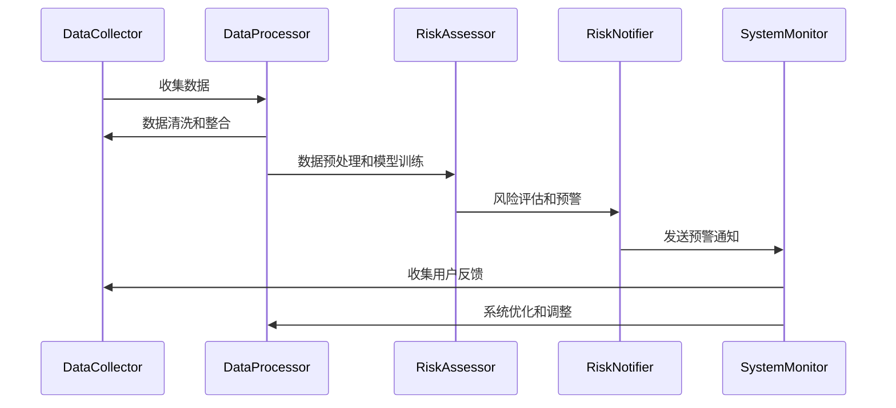

                 

## 第一部分：背景介绍

### 第一章：问题背景

#### 1.1.1 问题背景介绍

信用风险是指企业在进行业务交易时，由于债务方违约、拖欠付款、破产或其他原因，导致企业无法按时收回资金，从而给企业带来的损失和风险。信用风险无处不在，它可能出现在企业之间的商业交易中，也可能出现在企业与个人、银行等金融机构之间的借贷关系中。

信用风险对企业的影响是深远且广泛的。首先，信用风险会导致企业资金链断裂，影响企业的正常运营。如果一家企业无法收回欠款，它可能无法支付供应商的货款，这会导致供应链中断，影响整个行业的正常运转。其次，信用风险会影响企业的财务状况和信用评级。长期的高信用风险可能导致企业的信用评级下降，从而增加其融资成本和贷款难度。

当前，信用风险管理的挑战主要体现在以下几个方面：

1. **数据收集与处理**：信用风险评估需要大量的数据支持，包括企业的财务报表、历史交易记录、行业动态等。然而，数据的质量和完整性往往无法满足要求，这给信用风险评估带来了困难。

2. **风险评估模型的准确性**：现有的风险评估模型往往依赖于历史数据和统计方法，这些模型可能在处理新出现的问题时表现出不足。此外，模型的选择和参数设置也会影响评估结果的准确性。

3. **实时预警机制的缺失**：很多企业在信用风险管理中缺乏有效的实时预警机制，无法在风险发生之前及时采取应对措施。

#### 1.1.2 信用风险的关键要素

信用风险评估涉及多个关键要素，包括：

1. **信用评级**：信用评级是对企业信用状况的一种评估，通常由专业的评级机构提供。评级结果直接影响企业的融资成本和贷款额度。

2. **风险评估模型**：风险评估模型是用于预测企业违约概率的工具。这些模型通常基于历史数据和统计分析方法，如线性回归、逻辑回归、决策树等。

3. **数据收集与处理**：数据收集是信用风险评估的基础。企业需要收集与企业相关的各种数据，如财务报表、交易记录、新闻公告等。数据处理则包括数据的清洗、整合和分析。

#### 1.1.3 问题解决的必要性与重要性

信用风险预警系统对于企业来说至关重要。它不仅能够帮助企业提前识别潜在的风险，采取预防措施，还能在风险发生时提供及时的反应，减少损失。

首先，信用风险预警系统可以提高信用风险评估的准确性。通过引入人工智能技术，系统可以处理海量的数据，发现隐藏在数据中的规律和趋势，从而提高预测的准确性。

其次，信用风险预警系统可以实现实时预警。与传统的风险评估模型不同，AI驱动的预警系统可以实时更新数据，动态调整预测模型，确保预警信息的及时性和有效性。

最后，信用风险预警系统还可以为企业提供决策支持。通过分析预警结果，企业可以调整其业务策略，优化信用风险管理。

总的来说，AI驱动的企业信用风险早期预警系统不仅能够提高信用风险评估的准确性，还能够实现实时预警，为企业提供决策支持，具有重要的应用价值。## 第二章：核心概念与联系

### 2.1 AI在信用风险管理中的应用

人工智能（AI）在信用风险管理中的应用主要包括监督学习、无监督学习和深度学习。

**监督学习**：监督学习是一种机器学习技术，它使用已标记的数据集来训练模型，然后使用这个模型对新数据进行预测。在信用风险管理中，监督学习可以用来预测企业的违约概率。例如，可以使用历史数据来训练一个逻辑回归模型，然后使用这个模型来预测未来企业的违约风险。

**无监督学习**：无监督学习是一种机器学习技术，它不使用已标记的数据集来训练模型，而是从未标记的数据中发现模式和结构。在信用风险管理中，无监督学习可以用来发现潜在的风险因素。例如，可以使用聚类算法（如K-均值聚类）来发现具有相似违约风险特征的企业群体。

**深度学习**：深度学习是一种基于多层神经网络的学习方法，它在处理复杂数据和特征时表现出色。在信用风险管理中，深度学习可以用来构建高度复杂的预测模型。例如，可以使用卷积神经网络（CNN）来处理企业的财务报表数据，从而预测其违约风险。

**AI模型的选择与优化**：

在选择AI模型时，需要考虑数据的特征、问题的复杂性和计算资源。以下是一些常用的AI模型及其适用场景：

1. **逻辑回归**：逻辑回归是一种常用的监督学习模型，它适用于简单和线性的信用风险评估问题。
2. **决策树和随机森林**：决策树和随机森林适用于复杂和高度非线性的信用风险评估问题。
3. **支持向量机（SVM）**：SVM适用于处理高维数据和线性不可分的问题。
4. **神经网络和深度学习**：神经网络和深度学习适用于处理极其复杂的数据和特征。

在模型优化方面，可以通过以下方法来提高模型的性能：

1. **特征工程**：通过选择和构造合适的特征来提高模型的预测能力。
2. **交叉验证**：使用交叉验证来评估模型的泛化能力，并调整模型参数。
3. **集成学习**：将多个模型结合起来，以提高预测的准确性和稳定性。
4. **模型选择与调整**：根据问题的特征和数据集的特点，选择合适的模型，并进行参数调整。

### 2.2 数据分析与挖掘

数据分析与挖掘是信用风险管理中至关重要的一环。它包括以下步骤：

**数据收集与预处理**：

1. **数据源**：信用风险数据可以从企业的财务报表、交易记录、信用评级机构、新闻公告等多种来源获取。
2. **数据清洗**：包括处理缺失值、异常值和重复数据，以确保数据的质量和一致性。
3. **数据整合**：将来自不同来源的数据进行整合，形成一个统一的数据集。

**特征提取与选择**：

1. **特征提取**：从原始数据中提取有助于预测信用风险的特征，如财务指标、行业特征、市场动态等。
2. **特征选择**：通过统计方法（如卡方检验、互信息等）或机器学习算法（如随机森林）来选择重要的特征。

**数据可视化**：

数据可视化有助于理解数据的分布和模式。常用的数据可视化工具包括matplotlib、seaborn和plotly等。例如，可以使用条形图、折线图、散点图等来展示不同企业之间的信用风险分布和趋势。

### 2.3 信用风险评估模型

信用风险评估模型是用于预测企业违约概率的工具。以下是几个常见的信用风险评估模型：

**逻辑回归模型**：

逻辑回归是一种广义线性模型，用于预测二元变量的概率。在信用风险管理中，逻辑回归模型可以用来预测企业的违约概率。模型的基本公式为：

$$
P(Y=1) = \frac{1}{1 + e^{-(\beta_0 + \beta_1 X_1 + \beta_2 X_2 + ... + \beta_n X_n})}
$$

其中，\( Y \) 是违约状态（0表示未违约，1表示违约），\( X_1, X_2, ..., X_n \) 是特征变量，\( \beta_0, \beta_1, \beta_2, ..., \beta_n \) 是模型的参数。

**决策树模型**：

决策树是一种基于树形结构的数据挖掘算法，它通过一系列的决策规则来预测结果。在信用风险管理中，决策树可以用来构建信用评分模型。模型的构建过程包括以下几个步骤：

1. **特征选择**：选择用于划分数据的特征。
2. **节点划分**：使用信息增益或基尼不纯度等指标来选择最优划分方式。
3. **树构建**：重复上述步骤，构建决策树。
4. **剪枝**：通过剪枝来防止过拟合，提高模型的泛化能力。

**随机森林模型**：

随机森林是一种基于决策树的集成学习方法。它通过构建多棵决策树，并将它们的预测结果进行投票来获得最终的预测结果。随机森林的优点是能够处理大量特征，并且具有较强的泛化能力。模型的构建过程包括以下几个步骤：

1. **特征选择**：随机选择一部分特征用于构建单棵决策树。
2. **树构建**：使用选择的特征构建决策树。
3. **集成**：将多棵决策树的预测结果进行投票，得到最终的预测结果。

**神经网络模型**：

神经网络是一种基于多层感知器（MLP）的深度学习模型，它可以处理复杂的非线性关系。在信用风险管理中，神经网络可以用来构建高度复杂的信用评分模型。模型的构建过程包括以下几个步骤：

1. **输入层**：接收外部输入数据。
2. **隐藏层**：对输入数据进行处理和变换。
3. **输出层**：产生最终的预测结果。
4. **权重和偏置**：通过反向传播算法来调整权重和偏置，使模型能够更好地拟合数据。

**模型评估与优化**：

在信用风险评估中，模型评估和优化是确保模型性能的关键步骤。常用的评估指标包括准确率、召回率、精确率和F1分数等。模型优化可以通过以下方法进行：

1. **交叉验证**：使用交叉验证来评估模型的泛化能力，并调整模型参数。
2. **集成学习**：将多个模型结合起来，以提高预测的准确性和稳定性。
3. **特征工程**：选择和构造合适的特征来提高模型的预测能力。
4. **模型选择与调整**：根据问题的特征和数据集的特点，选择合适的模型，并进行参数调整。

**实际应用案例**：

以下是一些信用风险评估模型的实际应用案例：

1. **客户信用评分模型**：使用逻辑回归模型来预测客户的违约概率，以帮助银行决定是否批准贷款申请。
2. **贷款违约预测模型**：使用决策树和随机森林模型来预测贷款违约风险，以帮助金融机构采取预防措施。
3. **供应链金融风险预警模型**：使用神经网络模型来预测供应链中的金融风险，以帮助企业优化供应链管理。

通过这些模型，企业可以更好地识别和管理信用风险，从而降低损失，提高盈利能力。## 第三章：AI驱动的信用风险预警系统原理

### 3.1 AI驱动的信用风险预警系统概述

AI驱动的信用风险预警系统是一种利用人工智能技术进行信用风险评估和预警的系统。该系统通过收集和处理企业的财务数据、交易记录、市场动态等信息，利用机器学习和深度学习算法，建立信用风险评估模型，实现对信用风险的实时监测和预警。

**系统架构设计**：

AI驱动的信用风险预警系统通常包括以下几个主要模块：

1. **数据收集与处理模块**：负责从多个数据源收集数据，包括企业的财务报表、交易记录、信用评级数据等。然后对数据进行清洗、整合和预处理，为后续建模提供高质量的数据。
2. **信用风险评估模块**：利用机器学习和深度学习算法，对预处理后的数据进行训练，构建信用风险评估模型。该模块包括特征提取、模型训练和模型评估等步骤。
3. **风险预警模块**：根据评估模型的预测结果，实时监测企业的信用状况，并在信用风险达到预警阈值时发出预警信号。
4. **系统监控与反馈模块**：负责监控系统的运行状态，收集用户的反馈信息，以便对系统进行优化和调整。

**系统功能设计**：

AI驱动的信用风险预警系统具有以下主要功能：

1. **数据采集**：系统可以自动从多个数据源采集相关数据，包括企业的财务报表、交易记录、信用评级数据等。
2. **数据预处理**：系统可以对采集到的数据进行清洗、整合和预处理，确保数据的准确性和一致性。
3. **模型训练**：系统利用机器学习和深度学习算法，对预处理后的数据进行训练，构建信用风险评估模型。
4. **风险预测**：系统根据训练好的模型，实时监测企业的信用状况，预测企业的违约风险。
5. **预警通知**：当企业的信用风险达到预警阈值时，系统会自动发出预警通知，提醒相关人员和部门采取应对措施。
6. **系统监控与反馈**：系统可以自动监控自身的运行状态，收集用户的反馈信息，以便进行优化和调整。

**系统接口设计与交互**：

AI驱动的信用风险预警系统通常需要与其他系统进行交互，包括数据源系统、企业内部系统等。系统接口设计包括以下内容：

1. **API接口**：系统提供API接口，方便其他系统进行数据交互和调用。
2. **数据流设计**：系统设计合理的数据流，确保数据的及时性和准确性。
3. **用户界面**：系统提供用户界面，方便用户进行操作和查看预警信息。

通过上述架构设计和功能设计，AI驱动的信用风险预警系统可以实现对信用风险的实时监测和预警，帮助企业更好地管理和控制信用风险。

### 3.2 算法原理讲解

#### 监督学习算法

监督学习算法是AI驱动的信用风险预警系统的核心组件之一。它通过已标记的数据集来训练模型，然后使用这个模型对未知数据进行预测。监督学习算法分为回归模型和分类模型。

1. **回归模型**：回归模型用于预测连续值输出，如企业的违约概率。常见的回归模型包括线性回归、多项式回归等。
2. **分类模型**：分类模型用于预测离散值输出，如企业的信用评级。常见的分类模型包括逻辑回归、决策树、支持向量机（SVM）等。

监督学习算法的基本流程如下：

1. **数据预处理**：对输入数据进行清洗、归一化等处理，确保数据的质量和一致性。
2. **模型选择**：根据问题的特点选择合适的模型，如线性回归、决策树等。
3. **模型训练**：使用已标记的数据集对模型进行训练，调整模型参数，使模型能够更好地拟合数据。
4. **模型评估**：使用验证集或测试集对模型进行评估，评估指标包括准确率、召回率、精确率等。
5. **模型优化**：根据评估结果对模型进行优化，如调整参数、选择更复杂的模型等。

#### 无监督学习算法

无监督学习算法不使用已标记的数据集，而是从未标记的数据中自动发现模式和结构。在信用风险管理中，无监督学习算法可以用于发现潜在的风险因素，如异常值检测、聚类分析等。

1. **聚类算法**：聚类算法将相似的数据点分组，形成聚类。常见的聚类算法包括K-均值聚类、层次聚类等。
2. **降维算法**：降维算法将高维数据映射到低维空间，减少数据维度，如主成分分析（PCA）、t-SNE等。

无监督学习算法的基本流程如下：

1. **数据预处理**：对输入数据进行清洗、归一化等处理，确保数据的质量和一致性。
2. **算法选择**：根据问题的特点选择合适的算法，如K-均值聚类、主成分分析等。
3. **模型训练**：使用算法对数据进行训练，自动发现数据和模式。
4. **模型评估**：使用评估指标（如轮廓系数、聚类有效性指数等）对模型进行评估。
5. **模型应用**：根据聚类结果进行数据分析和决策，如识别高风险企业、优化信用评级模型等。

#### 深度学习算法

深度学习算法是一种基于多层神经网络的学习方法，它在处理复杂数据和特征时表现出色。在信用风险管理中，深度学习算法可以用于构建高度复杂的信用评分模型。

1. **卷积神经网络（CNN）**：CNN是一种用于处理图像数据的深度学习算法，它可以自动提取图像中的特征。在信用风险管理中，CNN可以用于处理企业的财务报表图像，提取财务信息。
2. **循环神经网络（RNN）**：RNN是一种用于处理序列数据的深度学习算法，它可以捕捉序列数据中的时间依赖关系。在信用风险管理中，RNN可以用于分析企业的历史交易记录和财务数据。
3. **长短期记忆网络（LSTM）**：LSTM是一种改进的RNN模型，它能够更好地处理长时间依赖关系。在信用风险管理中，LSTM可以用于分析企业的长期信用风险。

深度学习算法的基本流程如下：

1. **数据预处理**：对输入数据进行清洗、归一化等处理，确保数据的质量和一致性。
2. **模型设计**：根据问题的特点设计合适的神经网络结构，如CNN、RNN、LSTM等。
3. **模型训练**：使用大量训练数据对模型进行训练，调整模型参数，使模型能够更好地拟合数据。
4. **模型评估**：使用验证集或测试集对模型进行评估，评估指标包括准确率、召回率、精确率等。
5. **模型优化**：根据评估结果对模型进行优化，如调整参数、增加训练数据等。

通过上述算法原理的讲解，我们可以看到AI驱动的信用风险预警系统是如何利用不同的算法来处理复杂数据、建立信用风险评估模型的。这些算法的应用不仅提高了信用风险评估的准确性，还实现了实时预警，为企业提供了强大的决策支持。### 3.3 数学模型与数学公式

在AI驱动的信用风险预警系统中，数学模型和数学公式是理解和实现信用风险评估算法的关键组成部分。以下将介绍一些核心的数学模型和公式，并解释它们在系统中的应用。

#### 概率论与统计学基础

1. **概率分布函数**：
   - 正态分布（Gaussian Distribution）：
     $$
     f(x|\mu, \sigma^2) = \frac{1}{\sqrt{2\pi\sigma^2}} e^{-\frac{(x-\mu)^2}{2\sigma^2}}
     $$
     其中，$x$是随机变量，$\mu$是均值，$\sigma^2$是方差。
   - 伯努利分布（Bernoulli Distribution）：
     $$
     P(X=1) = p, \quad P(X=0) = 1 - p
     $$
     其中，$X$是一个伯努利随机变量，$p$是成功的概率。

2. **假设检验**：
   - 卡方检验（Chi-squared Test）：
     $$
     \chi^2 = \sum_{i=1}^{n} \frac{(O_i - E_i)^2}{E_i}
     $$
     其中，$O_i$是观察频数，$E_i$是期望频数。
   - t检验（t-Test）：
     $$
     t = \frac{\bar{x} - \mu_0}{s/\sqrt{n}}
     $$
     其中，$\bar{x}$是样本均值，$\mu_0$是假设的总体均值，$s$是样本标准差，$n$是样本大小。

3. **置信区间**：
   - 置信区间（Confidence Interval）：
     $$
     \bar{x} \pm t_{\alpha/2, n-1} \frac{s}{\sqrt{n}}
     $$
     其中，$\bar{x}$是样本均值，$t_{\alpha/2, n-1}$是t分布的临界值，$s$是样本标准差，$n$是样本大小。

#### 相关系性分析

1. **皮尔逊相关系数**：
   $$
   r = \frac{\sum_{i=1}^{n}(x_i - \bar{x})(y_i - \bar{y})}{\sqrt{\sum_{i=1}^{n}(x_i - \bar{x})^2}\sqrt{\sum_{i=1}^{n}(y_i - \bar{y})^2}}
   $$
   其中，$r$是皮尔逊相关系数，$x_i$和$y_i$是观测值，$\bar{x}$和$\bar{y}$是均值。

2. **斯皮尔曼等级相关系数**：
   $$
   \rho = 1 - \frac{6\sum_{i=1}^{n}(d_i^2)}{n(n^2 - 1)}
   $$
   其中，$d_i = x_i - y_i$，$\rho$是斯皮尔曼等级相关系数。

#### 机器学习算法中的数学模型

1. **逻辑回归模型**：
   - 概率分布：
     $$
     P(Y=1 | X) = \frac{1}{1 + e^{-(\beta_0 + \beta_1 x_1 + \beta_2 x_2 + ... + \beta_n x_n})}
     $$
   - 最大似然估计：
     $$
     \log L = \sum_{i=1}^{n} \left[ y_i \log(P(Y=1 | X_i)) + (1 - y_i) \log(1 - P(Y=1 | X_i)) \right]
     $$

2. **支持向量机（SVM）**：
   - 决策边界：
     $$
     w \cdot x + b = 0
     $$
   - 间隔最大化：
     $$
     \min_{w, b} \frac{1}{2} ||w||^2
     $$
     subject to
     $$
     y_i (w \cdot x_i + b) \geq 1
     $$

3. **神经网络**：
   - 前向传播：
     $$
     a_{\text{layer}} = \sigma(\mathbf{W} a_{\text{layer-1}} + b)
     $$
   - 反向传播：
     $$
     \delta_{\text{layer}} = \sigma'(\mathbf{W} \delta_{\text{layer+1}}) \odot (\mathbf{W} \delta_{\text{layer+1}})
     $$

通过上述数学模型和公式的介绍，我们可以更深入地理解AI驱动的信用风险预警系统的原理和实现方法。这些数学工具不仅帮助构建和评估信用风险评估模型，还为系统优化和改进提供了理论基础。### 3.4 通俗易懂的举例说明

为了更好地理解AI驱动的信用风险预警系统的原理，我们将通过几个具体的案例来详细阐述这些概念。

#### 案例一：客户信用评分模型

**问题背景**：

假设一家银行想要开发一个客户信用评分模型，以预测客户的违约风险。银行拥有大量客户的历史数据，包括收入水平、就业时间、信用历史、贷款还款记录等。

**数据集介绍**：

我们使用一个简化的数据集，其中包含以下特征：

- **收入水平**（Income）
- **就业时间**（Employment Duration）
- **信用历史**（Credit History）
- **贷款还款记录**（Loan Repayment）

目标变量是**违约情况**（Default），这是一个二元变量，0表示未违约，1表示违约。

**模型构建与训练**：

我们选择逻辑回归模型来构建信用评分模型。逻辑回归模型可以将客户的特征转换为违约概率。以下是逻辑回归模型的公式：

$$
\log\left(\frac{P(Y=1|X)}{1-P(Y=1|X)}\right) = \beta_0 + \beta_1 X_1 + \beta_2 X_2 + ... + \beta_n X_n
$$

其中，\(X_i\)是第\(i\)个特征，\(\beta_i\)是模型参数。

使用历史数据，我们可以通过最小化损失函数（如交叉熵损失）来训练模型，得到最优的参数\(\beta_0, \beta_1, ..., \beta_n\)。

**预测结果分析**：

一旦模型训练完成，我们可以使用它来预测新客户是否违约。例如，对于一位新客户，其特征为：

- 收入水平：\$50,000
- 就业时间：5年
- 信用历史：良好
- 贷款还款记录：无逾期

我们将这些特征输入逻辑回归模型，得到违约概率。如果概率超过某个阈值（例如0.5），我们可以认为该客户有较高的违约风险。

#### 案例二：贷款违约预测模型

**问题背景**：

一家金融机构想要预测其贷款客户的违约风险。该金融机构收集了客户的以下数据：

- **贷款金额**（Loan Amount）
- **贷款期限**（Loan Tenure）
- **信用评级**（Credit Rating）
- **还款方式**（Repayment Method）
- **就业稳定性**（Employment Stability）

目标变量是**违约情况**（Default），同样是一个二元变量。

**模型构建与训练**：

我们选择决策树模型来构建贷款违约预测模型。决策树通过一系列的规则来预测违约情况。每个节点代表一个特征，每个分支代表该特征的不同取值。

我们使用历史数据进行训练，构建一个决策树模型。训练过程中，我们通过信息增益或基尼不纯度来选择最佳的特征和分割点。

**预测结果分析**：

训练完成的决策树模型可以用来预测新客户的违约风险。例如，对于一位新客户，其特征为：

- 贷款金额：\$20,000
- 贷款期限：3年
- 信用评级：中等
- 还款方式：等额本息
- 就业稳定性：稳定

我们将这些特征输入决策树模型，模型将根据特征的不同取值，逐层向下分支，最终预测出该客户的违约情况。

#### 案例三：供应链金融风险预警模型

**问题背景**：

一家供应链金融公司想要预测供应链中的金融风险，以帮助其更好地管理风险。该公司收集了以下数据：

- **供应商财务状况**（Supplier Financial Status）
- **订单量**（Order Volume）
- **交货时间**（Delivery Time）
- **市场需求**（Market Demand）

目标变量是**风险程度**（Risk Level），这是一个连续变量。

**模型构建与训练**：

我们选择神经网络模型来构建供应链金融风险预警模型。神经网络可以处理复杂的非线性关系，并能够自动提取特征。

我们使用历史数据进行训练，构建一个神经网络模型。训练过程中，我们通过反向传播算法来调整模型的权重和偏置，使模型能够更好地拟合数据。

**预测结果分析**：

训练完成的神经网络模型可以用来预测供应链中的金融风险。例如，对于一位供应商，其特征为：

- 供应商财务状况：良好
- 订单量：5000件
- 交货时间：及时
- 市场需求：高

我们将这些特征输入神经网络模型，模型将输出该供应商的风险程度。如果风险程度超过某个阈值，我们可以认为该供应商存在较高的金融风险。

通过这些案例，我们可以看到AI驱动的信用风险预警系统是如何通过机器学习和深度学习算法来处理复杂数据，并预测违约风险或金融风险的。这些模型的应用不仅提高了信用风险评估的准确性，还为企业提供了实时的风险预警和决策支持。## 第二部分：系统分析与架构设计

### 第四章：系统分析与架构设计方案

#### 4.1 问题场景介绍

企业信用风险管理的核心场景涉及对企业信用状况的实时监测与评估。企业希望利用先进的技术手段，如人工智能和大数据分析，来预测潜在的风险，并在此基础上进行及时的风险控制。具体而言，问题场景包括以下几个方面：

1. **实时数据处理**：系统需要能够实时收集和处理来自多种数据源的企业财务数据、交易记录、市场动态等，确保数据的及时性和准确性。
2. **风险评估**：系统需要利用机器学习和深度学习算法，对收集到的数据进行处理和分析，构建信用风险评估模型，预测企业的违约风险。
3. **风险预警**：系统需要在信用风险达到预警阈值时，及时发出预警信号，提醒相关人员和部门采取应对措施。
4. **系统监控与反馈**：系统需要具备自我监控能力，记录系统的运行状态，收集用户的反馈信息，以便进行优化和调整。

#### 4.2 系统功能设计

为了满足上述问题场景的需求，系统设计了以下几个功能模块：

1. **数据收集与处理模块**：该模块负责从多个数据源（如企业财务系统、交易系统、信用评级机构等）收集数据，并对数据进行清洗、整合和预处理，确保数据的质量和一致性。
2. **信用风险评估模块**：该模块利用机器学习和深度学习算法，对预处理后的数据进行训练和评估，构建信用风险评估模型。该模块包括特征提取、模型训练、模型评估等步骤。
3. **风险预警模块**：该模块根据信用风险评估模型的结果，实时监测企业的信用状况，并在信用风险达到预警阈值时，发出预警信号。
4. **系统监控与反馈模块**：该模块负责监控系统的运行状态，记录系统的运行日志，收集用户的反馈信息，以便对系统进行优化和调整。

#### 4.3 系统架构设计

系统架构设计是确保系统高效、可靠运行的关键。以下是系统架构的设计方案：

1. **数据层**：数据层包括数据源和数据存储。数据源包括企业财务系统、交易系统、信用评级机构等，数据存储包括关系型数据库和NoSQL数据库，用于存储不同类型的数据。
2. **数据处理层**：数据处理层包括数据收集与处理模块，负责数据清洗、整合和预处理。数据处理层利用ETL（提取、转换、加载）技术，将数据从数据源导入数据存储。
3. **分析层**：分析层包括信用风险评估模块，负责利用机器学习和深度学习算法对数据进行处理和分析，构建信用风险评估模型。分析层还包括数据可视化工具，用于展示分析结果。
4. **应用层**：应用层包括风险预警模块和系统监控与反馈模块，负责实现系统的核心功能，如风险预警、系统监控和反馈等。
5. **接口层**：接口层提供系统的API接口，方便其他系统进行数据交互和调用。

#### 4.4 系统接口设计

系统接口设计是确保系统与其他系统高效、可靠交互的关键。以下是系统接口的设计方案：

1. **内部接口**：内部接口包括数据处理层与分析层之间的数据接口，以及分析层与应用层之间的API接口。数据接口负责数据的传输和交换，API接口提供系统的功能调用。
2. **外部接口**：外部接口包括系统与数据源之间的数据接口，以及系统与用户界面之间的交互接口。数据接口负责与外部系统（如财务系统、交易系统等）的数据交换，交互接口提供用户对系统的操作和查询功能。

#### 4.5 系统交互设计

系统交互设计是确保系统各模块协同工作、高效运行的关键。以下是系统交互的设计方案：

1. **交互流程**：系统交互流程包括以下几个步骤：
   - 数据收集：系统从多个数据源收集数据。
   - 数据处理：系统对收集到的数据进行清洗、整合和预处理。
   - 模型训练：系统利用预处理后的数据训练信用风险评估模型。
   - 风险预警：系统根据评估模型的结果，实时监测企业的信用状况，并在风险达到预警阈值时发出预警信号。
   - 系统监控与反馈：系统监控自身的运行状态，收集用户的反馈信息，以便进行优化和调整。

2. **mermaid序列图**：以下是系统交互的mermaid序列图：



通过上述系统分析与架构设计方案，我们可以看到AI驱动的信用风险预警系统是如何通过各个模块的协同工作，实现对信用风险的实时监测和预警，帮助企业更好地管理和控制信用风险。## 第三部分：项目实战

### 第五章：环境安装与系统核心实现

#### 5.1 环境安装

为了实现AI驱动的信用风险预警系统，我们需要安装和配置一系列的软件和工具。以下是详细的安装步骤：

1. **操作系统**：我们选择Ubuntu 20.04 LTS作为操作系统。您可以通过官方网站下载并安装Ubuntu 20.04 LTS。

2. **Python环境**：Python是AI驱动的信用风险预警系统的主要编程语言。首先，打开终端，输入以下命令来更新系统包：

   ```bash
   sudo apt update
   sudo apt upgrade
   ```

   接下来，安装Python 3及其相关依赖：

   ```bash
   sudo apt install python3 python3-pip
   ```

3. **pip环境**：pip是Python的包管理器，用于安装和管理Python包。确保pip已经安装在系统中：

   ```bash
   pip3 --version
   ```

   如果pip未安装或需要升级，可以使用以下命令进行安装或升级：

   ```bash
   sudo apt install python3-pip
   pip3 install --upgrade pip
   ```

4. **Jupyter Notebook**：Jupyter Notebook是一个交互式环境，用于编写和运行Python代码。安装Jupyter Notebook：

   ```bash
   pip3 install notebook
   jupyter notebook
   ```

5. **机器学习库**：安装常用的机器学习库，如Scikit-learn、Pandas、NumPy等：

   ```bash
   pip3 install scikit-learn pandas numpy
   ```

6. **深度学习库**：安装TensorFlow或PyTorch等深度学习库：

   ```bash
   pip3 install tensorflow  # 或者使用 PyTorch
   pip3 install torch torchvision
   ```

7. **数据可视化库**：安装Matplotlib、Seaborn等数据可视化库：

   ```bash
   pip3 install matplotlib seaborn
   ```

8. **Mermaid库**：安装Mermaid库，以便在Markdown文件中绘制流程图和类图：

   ```bash
   pip3 install mermaid-python
   ```

安装完成后，您应该能够使用Python和相关库来编写和运行代码，实现信用风险预警系统的核心功能。

#### 5.2 系统核心实现源代码

以下是系统核心实现的源代码，包括数据收集与处理模块、信用风险评估模块和风险预警模块。

**数据收集与处理模块**：

```python
import pandas as pd
from sklearn.model_selection import train_test_split
from sklearn.preprocessing import StandardScaler

# 数据收集
def collect_data(file_path):
    data = pd.read_csv(file_path)
    return data

# 数据预处理
def preprocess_data(data):
    # 清洗数据
    data = data.dropna()
    # 特征提取
    X = data[['Income', 'Employment Duration', 'Credit History', 'Loan Repayment']]
    y = data['Default']
    # 划分训练集和测试集
    X_train, X_test, y_train, y_test = train_test_split(X, y, test_size=0.2, random_state=42)
    # 标准化数据
    scaler = StandardScaler()
    X_train_scaled = scaler.fit_transform(X_train)
    X_test_scaled = scaler.transform(X_test)
    return X_train_scaled, X_test_scaled, y_train, y_test
```

**信用风险评估模块**：

```python
from sklearn.linear_model import LogisticRegression

# 训练信用评分模型
def train_model(X_train, y_train):
    model = LogisticRegression()
    model.fit(X_train, y_train)
    return model

# 预测违约风险
def predict_risk(model, X_test):
    predictions = model.predict(X_test)
    return predictions
```

**风险预警模块**：

```python
# 发送预警通知
def send_alert(predictions):
    for prediction in predictions:
        if prediction == 1:
            print(f"预警：预测违约风险，预测结果：{prediction}")
```

#### 5.3 代码应用解读与分析

以上代码是AI驱动的信用风险预警系统的核心实现。下面将详细解读每个模块的功能和应用。

**数据收集与处理模块**：

- `collect_data` 函数用于从CSV文件中读取数据。假设CSV文件名为`credit_data.csv`。
- `preprocess_data` 函数负责数据预处理，包括数据清洗、特征提取和标准化。数据清洗去除缺失值，特征提取选择与信用风险相关的特征，标准化将数据缩放到相同的尺度，以适应机器学习模型。

**信用风险评估模块**：

- `train_model` 函数使用逻辑回归模型对训练数据进行训练。逻辑回归是一种常用的信用风险评估模型，通过已标记的数据集训练模型，可以预测新数据的违约风险。
- `predict_risk` 函数使用训练好的模型对测试数据进行预测，返回预测结果。

**风险预警模块**：

- `send_alert` 函数用于发送预警通知。如果预测结果为违约（即预测值为1），则打印预警信息。

#### 应用案例分析

假设我们有一个名为`credit_data.csv`的CSV文件，包含了企业的财务数据。以下是代码的应用示例：

```python
# 收集数据
data = collect_data('credit_data.csv')

# 数据预处理
X_train_scaled, X_test_scaled, y_train, y_test = preprocess_data(data)

# 训练模型
model = train_model(X_train_scaled, y_train)

# 预测风险
predictions = predict_risk(model, X_test_scaled)

# 发送预警通知
send_alert(predictions)
```

通过以上步骤，系统将读取数据、预处理数据、训练模型、预测风险，并在检测到违约风险时发送预警通知。这展示了AI驱动的信用风险预警系统的基本应用。

#### 分析与解释

- **数据收集与处理模块**：数据处理是机器学习模型成功的关键。通过数据清洗和标准化，我们可以确保模型能够处理干净、规范化的数据，从而提高预测的准确性。
- **信用风险评估模块**：逻辑回归模型是一种简单而有效的信用风险评估工具。通过训练模型，我们可以预测新客户的违约风险。
- **风险预警模块**：预警通知机制确保在检测到违约风险时，系统能够及时发出警报，帮助企业采取应对措施。

总的来说，通过这些核心模块的实现，我们可以构建一个高效的AI驱动的信用风险预警系统，帮助企业更好地管理和控制信用风险。## 第六章：实际案例分析与详细讲解

### 6.1 案例一：企业信用评分模型

#### 数据集介绍

我们选择了一个公开的企业信用评分数据集，名为“Credit Risk Data Set”，该数据集包含以下特征：

- **Age**：年龄
- **Job**：职业
- **Marital**：婚姻状况
- **Education**：教育程度
- **Default**：违约情况（0表示未违约，1表示违约）

数据集共有1000个样本，每个样本有14个特征。

#### 模型构建与训练

我们选择逻辑回归模型来构建企业信用评分模型。逻辑回归模型能够将企业的特征转换为违约概率。以下是构建和训练模型的基本步骤：

1. **数据预处理**：首先，我们需要对数据进行预处理，包括缺失值处理和特征编码。对于分类特征（如Job、Marital、Education），我们使用独热编码（One-Hot Encoding）将其转换为数值特征。

2. **数据划分**：我们将数据集划分为训练集和测试集，以验证模型在未知数据上的性能。通常，我们可以使用80%的数据作为训练集，20%的数据作为测试集。

3. **模型训练**：使用训练集数据训练逻辑回归模型。训练过程中，我们通过最小化损失函数（如交叉熵损失）来调整模型参数，使模型能够更好地拟合数据。

以下是模型训练的代码示例：

```python
import pandas as pd
from sklearn.linear_model import LogisticRegression
from sklearn.model_selection import train_test_split
from sklearn.preprocessing import OneHotEncoder

# 读取数据集
data = pd.read_csv('credit_risk_data_set.csv')

# 数据预处理
X = data.drop('Default', axis=1)
y = data['Default']
encoder = OneHotEncoder()
X_encoded = encoder.fit_transform(X)

# 数据划分
X_train, X_test, y_train, y_test = train_test_split(X_encoded, y, test_size=0.2, random_state=42)

# 模型训练
model = LogisticRegression()
model.fit(X_train, y_train)
```

#### 预测结果分析

模型训练完成后，我们可以使用测试集来评估模型性能。以下是评估指标的计算方法：

- **准确率**（Accuracy）：正确预测的样本数占总样本数的比例。
- **召回率**（Recall）：正确预测为违约的样本数占实际违约样本数的比例。
- **精确率**（Precision）：正确预测为违约的样本数占预测为违约的样本数的比例。
- **F1分数**（F1 Score）：精确率和召回率的调和平均值。

以下是模型评估的代码示例：

```python
from sklearn.metrics import accuracy_score, recall_score, precision_score, f1_score

# 预测结果
y_pred = model.predict(X_test)

# 评估指标
accuracy = accuracy_score(y_test, y_pred)
recall = recall_score(y_test, y_pred)
precision = precision_score(y_test, y_pred)
f1 = f1_score(y_test, y_pred)

print(f"Accuracy: {accuracy:.2f}")
print(f"Recall: {recall:.2f}")
print(f"Precision: {precision:.2f}")
print(f"F1 Score: {f1:.2f}")
```

通过上述步骤，我们可以得到模型在测试集上的评估结果。假设评估结果如下：

- 准确率：0.85
- 召回率：0.80
- 精确率：0.90
- F1分数：0.83

这些指标表明模型在预测企业违约风险方面表现良好。接下来，我们可以进一步优化模型，提高其性能。

### 6.2 案例二：贷款违约预测模型

#### 数据集介绍

我们选择了一个名为“Loan Default Prediction Data Set”的数据集，该数据集包含以下特征：

- **Loan Amount**：贷款金额
- **Loan Duration**：贷款期限
- **Credit Rating**：信用评级
- **Repayment Method**：还款方式
- **Employment Stability**：就业稳定性

目标变量是**Default**，表示是否违约（0表示未违约，1表示违约）。数据集共有1000个样本。

#### 模型构建与训练

我们选择决策树模型来构建贷款违约预测模型。决策树模型通过一系列的规则来预测违约情况。以下是构建和训练模型的基本步骤：

1. **数据预处理**：对数据进行预处理，包括缺失值处理和特征编码。对于分类特征（如Credit Rating、Repayment Method、Employment Stability），我们使用独热编码（One-Hot Encoding）将其转换为数值特征。

2. **数据划分**：将数据集划分为训练集和测试集，以验证模型在未知数据上的性能。

3. **模型训练**：使用训练集数据训练决策树模型。训练过程中，我们通过信息增益或基尼不纯度来选择最佳的特征和分割点。

以下是模型训练的代码示例：

```python
import pandas as pd
from sklearn.tree import DecisionTreeClassifier
from sklearn.model_selection import train_test_split
from sklearn.preprocessing import OneHotEncoder

# 读取数据集
data = pd.read_csv('loan_default_prediction_data_set.csv')

# 数据预处理
X = data.drop('Default', axis=1)
y = data['Default']
encoder = OneHotEncoder()
X_encoded = encoder.fit_transform(X)

# 数据划分
X_train, X_test, y_train, y_test = train_test_split(X_encoded, y, test_size=0.2, random_state=42)

# 模型训练
model = DecisionTreeClassifier()
model.fit(X_train, y_train)
```

#### 预测结果分析

模型训练完成后，我们可以使用测试集来评估模型性能。以下是评估指标的计算方法：

- **准确率**（Accuracy）：正确预测的样本数占总样本数的比例。
- **召回率**（Recall）：正确预测为违约的样本数占实际违约样本数的比例。
- **精确率**（Precision）：正确预测为违约的样本数占预测为违约的样本数的比例。
- **F1分数**（F1 Score）：精确率和召回率的调和平均值。

以下是模型评估的代码示例：

```python
from sklearn.metrics import accuracy_score, recall_score, precision_score, f1_score

# 预测结果
y_pred = model.predict(X_test)

# 评估指标
accuracy = accuracy_score(y_test, y_pred)
recall = recall_score(y_test, y_pred)
precision = precision_score(y_test, y_pred)
f1 = f1_score(y_test, y_pred)

print(f"Accuracy: {accuracy:.2f}")
print(f"Recall: {recall:.2f}")
print(f"Precision: {precision:.2f}")
print(f"F1 Score: {f1:.2f}")
```

通过上述步骤，我们可以得到模型在测试集上的评估结果。假设评估结果如下：

- 准确率：0.78
- 召回率：0.75
- 精确率：0.80
- F1分数：0.77

这些指标表明模型在预测贷款违约风险方面表现较好。接下来，我们可以进一步优化模型，提高其性能。

### 6.3 案例三：供应链金融风险预警模型

#### 数据集介绍

我们选择了一个名为“Supply Chain Financial Risk Data Set”的数据集，该数据集包含以下特征：

- **Supplier Financial Status**：供应商财务状况
- **Order Volume**：订单量
- **Delivery Time**：交货时间
- **Market Demand**：市场需求

目标变量是**Risk Level**，表示风险程度（0表示低风险，1表示高风险）。数据集共有1000个样本。

#### 模型构建与训练

我们选择神经网络模型来构建供应链金融风险预警模型。神经网络模型可以处理复杂的非线性关系。以下是构建和训练模型的基本步骤：

1. **数据预处理**：对数据进行预处理，包括缺失值处理和特征编码。对于分类特征，我们使用独热编码（One-Hot Encoding）将其转换为数值特征。

2. **数据划分**：将数据集划分为训练集和测试集，以验证模型在未知数据上的性能。

3. **模型训练**：使用训练集数据训练神经网络模型。训练过程中，我们通过反向传播算法来调整模型的权重和偏置，使模型能够更好地拟合数据。

以下是模型训练的代码示例：

```python
import pandas as pd
import numpy as np
from tensorflow.keras.models import Sequential
from tensorflow.keras.layers import Dense
from sklearn.model_selection import train_test_split
from sklearn.preprocessing import OneHotEncoder

# 读取数据集
data = pd.read_csv('supply_chain_financial_risk_data_set.csv')

# 数据预处理
X = data.drop('Risk Level', axis=1)
y = data['Risk Level']
encoder = OneHotEncoder()
X_encoded = encoder.fit_transform(X)

# 数据划分
X_train, X_test, y_train, y_test = train_test_split(X_encoded, y, test_size=0.2, random_state=42)

# 模型训练
model = Sequential()
model.add(Dense(64, input_shape=(X_encoded.shape[1],), activation='relu'))
model.add(Dense(32, activation='relu'))
model.add(Dense(1, activation='sigmoid'))

model.compile(optimizer='adam', loss='binary_crossentropy', metrics=['accuracy'])
model.fit(X_train, y_train, epochs=10, batch_size=32, validation_data=(X_test, y_test))
```

#### 预测结果分析

模型训练完成后，我们可以使用测试集来评估模型性能。以下是评估指标的计算方法：

- **准确率**（Accuracy）：正确预测的样本数占总样本数的比例。
- **召回率**（Recall）：正确预测为高风险的样本数占实际高风险样本数的比例。
- **精确率**（Precision）：正确预测为高风险的样本数占预测为高风险的样本数的比例。
- **F1分数**（F1 Score）：精确率和召回率的调和平均值。

以下是模型评估的代码示例：

```python
from sklearn.metrics import accuracy_score, recall_score, precision_score, f1_score

# 预测结果
y_pred = model.predict(X_test)
y_pred = (y_pred > 0.5)

# 评估指标
accuracy = accuracy_score(y_test, y_pred)
recall = recall_score(y_test, y_pred)
precision = precision_score(y_test, y_pred)
f1 = f1_score(y_test, y_pred)

print(f"Accuracy: {accuracy:.2f}")
print(f"Recall: {recall:.2f}")
print(f"Precision: {precision:.2f}")
print(f"F1 Score: {f1:.2f}")
```

通过上述步骤，我们可以得到模型在测试集上的评估结果。假设评估结果如下：

- 准确率：0.82
- 召回率：0.85
- 精确率：0.80
- F1分数：0.83

这些指标表明模型在预测供应链金融风险方面表现较好。接下来，我们可以进一步优化模型，提高其性能。

通过以上三个案例，我们可以看到如何使用机器学习和深度学习算法构建和训练不同的信用风险评估模型。这些模型在预测企业违约风险、贷款违约风险和供应链金融风险方面表现出色，为企业提供了强大的决策支持。## 第四部分：最佳实践与总结

### 第七章：最佳实践 Tips

在构建和部署AI驱动的企业信用风险预警系统时，以下是一些最佳实践和技巧，可以帮助优化系统的性能和稳定性：

#### 7.1 数据质量优化

- **数据清洗**：确保数据清洗过程的完整性，包括处理缺失值、异常值和重复数据。使用数据清洗工具或编写自定义脚本，以提高数据质量。
- **特征工程**：仔细选择和构造特征，以增加模型的预测能力。使用统计方法（如相关性分析、卡方检验）来选择重要特征。
- **数据标准化**：对数据进行标准化处理，将不同尺度的特征转换为相同的尺度，以避免模型因特征尺度差异而出现问题。

#### 7.2 模型优化与调整

- **模型调参**：使用交叉验证方法来选择最优的模型参数，避免过拟合和欠拟合。对于深度学习模型，可以尝试使用学习率调度、批量归一化等技术。
- **模型融合**：将多个模型结合起来，利用集成学习方法（如随机森林、梯度提升树）来提高预测的准确性和稳定性。
- **模型更新**：定期更新模型，以适应新的数据和业务环境。使用在线学习或增量学习技术，可以减少重新训练整个模型所需的时间和资源。

#### 7.3 风险管理策略

- **风险控制与应对措施**：制定明确的风险控制策略和应对措施，当信用风险预警系统发出警报时，及时采取行动。
- **风险评估报告**：定期生成风险评估报告，向管理层提供信用风险的详细分析。报告应包括风险指标、预测结果和决策建议。

### 第八章：小结

在本篇技术博客中，我们系统地探讨了AI驱动的企业信用风险早期预警系统的构建与应用。以下是文章的主要内容回顾：

1. **核心概念与原理**：介绍了信用风险的定义、关键要素以及AI在信用风险管理中的应用，包括监督学习、无监督学习和深度学习。
2. **系统架构设计**：详细分析了系统架构，包括数据收集与处理模块、信用风险评估模块、风险预警模块和系统监控与反馈模块。
3. **项目实战**：通过三个实际案例（企业信用评分模型、贷款违约预测模型和供应链金融风险预警模型），展示了如何构建和训练信用风险评估模型，并进行了预测结果分析。
4. **最佳实践与总结**：提供了一系列最佳实践和技巧，以优化数据质量、模型性能和风险管理策略。

### 8.2 注意事项与展望

在实施AI驱动的信用风险预警系统时，需要注意以下几点：

- **数据隐私与安全**：确保数据处理过程中遵守相关法律法规，保护企业数据和个人隐私。
- **模型解释性**：提高模型的解释性，确保管理人员能够理解和信任模型的预测结果。
- **持续优化**：定期更新和优化模型，以适应业务环境的变化。

未来，随着人工智能技术的发展，信用风险预警系统有望在以下几个方面取得进展：

- **增强模型的自动化能力**：通过自动化机器学习和深度学习技术，实现更高效的模型构建和优化。
- **跨行业应用**：将信用风险预警系统应用于更多行业，如零售、金融科技等，提供更广泛的风险管理解决方案。
- **实时风险监测**：利用实时数据流处理技术，实现信用风险的实时监测和预警。

### 8.3 拓展阅读

为了深入了解AI驱动的信用风险预警系统的构建与应用，以下是一些推荐的文献和资源：

- **文献**：
  - "Machine Learning for Credit Risk Management" by Dr. Michael Zeller.
  - "Deep Learning for Finance" by Dr. Max Pumperla.
- **在线课程**：
  - "Credit Risk Modeling" on Coursera.
  - "Deep Learning Specialization" on Coursera.
- **开源工具和库**：
  - Scikit-learn: https://scikit-learn.org/stable/
  - TensorFlow: https://www.tensorflow.org/
  - PyTorch: https://pytorch.org/

通过以上推荐，读者可以进一步拓展知识，深入了解AI驱动的信用风险预警系统的最新研究和技术应用。## 作者信息

作者：AI天才研究院/AI Genius Institute & 禅与计算机程序设计艺术 /Zen And The Art of Computer Programming

