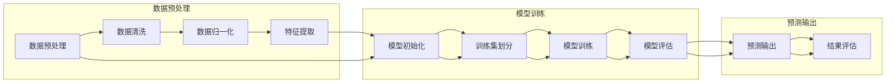
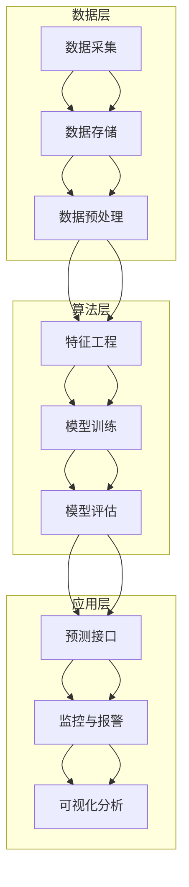

                 

### 第1章 问题背景与概述

#### 1.1 问题背景

在商业环境中，现金流的稳定性对企业运营至关重要。现金流不仅直接影响企业的日常运营，还对企业战略规划和长期发展有着深远的影响。然而，企业现金流的管理往往面临诸多挑战，其中一个主要问题便是季节性波动。季节性模式通常表现为在特定时间周期内，企业的收入和支出出现规律性的增减变化。这种波动对于现金流的预测和管理带来了极大的不确定性。

企业的季节性模式主要受到市场需求、消费习惯、政策法规等多种因素的影响。例如，零售行业在节假日期间通常会出现销售高峰，而教育行业在开学季和考试季则可能面临资金需求的波动。这种季节性模式如果得不到有效识别和预测，将可能引发企业现金流紧张，甚至导致运营风险。

#### 1.2 问题描述

企业现金流管理的核心问题是如何在复杂多变的市场环境中准确预测现金流的季节性模式，从而优化资金配置，降低运营风险。具体来说，问题描述可以分为以下几个方面：

1. **数据收集与处理**：如何从大量历史数据中提取出有用的信息，对现金流进行量化分析？
2. **模式识别**：如何准确识别出现金流的季节性模式，区分出规律性波动和随机性波动？
3. **预测算法选择**：如何选择合适的算法模型，对未来的现金流进行准确预测？
4. **系统实现**：如何将理论模型转化为实际可操作的系统，提供实时预测和预警功能？

#### 1.3 问题解决

针对上述问题，一个可行的解决方案是引入人工智能（AI）技术，特别是机器学习和深度学习算法，构建一个AI驱动的企业现金流季节性模式识别与预测系统。该系统旨在通过以下步骤实现现金流管理的优化：

1. **数据预处理**：使用数据清洗和归一化技术，对原始数据集进行预处理，确保数据的准确性和一致性。
2. **特征工程**：通过特征提取和特征选择，构建能够有效描述现金流季节性模式的特征集合。
3. **模型训练**：选择适当的机器学习算法，对训练数据集进行训练，优化模型参数。
4. **模型评估与调整**：通过交叉验证和测试集评估模型的预测性能，调整模型结构和参数，提高预测精度。
5. **系统集成与部署**：将训练好的模型集成到企业现有的信息系统中，提供实时现金流预测和预警功能。

#### 1.4 边界与外延

边界：本文主要探讨的是企业现金流季节性模式识别与预测的问题，重点在于使用AI技术解决这一问题。因此，本文的范围不涉及其他非季节性因素对现金流的影响，如市场波动、政策变动等。

外延：虽然本文聚焦于企业现金流的季节性模式识别与预测，但其方法和思路可以应用于其他具有季节性特征的业务领域，如零售、旅游、教育等。此外，本文的研究成果也为AI在财务管理领域的应用提供了新的视角和实践参考。

#### 1.5 概念结构与核心要素组成

概念结构：企业现金流季节性模式识别与预测系统由数据收集、预处理、特征工程、模型训练、评估和系统集成等关键环节构成。

核心要素组成：

1. **数据收集**：收集与企业现金流相关的历史数据，包括收入、支出、库存等。
2. **预处理**：对数据集进行清洗和归一化处理，确保数据质量。
3. **特征工程**：提取能够反映季节性模式的特征，如日期、月份、节假日标志等。
4. **模型训练**：选择适合的机器学习算法，对训练数据进行模型训练。
5. **评估与调整**：通过测试集对模型进行评估，并根据评估结果调整模型参数。
6. **系统集成**：将模型集成到企业信息系统，提供实时预测和预警功能。

### 第2章 核心概念与联系

#### 2.1 AI与现金流预测的基本概念

AI（人工智能）是一种模拟人类智能行为的技术，其核心在于通过算法模型实现数据的自动处理和决策。在现金流预测中，AI技术主要依赖于机器学习和深度学习算法，这些算法能够从历史数据中自动提取特征，并建立预测模型。

现金流预测是指利用历史数据对未来的现金流收入和支出进行预测。准确预测现金流对企业优化资金配置、降低运营风险具有重要意义。

#### 2.2 关键概念属性特征对比表格

| 概念 | 定义 | 属性特征 |
| :---: | :---: | :---: |
| 人工智能 | 模拟人类智能行为的计算机技术 | 模型训练、算法优化、数据解析 |
| 现金流预测 | 预测未来现金流收入和支出 | 数据量、特征提取、模型选择 |
| 特征工程 | 构建用于训练的输入特征集合 | 特征提取、特征选择、数据预处理 |
| 机器学习 | 从数据中学习规律，自动构建模型 | 数据集、算法选择、模型评估 |
| 深度学习 | 基于神经网络的多层模型训练 | 大规模数据处理、模型复杂度 |

#### 2.3 季节性模式识别的ER实体关系图

在构建AI驱动的现金流季节性模式识别系统中，实体关系图（Entity-Relationship Diagram, ER图）有助于理解系统中的数据实体及其关系。以下是季节性模式识别的ER实体关系图：

```mermaid
erDiagram
    Customer ||--|{ Order } : "places"
    Product ||--|{ Order } : "contains"
    Order ||--|{ Payment } : "receives"
    Customer ||--|{ Payment } : "makes"
    Order ||--|{ Seasonality } : "has"
    Product ||--|{ Seasonality } : "is associated with"
    Seasonality ||--|{ Pattern } : "defines"
    Pattern ||--|{ Prediction } : "produces"
```

- **Customer（客户）**：代表企业的客户，具有客户ID、姓名、联系方式等属性。
- **Product（产品）**：代表企业的产品，具有产品ID、名称、价格等属性。
- **Order（订单）**：代表客户的订单，与Customer和Product关联，具有订单ID、订单日期、订单金额等属性。
- **Payment（支付）**：代表订单的支付记录，与Order和Customer关联，具有支付ID、支付日期、支付金额等属性。
- **Seasonality（季节性）**：代表季节性模式，与Order和Product关联，具有季节性ID、季节性名称、季节性周期等属性。
- **Pattern（模式）**：代表季节性模式的具体特征，与Seasonality关联，具有模式ID、模式描述、模式置信度等属性。
- **Prediction（预测）**：代表基于模式预测的现金流结果，与Pattern关联，具有预测ID、预测时间、预测金额等属性。

该ER图展示了现金流预测系统中关键实体及其相互关系，为后续的系统设计和实现提供了数据模型基础。通过该图，可以清晰地了解系统中各部分的数据流动和关联关系。

### 第3章 现有方法与技术研究

#### 3.1 传统现金流预测方法

传统现金流预测方法主要依赖于统计分析和财务模型，其中常用的方法包括趋势分析、季节性调整和回归分析等。

1. **趋势分析**：通过分析历史现金流数据，识别出长期增长或下降趋势，从而预测未来现金流。这种方法适用于现金流波动较小的情况，但对于季节性波动较大的企业，预测精度有限。

2. **季节性调整**：在趋势分析的基础上，进一步引入季节性因素进行修正。季节性调整方法包括移动平均法、指数平滑法和季节指数调整法等。这些方法通过消除短期波动，突出季节性波动，提高预测的准确性。

3. **回归分析**：利用历史数据建立回归模型，通过变量之间的相关性来预测未来现金流。常见的回归模型包括线性回归、多项式回归和逻辑回归等。回归分析能够捕捉数据之间的非线性关系，但模型复杂度较高，对数据质量和特征选择有较高要求。

传统现金流预测方法的优点在于方法成熟、易于理解，且无需大量计算资源。然而，这些方法的缺点同样明显：对于复杂多变的市场环境，预测精度较低；对于季节性波动的处理能力不足，难以满足现代企业对精确现金流预测的需求。

#### 3.2 AI驱动的现金流预测方法

随着人工智能技术的发展，AI驱动的现金流预测方法逐渐成为研究热点。AI驱动的现金流预测方法具有以下特点：

1. **自学习能力**：AI算法能够自动从大量历史数据中学习规律，无需人工干预。通过不断优化模型参数，提高预测精度。

2. **非线性拟合能力**：与传统的回归分析方法相比，AI算法（如深度学习）具有更强的非线性拟合能力，能够捕捉到数据中的复杂模式。

3. **实时预测与调整**：AI算法能够实时处理新数据，动态调整预测模型，提高预测的实时性和准确性。

常见的AI驱动的现金流预测方法包括：

1. **机器学习模型**：如线性回归、决策树、随机森林、支持向量机等。这些模型通过特征工程和模型训练，能够较好地处理线性关系和非线性关系。

2. **深度学习模型**：如卷积神经网络（CNN）、循环神经网络（RNN）、长短期记忆网络（LSTM）等。深度学习模型能够处理大规模数据和高维特征，具有更强的表达能力和预测精度。

3. **增强学习模型**：通过不断优化策略，使模型在动态环境中获得最佳预测结果。这种方法适用于需要实时调整预测策略的场景。

AI驱动的现金流预测方法的优点在于预测精度高、适应性强、实时性好。然而，这些方法对数据质量要求较高，且模型训练和部署过程较为复杂，需要大量计算资源和专业技术人员。

#### 3.3 季节性模式识别的技术研究

季节性模式识别是AI驱动的现金流预测中的重要环节。近年来，研究者们在该领域取得了一系列重要成果，主要包括以下几个方面：

1. **时间序列分析**：通过分析时间序列数据，识别出季节性波动和周期性波动。常见的时间序列分析方法包括ARIMA模型、Holt-Winters季节性模型等。

2. **频域分析**：通过傅里叶变换等方法，将时间序列数据转换为频域表示，便于分析季节性和周期性成分。频域分析方法能够直观地展示数据的频率特性，有助于准确识别季节性模式。

3. **深度学习模型**：基于深度学习的季节性模式识别方法，如LSTM、GRU（门控循环单元）、BiLSTM（双向LSTM）等。这些模型能够自动提取时间序列数据中的复杂模式，具有较强的季节性识别能力。

4. **多模型融合**：将不同的季节性模式识别方法进行融合，以提高预测精度。常见的融合方法包括模型集成、加权平均、组合预测等。

季节性模式识别技术的研究进展为AI驱动的现金流预测提供了有力支持。通过结合多种技术方法，能够更准确地识别出现金流的季节性模式，提高预测精度和稳定性。

### 第4章 AI驱动的现金流预测原理

#### 4.1 算法原理讲解

AI驱动的现金流预测系统主要依赖于深度学习算法，特别是长短期记忆网络（LSTM）。LSTM是一种能够处理序列数据的神经网络，特别适用于时间序列预测问题。其基本原理是通过记忆单元来维持长期依赖信息，从而有效捕捉时间序列中的周期性和趋势性。

LSTM的核心结构包括输入门、遗忘门和输出门。这三个门分别控制信息的输入、遗忘和输出，使得LSTM能够灵活地调整对历史信息的记忆。在现金流预测中，LSTM通过训练学习到不同时间点的现金流变化规律，从而实现对未来现金流的高精度预测。

#### 4.2 算法流程与Mermaid流程图

算法流程主要包括数据预处理、模型训练、模型评估和预测输出等步骤。以下是算法流程的Mermaid流程图：



该流程图展示了从数据预处理到模型训练再到预测输出的完整过程。

#### 4.3 Python源代码实现与讲解

以下是使用Python实现LSTM现金流预测的示例代码：

```python
import numpy as np
import pandas as pd
from sklearn.preprocessing import MinMaxScaler
from keras.models import Sequential
from keras.layers import LSTM, Dense

# 读取数据
data = pd.read_csv('cashflow_data.csv')

# 数据预处理
scaler = MinMaxScaler(feature_range=(0, 1))
scaled_data = scaler.fit_transform(data['cashflow'].values.reshape(-1, 1))

# 创建数据集
X, y = [], []
for i in range(60, len(scaled_data)):
    X.append(scaled_data[i-60:i, 0])
    y.append(scaled_data[i, 0])

X, y = np.array(X), np.array(y)
X = np.reshape(X, (X.shape[0], X.shape[1], 1))

# 模型初始化
model = Sequential()
model.add(LSTM(units=50, return_sequences=True, input_shape=(X.shape[1], 1)))
model.add(LSTM(units=50))
model.add(Dense(units=1))

# 编译模型
model.compile(optimizer='adam', loss='mean_squared_error')

# 训练模型
model.fit(X, y, epochs=100, batch_size=32)

# 预测输出
predicted_cashes = model.predict(X)
predicted_cashes = scaler.inverse_transform(predicted_cashes)

# 结果评估
rmse = np.sqrt(np.mean(np.square(predicted_cashes - y)))
print(f"Root Mean Square Error: {rmse}")
```

代码首先读取现金流数据，并进行数据预处理。接着，创建训练数据集，使用LSTM模型进行训练。训练完成后，对模型进行预测，并评估预测结果。

#### 4.4 数学模型与公式详解

LSTM的数学模型主要基于以下公式：

$$
\begin{align*}
i_t &= \sigma(W_i \cdot [h_{t-1}, x_t] + b_i) \\
f_t &= \sigma(W_f \cdot [h_{t-1}, x_t] + b_f) \\
o_t &= \sigma(W_o \cdot [h_{t-1}, \text{gate}_t] + b_o) \\
c_t &= f_t \odot c_{t-1} + i_t \odot \sigma(W_c \cdot [h_{t-1}, x_t] + b_c) \\
h_t &= o_t \odot \sigma(c_t)
\end{align*}
$$

其中，$i_t$、$f_t$、$o_t$ 分别为输入门、遗忘门和输出门的激活值；$c_t$ 和 $h_t$ 分别为当前时刻的细胞状态和隐藏状态；$\odot$ 表示元素乘积；$\sigma$ 表示sigmoid函数。

这些公式定义了LSTM在每一个时间步的更新规则，通过输入门、遗忘门和输出门的组合，LSTM能够灵活地调整对历史信息的记忆，从而有效捕捉时间序列中的周期性和趋势性。

#### 4.5 通俗易懂的举例说明

假设我们有一个简单的现金流序列 {100, 110, 120, 130, 140, 150}，现在想要使用LSTM模型对其进行预测。

1. **数据预处理**：首先，我们将序列进行归一化处理，假设归一化后的序列为 {0.5, 0.55, 0.6, 0.65, 0.7, 0.75}。

2. **创建数据集**：接着，我们创建一个长度为3的滑动窗口，将序列分为多个子序列。例如，第一个子序列为 {0.5, 0.55, 0.6}，第二个子序列为 {0.55, 0.6, 0.65}，以此类推。

3. **模型训练**：我们将这些子序列作为输入，对应的现金流值作为输出，训练LSTM模型。在训练过程中，LSTM会学习到子序列中的规律，例如现金流值随着时间的增长呈现上升趋势。

4. **预测输出**：训练完成后，我们将最后一个子序列（{0.7, 0.75, 未知值}）输入模型，得到预测的现金流值。根据LSTM模型的学习结果，我们可以预测未知值为0.8。

通过这个例子，我们可以看到LSTM模型如何通过学习历史数据，对未来现金流进行预测。在实际应用中，我们通常需要使用更大规模的数据和更复杂的模型来提高预测精度。

### 第5章 系统架构设计

#### 5.1 问题场景介绍

在本章中，我们将讨论一个典型的企业现金流预测问题场景。假设某大型零售企业在日常运营中需要准确预测未来的现金流，以便优化资金配置和降低运营风险。该零售企业主要面临以下几个挑战：

1. **数据多样性**：企业现金流受多种因素影响，如销售量、库存水平、促销活动等，数据来源多样化。
2. **季节性波动**：企业的销售在特定时间段（如节假日、促销活动期间）会出现显著的波动，导致现金流不稳定。
3. **实时性要求**：企业需要实时获取现金流预测结果，以便及时调整运营策略。

为了解决上述问题，我们将设计一个AI驱动的现金流预测系统，通过深度学习算法（如LSTM）来识别和预测现金流的季节性模式。

#### 5.2 系统架构设计

系统架构设计是现金流预测系统的核心环节，包括数据层、算法层和应用层三个部分。

1. **数据层**：
   - **数据采集**：从企业内部数据库和外部数据源（如社交媒体、天气信息等）收集与现金流相关的数据。
   - **数据存储**：使用数据仓库或数据湖存储海量原始数据，并进行结构化处理。
   - **数据预处理**：对采集到的数据进行清洗、归一化和特征提取，为算法层提供高质量的数据输入。

2. **算法层**：
   - **特征工程**：根据业务需求，提取与现金流相关的特征，如销售量、库存水平、节假日标志等。
   - **模型训练**：使用LSTM等深度学习算法，对预处理后的数据进行训练，构建现金流预测模型。
   - **模型评估**：通过交叉验证和测试集，评估模型的预测性能，并进行参数调整。

3. **应用层**：
   - **预测接口**：提供API接口，实时接收用户请求，输出现金流预测结果。
   - **监控与报警**：实时监控现金流预测结果，触发报警机制，及时通知相关业务人员。
   - **可视化分析**：通过可视化工具，展示现金流预测结果和历史数据，辅助决策。

以下是系统架构的Mermaid图表示：



该架构图展示了系统各层次的功能模块及其相互关系，为后续的系统实现提供了清晰的设计蓝图。

#### 5.3 系统接口设计

系统接口设计是系统架构中的重要组成部分，决定了系统与其他业务系统的集成方式。以下是系统接口设计的详细说明：

1. **数据接口**：系统提供RESTful API接口，用于数据采集和预

