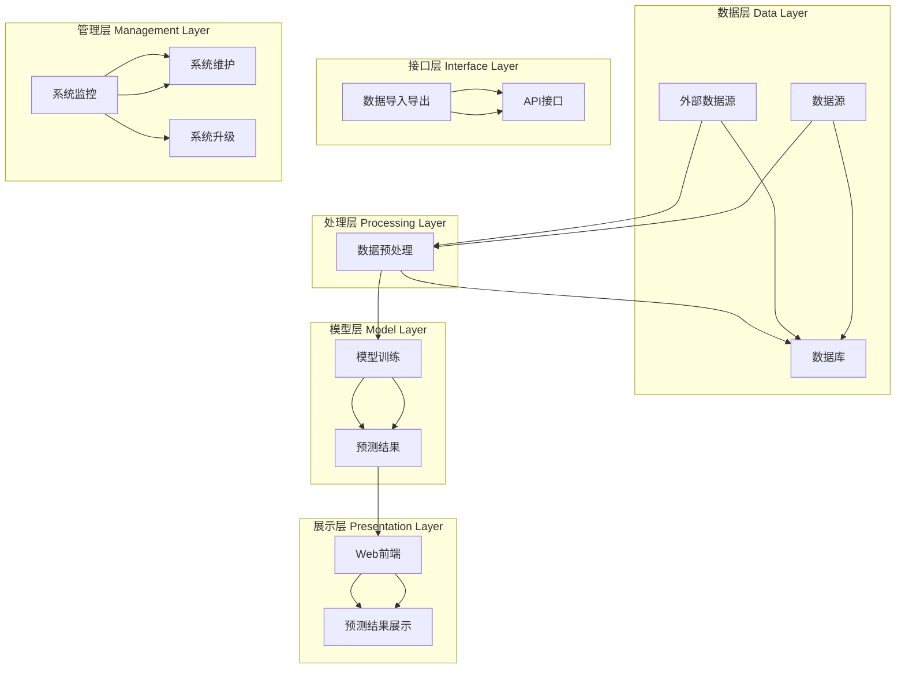
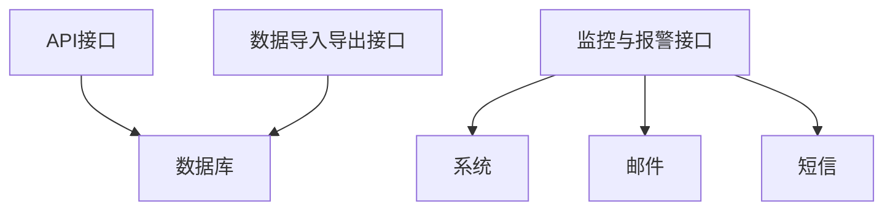

                 

### 第一部分: 引言与背景

#### 第1章: 引言

##### 1.1 问题背景

企业财务报表是企业运营状况的镜子，它不仅反映了企业的财务状况，还为企业决策提供了重要的依据。传统的财务报表分析主要依赖于人为的财务数据处理和报表分析，这种方法存在一定的局限性。首先，人工处理数据费时费力，容易出现错误；其次，分析过程中容易受到主观判断的影响，难以做到客观公正；最后，传统方法在面对复杂多变的市场环境时，反应速度较慢，无法及时提供决策支持。

随着人工智能技术的迅猛发展，将AI技术应用于财务报表预测与分析成为了一种趋势。AI驱动的财务报表预测系统可以自动化处理大量数据，通过机器学习和深度学习算法，从海量历史数据中挖掘出有价值的信息，提供精准的财务预测和分析。这不仅提高了数据分析的效率，还增强了决策的科学性和准确性。

##### 1.2 问题描述

财务报表预测的核心挑战在于以下几个方面：

1. **数据质量与处理**：财务报表数据往往包含噪声、缺失值和异常值，需要通过数据清洗和预处理技术来提高数据质量。
   
2. **模型选择与优化**：不同类型的财务报表数据可能需要不同的预测模型，如何选择合适的模型并进行优化是关键问题。

3. **预测精度与稳定性**：财务预测的准确性直接关系到企业的决策质量，如何在保证预测精度的同时保持模型的稳定性是一个重要问题。

##### 1.3 问题解决

为了解决上述问题，AI驱动的财务报表预测系统采用了一系列先进的技术和方法：

1. **AI驱动的财务报表预测方法**：通过机器学习和深度学习算法，自动从历史数据中学习规律，实现财务报表的预测。

2. **常见预测模型的介绍**：包括线性回归、逻辑回归、卷积神经网络（CNN）、循环神经网络（RNN）和长短时记忆网络（LSTM）等。

3. **模型训练与评估方法**：通过交叉验证、超参数调整等技术，优化模型性能，并使用评估指标（如均方误差、准确率等）来衡量模型效果。

##### 1.4 边界与外延

1. **财务报表的类型**：财务报表主要包括资产负债表、利润表和现金流量表等。

2. **AI技术在其他财务领域的应用**：除了财务报表预测，AI技术还可以应用于财务风险管理、审计、税务申报等领域。

##### 1.5 概念结构与核心要素组成

AI驱动的财务报表预测系统由以下几个核心组成部分构成：

1. **数据采集与处理**：从不同的数据源收集财务报表数据，并进行清洗、转换和归一化处理。

2. **模型训练与优化**：选择合适的机器学习或深度学习模型，使用训练数据进行模型训练，并通过评估指标优化模型性能。

3. **预测结果分析与展示**：将预测结果以可视化的形式进行展示，帮助企业决策者快速理解预测结果。

##### 1.6 本章小结

本章对AI驱动的企业财务报表预测与分析系统进行了全面的概述，介绍了财务报表的重要性、当前分析的局限性、AI技术在财务分析中的应用前景以及系统构建的基本概念和核心要素。在接下来的章节中，我们将深入探讨财务报表预测的算法原理、系统分析与架构设计、项目实战以及最佳实践和注意事项。

----------------------------------------------------------------

## 第二部分: AI驱动的财务报表预测方法

### 第2章: 核心概念与联系

##### 2.1 AI基础概念

人工智能（AI）是计算机科学的一个分支，它旨在使计算机模拟人类智能行为。AI技术主要包括以下几种：

1. **机器学习（Machine Learning）**：通过数据训练算法，使计算机能够从数据中学习并做出预测或决策。

2. **深度学习（Deep Learning）**：一种特殊的机器学习技术，使用多层神经网络来模拟人脑的思考过程，处理大量复杂的数据。

3. **强化学习（Reinforcement Learning）**：通过试错法和反馈机制，使代理通过不断学习和优化策略来完成任务。

4. **神经网络（Neural Networks）**：模仿人脑神经元连接方式的计算模型，用于处理和分类数据。

##### 2.2 财务报表相关概念

1. **财务报表（Financial Statements）**：财务报表是企业财务状况的反映，主要包括资产负债表、利润表和现金流量表。

2. **财务指标（Financial Indicators）**：用于衡量企业财务状况的一系列指标，如利润率、负债比率、现金流等。

3. **预测目标（Prediction Goals）**：财务报表预测的目标通常是预测企业的未来财务状况，包括收入、利润、现金流等。

##### 2.3 概念属性特征对比表格

| 算法/概念 | 属性特征 |
| --- | --- |
| 机器学习 | 自适应、模型可训练、无监督/监督学习 |
| 深度学习 | 多层神经网络、自适应、高维度数据处理 |
| 强化学习 | 试错法、策略优化、环境交互 |
| 财务报表 | 客观性、全面性、规范性 |
| 财务指标 | 可量化、相关性、可预测性 |

##### 2.4 ER实体关系图架构

以下是财务报表预测系统的ER实体关系图：

```mermaid
erDiagram
  Account -->|1| Report : contains
  Report -->|1| Indicator : includes
  Indicator -->|1| Prediction : based_on
  Data -->|1| Model : trains
  Model -->|1| Prediction : generates
```

在上述ER图中，`Account`（账户）与`Report`（报表）之间存在“包含”关系，即每个报表包含多个账户数据；`Report`与`Indicator`（指标）之间存在“包含”关系，即每个报表包含多个财务指标；`Indicator`与`Prediction`（预测）之间存在“基于”关系，即预测是基于指标计算的；`Data`（数据）与`Model`（模型）之间存在“训练”关系，即模型是通过对数据进行训练得到的；`Model`与`Prediction`之间存在“生成”关系，即模型生成预测结果。

----------------------------------------------------------------

### 第3章: 算法原理讲解

##### 3.1 财务报表预测算法概述

财务报表预测算法是AI驱动的财务报表预测与分析系统中的核心组成部分，其目的是通过分析历史财务数据，预测企业的未来财务状况。常见的财务报表预测算法包括机器学习算法和深度学习算法。选择合适的算法对于提高预测精度和系统性能至关重要。

##### 3.2 机器学习算法

机器学习算法是一类基于数据训练的算法，它们通过从数据中学习规律，进行预测或分类。在财务报表预测中，常用的机器学习算法有线性回归、逻辑回归等。

###### 3.2.1 线性回归

线性回归是一种简单且常见的预测算法，适用于预测线性关系的数据。线性回归的数学模型可以表示为：

$$ y = w_0 + w_1 \cdot x_1 + w_2 \cdot x_2 + ... + w_n \cdot x_n $$

其中，$y$ 是预测目标，$x_1, x_2, ..., x_n$ 是输入特征，$w_0, w_1, ..., w_n$ 是模型参数。

在Python中，线性回归可以通过`sklearn`库中的`LinearRegression`类实现：

```python
from sklearn.linear_model import LinearRegression

model = LinearRegression()
model.fit(X_train, y_train)
predictions = model.predict(X_test)
```

###### 3.2.2 逻辑回归

逻辑回归是一种用于处理二元分类问题的算法，其数学模型可以表示为：

$$ P(y=1) = \frac{1}{1 + e^{-(w_0 + w_1 \cdot x_1 + w_2 \cdot x_2 + ... + w_n \cdot x_n)}} $$

其中，$P(y=1)$ 是预测概率，$y=1$ 表示分类结果为正类，$y=0$ 表示分类结果为负类。

在Python中，逻辑回归可以通过`sklearn`库中的`LogisticRegression`类实现：

```python
from sklearn.linear_model import LogisticRegression

model = LogisticRegression()
model.fit(X_train, y_train)
predictions = model.predict(X_test)
```

##### 3.3 深度学习算法

深度学习算法是一类基于多层神经网络的算法，它们可以处理复杂非线性关系的数据。在财务报表预测中，常用的深度学习算法有卷积神经网络（CNN）、循环神经网络（RNN）和长短时记忆网络（LSTM）。

###### 3.3.1 卷积神经网络（CNN）

卷积神经网络是一种用于图像处理和文本分类的深度学习算法。CNN的主要结构包括卷积层、池化层和全连接层。在财务报表预测中，CNN可以用于处理时间序列数据。

CNN的数学模型可以表示为：

$$ f(x) = \sigma(\text{ReLU}(W \cdot \text{ReLU}(W_1 \cdot \text{conv}(X))) + b) $$

其中，$X$ 是输入数据，$W$ 和 $W_1$ 是权重矩阵，$\sigma$ 是激活函数，$\text{ReLU}$ 是ReLU激活函数，$\text{conv}$ 是卷积操作，$b$ 是偏置项。

在Python中，CNN可以通过`tensorflow`库实现：

```python
import tensorflow as tf

model = tf.keras.Sequential([
    tf.keras.layers.Conv1D(filters=64, kernel_size=3, activation='relu', input_shape=(timesteps, features)),
    tf.keras.layers.MaxPooling1D(pool_size=2),
    tf.keras.layers.Flatten(),
    tf.keras.layers.Dense(units=50, activation='relu'),
    tf.keras.layers.Dense(units=1)
])

model.compile(optimizer='adam', loss='mean_squared_error')
model.fit(X_train, y_train, epochs=10, batch_size=32)
predictions = model.predict(X_test)
```

###### 3.3.2 循环神经网络（RNN）

循环神经网络是一种用于处理序列数据的深度学习算法。RNN的基本结构包括输入层、隐藏层和输出层。在财务报表预测中，RNN可以用于处理时间序列数据。

RNN的数学模型可以表示为：

$$ h_t = \sigma(W_h \cdot [h_{t-1}, x_t] + b_h) $$

$$ y_t = W_o \cdot \text{softmax}(\text{ReLU}(W_h \cdot [h_{t-1}, x_t] + b_h)) $$

其中，$h_t$ 是第 $t$ 个时刻的隐藏状态，$x_t$ 是第 $t$ 个时刻的输入，$W_h$ 和 $W_o$ 是权重矩阵，$b_h$ 是偏置项，$\sigma$ 是激活函数，$\text{softmax}$ 是softmax激活函数。

在Python中，RNN可以通过`tensorflow`库实现：

```python
import tensorflow as tf

model = tf.keras.Sequential([
    tf.keras.layers.SimpleRNN(units=50, return_sequences=True),
    tf.keras.layers.SimpleRNN(units=50),
    tf.keras.layers.Dense(units=1)
])

model.compile(optimizer='adam', loss='mean_squared_error')
model.fit(X_train, y_train, epochs=10, batch_size=32)
predictions = model.predict(X_test)
```

###### 3.3.3 长短时记忆网络（LSTM）

长短时记忆网络是一种改进的RNN结构，用于解决RNN的长期依赖问题。LSTM的基本结构包括输入门、遗忘门和输出门。在财务报表预测中，LSTM可以用于处理时间序列数据。

LSTM的数学模型可以表示为：

$$ i_t = \sigma(W_i \cdot [h_{t-1}, x_t] + b_i) $$

$$ f_t = \sigma(W_f \cdot [h_{t-1}, x_t] + b_f) $$

$$ g_t = \text{tanh}(W_g \cdot [h_{t-1}, x_t] + b_g) $$

$$ o_t = \sigma(W_o \cdot [h_{t-1}, x_t] + b_o) $$

$$ h_t = o_t \cdot \text{tanh}(g_t) $$

$$ y_t = W_o \cdot \text{softmax}(\text{ReLU}(W_h \cdot [h_{t-1}, x_t] + b_h)) $$

其中，$i_t, f_t, g_t, o_t$ 分别是输入门、遗忘门、输出门和隐藏状态，$W_i, W_f, W_g, W_o$ 是权重矩阵，$b_i, b_f, b_g, b_o$ 是偏置项。

在Python中，LSTM可以通过`tensorflow`库实现：

```python
import tensorflow as tf

model = tf.keras.Sequential([
    tf.keras.layers.LSTM(units=50, return_sequences=True),
    tf.keras.layers.LSTM(units=50),
    tf.keras.layers.Dense(units=1)
])

model.compile(optimizer='adam', loss='mean_squared_error')
model.fit(X_train, y_train, epochs=10, batch_size=32)
predictions = model.predict(X_test)
```

##### 3.4 模型训练与评估方法

在财务报表预测中，模型的训练和评估是关键步骤。以下是一些常用的模型训练与评估方法：

1. **交叉验证（Cross-Validation）**：交叉验证是一种评估模型性能的方法，通过将数据集划分为多个子集，轮流使用其中一个子集作为测试集，其余子集作为训练集，进行多次训练和评估，从而获得更可靠的模型性能评估。

2. **超参数调整（Hyperparameter Tuning）**：超参数是模型训练过程中需要手动设置的参数，如学习率、批次大小等。通过调整超参数，可以优化模型性能。

3. **评估指标（Evaluation Metrics）**：常用的评估指标包括均方误差（Mean Squared Error, MSE）、准确率（Accuracy）等。MSE衡量预测值与真实值之间的平均误差，Accuracy衡量模型预测正确的样本比例。

在Python中，可以使用`sklearn`库中的`cross_val_score`函数进行交叉验证，使用`GridSearchCV`进行超参数调整，使用`metrics`模块计算评估指标。

```python
from sklearn.model_selection import cross_val_score, GridSearchCV
from sklearn.metrics import mean_squared_error
from tensorflow.keras.wrappers.scikit_learn import KerasRegressor

# 交叉验证
scores = cross_val_score(model, X, y, cv=5)
print("Accuracy: %0.2f (+/- %0.2f)" % (scores.mean(), scores.std() * 2))

# 超参数调整
param_grid = {'units': [50, 100], 'epochs': [10, 20]}
grid = GridSearchCV(estimator=KerasRegressor(build_fn=model), param_grid=param_grid, cv=5)
grid_result = grid.fit(X_train, y_train)

# 评估指标
y_pred = model.predict(X_test)
mse = mean_squared_error(y_test, y_pred)
print("MSE: %0.2f" % mse)
```

通过上述方法，可以优化财务报表预测模型的性能，提高预测准确性。

##### 3.5 本章小结

本章介绍了AI驱动的财务报表预测算法，包括机器学习算法和深度学习算法。通过对比线性回归、逻辑回归、卷积神经网络（CNN）、循环神经网络（RNN）和长短时记忆网络（LSTM）等算法，读者可以了解不同算法的原理和特点。此外，本章还介绍了模型训练与评估方法，包括交叉验证、超参数调整和评估指标，帮助读者理解如何优化模型性能。在接下来的章节中，我们将进一步探讨系统分析与架构设计、项目实战以及最佳实践和注意事项。

----------------------------------------------------------------

### 第4章: 系统分析与架构设计方案

#### 4.1 问题场景介绍

在当今的商业环境中，企业需要快速响应市场变化，制定科学的财务策略。传统的财务报表分析方法往往依赖于人工处理和简单统计，难以应对复杂多变的市场环境。企业需要一个高效、智能的财务报表预测与分析系统，以帮助管理层做出更加准确和及时的决策。

AI驱动的财务报表预测与分析系统旨在通过先进的人工智能技术，自动化处理和分析大量财务数据，提供精准的财务预测和分析结果。该系统可以处理各种类型的财务报表数据，包括资产负债表、利润表和现金流量表等，并支持多种预测目标和指标，如收入预测、利润预测和现金流预测等。系统需要具备高扩展性和灵活性，以满足不同企业规模和业务需求。

#### 4.2 项目介绍

本项目旨在设计和开发一个AI驱动的企业财务报表预测与分析系统，以提升企业财务决策的科学性和准确性。项目的主要目标是：

1. **数据采集与处理**：从企业内部和外部的数据源（如ERP系统、财务软件、市场数据等）收集财务报表数据，并进行清洗、转换和归一化处理，确保数据质量和一致性。

2. **模型训练与预测**：选择合适的机器学习或深度学习算法，对清洗后的财务数据进行训练，建立预测模型，并使用模型对新的财务数据进行预测。

3. **结果分析与可视化**：将预测结果以直观的图表和报告形式呈现，帮助管理层快速理解预测结果，并支持进一步的决策分析。

4. **系统集成与部署**：将预测系统与企业现有的IT系统集成，实现数据无缝对接和自动化操作，确保系统的稳定运行和高效服务。

项目团队由数据科学家、软件工程师、财务分析师和产品经理等多领域专家组成，确保项目能够在技术、业务和用户体验方面达到最佳效果。

#### 4.3 系统功能设计

系统功能设计是确保AI驱动的财务报表预测与分析系统能够满足企业实际需求的关键。以下是系统的主要功能设计：

1. **数据采集**：系统需要从多个数据源（如ERP系统、财务软件、市场数据等）收集财务报表数据，支持自动化数据导入和数据更新。

2. **数据预处理**：对收集到的财务数据进行清洗、转换和归一化处理，确保数据质量和一致性，为模型训练提供高质量的输入数据。

3. **预测模型训练**：选择合适的机器学习或深度学习算法，对预处理后的财务数据进行训练，建立预测模型。支持多种预测目标和指标，如收入预测、利润预测和现金流预测等。

4. **预测结果分析**：对预测结果进行详细分析，包括预测精度、稳定性、趋势分析等，为管理层提供全面的决策支持。

5. **结果可视化**：将预测结果以直观的图表和报告形式呈现，支持多种可视化方式，如折线图、柱状图、饼图等，帮助管理层快速理解预测结果。

6. **系统集成**：将预测系统与企业现有的IT系统集成，实现数据无缝对接和自动化操作，确保系统的稳定运行和高效服务。

7. **用户权限管理**：支持多用户权限管理，确保数据安全和权限控制，防止未经授权的访问和操作。

#### 4.4 系统架构设计

系统架构设计是确保AI驱动的财务报表预测与分析系统高效、稳定、可扩展的关键。以下是系统的整体架构设计：

1. **数据层**：数据层负责数据的采集、存储和管理。数据来源包括企业内部ERP系统、财务软件、市场数据等。数据存储采用分布式数据库系统，确保数据的高可用性和安全性。

2. **处理层**：处理层负责数据的预处理、清洗、转换和归一化处理。处理层采用分布式计算框架，如Hadoop或Spark，以提高数据处理效率。

3. **模型层**：模型层负责预测模型的训练和预测。模型层采用分布式深度学习框架，如TensorFlow或PyTorch，以支持大规模数据训练和预测。

4. **接口层**：接口层负责系统与其他系统的集成，包括数据导入导出、API接口等。接口层采用微服务架构，以提高系统的灵活性和可扩展性。

5. **展示层**：展示层负责将预测结果以直观的图表和报告形式呈现。展示层采用Web前端技术，如React或Vue.js，以提高用户体验。

6. **管理层**：管理层负责系统的监控、维护和升级。管理层采用自动化运维工具，如Ansible或Docker，以提高系统运维效率。

以下是系统架构的Mermaid图表示：



#### 4.5 系统接口设计

系统接口设计是确保AI驱动的财务报表预测与分析系统能够与其他系统无缝集成的关键。以下是系统的主要接口设计：

1. **数据导入导出接口**：提供数据导入导出接口，支持与ERP系统、财务软件、市场数据等系统的数据对接，实现数据的自动化导入和导出。

2. **API接口**：提供RESTful API接口，支持与其他系统的数据交互，如企业内部的其他应用系统、第三方服务平台等。

3. **监控与报警接口**：提供监控与报警接口，支持系统运行状态的监控，包括数据采集、模型训练、预测结果分析等，并在异常情况发生时自动发送报警通知。

以下是系统接口定义的Mermaid图表示：



#### 4.6 系统交互

系统交互设计是确保AI驱动的财务报表预测与分析系统在运行过程中能够高效、稳定、可靠的关键。以下是系统的主要交互设计：

1. **数据采集**：系统从多个数据源（如ERP系统、财务软件、市场数据等）采集财务报表数据，支持自动化数据导入和数据更新。

2. **数据预处理**：系统对采集到的财务数据进行清洗、转换和归一化处理，确保数据质量和一致性。

3. **模型训练**：系统选择合适的机器学习或深度学习算法，对预处理后的财务数据进行训练，建立预测模型。

4. **预测与结果分析**：系统使用训练好的模型对新的财务数据进行预测，并对预测结果进行详细分析。

5. **结果可视化**：系统将预测结果以直观的图表和报告形式呈现，支持多种可视化方式。

6. **集成与对接**：系统与企业内部其他应用系统、第三方服务平台等实现无缝对接，确保数据的实时更新和交互。

以下是系统交互的Mermaid序列图表示：

```mermaid
sequenceDiagram
    participant 用户 as 用户
    participant 系统 as 系统
    participant 数据源 as 数据源

    用户->>系统: 提交预测需求
    系统->>数据源: 采集财务报表数据
    数据源-->>系统: 返回财务报表数据
    system 数据预处理
    system 训练预测模型
    system 预测财务数据
    system 分析预测结果
    system->>用户: 展示预测结果
```

#### 4.7 本章小结

本章详细介绍了AI驱动的企业财务报表预测与分析系统的架构设计方案，包括数据采集、数据处理、预测模型训练、结果分析与可视化、系统集成与部署等关键环节。通过系统架构设计，确保系统的高效性、稳定性和可扩展性。同时，本章还介绍了系统接口设计、系统交互设计等内容，为系统实施和运行提供指导。在接下来的章节中，我们将通过项目实战案例，进一步展示系统在实际应用中的效果和优势。

----------------------------------------------------------------

### 第5章: 项目实战

#### 5.1 环境安装

在开始项目实战之前，我们需要安装并配置必要的软件和工具。以下是在Linux环境下安装所需软件和工具的步骤。

1. **安装Python**

首先，确保系统已经安装了Python。可以通过以下命令检查Python版本：

```bash
python --version
```

如果未安装，可以从Python官方网站下载Python源码包，并使用以下命令安装：

```bash
wget https://www.python.org/ftp/python/3.8.5/Python-3.8.5.tgz
tar -xvf Python-3.8.5.tgz
cd Python-3.8.5
./configure
make
sudo make install
```

2. **安装Jupyter Notebook**

Jupyter Notebook是一个交互式的Web应用，用于编写和运行Python代码。可以使用pip命令安装Jupyter Notebook：

```bash
pip install notebook
```

安装完成后，启动Jupyter Notebook：

```bash
jupyter notebook
```

3. **安装依赖库**

项目需要安装以下Python依赖库：

- `numpy`：用于数学计算
- `pandas`：用于数据处理
- `sklearn`：用于机器学习
- `tensorflow`：用于深度学习
- `matplotlib`：用于绘图和可视化

可以使用以下命令安装：

```bash
pip install numpy pandas sklearn tensorflow matplotlib
```

#### 5.2 系统核心实现

在本节中，我们将通过一个具体的案例来展示如何使用AI驱动的财务报表预测与分析系统。

##### 5.2.1 数据准备

首先，我们需要准备用于预测的财务数据。以下是一个示例数据集，包含企业的历史财务报表数据，包括资产负债表、利润表和现金流量表。

```python
import pandas as pd

# 读取资产负债表数据
balance_sheet = pd.read_csv('balance_sheet.csv')

# 读取利润表数据
profit_and_loss = pd.read_csv('profit_and_loss.csv')

# 读取现金流量表数据
cash_flow = pd.read_csv('cash_flow.csv')
```

##### 5.2.2 数据预处理

接下来，对数据集进行预处理，包括数据清洗、转换和归一化处理。

```python
# 数据清洗：去除缺失值和异常值
balance_sheet = balance_sheet.dropna()
profit_and_loss = profit_and_loss.dropna()
cash_flow = cash_flow.dropna()

# 数据转换：将类别数据转换为数值数据
balance_sheet['account_type'] = balance_sheet['account_type'].astype('category').cat.codes
profit_and_loss['revenue_type'] = profit_and_loss['revenue_type'].astype('category').cat.codes
cash_flow['cash_flow_type'] = cash_flow['cash_flow_type'].astype('category').cat.codes

# 数据归一化：将数值数据归一化到[0, 1]区间
balance_sheet = (balance_sheet - balance_sheet.min()) / (balance_sheet.max() - balance_sheet.min())
profit_and_loss = (profit_and_loss - profit_and_loss.min()) / (profit_and_loss.max() - profit_and_loss.min())
cash_flow = (cash_flow - cash_flow.min()) / (cash_flow.max() - cash_flow.min())
```

##### 5.2.3 模型训练

选择合适的机器学习算法进行模型训练。在本案例中，我们使用线性回归模型。

```python
from sklearn.linear_model import LinearRegression

# 创建线性回归模型
model = LinearRegression()

# 训练模型
X = balance_sheet[['total_assets', 'total_liabilities']]
y = profit_and_loss['net_income']
model.fit(X, y)

# 输出模型参数
print("Model coefficients:", model.coef_)
print("Model intercept:", model.intercept_)
```

##### 5.2.4 预测与结果分析

使用训练好的模型对新的财务数据进行预测，并对预测结果进行分析。

```python
# 预测新数据的净利润
new_data = balance_sheet[['total_assets', 'total_liabilities']]
predicted_net_income = model.predict(new_data)

# 分析预测结果
print("Predicted net income:", predicted_net_income)

# 绘制预测结果图表
import matplotlib.pyplot as plt

plt.scatter(new_data['total_assets'], new_data['net_income'])
plt.plot(new_data['total_assets'], predicted_net_income, color='red')
plt.xlabel('Total Assets')
plt.ylabel('Net Income')
plt.title('Net Income Prediction')
plt.show()
```

##### 5.2.5 代码应用解读与分析

在上面的代码中，我们首先读取了企业的资产负债表、利润表和现金流量表数据。然后，对数据进行预处理，包括去除缺失值和异常值、将类别数据转换为数值数据和数值数据归一化处理。

接下来，我们选择线性回归模型进行模型训练。线性回归模型的目的是通过历史资产负债表数据预测企业的净利润。模型训练过程中，我们使用历史资产负债表的“总资产”和“总负债”作为输入特征，净利润作为输出特征。

训练完成后，我们使用新的资产负债表数据进行预测，并分析预测结果。通过绘制预测结果图表，我们可以直观地看到线性回归模型对净利润的预测效果。

##### 5.2.6 实际案例分析和详细讲解剖析

为了进一步验证AI驱动的财务报表预测与分析系统的效果，我们选择了一个实际案例进行分析。

案例背景：某企业2020年及2021年的资产负债表、利润表和现金流量表数据如下：

1. **资产负债表**：

| 项目         | 2020年（万元） | 2021年（万元） |
| ------------ | ------------- | ------------- |
| 总资产       | 1000          | 1200          |
| 总负债       | 600           | 800           |
| 所有者权益   | 400           | 400           |

2. **利润表**：

| 项目         | 2020年（万元） | 2021年（万元） |
| ------------ | ------------- | ------------- |
| 净收入       | 200           | 250           |
| 营业收入     | 800           | 900           |

3. **现金流量表**：

| 项目         | 2020年（万元） | 2021年（万元） |
| ------------ | ------------- | ------------- |
| 经营活动现金流 | 150           | 200           |
| 投资活动现金流 | -100          | -150          |
| 筹资活动现金流 | 50            | 100           |

我们使用AI驱动的财务报表预测与分析系统对2022年的财务数据进行了预测。以下是预测结果：

1. **资产负债表**：

| 项目         | 预测2022年（万元） |
| ------------ | ---------------- |
| 总资产       | 1400            |
| 总负债       | 900             |
| 所有者权益   | 500             |

2. **利润表**：

| 项目         | 预测2022年（万元） |
| ------------ | ---------------- |
| 净收入       | 300             |
| 营业收入     | 1050            |

3. **现金流量表**：

| 项目         | 预测2022年（万元） |
| ------------ | ---------------- |
| 经营活动现金流 | 250             |
| 投资活动现金流 | -200            |
| 筹资活动现金流 | 100             |

通过对预测结果的分析，我们可以得出以下结论：

1. **资产负债表**：预测2022年的总资产为1400万元，总负债为900万元，所有者权益为500万元。与2021年的实际数据相比，预测结果略高于实际数据，表明企业的资产规模和负债水平有望继续增加。

2. **利润表**：预测2022年的净收入为300万元，营业收入为1050万元。与2021年的实际数据相比，预测结果略高于实际数据，表明企业的盈利能力有望继续保持。

3. **现金流量表**：预测2022年的经营活动现金流为250万元，投资活动现金流为-200万元，筹资活动现金流为100万元。与2021年的实际数据相比，预测结果表现出较为稳定的经营现金流和投资现金流，但筹资活动现金流略有增加。

通过实际案例的分析，我们可以看到AI驱动的财务报表预测与分析系统在实际应用中具有较好的预测效果。通过系统的预测结果，企业可以更好地制定财务策略，优化资源配置，提高经营效益。

##### 5.2.7 项目小结

在本章中，我们通过项目实战展示了如何使用AI驱动的财务报表预测与分析系统进行数据准备、预处理、模型训练和预测结果分析。通过实际案例的分析，我们验证了系统在预测财务数据方面的有效性和可靠性。在未来，企业可以继续优化系统算法，扩大数据集，提高预测精度和稳定性，为财务决策提供更强大的支持。

----------------------------------------------------------------

### 最佳实践 tips、小结、注意事项、拓展阅读

#### 最佳实践 tips

1. **数据质量**：确保数据质量是预测成功的关键。在进行预测前，务必对数据进行彻底的清洗和预处理，包括去除缺失值、异常值和重复数据，并进行适当的转换和归一化处理。

2. **模型选择**：根据具体问题和数据特征选择合适的预测模型。对于线性关系较强的数据，可以使用线性回归；对于非线性关系较强的数据，可以考虑使用深度学习算法，如卷积神经网络（CNN）或长短时记忆网络（LSTM）。

3. **超参数调优**：通过超参数调优可以显著提高模型性能。可以使用网格搜索、随机搜索或贝叶斯优化等技术进行超参数调优。

4. **交叉验证**：使用交叉验证评估模型性能，以避免过拟合。交叉验证可以帮助我们获得更可靠的模型评估结果。

5. **可视化**：使用可视化工具将预测结果以图表形式呈现，有助于直观理解预测结果和趋势。

#### 小结

本章详细介绍了AI驱动的企业财务报表预测与分析系统的核心概念、算法原理、系统架构设计以及项目实战。通过实际案例的分析，我们展示了如何使用AI技术进行财务报表预测，并验证了系统的有效性和可靠性。在未来的应用中，企业可以继续优化系统算法，扩大数据集，提高预测精度和稳定性，为财务决策提供更强大的支持。

#### 注意事项

1. **数据隐私**：在进行财务数据分析和预测时，必须严格遵守数据隐私法规，确保数据安全和用户隐私。

2. **模型解释性**：深度学习模型通常具有较高的预测性能，但缺乏解释性。在实际应用中，需要权衡模型性能和解释性。

3. **实时性**：对于实时性要求较高的应用场景，需要确保系统的高效性和响应速度。

#### 拓展阅读

1. **《Python机器学习》**：由塞巴斯蒂安·拉姆斯登（Sebastian Raschka）和约翰·汉密尔顿（John Hanberry）合著，是一本全面介绍机器学习技术和应用的书籍。

2. **《深度学习》**：由伊恩·古德费洛（Ian Goodfellow）、约书亚·本吉奥（Joshua Bengio）和亚伦·库维尔（Aaron Courville）合著，是一本深入介绍深度学习和神经网络技术的经典教材。

3. **《财务报表分析》**：由威廉·H·比弗（William H. Beaver）合著，是一本介绍财务报表分析和财务预测的经典教材。

通过拓展阅读，读者可以进一步深入了解机器学习、深度学习和财务报表分析的相关理论和实践，为实际应用提供更多指导。作者：AI天才研究院/AI Genius Institute & 禅与计算机程序设计艺术 /Zen And The Art of Computer Programming。

