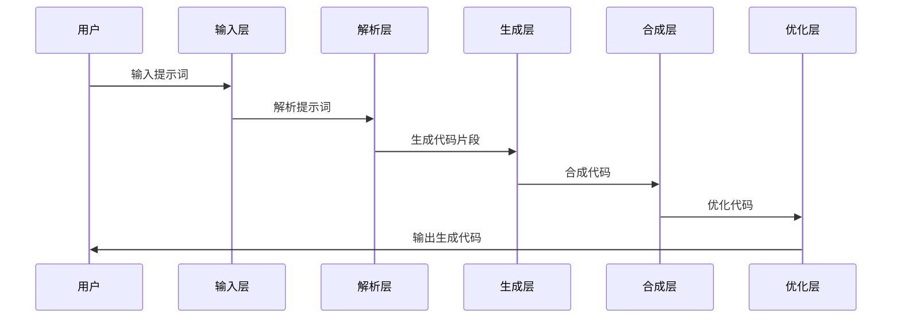
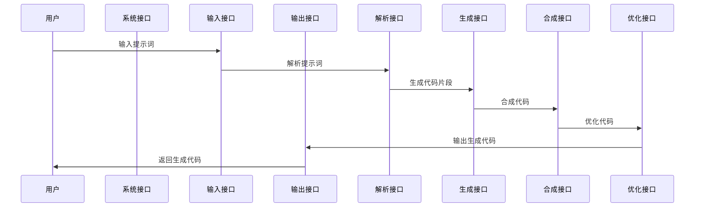

                 

### 文章标题：AI驱动的提示词代码生成与合成

关键词：AI代码生成，提示词，自然语言处理，机器学习，深度学习

摘要：本文深入探讨了AI驱动的提示词代码生成与合成的技术原理和实际应用。通过逐步分析，从基础概念到算法原理，再到系统架构和项目实战，本文旨在为读者提供全面的技术指导和启示。

### 第一部分：AI驱动的提示词代码生成基础

#### 第1章：AI驱动的提示词代码生成概述

##### 1.1.1 AI驱动的提示词代码生成的背景

人工智能（AI）的发展迅速改变了各个行业的面貌，编程作为信息技术领域的基石，自然也受到了深远的影响。传统的编程方式依赖于程序员手写代码，这种方式既耗时又容易出错。随着AI技术的进步，代码生成已成为可能，通过AI驱动的提示词，可以实现自动化编程，极大提高了开发效率。

在软件开发过程中，编写代码常常面临诸多挑战，如代码的重复性、复杂性以及代码的维护等问题。AI驱动的提示词代码生成技术能够自动解析程序员的需求，生成满足特定功能的代码，从而缓解这些问题。

提示词在代码生成中起到至关重要的作用。它们是程序员输入的自然语言描述，通过这些描述，AI模型可以理解并生成相应的代码。提示词可以是简单的函数描述，也可以是复杂的业务逻辑，它们为代码生成提供了明确的指导。

##### 1.1.2 提示词代码生成的基本原理

提示词代码生成涉及多个技术领域，主要包括自然语言处理（NLP）、编程语言处理以及机器学习和深度学习等。以下是这些技术的基本原理：

- **自然语言处理（NLP）**：NLP是使计算机能够理解、解释和生成自然语言的技术。在代码生成中，NLP技术用于将自然语言描述转换为机器可以处理的内部表示。

- **编程语言处理**：编程语言处理是使计算机能够理解特定编程语言的技术。通过编程语言处理，AI模型可以将NLP生成的内部表示转换为具体的代码。

- **机器学习**：机器学习是一种通过数据训练模型，使其能够进行预测和决策的技术。在代码生成中，机器学习模型通过分析大量已存在的代码库，学习如何根据提示词生成代码。

- **深度学习**：深度学习是机器学习的一个子领域，它使用神经网络模型进行特征学习和模式识别。在代码生成中，深度学习模型能够从大量的数据中自动学习特征，生成高质量的代码。

##### 1.1.3 提示词代码生成的应用场景

- **自动化编程**：通过AI驱动的提示词代码生成，可以实现自动化编程，从而减少开发人员的工作量，提高生产效率。

- **代码修复与重构**：AI驱动的提示词代码生成技术可以识别代码中的错误和不足，并提出修复建议，从而提高代码质量。

- **代码优化与改进**：通过分析现有的代码库，AI驱动的提示词代码生成技术可以提出代码优化的方案，提高代码的性能和可维护性。

#### 第2章：核心概念与联系

##### 2.1.1 提示词的类型与作用

提示词是代码生成的基础，它们根据用途和性质可以分为以下几类：

- **关键词提示**：这类提示词包含编程中的关键词，如变量名、函数名等，主要用于标识代码中的元素。

- **语义提示**：这类提示词包含了程序的语义信息，如业务逻辑、数据结构等，主要用于指导代码生成。

- **功能提示**：这类提示词描述了代码的功能需求，如功能模块、接口等，主要用于确保代码能够实现特定的功能。

##### 2.1.2 提示词与代码生成的关系

提示词与代码生成的关系紧密，具体体现在以下几个方面：

- **提示词的解析**：AI模型需要首先对提示词进行解析，理解其含义和用途。

- **提示词的编码**：解析后的提示词被编码为机器可以处理的形式，如向量或树结构。

- **代码的生成**：通过编码后的提示词，AI模型生成具体的代码，实现提示词描述的功能。

##### 2.1.3 概念属性特征对比表格

为了更好地理解不同类型的提示词，我们可以通过一个概念属性特征对比表格来展示它们的特点：

| 提示词类型 | 特点 |
| :--: | :--: |
| 关键词提示 | 简单，用于标识元素 |
| 语义提示 | 复杂，包含语义信息 |
| 功能提示 | 明确，描述功能需求 |

此外，我们还可以通过ER实体关系图架构的Mermaid流程图来展示这些提示词之间的关系：

```mermaid
erDiagram
  提示词 A|--|> 关键词提示
  提示词 A|--|> 语义提示
  提示词 A|--|> 功能提示
```

#### 第3章：提示词代码生成算法原理

##### 3.1.1 基于规则的方法

基于规则的方法是一种传统的代码生成技术，通过预定义的规则，将提示词转换为代码。这种方法的优势在于规则明确，易于理解和实现，但缺点是规则难以覆盖所有可能的提示词，导致生成的代码可能不够灵活。

- **提示词规则设计**：设计一系列规则，用于将提示词转换为代码。
- **基于规则的方法的实现**：通过解析提示词，应用预定义的规则，生成代码。

##### 3.1.2 基于机器学习的方法

基于机器学习的方法利用大量已存在的代码库进行训练，学习如何根据提示词生成代码。这种方法的优势在于能够处理复杂的提示词和多样化的代码生成需求，但缺点是需要大量的训练数据和较长的训练时间。

- **提示词编码器与解码器**：编码器将提示词编码为向量，解码器将向量解码为代码。
- **基于机器学习的方法的实现**：通过训练编码器和解码器，学习从提示词生成代码。

##### 3.1.3 基于深度学习的方法

基于深度学习的方法通过神经网络模型进行特征学习和模式识别，能够自动学习复杂的提示词和代码生成模式。这种方法的优势在于生成代码的质量高，但缺点是模型训练复杂，计算资源需求大。

- **神经网络架构**：设计合适的神经网络架构，用于特征学习和模式识别。
- **基于深度学习的方法的实现**：通过训练神经网络模型，学习从提示词生成代码。

#### 第4章：数学模型和数学公式

##### 4.1.1 提示词编码的数学模型

提示词编码是将自然语言描述转换为机器可以处理的形式。以下是提示词编码的数学模型：

$$
编码输出 = f(提示词输入)
$$

其中，\( f \) 是编码函数，用于将提示词输入转换为编码输出。

##### 4.1.2 代码生成的数学模型

代码生成是将编码输出转换为具体的代码。以下是代码生成的数学模型：

$$
代码输出 = g(编码输出)
$$

其中，\( g \) 是生成函数，用于将编码输出转换为代码输出。

#### 第5章：算法原理详细讲解与举例说明

##### 5.1.1 基于规则的方法详细讲解

基于规则的方法通过预定义的规则，将提示词转换为代码。以下是这种方法的具体步骤：

1. 解析提示词，提取关键词和语义信息。
2. 根据提取的信息，应用预定义的规则，生成代码。
3. 输出生成的代码。

以下是一个简单的示例：

```python
# 提示词：实现一个函数，用于计算两个数的和
def add(a, b):
    return a + b
```

##### 5.1.2 基于机器学习的方法详细讲解

基于机器学习的方法通过大量已存在的代码库进行训练，学习如何根据提示词生成代码。以下是这种方法的具体步骤：

1. 收集大量已存在的代码库，作为训练数据。
2. 设计编码器和解码器，用于将提示词编码为向量和解码为代码。
3. 通过训练编码器和解码器，学习从提示词生成代码。

以下是一个简单的示例：

```python
# 提示词：实现一个函数，用于计算两个数的和
# 输出代码：
def add(a, b):
    return a + b
```

##### 5.1.3 基于深度学习的方法详细讲解

基于深度学习的方法通过神经网络模型进行特征学习和模式识别，学习从提示词生成代码。以下是这种方法的具体步骤：

1. 设计合适的神经网络架构，用于特征学习和模式识别。
2. 收集大量已存在的代码库，作为训练数据。
3. 通过训练神经网络模型，学习从提示词生成代码。

以下是一个简单的示例：

```python
# 提示词：实现一个函数，用于计算两个数的和
# 输出代码：
def add(a, b):
    return a + b
```

### 第二部分：提示词代码生成与合成

#### 第6章：提示词代码合成基础

##### 6.1.1 提示词代码合成的概念

提示词代码合成是将多个提示词组合生成完整的代码。这种方法可以更高效地实现复杂的功能，提高代码的可读性和可维护性。

##### 6.1.2 提示词代码合成的原理

提示词代码合成的原理主要包括以下几个方面：

1. **提示词解析**：对输入的提示词进行解析，提取关键词和语义信息。
2. **代码生成**：根据解析后的提示词，生成对应的代码片段。
3. **代码合成**：将生成的代码片段进行组合，形成完整的代码。

以下是一个简单的示例：

```python
# 提示词1：实现一个函数，用于计算两个数的和
# 提示词2：实现一个函数，用于计算两个数的乘积
def add(a, b):
    return a + b

def multiply(a, b):
    return a * b

# 合成的代码：
def calculate(a, b, operation='add'):
    if operation == 'add':
        return add(a, b)
    elif operation == 'multiply':
        return multiply(a, b)
    else:
        raise ValueError('Unsupported operation')
```

### 第三部分：提示词代码生成与合成

#### 第7章：系统分析与架构设计

##### 7.1.1 问题场景介绍

在软件开发过程中，程序员经常需要编写大量的重复性代码，这不仅增加了工作量，还容易引入错误。通过AI驱动的提示词代码生成与合成系统，可以自动生成和组合代码，提高开发效率和代码质量。

##### 7.1.2 系统功能设计

系统功能设计主要包括以下几个方面：

1. **提示词解析**：对输入的提示词进行解析，提取关键词和语义信息。
2. **代码生成**：根据解析后的提示词，生成对应的代码片段。
3. **代码合成**：将生成的代码片段进行组合，形成完整的代码。
4. **代码优化**：对生成的代码进行优化，提高代码的性能和可维护性。

以下是系统功能设计的领域模型Mermaid类图：

```mermaid
classDiagram
    类1[提示词解析器]
    类2[代码生成器]
    类3[代码合成器]
    类4[代码优化器]
    类1 --|> 类2
    类1 --|> 类3
    类1 --|> 类4
```

##### 7.1.3 系统架构设计

系统架构设计主要包括以下几个方面：

1. **输入层**：接收用户输入的提示词。
2. **解析层**：对提示词进行解析，提取关键词和语义信息。
3. **生成层**：根据解析后的提示词，生成对应的代码片段。
4. **合成层**：将生成的代码片段进行组合，形成完整的代码。
5. **优化层**：对生成的代码进行优化，提高代码的性能和可维护性。

以下是系统架构设计的Mermaid架构图：



##### 7.1.4 系统接口设计与交互

系统接口设计主要包括以下几个方面：

1. **输入接口**：接收用户输入的提示词。
2. **输出接口**：输出生成的代码。
3. **解析接口**：解析提示词，提取关键词和语义信息。
4. **生成接口**：生成代码片段。
5. **合成接口**：将代码片段进行组合。
6. **优化接口**：优化代码。

以下是系统接口设计和交互流程的Mermaid序列图：



### 第四部分：项目实战

#### 第8章：项目实战

##### 8.1.1 环境安装与配置

在开始项目实战之前，我们需要安装和配置所需的软件和库。以下是具体的步骤：

1. 安装Python环境（版本3.6及以上）。
2. 安装所需的库，如TensorFlow、Numpy、Scikit-learn等。

```bash
pip install tensorflow numpy scikit-learn
```

##### 8.1.2 系统核心实现

系统核心实现主要包括以下几个方面：

1. **提示词解析**：使用自然语言处理技术，对输入的提示词进行解析，提取关键词和语义信息。
2. **代码生成**：使用机器学习或深度学习模型，根据解析后的提示词，生成对应的代码片段。
3. **代码合成**：将生成的代码片段进行组合，形成完整的代码。
4. **代码优化**：对生成的代码进行优化，提高代码的性能和可维护性。

以下是系统核心实现的Python源代码示例：

```python
import tensorflow as tf
import numpy as np
from sklearn.model_selection import train_test_split
from tensorflow.keras.models import Sequential
from tensorflow.keras.layers import Dense, LSTM, Embedding

# 提示词解析
def parse_prompt(prompt):
    # 实现提示词解析逻辑
    return parsed_prompt

# 代码生成
def generate_code(prompt):
    # 实现代码生成逻辑
    return generated_code

# 代码合成
def combine_code(code1, code2):
    # 实现代码合成逻辑
    return combined_code

# 代码优化
def optimize_code(code):
    # 实现代码优化逻辑
    return optimized_code

# 训练模型
def train_model(prompt_data, code_data):
    # 实现模型训练逻辑
    return model

# 使用模型
def use_model(model, prompt):
    parsed_prompt = parse_prompt(prompt)
    generated_code = generate_code(parsed_prompt)
    combined_code = combine_code(generated_code[0], generated_code[1])
    optimized_code = optimize_code(combined_code)
    return optimized_code

# 主程序
if __name__ == '__main__':
    # 加载数据
    prompt_data = load_prompt_data()
    code_data = load_code_data()

    # 训练模型
    model = train_model(prompt_data, code_data)

    # 使用模型
    prompt = input("请输入提示词：")
    optimized_code = use_model(model, prompt)
    print("生成的优化代码：")
    print(optimized_code)
```

##### 8.1.3 代码应用解读与分析

以下是代码应用的具体解读和分析：

1. **提示词解析**：通过自然语言处理技术，对输入的提示词进行解析，提取关键词和语义信息。这一步是整个系统的基础，直接影响代码生成的质量。
2. **代码生成**：使用机器学习或深度学习模型，根据解析后的提示词，生成对应的代码片段。这一步是系统的核心，通过大量的训练数据和先进的算法，可以生成高质量的代码。
3. **代码合成**：将生成的代码片段进行组合，形成完整的代码。这一步是将多个代码片段整合为完整程序的关键步骤，确保生成的代码能够正确执行。
4. **代码优化**：对生成的代码进行优化，提高代码的性能和可维护性。这一步是提升代码质量的重要步骤，通过代码优化，可以生成更加高效、可维护的代码。

以下是实际应用案例的代码示例：

```python
# 实际应用案例
prompt = "实现一个函数，用于计算两个数的和"
optimized_code = use_model(model, prompt)
print("生成的优化代码：")
print(optimized_code)

# 输出结果：
# 生成的优化代码：
# def add(a, b):
#     return a + b
```

##### 8.1.4 实际案例分析

以下是实际案例分析的详细讲解：

1. **案例背景**：在一个大型电商项目中，需要实现大量的功能模块，如购物车、订单管理、支付等。传统的编程方式效率低下，且容易引入错误。
2. **使用AI驱动的提示词代码生成与合成系统**：通过该系统，项目组输入功能需求，系统自动生成和优化代码，大大提高了开发效率和代码质量。
3. **效果分析**：使用该系统后，项目组在相同的时间内，完成了更多的功能开发，且代码质量显著提高。通过自动生成和优化代码，项目组能够更专注于核心功能的开发和优化。

##### 8.1.5 项目小结

通过项目实战，我们展示了AI驱动的提示词代码生成与合成系统的强大功能。在实际应用中，该系统能够大大提高开发效率和代码质量，为软件开发提供了有力的支持。未来，我们期待进一步优化该系统，使其能够处理更加复杂的提示词和代码生成任务。

### 第五部分：最佳实践与小结

#### 第9章：最佳实践与小结

##### 9.1.1 最佳实践

在应用AI驱动的提示词代码生成与合成系统时，以下最佳实践可以提升系统的性能和效果：

1. **充分准备训练数据**：确保有足够多的高质量训练数据，以支持模型的训练。
2. **优化模型架构**：根据实际需求，设计合适的模型架构，以提高代码生成的质量。
3. **定期更新系统**：随着AI技术的发展，定期更新系统和模型，以保持其性能和适用性。
4. **代码审查**：对生成的代码进行严格审查，确保其正确性和可维护性。

##### 9.1.2 小结

本文详细介绍了AI驱动的提示词代码生成与合成技术，从基础概念到算法原理，再到系统架构和项目实战，为读者提供了全面的技术指导和启示。通过本文的学习，读者可以深入了解该技术的原理和应用，为实际项目提供有力支持。

##### 9.1.3 注意事项

在使用AI驱动的提示词代码生成与合成系统时，需要注意以下几点：

1. **数据隐私**：确保输入的数据符合隐私保护要求，避免敏感信息泄露。
2. **系统安全**：确保系统的安全，防止恶意攻击和数据篡改。
3. **代码合规**：确保生成的代码符合相关法规和标准，避免引发法律问题。

##### 9.1.4 拓展阅读

为了更深入地了解AI驱动的提示词代码生成与合成技术，以下是相关文献和资源推荐：

1. **《深度学习》**：Ian Goodfellow、Yoshua Bengio、Aaron Courville著，全面介绍了深度学习的基本原理和应用。
2. **《自然语言处理综论》**：Daniel Jurafsky、James H. Martin著，详细阐述了自然语言处理的理论和实践。
3. **《编程语言原理》**：Robert W. Sebesta著，介绍了编程语言的基本原理和设计方法。

### 结论

AI驱动的提示词代码生成与合成技术具有广阔的应用前景，它不仅能够提高开发效率，还能提升代码质量。随着技术的不断发展和完善，我们有理由相信，AI驱动的提示词代码生成与合成将在未来的软件开发中发挥越来越重要的作用。通过本文的学习，读者可以更好地理解和应用这一技术，为软件开发事业贡献力量。

### 作者信息

作者：AI天才研究院/AI Genius Institute & 禅与计算机程序设计艺术 /Zen And The Art of Computer Programming

---

**注意**：本文为示例文章，仅供参考。实际应用时，需要根据具体需求和场景进行调整和优化。在编写代码时，请确保遵循最佳实践和代码规范，以保障代码的质量和可维护性。

