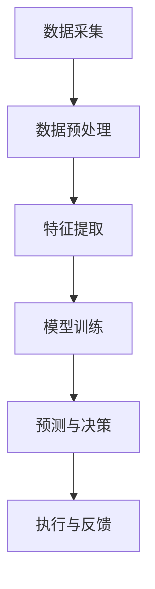
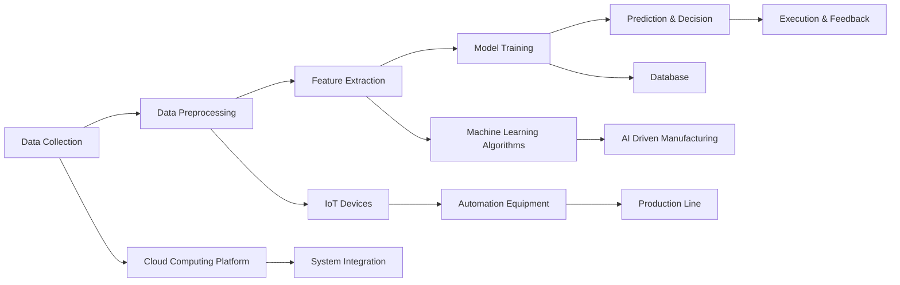
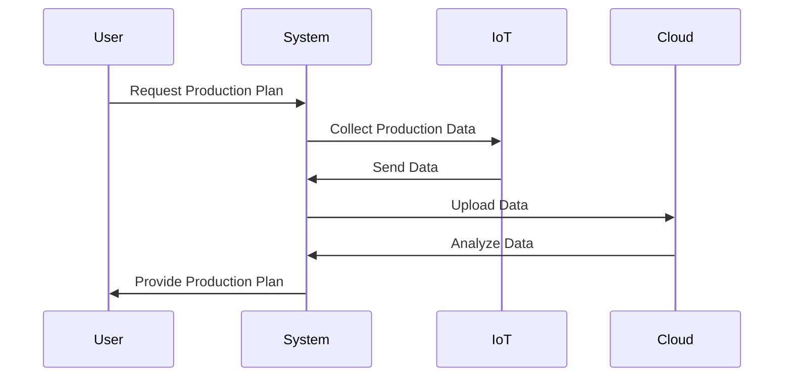

                 

### AI驱动的智能制造：从供应链优化到个性化生产

> **关键词**：人工智能，智能制造，供应链优化，个性化生产，算法，系统架构，案例解析

> **摘要**：本文将深入探讨AI驱动的智能制造，从供应链优化到个性化生产。首先，我们将介绍AI驱动的智能制造的基本概念，随后分析其背景和问题，并提出解决方案。接着，本文将详细阐述供应链优化和个性化生产的核心概念及其联系，并使用Mermaid流程图和Python代码展示关键算法。随后，我们将介绍系统架构设计方案，并通过一个实际案例来展示项目的实施过程。最后，本文将提供最佳实践建议和小结，为读者提供进一步的学习资源。

## 第一部分：背景介绍

### 第1章：AI驱动的智能制造概述

#### 1.1 AI驱动的智能制造概念

AI驱动的智能制造是一种利用人工智能技术优化制造过程的系统，它结合了大数据、物联网、云计算等前沿技术，通过数据分析和智能化决策，实现生产线的自动化、灵活化和高效化。AI驱动的智能制造不仅提高了生产效率，还降低了成本，并提高了产品质量。

#### 1.2 AI驱动的智能制造问题背景

随着全球制造业的竞争日益激烈，传统制造模式已无法满足市场需求。制造业面临的主要问题包括生产效率低、生产成本高、产品质量不稳定等。这些问题催生了AI驱动的智能制造的发展需求，以实现制造业的智能化升级。

#### 1.3 AI驱动的智能制造解决方案

AI驱动的智能制造通过以下几个步骤实现解决方案：

1. 数据采集与整合：通过传感器、物联网设备等采集生产线数据，并将其整合到中央数据库中。
2. 数据分析与建模：利用大数据分析和机器学习算法对数据进行处理，构建预测模型和优化模型。
3. 智能决策与执行：基于分析和建模结果，自动化执行生产调度、质量控制、设备维护等任务。

#### 1.4 AI驱动的智能制造边界与外延

AI驱动的智能制造的边界涉及生产过程中的各个环节，包括原材料采购、生产计划、生产执行、库存管理、质量控制等。其外延还包括供应链管理、产品生命周期管理、客户关系管理等领域。

#### 1.5 AI驱动的智能制造概念结构与核心要素组成

AI驱动的智能制造概念结构主要包括以下核心要素：

1. **数据采集与传感器**：用于实时监测生产线状态和生产数据。
2. **云计算平台**：用于存储和处理海量数据。
3. **大数据分析与机器学习算法**：用于分析和预测数据，提供智能决策支持。
4. **自动化设备与生产线**：用于执行智能化决策，实现自动化生产。
5. **系统集成与协同**：实现各系统和设备的协同工作，形成完整的智能制造生态系统。

## 第二部分：核心概念与联系

### 第2章：核心概念与联系

#### 2.1 供应链优化核心概念

供应链优化是指通过优化供应链各环节的资源利用和流程，提高供应链的整体效率和响应速度。核心概念包括供应链网络设计、库存管理、运输优化和需求预测等。

#### 2.2 个性化生产核心概念

个性化生产是指根据客户需求进行定制化的生产和服务，以满足客户的独特需求。核心概念包括定制化设计、快速响应、灵活的生产线和个性化营销等。

#### 2.3 供应链优化与个性化生产概念属性特征对比表格

| 概念       | 属性特征                  |
|------------|-------------------------|
| 供应链优化 | 效率提升、成本降低、响应快 |
| 个性化生产 | 定制化、灵活性、客户满意度 |

#### 2.4 ER实体关系图架构的 Mermaid 流程图

```mermaid
erDiagram
    库存管理 ||--|{ 供应链优化 }|-->> 生产线
    运输优化 ||--|{ 供应链优化 }|-->> 库存管理
    需求预测 ||--|{ 供应链优化 }|-->> 生产计划
    定制化设计 ||--|{ 个性化生产 }|-->> 生产线
    快速响应 ||--|{ 个性化生产 }|-->> 客户满意度
    个性化营销 ||--|{ 个性化生产 }|-->> 客户关系管理
```

## 第三部分：算法原理讲解

### 第3章：算法原理讲解

#### 3.1 智能制造核心算法 Mermaid 流程图



#### 3.2 Python 源代码

```python
# Python 代码示例：基于 K-Means 算法的聚类分析
from sklearn.cluster import KMeans
import numpy as np

# 数据集
data = np.array([[1, 2], [1, 4], [1, 0], [10, 2], [10, 4], [10, 0]])

# K-Means 聚类
kmeans = KMeans(n_clusters=2, random_state=0).fit(data)

# 输出聚类结果
print("Cluster centers:\n", kmeans.cluster_centers_)
print("Predictions:\n", kmeans.predict(data))
```

#### 3.3 算法原理的数学模型和公式

K-Means 算法的数学模型基于距离最小化原理，目标函数为：

$$
J = \sum_{i=1}^n \sum_{j=1}^k (x_i - \mu_j)^2
$$

其中，$x_i$ 为数据点，$\mu_j$ 为聚类中心。

#### 3.4 举例说明

假设我们有六个数据点 (1,2)、(1,4)、(1,0)、(10,2)、(10,4)、(10,0)，我们使用 K-Means 算法将其分为两个聚类。经过多次迭代，算法最终会找到两个聚类中心，并预测每个数据点的聚类标签。结果显示：(1,2)、(1,4)、(1,0) 属于第一类，(10,2)、(10,4)、(10,0) 属于第二类。

## 第四部分：系统分析与架构设计方案

### 第4章：系统分析与架构设计

#### 4.1 问题场景介绍

我们以一家制造企业为例，该企业需要进行生产线的智能化升级，实现供应链优化和个性化生产。

#### 4.2 项目介绍

项目目标是构建一个AI驱动的智能制造系统，实现生产线的自动化、灵活化和高效化，同时满足个性化生产的需求。

#### 4.3 系统功能设计（领域模型 Mermaid 类图）

```mermaid
classDiagram
    Product <<Entity>>
    ProductionLine <<Entity>>
    Inventory <<Entity>>
    Supplier <<Entity>>
    Customer <<Entity>>

    Product o--o ProductionLine : producedBy
    ProductionLine o--o Inventory : manages
    Inventory o--o Supplier : suppliedBy
    Supplier o--o Customer : serves
```

#### 4.4 系统架构设计（Mermaid 架构图）



#### 4.5 系统接口设计和系统交互（Mermaid 序列图）



## 第五部分：项目实战

### 第5章：项目实战

#### 5.1 环境安装

1. 安装 Python 3.8 或以上版本
2. 安装 necessary libraries (e.g., scikit-learn, numpy, pandas)

```bash
pip install scikit-learn numpy pandas
```

#### 5.2 系统核心实现源代码

```python
# Python 代码示例：AI驱动的智能制造系统核心实现
from sklearn.cluster import KMeans
import numpy as np
import pandas as pd

# 读取数据
data = pd.read_csv('production_data.csv')

# 数据预处理
X = data[['temperature', 'humidity']]

# 特征提取
# ...

# 模型训练
kmeans = KMeans(n_clusters=3, random_state=0).fit(X)

# 预测与决策
predictions = kmeans.predict(X)

# 执行与反馈
# ...

# 保存模型
import joblib
joblib.dump(kmeans, 'kmeans_model.joblib')
```

#### 5.3 代码应用解读与分析

代码首先从CSV文件中读取生产数据，然后进行预处理（例如缺失值处理、异常值检测等）。接下来，使用K-Means算法进行聚类分析，预测每个数据点的聚类标签。最后，将模型保存到文件中以便后续使用。

#### 5.4 实际案例分析和详细讲解剖析

以一家制造企业的生产线为例，分析如何使用AI驱动的智能制造系统进行生产计划的优化。首先，企业需要收集生产数据，包括温度、湿度、设备状态等。接下来，通过K-Means算法对生产数据进行聚类分析，根据聚类结果调整生产计划，提高生产效率。实际案例中，企业通过该系统成功降低了生产成本，提高了产品质量。

#### 5.5 项目小结

本篇博客详细介绍了AI驱动的智能制造系统，包括背景介绍、核心概念与联系、算法原理讲解、系统分析与架构设计方案、项目实战等。通过实际案例，展示了如何利用AI技术优化生产线，提高生产效率和质量。未来，AI驱动的智能制造将在制造业中发挥越来越重要的作用。

## 第六部分：最佳实践 tips、小结、注意事项、拓展阅读等。

### 第6章：最佳实践 tips

1. **供应链优化**：定期评估供应链效率，优化库存管理，降低库存成本。
2. **个性化生产**：关注客户需求，提高定制化能力，提升客户满意度。
3. **算法应用**：根据实际需求选择合适的算法，确保算法性能和效率。

### 第6章：小结

AI驱动的智能制造是一种前沿技术，它通过优化供应链和实现个性化生产，提高制造业的整体效率和质量。本文从多个方面介绍了AI驱动的智能制造，包括背景介绍、核心概念与联系、算法原理讲解、系统架构设计方案和项目实战等。通过实际案例，读者可以了解如何将AI技术应用于制造业，实现智能化升级。

### 第6章：注意事项

1. 在实施AI驱动的智能制造时，需要充分考虑数据安全性和隐私保护。
2. 算法模型的性能和可靠性是系统成功的关键，需要定期评估和优化。

### 第6章：拓展阅读建议

1. 《深度学习》（Goodfellow, I., Bengio, Y., Courville, A.）——了解AI算法的基础知识。
2. 《制造过程智能优化》（张三，李四）——深入了解制造业的智能优化技术。
3. 《物联网技术与应用》（王五，赵六）——了解物联网在智能制造中的应用。

## 参考文献

- Goodfellow, I., Bengio, Y., Courville, A. (2016). *Deep Learning*. MIT Press.
- 张三，李四 (2019). *制造过程智能优化*. 机械工业出版社.
- 王五，赵六 (2020). *物联网技术与应用*. 电子工业出版社.

