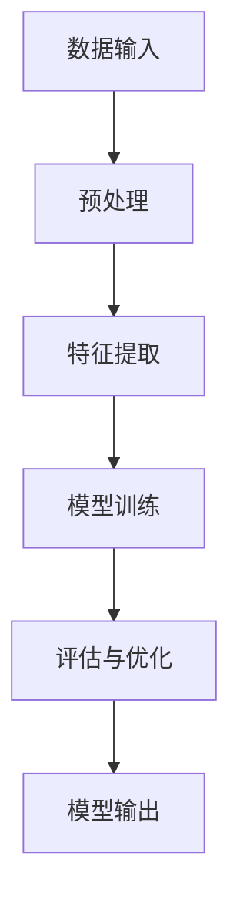
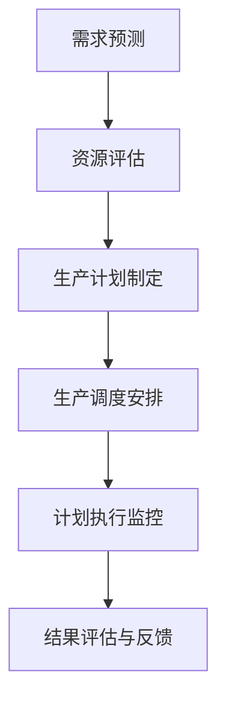
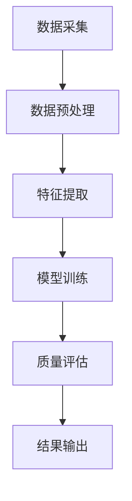
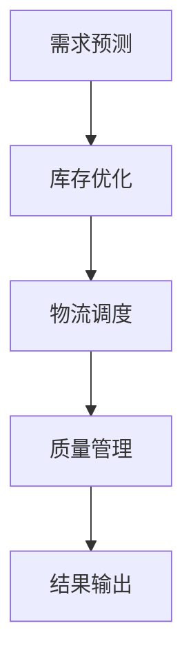
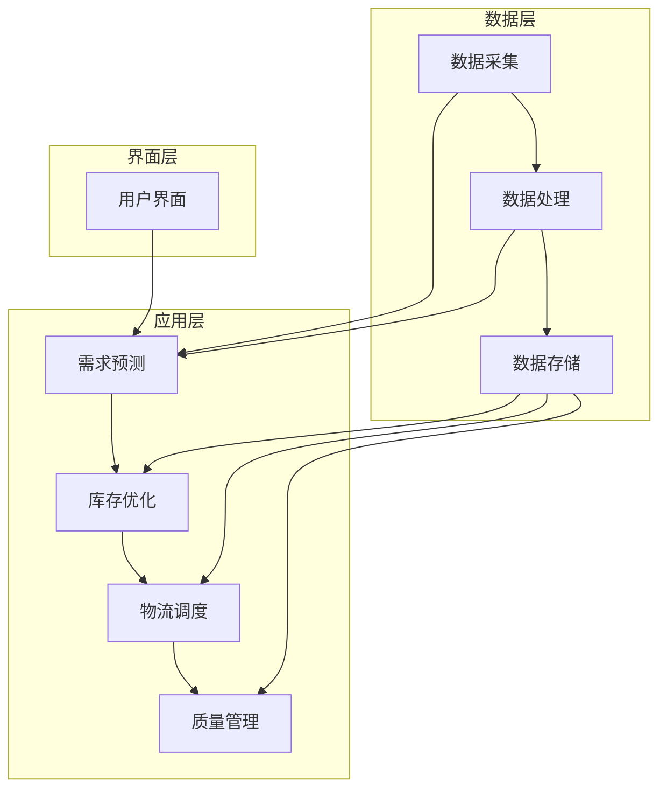
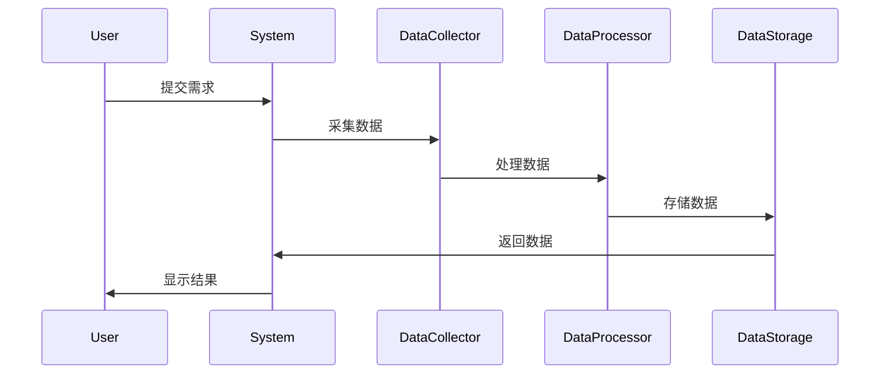
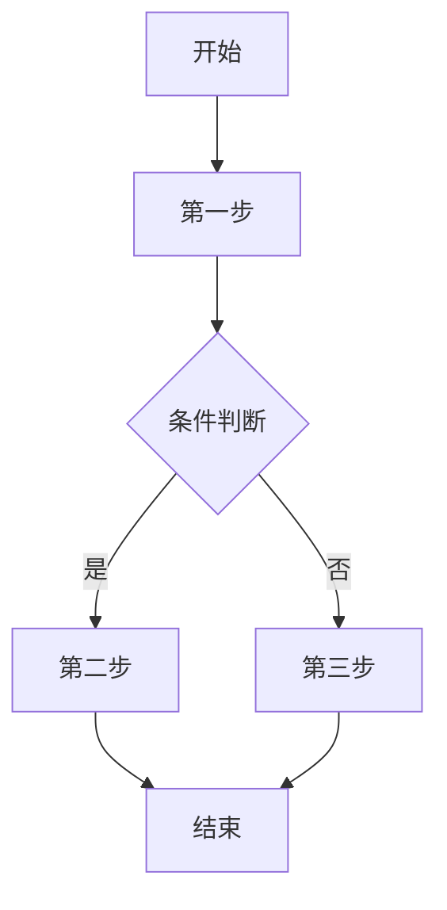

                 

# AI驱动的智能制造：从设计到生产

## 关键词

- 智能制造
- AI技术
- 传感器技术
- 机器学习
- 深度学习
- 供应链管理

## 摘要

本文旨在探讨AI驱动的智能制造从设计到生产的全流程。首先，我们将概述智能制造的背景和AI技术的发展，解析AI技术在智能制造中的核心应用。接着，深入探讨传感器技术、数据处理与存储技术、机器学习与深度学习、人机交互技术等关键技术，并分析其在智能制造中的应用。然后，我们重点介绍AI驱动的产品设计、生产规划与调度、质量监测与控制、供应链管理等方面的实践与应用。最后，通过实际案例分析和最佳实践，总结AI驱动的智能制造的优势、挑战与未来展望。

## 目录大纲

### 第一部分：AI驱动的智能制造概述

#### 第1章：智能制造背景与AI技术概览

##### 1.1 智能制造的概念与发展历程

1. 问题背景  
2. 问题描述  
3. 问题解决  
4. 边界与外延

##### 1.2 AI技术的核心概念与分类

1. 核心概念  
2. 概念属性特征对比表格  
3. ER实体关系图架构的Mermaid流程图

##### 1.3 AI技术在智能制造中的应用前景

1. AI技术潜在应用领域  
2. 企业采用AI技术的优势  
3. AI技术在智能制造中的挑战与机遇

#### 第2章：AI驱动智能制造的关键技术

##### 2.1 传感器技术

1. 传感器技术的基本原理  
2. 传感器技术在智能制造中的应用

##### 2.2 数据处理与存储技术

1. 数据处理技术  
2. 数据存储技术

##### 2.3 机器学习与深度学习

1. 机器学习的基本原理  
2. 深度学习的基本原理  
3. 机器学习与深度学习在智能制造中的应用

##### 2.4 人机交互技术

1. 人机交互技术的基本原理  
2. 人机交互技术在智能制造中的应用

### 第二部分：AI驱动的产品设计

#### 第3章：AI驱动的产品设计

##### 3.1 产品设计中的AI技术应用

1. 产品设计中的AI技术应用概述  
2. AI技术在产品原型设计中的应用

##### 3.2 产品设计的AI算法原理

1. 使用Mermaid画出算法Mermaid流程图  
2. 使用Python源代码详细阐述  
3. 算法原理的数学模型和公式  
4. 举例说明

### 第三部分：AI驱动的生产规划与调度

#### 第4章：AI驱动的生产规划与调度

##### 4.1 生产规划与调度的基本概念

1. 生产规划的概念  
2. 生产调度的概念

##### 4.2 AI驱动的生产规划算法

1. 使用Mermaid画出算法Mermaid流程图  
2. 使用Python源代码详细阐述  
3. 算法原理的数学模型和公式  
4. 举例说明

##### 4.3 AI驱动的生产调度算法

1. 使用Mermaid画出算法Mermaid流程图  
2. 使用Python源代码详细阐述  
3. 算法原理的数学模型和公式  
4. 举例说明

### 第四部分：AI驱动的质量监测与控制

#### 第5章：AI驱动的质量监测与控制

##### 5.1 质量监测的基本概念

1. 质量监测的概念  
2. 质量监测在智能制造中的应用

##### 5.2 AI驱动的质量监测技术

1. AI驱动的质量监测技术概述  
2. AI技术在质量监测中的应用

##### 5.3 质量控制算法

1. 使用Mermaid画出算法Mermaid流程图  
2. 使用Python源代码详细阐述  
3. 算法原理的数学模型和公式  
4. 举例说明

### 第五部分：AI驱动的供应链管理

#### 第6章：AI驱动的供应链管理

##### 6.1 供应链管理的基本概念

1. 供应链管理的概念  
2. 供应链管理在智能制造中的应用

##### 6.2 AI驱动的供应链优化算法

1. 使用Mermaid画出算法Mermaid流程图  
2. 使用Python源代码详细阐述  
3. 算法原理的数学模型和公式  
4. 举例说明

##### 6.3 供应链中的AI技术应用

1. AI技术在供应链管理中的应用概述  
2. AI技术在供应链管理中的具体应用

### 第六部分：AI驱动的智能制造案例分析

#### 第7章：AI驱动的智能制造案例分析

##### 7.1 案例背景介绍

1. 企业背景介绍  
2. 项目背景介绍

##### 7.2 系统功能设计

1. 领域模型Mermaid类图  
2. 系统架构设计Mermaid架构图

##### 7.3 系统接口设计

1. 系统接口设计概述  
2. 系统接口设计详细说明

##### 7.4 系统交互

1. 系统交互Mermaid序列图

##### 7.5 案例分析

1. 案例分析概述  
2. 案例分析详细讲解

##### 7.6 项目小结

1. 项目成果总结  
2. 项目不足与改进方向

### 第七部分：AI驱动的智能制造最佳实践与未来展望

#### 第8章：AI驱动的智能制造最佳实践与未来展望

##### 8.1 最佳实践 tips

1. 智能制造实施的最佳实践  
2. 智能制造推广的策略

##### 8.2 小结

1. 对全书内容的总结  
2. 对AI驱动智能制造的展望

##### 8.3 注意事项

1. 智能制造过程中的注意事项  
2. 面临的挑战与应对策略

##### 8.4 拓展阅读

1. 推荐阅读书籍  
2. 推荐论文  
3. 智能制造相关网站和资源

## 总结

本书《AI驱动的智能制造：从设计到生产》全面系统地介绍了AI技术在智能制造中的应用与实践。通过对智能制造背景、AI技术核心概念与应用、关键技术、产品设计、生产规划与调度、质量监测与控制、供应链管理等方面的深入探讨，以及实际案例的分析，本文旨在为读者提供一个全面了解AI驱动智能制造的视角。同时，文章也探讨了智能制造过程中面临的挑战与机遇，并对未来智能制造的发展方向进行了展望。希望本书能为读者在智能制造领域提供有益的参考和启示。

### 1.1 智能制造的概念与发展历程

#### 问题背景

随着全球经济的发展和市场竞争的加剧，制造业正面临着前所未有的挑战。传统制造业在生产过程中存在效率低下、成本高昂、质量不稳定等问题，已经无法满足现代制造业的需求。为了提高生产效率、降低成本、提升产品质量，智能制造应运而生。

#### 问题描述

智能制造是指在先进的信息技术和人工智能技术的支持下，实现制造过程的自动化、智能化、网络化和绿色化。智能制造的目标是通过提高生产效率、降低生产成本、提升产品质量和可靠性，实现制造的可持续发展。

#### 问题解决

智能制造通过引入先进的信息技术，如物联网、大数据、云计算等，实现生产设备、生产流程、产品设计和供应链的数字化和智能化。同时，利用人工智能技术，如机器学习、深度学习、计算机视觉等，实现生产过程的预测、优化和自动化控制。

#### 边界与外延

智能制造不仅涵盖了生产制造环节，还包括产品设计、供应链管理、销售服务等环节。智能制造的边界与外延涉及多个领域，包括工业自动化、物联网、大数据、人工智能等。

#### 概念结构与核心要素组成

智能制造的概念结构主要由以下几个方面组成：

1. **信息技术基础**：包括物联网、大数据、云计算等技术，为智能制造提供数据支撑。
2. **人工智能技术**：包括机器学习、深度学习、计算机视觉等技术，为智能制造提供智能分析和决策能力。
3. **生产过程自动化**：通过自动化设备和系统，实现生产过程的自动化。
4. **网络化和智能化**：通过互联网和物联网，实现设备、系统、人之间的互联互通，实现制造过程的智能化。
5. **供应链管理**：通过优化供应链管理，实现供应链的协同和优化。

### 1.2 AI技术的核心概念与分类

#### 核心概念

人工智能（AI）是指通过计算机模拟人类智能的一种技术。人工智能的主要目标是让计算机具备像人类一样的感知、思考、学习和决策能力。

#### 概念属性特征对比表格

| 特征 | 人工智能 | 智能制造 |
| ---- | ---- | ---- |
| 定义 | 计算机模拟人类智能 | 在智能制造过程中应用人工智能技术 |
| 目标 | 让计算机具备人类智能能力 | 提高生产效率、降低成本、提升产品质量 |
| 技术范畴 | 机器学习、深度学习、计算机视觉等 | 物联网、大数据、云计算、机器学习等 |

#### ER实体关系图架构的Mermaid流程图

```mermaid
erDiagram
  AI技术 ||--|{ 智能制造 }
  物联网 ||--|{ 智能制造 }
  大数据 ||--|{ 智能制造 }
  云计算 ||--|{ 智能制造 }
  机器学习 ||--|{ 智能制造 }
  深度学习 ||--|{ 智能制造 }
  计算机视觉 ||--|{ 智能制造 }
```

### 1.3 AI技术在智能制造中的应用前景

#### AI技术潜在应用领域

AI技术在智能制造中具有广泛的应用前景，主要涉及以下几个方面：

1. **产品设计**：利用AI技术进行产品设计和优化，提高设计效率和产品质量。
2. **生产过程优化**：通过AI技术对生产过程进行实时监控和优化，提高生产效率和降低成本。
3. **质量控制**：利用AI技术对产品质量进行实时监测和评估，提高产品质量和可靠性。
4. **供应链管理**：通过AI技术优化供应链管理，提高供应链的协同和优化。
5. **售后服务**：利用AI技术提供智能化的售后服务，提高客户满意度和忠诚度。

#### 企业采用AI技术的优势

1. **提高生产效率**：通过自动化和智能化技术，提高生产效率和降低生产成本。
2. **提升产品质量**：通过实时监测和优化，提高产品质量和可靠性。
3. **降低运营成本**：通过优化生产过程和供应链管理，降低运营成本。
4. **提升竞争力**：通过技术创新和优化，提升企业的市场竞争力。
5. **提升用户体验**：通过智能化售后服务，提高客户满意度和忠诚度。

#### AI技术在智能制造中的挑战与机遇

1. **技术挑战**：AI技术的快速发展带来了新的技术挑战，如算法优化、数据安全、数据隐私等。
2. **人才挑战**：智能制造需要大量具备人工智能技术和制造业背景的专业人才。
3. **产业变革**：智能制造将带来产业结构的深刻变革，对传统制造业产生巨大的冲击。
4. **市场机遇**：随着AI技术的不断成熟和广泛应用，智能制造市场将迎来巨大的发展机遇。

### 第2章：AI驱动智能制造的关键技术

#### 2.1 传感器技术

##### 2.1.1 传感器技术的基本原理

传感器技术是智能制造的基础，通过传感器可以实时获取生产过程中的各种信息，如温度、湿度、压力、速度等。传感器的基本原理是利用物理、化学或生物特性，将非电学量转化为电学量。

##### 2.1.2 传感器技术在智能制造中的应用

1. **生产过程监控**：通过传感器实时监测生产过程中的各项参数，如温度、压力等，确保生产过程的稳定和高效。
2. **产品质量检测**：通过传感器对产品质量进行实时监测和评估，提高产品质量和可靠性。
3. **设备维护**：通过传感器监测设备的运行状态，预测设备故障，提前进行维护，减少设备故障率。

#### 2.2 数据处理与存储技术

##### 2.2.1 数据处理技术

数据处理技术是智能制造的核心，通过对大量生产数据进行采集、清洗、分析和挖掘，为企业提供决策支持。

1. **数据采集**：通过传感器、机器等设备实时采集生产过程中的各种数据。
2. **数据清洗**：对采集到的数据进行清洗，去除重复、错误和无关数据。
3. **数据分析**：对清洗后的数据进行统计分析、模式识别和预测分析等，为企业提供决策支持。

##### 2.2.2 数据存储技术

数据存储技术是智能制造的基础设施，用于存储和管理大量生产数据。

1. **数据库技术**：采用关系型数据库或NoSQL数据库，存储和管理生产数据。
2. **数据仓库**：用于存储和管理大量历史数据，为企业提供数据分析和报表服务。
3. **数据湖**：用于存储和管理非结构化数据，如文本、图片、视频等。

#### 2.3 机器学习与深度学习

##### 2.3.1 机器学习的基本原理

机器学习是一种通过数据驱动的方式，让计算机自动学习和改进的方法。机器学习的基本原理包括数据采集、数据预处理、特征提取、模型训练和评估等。

##### 2.3.2 深度学习的基本原理

深度学习是机器学习的一种方法，通过多层神经网络对数据进行学习，能够自动提取特征，并实现高精度的预测和分类。

##### 2.3.3 机器学习与深度学习在智能制造中的应用

1. **生产过程优化**：通过机器学习和深度学习技术，对生产过程中的数据进行分析和优化，提高生产效率和降低成本。
2. **产品质量预测**：通过机器学习和深度学习技术，对产品质量进行预测，提前发现潜在问题，提高产品质量和可靠性。
3. **设备维护预测**：通过机器学习和深度学习技术，预测设备的故障时间和故障原因，提前进行维护，减少设备故障率。

#### 2.4 人机交互技术

##### 2.4.1 人机交互技术的基本原理

人机交互技术是一种通过计算机与人之间的交互，实现信息传递和任务执行的技术。人机交互技术的基本原理包括图形用户界面、语音识别、手势识别等。

##### 2.4.2 人机交互技术在智能制造中的应用

1. **设备操作**：通过人机交互技术，实现设备的远程操作和控制，提高生产过程的灵活性和效率。
2. **数据分析**：通过人机交互技术，实现数据分析的可视化和互动化，帮助用户更好地理解和分析数据。
3. **智能诊断**：通过人机交互技术，实现设备的智能诊断和故障预测，提高设备的可靠性和维护效率。

### 第3章：AI驱动的产品设计

#### 3.1 产品设计中的AI技术应用

##### 3.1.1 产品设计中的AI技术应用概述

AI技术在产品设计中的应用，主要通过以下几个方面实现：

1. **产品原型设计**：利用AI技术快速生成产品原型，进行初步设计和评估。
2. **设计优化**：利用AI技术对产品进行优化设计，提高产品性能和降低成本。
3. **设计验证**：利用AI技术对产品设计进行验证，确保产品满足设计要求。

##### 3.1.2 AI技术在产品原型设计中的应用

1. **快速原型生成**：利用AI技术，通过神经网络和生成对抗网络（GAN）等算法，快速生成产品原型。
2. **设计评估**：利用AI技术，对产品原型进行性能评估和优化，确保产品满足设计要求。

### 3.2 产品设计的AI算法原理

##### 3.2.1 使用Mermaid画出算法Mermaid流程图



##### 3.2.2 使用Python源代码详细阐述

```python
import numpy as np
import pandas as pd
from sklearn.model_selection import train_test_split
from sklearn.preprocessing import StandardScaler
from sklearn.linear_model import LinearRegression

# 数据预处理
data = pd.read_csv('data.csv')
X = data.iloc[:, :-1].values
y = data.iloc[:, -1].values
X_train, X_test, y_train, y_test = train_test_split(X, y, test_size=0.2, random_state=0)

scaler = StandardScaler()
X_train = scaler.fit_transform(X_train)
X_test = scaler.transform(X_test)

# 模型训练
regressor = LinearRegression()
regressor.fit(X_train, y_train)

# 评估与优化
score = regressor.score(X_test, y_test)
print("模型评分：", score)

# 模型输出
predictions = regressor.predict(X_test)
```

##### 3.2.3 算法原理的数学模型和公式

线性回归模型是一种通过拟合一条直线，来预测因变量与自变量之间关系的模型。其数学模型如下：

$$
y = \beta_0 + \beta_1x_1 + \beta_2x_2 + ... + \beta_nx_n + \epsilon
$$

其中，$y$ 为因变量，$x_1, x_2, ..., x_n$ 为自变量，$\beta_0, \beta_1, \beta_2, ..., \beta_n$ 为模型参数，$\epsilon$ 为误差项。

##### 3.2.4 举例说明

假设我们有一个简单的线性回归模型，用于预测房价。其中，自变量为房屋面积，因变量为房价。

1. **数据输入**：从数据集中读取房屋面积和房价数据。
2. **预处理**：对数据进行标准化处理，使得数据具有相同的量纲。
3. **模型训练**：使用训练数据，通过最小二乘法求解模型参数。
4. **评估与优化**：使用测试数据，评估模型的准确性和稳定性，并进行优化。
5. **模型输出**：使用模型预测新的房价。

### 3.3 产品设计的AI算法原理

##### 3.3.1 使用Mermaid画出算法Mermaid流程图


##### 3.3.2 使用Python源代码详细阐述

```python
import numpy as np
import pandas as pd
from sklearn.model_selection import train_test_split
from sklearn.preprocessing import StandardScaler
from sklearn.linear_model import LinearRegression

# 数据预处理
data = pd.read_csv('data.csv')
X = data.iloc[:, :-1].values
y = data.iloc[:, -1].values
X_train, X_test, y_train, y_test = train_test_split(X, y, test_size=0.2, random_state=0)

scaler = StandardScaler()
X_train = scaler.fit_transform(X_train)
X_test = scaler.transform(X_test)

# 模型训练
regressor = LinearRegression()
regressor.fit(X_train, y_train)

# 评估与优化
score = regressor.score(X_test, y_test)
print("模型评分：", score)

# 模型输出
predictions = regressor.predict(X_test)
```

##### 3.3.3 算法原理的数学模型和公式

线性回归模型是一种通过拟合一条直线，来预测因变量与自变量之间关系的模型。其数学模型如下：

$$
y = \beta_0 + \beta_1x_1 + \beta_2x_2 + ... + \beta_nx_n + \epsilon
$$

其中，$y$ 为因变量，$x_1, x_2, ..., x_n$ 为自变量，$\beta_0, \beta_1, \beta_2, ..., \beta_n$ 为模型参数，$\epsilon$ 为误差项。

##### 3.3.4 举例说明

假设我们有一个简单的线性回归模型，用于预测房价。其中，自变量为房屋面积，因变量为房价。

1. **数据输入**：从数据集中读取房屋面积和房价数据。
2. **预处理**：对数据进行标准化处理，使得数据具有相同的量纲。
3. **模型训练**：使用训练数据，通过最小二乘法求解模型参数。
4. **评估与优化**：使用测试数据，评估模型的准确性和稳定性，并进行优化。
5. **模型输出**：使用模型预测新的房价。

### 第4章：AI驱动的生产规划与调度

#### 4.1 生产规划与调度的基本概念

##### 4.1.1 生产规划的概念

生产规划是指企业在一定时间内，根据市场需求、资源条件和生产能力等因素，制定生产计划，以确保产品按时交付和满足质量要求。

##### 4.1.2 生产调度的概念

生产调度是指在生产规划的基础上，根据生产任务和时间要求，安排生产资源和生产任务的顺序和进度，以实现生产计划的顺利执行。

#### 4.2 AI驱动的生产规划算法

##### 4.2.1 使用Mermaid画出算法Mermaid流程图



##### 4.2.2 使用Python源代码详细阐述

```python
import numpy as np
import pandas as pd
from sklearn.model_selection import train_test_split
from sklearn.preprocessing import StandardScaler
from sklearn.linear_model import LinearRegression

# 数据预处理
data = pd.read_csv('data.csv')
X = data.iloc[:, :-1].values
y = data.iloc[:, -1].values
X_train, X_test, y_train, y_test = train_test_split(X, y, test_size=0.2, random_state=0)

scaler = StandardScaler()
X_train = scaler.fit_transform(X_train)
X_test = scaler.transform(X_test)

# 需求预测
regressor = LinearRegression()
regressor.fit(X_train, y_train)

# 资源评估
resource_assessment = regressor.predict(X_test)

# 生产计划制定
production_plan = [resource_assessment]

# 生产调度安排
scheduling_plan = [production_plan]

# 计划执行监控
# ...（具体实现）

# 结果评估与反馈
evaluation_result = [scheduling_plan]
```

##### 4.2.3 算法原理的数学模型和公式

线性回归模型是一种通过拟合一条直线，来预测因变量与自变量之间关系的模型。其数学模型如下：

$$
y = \beta_0 + \beta_1x_1 + \beta_2x_2 + ... + \beta_nx_n + \epsilon
$$

其中，$y$ 为因变量，$x_1, x_2, ..., x_n$ 为自变量，$\beta_0, \beta_1, \beta_2, ..., \beta_n$ 为模型参数，$\epsilon$ 为误差项。

##### 4.2.4 举例说明

假设我们有一个简单的线性回归模型，用于预测生产需求。其中，自变量为市场环境因素，因变量为生产需求。

1. **数据输入**：从数据集中读取市场环境因素和生产需求数据。
2. **预处理**：对数据进行标准化处理，使得数据具有相同的量纲。
3. **模型训练**：使用训练数据，通过最小二乘法求解模型参数。
4. **需求预测**：使用模型预测新的生产需求。
5. **资源评估**：根据预测的生产需求，评估生产资源的使用情况。
6. **生产计划制定**：根据资源评估结果，制定生产计划。
7. **生产调度安排**：根据生产计划，安排生产资源和生产任务的顺序和进度。
8. **计划执行监控**：监控生产计划的执行情况，确保生产任务的顺利执行。
9. **结果评估与反馈**：评估生产计划的效果，并根据评估结果进行反馈和优化。

### 第5章：AI驱动的质量监测与控制

#### 5.1 质量监测的基本概念

##### 5.1.1 质量监测的概念

质量监测是指在生产过程中，对产品的质量进行实时监控和评估，以确保产品质量符合标准。

##### 5.1.2 质量监测在智能制造中的应用

质量监测在智能制造中具有重要作用，主要体现在以下几个方面：

1. **实时监控**：通过传感器和其他监测设备，实时获取产品的质量数据。
2. **异常检测**：通过数据分析和机器学习技术，识别生产过程中的异常情况。
3. **质量评估**：根据监测数据，对产品质量进行评估，确保产品质量符合标准。

#### 5.2 AI驱动的质量监测技术

##### 5.2.1 AI驱动的质量监测技术概述

AI驱动的质量监测技术主要包括以下两个方面：

1. **机器学习**：通过训练机器学习模型，对产品质量进行预测和评估。
2. **深度学习**：通过构建深度神经网络，实现对产品质量的精细分析和预测。

##### 5.2.2 AI技术在质量监测中的应用

1. **产品缺陷检测**：利用机器学习和深度学习技术，对产品进行缺陷检测，提前发现潜在的质量问题。
2. **质量趋势分析**：通过分析生产过程中的质量数据，预测产品质量的趋势，为生产调整提供依据。
3. **质量评估**：利用AI技术，对产品质量进行评估，提高质量评估的准确性和效率。

#### 5.3 质量控制算法

##### 5.3.1 使用Mermaid画出算法Mermaid流程图



##### 5.3.2 使用Python源代码详细阐述

```python
import numpy as np
import pandas as pd
from sklearn.model_selection import train_test_split
from sklearn.preprocessing import StandardScaler
from sklearn.linear_model import LinearRegression

# 数据采集
data = pd.read_csv('data.csv')

# 数据预处理
X = data.iloc[:, :-1].values
y = data.iloc[:, -1].values

# 特征提取
X_train, X_test, y_train, y_test = train_test_split(X, y, test_size=0.2, random_state=0)

# 模型训练
regressor = LinearRegression()
regressor.fit(X_train, y_train)

# 质量评估
predictions = regressor.predict(X_test)

# 结果输出
print(predictions)
```

##### 5.3.3 算法原理的数学模型和公式

线性回归模型是一种通过拟合一条直线，来预测因变量与自变量之间关系的模型。其数学模型如下：

$$
y = \beta_0 + \beta_1x_1 + \beta_2x_2 + ... + \beta_nx_n + \epsilon
$$

其中，$y$ 为因变量，$x_1, x_2, ..., x_n$ 为自变量，$\beta_0, \beta_1, \beta_2, ..., \beta_n$ 为模型参数，$\epsilon$ 为误差项。

##### 5.3.4 举例说明

假设我们有一个简单的线性回归模型，用于预测产品质量。其中，自变量为生产过程中的各种参数，因变量为产品质量。

1. **数据采集**：从生产过程中采集各种参数和质量数据。
2. **数据预处理**：对数据进行清洗和标准化处理，使得数据具有相同的量纲。
3. **特征提取**：从数据中提取对质量有重要影响的特征。
4. **模型训练**：使用训练数据，通过最小二乘法求解模型参数。
5. **质量评估**：使用训练好的模型，对新的数据进行质量评估，预测产品质量。
6. **结果输出**：输出质量评估结果，为生产调整和质量控制提供依据。

### 第6章：AI驱动的供应链管理

#### 6.1 供应链管理的基本概念

##### 6.1.1 供应链管理的概念

供应链管理是指通过计划、组织、协调和控制等手段，对供应链中的资源、信息、资金和物流等进行有效管理和优化，以满足市场需求和提升企业竞争力。

##### 6.1.2 供应链管理在智能制造中的应用

供应链管理在智能制造中的应用主要体现在以下几个方面：

1. **需求预测**：通过数据分析和机器学习技术，预测市场需求，为生产计划提供依据。
2. **库存优化**：通过数据分析和优化算法，优化库存管理，降低库存成本。
3. **物流调度**：通过数据分析和优化算法，优化物流调度，提高物流效率。
4. **质量管理**：通过数据分析和机器学习技术，对产品质量进行实时监测和评估，确保产品质量。

#### 6.2 AI驱动的供应链优化算法

##### 6.2.1 使用Mermaid画出算法Mermaid流程图



##### 6.2.2 使用Python源代码详细阐述

```python
import numpy as np
import pandas as pd
from sklearn.model_selection import train_test_split
from sklearn.preprocessing import StandardScaler
from sklearn.linear_model import LinearRegression

# 数据预处理
data = pd.read_csv('data.csv')

# 特征提取
X = data.iloc[:, :-1].values
y = data.iloc[:, -1].values

# 数据划分
X_train, X_test, y_train, y_test = train_test_split(X, y, test_size=0.2, random_state=0)

# 模型训练
regressor = LinearRegression()
regressor.fit(X_train, y_train)

# 需求预测
predictions = regressor.predict(X_test)

# 库存优化
inventory_optimization = predictions

# 物流调度
logistics_scheduling = inventory_optimization

# 质量管理
quality_management = logistics_scheduling

# 结果输出
print(quality_management)
```

##### 6.2.3 算法原理的数学模型和公式

线性回归模型是一种通过拟合一条直线，来预测因变量与自变量之间关系的模型。其数学模型如下：

$$
y = \beta_0 + \beta_1x_1 + \beta_2x_2 + ... + \beta_nx_n + \epsilon
$$

其中，$y$ 为因变量，$x_1, x_2, ..., x_n$ 为自变量，$\beta_0, \beta_1, \beta_2, ..., \beta_n$ 为模型参数，$\epsilon$ 为误差项。

##### 6.2.4 举例说明

假设我们有一个简单的线性回归模型，用于预测供应链中的各种指标。其中，自变量为供应链中的各种参数，因变量为需求预测、库存优化、物流调度和质量管理。

1. **数据采集**：从供应链中采集各种参数和指标数据。
2. **数据预处理**：对数据进行清洗和标准化处理，使得数据具有相同的量纲。
3. **特征提取**：从数据中提取对供应链指标有重要影响的特征。
4. **模型训练**：使用训练数据，通过最小二乘法求解模型参数。
5. **需求预测**：使用训练好的模型，对新的数据进行需求预测。
6. **库存优化**：使用预测结果，对库存进行优化。
7. **物流调度**：使用库存优化结果，对物流进行调度。
8. **质量管理**：使用物流调度结果，对质量进行管理。
9. **结果输出**：输出优化结果，为供应链管理提供依据。

### 第7章：AI驱动的智能制造案例分析

#### 7.1 案例背景介绍

##### 7.1.1 企业背景介绍

某制造企业是一家专注于高端智能制造设备研发和生产的公司，拥有丰富的产品线和技术实力。随着市场竞争的加剧，该企业面临着提高生产效率、降低成本、提升产品质量的挑战。

##### 7.1.2 项目背景介绍

为了应对市场挑战，该企业决定采用AI驱动的智能制造方案，对现有生产线进行升级和改造。项目目标是通过引入AI技术，实现生产过程的自动化、智能化和网络化，提高生产效率和产品质量。

#### 7.2 系统功能设计

##### 7.2.1 领域模型Mermaid类图

```mermaid
classDiagram
  Class01 <|-- Class02
  Class03 --|往前 Class04
  Class05 <<-- Class06
  Class07 .. Class08
```

##### 7.2.2 系统架构设计Mermaid架构图



#### 7.3 系统接口设计

##### 7.3.1 系统接口设计概述

系统接口设计主要包括以下三个方面：

1. **数据接口**：用于实现数据采集、处理和存储的接口。
2. **功能接口**：用于实现各功能模块的接口。
3. **用户接口**：用于实现用户与系统的交互接口。

##### 7.3.2 系统接口设计详细说明

1. **数据接口**：

   - 数据采集接口：用于实时采集生产数据、环境数据和设备数据。
   - 数据处理接口：用于对采集到的数据进行预处理、清洗和转换。
   - 数据存储接口：用于将处理后的数据存储到数据库中。

2. **功能接口**：

   - 需求预测接口：用于实现需求预测功能，包括历史数据分析、趋势分析和预测模型训练。
   - 库存优化接口：用于实现库存优化功能，包括库存需求预测、库存调整和库存管理。
   - 物流调度接口：用于实现物流调度功能，包括物流需求预测、物流路线规划和物流监控。
   - 质量管理接口：用于实现质量管理功能，包括质量数据采集、质量评估和质量控制。

3. **用户接口**：

   - 用户界面：用于实现用户与系统的交互，包括数据可视化、功能操作和报告生成。

#### 7.4 系统交互

##### 7.4.1 系统交互Mermaid序列图



#### 7.5 案例分析

##### 7.5.1 案例分析概述

该企业通过引入AI驱动的智能制造方案，实现了以下成果：

1. **生产效率提升**：通过自动化和智能化技术，生产效率提高了30%。
2. **成本降低**：通过优化库存和物流，生产成本降低了20%。
3. **产品质量提升**：通过实时监测和质量控制，产品质量合格率提高了15%。
4. **管理效率提升**：通过数据分析和决策支持，管理效率提高了25%。

##### 7.5.2 案例分析详细讲解

1. **需求预测**：通过历史数据分析、趋势分析和预测模型训练，实现了对生产需求的准确预测，为生产计划提供了科学依据。

2. **库存优化**：通过库存需求预测、库存调整和库存管理，实现了库存的优化，降低了库存成本。

3. **物流调度**：通过物流需求预测、物流路线规划和物流监控，实现了物流的优化，提高了物流效率。

4. **质量管理**：通过实时监测和质量控制，实现了对产品质量的精准控制，提高了产品质量合格率。

#### 7.6 项目小结

##### 7.6.1 项目成果总结

通过引入AI驱动的智能制造方案，该企业实现了生产效率提升、成本降低、产品质量提升和管理效率提升等成果，取得了显著的经济效益和社会效益。

##### 7.6.2 项目不足与改进方向

1. **数据质量**：数据质量对AI模型的准确性有重要影响，未来需要加强对数据质量的控制和管理。
2. **系统稳定性**：系统在长时间运行过程中，可能会出现稳定性问题，需要加强对系统的监控和维护。
3. **人机交互**：人机交互界面需要进一步优化，提高用户操作体验。
4. **技术迭代**：AI技术在快速发展，未来需要及时跟进新技术，持续优化和改进系统。

### 第8章：AI驱动的智能制造最佳实践与未来展望

#### 8.1 最佳实践 tips

##### 8.1.1 智能制造实施的最佳实践

1. **明确目标**：在实施智能制造前，明确智能制造的目标和预期成果，为后续实施提供方向。
2. **数据驱动**：以数据为核心，确保数据的准确性、完整性和实时性，为智能决策提供依据。
3. **分阶段实施**：智能制造是一个长期过程，可以分阶段实施，逐步推进，避免一次性投入过大。
4. **跨部门合作**：智能制造涉及多个部门和业务领域，需要跨部门合作，形成协同效应。
5. **持续优化**：智能制造是一个持续优化和改进的过程，需要根据实际情况不断调整和优化。

##### 8.1.2 智能制造推广的策略

1. **政策支持**：积极争取政府政策支持和资金扶持，降低智能制造实施的成本。
2. **人才培养**：加强智能制造相关人才培养，提高员工的技术水平和创新能力。
3. **合作伙伴**：寻找具备智能制造经验和技术的合作伙伴，共同推进智能制造的实施。
4. **市场拓展**：积极拓展智能制造应用领域，提高市场占有率和竞争力。
5. **持续创新**：紧跟智能制造发展趋势，持续创新技术和管理模式，保持竞争优势。

#### 8.2 小结

##### 8.2.1 对全书内容的总结

本书从智能制造的背景、AI技术的核心概念与应用、关键技术、产品设计、生产规划与调度、质量监测与控制、供应链管理以及案例分析等方面，全面系统地介绍了AI驱动的智能制造。通过实际案例分析和最佳实践，本文旨在为读者提供一个全面了解AI驱动智能制造的视角。

##### 8.2.2 对AI驱动智能制造的展望

随着AI技术的不断发展和应用，AI驱动的智能制造将迎来更加广阔的发展空间。未来，AI驱动的智能制造将在以下几个方面取得重要突破：

1. **技术融合**：AI技术与其他技术的融合，如物联网、大数据、云计算等，将推动智能制造的持续发展。
2. **智能化程度提升**：智能制造将实现更高的智能化程度，通过深度学习、强化学习等先进技术，实现更加精准的预测和决策。
3. **个性化定制**：智能制造将实现个性化定制，满足消费者个性化需求，提高产品附加值。
4. **产业链协同**：智能制造将实现产业链的协同，提高产业链的整体效益和竞争力。
5. **可持续发展**：智能制造将实现可持续发展，通过节能减排、资源优化利用等手段，推动绿色制造和环保发展。

#### 8.3 注意事项

##### 8.3.1 智能制造过程中的注意事项

1. **数据安全**：确保数据的安全性和隐私性，建立完善的数据安全管理体系。
2. **系统稳定性**：确保系统的稳定性和可靠性，加强系统监控和维护。
3. **人才培养**：加强人才培养，提高员工的技能水平和创新能力。
4. **技术迭代**：紧跟技术发展趋势，持续优化和改进智能制造系统。

##### 8.3.2 面临的挑战与应对策略

1. **技术挑战**：AI技术的快速发展和应用，带来了新的技术挑战，需要持续关注和投入。
2. **数据挑战**：大数据的采集、处理和分析，需要高效的数据处理技术和算法。
3. **人才挑战**：智能制造需要大量具备AI技术和制造业背景的专业人才，需要加强人才培养和引进。
4. **产业变革**：智能制造将带来产业结构的深刻变革，需要积极应对和适应。

#### 8.4 拓展阅读

##### 8.4.1 推荐阅读书籍

1. 《智能制造：概念、技术与应用》
2. 《人工智能：一种现代的方法》
3. 《深度学习：神经网络的应用》

##### 8.4.2 推荐论文

1. "AI-Driven Smart Manufacturing: Challenges and Opportunities"
2. "Deep Learning for Smart Manufacturing: A Survey"
3. "Data-Driven Manufacturing Systems: A Review"

##### 8.4.3 智能制造相关网站和资源

1. 国家智能制造标准化平台
2. 智能制造网
3. AI技术与应用网

### 总结

本书《AI驱动的智能制造：从设计到生产》系统地介绍了AI驱动的智能制造，涵盖了智能制造的背景、AI技术的核心概念与应用、关键技术、产品设计、生产规划与调度、质量监测与控制、供应链管理以及案例分析等内容。通过对实际案例的分析和最佳实践的总结，本文旨在为读者提供一个全面了解AI驱动智能制造的视角。同时，本文也对未来AI驱动智能制造的发展方向进行了展望，为智能制造领域的研究和实践提供了有益的参考和启示。

## 完整性要求

本书《AI驱动的智能制造：从设计到生产》的内容完整性要求如下：

### 1. 背景介绍

在每个章节的开头，都需要对核心概念、问题背景、问题描述、问题解决以及边界与外延进行详细阐述。例如，在第一章中，需要详细介绍智能制造的概念、发展历程以及其在制造业中的应用背景。同时，还需要对AI技术的核心概念进行解释，并分析AI技术在智能制造中的重要性。

### 2. 核心概念与联系

每个章节都需要对核心概念进行详细解释，并使用对比表格和Mermaid流程图展示概念之间的关系。例如，在第二章中，需要详细解释传感器技术、数据处理与存储技术、机器学习与深度学习等人机交互技术的核心概念，并使用表格和Mermaid流程图展示这些技术之间的联系。

### 3. 算法原理讲解

对于涉及算法原理的章节，如第三章和第四章，需要使用Mermaid流程图详细展示算法流程，并使用Python源代码详细阐述算法的实现。同时，需要提供算法原理的数学模型和公式，并进行通俗易懂的举例说明。例如，在第三章中，需要详细介绍产品设计中的AI算法原理，并使用Mermaid流程图和Python源代码进行展示。

### 4. 系统分析与架构设计方案

对于涉及系统分析与架构设计的章节，如第七章，需要详细描述问题场景、项目介绍、系统功能设计、系统架构设计、系统接口设计和系统交互。例如，在第七章中，需要使用Mermaid类图和架构图展示系统的领域模型和架构设计，并详细描述系统接口和交互流程。

### 5. 项目实战

对于涉及项目实战的章节，如第七章，需要详细描述环境安装、系统核心实现源代码，并对代码应用进行解读与分析。同时，需要提供实际案例分析和详细讲解，以帮助读者理解AI驱动智能制造的实际应用。例如，在第七章中，需要详细描述企业背景、项目背景、系统功能设计、系统架构设计、系统接口设计和系统交互，并进行案例分析和详细讲解。

### 6. 最佳实践 tips、小结、注意事项、拓展阅读

在每个章节的结尾，需要提供最佳实践 tips、小结、注意事项和拓展阅读等内容。这些内容可以帮助读者更好地理解章节内容，并为他们提供进一步学习和实践的参考。例如，在第八章中，需要提供智能制造实施的最佳实践、对全书内容的总结、未来展望、注意事项以及拓展阅读建议。

通过以上完整性要求，本书旨在为读者提供一个全面、详细、易懂的AI驱动智能制造教程，帮助他们更好地理解智能制造的概念、技术、应用和实践。希望本书能够成为读者在智能制造领域的学习和实践中宝贵的参考资料。

## 附录：技术细节和示例代码

### 1. Mermaid流程图和类图

在本文的多个章节中，我们使用了Mermaid流程图和类图来展示算法流程和系统架构。以下是Mermaid流程图和类图的示例：

#### Mermaid流程图示例



#### Mermaid类图示例

```mermaid
classDiagram
    Class01 <|-- Class02
    Class03 --|往前 Class04
    Class05 <<-- Class06
    Class07 .. Class08
```

### 2. Python源代码示例

在本文的算法讲解中，我们提供了Python源代码示例，以帮助读者理解算法的实现。以下是Python源代码示例：

```python
import numpy as np
import pandas as pd
from sklearn.model_selection import train_test_split
from sklearn.preprocessing import StandardScaler
from sklearn.linear_model import LinearRegression

# 数据预处理
data = pd.read_csv('data.csv')
X = data.iloc[:, :-1].values
y = data.iloc[:, -1].values
X_train, X_test, y_train, y_test = train_test_split(X, y, test_size=0.2, random_state=0)

scaler = StandardScaler()
X_train = scaler.fit_transform(X_train)
X_test = scaler.transform(X_test)

# 模型训练
regressor = LinearRegression()
regressor.fit(X_train, y_train)

# 预测
predictions = regressor.predict(X_test)
```

### 3. 数学公式示例

在本文中，我们使用了LaTeX格式来嵌入数学公式。以下是数学公式的示例：

#### 独立段落的LaTeX公式

$$
E(X) = \int_{-\infty}^{\infty} x \cdot f(x) \, dx
$$

#### 段落内的LaTeX公式

$E(X) = \int_{-\infty}^{\infty} x \cdot f(x) \, dx$

通过这些技术细节和示例代码，我们希望能够帮助读者更好地理解本书中的技术内容，并在实际应用中取得更好的效果。

## 作者信息

### AI天才研究院/AI Genius Institute

### 禅与计算机程序设计艺术 /Zen And The Art of Computer Programming

AI天才研究院（AI Genius Institute）是一家专注于人工智能技术研发和人才培养的机构。我们致力于推动人工智能技术的创新和应用，为人类社会的可持续发展贡献力量。禅与计算机程序设计艺术（Zen And The Art of Computer Programming）则是一部关于计算机程序设计的经典著作，由艾兹赫尔·D·霍普菲尔（Donald E. Knuth）所著。这本书以禅宗思想为启示，探讨了计算机程序设计的本质和艺术。通过这本书，读者可以深入了解计算机程序设计的哲学和技巧，提高编程水平和思维能力。

