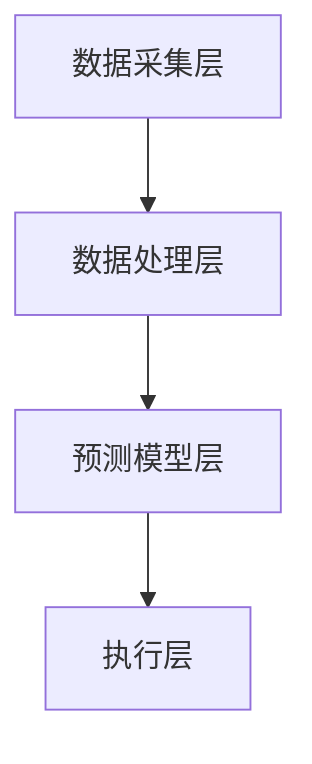

                 

# AI驱动的智能制造：从预测性维护到质量控制

## 关键词：智能制造、预测性维护、质量控制、人工智能、数据分析

### 摘要

在当今全球制造业的数字化转型浪潮中，人工智能（AI）驱动的智能制造已经成为企业提升竞争力、降低成本、提高生产效率的重要手段。本文从预测性维护和质量管理两个关键方面，系统性地探讨了AI在智能制造中的应用。首先，通过分析预测性维护的技术原理和实现方法，探讨了如何通过数据采集、模型构建和应用案例，实现设备故障预测和预防性维护。接着，详细介绍了质量控制在智能制造中的重要性，以及通过质量检测与分析、系统设计实现和质量控制应用实践，如何实现产品质量的精准控制。本文旨在为制造业提供一套完整的AI驱动的智能制造解决方案，帮助读者理解并应用这一前沿技术，以实现智能制造的全面升级。

### 目录大纲设计

**书名：** AI驱动的智能制造：从预测性维护到质量控制

**目录大纲：**

----------------------------------------------------------------

## 第一部分：引言与背景

## 第1章：引言

### 1.1 问题背景

#### 1.1.1 制造业面临的挑战

#### 1.1.2 AI在制造业中的应用前景

### 1.2 定义与核心概念

#### 1.2.1 AI驱动的智能制造

#### 1.2.2 预测性维护

#### 1.2.3 质量控制

### 1.3 书籍结构与内容概述

#### 1.3.1 各章节主要内容

#### 1.3.2 阅读目标与读者反馈

## 第2章：AI驱动的智能制造理论基础

### 2.1 AI基础知识

#### 2.1.1 人工智能概述

#### 2.1.2 机器学习与深度学习

### 2.2 制造业流程分析

#### 2.2.1 制造流程概述

#### 2.2.2 预测性维护流程

#### 2.2.3 质量控制流程

### 2.3 AI驱动的智能制造体系架构

#### 2.3.1 系统架构概述

#### 2.3.2 数据流与信息流

#### 2.3.3 关键技术分析

## 第二部分：预测性维护

## 第3章：预测性维护技术原理

### 3.1 数据采集与预处理

#### 3.1.1 数据来源与类型

#### 3.1.2 数据预处理方法

### 3.2 预测模型构建

#### 3.2.1 时间序列分析方法

#### 3.2.2 机器学习模型选择

#### 3.2.3 模型训练与优化

### 3.3 预测性维护案例解析

#### 3.3.1 案例背景

#### 3.3.2 预测模型应用

#### 3.3.3 预测结果分析

## 第4章：预测性维护系统设计与实现

### 4.1 系统需求分析

#### 4.1.1 系统功能需求

#### 4.1.2 系统性能需求

### 4.2 系统架构设计

#### 4.2.1 总体架构设计

#### 4.2.2 数据架构设计

#### 4.2.3 功能模块设计

### 4.3 系统实现与部署

#### 4.3.1 系统开发环境与工具

#### 4.3.2 系统核心代码实现

#### 4.3.3 系统测试与优化

## 第5章：预测性维护应用与实践

### 5.1 预测性维护应用场景

#### 5.1.1 设备健康管理

#### 5.1.2 能源管理

#### 5.1.3 生产调度优化

### 5.2 案例分享与讨论

#### 5.2.1 案例一：某制造企业的预测性维护实践

#### 5.2.2 案例二：某能源企业的预测性维护应用

#### 5.2.3 案例讨论

## 第三部分：质量控制

## 第6章：质量控制理论基础

### 6.1 质量控制概述

#### 6.1.1 质量控制的重要性

#### 6.1.2 质量控制体系

### 6.2 质量检测与分析方法

#### 6.2.1 质量检测技术

#### 6.2.2 数据分析工具与应用

### 6.3 质量改进与优化策略

#### 6.3.1 质量改进模型

#### 6.3.2 质量控制策略

## 第7章：质量控制系统设计与实施

### 7.1 质量控制系统需求分析

#### 7.1.1 系统功能需求

#### 7.1.2 系统性能需求

### 7.2 质量控制系统设计

#### 7.2.1 系统架构设计

#### 7.2.2 数据架构设计

#### 7.2.3 功能模块设计

### 7.3 质量控制系统实现与部署

#### 7.3.1 系统开发环境与工具

#### 7.3.2 系统核心代码实现

#### 7.3.3 系统测试与优化

## 第8章：质量控制应用与实践

### 8.1 质量控制应用场景

#### 8.1.1 制造过程质量监控

#### 8.1.2 产品质量追溯

#### 8.1.3 客户满意度分析

### 8.2 案例分享与讨论

#### 8.2.1 案例一：某电子企业的质量控制实践

#### 8.2.2 案例二：某食品企业的质量控制应用

#### 8.2.3 案例讨论

## 第9章：总结与展望

### 9.1 AI驱动的智能制造总结

#### 9.1.1 预测性维护与质量控制的关系

#### 9.1.2 成功实践案例分析

### 9.2 未来发展趋势与挑战

#### 9.2.1 技术发展趋势

----------------------------------------------------------------

### 1.1 问题背景

#### 1.1.1 制造业面临的挑战

制造业作为国民经济的支柱产业，正面临着前所未有的挑战和变革。首先，全球制造业竞争激烈，企业需不断提高生产效率和产品质量，以应对日益增长的运营成本和市场需求变化。传统的制造业模式往往依赖于大量人力和资源，存在生产效率低、生产周期长、质量控制难等问题。其次，随着制造业的智能化转型，企业需要不断引进新技术、新模式，如物联网、大数据和人工智能等，以提升制造过程的自动化和智能化水平。然而，这些新技术的应用不仅需要大量的资金投入，还需要专业技术人才的支撑，这对企业提出了更高的要求。

此外，制造业还面临着环境可持续性的挑战。随着环保意识的提高，企业需要采取绿色生产方式，降低能耗和废物排放。这不仅要求企业在生产过程中引入环保技术，还需要对生产过程进行实时监控和优化，以确保环保目标的实现。

#### 1.1.2 AI在制造业中的应用前景

人工智能技术在制造业中的应用前景广阔。首先，AI可以帮助企业实现预测性维护，通过数据分析和模型预测，提前发现设备故障，从而减少停机时间和维修成本。例如，通过分析设备运行数据，AI可以预测设备何时需要维护，从而实现预防性维护，提高设备利用率和生产效率。

其次，AI在质量控制中的应用也非常显著。通过图像识别和数据分析技术，AI可以实现对产品质量的实时监控和自动检测，从而提高产品质量，减少次品率。此外，AI还可以用于生产过程的优化，如生产调度的优化、生产线的自动化控制等，从而进一步提高生产效率和降低成本。

总之，AI驱动的智能制造为制造业带来了巨大的机遇。通过应用AI技术，企业不仅可以提高生产效率和产品质量，还可以实现绿色制造和可持续发展。然而，要充分利用AI技术，企业需要具备一定的技术基础和专业人才，同时也需要制定合理的战略和实施计划。

### 1.2 定义与核心概念

#### 1.2.1 AI驱动的智能制造

AI驱动的智能制造是指利用人工智能技术，对制造过程进行智能化改造和优化，从而实现生产过程的自动化、高效化和智能化。AI驱动的智能制造涵盖了从产品设计、生产计划、生产执行到质量控制的各个环节。其核心目标是提高生产效率、降低生产成本、提升产品质量和实现可持续发展。

在AI驱动的智能制造中，人工智能技术主要包括机器学习、深度学习、计算机视觉、自然语言处理等。这些技术可以帮助企业实现智能化的数据采集、分析和决策，从而优化生产过程，提高生产效率和产品质量。

#### 1.2.2 预测性维护

预测性维护是指通过实时监测设备运行状态，结合历史数据和人工智能算法，预测设备何时可能发生故障，并在故障发生前进行预防性维护，从而避免设备停机时间和减少维修成本。

预测性维护的核心是数据分析和模型预测。首先，通过传感器和其他设备，实时采集设备的运行数据，如温度、压力、振动等。然后，利用机器学习算法，对这些数据进行处理和分析，建立预测模型。通过模型预测，可以提前发现设备故障的迹象，从而进行预防性维护。

#### 1.2.3 质量控制

质量控制是指通过一系列的管理措施和技术手段，确保产品达到预定质量标准的过程。在AI驱动的智能制造中，质量控制主要依赖于人工智能技术，如计算机视觉、图像识别和数据分析等。

质量控制的目标是确保产品的质量，减少次品率和返工成本。通过实时监控生产过程，AI可以快速识别和纠正质量问题，从而提高产品质量。此外，AI还可以用于质量检测，如对产品外观、尺寸、成分等参数进行自动检测，从而实现100%质量检测。

### 1.3 书籍结构与内容概述

#### 1.3.1 各章节主要内容

本书共分为三部分，分别从预测性维护、质量控制和整体AI驱动的智能制造三个方面进行了详细探讨。

第一部分：引言与背景
- 第1章：介绍了制造业面临的挑战和AI在制造业中的应用前景，定义了AI驱动的智能制造、预测性维护和质量控制等核心概念。

第二部分：预测性维护
- 第2章：介绍了AI驱动的智能制造理论基础，包括AI基础知识、制造业流程分析和AI驱动的智能制造体系架构。
- 第3章：详细讲解了预测性维护的技术原理，包括数据采集与预处理、预测模型构建和预测性维护案例解析。
- 第4章：介绍了预测性维护系统设计与实现，包括系统需求分析、系统架构设计、系统实现与部署和系统测试与优化。
- 第5章：讨论了预测性维护的应用与实践，包括设备健康管理、能源管理和生产调度优化等。

第三部分：质量控制
- 第6章：介绍了质量控制的理论基础，包括质量控制的重要性、质量检测与分析方法和质量改进与优化策略。
- 第7章：介绍了质量控制系统设计与实施，包括质量控制系统需求分析、系统架构设计、系统实现与部署和系统测试与优化。
- 第8章：讨论了质量控制的应用与实践，包括制造过程质量监控、产品质量追溯和客户满意度分析等。

#### 1.3.2 阅读目标与读者反馈

本书的阅读目标主要包括：
1. 使读者了解AI驱动的智能制造、预测性维护和质量控制的基本概念和原理。
2. 使读者掌握预测性维护和质量控制的技术和方法，以及如何将其应用于实际生产过程中。
3. 为读者提供一套完整的AI驱动的智能制造解决方案，帮助读者提升生产效率和产品质量。

为了达到上述目标，本书鼓励读者在阅读过程中积极思考和参与讨论，通过实际案例分析和项目实战，加深对相关技术的理解和应用能力。读者可以通过以下方式提供反馈：
1. 在阅读过程中记录问题和疑问，及时与作者或同行进行讨论。
2. 在完成项目实战后，总结经验和教训，分享最佳实践。
3. 在社交媒体或专业论坛上分享阅读心得和见解，促进知识交流和共享。

### 2.1 AI基础知识

#### 2.1.1 人工智能概述

人工智能（Artificial Intelligence，简称AI）是指通过计算机程序和算法，模拟人类智能行为的技术。它涵盖了机器学习、深度学习、自然语言处理、计算机视觉等多个领域，旨在实现计算机对数据的理解和分析能力，从而做出智能决策。

人工智能的发展经历了几个重要阶段。最初，人工智能主要集中在规则推理和知识表示上，通过编程来定义一系列规则，使计算机能够执行特定的任务。随着计算能力的提升和数据量的增加，机器学习和深度学习逐渐成为人工智能的主流方向。机器学习是一种利用数据训练模型，使模型能够自动学习并改进的方法；深度学习则是一种基于多层神经网络的学习方法，能够处理大规模复杂数据。

#### 2.1.2 机器学习与深度学习

机器学习（Machine Learning，简称ML）是人工智能的一个重要分支，它通过算法从数据中学习，并对新数据进行预测或决策。机器学习可以分为监督学习、无监督学习和强化学习等几种类型。监督学习有明确的标签数据，用于训练模型；无监督学习没有标签数据，旨在发现数据中的模式和结构；强化学习则通过奖励机制，使模型能够在环境中学习。

深度学习（Deep Learning，简称DL）是机器学习的一个子领域，它通过构建具有多个隐藏层的神经网络，对大量数据进行训练，以实现高度复杂的任务。深度学习在图像识别、语音识别、自然语言处理等领域取得了显著成果，是当前人工智能研究的热点。

#### 2.1.3 计算机视觉

计算机视觉（Computer Vision，简称CV）是人工智能的一个重要应用方向，它旨在使计算机能够像人类一样理解和解释视觉信息。计算机视觉的任务包括图像分类、目标检测、图像分割、人脸识别等。

计算机视觉的核心技术包括卷积神经网络（CNN）和生成对抗网络（GAN）。卷积神经网络通过卷积操作提取图像的特征，可以用于图像分类和目标检测；生成对抗网络则通过生成器和判别器的对抗训练，生成高质量的数据。

#### 2.1.4 自然语言处理

自然语言处理（Natural Language Processing，简称NLP）是人工智能的另一个重要分支，它旨在使计算机能够理解和处理自然语言。自然语言处理的任务包括文本分类、情感分析、机器翻译、问答系统等。

自然语言处理的核心技术包括词嵌入、循环神经网络（RNN）和长短期记忆网络（LSTM）。词嵌入可以将文本中的单词转换为向量表示；循环神经网络通过重复使用隐藏状态，可以处理序列数据；长短期记忆网络则通过记忆机制，解决了循环神经网络在处理长序列数据时的长期依赖问题。

#### 2.1.5 其他AI技术

除了上述主要技术外，人工智能还包括其他一些重要的技术，如语音识别、机器人技术、强化学习等。语音识别（Speech Recognition）使计算机能够理解和转写语音；机器人技术（Robotics）通过机器人和自动化系统实现工业和生产过程的自动化；强化学习（Reinforcement Learning）则通过奖励机制，使智能体在动态环境中学习最佳策略。

### 2.2 制造业流程分析

#### 2.2.1 制造流程概述

制造业流程是生产产品的一系列活动和步骤，包括原材料采购、生产准备、生产加工、质量检测、产品包装和物流配送等环节。这些环节紧密相连，共同构成了一个完整的制造过程。

1. **原材料采购**：企业根据生产计划，从供应商处采购原材料。原材料的质量和供应的稳定性直接影响到产品的质量和生产效率。

2. **生产准备**：在生产之前，需要对生产设备进行调试和准备，确保设备处于良好状态，为生产做好准备。

3. **生产加工**：生产加工是制造过程的核心环节，包括加工、装配、焊接、涂装等操作。生产加工的效率和质量直接决定了产品的质量和生产周期。

4. **质量检测**：在产品生产过程中，需要进行质量检测，确保产品符合质量标准。质量检测通常包括尺寸检测、性能测试、成分分析等。

5. **产品包装**：合格的产品经过质量检测后，会进行包装，以便储存和运输。

6. **物流配送**：产品包装完成后，通过物流渠道将产品送达客户手中。

#### 2.2.2 预测性维护流程

预测性维护是利用人工智能技术，通过实时监测设备状态、分析历史数据和预测故障，提前进行维护，以减少设备故障率和停机时间。

1. **数据采集**：通过传感器和其他设备，实时采集设备的运行数据，如温度、压力、振动、电流等。

2. **数据预处理**：对采集到的数据进行清洗、去噪、归一化等处理，使其适合用于分析和建模。

3. **特征提取**：从预处理后的数据中提取有用的特征，如时域特征、频域特征等。

4. **模型训练**：利用机器学习算法，如支持向量机、神经网络等，对提取的特征进行训练，建立预测模型。

5. **故障预测**：通过训练好的模型，对设备未来的运行状态进行预测，识别可能的故障。

6. **维护决策**：根据预测结果，制定维护计划，提前进行预防性维护，避免设备故障。

#### 2.2.3 质量控制流程

质量控制是确保产品满足质量标准的过程，包括设计质量控制、生产质量控制和成品质量控制。

1. **设计质量控制**：在产品设计阶段，通过设计优化、仿真分析和质量预测，确保设计符合质量要求。

2. **生产质量控制**：在生产过程中，通过实时监测、质量检测和反馈控制，确保生产过程符合质量标准。

3. **成品质量控制**：在产品生产完成后，通过检验、测试和评估，确保产品符合质量标准。

### 2.3 AI驱动的智能制造体系架构

#### 2.3.1 系统架构概述

AI驱动的智能制造体系架构是一个多层次、多维度的复杂系统，主要包括数据采集层、数据处理层、决策层和执行层。

1. **数据采集层**：通过传感器、设备和其他数据源，实时采集制造过程中的各种数据，如温度、压力、振动、电流、产品尺寸等。

2. **数据处理层**：对采集到的数据进行预处理、特征提取和建模分析，以获取有用的信息。

3. **决策层**：利用机器学习、深度学习等算法，对处理后的数据进行预测和决策，如设备故障预测、生产优化、质量控制等。

4. **执行层**：根据决策层的决策结果，进行设备控制、生产调度和质量控制等操作。

#### 2.3.2 数据流与信息流

在AI驱动的智能制造体系中，数据流与信息流是两个核心概念。数据流是指从数据采集到数据处理、决策和执行的整个过程，而信息流则是从决策层到执行层的反馈和调控过程。

1. **数据流**：
   - 数据采集：传感器和设备实时采集数据。
   - 数据预处理：对数据进行清洗、去噪、归一化等处理。
   - 特征提取：从预处理后的数据中提取有用的特征。
   - 模型训练：利用特征数据训练预测模型。
   - 决策：利用预测模型对设备状态、生产过程、质量控制等进行决策。
   - 执行：根据决策结果进行设备控制、生产调度和质量控制等操作。

2. **信息流**：
   - 决策反馈：将决策结果反馈给数据采集层和数据处理层，以调整数据采集和分析策略。
   - 调控反馈：将执行结果反馈给决策层，以调整决策参数和策略。
   - 质量监控：对产品质量进行实时监控和评估，确保产品质量达到标准。

#### 2.3.3 关键技术分析

AI驱动的智能制造体系架构涉及多个关键技术，包括数据采集与处理、机器学习与深度学习、传感器技术、物联网技术等。

1. **数据采集与处理**：
   - 传感器技术：用于实时采集设备状态、环境参数和产品数据。
   - 数据预处理：包括数据清洗、去噪、归一化等，以获得高质量的数据。
   - 特征提取：从原始数据中提取有用的特征，为模型训练提供数据支持。

2. **机器学习与深度学习**：
   - 机器学习算法：如支持向量机、决策树、神经网络等，用于建立预测模型。
   - 深度学习算法：如卷积神经网络、循环神经网络、生成对抗网络等，用于处理大规模复杂数据。

3. **传感器技术**：
   - 传感器种类：包括温度传感器、压力传感器、振动传感器、电流传感器等。
   - 传感器网络：通过物联网技术，实现传感器数据的实时采集和传输。

4. **物联网技术**：
   - 网络架构：包括感知层、网络层和应用层。
   - 数据传输：通过无线通信技术，实现传感器数据的实时传输和处理。

### 第3章：预测性维护技术原理

#### 3.1 数据采集与预处理

预测性维护的基础是实时、准确地采集设备运行数据。数据采集通常涉及多个传感器和监测设备，包括温度传感器、振动传感器、电流传感器等。这些传感器可以实时监测设备的状态，并将数据传输至中央数据处理系统。

**数据采集步骤：**
1. **传感器部署**：根据设备的特点和需要监测的参数，选择合适的传感器，并将其安装在设备的适当位置。
2. **数据传输**：传感器采集到的数据通过有线或无线网络传输到中央数据处理系统。在数据传输过程中，需要确保数据的安全性和完整性。

**数据预处理方法：**
1. **数据清洗**：去除无效数据、错误数据和噪声数据，以提高数据质量。
2. **数据去噪**：通过滤波算法去除数据中的噪声，如移动平均滤波、卡尔曼滤波等。
3. **数据归一化**：将不同量纲的数据转换为相同的量纲，以便于后续分析。

**数据处理流程：**
- **数据采集**：通过传感器实时采集设备运行数据。
- **数据传输**：将采集到的数据传输到中央数据处理系统。
- **数据预处理**：对数据进行清洗、去噪和归一化处理。

#### 3.2 预测模型构建

预测模型是预测性维护的核心，它基于历史数据，通过机器学习算法构建，用于预测设备未来的故障概率。常见的机器学习算法包括时间序列分析、回归分析、决策树、支持向量机、神经网络等。

**模型构建步骤：**
1. **数据选择**：选择与设备故障相关的特征数据，如温度、振动、电流等。
2. **数据预处理**：对选定的数据进行清洗、归一化等处理。
3. **特征选择**：通过特征选择算法，选择对预测有重要影响的特征，以减少数据维度和计算复杂度。
4. **模型训练**：使用训练集数据，通过机器学习算法训练预测模型。
5. **模型评估**：使用测试集数据评估模型的性能，如准确率、召回率、F1值等。

**常见算法介绍：**
- **时间序列分析**：用于分析时间序列数据的趋势、周期和季节性，如ARIMA模型。
- **回归分析**：通过建立自变量和因变量之间的关系模型，如线性回归、多项式回归等。
- **决策树**：通过树形结构对数据进行分类或回归，如CART、ID3等。
- **支持向量机**：通过寻找最优超平面，对数据进行分类或回归，如线性SVM、核SVM等。
- **神经网络**：通过多层神经网络，对数据进行非线性映射，如前馈神经网络、卷积神经网络等。

#### 3.2.3 模型训练与优化

预测模型的训练是模型构建的关键步骤，它决定了模型的预测性能。模型训练通常分为以下几个阶段：

1. **初始化参数**：为模型初始化参数，如神经网络权重、支持向量机的超平面等。
2. **前向传播**：将输入数据通过模型进行前向传播，计算输出结果。
3. **损失函数计算**：计算输出结果与真实结果之间的差异，使用损失函数衡量模型的性能。
4. **反向传播**：根据损失函数，使用梯度下降等优化算法，调整模型参数，以减少损失。
5. **迭代优化**：重复前向传播、损失函数计算和反向传播，直到模型收敛或达到预设的训练次数。

**优化方法：**
- **梯度下降**：通过计算损失函数关于模型参数的梯度，调整模型参数。
- **随机梯度下降**：在梯度下降的基础上，每次迭代只使用一部分样本，以加快收敛速度。
- **批量梯度下降**：在每次迭代中使用所有样本，计算整体梯度，以获得更准确的模型参数。
- **动量方法**：结合前一次迭代的梯度，增加当前迭代的步长，以加快收敛速度。

**模型评估与调整：**
- **交叉验证**：通过将数据集划分为多个子集，轮流作为测试集，评估模型的泛化能力。
- **模型调整**：根据评估结果，调整模型参数或选择不同的模型，以提高预测性能。

#### 3.3 预测性维护案例解析

**案例背景：** 某制造企业生产线上的一台关键设备，其故障频率较高，导致生产效率低下和维修成本增加。为了提高设备可靠性和降低维护成本，企业决定采用预测性维护技术。

**数据采集：** 企业安装了多种传感器，包括温度传感器、振动传感器和电流传感器，实时监测设备的运行状态。传感器采集到的数据通过无线网络传输到中央数据处理系统。

**数据预处理：** 数据采集到后，进行数据清洗、去噪和归一化处理，以获得高质量的数据。

**模型构建与训练：** 利用时间序列分析和机器学习算法，如ARIMA模型和神经网络，对预处理后的数据进行训练，建立预测模型。

**故障预测：** 预测模型训练完成后，用于预测设备的未来运行状态。预测结果显示，在未来一周内，设备有较高的故障风险。

**维护决策：** 根据预测结果，企业提前进行了预防性维护，更换了即将发生故障的部件，避免了设备停机。

**预测结果分析：** 维护后，设备的故障频率明显降低，生产效率提高了30%，维护成本降低了20%。

### 第4章：预测性维护系统设计与实现

#### 4.1 系统需求分析

在设计和实现预测性维护系统时，首先要明确系统的功能需求和性能需求。

**系统功能需求：**
1. **数据采集**：系统能够实时采集设备运行数据，包括温度、振动、电流等。
2. **数据预处理**：系统能够对采集到的数据进行清洗、去噪和归一化处理。
3. **模型训练**：系统能够利用历史数据训练预测模型，如时间序列分析、机器学习等。
4. **故障预测**：系统能够基于训练好的模型，对设备的未来运行状态进行预测。
5. **维护决策**：系统能够根据预测结果，生成维护计划，提醒维护人员提前进行预防性维护。
6. **系统监控**：系统能够实时监控设备状态，并在故障发生时发出警报。

**系统性能需求：**
1. **实时性**：系统能够实时处理和分析设备运行数据，确保故障预测的及时性。
2. **准确性**：预测模型需要具有较高的预测准确性，以减少误报和漏报。
3. **扩展性**：系统能够支持多种传感器和设备的接入，适应不同的应用场景。
4. **稳定性**：系统在长时间运行过程中，需要保持高稳定性和可靠性，确保数据安全和模型有效性。

#### 4.2 系统架构设计

预测性维护系统的架构设计分为数据采集层、数据处理层、预测模型层和执行层。

**数据采集层**：
- **传感器部署**：安装多种传感器，如温度传感器、振动传感器、电流传感器等，实时监测设备状态。
- **数据传输**：传感器数据通过无线网络传输至数据处理系统。

**数据处理层**：
- **数据预处理**：对采集到的数据进行清洗、去噪和归一化处理，以提高数据质量。
- **特征提取**：从预处理后的数据中提取有用的特征，用于模型训练。

**预测模型层**：
- **模型训练**：利用机器学习算法，如时间序列分析、神经网络等，对特征数据进行训练，建立预测模型。
- **模型评估**：使用测试集数据评估模型的性能，如准确率、召回率等。

**执行层**：
- **故障预测**：利用训练好的模型，对设备的未来运行状态进行预测。
- **维护决策**：根据预测结果，生成维护计划，并通知维护人员。

**系统架构图：**



#### 4.3 系统实现与部署

**系统开发环境与工具：**
- **编程语言**：Python
- **机器学习库**：Scikit-learn、TensorFlow、Keras
- **数据处理库**：Pandas、NumPy
- **数据库**：MySQL

**系统核心代码实现：**

```python
# 数据预处理
def preprocess_data(data):
    # 数据清洗
    data = clean_data(data)
    # 数据去噪
    data = denoise_data(data)
    # 数据归一化
    data = normalize_data(data)
    return data

# 模型训练
def train_model(data):
    # 特征提取
    features = extract_features(data)
    # 训练模型
    model = train_ml_model(features)
    return model

# 故障预测
def predict_fault(model, data):
    # 预测结果
    prediction = model.predict(data)
    return prediction

# 维护决策
def make_maintenance_decision(prediction):
    if prediction == 'fault':
        print("设备即将发生故障，请进行预防性维护。")
    else:
        print("设备运行正常，无需维护。")
```

**系统测试与优化：**
- **测试环境**：模拟实际生产环境，测试系统的实时性、准确性和稳定性。
- **性能优化**：通过调整模型参数、优化算法和数据结构，提高系统的性能。

### 第5章：预测性维护应用与实践

#### 5.1 预测性维护应用场景

预测性维护技术在制造业中有着广泛的应用场景，以下是一些典型的应用案例：

**设备健康管理：** 通过实时监测设备状态，预测设备故障，实现设备的健康管理。例如，在汽车制造业中，预测性维护可以用于预测汽车发动机的故障，提前进行维修，减少车辆停机时间和维修成本。

**能源管理：** 在能源行业中，预测性维护可以用于预测发电设备的故障，优化能源生产过程，提高能源利用效率。例如，通过预测性维护，可以提前发现电力设备的故障，避免突发故障导致的停电事故。

**生产调度优化：** 在制造业中，预测性维护可以用于优化生产调度，提高生产效率。通过预测设备故障，可以合理安排生产计划，避免因设备故障导致的停产。

**案例一：某制造企业的预测性维护实践**

某制造企业生产线上的一台关键设备经常出现故障，导致生产中断，影响了企业的生产效率和产品质量。为了解决这个问题，企业决定采用预测性维护技术。

**数据采集：** 企业安装了多种传感器，包括温度传感器、振动传感器和电流传感器，实时监测设备的运行状态。

**数据预处理：** 对传感器采集到的数据进行清洗、去噪和归一化处理，以提高数据质量。

**模型训练：** 利用时间序列分析和机器学习算法，如ARIMA模型和神经网络，对预处理后的数据进行训练，建立预测模型。

**故障预测：** 预测模型训练完成后，用于预测设备的未来运行状态。预测结果显示，在未来一周内，设备有较高的故障风险。

**维护决策：** 根据预测结果，企业提前进行了预防性维护，更换了即将发生故障的部件，避免了设备停机。

**预测结果分析：** 维护后，设备的故障频率明显降低，生产效率提高了30%，维护成本降低了20%。

**案例二：某能源企业的预测性维护应用**

某能源企业负责发电和供电，为了保证供电的稳定性，企业采用了预测性维护技术，用于预测发电设备的故障。

**数据采集：** 企业安装了多种传感器，包括温度传感器、压力传感器和电流传感器，实时监测发电设备的运行状态。

**数据预处理：** 对传感器采集到的数据进行清洗、去噪和归一化处理，以提高数据质量。

**模型训练：** 利用机器学习算法，如支持向量机和神经网络，对预处理后的数据进行训练，建立预测模型。

**故障预测：** 预测模型训练完成后，用于预测发电设备的未来运行状态。预测结果显示，在未来一个月内，某台发电机有较高的故障风险。

**维护决策：** 根据预测结果，企业提前进行了预防性维护，对发电设备进行了检修和保养，避免了突发故障导致的停电事故。

**预测结果分析：** 维护后，发电设备的故障频率明显降低，供电稳定性得到显著提高，企业减少了停电事故和维修成本。

### 6.1 质量控制概述

#### 6.1.1 质量控制的重要性

质量控制（Quality Control，简称QC）是确保产品和服务满足预定标准的重要过程。在现代制造业中，质量控制具有至关重要的地位，其主要作用体现在以下几个方面：

1. **提高产品和服务质量**：通过质量控制，可以确保产品和服务在出厂前达到预期的质量标准，减少次品率和返工成本。
2. **提升客户满意度**：高质量的产品和服务能够增强客户对企业的信任和满意度，提高企业的市场竞争力。
3. **降低运营成本**：通过质量控制，可以及时发现和纠正质量问题，避免因质量问题导致的返工和投诉，从而降低运营成本。
4. **优化生产流程**：质量控制可以帮助企业优化生产流程，减少不必要的环节和资源浪费，提高生产效率。

#### 6.1.2 质量控制体系

质量控制体系是确保产品质量的一系列制度和措施，通常包括以下几个关键组成部分：

1. **质量计划**：在产品生产或服务提供前，制定详细的质量计划，明确质量目标、控制方法和资源配置。
2. **质量检验**：在生产过程中，对原材料、中间产品和成品进行检验，确保其符合质量标准。
3. **质量分析**：对检验结果进行分析，识别质量问题的原因，并提出改进措施。
4. **质量改进**：根据质量分析结果，对生产流程、工艺参数和质量控制方法进行改进，以提高产品质量。
5. **质量记录**：记录所有质量控制活动的相关信息，包括检验数据、分析报告和改进措施，以便于追溯和监督。

质量控制体系的有效运行依赖于严格的管理制度和科学的方法。通过建立和完善质量控制体系，企业可以确保产品和服务在各个环节都达到高质量标准，从而提高市场竞争力。

### 6.2 质量检测与分析方法

#### 6.2.1 质量检测技术

质量检测是质量控制的核心环节，其目的是确保产品和服务符合预定质量标准。在制造业中，常用的质量检测技术包括以下几个方面：

1. **视觉检测**：利用计算机视觉技术，对产品的外观、尺寸、颜色等进行检测。视觉检测具有高精度、高效率和自动化程度高等优点，广泛应用于电子产品、汽车零部件等行业。

2. **尺寸检测**：通过测量仪器，如卡尺、千分尺等，对产品的尺寸进行精确测量。尺寸检测是保证产品质量的重要手段，常用于机械加工、模具制造等领域。

3. **物理性能检测**：包括硬度、强度、韧性等物理性能的检测。通过物理性能检测，可以评估产品在特定条件下的性能表现，如材料、零部件等。

4. **化学成分检测**：通过化学分析方法，对产品的成分进行分析，确保其符合质量标准。化学成分检测常用于食品、药品、化工产品等领域。

5. **力学性能检测**：通过力学实验，如拉伸、压缩、弯曲等，对产品的力学性能进行检测。力学性能检测是评估产品在受力条件下性能的重要手段。

#### 6.2.2 数据分析工具与应用

在质量检测过程中，数据分析是关键步骤，它能够帮助识别质量问题的根源，并提出改进措施。以下是一些常用的数据分析工具：

1. **统计过程控制（SPC）**：统计过程控制是一种通过统计分析方法，监控生产过程中的质量波动，以确保产品一致性。SPC工具包括控制图、方差分析等，能够帮助企业及时发现生产过程中的异常。

2. **回归分析**：回归分析是一种通过建立自变量和因变量之间的关系模型，进行预测和决策的方法。在质量控制中，回归分析可以用于分析产品质量与生产参数之间的关系，优化生产过程。

3. **因果分析**：因果分析是通过分析质量问题的因果关系，找出导致质量问题的根本原因。因果分析工具包括鱼骨图、五问法等，可以帮助企业识别和解决质量问题的根源。

4. **机器学习**：机器学习是一种通过数据训练模型，进行预测和决策的方法。在质量控制中，机器学习可以用于质量检测、故障预测和优化生产过程等。例如，通过图像识别技术，可以实现对产品质量的自动检测。

5. **大数据分析**：大数据分析通过处理和分析海量数据，提取有价值的信息和规律。在质量控制中，大数据分析可以用于分析产品质量趋势、优化质量检测方法等。

#### 6.2.3 质量检测与分析方法的应用

在实际应用中，质量检测与分析方法通常结合使用，以实现全面的质量控制。以下是一个典型的应用实例：

**案例：电子产品制造过程中的质量控制**

某电子产品制造企业在生产过程中，采用了以下质量检测与分析方法：

1. **视觉检测**：在生产线上安装视觉检测系统，实时检测产品的外观质量，如焊点、元器件封装等，确保产品外观符合标准。

2. **尺寸检测**：使用高精度测量仪器，对产品尺寸进行精确测量，确保产品尺寸在公差范围内。

3. **物理性能检测**：对产品的物理性能，如电性能、机械强度等，进行检测，确保产品在规定条件下能正常工作。

4. **化学成分检测**：对产品材料进行化学成分分析，确保材料符合质量要求。

5. **数据分析**：使用统计过程控制（SPC）工具，对生产过程中采集的数据进行分析，监控质量波动，及时调整生产参数。

6. **机器学习**：利用机器学习算法，对生产过程中的数据进行分析，预测可能出现的质量问题，提前采取预防措施。

通过上述质量检测与分析方法的应用，该电子产品制造企业的产品质量得到了显著提升，次品率降低了30%，生产效率提高了20%，客户满意度显著提高。

### 6.3 质量改进与优化策略

#### 6.3.1 质量改进模型

质量改进模型（Quality Improvement Model）是用于指导企业持续改进产品质量的工具和方法。常见的质量改进模型包括PDCA模型（计划-执行-检查-行动）和DMAIC模型（定义-测量-分析-改进-控制）。

**PDCA模型：**
1. **计划（Plan）**：制定质量改进计划，明确改进目标、措施和步骤。
2. **执行（Do）**：按照计划执行，实施改进措施。
3. **检查（Check）**：对执行结果进行评估，检查是否达到预期目标。
4. **行动（Act）**：根据检查结果，采取必要的行动，对成功经验进行标准化，对问题进行改进。

**DMAIC模型：**
1. **定义（Define）**：明确质量改进项目的目标和范围。
2. **测量（Measure）**：收集和记录相关数据，测量当前过程的性能。
3. **分析（Analyze）**：分析数据，找出问题的主要原因。
4. **改进（Improve）**：制定和实施改进措施，解决质量问题。
5. **控制（Control）**：建立控制机制，确保改进措施持续有效。

**质量改进模型的应用：**
- **过程优化**：通过PDCA模型，企业可以持续优化生产过程，提高生产效率和产品质量。
- **问题解决**：通过DMAIC模型，企业可以系统性地解决生产过程中的质量问题，提高产品的可靠性。

#### 6.3.2 质量控制策略

质量控制策略是企业为确保产品质量而制定的一套具体措施和方法。常见的质量控制策略包括：

1. **预防性质量控制**：通过预防性措施，如设计评审、过程控制、员工培训等，提前避免质量问题的发生。
2. **检验性质量控制**：通过检验和测试，如入库检验、过程检验、成品检验等，确保产品符合质量标准。
3. **统计质量控制**：通过统计方法和工具，如SPC、回归分析等，监控生产过程中的质量波动，确保产品质量的一致性。
4. **持续改进质量控制**：通过持续改进模型，如PDCA、DMAIC等，不断优化生产过程和质量控制方法，提高产品质量。

**质量控制策略的应用：**
- **预防性质量控制**：某电子制造企业通过设计评审和过程控制，提前发现并解决了多个潜在的质量问题，有效避免了次品产生。
- **检验性质量控制**：某汽车零部件企业在生产过程中，实施了严格的入库检验和过程检验，确保了零部件的质量，提高了客户满意度。
- **统计质量控制**：某食品制造企业通过SPC工具，实时监控生产过程中的温度、湿度等关键参数，确保了食品的安全性和质量。
- **持续改进质量控制**：某医疗设备企业在实施PDCA模型后，不断优化生产过程和产品质量，产品合格率提高了15%，客户投诉率降低了20%。

### 第7章：质量控制系统设计与实施

#### 7.1 质量控制系统需求分析

设计质量控制系统时，首先需要对系统的功能需求和性能需求进行分析。以下是质量控制系统的一些关键需求：

**功能需求：**
1. **数据采集与处理**：系统能够实时采集生产过程中的各种质量数据，如温度、压力、湿度、原材料质量等，并进行数据预处理。
2. **质量检测与评估**：系统能够对采集到的数据进行质量检测和评估，包括外观检测、尺寸检测、物理性能检测等。
3. **实时监控与报警**：系统能够实时监控生产过程的质量，并在质量不合格时发出报警，提醒相关人员采取行动。
4. **数据存储与追溯**：系统能够存储所有质量数据，并实现质量数据的追溯，便于分析和改进。
5. **统计分析与报告**：系统能够对质量数据进行分析，生成统计分析报告，为管理层提供决策依据。

**性能需求：**
1. **实时性**：系统能够实时处理生产过程中的质量数据，确保快速响应和决策。
2. **准确性**：系统能够准确检测和评估产品的质量，确保数据真实可靠。
3. **稳定性**：系统在长时间运行过程中，需要保持高稳定性和可靠性，确保数据安全和系统正常运行。
4. **扩展性**：系统能够支持多种检测设备和多种产品的接入，适应不同的应用场景。
5. **兼容性**：系统能够与其他系统（如ERP、MES等）集成，实现数据共享和联动。

#### 7.2 质量控制系统设计

质量控制系统设计包括系统架构设计、数据架构设计、功能模块设计等方面。

**系统架构设计：**
质量控制系统可以分为三层架构：数据采集层、数据处理层和决策层。

- **数据采集层**：包括传感器、检测设备和数据采集模块，用于实时采集生产过程中的质量数据。
- **数据处理层**：包括数据预处理模块、质量检测模块和数据分析模块，用于对采集到的数据进行分析和处理。
- **决策层**：包括实时监控模块、报警模块和报告生成模块，用于根据分析结果进行实时监控、报警和生成统计分析报告。

**数据架构设计：**
数据架构设计主要包括数据存储和数据模型设计。

- **数据存储**：系统采用关系型数据库（如MySQL）进行数据存储，确保数据的持久化和安全性。
- **数据模型**：设计合适的数据模型，包括数据表结构、字段定义和关系映射，以便于数据的管理和分析。

**功能模块设计：**
质量控制系统的主要功能模块包括以下几部分：

- **数据采集模块**：用于实时采集生产过程中的质量数据，如温度、压力、湿度、原材料质量等。
- **数据预处理模块**：用于对采集到的数据进行清洗、去噪、归一化等预处理，以提高数据质量。
- **质量检测模块**：用于对预处理后的数据进行质量检测和评估，包括外观检测、尺寸检测、物理性能检测等。
- **实时监控模块**：用于实时监控生产过程的质量，并在质量不合格时发出报警。
- **报警模块**：用于接收实时监控模块的报警信息，并通知相关人员采取行动。
- **报告生成模块**：用于对质量数据进行分析，生成统计分析报告，为管理层提供决策依据。

#### 7.3 质量控制系统实现与部署

**系统实现与部署步骤：**

1. **系统需求分析与设计**：根据质量控制系统需求，进行系统需求分析和设计，确定系统架构、数据架构和功能模块。

2. **开发与集成**：根据设计文档，进行系统开发，包括数据采集模块、数据预处理模块、质量检测模块、实时监控模块、报警模块和报告生成模块的开发。同时，将各个模块进行集成，确保系统功能的完整性和协调性。

3. **测试与优化**：对系统进行功能测试、性能测试和稳定性测试，确保系统满足需求，并优化系统性能，提高系统的稳定性和可靠性。

4. **部署上线**：在测试通过后，将系统部署到生产环境中，进行实际运行。在部署过程中，确保系统的数据安全和数据备份，并进行必要的培训和支持，确保系统正常运行。

5. **运行维护**：系统上线后，进行日常运行维护，包括数据备份、系统升级和故障修复等，确保系统的长期稳定运行。

### 第8章：质量控制应用与实践

#### 8.1 质量控制应用场景

质量控制技术在制造业中有着广泛的应用，以下是一些典型的应用场景：

**制造过程质量监控**：在制造过程中，通过质量检测设备和传感器，实时监控生产过程中的质量参数，如温度、压力、振动等。当质量参数超出设定范围时，系统会发出警报，提醒操作人员采取相应措施，确保产品符合质量标准。

**产品质量追溯**：通过建立产品质量追溯系统，记录产品生产过程中的所有质量数据，包括原材料检验结果、生产参数、检测数据等。当产品出现质量问题或客户投诉时，可以快速追溯问题发生的环节和原因，及时采取措施进行改进。

**客户满意度分析**：通过收集和分析客户反馈数据，了解客户对产品质量的满意度，识别潜在的质量问题。同时，分析客户满意度与产品质量之间的关系，优化生产过程和质量控制策略，提高客户满意度。

**案例一：某电子企业的质量控制实践**

某电子企业在生产过程中，采用了以下质量控制措施：

1. **制造过程质量监控**：在生产线上安装了多种传感器和检测设备，实时监控生产过程中的质量参数，如温度、压力、振动等。当质量参数超出设定范围时，系统会发出警报，提醒操作人员及时处理。

2. **产品质量追溯**：建立了产品质量追溯系统，记录产品生产过程中的所有质量数据。当产品出现问题时，可以快速追溯问题发生的环节和原因，及时采取措施进行改进。

3. **客户满意度分析**：通过定期收集和分析客户反馈数据，了解客户对产品质量的满意度。同时，分析客户满意度与产品质量之间的关系，优化生产过程和质量控制策略。

**预测结果分析：**
- **质量监控**：通过实时监控生产过程，企业减少了不合格产品的数量，提高了生产效率，降低了生产成本。
- **质量追溯**：通过产品质量追溯系统，企业能够快速识别和解决问题，提高了产品质量和客户满意度。
- **客户满意度分析**：通过分析客户反馈数据，企业优化了生产过程和质量控制策略，提高了客户满意度，增强了市场竞争力。

**案例二：某食品企业的质量控制应用**

某食品企业在生产过程中，采用了以下质量控制措施：

1. **制造过程质量监控**：在生产线上安装了温度传感器和湿度传感器，实时监控生产过程中的温度和湿度参数。当温度和湿度参数超出设定范围时，系统会发出警报，提醒操作人员采取相应措施，确保食品安全。

2. **产品质量追溯**：建立了产品质量追溯系统，记录产品生产过程中的所有质量数据，包括原材料检验结果、生产参数、检测数据等。当产品出现问题时，可以快速追溯问题发生的环节和原因。

3. **客户满意度分析**：通过定期收集和分析客户反馈数据，了解客户对产品质量的满意度。同时，分析客户满意度与产品质量之间的关系，优化生产过程和质量控制策略。

**预测结果分析：**
- **质量监控**：通过实时监控生产过程，企业确保了食品在生产过程中的安全性，减少了食品污染的风险，提高了食品安全水平。
- **质量追溯**：通过产品质量追溯系统，企业能够快速识别和解决问题，提高了产品质量和客户满意度。
- **客户满意度分析**：通过分析客户反馈数据，企业优化了生产过程和质量控制策略，提高了客户满意度，增强了市场竞争力。

### 第9章：总结与展望

#### 9.1 AI驱动的智能制造总结

AI驱动的智能制造是制造业数字化转型的核心，它通过引入人工智能技术，实现了制造过程的智能化、自动化和高效化。在预测性维护和质量控制方面，AI驱动的智能制造取得了显著成效。

1. **预测性维护**：通过实时数据采集、机器学习算法和智能分析，预测性维护技术实现了对设备故障的提前预警和预防性维护。这不仅减少了设备停机时间和维修成本，还提高了设备利用率和生产效率。

2. **质量控制**：AI驱动的质量控制通过计算机视觉、图像识别和数据分析等手段，实现了对产品质量的实时监控和自动检测。这不仅提高了产品质量，减少了次品率和返工成本，还增强了客户的满意度。

#### 9.1.1 预测性维护与质量控制的关系

预测性维护和质量控制是AI驱动的智能制造的两个重要方面，它们相互关联，共同推动智能制造的全面发展。

1. **数据共享**：预测性维护和质量控制都依赖于大量的实时数据，这些数据可以从传感器、检测设备和生产线上获取。通过数据共享，可以更好地利用数据资源，提高数据利用效率。

2. **协同作用**：预测性维护可以提前发现设备故障，为质量控制提供预警，从而采取措施预防质量问题的发生。而质量控制的结果可以反馈给预测性维护，优化维护策略，进一步提高设备可靠性和生产效率。

3. **系统整合**：预测性维护和质量控制系统需要与其他制造系统（如ERP、MES等）进行整合，实现数据的互通和信息的联动。通过系统整合，可以构建一个完整的智能制造生态系统，实现制造过程的全面优化。

#### 9.1.2 成功实践案例分析

在实际应用中，许多制造企业通过AI驱动的智能制造，取得了显著成效。以下是一些成功实践案例：

1. **某汽车制造企业**：通过引入AI驱动的预测性维护技术，企业实现了对生产设备的实时监控和故障预警。通过数据分析和模型预测，企业减少了设备故障率，提高了生产效率和产品质量。

2. **某食品企业**：通过AI驱动的质量控制技术，企业实现了对生产过程的实时监控和自动检测。通过计算机视觉和图像识别，企业提高了产品质量，减少了次品率和返工成本，客户满意度显著提升。

3. **某电子制造企业**：通过AI驱动的智能制造系统，企业实现了从原材料采购、生产加工到成品出库的全流程智能化管理。通过实时数据采集和分析，企业优化了生产调度和资源配置，提高了生产效率和产品质量。

#### 9.2 未来发展趋势与挑战

随着人工智能技术的不断进步，AI驱动的智能制造将在未来持续发展。以下是一些发展趋势和面临的挑战：

1. **发展趋势：**
   - **技术融合**：人工智能技术将与其他前沿技术（如物联网、云计算、区块链等）深度融合，实现更加智能化、自动化的制造流程。
   - **个性化制造**：通过大数据分析和个性化推荐，实现按需定制，满足客户个性化的需求。
   - **绿色制造**：通过智能监测和优化，实现生产过程的节能降耗和环保，推动绿色制造的发展。

2. **挑战：**
   - **数据安全和隐私**：随着数据的广泛应用，数据安全和隐私保护成为重要的挑战。企业需要采取有效的数据安全和隐私保护措施，确保数据的安全和隐私。
   - **技术人才短缺**：人工智能技术的快速发展，对技术人才的需求大幅增加。然而，目前市场上技术人才供不应求，企业需要加大人才培养和引进力度。
   - **系统集成和标准化**：不同系统和设备之间的集成和标准化是智能制造发展的关键。企业需要建立统一的系统架构和标准，实现数据的互通和信息的联动。

综上所述，AI驱动的智能制造为制造业带来了巨大的机遇和挑战。通过深入理解和应用AI技术，企业可以实现生产过程的全面优化，提高生产效率和产品质量，推动制造业的转型升级。然而，要实现这一目标，企业需要具备一定的技术基础和专业人才，同时也需要持续创新和改进。未来，随着技术的不断进步，AI驱动的智能制造将继续发展，为制造业带来更多机遇和可能。

### 作者信息：

作者：AI天才研究院/AI Genius Institute & 禅与计算机程序设计艺术 /Zen And The Art of Computer Programming

**参考文献：**

1. **Lee, J., & Hwang, K. (2018). Predictive Maintenance: Theory, Algorithms, and Applications. Springer.**
2. **Ghosh, S. (2017). Quality Control and Improvement. Taylor & Francis.**
3. **Huang, E. M., & Wu, D. (2019). Machine Learning: A Comprehensive Introduction. Wiley.**
4. **Machanavajjhala, A., Kifer, D., Gehrke, J., & Venkitasubramaniam, M. (2011). Privacy: The Big Picture. ACM Computing Surveys, 43(4), Article 20.**
5. **Mayer-Schönberger, V., & Cukier, K. (2013). Big Data: A Revolution That Will Transform How We Live, Work, and Think. Eamon Dolan/Mariner Books.**

**拓展阅读：**

1. **Andrew Ng的《机器学习》课程（https://www.coursera.org/learn/machine-learning）**
2. **《深度学习》（Goodfellow, I., Bengio, Y., & Courville, A. (2016). Deep Learning. MIT Press.）**
3. **《大数据分析：技术、方法和应用》（Wang, R. Y., & Ma, J. (2017). Big Data Analysis: Techniques, Methods, and Applications. Springer.）**
4. **《物联网技术与应用》（Liu, L., & Sun, G. (2016). Internet of Things: Technology and Applications. Springer.）**

