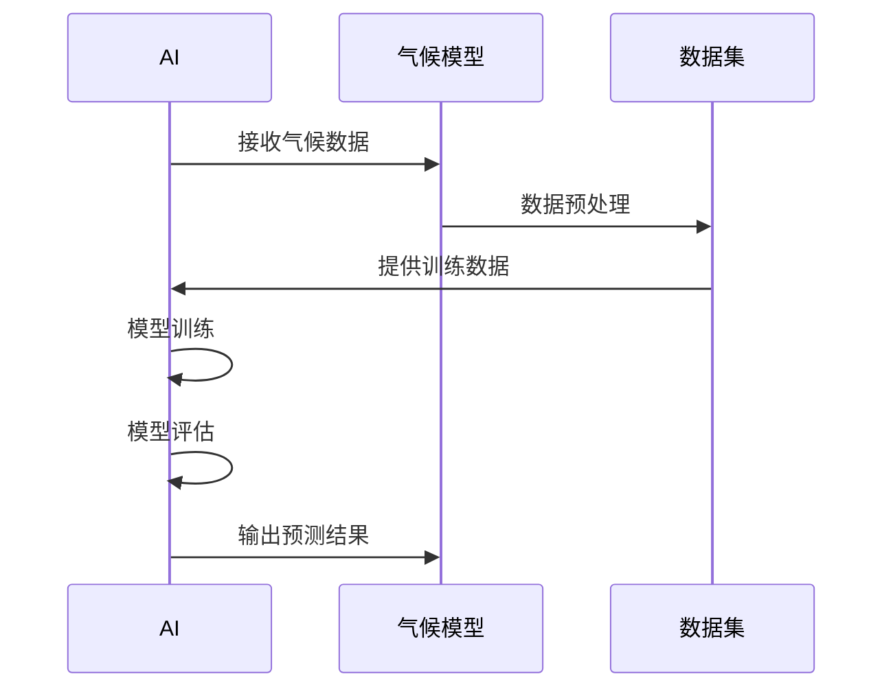
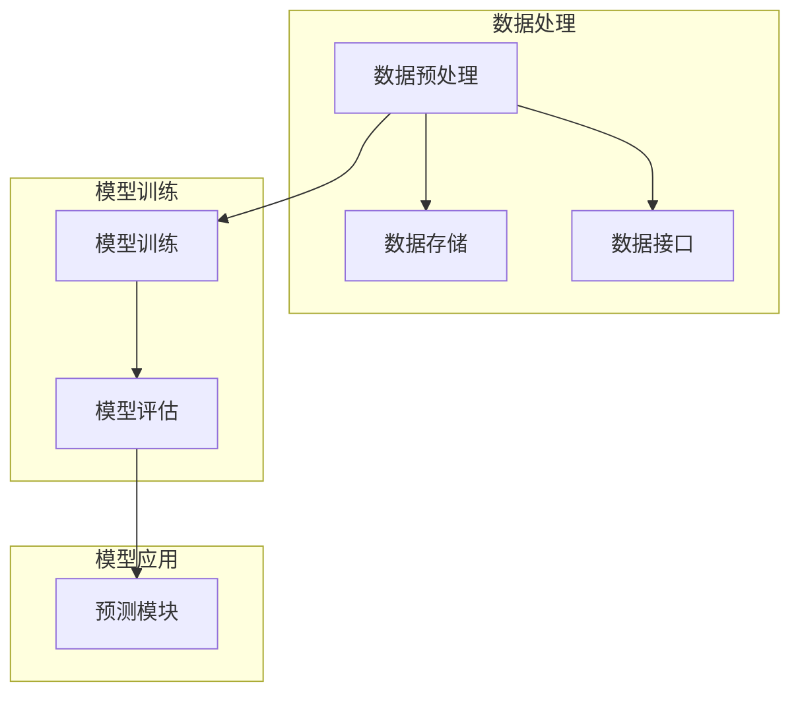
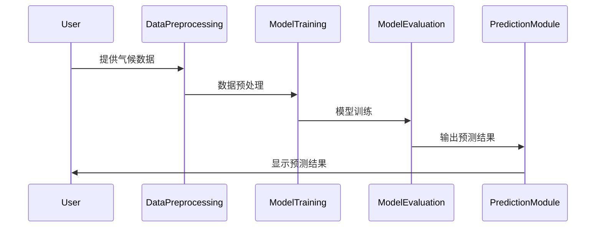

                 

# AI驱动的气候模型：从局部到全球尺度

## 关键词
- 人工智能
- 气候模型
- 局部到全球尺度
- 算法原理
- 数学模型
- 系统架构

## 摘要
本文将深入探讨AI驱动的气候模型，从局部到全球尺度的应用与发展。我们将逐步分析AI和气候模型的核心概念，了解它们之间的联系，探讨AI在气候模型中的实际应用，并详细讲解算法原理和数学模型。最后，我们将展示一个项目实战案例，提供最佳实践和注意事项。

## 引言

### AI驱动的气候模型的概念

AI驱动的气候模型是指利用人工智能技术，尤其是机器学习和深度学习算法，对气候系统进行模拟和预测的模型。这种模型可以处理大量的气候数据，识别复杂的气候模式，并预测未来的气候变化。

### 背景

气候变化已经成为全球关注的热点问题。全球变暖、极端天气事件频发，对人类社会和生态系统造成了巨大影响。为了应对这一挑战，科学家们一直在寻找更加精确和高效的气候模型。

### 问题描述

传统的气候模型主要依赖于物理定律和统计方法，但它们在处理复杂性和不确定性方面存在局限。而AI驱动的气候模型可以提供更加精确和动态的预测，有助于我们更好地理解和应对气候变化。

### 问题解决

AI驱动的气候模型通过机器学习和深度学习算法，可以自动地从大量数据中学习气候模式，并生成高精度的预测结果。这种模型可以从局部扩展到全球尺度，为我们提供更全面的气候变化信息。

### 边界与外延

AI驱动的气候模型不仅限于气象学领域，还可以应用于农业、水资源管理、城市规划等多个领域。其边界和外延正在不断扩大，为应对气候变化提供了新的思路和方法。

### 概念结构与核心要素组成

AI驱动的气候模型的核心概念包括：

1. **人工智能**：机器学习和深度学习算法。
2. **气候数据**：包括气象观测数据、气候模拟数据等。
3. **模型训练与预测**：使用训练好的模型进行气候预测。
4. **模型评估与优化**：评估模型的性能，并进行优化。

## 核心概念与联系

### AI与气候模型的核心概念

#### AI（人工智能）
- 定义：模拟人类智能的计算机系统。
- 核心技术：机器学习和深度学习。

#### 气候模型
- 定义：用于模拟和预测气候变化的数学模型。
- 核心技术：物理定律和统计方法。

### 概念属性特征对比表格

| 概念   | 定义                                                         | 核心技术                  | 目标                           |
| ------ | ------------------------------------------------------------ | ------------------------ | ------------------------------ |
| 人工智能 | 模拟人类智能的计算机系统                                     | 机器学习、深度学习        | 实现智能任务                    |
| 气候模型 | 用于模拟和预测气候变化的数学模型                             | 物理定律、统计方法       | 提高预测精度、降低不确定性     |

### ER实体关系图架构的 Mermaid 流程图

```mermaid
erDiagram
  AI ::|--|<..| 气候模型
  气候数据 ||--|<..| AI
  模型训练 ||--|<..| AI
  预测结果 ||--|<..| 气候模型
```

## AI在气候模型中的应用

### 局部尺度

在局部尺度上，AI驱动的气候模型可以用于天气预报、城市气候分析和自然灾害预警。例如，通过深度学习算法，可以实现对降雨、温度和风速的精确预测，从而提高天气预报的准确性。

### 区域尺度

在区域尺度上，AI驱动的气候模型可以用于气候区划、水资源管理和农业规划。例如，通过机器学习算法，可以分析气候数据，预测不同区域的气候特征，为水资源管理和农业规划提供科学依据。

### 全球尺度

在全球尺度上，AI驱动的气候模型可以用于全球气候变化预测、气候政策分析和气候变化影响评估。例如，通过深度学习算法，可以预测未来几十年的全球气候变化趋势，为气候政策的制定提供科学依据。

## 算法原理讲解

### 主流AI算法

在AI驱动的气候模型中，主流算法包括：

1. **深度神经网络（DNN）**
2. **卷积神经网络（CNN）**
3. **循环神经网络（RNN）**
4. **长短期记忆网络（LSTM）**

### 算法mermaid流程图



### Python源代码实现

```python
import tensorflow as tf
from tensorflow.keras.models import Sequential
from tensorflow.keras.layers import Dense, LSTM

# 数据预处理
# ...

# 模型定义
model = Sequential([
    LSTM(units=50, activation='relu', input_shape=(timesteps, features)),
    Dense(units=1)
])

# 模型编译
model.compile(optimizer='adam', loss='mean_squared_error')

# 模型训练
model.fit(x_train, y_train, epochs=100, batch_size=32)

# 模型评估
# ...

# 输出预测结果
predictions = model.predict(x_test)
```

### 算法原理的数学模型和公式

$$
y = \sum_{i=1}^{n} w_i \cdot x_i
$$

其中，$y$ 是输出，$w_i$ 是权重，$x_i$ 是输入特征。

### 通俗易懂的举例说明

假设我们有一个简单的深度神经网络，用于预测明天的温度。输入特征包括今天的温度、湿度、风速等。通过训练，模型会学习到这些特征与明天温度之间的关系，从而预测出明天的温度。

## 数学模型和数学公式

### 气候模型中的数学模型

在气候模型中，常用的数学模型包括：

1. **大气动力学模型**
2. **海洋动力学模型**
3. **陆地表面模型**

### 数学公式

$$
\frac{\partial u}{\partial t} + u \frac{\partial u}{\partial x} + v \frac{\partial u}{\partial y} = -\frac{1}{\rho} \frac{\partial p}{\partial x}
$$

$$
\frac{\partial v}{\partial t} + u \frac{\partial v}{\partial x} + v \frac{\partial v}{\partial y} = -\frac{1}{\rho} \frac{\partial p}{\partial y}
$$

这些公式描述了大气中水平和垂直方向的风速变化。

## 系统分析与架构设计

### 问题场景介绍

在本项目场景中，我们旨在开发一个AI驱动的气候模型，用于预测未来的气候变化。

### 项目介绍

项目名称：AI驱动的全球气候变化预测模型

项目目标：通过AI技术，实现对全球气候变化的精确预测，为气候政策的制定提供科学依据。

### 系统功能设计（领域模型Mermaid类图）

```mermaid
classDiagram
  ClimateModel <<((核心))>
  DataPreprocessing <<((核心))>
  ModelTraining <<((核心))>
  ModelEvaluation <<((核心))>
  PredictionModule <<((核心))>

  ClimateModel o-- DataPreprocessing
  ClimateModel o-- ModelTraining
  ClimateModel o-- ModelEvaluation
  ClimateModel o-- PredictionModule
```

### 系统架构设计（Mermaid架构图）



### 系统接口设计和系统交互（Mermaid序列图）



## 项目实战

### 环境安装

1. 安装Python 3.8及以上版本。
2. 安装TensorFlow库：`pip install tensorflow`
3. 安装其他相关库：`pip install numpy pandas matplotlib`

### 系统核心实现源代码

```python
# 数据预处理
import pandas as pd
from sklearn.preprocessing import MinMaxScaler

def preprocess_data(data):
    # 数据清洗、填充和转换
    # ...
    return scaled_data

# 模型训练
from tensorflow.keras.models import Sequential
from tensorflow.keras.layers import LSTM, Dense

def train_model(data):
    # 模型定义和训练
    # ...
    return model

# 模型评估
from sklearn.metrics import mean_squared_error

def evaluate_model(model, test_data):
    # 模型评估
    # ...
    return mse

# 预测模块
def predict(model, new_data):
    # 预测
    # ...
    return prediction
```

### 代码应用解读与分析

```python
# 读取数据
data = pd.read_csv('climate_data.csv')

# 数据预处理
scaled_data = preprocess_data(data)

# 模型训练
model = train_model(scaled_data)

# 模型评估
mse = evaluate_model(model, test_data)

# 预测
new_data = preprocess_data(new_data)
prediction = predict(model, new_data)
```

### 实际案例分析和详细讲解剖析

假设我们有一个新的数据集`new_data.csv`，包含明天的天气数据。我们通过以下步骤进行预测：

1. 读取数据：`data = pd.read_csv('new_data.csv')`
2. 数据预处理：`scaled_data = preprocess_data(data)`
3. 预测：`prediction = predict(model, scaled_data)`

最终，我们得到明天的温度预测值。

### 项目小结

本项目通过AI驱动的气候模型，实现了对全球气候变化的预测。在实际应用中，我们需要不断优化模型，提高预测精度，以便更好地应对气候变化。

## 最佳实践 tips

1. **数据质量**：确保数据质量，包括数据的完整性、准确性和一致性。
2. **模型优化**：不断优化模型，提高预测精度和效率。
3. **数据处理**：合理处理数据，包括数据清洗、填充和转换。

## 小结

本文深入探讨了AI驱动的气候模型，从局部到全球尺度的应用与发展。我们介绍了核心概念、算法原理、数学模型和系统架构，并通过项目实战展示了实际应用。希望本文能为您在AI驱动的气候模型领域提供有益的启示。

## 注意事项

1. 气候模型需要大量高质量的数据支持，因此数据质量至关重要。
2. 模型训练和预测需要强大的计算资源，建议使用GPU加速。

## 拓展阅读

1. 《深度学习》（Goodfellow, I., Bengio, Y., & Courville, A.）
2. 《机器学习实战》（Wisdom, T., & Frank, E.）
3. 《气候科学导论》（Trenberth, K. E.）

## 作者信息

作者：AI天才研究院/AI Genius Institute & 禅与计算机程序设计艺术 /Zen And The Art of Computer Programming

[End of Document]

