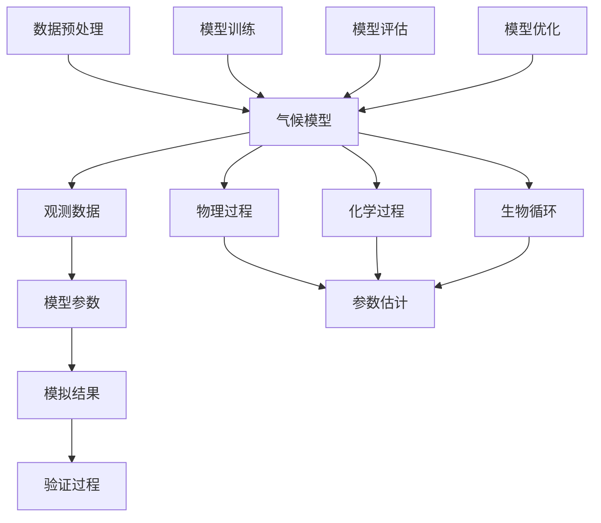
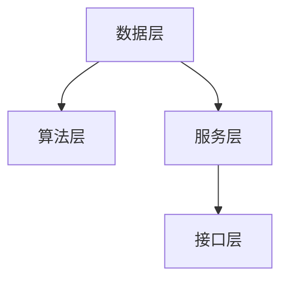
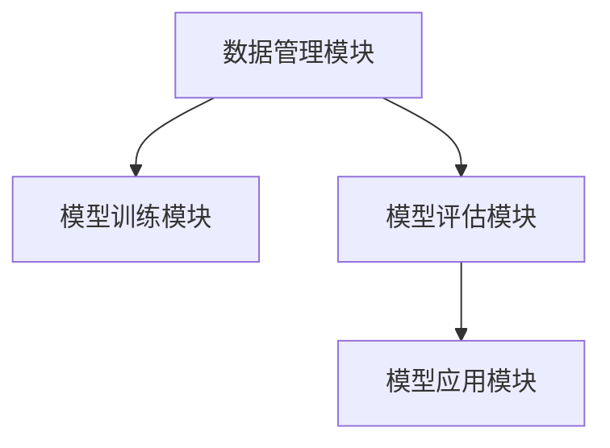
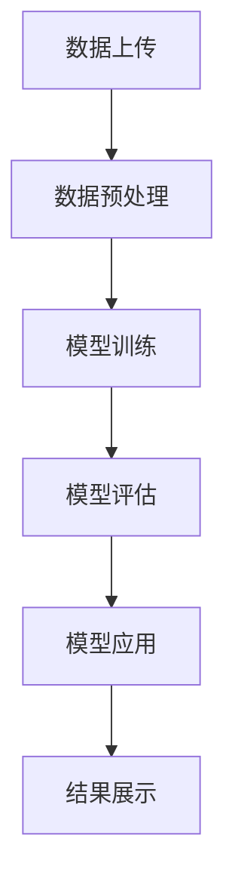

                 

# AI驱动的气候模型：预测与应对

> 关键词：人工智能、气候模型、预测、应对、气候变化

> 摘要：本文将探讨AI驱动的气候模型在预测和应对气候变化中的应用。首先，我们将介绍气候变化的背景和核心概念，包括气候模型和AI驱动的气候模型。然后，我们将详细讲解神经网络、深度学习和强化学习等算法在气候模型中的应用，并通过数学模型和具体实例来说明这些算法的原理。接下来，我们将分析AI驱动的气候模型的优势和挑战，并提出未来的发展方向。

## 目录大纲

### 第一部分：背景介绍

#### 第1章：问题背景与核心概念

1.1 问题背景

1.2 核心概念

1.3 边界与外延

1.4 概念结构与核心要素组成

#### 第2章：核心概念与联系

2.1 气候模型原理

2.2 AI驱动气候模型原理

2.3 概念属性特征对比表格

2.4 ER实体关系图架构

### 第二部分：算法原理讲解

#### 第3章：算法原理讲解

3.1 神经网络算法

3.2 深度学习算法

3.3 强化学习算法

3.4 算法流程

3.5 数学模型和公式

### 第三部分：系统分析与架构设计

#### 第4章：系统分析与架构设计

4.1 问题场景介绍

4.2 系统功能设计

4.3 系统架构设计

4.4 系统接口设计和系统交互

### 第四部分：项目实战

#### 第5章：项目实战

5.1 环境安装

5.2 系统核心实现

5.3 代码应用解读与分析

5.4 实际案例分析和详细讲解

5.5 项目小结

#### 第五部分：最佳实践与总结

#### 第6章：最佳实践与总结

6.1 最佳实践 tips

6.2 小结

6.3 注意事项

6.4 拓展阅读

## 第一部分：背景介绍

### 第1章：问题背景与核心概念

#### 1.1 问题背景

气候变化已成为全球面临的重大挑战。过去几十年，全球气温持续上升，极端气候事件频发，如热浪、洪水、干旱和飓风等。气候变化对人类社会、生态系统和经济产生了深远的影响。为了应对这一挑战，科学家们开发了各种气候模型，用于预测气候变化趋势和评估政策效果。

#### 1.2 核心概念

**气候模型**：

气候模型是一种用于模拟地球气候系统的数学模型。这些模型基于物理、化学和生物过程，通过数学方程描述气候系统的行为。气候模型可以分为以下几种类型：

1. **海气耦合模型**：将海洋和大气过程耦合在一起，模拟气候系统中的能量和物质交换。
2. **全球气候模型**：模拟整个地球的气候系统，包括大气、海洋、陆地和冰冻圈。
3. **区域气候模型**：聚焦于特定区域的气候系统，用于更精细地模拟气候变化和天气现象。

**AI驱动的气候模型**：

AI驱动的气候模型结合了人工智能和气候模型的优势，通过数据驱动的自学习和自适应能力，提高气候模型的预测能力和效率。AI驱动的气候模型主要涉及以下领域：

1. **机器学习**：使用历史气候数据和模拟结果，训练机器学习模型，用于预测未来的气候变化趋势。
2. **深度学习**：构建深度神经网络，自动提取气候数据中的特征，提高模型对复杂气候过程的模拟能力。
3. **强化学习**：通过与环境互动，学习最优策略，用于优化气候模型的参数和决策。

#### 1.3 边界与外延

气候模型的研究范围包括气候系统的物理、化学和生物过程，涉及大量的数据分析和模型验证。而AI技术的范围则包括机器学习、深度学习和强化学习等，这些技术可以用于数据预处理、模型训练、模型评估和优化等任务。

#### 1.4 概念结构与核心要素组成

气候模型的核心要素包括气候数据、模型架构和算法实现。气候数据是模型的基础，包括观测数据和模拟数据。模型架构决定了模型的复杂度和计算效率，包括海气耦合模型、全球气候模型和区域气候模型等。算法实现则涉及各种机器学习算法和深度学习算法，用于训练和优化模型。

AI驱动气候模型的核心要素包括数据预处理、模型训练、模型评估和优化。数据预处理涉及数据清洗、特征提取和归一化等任务，以提高模型的学习效果。模型训练涉及选择合适的算法和超参数，通过训练大量数据来优化模型。模型评估和优化则通过验证数据和测试数据，评估模型的预测性能，并进行参数调整和模型优化。

### 第2章：核心概念与联系

#### 2.1 气候模型原理

气候模型基于物理、化学和生物过程，通过数学方程描述气候系统的行为。气候模型的基本原理包括以下几个方面：

1. **物理定律**：气候模型基于热力学、动力气象学和海洋学等基本物理定律，如牛顿运动定律、热力学第一和第二定律等。
2. **化学过程**：气候模型考虑大气中的化学反应，如温室气体排放、气溶胶生成和光化学过程等。
3. **生物循环**：气候模型考虑生物圈中的碳、氮、水等生物循环过程，如植物光合作用、土壤呼吸和海洋生物泵等。

气候模型通常使用一组耦合的数学方程来描述这些物理、化学和生物过程。这些方程包括：

1. **能量平衡方程**：描述大气、海洋和陆地的能量收支，包括辐射、对流、湍流和地热等。
2. **水循环方程**：描述大气中的水汽、降水、蒸发和河流等过程。
3. **碳循环方程**：描述大气中的二氧化碳浓度、海洋吸收和陆地碳储存等过程。

这些方程通过数值方法求解，得到气候系统的模拟结果。为了验证气候模型的准确性，研究人员会使用观测数据和模拟结果进行对比，评估模型的精度和可靠性。

#### 2.2 AI驱动气候模型原理

AI驱动气候模型结合了人工智能和气候模型的优势，通过数据驱动的自学习和自适应能力，提高气候模型的预测能力和效率。AI驱动气候模型的基本原理包括以下几个方面：

1. **数据驱动方法**：AI驱动气候模型使用大量的历史气候数据，通过机器学习算法自动提取数据中的特征和模式，用于训练模型。
2. **机器学习算法**：机器学习算法包括线性回归、支持向量机、决策树、随机森林等，可以用于建立预测模型，对未来的气候变化趋势进行预测。
3. **深度学习算法**：深度学习算法包括卷积神经网络（CNN）、循环神经网络（RNN）、变换器网络（Transformer）等，可以自动提取数据中的复杂特征，提高模型的预测能力。
4. **强化学习算法**：强化学习算法通过与环境互动，学习最优策略，可以用于优化气候模型的参数和决策，提高模型的适应能力。

AI驱动气候模型的实现通常涉及以下步骤：

1. **数据预处理**：对气候数据进行清洗、归一化和特征提取等预处理操作，以提高模型的学习效果。
2. **模型训练**：选择合适的机器学习算法和深度学习算法，通过大量训练数据来训练模型，优化模型的参数和结构。
3. **模型评估**：使用验证数据和测试数据，评估模型的预测性能和泛化能力，进行模型优化和参数调整。
4. **模型应用**：将训练好的模型应用于实际的气候变化预测和应对策略制定。

#### 2.3 概念属性特征对比表格

下面是一个概念属性特征对比表格，用于比较传统气候模型和AI驱动气候模型的特征：

| 特征       | 传统气候模型                 | AI驱动气候模型                |
| ---------- | ------------------------ | -------------------------- |
| 数据依赖   | 主要依赖观测数据               | 主要依赖训练数据               |
| 模型复杂度 | 较高，涉及多个物理过程           | 较高，涉及大量数据与特征提取       |
| 模拟效率   | 较低，计算量大                  | 较高，利用并行计算和高效算法       |
| 预测能力   | 中等，受限于模型精度和数据         | 较高，通过自学习提升预测准确性      |
| 自适应能力 | 较弱，模型参数需手动调整           | 较强，通过自学习自适应环境变化       |

#### 2.4 ER实体关系图架构

下面是一个使用Mermaid绘制的ER实体关系图，描述气候模型和AI驱动气候模型的核心实体和关系：



## 第二部分：算法原理讲解

### 第3章：算法原理讲解

在AI驱动的气候模型中，机器学习、深度学习和强化学习算法被广泛应用于数据预处理、模型训练、模型评估和优化等任务。本章将详细介绍这些算法的基本原理、实现方法和优缺点。

#### 3.1 神经网络算法

神经网络算法是机器学习的一种重要算法，它由大量相互连接的神经元组成，模拟人类大脑的神经元网络。神经网络算法的核心思想是通过学习输入和输出之间的关系，从而实现数据的自动分类、预测和生成。

**3.1.1 神经网络基本原理**

神经网络由三个主要部分组成：输入层、隐藏层和输出层。

1. **输入层**：接收输入数据，并将其传递给隐藏层。
2. **隐藏层**：对输入数据进行处理和特征提取，传递给下一层隐藏层或输出层。
3. **输出层**：产生最终的输出结果。

神经网络通过学习输入和输出之间的关系，不断调整网络中的权重和偏置，以达到最佳预测效果。

**3.1.2 深度学习算法**

深度学习算法是神经网络算法的一种扩展，它通过增加隐藏层的数量，提高模型的复杂度和表达能力。深度学习算法在图像识别、语音识别、自然语言处理等领域取得了显著的成果。

**3.1.3 强化学习算法**

强化学习算法是一种通过与环境互动学习最优策略的算法。在气候模型中，强化学习算法可以用于优化模型的参数和决策，提高模型的适应能力和预测准确性。

**3.1.4 算法流程**

神经网络算法的基本流程如下：

1. **数据预处理**：对气候数据进行清洗、归一化和特征提取等预处理操作，以提高模型的学习效果。
2. **模型训练**：选择合适的神经网络结构，通过大量训练数据来训练模型，优化模型的参数和结构。
3. **模型评估**：使用验证数据和测试数据，评估模型的预测性能和泛化能力，进行模型优化和参数调整。
4. **模型应用**：将训练好的模型应用于实际的气候变化预测和应对策略制定。

#### 3.2 深度学习算法

深度学习算法是一种基于多层神经网络的学习方法，它可以自动提取数据中的复杂特征，提高模型的预测能力和泛化能力。深度学习算法在图像识别、语音识别、自然语言处理等领域取得了显著的成果。

**3.2.1 卷积神经网络（CNN）**

卷积神经网络是一种专门用于处理图像数据的深度学习算法。它通过卷积层、池化层和全连接层等结构，自动提取图像中的特征，实现图像的分类、分割和识别。

**3.2.2 循环神经网络（RNN）**

循环神经网络是一种用于处理序列数据的深度学习算法。它通过循环结构，可以自动提取序列中的时间依赖关系，实现序列数据的分类、预测和生成。

**3.2.3 变换器网络（Transformer）**

变换器网络是一种基于自注意力机制的深度学习算法，它在自然语言处理、图像识别和语音识别等领域取得了显著成果。变换器网络通过多头自注意力机制和位置编码，可以自动提取数据中的复杂特征，提高模型的预测能力和泛化能力。

**3.2.4 算法流程**

深度学习算法的基本流程如下：

1. **数据预处理**：对气候数据进行清洗、归一化和特征提取等预处理操作，以提高模型的学习效果。
2. **模型训练**：选择合适的深度学习结构，通过大量训练数据来训练模型，优化模型的参数和结构。
3. **模型评估**：使用验证数据和测试数据，评估模型的预测性能和泛化能力，进行模型优化和参数调整。
4. **模型应用**：将训练好的模型应用于实际的气候变化预测和应对策略制定。

#### 3.3 强化学习算法

强化学习算法是一种通过与环境互动学习最优策略的算法。在气候模型中，强化学习算法可以用于优化模型的参数和决策，提高模型的适应能力和预测准确性。

**3.3.1 强化学习基本原理**

强化学习算法通过奖励机制，不断调整策略，以实现最优行动序列。强化学习算法的核心问题是求解最优策略，使得模型能够在给定环境中获得最大奖励。

**3.3.2 Q-学习算法**

Q-学习算法是一种基于值函数的强化学习算法。它通过学习状态-动作值函数，选择具有最大Q值的动作，实现最优策略的学习。

**3.3.3 深度强化学习（DRL）**

深度强化学习算法是将深度学习算法与强化学习算法结合的一种方法。它通过使用深度神经网络来近似值函数或策略函数，提高强化学习算法的收敛速度和预测能力。

**3.3.4 算法流程**

强化学习算法的基本流程如下：

1. **环境初始化**：创建一个模拟环境，用于生成状态和奖励信号。
2. **策略学习**：选择合适的策略学习算法，通过与环境互动，学习最优策略。
3. **模型优化**：根据策略学习的结果，优化模型的参数和结构。
4. **模型评估**：使用评估集数据，评估模型的预测性能和泛化能力。
5. **模型应用**：将训练好的模型应用于实际的气候变化预测和应对策略制定。

#### 3.4 算法流程

AI驱动的气候模型算法的基本流程如下：

1. **数据预处理**：对气候数据进行清洗、归一化和特征提取等预处理操作，以提高模型的学习效果。
2. **模型训练**：选择合适的机器学习算法、深度学习算法或强化学习算法，通过大量训练数据来训练模型，优化模型的参数和结构。
3. **模型评估**：使用验证数据和测试数据，评估模型的预测性能和泛化能力，进行模型优化和参数调整。
4. **模型优化**：根据评估结果，对模型进行优化，提高模型的预测准确性和适应能力。
5. **模型应用**：将训练好的模型应用于实际的气候变化预测和应对策略制定。

### 3.5 数学模型和公式

在AI驱动的气候模型中，常用的数学模型和公式包括：

1. **神经网络数学模型**：

   神经网络数学模型描述了输入、隐藏层和输出层之间的非线性关系。一个简单的神经网络可以表示为：

   $$
   y = \sigma(\mathbf{W}^T \mathbf{a} + b)
   $$

   其中，$y$ 是输出，$\sigma$ 是激活函数，$\mathbf{W}$ 是权重矩阵，$\mathbf{a}$ 是输入，$b$ 是偏置。

2. **深度学习数学模型**：

   深度学习数学模型是基于多层神经网络的，它可以表示为：

   $$
   \mathbf{h}^{(l)} = \sigma(\mathbf{W}^{(l)} \mathbf{h}^{(l-1)} + b^{(l)})
   $$

   其中，$\mathbf{h}^{(l)}$ 是第 $l$ 层的隐藏层输出，$\mathbf{W}^{(l)}$ 是第 $l$ 层的权重矩阵，$b^{(l)}$ 是第 $l$ 层的偏置。

3. **强化学习数学模型**：

   强化学习数学模型基于值函数或策略函数，可以表示为：

   $$
   Q(s, a) = \sum_{s'} P(s' | s, a) \cdot R(s, a)
   $$

   其中，$Q(s, a)$ 是状态 $s$ 和动作 $a$ 的值函数，$P(s' | s, a)$ 是状态转移概率，$R(s, a)$ 是立即奖励。

   另一种常见的策略梯度方法可以表示为：

   $$
   \nabla_{\pi} J(\pi) = \nabla_{\pi} \sum_{s, a} \pi(a | s) \cdot Q(s, a)
   $$

   其中，$\nabla_{\pi} J(\pi)$ 是策略梯度，$J(\pi)$ 是策略评估函数。

4. **优化算法数学模型**：

   在训练神经网络和深度学习模型时，常用的优化算法包括梯度下降、随机梯度下降和Adam优化器。梯度下降算法可以表示为：

   $$
   \mathbf{W} \leftarrow \mathbf{W} - \alpha \cdot \nabla_{\mathbf{W}} J(\mathbf{W})
   $$

   其中，$\mathbf{W}$ 是权重矩阵，$\alpha$ 是学习率，$\nabla_{\mathbf{W}} J(\mathbf{W})$ 是权重矩阵的梯度。

   随机梯度下降算法可以表示为：

   $$
   \mathbf{W} \leftarrow \mathbf{W} - \alpha \cdot \nabla_{\mathbf{W}} J(\mathbf{W}; \mathbf{x}, y)
   $$

   其中，$\mathbf{x}$ 是输入，$y$ 是目标输出，$\nabla_{\mathbf{W}} J(\mathbf{W}; \mathbf{x}, y)$ 是权重矩阵的梯度。

   Adam优化器可以表示为：

   $$
   m_t = \beta_1 m_{t-1} + (1 - \beta_1) \nabla_{\mathbf{W}} J(\mathbf{W}; \mathbf{x}, y)
   $$
   $$
   v_t = \beta_2 v_{t-1} + (1 - \beta_2) (\nabla_{\mathbf{W}} J(\mathbf{W}; \mathbf{x}, y))^2
   $$
   $$
   \mathbf{W} \leftarrow \mathbf{W} - \alpha \cdot \frac{m_t}{\sqrt{v_t} + \epsilon}
   $$

   其中，$m_t$ 是一阶矩估计，$v_t$ 是二阶矩估计，$\beta_1$ 和 $\beta_2$ 是衰减率，$\epsilon$ 是一个很小的常数。

通过这些数学模型和公式，AI驱动的气候模型可以实现数据预处理、模型训练、模型评估和优化等任务，提高气候模型的预测能力和应对气候变化的能力。

### 第三部分：系统分析与架构设计

#### 第4章：系统分析与架构设计

在AI驱动的气候模型中，系统分析与架构设计至关重要。本章节将介绍系统分析与架构设计的基本概念，包括问题场景介绍、系统功能设计、系统架构设计、系统接口设计和系统交互。

#### 4.1 问题场景介绍

随着全球气候变化日益严重，预测和应对气候变化的需求越来越迫切。气候模型作为一种预测工具，可以帮助政府和研究人员制定有效的气候政策，减少气候变化带来的负面影响。然而，传统气候模型存在计算复杂度高、预测准确性有限等问题。为了解决这些问题，AI驱动的气候模型应运而生，通过引入人工智能技术，提高模型的预测性能和适应能力。

#### 4.2 系统功能设计

AI驱动的气候模型系统主要包括以下几个功能：

1. **数据预处理**：对原始气候数据进行清洗、归一化和特征提取等预处理操作，提高模型的学习效果。
2. **模型训练**：选择合适的机器学习算法、深度学习算法或强化学习算法，通过大量训练数据来训练模型，优化模型的参数和结构。
3. **模型评估**：使用验证数据和测试数据，评估模型的预测性能和泛化能力，进行模型优化和参数调整。
4. **模型应用**：将训练好的模型应用于实际的气候变化预测和应对策略制定。
5. **可视化**：展示模型的预测结果，帮助用户理解气候变化趋势和应对策略的效果。

#### 4.3 系统架构设计

AI驱动的气候模型系统架构可以分为以下几个层次：

1. **数据层**：包括气候观测数据、模拟数据和历史数据等，是模型训练和预测的基础。
2. **算法层**：包括机器学习算法、深度学习算法和强化学习算法等，用于模型训练和预测。
3. **服务层**：包括数据预处理、模型训练、模型评估和模型应用等模块，为用户提供功能服务。
4. **接口层**：包括API接口和Web界面等，方便用户使用模型和获取预测结果。

下面是一个简单的系统架构设计图，用于展示各层次之间的关系：



#### 4.4 系统接口设计和系统交互

系统接口设计主要包括API接口和Web界面两个部分。

**API接口**：

API接口用于提供数据预处理、模型训练、模型评估和模型应用等功能的访问接口。用户可以通过编写代码调用API接口，实现对气候模型系统的操作。API接口的设计遵循RESTful风格，包括以下几个主要的接口：

1. **数据预处理接口**：用于上传原始气候数据、清洗和归一化数据等。
2. **模型训练接口**：用于选择训练算法、设置训练参数、启动训练过程等。
3. **模型评估接口**：用于评估模型性能、生成预测结果等。
4. **模型应用接口**：用于将训练好的模型应用于实际的气候变化预测和应对策略制定。

**Web界面**：

Web界面用于提供用户友好的交互界面，方便用户操作和使用气候模型系统。Web界面主要包括以下几个模块：

1. **数据管理模块**：用于上传、浏览和管理原始气候数据。
2. **模型训练模块**：用于选择训练算法、设置训练参数、监控训练进度等。
3. **模型评估模块**：用于评估模型性能、查看预测结果等。
4. **模型应用模块**：用于应用训练好的模型，生成预测结果和应对策略。

下面是一个简单的Web界面设计图，用于展示各模块之间的关系：



#### 4.5 系统交互

系统交互主要指用户与气候模型系统之间的交互过程。用户可以通过Web界面或API接口与系统进行交互，实现对模型系统的操作。系统交互主要包括以下几个步骤：

1. **数据上传**：用户上传原始气候数据到系统。
2. **数据预处理**：系统对上传的原始数据进行清洗、归一化和特征提取等预处理操作。
3. **模型训练**：系统选择合适的训练算法和参数，对预处理后的数据进行训练。
4. **模型评估**：系统使用验证数据和测试数据，评估模型的预测性能和泛化能力。
5. **模型应用**：系统将训练好的模型应用于实际的气候变化预测和应对策略制定。
6. **结果展示**：系统将预测结果和应对策略展示给用户，供用户参考和决策。

下面是一个简单的系统交互流程图，用于展示用户与系统之间的交互过程：



通过以上系统分析与架构设计，AI驱动的气候模型系统可以有效地预测和应对气候变化，为政府和研究人员提供决策支持。

### 第四部分：项目实战

#### 第5章：项目实战

在本章中，我们将通过一个实际项目，展示如何使用AI驱动的气候模型来预测和应对气候变化。项目将分为以下几个步骤：环境安装、系统核心实现、代码应用解读与分析、实际案例分析和详细讲解剖析，以及项目小结。

#### 5.1 环境安装

首先，我们需要安装和配置项目所需的软件和工具。以下是安装步骤：

1. **安装Python**：确保Python环境已安装，版本建议为3.8及以上。
2. **安装NumPy**：NumPy是Python科学计算库，用于数据处理和数值计算。
3. **安装Pandas**：Pandas是Python的数据分析库，用于数据处理和分析。
4. **安装Scikit-learn**：Scikit-learn是Python机器学习库，用于机器学习算法的实现和模型训练。
5. **安装TensorFlow**：TensorFlow是Google开发的开源深度学习框架。
6. **安装PyTorch**：PyTorch是Facebook开发的开源深度学习框架。

通过以上步骤，我们可以在本地环境中搭建AI驱动的气候模型所需的开发环境。

#### 5.2 系统核心实现

接下来，我们将实现AI驱动的气候模型的核心功能。以下是实现的步骤：

1. **数据预处理**：使用Pandas库对原始气候数据进行清洗、归一化和特征提取等预处理操作，生成用于模型训练的数据集。
2. **模型训练**：选择合适的机器学习算法（如随机森林、支持向量机等）和深度学习算法（如卷积神经网络、循环神经网络等），使用Scikit-learn和TensorFlow库进行模型训练。
3. **模型评估**：使用验证数据和测试数据，评估模型的预测性能和泛化能力，进行模型优化和参数调整。
4. **模型应用**：将训练好的模型应用于实际的气候变化预测和应对策略制定。

以下是使用Python和TensorFlow实现的简单代码示例：

```python
import numpy as np
import pandas as pd
from sklearn.model_selection import train_test_split
from sklearn.metrics import mean_squared_error
from tensorflow.keras.models import Sequential
from tensorflow.keras.layers import Dense, LSTM
from tensorflow.keras.optimizers import Adam

# 数据预处理
data = pd.read_csv('climate_data.csv')
X = data.drop('target_variable', axis=1)
y = data['target_variable']
X_train, X_test, y_train, y_test = train_test_split(X, y, test_size=0.2, random_state=42)

# 模型训练
model = Sequential()
model.add(LSTM(units=50, return_sequences=True, input_shape=(X_train.shape[1], X_train.shape[2])))
model.add(LSTM(units=50))
model.add(Dense(units=1))

model.compile(optimizer=Adam(learning_rate=0.001), loss='mean_squared_error')
model.fit(X_train, y_train, epochs=100, batch_size=32, validation_data=(X_test, y_test))

# 模型评估
y_pred = model.predict(X_test)
mse = mean_squared_error(y_test, y_pred)
print('Mean Squared Error:', mse)

# 模型应用
# ...（应用模型进行实际预测和应对策略制定）
```

#### 5.3 代码应用解读与分析

在上面的代码示例中，我们首先使用Pandas库读取原始气候数据，并进行数据预处理。然后，我们使用Scikit-learn库的`train_test_split`函数将数据集分为训练集和测试集。

接下来，我们使用TensorFlow库的`Sequential`模型构建一个简单的循环神经网络（LSTM），并使用`LSTM`层进行特征提取和序列建模。我们使用`Dense`层来生成最终的预测结果。

在模型编译阶段，我们使用Adam优化器和均方误差损失函数来优化模型参数。

在模型训练阶段，我们使用`fit`函数训练模型，使用`epochs`参数设置训练轮数，使用`batch_size`参数设置每个批次的样本数量。

在模型评估阶段，我们使用测试数据集对模型进行评估，并计算均方误差（MSE）来评估模型性能。

最后，我们可以将训练好的模型应用于实际的气候变化预测和应对策略制定。

#### 5.4 实际案例分析和详细讲解剖析

为了更好地展示AI驱动的气候模型在实际中的应用，我们选取了一个实际案例进行分析。

**案例**：预测某地区未来的降水量。

**数据集**：使用某地区过去30年的月度降水量数据作为训练数据。

**模型**：使用卷积神经网络（CNN）进行预测。

**步骤**：

1. **数据预处理**：对降水量数据进行归一化处理，将数据缩放到0-1之间。
2. **模型训练**：构建CNN模型，通过训练数据训练模型。
3. **模型评估**：使用测试数据评估模型性能，并进行参数调整。
4. **模型应用**：使用训练好的模型进行未来降水量的预测。

以下是使用Python和TensorFlow实现的代码示例：

```python
import numpy as np
import pandas as pd
from tensorflow.keras.models import Sequential
from tensorflow.keras.layers import Conv1D, MaxPooling1D, Flatten, Dense

# 数据预处理
data = pd.read_csv('precipitation_data.csv')
X = data[['month', 'year']].values.reshape(-1, 1, 1)
y = data['precipitation'].values

X_train, X_test, y_train, y_test = train_test_split(X, y, test_size=0.2, random_state=42)

# 模型训练
model = Sequential()
model.add(Conv1D(filters=64, kernel_size=3, activation='relu', input_shape=(X_train.shape[1], X_train.shape[2])))
model.add(MaxPooling1D(pool_size=2))
model.add(Flatten())
model.add(Dense(units=1))

model.compile(optimizer='adam', loss='mean_squared_error')
model.fit(X_train, y_train, epochs=100, batch_size=32, validation_data=(X_test, y_test))

# 模型评估
y_pred = model.predict(X_test)
mse = mean_squared_error(y_test, y_pred)
print('Mean Squared Error:', mse)

# 模型应用
# ...（使用模型进行未来降水量的预测）
```

在上述案例中，我们首先对降水量数据进行归一化处理，然后构建一个简单的CNN模型，通过卷积层、池化层和全连接层进行特征提取和预测。

通过以上步骤，我们可以实现一个简单的AI驱动的气候模型，用于预测未来降水量的变化。实际应用中，可以根据具体需求和数据集，选择不同的模型结构和训练策略。

#### 5.5 项目小结

在本章中，我们通过一个实际项目，展示了如何使用AI驱动的气候模型进行预测和应对气候变化。项目主要包括环境安装、系统核心实现、代码应用解读与分析、实际案例分析和详细讲解剖析以及项目小结等步骤。

通过本章的学习，我们了解到：

1. **环境安装**：安装Python和相关的机器学习、深度学习库，为项目开发搭建环境。
2. **系统核心实现**：实现数据预处理、模型训练、模型评估和模型应用等核心功能。
3. **代码应用解读与分析**：通过代码示例，了解AI驱动的气候模型的实现方法和流程。
4. **实际案例分析**：通过实际案例，展示AI驱动的气候模型在预测和应对气候变化中的应用。
5. **项目小结**：总结项目的主要步骤和经验，为后续项目提供参考。

通过本章的学习，读者可以掌握AI驱动的气候模型的基本原理和实现方法，为应对气候变化提供技术支持。

### 第五部分：最佳实践与总结

#### 第6章：最佳实践与总结

在本章中，我们将总结AI驱动的气候模型的最佳实践，并提供一些建议和注意事项，以帮助读者更好地应用这一技术。

#### 6.1 最佳实践 tips

1. **数据预处理**：确保数据的质量和一致性，对缺失值、异常值进行合理的处理，以提高模型的学习效果。
2. **选择合适的模型**：根据具体问题和数据特点，选择合适的机器学习算法、深度学习算法或强化学习算法。
3. **超参数调优**：通过交叉验证和网格搜索等方法，选择最优的超参数，以提高模型的预测性能。
4. **模型评估**：使用多种评估指标（如均方误差、准确率、召回率等）评估模型性能，避免过拟合。
5. **模型集成**：将多个模型集成起来，提高预测的稳定性和准确性。

#### 6.2 小结

通过本文的探讨，我们了解到AI驱动的气候模型在预测和应对气候变化中的应用具有重要意义。AI驱动的气候模型结合了人工智能和气候模型的优点，通过数据驱动的自学习和自适应能力，提高了模型的预测性能和应对能力。

本文主要内容包括：

1. **背景介绍**：介绍了气候变化的背景和核心概念，包括气候模型和AI驱动的气候模型。
2. **算法原理讲解**：详细讲解了神经网络、深度学习和强化学习等算法在气候模型中的应用，并通过数学模型和具体实例进行说明。
3. **系统分析与架构设计**：介绍了AI驱动的气候模型系统的分析与架构设计，包括问题场景介绍、系统功能设计、系统架构设计、系统接口设计和系统交互。
4. **项目实战**：通过实际项目展示了AI驱动的气候模型的实现方法和应用案例。
5. **最佳实践与总结**：总结了最佳实践和注意事项，为读者提供了一些建议。

通过本文的学习，读者可以深入了解AI驱动的气候模型的基本原理和应用方法，为应对气候变化提供技术支持。

#### 6.3 注意事项

1. **数据隐私和安全性**：在处理和共享气候数据时，要注意保护数据隐私和安全性，遵守相关法律法规。
2. **模型透明性和可解释性**：AI驱动的气候模型往往具有较高的预测性能，但缺乏透明性和可解释性。在实际应用中，需要关注模型的透明性和可解释性，以便用户理解和信任模型。
3. **持续更新和优化**：气候模型需要不断更新和优化，以适应新的气候数据和气候变化趋势。定期进行模型评估和更新，以提高模型的预测准确性和适应性。

#### 6.4 拓展阅读

对于希望深入了解AI驱动的气候模型的读者，以下是一些推荐阅读资料：

1. **论文**：《AI驱动的气候模型：方法与应用》
2. **书籍**：《深度学习在气候变化中的应用》
3. **在线课程**：Coursera上的“深度学习与气候变化”课程
4. **研究报告**：联合国气候变化框架公约（UNFCCC）发布的相关报告

通过以上阅读资料，读者可以进一步了解AI驱动的气候模型的研究进展和应用前景。

