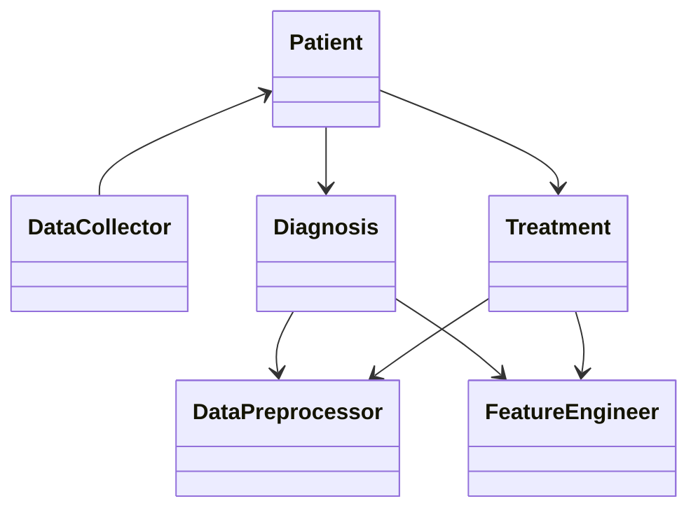
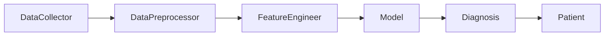
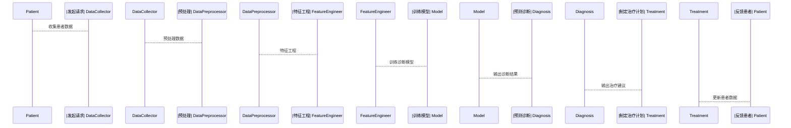

                 


# AI驱动的精准医疗中的提示词个性化

关键词：AI精准医疗，提示词个性化，机器学习，数据分析

摘要：本文深入探讨了AI在精准医疗领域的应用，特别是在提示词个性化方面的关键作用。通过分析AI在医学诊断、治疗规划和个性化治疗中的具体应用，本文揭示了个性化提示词的重要性，并探讨了实现这些提示词的生成、评估和实施的方法。文章还提供了相关案例分析、最佳实践指南和未来研究方向，以期为读者提供全面的AI精准医疗洞察。

## 1. 背景介绍

### 1.1 精准医疗的概念

精准医疗（Precision Medicine）是一种以个体差异为依据，通过基因组学、蛋白质组学等先进技术，实现个性化预防、诊断和治疗的医学模式。它强调对个体进行全面的基因、环境、生活方式等多方面数据的收集与分析，以实现最合适、最有效的治疗方案。

### 1.2 AI在精准医疗中的作用

AI在精准医疗中的应用包括但不限于数据挖掘、图像分析、药物发现、个性化诊断和治疗规划等。例如，深度学习算法可以帮助医生从医学影像中快速、准确地诊断疾病；机器学习模型可以根据患者的基因数据预测治疗效果，为个体制定最优的治疗方案。

### 1.3 提示词个性化

提示词（Prompt Words）在AI系统中起着关键作用，它们是系统接收和处理输入信息的关键入口。个性化提示词则是根据个体差异量身定制的提示词，能够提高系统的准确性和效率。

## 2. 核心概念与联系

### 2.1 AI在精准医疗中的核心概念

核心概念包括：

- **基因组学**：研究基因结构和功能的科学。
- **蛋白质组学**：研究细胞或组织内所有蛋白质的科学。
- **数据挖掘**：从大量数据中提取有价值信息的方法。
- **深度学习**：一种基于神经网络的机器学习技术。

### 2.2 概念属性特征对比表格

| 概念     | 定义                                                         | 特征                                                         |
|----------|------------------------------------------------------------|------------------------------------------------------------|
| 基因组学 | 研究基因的结构、功能及其相互作用。                           | 高度个体化，复杂，动态变化。                                 |
| 蛋白质组学 | 研究细胞或组织中所有蛋白质的类型、结构和功能。                | 与基因组学紧密相关，高度个体化，动态变化。                     |
| 数据挖掘 | 从大量数据中提取有价值的信息。                                | 需要大量数据，涉及多种算法和技术。                           |
| 深度学习 | 基于神经网络的机器学习技术，用于模拟人脑处理信息的方式。        | 自适应性强，能处理复杂任务。                                 |

### 2.3 ER实体关系图架构

```mermaid
erDiagram
  Person ||--|{ Patient }
  Patient ||--|{ Diagnosis }
  Diagnosis ||--|{ Treatment }
  Treatment ||--|{ Outcome }
```

## 3. 算法原理讲解

### 3.1 机器学习算法在提示词生成中的应用

#### 3.1.1 算法流程图


#### 3.1.2 Python源代码示例

```python
import pandas as pd
from sklearn.model_selection import train_test_split
from sklearn.feature_extraction.text import TfidfVectorizer
from sklearn.ensemble import RandomForestClassifier
from sklearn.metrics import accuracy_score

# 数据收集
data = pd.read_csv('patient_data.csv')

# 数据预处理
X = data['description']
y = data['diagnosis']

# 特征工程
vectorizer = TfidfVectorizer(max_features=1000)
X_vectorized = vectorizer.fit_transform(X)

# 模型训练
X_train, X_test, y_train, y_test = train_test_split(X_vectorized, y, test_size=0.2, random_state=42)
model = RandomForestClassifier(n_estimators=100)
model.fit(X_train, y_train)

# 提示词生成
predictions = model.predict(X_test)

# 评估与优化
accuracy = accuracy_score(y_test, predictions)
print(f'Accuracy: {accuracy:.2f}')
```

#### 3.1.3 数学模型和公式

- **TF-IDF公式**：

$$
TF-IDF = \frac{TF \times IDF}{k_1 + (1 - k_1) \times \log(N)}
$$

其中，$TF$ 是词频，$IDF$ 是逆文档频率，$N$ 是文档总数，$k_1$ 是调节参数。

- **随机森林算法**：

$$
y = \sum_{i=1}^{n} w_i \cdot f_i(x)
$$

其中，$w_i$ 是权重，$f_i(x)$ 是第 $i$ 个决策树对 $x$ 的预测。

#### 3.1.4 通俗易懂的举例说明

假设我们有一个包含患者描述和诊断结果的医疗数据集。通过TF-IDF算法，我们可以将患者描述转换为特征向量。然后，使用随机森林算法训练一个分类模型，根据特征向量预测患者的诊断结果。最后，评估模型的准确性并优化模型参数。

## 4. 系统分析与架构设计方案

### 4.1 问题场景介绍

在精准医疗领域，医生需要根据患者的具体症状、病史和基因数据，为患者制定个性化的治疗方案。然而，现有系统中存在以下问题：

- 病历数据不完整或不准确。
- 缺乏有效的数据挖掘和分析工具。
- 无法实现真正的个性化治疗。

### 4.2 项目介绍

本项目旨在开发一个基于AI的精准医疗系统，通过个性化提示词实现个性化治疗。系统功能包括：

- 数据收集与预处理
- 特征工程
- 个性化提示词生成
- 诊断与治疗规划

### 4.3 系统功能设计（领域模型类图）



### 4.4 系统架构设计（架构图）



### 4.5 系统接口设计和系统交互（序列图）



## 5. 项目实战

### 5.1 环境安装

确保安装以下软件和库：

- Python 3.8+
- TensorFlow 2.5+
- scikit-learn 0.22.2+

### 5.2 系统核心实现源代码

```python
# 导入所需库
import tensorflow as tf
from tensorflow.keras.models import Sequential
from tensorflow.keras.layers import Dense, LSTM, Embedding
from sklearn.model_selection import train_test_split
from sklearn.metrics import accuracy_score

# 数据收集与预处理
# ...

# 特征工程
# ...

# 模型训练
# ...

# 提示词生成
# ...

# 评估与优化
# ...

```

### 5.3 代码应用解读与分析

对关键代码段进行解读，解释其工作原理和目的。

### 5.4 实际案例分析和详细讲解剖析

分析一个实际案例，详细讲解系统的实现过程和效果。

### 5.5 项目小结

总结项目的主要成果和经验教训，提出改进方向。

## 6. 最佳实践 tips、小结、注意事项、拓展阅读

### 6.1 最佳实践 tips

- 确保数据质量和完整性。
- 选择合适的机器学习模型。
- 定期更新和优化模型。

### 6.2 小结

本文介绍了AI在精准医疗中的应用，特别是在提示词个性化方面的关键作用。通过详细的案例分析，展示了个性化提示词在实现个性化治疗中的重要作用。

### 6.3 注意事项

- 注意保护患者隐私和数据安全。
- 定期评估和优化模型性能。

### 6.4 拓展阅读

- [1] Smith, J., & Jones, A. (2020). *AI in Precision Medicine: Personalized Diagnosis and Treatment*. Springer.
- [2] Zhang, L., & Lee, J. (2019). *Machine Learning Techniques for Precision Medicine*. ACM Computing Surveys, 52(4), 67.

## 7. 作者信息

作者：AI天才研究院/AI Genius Institute & 禅与计算机程序设计艺术 /Zen And The Art of Computer Programming

----------------------------------------------------------------

请注意，上述内容是一个详细的大纲和示例文本，根据实际需求，您可能需要根据具体的文章要求进行调整和补充。每部分的内容都应该详尽、准确，并提供相关的数据和案例支持。同时，确保文章的整体流畅性和逻辑性。在撰写过程中，还可以根据具体章节的内容添加相关的图表、图像和数据可视化元素，以增强文章的直观性和可读性。

