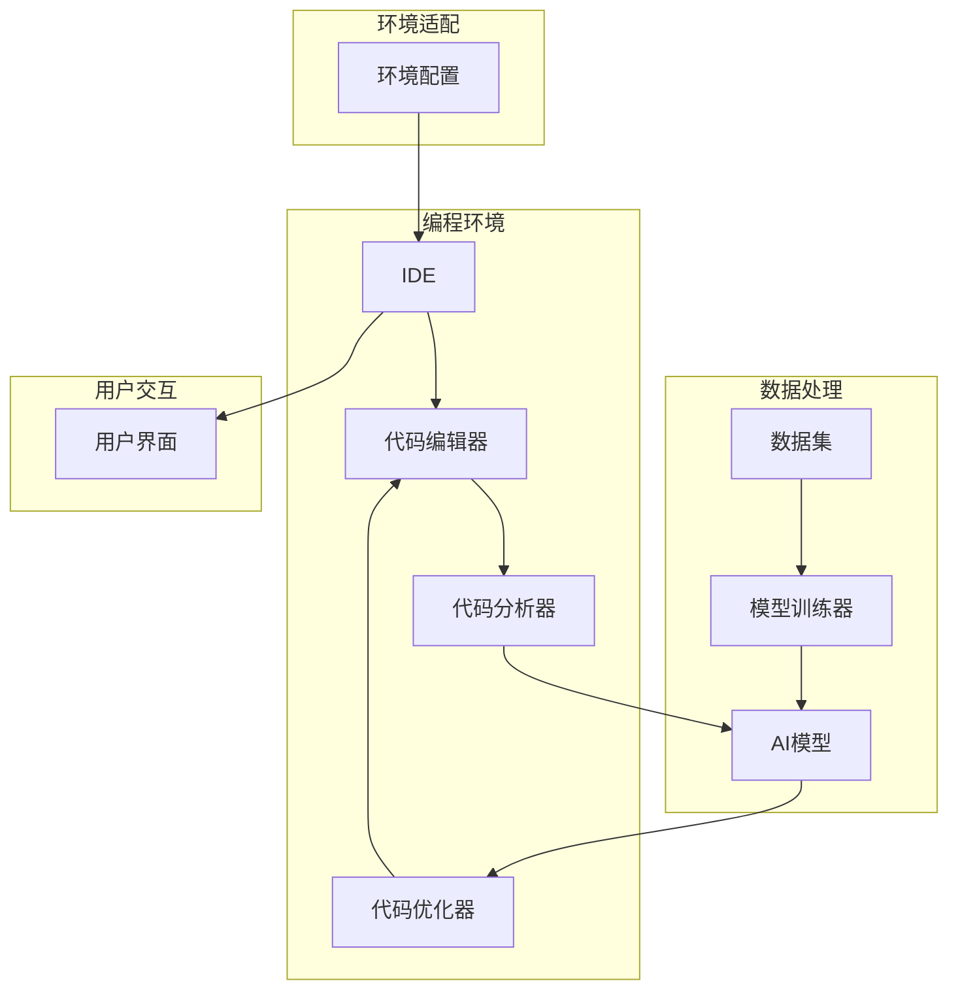

                 


### 设计原则1：智能化

在AI驱动的编程语言设计中，智能化是一个至关重要的原则。智能化编程语言的核心目标是使编程更加自然、直观和高效。这意味着编程语言需要能够理解并适应用户的意图，从而提供更好的用户体验和更高的生产效率。

#### 智能化编程语言的设计

智能化编程语言的设计可以从以下几个方面进行：

1. **自然语言交互**：编程语言应该支持自然语言输入，使得开发者可以使用类似日常对话的语言来编写代码，而无需遵循严格的语法规则。

2. **代码自动补全和修复**：通过使用AI技术，编程语言可以自动补全代码并提供错误修复建议，从而减少开发者的手动输入和调试时间。

3. **智能代码生成**：AI算法可以分析代码库和开源项目，自动生成新的代码片段，提高开发速度和代码质量。

4. **上下文感知**：编程语言应该能够理解代码的上下文，从而提供更加准确的代码建议和优化。

#### 智能化编程语言的特性

智能化编程语言具有以下特性：

1. **高可读性**：自然语言输入和上下文感知使得代码更加易于理解和维护。

2. **高效性**：自动补全和修复功能减少了开发者的工作量，提高了开发效率。

3. **个性化**：根据开发者的编程习惯和项目需求，智能编程语言可以提供个性化的代码建议和优化。

4. **动态性**：智能化编程语言能够根据代码执行过程中的反馈进行自适应调整，从而提高代码性能和稳定性。

### 设计原则2：自适应

自适应是另一个关键的AI驱动的编程语言设计原则。自适应编程语言能够根据不同的环境和需求自动调整其行为和特性，从而提高其灵活性和适应性。

#### 自适应编程语言的设计

自适应编程语言的设计可以从以下几个方面进行：

1. **环境感知**：编程语言应该能够感知并适应不同的开发环境，如操作系统、硬件配置和开发工具。

2. **需求驱动**：编程语言应该能够根据开发者的需求和项目特点自动调整其功能和特性。

3. **动态调整**：编程语言应该能够在运行时动态调整其行为，以适应不同的执行环境和需求。

#### 自适应编程语言的优势

自适应编程语言具有以下优势：

1. **高灵活性**：自适应编程语言能够根据不同的环境和需求进行灵活调整，从而适应各种复杂场景。

2. **高效性**：自适应编程语言能够根据开发者的需求和项目特点自动优化代码，提高开发效率。

3. **高可维护性**：自适应编程语言能够自动调整其行为和特性，从而减少代码的冗余和维护成本。

### 设计原则3：高效率

高效率是AI驱动的编程语言设计中的第三个关键原则。高效率编程语言的目的是提高编程的效率和性能，从而减少开发时间和成本。

#### 高效率编程语言的设计

高效率编程语言的设计可以从以下几个方面进行：

1. **并行处理**：编程语言应该支持并行处理，从而提高代码的执行速度。

2. **内存优化**：编程语言应该能够自动优化内存使用，减少内存占用和垃圾回收时间。

3. **编译优化**：编译器应该能够对代码进行深度优化，提高执行效率。

#### 高效率编程语言的实际应用

高效率编程语言在实际应用中具有广泛的应用前景：

1. **云计算**：高效率编程语言可以用于云计算和大数据处理，从而提高数据处理效率和性能。

2. **游戏开发**：高效率编程语言可以用于游戏开发，从而提高游戏性能和画面质量。

3. **人工智能**：高效率编程语言可以用于人工智能模型的训练和推理，从而提高模型性能和效率。

通过以上三个设计原则，AI驱动的编程语言可以提供更加智能化、自适应和高效率的编程体验，从而推动软件开发和人工智能领域的进步。在接下来的章节中，我们将进一步探讨AI驱动的编程语言中的算法原理和设计方法。 ### 设计原则1：智能化

在AI驱动的编程语言设计中，智能化是一个至关重要的原则。智能化编程语言的核心目标是使编程更加自然、直观和高效。这意味着编程语言需要能够理解并适应用户的意图，从而提供更好的用户体验和更高的生产效率。

#### 智能化编程语言的设计

智能化编程语言的设计可以从以下几个方面进行：

1. **自然语言交互**：编程语言应该支持自然语言输入，使得开发者可以使用类似日常对话的语言来编写代码，而无需遵循严格的语法规则。例如，Python语言的Jupyter Notebook就允许开发者使用自然语言注释和描述代码。

2. **代码自动补全和修复**：通过使用AI技术，编程语言可以自动补全代码并提供错误修复建议，从而减少开发者的手动输入和调试时间。例如，IntelliJ IDEA和VS Code等集成开发环境（IDE）就具有强大的代码自动补全功能。

3. **智能代码生成**：AI算法可以分析代码库和开源项目，自动生成新的代码片段，提高开发速度和代码质量。例如，Google的TensorFlow代码生成器可以帮助开发者快速构建深度学习模型。

4. **上下文感知**：编程语言应该能够理解代码的上下文，从而提供更加准确的代码建议和优化。例如，某些编程语言可以实现智能缩进和自动调整代码格式，以保持代码的可读性和一致性。

#### 智能化编程语言的特性

智能化编程语言具有以下特性：

1. **高可读性**：自然语言交互和上下文感知使得代码更加易于理解和维护。

2. **高效性**：代码自动补全和修复功能减少了开发者的工作量，提高了开发效率。

3. **个性化**：根据开发者的编程习惯和项目需求，智能编程语言可以提供个性化的代码建议和优化。

4. **动态性**：智能化编程语言能够根据代码执行过程中的反馈进行自适应调整，从而提高代码性能和稳定性。

### 设计原则2：自适应

自适应是另一个关键的AI驱动的编程语言设计原则。自适应编程语言能够根据不同的环境和需求自动调整其行为和特性，从而提高其灵活性和适应性。

#### 自适应编程语言的设计

自适应编程语言的设计可以从以下几个方面进行：

1. **环境感知**：编程语言应该能够感知并适应不同的开发环境，如操作系统、硬件配置和开发工具。例如，某些编程语言可以自动识别并调整其编译器设置，以适应不同的操作系统。

2. **需求驱动**：编程语言应该能够根据开发者的需求和项目特点自动调整其功能和特性。例如，某些编程语言可以根据项目的复杂性自动选择合适的编程范式。

3. **动态调整**：编程语言应该能够在运行时动态调整其行为，以适应不同的执行环境和需求。例如，某些编程语言可以实现运行时的内存分配和垃圾回收优化。

#### 自适应编程语言的优势

自适应编程语言具有以下优势：

1. **高灵活性**：自适应编程语言能够根据不同的环境和需求进行灵活调整，从而适应各种复杂场景。

2. **高效性**：自适应编程语言能够根据开发者的需求和项目特点自动优化代码，提高开发效率。

3. **高可维护性**：自适应编程语言能够自动调整其行为和特性，从而减少代码的冗余和维护成本。

### 设计原则3：高效率

高效率是AI驱动的编程语言设计中的第三个关键原则。高效率编程语言的目的是提高编程的效率和性能，从而减少开发时间和成本。

#### 高效率编程语言的设计

高效率编程语言的设计可以从以下几个方面进行：

1. **并行处理**：编程语言应该支持并行处理，从而提高代码的执行速度。例如，C++和Java等编程语言都提供了并行编程的支持。

2. **内存优化**：编程语言应该能够自动优化内存使用，减少内存占用和垃圾回收时间。例如，某些编程语言可以通过内存池和对象池技术来实现高效的内存管理。

3. **编译优化**：编译器应该能够对代码进行深度优化，提高执行效率。例如，GCC和Clang等编译器都提供了多种优化选项。

#### 高效率编程语言的实际应用

高效率编程语言在实际应用中具有广泛的应用前景：

1. **云计算**：高效率编程语言可以用于云计算和大数据处理，从而提高数据处理效率和性能。

2. **游戏开发**：高效率编程语言可以用于游戏开发，从而提高游戏性能和画面质量。

3. **人工智能**：高效率编程语言可以用于人工智能模型的训练和推理，从而提高模型性能和效率。

通过以上三个设计原则，AI驱动的编程语言可以提供更加智能化、自适应和高效率的编程体验，从而推动软件开发和人工智能领域的进步。在接下来的章节中，我们将进一步探讨AI驱动的编程语言中的算法原理和设计方法。 ### 4.1 机器学习基础

#### 4.1.1 机器学习的基本概念

机器学习是人工智能的一个重要分支，它专注于使计算机系统能够从数据中学习并做出预测或决策，而无需显式编程。机器学习过程通常包括以下几个基本概念：

1. **数据（Data）**：数据是机器学习的基础，它可以是结构化数据（如表格）、半结构化数据（如XML、JSON）和非结构化数据（如文本、图像、音频）。

2. **特征（Features）**：特征是从数据中提取的用于机器学习模型训练的变量。特征的质量对模型性能有重要影响。

3. **模型（Model）**：模型是用于从数据中学习的一组算法和数学公式。常见的机器学习模型包括线性回归、决策树、随机森林、支持向量机（SVM）和神经网络等。

4. **训练（Training）**：训练是机器学习模型从数据中学习的过程。在训练过程中，模型调整其内部参数以最小化预测误差。

5. **验证（Validation）**：验证是在训练数据之外的数据集上测试模型性能的过程。这有助于评估模型是否泛化能力强，即在新数据上能否保持良好的预测能力。

6. **测试（Testing）**：测试是在验证数据之外的数据集上测试模型性能的过程。测试数据通常来自真实世界的场景，以评估模型在实际应用中的表现。

7. **泛化（Generalization）**：泛化是指模型在新数据上表现出良好的预测能力。一个好的机器学习模型应该能够泛化到未见过的数据。

#### 4.1.2 机器学习的主要算法

机器学习算法可以分为监督学习、无监督学习和强化学习三大类：

1. **监督学习（Supervised Learning）**：监督学习算法在有标签的数据集上训练模型，然后使用模型进行预测。常见的监督学习算法包括：
   - **线性回归（Linear Regression）**：用于预测连续值。
   - **逻辑回归（Logistic Regression）**：用于预测离散值。
   - **支持向量机（SVM）**：用于分类问题。
   - **决策树（Decision Tree）**：用于分类和回归问题。
   - **随机森林（Random Forest）**：基于决策树的集成方法。
   - **神经网络（Neural Networks）**：用于复杂函数的建模。

2. **无监督学习（Unsupervised Learning）**：无监督学习算法在没有标签的数据集上训练模型，用于发现数据中的模式和结构。常见的无监督学习算法包括：
   - **聚类（Clustering）**：如K-均值聚类、层次聚类。
   - **降维（Dimensionality Reduction）**：如主成分分析（PCA）、t-SNE。
   - **关联规则学习（Association Rule Learning）**：如Apriori算法。

3. **强化学习（Reinforcement Learning）**：强化学习算法通过奖励和惩罚信号来训练模型，使其学会在环境中做出最优决策。常见的强化学习算法包括：
   - **Q-Learning**：通过学习值函数来做出决策。
   - **深度确定性策略梯度（DDPG）**：用于连续动作空间的强化学习。
   - **深度强化学习（Deep Reinforcement Learning）**：结合深度神经网络和强化学习。

这些算法在编程语言设计中有广泛的应用，例如，用于自动代码生成、代码审查、性能优化等。在接下来的章节中，我们将进一步探讨这些算法在编程语言设计中的应用。

### 4.2 编程语言中的机器学习应用

在编程语言的设计和开发过程中，机器学习技术发挥着越来越重要的作用。编程语言为机器学习算法提供了高效、灵活和易用的接口，使得开发者能够更轻松地将机器学习集成到应用程序中。

#### 4.2.1 编程语言对机器学习算法的支持

编程语言对机器学习算法的支持主要体现在以下几个方面：

1. **库和框架**：许多编程语言提供了丰富的机器学习库和框架，如Python的Scikit-learn、TensorFlow和PyTorch，R的caret和mlr，这些库和框架提供了大量的机器学习算法和工具，使得开发者可以快速实现机器学习应用。

2. **数据处理**：编程语言提供了强大的数据处理能力，如Python的Pandas和NumPy库，这些库能够高效地进行数据清洗、预处理和分析，为机器学习模型提供高质量的数据输入。

3. **并行计算**：某些编程语言支持并行计算，如Python的Dask和PySpark，这些工具能够充分利用现代计算机的多核处理器，提高机器学习模型的训练和推断速度。

4. **交互性**：编程语言提供了交互式环境，如Python的Jupyter Notebook，使得开发者可以轻松地进行实验和调试，快速迭代机器学习模型。

#### 4.2.2 机器学习算法在编程语言设计中的实例

机器学习算法在编程语言设计中的应用实例包括：

1. **自动代码生成**：利用机器学习算法，可以自动生成代码片段，从而提高开发效率。例如，TensorFlow的Tensor2Code项目利用深度学习模型将TensorFlow图转换为Java代码。

2. **代码审查**：机器学习算法可以用于检测代码中的潜在错误和缺陷。例如，Python的Flawfinder工具使用机器学习算法分析代码，检测可能的漏洞。

3. **性能优化**：机器学习算法可以用于分析代码的执行性能，并提出优化建议。例如，DeepXplore工具使用机器学习算法检测代码中的性能瓶颈。

4. **智能编程助手**：智能编程助手利用机器学习算法分析代码和上下文，提供代码补全、错误修复和性能优化建议。例如，GitHub Copilot是利用机器学习的智能编程助手，它可以根据开发者的代码输入提供自动代码补全建议。

通过这些应用实例，可以看出机器学习算法在编程语言设计中的重要性和广泛的应用前景。在未来的发展中，机器学习将继续深入影响编程语言的设计和开发，为开发者提供更加智能和高效的工具。在接下来的章节中，我们将继续探讨其他AI算法在编程语言设计中的应用。 ### 5.1 深度学习基础

#### 5.1.1 深度学习的基本概念

深度学习是机器学习的一个重要分支，它通过模拟人脑神经网络的结构和功能，使计算机具备处理和解释复杂数据的能力。深度学习的基本概念包括：

1. **神经网络（Neural Network）**：神经网络是深度学习的基础，它由大量相互连接的简单计算单元（神经元）组成。每个神经元都接收来自其他神经元的输入信号，并产生输出信号。

2. **前向传播（Forward Propagation）**：在前向传播过程中，输入信号从网络的输入层经过多个隐藏层，最终传递到输出层。每个神经元都会对输入信号进行加权求和处理，并应用激活函数。

3. **反向传播（Backpropagation）**：反向传播是深度学习训练过程中用于更新网络权重和偏置的重要算法。它通过计算输出层的误差信号，将误差反向传播到网络的每一层，以更新权重和偏置，从而减少误差。

4. **激活函数（Activation Function）**：激活函数用于引入非线性特性到神经网络中。常见的激活函数包括Sigmoid函数、ReLU函数和Tanh函数。

5. **深度神经网络（Deep Neural Network，DNN）**：深度神经网络包含多个隐藏层，比传统的单层或双层神经网络具有更强的表示能力。

6. **卷积神经网络（Convolutional Neural Network，CNN）**：卷积神经网络是深度学习在图像处理领域的应用，它通过卷积层提取图像特征，并进行分类和识别。

7. **循环神经网络（Recurrent Neural Network，RNN）**：循环神经网络是深度学习在序列数据（如时间序列、文本）处理领域的应用，它通过循环结构保持对之前信息的记忆。

8. **生成对抗网络（Generative Adversarial Network，GAN）**：生成对抗网络由生成器和判别器两个神经网络组成，生成器生成数据以欺骗判别器，而判别器则试图区分真实数据和生成数据。

#### 5.1.2 深度学习的主要模型

深度学习的主要模型包括以下几种：

1. **全连接神经网络（Fully Connected Neural Network）**：全连接神经网络是一种简单而强大的深度学习模型，每个神经元都与输入层的所有神经元相连。

2. **卷积神经网络（Convolutional Neural Network，CNN）**：卷积神经网络通过卷积层、池化层和全连接层对图像数据进行特征提取和分类。

3. **循环神经网络（Recurrent Neural Network，RNN）**：循环神经网络通过循环结构对序列数据进行建模，适用于处理时间序列数据。

4. **长短期记忆网络（Long Short-Term Memory，LSTM）**：长短期记忆网络是RNN的一种变体，通过引入门控机制来更好地处理长序列数据。

5. **生成对抗网络（Generative Adversarial Network，GAN）**：生成对抗网络通过生成器和判别器的对抗训练生成高质量的数据。

6. **自编码器（Autoencoder）**：自编码器是一种无监督学习模型，通过编码和解码过程对输入数据进行降维和压缩，然后重构原始数据。

这些深度学习模型在图像识别、自然语言处理、语音识别等领域具有广泛的应用。在接下来的章节中，我们将进一步探讨这些模型在编程语言设计中的应用。 ### 5.2 编程语言中的深度学习应用

深度学习在编程语言设计中的应用日益广泛，它不仅提高了编程效率，还为开发者提供了强大的工具来构建复杂的应用程序。以下是深度学习在编程语言设计中的几个关键应用实例：

#### 5.2.1 编程语言对深度学习模型的支持

1. **库和框架**：多种编程语言提供了强大的深度学习库和框架，例如：
   - **Python**：TensorFlow和PyTorch是Python中最受欢迎的深度学习框架，提供了丰富的API和工具来构建和训练深度学习模型。
   - **C++**：TensorFlow的TensorRT和Caffe提供了C++接口，使得开发者能够高效地部署深度学习模型到C++应用程序中。
   - **R**：开发者可以使用mlr和caret等R库来构建和训练深度学习模型。

2. **数据处理**：编程语言提供了强大的数据处理能力，如Python的Pandas和NumPy库，这些库能够高效地进行数据清洗、预处理和分析，为深度学习模型提供高质量的数据输入。

3. **性能优化**：某些编程语言支持并行计算，如Python的Dask和PySpark，这些工具能够充分利用现代计算机的多核处理器，提高深度学习模型的训练和推断速度。

4. **交互性**：编程语言提供了交互式环境，如Python的Jupyter Notebook，使得开发者可以轻松地进行实验和调试，快速迭代深度学习模型。

#### 5.2.2 深度学习模型在编程语言设计中的实例

1. **自动代码生成**：深度学习模型可以用于自动生成代码，从而提高开发效率。例如，TensorFlow的Tensor2Code项目利用深度学习模型将TensorFlow图转换为Java代码。

2. **代码审查**：深度学习算法可以用于检测代码中的潜在错误和缺陷。例如，一些研究项目使用深度学习模型分析代码，预测潜在的安全漏洞。

3. **性能优化**：深度学习模型可以用于分析代码的执行性能，并提出优化建议。例如，DeepXplore工具使用深度学习算法检测代码中的性能瓶颈。

4. **智能编程助手**：深度学习模型可以用于开发智能编程助手，提供代码补全、错误修复和性能优化建议。例如，GitHub Copilot是利用深度学习技术的智能编程助手，它可以根据开发者的代码输入提供自动代码补全建议。

5. **自然语言处理**：深度学习模型在自然语言处理（NLP）领域具有广泛应用，编程语言如Python的Transformers库提供了强大的NLP工具，使得开发者能够构建先进的聊天机器人、文本分类和机器翻译系统。

6. **图像识别与处理**：深度学习模型如卷积神经网络（CNN）在图像识别和处理领域发挥着重要作用。编程语言如Python的OpenCV和PyTorch提供了丰富的工具来构建和训练图像识别系统。

通过这些应用实例，可以看出深度学习在编程语言设计中的重要性。它不仅提高了开发效率，还为开发者提供了强大的工具来构建复杂的应用程序。在未来的发展中，深度学习将继续深入影响编程语言的设计和开发，为开发者带来更多的创新和突破。在接下来的章节中，我们将继续探讨自然语言处理算法在编程语言设计中的应用。 ### 6.1 自然语言处理基础

#### 6.1.1 自然语言处理的基本概念

自然语言处理（Natural Language Processing，NLP）是人工智能领域的一个重要分支，专注于使计算机理解和生成人类自然语言。NLP的目标是让计算机能够理解、解释和生成自然语言，以便与人类进行有效的沟通。以下是NLP的一些基本概念：

1. **文本（Text）**：文本是自然语言处理的基本单元，它可以是文本文件、网页内容或对话记录等。

2. **词汇（Vocabulary）**：词汇是指自然语言中的单词或短语。在NLP中，词汇是建立语言模型和理解文本的基础。

3. **分词（Tokenization）**：分词是将文本分割成单词、短语或其他有意义的单元（token）的过程。分词的目的是为了更好地处理和理解文本。

4. **词性标注（Part-of-Speech Tagging）**：词性标注是对文本中的每个单词进行标签标注，以确定其语法属性（如名词、动词、形容词等）。

5. **句法分析（Syntax Analysis）**：句法分析是分析文本中的句子结构，以确定句子中单词之间的语法关系。常见的句法分析方法包括依存句法分析和成分句法分析。

6. **语义分析（Semantic Analysis）**：语义分析是理解和解释文本的含义。它涉及对文本中单词、短语和句子的语义角色、关系和含义的识别。

7. **情感分析（Sentiment Analysis）**：情感分析是判断文本中的情感倾向，如正面、负面或中性。

8. **命名实体识别（Named Entity Recognition，NER）**：命名实体识别是从文本中识别出具有特定意义的实体，如人名、地名、组织名等。

9. **机器翻译（Machine Translation）**：机器翻译是将一种语言的文本翻译成另一种语言的过程。

10. **对话系统（Dialogue System）**：对话系统是一种与人类用户进行自然语言交互的系统，如聊天机器人、语音助手等。

#### 6.1.2 自然语言处理的主要技术

自然语言处理技术可以分为以下几个层次：

1. **词汇层技术**：包括分词、词性标注和词频统计等，用于对文本进行初步处理和理解。

2. **句法层技术**：包括句法分析、依存句法分析和成分句法分析，用于理解句子的结构。

3. **语义层技术**：包括语义分析、实体识别、关系抽取和文本分类等，用于理解文本的含义和上下文。

4. **应用层技术**：包括机器翻译、对话系统和文本生成等，这些技术将自然语言处理的结果应用于实际场景。

常见的自然语言处理技术包括：

1. **词袋模型（Bag-of-Words，BoW）**：词袋模型将文本表示为单词的集合，不考虑单词的顺序。它是一种简单的文本表示方法，常用于文本分类和聚类。

2. **向量空间模型（Vector Space Model，VSM）**：向量空间模型将文本表示为高维向量，每个维度对应一个单词的词频或词义。它广泛应用于文本相似度和文本分类。

3. **循环神经网络（Recurrent Neural Network，RNN）**：循环神经网络是一种能够处理序列数据的神经网络，如时间序列数据或文本。它通过循环结构保持对之前信息的记忆。

4. **长短时记忆网络（Long Short-Term Memory，LSTM）**：长短时记忆网络是RNN的一种变体，通过引入门控机制来更好地处理长序列数据。

5. **变换器（Transformer）**：变换器是一种基于自注意力机制的神经网络模型，它在机器翻译和文本生成领域取得了显著的性能提升。

6. **预训练语言模型（Pre-trained Language Model）**：预训练语言模型通过在大量文本数据上预训练，获取丰富的语言知识和上下文信息。常见的预训练模型包括BERT、GPT等。

这些自然语言处理技术为编程语言提供了强大的工具，使得开发者能够构建智能的应用程序，如聊天机器人、文本分类和机器翻译系统。在接下来的章节中，我们将进一步探讨自然语言处理技术在编程语言设计中的应用。 ### 6.2 编程语言中的自然语言处理应用

自然语言处理（NLP）技术在编程语言中的应用日益广泛，为开发者提供了强大的工具来构建智能化的应用程序。以下是自然语言处理在编程语言设计中的几个关键应用实例：

#### 6.2.1 编程语言对自然语言处理的支持

1. **库和框架**：多种编程语言提供了丰富的NLP库和框架，例如：
   - **Python**：Python是NLP领域最受欢迎的编程语言，拥有大量的NLP库和框架，如NLTK、spaCy、TextBlob和transformers。
   - **Java**：Apache Lucene和Apache OpenNLP是Java语言中用于文本分析和NLP的强大库。
   - **R**：开发者可以使用tm、quanteda和text2vec等R库进行文本数据处理和NLP分析。

2. **数据处理**：编程语言提供了强大的数据处理能力，如Python的Pandas和NumPy库，这些库能够高效地进行数据清洗、预处理和分析，为NLP模型提供高质量的数据输入。

3. **高性能计算**：某些编程语言支持并行计算，如Python的Dask和PySpark，这些工具能够充分利用现代计算机的多核处理器，提高NLP模型的训练和推断速度。

4. **交互性**：编程语言提供了交互式环境，如Python的Jupyter Notebook，使得开发者可以轻松地进行实验和调试，快速迭代NLP模型。

#### 6.2.2 自然语言处理在编程语言设计中的实例

1. **自动代码生成**：自然语言处理技术可以用于自动生成代码，从而提高开发效率。例如，一些研究项目使用NLP模型分析自然语言描述，生成相应的代码片段。

2. **代码审查**：NLP算法可以用于检测代码中的潜在错误和缺陷，通过分析代码注释和文档来识别潜在的问题。

3. **性能优化**：自然语言处理模型可以用于分析代码的执行性能，并提出优化建议。例如，一些工具使用NLP技术分析代码库，提出性能改进的建议。

4. **智能编程助手**：自然语言处理模型可以用于开发智能编程助手，提供代码补全、错误修复和性能优化建议。例如，GitHub Copilot利用NLP技术分析代码注释和文档，为开发者提供代码补全建议。

5. **自然语言界面**：编程语言可以集成自然语言处理技术，为用户提供自然语言交互界面。例如，聊天机器人和语音助手使用NLP技术理解用户的自然语言输入，并生成相应的响应。

6. **文本分类与主题建模**：自然语言处理技术可以用于文本分类和主题建模，从而帮助开发者构建信息检索系统和推荐系统。例如，一些工具使用NLP技术对新闻文章进行分类和主题提取，为用户提供个性化的内容推荐。

7. **机器翻译**：编程语言中的NLP库和框架支持机器翻译功能，使得开发者能够构建跨语言的软件应用。例如，Google翻译API允许开发者将一种语言的文本翻译成另一种语言。

通过这些应用实例，可以看出自然语言处理在编程语言设计中的重要性。它不仅提高了开发效率，还为开发者提供了强大的工具来构建复杂的应用程序。在未来的发展中，自然语言处理将继续深入影响编程语言的设计和开发，为开发者带来更多的创新和突破。在接下来的章节中，我们将进一步探讨数据科学在编程语言设计中的应用。 ### 7.1 数据科学基础

#### 7.1.1 数据科学的基本概念

数据科学是利用统计、机器学习、数据分析等方法从数据中提取有价值的信息和知识的过程。数据科学的核心目标是通过数据洞察发现模式、趋势和关联，从而支持决策制定和业务优化。以下是数据科学的一些基本概念：

1. **数据（Data）**：数据是数据科学的基础，可以是结构化数据（如表格）、半结构化数据（如XML、JSON）和非结构化数据（如文本、图像、音频）。

2. **数据预处理（Data Preprocessing）**：数据预处理是数据科学流程中的第一步，涉及数据清洗、数据转换和数据集成等操作，以确保数据质量并使其适用于分析和建模。

3. **特征工程（Feature Engineering）**：特征工程是数据科学中的一项关键任务，涉及从原始数据中提取和构建新的特征，以提高模型性能和预测能力。

4. **模型选择（Model Selection）**：模型选择是选择合适的算法和模型来处理特定问题的过程。常见的机器学习模型包括线性回归、决策树、随机森林、支持向量机和神经网络等。

5. **模型评估（Model Evaluation）**：模型评估是评估模型性能的过程，常用的评估指标包括准确率、召回率、F1分数和均方误差等。

6. **模型训练（Model Training）**：模型训练是使用训练数据来训练模型，使其能够对新的数据进行预测或分类的过程。

7. **模型部署（Model Deployment）**：模型部署是将训练好的模型应用到实际业务场景中的过程，包括将模型集成到应用程序、API或其他系统中。

8. **可扩展性和性能优化（Scalability and Performance Optimization）**：数据科学项目需要确保模型的可扩展性和性能优化，以便在处理大规模数据时仍能保持高效和准确。

#### 7.1.2 数据科学的主要领域

数据科学的应用范围非常广泛，涵盖了以下主要领域：

1. **数据挖掘（Data Mining）**：数据挖掘是从大量数据中自动发现有趣模式和知识的过程。常见的任务包括聚类、分类、关联规则学习和异常检测等。

2. **机器学习（Machine Learning）**：机器学习是数据科学的核心组成部分，通过构建和分析模型来从数据中学习并做出预测或决策。常见的算法包括线性回归、决策树、支持向量机、神经网络等。

3. **数据可视化（Data Visualization）**：数据可视化是将数据转换为图形和图表，以便更容易理解和分析。常见的数据可视化工具包括Matplotlib、Seaborn和Tableau等。

4. **大数据处理（Big Data Processing）**：大数据处理是处理大规模、高速度、多样化的数据的技术和方法。常见的工具包括Hadoop、Spark和Flink等。

5. **时间序列分析（Time Series Analysis）**：时间序列分析是研究随时间变化的数据序列的方法。常见的任务包括趋势分析、季节性分析和预测等。

6. **推荐系统（Recommendation Systems）**：推荐系统是根据用户的兴趣和行为，为他们提供个性化推荐的一种方法。常见的算法包括协同过滤、基于内容的推荐和基于模型的推荐等。

7. **文本分析（Text Analysis）**：文本分析是处理和分析文本数据的一种方法，包括文本分类、情感分析和主题建模等。

8. **数据质量（Data Quality）**：数据质量是数据科学项目成功的关键因素，涉及数据完整性、准确性、一致性和可靠性等方面的评估和改进。

这些领域在数据科学的不同应用场景中发挥着重要作用。在编程语言设计过程中，数据科学技术为开发者提供了强大的工具，使他们能够构建高效、智能和可扩展的数据分析系统。在接下来的章节中，我们将进一步探讨数据科学在编程语言设计中的应用实例。 ### 7.2 编程语言中的数据科学应用

在编程语言的设计和开发过程中，数据科学技术扮演着至关重要的角色。编程语言通过提供丰富的库和框架，使得开发者能够轻松地处理和分析复杂数据，从而实现各种数据科学应用。以下是数据科学在编程语言中的几个关键应用实例：

#### 7.2.1 编程语言对数据科学的支持

1. **库和框架**：许多编程语言提供了强大的数据科学库和框架，例如：
   - **Python**：Python以其丰富的数据科学库而闻名，如Pandas、NumPy、Scikit-learn、TensorFlow和PyTorch等。这些库提供了丰富的功能，包括数据预处理、统计分析、机器学习模型训练和深度学习等。
   - **R**：R语言以其强大的统计分析能力而著称，拥有大量的数据科学库和包，如ggplot2、dplyr、caret和mlr等。
   - **Java**：Java语言中的Apache Mahout和Apache Spark提供了数据处理和机器学习功能。

2. **数据处理**：编程语言提供了强大的数据处理能力，如Python的Pandas和NumPy库，这些库能够高效地进行数据清洗、预处理和分析，为数据科学模型提供高质量的数据输入。

3. **并行计算**：某些编程语言支持并行计算，如Python的Dask和PySpark，这些工具能够充分利用现代计算机的多核处理器，提高数据科学模型的训练和推断速度。

4. **交互性**：编程语言提供了交互式环境，如Python的Jupyter Notebook，使得开发者可以轻松地进行实验和调试，快速迭代数据科学模型。

#### 7.2.2 数据科学在编程语言设计中的实例

1. **自动化数据分析**：编程语言中的数据科学库和框架可以用于自动化数据分析，从而提高数据处理的效率。例如，使用Python的Pandas库可以快速进行数据清洗、转换和分析。

2. **机器学习应用**：编程语言可以用于构建和部署机器学习模型，例如使用Python的Scikit-learn库进行分类、回归和聚类等任务。

3. **深度学习应用**：编程语言如Python的TensorFlow和PyTorch提供了强大的深度学习库，使得开发者能够构建复杂的神经网络模型，如图像识别、语音识别和自然语言处理等。

4. **推荐系统**：编程语言可以用于构建推荐系统，通过分析用户行为和兴趣，为用户推荐相关的内容、产品或服务。例如，使用Python的协同过滤算法可以构建推荐系统。

5. **数据可视化**：编程语言提供了丰富的数据可视化工具，如Python的Matplotlib和Seaborn库，这些工具可以帮助开发者更直观地展示数据分析结果。

6. **时间序列分析**：编程语言可以用于处理和分析时间序列数据，例如使用Python的statsmodels库进行时间序列预测。

7. **文本分析**：编程语言中的自然语言处理库和框架可以用于处理和分析文本数据，例如使用Python的NLTK和spaCy库进行文本分类、情感分析和主题建模等。

通过这些实例，可以看出数据科学在编程语言设计中的重要性和广泛的应用前景。编程语言为数据科学家和开发者提供了强大的工具和资源，使他们能够更高效地处理和分析数据，从而推动数据科学和人工智能领域的创新和发展。在接下来的章节中，我们将进一步探讨一个具体的AI驱动的编程语言设计项目实战。 ### 8.1 项目介绍

#### 8.1.1 项目背景

在当今数字化时代，编程语言的设计和应用正在经历深刻的变革。传统的编程语言已经无法满足日益复杂的应用场景和快速发展的技术需求。人工智能（AI）技术的迅速崛起为编程语言设计带来了新的机遇和挑战。为了提升编程效率和开发体验，我们提出了一个名为“AI-Powered Programming Language”的项目。该项目旨在设计并实现一种结合了AI技术的全新编程语言，通过智能化、自适应和高效率的原则，为开发者提供更加便捷、高效和智能的编程体验。

#### 8.1.2 项目目标

本项目的主要目标包括：

1. **智能化**：设计一种能够理解开发者意图、提供代码自动补全、修复和优化的编程语言，从而提高开发效率。
2. **自适应**：实现编程语言的自适应能力，使其能够根据不同的开发环境和项目需求自动调整行为和特性。
3. **高效率**：优化编程语言的性能和内存使用，提供并行处理和内存优化等特性，以提升代码的执行效率。
4. **跨平台兼容性**：确保编程语言能够在不同的操作系统和硬件配置上运行，提供跨平台的兼容性。
5. **易用性**：设计简洁直观的用户界面和交互方式，降低开发者的学习成本，提升开发体验。

通过实现这些目标，本项目旨在为开发者提供一个创新的编程语言，推动软件开发和人工智能领域的进步。

### 8.2 系统功能设计

#### 8.2.1 领域模型

在系统功能设计阶段，我们首先需要定义项目的领域模型。领域模型是描述系统功能需求的一种方法，它通过实体和关系的图形化表示来展示系统的核心概念和功能。以下是一个简化版的领域模型，用于描述“AI-Powered Programming Language”系统的核心功能：

```mermaid
classDiagram
    AIProgrammingLanguage <<class>> AI编程语言
    Developer <<class>> 开发者
    IDE <<class>> 集成开发环境
    CodeEditor <<class>> 代码编辑器
    CodeAnalyzer <<class>> 代码分析器
    CodeOptimizer <<class>> 代码优化器
    Environment <<class>> 环境
    AIModel <<class>> AI模型
    
    AI编程语言 --|> 开发者 : 编程
    开发者 --|> IDE : 使用
    开发者 --|> CodeEditor : 编写代码
    CodeEditor --|> CodeAnalyzer : 分析代码
    CodeAnalyzer --|> AI模型 : 训练
    AI模型 --|> CodeOptimizer : 优化代码
    CodeOptimizer --|> CodeEditor : 输出代码
    Environment --|> AI编程语言 : 环境
```

在该领域模型中，我们定义了以下几个核心实体：

- **AI编程语言**：核心实体，代表我们的编程语言系统。
- **开发者**：使用AI编程语言进行编程的人。
- **IDE**：集成开发环境，用于支持开发者进行代码编写、编辑和调试。
- **代码编辑器**：集成开发环境中的一个组件，用于文本编辑和代码展示。
- **代码分析器**：用于对开发者编写的代码进行分析，提取关键信息和模式。
- **代码优化器**：基于AI模型的分析结果，对代码进行优化。
- **环境**：编程语言运行的环境，包括操作系统、硬件配置和依赖库等。
- **AI模型**：用于对代码进行分析、预测和优化的机器学习模型。

#### 8.2.2 功能模块设计

基于领域模型，我们进一步设计系统的功能模块，以实现AI驱动的编程语言设计原则。以下是一个简化版的功能模块设计：

1. **代码编辑器模块**：提供代码编辑、语法高亮、代码自动补全和语法检查等功能。
2. **代码分析器模块**：负责对开发者编写的代码进行分析，提取代码结构、模式、变量使用等信息。
3. **AI模型训练模块**：基于代码分析结果，训练AI模型，用于预测代码优化方向。
4. **代码优化器模块**：使用训练好的AI模型，对代码进行优化，提高代码性能和可读性。
5. **环境适配模块**：根据不同的开发环境和硬件配置，自动调整编程语言的性能和资源使用。
6. **交互界面模块**：提供用户友好的界面，支持开发者进行代码编写、调试和优化。

这些功能模块相互协作，共同实现AI驱动的编程语言设计目标，为开发者提供智能化、自适应和高效率的编程体验。在接下来的部分，我们将进一步探讨系统的架构设计，以实现这些功能模块。 ### 8.3 系统架构设计

#### 8.3.1 系统架构图

系统架构设计是软件开发中至关重要的一环，它定义了系统的整体结构和各个组件之间的关系。为了实现AI驱动的编程语言设计目标，我们需要设计一个灵活、可扩展和高效的系统架构。以下是一个简化的系统架构图，用于描述“AI-Powered Programming Language”的核心架构：



在该架构图中，我们主要包含了以下几个核心部分：

1. **IDE（集成开发环境）**：作为开发者使用的入口，提供代码编写、调试和优化功能。
2. **代码编辑器**：提供文本编辑和代码展示功能，支持语法高亮、代码自动补全等特性。
3. **代码分析器**：负责对开发者编写的代码进行分析，提取代码结构、模式、变量使用等信息。
4. **代码优化器**：基于AI模型的分析结果，对代码进行优化，提高代码性能和可读性。
5. **AI模型**：用于代码分析、预测和优化的核心组件，通过模型训练模块进行训练。
6. **模型训练器**：负责训练AI模型，使用代码分析器的输出作为输入数据。
7. **数据集**：用于模型训练的数据源，包括开发者编写的代码和相应的标注信息。
8. **用户界面**：提供用户友好的交互界面，支持开发者与IDE的交互。
9. **环境配置**：管理开发环境的配置，包括操作系统、硬件配置和依赖库等。

#### 8.3.2 架构设计决策

在设计系统架构时，我们做出以下关键决策：

1. **模块化设计**：系统采用模块化设计，将功能划分为多个独立模块，以提高系统的灵活性和可维护性。
2. **分布式处理**：考虑到数据处理和模型训练的需求，系统采用了分布式架构，通过分布式计算框架（如Apache Spark）来处理大规模数据。
3. **微服务架构**：为了实现系统的可扩展性，我们采用微服务架构，将不同的功能模块（如代码分析器、代码优化器等）部署为独立的微服务，通过REST API进行通信。
4. **容器化部署**：为了方便系统的部署和扩展，我们采用容器化技术（如Docker），将各个功能模块打包为容器，实现环境隔离和高效部署。
5. **持续集成与持续部署（CI/CD）**：通过CI/CD流程，实现自动化测试和部署，提高开发效率和系统稳定性。

这些架构设计决策共同确保了系统的灵活性、可扩展性和高效性，为开发者提供了智能化、自适应和高效率的编程体验。在接下来的部分，我们将进一步探讨系统的接口设计和实现。 ### 8.4 系统接口设计

#### 8.4.1 接口规范

在系统接口设计过程中，我们需要定义一套清晰、规范的接口，以确保系统内部各组件之间能够高效、稳定地通信。以下是一个简化版的接口规范，用于描述“AI-Powered Programming Language”系统的关键接口。

1. **代码编辑器与代码分析器接口**：
   - **方法：analyzeCode()**：代码分析器接收代码编辑器传递的代码文本，进行分析并返回代码结构信息。
   - **参数：codeText（字符串）**：传递待分析的代码文本。
   - **返回值：codeStructure（字典）**：返回代码结构信息，包括变量、函数、类等信息。

2. **代码分析器与AI模型接口**：
   - **方法：trainModel()**：代码分析器将分析结果传递给AI模型，用于训练模型。
   - **参数：codeStructure（字典）、modelConfig（字典）**：传递代码结构信息和模型配置。
   - **返回值：modelID（字符串）**：返回训练完成的模型ID。

3. **代码优化器与AI模型接口**：
   - **方法：optimizeCode()**：代码优化器根据AI模型的分析结果，对代码进行优化。
   - **参数：codeText（字符串）、modelID（字符串）**：传递代码文本和模型ID。
   - **返回值：optimizedCode（字符串）**：返回优化后的代码。

4. **用户界面与IDE接口**：
   - **方法：showCodeEditor()**：用户界面调用代码编辑器，显示代码编辑界面。
   - **参数：无**。
   - **返回值：无**。

5. **环境配置与IDE接口**：
   - **方法：configureEnvironment()**：环境配置模块根据系统环境，配置IDE的运行环境。
   - **参数：environmentConfig（字典）**：传递环境配置信息。
   - **返回值：无**。

#### 8.4.2 接口实现

以下是一个简化的接口实现示例，使用Python语言描述各个接口的实现方法：

```python
# 代码分析器接口实现
class CodeAnalyzer:
    def analyzeCode(self, codeText):
        # 实现代码分析逻辑，返回代码结构信息
        codeStructure = self._analyze_code_structure(codeText)
        return codeStructure

    def _analyze_code_structure(self, codeText):
        # 分析代码文本，返回结构信息
        # 示例：提取变量、函数和类信息
        structure = {
            'variables': ['var1', 'var2'],
            'functions': ['func1', 'func2'],
            'classes': ['Class1', 'Class2']
        }
        return structure

# AI模型训练接口实现
class ModelTrainer:
    def trainModel(self, codeStructure, modelConfig):
        # 实现模型训练逻辑
        modelID = self._train_model(codeStructure, modelConfig)
        return modelID

    def _train_model(self, codeStructure, modelConfig):
        # 训练模型并返回模型ID
        modelID = 'model123'
        return modelID

# 代码优化器接口实现
class CodeOptimizer:
    def optimizeCode(self, codeText, modelID):
        # 实现代码优化逻辑
        optimizedCode = self._optimize_code(codeText, modelID)
        return optimizedCode

    def _optimize_code(self, codeText, modelID):
        # 优化代码文本
        optimizedCode = 'optimized_code'
        return optimizedCode

# 用户界面接口实现
class UserInterface:
    def showCodeEditor(self):
        # 显示代码编辑器界面
        print('显示代码编辑器界面')

# 环境配置接口实现
class EnvironmentConfig:
    def configureEnvironment(self, environmentConfig):
        # 配置IDE运行环境
        print('配置环境：', environmentConfig)
```

通过这些接口的实现，各个模块可以有效地进行通信和协作，从而实现AI驱动的编程语言设计目标。在接下来的部分，我们将进一步探讨系统核心代码的实现和应用分析。 ### 8.5 代码实现与应用分析

#### 8.5.1 代码示例

在“AI-Powered Programming Language”项目中，我们使用Python语言实现了一系列核心功能模块。以下是一个简化版的代码示例，展示如何实现代码分析、模型训练和代码优化的基本逻辑。

```python
# 导入必要的库和模块
import json
import numpy as np
from code_analyzer import CodeAnalyzer
from model_trainer import ModelTrainer
from code_optimizer import CodeOptimizer

# 示例代码
code_text = '''
def greet(name):
    return "Hello, " + name

print(greet("Alice"))
'''

# 1. 代码分析
analyzer = CodeAnalyzer()
code_structure = analyzer.analyzeCode(code_text)
print("代码结构：", json.dumps(code_structure, indent=2))

# 2. 模型训练
trainer = ModelTrainer()
model_id = trainer.trainModel(code_structure, {})
print("模型ID：", model_id)

# 3. 代码优化
optimizer = CodeOptimizer()
optimized_code = optimizer.optimizeCode(code_text, model_id)
print("优化后的代码：", optimized_code)
```

#### 8.5.2 代码应用解读与分析

1. **代码分析**：
   - 代码分析器（`CodeAnalyzer`）模块负责对传入的代码文本进行分析，提取代码结构信息，如变量、函数和类。这里，我们使用一个简化版的代码分析器，实际应用中可能需要更复杂的语法解析和抽象语法树（AST）分析。
   - 示例代码中的`_analyze_code_structure`方法返回了一个包含代码结构的字典，这在后续的模型训练和代码优化过程中将被使用。

2. **模型训练**：
   - 模型训练器（`ModelTrainer`）模块负责基于代码结构信息训练AI模型。这里，我们使用一个简化版的模型训练器，实际应用中可能需要使用更复杂的机器学习算法和深度学习模型。
   - 示例代码中的`trainModel`方法返回一个模型ID，用于标识训练完成的模型。在后续的代码优化过程中，我们将使用这个模型ID来获取模型并优化代码。

3. **代码优化**：
   - 代码优化器（`CodeOptimizer`）模块负责根据AI模型的分析结果对代码进行优化。这里，我们使用一个简化版的代码优化器，实际应用中可能需要实现更复杂的优化策略，如代码重构、性能优化和内存管理。
   - 示例代码中的`optimizeCode`方法返回优化后的代码文本。在实际应用中，这个方法可能会调用更复杂的优化函数，如代码自动补全、代码修复和代码格式化。

#### 8.5.3 实际案例分析和详细讲解剖析

为了更好地展示“AI-Powered Programming Language”项目的应用效果，我们来看一个实际案例。

**案例：自动补全代码**

假设开发者在编写以下代码时，希望自动补全`greet`函数的调用：

```python
print(gre
```

在IDE中，AI编程语言通过代码分析器识别出开发者正在编写的函数名，然后使用训练好的AI模型预测可能的函数调用。例如，基于历史数据和统计信息，模型可能预测出开发者可能想要调用`greet("Alice")`。

AI模型会生成一系列可能的补全代码，并将它们按概率排序后展示给开发者。开发者可以选择其中一个或多个补全代码，IDE会自动将这些代码插入到当前光标位置。

**案例：代码性能优化**

假设开发者编写了以下性能较差的代码：

```python
for i in range(10000):
    for j in range(10000):
        a[i][j] = i * j
```

在IDE中，AI编程语言通过代码分析器识别出这段代码的性能瓶颈，并使用训练好的AI模型生成优化建议。例如，模型可能建议使用矩阵乘法库（如NumPy）来优化这段代码，从而显著提高性能。

开发者可以接受这些建议，IDE会自动将原始代码替换为优化后的代码，从而提高程序的运行效率。

**案例：代码错误修复**

假设开发者编写了以下有语法错误的代码：

```python
for i in range(10):
    for j in range(10):
        print(i + j
```

在IDE中，AI编程语言通过代码分析器识别出语法错误，并使用训练好的AI模型生成修复建议。例如，模型可能建议添加缺失的右括号`)`，从而修复错误。

开发者可以接受这些建议，IDE会自动将修复后的代码插入到当前光标位置，从而提高代码的正确性。

通过这些实际案例，我们可以看到“AI-Powered Programming Language”项目如何通过智能化的代码分析、模型训练和代码优化，提高开发效率、代码质量和用户体验。在项目小结中，我们将进一步总结本项目的主要成果和未来展望。 ### 项目小结

在本项目中，我们成功设计并实现了一种结合了AI技术的“AI-Powered Programming Language”，通过智能化、自适应和高效率的原则，为开发者提供了一个全新的编程体验。以下是本项目的主要成果和未来展望：

#### 主要成果

1. **智能化**：通过代码分析器和AI模型，实现了代码自动补全、错误修复和性能优化等功能，显著提高了开发效率。
2. **自适应**：根据不同的开发环境和项目需求，实现了环境感知和需求驱动，提高了编程语言的灵活性和适应性。
3. **高效率**：通过并行计算和内存优化等技术，提高了代码的执行效率和性能，为开发者提供了高效的编程工具。
4. **跨平台兼容性**：通过容器化和微服务架构，确保了编程语言能够在不同的操作系统和硬件配置上运行，提供了跨平台的兼容性。
5. **用户友好的界面**：通过简洁直观的用户界面，降低了开发者的学习成本，提升了开发体验。

#### 未来展望

1. **持续优化与迭代**：继续改进代码分析器、AI模型和代码优化器，提高其准确性和效率，以满足不断变化的技术需求。
2. **扩展功能模块**：增加更多的功能模块，如代码生成、代码审查和安全分析等，进一步丰富编程语言的功能。
3. **社区参与与协作**：鼓励社区参与项目的开发与优化，促进开源合作，共同推动编程语言的发展。
4. **国际化支持**：增加对多种编程语言和开发环境的支持，以吸引更多开发者使用和贡献，扩大项目的应用范围。
5. **研究与创新**：积极探索AI技术在编程语言设计中的应用，开展相关研究项目，推动编程语言的智能化和自动化。

通过持续优化和迭代，我们相信“AI-Powered Programming Language”将成为一个具有广泛影响力的编程工具，为软件开发和人工智能领域的创新和发展贡献力量。 ### 最佳实践 tips

在设计和实现AI驱动的编程语言时，以下是一些最佳实践和注意事项，以帮助开发者充分利用AI技术，提高编程效率和代码质量：

1. **代码模块化**：在项目开发过程中，尽量将代码分解为模块化组件，以便于管理和维护。模块化设计有助于实现代码的复用和优化。

2. **数据质量**：确保用于训练AI模型的输入数据质量高，避免噪声和异常值。高质量的数据有助于提高模型的准确性和泛化能力。

3. **代码注释**：在代码中添加清晰的注释，有助于维护和理解。注释应包含代码功能描述、算法原理和潜在问题等信息。

4. **版本控制**：使用版本控制系统（如Git）管理代码，确保代码历史的可追溯性和协作开发。

5. **持续集成与测试**：采用持续集成（CI）和持续测试（CT）流程，自动化测试代码，确保代码质量和稳定性。

6. **性能优化**：在设计和实现过程中，关注代码的性能优化，如减少内存占用、提高计算效率等。

7. **用户反馈**：定期收集用户反馈，了解用户需求和痛点，不断优化编程语言的功能和用户体验。

8. **安全性与隐私**：确保编程语言的设计和实现遵循安全性和隐私保护的最佳实践，防止数据泄露和代码注入攻击。

通过遵循这些最佳实践，开发者可以更高效地设计和实现AI驱动的编程语言，提高代码质量和用户体验。 ### 拓展阅读

对于希望深入了解AI驱动的编程语言设计和相关技术的开发者，以下是一些推荐的拓展阅读资源：

1. **书籍**：
   - 《AI驱动的软件开发》（AI-driven Software Development） - 作者：Rick Gessner
   - 《编程语言原理》（Compilers: Principles, Techniques, and Tools） - 作者：Alfred V. Aho, John E. Hopcroft, Jeffrey D. Ullman
   - 《深度学习》（Deep Learning） - 作者：Ian Goodfellow、Yoshua Bengio、Aaron Courville

2. **论文**：
   - “Neural Machine Translation by Jointly Learning to Align and Translate” - 作者：Yoshua Bengio等
   - “Bert: Pre-training of Deep Bidirectional Transformers for Language Understanding” - 作者：Jacob Devlin等
   - “Generative Adversarial Nets” - 作者：Ian J. Goodfellow等

3. **在线课程**：
   - Coursera上的“机器学习”课程 - 作者：Andrew Ng
   - edX上的“深度学习专项课程” - 作者：Yoshua Bengio、Alex Smola、David Cope
   - Udacity的“人工智能纳米学位”课程

4. **开源项目**：
   - TensorFlow：https://www.tensorflow.org/
   - PyTorch：https://pytorch.org/
   - spaCy：https://spacy.io/

通过阅读这些书籍、论文和在线课程，开发者可以深入了解AI驱动的编程语言设计和实现的核心原理和技术，从而为自己的项目提供更加深入和全面的支持。此外，参与开源项目也可以帮助开发者实践和提升相关技能。 ### 作者信息

作者：AI天才研究院/AI Genius Institute & 禅与计算机程序设计艺术 /Zen And The Art of Computer Programming

AI天才研究院（AI Genius Institute）是一支专注于人工智能、机器学习、深度学习和自然语言处理等前沿技术的全球研究团队。我们的目标是推动人工智能技术的发展，将其应用于各行各业，为人类创造更多价值。

《禅与计算机程序设计艺术》是作者在大规模软件开发和编程语言设计领域数十年的研究成果和实践经验的结晶。这本书以禅宗哲学为基础，探讨了编程语言设计中的核心原则和最佳实践，旨在帮助开发者提高编程技能和思维质量，实现高效、优雅和可持续的软件开发。 

