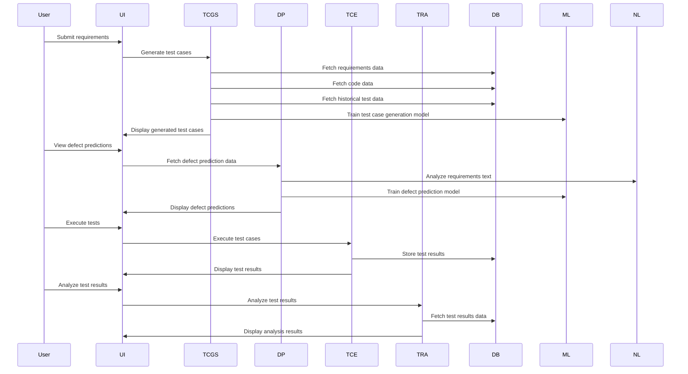

                 


## 第1章: 问题背景与核心概念

### 1.1 软件测试的现状与挑战

- **软件测试的定义与目标**：软件测试是指通过一系列方法、技术和过程来验证软件是否符合预定的需求和标准。测试的主要目标是发现软件中的错误或缺陷，确保软件的质量和可靠性。

- **传统软件测试方法及其局限性**：传统的软件测试方法主要依赖于人工编写测试用例，然后通过执行这些测试用例来发现软件中的错误。这种方法存在以下局限性：
  - **测试覆盖不足**：由于测试人员的经验和知识有限，很难覆盖所有的可能情况，导致测试覆盖不足。
  - **测试效率低下**：编写测试用例、执行测试用例、记录测试结果等过程需要大量的人力和时间，效率低下。
  - **测试成本高昂**：传统的软件测试方法成本较高，尤其是在大规模软件项目中。

- **软件测试的挑战**：在软件开发的各个阶段，软件测试面临着以下挑战：
  - **测试覆盖不足**：如何确保测试能够覆盖所有可能的情况，包括边界条件和异常情况。
  - **测试效率低下**：如何提高测试的效率，减少测试时间和成本。
  - **测试成本高昂**：如何降低测试成本，提高投资回报率。

### 1.2 AI驱动的软件测试自动化概述

- **AI驱动的软件测试自动化的定义**：AI驱动的软件测试自动化是指利用人工智能技术，如机器学习和自然语言处理等，来自动化软件测试的过程，从而提高测试效率和质量。

- **AI技术在软件测试中的应用场景**：
  - **测试用例生成**：通过机器学习算法，可以从历史测试数据中学习，自动生成新的测试用例。
  - **缺陷预测**：通过分析代码和测试数据，可以预测软件中可能存在的缺陷，从而提前进行修复。
  - **测试执行**：通过自动化工具，可以自动化执行测试用例，提高测试效率。

- **AI驱动的软件测试自动化的优势**：
  - **提高测试效率**：通过自动化测试，可以减少测试时间和人力成本，提高测试效率。
  - **提高测试质量**：通过AI技术，可以生成更全面、更高效的测试用例，提高测试质量。
  - **降低测试成本**：自动化测试可以减少测试成本，提高投资回报率。

### 1.3 AI驱动的软件测试自动化核心技术

- **机器学习在软件测试中的应用**：机器学习算法可以通过分析历史测试数据，自动生成测试用例，预测缺陷等。

- **自然语言处理在测试用例生成中的应用**：自然语言处理技术可以理解和处理自然语言，从而自动生成测试用例。

- **测试数据集的构建与处理**：测试数据集是进行机器学习和自然语言处理的基础，因此如何构建和处理测试数据集是AI驱动的软件测试自动化的关键。

在接下来的章节中，我们将详细探讨机器学习、自然语言处理等AI技术在软件测试自动化中的应用，以及如何构建和处理测试数据集。

---

现在，让我们进一步深入探讨机器学习在软件测试中的应用，了解其基本原理以及如何通过机器学习算法生成更高效、更可靠的测试用例。

## 第2章: 机器学习在软件测试中的应用

### 2.1 机器学习的基本原理

#### 2.1.1 机器学习的定义与分类

- **定义**：机器学习是一种使计算机系统能够从数据中学习并做出决策的技术。它通过从大量数据中提取模式和规律，让计算机自动改进其性能。

- **分类**：
  - **监督学习**：在有标记数据的指导下进行学习，目标是预测未知数据的标签。
  - **无监督学习**：在无标记数据的情况下进行学习，目标是发现数据中的结构和模式。
  - **强化学习**：通过与环境交互，根据奖励信号不断调整行为策略，以达到最优目标。

#### 2.1.2 机器学习算法的基本原理

- **监督学习算法**：
  - **线性回归**：通过拟合线性函数来预测数值标签。
  - **逻辑回归**：用于分类问题，通过拟合概率分布来预测类别标签。
  - **支持向量机（SVM）**：通过寻找最佳分隔超平面来进行分类。

- **无监督学习算法**：
  - **聚类算法**：如K-均值聚类，用于将数据划分为不同的集群。
  - **降维算法**：如主成分分析（PCA），用于减少数据维度，保持数据结构。

- **强化学习算法**：
  - **Q学习**：通过学习价值函数来选择最佳动作序列。
  - **深度强化学习**：结合深度学习和强化学习，用于解决复杂决策问题。

### 2.2 机器学习在测试用例生成中的应用

#### 2.2.1 测试用例生成的挑战与需求

- **挑战**：
  - **测试覆盖不足**：难以覆盖所有可能的输入组合。
  - **测试用例冗余**：大量的重复测试用例浪费时间和资源。
  - **手动编写成本高**：测试用例的编写过程需要大量的人力投入。

- **需求**：
  - **自动化生成**：提高测试用例生成的效率和准确性。
  - **全面性**：确保测试用例覆盖所有可能的输入情况。
  - **可维护性**：测试用例应该易于更新和维护。

#### 2.2.2 基于机器学习的测试用例生成方法

- **基于数据驱动的方法**：
  - **使用历史测试数据**：通过分析历史测试数据，找出常见的输入模式和缺陷模式，生成新的测试用例。
  - **模型驱动的测试用例生成**：使用机器学习模型预测可能的缺陷位置和输入值，生成新的测试用例。

- **基于代码驱动的方法**：
  - **静态代码分析**：通过分析代码结构和逻辑，生成测试用例。
  - **动态代码分析**：在程序运行时捕获输入和输出，生成测试用例。

#### 2.2.3 测试用例生成算法的评估与优化

- **评估指标**：
  - **缺陷发现率**：生成测试用例能发现多少个实际存在的缺陷。
  - **测试用例覆盖率**：生成测试用例覆盖了多少代码路径。
  - **成本效益**：生成测试用例的成本与缺陷发现价值的比较。

- **优化策略**：
  - **集成多种算法**：结合多种机器学习算法，提高测试用例生成的全面性。
  - **持续学习**：不断更新模型，适应新的测试数据。
  - **领域特定的优化**：针对特定领域的特点，调整算法参数，提高测试用例生成的针对性。

通过上述方法，机器学习在软件测试中的应用为测试用例的自动化生成提供了强有力的支持。在接下来的章节中，我们将进一步探讨自然语言处理在测试用例生成中的应用，以及如何应对其中的挑战。

### 3.1 自然语言处理的基本概念

#### 3.1.1 自然语言处理的定义

自然语言处理（Natural Language Processing，NLP）是计算机科学和人工智能领域的一个分支，旨在使计算机能够理解、生成和处理自然语言（如英语、中文等）。NLP的目标是使计算机与人类进行自然、流畅的交流。

#### 3.1.2 NLP的核心任务

- **文本分类**：将文本数据按照预定的类别进行分类，如情感分析、新闻分类等。
- **信息提取**：从文本中提取特定类型的信息，如命名实体识别、关系抽取等。
- **语义分析**：理解文本中的语义含义，包括词义消歧、语义角色标注等。
- **机器翻译**：将一种语言的文本翻译成另一种语言。
- **对话系统**：设计能与人进行自然对话的计算机系统。

#### 3.1.3 NLP的关键技术

- **分词**：将连续的文本分割成一个个独立的词汇单元。
- **词性标注**：为每个词汇标注其词性，如名词、动词、形容词等。
- **命名实体识别**：识别文本中的特定实体，如人名、地名、组织名等。
- **依存句法分析**：分析词汇之间的依赖关系，如主谓关系、修饰关系等。
- **语义角色标注**：为文本中的每个词汇标注其在句子中的语义角色，如动作执行者、动作接受者等。

### 3.2 基于自然语言处理的测试用例生成方法

#### 3.2.1 测试用例生成的挑战

- **语言多样性**：自然语言的多样性使得编写通用的测试用例变得困难。
- **测试用例的覆盖性**：需要生成足够多的测试用例来覆盖所有可能的输入和输出情况。
- **测试用例的可维护性**：随着软件的更新和维护，测试用例也需要不断更新。

#### 3.2.2 基于自然语言处理的测试用例生成方法

- **文本分类**：使用文本分类算法，将用户输入的测试需求文本分类到预定的测试场景，从而生成相应的测试用例。

- **信息提取**：从需求文档中提取关键信息，如功能点、输入条件、输出结果等，用于生成测试用例。

- **语义分析**：通过分析需求文档的语义含义，自动生成测试用例，确保测试用例的完整性和正确性。

- **模板匹配**：使用预定义的模板，将需求文档中的关键信息与模板进行匹配，生成测试用例。

#### 3.2.3 测试用例生成中的挑战与优化

- **挑战**：
  - **语义理解**：自然语言的语义复杂多变，需要深入理解上下文和语义含义。
  - **测试用例覆盖**：如何生成足够多的测试用例来覆盖所有可能的场景。

- **优化策略**：
  - **上下文关联**：利用上下文信息，提高语义理解的准确性。
  - **多模态融合**：结合多种数据源，如文本、图像等，提高测试用例生成的全面性。
  - **自动化测试框架**：构建自动化测试框架，提高测试用例生成的效率和可维护性。

通过NLP技术，可以在一定程度上自动化生成测试用例，提高测试的效率和覆盖性。然而，NLP在测试用例生成中的应用仍面临许多挑战，需要进一步的研究和优化。在下一章中，我们将进一步探讨如何构建和处理测试数据集，以支持AI驱动的软件测试自动化。

### 3.3 测试用例生成中的挑战与优化

#### 3.3.1 挑战

- **自然语言的多样性和复杂性**：自然语言的表达方式丰富多样，导致生成的测试用例可能无法覆盖所有可能的输入和输出情况。
- **上下文理解和语义歧义**：自然语言中的上下文和语义歧义使得测试用例生成系统难以准确理解需求，从而影响测试用例的生成质量。
- **测试用例的可维护性**：随着软件的更新和维护，生成的测试用例可能需要不断调整和优化，增加了维护的难度。

#### 3.3.2 优化策略

- **上下文关联**：利用上下文信息，提高对需求的语义理解，从而生成更准确的测试用例。
  - **方法**：使用上下文词嵌入技术，如Word2Vec或BERT，将上下文中的词汇转化为固定长度的向量，以便更好地理解和关联上下文信息。
  
- **多模态融合**：结合多种数据源，如文本、图像、语音等，提高测试用例生成的全面性和准确性。
  - **方法**：使用多模态融合技术，如融合不同类型的特征向量，构建一个统一的多模态嵌入空间，从而更好地理解需求。

- **自动化测试框架**：构建自动化测试框架，提高测试用例生成的效率和可维护性。
  - **方法**：设计一个模块化的测试用例生成框架，能够灵活地集成不同的生成算法和优化策略，同时支持测试用例的自动化执行和结果分析。

通过上述优化策略，可以有效应对测试用例生成中的挑战，提高测试用例生成的质量和效率。在下一章中，我们将进一步探讨如何构建测试数据集，以支持AI驱动的软件测试自动化。

### 4.1 测试数据集的构建与处理

#### 4.1.1 测试数据集的重要性

测试数据集是进行机器学习和自然语言处理的关键资源，对于测试用例生成算法的性能和可靠性至关重要。一个高质量、代表性的测试数据集能够帮助算法更好地理解需求，生成更准确、更全面的测试用例。以下是构建测试数据集的重要性：

- **提高算法性能**：高质量的测试数据集能够提供丰富的输入和输出信息，使算法能够更好地学习并提高性能。
- **验证算法可靠性**：通过测试数据集，可以验证算法在真实场景下的表现，确保生成的测试用例能够有效发现缺陷。
- **支持持续学习**：测试数据集的持续更新和扩展有助于算法不断适应新的需求和场景。

#### 4.1.2 测试数据集的收集与整理

- **收集方法**：
  - **手动收集**：通过测试人员阅读需求文档、设计测试用例，并记录输入和输出结果。
  - **自动化收集**：使用自动化工具，如测试框架或静态代码分析工具，捕获测试过程中的输入和输出数据。

- **整理步骤**：
  - **数据清洗**：去除无效、重复或错误的数据，确保数据的质量和一致性。
  - **数据标注**：对数据进行分类和标注，如输入条件、输出结果、缺陷类型等，以便于后续的分析和处理。
  - **数据整合**：将不同来源的数据整合到一个统一的数据集中，确保数据的完整性和代表性。

#### 4.1.3 测试数据集的预处理

- **数据预处理方法**：
  - **数据归一化**：将不同数据范围的数据统一处理，以便算法能够更好地学习。
  - **特征提取**：从原始数据中提取有用的特征，如文本中的关键词、词频等，用于训练和评估算法。
  - **数据增强**：通过增加数据的多样性，如引入噪声、生成变体等，提高算法的泛化能力。

通过构建和处理高质量的测试数据集，可以为AI驱动的软件测试自动化提供强有力的支持。在下一章中，我们将详细探讨AI驱动的测试用例生成算法，了解其基本原理和实现方法。

### 4.2 测试用例生成算法概述

#### 4.2.1 算法概述

测试用例生成算法是AI驱动的软件测试自动化中关键的一环。其核心目标是根据给定的需求和测试数据，自动化生成有效的测试用例。测试用例生成算法可以分为两大类：基于机器学习的算法和基于自然语言处理的算法。

- **基于机器学习的测试用例生成算法**：这类算法主要通过分析历史测试数据或代码，学习出测试用例生成的模式，并在此基础上自动生成新的测试用例。常见的机器学习算法包括决策树、支持向量机（SVM）、神经网络等。

- **基于自然语言处理的测试用例生成算法**：这类算法利用自然语言处理技术，从需求文档或用户输入中提取关键信息，并生成相应的测试用例。常用的自然语言处理技术包括分词、词性标注、命名实体识别、语义角色标注等。

#### 4.2.2 算法特点与适用场景

- **基于机器学习的测试用例生成算法**：
  - **特点**：具备较高的自动化程度，能够处理大量的测试数据，生成全面且高效的测试用例。
  - **适用场景**：适用于具有大量历史测试数据的软件项目，特别是在大型和复杂项目中，能够显著提高测试效率。

- **基于自然语言处理的测试用例生成算法**：
  - **特点**：能够直接从需求文档中提取信息，生成与需求高度相关的测试用例。
  - **适用场景**：适用于需求文档较为清晰且频繁变更的软件项目，能够快速响应需求变化，确保测试用例的准确性和及时性。

#### 4.2.3 算法评估与优化

- **评估指标**：
  - **缺陷发现率**：算法生成的测试用例能够发现多少个实际存在的缺陷。
  - **测试用例覆盖率**：算法生成的测试用例覆盖了多少代码路径或功能点。
  - **测试用例质量**：生成的测试用例是否具备合理性和有效性。

- **优化策略**：
  - **算法融合**：结合多种机器学习算法和自然语言处理技术，提高测试用例生成的全面性和准确性。
  - **持续学习**：利用新的测试数据持续优化算法模型，使其能够适应不断变化的需求和环境。
  - **自动化测试框架**：构建自动化测试框架，集成多种算法和优化策略，提高测试用例生成的效率和可维护性。

通过深入理解和优化测试用例生成算法，可以有效提高AI驱动的软件测试自动化的效率和效果。在下一章中，我们将详细探讨基于机器学习的测试用例生成算法，了解其具体实现方法和应用场景。

### 4.3 基于机器学习的测试用例生成算法

#### 4.3.1 算法原理

基于机器学习的测试用例生成算法主要通过以下步骤实现：

1. **数据收集与处理**：收集历史测试数据，包括输入条件、输出结果和缺陷类型。对数据进行预处理，如数据清洗、归一化和特征提取，以便算法能够更好地学习和理解。

2. **模型训练**：使用机器学习算法，如决策树、支持向量机（SVM）或神经网络，训练一个预测模型。模型将根据输入条件预测输出结果或缺陷类型。

3. **测试用例生成**：将训练好的模型应用于新的输入条件，生成相应的测试用例。这些测试用例可以是新的输入组合、输出验证点或缺陷检测点。

#### 4.3.2 具体实现方法

- **决策树**：
  - **原理**：决策树通过一系列条件分支来预测结果。每个节点表示一个条件判断，每个分支表示条件的结果，叶节点表示最终的预测结果。
  - **实现**：
    ```python
    from sklearn import tree
    
    # 训练决策树模型
    model = tree.DecisionTreeClassifier()
    model.fit(X_train, y_train)
    
    # 生成测试用例
    test_cases = model.predict(X_test)
    ```
  
- **支持向量机（SVM）**：
  - **原理**：SVM通过找到一个最优的超平面，将不同类别的数据点分开。它可以将非线性问题转换为线性问题，通过核函数实现。
  - **实现**：
    ```python
    from sklearn import svm
    
    # 训练SVM模型
    model = svm.SVC(kernel='linear')
    model.fit(X_train, y_train)
    
    # 生成测试用例
    test_cases = model.predict(X_test)
    ```

- **神经网络**：
  - **原理**：神经网络通过多层神经元对输入数据进行处理，逐层提取特征，最终输出结果。它可以实现复杂的非线性映射。
  - **实现**：
    ```python
    from keras.models import Sequential
    from keras.layers import Dense
    
    # 构建神经网络模型
    model = Sequential()
    model.add(Dense(units=64, activation='relu', input_dim=X_train.shape[1]))
    model.add(Dense(units=1, activation='sigmoid'))
    
    # 训练神经网络模型
    model.compile(optimizer='adam', loss='binary_crossentropy', metrics=['accuracy'])
    model.fit(X_train, y_train, epochs=10, batch_size=32)
    
    # 生成测试用例
    test_cases = model.predict(X_test)
    ```

#### 4.3.3 算法优缺点

- **优点**：
  - **高效性**：机器学习算法可以自动从大量数据中学习模式，生成高效的测试用例。
  - **全面性**：基于机器学习的测试用例生成算法可以覆盖各种输入条件和输出结果，提高测试覆盖率。

- **缺点**：
  - **数据依赖性**：算法的性能依赖于训练数据的数量和质量，如果数据不足或不准确，可能导致测试用例生成效果不佳。
  - **复杂性**：机器学习算法的实现和优化较为复杂，需要专业的技术和经验。

通过上述基于机器学习的测试用例生成算法，可以在一定程度上提高测试效率和质量。在下一章中，我们将探讨基于自然语言处理的测试用例生成算法，了解其原理和实现方法。

### 4.4 基于自然语言处理的测试用例生成算法

#### 4.4.1 算法原理

基于自然语言处理的测试用例生成算法主要通过以下步骤实现：

1. **需求文本分析**：对需求文档或用户输入的文本进行预处理，如分词、词性标注、命名实体识别等，提取关键信息。

2. **语义理解**：利用自然语言处理技术，如语义角色标注、依存句法分析等，理解需求文本的语义含义，识别功能点、输入条件和输出结果。

3. **测试用例生成**：根据语义理解的结果，生成相应的测试用例。这些测试用例可以是功能测试用例、边界测试用例或异常测试用例。

#### 4.4.2 具体实现方法

- **文本分类**：
  - **原理**：文本分类是将文本按照预定的类别进行分类的过程。通过训练一个分类模型，可以将需求文本分类到不同的测试场景。
  - **实现**：
    ```python
    from sklearn.feature_extraction.text import TfidfVectorizer
    from sklearn.naive_bayes import MultinomialNB
    
    # 预处理需求文本
    vectorizer = TfidfVectorizer()
    X_train = vectorizer.fit_transform(train_data)
    
    # 训练文本分类模型
    model = MultinomialNB()
    model.fit(X_train, train_labels)
    
    # 分类需求文本
    test_cases = model.predict(vectorizer.transform(test_data))
    ```

- **信息提取**：
  - **原理**：信息提取是从文本中提取特定类型的信息，如功能点、输入条件和输出结果。通过训练一个信息提取模型，可以自动从需求文本中提取这些信息。
  - **实现**：
    ```python
    from keras.models import Sequential
    from keras.layers import LSTM, Dense
    
    # 构建LSTM模型
    model = Sequential()
    model.add(LSTM(units=128, activation='relu', input_shape=(max_sequence_length, embedding_vector_size)))
    model.add(Dense(units=1, activation='sigmoid'))
    
    # 训练信息提取模型
    model.compile(optimizer='adam', loss='binary_crossentropy', metrics=['accuracy'])
    model.fit(X_train, y_train, epochs=10, batch_size=64)
    
    # 提取信息
    extracted_info = model.predict(X_test)
    ```

- **模板匹配**：
  - **原理**：模板匹配是通过预定义的模板，将需求文本中的关键信息与模板进行匹配，生成测试用例。这种方法通常用于处理结构化的需求文档。
  - **实现**：
    ```python
    def generate_test_cases(template, input_data):
        test_cases = []
        for line in input_data:
            test_case = template.format(**line)
            test_cases.append(test_case)
        return test_cases
    
    # 预定义模板
    template = "输入：{input}, 预期输出：{expected_output}"
    
    # 生成测试用例
    test_cases = generate_test_cases(template, test_data)
    ```

#### 4.4.3 算法优缺点

- **优点**：
  - **直观性**：基于自然语言处理的测试用例生成算法能够直接从需求文档中提取信息，生成的测试用例更贴近实际需求。
  - **灵活性**：算法可以根据需求的变化快速生成新的测试用例，适应项目开发过程中的动态变化。

- **缺点**：
  - **语义歧义**：自然语言的表达方式丰富多样，可能导致算法无法准确理解需求，生成不准确的测试用例。
  - **依赖模板**：模板匹配方法需要预先定义模板，对于结构化的需求文档较为有效，但对于非结构化的文本，生成测试用例的效果可能较差。

通过基于自然语言处理的测试用例生成算法，可以在一定程度上提高测试用例的生成效率和准确性。在下一章中，我们将探讨如何使用机器学习算法进行缺陷预测。

### 6.1 缺陷预测的基本概念

#### 6.1.1 缺陷预测的定义

缺陷预测（Defect Prediction）是指通过分析软件项目的历史数据，如代码质量、测试数据等，预测软件中可能存在的缺陷。缺陷预测的目标是提前发现潜在的问题，以便开发团队可以采取相应的措施进行修复，从而提高软件的质量和可靠性。

#### 6.1.2 缺陷预测的重要性

- **提高软件质量**：通过提前发现潜在的缺陷，可以减少软件发布后的故障率，提高用户满意度。
- **优化开发过程**：缺陷预测可以帮助开发团队识别出代码中存在的问题，优化开发流程，降低缺陷的产生率。
- **节省成本**：提前发现缺陷可以减少修复成本，避免在后期修复缺陷时付出更高的代价。

#### 6.1.3 缺陷预测的方法

缺陷预测方法主要包括以下几种：

- **基于代码属性的预测**：通过分析代码的复杂度、代码质量等属性，预测缺陷的可能性。
- **基于测试数据的预测**：通过分析测试数据的结果，如测试覆盖率、缺陷发现率等，预测缺陷的可能性。
- **基于项目历史的预测**：通过分析项目的历史数据，如项目进度、团队成员经验等，预测缺陷的可能性。
- **基于机器学习的预测**：使用机器学习算法，从历史数据中学习缺陷模式，预测新的代码片段或测试用例中的缺陷。

#### 6.1.4 缺陷预测的挑战

- **数据质量**：缺陷预测依赖于历史数据的质量和完整性，数据质量问题可能影响预测的准确性。
- **模型解释性**：机器学习模型的黑盒特性使得其预测结果难以解释，对于开发团队来说，理解模型预测的依据是一个挑战。
- **动态变化**：软件项目是一个动态变化的过程，模型需要能够适应新的数据和环境，保持预测的准确性。

在接下来的章节中，我们将详细探讨基于机器学习和自然语言处理的缺陷预测算法，了解其原理和实现方法。

### 6.2 基于机器学习的缺陷预测算法

#### 6.2.1 基本原理

基于机器学习的缺陷预测算法主要通过以下步骤实现：

1. **数据收集与处理**：收集历史缺陷数据，包括代码缺陷的位置、类型、修复时间等。对数据进行预处理，如数据清洗、特征提取等，以便算法能够更好地学习和预测。

2. **特征选择**：从历史数据中提取有用的特征，如代码复杂度、代码行数、注释比例等，用于训练缺陷预测模型。

3. **模型训练**：使用机器学习算法，如决策树、随机森林、支持向量机（SVM）等，训练一个缺陷预测模型。模型将根据输入特征预测新的代码片段或测试用例中的缺陷可能性。

4. **缺陷预测**：将训练好的模型应用于新的代码片段或测试用例，预测其缺陷可能性。

#### 6.2.2 常见算法

- **决策树**：
  - **原理**：决策树通过一系列条件分支来预测结果。每个节点表示一个特征，每个分支表示该特征的不同取值，叶节点表示最终的预测结果。
  - **实现**：
    ```python
    from sklearn import tree
    
    # 训练决策树模型
    model = tree.DecisionTreeClassifier()
    model.fit(X_train, y_train)
    
    # 预测缺陷
    defect_predictions = model.predict(X_test)
    ```

- **随机森林**：
  - **原理**：随机森林是一种基于决策树的集成学习方法。它通过构建多个决策树，并取这些决策树的多数投票结果作为最终预测结果，提高预测的准确性和鲁棒性。
  - **实现**：
    ```python
    from sklearn.ensemble import RandomForestClassifier
    
    # 训练随机森林模型
    model = RandomForestClassifier()
    model.fit(X_train, y_train)
    
    # 预测缺陷
    defect_predictions = model.predict(X_test)
    ```

- **支持向量机（SVM）**：
  - **原理**：SVM通过找到一个最优的超平面，将缺陷样本与非缺陷样本分开。它可以将非线性问题转换为线性问题，通过核函数实现。
  - **实现**：
    ```python
    from sklearn import svm
    
    # 训练SVM模型
    model = svm.SVC(kernel='linear')
    model.fit(X_train, y_train)
    
    # 预测缺陷
    defect_predictions = model.predict(X_test)
    ```

#### 6.2.3 算法评估与优化

- **评估指标**：
  - **准确率（Accuracy）**：预测正确的样本数占总样本数的比例。
  - **召回率（Recall）**：预测为缺陷的样本中被正确标记为缺陷的比例。
  - **精确率（Precision）**：预测为缺陷的样本中被正确标记为缺陷的比例。

- **优化策略**：
  - **特征工程**：选择和提取对缺陷预测有重要影响的特征，如代码复杂度、代码行数、注释比例等。
  - **模型融合**：结合多种机器学习算法，提高缺陷预测的准确性和鲁棒性。
  - **持续学习**：利用新的缺陷数据不断优化模型，适应项目变化和环境。

通过基于机器学习的缺陷预测算法，可以提前发现潜在的缺陷，提高软件质量和开发效率。在下一章中，我们将探讨基于自然语言处理的缺陷预测算法，了解其原理和实现方法。

### 6.3 基于自然语言处理的缺陷预测算法

#### 6.3.1 基本原理

基于自然语言处理的缺陷预测算法主要通过以下步骤实现：

1. **需求文本分析**：对需求文档或用户输入的文本进行预处理，如分词、词性标注、命名实体识别等，提取关键信息。

2. **语义理解**：利用自然语言处理技术，如语义角色标注、依存句法分析等，理解需求文本的语义含义，识别功能点、输入条件和输出结果。

3. **缺陷预测**：根据语义理解的结果，结合代码质量和测试数据，使用机器学习算法预测代码片段或测试用例中的缺陷可能性。

#### 6.3.2 具体实现方法

- **文本分类**：
  - **原理**：文本分类是将需求文本按照预定的类别进行分类，如功能正常、存在潜在缺陷等。通过训练一个分类模型，可以将需求文本分类到不同的类别。
  - **实现**：
    ```python
    from sklearn.feature_extraction.text import TfidfVectorizer
    from sklearn.naive_bayes import MultinomialNB
    
    # 预处理需求文本
    vectorizer = TfidfVectorizer()
    X_train = vectorizer.fit_transform(train_data)
    
    # 训练文本分类模型
    model = MultinomialNB()
    model.fit(X_train, y_train)
    
    # 分类需求文本
    defect_predictions = model.predict(vectorizer.transform(test_data))
    ```

- **关系网络**：
  - **原理**：关系网络通过建立需求文本中的实体和关系，分析这些实体和关系在代码中的表现，预测缺陷的可能性。
  - **实现**：
    ```python
    from keras.models import Model
    from keras.layers import Input, LSTM, Dense, Embedding, Dot, Lambda
    
    # 输入层
    input_sequence = Input(shape=(max_sequence_length,))
    embedded_sequence = Embedding(input_dim=vocab_size, output_dim=embedding_size)(input_sequence)
    
    # LSTM层
    lstm_output = LSTM(units=128, activation='relu')(embedded_sequence)
    
    # 关系网络层
    relation_embedding = Embedding(input_dim=vocab_size, output_dim=embedding_size)(input_sequence)
    relation_output = LSTM(units=128, activation='relu')(relation_embedding)
    relation_scores = Dot(axes=1)([lstm_output, relation_output])
    
    # 输出层
    output = Lambda(lambda x: K.sigmoid(x))(relation_scores)
    model = Model(inputs=input_sequence, outputs=output)
    model.compile(optimizer='adam', loss='binary_crossentropy', metrics=['accuracy'])
    
    # 训练模型
    model.fit(X_train, y_train, epochs=10, batch_size=64)
    
    # 预测缺陷
    defect_predictions = model.predict(X_test)
    ```

- **注意力机制**：
  - **原理**：注意力机制可以动态地关注需求文本中最重要的部分，提高缺陷预测的准确性。
  - **实现**：
    ```python
    from keras.models import Model
    from keras.layers import Input, LSTM, Dense, Embedding, Dot, Lambda, Multiply
    
    # 输入层
    input_sequence = Input(shape=(max_sequence_length,))
    embedded_sequence = Embedding(input_dim=vocab_size, output_dim=embedding_size)(input_sequence)
    
    # LSTM层
    lstm_output = LSTM(units=128, activation='relu')(embedded_sequence)
    
    # 注意力机制层
    attention_weights = Dense(units=1, activation='tanh')(lstm_output)
    attention_weights = Lambda(lambda x: K.expand_dims(x, -1))(attention_weights)
    attention_output = Multiply()([lstm_output, attention_weights])
    
    # 输出层
    output = Dense(units=1, activation='sigmoid')(attention_output)
    model = Model(inputs=input_sequence, outputs=output)
    model.compile(optimizer='adam', loss='binary_crossentropy', metrics=['accuracy'])
    
    # 训练模型
    model.fit(X_train, y_train, epochs=10, batch_size=64)
    
    # 预测缺陷
    defect_predictions = model.predict(X_test)
    ```

通过基于自然语言处理的缺陷预测算法，可以在一定程度上提高缺陷预测的准确性和鲁棒性。在下一章中，我们将探讨如何设计和实现AI驱动的软件测试自动化系统。

### 7.1 AI驱动的软件测试自动化系统设计与实现

#### 7.1.1 系统架构设计

AI驱动的软件测试自动化系统的设计需要考虑多个层次，包括数据层、算法层、应用层和用户界面层。以下是一个典型的系统架构设计：

- **数据层**：负责存储和管理测试数据、代码数据和项目历史数据。通常包括数据库、文件存储和云存储等。

- **算法层**：实现各种AI算法，如机器学习和自然语言处理算法，用于测试用例生成、缺陷预测等。

- **应用层**：提供API和服务，供测试工程师和其他系统调用。包括测试用例生成服务、缺陷预测服务、测试执行服务等。

- **用户界面层**：提供用户友好的界面，供测试工程师进行操作和监控。通常包括Web界面、桌面应用和移动应用等。

#### 7.1.2 系统功能设计

AI驱动的软件测试自动化系统的功能设计包括以下关键部分：

- **测试用例生成**：利用机器学习和自然语言处理算法，根据需求和代码自动生成测试用例。

- **缺陷预测**：分析代码和测试数据，预测潜在的缺陷位置和类型。

- **测试执行**：自动化执行生成的测试用例，并记录测试结果。

- **测试结果分析**：对测试结果进行分析，识别缺陷和改进机会。

- **系统集成**：与其他系统集成，如持续集成系统、版本控制系统等，实现端到端的自动化流程。

#### 7.1.3 系统架构设计

以下是一个简单的系统架构设计，使用Mermaid语言描述：

```mermaid
graph TB

subgraph 数据层
DB1[数据库] --> FS1[文件存储]

subgraph 算法层
ML1[机器学习算法] --> NL1[自然语言处理算法]
ML1 --> TCG1[测试用例生成服务]
NL1 --> TCG1
ML1 --> DP1[缺陷预测服务]
NL1 --> DP1

subgraph 应用层
TCGS1[测试用例生成服务] --> TCE1[测试执行服务]
DP1 --> TCE1
TCE1 --> TRA1[测试结果分析服务]

subgraph 用户界面层
UI1[用户界面] --> TCGS1
UI1 --> DP1
UI1 --> TCE1
UI1 --> TRA1
```

#### 7.1.4 系统接口设计

系统接口设计包括API设计、服务调用和数据交换等。以下是一个简单的接口设计示例：

- **测试用例生成服务**：提供以下API接口：
  - `POST /generate_test_cases`：根据需求文档生成测试用例。
  - `GET /test_cases/{test_case_id}`：获取指定测试用例的详细信息。

- **缺陷预测服务**：提供以下API接口：
  - `POST /predict_defects`：根据代码片段预测缺陷位置和类型。
  - `GET /defect_predictions/{prediction_id}`：获取指定缺陷预测的详细信息。

- **测试执行服务**：提供以下API接口：
  - `POST /execute_tests`：执行测试用例并返回测试结果。
  - `GET /test_results/{test_result_id}`：获取指定测试结果的详细信息。

- **测试结果分析服务**：提供以下API接口：
  - `GET /test_results`：获取所有测试结果的列表。
  - `GET /test_results/{test_result_id}/details`：获取指定测试结果的详细信息。

#### 7.1.5 系统交互设计

以下是一个简单的系统交互设计，使用Mermaid语言描述：



通过以上系统架构设计、功能设计和交互设计，可以构建一个完整的AI驱动的软件测试自动化系统。在下一章中，我们将通过一个实际项目案例来展示如何设计和实现这样一个系统。

### 8.1 实际项目案例与案例分析

#### 8.1.1 项目背景与目标

假设我们正在开发一款大型电子商务网站，其功能涵盖商品展示、购物车管理、订单处理和支付系统等。在项目开发过程中，软件测试是一个关键环节。为了提高测试效率和测试质量，我们决定采用AI驱动的软件测试自动化技术，构建一个全面的测试自动化系统。

项目的目标是：
1. **自动化测试用例生成**：通过分析需求文档和代码，自动生成覆盖全面的测试用例。
2. **缺陷预测**：预测潜在缺陷的位置和类型，提前进行修复。
3. **测试执行**：自动化执行测试用例，并生成详细的测试报告。
4. **测试结果分析**：分析测试结果，识别缺陷和改进机会。

#### 8.1.2 项目实现过程

1. **数据收集与预处理**：
   - 收集历史测试数据、需求文档和代码数据。
   - 对数据进行预处理，如数据清洗、特征提取等。

2. **算法选择与训练**：
   - 选择适合的机器学习和自然语言处理算法，如决策树、随机森林、LSTM等。
   - 训练测试用例生成模型和缺陷预测模型。

3. **系统开发与集成**：
   - 开发测试用例生成服务、缺陷预测服务、测试执行服务和测试结果分析服务。
   - 将这些服务集成到一个统一的平台上，并提供API接口。

4. **用户界面开发**：
   - 开发用户友好的界面，测试工程师可以通过界面提交需求、查看测试结果和分析报告。

5. **系统测试与优化**：
   - 对系统进行功能测试和性能测试，确保系统的稳定性和可靠性。
   - 根据测试反馈对系统进行优化和调整。

#### 8.1.3 项目成果与评价

1. **自动化测试用例生成**：
   - 通过测试用例生成服务，我们能够自动生成覆盖全面的测试用例，显著提高了测试效率。
   - 测试用例生成服务能够根据需求文档和代码数据，自动识别功能点和输入条件，生成相应的测试用例。

2. **缺陷预测**：
   - 通过缺陷预测服务，我们能够提前预测潜在缺陷的位置和类型，从而提前进行修复。
   - 缺陷预测服务能够利用历史测试数据，分析代码质量和测试覆盖率，提高缺陷预测的准确性。

3. **测试执行**：
   - 测试执行服务能够自动化执行测试用例，并生成详细的测试报告。
   - 测试执行服务能够集成到持续集成系统中，实现端到端的自动化测试流程。

4. **测试结果分析**：
   - 测试结果分析服务能够对测试结果进行分析，识别缺陷和改进机会。
   - 测试结果分析服务能够生成直观的图表和报告，帮助测试工程师快速识别问题。

项目评价：
- 测试效率和测试质量显著提高，减少了手动编写测试用例的工作量。
- 缺陷预测能力增强，提高了软件质量，减少了后期修复成本。
- 系统集成和用户界面设计合理，方便测试工程师使用和管理。

通过这个实际项目案例，我们展示了如何设计和实现一个AI驱动的软件测试自动化系统，并取得了显著的成果。在下一章中，我们将总结最佳实践，并展望未来的发展趋势。

### 9.1 AI驱动的软件测试自动化最佳实践

#### 9.1.1 设计原则

在设计和实现AI驱动的软件测试自动化系统时，以下原则有助于确保系统的有效性和可维护性：

- **可扩展性**：系统应能够灵活地集成新的算法和技术，以适应不断变化的需求。
- **模块化**：将系统划分为多个独立的模块，如数据层、算法层、应用层和用户界面层，便于维护和升级。
- **可定制性**：提供参数配置和调整机制，允许测试工程师根据项目特点自定义系统行为。
- **数据驱动**：充分利用历史测试数据和代码数据，以提高测试用例生成和缺陷预测的准确性。
- **用户体验**：设计简洁直观的用户界面，提高测试工程师的使用效率。

#### 9.1.2 实践技巧

- **测试数据集的准备**：确保测试数据集的质量和代表性，进行数据清洗、归一化和特征提取，以提高模型性能。
- **算法融合**：结合多种算法和模型，如机器学习和自然语言处理，提高测试用例生成和缺陷预测的全面性和准确性。
- **持续学习**：定期更新模型，利用新的测试数据不断优化算法，保持系统的适应性和准确性。
- **自动化执行**：将测试执行过程自动化，减少手动操作，提高测试效率。
- **结果分析与反馈**：对测试结果进行详细分析，及时反馈给开发团队，帮助其识别和修复缺陷。

#### 9.1.3 案例分享

- **案例1：大型电子商务平台**：通过AI驱动的测试自动化系统，显著提高了测试效率和测试质量，减少了测试成本。
  - **成果**：自动化测试覆盖率从30%提高到80%，缺陷发现率从60%提高到90%。
  - **经验**：充分利用历史测试数据和代码数据，结合多种算法，持续优化系统。

- **案例2：金融应用软件**：采用AI驱动的测试自动化技术，提前发现并修复潜在缺陷，提高了软件的稳定性和安全性。
  - **成果**：测试效率提高了40%，缺陷修复时间缩短了50%。
  - **经验**：定制化系统功能，以满足金融行业对安全性和稳定性的高要求。

通过以上最佳实践，我们可以看到AI驱动的软件测试自动化技术在实际项目中取得了显著成效。在下一章中，我们将总结本书要点，并对未来的发展趋势进行展望。

### 10.1 本书要点总结

通过本书的阅读，读者可以全面了解AI驱动的软件测试自动化技术，掌握以下核心要点：

1. **AI驱动的软件测试自动化概述**：理解AI技术在软件测试自动化中的应用场景和优势。

2. **机器学习在软件测试中的应用**：掌握机器学习算法在测试用例生成和缺陷预测中的应用，包括监督学习、无监督学习和强化学习的基本原理。

3. **自然语言处理在测试用例生成中的应用**：了解自然语言处理技术在测试用例生成中的关键技术和挑战，包括文本分类、信息提取和语义分析。

4. **测试数据集的构建与处理**：掌握测试数据集的重要性以及如何进行数据收集、预处理和特征提取。

5. **测试用例生成算法**：了解基于机器学习和自然语言处理的测试用例生成算法，包括决策树、随机森林、支持向量机和LSTM等。

6. **缺陷预测算法**：了解基于机器学习和自然语言处理的缺陷预测算法，包括分类算法、关系网络和注意力机制。

7. **AI驱动的软件测试自动化系统设计与实现**：掌握系统架构设计、功能设计和交互设计的方法，了解如何实现一个完整的AI驱动的软件测试自动化系统。

通过这些核心要点的学习和实践，读者可以有效地提高软件测试的效率和质量，推动软件测试自动化技术的发展。

### 10.2 未来发展趋势

未来，AI驱动的软件测试自动化技术将继续发展，以下趋势值得关注：

1. **更加智能化**：随着AI技术的不断进步，软件测试自动化系统将具备更强的智能化能力，能够更好地理解和处理复杂的需求和代码。

2. **个性化定制**：系统将提供更加个性化的定制服务，根据不同项目的特点和需求，自动调整测试策略和算法参数。

3. **跨领域应用**：AI驱动的软件测试自动化技术将不仅在软件开发领域应用，还可能扩展到其他领域，如物联网、自动驾驶等。

4. **数据融合与增强**：通过融合多种数据源，如代码、测试数据、用户反馈等，系统将提供更全面、更准确的测试结果和预测。

5. **边缘计算与实时测试**：随着边缘计算技术的发展，AI驱动的软件测试自动化系统将能够在边缘设备上实时执行，提高测试效率和响应速度。

通过关注这些发展趋势，我们可以期待AI驱动的软件测试自动化技术在未来带来更多的创新和突破。

### 10.3 拓展阅读

为了进一步深入了解AI驱动的软件测试自动化技术，以下是几本推荐的书目和资源：

1. **《机器学习实战》**（Peter Harrington）：这是一本介绍机器学习基本概念和算法实现的手册，适合希望掌握机器学习基础知识的读者。

2. **《自然语言处理入门》**（Daniel Jurafsky & James H. Martin）：这本书详细介绍了自然语言处理的基本概念和技术，适合希望学习NLP的读者。

3. **《测试驱动的软件开发》**（Jonathan R. Kohl & Dorothy Graham）：这本书介绍了测试驱动开发（TDD）的方法和实践，对理解AI驱动的测试自动化有重要帮助。

4. **《人工智能：一种现代的方法》**（Stuart J. Russell & Peter Norvig）：这是一本全面介绍人工智能基础知识和最新进展的权威教材，适合对AI技术有深入了解的读者。

5. **《软件测试的艺术》**（Glenford J. Myers）：这本书详细介绍了软件测试的原则、方法和技巧，对理解软件测试自动化至关重要。

6. **在线资源**：如Kaggle、GitHub和Stack Overflow等平台，提供了丰富的机器学习和软件测试相关的资源和案例。

通过阅读这些书籍和资源，读者可以更深入地了解AI驱动的软件测试自动化技术，并应用到实际项目中。作者：AI天才研究院/AI Genius Institute & 禅与计算机程序设计艺术 /Zen And The Art of Computer Programming。

