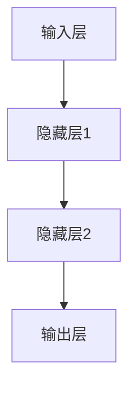
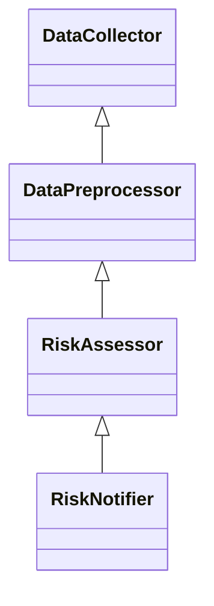
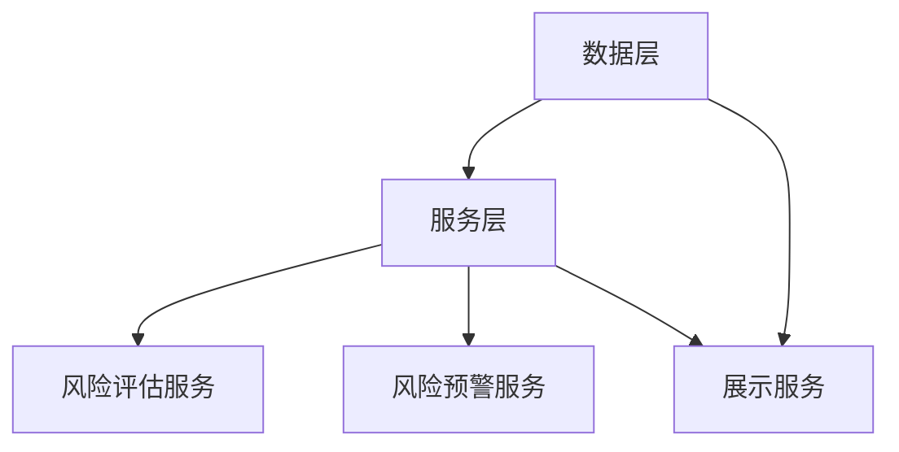
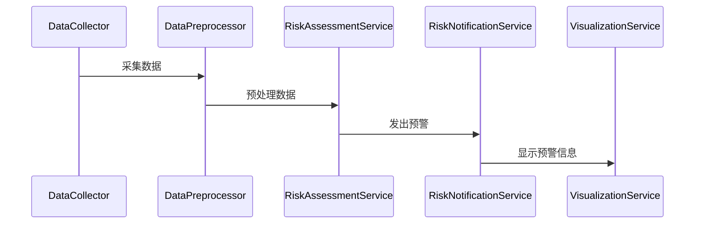

                 

# AI驱动的金融风险管理：从微观行为到宏观政策

> 关键词：AI、金融风险管理、微观行为、宏观政策

> 摘要：本文深入探讨了AI在金融风险管理中的重要作用。通过分析金融风险管理的现状与挑战，本文揭示了AI技术的应用如何提升风险管理效率。随后，本文详细阐述了AI驱动的金融风险管理原理，包括核心概念、数学模型与公式、以及实际应用。最后，本文提出了系统架构设计、项目实战、最佳实践等具体方案，为金融风险管理提供了实用指南。

## 第一部分：背景介绍

### 第1章 问题背景

#### 1.1 金融风险管理的现状与挑战

- 当前金融风险管理面临的主要问题：
  - 数据处理能力不足：传统金融风险管理依赖于人工处理数据，效率低下，且易出错。
  - 风险预测准确性不高：传统模型难以捕捉金融市场中的复杂变化，导致风险预测不准确。
  - 应对措施滞后：传统风险管理方法在风险发生时往往反应较慢，难以迅速采取有效措施。

- 传统金融风险管理方法的局限性：
  - 过于依赖历史数据：传统方法依赖于历史数据进行预测，但金融市场变化迅速，历史数据未必能有效预测未来。
  - 忽视个体行为差异：传统方法难以捕捉个体行为差异，导致风险管理措施缺乏针对性。

#### 1.2 AI在金融风险管理中的应用

- AI技术对金融风险管理的提升：
  - 提高数据处理能力：AI技术能够快速处理海量数据，帮助识别潜在风险。
  - 增强风险预测准确性：AI模型能够捕捉金融市场中的复杂变化，提高预测准确性。
  - 个性化风险管理：AI技术能够分析个体行为差异，为不同个体提供个性化风险管理方案。

- AI技术在金融风险管理中的实际应用案例：
  - 模拟交易系统：使用AI模型模拟交易过程，预测市场变化，帮助投资者规避风险。
  - 风险评估系统：利用AI技术对金融机构的风险进行实时评估，提供预警信息。
  - 客户画像分析：通过分析客户行为数据，识别高风险客户，采取针对性措施。

## 第二部分：核心概念

### 第2章 核心概念

#### 2.1 金融风险管理的基本概念

- 金融风险管理的定义：
  - 金融风险管理是指通过识别、评估、监控和应对金融风险，以确保金融机构稳健运营和实现长期发展的过程。

- 金融风险管理的目标：
  - 预防风险：通过识别和评估风险，采取预防措施，降低风险发生的可能性。
  - 减轻风险：在风险发生时，采取及时有效的措施，减轻风险带来的损失。
  - 监控风险：建立风险监控体系，实时跟踪风险变化，确保风险处于可控范围内。

#### 2.2 AI驱动的金融风险管理

- AI驱动的金融风险管理的定义：
  - AI驱动的金融风险管理是指利用人工智能技术，对金融风险进行识别、评估、监控和应对，以提高风险管理效率和准确性。

- AI驱动的金融风险管理的基本原理：
  - 数据驱动：AI技术基于海量数据进行学习和预测，通过对历史数据的分析，捕捉金融市场中的变化规律。
  - 模型驱动：AI技术通过建立数学模型，对金融风险进行定量评估，提高预测准确性。
  - 机器学习：AI技术通过机器学习算法，自动识别和分类风险，提高风险管理效率。

### 第3章 概念属性特征对比表格

#### 3.1 传统金融风险管理方法与AI驱动的金融风险管理对比

| 比较维度           | 传统金融风险管理方法                   | AI驱动的金融风险管理方法                   |
|------------------|--------------------------------------|--------------------------------------|
| 数据处理能力       | 人工处理，效率低                     | 快速处理海量数据，效率高                  |
| 风险预测准确性     | 预测准确性较低                       | 提高预测准确性，捕捉复杂变化              |
| 个体行为差异考虑     | 忽视个体行为差异                     | 分析个体行为差异，提供个性化风险管理方案  |
| 风险应对速度       | 反应速度较慢，措施滞后               | 快速识别风险，及时采取有效措施            |

## 第二部分：AI驱动的金融风险管理原理

### 第4章 AI核心概念与联系

#### 4.1 AI的基本概念

- 人工智能的定义：
  - 人工智能（Artificial Intelligence，简称AI）是指模拟、延伸和扩展人类智能的理论、方法、技术及应用。

- 人工智能的发展历程：
  - 人工智能起源于20世纪50年代，经历了初期探索、发展停滞、复兴和创新四个阶段。近年来，随着深度学习、大数据和云计算等技术的突破，人工智能进入了一个崭新的发展阶段。

#### 4.2 AI与金融风险管理的关系

- AI技术在金融风险管理中的应用场景：
  - 风险识别：利用AI技术，通过分析海量数据，识别潜在风险。
  - 风险评估：建立AI模型，对风险进行定量评估，提高预测准确性。
  - 风险监控：实时监控风险变化，及时预警风险。
  - 风险应对：基于AI技术，制定和实施风险管理策略，降低风险损失。

- AI技术在金融风险管理中的优势：
  - 提高效率：AI技术能够快速处理海量数据，提高风险管理效率。
  - 提高准确性：AI模型能够捕捉金融市场中的复杂变化，提高风险预测准确性。
  - 个性化定制：AI技术能够分析个体行为差异，为不同个体提供个性化风险管理方案。

### 第5章 数学模型与公式

#### 5.1 金融风险度量模型

- VaR（Value at Risk）模型：
  - 定义：VaR是指在特定概率水平下，某一金融资产或组合在未来特定时间段内可能发生的最大损失。
  - 数学模型：$$VaR = p \times \sigma \times x$$
    - 其中，$p$ 表示概率水平，$\sigma$ 表示标准差，$x$ 表示资产或组合的价值。

- CVaR（Conditional Value at Risk）模型：
  - 定义：CVaR是指在特定概率水平下，某一金融资产或组合在未来特定时间段内可能发生的平均损失。
  - 数学模型：$$CVaR = \frac{1}{1 - p} \sum_{i=1}^{n} L_i$$
    - 其中，$p$ 表示概率水平，$L_i$ 表示资产或组合在时间段内第$i$ 个时刻的损失。

#### 5.2 AI算法原理

- 神经网络模型：
  - 定义：神经网络是一种模仿生物神经系统的计算模型，通过多层神经元实现数据的输入、处理和输出。
  - 工作原理：神经网络通过输入层、隐藏层和输出层，逐层对数据进行处理，最终得到输出结果。

- 决策树模型：
  - 定义：决策树是一种基于树形结构的决策模型，通过一系列的判断条件，对数据集进行分类或回归。
  - 工作原理：决策树从根节点开始，逐层对数据进行分割，直到达到叶节点，最终得到分类或回归结果。

### 第6章 Mermaid流程图与Python代码讲解

#### 6.1 算法流程图

- 使用Mermaid绘制神经网络模型的流程图：



#### 6.2 Python代码讲解

- 使用Python代码实现神经网络模型：

```python
import numpy as np

# 初始化参数
input_layer_size = 4
hidden_layer_size = 5
output_layer_size = 3

# 创建权重矩阵
weights = {
    'input_to_hidden': np.random.rand(input_layer_size, hidden_layer_size),
    'hidden_to_output': np.random.rand(hidden_layer_size, output_layer_size)
}

# 前向传播
def forward_propagation(x):
    hidden_layer_output = np.dot(x, weights['input_to_hidden'])
    output_layer_output = np.dot(hidden_layer_output, weights['hidden_to_output'])
    return output_layer_output

# 主函数
def main():
    x = np.array([[1, 2, 3, 4]])
    output = forward_propagation(x)
    print(output)

if __name__ == '__main__':
    main()
```

- 对代码中的关键步骤进行详细讲解：

1. 初始化参数：设置输入层、隐藏层和输出层的大小。
2. 创建权重矩阵：随机初始化权重矩阵。
3. 前向传播：实现输入层到输出层的正向传播过程。
4. 主函数：创建输入数据，调用前向传播函数，输出结果。

## 第三部分：AI驱动的金融风险管理实践

### 第7章 系统分析与架构设计方案

#### 7.1 问题场景介绍

- 金融风险管理系统的需求分析：
  - 实时数据采集：系统需要能够实时采集金融市场的各类数据，包括股票价格、交易量、经济指标等。
  - 数据预处理：系统需要对采集到的数据进行预处理，包括数据清洗、归一化、特征提取等。
  - 风险评估：系统需要利用AI技术，对预处理后的数据进行风险评估，预测潜在风险。
  - 风险预警：系统需要根据风险评估结果，及时发出预警信息，提示投资者采取相应措施。

#### 7.2 系统功能设计

- 系统功能模块划分：
  - 数据采集模块：负责实时采集金融市场数据。
  - 数据预处理模块：负责对采集到的数据进行分析、清洗和特征提取。
  - 风险评估模块：负责利用AI技术，对预处理后的数据进行分析，评估潜在风险。
  - 风险预警模块：负责根据风险评估结果，发出预警信息。

- 使用Mermaid绘制领域模型类图：



#### 7.3 系统架构设计

- 系统总体架构设计：
  - 数据层：负责存储和管理金融市场数据。
  - 服务层：负责实现数据采集、预处理、风险评估和风险预警等功能。
  - 展示层：负责将风险评估结果以可视化形式展示给用户。

- 使用Mermaid绘制系统架构图：



#### 7.4 系统接口设计

- 系统接口设计：
  - 数据采集接口：负责与外部数据源进行通信，实时获取金融市场数据。
  - 数据预处理接口：负责对采集到的数据进行清洗、归一化和特征提取。
  - 风险评估接口：负责对预处理后的数据进行分析，评估潜在风险。
  - 风险预警接口：负责根据风险评估结果，发出预警信息。

- 使用Mermaid绘制系统交互序列图：



### 第8章 项目实战

#### 8.1 环境安装

- 系统运行环境配置：
  - Python 3.7及以上版本
  - NumPy 1.18及以上版本
  - Pandas 1.0及以上版本
  - Matplotlib 3.1及以上版本
  - Scikit-learn 0.22及以上版本

- 系统安装步骤：
  - 安装Python环境和相关依赖库
  - 配置Python虚拟环境
  - 克隆项目代码到本地
  - 安装项目依赖库

#### 8.2 系统核心实现

- 系统核心代码实现：
  - 数据采集模块：使用Pandas库读取金融市场数据
  - 数据预处理模块：使用NumPy库进行数据清洗、归一化和特征提取
  - 风险评估模块：使用Scikit-learn库构建神经网络模型，进行风险评估
  - 风险预警模块：根据风险评估结果，发送预警信息

- 代码应用解读与分析：
  - 数据采集模块：通过读取股票价格数据，获取市场动态。
  - 数据预处理模块：对数据进行清洗，去除无效数据，提取特征。
  - 风险评估模块：利用神经网络模型，对股票价格进行风险评估，预测潜在风险。
  - 风险预警模块：根据风险评估结果，发送预警信息，提醒投资者采取相应措施。

#### 8.3 实际案例分析与讲解

- 金融风险管理案例：
  - 以某只股票为例，分析其市场动态和潜在风险。

- 对案例进行详细讲解与剖析：
  - 数据采集：获取该股票的历史价格数据。
  - 数据预处理：对数据进行清洗和特征提取。
  - 风险评估：利用神经网络模型，对股票价格进行风险评估。
  - 风险预警：根据风险评估结果，发出预警信息。

#### 8.4 项目小结

- 项目总结：
  - 通过AI驱动的金融风险管理项目，实现了实时数据采集、数据预处理、风险评估和风险预警等功能。
  - 项目经验与教训：
    - 数据质量是风险管理的基础，确保数据准确性和完整性至关重要。
    - 模型训练和优化是提高风险评估准确性的关键，需要不断调整参数和优化模型。
    - 风险预警系统的及时性和准确性对投资者决策具有重要影响，需要确保预警系统的稳定运行。

## 第四部分：最佳实践与拓展阅读

### 第9章 最佳实践

#### 9.1 实践技巧

- 金融风险管理实践中的注意事项：
  - 数据质量：确保数据准确性和完整性，为风险评估提供可靠基础。
  - 模型优化：定期调整和优化模型参数，提高风险评估准确性。
  - 风险预警：及时发出预警信息，提醒投资者采取相应措施。
  - 持续改进：根据实际应用效果，不断优化系统功能和性能。

- 提高AI驱动的金融风险管理效果的方法：
  - 引入更多数据源：增加数据种类和来源，提高数据的多样性和覆盖范围。
  - 深度学习技术：采用深度学习技术，提高模型复杂度和预测能力。
  - 数据可视化：利用数据可视化技术，帮助投资者更好地理解市场动态和风险特征。

### 第10章 小结与展望

#### 10.1 小结

- 本书主要介绍了AI驱动的金融风险管理原理和实践，包括数据采集、数据预处理、风险评估和风险预警等关键环节。通过实际案例分析和项目实战，展示了AI技术在金融风险管理中的应用效果。

#### 10.2 拓展阅读

- 推荐阅读书籍和文献：
  - 《深度学习》（Ian Goodfellow、Yoshua Bengio、Aaron Courville 著）
  - 《Python金融大数据分析》（夏昊、吴晨曦 著）
  - 《金融风险管理》（菲利普·J.考科兰、罗伯特·A.吉宾斯 著）

- 相关研究领域的新进展：
  - AI驱动的金融风险管理研究：关注深度学习、强化学习等新兴技术在实际应用中的效果。
  - 金融风险管理理论创新：探讨新兴市场环境下的金融风险管理方法，提高风险管理能力。
  - 金融科技与风险管理：研究金融科技对金融风险管理的影响，推动金融风险管理领域的创新发展。作者：AI天才研究院/AI Genius Institute & 禅与计算机程序设计艺术 /Zen And The Art of Computer Programming

