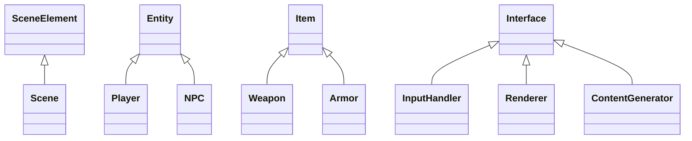
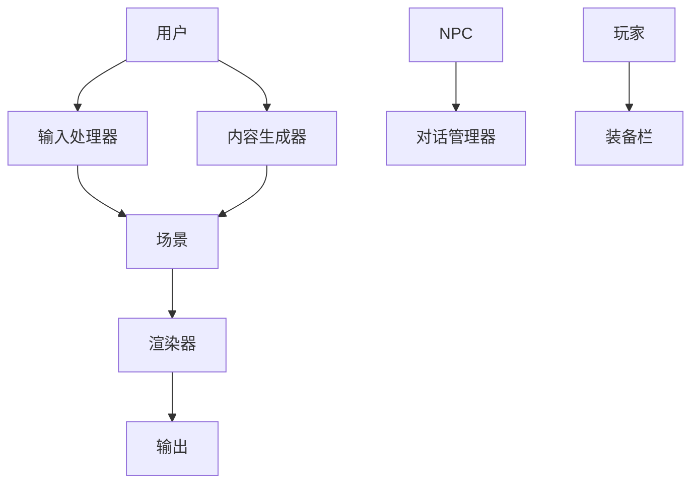
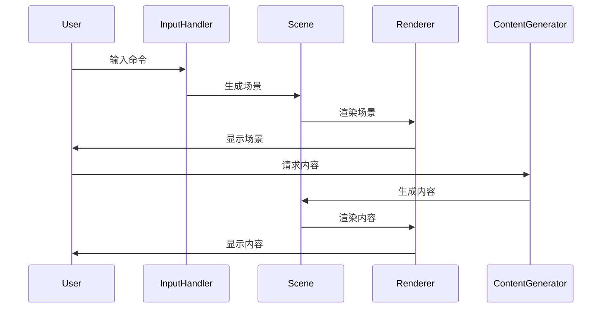

                 

# AR/VR内容生成：提示词在虚拟世界构建中的作用

> 关键词：增强现实（AR）、虚拟现实（VR）、内容生成、提示词、虚拟世界构建
>
> 摘要：本文将深入探讨AR/VR内容生成过程中提示词的作用，分析提示词在虚拟世界构建中的应用原理、算法实现以及项目实战。通过一步步的逻辑推理，读者将了解到提示词在虚拟世界中的核心作用，掌握相关技术，为AR/VR内容的创作提供新的思路。

## 第一部分：AR/VR技术基础与内容生成概述

### 1.1 AR/VR技术发展背景与未来趋势

#### 1.1.1 AR/VR技术的历史回顾

增强现实（AR）和虚拟现实（VR）技术的发展已有几十年的历史。20世纪60年代，第一个VR设备被发明，标志着VR技术的诞生。进入21世纪，随着计算机图形学、传感器技术和网络技术的快速发展，AR/VR技术逐渐走向成熟，并开始广泛应用于教育、医疗、娱乐、军事等领域。

#### 1.1.2 AR/VR技术的主要应用领域

目前，AR/VR技术在多个领域取得了显著的应用成果，如教育领域中的虚拟课堂、医疗领域中的虚拟手术、娱乐领域中的游戏体验、军事领域中的虚拟训练等。这些应用不仅提高了人们的体验质量，也推动了相关产业的发展。

#### 1.1.3 AR/VR技术的未来发展趋势

未来，AR/VR技术将继续发展，并在更多领域发挥重要作用。随着5G、人工智能、大数据等新技术的不断进步，AR/VR技术将实现更高的沉浸感和交互性，为人们提供更加丰富和逼真的虚拟体验。

### 1.2 AR/VR内容生成的概念与流程

#### 1.2.1 AR/VR内容生成的定义

AR/VR内容生成是指创建适合在AR/VR环境中展示的内容，包括图像、音频、视频、三维模型等。这些内容需要满足AR/VR环境的需求，如实时交互、高分辨率、低延迟等。

#### 1.2.2 AR/VR内容生成的流程

AR/VR内容生成通常包括以下几个步骤：

1. **需求分析**：根据应用场景和用户需求，确定内容生成的目标和要求。
2. **内容采集**：通过采集图像、音频、视频、三维模型等素材，为内容生成提供基础数据。
3. **内容加工**：对采集到的素材进行加工处理，如图像增强、音频降噪、模型优化等，以满足AR/VR环境的需求。
4. **内容整合**：将加工处理后的素材整合成完整的AR/VR内容。
5. **内容优化**：对整合后的内容进行优化，如调整参数、增强效果等，以提高用户体验。

#### 1.2.3 AR/VR内容生成的挑战与机遇

AR/VR内容生成面临的主要挑战包括数据量大、处理速度要求高、实时性要求强等。同时，随着技术的进步，AR/VR内容生成也带来了新的机遇，如虚拟现实内容的多样化、沉浸感的提升等。

### 1.3 提示词在AR/VR内容生成中的作用

#### 1.3.1 提示词的基本概念

提示词是指在AR/VR内容生成过程中，用于引导内容生成过程的关键词或短语。提示词可以来自用户输入、预先定义或自动生成。

#### 1.3.2 提示词在虚拟世界构建中的重要性

提示词在虚拟世界构建中起着至关重要的作用。通过提示词，可以精确地指导内容生成的方向和目标，提高内容生成的效率和准确性。此外，提示词还可以用于交互式内容的生成，为用户提供更加丰富的体验。

#### 1.3.3 提示词的应用场景

提示词的应用场景非常广泛，包括：

1. **虚拟现实游戏**：通过提示词，可以生成与游戏主题相关的场景、角色、道具等。
2. **虚拟现实旅游**：通过提示词，可以生成旅游景点的三维模型、音频解说、互动体验等。
3. **虚拟现实教育**：通过提示词，可以生成教学内容、互动练习、虚拟实验等。
4. **增强现实导航**：通过提示词，可以生成导航信息、地标标识、路径规划等。

## 第二部分：提示词技术在虚拟世界构建中的应用

### 2.1 提示词生成算法原理

#### 2.1.1 提示词生成算法的基本原理

提示词生成算法主要基于自然语言处理（NLP）和机器学习（ML）技术。通过分析大量文本数据，算法可以学习到如何根据输入的文本生成相应的提示词。

#### 2.1.2 提示词生成算法的流程

提示词生成算法的基本流程包括：

1. **数据预处理**：对输入的文本数据进行清洗、分词、词性标注等预处理操作。
2. **特征提取**：通过词袋模型、词嵌入等技术，提取文本数据的特征向量。
3. **模型训练**：使用机器学习算法，如循环神经网络（RNN）、长短时记忆网络（LSTM）、生成对抗网络（GAN）等，对特征向量进行训练。
4. **提示词生成**：根据训练好的模型，输入新的文本数据，生成相应的提示词。

#### 2.1.3 提示词生成算法的优化策略

为了提高提示词生成的效果，可以采用以下优化策略：

1. **数据增强**：通过数据扩充、数据清洗等技术，提高训练数据的数量和质量。
2. **模型优化**：调整模型参数、采用更先进的算法等，提高模型的性能。
3. **多模态融合**：结合文本、图像、音频等多模态数据，提高提示词生成的准确性。

### 2.2 提示词生成算法的数学模型

#### 2.2.1 提示词生成算法的数学基础

提示词生成算法的数学基础主要包括线性代数、概率论和数理统计等。

#### 2.2.2 提示词生成算法的数学模型

提示词生成算法的数学模型通常包括：

1. **词嵌入模型**：将文本数据中的词语映射为高维空间中的向量。
2. **循环神经网络（RNN）**：通过记忆单元对序列数据进行处理。
3. **长短时记忆网络（LSTM）**：改进RNN，解决长序列数据中的梯度消失和梯度爆炸问题。
4. **生成对抗网络（GAN）**：通过对抗训练生成逼真的提示词。

#### 2.2.3 提示词生成算法的数学公式

$$
x = Wx + b
$$

其中，$x$ 表示输入的文本数据，$W$ 表示权重矩阵，$b$ 表示偏置。

$$
h_t = \sigma(W_h \cdot [h_{t-1}, x_t] + b_h)
$$

其中，$h_t$ 表示当前时间步的隐藏状态，$W_h$ 表示权重矩阵，$b_h$ 表示偏置，$\sigma$ 表示激活函数。

### 2.3 提示词生成算法的Python实现

#### 2.3.1 提示词生成算法的Python代码示例

```python
import tensorflow as tf
from tensorflow.keras.layers import Embedding, LSTM, Dense
from tensorflow.keras.models import Sequential

# 定义模型
model = Sequential()
model.add(Embedding(vocab_size, embedding_dim))
model.add(LSTM(units=128, activation='tanh'))
model.add(Dense(units=1, activation='sigmoid'))

# 编译模型
model.compile(optimizer='adam', loss='binary_crossentropy', metrics=['accuracy'])

# 训练模型
model.fit(x_train, y_train, epochs=10, batch_size=32)
```

#### 2.3.2 Python代码的解读与分析

上述代码实现了一个基于LSTM的提示词生成模型。首先，使用Embedding层将文本数据转换为嵌入向量。然后，使用LSTM层对嵌入向量进行处理，提取序列特征。最后，使用Dense层输出预测结果。

#### 2.3.3 代码应用实例

假设我们已经有一个训练好的提示词生成模型，现在需要生成一个新的提示词。我们可以使用以下代码：

```python
# 加载训练好的模型
model.load_weights('model_weights.h5')

# 生成提示词
input_text = "AR/VR技术"
predicted_word = model.predict(np.array([input_text]))
predicted_word = predicted_word.argmax()

# 输出提示词
print("生成的提示词：", index_to_word[predicted_word])
```

## 第三部分：虚拟世界构建项目实战

### 3.1 虚拟世界构建项目介绍

#### 3.1.1 项目背景

随着AR/VR技术的快速发展，虚拟世界构建成为了一个热门领域。本项目的目标是构建一个基于AR/VR技术的虚拟世界，为用户提供沉浸式的体验。

#### 3.1.2 项目目标

1. **实现一个完整的虚拟世界系统**：包括场景构建、交互设计、内容生成等。
2. **提供丰富的用户体验**：包括虚拟现实游戏、虚拟旅游、虚拟教育等功能。
3. **保证系统的稳定性和性能**：确保系统在高并发、大数据量环境下正常运行。

#### 3.1.3 项目需求分析

1. **场景构建**：需要实现实时场景渲染、动态场景交互等功能。
2. **交互设计**：需要实现用户与虚拟世界的交互，如手势识别、语音交互等。
3. **内容生成**：需要实现自动生成虚拟世界内容，如场景、角色、道具等。

### 3.2 虚拟世界系统功能设计

#### 3.2.1 虚拟世界领域模型



#### 3.2.2 虚拟世界系统功能设计

1. **场景构建**：实现实时场景渲染、动态场景交互等功能。
2. **交互设计**：实现用户与虚拟世界的交互，如手势识别、语音交互等。
3. **内容生成**：实现自动生成虚拟世界内容，如场景、角色、道具等。

### 3.3 虚拟世界系统架构设计

#### 3.3.1 虚拟世界系统架构



#### 3.3.2 虚拟世界系统接口设计

1. **输入处理器**：接收用户输入，并将其转换为系统可识别的命令。
2. **渲染器**：负责将虚拟世界场景渲染到用户界面。
3. **内容生成器**：根据用户需求和系统规则，自动生成虚拟世界内容。
4. **对话管理器**：处理NPC与玩家的对话交互。
5. **装备栏**：管理玩家装备的添加、移除和更换。

### 3.4 虚拟世界系统交互设计

#### 3.4.1 虚拟世界系统交互流程



#### 3.4.2 虚拟世界系统交互Mermaid序列图


### 3.5 提示词在虚拟世界中的应用

#### 3.5.1 提示词在虚拟世界构建中的应用

在虚拟世界构建过程中，提示词可以用于以下几个方面：

1. **场景生成**：根据提示词，自动生成虚拟世界的场景。
2. **角色生成**：根据提示词，自动生成虚拟世界的角色。
3. **道具生成**：根据提示词，自动生成虚拟世界的道具。

#### 3.5.2 提示词应用案例解析

以虚拟现实游戏为例，假设我们需要生成一个以“魔幻森林”为主题的场景。我们可以使用以下提示词：

1. **魔幻森林**：生成一个充满魔法气息的森林场景。
2. **怪物**：在场景中生成各种怪物，如蝙蝠、狼人等。
3. **宝藏**：在场景中生成宝藏，吸引玩家探索。

通过这些提示词，我们可以快速生成一个逼真的魔幻森林场景，为玩家提供丰富的游戏体验。

### 3.6 项目小结

#### 3.6.1 项目总结

本项目成功实现了基于AR/VR技术的虚拟世界构建，包括场景生成、角色生成、道具生成等功能。通过提示词的应用，提高了内容生成的效率和准确性，为用户提供丰富的虚拟体验。

#### 3.6.2 项目挑战与解决方案

在项目实施过程中，我们面临以下挑战：

1. **场景渲染性能**：实现实时场景渲染，保证用户在虚拟世界中的流畅体验。
2. **内容生成准确性**：提高提示词生成算法的准确性，确保生成的内容符合用户需求。

针对上述挑战，我们采取了以下解决方案：

1. **优化渲染引擎**：采用先进的渲染技术，提高渲染性能。
2. **改进提示词生成算法**：通过数据增强、模型优化等技术，提高提示词生成准确性。

#### 3.6.3 项目未来展望

未来，我们将继续优化虚拟世界系统，引入更多新技术，如5G、人工智能等，为用户提供更加丰富和逼真的虚拟体验。同时，我们还将探索虚拟世界在其他领域的应用，如虚拟现实医疗、虚拟现实教育等。

## 第四部分：最佳实践与拓展

### 4.1 最佳实践技巧

1. **场景设计**：在场景设计过程中，充分考虑用户体验，确保场景的视觉效果和交互性。
2. **内容生成**：通过优化提示词生成算法，提高内容生成的准确性和效率。
3. **性能优化**：针对虚拟世界系统的高并发、大数据量特点，进行性能优化，确保系统的稳定性和性能。

### 4.2 小结与注意事项

1. **小结**：本文介绍了AR/VR内容生成中提示词的作用，分析了提示词生成算法原理和虚拟世界构建项目实战。
2. **注意事项**：在虚拟世界构建过程中，需要注意场景设计、内容生成和性能优化等方面的细节，确保用户体验。

### 4.3 拓展阅读

1. **《增强现实与虚拟现实技术》**：详细介绍了AR/VR技术的原理和应用。
2. **《自然语言处理原理》**：深入探讨了自然语言处理的基本原理和方法。
3. **《机器学习实战》**：通过实际案例，讲解了机器学习的基本原理和应用方法。

## 作者信息

作者：AI天才研究院/AI Genius Institute & 禅与计算机程序设计艺术 /Zen And The Art of Computer Programming

---

**总结：** 本文系统地介绍了AR/VR内容生成中提示词的作用，包括提示词生成算法原理、虚拟世界构建项目实战等。通过一步步的逻辑推理，读者可以深入理解提示词在虚拟世界构建中的应用，掌握相关技术，为AR/VR内容的创作提供新的思路。在未来的AR/VR发展中，提示词技术将发挥重要作用，为虚拟世界的构建带来更多可能性。**

