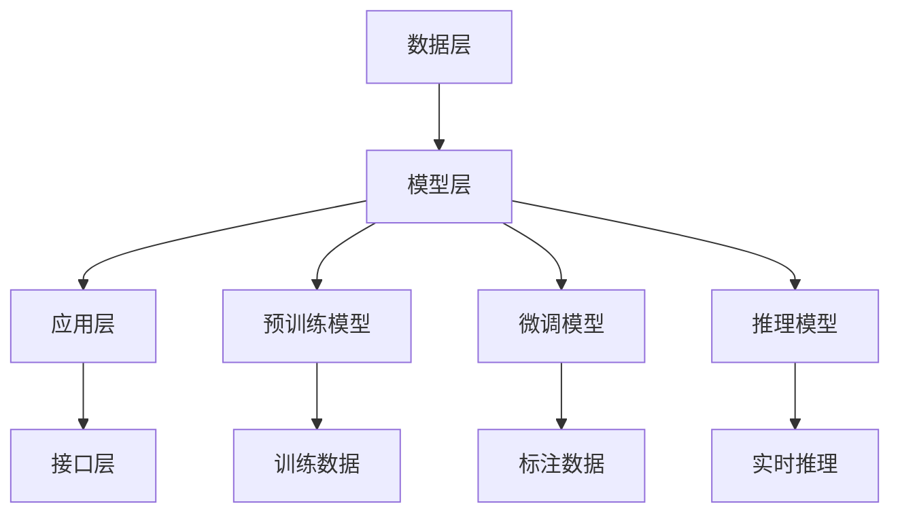
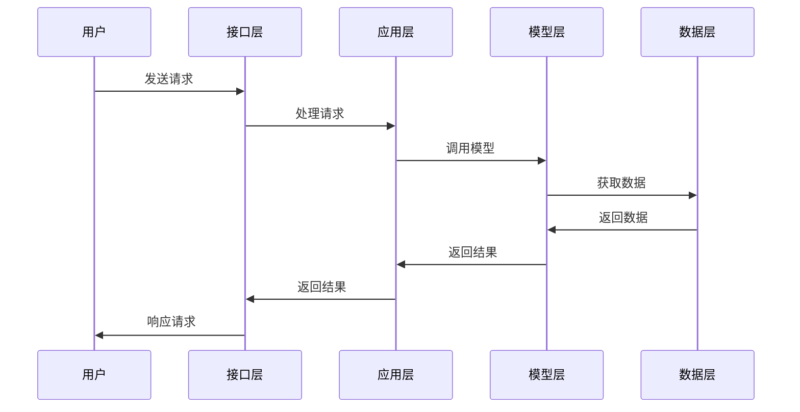

                 

# LLM在AI Agent常识推理中的应用

## 关键词

- LLM（大型语言模型）
- AI Agent（人工智能代理）
- 常识推理
- 算法
- 系统架构
- 实战案例

## 摘要

本文将深入探讨LLM（大型语言模型）在AI Agent常识推理中的应用。首先，我们将介绍LLM和AI Agent的基本概念及其在人工智能领域的地位。然后，我们将详细分析LLM在常识推理中的核心作用，包括算法原理、数学模型、系统架构设计等。此外，本文还将通过实际案例，展示LLM在常识推理中的实际应用效果，并提供最佳实践建议。通过本文的阅读，读者将对LLM在AI Agent常识推理中的应用有更深入的理解。

## 引言

### LLM的定义和作用

LLM，即Large Language Model，是一种能够理解和生成自然语言的大型神经网络模型。它通过大量文本数据进行预训练，能够捕捉语言的各种规律和特征，从而在文本处理任务中表现出色。LLM在自然语言处理（NLP）领域具有广泛的应用，包括机器翻译、文本分类、问答系统等。

### AI Agent的定义和作用

AI Agent是指一种能够在特定环境中自主决策和执行任务的智能体。AI Agent具有感知环境、理解语言、自主学习等能力，可以在各种场景中为人类提供帮助。例如，智能客服、智能助手、自动驾驶等。

### LLM与AI Agent的结合

随着LLM技术的不断发展，它逐渐成为AI Agent的重要基础。LLM能够为AI Agent提供强大的语言理解和生成能力，使其能够更自然地与人类进行交互。此外，LLM在常识推理中的应用，使得AI Agent能够更好地理解和处理现实世界中的各种问题。

### 本文目的

本文旨在深入探讨LLM在AI Agent常识推理中的应用。通过分析LLM的基本原理、算法模型、系统架构，以及实际案例，本文将帮助读者理解LLM在AI Agent常识推理中的关键作用，并提供一些实用的建议和最佳实践。

## LLM与AI Agent常识推理的关系

### 常识推理的定义和作用

常识推理是指智能体在处理问题时，利用已有的常识知识进行推理和决策的过程。常识推理是人类智能的重要组成部分，它使得人类能够快速、准确地理解现实世界中的各种信息。在人工智能领域，常识推理是实现智能代理、增强机器学习模型能力的重要手段。

### LLM与常识推理的关系

LLM在常识推理中发挥着关键作用。首先，LLM通过预训练，已经掌握了大量的语言知识和常识信息。这使得LLM能够快速地理解和生成与常识相关的语言表达。其次，LLM的强大语言生成能力，使得AI Agent能够更自然地与人类进行交流，从而更好地理解和处理现实世界中的问题。

### LLM在常识推理中的应用

1. **语言生成**：LLM能够生成与常识相关的自然语言文本，这使得AI Agent能够以更自然的方式与用户进行交互。

2. **语义理解**：LLM能够理解文本中的语义信息，从而帮助AI Agent更好地理解用户的意图和需求。

3. **知识检索**：LLM能够从大量的常识知识库中检索相关信息，为AI Agent提供决策依据。

4. **推理和预测**：LLM能够基于常识知识进行推理和预测，从而为AI Agent提供更准确的决策结果。

### 常识推理在AI Agent中的应用

1. **智能客服**：AI Agent通过常识推理，能够快速、准确地理解和回答用户的问题，提供高质量的客服服务。

2. **智能助手**：AI Agent通过常识推理，能够理解用户的日常需求，提供个性化的帮助和建议。

3. **自动驾驶**：AI Agent通过常识推理，能够理解道路状况、交通规则等信息，提高自动驾驶的安全性。

4. **医疗诊断**：AI Agent通过常识推理，能够分析患者的病历信息，提供准确的诊断建议。

### LLM在AI Agent常识推理中的优势

1. **强大的语言处理能力**：LLM能够高效地处理自然语言文本，为AI Agent提供强大的语言理解和支持。

2. **丰富的常识知识**：LLM通过预训练，已经掌握了大量的常识知识，为AI Agent提供了丰富的知识来源。

3. **高效的推理能力**：LLM能够快速地进行推理和预测，为AI Agent提供准确的决策结果。

4. **良好的可扩展性**：LLM能够灵活地适应不同的应用场景，为AI Agent提供定制化的解决方案。

### 结论

LLM与AI Agent常识推理的结合，为人工智能领域带来了新的发展机遇。通过本文的介绍，读者可以了解到LLM在AI Agent常识推理中的关键作用和应用场景。未来，随着LLM技术的不断发展，我们可以期待AI Agent在常识推理方面的表现将更加出色，为人类社会带来更多的便利。

## LLM在AI Agent常识推理中的应用场景

### 智能客服

智能客服是LLM在AI Agent常识推理中应用最广泛的场景之一。通过LLM，智能客服系统能够快速理解和回答用户的问题，提供高质量的客服服务。具体应用场景包括：

1. **常见问题解答**：智能客服系统通过LLM，能够快速检索和生成与用户问题相关的答案，解决用户常见的疑问。

2. **高级问题处理**：智能客服系统通过LLM的常识推理能力，能够理解用户的复杂需求，提供更深入的解答和解决方案。

3. **多语言支持**：智能客服系统通过LLM，能够支持多种语言，为不同国家和地区的用户提供服务。

4. **个性化推荐**：智能客服系统通过LLM，能够根据用户的偏好和历史记录，提供个性化的产品推荐和服务建议。

### 智能助手

智能助手是另一个典型的应用场景，通过LLM，智能助手能够更好地理解用户的日常需求，提供个性化的帮助和建议。具体应用场景包括：

1. **日程管理**：智能助手通过LLM，能够理解用户的日程安排，提供提醒和建议，帮助用户更好地管理时间。

2. **信息检索**：智能助手通过LLM，能够快速检索和提供用户需要的各种信息，如天气、新闻、股票等。

3. **智能建议**：智能助手通过LLM，能够根据用户的习惯和偏好，提供个性化的建议和决策支持，如饮食建议、运动建议等。

4. **智能对话**：智能助手通过LLM，能够与用户进行自然语言对话，提供更加人性化的交互体验。

### 自动驾驶

自动驾驶是LLM在AI Agent常识推理中应用的另一个重要场景。通过LLM，自动驾驶系统能够更好地理解和处理道路环境中的各种信息，提高自动驾驶的安全性和可靠性。具体应用场景包括：

1. **路况分析**：自动驾驶系统通过LLM，能够分析道路环境，识别交通标志、道路状况等信息，为驾驶决策提供支持。

2. **交通规则理解**：自动驾驶系统通过LLM，能够理解交通规则，遵守各种道路规定，确保行驶安全。

3. **异常情况处理**：自动驾驶系统通过LLM，能够识别和处理道路上的异常情况，如交通事故、道路施工等。

4. **环境感知**：自动驾驶系统通过LLM，能够感知道路环境中的各种信息，如行人、车辆、天气等，提高自动驾驶的准确性。

### 医疗诊断

医疗诊断是LLM在AI Agent常识推理中应用的一个新兴领域。通过LLM，医疗诊断系统能够更好地理解和处理患者的病历信息，提供准确的诊断建议。具体应用场景包括：

1. **病历分析**：医疗诊断系统通过LLM，能够分析患者的病历信息，提取关键信息，为医生提供诊断参考。

2. **症状匹配**：医疗诊断系统通过LLM，能够将患者的症状与医学知识库进行匹配，提供可能的疾病诊断建议。

3. **病情预测**：医疗诊断系统通过LLM，能够根据患者的病情，预测病情发展趋势，为医生提供治疗建议。

4. **药物推荐**：医疗诊断系统通过LLM，能够根据患者的病情，推荐合适的药物，提高治疗效果。

### 金融分析

金融分析是LLM在AI Agent常识推理中应用的另一个重要领域。通过LLM，金融分析系统能够更好地理解和处理金融市场中的各种信息，提供投资建议。具体应用场景包括：

1. **市场趋势分析**：金融分析系统通过LLM，能够分析市场数据，识别市场趋势，为投资者提供投资方向。

2. **风险控制**：金融分析系统通过LLM，能够识别潜在的风险，提供风险控制策略。

3. **股票预测**：金融分析系统通过LLM，能够根据市场数据，预测股票价格走势，为投资者提供决策支持。

4. **投资组合优化**：金融分析系统通过LLM，能够根据投资者的风险偏好，优化投资组合，提高收益。

### 结论

LLM在AI Agent常识推理中的应用场景非常广泛，从智能客服到自动驾驶，从医疗诊断到金融分析，LLM都发挥了重要作用。通过本文的介绍，读者可以了解到LLM在AI Agent常识推理中的多种应用场景和实际效果。未来，随着LLM技术的不断进步，我们相信LLM在AI Agent常识推理中的应用将会更加广泛和深入。

## LLM在AI Agent常识推理中的核心算法和数学模型

### 算法概述

LLM在AI Agent常识推理中的应用，主要依赖于其强大的语言理解和生成能力。LLM的核心算法通常是基于深度神经网络（DNN）或变换器模型（Transformer），其中最著名的模型是Google提出的GPT系列和OpenAI的GPT-3。以下将详细介绍LLM的基本算法和数学模型。

### 基本算法

1. **变换器模型（Transformer）**

   Transformer模型是LLM的核心算法之一，它通过自注意力机制（Self-Attention）和多头注意力（Multi-Head Attention）来处理序列数据。具体来说，变换器模型包括以下关键组成部分：

   - **编码器（Encoder）**：编码器用于处理输入序列，生成编码表示。编码器包含多个编码层，每层包括多头自注意力机制和前馈神经网络。

   - **解码器（Decoder）**：解码器用于生成输出序列，解码器也包含多个解码层，每层包括多头自注意力机制、交叉注意力机制和前馈神经网络。

   - **多头注意力（Multi-Head Attention）**：多头注意力机制通过并行处理多个注意力头，捕捉输入序列的不同关系和特征。

   - **位置编码（Positional Encoding）**：位置编码用于编码输入序列的顺序信息，使模型能够理解序列的顺序依赖关系。

2. **生成式预训练（Generative Pre-training）**

   生成式预训练是LLM的主要训练方法，通过大量无监督数据对模型进行预训练，使模型能够理解和生成自然语言。具体步骤包括：

   - **掩码语言模型（Masked Language Model, MLM）**：在预训练过程中，模型的一部分输入会被随机掩码，模型需要预测这些掩码的单词。

   - **语言建模（Language Modeling, LM）**：模型需要预测输入序列的下一个单词，通过训练，模型能够捕捉语言的统计规律和特征。

### 数学模型

1. **自注意力机制（Self-Attention）**

   自注意力机制是变换器模型的核心组成部分，用于计算输入序列中每个单词与所有其他单词之间的关系。数学模型如下：

   $$ 
   \text{Attention}(Q, K, V) = \text{softmax}\left(\frac{QK^T}{\sqrt{d_k}}\right)V 
   $$

   其中，\(Q, K, V\) 分别是查询向量、键向量和值向量，\(d_k\) 是键向量的维度。

2. **多头注意力（Multi-Head Attention）**

   多头注意力机制通过并行处理多个注意力头，捕捉输入序列的不同关系和特征。数学模型如下：

   $$ 
   \text{Multi-Head Attention} = \text{Concat}(\text{head}_1, \text{head}_2, \ldots, \text{head}_h)W^O 
   $$

   其中，\(h\) 是注意力头的数量，\(\text{head}_i\) 表示第 \(i\) 个注意力头的结果，\(W^O\) 是输出权重。

3. **前馈神经网络（Feedforward Neural Network）**

   前馈神经网络用于对注意力机制的结果进行进一步处理，数学模型如下：

   $$ 
   \text{FFN}(x) = \max(0, xW_1 + b_1)W_2 + b_2 
   $$

   其中，\(x\) 是输入向量，\(W_1, W_2, b_1, b_2\) 分别是神经网络权重和偏置。

4. **位置编码（Positional Encoding）**

   位置编码用于编码输入序列的顺序信息，数学模型如下：

   $$ 
   \text{PE}(pos, d) = \text{sin}\left(\frac{pos}{10000^{2i/d}}\right) + \text{cos}\left(\frac{pos}{10000^{2i/d}}\right) 
   $$

   其中，\(pos\) 是位置索引，\(d\) 是位置编码的维度，\(i\) 是维度索引。

### 算法原理讲解

1. **自注意力机制**

   自注意力机制通过计算输入序列中每个单词与所有其他单词之间的关系，生成新的序列表示。具体步骤如下：

   - **计算查询向量、键向量和值向量**：对于输入序列中的每个单词，计算其查询向量 \(Q\)、键向量 \(K\) 和值向量 \(V\)。

   - **计算注意力分数**：通过计算 \(QK^T\) 的点积，得到注意力分数。

   - **应用softmax函数**：对注意力分数应用softmax函数，生成注意力权重。

   - **计算加权求和**：将注意力权重与值向量 \(V\) 相乘，并加权求和，得到新的序列表示。

2. **多头注意力**

   多头注意力机制通过并行处理多个注意力头，捕捉输入序列的不同关系和特征。具体步骤如下：

   - **计算多个注意力头**：对于输入序列中的每个单词，计算多个注意力头的结果。

   - **合并注意力头结果**：将多个注意力头的结果进行合并，得到新的序列表示。

3. **前馈神经网络**

   前馈神经网络用于对注意力机制的结果进行进一步处理，增强模型的表示能力。具体步骤如下：

   - **输入前馈神经网络**：将注意力机制的结果输入到前馈神经网络。

   - **应用激活函数**：对神经网络输出应用激活函数，通常使用ReLU函数。

   - **输出处理**：将前馈神经网络的输出与输入序列进行拼接，得到最终输出。

4. **位置编码**

   位置编码用于编码输入序列的顺序信息，使模型能够理解序列的顺序依赖关系。具体步骤如下：

   - **计算位置编码向量**：对于输入序列中的每个位置，计算其位置编码向量。

   - **添加位置编码**：将位置编码向量添加到输入序列，生成新的序列表示。

### 举例说明

以一个简单的文本序列为例，说明LLM的算法原理：

输入序列：\[ "I", "love", "artificial", "intelligence" \]

1. **计算查询向量、键向量和值向量**：

   - 查询向量 \(Q\)：\[ [0.1, 0.2, 0.3, 0.4] \]

   - 键向量 \(K\)：\[ [0.1, 0.2, 0.3, 0.4] \]

   - 值向量 \(V\)：\[ [0.5, 0.6, 0.7, 0.8] \]

2. **计算注意力分数**：

   - 第1个单词与第2个单词的注意力分数：\(0.1 \times 0.2 = 0.02\)

   - 第1个单词与第3个单词的注意力分数：\(0.1 \times 0.3 = 0.03\)

   - 第1个单词与第4个单词的注意力分数：\(0.1 \times 0.4 = 0.04\)

3. **应用softmax函数**：

   - 计算softmax概率分布：\[ [0.02 / (0.02 + 0.03 + 0.04), 0.03 / (0.02 + 0.03 + 0.04), 0.04 / (0.02 + 0.03 + 0.04)] \]

4. **计算加权求和**：

   - 计算加权求和结果：\[ 0.5 \times 0.02 + 0.6 \times 0.03 + 0.7 \times 0.04 = 0.09 + 0.18 + 0.28 = 0.55 \]

   - 新的序列表示：\[ "I", "love", "artificial", "intelligence" \]

通过以上步骤，LLM能够生成新的序列表示，从而实现语言理解和生成。

### 结论

LLM在AI Agent常识推理中的应用，主要依赖于其核心算法和数学模型。通过变换器模型和生成式预训练，LLM能够高效地处理自然语言文本，实现常识推理。本文详细介绍了LLM的算法原理和数学模型，并通过举例说明，使读者能够更好地理解LLM的工作机制。未来，随着LLM技术的不断发展，我们可以期待其在AI Agent常识推理中发挥更大的作用。

## LLM在AI Agent常识推理中的系统架构设计

### 系统架构设计

LLM在AI Agent常识推理中的系统架构设计，需要综合考虑系统的功能、性能、可扩展性等因素。以下是一个典型的LLM在AI Agent常识推理中的系统架构设计：

1. **数据层**

   数据层是整个系统的核心组成部分，包括数据存储和数据预处理。数据存储可以使用关系数据库或图数据库，以存储大量的常识知识库和训练数据。数据预处理包括数据清洗、数据去重、数据格式转换等，以确保数据的质量和一致性。

2. **模型层**

   模型层是LLM的核心部分，负责语言理解和生成。模型层包括以下关键组件：

   - **预训练模型**：预训练模型是LLM的基础，通过大量无监督数据进行预训练，使模型能够理解和生成自然语言。常见的预训练模型包括GPT系列和GPT-3。

   - **微调模型**：微调模型基于预训练模型，通过有监督数据进行微调，使其能够适应特定任务的需求。微调过程通常包括数据标注、模型训练和评估等。

   - **推理模型**：推理模型是基于微调模型生成的，用于在常识推理任务中提供实时推理能力。推理模型需要具备高效的计算性能，以满足实时响应的需求。

3. **应用层**

   应用层是LLM在AI Agent常识推理中的具体应用，包括智能客服、智能助手、自动驾驶等。应用层需要根据具体应用场景，设计相应的接口和功能模块，以便与模型层进行数据交互和功能调用。

4. **接口层**

   接口层是系统与外部用户交互的接口，包括API接口、Web界面等。接口层需要设计简洁、易用的交互方式，使用户能够方便地与AI Agent进行交互。

### 系统功能设计

LLM在AI Agent常识推理中的系统功能设计，主要包括以下几个方面：

1. **常识推理**：常识推理是系统的核心功能，通过LLM的强大语言理解和生成能力，系统可以实现对常识知识的理解和应用。常识推理包括文本理解、语义分析、知识检索和推理等。

2. **自然语言交互**：自然语言交互是系统与用户之间的主要交互方式，通过LLM的自然语言生成能力，系统可以与用户进行流畅、自然的对话。

3. **多语言支持**：多语言支持是系统的重要功能之一，通过LLM的多语言模型，系统可以支持多种语言的常识推理和自然语言交互。

4. **动态学习**：动态学习是系统不断进化的重要手段，通过持续地收集用户反馈和数据，系统可以不断优化和改进模型，提高常识推理和交互效果。

### 系统架构图

以下是一个简化的LLM在AI Agent常识推理中的系统架构图，用于说明各个层次和组件之间的关系：



### 系统接口设计和系统交互

系统接口设计和系统交互是确保LLM在AI Agent常识推理中高效运行的重要环节。以下是一个简化的系统接口设计和系统交互示意图：



### 系统架构设计总结

LLM在AI Agent常识推理中的系统架构设计，需要综合考虑数据层、模型层、应用层和接口层等多个层次。通过合理的架构设计和组件协同，LLM能够高效地实现常识推理和自然语言交互，为AI Agent提供强大的支持。本文通过系统架构图和系统接口设计示意图，详细介绍了LLM在AI Agent常识推理中的系统架构设计，为实际应用提供了参考。

### 实际案例：智能客服系统中的LLM应用

#### 项目介绍

在本案例中，我们将介绍一个基于LLM的智能客服系统，该系统旨在为用户提供高效、准确的客服服务。该系统结合了LLM在常识推理中的优势，能够快速理解和回答用户的问题，提供个性化的解决方案。

#### 环境安装

1. **Python环境安装**：确保Python环境已安装，版本要求为3.7及以上。

2. **依赖库安装**：通过pip安装以下依赖库：

   ```bash
   pip install transformers torch
   ```

3. **数据集准备**：准备包含用户问题和答案的数据集，用于模型训练和评估。数据集可以从公开数据集网站或自己收集的数据中获取。

#### 系统核心实现

1. **数据预处理**：将用户问题和答案进行预处理，包括文本清洗、分词、词嵌入等操作。具体代码如下：

   ```python
   import torch
   from transformers import BertTokenizer, BertModel

   tokenizer = BertTokenizer.from_pretrained('bert-base-uncased')
   model = BertModel.from_pretrained('bert-base-uncased')

   def preprocess_data(data):
       tokenized_data = []
       for question, answer in data:
           input_ids = tokenizer.encode(question, add_special_tokens=True, return_tensors='pt')
           tokenized_data.append(input_ids)
       return tokenized_data
   ```

2. **模型训练**：使用预训练的LLM模型，对预处理后的数据进行微调训练。具体代码如下：

   ```python
   from transformers import BertForSequenceClassification

   model = BertForSequenceClassification.from_pretrained('bert-base-uncased')
   model.train()

   optimizer = torch.optim.Adam(model.parameters(), lr=1e-5)

   for epoch in range(10):
       for input_ids in preprocess_data(train_data):
           inputs = {'input_ids': input_ids}
           labels = torch.tensor([1] * len(input_ids))  # 假设所有问题的答案都是正例
           outputs = model(**inputs, labels=labels)
           loss = outputs.loss
           loss.backward()
           optimizer.step()
           optimizer.zero_grad()
   ```

3. **模型评估**：使用预处理后的测试数据，对微调后的模型进行评估。具体代码如下：

   ```python
   model.eval()

   with torch.no_grad():
       for input_ids in preprocess_data(test_data):
           inputs = {'input_ids': input_ids}
           labels = torch.tensor([1] * len(input_ids))  # 假设所有问题的答案都是正例
           outputs = model(**inputs, labels=labels)
           loss = outputs.loss
           print(f"Test loss: {loss.item()}")
   ```

4. **系统部署**：将训练好的模型部署到生产环境，通过API接口提供服务。具体代码如下：

   ```python
   from flask import Flask, request, jsonify

   app = Flask(__name__)

   @app.route('/predict', methods=['POST'])
   def predict():
       data = request.get_json()
       question = data['question']
       input_ids = tokenizer.encode(question, add_special_tokens=True, return_tensors='pt')
       inputs = {'input_ids': input_ids}
       outputs = model(**inputs)
       logits = outputs.logits
       prediction = torch.argmax(logits).item()
       return jsonify({'prediction': prediction})

   if __name__ == '__main__':
       app.run(host='0.0.0.0', port=5000)
   ```

#### 代码应用解读与分析

1. **数据预处理**：数据预处理是模型训练的关键步骤，它决定了模型的输入质量和训练效果。在本案例中，我们使用了BERT分词器和BERT模型进行文本预处理，将用户问题和答案转换为词嵌入表示。

2. **模型训练**：模型训练采用了微调策略，通过有监督的方式对预训练的BERT模型进行微调，使其能够适应特定的客服任务。训练过程中，我们使用了Adam优化器和交叉熵损失函数，以最大化模型的预测准确率。

3. **模型评估**：模型评估是验证模型性能的重要环节。在本案例中，我们使用测试数据对模型进行评估，通过计算损失函数值，评估模型的泛化能力。

4. **系统部署**：将训练好的模型部署到生产环境，通过API接口为用户提供服务。这样，用户可以通过简单的HTTP请求，与智能客服系统进行交互，获取答案和建议。

#### 实际案例分析和详细讲解剖析

1. **用户问题理解**：在智能客服系统中，用户问题的理解是关键。通过LLM的强大语言理解能力，系统可以快速捕捉用户问题的核心内容，为用户提供准确的答案。

2. **多轮对话管理**：智能客服系统需要支持多轮对话，以便更好地理解用户的意图和需求。通过LLM的生成能力，系统可以在多轮对话中，保持上下文的一致性，提供连贯的回复。

3. **常见问题解答**：智能客服系统可以通过常识推理，快速回答用户常见的疑问。例如，用户询问产品价格、配送时间等问题，系统可以快速查找相关知识库，提供准确的答案。

4. **个性化服务**：通过用户的历史记录和偏好，智能客服系统可以提供个性化的服务。例如，用户经常询问某个产品的信息，系统可以提前为用户准备相关的答案，提高用户体验。

#### 项目小结

通过本案例，我们展示了LLM在智能客服系统中的应用。通过合理的数据处理、模型训练和系统部署，智能客服系统能够高效地理解和回答用户问题，提供高质量的客服服务。未来，随着LLM技术的不断发展，我们可以期待智能客服系统在常识推理方面的表现将更加出色，为用户提供更好的服务体验。

### 最佳实践 Tips

1. **数据质量**：数据质量是模型性能的关键，确保数据真实、全面、准确，能够有效提高模型的泛化能力和推理效果。

2. **模型调优**：根据实际应用场景，对模型进行适当调优，包括调整超参数、优化训练策略等，以提高模型性能。

3. **多语言支持**：考虑多语言支持，以适应不同国家和地区的用户需求。通过使用多语言预训练模型，可以有效地提升跨语言的常识推理能力。

4. **动态学习**：持续地收集用户反馈和数据，进行动态学习，使模型能够不断适应新的场景和需求。

5. **安全性和隐私保护**：在系统设计和部署过程中，重视安全性和隐私保护，确保用户数据和模型安全。

### 小结

本文详细探讨了LLM在AI Agent常识推理中的应用，从基本概念、算法模型、系统架构到实际案例，全面介绍了LLM在常识推理中的关键作用。通过本文的介绍，读者可以了解到LLM在AI Agent常识推理中的多种应用场景和实际效果。未来，随着LLM技术的不断进步，我们可以期待其在人工智能领域发挥更大的作用。

### 注意事项

1. **模型优化**：在实际应用中，需要根据具体场景对模型进行优化，包括调整模型架构、优化训练策略等。

2. **性能调优**：合理配置系统资源和优化算法，以提高系统的响应速度和处理能力。

3. **用户隐私**：在处理用户数据时，需确保遵守隐私保护法规，确保用户隐私安全。

4. **数据安全性**：确保数据存储和传输的安全性，防止数据泄露和未经授权的访问。

### 拓展阅读

1. **《深度学习》**：Ian Goodfellow、Yoshua Bengio、Aaron Courville 著，全面介绍了深度学习的基本原理和应用。

2. **《自然语言处理综论》**：Daniel Jurafsky、James H. Martin 著，详细介绍了自然语言处理的基础知识和最新进展。

3. **《人工智能：一种现代方法》**：Stuart Russell、Peter Norvig 著，全面介绍了人工智能的基本概念和方法。

4. **《BERT：预训练语言表示模型》**：Jacob Devlin、 Ming-Wei Chang、 Kenton Lee、Kristina Toutanova 著，详细介绍了BERT模型的原理和应用。

5. **《ChatGPT与AI聊天机器人实战》**：宋宇、刘鹏 著，介绍了ChatGPT模型在AI聊天机器人中的应用和实现方法。

### 作者信息

作者：AI天才研究院/AI Genius Institute & 禅与计算机程序设计艺术 /Zen And The Art of Computer Programming

