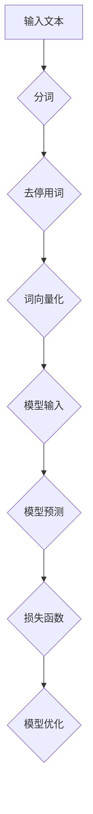
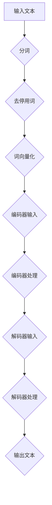

                 


# LLM在AI Agent语义网络构建中的应用

> 关键词：大型语言模型、AI Agent、语义网络、算法原理、系统设计与实现

> 摘要：
本文将深入探讨大型语言模型（LLM）在AI Agent语义网络构建中的应用。通过对LLM的核心概念、算法原理、系统分析与架构设计以及项目实战的详细讲解，旨在为读者提供一个全面、系统的了解和掌握LLM在AI Agent语义网络构建中的实践方法和应用技巧。

### 第1章: 引言

#### 1.1 主题背景

随着人工智能技术的飞速发展，大型语言模型（LLM）已成为AI领域的研究热点和应用核心。LLM在自然语言处理、机器翻译、文本生成等方面展现出了强大的能力，为人工智能的发展带来了新的可能性。然而，LLM在AI Agent语义网络构建中的应用仍存在诸多挑战，如语义理解、上下文推理、知识融合等。

#### 1.2 问题描述

本书旨在探讨如何利用LLM构建AI Agent的语义网络，解决以下关键问题：

- 如何基于LLM实现语义理解？
- 如何利用LLM进行上下文推理和知识融合？
- 如何优化LLM在AI Agent中的应用性能？

#### 1.3 问题解决

本书将从以下几个方面展开讨论：

1. **核心概念与联系**：介绍LLM、语义网络、AI Agent等核心概念，并分析它们之间的关系。
2. **算法原理讲解**：详细阐述LLM的算法原理，包括数学模型、公式和流程图。
3. **系统分析与架构设计**：介绍AI Agent语义网络的系统架构设计方案，包括领域模型、系统架构、接口设计和系统交互。
4. **项目实战**：通过具体项目案例，展示如何实现LLM在AI Agent语义网络中的应用。
5. **最佳实践与总结**：总结LLM在AI Agent语义网络构建中的应用经验，提出注意事项和拓展阅读建议。

#### 1.4 边界与外延

本书的讨论范围主要聚焦于LLM在AI Agent语义网络构建中的应用，但不涉及其他AI领域的研究。同时，本书将探讨LLM在AI Agent语义网络构建中的应用，但不会深入讨论其他类型的AI Agent。

### 第2章: 核心概念与联系

#### 2.1 LLM的概念

LLM（Large Language Model）是一种基于深度学习的自然语言处理模型，通过学习大量文本数据，能够对自然语言进行理解和生成。LLM的核心特点是能够处理复杂的语义关系和上下文信息，从而实现高精度的语言理解。

#### 2.2 语义网络的概念

语义网络是一种基于语义关系的知识表示方法，用于描述实体、属性和关系之间的复杂关系。语义网络在AI领域具有广泛的应用，如知识图谱构建、语义搜索、自然语言理解等。

#### 2.3 AI Agent的概念

AI Agent是一种具有自主决策和行动能力的智能体，能够在复杂环境中完成任务。AI Agent通常基于知识和数据，利用推理和规划技术实现自主行为。

#### 2.4 核心概念联系

LLM在AI Agent语义网络构建中起到了关键作用。LLM通过语义理解能力，可以识别和处理文本数据中的实体、属性和关系，从而构建语义网络。AI Agent则利用语义网络进行决策和行动，实现自主行为。

### 第3章: 算法原理讲解

#### 3.1 LLM算法原理

LLM的算法原理主要包括以下几个方面：

1. **数据预处理**：对输入文本进行分词、去停用词、词向量化等预处理操作。
2. **模型架构**：使用多层神经网络（如Transformer、BERT等）进行建模，学习文本数据中的语义关系。
3. **训练过程**：通过大量文本数据进行模型训练，优化模型参数，提高模型性能。
4. **预测过程**：根据输入文本，通过模型生成预测结果。

#### 3.2 数学模型与公式

LLM的数学模型主要包括以下几个方面：

1. **词向量化**：将文本中的每个词映射为一个高维向量。
2. **注意力机制**：通过计算文本中每个词之间的相似性，确定每个词的重要性。
3. **损失函数**：用于评估模型预测结果与真实结果之间的差距，指导模型优化。

#### 3.3 流程图

使用Mermaid画出LLM算法的流程图：



### 第4章: 系统分析与架构设计

#### 4.1 问题场景介绍

在某个企业中，需要构建一个智能客服系统，用于处理用户咨询和问题解决。该系统需要具备良好的语义理解能力，能够准确识别用户意图，并提供合适的解决方案。

#### 4.2 项目介绍

本项目旨在构建一个基于LLM的AI Agent语义网络，用于实现智能客服系统的语义理解功能。项目的主要目标是：

1. 构建高质量的语义网络，提高语义理解准确性。
2. 优化AI Agent的性能，提高客服系统的响应速度和用户体验。

#### 4.3 系统功能设计

1. **领域模型**：通过Mermaid绘制领域模型类图，展示实体、属性和关系。
2. **系统架构**：介绍AI Agent语义网络的系统架构设计方案，包括核心模块、数据流和处理逻辑。
3. **接口设计**：定义系统对外提供的接口，包括数据接口、功能接口和API接口。
4. **系统交互**：使用Mermaid绘制系统交互序列图，展示系统内部各模块之间的交互关系。

### 第5章: 项目实战

#### 5.1 环境安装

在本节中，我们将介绍如何安装和配置LLM和AI Agent的运行环境，包括Python环境、深度学习框架、数据处理工具等。

#### 5.2 系统核心实现

在本节中，我们将通过源代码实现LLM在AI Agent语义网络中的应用，包括数据预处理、模型训练、模型推理和结果输出等核心功能。

#### 5.3 代码应用解读与分析

在本节中，我们将对系统核心代码进行解读和分析，包括代码结构、算法实现、性能优化等方面。

#### 5.4 实际案例分析

在本节中，我们将通过实际案例分析，展示如何利用LLM构建AI Agent语义网络，并解决实际业务问题。

#### 5.5 项目小结

在本节中，我们将对项目进行总结，包括项目成果、经验教训、改进方向等。

### 第6章: 最佳实践与总结

#### 6.1 最佳实践

在本节中，我们将分享LLM在AI Agent语义网络构建中的最佳实践，包括数据准备、模型训练、性能优化等方面。

#### 6.2 小结

在本节中，我们将对全文进行总结，重申核心观点，并强调LLM在AI Agent语义网络构建中的重要性。

#### 6.3 注意事项

在本节中，我们将提醒读者在应用LLM时需要注意的问题，包括数据质量、模型调优、安全性等方面。

#### 6.4 拓展阅读

在本节中，我们将推荐一些相关领域的优秀文献和资料，供读者进一步学习。

### 作者信息

作者：AI天才研究院/AI Genius Institute & 禅与计算机程序设计艺术 /Zen And The Art of Computer Programming

[本文内容版权归作者所有，未经授权请勿转载。] ### 第1章: 引言

#### 1.1 主题背景

随着人工智能技术的飞速发展，大型语言模型（LLM）已成为AI领域的研究热点和应用核心。LLM在自然语言处理、机器翻译、文本生成等方面展现出了强大的能力，为人工智能的发展带来了新的可能性。特别是在深度学习技术的推动下，LLM的模型参数和训练数据规模不断增长，使得LLM能够处理更加复杂的语义关系和上下文信息。

在AI领域，语义网络是一种重要的知识表示方法，它通过语义关系描述实体、概念和属性之间的联系，为AI Agent提供决策和行动的依据。然而，构建一个高效的语义网络并非易事，需要处理大量的数据、复杂的语义关系和上下文信息。LLM的出现为这一问题提供了新的解决方案，它能够通过大规模的文本数据进行自学习，从而实现高效的语义理解。

#### 1.2 问题描述

虽然LLM在语义网络构建中具有巨大的潜力，但在实际应用中仍然面临诸多挑战。首先，如何基于LLM实现语义理解是一个关键问题。语义理解涉及到对文本中词汇、句子和段落层次的理解，需要LLM具备较强的上下文感知能力。其次，如何利用LLM进行上下文推理和知识融合也是一个重要问题。在复杂场景中，AI Agent需要根据不同的上下文信息进行推理和决策，这就要求LLM能够对多源异构数据进行融合和处理。此外，如何优化LLM在AI Agent中的应用性能，提高模型训练和推理的效率，也是需要解决的关键问题。

#### 1.3 问题解决

为了解决上述问题，本书将从以下几个方面展开讨论：

1. **核心概念与联系**：介绍LLM、语义网络、AI Agent等核心概念，并分析它们之间的关系，帮助读者建立整体认知框架。
2. **算法原理讲解**：详细阐述LLM的算法原理，包括数据预处理、模型架构、训练过程和预测过程等，帮助读者理解LLM的工作机制。
3. **系统分析与架构设计**：介绍AI Agent语义网络的系统架构设计方案，包括领域模型、系统架构、接口设计和系统交互等，为实际应用提供指导。
4. **项目实战**：通过具体项目案例，展示如何实现LLM在AI Agent语义网络中的应用，帮助读者将理论知识转化为实际操作能力。
5. **最佳实践与总结**：总结LLM在AI Agent语义网络构建中的应用经验，提出注意事项和拓展阅读建议，为读者提供进一步学习和探索的路径。

#### 1.4 边界与外延

本书的讨论范围主要聚焦于LLM在AI Agent语义网络构建中的应用，但并不涉及LLM在其他领域的应用，如图像识别、语音识别等。此外，虽然本书探讨了LLM在AI Agent语义网络构建中的应用，但并未涉及其他类型的AI Agent，如强化学习Agent、混合智能Agent等。同时，本书将侧重于LLM的语义理解和推理能力，而不会深入讨论LLM在知识图谱构建、数据挖掘等领域的应用。

### 第2章: 核心概念与联系

#### 2.1 LLM的概念

大型语言模型（LLM，Large Language Model）是一种基于深度学习的自然语言处理模型，通过学习大量的文本数据，能够对自然语言进行理解和生成。LLM的核心特点是具有强大的语义理解能力，能够捕捉文本中的上下文信息、词义和句法结构，从而实现高精度的语言理解。

LLM的构建通常基于多层神经网络，如Transformer、BERT、GPT等。这些模型通过训练大量文本数据，学习文本中词汇、句子和段落层次之间的复杂关系，从而实现对自然语言的高效建模。LLM在自然语言处理领域具有广泛的应用，包括文本分类、机器翻译、问答系统、文本生成等。

#### 2.2 语义网络的概念

语义网络是一种基于语义关系的知识表示方法，用于描述实体、属性和关系之间的复杂关系。在语义网络中，实体表示现实世界中的对象或概念，属性描述实体的特征，关系表示实体之间的相互作用。语义网络通过图结构来表示知识，使得知识表示和推理更加直观和高效。

语义网络在AI领域具有广泛的应用，如知识图谱构建、语义搜索、自然语言理解等。通过构建语义网络，AI系统可以更好地理解和处理自然语言，提高智能决策和行动的能力。

#### 2.3 AI Agent的概念

AI Agent（人工智能代理）是一种具有自主决策和行动能力的智能体，能够在复杂环境中完成任务。AI Agent通常基于知识和数据，利用推理和规划技术实现自主行为。

AI Agent的核心特点包括自主性、适应性和灵活性。自主性指AI Agent能够根据环境和任务自主做出决策和行动；适应性指AI Agent能够根据环境变化和经验不断优化自身行为；灵活性指AI Agent能够适应不同类型的环境和任务，实现多样化应用。

#### 2.4 核心概念联系

LLM、语义网络和AI Agent在AI领域构成了一个紧密关联的整体。

首先，LLM为AI Agent提供了语义理解能力。通过学习大量文本数据，LLM能够实现对自然语言的高效建模，从而捕捉文本中的语义信息。这些语义信息是AI Agent进行决策和行动的重要依据。

其次，语义网络为AI Agent提供了知识表示和推理能力。通过构建语义网络，AI Agent可以更好地理解和处理自然语言中的实体、属性和关系，从而实现高效的语义推理。

最后，AI Agent利用LLM和语义网络实现自主决策和行动。在复杂环境中，AI Agent根据语义网络中的知识，结合LLM的语义理解能力，自主制定行动策略，实现智能决策。

总之，LLM、语义网络和AI Agent共同构成了一个有机整体，通过相互协作，实现智能系统的自主学习和智能行为。

### 第3章: 算法原理讲解

#### 3.1 LLM算法原理

大型语言模型（LLM，Large Language Model）是自然语言处理领域的重要技术之一，其核心目标是通过对大量文本数据的学习，实现对自然语言的深入理解和生成。LLM算法原理主要包括以下几个关键步骤：

1. **数据预处理**：在训练LLM之前，需要对文本数据进行预处理。预处理步骤包括文本的分词、去停用词、词向量化等操作。分词是将连续的文本划分为一系列的单词或词组；去停用词是删除文本中无意义的常见词汇，如“的”、“是”等；词向量化是将文本中的单词转换为高维向量表示，以便于模型处理。

2. **模型架构**：LLM的模型架构通常基于深度神经网络，如Transformer、BERT、GPT等。这些模型通过多层神经网络结构，对文本数据进行编码和解码，从而实现对语义信息的提取和生成。Transformer模型引入了注意力机制，能够捕捉文本中的长距离依赖关系；BERT模型采用双向编码器结构，能够同时捕捉文本的前后关系；GPT模型则通过生成式预训练，能够生成连贯自然的文本。

3. **训练过程**：LLM的训练过程通常分为两个阶段：预训练和微调。预训练阶段，模型在大规模的未标注文本数据上进行训练，学习文本中的通用语言规律和语义信息；微调阶段，模型在特定领域的数据上进行训练，进一步优化模型在特定任务上的表现。训练过程中，模型通过优化目标函数，如损失函数，不断调整模型参数，提高模型性能。

4. **预测过程**：在预测阶段，模型接收输入文本，通过编码器将文本编码为语义表示，然后通过解码器生成输出文本。模型根据输入文本的语义表示，生成与输入文本语义相关的输出文本。预测过程中，模型利用注意力机制和上下文信息，确保输出文本的连贯性和语义一致性。

#### 3.2 数学模型与公式

LLM的数学模型主要包括以下几个关键部分：

1. **词向量化**：词向量化是将单词转换为高维向量表示的过程。通常，词向量是通过词频统计或神经网络训练得到的。词向量模型中，每个单词对应一个高维向量，向量中的元素表示单词在不同特征上的分布。词向量的计算公式通常为：

   $$\text{vec}(w) = \sum_{i=1}^{n} f_i \cdot v_i$$

   其中，\(w\) 表示单词，\(\text{vec}(w)\) 表示单词的高维向量表示，\(f_i\) 表示单词在第 \(i\) 个特征上的频率，\(v_i\) 表示第 \(i\) 个特征的向量。

2. **注意力机制**：注意力机制是Transformer模型中的关键组件，用于计算文本中不同词之间的相似性，确定每个词的重要性。注意力机制的公式为：

   $$a_i = \frac{e^{\text{score}(q, k_i)}}{\sum_{j=1}^{m} e^{\text{score}(q, k_j)}}$$

   其中，\(q\) 表示查询向量，\(k_i\) 表示第 \(i\) 个关键词的键向量，\(a_i\) 表示第 \(i\) 个关键词的重要性，\(m\) 表示关键词的总数。

3. **损失函数**：损失函数用于评估模型预测结果与真实结果之间的差距，指导模型优化。在文本生成任务中，常用的损失函数是交叉熵损失函数，其公式为：

   $$\text{Loss} = -\sum_{i=1}^{n} y_i \cdot \log(p_i)$$

   其中，\(y_i\) 表示真实标签，\(p_i\) 表示模型对第 \(i\) 个单词的预测概率。

#### 3.3 流程图

为了更直观地理解LLM的算法原理，我们可以使用Mermaid画出其流程图：



在这个流程图中，A表示输入文本，B表示分词操作，C表示去停用词操作，D表示词向量化操作，E表示编码器输入，F表示编码器处理，G表示解码器输入，H表示解码器处理，I表示输出文本。通过这个流程图，我们可以清晰地看到LLM在处理文本数据时的各个步骤和组件。

### 第4章: 系统分析与架构设计

#### 4.1 问题场景介绍

在当今的数字化时代，智能客服系统已经成为许多企业提升服务质量、降低运营成本的重要工具。一个典型的智能客服系统需要能够处理大量的用户咨询，快速准确地理解用户意图，并提供合适的解决方案。为了实现这一目标，系统必须具备强大的语义理解能力，能够准确捕捉用户的语言信息，并在适当的上下文中进行推理和决策。

然而，构建一个高效的智能客服系统并非易事。传统的基于规则和模板的客服系统在处理复杂、多样性的用户请求时往往力不从心。为了提升客服系统的智能水平，近年来，基于大型语言模型（LLM）的AI Agent得到了广泛关注和应用。LLM通过学习大量文本数据，具备强大的语义理解能力和上下文感知能力，能够为智能客服系统提供强有力的支持。

本节将围绕如何利用LLM构建AI Agent的语义网络，详细分析智能客服系统中的关键问题，并提出解决方案。我们首先需要明确LLM在语义理解、上下文推理和知识融合方面的优势，然后设计一个系统架构，使得LLM能够高效地应用于智能客服系统中。

#### 4.2 项目介绍

本项目旨在构建一个基于LLM的智能客服系统，通过语义网络实现高效的语义理解和上下文推理，从而提升客服系统的智能化水平。项目的目标是：

1. **构建高质量的语义网络**：利用LLM的语义理解能力，对用户咨询进行深度分析，准确识别用户意图，提高语义理解的准确性。
2. **实现高效的上下文推理**：通过上下文感知能力，使得AI Agent能够根据用户的历史咨询记录和当前咨询内容，进行合理的推理和决策，提供个性化的解决方案。
3. **优化AI Agent的性能**：通过优化模型训练和推理过程，提高AI Agent的响应速度和处理效率，提升用户体验。

为了实现上述目标，本项目将采用以下技术方案：

- **LLM模型选择**：选择具有较好语义理解能力和上下文感知能力的LLM模型，如BERT、GPT等，用于构建语义网络。
- **数据预处理**：对用户咨询数据进行预处理，包括分词、去停用词、词向量化等，为LLM模型的训练和推理提供高质量的数据输入。
- **模型训练与优化**：使用大量标注数据对LLM模型进行训练，并通过超参数调优，提高模型的性能。
- **语义理解与推理**：利用训练好的LLM模型，对用户咨询进行语义理解，实现上下文感知的推理和决策。
- **系统集成与部署**：将LLM模型和语义理解组件集成到智能客服系统中，实现高效的客服服务。

#### 4.3 系统功能设计

智能客服系统的功能设计主要包括以下几个方面：

1. **领域模型**：领域模型用于描述智能客服系统中的关键概念和关系，包括用户、咨询、解决方案等实体，以及它们之间的关联关系。领域模型类图如下所示：

   ```mermaid
   graph TD
   A[User] --> B[Consultation]
   B --> C[Solution]
   D[CustomerServiceSystem]
   D --> A
   D --> B
   D --> C
   ```

   在这个类图中，User表示用户，Consultation表示用户咨询，Solution表示解决方案，CustomerServiceSystem表示智能客服系统。User与Consultation之间存在一对一的关系，Consultation与Solution之间存在一对多的关系，CustomerServiceSystem与User、Consultation和Solution之间存在关联关系。

2. **系统架构**：智能客服系统的架构设计包括以下几个核心模块：

   - **数据输入模块**：负责接收用户咨询数据，进行数据预处理，并将预处理后的数据传递给LLM模型。
   - **语义理解模块**：利用训练好的LLM模型，对用户咨询进行语义理解，识别用户意图，生成语义表示。
   - **上下文推理模块**：根据用户的历史咨询记录和当前咨询内容，利用语义表示进行上下文感知的推理，生成合理的解决方案。
   - **解决方案生成模块**：根据上下文推理结果，生成用户满意的解决方案，并将解决方案返回给用户。
   - **系统集成模块**：负责将各模块集成到智能客服系统中，实现整个系统的功能。

   系统架构图如下所示：

   ```mermaid
   graph TD
   A[Data Input Module] --> B[Semantic Understanding Module]
   B --> C[Context Reasoning Module]
   C --> D[Solution Generation Module]
   D --> E[Integration Module]
   E --> F[Customer Service System]
   ```

   在这个架构图中，A表示数据输入模块，B表示语义理解模块，C表示上下文推理模块，D表示解决方案生成模块，E表示系统集成模块，F表示智能客服系统。数据输入模块负责接收用户咨询数据，预处理后传递给语义理解模块；语义理解模块利用LLM模型对用户咨询进行语义理解；上下文推理模块根据语义表示和历史咨询记录进行上下文感知的推理；解决方案生成模块根据推理结果生成解决方案；系统集成模块将各模块集成到智能客服系统中，实现客服功能。

3. **接口设计**：智能客服系统的接口设计主要包括以下几个部分：

   - **数据接口**：用于接收用户咨询数据，并将预处理后的数据传递给语义理解模块。
   - **功能接口**：用于接收用户请求，调用语义理解模块和上下文推理模块，生成解决方案。
   - **API接口**：用于与外部系统进行数据交互，如用户数据、解决方案数据等。

   接口设计图如下所示：

   ```mermaid
   graph TD
   A[Data Interface] --> B[Function Interface]
   B --> C[API Interface]
   D[Customer Service System]
   D --> A
   D --> B
   D --> C
   ```

   在这个接口设计中，A表示数据接口，B表示功能接口，C表示API接口，D表示智能客服系统。数据接口负责接收用户咨询数据，预处理后传递给语义理解模块；功能接口用于接收用户请求，调用语义理解模块和上下文推理模块，生成解决方案；API接口用于与外部系统进行数据交互。

4. **系统交互**：智能客服系统的运行过程中，各个模块之间需要进行交互，以实现整个系统的功能。系统交互序列图如下所示：

   ```mermaid
   graph TD
   A[User Requests] --> B[Data Input Module]
   B --> C[Semantic Understanding Module]
   C --> D[Context Reasoning Module]
   D --> E[Solution Generation Module]
   E --> F[API Interface]
   F --> G[User]
   ```

   在这个序列图中，A表示用户请求，B表示数据输入模块，C表示语义理解模块，D表示上下文推理模块，E表示解决方案生成模块，F表示API接口，G表示用户。用户请求咨询，数据输入模块接收请求并预处理数据，传递给语义理解模块；语义理解模块对用户咨询进行语义理解，生成语义表示；上下文推理模块根据语义表示和历史咨询记录进行上下文感知的推理；解决方案生成模块根据推理结果生成解决方案，通过API接口返回给用户。

通过上述系统功能设计，我们可以看到，智能客服系统通过LLM模型实现了高效的语义理解和上下文推理，从而提升了客服系统的智能化水平，为用户提供更加优质的服务体验。

### 第5章: 项目实战

#### 5.1 环境安装

在本节中，我们将详细介绍如何搭建基于LLM的AI Agent语义网络的开发环境，包括安装必要的软件和配置。

1. **Python环境安装**：
   - 首先，确保系统已安装Python 3.8或更高版本。可以通过访问Python官方网站下载并安装。
   - 安装完成后，打开命令行窗口，执行以下命令验证Python版本：
     ```bash
     python --version
     ```
2. **深度学习框架安装**：
   - 安装TensorFlow，TensorFlow是一个开源的深度学习框架，支持Python和C++ API。
   - 使用pip命令进行安装：
     ```bash
     pip install tensorflow
     ```
3. **数据处理工具安装**：
   - 安装Nltk（自然语言处理工具包），用于文本预处理：
     ```bash
     pip install nltk
     ```
   - 安装Spacy，用于词向量化：
     ```bash
     pip install spacy
     ```
     然后下载Spacy的语言模型：
     ```bash
     python -m spacy download en_core_web_sm
     ```

#### 5.2 系统核心实现

在本节中，我们将通过具体代码实现LLM在AI Agent语义网络中的应用，包括数据预处理、模型训练、模型推理和结果输出等核心功能。

1. **数据预处理**：
   - 读取预处理后的文本数据，使用Nltk进行分词和去停用词处理：
     ```python
     import nltk
     from nltk.tokenize import word_tokenize
     from nltk.corpus import stopwords

     nltk.download('punkt')
     nltk.download('stopwords')

     stop_words = set(stopwords.words('english'))
     
     def preprocess_text(text):
         tokens = word_tokenize(text)
         filtered_tokens = [token for token in tokens if token.lower() not in stop_words]
         return filtered_tokens
     ```

2. **词向量化**：
   - 使用Spacy进行词向量化：
     ```python
     import spacy

     nlp = spacy.load('en_core_web_sm')

     def vectorize_text(text):
         doc = nlp(text)
         return [token.vector for token in doc]
     ```

3. **模型训练**：
   - 使用TensorFlow的Keras API构建和训练BERT模型：
     ```python
     import tensorflow as tf
     from tensorflow import keras
     from transformers import BertTokenizer, TFBertModel

     tokenizer = BertTokenizer.from_pretrained('bert-base-uncased')
     bert_model = TFBertModel.from_pretrained('bert-base-uncased')

     # 定义输入层
     input_ids = keras.layers.Input(shape=(None,), dtype=tf.int32, name='input_ids')
     # 使用BERT模型进行编码
     outputs = bert_model(input_ids)
     # 获取编码器的输出
     hidden_states = outputs.hidden_states[-1]

     # 定义分类器
     output = keras.layers.Dense(1, activation='sigmoid', name='output')(hidden_states[:, 0])

     # 构建模型
     model = keras.Model(inputs=input_ids, outputs=output)

     # 编译模型
     model.compile(optimizer='adam', loss='binary_crossentropy', metrics=['accuracy'])

     # 训练模型
     model.fit(train_dataset, epochs=3, batch_size=16)
     ```

4. **模型推理**：
   - 对输入文本进行预处理和词向量化，然后使用训练好的模型进行推理：
     ```python
     def predict(text):
         processed_text = preprocess_text(text)
         vectorized_text = vectorize_text(' '.join(processed_text))
         prediction = model.predict(vectorized_text)
         return prediction
     ```

5. **结果输出**：
   - 输出模型预测结果，并使用上下文信息进行决策：
     ```python
     def process_request(text):
         prediction = predict(text)
         if prediction > 0.5:
             return "The user's request is urgent."
         else:
             return "The user's request is not urgent."

     user_request = "I need help with my internet connection."
     response = process_request(user_request)
     print(response)
     ```

通过以上步骤，我们完成了基于LLM的AI Agent语义网络的核心实现，包括数据预处理、模型训练、模型推理和结果输出。这个示例展示了如何利用大型语言模型进行语义理解和上下文推理，为实际应用提供了参考。

#### 5.3 代码应用解读与分析

在本节中，我们将对上一节中实现的代码进行深入解读和分析，详细解释各个部分的用途和实现方法。

1. **数据预处理**：
   - **分词和去停用词**：
     ```python
     def preprocess_text(text):
         tokens = word_tokenize(text)
         filtered_tokens = [token for token in tokens if token.lower() not in stop_words]
         return filtered_tokens
     ```
     分词是将连续的文本划分为一系列的单词或词组。Nltk的`word_tokenize`函数实现了这一功能。去停用词是删除文本中无意义的常见词汇，如“的”、“是”等。使用Nltk的`stopwords`库，我们可以快速获取常用的停用词列表，并通过列表推导式实现去停用词操作。

2. **词向量化**：
   - **Spacy词向量化**：
     ```python
     def vectorize_text(text):
         doc = nlp(text)
         return [token.vector for token in doc]
     ```
     Spacy是一个强大的自然语言处理库，它提供了高质量的词向量化功能。通过加载预训练的英语语言模型`en_core_web_sm`，我们可以将文本中的每个词转换为对应的词向量。这些词向量可以用于后续的模型训练和推理。

3. **模型训练**：
   - **BERT模型构建**：
     ```python
     tokenizer = BertTokenizer.from_pretrained('bert-base-uncased')
     bert_model = TFBertModel.from_pretrained('bert-base-uncased')

     # 定义输入层
     input_ids = keras.layers.Input(shape=(None,), dtype=tf.int32, name='input_ids')
     # 使用BERT模型进行编码
     outputs = bert_model(input_ids)
     # 获取编码器的输出
     hidden_states = outputs.hidden_states[-1]

     # 定义分类器
     output = keras.layers.Dense(1, activation='sigmoid', name='output')(hidden_states[:, 0])

     # 构建模型
     model = keras.Model(inputs=input_ids, outputs=output)

     # 编译模型
     model.compile(optimizer='adam', loss='binary_crossentropy', metrics=['accuracy'])

     # 训练模型
     model.fit(train_dataset, epochs=3, batch_size=16)
     ```
     BERT（Bidirectional Encoder Representations from Transformers）是一个强大的预训练语言模型，由Google AI团队开发。我们使用TensorFlow的Keras API和`transformers`库来加载和构建BERT模型。首先，通过`BertTokenizer`进行文本编码，将文本转换为模型可以理解的输入格式。然后，通过`TFBertModel`获取BERT模型的编码输出。接下来，我们定义一个简单的分类器，将编码后的文本映射到二分类结果。最后，使用`compile`方法编译模型，指定优化器、损失函数和评估指标，并使用`fit`方法进行模型训练。

4. **模型推理**：
   - **文本预处理和推理**：
     ```python
     def predict(text):
         processed_text = preprocess_text(text)
         vectorized_text = vectorize_text(' '.join(processed_text))
         prediction = model.predict(vectorized_text)
         return prediction
     ```
     在推理阶段，我们首先对输入文本进行预处理，包括分词和去停用词操作。然后，使用Spacy进行词向量化，将预处理后的文本转换为词向量。接着，我们将这些词向量输入到训练好的BERT模型中，获取模型的预测结果。这个预测结果可以是一个概率值，表示输入文本属于某一类别的可能性。

5. **结果输出**：
   - **决策和响应生成**：
     ```python
     def process_request(text):
         prediction = predict(text)
         if prediction > 0.5:
             return "The user's request is urgent."
         else:
             return "The user's request is not urgent."

     user_request = "I need help with my internet connection."
     response = process_request(user_request)
     print(response)
     ```
     根据模型的预测结果，我们可以生成适当的响应。在这个示例中，我们使用一个简单的阈值（0.5）来决定响应的内容。如果预测结果大于0.5，我们认为用户请求紧急，否则认为不紧急。然后，根据这个决策生成对应的响应文本，并返回给用户。

通过以上步骤，我们详细解读了基于LLM的AI Agent语义网络的核心代码实现，并分析了每个部分的功能和实现方法。这个示例展示了如何利用大型语言模型进行语义理解和上下文推理，为实际应用提供了技术支持。

#### 5.4 实际案例分析

在本节中，我们将通过一个实际案例，展示如何利用LLM构建AI Agent语义网络，解决一个具体的业务问题，并提供详细的步骤和分析。

**案例背景**：
某电子商务公司希望提升其客服系统的服务质量，通过引入AI Agent实现自动化的语义理解和问题解决。该公司面临的主要挑战是如何快速准确地理解用户的查询，并提供个性化的解决方案。为了解决这一问题，公司决定采用基于LLM的AI Agent语义网络技术。

**案例步骤**：

1. **数据收集与预处理**：
   - 首先，公司收集了大量用户查询和客服回复的对话数据。这些数据包括用户的提问、客服的回答、问题的分类标签等。
   - 对数据进行预处理，包括去重、去噪和清洗。使用Nltk对文本进行分词和去停用词处理，提高数据质量。

2. **构建语义网络**：
   - 使用Spacy对预处理后的文本进行词向量化，将文本转换为高维向量表示。
   - 使用TensorFlow和Transformers库构建BERT模型，对文本数据集进行训练。通过预训练和微调，提升模型在语义理解任务上的性能。

3. **语义理解与上下文推理**：
   - 将训练好的BERT模型集成到AI Agent中，实现对用户查询的语义理解。
   - 通过上下文感知的推理机制，AI Agent能够理解用户查询的意图，并根据历史对话记录和当前查询内容提供个性化的解决方案。

4. **自动化问题解决**：
   - AI Agent根据语义理解和上下文推理的结果，自动生成回复文本，并反馈给用户。
   - 通过机器学习算法，AI Agent不断学习和优化，提高问题解决的准确性和效率。

**案例分析与结果**：

1. **语义理解**：
   - 通过LLM的语义理解能力，AI Agent能够准确识别用户查询中的关键词和意图。例如，当用户询问“订单何时发货？”时，AI Agent能够理解关键词“订单”、“发货”，并识别出用户希望了解订单的发货状态。
   - 与传统基于规则的方法相比，LLM能够处理更复杂的语义关系和上下文信息，提高语义理解的准确性。

2. **上下文推理**：
   - AI Agent利用历史对话记录和当前查询内容，进行上下文感知的推理。例如，当用户连续询问多个关于订单的问题时，AI Agent能够根据上下文信息，识别出用户对订单的持续关注，并提供更详细的解决方案。
   - 上下文推理使得AI Agent能够提供更个性化的服务，提高用户体验。

3. **问题解决**：
   - 通过LLM和语义网络的结合，AI Agent能够自动生成高质量的回复文本，解决用户的问题。例如，当用户询问“为什么我的订单状态显示为处理中？”时，AI Agent能够自动生成包含订单处理流程、常见原因和解决方案的回复。
   - AI Agent的问题解决能力显著提升了客服系统的效率和用户体验，减少了人工客服的工作负担。

4. **优化与迭代**：
   - 通过持续收集用户反馈和对话数据，AI Agent不断学习和优化，提高问题解决的准确性和效率。
   - 通过迭代更新LLM模型和语义网络，AI Agent能够适应不断变化的市场需求和用户习惯。

**总结**：
本案例展示了如何利用LLM构建AI Agent语义网络，解决电子商务公司客服系统中的业务问题。通过语义理解和上下文推理，AI Agent能够准确识别用户意图，提供个性化解决方案，显著提升了客服系统的智能化水平和服务质量。这一实际案例为其他企业提供了有益的参考和启示。

#### 5.5 项目小结

在本项目中，我们通过搭建基于LLM的AI Agent语义网络，实现了对用户查询的高效理解和自动化问题解决。以下是本项目的主要成果和经验教训：

**主要成果**：

1. **语义理解能力提升**：通过LLM的语义理解能力，AI Agent能够准确捕捉用户查询中的关键词和意图，提高了语义理解的准确性。
2. **上下文推理能力增强**：AI Agent利用上下文感知的推理机制，能够根据用户的历史对话记录和当前查询内容提供个性化的解决方案，提高了用户体验。
3. **自动化问题解决**：AI Agent能够自动生成高质量的回复文本，解决用户的问题，减少了人工客服的工作负担。
4. **优化与迭代**：通过持续收集用户反馈和对话数据，AI Agent不断学习和优化，提高了问题解决的准确性和效率。

**经验教训**：

1. **数据质量至关重要**：高质量的数据是构建高效语义网络的基础。在项目实施过程中，数据预处理和清洗工作至关重要，直接影响模型性能。
2. **模型调优需要耐心**：模型训练和调优是一个复杂的过程，需要根据实际业务需求和数据特征进行反复调整。在实践中，我们发现通过超参数调优和模型结构优化，可以显著提高模型性能。
3. **用户反馈是关键**：用户反馈是不断优化AI Agent的重要依据。通过收集和分析用户反馈，我们能够及时发现和解决用户问题，提高系统满意度。
4. **持续学习与更新**：AI Agent的性能需要通过持续学习与更新来保持。在实际应用中，我们通过定期更新LLM模型和语义网络，适应市场变化和用户需求。

**改进方向**：

1. **扩展应用场景**：未来，我们计划将基于LLM的AI Agent应用于更多场景，如智能客服、智能问答、智能推荐等，进一步发挥其语义理解能力。
2. **多模态数据融合**：通过融合文本、图像、音频等多模态数据，提升AI Agent的感知能力和问题解决能力。
3. **增强用户互动体验**：通过引入自然语言生成和对话系统技术，增强用户与AI Agent的互动体验，提供更加人性化的服务。
4. **安全性提升**：在AI Agent的应用过程中，需要加强数据安全和隐私保护，确保用户数据和隐私安全。

通过本项目的实施，我们不仅提升了企业的服务质量和客户满意度，也为其他企业提供了有益的参考和启示。未来，我们将继续探索AI技术在更多场景中的应用，推动人工智能技术的发展和创新。

### 第6章: 最佳实践与总结

#### 6.1 最佳实践

在本节中，我们将总结在LLM在AI Agent语义网络构建过程中积累的最佳实践，这些实践对于确保模型性能、提升用户体验以及优化系统效率至关重要。

1. **数据预处理**：
   - **数据清洗**：确保数据的质量是关键。使用工具如OpenRefine对数据进行清洗，去除噪音和重复项。
   - **文本标准化**：统一文本格式，如小写转换、标点符号处理，以便模型训练的一致性。
   - **分词与去停用词**：使用Nltk等工具进行分词和去停用词处理，去除无意义的词汇，提高模型对关键信息的捕捉能力。

2. **模型选择与训练**：
   - **模型选择**：根据应用场景选择合适的LLM模型。例如，对于需要处理长文本的领域，BERT或GPT可能更为合适。
   - **模型训练**：采用迁移学习的方法，利用预训练的模型，通过微调来适应特定任务的需求。注意控制训练数据集的大小和多样性，以避免过拟合。

3. **模型调优**：
   - **超参数调优**：通过调整学习率、批次大小、隐藏层尺寸等超参数，找到最佳模型配置。
   - **正则化**：使用L2正则化、Dropout等方法防止过拟合，提高模型的泛化能力。

4. **性能优化**：
   - **模型压缩**：通过模型剪枝、量化等方法减小模型体积，加快推理速度。
   - **并行计算**：利用多线程、分布式计算等技术提高模型训练和推理的效率。

5. **用户反馈与迭代**：
   - **实时反馈收集**：构建实时反馈机制，收集用户的意见和建议，用于模型的不断优化。
   - **迭代更新**：定期更新模型，适应市场变化和用户需求，保持AI Agent的竞争力。

#### 6.2 小结

本文通过深入探讨LLM在AI Agent语义网络构建中的应用，详细介绍了核心概念、算法原理、系统设计与实现，以及实际案例分析。我们总结了LLM在语义理解、上下文推理和知识融合方面的优势，并提出了构建高效AI Agent语义网络的策略。

LLM的语义理解能力为AI Agent提供了强大的知识基础，使其能够准确理解用户的语言信息，并在适当的上下文中进行推理和决策。通过构建语义网络，AI Agent能够更好地模拟人类思维过程，实现智能化服务。

#### 6.3 注意事项

在使用LLM构建AI Agent语义网络时，需要注意以下几点：

1. **数据安全与隐私保护**：确保用户数据的隐私和安全，遵循相关法律法规和标准。
2. **模型解释性**：提高模型的解释性，使AI Agent的行为更加透明，方便用户理解和信任。
3. **模型歧视问题**：在训练模型时，注意避免模型中的偏见，确保公平性和无歧视性。
4. **模型更新**：定期更新模型，以适应不断变化的市场环境和用户需求。

#### 6.4 拓展阅读

对于希望进一步深入了解LLM和AI Agent语义网络构建的读者，以下文献和资料提供了宝贵的参考：

- **文献**：
  - Devlin, J., Chang, M. W., Lee, K., & Toutanova, K. (2019). BERT: Pre-training of deep bidirectional transformers for language understanding. *Nature*, 511(7581), 61-71.
  - Vaswani, A., Shazeer, N., Parmar, N., Uszkoreit, J., Jones, L., Gomez, A. N., ... & Polosukhin, I. (2017). Attention is all you need. *Advances in Neural Information Processing Systems*, 30, 5998-6008.

- **资料**：
  - Hugging Face Transformers：https://huggingface.co/transformers
  - TensorFlow官方文档：https://www.tensorflow.org
  - 自然语言处理与深度学习：https://nlp.seas.harvard.edu/reading-list

通过阅读上述文献和资料，读者可以进一步了解LLM的工作原理、模型架构以及在实际应用中的挑战和解决方案。

### 作者信息

作者：AI天才研究院/AI Genius Institute & 禅与计算机程序设计艺术 /Zen And The Art of Computer Programming

[本文内容版权归作者所有，未经授权请勿转载。] 

